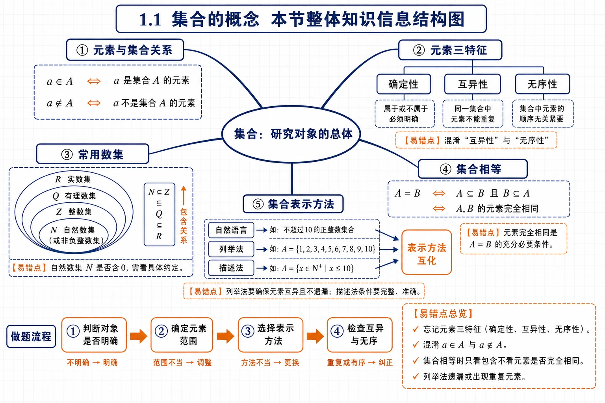
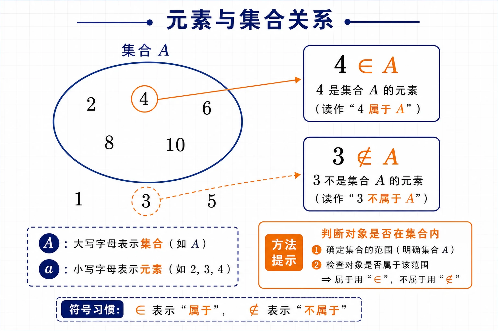
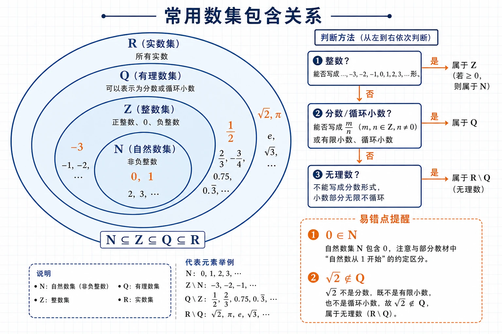
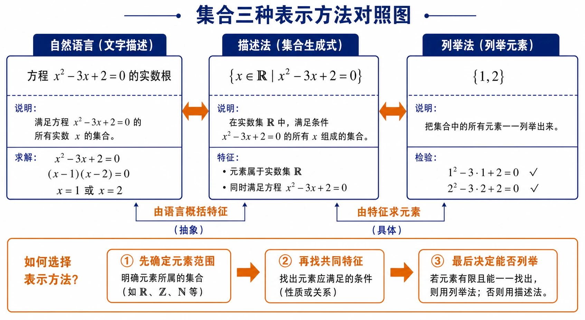
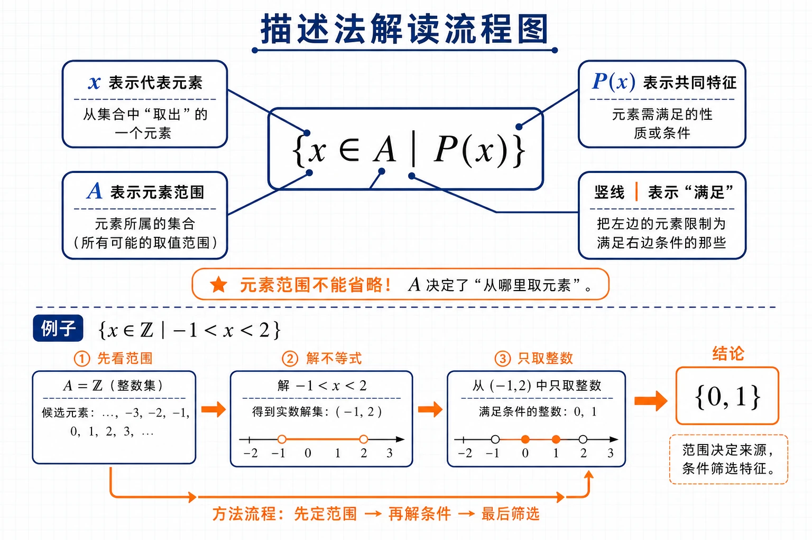

# 1.1 集合的概念：核心知识点讲解


<!-- 图片描述：绘制“1.1 集合的概念 本节整体知识信息结构图”，中心节点为“集合：研究对象的总体”，向外分出五个主分支：元素与集合关系、元素三特征、常用数集、集合相等、集合表示方法。元素与集合关系分支标注 $a\in A$、$a\notin A$；元素三特征分支用三个小框列出“确定性、互异性、无序性”；常用数集分支画出 $\mathbb{N}\subseteq\mathbb{Z}\subseteq\mathbb{Q}\subseteq\mathbb{R}$ 的层级；表示方法分支列出自然语言、列举法、描述法，并用箭头指向“表示方法互化”。底部加入做题流程“判断对象是否明确 -> 确定元素范围 -> 选择表示方法 -> 检查互异与无序”。采用白色或浅网格背景、深蓝线条、橙色突出关键判断步骤和易错点，符号为 LaTeX 风格。 -->

## 本节学习目标

学完本节，需要掌握：

- 什么是集合，什么是元素。
- 集合中元素的三个特征：确定性、互异性、无序性。
- 如何判断一个对象是否属于某个集合。
- 常用数集 $\mathbb{N},\mathbb{Z},\mathbb{Q},\mathbb{R}$ 的含义。
- 如何用自然语言、列举法、描述法表示集合。
- 如何在不同表示方法之间转换。

这一节是整章的入口。简单说，集合就是“把研究对象装进一个清楚的范围里”。后面学函数、方程、不等式、概率时，都会反复用到集合语言。

## 核心知识点讲解

### 1. 集合与元素

数学中，我们把研究对象统称为**元素**，把一些元素组成的总体叫做**集合**。

例如：

- $1$ 到 $10$ 之间的所有偶数可以组成一个集合，其中元素是 $2,4,6,8,10$。
- 某校今年入学的全体高一学生可以组成一个集合，其中元素是每一位高一新生。
- 方程 $x^2-3x+2=0$ 的所有实数根可以组成一个集合，其中元素是 $1,2$。

通常：

- 用大写字母 $A,B,C,\ldots$ 表示集合。
- 用小写字母 $a,b,c,\ldots$ 表示元素。

### 2. 元素与集合的关系

如果 $a$ 是集合 $A$ 的元素，就说 $a$ 属于集合 $A$，记作：

$$
a\in A.
$$

如果 $a$ 不是集合 $A$ 的元素，就说 $a$ 不属于集合 $A$，记作：

$$
a\notin A.
$$

例如，设

$$
A=\{2,4,6,8,10\},
$$

则：

$$
4\in A,\qquad 3\notin A.
$$


<!-- 图片描述：绘制“元素与集合关系”示意图，左侧用封闭椭圆表示集合 $A$，椭圆内放置元素 $2,4,6,8,10$，椭圆外放置 $1,3,5$；用箭头和标签展示 $4\in A$、$3\notin A$。图中同时标出“大写字母表示集合、小写字母表示元素”的符号习惯，采用白色或浅网格背景、深蓝椭圆和箭头、橙色突出 $\in$ 与 $\notin$，符合数学课堂板书风格。 -->

### 3. 集合中元素的三个特征

#### 确定性

给定一个集合后，一个对象是否属于这个集合必须能明确判断。

例如：

- “$1$ 到 $10$ 之间的所有偶数”能组成集合，因为每个数是否属于它可以明确判断。
- “比较小的数”不能组成集合，因为“比较小”没有明确标准。

判断一个对象能否组成集合，第一步就看它是否具有确定性。

#### 互异性

集合中的元素不能重复出现。即使写了多次，也只算一个元素。

例如：

$$
\{1,1,2,2,3\}=\{1,2,3\}.
$$

#### 无序性

集合只关心有哪些元素，不关心元素写出的顺序。

例如：

$$
\{1,2,3\}=\{3,2,1\}.
$$

所以判断两个集合是否相等，只看元素是否完全相同。

### 4. 常用数集

高中数学中经常出现下面几个数集：

| 数集 | 含义 | 记号 |
|---|---|---|
| 自然数集 / 非负整数集 | $0,1,2,3,\ldots$ | $\mathbb{N}$ |
| 正整数集 | $1,2,3,\ldots$ | $\mathbb{N}^*$ 或 $\mathbb{N}_+$ |
| 整数集 | 全体整数 | $\mathbb{Z}$ |
| 有理数集 | 全体有理数 | $\mathbb{Q}$ |
| 实数集 | 全体实数 | $\mathbb{R}$ |

常见关系：

$$
\mathbb{N}\subseteq\mathbb{Z}\subseteq\mathbb{Q}\subseteq\mathbb{R}.
$$


<!-- 图片描述：绘制“常用数集包含关系”层级图，用同心椭圆或层级嵌套展示 $\mathbb{N}$ 在最内层，外层依次为 $\mathbb{Z}$、$\mathbb{Q}$、$\mathbb{R}$；在各区域放入代表元素，如 $0,1$ 在 $\mathbb{N}$，$-3$ 在 $\mathbb{Z}$，$\frac12$ 在 $\mathbb{Q}$，$\sqrt2,\pi$ 在 $\mathbb{R}\setminus\mathbb{Q}$。右侧列出判断方法“整数? 分数/循环小数? 无理数?”并用橙色标出 $0\in\mathbb{N}$ 和 $\sqrt2\notin\mathbb{Q}$ 两个易错点。浅网格背景、深蓝嵌套边界、橙色重点标注。 -->

注意：

- $0\in\mathbb{N}$。
- $-3\notin\mathbb{N}$，但 $-3\in\mathbb{Z}$。
- $\sqrt{2}\notin\mathbb{Q}$，但 $\sqrt{2}\in\mathbb{R}$。
- $\pi\notin\mathbb{Q}$，但 $\pi\in\mathbb{R}$。

### 5. 集合相等

如果两个集合的元素完全相同，就称这两个集合相等，记作：

$$
A=B.
$$

例如：

$$
\{1,2\}=\{2,1\}.
$$

再如：

$$
\{x\mid x^2-3x+2=0\}=\{1,2\}.
$$

因为方程 $x^2-3x+2=0$ 的两个根就是 $1$ 和 $2$。

### 6. 集合的表示方法

#### 自然语言表示法

直接用文字描述集合。

例如：

```text
小于 10 的所有自然数组成的集合
```

优点是容易理解，缺点是不够简洁。

#### 列举法

把集合中的元素一一列举出来，并用花括号括起来。

例如，小于 $10$ 的所有自然数组成的集合可以写成：

$$
\{0,1,2,3,4,5,6,7,8,9\}.
$$

方程 $x^2=x$ 的所有实数根组成的集合可以写成：

$$
\{0,1\}.
$$

列举法适合元素个数有限，或者元素规律很清楚的集合。


<!-- 图片描述：绘制“集合三种表示方法”对照图，左侧为自然语言“方程 $x^2-3x+2=0$ 的实数根”，中间为描述法 $\{x\in\mathbb{R}\mid x^2-3x+2=0\}$，右侧为列举法 $\{1,2\}$，三栏之间用双向箭头连接；底部用橙色提示“先确定元素范围，再找共同特征，最后决定能否列举”。风格为浅网格背景、深蓝线框、LaTeX 风格公式。 -->

#### 描述法

用集合中元素的共同特征来表示集合。

一般形式：

$$
\{x\in A\mid P(x)\}.
$$

其中：

- $x$ 是集合中的代表元素。
- $A$ 是元素所在的范围。
- $P(x)$ 是元素满足的条件。
- $\mid$ 读作“使得”或“满足”。

例如，不等式 $x-7<3$ 的解集可以写成：

$$
\{x\in\mathbb{R}\mid x<10\}.
$$

奇数集可以写成：

$$
\{x\in\mathbb{Z}\mid x=2k+1,\ k\in\mathbb{Z}\}.
$$

有理数集可以写成：

$$
\mathbb{Q}=\left\{x\in\mathbb{R}\mid x=\frac{p}{q},\ p,q\in\mathbb{Z},\ q\ne 0\right\}.
$$

描述法也可以写成：

$$
\{x\in A:P(x)\},\qquad \{x\in A;P(x)\}.
$$

本章中最推荐掌握的标准写法是：

$$
\{x\in A\mid P(x)\}.
$$


<!-- 图片描述：绘制“描述法解读流程图”，以 $\{x\in A\mid P(x)\}$ 为中心公式，拆成四个标注气泡：$x$ 表示代表元素，$A$ 表示元素范围，竖线表示“满足”，$P(x)$ 表示共同特征。下方用例子 $\{x\in\mathbb{Z}\mid -1<x<2\}$ 经过“先看范围 $\mathbb{Z}$ -> 解不等式 -> 只取整数”得到 $\{0,1\}$。用箭头表现方法流程，橙色突出“元素范围不能省略”。 -->

## 重点梳理

### 重点 1：判断能否组成集合

判断标准是：对象是否明确。

能组成集合：

- $1$ 到 $10$ 之间的所有偶数。
- 某班全体学生。
- 方程 $x^2-3x+2=0$ 的所有实数根。
- 平面内到定点距离等于定长的所有点。

不能组成集合：

- 比较大的数。
- 高个子学生。
- 游泳能手。
- 好看的图形。

这些说法的问题是标准不确定，不同人可能有不同判断。

### 重点 2：列举法与描述法的选择

| 情况 | 推荐方法 |
|---|---|
| 元素较少且可以全部列出 | 列举法 |
| 元素很多或无限多个 | 描述法 |
| 需要强调元素共同特征 | 描述法 |
| 需要直观看到所有元素 | 列举法 |

例如：

$$
\{x\in\mathbb{Z}\mid 10<x<20\}
$$

也可以用列举法写成：

$$
\{11,12,13,14,15,16,17,18,19\}.
$$

但

$$
\{x\in\mathbb{R}\mid x<10\}
$$

不能用有限列举法写完，因为满足条件的实数有无限多个。

### 重点 3：描述法要写清楚范围

描述法的关键是“范围 + 条件”。

例如：

$$
\{x\in\mathbb{Z}\mid 10<x<20\}
$$

表示大于 $10$ 且小于 $20$ 的整数。

而

$$
\{x\in\mathbb{R}\mid 10<x<20\}
$$

表示大于 $10$ 且小于 $20$ 的实数。

两者完全不同。一个是有限集合，一个是无限集合。

## 难点突破

### 难点 1：为什么“比较小的数”不能组成集合

因为“比较小”没有统一标准。

例如 $100$：

- 和 $10000$ 比，$100$ 比较小。
- 和 $1$ 比，$100$ 比较大。

所以不能明确判断 $100$ 是否属于“比较小的数”这个整体，因此它不能组成集合。

### 难点 2：描述法中的变量只是代表元素

集合

$$
\{x\in\mathbb{R}\mid x<10\}
$$

和

$$
\{t\in\mathbb{R}\mid t<10\}
$$

表示同一个集合。

这里 $x$ 和 $t$ 都只是“代表元素”的名字，真正重要的是范围 $\mathbb{R}$ 和条件“小于 $10$”。

### 难点 3：同一个集合可以有多种表示方法

例如方程 $x^2-3x+2=0$ 的所有实数根组成的集合，可以表示为：

自然语言：

```text
方程 x^2-3x+2=0 的所有实数根组成的集合
```

描述法：

$$
\{x\in\mathbb{R}\mid x^2-3x+2=0\}
$$

列举法：

$$
\{1,2\}.
$$

三种表示方法不同，但表示的是同一个集合。

## 例题讲解

### 例题 1：判断下列对象能否组成集合

判断下列对象的全体是否能组成集合，并说明理由。

1. $1$ 到 $10$ 之间的所有偶数。
2. 高一年级中身高较高的学生。
3. 方程 $x^2-3x+2=0$ 的所有实数根。
4. 平面内与两个定点 $A,B$ 距离相等的点。

解析：

1. 能。因为每个数是否是 $1$ 到 $10$ 之间的偶数可以明确判断。
2. 不能。因为“身高较高”没有明确标准。
3. 能。方程的实数根是确定的。
4. 能。平面内任意一点是否满足 $PA=PB$ 可以明确判断。

答案：

1. 能组成集合。
2. 不能组成集合。
3. 能组成集合。
4. 能组成集合。

### 例题 2：用符号 $\in$ 或 $\notin$ 填空

填空：

$$
0\ \underline{\qquad}\ \mathbb{N},\qquad
-3\ \underline{\qquad}\ \mathbb{N},\qquad
0.5\ \underline{\qquad}\ \mathbb{Z},\qquad
\sqrt{2}\ \underline{\qquad}\ \mathbb{Q},\qquad
\pi\ \underline{\qquad}\ \mathbb{R}.
$$

解析：

- $0$ 是自然数，所以 $0\in\mathbb{N}$。
- $-3$ 不是自然数，所以 $-3\notin\mathbb{N}$。
- $0.5$ 不是整数，所以 $0.5\notin\mathbb{Z}$。
- $\sqrt{2}$ 是无理数，不是有理数，所以 $\sqrt{2}\notin\mathbb{Q}$。
- $\pi$ 是实数，所以 $\pi\in\mathbb{R}$。

答案：

$$
0\in\mathbb{N},\qquad
-3\notin\mathbb{N},\qquad
0.5\notin\mathbb{Z},\qquad
\sqrt{2}\notin\mathbb{Q},\qquad
\pi\in\mathbb{R}.
$$

### 例题 3：用列举法表示集合

用列举法表示下列集合：

1. 小于 $10$ 的所有自然数组成的集合 $A$。
2. 方程 $x^2=x$ 的所有实数根组成的集合 $B$。

解析：

1. 小于 $10$ 的自然数包括 $0,1,2,\ldots,9$。
2. 解方程：

$$
x^2=x
$$

移项得：

$$
x^2-x=0.
$$

因式分解：

$$
x(x-1)=0.
$$

所以：

$$
x=0\quad \text{或}\quad x=1.
$$

答案：

$$
A=\{0,1,2,3,4,5,6,7,8,9\},
$$

$$
B=\{0,1\}.
$$

### 例题 4：分别用描述法和列举法表示集合

分别用描述法和列举法表示下列集合：

1. 方程 $x^2-2=0$ 的所有实数根组成的集合 $A$。
2. 大于 $10$ 且小于 $20$ 的所有整数组成的集合 $B$。

解析：

第 1 题：

用描述法表示为：

$$
A=\{x\in\mathbb{R}\mid x^2-2=0\}.
$$

解方程：

$$
x^2=2,
$$

所以：

$$
x=\sqrt{2}\quad \text{或}\quad x=-\sqrt{2}.
$$

用列举法表示为：

$$
A=\{\sqrt{2},-\sqrt{2}\}.
$$

第 2 题：

用描述法表示为：

$$
B=\{x\in\mathbb{Z}\mid 10<x<20\}.
$$

大于 $10$ 且小于 $20$ 的整数有：

$$
11,12,13,14,15,16,17,18,19.
$$

用列举法表示为：

$$
B=\{11,12,13,14,15,16,17,18,19\}.
$$

### 例题 5：判断两个集合是否相等

判断下列两个集合是否相等：

$$
A=\{0,1\},\qquad B=\{x\in\mathbb{R}\mid x^2=x\}.
$$

解析：

解方程：

$$
x^2=x.
$$

即：

$$
x(x-1)=0.
$$

所以：

$$
x=0\quad \text{或}\quad x=1.
$$

因此：

$$
B=\{0,1\}.
$$

所以：

$$
A=B.
$$

## 易错点整理

### 易错点 1：把不确定对象当成集合

错误说法：

```text
高个子学生组成一个集合。
```

问题：“高个子”没有明确标准。

改法：

```text
身高不低于 180 cm 的学生组成一个集合。
```

这样就具有确定性。

### 易错点 2：忘记自然数集包含 0

在本教材中，自然数集 $\mathbb{N}$ 是非负整数集：

$$
\mathbb{N}=\{0,1,2,3,\ldots\}.
$$

所以：

$$
0\in\mathbb{N}.
$$

### 易错点 3：列举法漏写花括号

错误：

$$
A=1,2,3.
$$

正确：

$$
A=\{1,2,3\}.
$$

集合必须用花括号表示。

### 易错点 4：描述法漏写元素范围

不够严谨：

$$
\{x\mid x^2=2\}.
$$

更清楚：

$$
\{x\in\mathbb{R}\mid x^2=2\}.
$$

如果研究范围不明确，最好写出 $x\in\mathbb{R}$、$x\in\mathbb{Z}$ 等。

### 易错点 5：把 $\sqrt{2}$ 当成有理数

有理数可以写成两个整数之比：

$$
\frac{p}{q}\quad (p,q\in\mathbb{Z},\ q\ne 0).
$$

$\sqrt{2}$ 不能写成这种形式，所以：

$$
\sqrt{2}\notin\mathbb{Q}.
$$

但：

$$
\sqrt{2}\in\mathbb{R}.
$$

### 易错点 6：忽视集合的互异性和无序性

例如：

$$
\{1,2,2,3\}=\{3,2,1\}.
$$

原因是重复元素只算一次，顺序不影响集合。

## 考点考证点整理

### 考点 1：判断是否能组成集合

常见问法：

```text
下列对象的全体能否组成集合？为什么？
```

答题关键词：

```text
能否明确判断每个对象是否属于这个整体。
```

### 考点 2：判断元素与集合的关系

常见问法：

```text
用 \in 或 \notin 填空。
```

重点掌握：

$$
0\in\mathbb{N},\quad -1\in\mathbb{Z},\quad \frac{1}{2}\in\mathbb{Q},\quad \sqrt{2}\notin\mathbb{Q},\quad \pi\in\mathbb{R}.
$$

### 考点 3：列举法与描述法互化

常见问法：

```text
用列举法表示下列集合。
用描述法表示下列集合。
把下列集合用另一种方法表示。
```

解题步骤：

1. 先看元素范围，是自然数、整数、实数还是其他对象。
2. 再找共同条件。
3. 如果元素有限且容易列出，就列举。
4. 如果元素无限或不容易列完，就用描述法。

### 考点 4：集合相等

常见问法：

```text
判断两个集合是否相等。
```

判断标准：

```text
元素完全相同，则集合相等。
```

顺序不同、重复写出，都不影响集合相等。

### 考点 5：由方程、不等式写集合

常见形式：

$$
\{x\in\mathbb{R}\mid x^2-3x+2=0\},
$$

$$
\{x\in\mathbb{Z}\mid -3<2x-1<3\}.
$$

做题要点：

- 方程类：先解方程，再写成集合。
- 不等式类：先解不等式，再注意元素范围。
- 范围是 $\mathbb{Z}$ 时，只能取整数。

### 新版考点补充一：集合能否成立的判断

- 出题思路：常给出一组对象，如“较小的数”“游泳能手”“到两定点距离相等的点”，要求判断能否组成集合并说明理由。
- 关键条件：对象是否有明确判定标准，任意一个对象能否确定地回答“属于”或“不属于”。
- 解答要点：先写“能/不能组成集合”，再用“元素具有确定性”解释；能组成集合时要指出元素是什么。
- 易扣分点：只凭生活感觉判断，不写“确定性”；把“范围模糊”的对象误判为集合。

### 新版考点补充二：集合表示方法互化

- 出题思路：在列举法、描述法、自然语言之间转换，常结合方程根、不等式解集、有限整数集或实际对象。
- 关键条件：元素范围是 $\mathbb{N}$、$\mathbb{Z}$ 还是 $\mathbb{R}$，集合元素是否有限且可列完。
- 解答要点：有限且元素少时用列举法；无限或不便列举时用描述法；描述法必须写清元素范围和共同特征。
- 易扣分点：漏写花括号；描述法漏写 $x\in\mathbb{Z}$ 等范围；列举时重复元素或把顺序当成区别。

## 练习题

### A 组：基础巩固

1. 判断下列对象的全体是否能组成集合，并说明理由。

   - $1$ 到 $20$ 之间的所有奇数。
   - 高一年级中学习努力的学生。
   - 所有正方形。
   - 方程 $x^2+1=0$ 的所有实数根。

2. 用符号 $\in$ 或 $\notin$ 填空。

$$
0\ \underline{\qquad}\ \mathbb{N},\qquad
-5\ \underline{\qquad}\ \mathbb{Z},\qquad
\frac{2}{3}\ \underline{\qquad}\ \mathbb{Q},\qquad
\sqrt{3}\ \underline{\qquad}\ \mathbb{Q},\qquad
\pi\ \underline{\qquad}\ \mathbb{R}.
$$

3. 用列举法表示下列集合。

   - 小于 $6$ 的所有自然数组成的集合。
   - 大于 $1$ 且小于 $6$ 的所有整数组成的集合。
   - 方程 $(x-1)(x+2)=0$ 的所有实数根组成的集合。

4. 判断下列集合是否相等。

$$
A=\{1,2,3\},\qquad B=\{3,2,1,1\}.
$$

### B 组：能力提升

5. 分别用描述法和列举法表示下列集合。

   - 方程 $x^2-9=0$ 的所有实数根组成的集合。
   - 不等式 $4x-5<3$ 的实数解集。
   - 大于 $-2$ 且小于 $4$ 的所有整数组成的集合。

6. 把下列集合用另一种方法表示。

$$
\{2,4,6,8,10\}
$$

$$
\{x\in\mathbb{N}\mid 3<x<7\}
$$

$$
\{x\in\mathbb{R}\mid x^2-4=0\}
$$

7. 设

$$
A=\{x\in\mathbb{R}\mid x^2=x\},\qquad B=\{0,1\}.
$$

判断 $A$ 与 $B$ 是否相等，并说明理由。

8. 设

$$
C=\{x\in\mathbb{Z}\mid -3<2x-1<3\}.
$$

用列举法表示集合 $C$。

### C 组：综合应用

9. 一次函数

$$
y=x+3
$$

与

$$
y=-2x+6
$$

图象的交点组成一个集合。请用列举法表示这个集合。

10. 二次函数

$$
y=x^2-4
$$

的函数值组成的集合记为 $D$。请用描述法表示 $D$。

11. 判断下面说法是否正确，并说明理由。

$$
\{x\in\mathbb{Z}\mid 0<x<3\}=\{x\in\mathbb{R}\mid 0<x<3\}.
$$

12. 写出一个能组成集合的对象全体，再写出一个不能组成集合的对象全体，并分别说明理由。

### 教材习题补充

13. 教材习题 1.1 第 1 题：用符号 $\in$ 或 $\notin$ 填空。
    (1) 设 $A$ 为所有亚洲国家组成的集合，判断中国、美国、印度、英国与 $A$ 的关系。
    (2) 若 $A=\{x\mid x^2=x\}$，判断 $-1$ 与 $A$ 的关系。
    (3) 若 $B=\{x\mid x^2+x-6=0\}$，判断 $3$ 与 $B$ 的关系。
    (4) 若 $C=\{x\in\mathbb{N}\mid 1\le x\le 10\}$，判断 $8$、$9.1$ 与 $C$ 的关系。

14. 教材习题 1.1 第 2 题：用列举法表示下列集合：大于 $1$ 且小于 $6$ 的整数；$A=\{x\mid (x-1)(x+2)=0\}$；$B=\{x\in\mathbb{Z}\mid -3<2x-1<3\}$。

15. 教材习题 1.1 第 3 题：把下列集合用另一种方法表示：$\{2,4,6,8,10\}$；由 $1,2,3$ 这三个数字抽出一部分或全部数字、没有重复所组成的一切自然数；$\{x\in\mathbb{N}\mid 3<x<7\}$；中国古代四大发明。

16. 教材习题 1.1 第 4 题：用适当方法表示二次函数 $y=x^2-4$ 的函数值集合、反比例函数 $y=\frac1x$ 的自变量取值集合、不等式 $3x\ge4-2x$ 的解集。

17. 教材习题 1.1 第 5 题：查阅集合论和康托尔相关资料，用简短报告说明你对集合论评价的认识。

## 练习题答案

1. 能；不能；能；能。第 2 个“学习努力”标准不确定。

2.

$$
0\in\mathbb{N},\qquad
-5\in\mathbb{Z},\qquad
\frac{2}{3}\in\mathbb{Q},\qquad
\sqrt{3}\notin\mathbb{Q},\qquad
\pi\in\mathbb{R}.
$$

3.

$$
\{0,1,2,3,4,5\}
$$

$$
\{2,3,4,5\}
$$

$$
\{1,-2\}
$$

4. 相等。两个集合的元素都是 $1,2,3$，顺序和重复不影响集合。

5.

$$
\{x\in\mathbb{R}\mid x^2-9=0\}=\{-3,3\}
$$

$$
\{x\in\mathbb{R}\mid 4x-5<3\}=\{x\in\mathbb{R}\mid x<2\}
$$

$$
\{x\in\mathbb{Z}\mid -2<x<4\}=\{-1,0,1,2,3\}
$$

6. 示例答案：

$$
\{x\in\mathbb{N}\mid x=2k,\ 1\le k\le 5,\ k\in\mathbb{N}\}
$$

$$
\{4,5,6\}
$$

$$
\{-2,2\}
$$

7. 相等。因为 $x^2=x$ 等价于 $x(x-1)=0$，所以 $x=0$ 或 $x=1$。

8. 由

$$
-3<2x-1<3
$$

得：

$$
-2<2x<4,
$$

所以：

$$
-1<x<2.
$$

又因为 $x\in\mathbb{Z}$，所以：

$$
C=\{0,1\}.
$$

9. 联立：

$$
x+3=-2x+6.
$$

解得：

$$
x=1,\qquad y=4.
$$

所以交点集合为：

$$
\{(1,4)\}.
$$

10. 因为 $x^2\ge 0$，所以 $x^2-4\ge -4$。因此：

$$
D=\{y\in\mathbb{R}\mid y\ge -4\}.
$$

11. 不正确。左边表示整数 $1,2$ 组成的集合：

$$
\{1,2\}.
$$

右边表示 $0$ 到 $3$ 之间的所有实数，是无限集合。

12. 示例：能组成集合的是“本班所有学生”，因为对象明确；不能组成集合的是“本班成绩较好的学生”，因为“较好”标准不明确。

13. 教材习题 1.1 第 1 题答案：
    (1) 中国 $\in A$，美国 $\notin A$，印度 $\in A$，英国 $\notin A$。
    (2) $-1\notin A$，因为 $(-1)^2\ne -1$。
    (3) $3\notin B$，因为 $x^2+x-6=(x+3)(x-2)$，集合 $B=\{-3,2\}$。
    (4) $8\in C$，$9.1\notin C$，因为 $C$ 只含 $1$ 到 $10$ 的自然数。

14. 教材习题 1.1 第 2 题答案：$\{2,3,4,5\}$；$\{-2,1\}$；由 $-3<2x-1<3$ 得 $-1<x<2$，且 $x\in\mathbb{Z}$，所以 $B=\{0,1\}$。

15. 教材习题 1.1 第 3 题答案：$\{x\in\mathbb{N}^+\mid x\le10,\ x\text{ 是偶数}\}$；$\{1,2,3,12,13,21,23,31,32,123,132,213,231,312,321\}$；$\{4,5,6\}$；$\{\text{造纸术},\text{印刷术},\text{火药},\text{指南针}\}$。

16. 教材习题 1.1 第 4 题答案：$y=x^2-4$ 的函数值集合为 $\{y\in\mathbb{R}\mid y\ge -4\}$；$y=\frac1x$ 的自变量取值集合为 $\{x\in\mathbb{R}\mid x\ne0\}$；不等式解集为 $\{x\in\mathbb{R}\mid x\ge\frac45\}$。

17. 教材习题 1.1 第 5 题答案示例：报告应说明康托尔把“集合”从具体数集推广到一般研究对象总体，使无限集合也能被严格研究；希尔伯特的评价强调集合论对现代数学基础的推动，罗素的评价强调其思想突破。作答时围绕“集合概念的一般性、无限研究、数学基础意义”展开即可。
