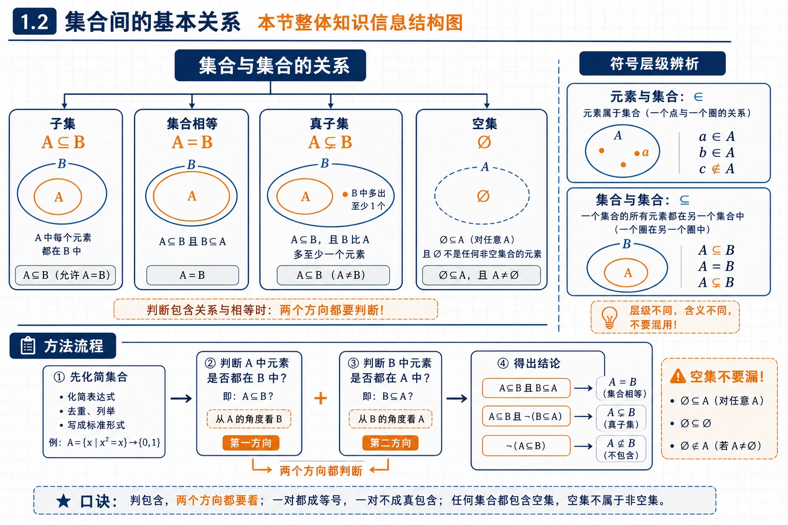
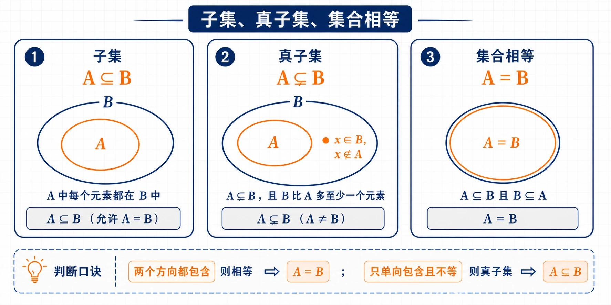
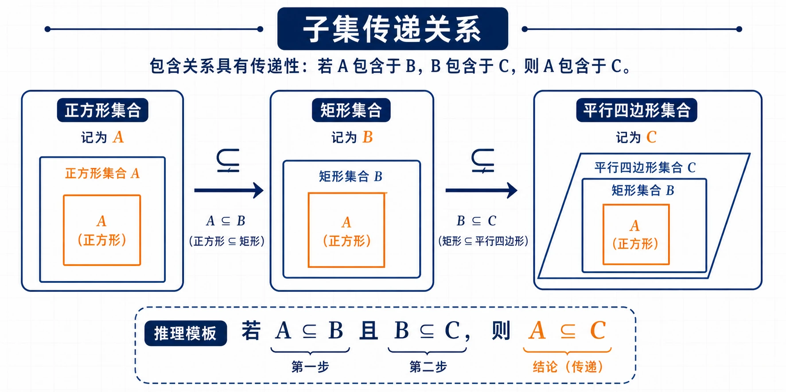
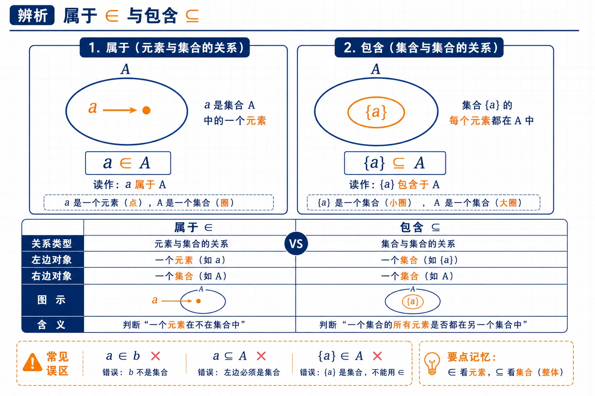
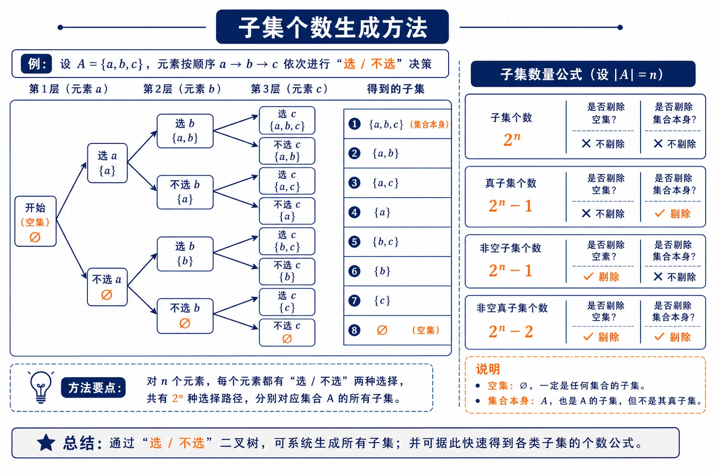
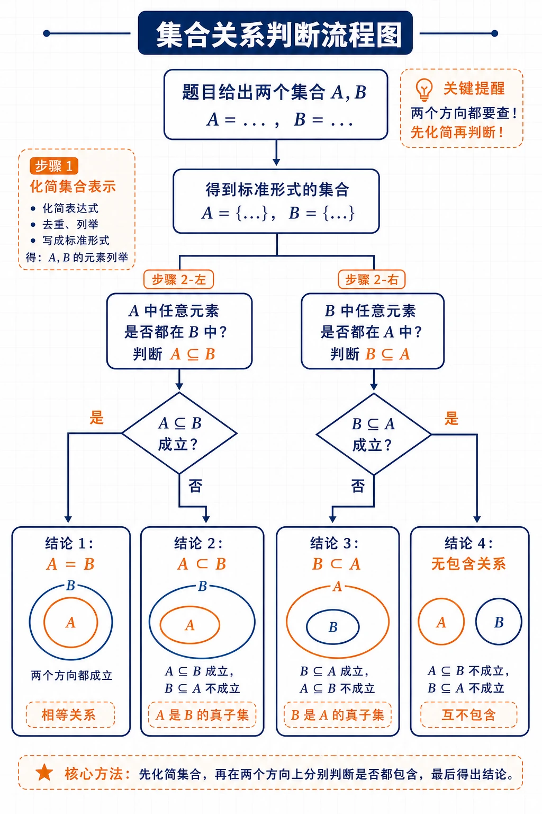
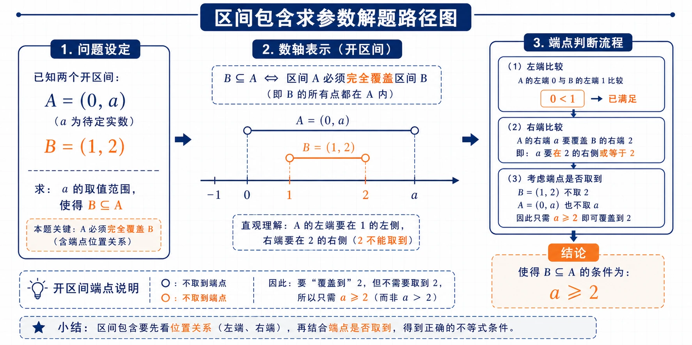

# 1.2 集合间的基本关系：核心知识点讲解


<!-- 图片描述：绘制“1.2 集合间的基本关系 本节整体知识信息结构图”，中心节点为“集合与集合的关系”，分出四条主线：子集 $A\subseteq B$、集合相等 $A=B$、真子集 $A\subsetneqq B$、空集 $\varnothing$。另一侧加入“符号层级辨析”分支，区分元素与集合的 $\in$、集合与集合的 $\subseteq$。底部加入方法流程“先化简集合 -> 判断 $A$ 中元素是否都在 $B$ -> 判断 $B$ 中元素是否都在 $A$ -> 得出包含/相等/真包含”。用 Venn 小图、箭头和判断框组织，橙色突出“两个方向都判断”和“空集不要漏”。数学课堂板书风格、深蓝线条、浅网格背景。 -->

## 本节学习目标

学完本节，需要掌握：

- 什么是子集、真子集、空集。
- 如何判断两个集合之间的包含关系、真包含关系和相等关系。
- 如何区分元素与集合的“属于关系”和集合与集合的“包含关系”。
- 如何写出一个有限集合的所有子集、真子集。
- 如何用 Venn 图理解集合间的关系。

这一节的核心问题是：**两个集合之间是什么关系？**  
在 1.1 中，我们关注“元素和集合”的关系；从 1.2 开始，我们关注“集合和集合”的关系。

## 核心知识点讲解

### 一、知识对象与问题情境

本节的知识对象是“集合与集合之间的关系”。在 1.1 中，重点是判断一个对象是不是某个集合的元素；到了 1.2，要进一步判断两个集合之间是否存在包含、相等或真包含关系。

最常见的问题情境有三类：

- 两个列举法集合之间的关系，例如 $\{1,2\}$ 与 $\{1,2,3\}$。
- 描述法集合之间的关系，例如 $\{x\mid x^2=x\}$ 与 $\{0,1\}$。
- 几何、数集或实际对象集合之间的关系，例如“正方形集合”和“矩形集合”。

解题时的核心问题可以统一成一句话：

```text
一个集合中的元素，是否都在另一个集合中？
```

### 二、核心概念与定义条件

#### 1. 子集

对于两个集合 $A,B$，如果集合 $A$ 中任意一个元素都是集合 $B$ 的元素，就称 $A$ 是 $B$ 的子集，记作：

$$
A\subseteq B.
$$

也可以读作：

```text
A 包含于 B
```

或者说 $B$ 包含 $A$，记作：

$$
B\supseteq A.
$$

符号化理解：

$$
A\subseteq B\Longleftrightarrow \text{任意 }x\in A,\text{ 都有 }x\in B.
$$

例如：

$$
A=\{1,2,3\},\qquad B=\{1,2,3,4,5\}.
$$

因为 $A$ 中的 $1,2,3$ 都在 $B$ 中，所以：

$$
A\subseteq B.
$$

#### 2. 用生活例子理解子集

设：

$$
C=\{\text{某班全体女生}\},
$$

$$
D=\{\text{某班全体学生}\}.
$$

每一名女生都是这个班的学生，所以：

$$
C\subseteq D.
$$

这就是“局部属于整体”的集合表达。

#### 3. 集合相等

如果集合 $A$ 的任意一个元素都是集合 $B$ 的元素，同时集合 $B$ 的任意一个元素都是集合 $A$ 的元素，那么 $A$ 与 $B$ 相等，记作：

$$
A=B.
$$

也就是说：

$$
A\subseteq B,\qquad B\subseteq A\Longrightarrow A=B.
$$

反过来，如果：

$$
A=B,
$$

那么一定有：

$$
A\subseteq B,\qquad B\subseteq A.
$$

因此，证明两个集合相等，常用方法是：

```text
先证 A 是 B 的子集，再证 B 是 A 的子集。
```

例如：

$$
E=\{x\mid x\text{ 是有两条边相等的三角形}\},
$$

$$
F=\{x\mid x\text{ 是等腰三角形}\}.
$$

“有两条边相等的三角形”就是“等腰三角形”，所以：

$$
E=F.
$$

#### 4. 真子集

如果 $A\subseteq B$，并且 $B$ 中至少有一个元素不属于 $A$，则称 $A$ 是 $B$ 的真子集，记作：

$$
A\subsetneqq B.
$$

也可以说 $B$ 真包含 $A$，记作：

$$
B\supsetneqq A.
$$

符号化理解：

$$
A\subsetneqq B
$$

表示两件事同时成立：

$$
A\subseteq B,
$$

并且：

$$
\exists x\in B,\ x\notin A.
$$

例如：

$$
A=\{1,2,3\},\qquad B=\{1,2,3,4,5\}.
$$

因为 $A$ 中的元素都在 $B$ 中，而且 $4\in B$ 但 $4\notin A$，所以：

$$
A\subsetneqq B.
$$


<!-- 图片描述：绘制“子集、真子集、集合相等”三联 Venn 图。第一幅为 $A\subseteq B$，$A$ 完全在 $B$ 内；第二幅为 $A\subsetneqq B$，在 $B$ 中用橙色标出一个不属于 $A$ 的元素；第三幅为 $A=B$，两个集合边界重合。图下方标注判断口诀“两个方向都包含则相等；只单向包含且不等则真子集”。浅网格背景、深蓝线条、橙色强调差异元素，LaTeX 风格符号。 -->

#### 5. 空集

不含任何元素的集合叫做空集，记作：

$$
\varnothing.
$$

例如，方程

$$
x^2+1=0
$$

没有实数根，所以它的实数根组成的集合是：

$$
\varnothing.
$$

规定：

$$
\varnothing\subseteq A.
$$

也就是说，空集是任何集合的子集。

如果 $A\ne\varnothing$，那么：

$$
\varnothing\subsetneqq A.
$$

### 三、符号语言与等价表示

本节常用符号可以分为两层：元素与集合之间用“属于”关系，集合与集合之间用“包含”关系。

| 符号 | 读法 | 左边对象 | 右边对象 | 含义 |
|---|---|---|---|---|
| $a\in A$ | $a$ 属于 $A$ | 元素 | 集合 | $a$ 是 $A$ 的元素 |
| $a\notin A$ | $a$ 不属于 $A$ | 元素 | 集合 | $a$ 不是 $A$ 的元素 |
| $A\subseteq B$ | $A$ 包含于 $B$ | 集合 | 集合 | $A$ 中任意元素都在 $B$ 中 |
| $A\subsetneqq B$ | $A$ 真包含于 $B$ | 集合 | 集合 | $A\subseteq B$ 且 $A\ne B$ |
| $A=B$ | $A$ 与 $B$ 相等 | 集合 | 集合 | 两个集合元素完全相同 |

几个重要等价表示要熟练掌握：

$$
A\subseteq B\Longleftrightarrow \forall x,\ x\in A\Rightarrow x\in B.
$$

$$
A=B\Longleftrightarrow A\subseteq B\ \text{且}\ B\subseteq A.
$$

$$
A\subsetneqq B\Longleftrightarrow A\subseteq B\ \text{且存在}\ x\in B,\ x\notin A.
$$

### 四、关键性质、定理与公式

#### 6. 子集关系的基本性质

任何集合都是它本身的子集：

$$
A\subseteq A.
$$

子集关系具有传递性：

$$
A\subseteq B,\qquad B\subseteq C\Longrightarrow A\subseteq C.
$$

例如：

$$
\{\text{正方形}\}\subseteq\{\text{矩形}\}\subseteq\{\text{平行四边形}\},
$$

所以：

$$
\{\text{正方形}\}\subseteq\{\text{平行四边形}\}.
$$


<!-- 图片描述：绘制“子集传递关系”链式关系图，从“正方形集合”箭头指向“矩形集合”，再指向“平行四边形集合”，每个节点画成嵌套 Venn 图或层级框；箭头上标注 $\subseteq$，底部写出推理模板“若 $A\subseteq B$ 且 $B\subseteq C$，则 $A\subseteq C$”。橙色突出最终结论 $A\subseteq C$，用于帮助理解包含关系的传递性。 -->

### 五、典型模型与解题方法

#### 7. 属于关系与包含关系

这是本节最容易混淆的地方。

| 关系 | 符号 | 左边 | 右边 | 例子 |
|---|---|---|---|---|
| 属于 | $\in$ | 元素 | 集合 | $a\in A$ |
| 不属于 | $\notin$ | 元素 | 集合 | $a\notin A$ |
| 包含于 | $\subseteq$ | 集合 | 集合 | $\{a\}\subseteq A$ |
| 真包含于 | $\subsetneqq$ | 集合 | 集合 | $\{a\}\subsetneqq A$ |

特别注意：

$$
a\in A
$$

表示 $a$ 是集合 $A$ 的一个元素。

而：

$$
\{a\}\subseteq A
$$


<!-- 图片描述：绘制“属于 $\in$ 与包含 $\subseteq$”辨析图，左侧为单个点 $a$ 指向集合 $A$，标注 $a\in A$；右侧为小椭圆 $\{a\}$ 整体位于大椭圆 $A$ 内，标注 $\{a\}\subseteq A$；底部用对比栏写“元素 vs 集合”“对象层级不同”。整体采用白底浅网格、深蓝图形、橙色突出符号差异。 -->

表示只含有元素 $a$ 的单元素集合是 $A$ 的子集。

例如，设：

$$
A=\{a,b,c\}.
$$

则：

$$
a\in A,
$$

并且：

$$
\{a\}\subseteq A.
$$

但是不能写成：

$$
a\subseteq A.
$$

也不能写成：

$$
\{a\}\in A.
$$

因为 $A$ 的元素是 $a,b,c$，不是集合 $\{a\}$。

#### 8. 子集个数

如果一个集合有 $n$ 个元素，那么：

- 子集个数为 $2^n$。
- 真子集个数为 $2^n-1$。
- 非空子集个数为 $2^n-1$。
- 非空真子集个数为 $2^n-2$。

例如集合：

$$
A=\{a,b\}
$$

有 $2$ 个元素，所以子集个数是：

$$
2^2=4.
$$

所有子集为：

$$
\varnothing,\quad \{a\},\quad \{b\},\quad \{a,b\}.
$$

真子集为：

$$
\varnothing,\quad \{a\},\quad \{b\}.
$$


<!-- 图片描述：绘制“子集个数生成方法”流程图，以集合 $A=\{a,b,c\}$ 为例，展示每个元素都有“选/不选”两种选择，三层二叉树生成 $2^3=8$ 个子集；右侧列出子集、真子集、非空子集、非空真子集的数量公式 $2^n$、$2^n-1$、$2^n-1$、$2^n-2$。用橙色标出“空集”和“集合本身”在不同计数中是否剔除。 -->

### 六、题型应用与迁移

本节题型可以归纳为三条主线：

- 关系判断：先化简集合，再判断 $A\subseteq B$ 和 $B\subseteq A$ 两个方向。
- 符号填空：先看左边对象是元素还是集合，再选择 $\in$、$\notin$、$\subseteq$ 或 $\nsubseteq$。
- 子集列举与计数：每个元素都有“选”或“不选”两种状态，先确定总数，再按元素个数有序列举。

## 重点梳理


<!-- 图片描述：绘制“集合关系判断流程图”，从题目给出的两个集合 $A,B$ 开始，第一步为“化简集合表示”，第二步分两路判断“$A$ 中任意元素是否都在 $B$ 中”和“$B$ 中任意元素是否都在 $A$ 中”，最后汇总为四种结论：$A=B$、$A\subsetneqq B$、$B\subsetneqq A$、无包含关系。图中用判断菱形、流程箭头和 Venn 小图表示分支，橙色突出“两个方向都要查”和“先化简再判断”。数学课堂板书风格，浅网格背景，深蓝线条，LaTeX 风格公式标注。 -->

### 重点 1：判断 $A\subseteq B$

判断 $A\subseteq B$ 时，只需要问一句：

```text
A 中的每一个元素都在 B 中吗？
```

如果答案是“是”，则：

$$
A\subseteq B.
$$

如果能找到一个元素属于 $A$ 但不属于 $B$，则：

$$
A\nsubseteq B.
$$

例如：

$$
A=\{1,2,3\},\qquad B=\{x\mid x\text{ 是 }8\text{ 的约数}\}.
$$

因为 $8$ 的正约数为 $1,2,4,8$，而：

$$
3\in A,\qquad 3\notin B,
$$

所以：

$$
A\nsubseteq B.
$$

### 重点 2：判断 $A=B$

判断两个集合相等，不能只看形式，要看元素。

例如：

$$
A=\{x\mid x^2-3x+2=0\},
$$

$$
B=\{1,2\}.
$$

因为：

$$
x^2-3x+2=(x-1)(x-2),
$$

所以：

$$
A=\{1,2\}=B.
$$

### 重点 3：判断 $A\subsetneqq B$

判断真子集要同时满足两个条件：

1. $A$ 中每一个元素都在 $B$ 中。
2. $B$ 中至少有一个元素不在 $A$ 中。

例如：

$$
\{1,2\}\subsetneqq\{1,2,3\}.
$$

但：

$$
\{1,2,3\}\not\subsetneqq\{1,2,3\}.
$$

因为两个集合相等，不是真子集关系。

### 重点 4：空集不要漏掉

写一个集合的所有子集时，必须包含：

$$
\varnothing
$$

和集合本身。

例如：

$$
\{a,b,c\}
$$

的子集一共有：

$$
2^3=8
$$

个，分别是：

$$
\varnothing,\ \{a\},\ \{b\},\ \{c\},\ \{a,b\},\ \{a,c\},\ \{b,c\},\ \{a,b,c\}.
$$

## 难点突破

### 难点 1：$\varnothing$ 与 $\{\varnothing\}$ 不一样

空集：

$$
\varnothing
$$

里面没有任何元素。

集合：

$$
\{\varnothing\}
$$

里面有一个元素，这个元素是空集。

所以：

$$
\varnothing\ne\{\varnothing\}.
$$

并且：

$$
\varnothing\in\{\varnothing\}.
$$

同时：

$$
\varnothing\subseteq\{\varnothing\}.
$$

这两个式子都对，但含义不同。

### 难点 2：元素和单元素集合不能混用

设：

$$
A=\{0,1\}.
$$

正确的是：

$$
0\in A,\qquad \{0\}\subseteq A.
$$

错误的是：

$$
0\subseteq A,\qquad \{0\}\in A.
$$

原因：

- $0$ 是元素，所以用 $\in$。
- $\{0\}$ 是集合，所以用 $\subseteq$。

### 难点 3：由条件表示的集合要先化简

设：

$$
A=\{x\mid x^2=x\}.
$$

判断：

$$
\{0\}\subseteq A
$$

是否成立。

不能只看形式，要先解方程：

$$
x^2=x\Longleftrightarrow x(x-1)=0.
$$

所以：

$$
A=\{0,1\}.
$$

因此：

$$
\{0\}\subseteq A
$$

成立。

## 例题讲解

### 例题 1：写出集合 $\{a,b\}$ 的所有子集

写出集合：

$$
A=\{a,b\}
$$

的所有子集，并指出哪些是真子集。

解析：

集合 $A$ 有两个元素，所以子集个数为：

$$
2^2=4.
$$

从“不选元素、选一个元素、选两个元素”三种情况列出：

- 不选任何元素：$\varnothing$。
- 只选一个元素：$\{a\},\{b\}$。
- 选两个元素：$\{a,b\}$。

所以 $A$ 的所有子集为：

$$
\varnothing,\quad \{a\},\quad \{b\},\quad \{a,b\}.
$$

其中真子集是不等于 $A$ 本身的子集，所以真子集为：

$$
\varnothing,\quad \{a\},\quad \{b\}.
$$

### 例题 2：判断集合 $A$ 是否为集合 $B$ 的子集

设：

$$
A=\{1,2,3\},\qquad B=\{x\mid x\text{ 是 }8\text{ 的约数}\}.
$$

判断 $A$ 是否为 $B$ 的子集。

解析：

$8$ 的正约数是：

$$
1,2,4,8.
$$

所以：

$$
B=\{1,2,4,8\}.
$$

虽然：

$$
1\in B,\qquad 2\in B,
$$

但是：

$$
3\notin B.
$$

而：

$$
3\in A.
$$

所以 $A$ 中并不是每一个元素都属于 $B$。

答案：

$$
A\nsubseteq B.
$$

### 例题 3：几何集合中的子集关系

设：

$$
A=\{x\mid x\text{ 是长方形}\},
$$

$$
B=\{x\mid x\text{ 是两条对角线相等的平行四边形}\}.
$$

判断 $A$ 是否为 $B$ 的子集。

解析：

长方形一定是平行四边形，并且长方形的两条对角线相等。

也就是说，任何一个长方形都满足“是两条对角线相等的平行四边形”。

所以：

$$
A\subseteq B.
$$

事实上，在平面几何中，“两条对角线相等的平行四边形”也是长方形，因此这里还有：

$$
B\subseteq A.
$$

所以：

$$
A=B.
$$

### 例题 4：用适当的符号填空

设：

$$
A=\{x\mid x^2=x\}.
$$

用 $\in,\notin,\subseteq,\nsubseteq$ 填空：

$$
1\ \underline{\qquad}\ A,\qquad
\{1\}\ \underline{\qquad}\ A,\qquad
-1\ \underline{\qquad}\ A,\qquad
\{-1\}\ \underline{\qquad}\ A.
$$

解析：

先化简集合 $A$：

$$
x^2=x\Longleftrightarrow x(x-1)=0.
$$

所以：

$$
A=\{0,1\}.
$$

因此：

$$
1\in A,
$$

$$
\{1\}\subseteq A,
$$

$$
-1\notin A,
$$

$$
\{-1\}\nsubseteq A.
$$

答案：

$$
1\in A,\qquad
\{1\}\subseteq A,\qquad
-1\notin A,\qquad
\{-1\}\nsubseteq A.
$$

### 例题 5：根据包含关系求参数范围


<!-- 图片描述：绘制“区间包含求参数解题路径图”，左侧给出 $A=(0,a)$、$B=(1,2)$，中间画数轴，橙色线段表示 $B=(1,2)$，深蓝线段表示 $A=(0,a)$，用箭头说明 $B\subseteq A$ 意味着 $A$ 必须完全覆盖 $B$；右侧列出端点判断流程“左端 $0<1$ 已满足 -> 右端需覆盖到 $2$ -> 因为 $B$ 不取 $2$，所以 $a\ge2$”。要求突出开区间端点是否取到对结论的影响，数学板书风格、浅网格背景、深蓝线条、橙色强调关键端点和结论。 -->

已知：

$$
A=\{x\mid 0<x<a\},\qquad B=\{x\mid 1<x<2\}.
$$

若：

$$
B\subseteq A,
$$

求实数 $a$ 的取值范围。

解析：

$B\subseteq A$ 表示 $B$ 中每一个数都必须属于 $A$。

集合 $B$ 是区间：

$$
(1,2).
$$

集合 $A$ 是区间：

$$
(0,a).
$$

要让：

$$
(1,2)\subseteq(0,a),
$$

右端必须至少覆盖到 $2$。

注意 $B$ 中不包含 $2$，所以只要：

$$
a\ge 2
$$

就可以。

答案：

$$
a\ge 2.
$$

## 易错点整理

### 易错点 1：漏写空集

写所有子集时，最容易漏掉：

$$
\varnothing.
$$

例如 $\{a,b\}$ 的所有子集不是只有 $\{a\},\{b\},\{a,b\}$，还必须有：

$$
\varnothing.
$$

### 易错点 2：把“属于”和“包含于”混用

设：

$$
A=\{1,2,3\}.
$$

正确：

$$
1\in A,\qquad \{1\}\subseteq A.
$$

错误：

$$
1\subseteq A,\qquad \{1\}\in A.
$$

### 易错点 3：把子集误认为真子集

任何集合都是它本身的子集：

$$
A\subseteq A.
$$

但集合不是它本身的真子集：

$$
A\not\subsetneqq A.
$$

### 易错点 4：认为空集不是任何集合的子集

规定：

$$
\varnothing\subseteq A.
$$

空集是任何集合的子集。

如果 $A$ 非空，那么：

$$
\varnothing\subsetneqq A.
$$

### 易错点 5：不先化简集合就判断关系

例如：

$$
\{2,1\}
$$

与

$$
\{x\mid x^2-3x+2=0\}
$$

其实相等，因为方程的根是 $1,2$。

判断集合关系时，要先把描述法中的集合化简。

## 考点考证点整理

### 考点一：判断子集、真子集与集合相等

- 出题思路：给出两个用列举法、描述法、区间或几何对象表示的集合，要求判断 $A\subseteq B$、$B\subseteq A$、$A=B$、$A\subsetneqq B$ 或 $B\subsetneqq A$。
- 关键条件：是否任意 $x\in A$ 都有 $x\in B$；是否任意 $x\in B$ 都有 $x\in A$；是否存在一方集合中多出的元素；描述法集合是否需要先解方程、不等式或识别几何定义。
- 解答要点：先化简集合，再分别判断 $A\subseteq B$ 和 $B\subseteq A$ 两个方向；两个方向都成立则写 $A=B$；只一个方向成立且两个集合不相等，则写真子集；若能找到反例元素，则说明不包含。
- 易扣分点：只看元素个数不看元素本身；只判断一个方向就写相等；把 $A\subseteq B$ 误写成 $B\subseteq A$；描述法集合没有先化简。

### 考点二：属于关系与包含关系的符号辨析

- 出题思路：用 $\in$、$\notin$、$\subseteq$、$\nsubseteq$ 填空，常把 $a$、$\{a\}$、$\varnothing$、$\{\varnothing\}$ 放在同一题中考查对象层级。
- 关键条件：左边是元素还是集合；右边是否是集合；集合 $A$ 的元素到底是普通元素还是集合；空集 $\varnothing$ 和单元素集合 $\{\varnothing\}$ 是否被区分。
- 解答要点：元素对集合用 $\in$ 或 $\notin$，集合对集合用 $\subseteq$ 或 $\nsubseteq$；先判断符号类型，再判断关系真假。例如 $a\in A$ 和 $\{a\}\subseteq A$ 是不同层级的关系。
- 易扣分点：写出 $a\subseteq A$、$\{a\}\in A$ 这类对象层级错误；把 $\varnothing$ 当成普通数字或字母；看到花括号就忽略集合中真实元素。

### 考点三：空集相关判断

- 出题思路：判断 $\varnothing$、$\{\varnothing\}$ 与某个集合之间的属于、包含、相等或真包含关系，也常出现在子集个数、符号填空和真假命题中。
- 关键条件：$\varnothing$ 不含任何元素；$\{\varnothing\}$ 含有一个元素，这个元素是 $\varnothing$；空集是任何集合的子集；当 $A\ne\varnothing$ 时，$\varnothing\subsetneqq A$。
- 解答要点：先写出基本结论 $\varnothing\subseteq A$；再判断 $\varnothing$ 是否作为元素出现在右边集合中；遇到 $\{\varnothing\}$ 时要明确它不是空集。
- 易扣分点：认为空集没有元素所以不是任何集合的子集；把 $\varnothing\in\{\varnothing\}$ 与 $\varnothing\subseteq\{\varnothing\}$ 混为一谈；漏写空集这个子集。

### 考点四：列举子集、真子集与计算子集个数

- 出题思路：给出有限集合，要求写出所有子集、所有真子集、非空子集或非空真子集，也可能只要求计算数量。
- 关键条件：集合中不同元素的个数 $n$；是否要求排除空集；是否要求排除集合本身；题目是否要求“写出”而不是只“求个数”。
- 解答要点：每个元素都有“选”或“不选”两种状态，所以子集数为 $2^n$；真子集数为 $2^n-1$；非空子集数为 $2^n-1$；非空真子集数为 $2^n-2$。列举时按元素个数从少到多写，先写 $\varnothing$，最后写集合本身。
- 易扣分点：漏写 $\varnothing$ 或集合本身；重复列出同一个集合；把元素顺序不同误认为不同集合；把“真子集”写成包含集合本身。

### 考点五：由包含关系求参数范围或参数值

- 出题思路：给出含参数的集合、区间或方程根集合，并给出 $A\subseteq B$、$B\subseteq A$ 或 $A=B$，要求求参数范围或参数值。
- 关键条件：谁包含谁；区间端点是否能取到；方程根集合是否需要先求出；集合中元素的互异性是否影响列举法集合。
- 解答要点：区间题先画数轴，看被包含的集合是否被另一个集合完全覆盖；列举法题把包含关系转化为“每个元素都要落入目标集合”；相等题要两个方向都满足，并检查参数代入后集合是否真的相同。
- 易扣分点：开区间、闭区间端点判断错误；只得到必要条件没有回代检验；忽略集合元素互异性；把 $B\subseteq A$ 看反。

## 练习题

### A 组：基础巩固

1. 判断下列关系是否正确。

$$
2\in\{1,2,3\}
$$

$$
\{2\}\subseteq\{1,2,3\}
$$

$$
2\subseteq\{1,2,3\}
$$

$$
\{2\}\in\{1,2,3\}
$$

2. 写出集合 $\{a,b,c\}$ 的所有子集。

3. 写出集合 $\{a,b,c\}$ 的所有真子集。

4. 判断下列集合之间的关系。

$$
A=\{1,2\},\qquad B=\{1,2,3\}.
$$

5. 判断下列集合之间的关系。

$$
C=\{x\mid x^2-1=0\},\qquad D=\{-1,1\}.
$$

### B 组：能力提升

6. 用适当的符号 $\in,\notin,\subseteq,\nsubseteq$ 填空。

设：

$$
A=\{x\mid x^2=x\}.
$$

填空：

$$
0\ \underline{\qquad}\ A,\qquad
\{0\}\ \underline{\qquad}\ A,\qquad
-1\ \underline{\qquad}\ A,\qquad
\{-1\}\ \underline{\qquad}\ A.
$$

7. 判断集合 $A$ 是否为集合 $B$ 的子集。

$$
A=\{1,2,3\},\qquad B=\{x\mid x\text{ 是 }12\text{ 的约数}\}.
$$

8. 判断下列两个集合之间的关系。

$$
A=\{x\mid x<0\},\qquad B=\{x\mid x<1\}.
$$

9. 判断下列两个集合之间的关系。

$$
A=\{x\mid x=6k,\ k\in\mathbb{N}\},
$$

$$
B=\{x\mid x=3m,\ m\in\mathbb{N}\}.
$$

### C 组：综合应用

10. 已知：

$$
A=\{x\mid 0<x<a\},\qquad B=\{x\mid 1<x<2\}.
$$

若 $B\subseteq A$，求实数 $a$ 的取值范围。

11. 已知：

$$
A=\{1,3,a^2\},\qquad B=\{1,a+2\}.
$$

若 $B\subseteq A$，求实数 $a$ 的可能取值。

12. 判断下列说法是否正确，并说明理由。

$$
\varnothing\in\{\varnothing\}
$$

$$
\varnothing\subseteq\{\varnothing\}
$$

$$
\{\varnothing\}\subseteq\varnothing
$$

### 教材习题补充

13. 教材习题 1.2 第 1 题：选用适当符号填空。
    (1) $A=\{x\mid 2x-3<3x\}$，$B=\{x\mid x\ge2\}$，判断 $-4$ 与 $B$、$-3$ 与 $A$、$\{2\}$ 与 $B$、$B$ 与 $A$ 的关系。
    (2) $A=\{x\mid x^2-1=0\}$，判断 $1$、$\{-1\}$、$\varnothing$、$\{1,-1\}$ 与 $A$ 的关系。
    (3) 判断菱形集合与平行四边形集合、等腰三角形集合与等边三角形集合的关系。

14. 教材习题 1.2 第 2 题：指出 $A=\{\text{四边形}\}$、$B=\{\text{平行四边形}\}$、$C=\{\text{矩形}\}$、$D=\{\text{正方形}\}$ 之间的关系，并用 Venn 图表示。

15. 教材习题 1.2 第 3 题：分别举出“立德中学学生”“三角形”“$\{0\}$”“$\{x\in\mathbb{Z}\mid 3<x<30\}$”的一个子集。

16. 教材习题 1.2 第 4 题：集合 $C=\{(x,y)\mid y=x\}$ 表示直线 $y=x$。集合 $D=\{(x,y)\mid 2x-y=1,\ x+4y=5\}$ 表示什么？$C,D$ 有什么关系？

17. 教材习题 1.2 第 5 题：若 $P=\{1,a\}$，$Q=\{-1,-b\}$，且 $P=Q$，求 $a-b$；若 $A=\{x\mid 0<x<a\}$，$B=\{x\mid 1<x<2\}$，且 $B\subseteq A$，求 $a$ 的取值范围。

## 练习题答案

1. 正确；正确；错误；错误。

2.

$$
\varnothing,\ \{a\},\ \{b\},\ \{c\},\ \{a,b\},\ \{a,c\},\ \{b,c\},\ \{a,b,c\}.
$$

3.

$$
\varnothing,\ \{a\},\ \{b\},\ \{c\},\ \{a,b\},\ \{a,c\},\ \{b,c\}.
$$

4.

$$
A\subsetneqq B.
$$

5. 因为 $x^2-1=0$ 的解是 $x=-1$ 或 $x=1$，所以：

$$
C=D.
$$

6. 因为 $A=\{0,1\}$，所以：

$$
0\in A,\qquad
\{0\}\subseteq A,\qquad
-1\notin A,\qquad
\{-1\}\nsubseteq A.
$$

7. $12$ 的正约数为 $1,2,3,4,6,12$，所以：

$$
A\subseteq B.
$$

8.

$$
A\subsetneqq B.
$$

因为小于 $0$ 的数都小于 $1$，但例如 $0\in B$ 且 $0\notin A$。

9.

$$
A\subseteq B.
$$

因为 $x=6k=3(2k)$，所以 $6$ 的倍数一定是 $3$ 的倍数。若 $\mathbb{N}$ 含 $0$，两个集合都含 $0$。并且 $3\in B$ 但 $3\notin A$，所以：

$$
A\subsetneqq B.
$$

10.

$$
a\ge 2.
$$

11. 因为 $B\subseteq A$，所以 $a+2$ 必须属于 $A$。即：

$$
a+2=1,\quad a+2=3,\quad \text{或}\quad a+2=a^2.
$$

分别得：

$$
a=-1,\quad a=1,\quad a=2\text{ 或 }a=-1.
$$

检查：

- $a=-1$ 时，$A=\{1,3\}$，$B=\{1\}$，满足。
- $a=1$ 时，$A=\{1,3\}$，$B=\{1,3\}$，满足。
- $a=2$ 时，$A=\{1,3,4\}$，$B=\{1,4\}$，满足。

所以：

$$
a=-1,\ 1,\ 2.
$$

12.

$$
\varnothing\in\{\varnothing\}
$$

正确，因为 $\{\varnothing\}$ 的唯一元素是 $\varnothing$。

$$
\varnothing\subseteq\{\varnothing\}
$$

正确，因为空集是任何集合的子集。

$$
\{\varnothing\}\subseteq\varnothing
$$

错误，因为左边集合有一个元素，右边空集没有元素。

13. 教材习题 1.2 第 1 题答案：
    (1) $A=\{x\mid x>-3\}$，所以 $-4\notin B$，$-3\notin A$，$\{2\}\subseteq B$，$B\subseteq A$。
    (2) $A=\{-1,1\}$，所以 $1\in A$，$\{-1\}\subseteq A$，$\varnothing\subseteq A$，$\{1,-1\}=A$。
    (3) $\{\text{菱形}\}\subseteq\{\text{平行四边形}\}$；$\{\text{等边三角形}\}\subseteq\{\text{等腰三角形}\}$，所以若按题目顺序写“等腰三角形集合 与 等边三角形集合”，应为后者是前者的真子集。

14. 教材习题 1.2 第 2 题答案：$D\subseteq C\subseteq B\subseteq A$。Venn 图应画成四层嵌套：最外层四边形，内部依次为平行四边形、矩形、正方形。

15. 教材习题 1.2 第 3 题答案示例：高一学生集合是立德中学学生集合的子集；等边三角形集合是三角形集合的子集；$\varnothing$ 或 $\{0\}$ 是 $\{0\}$ 的子集；$\{4,5\}$ 是 $\{x\in\mathbb{Z}\mid 3<x<30\}$ 的子集。

16. 教材习题 1.2 第 4 题答案：解方程组 $2x-y=1$、$x+4y=5$ 得 $(x,y)=(1,1)$，所以 $D=\{(1,1)\}$，表示两条直线的交点集合。由于 $(1,1)$ 在直线 $y=x$ 上，所以 $D\subseteq C$。

17. 教材习题 1.2 第 5 题答案：由 $P=Q$ 且 $1\in P$，应有 $1=-b$，所以 $b=-1$；另一个元素对应 $a=-1$，故 $a-b=0$。第二问要使 $(1,2)$ 被 $(0,a)$ 覆盖，需 $a\ge2$。
