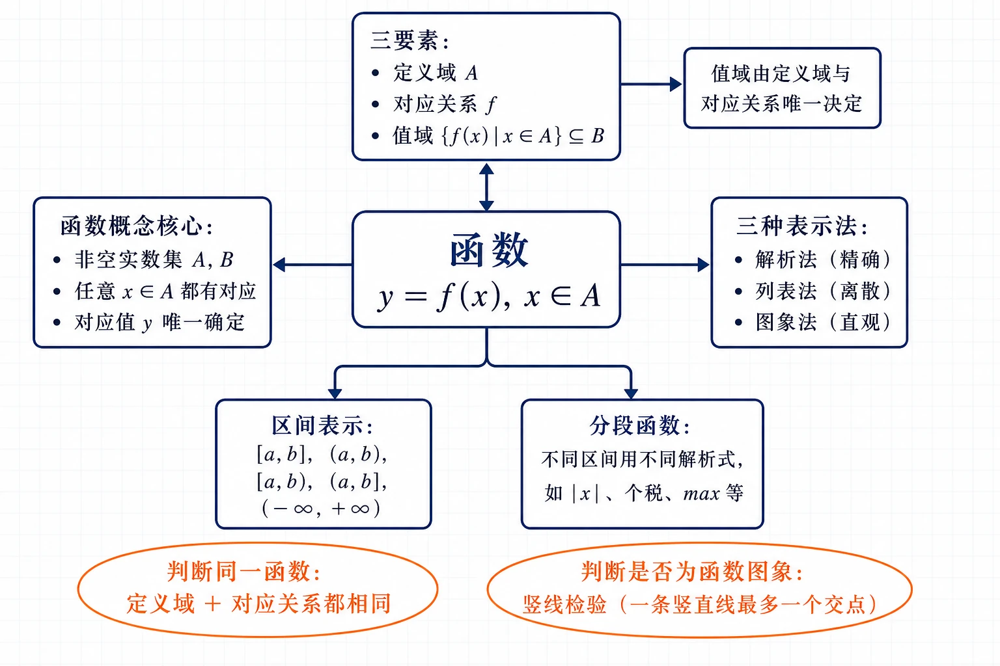
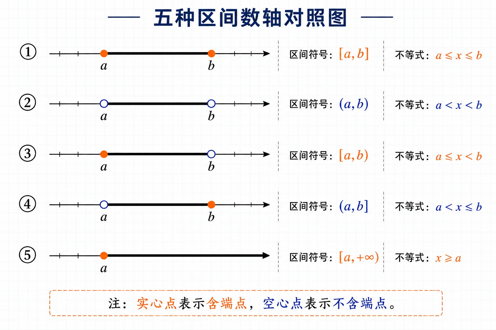
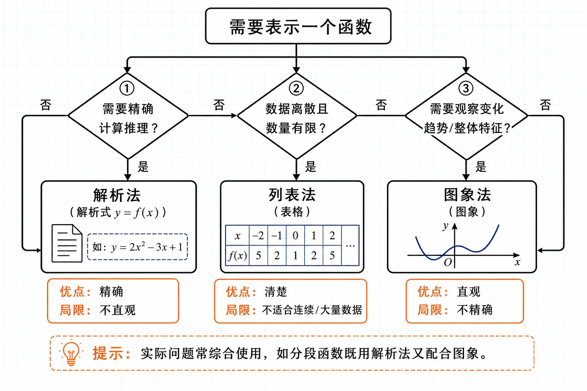
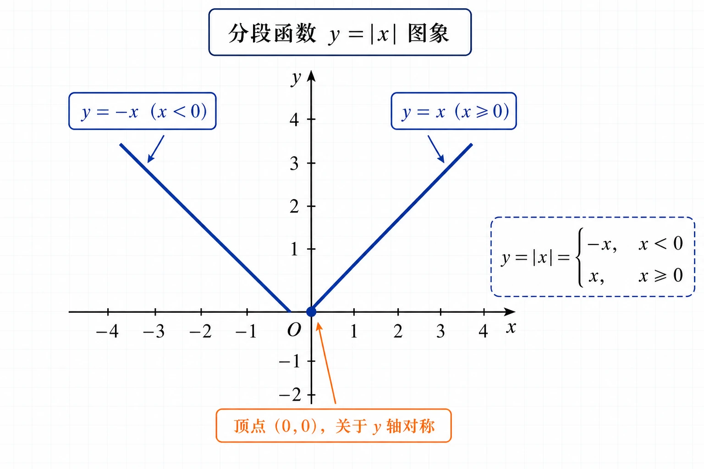

# 3.1 函数的概念及其表示

<!-- 图片描述：本节整体知识信息结构图。浅网格背景，中心节点写“函数 $y=f(x),\,x\in A$”。中心向上引出“三要素：定义域 $A$、对应关系 $f$、值域 $\{f(x)\mid x\in A\}\subseteq B$”，并用箭头连接“值域由定义域与对应关系唯一决定”。中心向左引出“函数概念核心：非空实数集 $A,B$；任意 $x\in A$ 都有对应；对应值 $y$ 唯一确定”。中心向右引出“三种表示法：解析法（精确）、列表法（离散）、图象法（直观）”。中心向下分两条分支：左下“区间表示：$[a,b]$、$(a,b)$、$[a,b)$、$(a,b]$、$(-\infty,+\infty)$”，右下“分段函数：不同区间用不同解析式，如 $|x|$、个税、$\max$”。用橙色椭圆框醒目标注两个判断要点“判断同一函数：定义域＋对应关系都相同”“判断是否为函数图象：竖线检验（一条竖直线最多一个交点）”。黑色深蓝线条为主，LaTeX 公式风格。 -->

## 本节学习目标

- 用集合语言和对应关系刻画函数概念，理解“非空实数集、任意、唯一确定”三个关键要求，能判断一个对应关系是否构成函数。
- 掌握函数的三要素（定义域、对应关系、值域），理解“值域由定义域和对应关系决定”，能据此判断两个函数是否为同一个函数。
- 会用区间表示实数集及其子集，能正确处理开闭端点和无穷区间。
- 会求给定解析式的函数的定义域（分母不为零、偶次根式被开方数非负等），会求函数值。
- 掌握函数的三种表示法（解析法、列表法、图象法）及其特点，能根据情境选择恰当的表示法。
- 理解分段函数的含义，会求分段函数的函数值、画出图象，能用分段函数描述出租车计费、个税、票价等实际问题。
- 能根据函数图象读取信息、分析变化趋势，体会函数是描述变量依赖关系的重要模型。

## 核心知识点讲解

### 一、知识对象与问题情境

初中我们已经学过函数：函数是刻画变量之间对应关系的数学模型。例如正方形周长 $l$ 与边长 $x$ 满足 $l=4x$，每给一个 $x$ 都有唯一的 $l$ 与之对应，所以 $l$ 是 $x$ 的函数。但初中定义偏重“变量说”，不够精确。比如，$y=x$ 与 $y=\dfrac{x^2}{x}$ 是不是同一个函数？运行半小时的列车和按天计酬的工人，对应关系都是 $y=350x$，它们是同一个函数吗？要回答这些问题，就需要用更精确的“集合与对应”语言重新刻画函数。

下面四个情境共同揭示了函数的本质特征：

- **情境一（解析式）**：某列车加速到 $350\text{ km/h}$ 后匀速运行半小时，路程 $s$（km）与时间 $t$（h）满足 $s=350t$，其中 $t\in\{t\mid0\le t\le0.5\}$，$s\in\{s\mid0\le s\le175\}$。
- **情境二（解析式 + 离散）**：工人每天工资 $350$ 元，每周工作天数 $d\in\{1,2,3,4,5,6\}$，工资 $w=350d$，$w\in\{350,700,\ldots,2100\}$。
- **情境三（图象）**：某日空气质量指数 AQI 随时间 $t$（$0\le t\le24$）变化的图象，任一时刻都有唯一的 AQI 值 $I$ 与之对应。
- **情境四（表格）**：城镇居民恩格尔系数 $r$ 随年份 $y$（$y\in\{2012,\ldots,2021\}$）变化的表格，每个年份都有唯一的恩格尔系数与之对应。

这四个情境对应关系的表示方式各不相同（解析式、图象、表格），但都有三个共同特征：①都包含两个非空实数集 $A,B$；②都有一个对应关系；③对 $A$ 中**任意**一个数 $x$，按对应关系在 $B$ 中都有**唯一确定**的数 $y$ 与它对应。把这三条抽象出来，就得到高中的函数定义。

注意情境一和情境二的对应关系都是 $y=350x$，但定义域不同（一个是连续区间，一个是离散整数集），所以它们不是同一个函数——这正是为什么要强调定义域的原因。

### 二、核心概念与定义条件

**函数的定义**：一般地，设 $A,B$ 是非空的实数集，如果对于集合 $A$ 中的**任意**一个数 $x$，按照某种确定的对应关系 $f$，在集合 $B$ 中都有**唯一确定**的数 $y$ 和它对应，那么就称 $f:A\to B$ 为从集合 $A$ 到集合 $B$ 的一个函数，记作

$$
y=f(x),\quad x\in A.
$$

其中，$x$ 叫自变量，$x$ 的取值范围 $A$ 叫函数的**定义域**；与 $x$ 的值相对应的 $y$ 值叫**函数值**，函数值的集合 $\{f(x)\mid x\in A\}$ 叫**值域**。显然值域是集合 $B$ 的子集（可以等于 $B$，也可以是 $B$ 的真子集）。

理解定义要抓住两个关键词：

- **“任意”**：定义域 $A$ 中的每一个 $x$ 都必须有对应的 $y$，不能有“漏网之鱼”。
- **“唯一确定”**：每一个 $x$ 只能对应一个 $y$，不能一对一多。这是判断一个对应关系是否为函数的核心。注意：不同的 $x$ 可以对应同一个 $y$（如 $y=x^2$ 中 $x=2$ 和 $x=-2$ 都对应 $y=4$），这不违反“唯一”。

**函数符号 $y=f(x)$ 的含义**：$f(x)$ 表示 $x$ 对应的函数值，是“$f$ 作用于 $x$ 的结果”，而不是 $f$ 乘以 $x$。$f$ 是对应关系的记号，可用任意字母（如 $g,h,\varphi$）表示；自变量、因变量也可用任意字母（如 $u=v^2$ 与 $y=x^2$ 只要定义域相同就是同一函数）。

### 三、符号语言与等价表示

**函数的三要素**：

| 要素 | 记号 | 含义 |
|---|---|---|
| 定义域 | $A$（或 $D$） | 自变量 $x$ 允许取值的集合 |
| 对应关系 | $f$ | 由 $x$ 确定 $y$ 的规则 |
| 值域 | $\{f(x)\mid x\in A\}$ | 函数值实际能取到的全体 |

关键结论：**值域由定义域和对应关系唯一决定**。因此，判断两个函数是否为同一个函数，只需看**定义域**和**对应关系**是否都相同（值域会随之自动相同）。具体来说，两个函数相同当且仅当：定义域相同，且相同的自变量对应的函数值也相同。

常见函数的定义域和值域要熟记：

| 函数 | 定义域 | 值域 |
|---|---|---|
| 一次函数 $y=ax+b$（$a\ne0$） | $\mathbb R$ | $\mathbb R$ |
| 二次函数 $y=ax^2+bx+c$（$a\ne0$） | $\mathbb R$ | $a>0$：$\left[\dfrac{4ac-b^2}{4a},+\infty\right)$；$a<0$：$\left(-\infty,\dfrac{4ac-b^2}{4a}\right]$ |
| 反比例函数 $y=\dfrac{k}{x}$（$k\ne0$） | $\{x\mid x\ne0\}$ | $\{y\mid y\ne0\}$ |

**区间表示法**：设 $a<b$ 是实数，规定：

| 不等式 | 集合 | 区间 | 名称 |
|---|---|---|---|
| $a\le x\le b$ | $\{x\mid a\le x\le b\}$ | $[a,b]$ | 闭区间 |
| $a<x<b$ | $\{x\mid a<x<b\}$ | $(a,b)$ | 开区间 |
| $a\le x<b$ | $\{x\mid a\le x<b\}$ | $[a,b)$ | 半开半闭区间 |
| $a<x\le b$ | $\{x\mid a<x\le b\}$ | $(a,b]$ | 半开半闭区间 |

实数集 $\mathbb R$ 用 $(-\infty,+\infty)$ 表示；$x\ge a$、$x>a$、$x\le b$、$x<b$ 分别用 $[a,+\infty)$、$(a,+\infty)$、$(-\infty,b]$、$(-\infty,b)$ 表示。符号 $\infty$（无穷大）不是一个数，仅表示趋势，它旁边永远用小括号。数轴上用**实心点**表示含端点，用**空心点**表示不含端点。

<!-- 图片描述：五种区间数轴对照图。从上到下五行，每行画一段数轴，标出端点 $a,b$。第一行 $[a,b]$：两端实心点，区间用粗线段连接。第二行 $(a,b)$：两端空心点，粗线段。第三行 $[a,b)$：左端实心点、右端空心点。第四行 $(a,b]$：左端空心点、右端实心点。第五行 $[a,+\infty)$：左端实心点，向右箭头延伸。每行右侧标注区间符号和对应不等式。浅网格背景，黑色线条，端点清晰。 -->

### 四、关键性质、定理与公式

**求函数定义域的规则**（当只给出解析式、未指明定义域时，定义域就是使解析式有意义的实数集合）：

- 分式的分母不能为 $0$：如 $\dfrac{1}{x-2}$ 要求 $x-2\ne0$。
- 偶次根式的被开方数非负：如 $\sqrt{x+3}$ 要求 $x+3\ge0$；$\sqrt[6]{x-1}$ 要求 $x-1\ge0$。
- 零次幂的底数不为 $0$：如 $x^0$ 要求 $x\ne0$。
- 实际问题中还要符合实际意义（时间非负、人数为正整数等）。

若解析式由几部分相加、相乘组成，则定义域是各部分有意义条件的**交集**。

**求函数值**：把自变量的值代入解析式即可，如 $f(x)=x^2+2x$，则 $f(3)=3^2+2\times3=15$，$f(a)=a^2+2a$，$f(a+1)=(a+1)^2+2(a+1)$。注意 $f(a+1)$ 是把 $a+1$ 整体代入，不能写成 $f(a)+1$。

**判断同一函数的步骤**：①分别求两个函数的定义域；②看定义域是否相同；③在定义域内看对应关系是否一致（化简后是否相同）。两步都满足才是同一函数。

### 五、典型模型与解题方法

**模型一：判断一个对应关系是否为函数。** 检查“任意 $x\in A$ 是否都有对应值”和“每个 $x$ 是否只对应一个 $y$”。对图象可用**竖线检验**：任意一条与 $x$ 轴垂直的直线与图象最多只有一个交点，才是函数图象。

**模型二：求定义域。** 列出使各部分有意义的条件（分母≠0、根号内≥0 等），求交集，用区间或集合表示。

**模型三：判断同一函数。** 定义域相同 + 对应关系相同 = 同一函数。常见反例：$y=x$ 与 $y=(\sqrt{x})^2$（定义域不同）、$y=x$ 与 $y=\dfrac{x^2}{x}$（定义域不同）、$y=x$ 与 $y=|x|$（定义域相同但对应关系不同）。

**模型四：分段函数求值。** 先看自变量属于哪一段区间，再代入该段的解析式。画分段函数图象时，每段分别画，注意端点的虚实（包含端点用实心点，不包含用空心点）。

**模型五：函数三种表示法的选择。** 需要精确计算和推理用解析法；数据有限离散用列表法；需要观察变化趋势和整体特征用图象法。实际问题中常综合使用。

### 六、题型应用与迁移

本节题型分六类：①函数概念辨析（是否为函数、值域与 $B$ 的关系）；②求定义域、求函数值；③判断同一函数；④三种表示法及相互转化；⑤分段函数求值、画图、建模（个税、票价、出租车）；⑥读图分析（AQI 图象、成绩变化图象、行程图象）。核心都围绕“函数三要素”和“三种表示法”。

## 重点梳理

- **“唯一确定”是函数概念的核心**。它要求每个自变量只能对应一个函数值。这一点之所以重要，是因为它是判断一个对应关系（或图象）是否为函数的唯一标准——只要出现“一对一多”，就不是函数。不同的 $x$ 对应同一个 $y$ 是允许的（如 $y=x^2$），不违反唯一性。
- **值域是 $B$ 的子集，不一定等于 $B$**。定义中 $B$ 是函数值所在的范围，但函数值不一定取遍 $B$。例如情境三中 AQI 值域是 $\{I\mid0<I<150\}$ 的真子集。求值域时要实际算出函数值能取到哪些值，不能直接把 $B$ 当值域。这是最容易混淆的地方之一。
- **判断同一函数必须同时看定义域和对应关系**。仅凭解析式外形相同不够。例如 $y=350x$ 在定义域 $[0,0.5]$ 和 $\{1,2,3,4,5,6\}$ 上是两个不同的函数；$y=x$ 与 $y=(\sqrt{x})^2$ 解析式化简后都是 $x$，但定义域分别是 $\mathbb R$ 和 $[0,+\infty)$，不是同一函数。反之，字母不同不影响（$u=t^2$ 与 $y=x^2$ 定义域、对应关系都相同，是同一函数）。
- **区间端点的开闭取决于是否含端点**。含等号（$\le,\ge$）用中括号，不含等号（$<,>$）用小括号；与 $\infty$ 相接永远用小括号。这是书写规范，写错会改变定义域。
- **分段函数是一个函数，不是多个函数**。它在定义域的不同部分用不同的解析式，但这些部分共同构成一个完整的函数。求值时务必先判断 $x$ 落在哪一段，再代入对应解析式，不能所有式子都代一遍。
- **三种表示法各有优劣，要灵活选择**。解析法精确便于推理，但不够直观、不能表示所有函数（如狄利克雷函数）；列表法直接清楚，但只适合离散有限数据；图象法直观易看趋势，但不够精确。实际问题中常需要综合使用。

<!-- 图片描述：函数三种表示法特点对比与选择流程图。中心圆角框“需要表示一个函数”。三个菱形判断分支：①“需要精确计算推理？”是→“解析法（解析式 $y=f(x)$）”；②“数据离散且数量有限？”是→“列表法（表格）”；③“需要观察变化趋势/整体特征？”是→“图象法（图象）”。每个分支下用橙色小字注明优点和局限：解析法“精确但不直观”；列表法“清楚但不适合连续/大量数据”；图象法“直观但不精确”。底部一行提示“实际问题常综合使用，如分段函数既用解析法又配合图象”。浅网格背景，黑色线条。 -->

## 难点突破

### 难点一：为什么要强调定义域

同一个解析式，定义域不同就是不同的函数。例如 $y=350x$，当 $x\in[0,0.5]$ 时表示列车半小时内的路程；当 $x\in\{1,2,3,4,5,6\}$ 时表示按天数计算的工资。两者解析式相同，但研究的对象、变量含义、定义域都不同，所以是不同的函数。突破方法：把定义域当作函数的“身份证”之一，提到函数就同时关注它的定义域。

### 难点二：值域与集合 $B$ 的区别

定义中 $B$ 是“函数值所在的范围”，但值域 $\{f(x)\mid x\in A\}$ 是函数值实际取到的集合，它是 $B$ 的子集。例如函数 $y=x^2$，$x\in\mathbb R$，可写成 $f:\mathbb R\to\mathbb R$，此时 $B=\mathbb R$，但值域是 $[0,+\infty)$，是 $\mathbb R$ 的真子集。突破方法：$B$ 是“容器”，值域是“实际装进去的东西”，二者不一定相等。

### 难点三：判断两个函数是否相同容易出错

常见错误是只看解析式化简后是否相同，忽略定义域。例如 $y=\dfrac{x^2}{x}$ 化简得 $y=x$，但它的定义域是 $\{x\mid x\ne0\}$，而 $y=x$（$x\in\mathbb R$）定义域是 $\mathbb R$，两者不同。再如 $y=\sqrt{x^2}$ 化简为 $|x|$，与 $y=x$ 对应关系不同（$x<0$ 时 $|x|\ne x$）。突破方法：固定三步——先求各自定义域，再比定义域，最后比对应关系（在定义域内化简比较）。

### 难点四：分段函数的理解与作图

分段函数“分段”只是表达方式，本质仍是一个函数。难点在于：①求值时容易代错段；②画图时端点虚实容易标错；③构建实际分段函数时如何确定分段点。突破方法：求值先定段再代入；画图每段单独画并标注端点（含用实心、不含用空心）；建模时先找“规则改变”的临界值（如个税的应纳税所得额分界点、票价每 $5\text{ km}$ 一档）作为分段点。

## 例题讲解

### 例1：构建问题情境

试构建一个问题情境，使其中的变量关系可以用解析式 $y=x(10-x)$ 描述。

**审题：** $y=x(10-x)=-x^2+10x$ 是一个二次函数。若不限制定义域，定义域为 $\mathbb R$，值域为 $\{y\mid y\le25\}$。但实际问题中变量范围通常有限制，需要构造一个合理的背景。

**解：** 构造情境——一个长方形的周长为 $20$，设一边长为 $x$，则另一边长为 $10-x$，面积 $y=x(10-x)$。

此时 $x$ 的实际范围是 $A=\{x\mid0<x<10\}$（边长必须为正且另一边 $10-x>0$），$y$ 的范围是 $B=\{y\mid0<y\le25\}$。对应关系 $f$ 把每一个边长 $x$ 对应到唯一确定的面积 $x(10-x)$。当 $x=5$ 时（正方形），面积取最大值 $25$。

**反思：** 同一个解析式，配上不同定义域可以描述不同的实际问题。这说明定义域是函数不可分割的一部分。还可以构造其他情境（如两数和为 $10$ 求积的最大值）。

### 例2：求定义域和函数值

已知 $f(x)=\sqrt{x+3}+\dfrac{1}{x+2}$。

（1）求函数的定义域；（2）求 $f(-3)$、$f\!\left(\dfrac23\right)$ 的值；（3）当 $a>0$ 时，求 $f(a)$、$f(a-1)$ 的值。

**审题：** 定义域要使根式和分式都有意义；求函数值时注意 $a-1$ 要使根式有意义（题目已给 $a>0$，需检查 $a-1+3=a+2>0$ 是否成立）。

**解：** （1）使 $\sqrt{x+3}$ 有意义要求 $x+3\ge0$ 即 $x\ge-3$；使 $\dfrac{1}{x+2}$ 有意义要求 $x+2\ne0$ 即 $x\ne-2$。取交集得定义域为

$$
\{x\mid x\ge-3\text{ 且 }x\ne-2\}=[-3,-2)\cup(-2,+\infty).
$$

（2）$f(-3)=\sqrt{-3+3}+\dfrac{1}{-3+2}=0+(-1)=-1$。

$$
f\!\left(\frac23\right)=\sqrt{\frac23+3}+\frac{1}{\frac23+2}=\sqrt{\frac{11}{3}}+\frac{1}{\frac83}=\frac{\sqrt{33}}{3}+\frac38.
$$

（3）因 $a>0$，$a+3>0$、$a+2\ne0$，$f(a)=\sqrt{a+3}+\dfrac{1}{a+2}$。又 $a>0$ 时 $a-1+3=a+2>0$，$a-1+2=a+1>0$，所以 $f(a-1)=\sqrt{a+2}+\dfrac{1}{a+1}$。

**检验：** 求函数值时，自变量的值必须在定义域内。第（3）问中 $a>0$ 保证 $a$ 和 $a-1$ 都在定义域内，所以可直接代入。

### 例3：判断哪个函数与 $y=x$ 是同一个函数

下列函数中哪个与函数 $y=x$（$x\in\mathbb R$）是同一个函数？

（1）$y=(\sqrt{x})^2$；（2）$u=\sqrt[3]{v^3}$；（3）$y=\sqrt{x^2}$；（4）$m=\dfrac{n^2}{n}$。

**审题：** 判断同一函数，先比定义域再比对应关系。

**解：** $y=x$（$x\in\mathbb R$）的定义域是 $\mathbb R$，对应关系是“取本身”。

（1）$y=(\sqrt{x})^2$，要使 $\sqrt{x}$ 有意义需 $x\ge0$，定义域为 $[0,+\infty)$，与 $\mathbb R$ 不同，**不是**同一函数。

（2）$u=\sqrt[3]{v^3}=v$（$v\in\mathbb R$），定义域为 $\mathbb R$，对应关系也是“取本身”，与 $y=x$（$x\in\mathbb R$）定义域和对应关系都相同，**是**同一函数。

（3）$y=\sqrt{x^2}=|x|=\begin{cases}-x,&x<0,\\x,&x\ge0,\end{cases}$ 定义域为 $\mathbb R$，但当 $x<0$ 时 $|x|=-x\ne x$，对应关系不同，**不是**同一函数。

（4）$m=\dfrac{n^2}{n}=n$，但要求 $n\ne0$，定义域为 $\{n\mid n\ne0\}$，与 $\mathbb R$ 不同，**不是**同一函数。

综上，只有（2）与 $y=x$（$x\in\mathbb R$）是同一函数。

**反思：** 四个函数中（1）（4）是定义域不同，（3）是对应关系不同。可见“解析式化简后相同”不等于“同一函数”，必须同时检查定义域和对应关系。

### 例4：用三种方法表示函数

某种笔记本单价 $5$ 元，买 $x$（$x\in\{1,2,3,4,5\}$）个需要 $y$ 元。用三种表示法表示函数 $y=f(x)$。

**解：** 定义域是数集 $\{1,2,3,4,5\}$。

**解析法**：$y=5x$，$x\in\{1,2,3,4,5\}$。

**列表法**：

| 笔记本数 $x$ | 1 | 2 | 3 | 4 | 5 |
|---|---|---|---|---|---|
| 钱数 $y$ | 5 | 10 | 15 | 20 | 25 |

**图象法**：在坐标系中描出五个离散的点 $(1,5),(2,10),(3,15),(4,20),(5,25)$。注意图象是 $5$ 个孤立的点，不能用线段连接（因为定义域只有这 $5$ 个整数）。

**反思：** 函数图象既可以是光滑曲线，也可以是直线、折线、离散的点等。判断图形是否为函数图象用竖线检验。

### 例5：分段函数 $y=|x|$ 及其图象

画出函数 $y=|x|$ 的图象。

**解：** 由绝对值概念，$y=|x|=\begin{cases}-x,&x<0,\\x,&x\ge0.\end{cases}$

当 $x\ge0$ 时，$y=x$ 是过原点、第一象限的射线；当 $x<0$ 时，$y=-x$ 是过原点、第二象限的射线。两段在原点 $(0,0)$ 相接，整个图象是一个“V”形，顶点在原点，关于 $y$ 轴对称。

<!-- 图片描述：分段函数 $y=|x|$ 图象。画平面直角坐标系，原点 $O$。从原点向右上方画一条射线（第一象限，斜率为 $1$），从原点向左上方画一条射线（第二象限，斜率为 $-1$），形成“V”形。在原点处标实心点（含 $x=0$）。在两条射线上分别标注 $y=x$（$x\ge0$）和 $y=-x$（$x<0$）。用橙色文字标注“顶点 $(0,0)$，关于 $y$ 轴对称”。浅网格背景，黑色线条。 -->

**反思：** $y=|x|$ 是最基础的分段函数。分段函数在现实生活中很常见，如出租车计费、个税纳税额等。

### 例6：取两函数最大值的新函数

给定 $f(x)=x+1$，$g(x)=(x+1)^2$，$x\in\mathbb R$。用 $M(x)=\max\{f(x),g(x)\}$ 表示两者中的最大者，用解析法表示 $M(x)$。

**审题：** $M(x)$ 在不同区间取不同的函数，需要找 $f(x)$ 与 $g(x)$ 的大小关系分界点，即解 $f(x)=g(x)$。

**解：** 由 $(x+1)^2=x+1$，得 $(x+1)(x+1-1)=0$，即 $x(x+1)=0$，解得 $x=-1$ 或 $x=0$。

两个分界点把 $\mathbb R$ 分成三段 $(-\infty,-1]$、$(-1,0]$、$(0,+\infty)$。在每段取一个测试值比较大小：

- $x=-2\in(-\infty,-1]$：$f(-2)=-1$，$g(-2)=1$，$g>f$，取 $g(x)=(x+1)^2$。
- $x=-0.5\in(-1,0]$：$f(-0.5)=0.5$，$g(-0.5)=0.25$，$f>g$，取 $f(x)=x+1$。
- $x=1\in(0,+\infty)$：$f(1)=2$，$g(1)=4$，$g>f$，取 $g(x)=(x+1)^2$。

所以

$$
M(x)=\begin{cases}(x+1)^2,&x\le-1,\\x+1,&-1<x\le0,\\(x+1)^2,&x>0.\end{cases}
$$

**反思：** 这类“取大/取小”问题通常转化为分段函数，关键是解两个函数相等的方程找分界点，再在各区间比较大小确定取哪个。

## 易错点整理

- **错误表现**：把值域直接写成集合 $B$。
  - **错因分析**：混淆了“函数值所在范围 $B$”和“函数值实际取到的集合（值域）”。值域是 $B$ 的子集，不一定等于 $B$。
  - **反例**：$f:\mathbb R\to\mathbb R$，$f(x)=x^2$，$B=\mathbb R$，但值域是 $[0,+\infty)\ne\mathbb R$。
  - **正确处理**：值域要由定义域和对应关系实际求出，不能照抄 $B$。

- **错误表现**：求定义域时只考虑分母不为零，忘记偶次根式被开方数非负；或只列一个条件不求交集。
  - **正确处理**：把使解析式各部分有意义的条件全部列出（分母≠0、根号内≥0 等），再求交集。

- **错误表现**：判断同一函数时只化简解析式，不看定义域。
  - **反例**：$y=\dfrac{x^2}{x}$ 化简为 $y=x$，但定义域 $\{x\mid x\ne0\}\ne\mathbb R$，与 $y=x$（$x\in\mathbb R$）不是同一函数。
  - **正确处理**：先求各自定义域，再比较定义域和对应关系。

- **错误表现**：把 $f(a+1)$ 写成 $f(a)+1$。
  - **错因分析**：误解了函数符号，把 $f$ 当作乘法。
  - **正确处理**：$f(a+1)$ 是把 $a+1$ 整体代入 $f$ 中替换 $x$。

- **错误表现**：分段函数求值时，把所有段的式子都代入或代错段。
  - **正确处理**：先判断自变量属于哪一段区间，只代入该段的解析式。

- **错误表现**：区间端点开闭写错，或 $\infty$ 旁边用了中括号。
  - **正确处理**：含等号用中括号，不含用小括号；$\infty$ 旁永远用小括号。

- **错误表现**：把离散点图象（如定义域为整数集）用线段连起来。
  - **正确处理**：图象只在定义域内有定义的点处存在，离散定义域对应离散点，不能连线。

## 考点考证点整理

### 考点一：函数概念的理解与辨析

- **出题思路**：给出几个对应关系（图象、表格、解析式），判断是否为函数；或问“值域是否等于 $B$”“一个 $x$ 能否对应两个 $y$”。
- **关键条件**：$A,B$ 是非空实数集；任意 $x\in A$ 都有对应；对应值 $y$ 唯一确定。
- **解答要点**：对图象用竖线检验（一条竖直线最多一个交点）；强调“唯一”是核心；值域是 $B$ 的子集。
- **易扣分点**：把“不同的 $x$ 对应同一个 $y$”误判为不是函数；把值域与 $B$ 混为一谈。

### 考点二：求函数的定义域

- **出题思路**：给出含分式、根式的解析式，求定义域。
- **关键条件**：分母≠0；偶次根式被开方数≥0；零次幂底数≠0；实际问题加实际限制。
- **解答要点**：列出各部分有意义的条件，求交集，用区间或集合表示。建议分别写出每个条件再求交。
- **易扣分点**：漏列条件（如只看分母不看根号）；交集求错；端点开闭写错；写成不等式而非集合/区间。

### 考点三：判断两个函数是否相同

- **出题思路**：给出一组函数，判断哪几个是同一函数，或说明理由。
- **关键条件**：定义域相同且对应关系相同。
- **解答要点**：①分别求定义域；②比较定义域；③在定义域内化简比较对应关系。两步都满足才相同。
- **易扣分点**：只化简解析式不看定义域；忽略 $\sqrt{x^2}=|x|$ 与 $x$ 的对应关系差异；忽略字母不同不影响同一性。

### 考点四：分段函数的求值、作图与建模

- **出题思路**：给分段函数求值或画图；或给实际问题（个税、票价、出租车、行程）建立分段函数。
- **关键条件**：分段区间的划分；各段对应解析式；端点归属（含/不含）；实际问题的临界值。
- **解答要点**：求值先定段再代入；画图每段分别画并标端点虚实；建模先找规则改变的临界点作为分段点，逐段写解析式并注明定义域。
- **易扣分点**：求值代错段；端点归属写错（重复归属或遗漏）；建模时分段点取错、区间有重叠或缺口。

### 考点五：函数三种表示法的运用与读图

- **出题思路**：用三种方法表示同一函数；根据图象读取函数值、定义域、值域或分析变化趋势（如 AQI 图、成绩图、行程图）。
- **关键条件**：定义域的特点（连续/离散）；图象上点的坐标含义；变化趋势的几何表现。
- **解答要点**：解析法注明定义域；列表法对应清楚；图象法注意离散点不连线。读图时先看坐标轴含义，再看关键点（最高、最低、转折）和趋势。
- **易扣分点**：离散定义域图象误连线；读图时坐标轴看反；图象端点虚实标错。

## 练习题

### 基础训练

1. 求下列函数的定义域：
   （1）$f(x)=\dfrac{1}{x-4}$；（2）$f(x)=\sqrt{1-x}+\sqrt{x+3}$；（3）$f(x)=\dfrac{3x}{x^2-3x+2}$。
2. 设 $a<b$，用区间表示下列集合：$\{x\mid a\le x<b\}$、$\{x\mid x\ge a\}$、$\{x\mid x<b\}$、$\mathbb R$。
3. 已知 $f(x)=3x^3+2x$，求 $f(2)$、$f(-2)$、$f(2)+f(-2)$ 的值。
4. 已知 $f(x)=3x^2-5x+2$，求 $f(-\sqrt2)$、$f(-a)$、$f(a+3)$ 的值。
5. 判断下列各组中的两个函数是否为同一个函数，并说明理由：
   （1）$f(x)=x-1$ 与 $g(x)=\dfrac{x^2}{x}-1$；
   （2）$f(x)=x^2$ 与 $g(x)=(\sqrt{x})^4$；
   （3）$f(x)=x^2$ 与 $g(x)=\sqrt[3]{x^6}$。
6. 已知 $f(x)=\begin{cases}0,&x\le0,\\1,&x>0,\end{cases}$ 求 $f(-3)$、$f(0)$、$f(5)$。

### 巩固训练

1. 已知函数 $f(x)=\dfrac{x+2}{x-6}$。
   （1）点 $(3,14)$ 是否在 $f(x)$ 的图象上？
   （2）当 $x=4$ 时，求 $f(x)$ 的值。
   （3）当 $f(x)=2$ 时，求 $x$ 的值。
2. 若 $f(x)=x^2+bx+c$，且 $f(1)=0$，$f(3)=0$，求 $f(-1)$ 的值。
3. 画出函数 $y=|x-2|$ 的图象，并写出定义域和值域。
4. 已知 $f(x)=\begin{cases}x+1,&x<0,\\x^2,&x\ge0,\end{cases}$ 求 $f(-2)$、$f(0)$、$f(3)$，并画出函数图象。
5. 给定 $f(x)=-x+1$，$g(x)=(x-1)^2$，$x\in\mathbb R$，记 $m(x)=\min\{f(x),g(x)\}$（两者中的最小者），用解析法表示 $m(x)$。
6. 某市“招手即停”公共汽车票价规则：$5\text{ km}$ 以内（含 $5\text{ km}$）票价 $2$ 元；$5\text{ km}$ 以上每增加 $5\text{ km}$ 票价增加 $1$ 元（不足 $5\text{ km}$ 按 $5\text{ km}$ 计算）。某线路总里程 $20\text{ km}$，写出票价关于里程的函数解析式，并画出图象。
7. 函数 $f(x)=[x]$ 的函数值表示不超过 $x$ 的最大整数（如 $[-3.5]=-4$，$[2.1]=2$）。当 $x\in(-2.5,3]$ 时，写出 $f(x)$ 的分段解析式。

### 提升训练

1. 一座小岛距离海岸线上最近的点 $P$ 的距离是 $2\text{ km}$，从点 $P$ 沿海岸正东 $12\text{ km}$ 处有一个城镇。一个人驾驶小船的平均速度为 $3\text{ km/h}$，步行速度为 $5\text{ km/h}$，$t$（h）表示他从小岛到城镇的总时间，$x$（km）表示他把船停在海岸处距点 $P$ 的距离。将 $t$ 表示为 $x$ 的函数，并写出定义域。
2. 函数 $r=f(p)$ 的图象由一条曲线 $l$ 和水平趋势线构成：曲线 $l$ 经过点 $(-5,0)$、$(2,5)$、$(6,5)$，并随 $p$ 增大无限接近水平线 $r=m$ 但永不相交。
   （1）观察图象，说出函数的定义域和值域的大致范围；
   （2）$r$ 取何值时，只有唯一的 $p$ 值与之对应？
3. 给定数集 $A=\mathbb R$，$B=(-\infty,0]$，方程 $u^2+2v=0$。
   （1）任给 $u\in A$，对应关系 $f$ 使方程的解 $v$ 与 $u$ 对应，判断 $v=f(u)$ 是否为函数；
   （2）任给 $v\in B$，对应关系 $g$ 使方程的解 $u$ 与 $v$ 对应，判断 $u=g(v)$ 是否为函数。
4. 构建一个问题情境，使其中的变量关系能用解析式 $y=\sqrt{x}$（$x\ge0$）描述。
5. 探究是否存在函数 $f(x)$、$g(x)$ 满足：值域相同、对应关系相同，但定义域不同。若存在请举例，若不存在请说明理由。

## 练习题答案

### 基础训练答案

1. （1）分母 $x-4\ne0$，即 $x\ne4$，定义域为 $(-\infty,4)\cup(4,+\infty)$。
   （2）需 $1-x\ge0$ 且 $x+3\ge0$，即 $x\le1$ 且 $x\ge-3$，定义域为 $[-3,1]$。
   （3）分母 $x^2-3x+2=(x-1)(x-2)\ne0$，即 $x\ne1$ 且 $x\ne2$，定义域为 $(-\infty,1)\cup(1,2)\cup(2,+\infty)$。
2. $\{x\mid a\le x<b\}=[a,b)$；$\{x\mid x\ge a\}=[a,+\infty)$；$\{x\mid x<b\}=(-\infty,b)$；$\mathbb R=(-\infty,+\infty)$。
3. $f(2)=3\times8+2\times2=24+4=28$；$f(-2)=3\times(-8)+2\times(-2)=-24-4=-28$；$f(2)+f(-2)=28+(-28)=0$。
4. $f(-\sqrt2)=3\times2-5\times(-\sqrt2)+2=6+5\sqrt2+2=8+5\sqrt2$；$f(-a)=3a^2+5a+2$；$f(a+3)=3(a+3)^2-5(a+3)+2=3(a^2+6a+9)-5a-15+2=3a^2+13a+14$。
5. （1）不是。$f(x)=x-1$ 定义域为 $\mathbb R$；$g(x)=\dfrac{x^2}{x}-1=x-1$ 定义域为 $\{x\mid x\ne0\}$，定义域不同。
   （2）不是。$f(x)=x^2$ 定义域为 $\mathbb R$；$g(x)=(\sqrt{x})^4=x^2$ 定义域为 $[0,+\infty)$，定义域不同。
   （3）是。$f(x)=x^2$ 定义域为 $\mathbb R$；$g(x)=\sqrt[3]{x^6}=x^2$ 定义域为 $\mathbb R$，定义域和对应关系都相同。
6. $f(-3)=0$（$-3\le0$）；$f(0)=0$（$0\le0$）；$f(5)=1$（$5>0$）。

### 巩固训练答案

1. （1）$f(3)=\dfrac{3+2}{3-6}=\dfrac{5}{-3}=-\dfrac53\ne14$，所以点 $(3,14)$ 不在图象上。
   （2）$f(4)=\dfrac{4+2}{4-6}=\dfrac{6}{-2}=-3$。
   （3）$\dfrac{x+2}{x-6}=2$，$x+2=2(x-6)=2x-12$，$x=14$。检验 $x=14\ne6$，有效。
2. 由 $f(1)=1+b+c=0$、$f(3)=9+3b+c=0$，两式相减 $8+2b=0$，$b=-4$，$c=3$。所以 $f(x)=x^2-4x+3$，$f(-1)=1+4+3=8$。
3. $y=|x-2|=\begin{cases}-(x-2)=2-x,&x<2,\\x-2,&x\ge2.\end{cases}$ 图象是顶点在 $(2,0)$ 的“V”形。定义域为 $\mathbb R$，值域为 $[0,+\infty)$。
4. $f(-2)=-2+1=-1$（$-2<0$）；$f(0)=0^2=0$（$0\ge0$）；$f(3)=3^2=9$（$3\ge0$）。图象：$x<0$ 部分是直线 $y=x+1$（空心端点趋近 $(0,1)$），$x\ge0$ 部分是抛物线 $y=x^2$ 从原点起向右上升，在 $(0,0)$ 处为实心点。
5. 由 $-x+1=(x-1)^2$，即 $-(x-1)=(x-1)^2$，$(x-1)[(x-1)+1]=0$，$(x-1)\cdot x=0$，$x=0$ 或 $x=1$。分界点 $0,1$ 把 $\mathbb R$ 分成 $(-\infty,0]$、$(0,1)$、$[1,+\infty)$。测试：$x=-1$，$f=2,g=4$，$m=g$；$x=0.5$，$f=0.5,g=0.25$，$m=g$；$x=2$，$f=-1,g=1$，$m=f$。所以

$$
m(x)=\begin{cases}(x-1)^2,&x<1,\\-x+1,&x\ge1.\end{cases}
$$

   （检验端点：$x=0$ 时 $f(0)=1,g(0)=1$ 相等；$x=1$ 时 $f(1)=0,g(1)=0$ 相等，归属哪一段均可，这里取 $x\ge1$ 段为 $f$。）
6. 设里程为 $x$ km（$0<x\le20$），票价 $y$ 元。$0<x\le5$：$y=2$；$5<x\le10$：$y=3$；$10<x\le15$：$y=4$；$15<x\le20$：$y=5$。即

$$
y=\begin{cases}2,&0<x\le5,\\3,&5<x\le10,\\4,&10<x\le15,\\5,&15<x\le20.\end{cases}
$$

   图象为四级“阶梯”：每段是水平线段，左端空心、右端实心（如 $(0,2]$ 段在 $x=5$ 处实心、$x=0$ 处不含）。
7. $[x]$ 表示不超过 $x$ 的最大整数。当 $x\in(-2.5,3]$：$-2.5<x\le-2$ 时 $[x]=-3$；$-2<x\le-1$ 时 $[x]=-2$；$-1<x\le0$ 时 $[x]=-1$；$0<x\le1$ 时 $[x]=0$；$1<x\le2$ 时 $[x]=1$；$2<x\le3$ 时 $[x]=2$。即

$$
f(x)=\begin{cases}-3,&-2.5<x\le-2,\\-2,&-2<x\le-1,\\-1,&-1<x\le0,\\0,&0<x\le1,\\1,&1<x\le2,\\2,&2<x\le3.\end{cases}
$$

### 提升训练答案

1. 小岛到停船点的水上距离为 $\sqrt{x^2+2^2}=\sqrt{x^2+4}$（km），用时 $\dfrac{\sqrt{x^2+4}}{3}$（h）；停船点到城镇的陆上距离为 $12-x$（km），用时 $\dfrac{12-x}{5}$（h）。总时间

$$
t=\frac{\sqrt{x^2+4}}{3}+\frac{12-x}{5},\qquad 0\le x\le12.
$$

   （定义域 $[0,12]$：$x=0$ 表示直接把船停在 $P$ 点，$x=12$ 表示停在城镇。）
2. （1）观察图象：曲线从 $(-5,0)$ 出发上升，经过 $(2,5)$、$(6,5)$ 后趋近水平线 $r=m$ 但不相交。定义域大致为 $[-5,6]$（由曲线覆盖的 $p$ 范围确定）；值域的下限接近 $0$（在 $p=-5$ 处），上限趋近 $m$ 但达不到，故值域大致为 $\{r\mid0\le r<m\}$（具体由图象确定）。
   （2）只有唯一的 $p$ 与之对应，即水平线 $r=$ 常数与曲线只有一个交点。由图象，在曲线的单调上升段（如 $r<5$ 的范围）每个 $r$ 对应唯一 $p$；而在 $r=5$ 附近曲线有水平趋势或转折，可能出现两个 $p$ 对应同一 $r$。具体看图象：若 $r=5$ 对应 $p=2$ 和 $p=6$ 两点，则 $r\ne5$ 时只有唯一 $p$ 对应（需要结合具体图象判断，$r$ 在值域内除去使曲线“折回”的那些值后，对应唯一 $p$）。
3. （1）对任意 $u\in\mathbb R$，方程 $u^2+2v=0$ 即 $v=-\dfrac{u^2}{2}$，$v$ 唯一确定且 $v\le0\in B$。所以 $v=f(u)=-\dfrac{u^2}{2}$ 是函数，定义域 $\mathbb R$，值域 $(-\infty,0]$。
   （2）对 $v\in(-\infty,0]$，方程 $u^2=-2v\ge0$，$u=\pm\sqrt{-2v}$（当 $v<0$ 时有两个不同的 $u$）。除 $v=0$ 时 $u=0$ 唯一外，其余 $v<0$ 都对应两个 $u$，不满足“唯一确定”。所以 $u=g(v)$ **不是**函数。
4. 构造情境——一个面积为单位 $1$ 的圆，设其半径为 $x$（$x>0$），现在考虑面积为 $x$ 的圆，其半径为 $\sqrt{\dfrac{x}{\pi}}$。更简单的情境：正方形面积为 $x$（$x\ge0$），边长 $y=\sqrt{x}$。对应关系把每个面积 $x\ge0$ 对应到唯一确定的边长 $\sqrt{x}$，定义域 $[0,+\infty)$，值域 $[0,+\infty)$。
5. 存在。例如 $f(x)=x$（$x\in\mathbb R$）与 $g(x)=x$（$x\in[0,+\infty)$）：对应关系相同（都是“取本身”），值域前者是 $\mathbb R$、后者是 $[0,+\infty)$——值域不同，不符合题意。要使值域相同且对应关系相同但定义域不同，需让不同定义域产生相同值域。例如 $f(x)=x^2$（$x\in\mathbb R$，值域 $[0,+\infty)$）与 $g(x)=x^2$（$x\in[0,+\infty)$，值域也是 $[0,+\infty)$）。两者对应关系都是“平方”，值域都是 $[0,+\infty)$，但定义域不同（$\mathbb R$ 与 $[0,+\infty)$）。所以**存在**这样的函数，它们不是同一个函数（定义域不同），但值域和对应关系都相同。
