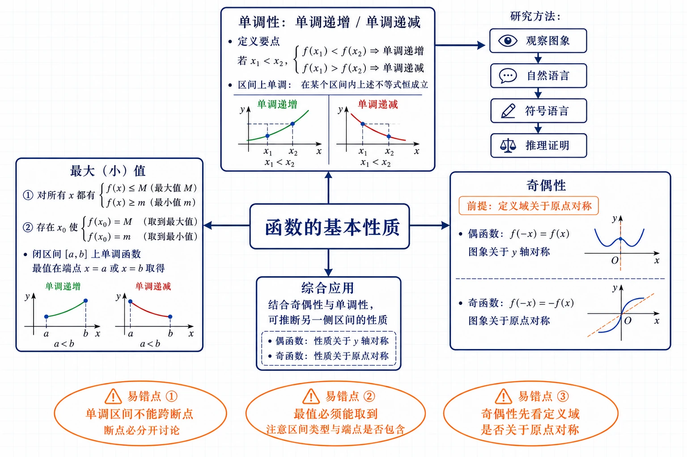
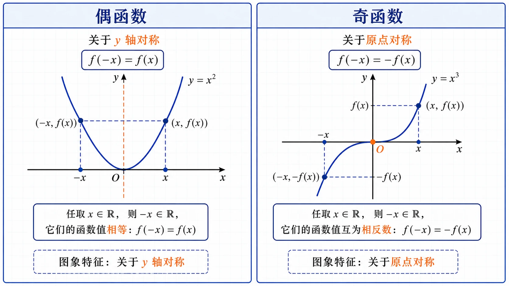
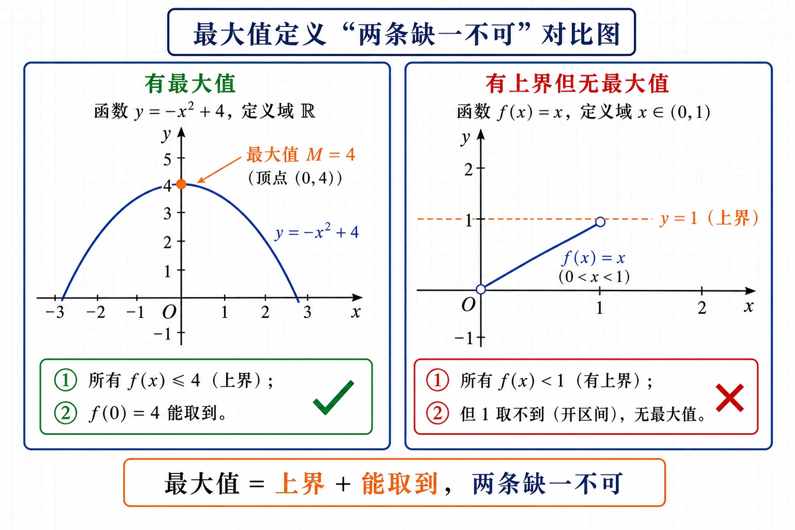
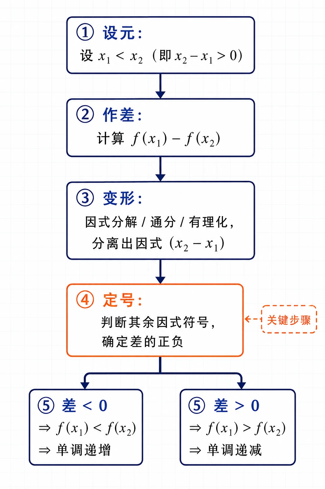
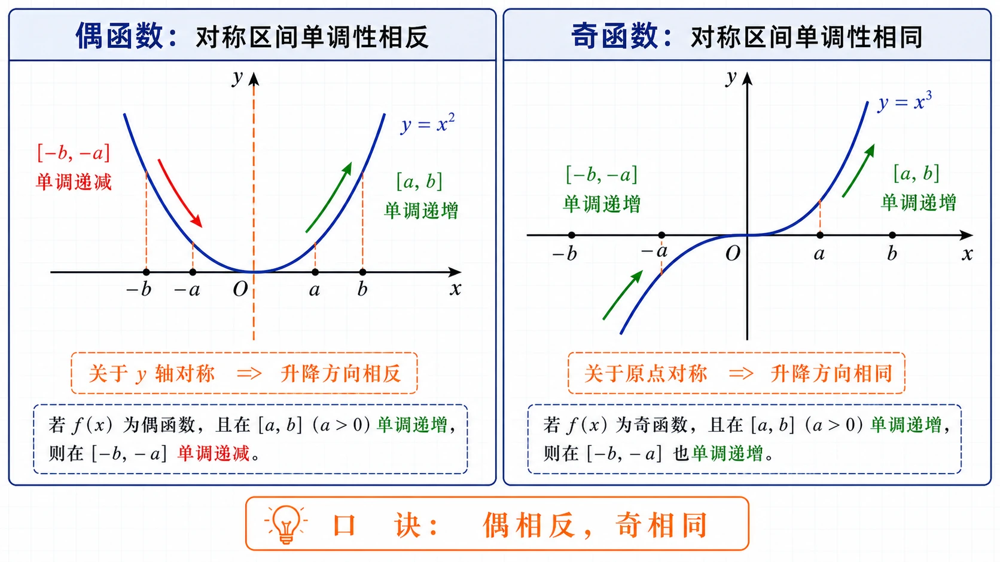

# 3.2 函数的基本性质

<!-- 图片描述：本节整体知识信息结构图。浅网格背景，中心节点写“函数的基本性质”。中心向上引出“单调性：单调递增 / 单调递减”，标注定义要点“$x_1<x_2\Rightarrow f(x_1)\lessgtr f(x_2)$”，并连出“研究方法：观察图象→自然语言→符号语言→推理证明”。中心向左引出“最大（小）值：①对所有 $x$ 都 $f(x)\le M$（$\ge m$）；②存在 $x_0$ 使 $f(x_0)=M$（$=m$）；闭区间上单调函数最值在端点取得”。中心向右引出“奇偶性：偶函数 $f(-x)=f(x)$ 图象关于 $y$ 轴对称；奇函数 $f(-x)=-f(x)$ 图象关于原点对称”，并标注前提“定义域关于原点对称”。中心向下引出“综合应用：奇偶性 + 单调性推断另一侧区间性质”。用橙色椭圆框标注三个易错点“单调区间不能跨断点”“最值必须能取到”“奇偶性先看定义域是否对称”。黑色深蓝线条为主，LaTeX 公式风格。 -->

## 本节学习目标

- 理解函数单调性的严格定义，能用符号语言刻画“图象上升/下降”，会用作差法证明简单函数（一次函数、二次函数、反比例型函数、$y=x+\dfrac{k}{x}$ 型）的单调性。
- 理解函数最大值、最小值的严格定义（两条要求：对所有 $x$ 都满足不等式 + 存在 $x_0$ 能取到），会利用单调性求闭区间上的最值，会用二次函数顶点法求最值。
- 理解奇函数、偶函数的定义，知道“定义域关于原点对称”是前提，会判断函数的奇偶性。
- 掌握奇偶性与图象对称性的关系：偶函数图象关于 $y$ 轴对称，奇函数图象关于原点对称，并能据此由一侧图象补全另一侧。
- 能综合运用单调性与奇偶性，由函数在一侧区间的性质推断另一侧区间的性质。
- 体会“观察图象提出猜想 $\to$ 自然语言描述 $\to$ 符号语言刻画 $\to$ 逻辑推理证明”这一研究函数性质的基本方法。

## 核心知识点讲解

### 一、知识对象与问题情境

3.1 节我们用集合和对应关系刻画了函数概念。函数 $y=f(x)$（$x\in A$）描述了变量之间的对应关系，研究函数就是要把握它的变化规律。自然要问：随着自变量 $x$ 的增大，函数值 $f(x)$ 是增大还是减小？函数有没有最高点或最低点？函数图象有没有对称性？这些就是函数的**基本性质**——单调性、最大（小）值、奇偶性。

研究函数性质有一条基本路径：**先画出函数图象，通过观察图象特征提出猜想，再用自然语言描述，最后抽象为数学符号严格刻画，并通过推理运算加以证明**。本节的单调性、奇偶性定义都是按这条路径得到的。这条路径也是今后研究各种函数（幂函数、指数函数、对数函数、三角函数）的通用方法。

### 二、核心概念与定义条件

**单调性定义**：设函数 $f(x)$ 的定义域为 $D$，区间 $I\subseteq D$。

- 如果对任意 $x_1,x_2\in I$，当 $x_1<x_2$ 时，都有 $f(x_1)<f(x_2)$，那么称函数 $f(x)$ 在区间 $I$ 上**单调递增**（图象从左到右上升）。
- 如果对任意 $x_1,x_2\in I$，当 $x_1<x_2$ 时，都有 $f(x_1)>f(x_2)$，那么称函数 $f(x)$ 在区间 $I$ 上**单调递减**（图象从左到右下降）。

特别地，当函数 $f(x)$ 在它的**整个定义域**上单调递增（递减）时，称它是**增函数**（**减函数**）。

如果函数 $y=f(x)$ 在区间 $I$ 上单调递增或单调递减，就说 $y=f(x)$ 在这一区间具有（严格的）单调性，区间 $I$ 叫作 $y=f(x)$ 的**单调区间**。

理解定义要注意三点：①单调性是相对于**某个区间**而言的，同一个函数在不同区间可以有不同单调性（如 $f(x)=x^2$ 在 $(-\infty,0]$ 递减、在 $[0,+\infty)$ 递增）；②“任意 $x_1,x_2$”意味着不能只看几个特殊点，必须对所有点都成立；③单调区间通常不能跨过函数的断点（如 $y=\dfrac1x$ 不能说在定义域上单调递减）。

**最大值、最小值定义**：设函数 $y=f(x)$ 的定义域为 $D$。如果存在实数 $M$ 满足：①对任意 $x\in D$，都有 $f(x)\le M$；②存在 $x_0\in D$，使得 $f(x_0)=M$。那么称 $M$ 是函数 $y=f(x)$ 的**最大值**。

类似地，把 $\le$ 换成 $\ge$、$M$ 换成 $m$，就得到**最小值** $m$ 的定义：①对任意 $x\in D$，$f(x)\ge m$；②存在 $x_0\in D$，$f(x_0)=m$。

定义的两条缺一不可：第①条保证 $M$ 是一个“上界”（所有函数值都不超过它），第②条保证这个上界“能取到”。只有上界而取不到，就不是最大值（如 $f(x)=x$，$x\in(0,1)$，函数值都小于 $1$，但 $1$ 取不到，所以没有最大值）。

**奇偶性定义**：设函数 $f(x)$ 的定义域为 $D$。

- 如果对任意 $x\in D$，都有 $-x\in D$，且 $f(-x)=f(x)$，那么 $f(x)$ 叫**偶函数**。
- 如果对任意 $x\in D$，都有 $-x\in D$，且 $f(-x)=-f(x)$，那么 $f(x)$ 叫**奇函数**。

注意：定义中“$-x\in D$”这个前提不能漏，它要求**定义域关于原点对称**。如果定义域不关于原点对称（如 $f(x)=x^2$，$x\in[0,+\infty)$），即便 $f(-x)=f(x)$ 形式上成立，也不是偶函数。

### 三、符号语言与等价表示

**单调性的等价刻画**：设 $x_1,x_2\in I$，记 $\Delta x=x_2-x_1$，$\Delta y=f(x_2)-f(x_1)$。

| 条件 | 结论 | 几何意义 |
|---|---|---|
| $x_1<x_2\Rightarrow f(x_1)<f(x_2)$ | 在 $I$ 上单调递增 | 图象上升 |
| $x_1<x_2\Rightarrow f(x_1)>f(x_2)$ | 在 $I$ 上单调递减 | 图象下降 |
| $\dfrac{\Delta y}{\Delta x}>0$（$x_1\ne x_2$） | 在 $I$ 上单调递增 | 变化率恒正 |
| $\dfrac{\Delta y}{\Delta x}<0$（$x_1\ne x_2$） | 在 $I$ 上单调递减 | 变化率恒负 |

**奇偶性的等价刻画**：

| 类型 | 定义条件 | 图象对称性 | 常见例子 |
|---|---|---|---|
| 偶函数 | $f(-x)=f(x)$ | 关于 $y$ 轴对称 | $x^2$、$x^4$、$|x|$、$\dfrac{1}{x^2+1}$ |
| 奇函数 | $f(-x)=-f(x)$ | 关于原点对称 | $x$、$x^3$、$\dfrac1x$、$x+\dfrac1x$ |

两个实用结论：①若奇函数 $f(x)$ 在 $x=0$ 处有定义，则 $f(0)=0$（因为 $f(0)=-f(0)$）；②奇偶函数定义域必关于原点对称。

**单调性与最值的关系**：若函数 $f(x)$ 在闭区间 $[a,b]$ 上单调递增，则最小值为 $f(a)$、最大值为 $f(b)$；若单调递减，则最大值为 $f(a)$、最小值为 $f(b)$。即闭区间上单调函数的最值在端点取得。

### 四、关键性质、定理与公式

**用作差法证明单调性的标准步骤**：

1. **设元**：设 $x_1,x_2$ 是区间 $I$ 内任意两个值，且 $x_1<x_2$（即 $x_2-x_1>0$）。
2. **作差**：计算 $f(x_1)-f(x_2)$（或 $f(x_2)-f(x_1)$）。
3. **变形**：通过因式分解、通分、分子有理化等手段，把差变形成若干因式相乘/相除的形式。
4. **定号**：判断各因式的符号，确定差的正负。
5. **结论**：若 $f(x_1)-f(x_2)<0$（即 $f(x_1)<f(x_2)$），则单调递增；若 $f(x_1)-f(x_2)>0$（即 $f(x_1)>f(x_2)$），则单调递减。

关键技巧：变形时要尽量把 $x_2-x_1$（已知为正）作为因式分离出来，其余因式的符号由区间条件判断。

**二次函数的最值**：二次函数 $y=ax^2+bx+c$（$a\ne0$），当 $x=-\dfrac{b}{2a}$ 时取得最值。$a>0$ 时为最小值 $\dfrac{4ac-b^2}{4a}$，$a<0$ 时为最大值 $\dfrac{4ac-b^2}{4a}$。

**奇偶性与单调性的关联**：

- 偶函数在对称区间 $[-b,-a]$ 和 $[a,b]$ 上的单调性**相反**（如 $f(x)=x^2$ 在 $[0,+\infty)$ 递增，在 $(-\infty,0]$ 递减）。
- 奇函数在对称区间 $[-b,-a]$ 和 $[a,b]$ 上的单调性**相同**（如 $f(x)=x^3$ 在 $[0,+\infty)$ 和 $(-\infty,0]$ 都递增）。

<!-- 图片描述：奇偶函数图象对称性对照图。左右两栏并排。左栏标题“偶函数”：画一条关于 $y$ 轴对称的抛物线 $y=x^2$，用橙色虚线画出 $y$ 轴，标注“关于 $y$ 轴对称”“$f(-x)=f(x)$”，并在 $x$ 和 $-x$ 处标出函数值相等的点。右栏标题“奇函数”：画一条关于原点对称的立方曲线 $y=x^3$，用橙色标注原点 $O$，标注“关于原点对称”“$f(-x)=-f(x)$”，并在 $x$ 和 $-x$ 处标出函数值相反的点。浅网格背景，坐标轴清晰，黑色线条。 -->

### 五、典型模型与解题方法

**模型一：根据图象写单调区间。** 观察图象从左到右的升降，上升段为单调递增区间，下降段为单调递减区间。注意单调区间一般用“和”连接，不用并集符号 $\cup$（如 $f(x)=\dfrac1x$ 的单调递减区间写成“$(-\infty,0)$ 和 $(0,+\infty)$”，不写成 $(-\infty,0)\cup(0,+\infty)$）。

**模型二：用定义证明单调性。** 按上述作差法五步进行。常见函数类型：一次函数 $f(x)=kx+b$；二次函数 $f(x)=x^2+c$ 在某区间；反比例型 $f(x)=\dfrac{k}{x}$、$f(x)=\dfrac{k}{x-a}$；对勾函数 $f(x)=x+\dfrac{k}{x}$。

**模型三：利用单调性求闭区间最值。** 先证明（或判断）函数在区间上的单调性，再由“单调函数最值在端点取得”求出最值。

**模型四：二次函数最值。** 用顶点公式或配方法，注意定义域限制（若限定在某区间上，要结合图象判断最值在顶点还是端点取得）。

**模型五：判断奇偶性。** 标准三步：①求定义域，看是否关于原点对称（不对称则非奇非偶）；②计算 $f(-x)$ 并化简；③比较 $f(-x)$ 与 $f(x)$、$-f(x)$ 的关系，下结论。

**模型六：综合应用（奇偶性 + 单调性）。** 由函数在一侧区间的单调性和奇偶性，推断另一侧区间的单调性（偶函数相反、奇函数相同）；或由奇偶性补全图象。

### 六、题型应用与迁移

本节题型分六类：①看图写单调区间；②用定义证明单调性（一次、二次、反比例型、对勾型）；③利用单调性或二次函数顶点求最值；④判断奇偶性；⑤由奇偶性补全图象、求解析式；⑥奇偶性与单调性结合推断。这些性质在后续幂函数、指数函数、对数函数、三角函数的研究中都会反复用到。

## 重点梳理

- **单调性是“局部”性质，必须指明区间**。一个函数在不同区间可以有不同单调性。这一点之所以重要，是因为脱离区间谈单调性会导致错误结论。例如 $f(x)=x^2$ 在 $\mathbb R$ 上既不单调递增也不单调递减，但在 $[0,+\infty)$ 上单调递增。触发条件：遇到单调性问题，第一反应是问“在哪个区间上”。
- **单调区间不能跨过函数的断点**。如 $f(x)=\dfrac1x$ 在 $(-\infty,0)$ 和 $(0,+\infty)$ 上各自单调递减，但不能说在定义域 $(-\infty,0)\cup(0,+\infty)$ 上单调递减。原因是取 $x_1=-1<1=x_2$ 时 $f(-1)=-1<1=f(1)$，出现 $x_1<x_2$ 但 $f(x_1)<f(x_2)$，违反递减定义。所以写单调区间时，断开的区间要分开写，用“和”连接。
- **最大（小）值定义的两条缺一不可**。“对所有 $x$ 都 $f(x)\le M$”保证 $M$ 是上界，“存在 $x_0$ 使 $f(x_0)=M$”保证能取到。判断最值时两条都要检查。常见反例：$f(x)=x$，$x\in(0,1)$ 有上界 $1$ 但取不到，无最大值。闭区间上的连续函数一定有最大值和最小值（这是后续要学的重要结论）。

<!-- 图片描述：最大值定义“两条缺一不可”对比图。分左右两栏。左栏标题“有最大值”：画开口向下的抛物线 $y=-x^2+4$（定义域 $\mathbb R$），顶点 $(0,4)$ 为最高点，用橙色实心圆点标注“最大值 $M=4$”，并标注“①所有 $f(x)\le4$（上界）；②$ f(0)=4$ 能取到”，打绿色勾。右栏标题“有上界但无最大值”：画 $f(x)=x$（$x\in(0,1)$）的线段（两端空心点），用橙色虚线标注 $y=1$（上界），标注“①所有 $f(x)<1$（有上界）；②但 $1$ 取不到（开区间），无最大值”，打红色叉。底部对比文字“最大值 = 上界 + 能取到，两条缺一不可”。浅网格背景，黑色坐标轴。 -->
- **奇偶性的前提是定义域关于原点对称**。判断奇偶性第一步永远是看定义域。如果定义域不关于原点对称，直接判定为“非奇非偶函数”，不必再算 $f(-x)$。例如 $f(x)=x^2$（$x\in[-1,2]$）定义域不对称，不是偶函数。
- **偶函数图象关于 $y$ 轴对称，奇函数图象关于原点对称**。这不仅是性质，更是充要条件：图象关于 $y$ 轴对称 $\Leftrightarrow$ 偶函数，图象关于原点对称 $\Leftrightarrow$ 奇函数。利用它可以由一侧图象补全另一侧，简化研究。
- **奇偶性与单调性的关联要记牢**。偶函数在对称区间单调性相反，奇函数在对称区间单调性相同。这是综合题的常考考点，可用于由一侧性质推断另一侧，避免重复证明。

<!-- 图片描述：作差法证明单调性流程图。从上到下五个方框，用向下箭头连接。第一框“设元：设 $x_1<x_2$（即 $x_2-x_1>0$）”；第二框“作差：计算 $f(x_1)-f(x_2)$”；第三框“变形：因式分解/通分/有理化，分离出因式 $(x_2-x_1)$”；第四框“定号：判断其余因式符号，确定差的正负”（用橙色边框突出，旁注“关键步骤”）；第五框分为两个并列结果框：左边“差 $<0$ $\Rightarrow$ $f(x_1)<f(x_2)$ $\Rightarrow$ 单调递增”，右边“差 $>0$ $\Rightarrow$ $f(x_1)>f(x_2)$ $\Rightarrow$ 单调递减”。浅网格背景，黑色线条。 -->

## 难点突破

### 难点一：为什么单调区间不能跨断点

反比例函数 $f(x)=\dfrac1x$ 的定义域是 $(-\infty,0)\cup(0,+\infty)$，在 $(-\infty,0)$ 上单调递减、在 $(0,+\infty)$ 上也单调递减。但如果取 $x_1=-1\in(-\infty,0)$、$x_2=1\in(0,+\infty)$，则 $x_1<x_2$，而 $f(-1)=-1<1=f(1)$，即 $f(x_1)<f(x_2)$，这与“单调递减”（应满足 $f(x_1)>f(x_2)$）矛盾。原因是 $x=0$ 处函数无定义，图象断开，跨断点取两点不能保证单调性。突破方法：写单调区间时，函数无定义的点（断点）必须把区间分开，各段单独写，用“和”连接。

### 难点二：作差后如何判断符号

作差法的难点在第 4 步“定号”。常见技巧：①因式分解，把差分解成若干因式相乘，逐个判断符号；②对含分式的差通分后，分子分母分别判断；③对含根式的差用分子有理化。关键是要把已知为正的 $(x_2-x_1)$ 分离出来。例如证明 $f(x)=x+\dfrac1x$ 在 $(1,+\infty)$ 递增时，

$$
f(x_1)-f(x_2)=(x_1-x_2)+\left(\frac1{x_1}-\frac1{x_2}\right)=(x_1-x_2)\left(1+\frac1{x_1x_2}\right).
$$

由 $x_1,x_2>1$ 知 $x_1x_2>1$，$1+\dfrac1{x_1x_2}>0$，又 $x_1-x_2<0$，所以差 $<0$，$f(x_1)<f(x_2)$，递增。突破方法：多练因式分解和通分，养成“分离 $(x_2-x_1)$ 因式”的习惯。

### 难点三：最大值与上界的区别

最大值定义要求“能取到”。$f(x)=x$（$x\in(0,1)$）的函数值都小于 $1$，$1$ 是一个上界，但 $1$ 不在函数值范围内（取不到），所以 $f(x)$ 没有最大值。而 $f(x)=x$（$x\in(0,1]$）的最大值是 $1$（在 $x=1$ 处取到）。突破方法：判断最大值时，除了确认“所有值都不超过它”，还要确认“存在某个 $x$ 能取到它”。开区间上的函数往往只有上界而无最大值。

### 难点四：判断奇偶性容易漏看定义域

常见错误：看到 $f(x)=x^2$ 就直接算 $f(-x)=(-x)^2=x^2=f(x)$ 判定为偶函数，但若定义域是 $[0,+\infty)$，则 $-x$ 不在定义域内，前提不满足。突破方法：固定步骤——**第一步先求定义域并判断是否关于原点对称**，不对称直接判“非奇非偶”，对称才继续算 $f(-x)$。

### 难点五：奇偶性与单调性的综合推断

已知偶函数 $f(x)$ 在 $[a,b]$（$a>0$）上单调递减，它在 $[-b,-a]$ 上单调递增还是递减？方法是：偶函数图象关于 $y$ 轴对称，$[-b,-a]$ 是 $[a,b]$ 关于 $y$ 轴的对称区间，图象翻过去后升降方向相反，所以单调递增。奇函数则相反——对称区间单调性相同。突破方法：画图辅助理解，或用定义严格推导：设 $-b\le x_1<x_2\le-a$，则 $a\le-x_2<-x_1\le b$，由 $[a,b]$ 上递减得 $f(-x_2)>f(-x_1)$；偶函数 $f(-x)=f(x)$，所以 $f(x_2)>f(x_1)$，即 $f(x_1)<f(x_2)$，递增。

<!-- 图片描述：奇偶性与单调性综合推断示意图。分左右两栏。左栏标题“偶函数：对称区间单调性相反”：画一条关于 $y$ 轴对称的曲线（如抛物线 $y=x^2$），标注右半区间 $[a,b]$ 单调递增（用绿色上升箭头），左半区间 $[-b,-a]$ 单调递减（用红色下降箭头），用橙色虚线画出 $y$ 轴，标注“关于 $y$ 轴对称 $\Rightarrow$ 升降方向相反”。右栏标题“奇函数：对称区间单调性相同”：画一条关于原点对称的曲线（如 $y=x^3$），标注右半区间 $[a,b]$ 单调递增（绿色上升箭头），左半区间 $[-b,-a]$ 也单调递增（绿色上升箭头），标注“关于原点对称 $\Rightarrow$ 升降方向相同”。底部口诀“偶相反，奇相同”。浅网格背景，黑色坐标轴。 -->

## 例题讲解

### 例1：用定义研究一次函数 $f(x)=kx+b$（$k\ne0$）的单调性

**审题：** 用作差法，按“设元→作差→变形→定号→结论”五步进行。

**证明：** 函数 $f(x)=kx+b$ 的定义域是 $\mathbb R$。任取 $x_1,x_2\in\mathbb R$，且 $x_1<x_2$（即 $x_1-x_2<0$），则

$$
f(x_1)-f(x_2)=(kx_1+b)-(kx_2+b)=k(x_1-x_2).
$$

由 $x_1-x_2<0$：

- 当 $k>0$ 时，$k(x_1-x_2)<0$，即 $f(x_1)<f(x_2)$，函数单调递增，$f(x)=kx+b$ 是增函数。
- 当 $k<0$ 时，$k(x_1-x_2)>0$，即 $f(x_1)>f(x_2)$，函数单调递减，$f(x)=kx+b$ 是减函数。

**反思：** 这与初中由图象得到的结论一致，但这里用严格的推理运算证明了它。关键在于把差分解为 $k\cdot(x_1-x_2)$，由两个因式的符号确定差的正负。

### 例2：证明玻意耳定律对应的函数是减函数

物理学中的玻意耳定律 $p=\dfrac{k}{V}$（$k$ 为正常数）表明：一定质量的气体在温度不变时，体积 $V$ 减小则压强 $p$ 增大。用单调性证明。

**证明：** 任取 $V_1,V_2\in(0,+\infty)$，且 $V_1<V_2$（即 $V_2-V_1>0$），则

$$
p_1-p_2=\frac{k}{V_1}-\frac{k}{V_2}=\frac{k(V_2-V_1)}{V_1V_2}.
$$

由 $V_1,V_2>0$ 得 $V_1V_2>0$；由 $V_1<V_2$ 得 $V_2-V_1>0$；又 $k>0$。所以 $p_1-p_2>0$，即 $p_1>p_2$。因此函数 $p=\dfrac{k}{V}$（$V\in(0,+\infty)$）是减函数，即体积 $V$ 减小时压强 $p$ 增大。

**反思：** 这是单调性在物理中的应用。证明的关键是通分后分子分离出 $(V_2-V_1)$。

### 例3：证明 $y=x+\dfrac1x$ 在 $(1,+\infty)$ 上单调递增

**证明：** 任取 $x_1,x_2\in(1,+\infty)$，且 $x_1<x_2$，则

$$
\begin{aligned}
y_1-y_2&=\left(x_1+\frac1{x_1}\right)-\left(x_2+\frac1{x_2}\right)=(x_1-x_2)+\left(\frac1{x_1}-\frac1{x_2}\right)\\
&=(x_1-x_2)+\frac{x_2-x_1}{x_1x_2}=(x_1-x_2)\left(1+\frac1{x_1x_2}\right).
\end{aligned}
$$

由 $x_1,x_2\in(1,+\infty)$ 得 $x_1x_2>1$，所以 $1+\dfrac1{x_1x_2}>0$。又 $x_1<x_2$ 得 $x_1-x_2<0$。因此 $y_1-y_2<0$，即 $y_1<y_2$。所以函数 $y=x+\dfrac1x$ 在 $(1,+\infty)$ 上单调递增。

**反思：** 这是对勾函数（$y=x+\dfrac{k}{x}$ 型）的典型证明。难点在于把两项的差合并因式分解，提取公因式 $(x_1-x_2)$。

### 例4：烟花爆裂的最佳时刻

“菊花”烟花在达到最高点时爆裂效果最佳。烟花距地面高度 $h$（m）与时间 $t$（s）的关系为 $h(t)=-4.9t^2+14.7t+18$。烟花冲出后何时爆裂最佳？此时高度是多少（精确到 $1$ m）？

**审题：** 求二次函数的最大值。函数图象是开口向下的抛物线，顶点即最高点。

**解：** 对于函数 $h(t)=-4.9t^2+14.7t+18$，当

$$
t=-\frac{14.7}{2\times(-4.9)}=\frac{14.7}{9.8}=1.5
$$

时，函数取得最大值

$$
h=\frac{4\times(-4.9)\times18-14.7^2}{4\times(-4.9)}=\frac{-352.8-216.09}{-19.6}=\frac{-568.89}{-19.6}\approx29.0.
$$

所以烟花冲出后 $1.5$ s 是爆裂的最佳时刻，此时距地面约 $29$ m。

**检验：** $h(1.5)=-4.9\times2.25+14.7\times1.5+18=-11.025+22.05+18=29.025\approx29$ ✓。

### 例5：利用单调性求闭区间最值

求函数 $f(x)=\dfrac{2}{x-1}$（$x\in[2,6]$）的最大值和最小值。

**审题：** 先证明函数在 $[2,6]$ 上的单调性，再由端点确定最值。

**解：** 任取 $x_1,x_2\in[2,6]$，且 $x_1<x_2$，则

$$
f(x_1)-f(x_2)=\frac{2}{x_1-1}-\frac{2}{x_2-1}=\frac{2[(x_2-1)-(x_1-1)]}{(x_1-1)(x_2-1)}=\frac{2(x_2-x_1)}{(x_1-1)(x_2-1)}.
$$

由 $2\le x_1<x_2\le6$ 得 $x_2-x_1>0$，$(x_1-1)(x_2-1)>0$（因 $x_1-1\ge1>0$，$x_2-1>0$）。所以 $f(x_1)-f(x_2)>0$，即 $f(x_1)>f(x_2)$，函数在 $[2,6]$ 上单调递减。

因此最大值在左端点取得：$f(2)=\dfrac{2}{2-1}=2$；最小值在右端点取得：$f(6)=\dfrac{2}{6-1}=\dfrac25=0.4$。

**反思：** 闭区间上单调函数的最值在端点取得——递增则左端最小、右端最大；递减则左端最大、右端最小。

### 例6：判断函数的奇偶性

判断下列函数的奇偶性：（1）$f(x)=x^4$；（2）$f(x)=x^5$；（3）$f(x)=x+\dfrac1x$；（4）$f(x)=\dfrac1{x^2}$。

**解：**

（1）$f(x)=x^4$ 定义域为 $\mathbb R$，关于原点对称。$f(-x)=(-x)^4=x^4=f(x)$，所以是**偶函数**。

（2）$f(x)=x^5$ 定义域为 $\mathbb R$，关于原点对称。$f(-x)=(-x)^5=-x^5=-f(x)$，所以是**奇函数**。

（3）$f(x)=x+\dfrac1x$ 定义域为 $\{x\mid x\ne0\}$，关于原点对称。

$$
f(-x)=(-x)+\frac1{-x}=-x-\frac1x=-\left(x+\frac1x\right)=-f(x),
$$

所以是**奇函数**。

（4）$f(x)=\dfrac1{x^2}$ 定义域为 $\{x\mid x\ne0\}$，关于原点对称。

$$
f(-x)=\frac1{(-x)^2}=\frac1{x^2}=f(x),
$$

所以是**偶函数**。

**反思：** 四个函数都先确认了定义域关于原点对称，再计算 $f(-x)$。$x$ 的偶次幂（$x^2,x^4$）构成偶函数，奇次幂（$x,x^3,x^5$）构成奇函数；但 $x+\dfrac1x$ 这类组合要具体计算。

## 易错点整理

- **错误表现**：把函数“在某区间单调”说成“在定义域单调”。
  - **错因分析**：忽略了单调性是局部性质。一个函数可以一部分递增一部分递减。
  - **正确处理**：谈单调性必须指明区间；写单调区间时断点处分开。

- **错误表现**：用几个特殊点的函数值变化代替严格证明。
  - **反例**：取 $x=1,2,3$ 验证 $f(1)<f(2)<f(3)$ 就说函数递增——这只是举例，不是证明。
  - **正确处理**：必须任取 $x_1<x_2$，用定义（作差法）严格证明。

- **错误表现**：作差后不会判断符号，直接下结论。
  - **正确处理**：把差因式分解，分离出 $(x_2-x_1)$（已知正），其余因式由区间条件判断符号，逐步说明。

- **错误表现**：单调区间用并集符号 $\cup$ 连接。
  - **反例**：$f(x)=\dfrac1x$ 的递减区间写成 $(-\infty,0)\cup(0,+\infty)$ 是错误的。
  - **正确处理**：断开的单调区间用“和”连接，如“$(-\infty,0)$ 和 $(0,+\infty)$”。

- **错误表现**：判断奇偶性时不看定义域，直接算 $f(-x)$。
  - **反例**：$f(x)=x^2$（$x\in[0,+\infty)$）虽 $f(-x)=f(x)$，但定义域不对称，不是偶函数。
  - **正确处理**：第一步先求定义域判断对称性，不对称直接判非奇非偶。

- **错误表现**：把“偶函数关于 $y$ 轴对称”和“奇函数关于原点对称”记反。
  - **正确处理**：记口诀“偶轴奇原”——偶函数关于 $y$ 轴（竖轴），奇函数关于原点。

- **错误表现**：求最值时不检查能否取到，把上界当最大值。
  - **正确处理**：最大（小）值定义两条都要满足——所有值不超过（不低于）它，且存在某点能取到它。

## 考点考证点整理

### 考点一：根据图象写单调区间

- **出题思路**：给出函数图象，要求写出单调区间及各区间上的单调性。
- **关键条件**：图象从左到右的升降趋势；函数无定义处（断点）。
- **解答要点**：观察图象上升段为递增区间、下降段为递减区间；断点处分开写，用“和”连接，不用 $\cup$。
- **易扣分点**：单调区间跨断点；用 $\cup$ 连接断开的区间；区间端点写错（开闭）。

### 考点二：用定义证明单调性

- **出题思路**：要求用定义证明一次函数、二次函数、反比例型函数、对勾型函数在某区间的单调性。
- **关键条件**：区间范围（决定因式符号）；$x_1<x_2$（即 $x_2-x_1>0$）。
- **解答要点**：设元 $\to$ 作差 $\to$ 变形（因式分解、通分、有理化）$\to$ 定号（分离 $(x_2-x_1)$，判断其余因式符号）$\to$ 结论。每步都要写清依据。
- **易扣分点**：只取特殊值不严格证明；作差后不变形直接说正负；因式符号判断缺依据（没用到区间条件）；结论方向写反。

### 考点三：利用单调性或二次函数顶点求最值

- **出题思路**：给闭区间上的函数，先证单调性再求最值；或给二次函数用顶点法求最值；或实际问题（烟花高度、熊猫居室面积等）求最值。
- **关键条件**：函数在区间上的单调性；二次函数的开口方向和顶点；定义域限制。
- **解答要点**：单调函数闭区间最值在端点（递增左小右大、递减左大右小）；二次函数用顶点公式 $x=-\dfrac{b}{2a}$；实际问题要结合实际范围。
- **易扣分点**：没证单调性就直接说最值在端点；最值没检查能否取到；二次函数开口方向判断错；限定区间时没结合图象判断最值在顶点还是端点。

### 考点四：判断函数的奇偶性

- **出题思路**：给若干函数，判断奇偶性（奇函数、偶函数、非奇非偶、既奇又偶）。
- **关键条件**：定义域是否关于原点对称；$f(-x)$ 与 $f(x)$、$-f(x)$ 的关系。
- **解答要点**：①求定义域判断对称性；②计算并化简 $f(-x)$；③比较下结论。四类结论：$f(-x)=f(x)$ 偶，$f(-x)=-f(x)$ 奇，二者都满足则既奇又偶（如 $f(x)=0$），都不满足则非奇非偶。
- **易扣分点**：不看定义域直接算 $f(-x)$；$f(-x)$ 化简错误；既奇又偶的情况（只有 $f(x)\equiv0$）判断遗漏。

### 考点五：奇偶性的图象应用与综合推断

- **出题思路**：给奇（偶）函数在一侧的图象或解析式，补全另一侧；已知奇偶性和一侧单调性，推断另一侧单调性；由奇偶性求解析式或函数值。
- **关键条件**：奇偶性决定对称性（偶关于 $y$ 轴，奇关于原点）；奇偶性与单调性的关联（偶相反、奇相同）；奇函数若在 $x=0$ 有定义则 $f(0)=0$。
- **解答要点**：补图象按对称性翻折；推断单调性用“偶相反、奇相同”或用定义严格推导；求解析式利用 $f(-x)=\pm f(x)$。
- **易扣分点**：对称性记反（偶原奇轴）；推断单调性方向错误；忽略 $f(0)=0$ 的隐含条件。

## 练习题

### 基础训练

1. 根据定义证明：（1）$f(x)=-2x+1$ 是减函数；（2）$f(x)=3x+2$ 是增函数。
2. 证明：函数 $f(x)=x^2+1$ 在 $(0,+\infty)$ 上单调递增。
3. 证明：函数 $f(x)=1-\dfrac2x$ 在 $(-\infty,0)$ 上单调递增。
4. 判断下列函数的奇偶性：（1）$f(x)=2x^4+3x^2$；（2）$f(x)=x^3-2x$；（3）$f(x)=x^2+1$；（4）$f(x)=\dfrac{x}{x^2+1}$。
5. 画出函数 $y=9-x^2$ 的图象，写出它的单调区间。
6. 求函数 $f(x)=x^2$ 在 $[-1,3]$ 上的最大值和最小值。

### 巩固训练

1. 根据定义证明：函数 $y=x+\dfrac1x$ 在区间 $[3,+\infty)$ 上单调递增。
2. 讨论函数 $y=x+\dfrac1x$ 在区间 $(0,+\infty)$ 上的单调性（不需证明，结合图象说明）。
3. 已知函数 $f(x)=x^2-2x$，$g(x)=x^2-2x$（$x\in[2,4]$）。
   （1）分别求 $f(x)$、$g(x)$ 的单调区间；
   （2）分别求 $f(x)$、$g(x)$ 的最小值。
4. 已知 $f(x)$ 是偶函数，且在 $(0,+\infty)$ 上单调递减，判断 $f(x)$ 在 $(-\infty,0)$ 上单调递增还是递减，并证明。
5. 某汽车租赁公司的月收益 $y$（元）与每辆车月租金 $x$（元）的关系为 $y=-\dfrac{x^2}{100}+162x-21000$。每辆车月租金为多少时月收益最大？最大月收益是多少？
6. 已知函数 $f(x)$ 是定义域为 $\mathbb R$ 的奇函数，当 $x\ge0$ 时 $f(x)=x(1+x)$。画出 $f(x)$ 的图象，并求出 $f(x)$ 的完整解析式。
7. 证明：（1）若 $f(x)=ax+b$，则 $f\!\left(\dfrac{x_1+x_2}{2}\right)=\dfrac{f(x_1)+f(x_2)}{2}$；（2）若 $g(x)=x^2+ax+b$，则 $g\!\left(\dfrac{x_1+x_2}{2}\right)\le\dfrac{g(x_1)+g(x_2)}{2}$。

### 提升训练

1. 讨论函数 $y=x+\dfrac{k}{x}$（$k>0$）在区间 $(0,+\infty)$ 上的单调性，并给出证明。
2. 设函数 $y=f(x)$ 的定义域为 $D$，区间 $I\subseteq D$，记 $\Delta x=x_2-x_1$，$\Delta y=f(x_2)-f(x_1)$。证明：函数 $y=f(x)$ 在 $I$ 上单调递增的充要条件是：对任意 $x_1,x_2\in I$，$x_1\ne x_2$，都有 $\dfrac{\Delta y}{\Delta x}>0$。
3. 动物园要建造一面靠墙的两间面积相同的矩形熊猫居室，可供建造围墙的材料总长是 $30\text{ m}$。设每间居室的宽为 $x$（m），$x$ 为多少时每间居室面积最大？最大面积是多少？
4. 已知奇函数 $f(x)$ 在 $[a,b]$（$0<a<b$）上单调递减，判断 $f(x)$ 在 $[-b,-a]$ 上单调递增还是递减？若改为偶函数呢？分别证明你的结论。
5. 已知函数 $f(x)=4x^2-kx-8$ 在 $[5,20]$ 上具有单调性，求实数 $k$ 的取值范围。

## 练习题答案

### 基础训练答案

1. （1）任取 $x_1<x_2$，$f(x_1)-f(x_2)=(-2x_1+1)-(-2x_2+1)=-2(x_1-x_2)$。由 $x_1<x_2$ 得 $x_1-x_2<0$，故 $-2(x_1-x_2)>0$，即 $f(x_1)>f(x_2)$，函数单调递减，$f(x)=-2x+1$ 是减函数。
   （2）任取 $x_1<x_2$，$f(x_1)-f(x_2)=(3x_1+2)-(3x_2+2)=3(x_1-x_2)<0$，即 $f(x_1)<f(x_2)$，函数单调递增，$f(x)=3x+2$ 是增函数。
2. 任取 $x_1,x_2\in(0,+\infty)$，$x_1<x_2$，$f(x_1)-f(x_2)=(x_1^2+1)-(x_2^2+1)=x_1^2-x_2^2=(x_1+x_2)(x_1-x_2)$。由 $x_1,x_2>0$ 得 $x_1+x_2>0$；由 $x_1<x_2$ 得 $x_1-x_2<0$。所以 $(x_1+x_2)(x_1-x_2)<0$，即 $f(x_1)<f(x_2)$，函数在 $(0,+\infty)$ 上单调递增。
3. 任取 $x_1,x_2\in(-\infty,0)$，$x_1<x_2$，$f(x_1)-f(x_2)=\left(1-\dfrac2{x_1}\right)-\left(1-\dfrac2{x_2}\right)=\dfrac2{x_2}-\dfrac2{x_1}=\dfrac{2(x_1-x_2)}{x_1x_2}$。由 $x_1,x_2<0$ 得 $x_1x_2>0$；由 $x_1<x_2$ 得 $x_1-x_2<0$。所以 $\dfrac{2(x_1-x_2)}{x_1x_2}<0$，即 $f(x_1)<f(x_2)$，函数在 $(-\infty,0)$ 上单调递增。
4. （1）定义域 $\mathbb R$ 对称。$f(-x)=2(-x)^4+3(-x)^2=2x^4+3x^2=f(x)$，**偶函数**。
   （2）定义域 $\mathbb R$ 对称。$f(-x)=(-x)^3-2(-x)=-x^3+2x=-(x^3-2x)=-f(x)$，**奇函数**。
   （3）定义域 $\mathbb R$ 对称。$f(-x)=(-x)^2+1=x^2+1=f(x)$，**偶函数**。
   （4）定义域 $\mathbb R$ 对称。$f(-x)=\dfrac{-x}{(-x)^2+1}=\dfrac{-x}{x^2+1}=-\dfrac{x}{x^2+1}=-f(x)$，**奇函数**。
5. $y=9-x^2$ 是开口向下、顶点在 $(0,9)$ 的抛物线。在 $(-\infty,0]$ 上单调递增，在 $[0,+\infty)$ 上单调递减。
6. $f(x)=x^2$ 在 $[-1,0]$ 上单调递减，在 $[0,3]$ 上单调递增。最小值在 $x=0$ 处：$f(0)=0$。比较两端点：$f(-1)=1$，$f(3)=9$，最大值在 $x=3$ 处：$9$。所以最小值为 $0$，最大值为 $9$。

### 巩固训练答案

1. 任取 $x_1,x_2\in[3,+\infty)$，$x_1<x_2$，

$$
y_1-y_2=(x_1-x_2)\left(1+\frac1{x_1x_2}\right).
$$

   由 $x_1,x_2\ge3$ 得 $x_1x_2\ge9>1$，故 $1+\dfrac1{x_1x_2}>0$；又 $x_1-x_2<0$。所以 $y_1-y_2<0$，即 $y_1<y_2$，函数在 $[3,+\infty)$ 上单调递增。
2. 函数 $y=x+\dfrac1x$（$x>0$）的图象是“对勾”形：在 $(0,1]$ 上单调递减，在 $[1,+\infty)$ 上单调递增，在 $x=1$ 处取得最小值 $2$。
3. （1）$f(x)=x^2-2x=(x-1)^2-1$，定义域 $\mathbb R$，在 $(-\infty,1]$ 上单调递减，在 $[1,+\infty)$ 上单调递增。$g(x)=x^2-2x$（$x\in[2,4]$），因对称轴 $x=1<2$，函数在 $[2,4]$ 上单调递增。
   （2）$f(x)$ 在 $x=1$ 处取最小值 $f(1)=-1$。$g(x)$ 在 $[2,4]$ 递增，最小值在 $x=2$ 处：$g(2)=4-4=0$。
   （注：$f$ 和 $g$ 解析式相同但定义域不同，是不同的函数，最值不同。）
4. $f(x)$ 在 $(-\infty,0)$ 上单调递增。证明：任取 $x_1,x_2\in(-\infty,0)$，$x_1<x_2<0$，则 $0<-x_2<-x_1$，即 $-x_2,-x_1\in(0,+\infty)$ 且 $-x_2<-x_1$。由 $f$ 在 $(0,+\infty)$ 递减得 $f(-x_2)>f(-x_1)$。又 $f$ 是偶函数，$f(-x_2)=f(x_2)$，$f(-x_1)=f(x_1)$，所以 $f(x_2)>f(x_1)$，即 $f(x_1)<f(x_2)$。故 $f(x)$ 在 $(-\infty,0)$ 上单调递增。
5. $y=-\dfrac{x^2}{100}+162x-21000$，$a=-\dfrac1{100}<0$，开口向下。当 $x=-\dfrac{162}{2\times(-1/100)}=\dfrac{162}{0.02}=8100$ 时取最大值。$y_{\max}=-\dfrac{8100^2}{100}+162\times8100-21000=-656100+1312200-21000=635100$。所以每辆车月租金为 $8100$ 元时月收益最大，最大月收益 $635100$ 元。
6. 当 $x\ge0$ 时 $f(x)=x(1+x)=x+x^2$。因 $f(x)$ 是奇函数，$f(-x)=-f(x)$。当 $x<0$ 时，$-x>0$，$f(-x)=(-x)+(-x)^2=-x+x^2$，所以 $f(x)=-f(-x)=-(-x+x^2)=x-x^2$。完整解析式：$f(x)=\begin{cases}x+x^2,&x\ge0,\\x-x^2,&x<0.\end{cases}$ 又 $f(0)=0$，且 $f(0)=0$ 满足奇函数在原点有定义则 $f(0)=0$。图象：$x\ge0$ 部分是抛物线 $y=x^2+x$（从原点向右上升），$x<0$ 部分是抛物线 $y=x-x^2$（向左先升后降），整体关于原点对称。
7. （1）$f\!\left(\dfrac{x_1+x_2}{2}\right)=a\cdot\dfrac{x_1+x_2}{2}+b=\dfrac{ax_1+ax_2}{2}+b=\dfrac{(ax_1+b)+(ax_2+b)}{2}=\dfrac{f(x_1)+f(x_2)}{2}$。
   （2）记 $m=\dfrac{x_1+x_2}{2}$。$\dfrac{g(x_1)+g(x_2)}{2}-g(m)=\dfrac{(x_1^2+ax_1+b)+(x_2^2+ax_2+b)}{2}-(m^2+am+b)=\dfrac{x_1^2+x_2^2}{2}-m^2=\dfrac{x_1^2+x_2^2}{2}-\dfrac{(x_1+x_2)^2}{4}=\dfrac{2(x_1^2+x_2^2)-(x_1+x_2)^2}{4}=\dfrac{(x_1-x_2)^2}{4}\ge0$。所以 $g(m)\le\dfrac{g(x_1)+g(x_2)}{2}$。

### 提升训练答案

1. 任取 $x_1,x_2\in(0,+\infty)$，$x_1<x_2$，

$$
y_1-y_2=(x_1-x_2)+\left(\frac{k}{x_1}-\frac{k}{x_2}\right)=(x_1-x_2)\left(1-\frac{k}{x_1x_2}\right)=(x_1-x_2)\cdot\frac{x_1x_2-k}{x_1x_2}.
$$

   由 $x_1,x_2>0$ 得 $x_1x_2>0$，分母为正；$x_1-x_2<0$。差的符号取决于 $x_1x_2-k$：
   - 当 $x_1,x_2\in[\sqrt{k},+\infty)$ 时，$x_1x_2\ge k$，$x_1x_2-k\ge0$，差 $\le0$（$x_1\ne x_2$ 时 $<0$），函数**单调递增**。
   - 当 $x_1,x_2\in(0,\sqrt{k}]$ 时，$x_1x_2\le k$，$x_1x_2-k\le0$，差 $\ge0$，函数**单调递减**。
   
   所以 $y=x+\dfrac{k}{x}$（$k>0$）在 $(0,\sqrt{k}]$ 上单调递减，在 $[\sqrt{k},+\infty)$ 上单调递增，在 $x=\sqrt{k}$ 处取最小值 $2\sqrt{k}$。
2. **必要性**（递增 $\Rightarrow \dfrac{\Delta y}{\Delta x}>0$）：若 $f$ 在 $I$ 递增，任取 $x_1\ne x_2$。若 $x_1<x_2$，则 $f(x_1)<f(x_2)$，$\Delta y=f(x_2)-f(x_1)>0$，$\Delta x=x_2-x_1>0$，故 $\dfrac{\Delta y}{\Delta x}>0$。若 $x_1>x_2$，则 $f(x_1)>f(x_2)$，$\Delta y<0$，$\Delta x<0$，$\dfrac{\Delta y}{\Delta x}>0$。
   **充分性**（$\dfrac{\Delta y}{\Delta x}>0$ $\Rightarrow$ 递增）：若对任意 $x_1\ne x_2$ 都有 $\dfrac{\Delta y}{\Delta x}>0$。取 $x_1<x_2$，则 $\Delta x>0$，由 $\dfrac{\Delta y}{\Delta x}>0$ 得 $\Delta y>0$，即 $f(x_2)>f(x_1)$，函数递增。证毕。
3. 设每间居室宽为 $x$ m，则两间居室共占宽 $2x$。靠墙的总长方向，设总长为 $L$，由围墙总长 $30$ m 得：宽方向有 $3$ 条（两间分隔 $1$ 条加两端 $2$ 条），长方向有 $2$ 条（每间居室一条长边靠墙，外侧两条长边围起）。设长为 $y$，则 $2x\cdot3+2y=30$？重新分析：两间面积相同的矩形居室一面靠墙并排，垂直墙的方向为宽 $x$（两间共 $2x$），平行墙方向为长 $y$。围墙包括：垂直墙方向 $3$ 段宽（左、中隔、右），每段长 $x$，共 $3x$；平行墙方向 $2$ 段长（前面两条），每段长 $2y$？更清晰地：每间宽 $x$、长 $y$，并排两间，总宽 $2x$、长 $y$。围墙：与墙平行的外边 $2$ 条长 $y$，与墙垂直的边 $3$ 条长 $x$。总长 $2y+3x=30$，得 $y=\dfrac{30-3x}{2}$。每间面积 $S=xy=x\cdot\dfrac{30-3x}{2}=\dfrac{30x-3x^2}{2}=-\dfrac32x^2+15x$。当 $x=-\dfrac{15}{2\times(-3/2)}=5$ 时取最大值，$S_{\max}=-\dfrac32\times25+75=-37.5+75=37.5$。此时 $y=\dfrac{30-15}{2}=7.5$。所以宽为 $5$ m 时每间居室面积最大，最大为 $37.5\text{ m}^2$。
4. **奇函数情况**：$f(x)$ 在 $[-b,-a]$ 上单调递减。证明：任取 $x_1,x_2\in[-b,-a]$，$x_1<x_2$，则 $a\le-x_2<-x_1\le b$，即 $-x_2<-x_1$ 且都在 $[a,b]$ 内。由 $f$ 在 $[a,b]$ 递减得 $f(-x_2)>f(-x_1)$。奇函数 $f(-x)=-f(x)$，所以 $-f(x_2)>-f(x_1)$，即 $f(x_2)<f(x_1)$，$f(x_1)>f(x_2)$，单调递减。**结论：奇函数在对称区间单调性相同。**
   **偶函数情况**：$f(x)$ 在 $[-b,-a]$ 上单调递增。证明：同理 $-x_2<-x_1$ 且都在 $[a,b]$ 内，$f(-x_2)>f(-x_1)$。偶函数 $f(-x)=f(x)$，所以 $f(x_2)>f(x_1)$，即 $f(x_1)<f(x_2)$，单调递增。**结论：偶函数在对称区间单调性相反。**
5. $f(x)=4x^2-kx-8$，开口向上（$4>0$），对称轴 $x=\dfrac{k}{8}$。函数在 $[5,20]$ 上具有单调性，要求对称轴不在区间内部，即 $\dfrac{k}{8}\le5$ 或 $\dfrac{k}{8}\ge20$。解得 $k\le40$ 或 $k\ge160$。所以 $k$ 的取值范围是 $(-\infty,40]\cup[160,+\infty)$。
