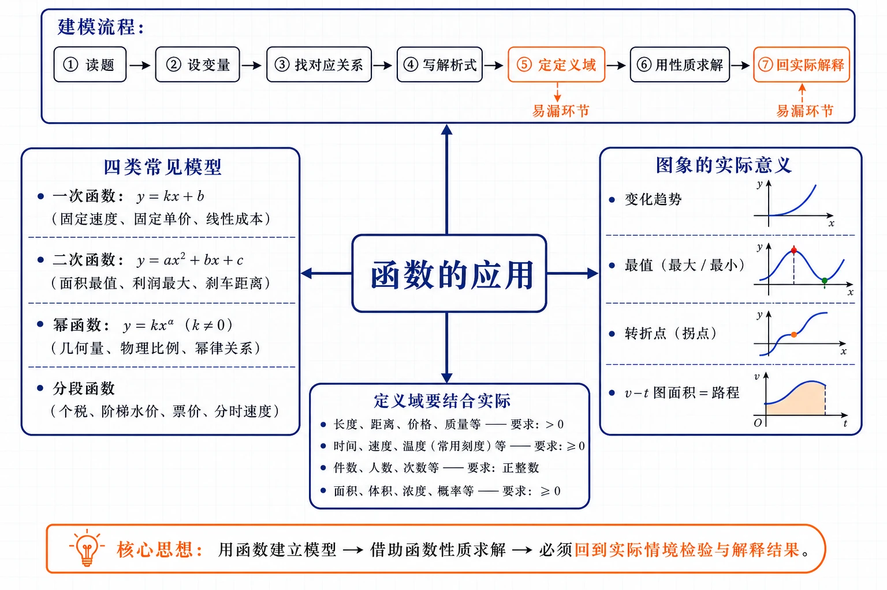
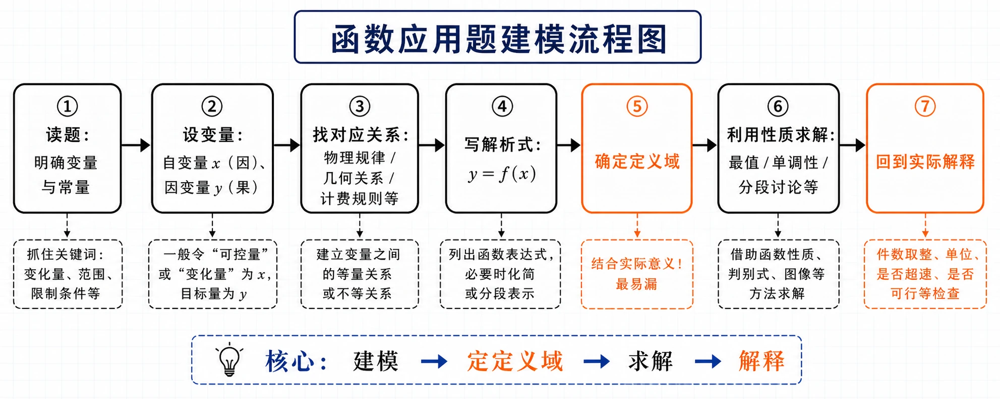
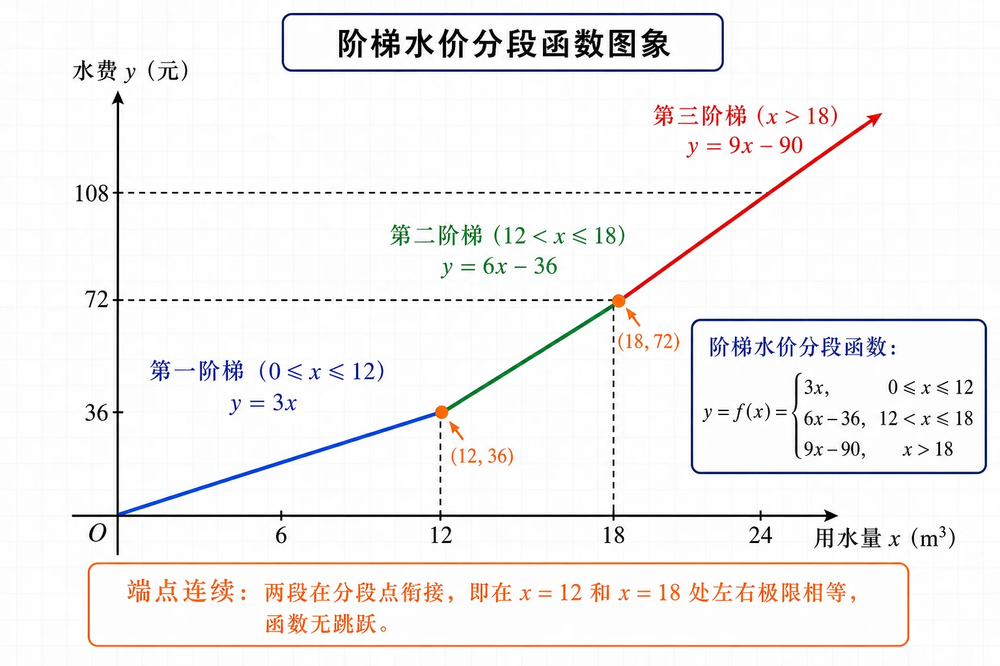
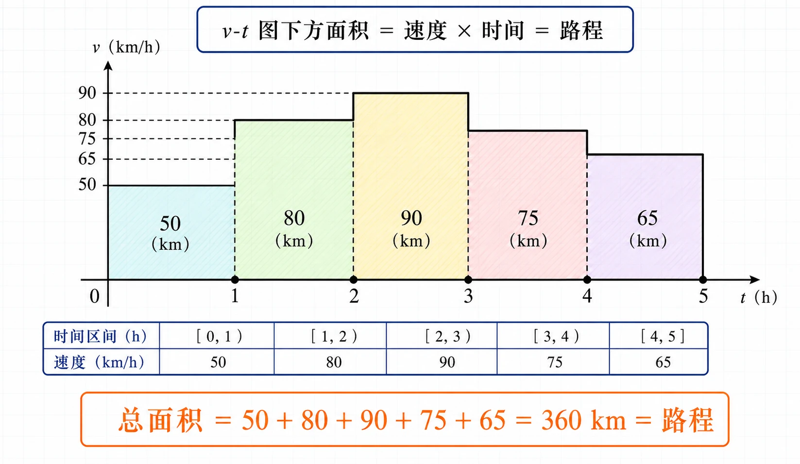

# 3.4 函数的应用（一）

<!-- 图片描述：本节整体知识信息结构图。浅网格背景，中心节点写“函数的应用”。中心向上引出“建模流程：读题→设变量→找对应关系→写解析式→定定义域→用性质求解→回实际解释”，用七个箭头依次连接，橙色突出“定定义域”和“回实际解释”两个易漏环节。中心向左引出“四类常见模型”：一次函数 $y=kx+b$（固定速度、固定单价、线性成本）、二次函数 $y=ax^2+bx+c$（面积最值、利润最大、刹车距离）、幂函数 $y=kx^\alpha$（几何量、物理比例）、分段函数（个税、阶梯水价、票价、分时速度）。中心向右引出“图象的实际意义”：变化趋势、最值、转折点、$v$-$t$ 图面积=路程。中心向下引出“定义域要结合实际：长度为正、时间为非负、件数为正整数、面积/体积非负”。黑色深蓝线条为主，LaTeX 公式风格。 -->

## 本节学习目标

- 理解函数模型是描述现实世界变量依赖关系的重要工具，体会一次函数、二次函数、幂函数、分段函数在实际中的广泛应用。
- 掌握函数应用题的一般解题流程：读题 $\to$ 设变量 $\to$ 找对应关系 $\to$ 写解析式 $\to$ 确定定义域 $\to$ 利用函数性质求解 $\to$ 回到实际问题解释。
- 会根据实际问题建立一次函数、二次函数、幂函数和分段函数模型，能正确确定与实际意义相符的定义域。
- 会利用二次函数求面积、利润、刹车距离等最值问题，会用分段函数描述个税、阶梯水价、票价、分时速度等实际问题。
- 能根据函数图象读取信息（如速度-时间图象中面积表示路程），并解释其实际意义。
- 能将数学结果转换回实际问题的回答（件数取整、长度为正、是否盈利、是否超速等），养成“建模—求解—解释”的完整思维。

## 核心知识点讲解

### 一、知识对象与问题情境

我们学过的一次函数 $y=kx+b$、二次函数 $y=ax^2+bx+c$、幂函数 $y=x^\alpha$ 等都与现实世界有紧密联系。客观世界中大量变量依赖关系——路程与时间、面积与边长、利润与产量、税费与收入、水费与用水量——都可以用函数模型来描述。研究清楚函数的性质（单调性、最值、分段规则），就能把握相应的实际规律。本节通过实例，体会利用函数模型解决实际问题的过程与方法。

### 二、核心概念与定义条件

**函数应用的一般解题流程**（七步法）：

1. **读题**：明确题目中哪些量在变（变量）、哪些量不变（常量），变量之间有什么关系。
2. **设变量**：把自变量（通常是“原因”）和因变量（通常是“结果”）用字母表示。
3. **找对应关系**：根据题意（物理定律、几何公式、计费规则等）写出因变量与自变量的关系。
4. **写解析式**：把对应关系整理成函数解析式 $y=f(x)$。
5. **确定定义域**：结合实际意义确定自变量的取值范围（这是最易被忽略、却决定答案对错的一步）。
6. **利用函数性质求解**：用单调性、最值、分段求值等数学方法求出结果。
7. **回到实际问题解释**：把数学结果转化为实际问题的回答（如“件数为 $50$ 件”“车速约 $80$ km/h”“会超速”）。

**四类常见函数模型**：

| 模型 | 解析式 | 适用情境 |
|---|---|---|
| 一次函数 | $y=kx+b$（$k\ne0$） | 匀速运动路程、固定单价总价、线性成本、弹簧伸长 |
| 二次函数 | $y=ax^2+bx+c$（$a\ne0$） | 面积/周长最值、利润最大化、抛体运动、刹车距离 |
| 幂函数 | $y=kx^\alpha$ | 几何量（体积与棱长）、物理比例（流量与半径） |
| 分段函数 | $f(x)=\begin{cases}f_1(x),&x\in D_1\\f_2(x),&x\in D_2\\\cdots\end{cases}$ | 个税、阶梯水价、公交票价、分时速度、出租车计费 |

### 三、符号语言与等价表示

**实际问题的定义域**（最易丢分，必须显式写出）：纯数学解析式 $y=x(10-x)$ 的定义域是 $\mathbb R$，但在实际问题中定义域要受实际意义限制：

- 长度、宽度、半径、时间 $\ge0$（且通常 $>0$）；
- 件数、人数、辆数为正整数；
- 面积、体积、质量 $>0$；
- 浓度、比例在 $[0,1]$ 内。

例如周长为 $20$ 的矩形，一边长 $x$，面积 $y=x(10-x)$，实际定义域是 $\{x\mid0<x<10\}$（边长为正且另一边 $10-x>0$），而不是 $\mathbb R$。

**函数图象的实际意义**：函数图象不仅是几何曲线，它承载着实际信息。

- 横轴、纵轴的单位含义要明确（如 $t$-小时，$v$-km/h）。
- 图象的**升降**对应实际量的增减。
- 图象的**最高点/最低点**对应实际量的最大值/最小值。
- 图象的**转折点**对应规则改变（如分段函数的分段点）。
- **速度-时间图象（$v$-$t$ 图）中，图象下方的面积表示路程**，因为路程 $=$ 速度 $\times$ 时间。这是读图的关键技巧。

### 四、关键性质、定理与公式

**用二次函数求最值**：对于 $y=ax^2+bx+c$（$a\ne0$），当 $x=-\dfrac{b}{2a}$ 时取得最值（$a>0$ 为最小值，$a<0$ 为最大值），最值为 $\dfrac{4ac-b^2}{4a}$。实际问题中要先确认顶点是否在实际定义域内，否则最值在定义域端点取得。

**“和定积最大”与“积定和最小”**（联系 2.2 基本不等式）：

- 若 $x+y=S$（定值，$x,y>0$），则当 $x=y=\dfrac S2$ 时，$xy$ 取最大值 $\dfrac{S^2}{4}$。
- 若 $xy=P$（定值，$x,y>0$），则当 $x=y=\sqrt P$ 时，$x+y$ 取最小值 $2\sqrt P$。

这两条结论在面积最大、周长最小、造价最低等问题中非常有效。

**分段函数的建立规则**：

- 先找“规则改变”的临界点（如个税的应纳税所得额分界 $36000,144000,\ldots$；水价的分段点 $12,18$）。
- 每段写一个解析式，注明该段的定义域区间。
- 端点归属由题目措辞决定：“不超过”“含”对应 $\le$（含端点），“超过”“大于”对应 $>$（不含端点）。
- 各段区间不能重叠也不能遗漏。

### 五、典型模型与解题方法

**模型一：二次函数最值（面积、利润）**。设变量，写出目标函数为二次式，配方或用顶点公式求最值，注意实际定义域。典型：矩形面积最大（周长一定）、广告牌设计、利润最大化。

**模型二：分段函数（税费、水价、票价、行程）**。根据计费规则确定分段点和各段解析式，求值时先判断自变量所在段再代入。典型：个税计算、阶梯水价、公交票价、里程表读数。

**模型三：幂函数模型（物理比例、几何量）**。设 $y=kx^\alpha$，由一组数据确定 $k$ 和 $\alpha$，再用模型预测。典型：刹车距离与速度（$y=ax^2$）、弹簧伸长与拉力（$y=kx$）、气体流量与管径（$v=kr^4$）。

**模型四：读图分析（$v$-$t$ 图、行程图）**。根据图象读取各段速度，图象下方面积即路程；或根据行程过程画距离-时间图象。典型：汽车行驶里程表、往返行程。

**模型五：综合建模（成本利润、蓄水池造价）**。设多个相关变量，写出总成本、总收入、利润等多个函数，结合不等式（如造价控制在某值以内）求解。典型：生产利润分析、蓄水池设计。

### 六、题型应用与迁移

本节是 3.1–3.3 所学函数知识（概念、表示、单调性、最值、奇偶性、幂函数）的综合应用。题型分五类：①二次函数求面积/利润最值；②分段函数描述税费/水价/票价；③幂函数建模（刹车距离、弹簧、流量）；④读图分析（$v$-$t$ 图面积、行程图象）；⑤综合成本利润、造价控制。核心都是“建模—定定义域—求解—解释”。这些方法将在第四章“数学建模：建立函数模型解决实际问题”中进一步系统化。

## 重点梳理

- **建模的关键是设好变量和找准对应关系**。自变量通常是“原因/输入”（时间、产量、用水量、收入），因变量是“结果/输出”（路程、利润、水费、个税）。这一步之所以重要，是因为变量设错或对应关系找错，后面的解析式、定义域、求解全都跟着错。触发条件：读题后先问“谁随谁变”，把自变量和因变量分别用一个字母表示。
- **定义域必须结合实际意义确定，且要显式写出**。纯数学解析式默认定义域是使式子有意义的实数集，但实际问题中变量有物理限制。例如周长 $20$ 的矩形面积 $y=x(10-x)$，数学定义域是 $\mathbb R$，但实际定义域是 $0<x<10$。这一步最易被忽略却决定答案对错，是应用题丢分的头号原因。
- **二次函数最值要检查顶点是否在实际定义域内**。若顶点不在实际定义域内，最值在端点取得。例如利润函数 $P=-x^2+100x-1000$ 的顶点在 $x=50$，若产量限制 $x\le40$，则最大利润在 $x=40$ 处取得而非顶点。
- **分段函数的端点归属由“不超过/超过”等措辞决定**。这是分段题最容易出错的地方。“不超过 $12$”对应 $x\le12$（含端点），“超过 $12$”对应 $x>12$（不含端点）。各段区间不重叠、不遗漏。
- **速度-时间图象下方的面积表示路程**。这是读图的核心技巧。因为路程 $=$ 速度 $\times$ 时间，$v$-$t$ 图中每段时间内速度为定值时，图象下方是一系列矩形，面积之和即总路程。即便速度变化，面积仍表示路程（这是后续定积分的直观基础）。
- **数学结果必须转换回实际问题的回答**。例如解出 $50<x<60$（数学结果），实际回答要说明“生产 $51$ 到 $59$ 辆”（件数取整）；解出 $v>79.9$，实际回答“车速至少 $80$ km/h”（精确到整数）。不能只给数学不等式或区间。

<!-- 图片描述：函数应用题建模流程图。从左到右七个圆角方框，用箭头依次连接。第一框“读题：明确变量与常量”；第二框“设变量：自变量 $x$（因）、因变量 $y$（果）”；第三框“找对应关系：物理/几何/计费规则”；第四框“写解析式：$y=f(x)$”；第五框“确定定义域”（用橙色边框突出，旁注“结合实际意义！最易漏”）；第六框“利用性质求解：最值/单调/分段”；第七框“回到实际解释”（用橙色边框突出，旁注“件数取整、单位、是否超速”）。底部一行总结“核心：建模—定定义域—求解—解释”。浅网格背景，黑色线条。 -->

## 难点突破

### 难点一：如何从实际问题中抽象出函数关系

应用题文字较长、信息分散，难点在于把生活语言转化为数学式。突破方法是**分三步提取**：①找出所有变量和常量，用字母表示；②找出变量间的等量关系（物理公式、几何定理、计费规则、定义公式）；③把等量关系整理成 $y=f(x)$ 的形式。例如“个税税额 $=$ 应纳税所得额 $\times$ 税率 $-$ 速算扣除数”，其中应纳税所得额又由收入减去各项扣除得到，需要先写出中间量 $t=g(x)$，再写 $y=f(t)$，即“复合建模”。

### 难点二：定义域的确定容易遗漏实际限制

数学上 $y=\dfrac1x$ 的定义域是 $x\ne0$，但在“$t$ 秒行进 $1$ km 的平均速度 $v=\dfrac1t$”中，时间 $t>0$，所以实际定义域是 $(0,+\infty)$。突破方法：写完解析式后，主动追问“这个变量在实际中能取哪些值”——长度为正、时间为非负、件数为正整数、价格为正、浓度在 $[0,1]$。把所有限制综合起来才是实际定义域。

### 难点三：分段函数的端点归属与连续性

阶梯水价中“不超过 $12$ m³ 的部分 $3$ 元/m³，超过 $12$ 但不超过 $18$ 的部分 $6$ 元/m³”——$x=12$ 归第一段还是第二段？由“不超过 $12$”可知 $x=12$ 时水价仍为 $3$ 元/m³，归第一段（$0\le x\le12$）。注意分段函数在分段点是否连续：阶梯水价在 $x=12$ 处，第一段 $y=3\times12=36$，第二段 $y=36+6\times(12-12)=36$，两段在 $x=12$ 处相等，函数连续。突破方法：仔细辨析“不超过/超过/含/大于”等措辞，端点归到措辞对应的段；写完后检查分段点处两段是否衔接。

<!-- 图片描述：阶梯水价分段函数图象。画平面直角坐标系，横轴为用水量 $x$（m³），标注 $0,6,12,18,24$；纵轴为水费 $y$（元），标注 $36,72,108$。画三段折线：第一段从原点 $(0,0)$ 到 $(12,36)$，斜率为 $3$（$y=3x$），用蓝色；第二段从 $(12,36)$ 到 $(18,72)$，斜率为 $6$（$y=6x-36$），用绿色；第三段从 $(18,72)$ 向右上延伸，斜率为 $9$（$y=9x-90$），用红色。在分段点 $x=12$ 和 $x=18$ 处用橙色实心圆点标注，旁注“端点连续：两段在分段点衔接”。每段上方标注该段的解析式和区间。浅网格背景，黑色坐标轴。 -->

### 难点四：$v$-$t$ 图象面积与路程的对应

汽车在 $[0,1)$ h 内速度 $50$ km/h、$[1,2)$ h 内速度 $80$ km/h……$v$-$t$ 图象下方是五个矩形（宽 $1$ h，高分别为 $50,80,90,75,65$ km/h），面积之和 $50+80+90+75+65=360$（km/h $\times$ h $=$ km）即 $5$ h 行驶的总路程 $360$ km。突破方法：记住“$v$-$t$ 图面积 $=$ 路程”，读图时把图象下方分割成矩形或三角形，逐块算面积相加。

### 难点五：成本利润分析中的多个函数

生产问题中常涉及总成本、单位成本、总收入、利润等多个函数，容易混淆。突破方法是**分别设、分别写、分清关系**：

- 总成本 $=$ 固定成本 $+$ 可变成本 $=$ 固定成本 $+$ 单件可变成本 $\times$ 产量；
- 总收入 $=$ 单价 $\times$ 销量（假设全部售出）；
- 利润 $=$ 总收入 $-$ 总成本。

逐一写出，标注清楚每个函数的自变量都是产量 $x$，避免张冠李戴。

## 例题讲解

### 例1：个税的函数模型（分段函数）

设某职工全年综合所得收入额为 $x$ 元，专项扣除（社保公积金）占收入 $20\%$（即 $8\%+2\%+1\%+9\%$），专项附加扣除 $9600$ 元，其他扣除 $560$ 元，免征额 $60000$ 元。个税税率表（按全年应纳税所得额 $t$ 分档）：$[0,36000]$ 税率 $3\%$ 速算扣除数 $0$；$(36000,144000]$ 税率 $10\%$ 速算扣除数 $2520$；依此类推。已知该职工全年收入 $x=117600$ 元。

（1）求应纳税所得额 $t$ 关于收入 $x$ 的关系；（2）求个税 $y$ 关于 $t$ 的分段函数；（3）求该职工应缴个税。

**审题：** 这是典型的“先求中间量 $t$，再由 $t$ 分档计算 $y$”的复合分段函数问题。

**解：** （1）应纳税所得额

$$
t=x-60000-20\%\cdot x-9600-560=x(1-0.2)-70160=0.8x-70160.
$$

令 $t=0$ 得 $x=87700$。当 $x\le87700$ 时 $t=0$（收入不足以纳税）。所以

$$
t=\begin{cases}0,&0\le x\le87700,\\0.8x-70160,&x>87700.\end{cases}
$$

（2）由税率表，个税 $y$ 关于 $t$（$t\ge0$）的分段函数：

$$
y=\begin{cases}0.03t,&0\le t\le36000,\\0.1t-2520,&36000<t\le144000,\\0.2t-16920,&144000<t\le300000,\\\cdots\end{cases}
$$

（更高档略，方法相同。）

（3）该职工 $x=117600$ 元，$t=0.8\times117600-70160=94080-70160=23920$ 元。因 $0\le23920\le36000$，适用 $3\%$ 税率：$y=0.03\times23920=717.6$ 元。

**检验：** $23920<36000$ ✓，适用第一档正确。

**反思：** 个税模型是“收入 $x\to$ 应纳税所得额 $t\to$ 个税 $y$”的复合分段函数。关键是先算 $t$ 再定档。若收入增至 $153600$ 元，则 $t=0.8\times153600-70160=52768$，在 $(36000,144000]$ 档，$y=0.1\times52768-2520=5024.8$ 元。

### 例2：汽车行驶的分段速度与里程表读数

一辆汽车在某段路程中行驶，平均速率 $v$（km/h）与时间 $t$（h）的关系为：$[0,1)$ 内 $v=50$，$[1,2)$ 内 $v=80$，$[2,3)$ 内 $v=90$，$[3,4)$ 内 $v=75$，$[4,5]$ 内 $v=65$。里程表行驶前读数为 $2004$ km。

（1）求 $5$ h 内行驶的路程；（2）建立里程表读数 $s$ 关于 $t$ 的函数。

**审题：** $v$-$t$ 图象下方面积 $=$ 路程。里程表读数 $=$ 初始读数 $+$ 累计路程。

**解：** （1）路程 $=$ 各段速度 $\times$ 时间之和：

$$
50\times1+80\times1+90\times1+75\times1+65\times1=360\text{ (km)}.
$$

（即 $v$-$t$ 图象下方五个矩形的面积之和。）

<!-- 图片描述：$v$-$t$ 图象面积表示路程示意图。画平面直角坐标系，横轴为时间 $t$（h），标注 $0,1,2,3,4,5$；纵轴为速度 $v$（km/h），标注 $50,65,75,80,90$。画五段水平阶梯线：$[0,1)$ 高 $50$、$[1,2)$ 高 $80$、$[2,3)$ 高 $90$、$[3,4)$ 高 $75$、$[4,5]$ 高 $65$，形成五个矩形。每个矩形用不同浅色填充（阴影），在每个矩形内标注其面积值（$50,80,90,75,65$）。在图象下方用橙色大字标注“总面积 $=50+80+90+75+65=360$ km $=$ 路程”。标注“$v$-$t$ 图下方面积 $=$ 速度 $\times$ 时间 $=$ 路程”。浅网格背景，黑色坐标轴。 -->

（2）各时间段内里程表读数为初始读数加累计路程（每段内速度恒定，路程 $=$ 速度 $\times$ 该段内时间）：

$$
s(t)=\begin{cases}50t+2004,&0\le t<1,\\80(t-1)+2054,&1\le t<2,\\90(t-2)+2134,&2\le t<3,\\75(t-3)+2224,&3\le t<4,\\65(t-4)+2299,&4\le t\le5.\end{cases}
$$

其中各段起点读数由前段累计：$t=1$ 时 $s=50+2004=2054$；$t=2$ 时 $s=80+2054=2134$；$t=3$ 时 $s=90+2134=2224$；$t=4$ 时 $s=75+2224=2299$；$t=5$ 时 $s=65+2299=2364$（即 $2004+360=2364$ ✓）。

**反思：** $v$-$t$ 图象面积表示路程是本题核心。里程表读数是分段一次函数（每段内匀速），各段在端点处衔接（连续）。画图时是折线，斜率等于各段速度。

### 例3：刹车距离的幂函数模型

用模型 $y=ax^2$（$a>0$）描述汽车紧急刹车后滑行距离 $y$（m）与刹车时速率 $x$（km/h）的关系。已知速率 $60$ km/h 时滑行 $20$ m。在限速 $100$ km/h 的高速公路上，某车紧急刹车后滑行 $50$ m，该车是否超速？

**审题：** 先由已知数据确定 $a$，再由 $y=50$ 求 $x$，与限速 $100$ 比较。

**解：** 代入 $x=60,y=20$：$20=a\times60^2=3600a$，$a=\dfrac{20}{3600}=\dfrac1{180}$。模型为 $y=\dfrac{x^2}{180}$。

当 $y=50$ 时：$50=\dfrac{x^2}{180}$，$x^2=9000$，$x=\sqrt{9000}=30\sqrt{10}\approx94.9$ km/h。

因 $94.9<100$，该车**未超速**。

**检验：** $x=94.9$ 时 $y=\dfrac{94.9^2}{180}\approx\dfrac{9006}{180}\approx50.0$ ✓。

**反思：** 幂函数模型 $y=kx^\alpha$ 的建立：由一组数据确定参数（本题 $a$，$\alpha=2$ 已知），再用模型预测或反求。刹车距离与速度平方成正比，是物理常识（动能与速度平方成正比）。

### 例4：矩形广告牌面积最大

某广告公司要设计周长为 $l$（m）的矩形广告牌，怎样设计面积最大？

**审题：** 周长一定（和定），求面积（积）最大——典型的“和定积最大”问题，可用二次函数或基本不等式。

**解：** 设矩形长为 $x$ m，宽为 $y$ m。由 $2(x+y)=l$ 得 $x+y=\dfrac l2$（定值）。面积 $S=xy$。

**方法一（基本不等式）**：$S=xy\le\left(\dfrac{x+y}{2}\right)^2=\left(\dfrac{l/2}{2}\right)^2=\dfrac{l^2}{16}$，当且仅当 $x=y=\dfrac l4$ 时取等号。

**方法二（二次函数）**：$y=\dfrac l2-x$，$S=x\left(\dfrac l2-x\right)=-x^2+\dfrac l2 x$。当 $x=\dfrac{-l/2}{2\times(-1)}=\dfrac l4$ 时取最大值 $S_{\max}=-\dfrac{l^2}{16}+\dfrac{l^2}{8}=\dfrac{l^2}{16}$。

两种方法都得：当广告牌设计成边长为 $\dfrac l4$ m 的正方形时，面积最大，最大面积为 $\dfrac{l^2}{16}$ m²。

**反思：** “和定积最大”问题既可用基本不等式（$xy\le\left(\frac{x+y}{2}\right)^2$），也可用二次函数顶点法，殊途同归。正方形是矩形面积最大的最优形状。

### 例5：生产成本与利润分析

某公司生产某种产品，固定成本 $150$ 万元，每件可变成本 $2500$ 元，每件售价 $3500$ 元，产品全部售出。设产量为 $x$ 件。

（1）写出总成本、单位成本、总收入、利润关于 $x$ 的函数；（2）分析经济效益。

**审题：** 注意单位统一（$150$ 万元 $=1500000$ 元，或可变成本用万元）。分别写四个函数。

**解：** 统一用元为单位，固定成本 $1500000$ 元。

（1）**总成本** $C=1500000+2500x$（$x\ge0$）。**单位成本** $\bar C=\dfrac{C}{x}=\dfrac{1500000}{x}+2500$（$x>0$）。**总收入** $R=3500x$（$x\ge0$）。**利润** $P=R-C=3500x-(1500000+2500x)=1000x-1500000$（$x\ge0$）。

（2）**盈亏平衡**（$P=0$）：$1000x=1500000$，$x=1500$ 件。当产量 $x<1500$ 时亏损（$P<0$），$x=1500$ 时盈亏平衡，$x>1500$ 时盈利。产量越大利润越高（$P$ 随 $x$ 线性增长）。单位成本 $\bar C=\dfrac{1500000}{x}+2500$ 随 $x$ 增大而减小（固定成本被更多产品分摊），产量越大单位成本越低。

**反思：** 成本利润分析涉及多个函数，关键是分清“固定成本（不随产量变）”“可变成本（随产量变）”“总收入”“利润”及它们的关系。利润 $=$ 收入 $-$ 成本是核心等式。

## 易错点整理

- **错误表现**：只写解析式，不写（或写错）实际定义域。
  - **反例**：矩形面积 $y=x(10-x)$ 写成定义域 $\mathbb R$，实际应为 $0<x<10$。
  - **正确处理**：写完解析式后，结合实际意义（长度为正、时间为非负、件数为整数）显式写出定义域。

- **错误表现**：件数、辆数等离散量按连续量处理，最后不取整。
  - **反例**：摩托车产量解出 $50<x<60$，答“生产 $50$ 到 $60$ 辆”——应为 $51$ 到 $59$ 辆（整数）。
  - **正确处理**：明确变量的离散性，最后把数学结果取整并说明。

- **错误表现**：分段函数端点归属写错，或各段区间重叠/遗漏。
  - **反例**：阶梯水价第一段写 $0\le x<12$、第二段 $12\le x\le18$，但题目说“不超过 $12$”，应为 $0\le x\le12$。
  - **正确处理**：仔细辨析“不超过/超过/含”等措辞；写完检查各段区间不重叠、不遗漏、分段点衔接。

- **错误表现**：$v$-$t$ 图象中不会用面积求路程，或把面积含义搞错。
  - **正确处理**：$v$-$t$ 图下方面积 $=$ 速度 $\times$ 时间 $=$ 路程。把图象下方分割成矩形逐块算面积相加。

- **错误表现**：求出数学结果后不回到实际问题作答。
  - **反例**：解出 $x=94.9$ 就结束，不回答“是否超速”。
  - **正确处理**：最后一步把数学结果转化为实际问题的语言回答（如“未超速”“盈利”“需生产 $1500$ 件以上”）。

- **错误表现**：二次函数最值不检查顶点是否在实际定义域内。
  - **正确处理**：算出顶点后，检查顶点横坐标是否在实际定义域内；不在则比较端点函数值取最值。

- **错误表现**：成本利润问题中混淆固定成本与可变成本，或单位不统一。
  - **正确处理**：固定成本（不随产量变）与可变成本（单件成本 $\times$ 产量）分开写；统一单位（元或万元）后再运算。

## 考点考证点整理

### 考点一：二次函数的最值应用（面积、利润、距离）

- **出题思路**：矩形/三角形面积最大（周长一定）、广告牌设计、利润最大化、刹车距离、抛体运动高度等。
- **关键条件**：定值约束（周长一定、容积一定）；目标函数为二次式；实际定义域。
- **解答要点**：设变量 $\to$ 写目标函数 $y=ax^2+bx+c$ $\to$ 定实际定义域 $\to$ 配方/顶点公式求最值 $\to$ 检查顶点在定义域内 $\to$ 回实际回答。也可用基本不等式（和定积最大、积定和最小）。
- **易扣分点**：不写实际定义域；顶点不在定义域内却仍取顶点值；最后不回实际解释；单位不统一。

### 考点二：分段函数的应用（税费、水价、票价、行程）

- **出题思路**：个税计算、阶梯水价/电价、公交票价、出租车计费、汽车里程表、分时速度等。
- **关键条件**：分段点（规则改变的临界值）；各段规则；端点措辞（不超过/超过）。
- **解答要点**：确定分段点 $\to$ 每段写解析式并注明区间 $\to$ 端点归属正确（不重叠不遗漏）$\to$ 求值先定段再代入 $\to$ 检查分段点衔接。
- **易扣分点**：端点归属错误；区间重叠或遗漏；分段点处不连续却没发现；求值代错段。

### 考点三：幂函数模型的建立与应用

- **出题思路**：刹车距离 $y=ax^2$、弹簧伸长 $y=kx$、气体流量 $v=kr^4$、几何量关系等，由数据定参再预测或反求。
- **关键条件**：模型形式 $y=kx^\alpha$（$\alpha$ 已知或待定）；一组已知数据定 $k$（和 $\alpha$）；实际定义域。
- **解答要点**：设 $y=kx^\alpha$ $\to$ 代入已知数据解 $k$（和 $\alpha$）$\to$ 写出模型 $\to$ 由给定 $x$ 求 $y$（预测）或由 $y$ 反求 $x$（如是否超速）$\to$ 结合实际比较判断。
- **易扣分点**：参数求错；反求时舍根错误（如 $x=\sqrt{9000}\approx94.9$ 只取正值）；不与限制值比较就下结论；单位混乱。

### 考点四：图象信息的读取与解释

- **出题思路**：$v$-$t$ 图求路程、行程图画距离-时间关系、收支差额图解释盈亏、数据描点拟合函数。
- **关键条件**：坐标轴含义（单位）；图象特征（升降、最值、转折、面积）；分段点。
- **解答要点**：先看坐标轴含义 $\to$ 分析图象特征对应的实际意义 $\to$ $v$-$t$ 图面积 $=$ 路程 $\to$ 分段写出函数 $\to$ 回实际解释。
- **易扣分点**：坐标轴看反；面积含义判断错；分段点遗漏；不结合实际解释图象。

### 考点五：综合成本利润与造价控制

- **出题思路**：生产利润分析（总成本、单位成本、收入、利润多个函数）、蓄水池/造价控制（结合基本不等式）、盈亏平衡。
- **关键条件**：固定成本与可变成本；售价与销量；约束条件（造价 $\le$ 某值、容积 $=$ 定值）；单位统一。
- **解答要点**：分别写出各函数（成本 $=$ 固定 $+$ 可变，收入 $=$ 单价 $\times$ 销量，利润 $=$ 收入 $-$ 成本）$\to$ 求盈亏平衡点（利润 $=0$）$\to$ 结合约束求解 $\to$ 分析经济效益。
- **易扣分点**：混淆固定/可变成本；单位不统一（元与万元混用）；利润公式写反；盈亏平衡点算错。

## 练习题

### 基础训练

1. 某商品单价 $8$ 元/件，购买 $x$ 件需付 $y$ 元。写出 $y$ 关于 $x$ 的函数解析式及定义域。
2. 矩形周长为 $40$，设一边长为 $x$，面积为 $S$。写出 $S$ 关于 $x$ 的函数解析式，并求 $S$ 的最大值及取最大值时的边长。
3. 已知刹车距离 $y=\dfrac{x^2}{180}$（$x$ 为速率 km/h，$y$ 为距离 m）。若刹车距离为 $50$ m，求刹车时的速率（精确到 $0.1$ km/h）。
4. 某城市居民用水实行阶梯水价：不超过 $12$ m³ 的部分 $3$ 元/m³，超过 $12$ 但不超过 $18$ m³ 的部分 $6$ 元/m³，超过 $18$ m³ 的部分 $9$ 元/m³。写出水费 $y$（元）关于用水量 $x$（m³）的函数解析式（$0\le x$）。
5. 一个产品每件售价 $50$ 元，单件可变成本 $30$ 元，固定成本 $1000$ 元，产品全部售出。设销量为 $x$ 件，利润为 $P$ 元，写出 $P$ 关于 $x$ 的函数，并求盈亏平衡时的销量。

### 巩固训练

1. 某人开汽车以 $60$ km/h 的速率从 $A$ 地到 $150$ km 远的 $B$ 地，在 $B$ 地停留 $1$ h 后，再以 $50$ km/h 的速率返回 $A$ 地。把汽车与 $A$ 地的距离 $x$（km）表示为时间 $t$（h）（从 $A$ 出发时起）的函数，并画出图象。
2. 某广告公司要设计周长为 $24$ m 的矩形广告牌。怎样设计面积最大？最大面积是多少？
3. 某公司生产某产品，固定成本 $150$ 万元，每件可变成本 $2500$ 元，每件售价 $3500$ 元，产品全部售出。设产量为 $x$ 件。
   （1）写出总成本 $C$、总收入 $R$、利润 $P$ 关于 $x$ 的函数；
   （2）求盈亏平衡时的产量，并分析产量为 $1000$ 件时是盈利还是亏损。
4. 要建造一个容积为 $1200$ m³、深 $6$ m 的长方体无盖蓄水池，池壁造价 $95$ 元/m²，池底造价 $135$ 元/m²。如何设计水池的长与宽，才能使总造价控制在 $7$ 万元以内（精确到 $0.1$ m）？
5. 下表是拉力 $F$（N）与弹簧伸长量 $x$（cm）的实验数据：

| $F$ | 1 | 2 | 3 | 4 | 5 |
|---|---|---|---|---|---|
| $x$ | 14.2 | 28.8 | 41.3 | 57.5 | 70.2 |

   描点画出 $x$ 随 $F$ 变化的图象，并写出一个能基本反映这一变化现象的函数解析式。

### 提升训练

1. 若用模型 $y=ax^2$（$a>0$）描述汽车紧急刹车后滑行距离 $y$（m）与刹车时速率 $x$（km/h）的关系，已知某型号汽车速率 $60$ km/h 时刹车距离 $20$ m。在限速 $100$ km/h 的高速公路上，一辆该车紧急刹车后滑行 $50$ m，该车是否超速？说明理由。
2. 某城市阶梯水价同基础训练第 4 题。若某户居民本月交纳水费 $48$ 元，求该户本月用水量。
3. 某商店经营一批进价 $30$ 元/件的商品，试销发现日销售量 $y$（件）与售价 $x$（元）的关系如下表：

| 售价 $x$（元） | 30 | 40 | 45 | 50 |
|---|---|---|---|---|
| 日销量 $y$（件） | 60 | 30 | 15 | 0 |

   （1）根据数据描点，猜想 $y$ 与 $x$ 的函数关系，写出一个解析式；
   （2）设日销售利润为 $P$（元），写出 $P$ 关于 $x$ 的函数，并求售价为多少时日利润最大。

## 练习题答案

### 基础训练答案

1. $y=8x$。若 $x$ 表示件数，则 $x\in\mathbb N^*$（正整数），定义域为 $\{1,2,3,\ldots\}$；若 $x$ 可为任意非负实数，则 $x\ge0$。实际中通常 $x\in\mathbb N^*$。
2. 另一边长为 $20-x$（因 $2(x+20-x)=40$），$S=x(20-x)=-x^2+20x$。实际定义域 $0<x<20$。$S=-x^2+20x=-(x-10)^2+100$，当 $x=10$（在 $(0,20)$ 内）时取最大值 $S_{\max}=100$。此时边长为 $10$ 和 $10$（正方形），面积最大 $100$。
3. $50=\dfrac{x^2}{180}$，$x^2=9000$，$x=\sqrt{9000}=30\sqrt{10}\approx94.9$ km/h（取正值，速率非负）。
4. $y=\begin{cases}3x,&0\le x\le12,\\36+6(x-12),&12<x\le18,\\36+36+9(x-18),&x>18,\end{cases}=\begin{cases}3x,&0\le x\le12,\\6x-36,&12<x\le18,\\9x-90,&x>18.\end{cases}$ 验证分段点：$x=12$ 第一段 $y=36$，第二段 $y=72-36=36$ ✓；$x=18$ 第二段 $y=108-36=72$，第三段 $y=162-90=72$ ✓，连续。
5. 总成本 $=30x+1000$，总收入 $=50x$，利润 $P=50x-(30x+1000)=20x-1000$（$x\ge0$）。盈亏平衡 $P=0$：$20x=1000$，$x=50$ 件。当销量 $x>50$ 时盈利，$x=50$ 时盈亏平衡。

### 巩固训练答案

1. $A$ 到 $B$：$150\div60=2.5$ h，$0\le t\le2.5$ 时 $x=60t$。停留：$2.5<t\le3.5$ 时 $x=150$（不动）。返回：$150\div50=3$ h，$3.5<t\le6.5$ 时 $x=150-50(t-3.5)$。所以

$$
x(t)=\begin{cases}60t,&0\le t\le2.5,\\150,&2.5<t\le3.5,\\150-50(t-3.5),&3.5<t\le6.5.\end{cases}
$$

   图象：第一段从 $(0,0)$ 到 $(2.5,150)$ 的上升直线；第二段从 $(2.5,150)$ 到 $(3.5,150)$ 的水平线段；第三段从 $(3.5,150)$ 到 $(6.5,0)$ 的下降直线。
2. 设长 $x$ m，宽 $y$ m，$2(x+y)=24$，$x+y=12$。面积 $S=xy=x(12-x)=-x^2+12x=-(x-6)^2+36$，定义域 $0<x<12$。当 $x=6$（在定义域内）时 $S_{\max}=36$ m²。即设计成边长 $6$ m 的正方形时面积最大，最大 $36$ m²。
3. （1）固定成本 $150$ 万元 $=1500000$ 元。$C=1500000+2500x$；$R=3500x$；$P=R-C=3500x-(1500000+2500x)=1000x-1500000$（$x\ge0$）。
   （2）盈亏平衡 $P=0$：$1000x=1500000$，$x=1500$ 件。产量 $1500$ 件时盈亏平衡。当 $x=1000$ 件时，$P=1000\times1000-1500000=1000000-1500000=-500000$ 元 $=-50$ 万元，亏损 $50$ 万元。
4. 水池深 $6$ m，容积 $1200$ m³，故底面积 $=1200\div6=200$ m²。设底面长 $a$ m，宽 $b$ m，$ab=200$。池壁面积 $=2\times6a+2\times6b=12(a+b)$。总造价 $=135\times200+95\times12(a+b)=27000+1140(a+b)$。由 $ab=200$ 得 $a+b\ge2\sqrt{200}=20\sqrt2\approx28.28$，当 $a=b=\sqrt{200}\approx14.14$ 时取等。此时总造价 $\ge27000+1140\times28.28\approx27000+32243=59243$ 元 $\approx5.9$ 万元 $<7$ 万元。设计成正方形底面（约 $14.1\times14.1$ m）时造价最低约 $5.9$ 万元，在 $7$ 万元以内。若长宽不等，造价更高但仍需 $\le7$ 万元即 $a+b\le\dfrac{70000-27000}{1140}=\dfrac{43000}{1140}\approx37.7$，即 $a+b\le37.7$，由 $ab=200$ 及 $a+b\le37.7$ 可得长宽范围。最优设计为正方形底面，边长约 $14.1$ m。
5. 以 $F$ 为横轴、$x$ 为纵轴描点 $(1,14.2),(2,28.8),(3,41.3),(4,57.5),(5,70.2)$，各点近似在一条过原点的直线上。计算 $\dfrac{x}{F}$：$14.2,14.4,13.8,14.4,14.0$，平均约 $14.2$。故可取 $x\approx14F$，即 $x=14F$（$F\ge0$）。这是一个一次函数（正比例）模型，反映弹簧伸长与拉力成正比（胡克定律）。

### 提升训练答案

1. 代入 $x=60,y=20$：$20=a\times60^2=3600a$，$a=\dfrac1{180}$，模型 $y=\dfrac{x^2}{180}$。当 $y=50$：$x^2=9000$，$x=\sqrt{9000}\approx94.9$ km/h。因 $94.9<100$（限速），该车**未超速**。（刹车距离 $50$ m 对应速率约 $94.9$ km/h，低于限速 $100$ km/h。）
2. 由基础训练第 4 题的水费函数：当 $y=48$ 时，先判断在哪一段。第一段最大 $y=3\times12=36<48$，所以 $x>12$。第二段 $y=6x-36$（$12<x\le18$），令 $6x-36=48$，$6x=84$，$x=14$。检验：$12<14\le18$ ✓，$y=6\times14-36=84-36=48$ ✓。所以该户本月用水量 $14$ m³。
3. （1）描点 $(30,60),(40,30),(45,15),(50,0)$，发现每提高 $5$ 元销量减 $15$ 件，即每提高 $1$ 元销量减 $3$ 件。设 $y=kx+b$，由 $(30,60)$ 和 $(50,0)$：$30k+b=60$，$50k+b=0$，相减 $20k=-60$，$k=-3$，$b=60+90=150$。所以 $y=-3x+150$。检验：$x=45$ 时 $y=-135+150=15$ ✓。定义域：$y\ge0$ 即 $-3x+150\ge0$，$x\le50$，又 $x\ge30$（进价），故 $30\le x\le50$。
   （2）利润 $P=(x-30)\cdot y=(x-30)(-3x+150)=-3x^2+150x+90x-4500=-3x^2+240x-4500$。配方：$P=-3(x^2-80x)-4500=-3(x-40)^2+4800-4500=-3(x-40)^2+300$。当 $x=40$（在 $[30,50]$ 内）时 $P_{\max}=300$ 元。所以售价定为 $40$ 元/件时日利润最大，最大 $300$ 元。
