# 2.1 等式性质与不等式性质

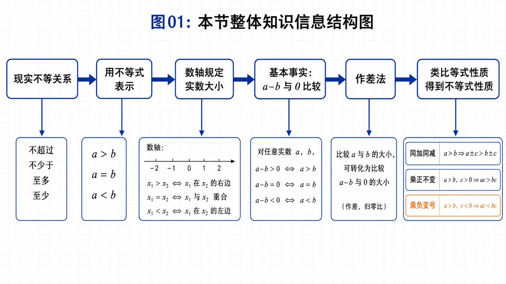
<!-- 图片描述：本节整体知识信息结构图。白色浅网格背景，深蓝主线依次为“现实不等关系 -> 用不等式表示 -> 数轴规定实数大小 -> 基本事实 a-b 与 0 比较 -> 作差法 -> 类比等式性质得到不等式性质 -> 性质应用”。旁支标出“杂志销售收入不低于20万元”“赵爽弦图得到 a²+b²≥2ab”“同乘负数变号”“同向可加、正数同向可乘”。橙色突出易错条件：变量范围、正负号、等号成立条件。 -->

## 本节学习目标

- 能从生活、几何、经济、运输等情境中识别“不超过、不少于、不低于、大于、小于”等不等关系，并用不等式或不等式组表示。
- 理解数轴上点的位置关系怎样规定实数大小，掌握实数大小比较的基本事实：$a-b$ 与 $0$ 的大小决定 $a$ 与 $b$ 的大小。
- 会用作差法比较两个实数或代数式的大小，并能说明“$0$ 是正数与负数的分界点”的作用。
- 能从赵爽弦图的面积关系和完全平方公式两条路径理解重要不等式 $a^2+b^2\ge 2ab$。
- 能类比等式性质发现、理解并证明不等式性质，尤其能处理同乘正数、同乘负数、同向相加、正数同向相乘等规则。
- 能完成本节配套训练，包括不等式建模、代数式比较、范围求解、证明题、命题判断和运输方案问题。

## 核心知识点讲解

### 一、知识对象与问题情境

本节研究的对象是“不等关系”。现实中的多与少、大与小、长与短、高与矮、远与近、快与慢、涨与跌、轻与重，以及“不超过”“不少于”等关系，都可以用不等式来表达。学习时要先抓住三点：

- 相等关系用等式表示；
- 不等关系用不等式表示；
- 解决实际问题时，先从语言中找数量关系，再用符号表达。

这一节可以按一条清楚的学习路线来理解：

```text
现实中的不等关系
  -> 用不等式或不等式组表示
  -> 用数轴和 a-b 的符号判断大小
  -> 类比等式性质得到不等式性质
  -> 用性质进行比较、证明、求范围和建模
```

也就是说，本节不是在背一堆零散规则，而是在建立“不等式语言”的基本操作系统。先学会把现实限制写成不等式，再学会判断大小的根本依据，最后学会哪些变形是允许的、哪些变形会改变方向。

#### 1. 用不等式表示实际语句

| 语言表达 | 常用符号 | 说明 |
|---|---|---|
| 大于、超过、多于 | $>$ | 严格比某数大，不含端点 |
| 小于、低于、少于 | $<$ | 严格比某数小，不含端点 |
| 不小于、不低于、至少、不少于 | $\ge$ | 可以等于，也可以更大 |
| 不大于、不超过、至多 | $\le$ | 可以等于，也可以更小 |

下面四个情境可以这样理解：

1. 某路段限速 $40\text{ km/h}$。若汽车速度为 $v\text{ km/h}$，通常还要考虑速度为正，所以可写为

$$
0<v\le40.
$$

2. 酸奶脂肪含量 $f$ 不少于 $2.5\%$、蛋白质含量 $p$ 不少于 $2.3\%$，应写成不等式组

$$
\begin{cases}
f\ge2.5\%,\\
p\ge2.3\%.
\end{cases}
$$

3. 三角形两边之和大于第三边、两边之差小于第三边。若三边为 $a,b,c$，可写为

$$
a+b>c,\qquad a-b<c.
$$

实际使用时，完整的三角形三边关系还可补充其他类似关系，如 $a+c>b$、$b+c>a$、$|a-b|<c$ 等。

4. 直线外一点到直线上各点的线段中，垂线段最短。若 $CD\perp AB$，$E$ 是直线 $AB$ 上不同于 $D$ 的任意一点，则

$$
CD<CE.
$$

这四个例子分别对应四种常见翻译方式：有“上限”的问题常写成 $\le$，如限速、最高高度；有“下限”的问题常写成 $\ge$，如含量不少于、收入不低于；几何性质题要先把图形关系转成线段、边长、面积等数量；带有“任意”的表述通常说明结论对一类对象成立，而不是只对某一个对象成立。

通俗地说，列不等式就像给变量划定活动范围。看懂“限制对象是谁、限制方向是什么、等号能不能取”，不等式就不会写反。

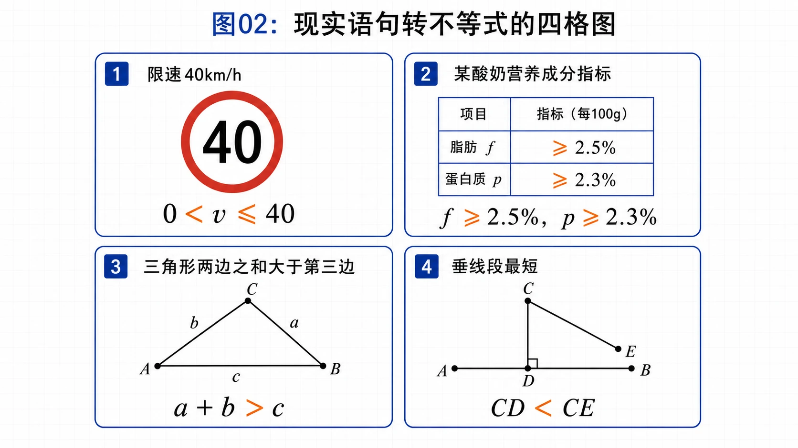
<!-- 图片描述：现实语句转不等式的四格图。四个小框分别画“限速牌40”“酸奶指标表”“三角形ABC”“点C到直线AB的垂线CD与斜线CE”。每格下方用 LaTeX 标注 $0<v\le40$、$f\ge2.5\%,p\ge2.3\%$、$a+b>c,a-b<c$、$CD<CE$；橙色突出关键词“不超过、不少于、大于、最短”。 -->

#### 2. 杂志销售问题：从实际关系到待解不等式

下面的杂志销售问题给出一个重要过渡：列出不等式之后，还需要研究不等式的性质才能求解。

题意是某杂志原价 $2.5$ 元，每本可售 $8$ 万本。售价提高到 $x$ 元时，每提高 $0.1$ 元，销量减少 $0.2$ 万本。若要求销售总收入不低于 $20$ 万元，可列出：

$$
\left(8-\frac{x-2.5}{0.1}\times0.2\right)x\ge20.
$$

这不是本节要完整求解的重点，而是说明：复杂实际问题也可以先被翻译成不等式；要继续求解，就必须掌握不等式的性质。这个问题会在 2.3 用一元二次不等式处理。

这个问题还提醒我们：列不等式时不要只写“目标量 $\ge$ 某个数”，还要把目标量本身表示出来。这里的目标量是“销售总收入”，它等于“售价 $\times$ 销量”。其中销量又随售价变化，所以要先写出销量表达式，再列收入不等式。

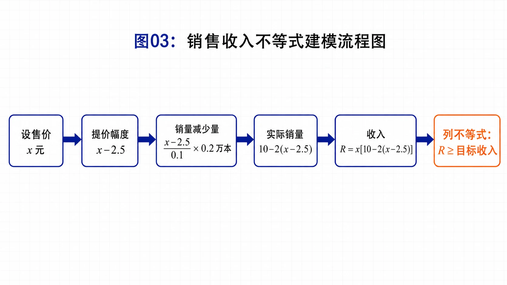
<!-- 图片描述：销售收入不等式建模流程图。白色浅网格背景，使用深蓝色流程框依次展示“设售价 $x$ 元”“提价幅度 $x-2.5$”“销量减少量 $\frac{x-2.5}{0.1}\times0.2$ 万本”“实际销量 $8-\frac{x-2.5}{0.1}\times0.2$”“销售收入 = 售价 × 销量”“收入不低于 $20$ 万元 -> 不等式”。用橙色标出关键词“不低于”“销量随售价变化”，并在底部提示“先表达目标量，再写不等式”。 -->

### 二、核心概念与定义条件

#### 1. 数轴规定实数大小

数轴上的点与实数一一对应。若实数 $a,b$ 在数轴上对应点分别为 $A,B$：

- 点 $A$ 在点 $B$ 左边，则 $a<b$；
- 点 $A$ 在点 $B$ 右边，则 $a>b$。

这说明实数大小可以用数轴位置理解。

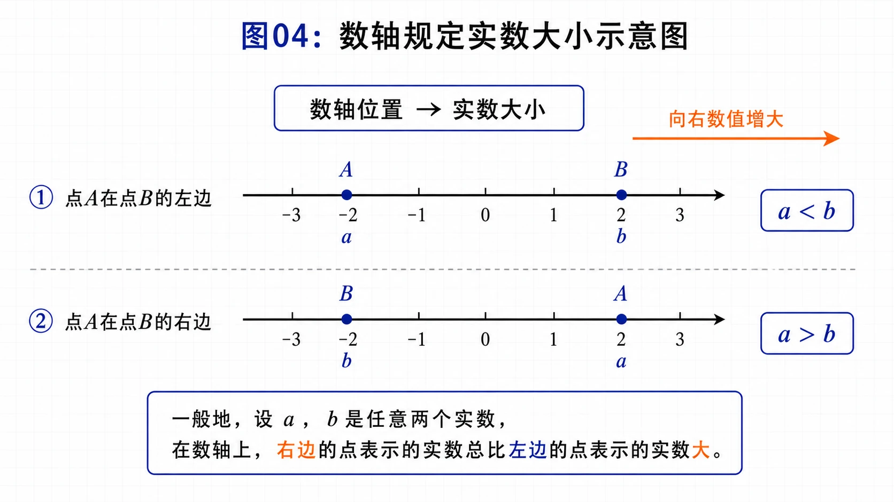
<!-- 图片描述：数轴规定实数大小的示意图。画两条数轴：第一条点A在点B左侧，标 $a<b$；第二条点A在点B右侧，标 $a>b$。用橙色箭头标出“向右数值增大”，旁边写“数轴位置 -> 实数大小”。 -->

#### 2. 实数大小关系的基本事实

对任意实数 $a,b$：

$$
a>b\Longleftrightarrow a-b>0,
$$

$$
a=b\Longleftrightarrow a-b=0,
$$

$$
a<b\Longleftrightarrow a-b<0.
$$

这个事实有两层含义：

- 从左到右：已知 $a$ 与 $b$ 的大小，就能判断 $a-b$ 的符号；
- 从右到左：已知 $a-b$ 的符号，就能判断 $a$ 与 $b$ 的大小。

因此，比较两个数或代数式的大小，可以转化为比较它们的差与 $0$ 的大小。这里要特别注意“$0$ 是正数与负数的分界点”，它是实数比较大小的标杆。

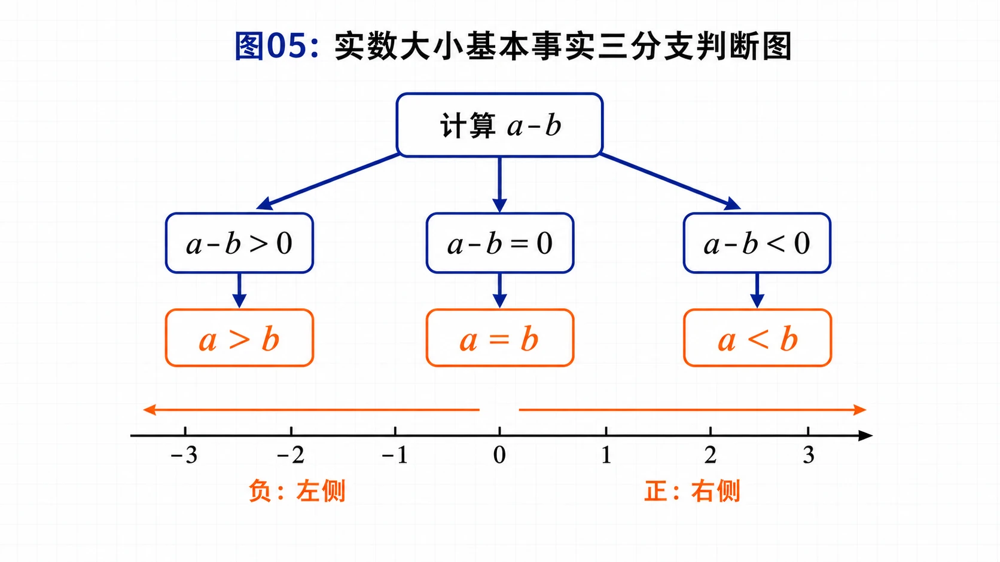
<!-- 图片描述：实数大小基本事实的三分支判断图。中心节点写“计算 $a-b$”，向右分出三条分支：$a-b>0$ 对应 $a>b$，$a-b=0$ 对应 $a=b$，$a-b<0$ 对应 $a<b$。旁边画一条数轴，0 点用橙色竖线强调为正负分界，正半轴标“差为正”，负半轴标“差为负”。整体为课堂板书风格，公式清晰。 -->

### 三、符号语言与等价表示

#### 1. 等式性质作为类比对象

先复习等式性质，是为了说明不等式性质可以通过类比发现。

| 等式性质 | 含义 |
|---|---|
| 若 $a=b$，则 $b=a$ | 相等关系的对称性 |
| 若 $a=b,b=c$，则 $a=c$ | 相等关系的传递性 |
| 若 $a=b$，则 $a\pm c=b\pm c$ | 两边同加同减保持相等 |
| 若 $a=b$，则 $ac=bc$ | 两边同乘同一个数保持相等 |
| 若 $a=b,c\ne0$，则 $\frac ac=\frac bc$ | 两边同除非零数保持相等 |

“运算中的不变性就是性质”，这句话很关键：等式在某些运算中保持相等，不等式也会在某些运算中保持方向，但因为不等号有方向，所以要格外注意符号。

#### 2. 不等式性质1-7

| 性质 | 符号表达 | 文字表达 | 条件提醒 |
|---|---|---|---|
| 性质1 | $a>b\Longleftrightarrow b<a$ | 不等关系换边，方向反过来 | 无额外条件 |
| 性质2 | $a>b,b>c\Rightarrow a>c$ | 大于关系可以传递 | 同向传递 |
| 性质3 | $a>b\Rightarrow a+c>b+c$ | 两边同加同减同一个实数，方向不变 | $c$ 可为任意实数 |
| 性质4 | $a>b,c>0\Rightarrow ac>bc$；$a>b,c<0\Rightarrow ac<bc$ | 同乘正数方向不变，同乘负数方向改变 | 必须判断 $c$ 的符号 |
| 性质5 | $a>b,c>d\Rightarrow a+c>b+d$ | 同向不等式可以相加 | 只能保证相加 |
| 性质6 | $a>b>0,c>d>0\Rightarrow ac>bd$ | 正数同向不等式可以相乘 | 四个量都要正 |
| 性质7 | $a>b>0,n\in\mathbb N,n\ge2\Rightarrow a^n>b^n$ | 正数大小关系可推广到正整数次幂 | 底数必须为正 |

这些性质可以按用途来记：性质1、2解决大小关系本身的方向和传递；性质3、4解决一个不等式怎样变形；性质5、6、7解决多个不等式或幂运算怎样合并。其中最容易出错的是性质4和性质6。性质4的关键是“乘数的符号”，性质6的关键是“所有参与相乘的量都是正数”。条件缺失时，宁可停下来分类讨论，也不要直接套性质。

### 四、关键性质、定理与公式

#### 1. 作差法

比较 $A$ 与 $B$ 的大小时，常用步骤为：

1. 作差：计算 $A-B$；
2. 化简：展开、合并同类项、因式分解或配方；
3. 判断符号：看 $A-B$ 是正、零还是负；
4. 下结论：回到 $A$ 与 $B$ 的大小。

符号化表达为：

$$
A-B>0\Rightarrow A>B,\qquad A-B=0\Rightarrow A=B,\qquad A-B<0\Rightarrow A<B.
$$

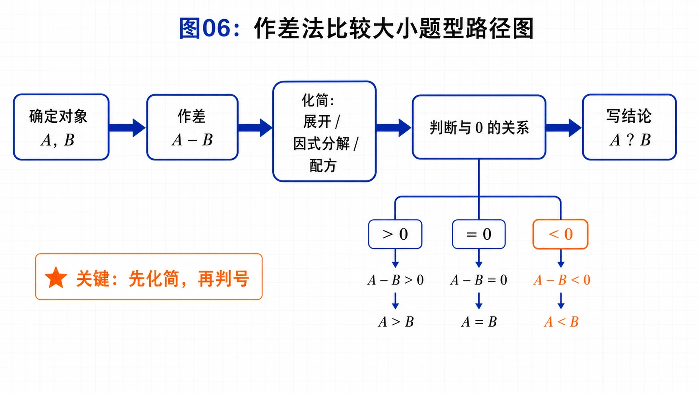
<!-- 图片描述：作差法比较大小的题型路径图。深蓝色流程箭头依次为“确定比较对象 $A,B$”“作差 $A-B$”“展开/因式分解/配方化简”“判断差与 $0$ 的关系”“写出 $A$ 与 $B$ 的大小结论”。在“判断符号”节点旁用橙色列出三种常见结构：常数正负、平方非负、结合条件判断因式符号。图中放一个小例子：$(x+2)(x+3)-(x+1)(x+4)=2>0$。 -->

#### 2. 赵爽弦图与重要不等式

赵爽弦图可以帮助我们直观理解这个不等式。抽象为正方形 $ABCD$ 中的四个全等直角三角形，设直角边为 $a,b$。

当 $a\ne b$ 时：

- 大正方形边长为 $\sqrt{a^2+b^2}$，面积为 $a^2+b^2$；
- 四个直角三角形面积和为 $4\cdot\frac12ab=2ab$；
- 因为大正方形面积大于四个三角形面积和，所以

$$
a^2+b^2>2ab.
$$

当 $a=b$ 时，中间小正方形缩为一个点，得到

$$
a^2+b^2=2ab.
$$

因此一般地，对任意 $a,b\in\mathbb R$，

$$
a^2+b^2\ge2ab,
$$

当且仅当 $a=b$ 时等号成立。

代数证明更简洁：

$$
a^2+b^2-2ab=(a-b)^2\ge0.
$$

由实数大小关系基本事实可得：

$$
a^2+b^2\ge2ab.
$$

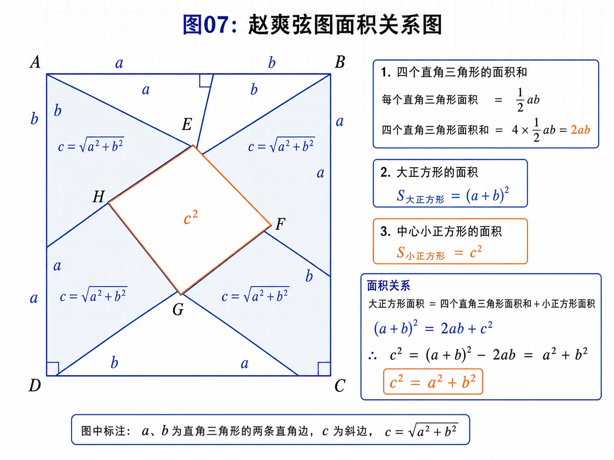
<!-- 图片描述：赵爽弦图面积关系图。画一个大正方形ABCD，内部由四个全等直角三角形围出中间小正方形EFGH；标注直角边 $a,b$，斜边 $\sqrt{a^2+b^2}$，四个三角形面积和 $2ab$，大正方形面积 $a^2+b^2$。旁边分两种情况：$a\ne b$ 时 $a^2+b^2>2ab$，$a=b$ 时中间正方形缩为点，$a^2+b^2=2ab$。 -->

#### 3. 不等式性质的证明思路

性质2证明思路：

若 $a>b,b>c$，则 $a-b>0,b-c>0$，所以

$$
a-c=(a-b)+(b-c)>0,
$$

因此 $a>c$。

性质3证明思路：

若 $a>b$，则

$$
(a+c)-(b+c)=a-b>0,
$$

所以 $a+c>b+c$。

性质4证明思路：

若 $a>b$，则 $a-b>0$。

- 当 $c>0$ 时，$ac-bc=c(a-b)>0$，所以 $ac>bc$；
- 当 $c<0$ 时，$ac-bc=c(a-b)<0$，所以 $ac<bc$。

性质5证明思路：

若 $a>b,c>d$，则由性质3得 $a+c>b+c$，又由性质3得 $b+c>b+d$，再由性质2得

$$
a+c>b+d.
$$

性质6证明思路：

若 $a>b>0,c>d>0$，则由 $c>0$ 得 $ac>bc$，由 $b>0$ 和 $c>d$ 得 $bc>bd$，再由传递性得

$$
ac>bd.
$$

性质7证明思路：

当 $a>b>0$ 时，可把 $a^n$ 与 $b^n$ 看成 $n$ 个正因子的同向相乘；也可以用

$$
a^n-b^n=(a-b)(a^{n-1}+a^{n-2}b+\cdots+b^{n-1})>0
$$

说明。

#### 4. 移项的本质

由性质3可得：

$$
a+b>c
\Rightarrow a+b+(-b)>c+(-b)
\Rightarrow a>c-b.
$$

所以“不等式移项变号”不是凭空规定，而是两边同加相反数的结果。

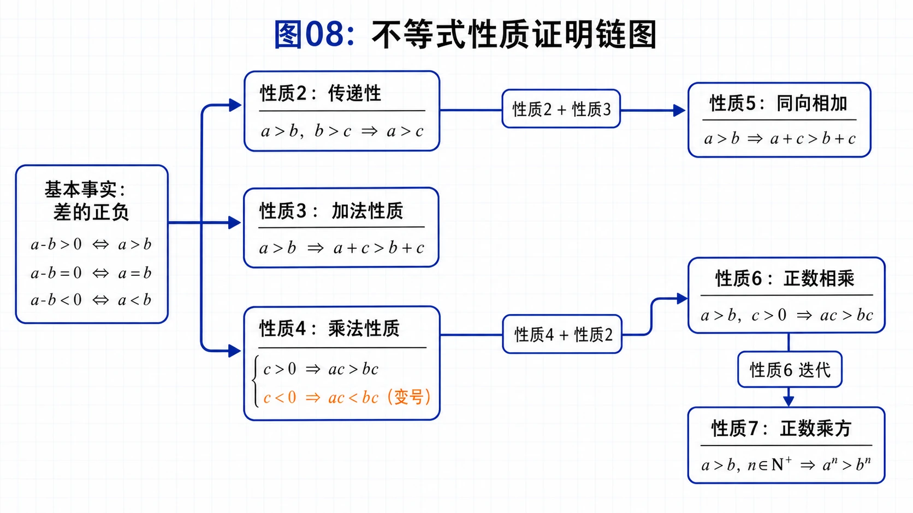
<!-- 图片描述：不等式性质证明链图。左侧写“基本事实：差的正负”，箭头指向“性质2：传递性”“性质3：加法性质”“性质4：乘法性质”，再由性质2+3推出性质5，由性质4+2推出性质6，由性质6迭代推出性质7。每条箭头旁写对应关键式，如 $a-c=(a-b)+(b-c)$、$ac-bc=c(a-b)$。 -->

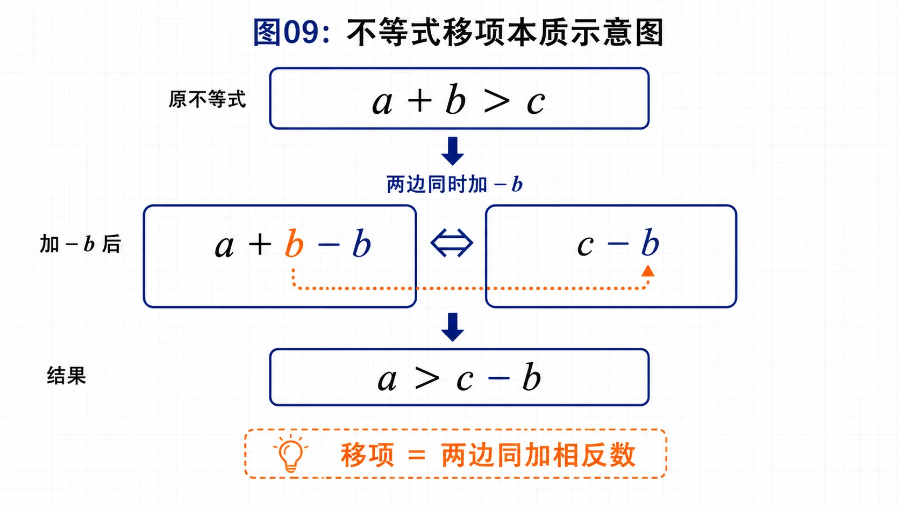
<!-- 图片描述：不等式移项本质示意图。上方写原不等式 $a+b>c$，中间用左右两栏表示“不等式两边同时加上 $-b$”，下方得到 $a>c-b$。用橙色箭头标出左边的 $+b$ 转化为右边的 $-b$，旁边注明“移项不是魔法，而是两边同加相反数”。整体采用板书推导风格，避免装饰。 -->

### 五、典型模型与解题方法

#### 模型1：实际语句转不等式

步骤：

1. 设变量并写单位；
2. 找关键词，如“不超过”“不少于”“大于”“小于”；
3. 写不等式；
4. 补充实际范围，如速度为正、长度为正、节数为整数。

#### 模型2：作差比较

适用于比较两个代数式大小。作差后常见判断方式包括：

- 化为正常数；
- 化为平方或平方和；
- 化为已知为正或为负的因式乘积；
- 利用给定范围判断符号。

#### 模型3：证明不等式

常见证明路线：

- 从已知不等式出发，使用性质逐步推出结论；
- 把目标转化为证明差大于 $0$；
- 遇到分式时先判断分母正负；
- 遇到倒数时先判断原数正负；
- 遇到同乘时先判断乘数符号。

#### 模型4：求取值范围

若已知 $2<a<3,-2<b<-1$，要求 $2a+b$，可先把 $a$ 的范围变形成 $2a$ 的范围，再与 $b$ 的范围同向相加。

注意：范围问题中同向相加常用，但同向相减不可靠。

### 六、题型应用与迁移

2.1 的习题覆盖了多种应用：

- 投资方案：列不等式并求满足条件的年份；
- 两位数：用数字范围和数位关系建立不等式组；
- 糖水变甜：用浓度分式比较；
- 同周长圆与正方形面积：把几何量转化为代数式比较；
- 火车货厢：用不等式组和整数条件求方案，再比较运费。

这些题都不是单纯套性质，而是训练“语言 -> 符号 -> 运算 -> 结论”的完整链条。

## 重点梳理

### 1. 不等式不是“符号翻译”，而是把实际限制数学化

本节开头的限速、酸奶指标、三角形边长、垂线段最短，表面上是四个不同情境，实质都是在训练同一件事：把一句话中的数量限制写成数学符号。做这类题时，不能只看到数字，还要看到限制词。

例如“限速 $40\text{ km/h}$”不是写 $v<40$，而是写 $0<v\le40$。这里有两层信息：速度不能超过 $40$，所以用 $\le$；速度本身应为正，所以要补 $v>0$。这说明列不等式时，既要翻译明说的条件，也要补出合理的隐含条件。

类似地，“不低于 $20$ 万元”要写成 $\ge20$，“含量不少于 $2.5\%$”要写成 $\ge2.5\%$，“非负实数”要写成 $\ge0$。这些词一旦方向写反，后面的计算即使正确，也是在解另一个问题。

### 2. 实数大小比较的核心，是把“谁大谁小”转成“差的正负”

数轴给了我们直观：右边的数大，左边的数小。但在代数运算中，更方便的判断方式是看差：

$$
a-b>0,\ =0,\ <0
$$

分别对应 $a>b,\ a=b,\ a<b$。

所以作差法的完整思路是：

```text
比较 A 与 B
  -> 计算 A-B
  -> 判断 A-B 与 0 的大小
  -> 得出 A 与 B 的大小
```

典型例题中，两个多项式看起来都含 $x^2+5x$，直接比较不如作差清楚。作差后得到 $2>0$，就能立刻判断前者大。习题中也经常把差化成平方、常数或可判断符号的式子，这就是作差法的真正用途。

### 3. $a^2+b^2\ge2ab$ 是本节连接 2.2 的关键结论

这个不等式不是凭空出现的。它有两个来源：

- 从图形看：赵爽弦图中，大正方形面积为 $a^2+b^2$，四个直角三角形面积和为 $2ab$。当中间小正方形有面积时，$a^2+b^2>2ab$；当 $a=b$ 时，中间小正方形缩成一个点，等号成立。
- 从代数看：$a^2+b^2-2ab=(a-b)^2\ge0$，所以 $a^2+b^2\ge2ab$。

学习这个结论时要同时记住三件事：它对任意实数 $a,b$ 成立；证明核心是平方非负；等号成立当且仅当 $a=b$。下一节的基本不等式就是从这里发展出来的。

### 4. 不等式性质要围绕“方向是否改变”来理解

等式没有方向，所以等式两边同乘一个数仍然相等；不等式有方向，因此乘除时会出现方向变化。

最安全的记法是：

- 同加、同减同一个实数：方向不变；
- 同乘、同除正数：方向不变；
- 同乘、同除负数：方向改变；
- 同乘、同除符号未知的式子：不能直接做，必须先判断符号或分类讨论。

这比死背性质更可靠。比如看到 $c<0$，就要立刻警觉：两边如果乘 $c$，不等号要反向。

### 5. 合并不等式时，要分清“可加”和“可乘”的条件

如果 $a>b,c>d$，可以推出 $a+c>b+d$，这是“同向相加”。但不能随便推出 $a-c>b-d$，因为相减会把第二个不等式变成相反数，方向随之改变。

如果要使用同向相乘，则条件更严格：必须是 $a>b>0,c>d>0$，才能推出 $ac>bd$。这里“正数”不能省略。很多判断题的陷阱就在这里：题目只给 $a>b$，却让你判断 $a^2>b^2$，如果 $a,b$ 可能为负，结论就不一定成立。

### 6. 实际应用题必须完成“回译”

本节后面的货厢、糖水、圆与正方形、投资方案等题，都不是只为了列一个不等式。数学运算完成后，还要回到题目语言：

- 投资题要回答经过多少年；
- 糖水题要说明新浓度大于原浓度；
- 货厢题要说明共有几种安排，哪一种运费少；
- 圆与正方形题要解释为什么水管横截面做成圆形更合适。

这一步叫“回译”。缺少回译，应用题答案就不完整。

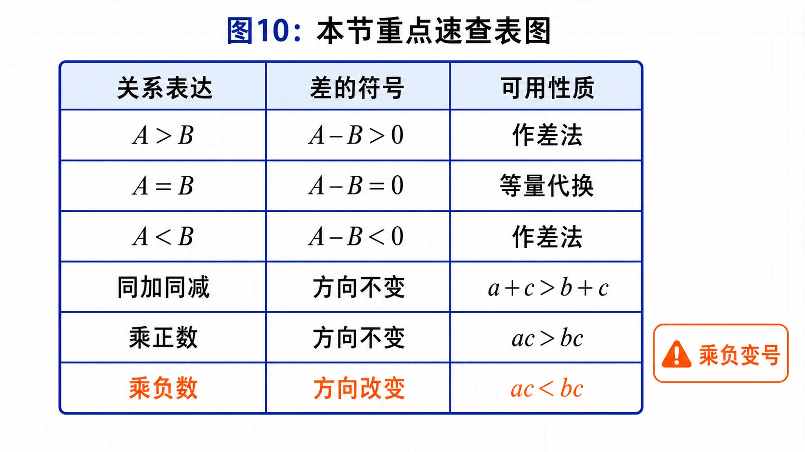
<!-- 图片描述：本节重点速查表图。用三列表格形式展示“关系表达”“差的符号”“可用性质”。左列列关键词如不超过、不少于；中列列 $A-B$ 的三种符号；右列列加法、乘法、同向相加、正数相乘。橙色小警示标注“乘负变号”“倒数先看正负”“实际范围不能漏”。 -->

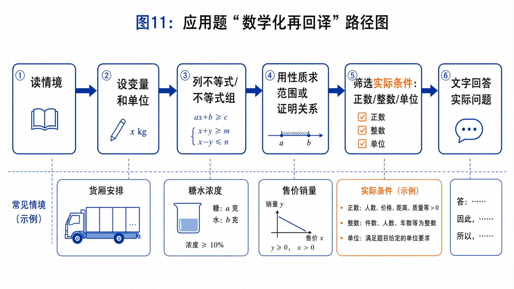
<!-- 图片描述：应用题“数学化再回译”路径图。流程从“读情境”到“设变量和单位”，再到“列不等式或不等式组”“用性质求范围或证明关系”“筛选实际条件，如正数、整数、单位”“用文字回答实际问题”。用货厢安排、糖水浓度、投资年限三个小标签作为例子，橙色突出最后一步“回译”。 -->

## 难点突破

### 难点一：杂志销售问题为什么暂时不求解

这个杂志销售问题，是为了让学生看到：列出不等式只是第一步。该问题整理后会成为一元二次不等式，需要 2.3 的方法才能系统求解。因此本节重点是“为什么要研究不等式性质”，而不是提前求解它。

### 难点二：作差法不是技巧，而是基本事实的直接应用

如果要比较 $A$ 与 $B$，直接比较可能不明显；但 $A-B$ 是一个实数或代数式。只要判断 $A-B$ 与 $0$ 的大小，就能判断 $A$ 与 $B$。这就是前面强调 $0$ 是“标杆”的原因。

### 难点三：同乘负数为什么方向改变

由 $3>2$ 两边同乘 $-1$ 得 $-3<-2$。数轴上看，乘以负数会把点翻到原点另一侧，左右顺序反转。代数上看，若 $a>b$，则 $a-b>0$；当 $c<0$ 时，$c(a-b)<0$，所以 $ac-bc<0$，即 $ac<bc$。

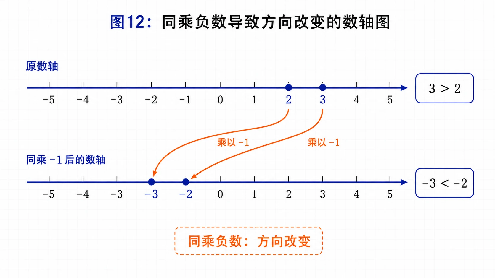
<!-- 图片描述：同乘负数导致方向改变的数轴图。画上下两条数轴：上方标出 2 和 3，显示 $3>2$；下方标出 -3 和 -2，显示两数同乘 -1 后位置左右翻转，得到 $-3<-2$。用橙色弧形箭头表示“乘以 -1 关于 0 翻转”，并在右侧写代数解释 $ac-bc=c(a-b)$，当 $c<0$ 时差变负。 -->

### 难点四：取倒数必须先看正负

若 $a>b>0$，则 $\frac1a<\frac1b$。证明方法是两边同除以正数 $ab$：

$$
\frac1b>\frac1a.
$$

但如果 $a,b$ 不同号或符号未知，不能直接判断倒数大小。例如 $1>-1$，但 $\frac11>\frac1{-1}$。

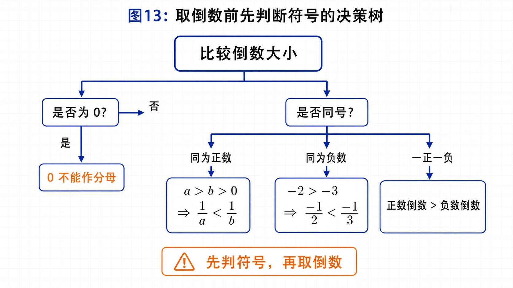
<!-- 图片描述：取倒数前先判断符号的决策树。中心写“比较倒数大小”，第一层分支为“是否为 0”“是否同号”；同为正数时标 $a>b>0\Rightarrow \frac1a<\frac1b$，同为负数时用示例 $-3<-2<0\Rightarrow -\frac13>-\frac12$，异号时提示“先分区间判断”。橙色警示框写“不能由 $a>b$ 直接推出倒数方向”。 -->

### 难点五：同向不等式为什么不能随意相减

若 $a>b,c>d$，一定能推出 $a+c>b+d$，但不能推出 $a-c>b-d$。反例：

$$
5>4,\qquad 100>1,
$$

但

$$
5-100<4-1.
$$

因为相减相当于加上相反数，而 $c>d$ 会推出 $-c<-d$，方向已经改变。

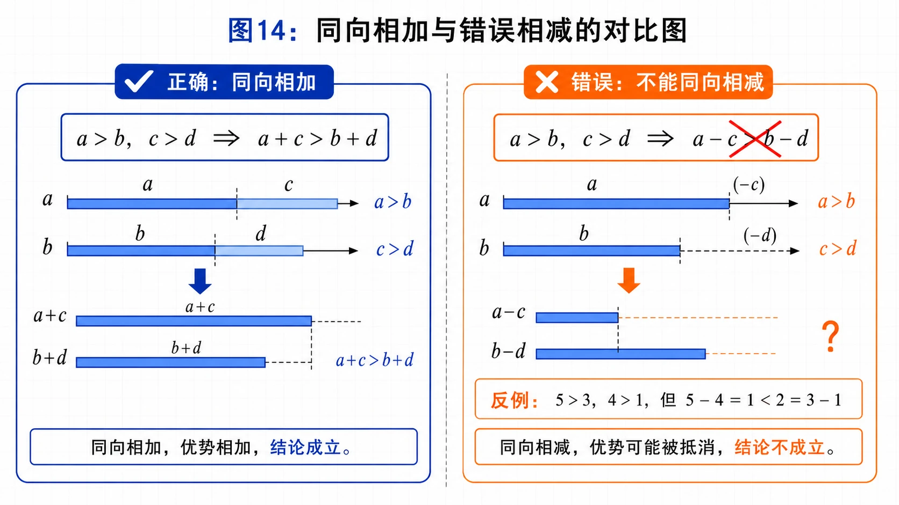
<!-- 图片描述：同向相加与错误相减的对比图。左侧深蓝流程展示 $a>b,\ c>d\Rightarrow a+c>b+d$，用两段长度叠加表示优势相加；右侧橙色警示展示“不能推出 $a-c>b-d$”，列出反例 $5>4,\ 100>1$ 但 $5-100<4-1$。底部写“相减 = 加相反数，方向需重新判断”。 -->

## 例题讲解

### 例1：典型例题，作差比较两个代数式

比较 $(x+2)(x+3)$ 和 $(x+1)(x+4)$ 的大小。

**审题：** 两个式子结构相似，直接展开比较即可。根据实数大小基本事实，比较它们的差与 $0$。

**转化：**

$$
A=(x+2)(x+3),\qquad B=(x+1)(x+4).
$$

**运算：**

$$
\begin{aligned}
A-B
&=(x+2)(x+3)-(x+1)(x+4)\\
&=(x^2+5x+6)-(x^2+5x+4)\\
&=2.
\end{aligned}
$$

**结论：** 因为 $2>0$，所以

$$
(x+2)(x+3)>(x+1)(x+4).
$$

**反思：** 差是恒正数，所以结论对任意实数 $x$ 都成立。

### 例2：图形材料，赵爽弦图推出重要不等式

在正方形 $ABCD$ 中放入四个全等直角三角形，直角边为 $a,b$。

**审题：** 图形中同时包含相等关系和不等关系：四个直角三角形全等；大正方形面积与四个三角形面积之间有大小关系。

**转化：**

- 大正方形面积为 $a^2+b^2$；
- 四个直角三角形面积和为 $2ab$。

**讨论：**

- 若 $a\ne b$，中间小正方形有正面积，所以 $a^2+b^2>2ab$；
- 若 $a=b$，中间小正方形缩为一个点，所以 $a^2+b^2=2ab$。

**结论：**

$$
a^2+b^2\ge2ab,
$$

当且仅当 $a=b$ 时等号成立。

**反思：** 这个不等式不仅来自代数运算，也能从面积关系直观看出。

### 例3：典型例题，证明分式不等式

已知 $a>b>0,c<0$，证明：

$$
\frac ca>\frac cb.
$$

**审题：** 分式不等式的关键是分母和乘数符号。已知 $a,b$ 都为正且 $a>b$，所以倒数方向会反过来；再乘负数 $c$，方向又反过来。

**转化：** 先证明

$$
\frac1a<\frac1b.
$$

**证明：** 因为 $a>b>0$，所以 $ab>0$。由 $a>b$ 两边同除以正数 $ab$，得

$$
\frac1b>\frac1a,
$$

即

$$
\frac1a<\frac1b.
$$

又因为 $c<0$，两边同乘负数 $c$，不等号方向改变，所以

$$
\frac ca>\frac cb.
$$

**反思：** 这道题连续用了“除以正数方向不变”和“乘以负数方向改变”，是性质4的典型应用。

### 例4：证明平均数夹在两数之间

已知 $a>b$，证明：

$$
a>\frac{a+b}{2}>b.
$$

**证明：** 因为 $a>b$，所以 $a-b>0$。

左边：

$$
a-\frac{a+b}{2}=\frac{a-b}{2}>0,
$$

所以

$$
a>\frac{a+b}{2}.
$$

右边：

$$
\frac{a+b}{2}-b=\frac{a-b}{2}>0,
$$

所以

$$
\frac{a+b}{2}>b.
$$

故

$$
a>\frac{a+b}{2}>b.
$$

### 例5：范围求解题，求范围

已知 $2<a<3,-2<b<-1$，求 $2a+b$ 的取值范围。

**审题：** 目标是 $2a+b$，先把 $a$ 的范围变成 $2a$ 的范围。

**解：**

由 $2<a<3$，两边同乘正数 $2$，得

$$
4<2a<6.
$$

又因为

$$
-2<b<-1,
$$

同向相加得

$$
2<2a+b<5.
$$

### 例6：浓度比较题，证明糖水变甜

$b$ 克糖水中含 $a$ 克糖，$b>a>0$。再添加 $m$ 克糖，$m>0$，且全部溶解。证明糖水变甜。

**审题：** 糖水甜度可用糖的质量分数表示。

**转化：**

原浓度为

$$
\frac ab,
$$

新浓度为

$$
\frac{a+m}{b+m}.
$$

要证明糖水变甜，就是证明

$$
\frac{a+m}{b+m}>\frac ab.
$$

**证明：** 因为 $b>0,b+m>0$，交叉相乘不改变方向。于是

$$
\frac{a+m}{b+m}>\frac ab
\Longleftrightarrow b(a+m)>a(b+m).
$$

化简：

$$
ab+bm>ab+am
\Longleftrightarrow bm>am
\Longleftrightarrow m(b-a)>0.
$$

由 $m>0,b-a>0$，可知结论成立。

## 易错点整理

### 易错一：把带等号的语言写成严格不等式

常见错误是把“不超过 $4$”写成 $h<4$，把“不低于 $20$”写成 $R>20$。这类错误看似很小，但会直接改变问题的边界。

正确判断时要问：题目允许“刚好等于”吗？如果允许，就必须带等号。

例如：

$$
\text{不超过 }4 \Rightarrow h\le4,\qquad
\text{不低于 }20 \Rightarrow R\ge20.
$$

### 易错二：只翻译文字条件，漏写实际范围

限速题只写 $v\le40$ 并不完整，因为速度还应满足 $v>0$。货厢题若设 A 型货厢 $x$ 节，也不能只列装货量不等式，还要写 $x$ 是整数且 $0\le x\le50$。

这类错误的根源是只看到了题目明说的限制，没有补出变量本身的意义。应用题设完变量后，最好立刻写一行“其中……”，把单位、正负和整数条件说清楚。

### 易错三：作差后没有完成“符号判断”

有些同学比较两个式子时，只写到 $A-B=(x-1)^2$ 就停了。这样还没有完成比较，因为平方可能等于 $0$。

正确写法应该继续说明：

$$
(x-1)^2\ge0,
$$

所以 $A\ge B$；当 $x=1$ 时，$A=B$。如果题目要判断“是否大于”，就不能把 $\ge$ 误写成 $>$。

### 易错四：同乘负数忘记改变方向

由 $a>b$ 和 $c<0$，不能推出 $ac>bc$，而应推出

$$
ac<bc.
$$

可以用简单数字检查：$3>2$，两边同乘 $-1$ 后得到 $-3<-2$。所以凡是解题中出现“乘以负数”“除以负数”，都要把“不等号反向”写出来。

### 易错五：取倒数时不判断正负

由 $a>b$ 不能直接推出 $\frac1a<\frac1b$。只有在 $a>b>0$ 时，才有

$$
\frac1a<\frac1b.
$$

如果 $a,b$ 是负数，方向会不同；如果其中一个为 $0$，倒数不存在。遇到倒数题，先检查三个问题：是否为 $0$？是否同号？是正数还是负数？

### 易错六：把“同向相加”误用为“同向相减”

已知 $a>b,c>d$，可以推出 $a+c>b+d$，但不能推出 $a-c>b-d$。例如：

$$
5>4,\qquad 100>1,
$$

但

$$
5-100<4-1.
$$

相减本质上是加相反数，而 $c>d$ 会变成 $-c<-d$。所以做范围题时，如果目标是差，不能机械地把两个范围相减，要重新构造或用作差法判断。

### 易错七：正数同向相乘漏掉“正数”条件

性质6的完整形式是：

$$
a>b>0,\ c>d>0\Rightarrow ac>bd.
$$

如果只知道 $a>b,c>d$，结论未必成立。比如两个不等式中有负数时，乘法会改变大小关系。判断题中出现 $a^2>b^2$、$ac^2>bc^2$ 等结论时，都要检查底数或乘数是否可能为 $0$ 或负数。

### 易错八：证明分式不等式时跳过关键方向判断

例如证明 $\frac ca>\frac cb$ 时，不能只写“因为 $a>b$，所以结论成立”。这道题实际用了两步方向判断：

1. 由 $a>b>0$ 得 $\frac1a<\frac1b$；
2. 再由 $c<0$，两边同乘负数，方向改变，得到 $\frac ca>\frac cb$。

证明题越短，越要把方向改变的依据写清楚。否则即使结论对，也容易被判为推理不完整。

## 考点考证点整理

### 考点一：用不等式表示实际关系

- 出题思路：这类题通常不会直接说“列一个不等式”，而是给出限速、投资、运输、浓度、面积等实际情境，让你把文字限制变成数学限制。
- 关键条件：先抓关键词，再抓变量范围。关键词决定 $>,<,\ge,\le$；变量意义决定是否为正数、非负数、整数或有上限。
- 解答要点：设变量时写清单位；列式时把每个条件都转成一个不等式；如果条件有多个，就写成不等式组；最后回到题目问法作答。
- 典型题：投资方案题中，方案 B 经过 $n$ 年投入为 $100+10(n-1)$，所以“不少于方案 A”写成 $100+10(n-1)\ge500$。
- 易扣分点：漏写等号；漏掉“节数为整数”；只列出一个货物约束，却漏掉另一种货物或总节数。

### 考点二：用作差法比较代数式大小

- 出题思路：题目给两个代数式，通常结构相似，直接看不出大小。命题人希望你作差，把比较转化为符号判断。
- 关键条件：作差后的式子是否能判断正负。如果题目给 $x>1$，就要把这个条件用在符号判断中；如果差是平方，还要考虑等号。
- 解答要点：固定作差方向，例如计算 $A-B$；若 $A-B>0$，则 $A>B$；若 $A-B<0$，则 $A<B$；若 $A-B\ge0$，则 $A\ge B$ 并说明等号。
- 典型题：$(x-3)^2-(x-2)(x-4)=1$，所以前者大；$x^2-(x^2-x+1)=x-1$，必须结合 $x>1$ 才能判断。
- 易扣分点：算的是 $A-B$，结论却按 $B-A$ 写；差为平方时忘记等号；题目有条件却没有使用。

### 考点三：不等式性质的证明与应用

- 出题思路：常见形式是填不等号、证明一个分式不等式、判断命题真假，或者要求证明性质1、3、4、6。
- 关键条件：同加同减不需要额外条件；同乘同除必须判断正负；同向相乘必须满足正数条件；取倒数必须排除 $0$ 并判断正负。
- 解答要点：每一步都能说出依据。比如分式题要先说明分母为正，再考虑取倒数或交叉相乘；乘负数时要明确“不等号反向”。
- 典型题：例2 中 $a>b>0,c<0$，先推出 $\frac1a<\frac1b$，再乘负数 $c$，得到 $\frac ca>\frac cb$。
- 易扣分点：由 $a>b$ 直接推出 $a^2>b^2$；由 $a>b$ 直接推出倒数关系；乘以含字母的式子却没有判断它的符号。

### 考点四：重要不等式 $a^2+b^2\ge2ab$

- 出题思路：题目可能要求代数证明，也可能通过赵爽弦图、面积比较来考查。后续 2.2 基本不等式也会继续用到这个结论。
- 关键条件：$a,b$ 可以是任意实数；等号成立当且仅当 $a=b$。
- 解答要点：代数证明从 $(a-b)^2\ge0$ 出发；几何解释要说清大正方形面积、四个直角三角形面积和、中间小正方形面积之间的关系。
- 典型题：利用同周长圆和正方形面积比较时，本质也是把几何问题转化为代数式大小比较。
- 易扣分点：只背公式，不说明来源；忘记等号条件；把“任意实数成立”和“正数条件”混淆。

### 考点五：综合建模与方案选择

- 出题思路：这类题会把多个限制条件放在同一情境中，如货物运输既有甲货物要求，又有乙货物要求，还有总货厢节数和运费比较。
- 关键条件：变量通常要满足多个不等式，还可能要求整数；目标可能不是“求范围”，而是“比较方案优劣”。
- 解答要点：先列约束不等式组，求出可行范围；再结合整数条件筛选方案；最后根据费用、面积、浓度等目标作出选择或解释。
- 典型题：货厢题设 A 型 $x$ 节，B 型 $50-x$ 节，列出 $35x+25(50-x)\ge1530$ 和 $15x+35(50-x)\ge1150$，得 $28\le x\le30$，再比较运费 $40-0.3x$。
- 易扣分点：只列一个约束；不筛选整数；得到方案后忘记比较运费；数学结论没有转化为实际回答。

## 练习题

### A. 基础训练

1. 用不等式或不等式组表示下列关系。
   - 某路段限速 $40\text{ km/h}$；
   - 酸奶中脂肪含量 $f$ 不少于 $2.5\%$，蛋白质含量 $p$ 不少于 $2.3\%$；
   - 三角形两边之和大于第三边、两边之差小于第三边；
   - 直线外一点到直线上各点的线段中，垂线段最短。
2. 某杂志原价 $2.5$ 元，每本可售 $8$ 万本。售价为 $x$ 元时，每提高 $0.1$ 元，销量减少 $0.2$ 万本。写出“销售总收入不低于 $20$ 万元”的不等式。
3. 比较 $(x+3)(x+7)$ 和 $(x+4)(x+6)$ 的大小。
4. 已知 $a>b$，证明 $a>\frac{a+b}{2}>b$。
5. 证明不等式性质1、3、4、6。
6. 用 $>$ 或 $<$ 填空。
   - 若 $a>b,c<d$，则 $a-c$ 与 $b-d$ 的大小关系；
   - 若 $a>b>0,c<d<0$，则 $ac$ 与 $bd$ 的大小关系；
   - 若 $a>b>0$，则 $a^2$ 与 $b^2$ 的大小关系；
   - 若 $a>b>c>0$，则 $\frac ca$ 与 $\frac cb$ 的大小关系。

### B. 巩固训练

7. 举出几个现实生活中与不等式有关的例子。
8. 某市生态环境局有两个绿地投资方案：方案A一次性投资 $500$ 万元；方案B第一年投资 $100$ 万元，以后每年投资 $10$ 万元。列出不等式表示“经过 $n$ 年之后，方案B的投入不少于方案A的投入”。
9. 比较下列各组中两个代数式的大小。
   - $x^2+5x+6$ 与 $2x^2+5x+9$；
   - $(x-3)^2$ 与 $(x-2)(x-4)$；
   - 当 $x>1$ 时，$x^2$ 与 $x^2-x+1$；
   - $x^2+y^2+1$ 与 $2(x+y-1)$。
10. 一个大于 $50$ 且小于 $60$ 的两位数，个位数字比十位数字大 $2$。用 $a,b$ 分别表示十位数字和个位数字，用不等式表示上述关系，并求这个两位数。
11. 已知 $2<a<3,-2<b<-1$，求 $2a+b$ 的取值范围。
12. 证明：若 $c<b$，且 $b<a$，则 $c<a$。
13. 已知 $a>b>0,c<d<0,e<0$，证明

$$
\frac e{a-c}>\frac e{b-d}.
$$

14. 判断下列命题是否正确，并说明理由。
   - A. 若 $a>b>0$，则 $ac^2>bc^2$；
   - B. 若 $a>b>0$，则 $a^2>b^2$；
   - C. 若 $a<b<0$，则 $a^2<ab<b^2$；
   - D. 若 $a<b<0$，判断 $\frac1a$ 与 $\frac1b$ 的大小关系。
15. 证明圆的面积大于与它具有相同周长的正方形的面积，并说明为什么自来水管横截面通常制成圆形。
16. $b$ 克糖水中含 $a$ 克糖，$b>a>0$。再添加 $m$ 克糖，$m>0$，糖水变甜。请把这一事实表示为不等式并证明。
17. 已知 $a>b>0$，证明 $\sqrt a>\sqrt b$。
18. 火车站有甲种货物 $1530\text{ t}$、乙种货物 $1150\text{ t}$。计划用 A、B 两种型号货厢共 $50$ 节。A 型每节装甲 $35\text{ t}$、乙 $15\text{ t}$；B 型每节装甲 $25\text{ t}$、乙 $35\text{ t}$。求安排方案数；若 A 型每节运费 $0.5$ 万元，B 型每节运费 $0.8$ 万元，哪种方案运费较少？

### C. 提升训练

19. 若 $-1<x<2$，求 $3-2x$ 的取值范围。
20. 判断命题是否正确：若 $a>b$，则 $a^2>b^2$。
21. 已知 $a>b>0$，证明 $\frac ab+\frac ba>2$。

## 练习题答案

1. 设速度为 $v\text{ km/h}$，限速可写 $0<v\le40$；酸奶指标为 $f\ge2.5\%,p\ge2.3\%$；三角形可写 $a+b>c,a-b<c$ 等；垂线段最短可写 $CD<CE$。
2. 销量为 $8-\frac{x-2.5}{0.1}\times0.2$ 万本，收入不低于 $20$ 万元可写成

$$
\left(8-\frac{x-2.5}{0.1}\times0.2\right)x\ge20.
$$

3. 作差：

$$
(x+3)(x+7)-(x+4)(x+6)=x^2+10x+21-(x^2+10x+24)=-3<0.
$$

所以 $(x+3)(x+7)<(x+4)(x+6)$。
4. 因为

$$
a-\frac{a+b}{2}=\frac{a-b}{2}>0,
$$

所以 $a>\frac{a+b}{2}$；又因为

$$
\frac{a+b}{2}-b=\frac{a-b}{2}>0,
$$

所以 $\frac{a+b}{2}>b$。
5. 性质1：若 $a>b$，则 $a-b>0$，所以 $b-a<0$，即 $b<a$。性质3：$(a+c)-(b+c)=a-b>0$。性质4：$ac-bc=c(a-b)$，根据 $c$ 正负判断。性质6：由 $c>0$ 得 $ac>bc$，由 $b>0,c>d$ 得 $bc>bd$，传递得 $ac>bd$。
6. (1) $a-c>b-d$；(2) $ac<bd$；(3) $a^2>b^2$；(4) $\frac ca<\frac cb$。
7. 示例：车速不超过限速、成绩不低于录取线、商品价格低于预算、身高不少于某标准等。写成不等式前要先设变量。
8. 经过 $n$ 年后，方案B投入为 $100+10(n-1)$ 万元，所以条件为

$$
100+10(n-1)\ge500.
$$

化简得 $n\ge41$。
9. (1)

$$
(x^2+5x+6)-(2x^2+5x+9)=-x^2-3<0,
$$

所以前者小。  
(2)

$$
(x-3)^2-(x-2)(x-4)=1>0,
$$

所以前者大。  
(3)

$$
x^2-(x^2-x+1)=x-1>0,
$$

所以当 $x>1$ 时，$x^2>x^2-x+1$。  
(4)

$$
x^2+y^2+1-2(x+y-1)=(x-1)^2+(y-1)^2+1>0,
$$

所以 $x^2+y^2+1>2(x+y-1)$。
10. 由题意：

$$
50<10a+b<60,
\qquad b=a+2.
$$

由于十位数字只能为 $5$，所以 $a=5,b=7$，这个两位数是 $57$。
11. 由 $2<a<3$ 得 $4<2a<6$，再与 $-2<b<-1$ 同向相加，得

$$
2<2a+b<5.
$$

12. 由 $c<b$ 且 $b<a$，根据传递性得 $c<a$。
13. 由 $a>b$ 和 $d>c$ 得

$$
(a-c)-(b-d)=(a-b)+(d-c)>0,
$$

所以 $a-c>b-d$。又因为 $a-c>0,b-d>0$，所以

$$
\frac1{a-c}<\frac1{b-d}.
$$

再由 $e<0$，两边同乘负数 $e$，方向改变：

$$
\frac e{a-c}>\frac e{b-d}.
$$

14. A 不一定正确，若 $c=0$，则两边都为 $0$；B 正确；C 不正确，例如 $a=-3,b=-2$ 时，$a^2=9,ab=6,b^2=4$；D 中若 $a<b<0$，则 $\frac1a>\frac1b$，可用同乘正数 $ab$ 或代入负数验证。
15. 设共同周长为 $L$。圆面积为 $\frac{L^2}{4\pi}$，正方形面积为 $\frac{L^2}{16}$。因为 $16>4\pi$，所以 $\frac1{4\pi}>\frac1{16}$，圆面积更大。周长相同时，圆形截面积更大，输水能力更强，所以水管横截面通常制成圆形。
16. 原浓度为 $\frac ab$，新浓度为 $\frac{a+m}{b+m}$。要证

$$
\frac{a+m}{b+m}>\frac ab.
$$

因为 $b>0,b+m>0$，交叉相乘得等价条件 $b(a+m)>a(b+m)$，化简为 $m(b-a)>0$，成立。
17. 因为 $a>b>0$，所以 $\sqrt a+\sqrt b>0$。又

$$
\sqrt a-\sqrt b=\frac{a-b}{\sqrt a+\sqrt b}>0,
$$

所以 $\sqrt a>\sqrt b$。
18. 设 A 型货厢 $x$ 节，则 B 型货厢 $50-x$ 节。甲货物条件：

$$
35x+25(50-x)\ge1530\Rightarrow x\ge28.
$$

乙货物条件：

$$
15x+35(50-x)\ge1150\Rightarrow x\le30.
$$

又 $x$ 为整数，所以 $x=28,29,30$，共有 $3$ 种方案。运费为

$$
0.5x+0.8(50-x)=40-0.3x.
$$

当 $x=30$ 时运费最少，即 A 型 $30$ 节、B 型 $20$ 节。
19. 由 $-1<x<2$，两边同乘 $-2$，方向改变：$-4<-2x<2$，再加 $3$，得 $-1<3-2x<5$。
20. 不正确。反例：$a=1,b=-2$，有 $a>b$，但 $a^2=1<b^2=4$。
21. 作差：

$$
\frac ab+\frac ba-2=\frac{a^2+b^2-2ab}{ab}=\frac{(a-b)^2}{ab}>0.
$$

因此 $\frac ab+\frac ba>2$。
