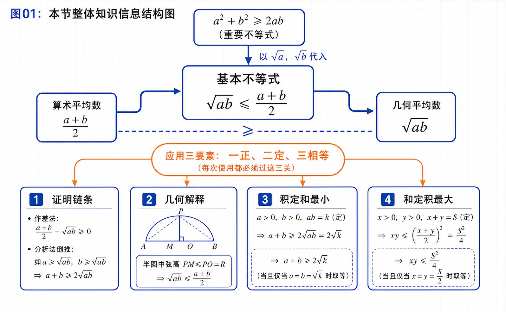
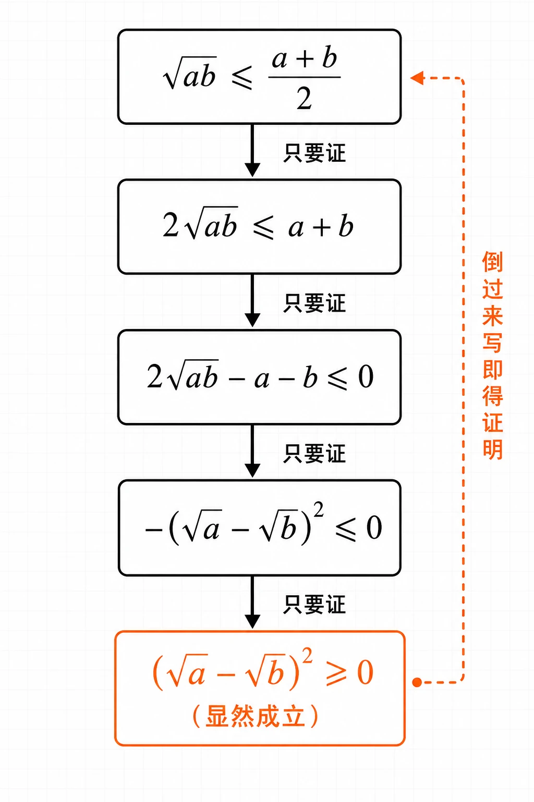
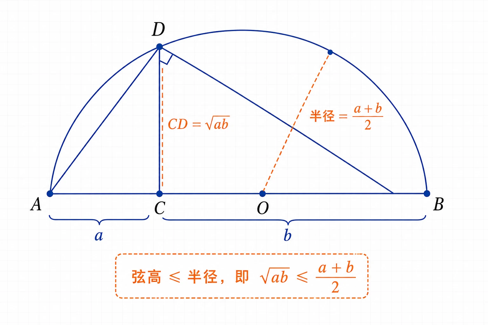
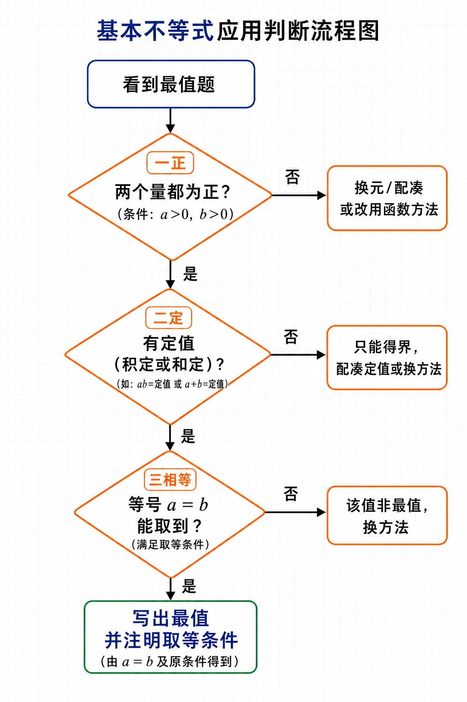

# 2.2 基本不等式

<!-- 图片描述：本节整体知识信息结构图。浅网格背景，中心节点写“基本不等式 $\sqrt{ab}\le\dfrac{a+b}{2}$”。向上箭头连接来源节点“$a^2+b^2\ge2ab$（重要不等式）”，并标注“以 $\sqrt a,\sqrt b$ 代入”。中心向左连出“算术平均数 $\dfrac{a+b}{2}$”，向右连出“几何平均数 $\sqrt{ab}$”，两节点之间用“$\ge$”相连。中心向下分四条分支：①证明链条（作差法、分析法倒推）；②几何解释（半圆中弦高不超过半径）；③积定和最小（$x+\dfrac{k}{x}\ge2\sqrt{k}$）；④和定积最大（$xy\le\dfrac{S^2}{4}$）。用橙色椭圆框醒目标注应用三要素“一正、二定、三相等”，并用箭头连到四条分支，表示每次使用都必须过这三关。整图黑色深蓝线条为主，结构层次清晰。 -->

## 本节学习目标

- 理解基本不等式 $\sqrt{ab}\le\dfrac{a+b}{2}$ 的成立条件、含义和等号成立的充要条件。
- 能从重要不等式 $a^2+b^2\ge2ab$ 出发，用代入法和分析法推导基本不等式，并能用半圆几何图形解释它。
- 弄清算术平均数与几何平均数的关系，理解“两个正数的算术平均数不小于几何平均数”。
- 掌握用基本不等式求最值的两类基本模型：“积为定值求和的最小值”与“和为定值求积的最大值”。
- 能把矩形菜园、长方体水池、靠墙围栏、仓库选址、天平称重等实际问题转化为最值模型并求解。
- 养成使用基本不等式时必查“一正、二定、三相等”的解题习惯。

## 核心知识点讲解

### 一、知识对象与问题情境

在 2.1 节我们由赵爽弦图得到了一个对任意实数都成立的重要不等式：$a^2+b^2\ge2ab$（当且仅当 $a=b$ 时取等号）。它会变形、能配凑，是很多不等式问题的“母式”。

本节要研究的问题是：能不能在这个母式基础上，再得到一个专门处理两个**正数**平均关系的不等式，并把它当作工具去求一类最大值、最小值？这就是**基本不等式**。它之所以叫“基本”，是因为它结构简单、使用面广，是求最值和证明不等式时最常用的一件“武器”。

学习主线建议这样串起来：先由重要不等式代入得到基本不等式 $\to$ 弄清三个要素（正、定、等）$\to$ 用它解决两类最值模型 $\to$ 再迁移到几何与实际应用题。

### 二、核心概念与定义条件

把重要不等式 $a^2+b^2\ge2ab$ 中的 $a,b$ 分别换成 $\sqrt a,\sqrt b$（这要求 $a>0,b>0$，否则 $\sqrt a,\sqrt b$ 没有意义），就得到：

$$
\sqrt{ab}\le\frac{a+b}{2},
$$

当且仅当 $a=b$ 时，等号成立。这个不等式叫作**基本不等式**（basic inequality）。

这里有两个名词要分清：

- $\dfrac{a+b}{2}$ 叫作正数 $a,b$ 的**算术平均数**，就是平时说的“平均数”。
- $\sqrt{ab}$ 叫作正数 $a,b$ 的**几何平均数**。

所以基本不等式用一句话说就是：**两个正数的算术平均数不小于它们的几何平均数**。

使用时三个条件缺一不可，记成“一正、二定、三相等”：

- **一正**：参与比较的两个数都必须是正数。这是基本不等式成立的前提，写解题过程时一定要先点明 $a>0,b>0$。
- **二定**：求和的最小值时，必须先有“积为定值”；求积的最大值时，必须先有“和为定值”。没有定值，不等式只能给出一个“界”，不能直接说是最值。
- **三相等**：等号成立的条件 $a=b$ 必须能在题设范围内真的实现。取不到等号，那个值就不是最值。

### 三、符号语言与等价表示

基本不等式有几种等价写法，遇到题目时要会快速识别和互化：

| 条件 | 结论 | 适用情境 |
|---|---|---|
| $a,b>0$ | $\dfrac{a+b}{2}\ge\sqrt{ab}$ | 由积控制算术平均数 |
| $a,b>0$ | $a+b\ge2\sqrt{ab}$ | 由积控制和 |
| $a,b>0$ | $ab\le\left(\dfrac{a+b}{2}\right)^2$ | 由和控制积 |
| $x>0$，常数 $k>0$ | $x+\dfrac{k}{x}\ge2\sqrt{k}$ | 两项乘积为定值 $k$（积定和最小） |
| $x,y>0$，$xy=P$（定值） | $x+y\ge2\sqrt{P}$ | 积定，求和的最小值 |
| $x,y>0$，$x+y=S$（定值） | $xy\le\dfrac{S^2}{4}$ | 和定，求积的最大值 |

记忆技巧：左边是“和”，右边就由“积”来控制；要求“和的最小值”，就去找“积的定值”；要求“积的最大值”，就去找“和的定值”。

### 四、关键性质、定理与公式

**证明方法一：作差法（由重要不等式代入）。**

因为对任意实数 $a,b$ 有 $a^2+b^2\ge2ab$，当 $a>0,b>0$ 时，用 $\sqrt a,\sqrt b$ 替换 $a,b$：

$$
(\sqrt a)^2+(\sqrt b)^2\ge2\sqrt a\cdot\sqrt b
\;\Longrightarrow\;
a+b\ge2\sqrt{ab}
\;\Longrightarrow\;
\frac{a+b}{2}\ge\sqrt{ab}.
$$

等号成立 $\Leftrightarrow\sqrt a=\sqrt b\Leftrightarrow a=b$。

**证明方法二：分析法（倒推）。**

要证 $\sqrt{ab}\le\dfrac{a+b}{2}$，只需证 $2\sqrt{ab}\le a+b$，只需证 $2\sqrt{ab}-a-b\le0$，只需证 $-(\sqrt a-\sqrt b)^2\le0$，而 $(\sqrt a-\sqrt b)^2\ge0$ 显然成立，所以原不等式成立。把过程倒过来写，就是完整的证明。

<!-- 图片描述：分析法倒推证明流程图。从上到下五个方框，用向下箭头连接，每个箭头旁标注“只要证”。第一框“$\sqrt{ab}\le\dfrac{a+b}{2}$”；第二框“$2\sqrt{ab}\le a+b$”；第三框“$2\sqrt{ab}-a-b\le0$”；第四框“$-(\sqrt a-\sqrt b)^2\le0$”；第五框“$(\sqrt a-\sqrt b)^2\ge0$（显然成立）”，用橙色框突出，并在最右侧画一条向上的虚线箭头连回第一框，标注“倒过来写即得证明”。浅网格背景，黑色线条，LaTeX 公式风格。 -->

**几何解释（半圆模型）。**

如图，$AB$ 是圆的直径，点 $C$ 在 $AB$ 上，且 $AC=a$、$BC=b$（$a,b>0$）。过 $C$ 作垂直于 $AB$ 的弦 $DE$，连接 $AD,BD$。由于直径所对的圆周角是直角，$\angle ADB=90^\circ$。在直角 $\triangle ADB$ 中，$CD$ 是斜边上的高，由射影定理（或 $\triangle ACD\sim\triangle DCB$）得 $CD^2=AC\cdot CB=ab$，即 $CD=\sqrt{ab}$。而圆的半径等于 $\dfrac{AB}{2}=\dfrac{a+b}{2}$，半圆内垂直于直径的弦长不超过半径，所以 $\sqrt{ab}\le\dfrac{a+b}{2}$。当且仅当 $C$ 与圆心重合（即 $a=b$）时取等号。

<!-- 图片描述：基本不等式几何解释图。画一个半圆，直径为水平线段 $AB$，圆心 $O$ 在中点。直径上取一点 $C$（偏左，使 $AC<CB$），标 $AC=a$、$CB=b$。过 $C$ 作竖直弦 $DE$ 交半圆于 $D$（上方）和 $E$（下方，或在直径上）。连接 $AD$、$BD$ 形成直角三角形，$\angle ADB$ 标直角符号。用橙色虚线标出 $CD=\sqrt{ab}$ 和半径线段 $O$ 到圆周，标注“半径 $=\dfrac{a+b}{2}$”，并用橙色文字写“弦高 $\le$ 半径，即 $\sqrt{ab}\le\dfrac{a+b}{2}$”。浅网格背景，黑色深蓝线条。 -->

### 五、典型模型与解题方法

用基本不等式求最值，标准动作分四步：

1. **判断正负**：确认参与运算的两个量都为正；不是正数时，先通过换元、配凑或讨论符号处理。
2. **找定值**：看目标是“和”还是“积”，反推出需要哪个为定值；若没有现成定值，要配凑出定值。
3. **套公式**：写出 $a+b\ge2\sqrt{ab}$ 或 $ab\le\left(\dfrac{a+b}{2}\right)^2$。
4. **验等号**：解 $a=b$ 是否落在题设范围内；取得到才下结论“最小/最大值”。

常见的两种结构：

- **积定求和最小**：形如 $x+\dfrac{k}{x}$（$x>0,k>0$），最小值为 $2\sqrt{k}$，取等号时 $x=\sqrt{k}$。
- **和定求积最大**：形如 $xy$ 且已知 $x+y=S$（$x,y>0$），最大值为 $\dfrac{S^2}{4}$，取等号时 $x=y=\dfrac S2$。

配凑技巧：当系数不一时，比如要处理 $3x+4y$（$xy$ 为定值），可写成 $3x+4y\ge2\sqrt{3x\cdot4y}=2\sqrt{12xy}$，关键是让根号下的乘积正好用到给定的定值。

### 六、题型应用与迁移

本节题型分三类：

- **纯代数式最值**：直接给 $x+\dfrac{k}{x}$、$\sqrt{x(10-x)}$、$2-3x-\dfrac{4}{x}$ 等结构，先确认变量范围使各项为正，再配凑定值。
- **几何图形最值**：矩形周长与面积、直角三角形、圆柱侧面、矩形折叠等，关键是设变量后把目标量（面积、周长、表面积）和约束（定面积、定周长、定体积）写清楚。
- **实际费用最值**：水池造价、房屋造价、仓库两项费用之和等，要先写出目标函数（总费用），再把约束化为“积定”或“和定”。

无论哪一类，最后都要回到实际问题作答：水池底面设计成多少米的正方形、仓库建在几千米处、菜园边长是多少，不能只写一个数字。

## 重点梳理

- **基本不等式的使用前提是“正数”**。这一条最容易漏写。写过程时第一句就要点明 $x>0$（或 $a,b>0$），它既保证 $\sqrt{ab}$ 有意义，也保证不等号方向正确。遇到 $x<0$ 的情形不能直接套，要转化处理。
- **“定值”是求最值的关键触发条件**。看到“求……的最小值”且式子是“和”的形式，就去找“积是否为定值”；看到“求……的最大值”且式子是“积”的形式，就去找“和是否为定值”。没有定值就只能得“界”，得不了“最值”。
- **等号是否取到决定结论能否成立**。比如 $x+\dfrac{4}{x}\ge4$ 的等号在 $x=2$ 处取到；若题目限定 $x\ge3$，则等号取不到，$4$ 就不是最小值，需要改用函数单调性等其他方法。
- **两类模型要分清方向**：“积定和最小”与“和定积最大”不能混淆。一个易记方式：和 $\to$ 想最小 $\to$ 找积定；积 $\to$ 想最大 $\to$ 找和定。
- **实际问题要先写目标函数再求最值**。例如水池造价题不是直接求 $x+y$，而是先写出总造价 $z=240000+720(x+y)$，由于 $xy=1600$ 是定值，$x+y$ 最小时 $z$ 才最小。
- **正方形往往是矩形类最值的“最优形状”**。在周长一定求面积最大、面积一定求周长最小的矩形问题中，等号都在正方形处取到，这可作为检查答案的直觉。

<!-- 图片描述：基本不等式应用判断流程图。起点圆角框“看到最值题”。第一个菱形判断“两个量都为正？”否→走换元/配凑或改用函数方法；是→向下。第二个菱形判断“有定值（积定或和定）？”否→提示“只能得界，配凑定值或换方法”；是→向下。第三个菱形判断“等号 $a=b$ 能取到？”否→提示“该值非最值，换方法”；是→进入绿色框“写出最值并注明取等条件”。整图浅网格背景，黑色线条，菱形和箭头清晰，三个判断用橙色边框突出。 -->

## 难点突破

### 难点一：为什么 $x+\dfrac{1}{x}\ge2$ 必须强调 $x>0$

基本不等式要求参与比较的两个数都为正。当 $x>0$ 时，$x$ 与 $\dfrac{1}{x}$ 都为正，乘积为 $1$，所以 $x+\dfrac{1}{x}\ge2$ 成立。

但当 $x<0$ 时，$x$ 与 $\dfrac{1}{x}$ 都为负，不能直接套用基本不等式。事实上，令 $x<0$，则 $-x>0$，$-\dfrac{1}{x}>0$，于是 $(-x)+\left(-\dfrac{1}{x}\right)\ge2$，即 $x+\dfrac{1}{x}\le-2$。所以 $x+\dfrac{1}{x}\ge2$ 对一切 $x\ne0$ 并不成立（$x<0$ 时它恒小于等于 $-2$）。这说明漏掉“正数”前提会得到完全错误的结论。

### 难点二：等号取不到时，“界”不等于“最值”

例如 $x+\dfrac{4}{x}\ge4$ 的等号条件是 $x=\dfrac{4}{x}$，即 $x=2$。若题目限定 $x\ge3$，则 $x=2$ 不在范围内，等号取不到，$4$ 只是 $x+\dfrac{4}{x}$ 的一个下界而不是最小值。此时在 $x\ge3$ 上函数 $x+\dfrac{4}{x}$ 单调递增，最小值在 $x=3$ 处取得，为 $3+\dfrac{4}{3}=\dfrac{13}{3}$。

突破方法：解出等号条件后，**一定要回代检查是否满足题设范围**，不满足就果断放弃基本不等式，改用函数单调性或图象法。

### 难点三：分析法（倒推证明）的书写逻辑

分析法的写法是“要证 $A$，只要证 $B$，只要证 $C$，……，而最后一步显然成立，所以 $A$ 成立”。难点在于：每一句“只要证”必须是**等价转化**或**充分性传递**，不能跳步，也不能写成不等价的形式。

突破方法：把分析法理解为“从结论倒着找原因”，最后一步用到一个明显成立的事实（如完全平方非负），再说明过程可逆，即可完成证明。它是证明不等式最常用的方法之一，与作差法、综合法配合使用。

### 难点四：实际问题中目标函数容易写错

水池、房屋造价题里，墙体有几面、哪面靠墙、单位价格是多少，都会影响目标函数。常见错误：把侧面面积按一面算（实际有两面）、漏掉底面积或屋顶造价、单位没统一。

突破方法：先画示意图标出各面，再逐面写出面积和单价，最后把各项费用相加；把约束（体积、面积）单独列一行，避免和目标函数混淆。

## 例题讲解

### 例1：求 $x+\dfrac{1}{x}$ 的最小值

已知 $x>0$，求 $x+\dfrac{1}{x}$ 的最小值。

**审题：** 目标是“和的最小值”，观察 $x\cdot\dfrac{1}{x}=1$ 是定值，符合“积定求和最小”模型。

**解：** 因为 $x>0$，所以 $\dfrac{1}{x}>0$，且 $x\cdot\dfrac{1}{x}=1$，由基本不等式

$$
x+\frac{1}{x}\ge2\sqrt{x\cdot\frac{1}{x}}=2.
$$

当且仅当 $x=\dfrac{1}{x}$，即 $x^2=1$，$x=1$（舍去 $x=-1$）时等号成立。因此所求最小值为 $2$。

**反思：** 解答中必须写出三点——$x>0$（一正）、乘积为 $1$（二定）、$x=1$ 时取等（三相等），缺一不可。可以追问：当 $y_0<2$ 时，$x+\dfrac{1}{x}\ge y_0$ 虽然也成立，但 $y_0$ 不是最小值，因为最小值必须是函数能取到的那个值。

### 例2：积定和最小、和定积最大

已知 $x,y$ 都是正数。

（1）如果积 $xy$ 等于定值 $P$，那么当 $x=y$ 时，和 $x+y$ 有最小值 $2\sqrt{P}$；

（2）如果和 $x+y$ 等于定值 $S$，那么当 $x=y$ 时，积 $xy$ 有最大值 $\dfrac{S^2}{4}$。

**证明：** 因为 $x,y$ 都是正数，由基本不等式 $\dfrac{x+y}{2}\ge\sqrt{xy}$。

（1）当 $xy=P$ 时，$\dfrac{x+y}{2}\ge\sqrt{P}$，即 $x+y\ge2\sqrt{P}$，当且仅当 $x=y$ 时取等号。故和 $x+y$ 的最小值为 $2\sqrt{P}$。

（2）当 $x+y=S$ 时，$\sqrt{xy}\le\dfrac{x+y}{2}=\dfrac{S}{2}$，即 $xy\le\dfrac{S^2}{4}$，当且仅当 $x=y$ 时取等号。故积 $xy$ 的最大值为 $\dfrac{S^2}{4}$。

**反思：** 这是两类最值模型的“母结论”，后续所有应用题都归结为这两种之一。关键在于先把实际问题配凑成“积定”或“和定”。

### 例3：矩形菜园的两类问题

（1）用篱笆围一个面积为 $100\text{ m}^2$ 的矩形菜园，当矩形的边长为多少时，所用篱笆最短？最短长度是多少？

（2）用一段长为 $36\text{ m}$ 的篱笆围成一个矩形菜园，当矩形的边长为多少时，菜园面积最大？最大面积是多少？

**审题：** （1）面积（积）一定，求周长（和的 2 倍）最小——积定求和最小。（2）周长（和）一定，求面积（积）最大——和定求积最大。

**解：** 设矩形相邻两条边长分别为 $x\text{ m},y\text{ m}$。

（1）由已知 $xy=100$。由基本不等式 $x+y\ge2\sqrt{xy}=2\sqrt{100}=20$，所以篱笆长 $2(x+y)\ge40$，当且仅当 $x=y=10$ 时取等号。即当菜园是边长为 $10\text{ m}$ 的正方形时，篱笆最短，最短为 $40\text{ m}$。

（2）由已知 $2(x+y)=36$，即 $x+y=18$。由基本不等式 $\sqrt{xy}\le\dfrac{x+y}{2}=9$，所以 $xy\le81$，当且仅当 $x=y=9$ 时取等号。即当菜园是边长为 $9\text{ m}$ 的正方形时，面积最大，最大为 $81\text{ m}^2$。

**反思：** 两小题互为对偶，体现了“积定 $\leftrightarrow$ 和定”的对称美。最后都要回到实际问题作答，写清正方形的边长。

### 例4：长方体无盖贮水池造价

某工厂要建造一个长方体形无盖贮水池，容积为 $4800\text{ m}^3$，深为 $3\text{ m}$。如果池底每平方米造价 150 元，池壁每平方米造价 120 元，怎样设计水池能使总造价最低？最低总造价是多少？

**审题：** 水池高 $3\text{ m}$ 固定，变量是池底两边长 $x,y$。约束是容积（即 $xy$）为定值，目标是总造价。

**解：** 设池底相邻两边长分别为 $x\text{ m},y\text{ m}$，总造价为 $z$ 元。

池底面积为 $xy$，池壁面积为 $2\cdot3x+2\cdot3y=6x+6y$，所以

$$
z=150\,xy+120(6x+6y)=150\,xy+720(x+y).
$$

由容积为 $4800\text{ m}^3$ 得 $3xy=4800$，即 $xy=1600$（定值）。代入上式：

$$
z=150\times1600+720(x+y)=240000+720(x+y).
$$

由 $x+y\ge2\sqrt{xy}=2\sqrt{1600}=80$，得

$$
z\ge240000+720\times80=240000+57600=297600.
$$

当且仅当 $x=y=40$ 时取等号。

因此，将池底设计成边长为 $40\text{ m}$ 的正方形时总造价最低，最低总造价为 $297600$ 元。

**反思：** 本题难点在于把约束 $xy=1600$ 代入目标函数后，剩余部分 $x+y$ 正好可用基本不等式。一般地，只要目标函数能拆成“常数 $+$ 系数 $\times(x+y)$”且 $xy$ 为定值，都能这样处理。

## 易错点整理

- **错误表现**：直接写 $a+b\ge2\sqrt{ab}$ 而不写 $a,b>0$。
  - **错因分析**：忽略了基本不等式的前提条件；当 $a,b$ 异号时 $\sqrt{ab}$ 无意义。
  - **正确处理**：解题第一步先声明变量为正，再套公式。

- **错误表现**：式子有不等关系但没有定值，就声称取得了最值。
  - **错因分析**：没掌握“二定”要求，把“界”当成了“最值”。
  - **正确处理**：先确认乘积（或和）是定值；不是定值时要配凑，配不出来就换方法。

- **错误表现**：解出等号条件 $a=b$ 后，不检验是否在题设范围内就下结论。
  - **反例警示**：$x\ge3$ 时求 $x+\dfrac{4}{x}$ 最小值，等号在 $x=2$ 处取不到，$4$ 不是最小值。
  - **正确处理**：等号条件必须代入题设范围检验，取不到就改用函数单调性。

- **错误表现**：把“积定和最小”和“和定积最大”方向搞反。
  - **正确处理**：记口诀“和最小找积定，积最大找和定”。

- **错误表现**：实际问题中目标函数写错，例如水池题把池壁按一面算、漏掉底面积或单位价格。
  - **正确处理**：画图标出各面，逐面列面积和单价，最后汇总；约束（体积、面积）单列。

- **错误表现**：混淆重要不等式 $a^2+b^2\ge2ab$（对任意实数成立）和基本不等式 $\sqrt{ab}\le\dfrac{a+b}{2}$（仅对正数成立）的适用范围。
  - **正确处理**：重要不等式对全体实数成立；基本不等式只对正数成立，因为它含 $\sqrt{ab}$。

## 考点考证点整理

### 考点一：基本不等式的理解、推导与几何解释

- **出题思路**：要求证明 $\sqrt{ab}\le\dfrac{a+b}{2}$，或解释等号成立的充要条件，或用半圆图形说明几何意义。
- **关键条件**：$a,b>0$；联系重要不等式 $a^2+b^2\ge2ab$；平方非负 $(\sqrt a-\sqrt b)^2\ge0$。
- **解答要点**：可写“由 $(\sqrt a-\sqrt b)^2\ge0$ 展开得 $a+b-2\sqrt{ab}\ge0$，即 $\dfrac{a+b}{2}\ge\sqrt{ab}$，当且仅当 $a=b$ 时等号成立”；或用分析法倒推。几何题要指出 $CD=\sqrt{ab}$、半径 $=\dfrac{a+b}{2}$，由弦不超过半径得结论。
- **易扣分点**：把 $a,b$ 写成任意实数却仍用 $\sqrt{ab}$；不写等号成立的充要条件；分析法步骤不等价、跳步。

### 考点二：代数式最值（积定求和最小、和定求积最大）

- **出题思路**：给 $x+\dfrac{k}{x}$、$\sqrt{x(10-x)}$、$2-3x-\dfrac{4}{x}$、$x^2+\dfrac{1}{x^2}$ 等结构求最值。
- **关键条件**：变量范围保证两项为正；乘积或和为定值；等号条件落在范围内。
- **解答要点**：先声明变量为正，配凑成两个正数之积（或和）为定值，套用基本不等式，解等号条件并检验，最后下结论。
- **易扣分点**：忽略变量范围导致等号取不到；不写“一正”；只给数值不写取等条件；负号处理错误（如 $2-3x-\dfrac{4}{x}$ 要先提取负号再对 $3x+\dfrac{4}{x}$ 用不等式）。

### 考点三：不等式证明（基本不等式的链式应用）

- **出题思路**：证明 $(x+y)(y+z)(z+x)\ge8xyz$、$\dfrac{x}{y}+\dfrac{y}{x}\ge2$、$ab\le\left(\dfrac{a+b}{2}\right)^2$ 等。
- **关键条件**：各项为正；能拆成若干个基本不等式相乘或相加。
- **解答要点**：分别对 $x+y$、$y+z$、$z+x$ 用基本不等式再相乘；或对 $\dfrac{x}{y}+\dfrac{y}{x}$ 直接用（乘积为 1）。注明等号条件。
- **易扣分点**：相乘时漏写“三个不等式同向才能相乘”；忽略正数前提；等号条件写不全。

### 考点四：几何图形与实际问题的最值

- **出题思路**：矩形周长/面积、直角三角形、圆柱侧面、长方体水池/纸盒、靠墙围栏、仓库选址、天平称重等。
- **关键条件**：面积、周长、体积、费用中的定值关系；图形的几何约束（如靠墙、墙长限制、折叠前后线段相等）。
- **解答要点**：设变量 $\to$ 写约束（定值）$\to$ 写目标函数 $\to$ 化为“和定”或“积定” $\to$ 用基本不等式求最值 $\to$ 检验等号 $\to$ 回到实际问题作答。
- **易扣分点**：单位不统一；目标函数漏项（少算一面墙、漏屋顶）；忘记墙长限制导致答案越界；最后只写数字不回答实际问题。

## 练习题

### 基础训练

1. 已知 $a,b\in\mathbb R$，求证 $ab\le\left(\dfrac{a+b}{2}\right)^2$，并指出等号成立的条件。
2. 已知 $x>0$，求 $x+\dfrac{9}{x}$ 的最小值，并求取最小值时 $x$ 的值。
3. 当 $x$ 取什么值时，$x^2+\dfrac{1}{x^2}$ 取得最小值？最小值是多少？
4. 把 $36$ 写成两个正数的积，当这两个正数取什么值时，它们的和最小？把 $18$ 写成两个正数的和，当这两个正数取什么值时，它们的积最大？
5. 已知 $-1\le x\le1$，求 $1-x^2$ 的最大值。

### 巩固训练

1. 用 $20\text{ cm}$ 长的铁丝折成一个面积最大的矩形，应当怎样折？最大面积是多少？
2. 已知直角三角形的面积等于 $50\text{ cm}^2$，当两条直角边的长度各为多少时，两条直角边的和最小？最小值是多少？
3. 已知 $x>1$，求 $x+\dfrac{1}{x-1}$ 的最小值。
4. 求 $\sqrt{x(10-x)}$ 的最大值。
5. 用一段长为 $30\text{ m}$ 的篱笆围成一个一边靠墙的矩形菜园，墙长 $18\text{ m}$。当这个矩形的边长为多少时，菜园的面积最大？最大面积是多少？
6. 已知 $x,y$ 都是正数，且 $x\ne y$，求证：$\dfrac{x}{y}+\dfrac{y}{x}>2$ 且 $\dfrac{2xy}{x+y}<\sqrt{xy}$。
7. 做一个体积为 $32\text{ m}^3$、高为 $2\text{ m}$ 的长方体纸盒（无盖），当底面的边长取什么值时，用纸最少？
8. 一个矩形的周长为 $36\text{ cm}$，矩形绕它的一条边旋转形成一个圆柱。当矩形相邻两边分别为多少时，旋转形成的圆柱侧面积最大？最大侧面积是多少？分别讨论绕较长边和绕较短边旋转时是否影响最大值。

### 提升训练

1. 某公司建造一间地面为矩形、背面靠墙的房屋，地面面积为 $48\text{ m}^2$。房屋正面每平方米造价为 $1200$ 元，房屋侧面每平方米造价为 $800$ 元，屋顶造价为 $5800$ 元。若墙高为 $3\text{ m}$，且不计房屋背面和地面的费用，怎样设计房屋能使总造价最低？最低总造价是多少？
2. 已知 $x,y,z$ 都是正数，求证：$(x+y)(y+z)(z+x)\ge8xyz$。
3. 已知 $x>0$，求 $y=2-3x-\dfrac{4}{x}$ 的最大值。
4. 一家货物公司计划租地建造仓库。每月土地占地费 $y_1$（万元）与仓库到车站的距离 $x$（km）成反比，每月库存货物费 $y_2$（万元）与 $x$ 成正比。若在距离车站 $10\text{ km}$ 处建仓库，则 $y_1$ 和 $y_2$ 分别为 $2$ 万元和 $8$ 万元。这家公司应把仓库建在距离车站多少千米处，才能使两项费用之和最小？
5. 一家商店使用一架两臂不等长的天平称黄金。一位顾客购买 $10\text{ g}$ 黄金：售货员先将 $5\text{ g}$ 砝码放在左盘，取出一些黄金放在右盘使天平平衡；再将 $5\text{ g}$ 砝码放在右盘，取出一些黄金放在左盘使天平平衡；最后将两次称得的黄金交给顾客。判断顾客购得的黄金是小于 $10\text{ g}$、等于 $10\text{ g}$，还是大于 $10\text{ g}$，并说明理由。
6. 设矩形 $ABCD$（$AB>AD$）的周长为 $24\text{ cm}$，把 $\triangle ABC$ 沿 $AC$ 向 $\triangle ADC$ 所在一侧折叠，$AB$ 折过去后交 $DC$ 于点 $P$。设 $AB=x\text{ cm}$，求 $\triangle ADP$ 的最大面积及相应 $x$ 的值。

## 练习题答案

### 基础训练答案

1. 由 $(a-b)^2\ge0$ 得 $a^2-2ab+b^2\ge0$，两边加 $4ab$ 得 $(a+b)^2\ge4ab$，所以 $ab\le\dfrac{(a+b)^2}{4}=\left(\dfrac{a+b}{2}\right)^2$。等号当且仅当 $a=b$ 时成立。（该结论对任意实数 $a,b$ 成立。）
2. $x>0$，$x\cdot\dfrac{9}{x}=9$ 为定值，$x+\dfrac{9}{x}\ge2\sqrt{9}=6$。当且仅当 $x=\dfrac{9}{x}$ 即 $x=3$ 时取等号，最小值为 $6$。
3. $x^2\cdot\dfrac{1}{x^2}=1$ 为定值，$x^2+\dfrac{1}{x^2}\ge2\sqrt{1}=2$。当且仅当 $x^2=\dfrac{1}{x^2}$ 即 $x^2=1$，$x=\pm1$ 时取等号，最小值为 $2$。
4. 积为 $36$：设两数为 $a,b$，$ab=36$，$a+b\ge2\sqrt{36}=12$，当 $a=b=6$ 时和最小为 $12$。和为 $18$：$a+b=18$，$ab\le\left(\dfrac{18}{2}\right)^2=81$，当 $a=b=9$ 时积最大为 $81$。
5. 因为 $x^2\ge0$，所以 $1-x^2\le1$，当 $x=0$（在 $[-1,1]$ 内）时取等号，最大值为 $1$。（本题直接用 $x^2\ge0$，注意它不是基本不等式模型，而是平方非负的直接应用。）

### 巩固训练答案

1. 设矩形两邻边为 $x,y$，则 $2(x+y)=20$，$x+y=10$。面积 $xy\le\left(\dfrac{10}{2}\right)^2=25$，当 $x=y=5$ 时取等号。即折成边长为 $5\text{ cm}$ 的正方形时面积最大，最大为 $25\text{ cm}^2$。
2. 设两直角边为 $a,b$，由 $\dfrac12 ab=50$ 得 $ab=100$。$a+b\ge2\sqrt{100}=20$，当 $a=b=10$ 时取等号。即两直角边均为 $10\text{ cm}$ 时，它们的和最小，最小为 $20\text{ cm}$。
3. 令 $t=x-1>0$，则 $x+\dfrac{1}{x-1}=(t+1)+\dfrac{1}{t}=t+\dfrac{1}{t}+1\ge2+1=3$。当 $t=1$ 即 $x=2$ 时取等号，最小值为 $3$。
4. 要使根号有意义，需 $x(10-x)\ge0$，即 $0\le x\le10$。当 $0<x<10$ 时 $x$ 与 $10-x$ 都为正，$x(10-x)\le\left(\dfrac{x+10-x}{2}\right)^2=\left(\dfrac{10}{2}\right)^2=25$，当 $x=5$ 时取等号。所以 $\sqrt{x(10-x)}$ 的最大值为 $\sqrt{25}=5$。
5. 设垂直于墙的两边各为 $x\text{ m}$，平行于墙的一边为 $(30-2x)\text{ m}$。由题意 $0<30-2x\le18$，得 $6\le x<15$。面积 $S=x(30-2x)=\dfrac{1}{2}\cdot2x\cdot(30-2x)$。因为 $2x+(30-2x)=30$ 为定值，所以 $2x\cdot(30-2x)\le\left(\dfrac{30}{2}\right)^2=225$，$S\le\dfrac{225}{2}=112.5$，当 $2x=30-2x$ 即 $x=7.5$ 时取等号（此时 $30-2x=15\le18$，满足墙长限制）。即当垂直墙的两边各为 $7.5\text{ m}$、平行墙的一边为 $15\text{ m}$ 时，菜园面积最大，最大为 $112.5\text{ m}^2$。
6. **第一式**：$\dfrac{x}{y}+\dfrac{y}{x}=\dfrac{x^2+y^2}{xy}$。因为 $x,y>0$ 且 $x\ne y$，所以 $x^2+y^2>2xy$（重要不等式且取不到等号），从而 $\dfrac{x^2+y^2}{xy}>\dfrac{2xy}{xy}=2$。**第二式**：$\dfrac{2xy}{x+y}<\sqrt{xy}\Leftrightarrow2\sqrt{xy}<x+y\Leftrightarrow(\sqrt x-\sqrt y)^2>0$，因 $x\ne y$ 显然成立。第二式说明两个不等正数的调和平均数小于几何平均数。
7. 体积 $32=$ 底面积 $\times$ 高 $2$，得底面积为 $16$。设底面两邻边为 $a,b$，$ab=16$。无盖纸盒用纸量（表面积）$=$ 底面积 $+$ 侧面积 $=ab+2\cdot2a+2\cdot2b=16+4(a+b)$。由 $ab=16$ 得 $a+b\ge2\sqrt{16}=8$，当 $a=b=4$ 时取等号。此时用纸量 $=16+4\times8=48\text{ m}^2$ 最少。即底面设计成边长为 $4\text{ m}$ 的正方形时用纸最少。
8. 设矩形相邻两边为 $a\text{ cm},b\text{ cm}$，则 $2(a+b)=36$，即 $a+b=18$。若绕边 $a$ 旋转，则圆柱高为 $a$，底面半径为 $b$，侧面积
$$
S=2\pi b\cdot a=2\pi ab.
$$
   若绕边 $b$ 旋转，则圆柱高为 $b$，底面半径为 $a$，侧面积仍为 $2\pi ab$。因此旋转轴选哪一边不影响侧面积表达式。由 $a+b=18$ 得
$$
ab\le\left(\frac{a+b}{2}\right)^2=9^2=81,
$$
   当且仅当 $a=b=9$ 时取等号。所以矩形为边长 $9\text{ cm}$ 的正方形时，旋转形成的圆柱侧面积最大，最大侧面积为 $2\pi\times81=162\pi\text{ cm}^2$。

### 提升训练答案

1. 设正面宽为 $x\text{ m}$，进深为 $y\text{ m}$（背面靠墙，不计背面），则 $xy=48$。墙高 $3\text{ m}$。正面墙 $1$ 面，面积 $3x$，费用 $1200\cdot3x=3600x$；侧面墙 $2$ 面，面积共 $2\cdot3y=6y$，费用 $800\cdot6y=4800y$；屋顶 $5800$ 元。总造价
$$
z=3600x+4800y+5800=1200(3x+4y)+5800.
$$
   由 $xy=48$，$3x+4y\ge2\sqrt{3x\cdot4y}=2\sqrt{12xy}=2\sqrt{12\times48}=2\sqrt{576}=2\times24=48$，当且仅当 $3x=4y$ 时取等号。结合 $xy=48$ 与 $3x=4y$（即 $y=\dfrac{3x}{4}$）得 $x\cdot\dfrac{3x}{4}=48$，$x^2=64$，$x=8$，$y=6$。此时 $z=1200\times48+5800=57600+5800=63400$。故正面宽 $8\text{ m}$、进深 $6\text{ m}$ 时总造价最低，最低为 $63400$ 元。
2. 因 $x,y,z>0$，分别有 $x+y\ge2\sqrt{xy}$，$y+z\ge2\sqrt{yz}$，$z+x\ge2\sqrt{zx}$。三式两边相乘（均为正，同向不等式可相乘）：$(x+y)(y+z)(z+x)\ge8\sqrt{xy\cdot yz\cdot zx}=8\sqrt{x^2y^2z^2}=8xyz$。当且仅当 $x=y=z$ 时等号成立。
3. $x>0$，$3x+\dfrac{4}{x}\ge2\sqrt{3x\cdot\dfrac{4}{x}}=2\sqrt{12}=4\sqrt3$，当且仅当 $3x=\dfrac{4}{x}$ 即 $x^2=\dfrac{4}{3}$，$x=\dfrac{2\sqrt3}{3}$ 时取等号。所以 $y=2-\left(3x+\dfrac{4}{x}\right)\le2-4\sqrt3$，最大值为 $2-4\sqrt3$，在 $x=\dfrac{2\sqrt3}{3}$ 处取得。（注意：要先连同负号提出，对括号内的正数和用基本不等式，方向才正确。）
4. 设 $y_1=\dfrac{k_1}{x}$，$y_2=k_2x$。由 $x=10$ 时 $y_1=2$ 得 $\dfrac{k_1}{10}=2$，$k_1=20$；由 $x=10$ 时 $y_2=8$ 得 $10k_2=8$，$k_2=0.8$。故 $y_1=\dfrac{20}{x}$，$y_2=0.8x$。总费用
$$
y_1+y_2=\frac{20}{x}+0.8x\ge2\sqrt{\frac{20}{x}\cdot0.8x}=2\sqrt{16}=8,
$$
   当且仅当 $\dfrac{20}{x}=0.8x$ 即 $x^2=25$，$x=5$ 时取等号。故仓库应建在距离车站 $5\text{ km}$ 处，两项费用之和最小为 $8$ 万元。
5. 设天平左、右两臂长分别为 $p,q$（$p\ne q$）。第一次：左盘 $5\text{ g}$ 砝码，右盘黄金 $m_1$，由杠杆平衡 $m_1q=5p$，得 $m_1=\dfrac{5p}{q}$。第二次：右盘 $5\text{ g}$ 砝码，左盘黄金 $m_2$，$m_2p=5q$，得 $m_2=\dfrac{5q}{p}$。两次共得黄金 $m_1+m_2=5\left(\dfrac{p}{q}+\dfrac{q}{p}\right)$。因 $\dfrac{p}{q}+\dfrac{q}{p}\ge2\sqrt{\dfrac{p}{q}\cdot\dfrac{q}{p}}=2$，且 $p\ne q$ 时取不到等号，故 $m_1+m_2>5\times2=10$。因此顾客购得的黄金大于 $10\text{ g}$。
6. 矩形 $ABCD$ 中，$AB=x$，$AD=\dfrac{24}{2}-x=12-x$。由 $AB>AD$ 得 $x>12-x$，即 $x>6$；又 $x<12$，故 $x\in(6,12)$。沿 $AC$ 折叠 $\triangle ABC$ 后，$B$ 落到 $DC$ 上的点 $P$ 处。由折叠不改变到折痕 $AC$ 上点的距离，得 $AP=AB=x$，$CP=CB=AD=12-x$。又 $DC=AB=x$，所以 $DP=DC-PC=x-(12-x)=2x-12$（由 $x>6$ 知 $DP>0$）。于是
$$
S_{\triangle ADP}=\frac12\cdot AD\cdot DP=\frac12(12-x)(2x-12)=(12-x)(x-6).
$$
   注意到 $(12-x)+(x-6)=6$ 为定值，由基本不等式 $(12-x)(x-6)\le\left(\dfrac{6}{2}\right)^2=9$，当且仅当 $12-x=x-6$ 即 $x=9$ 时取等号（$x=9\in(6,12)$，且 $DP=2\times9-12=6>0$，满足条件）。故 $\triangle ADP$ 的最大面积为 $9\text{ cm}^2$，相应 $x=9$。
