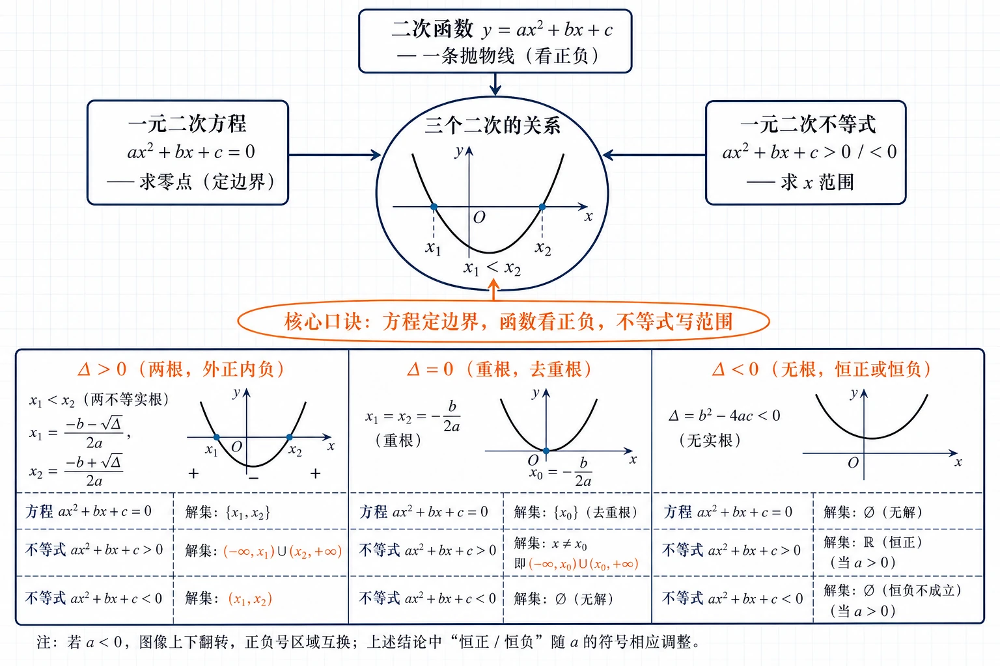
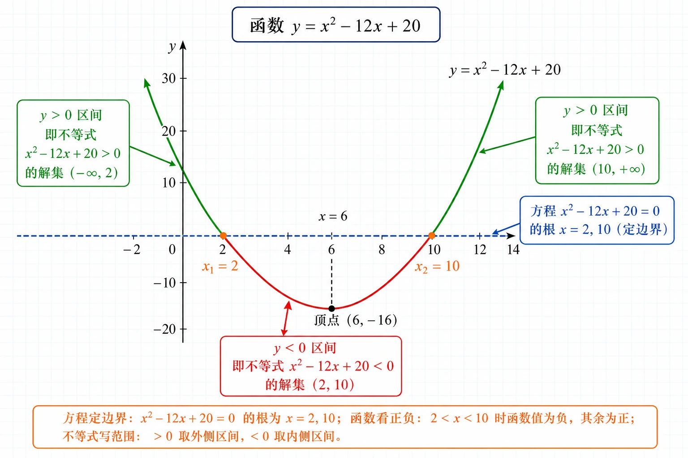
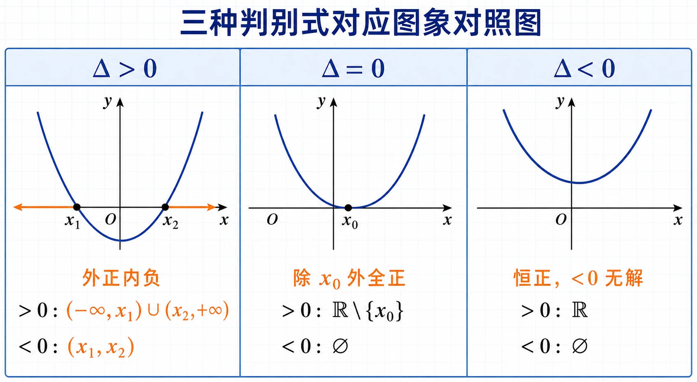
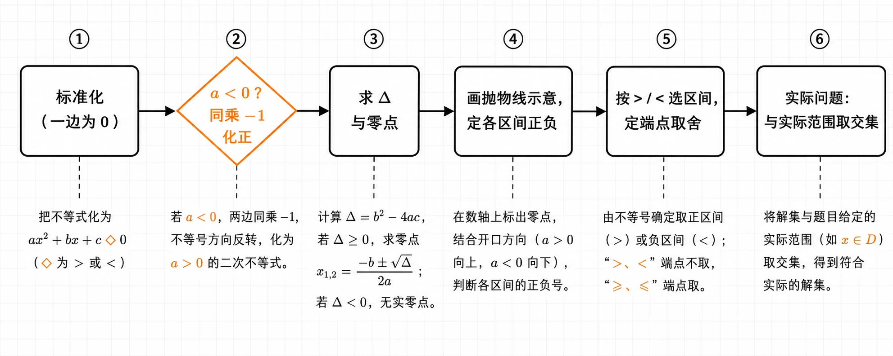
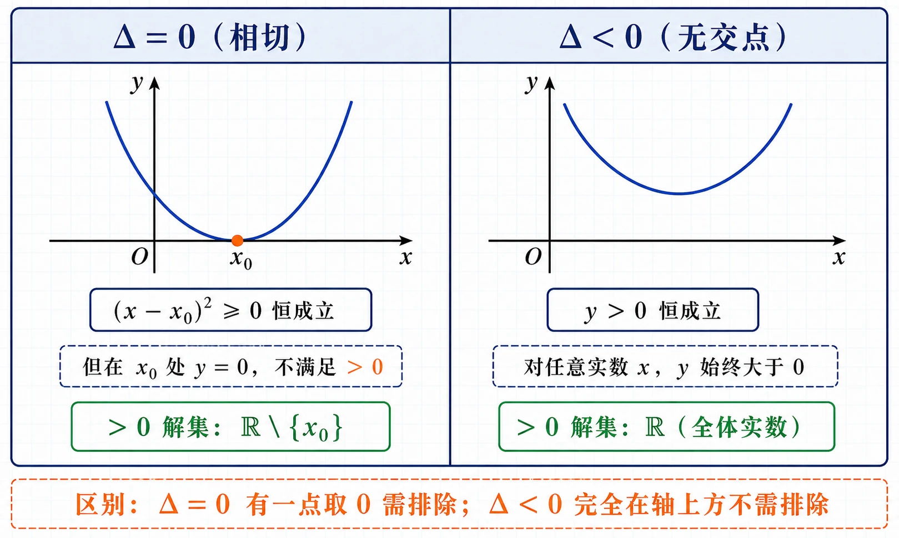
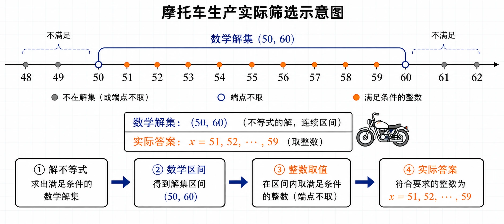

# 2.3 二次函数与一元二次方程、不等式

<!-- 图片描述：本节整体知识信息结构图。浅网格背景，中心节点写“三个二次的关系”。中心放一个开口向上的抛物线示意图，抛物线与 $x$ 轴有两个交点 $x_1,x_2$。从中心向上引出“二次函数 $y=ax^2+bx+c$——一条抛物线（看正负）”，向左引出“一元二次方程 $ax^2+bx+c=0$——求零点（定边界）”，向右引出“一元二次不等式 $ax^2+bx+c\gtrless0$——求 $x$ 范围”。下方三栏并列展示 $\Delta>0$（两根，外正内负）、$\Delta=0$（重根，去重根）、$\Delta<0$（无根，恒正或恒负）的解集速记。用橙色椭圆框标注核心口诀“方程定边界，函数看正负，不等式写范围”，并用箭头连到中心。黑色深蓝线条为主，LaTeX 公式风格。 -->

## 本节学习目标

- 理解一元二次不等式的概念和一般形式，能识别一元二次不等式。
- 掌握二次函数、一元二次方程、一元二次不等式三者之间的内在联系，会用“函数的观点”统一处理方程和不等式。
- 理解二次函数零点的概念，会根据判别式 $\Delta=b^2-4ac$ 和开口方向，分类求出一元二次不等式的解集。
- 能熟练处理 $a<0$（先化正）、$\Delta=0$（重根取舍）、$\Delta<0$（恒正或恒负）、严格与非严格不等号的端点取舍等易错情形。
- 会解决根式有意义、集合交并、含参恒成立等综合问题。
- 能把花圃面积、摩托车生产、刹车距离、竖直上抛、热带风暴等实际问题抽象为一元二次不等式并求解，注意结合实际范围二次筛选。

## 核心知识点讲解

### 一、知识对象与问题情境

在初中，我们已经学过用一次函数的观点统一看待一元一次方程和一元一次不等式：一次函数的图象与 $x$ 轴的交点对应方程的解，图象在 $x$ 轴上方或下方对应不等式的解集。本节要解决的核心问题是：能不能用同样的“函数观点”，把二次函数、一元二次方程、一元二次不等式三者统一起来？

先看一个实际问题：园艺师打算用 $24\text{ m}$ 长的栅栏围一个矩形区域种花，要求围成的面积大于 $20\text{ m}^2$。矩形的边长应该是多少？

设矩形的一条边长为 $x\text{ m}$，则另一条边长为 $(12-x)\text{ m}$（周长 $2(x+12-x)=24$）。由面积大于 $20\text{ m}^2$，得

$$
(12-x)x>20,
$$

即

$$
x^2-12x+20<0,\qquad 0<x<12.
$$

这就是一个一元二次不等式。要解决这个问题，就需要研究一元二次不等式怎么解，而它的解法恰恰依赖于二次函数的图象。

### 二、核心概念与定义条件

**一元二次不等式**：只含有一个未知数，并且未知数的最高次数是 $2$ 的不等式。它的一般形式是

$$
ax^2+bx+c>0\quad\text{或}\quad ax^2+bx+c<0,
$$

其中 $a,b,c$ 均为常数，且 $a\ne0$。也会出现 $\ge0$、$\le0$ 的形式。

**二次函数的零点**：对于二次函数 $y=ax^2+bx+c$，使 $ax^2+bx+c=0$ 的实数 $x$ 叫作这个二次函数的零点。零点就是二次函数图象与 $x$ 轴交点的横坐标。

注意区分三个概念：零点是**自变量的值**（$x$ 的值），不是交点坐标 $(x,0)$，更不是函数值。

### 三、符号语言与等价表示

对同一个二次式 $ax^2+bx+c$，从三个角度去看，它们对应同一套数学对象：

| 角度 | 数学式 | 几何/图象意义 |
|---|---|---|
| 二次函数 | $y=ax^2+bx+c$ | 一条抛物线 |
| 一元二次方程 | $ax^2+bx+c=0$ | 抛物线与 $x$ 轴交点的横坐标（零点） |
| 一元二次不等式 | $ax^2+bx+c>0$ | 抛物线在 $x$ 轴**上方**的点的横坐标集合 |
| 一元二次不等式 | $ax^2+bx+c<0$ | 抛物线在 $x$ 轴**下方**的点的横坐标集合 |

一句话概括三者的关系：**方程定边界，函数看正负，不等式写范围。**

以 $y=x^2-12x+20$ 为例：方程 $x^2-12x+20=0$ 的两个根 $x_1=2,x_2=10$ 就是函数的两个零点，它们把 $x$ 轴分成三段 $(-\infty,2)$、$(2,10)$、$(10,+\infty)$；由于抛物线开口向上，当 $x<2$ 或 $x>10$ 时图象在 $x$ 轴上方（$y>0$），当 $2<x<10$ 时图象在 $x$ 轴下方（$y<0$）。所以不等式 $x^2-12x+20<0$ 的解集是 $\{x\mid2<x<10\}$。

<!-- 图片描述：二次函数与方程、不等式三者关系图（以 $y=x^2-12x+20$ 为例）。画平面直角坐标系，画一条开口向上的抛物线，与 $x$ 轴交于 $x_1=2$ 和 $x_2=10$ 两点（用橙色实心点标注坐标）。用三种颜色标注三个对象：蓝色虚线水平线 $y=0$（$x$ 轴），标注“方程 $x^2-12x+20=0$ 的根 $x=2,10$（定边界）”；在 $x$ 轴上方的抛物线部分（$x<2$ 和 $x>10$ 段）用绿色加粗，标注“$y>0$ 区间”；在 $x$ 轴下方的抛物线部分（$2<x<10$ 段）用红色加粗，标注“$y<0$ 区间，即不等式 $x^2-12x+20<0$ 的解集 $(2,10)$”。顶部标注函数名 $y=x^2-12x+20$。浅网格背景，黑色坐标轴，LaTeX 公式风格。 -->

### 四、关键性质、定理与公式

下面把一般形式 $ax^2+bx+c>0$（$a>0$）和 $ax^2+bx+c<0$（$a>0$）的解集，按判别式 $\Delta=b^2-4ac$ 的三种情况列成一张核心表（设方程两根 $x_1<x_2$，重根 $x_0=-\dfrac{b}{2a}$）：

| 判别式 | 方程 $ax^2+bx+c=0$ 的根 | 抛物线与 $x$ 轴关系 | $ax^2+bx+c>0$ 的解集 | $ax^2+bx+c<0$ 的解集 |
|---|---|---|---|---|
| $\Delta>0$ | 两个不等实根 $x_1<x_2$ | 两个交点 | $(-\infty,x_1)\cup(x_2,+\infty)$ | $(x_1,x_2)$ |
| $\Delta=0$ | 两个相等实根 $x_0$ | 一个切点 | $\mathbb R\setminus\{x_0\}$ | $\varnothing$ |
| $\Delta<0$ | 无实根 | 无交点 | $\mathbb R$ | $\varnothing$ |

记忆要领（$a>0$ 时）：

- **$\Delta>0$**：开口向上的抛物线穿过 $x$ 轴，两根之外为正（“**外正**”），两根之间为负（“**内负**”）。
- **$\Delta=0$**：抛物线在顶点处恰好触碰 $x$ 轴，除切点外整条曲线都在 $x$ 轴上方，所以 $>0$ 的解集是去掉重根的全体实数。
- **$\Delta<0$**：抛物线整个悬浮在 $x$ 轴上方，函数值恒正，所以 $>0$ 解集是 $\mathbb R$，$<0$ 无解。

两条重要补充：

1. **$a<0$ 的处理**：先两边同乘 $-1$，把二次项系数化为正数，同时改变不等号方向，再套用上表。也可以直接根据开口向下判断（此时结论与 $a>0$ 相反）。
2. **$\ge0$ 或 $\le0$ 的处理**：把等于 $0$ 的根（边界点）加入解集。即严格不等号（$>,<$）**不取**边界点，非严格不等号（$\ge,\le$）**取**边界点。

<!-- 图片描述：三种判别式对应图象对照图。三栏并排。左栏 $\Delta>0$：画开口向上抛物线，与 $x$ 轴交于 $x_1,x_2$ 两点，用橙色在 $x$ 轴上方标出 $(-\infty,x_1)\cup(x_2,+\infty)$ 区间，标注“外正内负”。中栏 $\Delta=0$：画开口向上抛物线，顶点在 $x$ 轴上切于 $x_0$，用橙色标出“除 $x_0$ 外全正”。右栏 $\Delta<0$：画开口向上抛物线，整个在 $x$ 轴上方，用橙色标注“恒正，$<0$ 无解”。三栏下方各写出 $>0$ 和 $<0$ 的解集。浅网格背景，坐标轴标清，黑色线条。 -->

### 五、典型模型与解题方法

解一元二次不等式的标准流程（六步法）：

1. **标准化**：移项、合并，把不等式化为 $ax^2+bx+c\gtrless0$ 的一般形式，使一边为 $0$。
2. **化正**：若 $a<0$，两边同乘 $-1$（不等号改向），化为 $a>0$。
3. **求根**：解对应方程 $ax^2+bx+c=0$，算判别式 $\Delta=b^2-4ac$，求出零点。
4. **画图定号**：根据 $a>0$（开口向上）和根的情况，画出抛物线示意，判断各区间的正负。
5. **写解集**：按不等号方向（$>0$ 取轴上方，$<0$ 取轴下方）写出解集，注意端点取舍。
6. **实际复核**：若题目有实际背景（边长为正、产量为整数、速度为正等），要把数学解集与实际范围取交集。

也可以用“两根式”快速求解：若能分解 $ax^2+bx+c=a(x-x_1)(x-x_2)$（$a>0$），则 $>0$ 取“两根之外”，$<0$ 取“两根之间”。

<!-- 图片描述：一元二次不等式解题流程图。从左到右六个方框，用箭头连接。第一框“标准化（一边为0）”；第二框“$a<0$？同乘 $-1$ 化正”（用橙色菱形判断框）；第三框“求 $\Delta$ 与零点”；第四框“画抛物线示意，定各区间正负”；第五框“按 $>/<$ 选区间，定端点取舍”；第六框“实际问题：与实际范围取交集”。每个方框下方配一句话提示。浅网格背景，黑色线条，流程清晰。 -->

### 六、题型应用与迁移

本节题型分四类：

- **直接解不等式**：套用六步法，注意 $\Delta$ 三种情况和 $a<0$ 的处理。
- **由函数值正负求 $x$ 范围**：先求零点，再按图象位置判断 $y=0$、$y>0$、$y<0$ 对应的 $x$ 范围。
- **根式有意义与集合运算**：根式有意义要求被开方数 $\ge0$，转化为不等式；集合交并要先求出各集合，再做区间运算。
- **实际应用建模**：花圃面积、销售收入、刹车距离、竖直上抛、热带风暴等，列不等式后求解，并做实际筛选（整数、正值、物理意义）。

无论哪一类，核心都回到“二次函数图象与 $x$ 轴的位置关系”。

## 重点梳理

- **零点是一元二次不等式解集的边界**。零点把 $x$ 轴分成若干区间，每个区间内二次函数值符号不变（因为连续函数只在零点处变号）。所以解不等式的关键是先找零点。它重要是因为：没有零点就没有边界，没有边界就无法划分正负区间。
- **“外正内负”口诀只适用于 $a>0,\Delta>0$**。使用时要先确认这两个前提。如果 $a<0$，开口向下，结论相反（外负内正）；遇到 $a<0$ 最稳妥的做法是先化正再判断，避免记反。
- **$\Delta$ 决定解集的“形状”**。$\Delta>0$ 解集是两个区间（$\Delta>0$ 有两个边界）；$\Delta=0$ 解集是去掉一个点或空集；$\Delta<0$ 解集是 $\mathbb R$ 或 $\varnothing$。看到题目先算 $\Delta$，能立刻判断解集的大致结构。
- **端点取舍看不等号的严格性**。这是最容易丢分的地方：$>0$、$<0$ 不含边界点（用小括号），$\ge0$、$\le0$ 含边界点（用中括号）。$\Delta=0$ 时尤其注意：$(x-x_0)^2>0$ 的解集是 $x\ne x_0$，而 $(x-x_0)^2\ge0$ 对全体实数成立。
- **$\Delta<0$ 时“恒正/恒负”由开口方向决定**。$a>0$ 且 $\Delta<0$ 时函数恒正（$>0$ 解集为 $\mathbb R$，$<0$ 无解）；$a<0$ 且 $\Delta<0$ 时函数恒负。这一点在判断根式恒有意义、含参恒成立问题时尤其关键。
- **实际问题的解集要二次筛选**。数学解集往往比实际答案宽，必须结合变量的实际限制（$x>0$、$x$ 为整数、速度非负等）再取交集。这是应用题最易丢分的环节。

## 难点突破

### 难点一：为什么解不等式要先解方程

一元二次不等式的解集边界，恰恰来自对应的方程 $ax^2+bx+c=0$。原因是：二次函数 $y=ax^2+bx+c$ 的图象是一条连续曲线，函数值从正变负（或从负变正）时，必定经过 $y=0$，即经过零点。所以零点是函数值变号的唯一可能位置，解方程找零点就是找正负区间的“分界线”。这也解释了 $\Delta<0$（没有零点）时函数值在整个实数集上不变号（恒正或恒负）。

### 难点二：$\Delta=0$ 时为什么 $>0$ 要“去掉重根”

当 $\Delta=0$，$ax^2+bx+c=a\left(x+\dfrac{b}{2a}\right)^2$。平方数 $\ge0$ 恒成立，所以 $ax^2+bx+c\ge0$ 对全体实数成立（$a>0$ 时）。但 $(x-x_0)^2>0$ 要求平方严格大于 $0$，只有当 $x\ne x_0$ 时才成立，在 $x=x_0$ 处等于 $0$ 不满足“严格大于”。所以 $>0$ 的解集是 $\mathbb R\setminus\{x_0\}$（全体实数去掉重根），而不是 $\mathbb R$。这是 $\Delta=0$ 与 $\Delta<0$ 的关键区别：$\Delta=0$ 有一个点取到 $0$，$\Delta<0$ 完全不碰 $x$ 轴。

<!-- 图片描述：$\Delta=0$ 与 $\Delta<0$ 对比图。左右两栏。左栏标题“$\Delta=0$（相切）”：画开口向上的抛物线，顶点恰好触碰 $x$ 轴于点 $x_0$（用橙色实心点标注），标注“$(x-x_0)^2\ge0$ 恒成立”“但在 $x_0$ 处 $y=0$，不满足 $>0$”，用绿色标注“$>0$ 解集：$\mathbb R\setminus\{x_0\}$”。右栏标题“$\Delta<0$（无交点）”：画开口向上的抛物线，整个悬浮在 $x$ 轴上方（不相交），标注“$y>0$ 恒成立”，用绿色标注“$>0$ 解集：$\mathbb R$（全体实数）”。两栏底部用橙色文字对比“区别：$\Delta=0$ 有一点取 $0$ 需排除；$\Delta<0$ 完全在轴上方不需排除”。浅网格背景，黑色坐标轴。 -->

### 难点三：$a<0$ 时最容易变号出错

遇到 $a<0$，比如 $-x^2+2x-3>0$，如果不变号直接判断，会把开口方向搞反。突破方法是固定动作：**先两边乘 $-1$，同时翻转不等号**，得 $x^2-2x+3<0$，再按 $a>0$ 处理。养成“见负必化正”的习惯，能避免绝大多数变号错误。

### 难点四：实际问题的“解集”不等于“答案”

以摩托车生产为例：不等式解出 $50<x<60$，但 $x$ 是一周生产的辆数，只能取整数，所以实际答案是 $x=51,52,\ldots,59$。再如刹车距离题，解出两个区间（一正一负），但速度必须为正，所以只取正区间。突破方法：解完不等式后，**主动追问变量的实际含义和限制**，把数学解集与实际范围取交集，最后用实际语言回答。

## 例题讲解

### 例1：解 $x^2-5x+6>0$

**审题：** 已是 $a=1>0$ 的标准形式，先求零点定边界。

**解：** 解方程 $x^2-5x+6=0$，因式分解 $(x-2)(x-3)=0$，得 $x_1=2,x_2=3$（$\Delta=25-24=1>0$）。

抛物线开口向上，与 $x$ 轴交于 $x=2,x=3$。$>0$ 表示图象在 $x$ 轴上方，取两根之外，所以解集为

$$
\{x\mid x<2\text{ 或 }x>3\}.\qquad\text{即 }(-\infty,2)\cup(3,+\infty).
$$

**检验：** 取 $x=0$（在 $(-\infty,2)$ 内），$0-0+6=6>0$ ✓；取 $x=2.5$（在 $(2,3)$ 内），$6.25-12.5+6=-0.25<0$，不在解集 ✓。

### 例2：解 $9x^2-6x+1>0$

**审题：** $a=9>0$，先看判别式。

**解：** $\Delta=(-6)^2-4\times9\times1=36-36=0$，方程有重根 $x_0=\dfrac{6}{2\times9}=\dfrac13$，且 $9x^2-6x+1=(3x-1)^2$。

$(3x-1)^2\ge0$ 恒成立，而 $(3x-1)^2>0$ 要求 $3x-1\ne0$，即 $x\ne\dfrac13$。所以解集为

$$
\left(-\infty,\frac13\right)\cup\left(\frac13,+\infty\right).
$$

**检验：** $\Delta=0$ 时 $>0$ 解集应是“去掉重根的全体实数”，结论符合。

### 例3：解 $-x^2+2x-3>0$

**审题：** $a=-1<0$，先化正。

**解：** 两边同乘 $-1$（不等号改向），得

$$
x^2-2x+3<0.
$$

$\Delta=(-2)^2-4\times1\times3=4-12=-8<0$，方程无实根。抛物线开口向上且与 $x$ 轴无交点，函数值恒正，不可能小于 $0$。所以 $x^2-2x+3<0$ 无解，原不等式解集为 $\varnothing$。

**检验：** $a<0$ 且 $\Delta<0$ 时原二次式恒负（$-x^2+2x-3=-(x^2-2x+3)$，括号内恒正，整体恒负），恒负不可能大于 $0$，结论 ✓。

### 例4：摩托车生产收入

一家车辆制造厂的流水线，生产摩托车数量 $x$（辆）与创造价值 $y$（元）满足 $y=-20x^2+2200x$。若希望一周内创收 $60000$ 元以上，一周内大约应生产多少辆？

**审题：** 列不等式 $-20x^2+2200x>60000$，化为标准形式求解，注意 $x$ 为正整数。

**转化：** 两边除以 $-20$（不等号改向），得 $x^2-110x<-3000$，即 $x^2-110x+3000<0$。

**运算：** $\Delta=110^2-4\times3000=12100-12000=100>0$，方程 $x^2-110x+3000=0$ 的根为 $x=\dfrac{110\pm\sqrt{100}}{2}=\dfrac{110\pm10}{2}$，即 $x_1=50,x_2=60$。开口向上，$<0$ 取两根之间：$50<x<60$。

**实际筛选：** $x$ 为一周生产的辆数，只能取整数，所以 $x=51,52,\ldots,59$。

<!-- 图片描述：摩托车生产实际筛选示意图。画一条数轴，标注整数刻度 $48,49,50,51,\ldots,59,60,61,62$。用蓝色区间标注数学解集 $(50,60)$（两端 $50$ 和 $60$ 用空心点，不含）。在区间 $(50,60)$ 内的整数点 $51,52,\ldots,59$ 用橙色实心点标注，并画出小摩托图标或标注“实际答案”。区间外的整数点（$48,49,50,60,61,62$）用灰色标注。标注“数学解集 $(50,60)$”和“实际答案 $x=51,52,\ldots,59$（取整数）”两层，用箭头说明“解不等式 $\to$ 数学区间 $\to$ 敞数取整 $\to$ 实际答案”。浅网格背景，黑色数轴。 -->

**检验：** 当 $x=55$ 时，$y=-20\times3025+2200\times55=-60500+121000=60500>60000$ ✓；$x=50$ 时 $y=60000$ 不满足“以上”。答：一周内生产 $51\sim59$ 辆时创收 $60000$ 元以上。

### 例5：刹车距离与车速

某种汽车在水泥路面上的刹车距离 $s$（m）和刹车前车速 $v$（km/h）之间满足

$$
s=\frac{1}{4}v+\frac{1}{100}v^2.
$$

（刹车距离是指汽车刹车后由于惯性继续往前滑行的距离。）一次交通事故中测得这种车的刹车距离大于 $39.5\text{ m}$，那么这辆车刹车前的车速至少为多少（精确到 $1\text{ km/h}$）？

**审题：** 已知刹车距离 $s>39.5$，把 $s$ 的表达式代入即可得到关于 $v$ 的不等式。这是典型的“先解不等式，再结合 $v>0$ 筛选”的问题。

**转化：** 由题意

$$
\frac14 v+\frac1{100}v^2>39.5.
$$

两边乘 $100$，得 $25v+v^2>3950$，整理得

$$
v^2+25v-3950>0.
$$

**运算：** $\Delta=25^2-4\times1\times(-3950)=625+15800=16425$。因 $128^2=16384$，$129^2=16641$，故 $\sqrt{16425}\approx128.16$。两根为

$$
v_1=\frac{-25-128.16}{2}\approx-76.58,\qquad v_2=\frac{-25+128.16}{2}\approx51.58.
$$

抛物线开口向上，$>0$ 取两根之外：$v<-76.58$ 或 $v>51.58$。

**实际筛选：** 车速 $v>0$，舍去负区间，得 $v>51.58$。精确到 $1\text{ km/h}$，刹车前车速至少为 $52\text{ km/h}$。

**检验：** 取 $v=52$，$s=\dfrac14\times52+\dfrac1{100}\times2704=13+27.04=40.04>39.5$ ✓；取 $v=51$，$s=12.75+26.01=38.76<39.5$，不满足，故临界值确实在 $51$ 与 $52$ 之间。答：刹车前车速至少约为 $52\text{ km/h}$。

**反思：** 本题的要点是：解一元二次不等式会得到两个区间，但其中一个是负数区间，没有物理意义，必须舍去。这类“先解不等式再结合实际范围筛选”的思路，在物理、工程类应用题中非常普遍。

## 易错点整理

- **错误表现**：只解方程求出根，不判断各区间的正负就写解集。
  - **错因分析**：方程的根只是边界，不等于解集；必须结合开口方向判断哪个区间满足不等号。
  - **正确处理**：求根后画抛物线示意，确认 $>0$（轴上方）或 $<0$（轴下方）对应的区间。

- **错误表现**：$a<0$ 时两边乘 $-1$，忘记改变不等号方向。
  - **反例**：$-x^2+5x-6>0$ 乘 $-1$ 应得 $x^2-5x+6<0$，若忘改号得 $x^2-5x+6>0$，解集完全相反。
  - **正确处理**：固定口诀“乘负必变号”，化正后立即检查不等号方向。

- **错误表现**：$\Delta=0$ 时把 $>0$ 的解集写成 $\mathbb R$。
  - **错因分析**：忘记在重根 $x_0$ 处函数值等于 $0$，不满足“严格大于”。
  - **正确处理**：$\Delta=0$ 时 $>0$ 解集为 $\mathbb R\setminus\{x_0\}$，$\ge0$ 解集才是 $\mathbb R$。

- **错误表现**：$\Delta<0$ 时只看“无实根”就下结论，不看开口方向。
  - **错因分析**：$\Delta<0$ 时解集不是 $\varnothing$ 就是 $\mathbb R$，具体取哪个由开口方向决定。
  - **正确处理**：$a>0$ 恒正（$>0$ 为 $\mathbb R$，$<0$ 为 $\varnothing$）；$a<0$ 恒负（反之）。

- **错误表现**：根式有意义题忘记被开方数要 $\ge0$（写成 $>0$）。
  - **正确处理**：偶次根式有意义要求被开方数 $\ge0$，含等号；解出后注意端点取舍。

- **错误表现**：实际问题只给数学解集，不做实际筛选。
  - **反例**：摩托车题答 $50<x<60$，但 $x$ 必须为整数，正确答案是 $51\sim59$ 辆。
  - **正确处理**：解集后追问变量实际限制（整数、正数、物理范围），取交集后用实际语言回答。

## 考点考证点整理

### 考点一：直接解一元二次不等式

- **出题思路**：给出标准形式或可化为标准形式的不等式，要求写出解集；覆盖 $\Delta>0$、$\Delta=0$、$\Delta<0$ 及 $a<0$ 各种情形。
- **关键条件**：二次项系数符号、判别式 $\Delta$ 的大小、不等号是否严格。
- **解答要点**：标准化 $\to$ 化正 $\to$ 求 $\Delta$ 和零点 $\to$ 画图定正负 $\to$ 写解集并定端点。建议写出 $\Delta$ 的计算过程，避免跳步。
- **易扣分点**：端点取舍错误（严格/非严格混淆）；$a<0$ 变号遗漏；$\Delta=0$ 把 $>0$ 写成 $\mathbb R$；解集写成集合或区间时格式不规范。

### 考点二：函数值正负与零点

- **出题思路**：给出二次函数，要求分别写出函数值等于 $0$、大于 $0$、小于 $0$ 时 $x$ 的范围；或给出图象/零点反推不等式解集。
- **关键条件**：图象与 $x$ 轴的交点（零点）、开口方向、判别式。
- **解答要点**：先解方程求零点，再按开口方向和图象位置判断各区间的正负。强调三者关系：方程根是零点（边界），函数图象看正负，不等式据此写范围。
- **易扣分点**：只背“外正内负”口诀而不结合图象位置；$\Delta<0$ 时把恒正/恒负判断反了；三个问题（$=0,>0,<0$）漏答。

### 考点三：根式有意义、集合运算与含参恒成立

- **出题思路**：根式有意义求 $x$ 范围；两个一元二次不等式解集的集合求 $M\cap N$、$M\cup N$；含参数的不等式恒成立求参数范围。
- **关键条件**：被开方数 $\ge0$；集合端点是否含等号；恒成立需结合 $\Delta$ 和开口方向（$a>0$ 且 $\Delta\le0$ 时 $ax^2+bx+c\ge0$ 恒成立）。
- **解答要点**：根式题先转化为不等式；集合题先各自求解集再画数轴做交并；恒成立题注意二次项系数含参时要分 $a=0$ 和 $a\ne0$ 讨论。
- **易扣分点**：被开方数写成 $>0$ 漏掉等号；集合并交符号写反或端点遗漏；恒成立时漏掉二次项系数为 $0$ 的讨论，或忽略开口方向。

### 考点四：实际应用建模

- **出题思路**：花圃面积、销售收入、刹车距离、竖直上抛运动、热带风暴影响等，要求列不等式并求解。
- **关键条件**：变量范围（$x>0$、整数、物理意义）；单位统一；隐含的几何或物理关系。
- **解答要点**：设变量 $\to$ 根据题意列不等式 $\to$ 化标准形式求解 $\to$ 结合实际范围筛选 $\to$ 用实际语言作答。竖直上抛 $h=v_0t-\dfrac12gt^2$、刹车距离、风暴距离等都要正确写出关系式。
- **易扣分点**：数学解集正确但实际筛选错误（忘取整数、忘舍负值）；物理关系式写错（如 $g$ 取值、距离公式）；最后只写数字不回答实际问题。

## 练习题

### 基础训练

1. 解不等式 $(x+2)(x-3)>0$。
2. 解不等式 $3x^2-7x\le10$。
3. 解不等式 $-x^2+4x-4<0$。
4. 解不等式 $x^2-3x+4>0$。
5. 解不等式 $13-4x^2>0$。
6. 解不等式 $(x-3)(x-7)<0$。
7. 解不等式 $x^2-3x-10>0$。
8. 解不等式 $-3x^2+5x-4>0$。

### 巩固训练

1. 已知二次函数 $y=3x^2-6x+2$，当 $x$ 取什么值时，函数值等于 $0$？大于 $0$？小于 $0$？
2. 已知二次函数 $y=25-x^2$，当 $x$ 取什么值时，函数值等于 $0$？大于 $0$？小于 $0$？
3. 已知二次函数 $y=x^2+6x+10$，当 $x$ 取什么值时，函数值等于 $0$？大于 $0$？小于 $0$？
4. 已知二次函数 $y=-3x^2+12x-12$，当 $x$ 取什么值时，函数值等于 $0$？大于 $0$？小于 $0$？
5. $x$ 是什么实数时，$\sqrt{x^2-4x+9}$ 有意义？
6. $x$ 是什么实数时，$\sqrt{-2x^2+12x-18}$ 有意义？
7. $x$ 是什么实数时，$\sqrt{x^2+x-12}$ 有意义？
8. 已知 $M=\{x\mid4x^2-4x-15>0\}$，$N=\{x\mid x^2-5x-6>0\}$，求 $M\cap N$ 和 $M\cup N$。
9. 已知 $A=\{x\mid x^2-16<0\}$，$B=\{x\mid x^2-4x+3>0\}$，求 $A\cup B$。

### 提升训练

1. 用 $24\text{ m}$ 长的栅栏围一个矩形花圃，要求面积大于 $20\text{ m}^2$。求矩形边长的取值范围。
2. 某网店销售削笔器，最低售价 $15$ 元/个，按最低售价每天可售出 $30$ 个。售价每提高 $1$ 元，日销量减少 $2$ 个。为使日销售收入超过 $400$ 元，售价应定为多少？
3. 在长 $8\text{ m}$、宽 $6\text{ m}$ 的矩形地面四周种植宽度相同的花卉带，中间种草坪。若要求草坪面积不超过总面积的一半，花卉带的宽度应为多少？
4. 一名同学以初速度 $v_0=12\text{ m/s}$ 竖直上抛一个排球，排球距抛出点的高度 $h$（m）与时间 $t$（s）满足 $h=v_0t-\dfrac12gt^2$（取 $g\approx10\text{ m/s}^2$）。排球能在抛出点 $2\text{ m}$ 以上的位置停留多长时间（精确到 $0.01\text{ s}$）？
5. 据气象预报，在距某码头南偏东 $45^\circ$ 方向 $600\text{ km}$ 处的热带风暴中心，正以 $20\text{ km/h}$ 的速度向正北方向移动。距风暴中心 $450\text{ km}$ 以内的地区都将受影响。估计从现在起多长时间后码头开始受影响，影响持续多长（精确到 $0.1\text{ h}$）？
6. 若不等式 $x^2+mx+1>0$ 对一切实数 $x$ 都成立，求实数 $m$ 的取值范围。

## 练习题答案

### 基础训练答案

1. 方程 $(x+2)(x-3)=0$ 的根为 $x_1=-2,x_2=3$。$a=1>0$，开口向上，$>0$ 取两根之外，解集为 $(-\infty,-2)\cup(3,+\infty)$。
2. 移项得 $3x^2-7x-10\le0$。$\Delta=49+120=169>0$，根为 $x=\dfrac{7\pm13}{6}$，即 $x_1=-1,x_2=\dfrac{10}{3}$。开口向上，$\le0$ 取两根之间（含端点），解集为 $\left[-1,\dfrac{10}{3}\right]$。
3. 化为 $x^2-4x+4>0$，即 $(x-2)^2>0$。$\Delta=0$，$>0$ 解集为去掉重根的全体实数：$(-\infty,2)\cup(2,+\infty)$，即 $x\ne2$。
4. $\Delta=9-16=-7<0$，$a=1>0$，开口向上且与 $x$ 轴无交点，函数恒正。$>0$ 解集为 $\mathbb R$。
5. $13-4x^2>0$ 即 $4x^2<13$，$x^2<\dfrac{13}{4}$，解集为 $\left(-\dfrac{\sqrt{13}}{2},\dfrac{\sqrt{13}}{2}\right)$。
6. 方程 $(x-3)(x-7)=0$ 根为 $3,7$，$a=1>0$，$<0$ 取两根之间，解集为 $(3,7)$。
7. $x^2-3x-10=(x-5)(x+2)$，根为 $-2,5$，开口向上，$>0$ 取两根之外，解集为 $(-\infty,-2)\cup(5,+\infty)$。
8. 化为 $3x^2-5x+4<0$。$\Delta=25-48=-23<0$，$a=3>0$ 开口向上恒正，$<0$ 无解，解集为 $\varnothing$。

### 巩固训练答案

1. 方程 $3x^2-6x+2=0$，$\Delta=36-24=12>0$，根为 $x=\dfrac{6\pm2\sqrt3}{6}=1\pm\dfrac{\sqrt3}{3}$。开口向上。
   - 函数值 $=0$：$x=1-\dfrac{\sqrt3}{3}$ 或 $x=1+\dfrac{\sqrt3}{3}$；
   - 函数值 $>0$：$x<1-\dfrac{\sqrt3}{3}$ 或 $x>1+\dfrac{\sqrt3}{3}$；
   - 函数值 $<0$：$1-\dfrac{\sqrt3}{3}<x<1+\dfrac{\sqrt3}{3}$。
2. 方程 $25-x^2=0$，根为 $x=\pm5$。开口向下。
   - 函数值 $=0$：$x=\pm5$；
   - 函数值 $>0$：$-5<x<5$；
   - 函数值 $<0$：$x<-5$ 或 $x>5$。
3. $\Delta=36-40=-4<0$，开口向上，函数恒正。
   - 函数值 $=0$：无解（方程无实根）；
   - 函数值 $>0$：全体实数 $\mathbb R$；
   - 函数值 $<0$：无解。
4. $-3x^2+12x-12=-3(x^2-4x+4)=-3(x-2)^2\le0$ 恒成立。
   - 函数值 $=0$：$x=2$；
   - 函数值 $>0$：无解（函数恒非正）；
   - 函数值 $<0$：$x\ne2$，即 $(-\infty,2)\cup(2,+\infty)$。
5. 要求 $x^2-4x+9\ge0$。$x^2-4x+9=(x-2)^2+5\ge5>0$ 恒成立，所以 $x$ 为任意实数时根式都有意义。
6. 要求 $-2x^2+12x-18\ge0$，即 $2x^2-12x+18\le0$，$x^2-6x+9\le0$，$(x-3)^2\le0$。只有 $x=3$ 满足，所以 $x=3$。
7. 要求 $x^2+x-12\ge0$，即 $(x+4)(x-3)\ge0$。根为 $-4,3$，开口向上，$\ge0$ 取两根之外（含端点），所以 $x\le-4$ 或 $x\ge3$。
8. $M$：$4x^2-4x-15>0$，$\Delta=16+240=256$，根为 $x=\dfrac{4\pm16}{8}$，即 $-\dfrac32,\dfrac52$。开口向上，$M=\left(-\infty,-\dfrac32\right)\cup\left(\dfrac52,+\infty\right)$。
   $N$：$x^2-5x-6>0$，即 $(x-6)(x+1)>0$，$N=(-\infty,-1)\cup(6,+\infty)$。
   画数轴求交并：
   - $M\cap N=\left(-\infty,-\dfrac32\right)\cup(6,+\infty)$；
   - $M\cup N=(-\infty,-1)\cup\left(\dfrac52,+\infty\right)$。
9. $A=\{x\mid x^2-16<0\}=(-4,4)$；$B=\{x\mid(x-1)(x-3)>0\}=(-\infty,1)\cup(3,+\infty)$。画数轴：$(-\infty,1)$ 与 $(-4,4)$ 合并得 $(-\infty,4)$，再与 $(3,+\infty)$ 合并。因 $(3,+\infty)$ 与 $(-\infty,4)$ 在 $(3,4)$ 重叠相连，故 $A\cup B=\mathbb R$。

### 提升训练答案

1. 设矩形一边长为 $x\text{ m}$，另一边为 $(12-x)\text{ m}$，面积 $(12-x)x>20$，即 $x^2-12x+20<0$。$\Delta=144-80=64>0$，根为 $x=\dfrac{12\pm8}{2}$，即 $2,10$。开口向上，$<0$ 取两根之间：$2<x<10$。又边长须为正，即 $0<x<12$，与 $2<x<10$ 取交集仍为 $2<x<10$。所以矩形边长（一边）取值范围为 $(2,10)$（单位 m），另一边相应为 $(2,10)$ m。
2. 设削笔器售价为 $p$ 元（$p\ge15$）。售价相对最低售价提高了 $(p-15)$ 元，日销量为 $30-2(p-15)=60-2p$ 个。日销售收入为 $p(60-2p)$，要求超过 $400$ 元：$p(60-2p)>400$，即 $-2p^2+60p-400>0$，两边除以 $-2$ 得 $p^2-30p+200<0$，即 $(p-10)(p-20)<0$，解得 $10<p<20$。结合 $p\ge15$，得 $15\le p<20$。所以售价应定在 $15$ 元及以上、$20$ 元以下（不含 $20$ 元）。
3. 设花卉带宽度为 $x\text{ m}$（$x>0$）。草坪长为 $(8-2x)\text{ m}$，宽为 $(6-2x)\text{ m}$，需 $8-2x>0$ 且 $6-2x>0$，即 $0<x<3$。总面积 $8\times6=48\text{ m}^2$，一半为 $24\text{ m}^2$。要求 $(8-2x)(6-2x)\le24$，展开得 $48-28x+4x^2\le24$，即 $x^2-7x+6\le0$，因式分解 $(x-1)(x-6)\le0$，解得 $1\le x\le6$。结合 $0<x<3$，得 $1\le x<3$。所以花卉带宽度应至少 $1\text{ m}$、小于 $3\text{ m}$。
4. 取 $g\approx10\text{ m/s}^2$，$h=12t-5t^2$。要求 $h>2$，即 $12t-5t^2>2$，整理得 $5t^2-12t+2<0$。$\Delta=144-40=104$，$\sqrt{104}=2\sqrt{26}\approx10.198$，两根为 $t=\dfrac{12\pm2\sqrt{26}}{10}$，即 $t_1\approx\dfrac{12-10.198}{10}\approx0.180$，$t_2\approx\dfrac{12+10.198}{10}\approx2.220$。开口向上，$<0$ 取两根之间，停留时间 $t_2-t_1=\dfrac{4\sqrt{26}}{10}=\dfrac{2\sqrt{26}}{5}\approx2.04\text{ s}$。所以排球在抛出点 $2\text{ m}$ 以上停留约 $2.04\text{ s}$。
5. 以码头为原点建立平面直角坐标系，正东为 $x$ 轴正方向，正北为 $y$ 轴正方向。风暴中心初始位置在南偏东 $45^\circ$ 方向 $600\text{ km}$ 处，坐标为 $(600\sin45^\circ,-600\cos45^\circ)=(300\sqrt2,-300\sqrt2)$。风暴向北移动，$t$ 小时后中心坐标为 $(300\sqrt2,\,-300\sqrt2+20t)$。码头受影响的条件是中心到码头距离不超过 $450\text{ km}$：

$$
(300\sqrt2)^2+(-300\sqrt2+20t)^2\le450^2,
$$

   即 $180000+(20t-300\sqrt2)^2\le202500$，$(20t-300\sqrt2)^2\le22500$，$|20t-300\sqrt2|\le150$，所以 $300\sqrt2-150\le20t\le300\sqrt2+150$。由 $300\sqrt2\approx424.26$，得 $\dfrac{274.26}{20}\le t\le\dfrac{574.26}{20}$，即 $13.7\le t\le28.7$。所以约 $13.7\text{ h}$ 后码头开始受影响，持续约 $28.7-13.7=15.0\text{ h}$。（持续时间也可精确算出：$\dfrac{300}{20}=15\text{ h}$。）
6. $a=1>0$，要使 $x^2+mx+1>0$ 对一切实数 $x$ 成立，需要抛物线开口向上且与 $x$ 轴无交点，即 $\Delta<0$：$m^2-4<0$，解得 $-2<m<2$。所以 $m$ 的取值范围是 $(-2,2)$。
