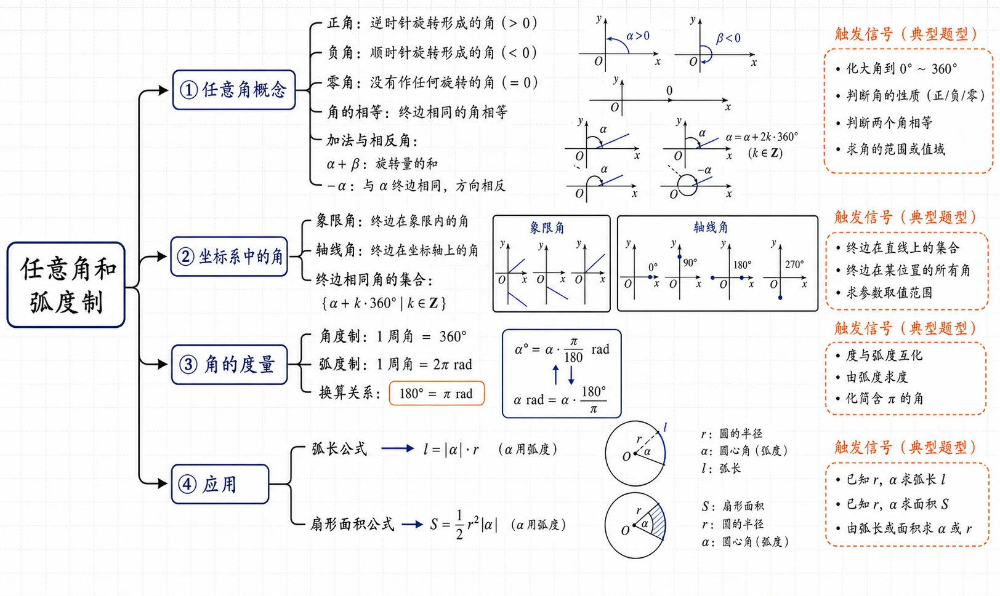
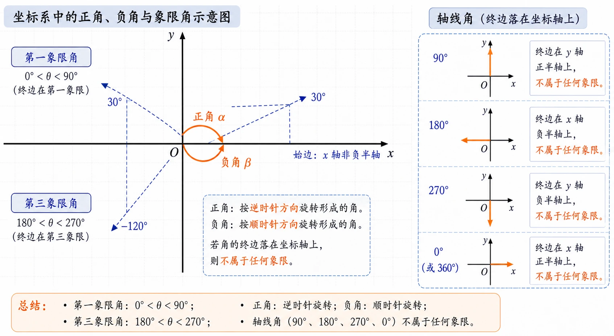
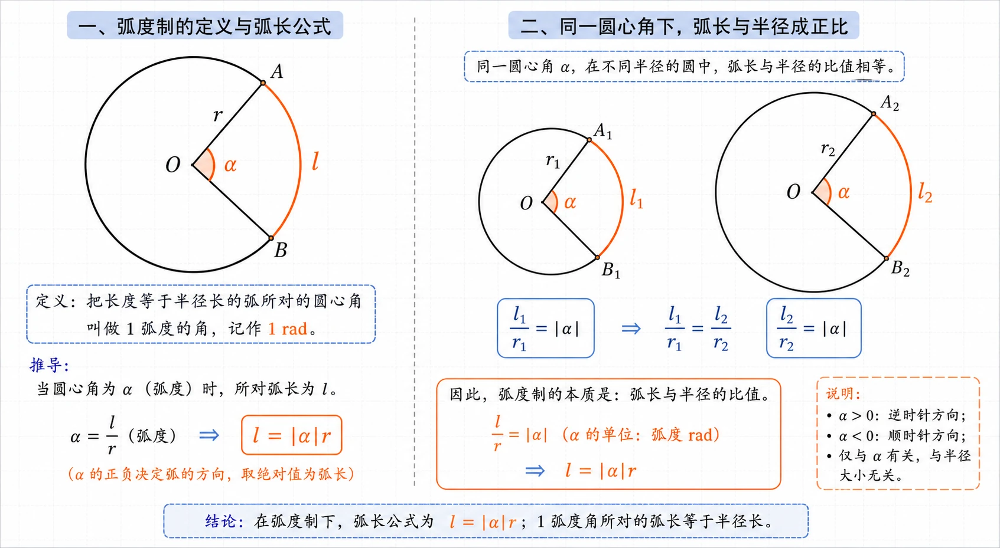
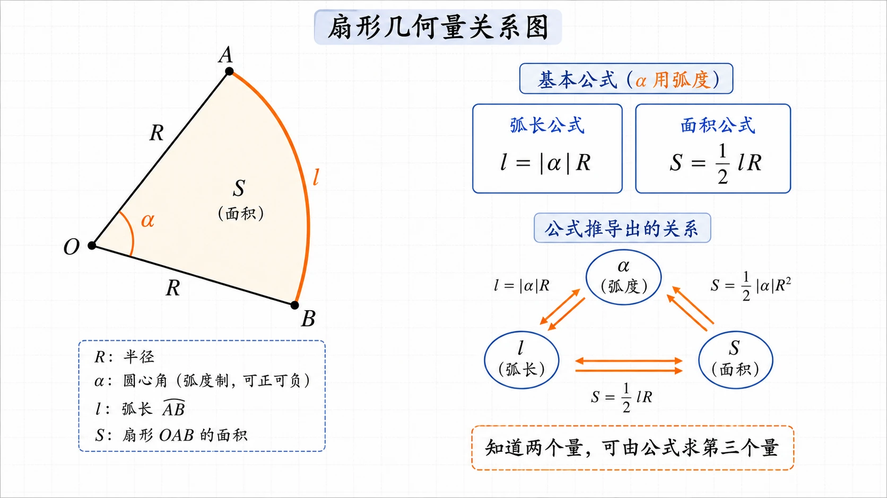

# 5.1 任意角和弧度制

<!-- 图片描述：本节整体知识信息结构图。采用课堂板书几何图风格，白色背景配浅网格，黑色/深蓝线条，橙色标注关键节点。图中央为“任意角和弧度制”主节点。一级分支向右展开：① 任意角概念（正角、负角、零角、角的相等、加法与相反角）；② 坐标系中的角（象限角、轴线角、终边相同角的集合）；③ 角的度量（角度制、弧度制、换算关系）；④ 应用（弧长公式、扇形面积公式）。每条分支用箭头连接，并在末端标注典型题型触发信号，如“化大角到 0°~360°”“终边在直线上的集合”“扇形计算”。 -->

## 本节学习目标

学完本节，你应该能够：

- 理解正角、负角、零角的意义，知道角的“相等”取决于旋转方向和旋转量。
- 会把角放到平面直角坐标系中，判断它是第几象限角或是否为轴线角。
- 会用集合表示与已知角终边相同的所有角，并能在指定范围内找出这些角。
- 掌握角度制与弧度制的换算关系，熟记常见特殊角的弧度值。
- 会推导并运用弧长公式、扇形面积公式解决简单几何问题。
- 体会“角的集合”到“实数集”的一一对应，为后面学习三角函数做准备。

## 核心知识点讲解

### 一、知识对象与问题情境

圆周运动、齿轮传动、体操转体、钟表指针等运动中，旋转的角度常常超过 $0^{\circ}\sim 360^{\circ}$，而且方向有顺时针和逆时针之分。为了准确描述这些运动，我们需要把“角”从初中所学的“ $0^{\circ}$ 到 $360^{\circ}$ ”的范围扩展到**任意角**。

### 二、核心概念与定义条件

1. **任意角**

   角可以看作一条射线绕着它的端点旋转所形成的图形。设端点为 $O$，起始位置为射线 $OA$。

   - 按**逆时针**方向旋转形成的角叫做**正角**；
   - 按**顺时针**方向旋转形成的角叫做**负角**；
   - 射线没有旋转时形成的角叫做**零角**。

   这样，角可以是任意正数、负数或零，不再受 $0^{\circ}\sim 360^{\circ}$ 的限制。

2. **角的相等与运算**

   - 若两个角旋转方向相同且旋转量相等，则称这两个角相等。
   - 将角 $\alpha$ 的终边再旋转角 $\beta$，所得到的角记为 $\alpha+\beta$。
   - 与 $\alpha$ 旋转方向相反、旋转量相同的角叫做 $\alpha$ 的**相反角**，记作 $-\alpha$。于是
     $$
     \alpha-\beta=\alpha+(-\beta).
     $$
     角的减法可以转化为加法。

3. **象限角与轴线角**

   在平面直角坐标系中讨论角时，通常规定：角的顶点与原点重合，始边与 $x$ 轴的非负半轴重合。

   - 终边落在第几象限，这个角就是**第几象限角**；
   - 终边落在坐标轴上时，这个角**不属于任何象限**，称为**轴线角**。

   > 例如：$30^{\circ}$ 是第一象限角，$-120^{\circ}$ 是第三象限角，$90^{\circ}$、$180^{\circ}$、$270^{\circ}$ 都是轴线角。

4. **终边相同的角**

   若两个角的终边完全相同，则它们相差整数个周角。与角 $\alpha$ 终边相同的所有角构成的集合为
   $$
   S=\{\beta\mid \beta=\alpha+k\cdot 360^{\circ},\ k\in \mathbb{Z}\}.
   $$
   在弧度制下，可写成
   $$
   S=\{\beta\mid \beta=\alpha+2k\pi,\ k\in \mathbb{Z}\}.
   $$

   这里 $k$ 必须是整数，因为每旋转一整圈（$360^{\circ}$ 或 $2\pi$），终边才会回到原来的位置。

<!-- 图片描述：坐标系中的正角、负角与象限角示意图。以原点 O 为顶点，x 轴非负半轴为始边。用橙色箭头分别画出逆时针旋转得到的正角 α 和顺时针旋转得到的负角 β；在另一象限标注 30° 与 -120° 的终边位置，并用文字标注“第一象限角”“第三象限角”。注意轴线角（90°、180°、270°）用落在坐标轴上的射线表示，并标注“不属于任何象限”。 -->

### 三、符号语言与等价表示

1. **终边相同角的集合**

   集合描述中 $k\in \mathbb{Z}$ 不可省略。若只写 $\alpha+360^{\circ}$，那只是其中一个角，不能代表全部。

2. **在 $0^{\circ}\sim 360^{\circ}$ 内找代表角**

   给定任意角，常通过加减整数个 $360^{\circ}$（或 $2\pi$）把它化为 $0^{\circ}\sim 360^{\circ}$（或 $0\sim 2\pi$）内的角，以便判断象限。

3. **常见轴线角的集合**

   - 终边在 $x$ 轴上：$\{\beta\mid \beta=k\pi,\ k\in \mathbb{Z}\}$；
   - 终边在 $y$ 轴上：$\{\beta\mid \beta=90^{\circ}+k\cdot 180^{\circ},\ k\in \mathbb{Z}\}$；
   - 终边在 $x$ 轴非负半轴：$\{\beta\mid \beta=k\cdot 360^{\circ},\ k\in \mathbb{Z}\}$。

### 四、关键性质、定理与公式

1. **弧度制定义**

   长度等于半径长的圆弧所对的圆心角叫做 **$1$ 弧度的角**，记作 $1\ \text{rad}$。

   半径为 $r$ 的圆中，若圆心角 $\alpha$（弧度）所对的弧长为 $l$，则
   $$
   |\alpha|=\frac{l}{r}.
   $$
   其中 $\alpha$ 的正负由旋转方向决定：逆时针为正，顺时针为负。

2. **角度制与弧度制的换算**

   周角在角度制下是 $360^{\circ}$，在弧度制下是 $2\pi$，所以
   $$
   360^{\circ}=2\pi\ \text{rad},\qquad 180^{\circ}=\pi\ \text{rad}.
   $$
   由此得到
   $$
   1^{\circ}=\frac{\pi}{180}\ \text{rad}\approx 0.01745\ \text{rad},
   $$
   $$
   1\ \text{rad}=\left(\frac{180}{\pi}\right)^{\circ}\approx 57.30^{\circ}=57^{\circ}18'.
   $$

   > 换算口诀：度化弧度乘以 $\dfrac{\pi}{180}$；弧度化度乘以 $\dfrac{180}{\pi}$。

3. **特殊角对应表**

   | 角度 | $0^{\circ}$ | $30^{\circ}$ | $45^{\circ}$ | $60^{\circ}$ | $90^{\circ}$ | $120^{\circ}$ | $135^{\circ}$ | $150^{\circ}$ | $180^{\circ}$ | $270^{\circ}$ | $360^{\circ}$ |
   |:---:|:---:|:---:|:---:|:---:|:---:|:---:|:---:|:---:|:---:|:---:|:---:|
   | 弧度 | $0$ | $\dfrac{\pi}{6}$ | $\dfrac{\pi}{4}$ | $\dfrac{\pi}{3}$ | $\dfrac{\pi}{2}$ | $\dfrac{2\pi}{3}$ | $\dfrac{3\pi}{4}$ | $\dfrac{5\pi}{6}$ | $\pi$ | $\dfrac{3\pi}{2}$ | $2\pi$ |

4. **角与实数的一一对应**

   在弧度制下，每一个角都对应唯一一个实数（它的弧度数）；反过来，每一个实数也对应唯一一个角。这样，角的集合与实数集 $\mathbb{R}$ 之间建立起一一对应关系。

5. **弧长公式与扇形面积公式**

   设扇形半径为 $R$，圆心角为 $\alpha$（弧度），弧长为 $l$，面积为 $S$，则
   $$
   l=|\alpha|\,R.
   $$
   当 $\alpha$ 为正角时，可简化为 $l=\alpha R$。

   扇形面积
   $$
   S=\frac{1}{2}|\alpha|\,R^{2}=\frac{1}{2}lR.
   $$

   > 这两个公式在弧度制下形式非常简洁；若题目给的是角度，必须先化为弧度才能代入。

<!-- 图片描述：弧度制定义与弧长公式推导图。左侧画圆 O，半径 r，弧长 l，圆心角 α，用橙色标注“l = |α| r”。右侧画两个同心圆或不同半径的圆，显示同一圆心角 α 所对的弧长 l 与半径 r 的比值不变，以此解释弧度制的本质。 -->

### 五、典型模型与解题方法

1. **“化大角为小角”模型**

   遇到超过 $360^{\circ}$ 或负角，先利用终边相同角公式，化为 $0^{\circ}\sim 360^{\circ}$ 内的角，再判断象限或计算。

2. **“终边在直线上”的集合模型**

   一条直线过原点，在 $0^{\circ}\sim 360^{\circ}$ 内通常对应两条射线（相差 $180^{\circ}$）。因此，终边在该直线上的角的集合可以写成
   $$
   \{\beta\mid \beta=\theta_0+k\cdot 180^{\circ},\ k\in \mathbb{Z}\}
   $$
   的形式，其中 $\theta_0$ 是该直线与 $x$ 轴正方向的最小非负夹角。

3. **“扇形”计算模型**

   已知半径、圆心角、弧长、面积中的两个量，常通过 $l=|\alpha|R$ 与 $S=\frac{1}{2}lR$ 建立方程求解。

<!-- 图片描述：扇形几何量关系图。画一个圆心为 O、半径为 R 的扇形，弧 AB 用橙色加粗，标注圆心角 α、弧长 l、面积 S。在图旁用箭头给出两个公式：l = |α| R 与 S = 1/2 l R，突出“知道两个量可求第三个量”。 -->

### 六、题型应用与迁移

本节知识可以直接迁移到：

- 判断任意角的象限；
- 写出终边在特殊直线或射线上的角的集合；
- 角度与弧度的精确互化；
- 计算扇形弧长、面积以及由弧长反求圆心角；
- 解决钟表指针、齿轮传动等实际问题。

## 重点梳理

1. **正角、负角、零角的本质**

   它们描述的是射线旋转的“方向”和“量”。正角逆时针，负角顺时针，零角不旋转。零角的始边与终边重合，但始边与终边重合的角不一定是零角，还可能是 $360^{\circ}$、$720^{\circ}$ 等整数周角。

2. **终边相同角的集合**

   集合 $S=\{\beta\mid \beta=\alpha+k\cdot 360^{\circ},\ k\in \mathbb{Z}\}$ 是处理任意角问题的基础。关键要注意：

   - $k$ 必须取遍所有整数；
   - 同一个终边可以用不同的“代表角”表示，例如与 $-32^{\circ}$ 终边相同的角也可以写成 $328^{\circ}$、$-392^{\circ}$ 等。

3. **象限角与轴线角**

   判断象限角时，必须先把角化到 $0^{\circ}\sim 360^{\circ}$。轴线角不属于任何象限，这是常考的边界点。

4. **弧度制的意义**

   弧度制用弧长与半径的比值来度量角，使得角的集合与实数集一一对应，也让后面的弧长、扇形面积、三角函数公式变得更加简洁。

5. **角度与弧度互化**

   - 度化弧度：$\alpha^{\circ}\times \dfrac{\pi}{180}$；
   - 弧度化度：$\alpha\ \text{rad}\times \dfrac{180^{\circ}}{\pi}$。

   特殊角的换算要非常熟悉，避免在考试中使用计算器时出错。

6. **弧长与扇形面积公式**

   $l=|\alpha|R$ 和 $S=\frac{1}{2}lR=\frac{1}{2}|\alpha|R^{2}$。这里 $\alpha$ 必须是弧度。如果题目给的是角度，例如 $n^{\circ}$，则
   $$
   l=\frac{n\pi R}{180},\qquad S=\frac{n\pi R^{2}}{360}.
   $$
   但更推荐先化为弧度，再使用 $l=\alpha R$。

## 难点突破

### 难点 1：如何写出终边在直线上的角的集合

终边在直线 $y=x$ 上的角，在 $0^{\circ}\sim 360^{\circ}$ 内有两个：$45^{\circ}$ 和 $225^{\circ}$。若直接写成
$$
\{\beta\mid \beta=45^{\circ}+k\cdot 360^{\circ},\ k\in \mathbb{Z}\}\cup \{\beta\mid \beta=225^{\circ}+k\cdot 360^{\circ},\ k\in \mathbb{Z}\},
$$
虽然正确，但不够简洁。注意到 $45^{\circ}$ 与 $225^{\circ}$ 相差 $180^{\circ}$，可以合并为
$$
\{\beta\mid \beta=45^{\circ}+k\cdot 180^{\circ},\ k\in \mathbb{Z}\}.
$$

**一般规律**：终边在一条过原点的直线上的角，周期通常取 $180^{\circ}$（即 $\pi$ 弧度）。

### 难点 2：如何在指定范围内找出终边相同的角

例如，求集合 $S=\{\beta\mid \beta=45^{\circ}+k\cdot 180^{\circ},\ k\in \mathbb{Z}\}$ 中满足 $-360^{\circ}\le \beta<720^{\circ}$ 的元素。

**方法**：先列出不等式
$$
-360^{\circ}\le 45^{\circ}+k\cdot 180^{\circ}<720^{\circ},
$$
解出
$$
-2.25\le k<3.75,
$$
所以 $k=-2,-1,0,1,2,3$。代入得
$$
\beta=-315^{\circ},\ -135^{\circ},\ 45^{\circ},\ 225^{\circ},\ 405^{\circ},\ 585^{\circ}.
$$

### 难点 3：扇形公式中的角单位

弧长公式 $l=\alpha R$ 和面积公式 $S=\frac{1}{2}\alpha R^{2}$ 中的 $\alpha$ 必须是弧度。如果题目给的是角度，例如 $60^{\circ}$，要先化为 $\dfrac{\pi}{3}$ 弧度，再代入。

## 例题讲解

### 例题 1：把任意角化到 $0^{\circ}\sim 360^{\circ}$ 并判断象限

在 $0^{\circ}\sim 360^{\circ}$ 范围内，找出与 $-950^{\circ}12'$ 终边相同的角，并判断它是第几象限角。

**分析**：终边相同的角相差整数个周角。用 $-950^{\circ}12'$ 加上若干个 $360^{\circ}$，直到结果落在 $0^{\circ}\sim 360^{\circ}$ 内。

**解**：

$$
-950^{\circ}12'=-3\times 360^{\circ}+129^{\circ}48'.
$$

因此在 $0^{\circ}\sim 360^{\circ}$ 范围内，与 $-950^{\circ}12'$ 终边相同的角是 $129^{\circ}48'$。

由于 $90^{\circ}<129^{\circ}48'<180^{\circ}$，它是**第二象限角**。

**反思**：$129^{\circ}48'$ 与 $-950^{\circ}12'$ 终边相同，但数值相差 $3\times 360^{\circ}$。判断象限时，只需看 $0^{\circ}\sim 360^{\circ}$ 内的代表角。

### 例题 2：写出终边在 $y$ 轴上的角的集合

在 $0^{\circ}\sim 360^{\circ}$ 内，终边在 $y$ 轴上的角有 $90^{\circ}$ 和 $270^{\circ}$。分别写出与它们终边相同的角的集合，再合并。

**解**：

与 $90^{\circ}$ 终边相同的角的集合为
$$
S_1=\{\beta\mid \beta=90^{\circ}+k\cdot 360^{\circ},\ k\in \mathbb{Z}\}.
$$

与 $270^{\circ}$ 终边相同的角的集合为
$$
S_2=\{\beta\mid \beta=270^{\circ}+k\cdot 360^{\circ},\ k\in \mathbb{Z}\}.
$$

于是
$$
\begin{aligned}
S_1\cup S_2&=\{\beta\mid \beta=90^{\circ}+2k\cdot 180^{\circ},\ k\in \mathbb{Z}\}\cup \{\beta\mid \beta=90^{\circ}+(2k+1)\cdot 180^{\circ},\ k\in \mathbb{Z}\}\\[4pt]
&=\{\beta\mid \beta=90^{\circ}+n\cdot 180^{\circ},\ n\in \mathbb{Z}\}.
\end{aligned}
$$

**反思**：$y$ 轴包含正半轴和负半轴，合并后周期变为 $180^{\circ}$。

### 例题 3：终边在直线 $y=x$ 上的角

写出终边在直线 $y=x$ 上的角的集合 $S$，并求出 $S$ 中满足 $-360^{\circ}\le \beta<720^{\circ}$ 的元素。

**分析**：直线 $y=x$ 与 $x$ 轴正半轴的夹角为 $45^{\circ}$，在 $0^{\circ}\sim 360^{\circ}$ 内终边在该直线上的角有 $45^{\circ}$ 和 $225^{\circ}$。

**解**：

集合为
$$
S=\{\beta\mid \beta=45^{\circ}+k\cdot 180^{\circ},\ k\in \mathbb{Z}\}.
$$

解不等式
$$
-360^{\circ}\le 45^{\circ}+k\cdot 180^{\circ}<720^{\circ},
$$
得
$$
-2.25\le k<3.75,
\quad k\in \mathbb{Z},
$$
所以 $k=-2,-1,0,1,2,3$。

对应的元素为
$$
\beta=-315^{\circ},\ -135^{\circ},\ 45^{\circ},\ 225^{\circ},\ 405^{\circ},\ 585^{\circ}.
$$

**反思**：直线 $y=x$ 对应的两条射线相差 $180^{\circ}$，因此直接用 $180^{\circ}$ 作为周期。在限定范围内找元素时，先解关于 $k$ 的不等式，再逐个代入。

### 例题 4：角度与弧度的互化

（1）把 $67^{\circ}30'$ 化成弧度（精确值和精确到 $0.001$ 的近似值）。
（2）把 $3.14\ \text{rad}$ 化成角度（精确到 $0.001^{\circ}$）。

**分析**：$67^{\circ}30'=67.5^{\circ}$，再乘以 $\dfrac{\pi}{180}$。弧度化角度则乘以 $\dfrac{180^{\circ}}{\pi}$。

**解**：

（1）因为 $67^{\circ}30'=67.5^{\circ}=\dfrac{135^{\circ}}{2}$，所以
$$
67^{\circ}30'=\frac{135}{2}\times \frac{\pi}{180}=\frac{3\pi}{8}\ \text{rad}.
$$

利用计算器可得
$$
\frac{3\pi}{8}\approx 1.178097245,
$$
故
$$
67^{\circ}30'\approx 1.178\ \text{rad}.
$$

（2）
$$
3.14\ \text{rad}=3.14\times \frac{180^{\circ}}{\pi}\approx 179.9087477^{\circ}.
$$
故
$$
3.14\ \text{rad}\approx 179.909^{\circ}.
$$

**反思**：角度中的分要先把 $30'$ 化为 $0.5^{\circ}$；$\pi$ 通常取近似值 $3.1415926$ 进行计算。注意“精确值”要保留 $\pi$。

### 例题 5：扇形的弧长与面积

已知扇形的半径为 $R$，圆心角为 $\alpha$（弧度，$0<\alpha<2\pi$），弧长为 $l$，面积为 $S$。证明：
$$
l=\alpha R,\qquad S=\frac{1}{2}\alpha R^{2},\qquad S=\frac{1}{2}lR.
$$

**分析**：由弧度定义 $|\alpha|=\dfrac{l}{R}$，可直接得到 $l=\alpha R$（因为 $\alpha>0$）。扇形面积可看作圆面积的一部分，圆心角占整周的比例为 $\dfrac{\alpha}{2\pi}$。

**解**：

由弧度定义
$$
\alpha=\frac{l}{R},
$$
所以
$$
l=\alpha R.
$$

扇形面积占整个圆面积的 $\dfrac{\alpha}{2\pi}$，因此
$$
S=\frac{\alpha}{2\pi}\cdot \pi R^{2}=\frac{1}{2}\alpha R^{2}.
$$

将 $l=\alpha R$ 代入，得
$$
S=\frac{1}{2}lR.
$$

**反思**：这三个公式在弧度制下非常简洁。若圆心角为负角，只需在 $l$ 和 $S$ 中取 $|\alpha|$。

### 例题 6：在指定范围内筛选终边相同的角

写出与 $60^{\circ}$ 终边相同的角的集合，并找出集合中满足 $-360^{\circ}\le \beta<360^{\circ}$ 的元素。

**解**：

集合为
$$
S=\{\beta\mid \beta=60^{\circ}+k\cdot 360^{\circ},\ k\in \mathbb{Z}\}.
$$

由
$$
-360^{\circ}\le 60^{\circ}+k\cdot 360^{\circ}<360^{\circ},
$$
解得
$$
-\frac{7}{6}\le k<\frac{5}{6},
\quad k\in \mathbb{Z},
$$
所以 $k=-1,0$。

对应的元素为
$$
\beta=-300^{\circ},\ 60^{\circ}.
$$

**反思**：终边相同角的集合中，$k$ 取不同整数会得到无数多个角，但限定范围后通常只有少数几个。

## 易错点整理

1. **漏写 $k\in \mathbb{Z}$**

   - 错误表现：写出与 $30^{\circ}$ 终边相同的角为 $30^{\circ}+k\cdot 360^{\circ}$，却忘记说明 $k\in \mathbb{Z}$。
   - 错因分析：没有 $k$ 的取值范围，就不是一个完整的集合。
   - 正确处理：必须写成 $\{\beta\mid \beta=30^{\circ}+k\cdot 360^{\circ},\ k\in \mathbb{Z}\}$。

2. **把轴线角当作象限角**

   - 错误表现：认为 $90^{\circ}$ 是第一象限角或第二象限角。
   - 错因分析：轴线角的终边在坐标轴上，不属于任何象限。
   - 正确处理：判断前先确认终边是否在坐标轴上。

3. **角度与弧度混用**

   - 错误表现：在弧长公式 $l=\alpha R$ 中直接代入角度值。
   - 错因分析：该公式只适用于弧度。
   - 正确处理：先化为弧度，或改用角度制公式 $l=\dfrac{n\pi R}{180}$。

4. **混淆精确值与近似值**

   - 错误表现：把 $67^{\circ}30'$ 写成 $1.178\ \text{rad}$ 作为精确值。
   - 错因分析：$1.178$ 是近似值，精确值应保留 $\pi$。
   - 正确处理：精确值写 $\dfrac{3\pi}{8}\ \text{rad}$，近似值写 $1.178\ \text{rad}$。

5. **终边在直线上的集合周期错误**

   - 错误表现：终边在直线 $y=x$ 上的集合写成 $\beta=45^{\circ}+k\cdot 360^{\circ}$。
   - 错因分析：忽略了直线包含两个方向相反的射线，周期应为 $180^{\circ}$。
   - 正确处理：写成 $\beta=45^{\circ}+k\cdot 180^{\circ},\ k\in \mathbb{Z}$。

6. **忽略负角在扇形弧长中的绝对值**

   - 错误表现：认为 $l=-\alpha R$ 表示弧长为负。
   - 错因分析：弧长是几何量，非负；负号只反映旋转方向。
   - 正确处理：$l=|\alpha|\,R$，计算面积时也用 $|\alpha|$。

## 考点考证点整理

### 考点一：终边相同角的表示与化归

- **出题思路**：给出一个任意角（正、负或含分、秒），要求在 $0^{\circ}\sim 360^{\circ}$ 或 $0\sim 2\pi$ 内找出终边相同的角，并判断象限。
- **关键条件**：终边相同角相差 $k\cdot 360^{\circ}$（或 $k\cdot 2\pi$），$k\in \mathbb{Z}$；判断象限只需看化归后的代表角。
- **解答要点**：
  1. 用加减整数个周角把角化到 $0^{\circ}\sim 360^{\circ}$；
  2. 根据代表角落在哪个象限下结论；
  3. 写出“与 $\alpha$ 终边相同的角为 $\alpha+k\cdot 360^{\circ}$”。
- **易扣分点**：不写 $k\in \mathbb{Z}$；计算 $360^{\circ}$ 的倍数时出错；象限判断错误。

### 考点二：象限角与轴线角的判断

- **出题思路**：给出若干角，要求判断它们是第几象限角或是否为轴线角。
- **关键条件**：顶点在原点、始边在 $x$ 轴非负半轴；轴线角终边在坐标轴上。
- **解答要点**：
  1. 先把角化到 $0^{\circ}\sim 360^{\circ}$；
  2. 看终边位置：落在象限内即为象限角，落在坐标轴上即为轴线角；
  3. 对轴线角明确写出“不属于任何象限”。
- **易扣分点**：把 $0^{\circ}$、$90^{\circ}$、$180^{\circ}$、$270^{\circ}$、$360^{\circ}$ 等误判为象限角。

### 考点三：终边在直线或射线上的角的集合

- **出题思路**：要求写出终边在 $x$ 轴、$y$ 轴、$y=x$、$y=-x$ 等直线上的角的集合，或在指定范围内求集合元素。
- **关键条件**：直线对应两条射线，周期为 $180^{\circ}$；射线周期为 $360^{\circ}$。
- **解答要点**：
  1. 在 $0^{\circ}\sim 360^{\circ}$ 内找出所有满足条件的角；
  2. 若只有一条射线，周期为 $360^{\circ}$；若为过原点的直线，周期为 $180^{\circ}$；
  3. 用不等式确定整数 $k$ 的取值，再代入求元素。
- **易扣分点**：周期写错；解不等式时边界处理错误。

### 考点四：角度制与弧度制的互化

- **出题思路**：角度化弧度、弧度化角度，或比较两个含不同单位制角的大小。
- **关键条件**：$180^{\circ}=\pi\ \text{rad}$；$1^{\circ}=\dfrac{\pi}{180}\ \text{rad}$；$1\ \text{rad}=\dfrac{180^{\circ}}{\pi}$。
- **解答要点**：
  1. 度化弧度：乘以 $\dfrac{\pi}{180}$；
  2. 弧度化度：乘以 $\dfrac{180^{\circ}}{\pi}$；
  3. 比较大小前先统一单位。
- **易扣分点**：单位混淆；$30'$ 没有先化为 $0.5^{\circ}$；近似值与精确值不分。

### 考点五：扇形弧长与面积计算

- **出题思路**：已知扇形半径、圆心角、弧长、面积中的部分量，求其余量；或结合实际问题（如金属板截取、扇子展开）。
- **关键条件**：圆心角必须用弧度；弧长、半径、面积均为正数。
- **解答要点**：
  1. 若角为角度，先化为弧度；
  2. 用 $l=|\alpha|R$ 求弧长或圆心角；
  3. 用 $S=\frac{1}{2}lR=\frac{1}{2}|\alpha|R^{2}$ 求面积；
  4. 实际问题中注意单位换算和精确度要求。
- **易扣分点**：圆心角未化弧度；符号错误；单位未写或写错。

### 考点六：综合应用（钟表、齿轮等实际问题）

- **出题思路**：时针、分针旋转角度；齿轮啮合转过角度或弧长。
- **关键条件**：钟表指针顺时针旋转形成负角；齿轮转速与齿数成反比。
- **解答要点**：
  1. 明确旋转方向，确定正角或负角；
  2. 把转速化为每秒/每分转过的周数；
  3. 用 $l=\alpha R$ 计算弧长，注意单位统一。
- **易扣分点**：旋转方向判断错误；没有统一时间单位；弧度与角度混用。

## 练习题

### 基础训练

1. 口答：锐角是第几象限角？第一象限角一定是锐角吗？直角和钝角呢？
2. 在 $0^{\circ}\sim 360^{\circ}$ 范围内，找出与 $-265^{\circ}$ 终边相同的角，并指出它是第几象限角。
3. 将下列角度化为弧度：
   （1）$22^{\circ}30'$；　（2）$-210^{\circ}$；　（3）$1200^{\circ}$。
4. 将下列弧度化为角度：
   （1）$\dfrac{\pi}{8}$；　（2）$-\dfrac{4\pi}{3}$；　（3）$\dfrac{5\pi}{6}$。
5. 用弧度表示终边在 $x$ 轴上的角的集合。

### 巩固训练

6. 写出与 $1303^{\circ}18'$ 终边相同的角的集合，并找出集合中满足 $-720^{\circ}\le \beta<360^{\circ}$ 的元素 $\beta$。
7. 写出终边在直线 $y=-x$ 上的角的集合，并找出集合中满足 $-360^{\circ}\le \beta<720^{\circ}$ 的元素 $\beta$。
8. 在半径 $OA=100\ \text{cm}$ 的圆形金属板上截取一块扇形，使其弧 $AB$ 的长为 $112\ \text{cm}$，求圆心角 $\angle AOB$ 的度数（精确到 $1^{\circ}$）。
9. 已知半径为 $120\ \text{mm}$ 的圆上，有一条弧的长是 $144\ \text{mm}$，求该弧所对的圆心角（正角）的弧度数。
10. 选择题：已知 $\alpha$ 是锐角，那么 $2\alpha$ 是（　　）。
    （A）第一象限角　（B）第二象限角　（C）小于 $180^{\circ}$ 的正角　（D）第一或第二象限角

### 提升训练

11. 相互啮合的两个齿轮，大轮有 $48$ 齿，小轮有 $20$ 齿。大轮转速为 $180\ \text{r/min}$，小轮半径为 $10.5\ \text{cm}$，求小轮周上一点每 $1\ \text{s}$ 转过的弧长。
12. 时间经过 $4\ \text{h}$，时针、分针各转了多少度？各等于多少弧度？
13. 比较大小：$\cos 0.75^{\circ}$ 与 $\cos 0.75$；$\tan 1.2^{\circ}$ 与 $\tan 1.2$（可用计算工具）。
14. 已知角 $\alpha$ 的终边与 $-1000^{\circ}$ 的终边相同，且 $-360^{\circ}\le \alpha<360^{\circ}$，求 $\alpha$ 的所有可能取值。

## 练习题答案

### 基础训练

1. **答案**：锐角是第 **一** 象限角；第一象限角不一定是锐角，例如 $390^{\circ}$ 也是第一象限角；直角是轴线角，不属于任何象限；钝角是第二象限角。

2. **答案**：

$$
-265^{\circ}+360^{\circ}=95^{\circ},
$$
所以在 $0^{\circ}\sim 360^{\circ}$ 范围内，与 $-265^{\circ}$ 终边相同的角是 $95^{\circ}$，它是**第二象限角**。

3. **答案**：

（1）$22^{\circ}30'=22.5^{\circ}=\dfrac{22.5\pi}{180}=\dfrac{\pi}{8}\ \text{rad}$；

（2）$-210^{\circ}=-210\times \dfrac{\pi}{180}=-\dfrac{7\pi}{6}\ \text{rad}$；

（3）$1200^{\circ}=1200\times \dfrac{\pi}{180}=\dfrac{20\pi}{3}\ \text{rad}$。

4. **答案**：

（1）$\dfrac{\pi}{8}=\dfrac{180^{\circ}}{8}=22.5^{\circ}$；

（2）$-\dfrac{4\pi}{3}=-\dfrac{4}{3}\times 180^{\circ}=-240^{\circ}$；

（3）$\dfrac{5\pi}{6}=\dfrac{5}{6}\times 180^{\circ}=150^{\circ}$。

5. **答案**：终边在 $x$ 轴上的角的集合为
$$
\{\beta\mid \beta=k\pi,\ k\in \mathbb{Z}\}.
$$

### 巩固训练

6. **答案**：

集合为
$$
S=\{\beta\mid \beta=1303^{\circ}18'+k\cdot 360^{\circ},\ k\in \mathbb{Z}\}.
$$

先将 $1303^{\circ}18'$ 化为 $0^{\circ}\sim 360^{\circ}$ 内的代表角：
$$
1303^{\circ}18'=3\times 360^{\circ}+223^{\circ}18',
$$
所以
$$
S=\{\beta\mid \beta=223^{\circ}18'+k\cdot 360^{\circ},\ k\in \mathbb{Z}\}.
$$

解 $-720^{\circ}\le 223^{\circ}18'+k\cdot 360^{\circ}<360^{\circ}$，得
$$
-2.620\le k<0.380,
\quad k\in \mathbb{Z},
$$
所以 $k=-2,-1,0$。

对应元素为
$$
\beta=-496^{\circ}42',\ -136^{\circ}42',\ 223^{\circ}18'.
$$

7. **答案**：直线 $y=-x$ 与 $x$ 轴正半轴的夹角为 $135^{\circ}$，在 $0^{\circ}\sim 360^{\circ}$ 内终边在该直线上的角为 $135^{\circ}$ 和 $315^{\circ}$，所以集合为
$$
S=\{\beta\mid \beta=135^{\circ}+k\cdot 180^{\circ},\ k\in \mathbb{Z}\}.
$$

解 $-360^{\circ}\le 135^{\circ}+k\cdot 180^{\circ}<720^{\circ}$，得
$$
-2.75\le k<3.25,
\quad k\in \mathbb{Z},
$$
所以 $k=-2,-1,0,1,2,3$。

对应元素为
$$
\beta=-225^{\circ},\ -45^{\circ},\ 135^{\circ},\ 315^{\circ},\ 495^{\circ},\ 675^{\circ}.
$$

8. **答案**：

由 $l=\alpha R$ 得
$$
\alpha=\frac{l}{R}=\frac{112}{100}=1.12\ \text{rad}.
$$

化为角度：
$$
1.12\ \text{rad}=1.12\times \frac{180^{\circ}}{\pi}\approx 64.2^{\circ}.
$$

所以圆心角 $\angle AOB$ 约为 $64^{\circ}$。

9. **答案**：

$$
\alpha=\frac{l}{r}=\frac{144}{120}=1.2\ \text{rad}.
$$

所以该弧所对的圆心角为 $1.2\ \text{rad}$。

10. **答案**：C。

**解析**：$\alpha$ 是锐角，则 $0^{\circ}<\alpha<90^{\circ}$，所以 $0^{\circ}<2\alpha<180^{\circ}$，即 $2\alpha$ 是小于 $180^{\circ}$ 的正角。它可能是第一象限角或第二象限角，但当 $2\alpha=90^{\circ}$ 时是轴线角，所以“第一或第二象限角”不够准确，选 C。

### 提升训练

11. **答案**：

大轮转 $1$ 周，小轮转的齿数相同，所以小轮转过的周数为
$$
\frac{48}{20}=2.4\ \text{周}.
$$

大轮转速 $180\ \text{r/min}=3\ \text{r/s}$，所以大轮每秒转 $3$ 周，小轮每秒转
$$
3\times 2.4=7.2\ \text{周}.
$$

小轮半径 $R=10.5\ \text{cm}$，每转一周转过弧长 $2\pi R$，所以每秒转过弧长
$$
l=7.2\times 2\pi\times 10.5\approx 475.0\ \text{cm}.
$$

12. **答案**：

时针 $12$ 小时转一周 $360^{\circ}$，所以 $4$ 小时转
$$
\frac{4}{12}\times 360^{\circ}=120^{\circ}=\frac{2\pi}{3}\ \text{rad}.
$$

分针 $1$ 小时转一周，所以 $4$ 小时转
$$
4\times 360^{\circ}=1440^{\circ}=8\pi\ \text{rad}.
$$

注意：时针顺时针旋转，若按有向角理解可记为 $-120^{\circ}$；分针也顺时针旋转，可记为 $-1440^{\circ}$。但通常问“转了多少度”指旋转的绝对量。

13. **答案**：

（1）$0.75^{\circ}$ 是很小的角度，$0.75$ 弧度约为 $42.97^{\circ}$。$\cos x$ 在 $0^{\circ}\sim 90^{\circ}$ 单调递减，所以
$$
\cos 0.75^{\circ}>\cos 0.75.
$$

（2）$1.2^{\circ}$ 很小，$1.2$ 弧度约为 $68.75^{\circ}$，都在正切函数的单调递增区间 $(-90^{\circ},90^{\circ})$ 内，所以
$$
\tan 1.2^{\circ}<\tan 1.2.
$$

14. **答案**：

与 $-1000^{\circ}$ 终边相同的角为
$$
\alpha=-1000^{\circ}+k\cdot 360^{\circ},\ k\in \mathbb{Z}.
$$

由 $-360^{\circ}\le -1000^{\circ}+k\cdot 360^{\circ}<360^{\circ}$，得
$$
\frac{640^{\circ}}{360^{\circ}}\le k<\frac{1360^{\circ}}{360^{\circ}},
$$
即
$$
1.78\le k<3.78,
\quad k\in \mathbb{Z},
$$
所以 $k=2,3$。

对应
$$
\alpha=-280^{\circ},\ 80^{\circ}.
$$
