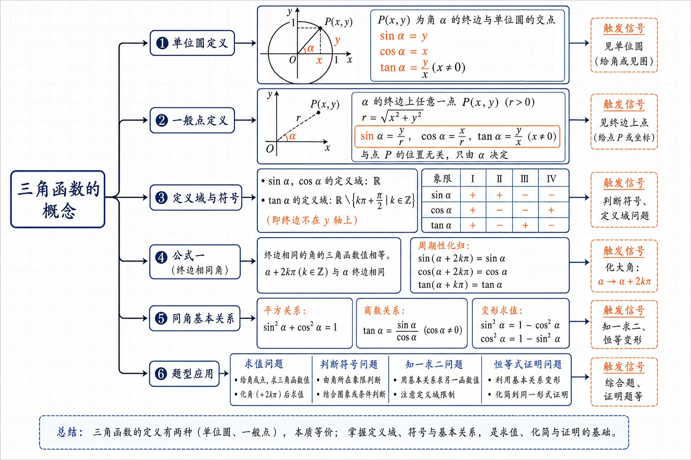
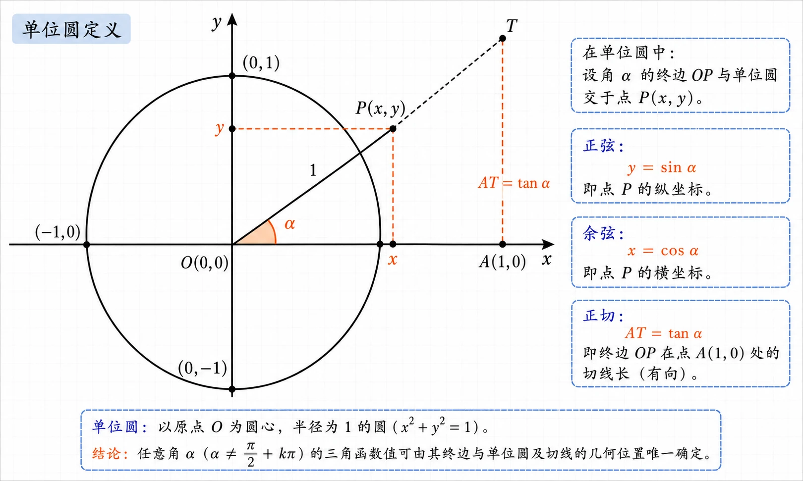
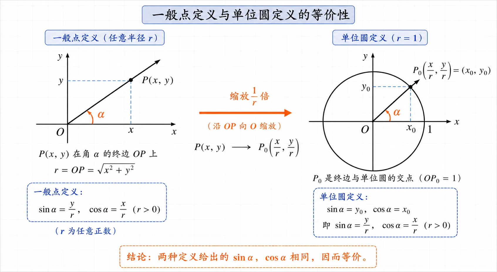
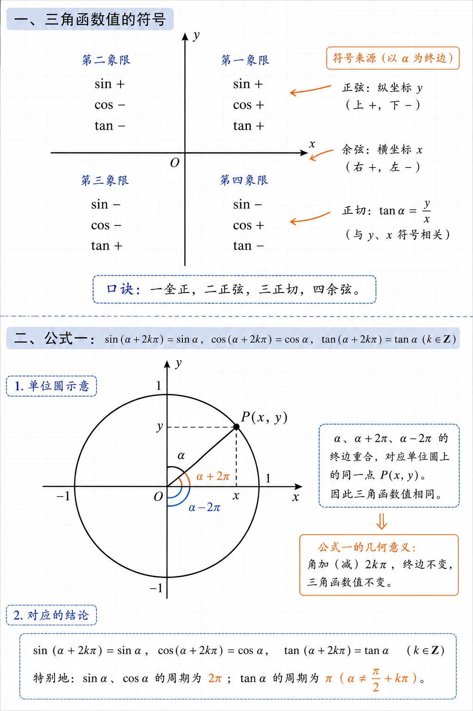
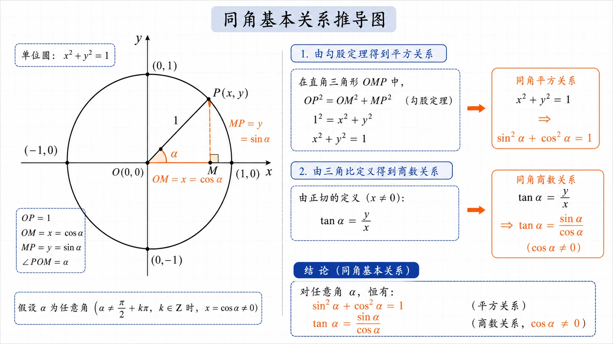

# 5.2 三角函数的概念

<!-- 图片描述：本节整体知识信息结构图。采用课堂板书几何图风格，白色背景配浅网格，黑色/深蓝线条，橙色标注关键节点。图中央为“三角函数的概念”主节点。一级分支向右展开：① 单位圆定义（sinα=y, cosα=x, tanα=y/x）；② 一般点定义（终边上任意点 P(x,y)，r=√(x²+y²)）；③ 定义域与符号（sin/cos 定义域为 R，tan 定义域排除 y 轴；各象限符号表）；④ 公式一（终边相同角的三角函数值相等，周期性化归）；⑤ 同角基本关系（sin²α+cos²α=1，tanα=sinα/cosα）；⑥ 题型应用（求值、判断符号、知一求二、恒等证明）。每条分支用箭头连接，末端标注触发信号如“见单位圆”“见终边上点”“知一求二”。 -->

## 本节学习目标

学完本节，你应该能够：

- 理解任意角三角函数的**单位圆定义**，明确 $\sin\alpha$、$\cos\alpha$、$\tan\alpha$ 与单位圆上点 $P(x,y)$ 的对应关系。
- 掌握**终边上任意一点** $P(x,y)$ 求三角函数值的方法，体会它与单位圆定义的一致性。
- 熟记三种三角函数的**定义域**，特别是正切函数的限制条件。
- 根据角所在**象限**判断三角函数值的符号，并能利用符号反推象限。
- 掌握**公式一**（终边相同角的三角函数值相等），能把任意角化归到 $0\sim 2\pi$（或 $0^{\circ}\sim 360^{\circ}$）内求值。
- 掌握**同角三角函数的基本关系**——平方关系与商数关系，能“知一求二”。
- 能进行简单的三角恒等式证明。

## 核心知识点讲解

### 一、知识对象与问题情境

在上一节中，我们把角的范围从 $0^{\circ}\sim 360^{\circ}$ 扩展到了任意角。现在要进一步回答：如何用一个函数来刻画**单位圆上动点**的位置？

如图，在单位圆 $\odot O$ 上，点 $P$ 从 $A(1,0)$ 出发，按逆时针方向旋转角 $\alpha$ 到达位置 $P(x,y)$。当 $\alpha$ 确定时，点 $P$ 的坐标 $(x,y)$ 就唯一确定。因此，$x$ 和 $y$ 都是关于角 $\alpha$ 的函数——这就是三角函数的来源。

<!-- 图片描述：单位圆定义示意图。以原点 O 为圆心、半径为 1 的单位圆，x 轴正半轴上标注 A(1,0)。角 α 的始边为 OA，终边 OP 与单位圆交于点 P(x,y)。用橙色虚线分别向 x 轴、y 轴作垂线，标注 x=cosα, y=sinα；在点 A 处作单位圆的切线，与终边 OP 的延长线交于点 T，标注切线长 AT=tanα。整体风格为精确几何板书。 -->

### 二、核心概念与定义条件

1. **单位圆定义**

   设 $\alpha$ 是一个任意角，$\alpha\in\mathbb{R}$，它的终边 $OP$ 与单位圆相交于点 $P(x,y)$，则定义：

   $$
   \sin\alpha=y,
   $$

   $$
   \cos\alpha=x,
   $$

   $$
   \tan\alpha=\frac{y}{x}\quad (x\ne 0).
   $$

   - 正弦 $\sin\alpha$ 对应点 $P$ 的**纵坐标**；
   - 余弦 $\cos\alpha$ 对应点 $P$ 的**横坐标**；
   - 正切 $\tan\alpha$ 对应**纵坐标与横坐标的比值**。

   由于每一个角 $\alpha$ 的终边与单位圆只有一个交点 $P$，所以 $x$、$y$ 被 $\alpha$ 唯一确定。因此，$\sin\alpha$、$\cos\alpha$、$\tan\alpha$ 都是关于角 $\alpha$ 的函数。

2. **三角函数的定义域**

   通常记为：

   $$
   y=\sin x,\quad x\in\mathbb{R};
   $$

   $$
   y=\cos x,\quad x\in\mathbb{R};
   $$

   $$
   y=\tan x,\quad x\ne \frac{\pi}{2}+k\pi\ (k\in\mathbb{Z}).
   $$

   正切函数没有定义的原因是：当 $x=\dfrac{\pi}{2}+k\pi$ 时，终边落在 $y$ 轴上，此时点 $P$ 的横坐标为 $0$，$\dfrac{y}{x}$ 无意义。

3. **终边上任意一点的定义**

   如图，设角 $\alpha$ 的终边上任意一点 $P(x,y)$（$P$ 不与原点重合），记 $r=\sqrt{x^2+y^2}$，则 $r>0$。

   可以证明：

   $$
   \sin\alpha=\frac{y}{r},\qquad \cos\alpha=\frac{x}{r},\qquad \tan\alpha=\frac{y}{x}\ (x\ne 0).
   $$

   **说明**：把点 $P$ 沿着终边方向缩放 $\dfrac{1}{r}$ 倍，就得到单位圆上的点 $P_0\left(\dfrac{x}{r},\dfrac{y}{r}\right)$。因此，$\sin\alpha=\dfrac{y}{r}$，$\cos\alpha=\dfrac{x}{r}$，与单位圆定义完全一致。这说明三角函数值只与**终边位置**有关，而与点 $P$ 在终边上的具体位置无关。

4. **与初中锐角三角函数的一致性**

   当 $x$ 是锐角时，本节定义与初中所学的直角三角形定义结果相同。例如，在直角三角形中，若斜边为 $1$，则对边长为 $\sin x$，邻边长为 $\cos x$，对边与邻边之比为 $\tan x$。这说明高中定义是初中定义的推广。

<!-- 图片描述：一般点定义与单位圆定义的等价性示意图。左侧画角 α 的终边 OP，取终边上一点 P(x,y)，标注 r=√(x²+y²)。右侧画单位圆与终边交点 P₀(x/r, y/r)。用橙色箭头表示“缩放 1/r 倍”的变换，并在两侧分别标注 sinα=y/r=y₀, cosα=x/r=x₀，说明两种定义的一致性。 -->

### 三、符号语言与等价表示

1. **三角函数值符号表**

   | 象限 | $\sin\alpha$ | $\cos\alpha$ | $\tan\alpha$ |
   |:---:|:---:|:---:|:---:|
   | 第一象限 | $+$ | $+$ | $+$ |
   | 第二象限 | $+$ | $-$ | $-$ |
   | 第三象限 | $-$ | $-$ | $+$ |
   | 第四象限 | $-$ | $+$ | $-$ |

   记忆口诀：**一全正，二正弦，三正切，四余弦**。

   原因：第一象限 $x>0,y>0$；第二象限 $x<0,y>0$；第三象限 $x<0,y<0$；第四象限 $x>0,y<0$。$\sin\alpha$ 与 $y$ 同号，$\cos\alpha$ 与 $x$ 同号，$\tan\alpha=\dfrac{y}{x}$ 由 $y$、$x$ 符号共同决定。

2. **公式一：终边相同角的三角函数值相等**

   因为终边相同的角对应单位圆上的同一点 $P$，所以它们的三角函数值相同：

   $$
   \sin(\alpha+2k\pi)=\sin\alpha,
   $$

   $$
   \cos(\alpha+2k\pi)=\cos\alpha,
   $$

   $$
   \tan(\alpha+2k\pi)=\tan\alpha,
   $$

   其中 $k\in\mathbb{Z}$。

   这个公式可以把任意角的三角函数值化归为 $0\sim 2\pi$（或 $0^{\circ}\sim 360^{\circ}$）内的角的三角函数值。

<!-- 图片描述：三角函数值符号与公式一示意图。上半部分画平面直角坐标系，四个象限分别标注“sin+, cos+, tan+”等符号组合，并用橙色箭头标注符号来源。下半部分画单位圆，展示角 α、α+2π、α-2π 终边重合，对应同一点 P，说明公式一的几何意义。 -->

### 四、关键性质、定理与公式

1. **同角三角函数的基本关系**

   设点 $P(x,y)$ 在单位圆上，则 $x^2+y^2=1$。代入 $x=\cos\alpha$，$y=\sin\alpha$，得到

   $$
   \sin^2\alpha+\cos^2\alpha=1.
   $$

   当 $\cos\alpha\ne 0$ 时，由 $\tan\alpha=\dfrac{y}{x}$ 可得

   $$
   \tan\alpha=\frac{\sin\alpha}{\cos\alpha}.
   $$

   这两个关系对任意使式子有意义的角都成立，是三角恒等变换的基础。

   常用变形：

   $$
   \sin^2\alpha=1-\cos^2\alpha,
   $$

   $$
   \cos^2\alpha=1-\sin^2\alpha,
   $$

   $$
   \sin\alpha=\cos\alpha\tan\alpha.
   $$

2. **象限与符号的等价条件**

   利用基本关系和符号表，可以得到判断象限的常用条件：

   - 第一象限：$\sin\alpha>0$ 且 $\cos\alpha>0$；
   - 第二象限：$\sin\alpha>0$ 且 $\cos\alpha<0$；
   - 第三象限：$\sin\alpha<0$ 且 $\cos\alpha<0$；
   - 第四象限：$\sin\alpha<0$ 且 $\cos\alpha>0$。

   类似地，还可以用 $\sin\alpha\tan\alpha$、$\cos\alpha\tan\alpha$、$\sin\alpha\cos\alpha$ 的符号综合判断象限。

<!-- 图片描述：同角基本关系推导图。在单位圆中画角 α 的终边 OP，交单位圆于 P(x,y)，作 PM⊥x 轴。用橙色标注直角三角形 OMP，其中 OM=x=cosα, MP=y=sinα, OP=1。由勾股定理得到 x²+y²=1，即 sin²α+cos²α=1；再由 tanα=y/x 得到 tanα=sinα/cosα。 -->

### 五、典型模型与解题方法

1. **定义法求三角函数值**

   已知终边上一点的坐标 $(x,y)$，先计算 $r=\sqrt{x^2+y^2}$，再代入
   $$
   \sin\alpha=\frac{y}{r},\quad \cos\alpha=\frac{x}{r},\quad \tan\alpha=\frac{y}{x}
   $$
   即可。

2. **公式一化归法**

   遇到大角或负角，先用公式一减去或加上整数个 $2\pi$（或 $360^{\circ}$），把它化为 $0\sim 2\pi$（或 $0^{\circ}\sim 360^{\circ}$）内的角，再求值。

3. **符号判断法**

   判断三角函数值符号时，先确定角所在的象限，再查符号表；或根据 $x$、$y$ 的符号直接判断。

4. **“知一求二”模型**

   已知 $\sin\alpha$、$\cos\alpha$、$\tan\alpha$ 中的一个，结合象限，用
   $$
   \sin^2\alpha+\cos^2\alpha=1,\quad \tan\alpha=\frac{\sin\alpha}{\cos\alpha}
   $$
   求另外两个。注意开平方时要根据象限定正负。

5. **恒等式证明模型**

   常用方法：
   - 从复杂的一边化到简单的一边；
   - 将正切化为正弦、余弦；
   - 两边交叉相乘，化为平方关系；
   - 注意保证分母不为零。

### 六、题型应用与迁移

本节知识可用于：

- 求特殊角的三角函数值；
- 由终边上一点坐标求三角函数值；
- 判断任意角三角函数值的符号；
- 已知一个三角函数值，求其余两个；
- 证明同角三角函数关系相关的恒等式；
- 为后续学习诱导公式、三角恒等变换、三角函数图象与性质打下基础。

## 重点梳理

1. **单位圆定义是核心**

   $\sin\alpha=y$、$\cos\alpha=x$、$\tan\alpha=\dfrac{y}{x}$ 把三角函数完全几何化。学习时一定要能在单位圆上画出对应的点 $P$，并直观读出 $x$、$y$ 的符号和大小。

2. **三角函数值只与终边有关**

   无论取终边上哪个点，只要用 $r=\sqrt{x^2+y^2}$ 归一化，得到的三角函数值都相同。因此，单位圆上的定义和一般点定义本质上是一回事。

3. **定义域必须牢记**

   $y=\tan x$ 的定义域是 $x\ne \dfrac{\pi}{2}+k\pi\ (k\in\mathbb{Z})$。在坐标轴上，$y$ 轴上的角不是正切函数的定义点。

4. **符号表要熟练**

   “一全正，二正弦，三正切，四余弦”是快速判断符号的工具。建议不要死记，而是理解 $x$、$y$ 在各象限的符号。

5. **公式一体现了三角函数的周期性**

   $2\pi$ 是正弦函数和余弦函数的周期。公式一说明，三角函数值具有“周而复始”的规律，这是后面学习三角函数图象的重要基础。

6. **同角基本关系是“知一求二”的钥匙**

   $|\sin\alpha|$ 和 $|\cos\alpha|$ 可由平方关系确定，但 $\sin\alpha$、$\cos\alpha$ 的符号必须结合象限。没有象限条件时，通常需要分情况讨论。

## 难点突破

### 难点 1：为什么终边上任意一点的坐标都能用来求三角函数值

设终边上一点 $P(x,y)$，到原点距离 $r=\sqrt{x^2+y^2}$。把 $P$ 沿终边向原点方向缩放 $\dfrac{1}{r}$ 倍，得到单位圆上的点 $P_0\left(\dfrac{x}{r},\dfrac{y}{r}\right)$。根据单位圆定义，

$$
\sin\alpha=\frac{y}{r},\qquad \cos\alpha=\frac{x}{r}.
$$

这说明三角函数值只取决于**终边方向**，与点 $P$ 到原点的远近无关。

### 难点 2：如何判断一个角的三角函数值符号

步骤：

1. 把角化到 $0^{\circ}\sim 360^{\circ}$（或 $0\sim 2\pi$）内；
2. 确定终边所在象限；
3. 根据符号表或 $x$、$y$ 符号判断。

例如：判断 $\sin(-672^{\circ})$ 的符号。先用公式一：

$$
-672^{\circ}=48^{\circ}-2\times 360^{\circ},
$$

所以 $-672^{\circ}$ 与 $48^{\circ}$ 终边相同，是第一象限角，因此 $\sin(-672^{\circ})>0$。

### 难点 3：已知一个三角函数值如何求其他值

以已知 $\sin\alpha=-\dfrac{3}{5}$ 为例：

由 $\sin^2\alpha+\cos^2\alpha=1$ 得

$$
\cos^2\alpha=1-\left(-\frac{3}{5}\right)^2=\frac{16}{25},
$$

所以 $|\cos\alpha|=\dfrac{4}{5}$。此时必须知道象限：

- 若 $\alpha$ 是第三象限角，$\cos\alpha<0$，则 $\cos\alpha=-\dfrac{4}{5}$，$\tan\alpha=\dfrac{3}{4}$；
- 若 $\alpha$ 是第四象限角，$\cos\alpha>0$，则 $\cos\alpha=\dfrac{4}{5}$，$\tan\alpha=-\dfrac{3}{4}$。

如果没有象限条件，还要考虑终边在 $y$ 轴负半轴等情况（$\sin\alpha=-1$ 时 $\cos\alpha=0$，$\tan\alpha$ 无意义）。

### 难点 4：三角恒等式证明的思路

证明 $\dfrac{\cos x}{1-\sin x}=\dfrac{1+\sin x}{\cos x}$ 有两种常用方法：

**方法一**：化左边。由 $1-\sin^2x=\cos^2x$，得

$$
\frac{\cos x}{1-\sin x}=\frac{\cos x(1+\sin x)}{(1-\sin x)(1+\sin x)}=\frac{\cos x(1+\sin x)}{\cos^2x}=\frac{1+\sin x}{\cos x}.
$$

**方法二**：交叉相乘。因为

$$
(1-\sin x)(1+\sin x)=1-\sin^2x=\cos^2x=\cos x\cdot\cos x,
$$

且 $\cos x\ne 0$、$1-\sin x\ne 0$ 时，两边同时除以 $(1-\sin x)\cos x$ 即得。

无论哪种方法，都要注意**分母不为零**的条件。

## 例题讲解

### 例题 1：用单位圆定义求特殊角的三角函数值

求 $\sin\dfrac{5\pi}{3}$、$\cos\dfrac{5\pi}{3}$、$\tan\dfrac{5\pi}{3}$ 的值。

**分析**：$\dfrac{5\pi}{3}$ 在第四象限。在单位圆上，终边与单位圆交点的坐标为 $\left(\dfrac{1}{2},-\dfrac{\sqrt{3}}{2}\right)$。

**解**：

$$
\sin\frac{5\pi}{3}=-\frac{\sqrt{3}}{2},\qquad
\cos\frac{5\pi}{3}=\frac{1}{2},\qquad
\tan\frac{5\pi}{3}=\frac{-\frac{\sqrt{3}}{2}}{\frac{1}{2}}=-\sqrt{3}.
$$

**反思**：只要知道终边与单位圆的交点坐标，就可以直接读出正弦和余弦，再用比值求正切。

### 例题 2：由终边上一点坐标求三角函数值

已知角 $\alpha$ 的终边经过点 $P(-12,5)$，求 $\sin\alpha$、$\cos\alpha$、$\tan\alpha$。

**分析**：点 $P$ 不在单位圆上，先用一般点定义求 $r$。

**解**：

$$
r=\sqrt{(-12)^2+5^2}=\sqrt{169}=13.
$$

因此

$$
\sin\alpha=\frac{y}{r}=\frac{5}{13},
\qquad
\cos\alpha=\frac{x}{r}=-\frac{12}{13},
\qquad
\tan\alpha=\frac{y}{x}=\frac{5}{-12}=-\frac{5}{12}.
$$

**反思**：因为 $P(-12,5)$ 在第二象限，所以 $\sin\alpha>0$，$\cos\alpha<0$，$\tan\alpha<0$，结果与符号表一致。

### 例题 3：判断三角函数值的符号

确定下列各三角函数值的符号：

（1）$\cos250^{\circ}$；　（2）$\sin\left(-\dfrac{\pi}{4}\right)$；　（3）$\tan(-672^{\circ})$；　（4）$\tan3\pi$。

**分析**：先判断每个角所在的象限或终边位置，再查符号表。

**解**：

（1）$250^{\circ}$ 是第三象限角，所以 $\cos250^{\circ}<0$。

（2）$-\dfrac{\pi}{4}$ 是第四象限角，所以 $\sin\left(-\dfrac{\pi}{4}\right)<0$。

（3）因为 $-672^{\circ}=48^{\circ}-2\times360^{\circ}$，与 $48^{\circ}$ 终边相同，是第一象限角，所以 $\tan(-672^{\circ})>0$。

（4）$3\pi$ 的终边在 $x$ 轴负半轴上，$\tan3\pi=\tan\pi=0$。

**反思**：判断符号时，利用公式一把大角或负角化到 $0^{\circ}\sim360^{\circ}$ 内，能大大降低出错率。

### 例题 4：利用公式一求三角函数值

求下列各三角函数值：

（1）$\sin1480^{\circ}10'$（精确到 $0.001$）；
（2）$\cos\dfrac{9\pi}{4}$；
（3）$\tan\left(-\dfrac{11\pi}{6}\right)$。

**分析**：先用公式一化到 $0^{\circ}\sim360^{\circ}$ 或 $0\sim2\pi$ 内，再求值。

**解**：

（1）

$$
\sin1480^{\circ}10'=\sin(40^{\circ}10'+4\times360^{\circ})=\sin40^{\circ}10'\approx0.645.
$$

（2）

$$
\cos\frac{9\pi}{4}=\cos\left(\frac{\pi}{4}+2\pi\right)=\cos\frac{\pi}{4}=\frac{\sqrt{2}}{2}.
$$

（3）

$$
\tan\left(-\frac{11\pi}{6}\right)=\tan\left(-2\pi+\frac{\pi}{6}\right)=\tan\frac{\pi}{6}=\frac{\sqrt{3}}{3}.
$$

**反思**：公式一可以把求任意角的三角函数值转化为求 $0\sim2\pi$（或 $0^{\circ}\sim360^{\circ}$）内的角的三角函数值。使用计算器时，要注意当前是角度制还是弧度制。

### 例题 5：用符号判断象限

求证：角 $\theta$ 为第三象限角的充要条件是

$$
\begin{cases}
\sin\theta<0,\\[4pt]
\tan\theta>0.
\end{cases}
$$

**分析**：分别证明充分性和必要性。利用符号表：$\sin\theta<0$ 说明 $\theta$ 在第三、第四象限或 $y$ 轴负半轴；$\tan\theta>0$ 说明 $\theta$ 在第一、第三象限。两个条件同时满足只能在第三象限。

**解**：

**充分性**：若 $\sin\theta<0$ 且 $\tan\theta>0$，则 $\theta$ 的终边只能在第三象限，所以 $\theta$ 是第三象限角。

**必要性**：若 $\theta$ 是第三象限角，则 $x<0$、$y<0$，因此 $\sin\theta=y/r<0$，$\tan\theta=y/x>0$。

综上，原命题成立。

**反思**：用符号判断象限时，要学会把“每个不等式”对应到“终边可能所在的区域”，再取交集。

### 例题 6：已知一个三角函数值求其他值

已知 $\sin\alpha=-\dfrac{3}{5}$，求 $\cos\alpha$、$\tan\alpha$ 的值。

**分析**：$\sin\alpha=-\dfrac{3}{5}<0$ 且 $\sin\alpha\ne-1$，所以 $\alpha$ 可能是第三或第四象限角。需要分情况讨论。

**解**：

由 $\sin^2\alpha+\cos^2\alpha=1$ 得

$$
\cos^2\alpha=1-\left(-\frac{3}{5}\right)^2=\frac{16}{25},
$$

所以 $|\cos\alpha|=\dfrac{4}{5}$。

- 若 $\alpha$ 是第三象限角，则 $\cos\alpha<0$，所以 $\cos\alpha=-\dfrac{4}{5}$，于是
  $$
  \tan\alpha=\frac{\sin\alpha}{\cos\alpha}=\frac{-\frac{3}{5}}{-\frac{4}{5}}=\frac{3}{4}.
  $$

- 若 $\alpha$ 是第四象限角，则 $\cos\alpha>0$，所以 $\cos\alpha=\dfrac{4}{5}$，于是
  $$
  \tan\alpha=\frac{\sin\alpha}{\cos\alpha}=\frac{-\frac{3}{5}}{\frac{4}{5}}=-\frac{3}{4}.
  $$

**反思**：如果题目只给出三角函数值而没有象限，通常要分情况；如果给出象限，开方后直接定号。

### 例题 7：三角恒等式证明

求证：$\dfrac{\cos x}{1-\sin x}=\dfrac{1+\sin x}{\cos x}$。

**分析**：左边分母是 $1-\sin x$，可乘以 $1+\sin x$ 利用平方差公式化简。

**解**：

左边

$$
\begin{aligned}
\frac{\cos x}{1-\sin x}
&=\frac{\cos x(1+\sin x)}{(1-\sin x)(1+\sin x)}\\[4pt]
&=\frac{\cos x(1+\sin x)}{1-\sin^2x}\\[4pt]
&=\frac{\cos x(1+\sin x)}{\cos^2x}\\[4pt]
&=\frac{1+\sin x}{\cos x}=\text{右边}.
\end{aligned}
$$

所以原等式成立。注意：这里默认 $\cos x\ne 0$ 且 $1-\sin x\ne 0$，即 $x\ne \dfrac{\pi}{2}+k\pi\ (k\in\mathbb{Z})$。

**反思**：证明恒等式时，既要掌握变形方向，也要说明等式成立的前提条件。

## 易错点整理

1. **混淆正弦与余弦对应的坐标**

   - 错误表现：把 $\sin\alpha$ 当作横坐标，$\cos\alpha$ 当作纵坐标。
   - 错因分析：没有记牢单位圆定义。
   - 正确处理：$\sin\alpha=y$（纵坐标），$\cos\alpha=x$（横坐标）。

2. **忽略正切函数的定义域**

   - 错误表现：认为 $\tan\dfrac{\pi}{2}=0$ 或存在某个值。
   - 错因分析：忘记终边在 $y$ 轴上时 $x=0$。
   - 正确处理：$y=\tan x$ 的定义域是 $x\ne \dfrac{\pi}{2}+k\pi\ (k\in\mathbb{Z})$。

3. **符号判断不化归直接看原角**

   - 错误表现：判断 $\sin(-672^{\circ})$ 符号时不知如何下手。
   - 错因分析：没有先用公式一化到 $0^{\circ}\sim360^{\circ}$ 内。
   - 正确处理：大角或负角先化归，再判断象限。

4. **“知一求二”时漏掉象限符号**

   - 错误表现：已知 $\sin\alpha=-\dfrac{3}{5}$，直接写 $\cos\alpha=\dfrac{4}{5}$。
   - 错因分析：忘记由象限确定 $+$、$-$。
   - 正确处理：先由 $\sin\alpha$ 判断可能的象限，再确定 $\cos\alpha$、$\tan\alpha$ 的符号。

5. **混淆 $\sin^2\alpha$ 与 $\sin\alpha^2$**

   - 错误表现：把 $\sin^2\alpha$ 写成 $(\sin\alpha)^2$ 时出错，或者把 $\sin\alpha^2$ 理解为 $\sin^2\alpha$。
   - 错因分析：符号不规范。
   - 正确处理：$\sin^2\alpha=(\sin\alpha)^2$，而 $\sin\alpha^2$ 表示 $\sin(\alpha^2)$，两者不同。

6. **证明恒等式时不说明前提条件**

   - 错误表现：在等式两边同除以 $1-\sin x$ 或 $\cos x$ 时不考虑是否为零。
   - 错因分析：分母为零时变形不成立。
   - 正确处理：注明等式在分母不为零时成立。

## 考点考证点整理

### 考点一：单位圆定义求三角函数值

- **出题思路**：给出特殊角（如 $\dfrac{5\pi}{3}$、$-\dfrac{\pi}{4}$ 等），要求用单位圆定义直接写出三个三角函数值。
- **关键条件**：角的终边与单位圆交点坐标；$\sin\alpha=y$，$\cos\alpha=x$，$\tan\alpha=\dfrac{y}{x}$（$x\ne 0$）。
- **解答要点**：
  1. 画出或想象角在坐标系中的位置；
  2. 写出终边与单位圆交点坐标；
  3. 按定义写出 $\sin\alpha$、$\cos\alpha$、$\tan\alpha$。
- **易扣分点**：符号错误；正切漏写 $x\ne 0$；把正弦、余弦对应反。

### 考点二：终边上任意一点坐标求三角函数值

- **出题思路**：给出终边上一点 $P(x,y)$（不一定是单位圆上的点），求三个三角函数值。
- **关键条件**：$r=\sqrt{x^2+y^2}$，$r>0$；$\sin\alpha=\dfrac{y}{r}$，$\cos\alpha=\dfrac{x}{r}$，$\tan\alpha=\dfrac{y}{x}$（$x\ne 0$）。
- **解答要点**：
  1. 计算 $r$；
  2. 按定义写出三个值；
  3. 检查结果符号是否与点所在象限一致。
- **易扣分点**：忘记求 $r$ 直接用 $x$、$y$ 当作 $\cos$、$\sin$；$r$ 计算错误；符号判断错误。

### 考点三：三角函数的定义域

- **出题思路**：判断函数 $y=\tan x$ 的定义域，或指出某个角使正切无意义。
- **关键条件**：$y=\tan x$ 在 $x=\dfrac{\pi}{2}+k\pi\ (k\in\mathbb{Z})$ 处无定义。
- **解答要点**：
  1. 写出 $y=\tan x$ 的定义域集合；
  2. 把给定角化为 $x=\dfrac{\pi}{2}+k\pi$ 的形式判断。
- **易扣分点**：写成 $x\ne k\pi$；漏写 $k\in\mathbb{Z}$；角度制与弧度制混用。

### 考点四：三角函数值符号的判断

- **出题思路**：判断给定三角函数值的符号，或根据符号判断象限。
- **关键条件**：符号表“一全正，二正弦，三正切，四余弦”；公式一化归。
- **解答要点**：
  1. 把角化到 $0^{\circ}\sim360^{\circ}$（或 $0\sim2\pi$）内；
  2. 判断象限；
  3. 根据符号表下结论。
- **易扣分点**：没有化归直接判断；把轴线角当成象限角；符号表记错。

### 考点五：公式一（周期性）的应用

- **出题思路**：求大角或负角的三角函数值。
- **关键条件**：$\sin(\alpha+2k\pi)=\sin\alpha$，$\cos(\alpha+2k\pi)=\cos\alpha$，$\tan(\alpha+2k\pi)=\tan\alpha$（$k\in\mathbb{Z}$）。
- **解答要点**：
  1. 观察角与 $0\sim2\pi$ 内哪个角相差 $2k\pi$；
  2. 把原式化为该角的三角函数值；
  3. 若为近似值，注意计算器模式设置。
- **易扣分点**：周期写错（如正切写成 $2\pi$ 虽然也对，但化简时不够简洁）；角度制与弧度制换算错误。

### 考点六：同角三角函数基本关系——“知一求二”

- **出题思路**：已知 $\sin\alpha$、$\cos\alpha$、$\tan\alpha$ 中的一个，结合象限条件，求另外两个。
- **关键条件**：$\sin^2\alpha+\cos^2\alpha=1$；$\tan\alpha=\dfrac{\sin\alpha}{\cos\alpha}$（$\cos\alpha\ne 0$）。
- **解答要点**：
  1. 用平方关系求 $|\cos\alpha|$ 或 $|\sin\alpha|$；
  2. 根据象限定正负；
  3. 用商数关系求 $\tan\alpha$；
  4. 无象限时分类讨论。
- **易扣分点**：开平方只取正；忽略象限；未说明无象限需讨论；$\tan\alpha$ 无意义的情况遗漏。

### 考点七：同角三角函数关系的恒等证明

- **出题思路**：证明形如 $\dfrac{\cos x}{1-\sin x}=\dfrac{1+\sin x}{\cos x}$ 的恒等式。
- **关键条件**：$\sin^2x+\cos^2x=1$；分母不为零。
- **解答要点**：
  1. 从复杂的一边化到另一边；
  2. 常用技巧：$1-\sin^2x=\cos^2x$、$1-\cos^2x=\sin^2x$；
  3. 说明等式成立的前提条件。
- **易扣分点**：证明过程中未说明分母不为零；变形方向错误导致循环论证。

## 练习题

### 基础训练

1. 已知角 $\alpha$ 的终边经过点 $P(5,12)$，求 $\sin\alpha$、$\cos\alpha$、$\tan\alpha$。
2. 求下列三角函数值：
   （1）$\sin\dfrac{5\pi}{3}$；　（2）$\cos\left(-\dfrac{\pi}{4}\right)$；　（3）$\tan\pi$。
3. 判断下列三角函数值的符号：
   （1）$\sin156^{\circ}$；　（2）$\cos\dfrac{4\pi}{3}$；　（3）$\tan(-672^{\circ})$。
4. 写出 $y=\tan x$ 的定义域，并用集合表示。
5. 把下列各角化为 $0^{\circ}\sim 360^{\circ}$ 内的终边相同角，并指出象限：
   （1）$395^{\circ}$；　（2）$-1000^{\circ}$；　（3）$1500^{\circ}$。

### 巩固训练

6. 已知角 $\alpha$ 终边上一点 $P(3a,4a)$，其中 $a\ne 0$，求 $\sin\alpha$、$\cos\alpha$、$\tan\alpha$。
7. 已知 $\cos\alpha=-\dfrac{3}{5}$，且 $\alpha$ 是第二象限角，求 $\sin\alpha$、$\tan\alpha$。
8. 已知 $\sin\alpha=-\dfrac{5}{13}$，且 $\alpha$ 是第四象限角，求 $\cos\alpha$、$\tan\alpha$。
9. 求证：$\dfrac{\cos x}{1-\sin x}=\dfrac{1+\sin x}{\cos x}$（说明成立条件）。
10. 化简：
    （1）$\cos\theta\tan\theta$；
    （2）$\dfrac{2\cos^2\alpha-1}{1-2\sin^2\alpha}$；
    （3）$(1+\tan^2\alpha)\cos^2\alpha$。

### 提升训练

11. 已知 $\tan\alpha=2$，求 $\dfrac{\sin\alpha+\cos\alpha}{\sin\alpha-\cos\alpha}$ 的值。
12. 已知 $\sin\theta=0.35$，求 $\cos\theta$、$\tan\theta$ 的值（精确到 $0.01$）。
13. 求证：角 $\theta$ 为第二或第三象限角的充要条件是 $\sin\theta\tan\theta<0$。
14. 已知 $\cos x=\dfrac{1}{3}$，且 $x$ 是第四象限角，求 $\sin x$、$\tan x$ 以及 $\dfrac{\cos x}{1-\sin x}-\dfrac{1+\sin x}{\cos x}$ 的值。

## 练习题答案

### 基础训练

1. **答案**：

   $r=\sqrt{5^2+12^2}=13$。

   $$
   \sin\alpha=\frac{12}{13},\qquad \cos\alpha=\frac{5}{13},\qquad \tan\alpha=\frac{12}{5}.
   $$

2. **答案**：

   （1）$\sin\dfrac{5\pi}{3}=-\dfrac{\sqrt{3}}{2}$；
   （2）$\cos\left(-\dfrac{\pi}{4}\right)=\cos\dfrac{\pi}{4}=\dfrac{\sqrt{2}}{2}$；
   （3）$\tan\pi=0$。

3. **答案**：

   （1）$156^{\circ}$ 在第二象限，$\sin156^{\circ}>0$；
   （2）$\dfrac{4\pi}{3}$ 在第三象限，$\cos\dfrac{4\pi}{3}<0$；
   （3）$-672^{\circ}=48^{\circ}-2\times360^{\circ}$，在第一象限，$\tan(-672^{\circ})>0$。

4. **答案**：

   $$
   \left\{x\ \middle|\ x\ne \frac{\pi}{2}+k\pi,\ k\in\mathbb{Z}\right\}.
   $$

5. **答案**：

   （1）$395^{\circ}=35^{\circ}+360^{\circ}$，第一象限；
   （2）$-1000^{\circ}=80^{\circ}-3\times360^{\circ}$，第一象限；
   （3）$1500^{\circ}=60^{\circ}+4\times360^{\circ}$，第一象限。

### 巩固训练

6. **答案**：

   $r=\sqrt{(3a)^2+(4a)^2}=5|a|$。

   - 若 $a>0$，点 $P$ 在第一象限，$r=5a$，则
     $$
     \sin\alpha=\frac{4}{5},\qquad \cos\alpha=\frac{3}{5},\qquad \tan\alpha=\frac{4}{3}.
     $$
   - 若 $a<0$，点 $P$ 在第三象限，$r=-5a$，则
     $$
     \sin\alpha=-\frac{4}{5},\qquad \cos\alpha=-\frac{3}{5},\qquad \tan\alpha=\frac{4}{3}.
     $$

   **注意**：$\tan\alpha$ 与 $a$ 的符号无关，但 $\sin\alpha$、$\cos\alpha$ 的符号由 $a$ 决定。

7. **答案**：

   因为 $\alpha$ 是第二象限角，$\sin\alpha>0$。由
   $$
   \sin^2\alpha=1-\cos^2\alpha=1-\left(-\frac{3}{5}\right)^2=\frac{16}{25},
   $$
   得
   $$
   \sin\alpha=\frac{4}{5}.
   $$
   于是
   $$
   \tan\alpha=\frac{\sin\alpha}{\cos\alpha}=\frac{\frac{4}{5}}{-\frac{3}{5}}=-\frac{4}{3}.
   $$

8. **答案**：

   因为 $\alpha$ 是第四象限角，$\cos\alpha>0$。由
   $$
   \cos^2\alpha=1-\sin^2\alpha=1-\left(-\frac{5}{13}\right)^2=\frac{144}{169},
   $$
   得
   $$
   \cos\alpha=\frac{12}{13}.
   $$
   于是
   $$
   \tan\alpha=\frac{-\frac{5}{13}}{\frac{12}{13}}=-\frac{5}{12}.
   $$

9. **答案**：

   左边
   $$
   \frac{\cos x}{1-\sin x}=\frac{\cos x(1+\sin x)}{(1-\sin x)(1+\sin x)}=\frac{\cos x(1+\sin x)}{\cos^2x}=\frac{1+\sin x}{\cos x}=\text{右边}.
   $$
   成立条件：$\cos x\ne 0$ 且 $1-\sin x\ne 0$，即 $x\ne \dfrac{\pi}{2}+k\pi\ (k\in\mathbb{Z})$。

10. **答案**：

    （1）$\cos\theta\tan\theta=\cos\theta\cdot\dfrac{\sin\theta}{\cos\theta}=\sin\theta$（$\cos\theta\ne 0$）。

    （2）由 $2\cos^2\alpha-1=\cos2\alpha$，$1-2\sin^2\alpha=\cos2\alpha$，得
    $$
    \frac{2\cos^2\alpha-1}{1-2\sin^2\alpha}=\frac{\cos2\alpha}{\cos2\alpha}=1
    $$
    （$\cos2\alpha\ne 0$ 时）。

    （3）
    $$
    (1+\tan^2\alpha)\cos^2\alpha=\left(1+\frac{\sin^2\alpha}{\cos^2\alpha}\right)\cos^2\alpha=\cos^2\alpha+\sin^2\alpha=1.
    $$

### 提升训练

11. **答案**：

    因为 $\tan\alpha=2$，所以 $\cos\alpha\ne 0$。分子分母同除以 $\cos\alpha$，得
    $$
    \frac{\sin\alpha+\cos\alpha}{\sin\alpha-\cos\alpha}=\frac{\tan\alpha+1}{\tan\alpha-1}=\frac{2+1}{2-1}=3.
    $$

12. **答案**：

    由 $\sin^2\theta+\cos^2\theta=1$ 得
    $$
    \cos^2\theta=1-0.35^2=1-0.1225=0.8775,
    $$
    所以 $|\cos\theta|\approx0.9368$。由于题目未给象限，通常取 $0\le\theta\le\pi$ 时 $|\cos\theta|=\sqrt{0.8775}\approx0.94$。

    若 $\theta$ 为锐角，$\cos\theta\approx0.94$，$\tan\theta=\dfrac{0.35}{0.94}\approx0.37$；
    若 $\theta$ 为钝角，$\cos\theta\approx-0.94$，$\tan\theta\approx-0.37$。

    若按 $0\le\theta\le\pi$ 的常规约定，答案为 $\cos\theta\approx0.94$、$\tan\theta\approx0.37$ 或 $\cos\theta\approx-0.94$、$\tan\theta\approx-0.37$。

13. **答案**：

    $\sin\theta\tan\theta=\sin\theta\cdot\dfrac{\sin\theta}{\cos\theta}=\dfrac{\sin^2\theta}{\cos\theta}$。

    - 若 $\theta$ 在第二象限，$\sin\theta>0$，$\cos\theta<0$，则 $\sin\theta\tan\theta<0$；
    - 若 $\theta$ 在第三象限，$\sin\theta<0$，$\cos\theta<0$，$\tan\theta>0$，则 $\sin\theta\tan\theta<0$；
    - 在其他象限或坐标轴上，$\sin\theta\tan\theta\ge0$ 或无意义。

    因此，$\sin\theta\tan\theta<0$ 当且仅当 $\theta$ 在第二或第三象限。

14. **答案**：

    因为 $x$ 在第四象限，$\sin x<0$。由
    $$
    \sin^2x=1-\cos^2x=1-\left(\frac{1}{3}\right)^2=\frac{8}{9},
    $$
    得
    $$
    \sin x=-\frac{2\sqrt{2}}{3},\qquad \tan x=\frac{\sin x}{\cos x}=-2\sqrt{2}.
    $$

    又因为已证 $\dfrac{\cos x}{1-\sin x}=\dfrac{1+\sin x}{\cos x}$（$\cos x\ne 0$），所以
    $$
    \frac{\cos x}{1-\sin x}-\frac{1+\sin x}{\cos x}=0.
    $$
