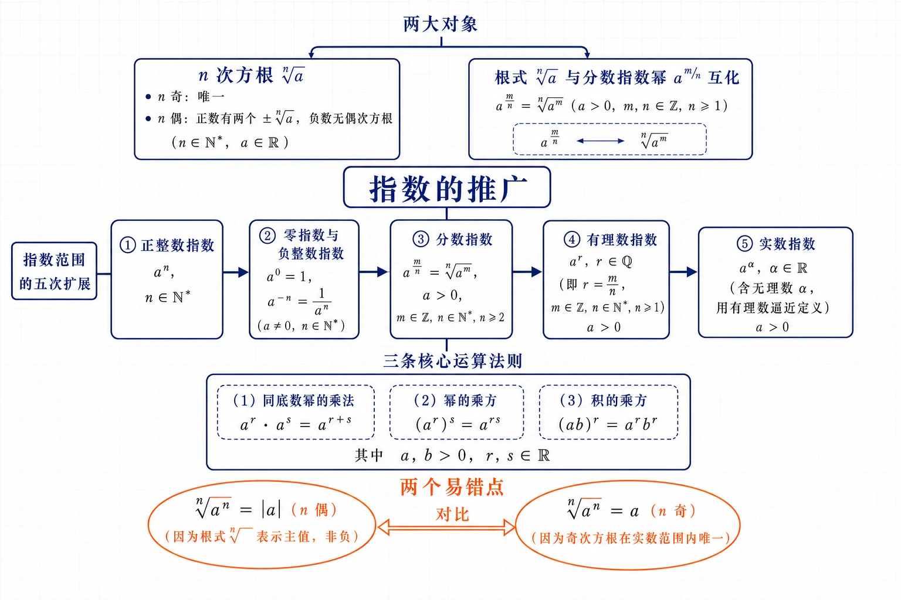
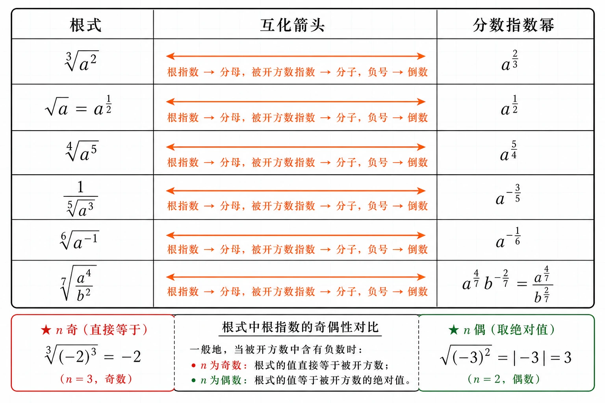
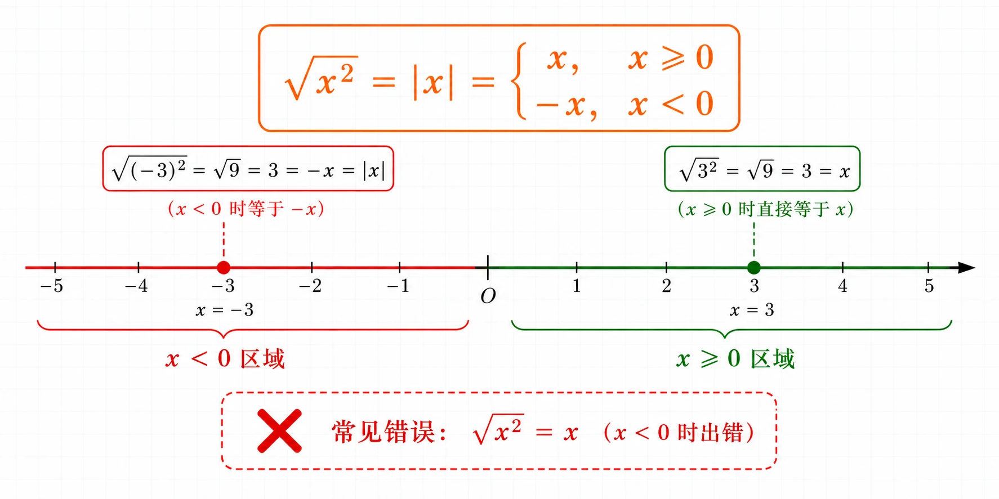
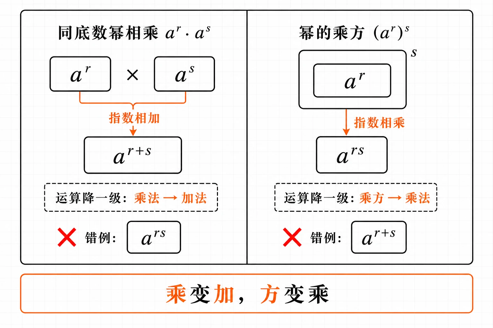

# 4.1 指数

<!-- 图片描述：本节整体知识信息结构图。浅网格背景，中心节点写“指数的推广”。中心放一条从左到右的水平箭头链，依次标注指数范围的五次扩展：“正整数指数（$a^n$，$n\in\mathbb N^*$）$\to$ 零指数与负整数指数（$a^0=1$，$a^{-n}=\frac1{a^n}$）$\to$ 分数指数（$a^{m/n}=\sqrt[n]{a^m}$，$a>0$）$\to$ 有理数指数 $\to$ 实数指数（含无理数 $\alpha$，用有理数逼近定义）”。中心上方引出“两大对象”：左框“$n$ 次方根 $\sqrt[n]{a}$”（$n$ 奇：唯一；$n$ 偶：正数有两个 $\pm\sqrt[n]{a}$，负数无偶次方根），右框“根式 $\sqrt[n]{a}$ 与分数指数幂 $a^{m/n}$ 互化”。中心下方引出“三条核心运算法则”：$a^r\cdot a^s=a^{r+s}$、$(a^r)^s=a^{rs}$、$(ab)^r=a^r b^r$（$a,b>0$，$r,s\in\mathbb R$）。用橙色椭圆框醒目标注两个易错点“$\sqrt[n]{a^n}=|a|$（$n$ 偶）”和“$\sqrt[n]{a^n}=a$（$n$ 奇）”，并用对比箭头连接。黑色深蓝线条为主，LaTeX 公式风格。 -->

## 本节学习目标

- 理解 $n$ 次方根的概念，掌握 $n$ 为奇数、偶数时 $n$ 次方根的存在性和个数，会用根式 $\sqrt[n]{a}$ 表示 $n$ 次方根。
- 掌握根式的性质，能正确计算 $\sqrt[n]{a^n}$（区分 $n$ 为奇数与偶数）和 $(\sqrt[n]{a})^n$。
- 理解分数指数幂的意义，能熟练进行根式与分数指数幂的互化（含正分数、负分数指数）。
- 掌握无理数指数幂的意义（用有理数逼近定义），理解指数从整数推广到实数的过程。
- 熟练运用实数指数幂的三条运算法则进行化简、计算和求值。
- 能处理含字母指数的化简、条件求值（如已知 $a^x$ 求 $a^{2x}+a^{-2x}$ 等），为学习指数函数打基础。

## 核心知识点讲解

### 一、知识对象与问题情境

我们已经学过整数指数幂（$a^n$，$n$ 为正整数）、零指数幂（$a^0=1$）和负整数指数幂（$a^{-n}=\dfrac1{a^n}$）。在学习幂函数时，正方形场地的边长 $c$ 关于面积 $S$ 的函数 $c=\sqrt{S}$ 被记作 $c=S^{1/2}$。像 $S^{1/2}$ 这样以分数为指数的幂，究竟是什么含义？更进一步，当指数是无理数（如 $2^{\sqrt2}$）时又该如何理解？

本节的任务就是把指数的范围从整数**逐步推广到全体实数**：正整数指数 $\to$ 零指数与负整数指数 $\to$ 分数指数 $\to$ 有理数指数 $\to$ 实数指数（含无理数指数）。推广的核心原则是：**新定义的幂必须与已有整数指数幂的运算法则相容**。这样推广后，才能定义和研究指数函数 $y=a^x$（$x\in\mathbb R$）。

### 二、核心概念与定义条件

**$n$ 次方根**：一般地，如果 $x^n=a$（$n>1$，$n\in\mathbb N^*$），那么 $x$ 叫作 $a$ 的 **$n$ 次方根**。例如 $\pm2$ 是 $16$ 的 $4$ 次方根（因 $(\pm2)^4=16$），$2$ 是 $32$ 的 $5$ 次方根（因 $2^5=32$）。

$n$ 次方根的存在性与个数取决于 $n$ 的奇偶性和 $a$ 的正负：

| 条件 | $n$ 次方根情况 | 记号 |
|---|---|---|
| $n$ 为奇数，$a>0$ | 一个正数 | $\sqrt[n]{a}$ |
| $n$ 为奇数，$a<0$ | 一个负数 | $\sqrt[n]{a}$（如 $\sqrt[5]{-32}=-2$） |
| $n$ 为奇数，$a=0$ | $0$ | $\sqrt[n]{0}=0$ |
| $n$ 为偶数，$a>0$ | 两个互为相反数 | $\pm\sqrt[n]{a}$（如 $\pm\sqrt[4]{16}=\pm2$） |
| $n$ 为偶数，$a=0$ | $0$ | $\sqrt[n]{0}=0$ |
| $n$ 为偶数，$a<0$ | **不存在**（负数没有偶次方根） | 无意义 |

**根式**：式子 $\sqrt[n]{a}$ 叫作**根式**（radical），其中 $n$ 叫**根指数**，$a$ 叫**被开方数**。当 $n$ 为偶数且 $a\ge0$ 时，$\sqrt[n]{a}$ 表示 $a$ 的**正的** $n$ 次方根（非负的那个）。

### 三、符号语言与等价表示

**根式的两条核心性质**（必须区分清楚）：

性质一：$(\sqrt[n]{a})^n=a$。这总是成立（只要 $\sqrt[n]{a}$ 有意义），因为 $\sqrt[n]{a}$ 就是 $a$ 的 $n$ 次方根，再 $n$ 次方当然还原。例如 $(\sqrt5)^2=5$，$(\sqrt[5]{-3})^5=-3$。

性质二：$\sqrt[n]{a^n}$ 要分情况讨论：

$$
\sqrt[n]{a^n}=\begin{cases}a,&n\text{ 为奇数},\\|a|,&n\text{ 为偶数}.\end{cases}
$$

即当 $n$ 为奇数时 $\sqrt[n]{a^n}=a$（总是成立）；当 $n$ 为偶数时 $\sqrt[n]{a^n}=|a|$（因为偶次根式结果非负）。例如 $\sqrt[3]{(-2)^3}=-2$（$n=3$ 奇），$\sqrt{(-3)^2}=|-3|=3$（$n=2$ 偶）。

**分数指数幂的规定**：

| 类型 | 规定 | 条件 |
|---|---|---|
| 正分数指数幂 | $a^{m/n}=\sqrt[n]{a^m}$ | $a>0$，$m,n\in\mathbb N^*$，$n>1$ |
| 负分数指数幂 | $a^{-m/n}=\dfrac1{a^{m/n}}=\dfrac1{\sqrt[n]{a^m}}$ | $a>0$，$m,n\in\mathbb N^*$，$n>1$ |
| $0$ 的正分数指数幂 | $0^{m/n}=0$ | — |
| $0$ 的负分数指数幂 | **没有意义** | — |

互化口诀：根指数 $n$ 去分母，被开方数指数 $m$ 去分子。例如 $\sqrt[3]{a^2}=a^{2/3}$，$\dfrac1{\sqrt[5]{a^3}}=a^{-3/5}$，$a^{-1/2}=\dfrac1{\sqrt a}$。

**无理数指数幂**：$a^\alpha$（$a>0$，$\alpha$ 为无理数）用有理数逼近来定义。以 $5^{\sqrt2}$ 为例：取 $\sqrt2$ 的不足近似值序列 $1.4,1.41,1.414,\ldots$ 和过剩近似值序列 $1.5,1.42,1.415,\ldots$，计算 $5^{1.4},5^{1.41},\ldots$（逐渐增大）和 $5^{1.5},5^{1.42},\ldots$（逐渐减小），两串值趋向于同一个确定的实数，这个数就是 $5^{\sqrt2}$。这样指数范围就从有理数拓展到了实数。

### 四、关键性质、定理与公式

**实数指数幂的三条运算法则**（$a>0$，$b>0$，$r,s\in\mathbb R$）：

| 法则 | 公式 | 名称 |
|---|---|---|
| 同底数幂相乘 | $a^r\cdot a^s=a^{r+s}$ | 指数相加 |
| 幂的乘方 | $(a^r)^s=a^{rs}$ | 指数相乘 |
| 积的乘方 | $(ab)^r=a^r\cdot b^r$ | 分配到各因式 |

由此可推出（作为推论）：

- 同底数幂相除：$\dfrac{a^r}{a^s}=a^{r-s}$（因 $a^r\div a^s=a^r\cdot a^{-s}=a^{r-s}$）。
- 商的乘方：$\left(\dfrac ab\right)^r=\dfrac{a^r}{b^r}$。
- $a^{-r}=\dfrac1{a^r}$；$a^0=1$（$a>0$）。

**条件求值的常用技巧**：

- 整体代换：已知 $a^x+a^{-x}=m$，求 $a^{2x}+a^{-2x}$。利用 $(a^x+a^{-x})^2=a^{2x}+2+a^{-2x}$，得 $a^{2x}+a^{-2x}=m^2-2$。
- 齐次化：已知 $a^{2x}=k$，求 $\dfrac{a^{3x}+a^{-3x}}{a^x+a^{-x}}$。分子 $=a^{3x}+a^{-3x}$，利用 $a^{3x}=(a^x)^3$，$a^{-3x}=(a^{-x})^3$，分子 $=(a^x+a^{-x})(a^{2x}-1+a^{-2x})$，与分母约分。

### 五、典型模型与解题方法

**模型一：计算 $\sqrt[n]{a^n}$。** 先判断 $n$ 是奇数还是偶数：奇数直接得 $a$；偶数得 $|a|$，再根据 $a$ 的正负去绝对值。

**模型二：根式与分数指数幂互化。** 根指数 $\to$ 分母，被开方数指数 $\to$ 分子；负指数 $\to$ 倒数。

**模型三：指数幂化简计算。** 先把所有项统一写成同底数分数指数幂形式，再用运算法则（指数加减乘）合并。

**模型四：条件求值。** 找已知量与所求量的关系，用整体代换或因式分解（如 $a^{3x}+a^{-3x}=(a^x+a^{-x})(a^{2x}-1+a^{-2x})$）。

**模型五：实际背景的指数计算。** 如细菌分裂（每 $10$ 分钟分裂一次，$1$ 小时分裂 $6$ 次，$1$ 个变 $2^6=64$ 个）、容器倒液（每次倒出 $\frac13$ 剩 $\frac23$，$n$ 次后剩 $(\frac23)^n$）。

### 六、题型应用与迁移

本节题型分五类：①$\sqrt[n]{a^n}$ 求值（区分奇偶）；②根式与分数指数幂互化；③指数幂化简计算（运用三条法则）；④含字母的条件求值（整体代换）；⑤实际背景的指数计算（分裂、衰减）。这些是下一节指数函数 $y=a^x$ 的运算基础——只有把指数推广到实数并掌握运算法则，才能研究指数函数的定义域（全体实数）和性质。

## 重点梳理

- **$\sqrt[n]{a^n}$ 是否等于 $a$，取决于 $n$ 的奇偶性**。$n$ 为奇数时 $\sqrt[n]{a^n}=a$（总是成立）；$n$ 为偶数时 $\sqrt[n]{a^n}=|a|$（结果非负）。这是本节最核心也最易错的一条性质。它之所以重要，是因为直接决定了根式化简结果的正确性。例如 $\sqrt{x^2}=|x|$ 而不是 $x$（当 $x<0$ 时 $|x|=-x\ne x$）。触发条件：遇到 $\sqrt[n]{a^n}$ 形式，第一反应问“$n$ 是奇数还是偶数”。
- **$(\sqrt[n]{a})^n=a$ 总是成立，但 $\sqrt[n]{a^n}$ 不一定等于 $a$**。这两个式子方向相反，容易混淆。前者是“先开方再乘方”，一定还原；后者是“先乘方再开方”，偶数次时要去绝对值。
- **分数指数幂中底数要求 $a>0$**。这是因为分数指数 $a^{m/n}=\sqrt[n]{a^m}$ 当 $n$ 为偶数时要求 $a^m\ge0$，为统一起见规定 $a>0$。负数的分数指数幂在高中阶段一般不讨论（会出现多值性问题）。所以涉及分数指数幂运算时，默认 $a>0$。
- **负分数指数表示倒数，不是把负号放进根号**。$a^{-m/n}=\dfrac1{a^{m/n}}=\dfrac1{\sqrt[n]{a^m}}$，负号的作用是“取倒数”，不是“在根号前加负号”。常见错误：把 $a^{-1/2}$ 写成 $-\sqrt a$（应为 $\dfrac1{\sqrt a}$）。
- **三条运算法则要求底数 $a>0,b>0$**。这是为了保证法则对全体实数指数都成立。运用时注意：同底数幂相乘指数相加（不是相乘）；幂的乘方指数相乘（不是相加）。
- **指数推广的原则是“与已有法则相容”**。每次推广（整数$\to$分数$\to$无理数）都确保运算法则 $a^r a^s=a^{r+s}$、$(a^r)^s=a^{rs}$、$(ab)^r=a^r b^r$ 继续成立。这是数学中“引入新概念时保持与旧法则相容”的重要思想。

<!-- 图片描述：根式与分数指数幂互化对照图。画一个大表格，分三列。第一列“根式”，第二列“互化箭头”，第三列“分数指数幂”。行示例：$\sqrt[3]{a^2}\leftrightarrow a^{2/3}$；$\sqrt{a}=a^{1/2}\leftrightarrow a^{1/2}$；$\sqrt[4]{a^5}\leftrightarrow a^{5/4}$；$\dfrac1{\sqrt[5]{a^3}}\leftrightarrow a^{-3/5}$。在每行用橙色箭头标注转换规则“根指数 $\to$ 分母，被开方数指数 $\to$ 分子，负号 $\to$ 倒数”。底部单独画一行对比 $\sqrt[3]{(-2)^3}=-2$（$n$ 奇，直接等于）和 $\sqrt{(-3)^2}=|-3|=3$（$n$ 偶，取绝对值），用红绿颜色区分。浅网格背景，黑色线条。 -->

## 难点突破

### 难点一：为什么 $\sqrt{x^2}=|x|$ 而不是 $x$

平方根（偶次根式）表示的是**非负**的方根。$\sqrt{x^2}$ 表示 $x^2$ 的非负平方根。当 $x\ge0$ 时，$x^2$ 的非负平方根就是 $x$；当 $x<0$ 时，$x^2$ 的非负平方根是 $-x$（因 $(-x)^2=x^2$ 且 $-x>0$）。所以 $\sqrt{x^2}=|x|$。如果直接写成 $x$，当 $x<0$ 时就得到负数，违反了“根式结果非负”的要求。突破方法：遇到偶次根式 $\sqrt[2k]{(\cdot)^{2k}}$，结果一定是非负的，用绝对值保护。

<!-- 图片描述：$\sqrt{x^2}=|x|$ 数轴解释图。画一条水平数轴，原点 $O$。右侧标 $x\ge0$ 区域（绿色），左侧标 $x<0$ 区域（红色）。在右侧取一点 $x=3$（绿色实心点），上方标注 $\sqrt{3^2}=\sqrt9=3=x$（$x\ge0$ 时直接等于 $x$）。在左侧取一点 $x=-3$（红色实心点），上方标注 $\sqrt{(-3)^2}=\sqrt9=3=-x=|x|$（$x<0$ 时等于 $-x$）。中间用橙色大字标注结论 $\sqrt{x^2}=|x|=\begin{cases}x,&x\ge0\\-x,&x<0\end{cases}$，并用红色叉标注常见错误“$\sqrt{x^2}=x$（$x<0$ 时出错）”。浅网格背景，黑色数轴。 -->

### 难点二：根式化分数指数幂时分子分母不要搞反

$\sqrt[3]{a^2}=a^{2/3}$：根指数 $3$ 在分母，被开方数中 $a$ 的指数 $2$ 在分子。反过来 $a^{3/2}=\sqrt{a^3}=\sqrt{a^3}$。记忆口诀：“根下数去分子，根号数去分母”。突破方法：用具体数字验证，如 $\sqrt[3]{8^2}=\sqrt[3]{64}=4$，$8^{2/3}=(\sqrt[3]{8})^2=2^2=4$ ✓。

### 难点三：负分数指数幂不是“负号的幂”

$a^{-3/4}=\dfrac1{a^{3/4}}=\dfrac1{\sqrt[4]{a^3}}$。负号的作用是“取倒数”，而不是把负号带入根号或写成 $-\sqrt[4]{a^3}$。突破方法：负指数 $\Leftrightarrow$ 倒数，记住 $a^{-r}=\dfrac1{a^r}$ 这一条，所有负分数指数都先转化成倒数再处理。

### 难点四：运算法则中“指数相加”与“指数相乘”的区分

- 同底数幂**相乘** $a^r\cdot a^s=a^{r+s}$：指数**相加**。
- 幂的**乘方** $(a^r)^s=a^{rs}$：指数**相乘**。

初学者容易混淆，如把 $a^r\cdot a^s$ 写成 $a^{rs}$（错，应为 $a^{r+s}$），或把 $(a^r)^s$ 写成 $a^{r+s}$（错，应为 $a^{rs}$）。突破方法：记住“乘法 $\to$ 加法”（幂相乘，指数相加，运算降一级）；“乘方 $\to$ 乘法”（幂乘方，指数相乘，运算降一级）。

<!-- 图片描述：指数运算法则“相乘 vs 乘方”对比图。分左右两栏。左栏标题“同底数幂相乘 $a^r\cdot a^s$”：画两个方框 $a^r$ 和 $a^s$ 中间用“$\times$”连接，下方用橙色箭头标注“指数相加”，结果框写 $a^{r+s}$，旁注“运算降一级：乘法$\to$加法”，并用红色叉标错例 $a^{rs}$。右栏标题“幂的乘方 $(a^r)^s$”：画一个嵌套方框（外层指数 $s$，内层 $a^r$），下方用橙色箭头标注“指数相乘”，结果框写 $a^{rs}$，旁注“运算降一级：乘方$\to$乘法”，并用红色叉标错例 $a^{r+s}$。底部口诀“乘变加，方变乘”。浅网格背景，黑色线条。 -->

### 难点五：条件求值中的整体代换

已知 $a^{1/2}+a^{-1/2}=3$，求 $a+a^{-1}$ 和 $a^{3/2}+a^{-3/2}$ 的值。直接求 $a$ 很难（要解方程），但可以用整体代换：

- $(a^{1/2}+a^{-1/2})^2=a+2+a^{-1}=9$，所以 $a+a^{-1}=7$。
- $a^{3/2}+a^{-3/2}=(a^{1/2})^3+(a^{-1/2})^3=(a^{1/2}+a^{-1/2})(a-1+a^{-1})=3\times(7-1)=18$。

突破方法：把 $a^x$、$a^{-x}$ 视为整体，利用完全平方、立方和（差）公式建立已知与所求的关系，避免单独求 $a$。

## 例题讲解

### 例1：计算根式的值

求下列各式的值：（1）$\sqrt[3]{(-8)^3}$；（2）$\sqrt{(-10)^2}$；（3）$\sqrt[4]{(3-\pi)^4}$；（4）$\sqrt{(a-b)^2}$。

**审题：** 逐一判断根指数 $n$ 的奇偶性，套用 $\sqrt[n]{a^n}$ 的性质。

**解：**

（1）根指数 $3$ 是奇数，$\sqrt[3]{(-8)^3}=-8$。

（2）根指数 $2$ 是偶数，$\sqrt{(-10)^2}=|-10|=10$。

（3）根指数 $4$ 是偶数，$\sqrt[4]{(3-\pi)^4}=|3-\pi|$。因 $3-\pi<0$（$\pi\approx3.14>3$），$|3-\pi|=\pi-3$。所以 $\sqrt[4]{(3-\pi)^4}=\pi-3$。

（4）根指数 $2$ 是偶数，$\sqrt{(a-b)^2}=|a-b|=\begin{cases}a-b,&a\ge b,\\b-a,&a<b.\end{cases}$

**检验：** （2）$\sqrt{(-10)^2}=\sqrt{100}=10=|-10|$ ✓。（3）$3-\pi\approx-0.14$，$|3-\pi|\approx0.14=\pi-3$ ✓。

**反思：** 偶次根式结果非负，必须加绝对值。涉及字母时要分类讨论（如 $a-b$ 的正负）。

### 例2：求指数幂的值

求值：（1）$8^{2/3}$；（2）$\left(\dfrac{16}{81}\right)^{-3/4}$。

**审题：** 把分数指数幂化为根式或化为同底数幂计算。

**解：**

（1）$8^{2/3}=(\sqrt[3]{8})^2=2^2=4$。（先开三次方得 $2$，再平方得 $4$。）

（2）$\left(\dfrac{16}{81}\right)^{-3/4}=\left(\dfrac{81}{16}\right)^{3/4}=\left(\sqrt[4]{\dfrac{81}{16}}\right)^3=\left(\dfrac3{2}\right)^3=\dfrac{27}{8}$。

（负指数先取倒数，再开四次方得 $\frac32$，再立方得 $\frac{27}{8}$。）

**检验：** （1）$8^{2/3}=\sqrt[3]{8^2}=\sqrt[3]{64}=4$ ✓。（2）$\left(\frac{16}{81}\right)^{-3/4}=\left((\frac{16}{81})^{1/4}\right)^{-3}=(\frac2{3})^{-3}=(\frac32)^3=\frac{27}{8}$ ✓。

**反思：** 计算分数指数幂时，可以灵活选择“先开方后乘方”或“先乘方后开方”，通常先开方（数字变小）再乘方更方便。负指数先取倒数。

### 例3：用分数指数幂表示并计算根式

用分数指数幂的形式表示并计算（$a>0$）：（1）$a^2\cdot\sqrt[3]{a^2}$；（2）$\sqrt{a}\cdot\sqrt[3]{a}$。

**审题：** 先把根式统一化为分数指数幂，再用运算法则合并。

**解：**

（1）$a^2\cdot\sqrt[3]{a^2}=a^2\cdot a^{2/3}=a^{2+2/3}=a^{8/3}$。

（2）$\sqrt{a}\cdot\sqrt[3]{a}=a^{1/2}\cdot a^{1/3}=a^{1/2+1/3}=a^{5/6}$。

**检验：** （1）$a^{8/3}=\sqrt[3]{a^8}$，验证 $a^2\cdot\sqrt[3]{a^2}=\sqrt[3]{a^6}\cdot\sqrt[3]{a^2}=\sqrt[3]{a^8}=a^{8/3}$ ✓。

**反思：** 把根式化为分数指数幂后，同底数幂直接指数相加，比根式运算简便得多。这是处理根式运算的通用策略。

### 例4：综合指数幂运算

计算（式中字母均为正数）：

（1）$\left(2a^{1/2}b^{1/3}\right)\cdot\left(-6a^{1/4}b^{1/6}\right)\div\left(-3a^{1/4}b^{-5/6}\right)$；

（2）$\left(m^{1/4}n^{-3/8}\right)^8$；

（3）$\left(\sqrt[3]{a^2}-\sqrt{a^3}\right)\div\sqrt[4]{a}$。

**解：**

（1）系数：$2\times(-6)\div(-3)=4$。$a$ 的指数：$\frac12+\frac14-\frac14=\frac12$。$b$ 的指数：$\frac13+\frac16-\left(-\frac56\right)=\frac13+\frac16+\frac56=\frac{2+1+5}{6}=\frac86=\frac43$。所以原式 $=4a^{1/2}b^{4/3}$。

（2）$\left(m^{1/4}n^{-3/8}\right)^8=m^{1/4\times8}\cdot n^{-3/8\times8}=m^2\cdot n^{-3}=\dfrac{m^2}{n^3}$。

（3）$\left(\sqrt[3]{a^2}-\sqrt{a^3}\right)\div\sqrt[4]{a}=\left(a^{2/3}-a^{3/2}\right)\div a^{1/4}=a^{2/3-1/4}-a^{3/2-1/4}=a^{5/12}-a^{5/4}$。若要化为根式：$a^{5/12}=\sqrt[12]{a^5}$，$a^{5/4}=\sqrt[4]{a^5}=a\sqrt[4]{a}$。

**反思：** 乘除混合运算时，系数和各字母的指数分别运算。同底数幂相除指数相减。括号内加减项分别除以除式（分配律）。

### 例5：条件求值

已知 $a^{1/2}+a^{-1/2}=3$（$a>0$），求：（1）$a+a^{-1}$；（2）$a^{3/2}+a^{-3/2}$。

**审题：** 不单独求 $a$，用整体代换。设 $t=a^{1/2}+a^{-1/2}=3$，$t^2=a+2+a^{-1}$。

**解：**

（1）由 $(a^{1/2}+a^{-1/2})^2=a+2\cdot a^{1/2}\cdot a^{-1/2}+a^{-1}=a+2+a^{-1}=9$，所以 $a+a^{-1}=9-2=7$。

（2）$a^{3/2}+a^{-3/2}=\left(a^{1/2}\right)^3+\left(a^{-1/2}\right)^3$。由立方和公式 $x^3+y^3=(x+y)(x^2-xy+y^2)$，取 $x=a^{1/2}$，$y=a^{-1/2}$：

$$
a^{3/2}+a^{-3/2}=(a^{1/2}+a^{-1/2})\left(a-1+a^{-1}\right)=3\times(7-1)=3\times6=18.
$$

**检验：** 由 $a+a^{-1}=7$ 即 $a^2-7a+1=0$，$a=\dfrac{7\pm\sqrt{45}}2=\dfrac{7\pm3\sqrt5}{2}$（取正值）。代入验证 $a^{1/2}+a^{-1/2}$：取 $a=\dfrac{7+3\sqrt5}{2}\approx6.854$，$\sqrt{6.854}+\frac1{\sqrt{6.854}}\approx2.618+0.382=3.0$ ✓。

**反思：** 条件求值的核心是整体代换——把 $a^x+a^{-x}$ 视为整体，利用乘方公式（完全平方、立方和差）建立已知与未知的关系。这类技巧在指数函数、对数函数的综合题中反复出现。

## 易错点整理

- **错误表现**：把 $\sqrt{x^2}$ 直接写成 $x$（漏掉绝对值）。
  - **错因分析**：忽略了偶次根式结果非负。当 $x<0$ 时 $\sqrt{x^2}=|x|=-x\ne x$。
  - **正确处理**：偶次根式 $\sqrt[2k]{a^{2k}}=|a|$，再根据 $a$ 的正负去绝对值或分类讨论。

- **错误表现**：忘记负数没有偶次方根。
  - **反例**：$\sqrt[4]{-16}$ 无意义（不存在实数 $x$ 使 $x^4=-16$）。
  - **正确处理**：偶次根式要求被开方数 $\ge0$；负数的偶次方根在实数范围内不存在。

- **错误表现**：把 $a^{-m/n}$ 误写成 $-\sqrt[n]{a^m}$ 或 $\sqrt[n]{(-a)^m}$。
  - **错因分析**：误解负指数的含义。负指数表示倒数，不是加负号。
  - **正确处理**：$a^{-m/n}=\dfrac1{a^{m/n}}=\dfrac1{\sqrt[n]{a^m}}$，负号 $\Leftrightarrow$ 倒数。

- **错误表现**：运算法则混淆——同底数幂相乘时指数相乘（应为相加），或幂的乘方时指数相加（应为相乘）。
  - **正确处理**：$a^r\cdot a^s=a^{r+s}$（相乘$\to$相加）；$(a^r)^s=a^{rs}$（乘方$\to$相乘）。

- **错误表现**：忽略分数指数幂中底数 $a>0$ 的条件。
  - **正确处理**：分数指数幂默认 $a>0$（保证偶次根式有意义且法则成立）。遇到 $a<0$ 的分数指数幂要特别小心或回避。

- **错误表现**：$(\sqrt[n]{a})^n$ 与 $\sqrt[n]{a^n}$ 混淆。
  - **正确处理**：$(\sqrt[n]{a})^n=a$（总是成立）；$\sqrt[n]{a^n}$ 当 $n$ 偶时 $=|a|$（不一定等于 $a$）。

## 考点考证点整理

### 考点一：$\sqrt[n]{a^n}$ 的求值与化简

- **出题思路**：给具体数值或含字母的 $\sqrt[n]{a^n}$，要求化简求值。
- **关键条件**：根指数 $n$ 的奇偶性；被开方数底数 $a$（或表达式）的正负。
- **解答要点**：$n$ 奇 $\Rightarrow\sqrt[n]{a^n}=a$；$n$ 偶 $\Rightarrow\sqrt[n]{a^n}=|a|$，再根据 $a$ 正负去绝对值或分类讨论。
- **易扣分点**：偶次根式漏写绝对值；字母正负不确定时不分类讨论；负数取偶次方根。

### 考点二：根式与分数指数幂的互化

- **出题思路**：把根式写成分数指数幂，或把分数指数幂写成根式。
- **关键条件**：根指数 $\to$ 分母，被开方数指数 $\to$ 分子；负指数 $\to$ 倒数；底数 $a>0$。
- **解答要点**：$\sqrt[n]{a^m}=a^{m/n}$，$\dfrac1{\sqrt[n]{a^m}}=a^{-m/n}$。含负号的根式先处理符号。
- **易扣分点**：分子分母搞反；负号处理错误（写成根号前加负号）；底数条件遗漏。

### 考点三：指数幂的化简与计算

- **出题思路**：运用三条运算法则化简或计算含分数指数幂的表达式。
- **关键条件**：底数 $a,b>0$；指数 $r,s\in\mathbb R$。
- **解答要点**：先统一成同底数分数指数幂，再用法则（相乘指数加、乘方指数乘、相除指数减）合并。系数和各字母分别运算。
- **易扣分点**：法则用错（相乘/乘方混淆）；指数通分错误；符号错误。

### 考点四：条件求值（整体代换）

- **出题思路**：已知 $a^x+a^{-x}$（或类似），求 $a^{kx}+a^{-kx}$ 或相关式子的值。
- **关键条件**：已知量与所求量的幂次关系；乘方公式（完全平方、立方和差）。
- **解答要点**：把 $a^x+a^{-x}$ 视为整体，平方得 $a^{2x}+a^{-2x}$，立方和公式得 $a^{3x}+a^{-3x}$。不单独求 $a$。
- **易扣分点**：试图单独求 $a$ 导致计算复杂或出错；乘方公式展开时漏项（如漏掉 $2a^x a^{-x}=2$）。

### 考点五：实际背景的指数计算

- **出题思路**：细菌分裂（$2^n$）、容器倒液（$(\frac{k}{k+1})^n$ 或 $(1-\frac1n)^m$）、复利增长等。
- **关键条件**：每次变化的倍率；总次数或总时间。
- **解答要点**：确定每次变化的乘数（如分裂一次乘 $2$，倒出 $\frac13$ 则剩 $\frac23$），$n$ 次后取 $n$ 次方。
- **易扣分点**：次数算错（如 $1$ 小时分裂 $6$ 次而非 $1$ 次）；倍率方向搞反（增长 vs 减少）。

## 练习题

### 基础训练

1. 求下列各式的值：
   （1）$\sqrt[5]{(-0.1)^5}$；（2）$\sqrt{(\pi-4)^2}$；（3）$\sqrt[6]{(x-y)^6}$；（4）$\sqrt[4]{100^4}$。
2. 用分数指数幂表示下列各式（$a>0$）：
   （1）$\sqrt[4]{a^3}$；（2）$\dfrac1{\sqrt[3]{a^2}}$；（3）$\sqrt{a}\cdot\sqrt[4]{a^3}$。
3. 用根式表示下列各式（$a>0$）：
   （1）$a^{2/5}$；（2）$a^{-3/4}$；（3）$a^{-1/3}$。
4. 求值：（1）$25^{1/2}$；（2）$27^{-2/3}$；（3）$\left(\dfrac{8}{27}\right)^{1/3}$。
5. 化简（$a>0$）：（1）$a^{1/3}\cdot a^{1/2}\cdot a^{1/6}$；（2）$\left(a^{2/3}\right)^3$；（3）$\dfrac{a^{3/4}}{a^{1/4}}$。

### 巩固训练

1. 用分数指数幂表示并计算（$a>0,b>0$）：
   （1）$\sqrt[3]{a^2}\cdot\sqrt{a}$；（2）$\dfrac{\sqrt{a^2}\cdot\sqrt[3]{a^2}}{\sqrt[6]{a^5}}$。
2. 计算（式中字母均为正数）：
   （1）$\left(m^{1/4}n^{-3/8}\right)^8$；（2）$4a^{2/3}b^{-1/2}\div\left(-\dfrac{2}{3}a^{-1/3}b^{-1/2}\right)$。
3. 计算：$\sqrt{2}\cdot\sqrt[3]{2}\cdot\sqrt[6]{2}$。
4. 在某种细菌培养过程中，细菌每 $10$ 分钟分裂 $1$ 次（$1$ 个分裂成 $2$ 个）。经过 $1$ 小时，$1$ 个细菌可以分裂成多少个？
5. 从盛有 $1$ L 纯酒精的容器中倒出 $\dfrac13$ L，然后用水填满；再倒出 $\dfrac13$ L，又用水填满……连续进行 $5$ 次，容器中的纯酒精还剩下多少？
6. 已知 $a^{1/2}+a^{-1/2}=3$（$a>0$），求 $a+a^{-1}$ 和 $a^{3/2}-a^{-3/2}$ 的值。

### 提升训练

1. 已知 $10^m=2$，$10^n=3$，求 $10^{3m-2n}$ 的值。
2. 已知 $a^{2x}=\sqrt2+1$（$a>0$），求 $\dfrac{a^{3x}+a^{-3x}}{a^x+a^{-x}}$ 的值。
3. 计算：$\left(2\dfrac{7}{9}\right)^{1/2}+0.1^{-2}+\left(2\dfrac{10}{27}\right)^{-1/3}-3\pi^0$。
4. 设 $a>0$，化简 $\dfrac{a-1}{a^{1/3}-1}\cdot\dfrac{a^{2/3}+a^{1/3}+1}{a^{1/3}+1}\cdot\dfrac{a^{1/3}-1}{a^{2/3}-a^{1/3}+1}$，并求 $a=8$ 时的值。

## 练习题答案

### 基础训练答案

1. （1）$n=5$ 奇，$\sqrt[5]{(-0.1)^5}=-0.1$。
   （2）$n=2$ 偶，$\sqrt{(\pi-4)^2}=|\pi-4|=4-\pi$（因 $\pi<4$）。
   （3）$n=6$ 偶，$\sqrt[6]{(x-y)^6}=|x-y|$。
   （4）$n=4$ 偶，$\sqrt[4]{100^4}=|100|=100$。
2. （1）$\sqrt[4]{a^3}=a^{3/4}$。（2）$\dfrac1{\sqrt[3]{a^2}}=a^{-2/3}$。（3）$\sqrt{a}\cdot\sqrt[4]{a^3}=a^{1/2}\cdot a^{3/4}=a^{1/2+3/4}=a^{5/4}$。
3. （1）$a^{2/5}=\sqrt[5]{a^2}$。（2）$a^{-3/4}=\dfrac1{\sqrt[4]{a^3}}$。（3）$a^{-1/3}=\dfrac1{\sqrt[3]{a}}$。
4. （1）$25^{1/2}=\sqrt{25}=5$。（2）$27^{-2/3}=\dfrac1{27^{2/3}}=\dfrac1{(\sqrt[3]{27})^2}=\dfrac1{3^2}=\dfrac19$。（3）$\left(\dfrac{8}{27}\right)^{1/3}=\sqrt[3]{\dfrac{8}{27}}=\dfrac{\sqrt[3]{8}}{\sqrt[3]{27}}=\dfrac23$。
5. （1）$a^{1/3+1/2+1/6}=a^{(2+3+1)/6}=a^{6/6}=a$。（2）$\left(a^{2/3}\right)^3=a^{2/3\times3}=a^2$。（3）$\dfrac{a^{3/4}}{a^{1/4}}=a^{3/4-1/4}=a^{1/2}=\sqrt a$。

### 巩固训练答案

1. （1）$\sqrt[3]{a^2}\cdot\sqrt{a}=a^{2/3}\cdot a^{1/2}=a^{2/3+1/2}=a^{7/6}$。
   （2）$\dfrac{\sqrt{a^2}\cdot\sqrt[3]{a^2}}{\sqrt[6]{a^5}}=\dfrac{a\cdot a^{2/3}}{a^{5/6}}=a^{1+2/3-5/6}=a^{6/6+4/6-5/6}=a^{5/6}$。
2. （1）$\left(m^{1/4}n^{-3/8}\right)^8=m^{2}n^{-3}=\dfrac{m^2}{n^3}$。
   （2）$4a^{2/3}b^{-1/2}\div\left(-\dfrac23 a^{-1/3}b^{-1/2}\right)=4\div\left(-\dfrac23\right)\cdot a^{2/3-(-1/3)}\cdot b^{-1/2-(-1/2)}=-6\cdot a^1\cdot b^0=-6a$。
3. $\sqrt{2}\cdot\sqrt[3]{2}\cdot\sqrt[6]{2}=2^{1/2}\cdot2^{1/3}\cdot2^{1/6}=2^{1/2+1/3+1/6}=2^{(3+2+1)/6}=2^1=2$。
4. $1$ 小时 $=60$ 分钟，每 $10$ 分钟分裂 $1$ 次，共分裂 $6$ 次。每次 $1$ 个变 $2$ 个，$6$ 次后 $1$ 个变成 $2^6=64$ 个。
5. 每次倒出 $\dfrac13$ L 液体，其中纯酒精占当前浓度的比例。第一次倒出 $\dfrac13$ L 纯酒精（初始全是纯酒精），剩 $\dfrac23$ L 纯酒精，浓度 $\dfrac23$。加水填满后 $1$ L 中纯酒精 $\dfrac23$ L。第二次倒出 $\dfrac13\times\dfrac23=\dfrac29$ L 纯酒精，剩 $\dfrac23-\dfrac29=\dfrac49$ L，即 $\left(\dfrac23\right)^2$。一般地，$n$ 次后剩 $\left(\dfrac23\right)^n$ L。$5$ 次后剩 $\left(\dfrac23\right)^5=\dfrac{32}{243}\approx0.132$ L。
6. 由 $(a^{1/2}+a^{-1/2})^2=a+2+a^{-1}=9$，得 $a+a^{-1}=7$。又 $(a^{1/2}-a^{-1/2})^2=a-2+a^{-1}=7-2=5$，故 $|a^{1/2}-a^{-1/2}|=\sqrt5$。由立方差公式 $(a^{1/2})^3-(a^{-1/2})^3=(a^{1/2}-a^{-1/2})(a^{1}+a^{1/2}\cdot a^{-1/2}+a^{-1})=(a^{1/2}-a^{-1/2})(a+1+a^{-1})$，所以 $a^{3/2}-a^{-3/2}=(a^{1/2}-a^{-1/2})(7+1)=8(a^{1/2}-a^{-1/2})=\pm8\sqrt5$。当 $a>1$ 时 $a^{1/2}>a^{-1/2}$，取 $8\sqrt5$；当 $0<a<1$ 时取 $-8\sqrt5$。

### 提升训练答案

1. $10^{3m-2n}=10^{3m}\div10^{2n}=(10^m)^3\div(10^n)^2=2^3\div3^2=\dfrac89$。
2. 由 $a^{2x}=\sqrt2+1$，得 $a^{-2x}=\dfrac1{\sqrt2+1}=\sqrt2-1$（有理化分母）。$a^x+a^{-x}$：$(a^x+a^{-x})^2=a^{2x}+2+a^{-2x}=(\sqrt2+1)+2+(\sqrt2-1)=2\sqrt2+2$，所以 $a^x+a^{-x}=\sqrt{2\sqrt2+2}$。又 $a^{3x}+a^{-3x}=(a^x+a^{-x})(a^{2x}-1+a^{-2x})=(a^x+a^{-x})[(\sqrt2+1)-1+(\sqrt2-1)]=(a^x+a^{-x})\cdot2\sqrt2$。所以 $\dfrac{a^{3x}+a^{-3x}}{a^x+a^{-x}}=2\sqrt2$。
3. 原式 $=\left(\dfrac{25}{9}\right)^{1/2}+0.1^{-2}+\left(\dfrac{64}{27}\right)^{-1/3}-3\pi^0=\dfrac53+\left(\dfrac{1}{0.1}\right)^2+\left(\dfrac{27}{64}\right)^{1/3}-3\times1=\dfrac53+100+\dfrac34-3$。通分：$\dfrac53+\dfrac34-3=\dfrac{20+9-36}{12}=-\dfrac7{12}$，加 $100$ 得 $100-\dfrac7{12}=\dfrac{1200-7}{12}=\dfrac{1193}{12}$。所以原式 $=\dfrac{1193}{12}$。
4. 记 $t=a^{1/3}$（$t>0$），则 $a=t^3$，$a^{2/3}=t^2$。原式化为

$$
\dfrac{t^3-1}{t-1}\cdot\dfrac{t^2+t+1}{t+1}\cdot\dfrac{t-1}{t^2-t+1}.
$$

   利用立方差/和公式：$t^3-1=(t-1)(t^2+t+1)$，$t^3+1=(t+1)(t^2-t+1)$。

   第一个分式 $\dfrac{t^3-1}{t-1}=t^2+t+1$。于是原式 $=(t^2+t+1)\cdot\dfrac{t^2+t+1}{t+1}\cdot\dfrac{t-1}{t^2-t+1}=\dfrac{(t^2+t+1)^2(t-1)}{(t+1)(t^2-t+1)}=\dfrac{(t^2+t+1)^2(t-1)}{t^3+1}=\dfrac{(t^2+t+1)^2(t-1)}{a+1}$。

   又 $(t^2+t+1)(t-1)=t^3-1=a-1$，所以分子 $=(t^2+t+1)(a-1)$。故原式 $=\dfrac{(a^{2/3}+a^{1/3}+1)(a-1)}{a+1}$。

   当 $a=8$ 时：$a^{1/3}=2$，$a^{2/3}=4$，$a^{2/3}+a^{1/3}+1=7$。原式 $=\dfrac{7\times(8-1)}{8+1}=\dfrac{49}{9}$。
