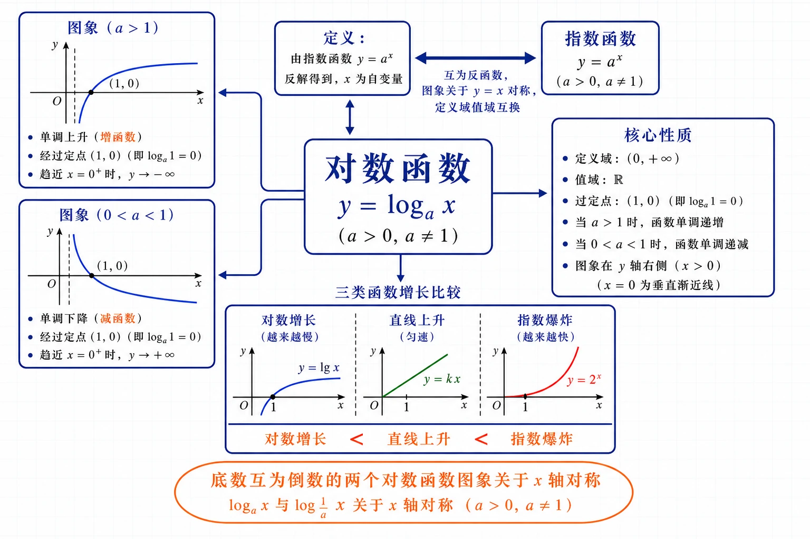
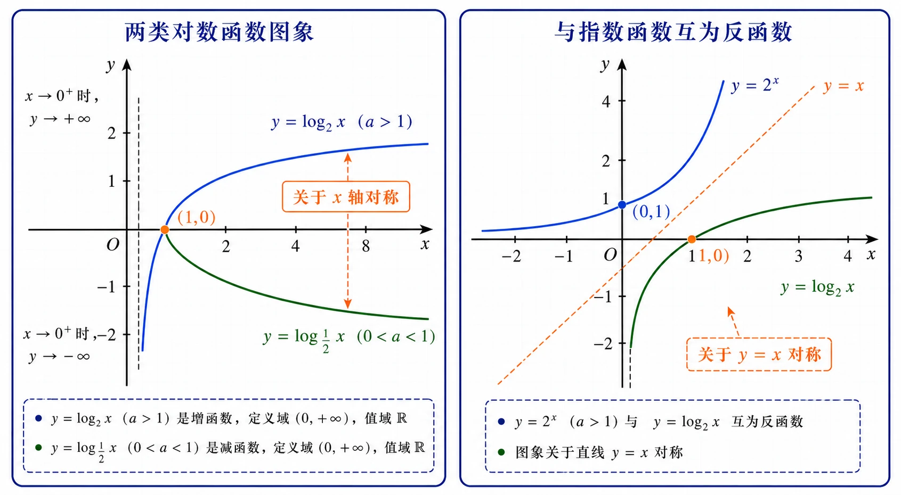
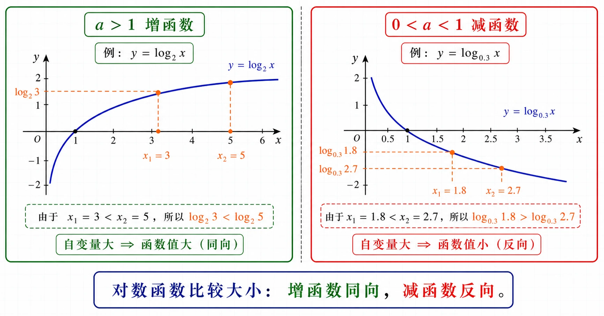
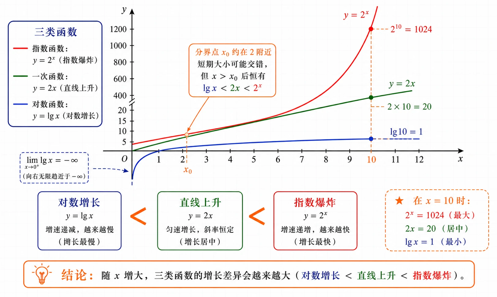

# 4.4 对数函数

<!-- 图片描述：本节整体知识信息结构图。浅网格背景，中心节点写“对数函数 $y=\log_a x$（$a>0,a\ne1$）”。中心向上引出“定义：由指数函数 $y=a^x$ 反解得到，$x$ 为自变量”，并用双向箭头连“指数函数 $y=a^x$”，标注“互为反函数，图象关于 $y=x$ 对称，定义域值域互换”。中心向左引出两类图象：上框画 $a>1$ 时单调上升的曲线，过 $(1,0)$，在 $y$ 轴右侧，标注“增函数”；下框画 $0<a<1$ 时单调下降的曲线，过 $(1,0)$，标注“减函数”。中心向右引出“核心性质”：定义域 $(0,+\infty)$、值域 $\mathbb R$、过定点 $(1,0)$（即 $\log_a1=0$）、$a>1$ 递增、$0<a<1$ 递减、图象在 $y$ 轴右侧。中心向下引出“三类函数增长比较”：左“对数增长（越来越慢，$y=\lg x$）”、中“直线上升（匀速，$y=kx$）”、右“指数爆炸（越来越快，$y=2^x$）”，用橙色箭头标注大小关系“对数增长 $<$ 直线上升 $<$ 指数爆炸”。用橙色椭圆框标注“底数互为倒数的两个对数函数图象关于 $x$ 轴对称”。黑色深蓝线条为主，LaTeX 公式风格。 -->

## 本节学习目标

- 理解对数函数 $y=\log_a x$（$a>0,a\ne1$）的概念，知道它是由指数函数 $y=a^x$ 反解而得，能从指数与对数的互逆关系理解对数函数。
- 掌握对数函数的图象特征和性质（定义域、值域、定点、单调性），能分 $a>1$ 和 $0<a<1$ 两种情况画出图象。
- 理解对数函数与指数函数互为反函数，知道它们的定义域与值域互换、图象关于直线 $y=x$ 对称。
- 会求对数型函数的定义域（真数大于 $0$、底数条件、复合函数等），会比较对数式的大小（同底单调性、不同底找中间量、底数分类讨论）。
- 理解对数函数底数互为倒数时图象关于 $x$ 轴对称（$\log_{1/a}x=-\log_a x$）。
- 对比一次函数、指数函数、对数函数的增长差异，理解“直线上升”“对数增长”“指数爆炸”的含义，能根据实际增长规律选择合适的函数模型。
- 能用对数函数解决 pH 计算、物价翻番、GDP 增长反求时间等实际问题。

## 核心知识点讲解

### 一、知识对象与问题情境

在 4.2 节我们用指数函数 $y=\left(\frac12\right)^{x/5730}$ 研究了碳14 含量 $y$ 随死亡时间 $x$ 的衰减规律。现在反过来问：已知碳14 含量 $y$，如何得知死亡了多长时间 $x$？利用指数与对数的互逆关系，由 $y=\left(\frac12\right)^{x/5730}$ 反解得 $x=5730\cdot\log_{\frac12}y$。这说明 $x$ 也是 $y$ 的函数——时间随碳14 含量变化。

一般地，由指数函数 $y=a^x$（$a>0,a\ne1$）反解得 $x=\log_a y$，$x$ 也是 $y$ 的函数。按习惯用 $x$ 表示自变量、$y$ 表示函数值，把字母对调，就得到 $y=\log_a x$。这就是**对数函数**。对数函数是指数函数的“逆运算函数”——指数函数解决“已知 $x$ 求 $a^x$”，对数函数解决“已知 $a^x$ 求 $x$”。

### 二、核心概念与定义条件

**对数函数的定义**：一般地，函数

$$
y=\log_a x\quad(a>0,\,a\ne1)
$$

叫作**对数函数**（logarithmic function），其中 $x$ 是自变量，定义域是 $(0,+\infty)$。

为什么定义域是 $(0,+\infty)$？因为对数的真数必须大于 $0$（$a^x>0$，故 $N>0$），所以自变量 $x$（作为真数）必须为正。这与指数函数 $y=a^x$ 的值域 $(0,+\infty)$ 恰好对应——指数函数的值域就是对数函数的定义域。

### 三、符号语言与等价表示

**对数函数与指数函数的反函数关系**：

| 项目 | 指数函数 $y=a^x$ | 对数函数 $y=\log_a x$ |
|---|---|---|
| 定义域 | $\mathbb R$ | $(0,+\infty)$ |
| 值域 | $(0,+\infty)$ | $\mathbb R$ |
| 定点 | $(0,1)$ | $(1,0)$ |
| 单调性（$a>1$） | 增函数 | 增函数 |
| 单调性（$0<a<1$） | 减函数 | 减函数 |

两者的定义域与值域恰好互换，它们**互为反函数**，图象关于直线 $y=x$ 对称。指数函数上的点 $(b,a^b)$ 对应对数函数上的点 $(a^b,b)$（坐标互换）。

**对数函数的图象与性质**（核心表格，分两种情况）：

| 项目 | $a>1$ | $0<a<1$ |
|---|---|---|
| 图象示意 | 在 $y$ 轴右侧、过 $(1,0)$ 向右上方上升 | 在 $y$ 轴右侧、过 $(1,0)$ 向右下方下降 |
| 定义域 | $(0,+\infty)$ | $(0,+\infty)$ |
| 值域 | $\mathbb R$ | $\mathbb R$ |
| 定点 | 过 $(1,0)$，即 $x=1$ 时 $y=0$ | 过 $(1,0)$，即 $x=1$ 时 $y=0$ |
| 单调性 | 在 $(0,+\infty)$ 上单调递增 | 在 $(0,+\infty)$ 上单调递减 |
| 当 $x>1$ 时 | $\log_a x>0$ | $\log_a x<0$ |
| 当 $0<x<1$ 时 | $\log_a x<0$ | $\log_a x>0$ |
| 渐近线 | $y$ 轴（$x=0$） | $y$ 轴（$x=0$） |

两条重要规律：

- **所有对数函数图象都过定点 $(1,0)$**，因为 $\log_a1=0$ 对任意 $a>0,a\ne1$ 成立。
- **底数互为倒数的两个对数函数图象关于 $x$ 轴对称**。因为由换底公式 $\log_{1/a}x=-\log_a x$，点 $(x,y)$ 与 $(x,-y)$ 关于 $x$ 轴对称。例如 $y=\log_2 x$ 与 $y=\log_{\frac12}x=-\log_2 x$ 关于 $x$ 轴对称。

<!-- 图片描述：对数函数两类图象与指数函数反函数关系对照图。分左右两部分。左部分标题“两类对数函数图象”：画第一象限和第四象限的坐标系。画 $y=\log_2 x$（$a>1$）：过 $(1,0)$ 向右上方缓慢上升，向左趋近 $y$ 轴下方（$y\to-\infty$）。画 $y=\log_{1/2}x$（$0<a<1$）：过 $(1,0)$ 向右下方下降，向左趋近 $y$ 轴上方（$y\to+\infty$）。用橙色标注定点 $(1,0)$，标注“关于 $x$ 轴对称”。右部分标题“与指数函数互为反函数”：画 $y=2^x$（过 $(0,1)$ 上升）和 $y=\log_2 x$（过 $(1,0)$ 上升），用橙色虚线画出 $y=x$ 直线，标注“关于 $y=x$ 对称”。黑色坐标轴。 -->

### 四、关键性质、定理与公式

**求对数型函数定义域的规则**：

- 真数大于 $0$：$\log_a f(x)$ 要求 $f(x)>0$（严格大于）。
- 底数大于 $0$ 且不等于 $1$：$\log_{g(x)}N$ 要求 $g(x)>0$ 且 $g(x)\ne1$。
- 分母不为 $0$、偶次根式被开方数非负等常规限制。
- 多个条件取交集。

**比较对数式大小的方法**：

| 情形 | 方法 | 依据 |
|---|---|---|
| 同底 $\log_a x_1$ 与 $\log_a x_2$（$a>1$） | $x_1<x_2\Rightarrow\log_a x_1<\log_a x_2$ | 增函数 |
| 同底 $\log_a x_1$ 与 $\log_a x_2$（$0<a<1$） | $x_1<x_2\Rightarrow\log_a x_1>\log_a x_2$ | 减函数 |
| 底数不确定 | 分 $a>1$ 和 $0<a<1$ 讨论 | 分类 |
| 不同底 | 找中间量 $0$（与定点 $(1,0)$ 联系）或化为同底 | 灵活 |

中间量法：当 $a>1$ 时，$x>1\Rightarrow\log_a x>0$；$0<x<1\Rightarrow\log_a x<0$。$0$ 是天然的分界值（来自定点 $(1,0)$）。

**三类函数的增长差异**（核心结论，$a>1,b>1,k>0$）：

| 函数 | 增长方式 | 特征 | 适合描述 |
|---|---|---|---|
| 对数函数 $y=\log_a x$ | 对数增长 | 随 $x$ 增大增长**越来越慢**，图象越来越平缓 | 增速放缓的现象 |
| 一次函数 $y=kx$ | 直线上升 | 保持**固定速度**增长 | 匀速变化 |
| 指数函数 $y=b^x$ | 指数爆炸 | 随 $x$ 增大增长**越来越快**，最终远超其他 | 快速膨胀 |

增长速度排序：**对数增长 $<$ 直线上升 $<$ 指数爆炸**。即随 $x$ 增大，存在 $x_0$，当 $x>x_0$ 时恒有 $\log_a x<kx<b^x$。

### 五、典型模型与解题方法

研究对数函数的路径（类比指数函数）：**解析式 $\to$ 定义域 $\to$ 画图象 $\to$ 值域 $\to$ 单调性 $\to$ 定点与渐近线 $\to$ 反函数关系 $\to$ 应用**。

**模型一：求对数型函数定义域**。列出真数 $>0$、底数条件等，取交集。

**模型二：比较对数式大小**。同底用单调性；底数不确定分类讨论；不同底找中间量 $0$。

**模型三：反函数关系**。指数函数 $y=a^x$ 与对数函数 $y=\log_a x$ 互为反函数，定义域值域互换，图象关于 $y=x$ 对称。

**模型四：对数函数图象变换**。$y=\log_a(x+b)$（左右平移）、$y=\log_a x+c$（上下平移）、$y=-\log_a x$（关于 $x$ 轴对称）、$y=\log_a|x|$（保留 $x>0$ 部分并关于 $y$ 轴翻折）。

**模型五：实际应用**。pH 计算（$\text{pH}=-\lg[H^+]$）、物价翻番（$t=\log_{1+p}w$）、GDP 增长反求时间等。

**模型六：增长模型选择**。根据实际增长规律（匀速/加速/减速）选择一次、指数或对数模型。

### 六、题型应用与迁移

本节题型分六类：①对数函数定义与定义域；②比较对数式大小（同底、分类、不同底）；③对数函数图象与性质（画图、定点、渐近线、对称性）；④反函数关系（定义域值域互换、$y=x$ 对称）；⑤三类函数增长比较与模型选择；⑥实际应用（pH、物价、GDP）。对数函数与指数函数互为反函数，是描述“增长越来越慢”现象的核心工具，在 4.5 节函数应用中将与指数函数、幂函数综合比较。

## 重点梳理

- **对数函数的定义域是 $(0,+\infty)$，不是全体实数**。因为对数真数必须 $>0$。这一点之所以重要，是因为它决定了对数函数图象只在 $y$ 轴右侧、定义域题必须从真数 $>0$ 出发。例如 $\log_2(x-3)$ 要求 $x-3>0$ 即 $x>3$。
- **对数函数恒过定点 $(1,0)$**。因 $\log_a1=0$。这与指数函数恒过 $(0,1)$ 形成对偶。判断一个图象是否可能是对数函数图象，看它是否过 $(1,0)$ 且只在 $y$ 轴右侧。
- **$a>1$ 递增、$0<a<1$ 递减**。这与指数函数单调性方向一致（同底数的指数函数和对数函数单调性相同）。触发条件：看到对数函数，第一反应问“底数大于 $1$ 还是小于 $1$”。
- **对数函数与指数函数互为反函数**。定义域与值域互换（$\mathbb R\leftrightarrow(0,+\infty)$），图象关于直线 $y=x$ 对称。指数函数上点 $(b,a^b)$ 对应对数函数上点 $(a^b,b)$。这条关系是理解两类函数的纽带。
- **底数互为倒数的两个对数函数图象关于 $x$ 轴对称**。$\log_{1/a}x=-\log_a x$。这与指数函数不同（指数函数底数互为倒数时关于 $y$ 轴对称）。可由一个图象翻折得到另一个。
- **对数增长越来越慢，适合描述“增速放缓”的现象**。$\lg10=1,\lg100=2,\lg1000=3,\lg10000=4$——真数增长 $10$ 倍，对数才增加 $1$。对数函数虽然单调递增（$a>1$），但增速递减，图象越来越平缓。这与指数爆炸形成鲜明对比。

## 难点突破

### 难点一：对数型函数定义域的求解

$\log_a f(x)$ 型函数要求真数 $f(x)>0$。如果是 $\log_{g(x)}N$ 型，还要底数 $g(x)>0$ 且 $g(x)\ne1$。多个对数相加（如 $\log_2(x-1)+\log_2(x+2)$），每个真数都要 $>0$，取交集。

突破方法：逐个列出每个对数的真数条件（和底数条件），用不等式组表示，求交集。例如 $y=\log_2(x^2-1)$ 要求 $x^2-1>0$ 即 $x<-1$ 或 $x>1$。

### 难点二：$0<a<1$ 时比较大小方向相反

$a>1$ 时 $\log_a x$ 递增，自变量大的函数值大；$0<a<1$ 时递减，自变量大的函数值反而小。初学者容易两个方向混用。

突破方法：记住“$0<a<1$ 的对数函数图象下降”，代入特殊值验证。如比较 $\log_{0.3}1.8$ 与 $\log_{0.3}2.7$：$0<0.3<1$ 减函数，$1.8<2.7$，所以 $\log_{0.3}1.8>\log_{0.3}2.7$（方向与增函数相反）。

<!-- 图片描述：对数函数比较大小方向对比图。分左右两栏。左栏标题“$a>1$ 增函数”：画 $y=\log_2 x$ 单调上升曲线，在 $x$ 轴上取两点 $x_1=3$（左）和 $x_2=5$（右），用橙色虚线向上投影到曲线，标注 $\log_2 3<\log_2 5$，用绿色箭头标注“自变量大 $\Rightarrow$ 函数值大（同向）”。右栏标题“$0<a<1$ 减函数”：画 $y=\log_{0.3}x$ 单调下降曲线，在 $x$ 轴上取两点 $x_1=1.8$（左）和 $x_2=2.7$（右），用橙色虚线向上投影到曲线，标注 $\log_{0.3}1.8>\log_{0.3}2.7$，用红色箭头标注“自变量大 $\Rightarrow$ 函数值小（反向）”。底部对比“增函数同向，减函数反向”。浅网格背景，黑色坐标轴。 -->

### 难点三：底数不确定时要分类讨论

比较 $\log_a5.1$ 与 $\log_a5.9$（$a>0,a\ne1$）：底数 $a$ 的大小不确定，需分两种情况。$a>1$ 时增函数，$5.1<5.9$，$\log_a5.1<\log_a5.9$；$0<a<1$ 时减函数，$5.1<5.9$，$\log_a5.1>\log_a5.9$。

突破方法：看到底数用字母表示且未给定范围，固定动作“分 $a>1$ 和 $0<a<1$ 讨论”。

### 难点四：反函数图象关于 $y=x$ 对称的理解

$y=2^x$ 上的点 $(1,2)$ 关于 $y=x$ 的对称点是 $(2,1)$，而 $(2,1)$ 正好在 $y=\log_2 x$ 上（$\log_2 2=1$）。一般地，$(b,2^b)$ 关于 $y=x$ 的对称点 $(2^b,b)$ 在 $y=\log_2 x$ 上。这是因为 $y=2^x\Leftrightarrow x=\log_2 y$，交换 $x,y$ 得 $y=\log_2 x$，坐标互换正是关于 $y=x$ 对称。

突破方法：理解“反函数就是交换 $x,y$”，交换坐标等价于关于 $y=x$ 对称。画图时先画一个函数再关于 $y=x$ 翻折得到另一个。

### 难点五：三类函数增长差异的把握

以 $y=2^x$（指数）、$y=2x$（线性）、$y=\lg x$（对数）为例：$x=10$ 时，$2^{10}=1024$，$2\times10=20$，$\lg10=1$；$x=20$ 时，$2^{20}\approx100$万，$2\times20=40$，$\lg20\approx1.3$。可见指数爆炸式增长远超线性，线性又远超对数。

突破方法：用具体数据比较三者。记住排序“对数 $<$ 线性 $<$ 指数”，以及“存在分界点 $x_0$，之后指数最大、对数最小”。

<!-- 图片描述：三类函数增长差异对比图。画第一象限坐标系。在同一坐标系中画三条曲线：蓝色 $y=\lg x$（对数增长，从 $-\infty$ 上升但越来越平缓，增速递减）、绿色 $y=2x$（直线上升，匀速）、红色 $y=2^x$（指数爆炸，一开始可能低于直线但急剧上升远超）。在 $x=10$ 处画橙色竖直虚线，标注三者函数值 $\lg10=1$、$2\times10=20$、$2^{10}=1024$，用数值大小直观展示差异。标注分界点 $x_0$ 附近“短期大小可能交错，但 $x>x_0$ 后恒有 $\lg x<2x<2^x$”。底部用橙色箭头排序“对数增长 $<$ 直线上升 $<$ 指数爆炸”，各标注增长特征。浅网格背景，黑色坐标轴。 -->

## 例题讲解

### 例1：求对数型函数的定义域

求下列函数的定义域：（1）$y=\log_{\frac12}(4-x)$；（2）$y=\log_2(x^2-1)$；（3）$y=\dfrac{1}{\lg x}$。

**审题：** 逐个列出真数（和底数、分母）条件，取交集。

**解：** （1）真数 $4-x>0$，即 $x<4$。定义域为 $(-\infty,4)$。

（2）真数 $x^2-1>0$，即 $(x-1)(x+1)>0$，解得 $x<-1$ 或 $x>1$。定义域为 $(-\infty,-1)\cup(1,+\infty)$。

（3）$\lg x$ 要求 $x>0$；分母 $\lg x\ne0$，即 $x\ne1$。综合：$x>0$ 且 $x\ne1$。定义域为 $(0,1)\cup(1,+\infty)$。

**检验：** （2）取 $x=2\in(1,+\infty)$，$\log_2(4-1)=\log_2 3$ 有意义 ✓；取 $x=0$，$\log_2(0-1)=\log_2(-1)$ 无意义 ✓（不在定义域）。

**反思：** 求定义域的核心是真数 $>0$。遇到分式还要分母 $\ne0$，遇到底数含变量还要底数 $>0$ 且 $\ne1$。所有条件取交集。

### 例2：比较对数式的大小

比较下列各题中两个值的大小：

（1）$\log_2 3.4$ 与 $\log_2 8.5$；（2）$\log_{0.3}1.8$ 与 $\log_{0.3}2.7$；（3）$\log_a5.1$ 与 $\log_a5.9$（$a>0,a\ne1$）。

**审题：** （1）（2）底数确定用单调性；（3）底数不确定分类讨论。

**解：** （1）$\log_2 3.4$ 和 $\log_2 8.5$ 看作 $y=\log_2 x$ 在 $x=3.4$ 和 $x=8.5$ 的值。因 $2>1$，$y=\log_2 x$ 是增函数。因 $3.4<8.5$，所以 $\log_2 3.4<\log_2 8.5$。

（2）$\log_{0.3}1.8$ 和 $\log_{0.3}2.7$ 看作 $y=\log_{0.3}x$ 在 $x=1.8$ 和 $x=2.7$ 的值。因 $0<0.3<1$，$y=\log_{0.3}x$ 是减函数。因 $1.8<2.7$，所以 $\log_{0.3}1.8>\log_{0.3}2.7$。

（3）底数 $a$ 不确定，分两种情况：

- 当 $a>1$ 时，$y=\log_a x$ 增函数，$5.1<5.9$，$\log_a5.1<\log_a5.9$。
- 当 $0<a<1$ 时，$y=\log_a x$ 减函数，$5.1<5.9$，$\log_a5.1>\log_a5.9$。

**反思：** 同底用单调性；$0<a<1$ 方向与 $a>1$ 相反；底数不确定必须分类讨论。

### 例3：物价翻番的对数模型

某地初始物价为 $1$，每年以 $5\%$ 的增长率递增，经过 $t$ 年后物价为 $w$。

（1）物价经过几年后翻一番（变为 $2$ 倍）？（2）物价从 $1$ 涨到 $10$ 需要多少年？

**审题：** 物价模型 $w=1.05^t$，反求 $t=\log_{1.05}w$。

**解：** 由题意 $w=1.05^t$（$t\ge0$）。由对数定义，$t=\log_{1.05}w$。

（1）翻一番即 $w=2$：$t=\log_{1.05}2=\dfrac{\lg2}{\lg1.05}\approx\dfrac{0.3010}{0.0212}\approx14.2$。所以约 $14$ 年后物价翻一番。

（2）$w=10$：$t=\log_{1.05}10=\dfrac{\lg10}{\lg1.05}=\dfrac{1}{0.0212}\approx47.2$。所以约 $47$ 年后物价涨到 $10$ 倍。

**反思：** 对数函数 $t=\log_{1.05}w$ 刻画了“达到给定物价所需年数”。从（1）（2）可以看出，物价从 $1$ 到 $2$ 需 $14$ 年，从 $1$ 到 $10$ 需 $47$ 年——每增加同样的倍数所需年数在变化（这是对数增长的特征）。

### 例4：溶液酸碱度 pH

溶液酸碱度用 pH 计量，$\text{pH}=-\lg[H^+]$，其中 $[H^+]$ 是氢离子浓度（mol/L）。

（1）说明 pH 与 $[H^+]$ 的变化关系；（2）纯净水 $[H^+]=10^{-7}$ mol/L，求 pH。

**审题：** pH 是 $[H^+]$ 的常用对数（取负）的函数，用对数函数单调性分析。

**解：** （1）$\text{pH}=-\lg[H^+]=\lg\dfrac{1}{[H^+]}$。在 $(0,+\infty)$ 上，随 $[H^+]$ 增大，$\dfrac{1}{[H^+]}$ 减小，$\lg\dfrac{1}{[H^+]}$ 减小（因 $y=\lg x$ 递增），即 pH 减小。所以**氢离子浓度越大，pH 越小，溶液酸性越强**。

（2）$[H^+]=10^{-7}$：$\text{pH}=-\lg10^{-7}=-(-7)=7$。纯净水的 pH 为 $7$（中性）。

**反思：** pH 是对数函数在化学中的经典应用。pH 每降低 $1$，$[H^+]$ 增大 $10$ 倍（因 $\Delta\text{pH}=1\Rightarrow\Delta\lg[H^+]=-1\Rightarrow[H^+]\times10$）。这是对数尺度的体现。

### 例5：反函数关系

写出指数函数 $y=2^x$ 的反函数，说明两者的定义域、值域和图象关系。

**解：** 由 $y=2^x$（$x\in\mathbb R$，$y\in(0,+\infty)$）反解得 $x=\log_2 y$。按习惯交换 $x,y$ 得反函数 $y=\log_2 x$。

| | $y=2^x$ | $y=\log_2 x$ |
|---|---|---|
| 定义域 | $\mathbb R$ | $(0,+\infty)$ |
| 值域 | $(0,+\infty)$ | $\mathbb R$ |

两者的定义域与值域恰好互换。图象关于直线 $y=x$ 对称：$y=2^x$ 上的点 $(1,2)$ 对应 $y=\log_2 x$ 上的点 $(2,1)$；$(0,1)$ 对应 $(1,0)$。

**反思：** 反函数的核心是“交换 $x,y$”，等价于图象关于 $y=x$ 对称。指数函数和对数函数互为反函数，是高中阶段最重要的反函数对。

## 易错点整理

- **错误表现**：把对数函数定义域写成 $\mathbb R$。
  - **错因分析**：忘记真数必须 $>0$。对数函数定义域是 $(0,+\infty)$，不是全体实数。
  - **正确处理**：定义域从真数 $>0$ 出发。$\log_a f(x)$ 要求 $f(x)>0$。

- **错误表现**：$0<a<1$ 时比较大小方向弄反。
  - **反例**：比较 $\log_{0.5}4$ 与 $\log_{0.5}8$，若用增函数逻辑得 $\log_{0.5}4<\log_{0.5}8$（错，实际 $-2>-3$）。
  - **正确处理**：$0<a<1$ 减函数，自变量大函数值小，方向与 $a>1$ 相反。

- **错误表现**：混淆指数函数定点 $(0,1)$ 和对数函数定点 $(1,0)$。
  - **正确处理**：指数函数 $a^0=1$ 过 $(0,1)$；对数函数 $\log_a1=0$ 过 $(1,0)$。两者坐标互换（反函数关系）。

- **错误表现**：底数不确定时不分类讨论，直接下结论。
  - **正确处理**：底数 $a$ 不确定时，分 $a>1$（增）和 $0<a<1$（减）两种情况讨论。

- **错误表现**：认为对数增长就是“不增长”。
  - **正确处理**：对数函数 $y=\log_a x$（$a>1$）仍单调递增，只是增长速度越来越慢（图象趋缓），不是停止增长。

- **错误表现**：求定义域时只考虑一个对数的真数，忽略多个真数的交集或分母条件。
  - **正确处理**：每个对数的真数都要 $>0$，分式分母 $\ne0$，所有条件取交集。

## 考点考证点整理

### 考点一：对数函数的定义域

- **出题思路**：求 $\log_a f(x)$、$\log_{g(x)}N$、含分式/根式的对数型函数的定义域。
- **关键条件**：真数 $>0$；底数 $>0$ 且 $\ne1$；分母 $\ne0$；偶次根式被开方数 $\ge0$。
- **解答要点**：逐个列出条件，用不等式（组）表示，求交集，用区间表示。
- **易扣分点**：只列一个条件遗漏其他；交集求错；真数写成 $\ge0$（应为 $>0$）；端点开闭错。

### 考点二：对数函数的图象与性质

- **出题思路**：画 $y=\log_a x$（$a>1$ 或 $0<a<1$）的图象；写定义域、值域、定点、单调性；给图象判断底数范围。
- **关键条件**：定义域 $(0,+\infty)$、值域 $\mathbb R$、定点 $(1,0)$、$a>1$ 增、$0<a<1$ 减；底数互为倒数图象关于 $x$ 轴对称。
- **解答要点**：分两种情况画图；注明定点 $(1,0)$、渐近线（$y$ 轴）、单调性。
- **易扣分点**：值域写成 $(0,+\infty)$（应为 $\mathbb R$）；定点写成 $(0,1)$（应为 $(1,0)$）；单调性方向与底数不对应。

### 考点三：比较对数式的大小

- **出题思路**：比较两个对数式（同底、不同底、底数含字母）。
- **关键条件**：底数与 $1$ 的关系（决定增减）；真数大小；底数不确定要分类。
- **解答要点**：同底用单调性；底数不确定分 $a>1$、$0<a<1$ 讨论；不同底找中间量 $0$（$\log_a x$ 与 $0$ 的关系由 $x$ 与 $1$ 的关系决定）。
- **易扣分点**：$0<a<1$ 方向弄反；不分类讨论；中间量选择不当。

### 考点四：反函数关系

- **出题思路**：写出指数函数的反函数；说明定义域值域互换和图象关于 $y=x$ 对称；由反函数性质求值。
- **关键条件**：$y=a^x$ 与 $y=\log_a x$ 互为反函数；定义域值域互换；图象关于 $y=x$ 对称。
- **解答要点**：由 $y=a^x$ 反解并交换 $x,y$ 得 $y=\log_a x$；定义域 $\mathbb R\leftrightarrow(0,+\infty)$ 互换。
- **易扣分点**：反函数写错（底数弄反）；定义域值域对应关系搞乱；忘记交换 $x,y$。

### 考点五：三类函数增长比较与模型选择

- **出题思路**：比较 $y=kx$、$y=\log_a x$、$y=b^x$ 的增长速度；给数据判断是哪种增长；根据实际情境选模型。
- **关键条件**：对数增长越来越慢、直线匀速、指数爆炸越来越快；存在分界点后 $\log_a x<kx<b^x$。
- **解答要点**：用数据或图象比较三者增速；排序“对数 $<$ 线性 $<$ 指数”；根据增速特征选模型。
- **易扣分点**：增长排序搞反；把对数增长误认为不增长；小范围内大小关系判断错（需看具体范围）。

### 考点六：实际应用（pH、物价、GDP）

- **出题思路**：pH 计算、物价/GDP 翻番反求时间、增长率模型反求。
- **关键条件**：$\text{pH}=-\lg[H^+]$；$w=(1+p)^t\Rightarrow t=\log_{1+p}w$；实际取整。
- **解答要点**：写出指数关系 $\to$ 用对数反求 $\to$ 换底为 $\lg$ 或 $\ln$ 计算 $\to$ 结合实际取整或解释。
- **易扣分点**：指数关系写错；对数反求时底数搞错；忘记取整；pH 与 $[H^+]$ 的关系判断错。

## 练习题

### 基础训练

1. 求下列函数的定义域：
   （1）$y=\log_3(x-2)$；（2）$y=\log_{\frac12}(4-x)$；（3）$y=\ln(1-x)$；（4）$y=\dfrac{1}{\lg x}$。
2. 写出对数函数 $y=\log_a x$（$a>0,a\ne1$）的定义域、值域、定点和单调性（分 $a>1$ 和 $0<a<1$）。
3. 比较下列各题中两个值的大小：
   （1）$\log_3 5$ 与 $\log_3 7$；（2）$\log_{0.5}6$ 与 $\log_{0.5}4$；（3）$\lg0.6$ 与 $\lg0.8$。
4. 在同一直角坐标系中画出 $y=\log_2 x$ 和 $y=\log_{\frac12}x$ 的图象，说明它们的关系。
5. 写出指数函数 $y=3^x$ 的反函数，并说明两者定义域、值域的关系。

### 巩固训练

1. 比较下列各题中两个值的大小：
   （1）$\log_{0.5}6$ 与 $\log_{0.5}4$；（2）$\log_m5$ 与 $\log_m7$（$m>0,m\ne1$）。
2. 求下列函数的定义域：
   （1）$y=\log_2(x^2-4)$；（2）$y=\log_{(x-1)}(3-x)$。
3. 某地去年 GDP 为 $3000$ 亿元，预计未来平均增长率为 $6.8\%$。经过几年该地 GDP 能达到 $3900$ 亿元？（精确到 $1$ 年）
4. 三个变量 $y_1,y_2,y_3$ 随 $x$ 变化的数据如下：

| $x$ | $0$ | $5$ | $10$ | $15$ | $20$ | $25$ | $30$ |
|---|---|---|---|---|---|---|---|
| $y_1$ | $5$ | $130$ | $505$ | $1130$ | $2005$ | $3130$ | $4505$ |
| $y_2$ | $5$ | $90$ | $1620$ | $29160$ | $524880$ | $9447840$ | $170061120$ |
| $y_3$ | $5$ | $30$ | $55$ | $80$ | $105$ | $130$ | $155$ |

   判断哪个变量呈指数增长？哪个呈线性增长？哪个可能呈对数增长（或二次函数型）？

5. 已知胃酸中氢离子浓度 $[H^+]=2.5\times10^{-2}$ mol/L，求胃酸的 pH（保留 $1$ 位小数）。

### 提升训练

1. 比较 $\log_2 3$ 与 $\log_3 4$ 的大小。（提示：可用换底公式化为同底，或借助中间量。）
2. 已知 $f(x)=\log_a x$（$a>1$），且 $f(2)>f(3)$ 是否成立？为什么？若 $0<a<1$ 呢？
3. 画出函数 $y=|\log_2(x-1)|$ 的图象，写出定义域、值域，并讨论单调性。
4. 某种产品的利润 $y$（万元）随投资额 $x$（万元）的增长规律近似满足 $y=\log_2 x$。投资额从 $4$ 万元增加到 $8$ 万元、从 $8$ 万元增加到 $16$ 万元，利润分别增加了多少？这体现了对数增长的什么特征？

## 练习题答案

### 基础训练答案

1. （1）$x-2>0$，$x>2$，定义域 $(2,+\infty)$。（2）$4-x>0$，$x<4$，定义域 $(-\infty,4)$。（3）$1-x>0$，$x<1$，定义域 $(-\infty,1)$。（4）$x>0$ 且 $\lg x\ne0$ 即 $x\ne1$，定义域 $(0,1)\cup(1,+\infty)$。
2. 定义域 $(0,+\infty)$；值域 $\mathbb R$；定点 $(1,0)$（即 $x=1$ 时 $y=0$）；$a>1$ 时在 $(0,+\infty)$ 上单调递增，$0<a<1$ 时单调递减。
3. （1）$3>1$ 增函数，$5<7$，$\log_3 5<\log_3 7$。（2）$0<0.5<1$ 减函数，$6>4$，$\log_{0.5}6<\log_{0.5}4$。（3）$10>1$ 增函数，$0.6<0.8$，$\lg0.6<\lg0.8$。
4. $y=\log_2 x$（$a>1$）过 $(1,0)$ 在 $y$ 轴右侧向右上方上升；$y=\log_{1/2}x=-\log_2 x$（$0<a<1$）过 $(1,0)$ 向右下方下降。因 $\log_{1/2}x=-\log_2 x$，两图象关于 $x$ 轴对称。
5. $y=3^x$（定义域 $\mathbb R$，值域 $(0,+\infty)$）的反函数是 $y=\log_3 x$（定义域 $(0,+\infty)$，值域 $\mathbb R$）。两者定义域与值域互换，图象关于 $y=x$ 对称。

### 巩固训练答案

1. （1）$0<0.5<1$ 减函数，$6>4$，$\log_{0.5}6<\log_{0.5}4$。（2）底数 $m$ 不确定，分类讨论：$m>1$ 时增函数，$5<7$，$\log_m5<\log_m7$；$0<m<1$ 时减函数，$5<7$，$\log_m5>\log_m7$。
2. （1）$x^2-4>0$，$(x-2)(x+2)>0$，$x<-2$ 或 $x>2$，定义域 $(-\infty,-2)\cup(2,+\infty)$。
   （2）底数条件：$x-1>0$ 且 $x-1\ne1$，即 $x>1$ 且 $x\ne2$；真数条件：$3-x>0$ 即 $x<3$。综合：$1<x<3$ 且 $x\ne2$，定义域 $(1,2)\cup(2,3)$。
3. $y=3000\times1.068^x=3900$，$1.068^x=1.3$，$x=\log_{1.068}1.3=\dfrac{\lg1.3}{\lg1.068}=\dfrac{0.1139}{0.0286}\approx3.98$。所以约 $4$ 年后 GDP 达到 $3900$ 亿元。
4. $y_1$：相邻项之差 $125,375,625,875,1125,1375$，差递增但不恒定，呈二次函数型（$y_1\approx5x^2$，$x$ 以 $5$ 为单位）。$y_2$：相邻项比值 $\frac{90}{5}=18,\frac{1620}{90}=18,\ldots$，比值恒为 $18$，呈**指数增长**（$y_2=5\times18^{x/5}$）。$y_3$：相邻项之差恒为 $25$，呈**线性增长**（$y_3=5x$，$x$ 以 $5$ 为单位）。所以 $y_2$ 指数增长，$y_3$ 线性增长，$y_1$ 为二次函数型（增速介于线性和指数之间）。
5. $\text{pH}=-\lg[H^+]=-\lg(2.5\times10^{-2})=-(\lg2.5+\lg10^{-2})=-(0.398-2)=-(-1.602)=1.602\approx1.6$。胃酸 pH 约 $1.6$（强酸性）。

### 提升训练答案

1. 用换底公式化为常用对数比较：$\log_2 3=\dfrac{\lg3}{\lg2}\approx\dfrac{0.4771}{0.3010}\approx1.585$；$\log_3 4=\dfrac{\lg4}{\lg3}=\dfrac{2\lg2}{\lg3}\approx\dfrac{0.6020}{0.4771}\approx1.262$。因 $1.585>1.262$，所以 $\log_2 3>\log_3 4$。
2. $f(x)=\log_a x$（$a>1$）是增函数，$2<3$ 故 $f(2)<f(3)$，$f(2)>f(3)$ **不成立**。若 $0<a<1$，$f(x)$ 是减函数，$2<3$ 故 $f(2)>f(3)$，此时**成立**。所以 $f(2)>f(3)$ 当且仅当 $0<a<1$ 时成立。
3. $y=|\log_2(x-1)|$：先要求 $x-1>0$ 即 $x>1$。设 $u=x-1>0$，$y=|\log_2 u|$。当 $u\ge1$（$x\ge2$）时 $\log_2 u\ge0$，$y=\log_2 u$ 单调递增；当 $0<u<1$（$1<x<2$）时 $\log_2 u<0$，$y=-\log_2 u$ 单调递减（因 $\log_2 u$ 递增，$-\log_2 u$ 递减）。**定义域** $(1,+\infty)$；**值域** $[0,+\infty)$（因 $|\log_2 u|\ge0$，且当 $u=1$ 即 $x=2$ 时取 $0$）；**单调性**：在 $(1,2]$ 上单调递减，在 $[2,+\infty)$ 上单调递增。图象：$x=2$ 时 $y=0$（最小值），向两侧 $y$ 增大；$x\to1^+$ 时 $\log_2(x-1)\to-\infty$，$y\to+\infty$；$x\to+\infty$ 时 $y\to+\infty$。图象呈“V”形（关于 $x=2$ 对称）。
4. $y=\log_2 x$：$x=4$ 时 $y=2$；$x=8$ 时 $y=3$；$x=16$ 时 $y=4$。从 $4$ 到 $8$（投资翻倍），利润增加 $3-2=1$ 万元；从 $8$ 到 $16$（投资再翻倍），利润增加 $4-3=1$ 万元。虽然投资额每次翻倍（增加量越来越大：$4\to8$ 增加 $4$，$8\to16$ 增加 $8$），但利润增加量恒为 $1$。这体现了**对数增长“增速越来越慢”**的特征——投入成倍增加，产出增幅却保持不变甚至相对递减。这也说明对数函数适合描述“边际效益递减”的现象。
