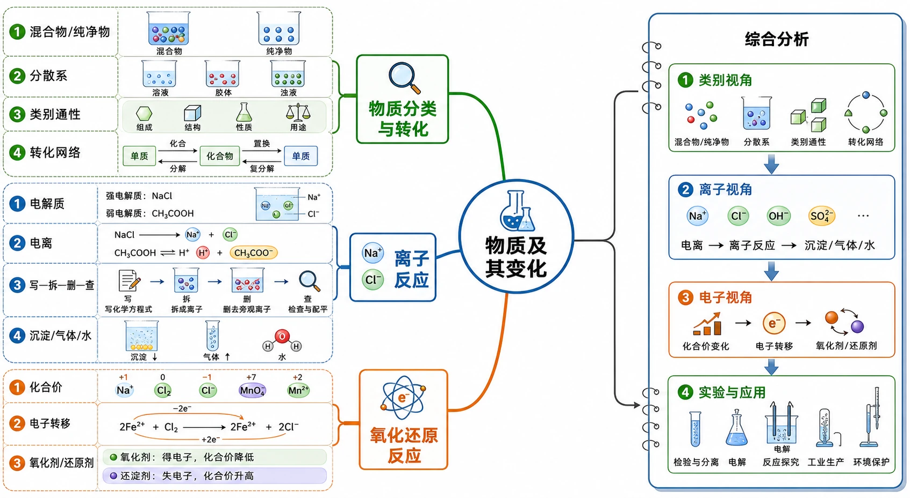
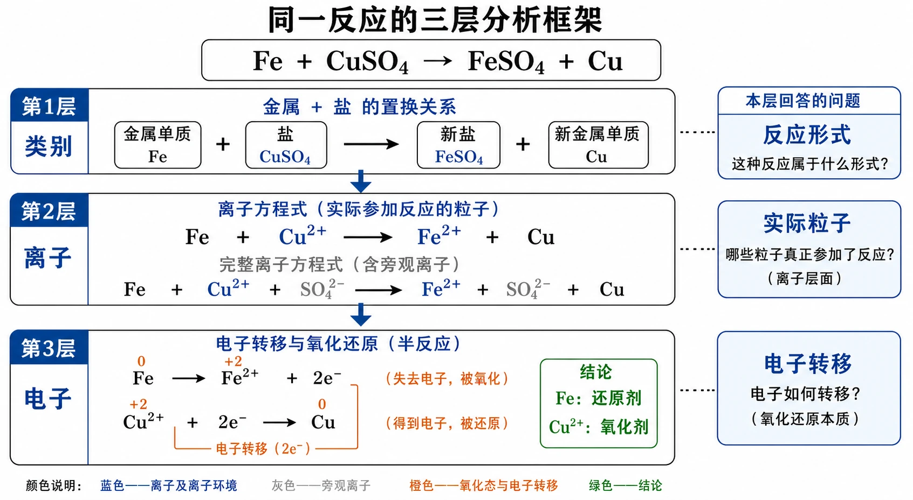
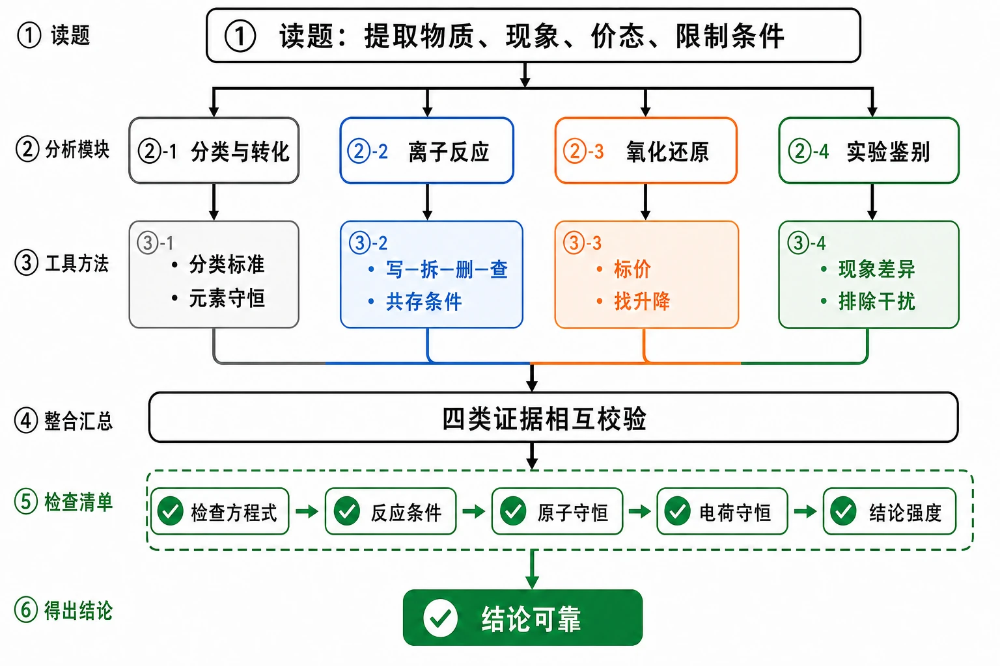
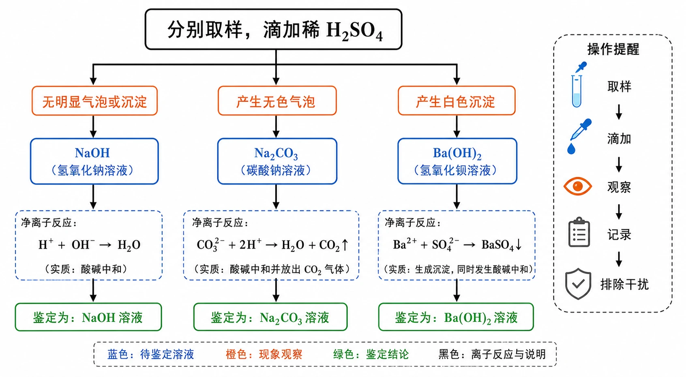

# 章末 整理与提升

## 知识关系导航

- 所属章节：[[章首 学习导图|第一章 物质及其变化]]。
- 类别视角：[[第一节 物质的分类及转化#二、核心概念与物质分类|物质分类与类别通性]]解决“物质是什么、可能怎样转化”。
- 微粒视角：[[第二节 离子反应#三、关键规律、反应原理与方程式|离子反应与离子方程式]]解决“溶液中哪些微粒真正变化”。
- 电子视角：[[第三节 氧化还原反应#三、关键规律、反应原理与方程式|化合价升降与电子转移]]解决“电子从哪里转移到哪里”。


<!-- 图片描述：第一章整体知识结构图。中心写“物质及其变化”，一级分支为“物质分类与转化、离子反应、氧化还原反应”；分类分支展开混合物/纯净物、分散系、类别通性和转化网络；离子反应分支展开电解质、电离、写拆删查、沉淀/气体/水；氧化还原分支展开化合价、电子转移、氧化剂/还原剂。三条分支在右侧汇入“综合分析：类别视角→离子视角→电子视角→实验与应用”。用蓝色表示溶液与离子，绿色表示分类和生成物，橙色表示反应条件、沉淀、气体和电子转移；白色背景、黑灰线稿、LaTeX风格化学式，形成章末复习路线图。 -->

## 本节学习目标

完成本章后，应能：

1. 把物质分类、物质转化、离子反应和氧化还原反应整合成知识网络。
2. 从物质类别、溶液离子和电子转移三个角度分析同一化学反应。
3. 根据宏观现象写出微观解释、化学方程式或离子方程式。
4. 综合运用分类标准、离子共存、化合价变化解决判断和推断问题。
5. 设计物质鉴别、除杂和制备方案，并从条件、现象、安全和分离角度评价。

## 核心知识点讲解

### 一、知识对象与物质情境

章末复习要把三条主线连起来：先用分类认识物质及其可能性质，再用离子解释水溶液中的反应，最后用化合价和电子转移判断氧化还原过程。综合题的关键不是一次完成所有判断，而是依次回答“是什么类别、哪些微粒反应、哪些元素变价、实验现象能证明什么”。

### 二、核心概念与物质分类

物质分类有两条常用线索：

- 按组成：混合物、纯净物、单质、化合物、氧化物、酸、碱、盐等。
- 按性质：酸性氧化物、碱性氧化物、氧化剂、还原剂、可溶盐、难溶盐等。

分散系按分散质粒子直径分类：溶液小于$1\ \mathrm{nm}$，胶体为$1$～$100\ \mathrm{nm}$，乳浊液或悬浊液大于$100\ \mathrm{nm}$。

### 三、关键规律、反应原理与方程式

不同类别物质之间的转化常围绕以下网络展开：

```text
金属单质 -> 碱性氧化物 -> 碱 -> 盐
非金属单质 -> 酸性氧化物 -> 酸 -> 盐
```

离子反应的核心是实际参加反应的离子，例如：

$$
Ba^{2+} + SO_{4}^{2-} = BaSO_{4}\downarrow
$$

氧化还原反应的核心是电子转移和化合价变化：化合价升高的是还原剂，被氧化；化合价降低的是氧化剂，被还原。


<!-- 图片描述：同一反应的三层分析框架图。以$Fe+CuSO_{4}=FeSO_{4}+Cu$为中心示例，第一层“类别”标出单质与盐的置换关系；第二层“离子”写出$Fe+Cu^{2+}=Fe^{2+}+Cu$并灰化旁观离子；第三层“电子”标出$Fe$由0升至+2、$Cu$由+2降至0，得出$Fe$为还原剂、$Cu^{2+}$为氧化剂。三层用向下箭头连接，右侧总结各层回答的问题。白色背景、黑灰线稿，蓝色离子环境、橙色价态与电子转移、绿色结论，化学符号采用LaTeX风格。 -->

### 四、典型转化模型与分析方法

1. 综合判断三步法：先分类，再看离子，再标价态。
2. 离子方程式审查法：写、拆、删、查。
3. 氧化还原分析法：标价态、找升降、定剂类、写结论。
4. 物质鉴别法：选择能产生不同现象的试剂，现象要能区分所有待测物。


<!-- 图片描述：章末综合题通用解题流程图。起点为“读题并提取物质、现象、价态、限制条件”，随后依次分支到“分类与转化、离子反应、氧化还原、实验鉴别”，各分支分别列出核心工具“分类标准/元素守恒、写拆删查/共存条件、标价找升降、现象差异/排除干扰”，最后汇入“检查方程式、条件、原子与电荷守恒、结论强度”。白色背景、黑灰线稿，蓝色表示离子步骤，橙色表示变价和警示，绿色表示结论与检查通过，符号采用LaTeX风格。 -->

### 五、实验现象、装置与证据

本章涉及的证据链包括：丁达尔效应用于区分胶体和溶液；导电性实验证明电解质溶液或熔融状态中存在自由移动离子；沉淀、气体、水的生成证明离子反应发生；价态变化证明氧化还原反应发生。

实验作答应坚持“操作→现象→微观解释→符号表达→结论”。例如，向含$SO_{4}^{2-}$的溶液中加入可溶性钡盐，观察到白色沉淀，可用$Ba^{2+}+SO_{4}^{2-}=BaSO_{4}\downarrow$表示反应实质；但若试剂可能引入干扰离子，还要先排除干扰，不能只凭单一现象过度推断。

### 六、题型应用与迁移

章末综合题通常把多个知识点合并考查，如分类与方程式、离子方程式与物质鉴别、氧化还原与真实材料、古文材料与化学反应推断。答题时要把材料语言翻译成化学语言。

## 重点梳理

| 重点 | 为什么重要 | 什么时候用 | 怎么用 |
| --- | --- | --- | --- |
| 分类标准 | 标准不同，物质归属可能不同 | 分类、选异类和物质性质预测 | 先写按组成、性质或粒子尺度分类，再给出类别与依据 |
| 物质转化 | 它把类别通性落实为具体反应 | 转化链、制备路线、方案评价 | 逐步选择反应对象，检查元素守恒、条件、现象、产物分离和安全 |
| 离子反应 | 它揭示水溶液反应的微观实质 | 离子方程式、共存、鉴别、除杂 | 按“写、拆、删、查”，检查沉淀、气体、水、反应事实和电荷守恒 |
| 氧化还原 | 它揭示电子转移和价态变化 | 判断剂类、价态转化、生产生活材料 | 标价、找升降、定剂类，并写清“氧化剂被还原、还原剂被氧化” |
| 三层分析 | 同一反应常同时涉及类别、离子和电子 | 章末综合题、实验推断题 | 依次分析物质类别、实际反应离子、变价元素，避免把不同层次混在一句中 |
| 实验证据链 | 现象是判断微粒和反应的依据 | 鉴别、推断、方案设计 | 按“操作→现象→解释→方程式→结论”表达，并排除试剂引入的干扰 |

## 难点突破

1. 章末题为什么容易混？

因为同一道题可能同时要求分类、写方程式、判断离子反应和判断氧化还原。解决方法是分层处理：类别层看物质，离子层看水溶液，电子层看价态。

2. 物质鉴别题怎么选试剂？

试剂必须让每种待测物出现不同现象。例如鉴别$NaOH$、$Na_{2}CO_{3}$、$Ba(OH)_{2}$，可选稀硫酸：$NaOH$无明显气泡或沉淀，$Na_{2}CO_{3}$产生气泡，$Ba(OH)_{2}$生成白色沉淀。


<!-- 图片描述：单一试剂鉴别三种无色溶液的决策树。起点写“分别取样，加入稀$H_{2}SO_{4}$”，分成三条现象路径：“无明显气泡或沉淀→$NaOH$”“产生无色气泡→$Na_{2}CO_{3}$”“产生白色沉淀→$Ba(OH)_{2}$”；每条路径下写对应净离子变化，并在右侧增加“取样、滴加、观察、记录、排除干扰”的操作提醒。白色背景、黑灰线稿，蓝色表示溶液，橙色表示气泡和沉淀现象，绿色表示鉴别结论，化学符号采用LaTeX风格。 -->

3. 推断题如何避免过度判断？

只把实验现象必然推出的物质写成“肯定含有”，不能由现象无法区分的信息写成肯定结论。

## 例题讲解

### 例题

现有$NaOH$、$Na_{2}CO_{3}$和$Ba(OH)_{2}$三种无色溶液，选用一种试剂把它们鉴别出来，并写出反应的化学方程式和离子方程式。

### 分析

要一次区分三种溶液，所选试剂应让三者现象不同。稀硫酸与$NaOH$只发生中和，无明显现象；与$Na_{2}CO_{3}$产生$CO_{2}$气体；与$Ba(OH)_{2}$生成$BaSO_{4}$白色沉淀。

### 答案

选用稀硫酸。

$$
2NaOH + H_{2}SO_{4} = Na_{2}SO_{4} + 2H_{2}O
$$

$$
H^{+} + OH^{-} = H_{2}O
$$

$$
Na_{2}CO_{3} + H_{2}SO_{4} = Na_{2}SO_{4} + H_{2}O + CO_{2}\uparrow
$$

$$
CO_{3}^{2-} + 2H^{+} = H_{2}O + CO_{2}\uparrow
$$

$$
Ba(OH)_{2} + H_{2}SO_{4} = BaSO_{4}\downarrow + 2H_{2}O
$$

$$
Ba^{2+} + 2OH^{-} + 2H^{+} + SO_{4}^{2-} = BaSO_{4}\downarrow + 2H_{2}O
$$

### 反思

鉴别题的答案不只写试剂，还必须写三种现象和对应反应依据。

## 易错点整理

| 常见错误表现 | 错因分析 | 反例或警示 | 正确处理步骤 |
| --- | --- | --- | --- |
| 分类题只写类别，不写标准 | 忽略分类结论依赖分类角度 | $Na_{2}CO_{3}$既可说钠盐，也可说碳酸盐 | 先写“按……分类”，再给出分组和判断依据 |
| 转化链只写箭头，不写条件 | 把可能性当成实际可行性 | $CaCO_{3}$分解必须高温 | 每一步补反应物、产物、条件和现象，再检查配平 |
| 离子方程式把难溶物、水、气体或单质拆开 | 机械套用“电解质都拆” | $BaSO_{4}$、$H_{2}O$、$CO_{2}$、$Fe$均应保留化学式 | 按溶解性、电离程度和物质状态决定拆写，并检查电荷守恒 |
| 把氧化剂和还原剂说反 | 混淆“使别人发生的反应”和“自身变化” | 氧化剂得到电子，本身被还原 | 使用“升失氧还、降得还氧”并限定剂类必须是反应物 |
| 选择题只报选项 | 没有展示判断证据 | 正确结论可能来自偶然猜测 | 至少写出关键化学式、冲突离子、变价元素或排除理由 |
| 推断题把可能成分写成肯定成分 | 没区分充分条件和必要条件 | 同一白色沉淀可能由不同离子组合生成 | 每一步只写现象必然支持的结论，并检查后续试剂是否引入干扰离子 |

## 考点考证点整理

### 考点一：章末知识网络构建

- 出题思路：要求画图、列表或填写框图，整理物质分类、反应分类和物质转化关系。
- 关键条件：分类标准必须明确，转化关系要能对应具体反应。
- 解答要点：用“组成/性质/粒子/电子转移”建立多角度框架，并至少配一个典型方程式。
- 易扣分点：只画名词框架，没有反应依据或例子。

### 考点二：综合分类与方程式

- 出题思路：给出多组物质，要求找不属于同类的物质，并进一步写出反应方程式。
- 关键条件：要同时利用组成、性质和反应事实。
- 解答要点：先写分类依据，再写不属于该类别的物质，最后配平方程式。
- 易扣分点：分类依据和所选物质不匹配。

### 考点三：离子方程式正误与共存

- 出题思路：给出离子方程式或离子组，要求判断正误或能否大量共存。
- 关键条件：沉淀、气体、水生成；离子方程式的拆写、电荷守恒和事实。
- 解答要点：逐项指出错误原因，如“不该拆”“电荷不守恒”“产物应为气体和水”。
- 易扣分点：只写选项，不写判断依据。

### 考点四：氧化还原材料题

- 出题思路：以维生素C、黑火药、废水处理、火法炼锌等材料考查氧化剂和还原剂。
- 关键条件：材料中给出的价态变化是核心证据。
- 解答要点：标出变价元素，指出谁升价谁降价，再判断氧化剂和还原剂。
- 易扣分点：不计算复杂离子中的元素价态。

### 考点五：物质鉴别与离子推断

- 出题思路：给出几种无色溶液或白色粉末实验现象，要求选择试剂、判断成分。
- 关键条件：沉淀是否溶于酸、是否放出气体、是否与$AgNO_{3}$产生沉淀。
- 解答要点：逐步把现象转化为离子判断，并区分“肯定含有”和“可能含有”。
- 易扣分点：忽略引入试剂带来的离子，导致误判。

## 练习题

### 基础训练

1. 分别找出下列各组中与其余物质类别不同的一种，并说明分类标准：A.$CaO$、$MgO$、$CuO$、$CO_{2}$；B.$C$、$S$、$P$、$Cu$；C.$Fe$、$Al$、$Zn$、$O_{2}$；D.$HCl$、$H_{2}SO_{4}$、$HNO_{3}$、$H_{2}O$。铜在潮湿空气中可与$O_{2}$、$CO_{2}$和$H_{2}O$形成碱式碳酸铜$Cu_{2}(OH)_{2}CO_{3}$，写出总反应方程式。
2. 维生素C能把不易吸收的$Fe^{3+}$转变为易吸收的$Fe^{2+}$。判断维生素C表现氧化性还是还原性，并说明依据。
3. 黑火药反应为$S+2KNO_{3}+3C=K_{2}S+N_{2}\uparrow+3CO_{2}\uparrow$。标出变价元素，判断氧化剂和还原剂。
4. 工业废水中的$Cr_{2}O_{7}^{2-}$可用$Fe^{2+}$处理，反应后铬主要为$Cr^{3+}$，铁主要为$Fe^{3+}$。判断氧化剂、还原剂和被氧化的离子。
5. 火法炼锌可用$ZnCO_{3}$与$C$在高温下反应，生成$Zn$和$CO$。配平方程式并判断还原剂和被还原物质。

### 巩固训练

6. 下列哪组物质依次属于化合物、单质、混合物？A.烧碱、液氧、碘酒；B.氯化氢、铁粉、蒸馏水；C.空气、氮气、食盐水；D.碳酸钙、汽水、铜。说明其余各组不符合的原因。
7. 判断下列离子方程式，选出正确的一项并改正其余各项：A.$2Fe+6H^{+}=2Fe^{3+}+3H_{2}\uparrow$；B.$MgO+2H^{+}=Mg^{2+}+H_{2}O$；C.$CuSO_{4}+2OH^{-}=Cu(OH)_{2}\downarrow+SO_{4}^{2-}$；D.$AgNO_{3}+Cl^{-}=AgCl\downarrow+NO_{3}^{-}$。
8. 下列哪组离子能大量共存？A.$H^{+}$、$Na^{+}$、$CO_{3}^{2-}$、$Cl^{-}$；B.$K^{+}$、$Mg^{2+}$、$NO_{3}^{-}$、$OH^{-}$；C.$Na^{+}$、$K^{+}$、$Cl^{-}$、$NO_{3}^{-}$；D.$Ba^{2+}$、$Na^{+}$、$SO_{4}^{2-}$、$Cl^{-}$。写出不能共存时的反应实质。
9. 判断下列哪项转化需要加入氧化剂，并说明依据：A.$CuO\rightarrow Cu$；B.$Fe^{2+}\rightarrow Fe^{3+}$；C.$CaCO_{3}\rightarrow CaCl_{2}$；D.$Fe^{3+}\rightarrow Fe^{2+}$。
10. 古代记载“曾青得铁则化为铜”，可用$Fe+CuSO_{4}=FeSO_{4}+Cu$表示。判断下列说法是否正确：①铁置换出铜；②$Fe$比$Cu$活泼；③铁在反应中被氧化；④任意金属都能从盐溶液中置换出另一种金属。写出离子方程式。

### 提升训练

11. 用化学方程式表示$C$、$CO$、$CO_{2}$、$CaCO_{3}$之间的转化，注明必要条件；判断其中哪些属于氧化还原反应，并指出氧化剂和还原剂。
12. 只选一种试剂鉴别$NaOH$、$Na_{2}CO_{3}$和$Ba(OH)_{2}$三种无色溶液。写出操作、三种现象、化学方程式和离子方程式。
13. 某白色粉末可能含$Ba(NO_{3})_{2}$、$CaCl_{2}$、$K_{2}CO_{3}$。加水后出现白色沉淀；加入过量稀$HNO_{3}$后沉淀完全溶解并放出气体；再滴加$AgNO_{3}$溶液又出现白色沉淀。判断肯定含有和可能含有的物质，说明每一步依据并写出关键离子方程式。

## 练习题答案

1. A组中$CO_{2}$不属于碱性氧化物；B组可按非金属单质分类，$Cu$不属于非金属单质；C组按金属单质分类，$O_{2}$不属于金属单质；D组按酸分类，$H_{2}O$不属于酸。生成碱式碳酸铜可写：

$$
2Cu + O_{2} + CO_{2} + H_{2}O = Cu_{2}(OH)_{2}CO_{3}
$$

2. 维生素C具有还原性。$Fe^{3+}$变为$Fe^{2+}$是化合价降低、被还原，说明维生素C使其还原，自身作还原剂。

3. $C$由0价升高到+4价，是还原剂；$S$由0价降为-2价，$KNO_{3}$中$N$由+5价降为0价，$S$和$KNO_{3}$是氧化剂。

4. $Cr_{2}O_{7}^{2-}$中$Cr$由$+6$价降为$+3$价，因此$Cr_{2}O_{7}^{2-}$是氧化剂；$Fe^{2+}$由$+2$价升为$+3$价，是还原剂并被氧化。

5. 火法炼锌可理解为：

$$
ZnCO_{3} + 2C \xrightarrow{高温} Zn + 3CO\uparrow
$$

$C$作还原剂，$ZnCO_{3}$中的$Zn$由+2价降为0价，$ZnCO_{3}$被还原。若按分步理解，也可先分解$ZnCO_{3}$再用碳还原$ZnO$。

6. 选A。烧碱$NaOH$是化合物，液氧$O_{2}$是单质，碘酒是混合物。B中蒸馏水是化合物，不是混合物；C中空气是混合物，不是化合物；D中汽水是混合物，不是单质，铜是单质而不是混合物。

7. 选B。A中铁与非氧化性稀酸反应通常生成$Fe^{2+}$，正确式为$Fe+2H^{+}=Fe^{2+}+H_{2}\uparrow$；C中$CuSO_{4}$是可溶性盐，应拆写，正确式为$Cu^{2+}+2OH^{-}=Cu(OH)_{2}\downarrow$；D中$AgNO_{3}$应拆写，正确式为$Ag^{+}+Cl^{-}=AgCl\downarrow$。

8. 选C，其中离子间不生成沉淀、气体、水，也不发生明显氧化还原反应。A中$2H^{+}+CO_{3}^{2-}=H_{2}O+CO_{2}\uparrow$；B中$Mg^{2+}+2OH^{-}=Mg(OH)_{2}\downarrow$；D中$Ba^{2+}+SO_{4}^{2-}=BaSO_{4}\downarrow$。

9. 选B。$Fe^{2+}\rightarrow Fe^{3+}$中铁元素化合价升高，需要加入氧化剂。A中$Cu$由$+2$价降到0价，D中$Fe$由$+3$价降到$+2$价，都需要还原剂；C中各元素化合价不变，不需要用氧化还原方法实现。

10. ①②③正确，④错误。铁能置换铜，说明$Fe$比$Cu$活泼；反应中$Fe$由0价升为$+2$价，被氧化。离子方程式为$Fe+Cu^{2+}=Fe^{2+}+Cu$。金属能否从盐溶液中置换另一金属，还要考虑金属活动性、盐的可溶性以及金属与水的反应等条件，不能绝对化。

11. 示例：

$$
2C + O_{2} \xrightarrow{\text{点燃，氧气不足}} 2CO
$$

$$
2CO + O_{2} \xrightarrow{\text{点燃}} 2CO_{2}
$$

$$
CO_{2} + Ca(OH)_{2} = CaCO_{3}\downarrow + H_{2}O
$$

$$
C + O_{2} \xrightarrow{\text{点燃}} CO_{2}
$$

$$
CaCO_{3} \xrightarrow{高温} CaO + CO_{2}\uparrow
$$

其中碳或一氧化碳燃烧属于氧化还原反应，$O_{2}$是氧化剂，$C$或$CO$是还原剂；$CO_{2}$与$Ca(OH)_{2}$、$CaCO_{3}$分解通常不按氧化还原处理。

12. 可选稀$H_{2}SO_{4}$。分别取少量三种溶液于试管中，逐滴加入稀$H_{2}SO_{4}$：无明显气泡或沉淀的是$NaOH$，产生无色气泡的是$Na_{2}CO_{3}$，产生白色沉淀的是$Ba(OH)_{2}$。

$$
2NaOH + H_{2}SO_{4} = Na_{2}SO_{4} + 2H_{2}O
$$

$$
H^{+} + OH^{-} = H_{2}O
$$

$$
Na_{2}CO_{3} + H_{2}SO_{4} = Na_{2}SO_{4} + H_{2}O + CO_{2}\uparrow
$$

$$
CO_{3}^{2-} + 2H^{+} = H_{2}O + CO_{2}\uparrow
$$

$$
Ba(OH)_{2} + H_{2}SO_{4} = BaSO_{4}\downarrow + 2H_{2}O
$$

$$
Ba^{2+} + 2OH^{-} + 2H^{+} + SO_{4}^{2-} = BaSO_{4}\downarrow + 2H_{2}O
$$

13. 加水有白色沉淀，说明可能有$BaCO_{3}$或$CaCO_{3}$生成，原粉末中肯定有$K_{2}CO_{3}$，且$Ba(NO_{3})_{2}$、$CaCl_{2}$至少含一种。加过量稀硝酸沉淀消失并有气泡，符合碳酸盐沉淀：

$$
CO_{3}^{2-} + 2H^{+} = H_{2}O + CO_{2}\uparrow
$$

再滴加$AgNO_{3}$有白色沉淀，可能是原来含$CaCl_{2}$带来的$Cl^{-}$，也可能受加入盐酸以外试剂影响；本题使用稀硝酸，不引入$Cl^{-}$，因此可判断肯定含$CaCl_{2}$。所以肯定含$K_{2}CO_{3}$和$CaCl_{2}$，$Ba(NO_{3})_{2}$可能含有。相关反应可写：

$$
Ca^{2+} + CO_{3}^{2-} = CaCO_{3}\downarrow
$$

$$
Ag^{+} + Cl^{-} = AgCl\downarrow
$$
