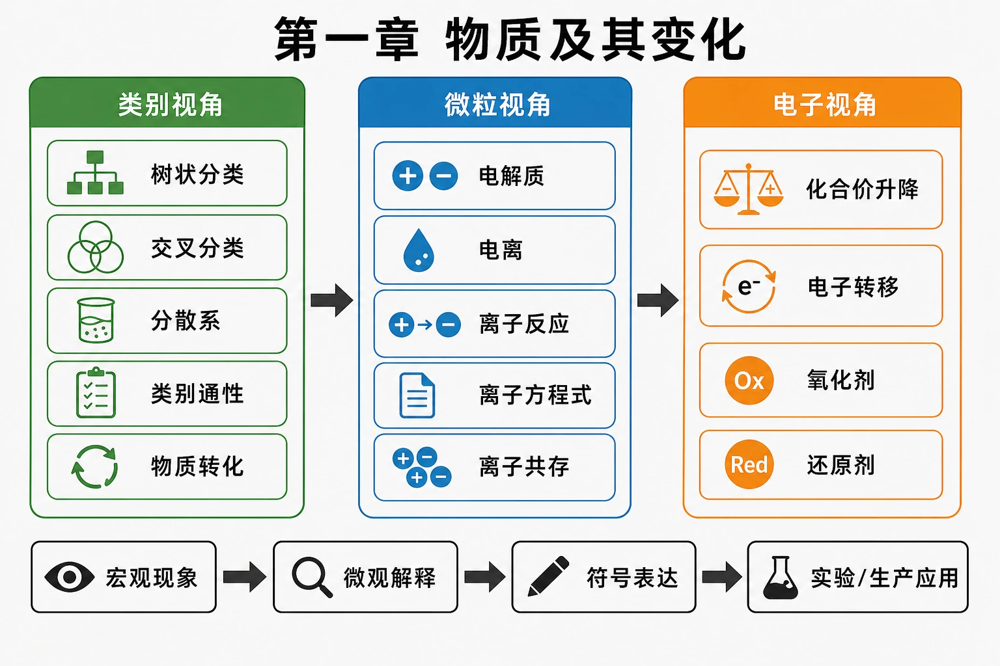
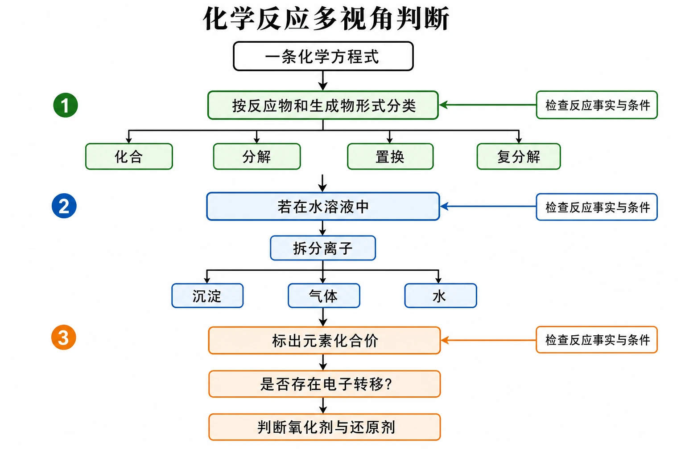

# 第一章 物质及其变化

<!-- 图片描述：第一章整体知识结构图。中心写“物质及其变化”，从左到右形成三层递进：第一层“类别视角”包含树状分类、交叉分类、分散系、类别通性和物质转化；第二层“微粒视角”包含电解质、电离、离子反应、离子方程式和离子共存；第三层“电子视角”包含化合价升降、电子转移、氧化剂和还原剂。下方用“宏观现象—微观解释—符号表达—实验/生产应用”贯穿三层，并用箭头标出分类为离子反应和氧化还原反应提供基础。白色或浅灰背景、黑灰线稿，蓝色表示溶液与离子，绿色表示分类和生成物，橙色表示沉淀、气体、电子转移与反应条件，采用化学实验记录本与微观粒子示意结合的风格。 -->

## 本章核心问题

面对一种物质或一个化学反应，本章提供三个逐步深入的观察视角：

1. 它属于什么类别，同类物质通常有哪些性质，能怎样转化？
2. 若反应发生在溶液中，哪些离子真正发生了变化？
3. 若元素化合价改变，电子从哪里转移到哪里，谁是氧化剂和还原剂？

这三个问题构成“类别—离子—电子”的学习主线，也是后续元素化合物和化学实验学习的基础方法。

## 子章节导航与递进关系

1. [[第一节 物质的分类及转化|第一节 物质的分类及转化]]：建立物质分类树，认识分散系与胶体，并利用类别通性设计物质转化路线。这是后两节的前置知识。
2. [[第二节 离子反应|第二节 离子反应]]：把酸、碱、盐的宏观类别通性解释为溶液中离子的共同变化，用离子方程式揭示反应实质。
3. [[第三节 氧化还原反应|第三节 氧化还原反应]]：换用化合价和电子转移重新分类反应，判断氧化剂、还原剂及物质的氧化性、还原性。

## 三层认识视角

### 1. 类别视角：从个别物质发现共同规律

[[第一节 物质的分类及转化#二、核心概念与物质分类|物质分类]]把大量物质组织成混合物、纯净物、单质、化合物、氧化物、酸、碱和盐等类别。分类的意义不止是贴标签，而是利用同类物质的共同组成或性质预测可能发生的变化。

### 2. 微粒视角：从化学方程式深入到实际粒子

不同酸具有相似性质，是因为其溶液中都含有 $H^{+}$；不同碱溶液都含有 $OH^{-}$。这一认识自然过渡到 [[第二节 离子反应#三、关键规律、反应原理与方程式|离子方程式]]：删去反应前后不变的旁观离子，保留真正发生变化的粒子。

### 3. 电子视角：用价态变化揭示反应本质

化合、分解、置换和复分解是按反应物与生成物形式分类；[[第三节 氧化还原反应#二、核心概念与物质分类|氧化还原反应]]则按元素化合价是否改变分类。同一个反应可以同时拥有两种分类结果，例如置换反应一定属于氧化还原反应。

<!-- 图片描述：化学反应多视角判断流程图。起点为“一条化学方程式”，先按反应物和生成物形式判断化合、分解、置换、复分解；若在水溶液中，再转向离子拆分并判断沉淀、气体或水等驱动力；最后标出元素化合价，判断是否存在电子转移以及氧化剂、还原剂。用绿色表示类别判断，蓝色表示离子过程，橙色表示化合价升降和电子转移，每一步都有“检查反应条件和事实”的回退箭头，白底黑灰线稿、LaTeX 风格符号。 -->

## 学习与复习路径

初学时按教材顺序完成“分类与转化→离子反应→氧化还原反应”。复习综合题时则从题目现象出发，依次检查物质类别、溶液微粒和化合价变化，再选择化学方程式、离子方程式或电子转移语言作答。完成三节学习后，可使用 [[章末 整理与提升|章末整理与提升]] 进行跨视角综合训练。
