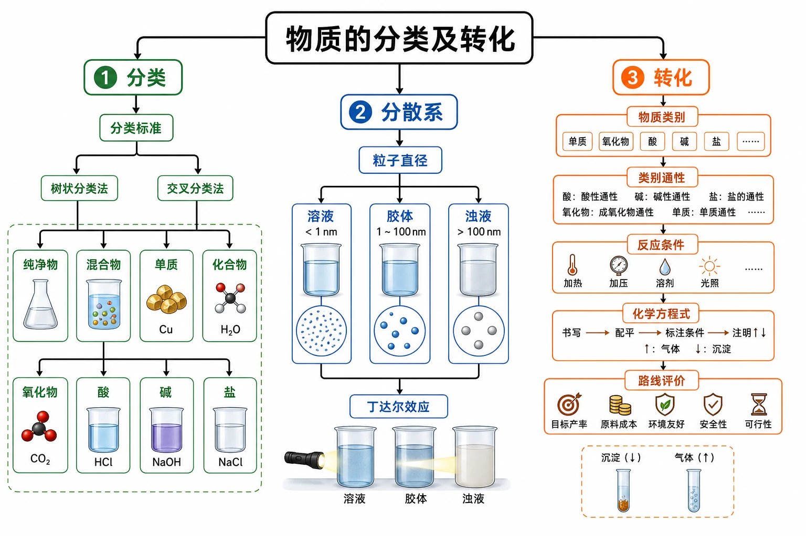
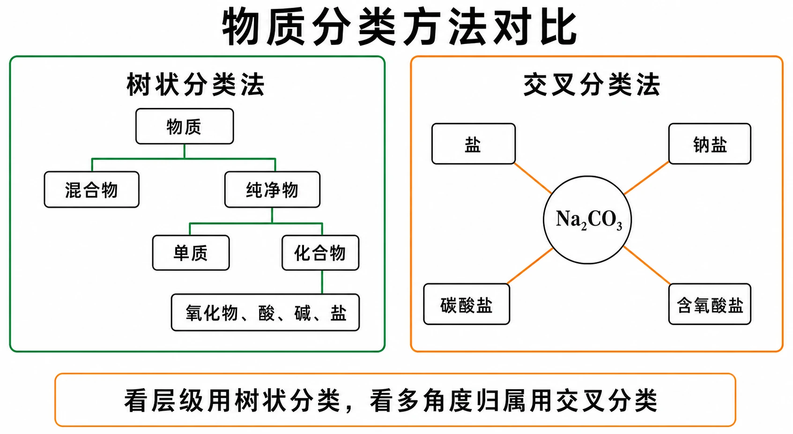
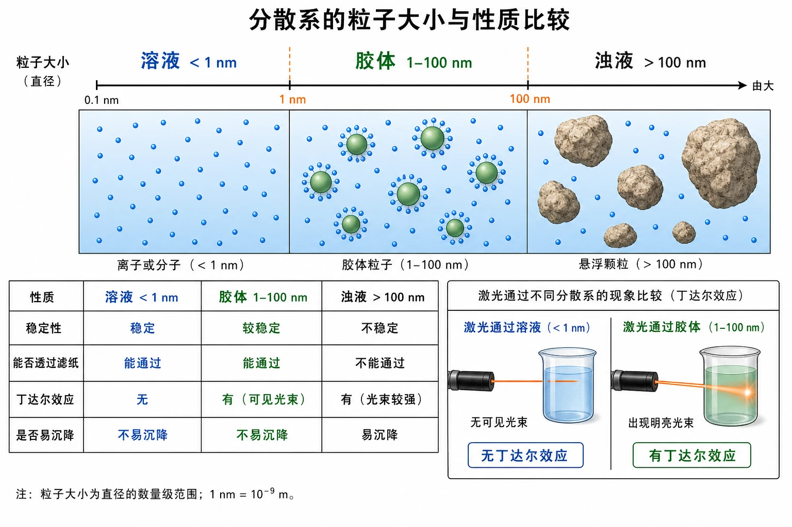
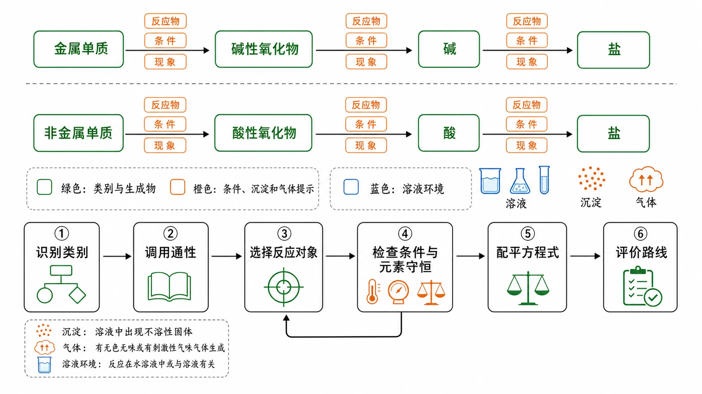
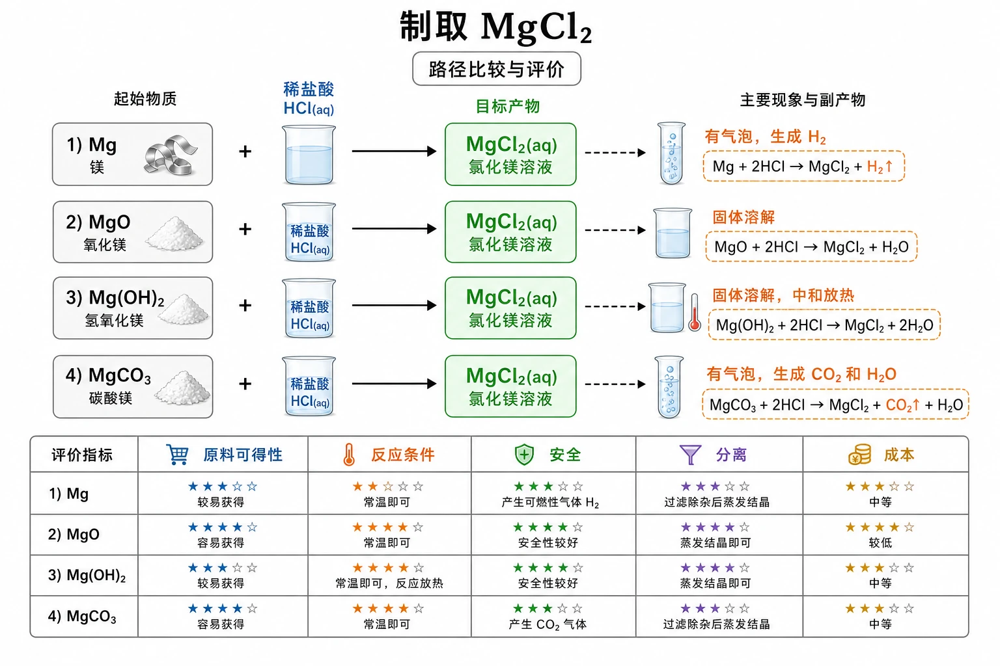

# 第一节 物质的分类及转化

## 知识关系导航

- 所属章节：[[章首 学习导图|第一章 物质及其变化]]。
- 后续微观视角：[[第二节 离子反应#一、知识对象与物质情境|离子反应]]把“酸、碱、盐具有类别通性”推进到共同离子和实际参加反应的微粒层面。
- 后续电子视角：[[第三节 氧化还原反应#一、知识对象与物质情境|氧化还原反应]]用化合价和电子转移进一步分类化学反应。
- 综合复习：[[章末 整理与提升#一、知识对象与物质情境|类别—离子—电子三重视角]]。


<!-- 图片描述：本节整体知识信息结构图。中心写“物质的分类及转化”，向左展开“分类”主线：分类标准→树状分类法/交叉分类法→纯净物、混合物、单质、化合物、氧化物、酸、碱、盐；向下展开“分散系”主线：粒子直径→溶液/胶体/浊液→丁达尔效应；向右展开“转化”主线：物质类别→类别通性→反应条件→化学方程式→路线评价。用橙色标出“粒子直径、反应条件、沉淀/气体”，用绿色标出分类关系和生成物，用蓝色表示溶液与微粒环境；采用白色背景、黑灰线稿、LaTeX 风格化学式和清晰箭头，形成实验记录本与微观粒子示意结合的化学学习导航图。 -->

## 本节学习目标

学完本节后，应能：

1. 依据组成、性质、结构或用途选择分类标准，区分树状分类法与交叉分类法。
2. 判断混合物、纯净物、单质、化合物、同素异形体、酸性氧化物和碱性氧化物。
3. 说明分散质、分散剂和分散系的关系，依据粒子直径区分溶液、胶体和浊液。
4. 完成$Fe(OH)_{3}$胶体的制备与丁达尔效应实验，并用“现象—微观解释—结论”表达证据。
5. 利用酸、碱、盐和氧化物的类别通性预测反应，写出并检查化学方程式。
6. 依据元素守恒、反应条件和实际需求设计、比较物质转化路线。

## 核心知识点讲解

### 一、知识对象与物质情境

本节围绕一条主线展开：**先分类发现同类物质的共性，再利用共性预测反应和设计转化。**学习时依次回答三个问题：物质按什么标准分类？同一类别为什么具有相似性质？怎样把类别通性转化为可行的反应路线？例如，酸溶液中的共同微粒$H^{+}$使多种酸表现出相似性质；识别出$CaO$属于碱性氧化物后，就能预测它可与酸反应生成盐和水。

### 二、核心概念与物质分类

1. 物质分类的常见标准

| 分类标准 | 典型分类 | 学习价值 |
| --- | --- | --- |
| 组成 | 混合物、纯净物、单质、化合物 | 判断物质类别和化学式意义 |
| 性质 | 酸性氧化物、碱性氧化物等 | 预测能与哪些物质反应 |
| 结构 | 后续学习中的离子化合物、共价化合物等 | 从微观角度解释性质 |
| 用途 | 燃料、干燥剂、建筑材料等 | 联系生产生活选择物质 |

2. 树状分类法

树状分类法像目录树，强调从大类到小类的层级关系。例如：


<!-- 图片描述：物质分类方法对比图。左侧用绿色层级线绘制“物质→混合物/纯净物→单质/化合物→氧化物、酸、碱、盐”的树状分类树；右侧以$Na_{2}CO_{3}$为中心，分别连向“盐、钠盐、碳酸盐、含氧酸盐”四个标签，展示交叉分类法。底部用一句判断提示：“看层级用树状分类，看多角度归属用交叉分类”。白色背景、黑灰线稿、绿色分类连线、橙色重点框、LaTeX 风格化学式，帮助学生直观看懂两种分类方法的差别。 -->

```text
物质
├─ 混合物
└─ 纯净物
   ├─ 单质
   │  ├─ 金属单质
   │  ├─ 非金属单质
   │  └─ 稀有气体
   └─ 化合物
      ├─ 无机化合物
      │  ├─ 氧化物
      │  ├─ 酸
      │  ├─ 碱
      │  └─ 盐
      └─ 有机化合物
```

3. 交叉分类法

交叉分类法强调同一种物质可按不同标准同时归入不同类别。例如$Na_{2}CO_{3}$：

- 从化合物类别看，是盐；
- 从阳离子看，是钠盐；
- 从阴离子看，是碳酸盐。

4. 同素异形体

由同一种元素形成的几种性质不同的单质叫做该元素的同素异形体。金刚石、石墨、$C_{60}$都是碳元素的同素异形体；$O_{2}$和$O_{3}$是氧元素的同素异形体。判断时要同时满足“同一种元素”“都是单质”“性质不同”。

5. 酸性氧化物和碱性氧化物

- 酸性氧化物：能与碱反应生成盐和水的氧化物，如$CO_{2}$、$SO_{3}$。多数酸性氧化物可与水反应生成酸。
- 碱性氧化物：能与酸反应生成盐和水的氧化物，如$CaO$、$MgO$。多数金属氧化物属于碱性氧化物。

不能简单记成“非金属氧化物一定是酸性氧化物、金属氧化物一定是碱性氧化物”，高中化学中要以性质和反应事实为准。

6. 分散系

一种或多种物质以粒子形式分散到另一种或多种物质中形成的混合物叫分散系。被分散成粒子的物质叫分散质，起容纳作用的物质叫分散剂。溶液、乳浊液、悬浊液和胶体都属于分散系。

| 分散系 | 分散质粒子直径 | 例子 | 主要特征 |
| --- | --- | --- | --- |
| 溶液 | 小于$1\ \mathrm{nm}$ | $NaCl$溶液、蔗糖溶液 | 均一、稳定，通常无丁达尔效应 |
| 胶体 | $1$～$100\ \mathrm{nm}$ | $Fe(OH)_{3}$胶体、云、雾、有色玻璃 | 较均一、较稳定，能产生丁达尔效应 |
| 乳浊液或悬浊液 | 大于$100\ \mathrm{nm}$ | 牛奶、泥水 | 不均一、不稳定，易分层或沉降 |

胶体按分散剂状态可分为液溶胶、气溶胶和固溶胶。$Fe(OH)_{3}$胶体是液溶胶，云和雾是气溶胶，有色玻璃是固溶胶。


<!-- 图片描述：分散系粒子尺度与性质对比图。画一条从小到大的横向粒径轴，依次标出“小于$1\ \mathrm{nm}$的溶液、$1$～$100\ \mathrm{nm}$的胶体、大于$100\ \mathrm{nm}$的浊液”；每一区间分别画蓝色小离子/分子、较大的绿色胶粒、明显的大颗粒，并用箭头关联“稳定性、能否透过滤纸、丁达尔效应、是否易沉降”。右下角加入激光穿过溶液无明显光路、穿过胶体出现明亮光路的并排示意。白色背景、黑灰线稿，蓝色微粒环境、绿色胶粒、橙色光路与尺度边界，化学式采用LaTeX风格。 -->

### 三、关键规律、反应原理与方程式

1. 丁达尔效应

当光束通过胶体时，可以看到一条光亮的“通路”，这是胶体粒子对光发生散射造成的，叫丁达尔效应。丁达尔效应可用于区分胶体和溶液。要注意：看到的光柱不是胶体粒子自己发光。

2. $Fe(OH)_{3}$胶体制备

把饱和$FeCl_{3}$溶液逐滴加入沸水中，继续煮沸至液体呈红褐色，即得到$Fe(OH)_{3}$胶体；出现红褐色后停止加热，避免继续加热使胶体聚沉。反应可表示为：

$$
FeCl_{3} + 3H_{2}O \xrightarrow{\Delta} Fe(OH)_{3}(\text{胶体}) + 3HCl
$$

用一束可见光分别照射$NaCl$溶液和$Fe(OH)_{3}$胶体：胶体中出现明亮光路，溶液中无明显光路。这里的判断链是“出现光路→胶体粒子散射光→该分散系具有胶体尺度的粒子”。

3. 酸、碱、盐的类别通性

酸的常见性质：

$$
Zn + H_{2}SO_{4} = ZnSO_{4} + H_{2}\uparrow
$$

$$
CuO + 2HCl = CuCl_{2} + H_{2}O
$$

$$
NaOH + HCl = NaCl + H_{2}O
$$

$$
Na_{2}CO_{3} + 2HCl = 2NaCl + H_{2}O + CO_{2}\uparrow
$$

碱的常见性质包括与酸反应、与某些盐反应、部分碱受热分解或与酸性氧化物反应。盐的常见性质包括与金属、酸、碱、盐反应，但是否发生要看金属活动性、沉淀/气体/水生成等条件。

4. 类别相似性的微观原因

不同酸溶液有相似化学性质，是因为都含$H^{+}$；不同碱溶液有相似性质，是因为都含$OH^{-}$；不同碳酸盐有相似性质，是因为都含$CO_{3}^{2-}$。这为下一节“离子反应”作铺垫。

5. 物质转化的基本依据

化学变化中元素种类不变，这是设计转化路线的底线。典型路线：

```text
金属单质 -> 碱性氧化物 -> 碱 -> 盐
非金属单质 -> 酸性氧化物 -> 酸 -> 盐
```

这两条路线是认识物质转化关系的常用模型，不是无条件成立的固定通道。例如，并非所有碱性氧化物都能直接与水生成碱，也并非所有酸性氧化物都能直接与水生成酸；每一步都必须用具体物质的性质和反应条件验证。

示例：

$$
2Ca + O_{2} \xrightarrow{\text{点燃}} 2CaO
$$

$$
CaO + H_{2}O = Ca(OH)_{2}
$$

$$
Ca(OH)_{2} + H_{2}SO_{4} = CaSO_{4} + 2H_{2}O
$$

$$
C + O_{2} \xrightarrow{\text{点燃}} CO_{2}
$$

$$
CO_{2} + H_{2}O = H_{2}CO_{3}
$$

$$
H_{2}CO_{3} + Ca(OH)_{2} = CaCO_{3}\downarrow + 2H_{2}O
$$

### 四、典型转化模型与分析方法

1. 分类判断模型

先看是否为混合物；若是纯净物，再看是否由一种元素组成；若是化合物，再根据组成和性质判断氧化物、酸、碱、盐、有机物等。

2. 交叉分类模型

对盐类物质尤其有用：先看阳离子，再看阴离子，再看是否含氧酸盐、正盐、酸式盐等。例如$H_{2}SO_{4}$可按是否含氧分为含氧酸，按可电离出的$H^{+}$数目分为二元酸。

3. 性质预测模型

类别→可能性质→反应对象→条件检查→现象预测→方程式。比如看到$CaO$，应想到“碱性氧化物”，可与水反应生成$Ca(OH)_{2}$并放出热量，也可与酸反应生成盐和水；在干燥剂中，它通过与水反应而除水。



<!-- 图片描述：物质转化与解题路径图。上半部分用两条绿色转化链表示“金属单质→碱性氧化物→碱→盐”和“非金属单质→酸性氧化物→酸→盐”，每条箭头旁用橙色标注“反应物、条件、现象”；下半部分画出通用解题流程“识别类别→调用通性→选择反应对象→检查条件与元素守恒→配平方程式→评价路线”，在检查节点设置回退箭头。白色背景、黑灰线稿，蓝色表示溶液环境，绿色表示类别与生成物，橙色表示条件、沉淀和气体，化学式及箭头使用LaTeX风格。 -->

4. 制备路线选择模型

可行路线不一定是最优路线。工业生产还要考虑原料来源、成本、设备、安全和环保。例如制取$NaOH$一般不采用$Na_{2}O$与$H_{2}O$反应，而主要采用电解饱和食盐水，过去也用$Na_{2}CO_{3}$与$Ca(OH)_{2}$反应。

### 五、实验现象、装置与证据

1. $Fe(OH)_{3}$胶体与丁达尔效应实验

- 操作：沸水中加入5-6滴$FeCl_{3}$饱和溶液，煮沸至红褐色；用红色激光笔照射$NaCl$溶液和$Fe(OH)_{3}$胶体。
- 现象：$Fe(OH)_{3}$胶体中出现明亮光路，$NaCl$溶液中无明显光路。
- 微观解释：胶体粒子的尺度能使可见光发生明显散射，溶液中的分子或离子尺度更小，散射不明显。
- 结论：胶体能产生丁达尔效应，溶液一般不能产生明显丁达尔效应。
- 安全：实验涉及加热、用电、可能的明火和热烫风险，应戴护目镜，规范使用电器和热源，实验后洗手。

2. 日常丁达尔效应

阳光透过窗隙进入暗室、光线透过树林、电影放映机到银幕间的光柱，都与光被微小粒子散射有关。

3. 实验证据的表达方法

回答实验判断题时，应把“操作、现象、解释、结论”分开：操作是用光束照射；现象是出现明亮光路；解释是胶体粒子使光发生散射；结论是该分散系具有胶体特征。不能把“产生丁达尔效应”直接写成操作，也不能把“是胶体”当作实验现象。

### 六、题型应用与迁移

- 物质分类题：判断混合物、氧化物、酸、碱、盐、有机物、单质、同素异形体。
- 分散系题：根据粒子直径和丁达尔效应判断溶液、胶体、浊液。
- 方程式题：按化合、分解、置换、复分解写反应。
- 转化路线题：给定物质链，补反应物、条件和方程式。
- 制备评价题：比较不同路线的原料成本、步骤多少、是否环保、产物是否易分离。

#### 化学科研工作者与绿色转化

教材中的“化学与职业”强调：化学科研不仅研究物质的组成、结构和性质，还要在原子、分子层面认识转化规律与控制手段，进而设计安全、高效、节能、环保的合成与生产工艺。因此，评价物质转化路线时，不能只回答“能否反应”，还应从原料来源、能耗、设备、安全、污染物、副产物利用和产物分离等角度判断是否适合实际生产。这也是分类与转化知识向材料、能源、环境和生命科学迁移的重要方向。

## 重点梳理

| 重点 | 为什么重要 | 什么时候用 | 怎么用 |
| --- | --- | --- | --- |
| 分类标准 | 同一物质按不同标准可有不同归属 | 物质分类、多选题、开放分类题 | 先写标准，再写类别；树状分类看层级，交叉分类看多角度归属 |
| 同素异形体 | 它连接“组成相同”和“性质不同” | 判断$O_{2}$与$O_{3}$、金刚石与石墨等关系 | 同时核对“同一种元素、不同单质、性质不同” |
| 氧化物性质分类 | 可由类别预测反应对象 | 判断酸性/碱性氧化物、补方程式 | 以反应事实为准：酸性氧化物与碱、碱性氧化物与酸反应生成盐和水，不能只看金属或非金属 |
| 分散质粒子直径 | 它是区分分散系的本质标准 | 溶液、胶体、浊液判断题 | 依次比较$1\ \mathrm{nm}$和$100\ \mathrm{nm}$两个边界，再结合稳定性和丁达尔效应验证 |
| 丁达尔效应 | 它提供胶体与溶液的宏观鉴别证据 | 鉴别分散系、解释生活光路 | 写清“光路现象→胶体粒子散射→胶体特征”，不能说胶粒发光 |
| 类别通性 | 它把个别反应整理成可迁移的规律 | 性质预测、转化链、物质制备 | 先找共同离子或类别性质，再检查具体反应条件和生成物 |
| 转化路线 | 它综合考查分类、性质和方程式 | 制备、转化链和方案评价 | 坚持元素守恒，逐步检查可行性、条件、现象、分离难度、成本与安全 |

## 难点突破

1. 树状分类和交叉分类怎么区分？

树状分类强调“上位类-下位类”，同一层尽量不交叉；交叉分类强调同一物质从多个标准看可进入多个类别。$Na_{2}CO_{3}$在树状分类中是盐，在交叉分类中又可叫钠盐、碳酸盐。

2. 胶体为什么看起来像溶液，却不是溶液？

液溶胶可能透明、均一，用肉眼不易分辨；关键差别是分散质粒子直径。胶体粒子的直径通常为$1$～$100\ \mathrm{nm}$，能明显散射可见光，因此可用丁达尔效应区分胶体和溶液。

3. 分类能不能直接决定反应一定发生？

不能。分类只能给出“可能性”。真正判断还要看反应条件、溶解性、金属活动性、是否生成沉淀/气体/水等。例如盐与盐反应通常要有沉淀生成才明显发生。

4. 物质转化路线为什么不唯一？

同一种目标物可由不同类别物质制得。例如$MgCl_{2}$可由$Mg$与盐酸、$MgO$与盐酸、$Mg(OH)_{2}$与盐酸、$MgCO_{3}$与盐酸等反应制得。解题时要根据给定原料和题目限制选路线。


<!-- 图片描述：转化路线选择的难点突破图。以“制取$MgCl_{2}$”为终点，左侧并列画出$Mg$、$MgO$、$Mg(OH)_{2}$、$MgCO_{3}$四类原料，分别通过盐酸反应指向终点；每条路径旁标注宏观现象（气泡、溶解、放热等）和副产物，底部增加“原料可得性、反应条件、安全、分离、成本”五项评价尺。白色背景、黑灰线稿，蓝色表示酸溶液，绿色表示目标产物，橙色表示气体与条件，化学式采用LaTeX风格。 -->

## 例题讲解

### 例题

从$Zn$、$BaCl_{2}$、$NaOH$、$KClO_{3}$、$CuCl_{2}$、$Na_{2}SO_{4}$、$Na_{2}O$、$H_{2}O$、$H_{2}SO_{4}$中选取合适物质，分别写出一个化合反应、分解反应、置换反应和复分解反应。

### 分析

先按反应类型找模板。化合反应是多变一，可选$Na_{2}O$与$H_{2}O$；分解反应是一变多，可选$KClO_{3}$受热分解；置换反应是单质与化合物生成新单质和新化合物，可选$Zn$与$H_{2}SO_{4}$；复分解反应是两种化合物交换成分，可选$BaCl_{2}$与$Na_{2}SO_{4}$生成沉淀。

### 答案

化合反应：

$$
Na_{2}O + H_{2}O = 2NaOH
$$

分解反应：

$$
2KClO_{3} \xrightarrow{MnO_{2},\Delta} 2KCl + 3O_{2}\uparrow
$$

置换反应：

$$
Zn + H_{2}SO_{4} = ZnSO_{4} + H_{2}\uparrow
$$

复分解反应：

$$
BaCl_{2} + Na_{2}SO_{4} = BaSO_{4}\downarrow + 2NaCl
$$

### 反思

写反应类型题时，不能只看物质名称，要检查产物是否合理、方程式是否配平、沉淀或气体符号是否需要标注。

## 易错点整理

| 常见错误表现 | 错因分析 | 反例或警示 | 正确处理步骤 |
| --- | --- | --- | --- |
| 把空气、溶液、合金判为纯净物 | 把“外观均一”误当成“只含一种物质” | 空气和合金都含多种成分 | 先判断是否由一种物质组成，再判断单质或化合物 |
| 把$O_{2}$和$O_{3}$判为同一种物质 | 只看到组成元素相同，没有比较化学式和性质 | 二者都是氧元素形成的单质，但分子构成和性质不同 | 核对“同元素、不同单质、性质不同”，判为同素异形体 |
| 认为非金属氧化物都是酸性氧化物 | 把常见规律绝对化 | $CO$是不成盐氧化物，不能归为酸性氧化物 | 根据能否与碱反应生成盐和水等性质事实判断 |
| 只按透明与否区分胶体和溶液 | 把宏观外观当成本质标准 | 某些胶体透明，某些溶液有颜色 | 先看粒子直径；实验鉴别时再用丁达尔效应 |
| 写“胶体粒子发光” | 混淆光源和散射体 | 没有外来光束就不会出现光路 | 表述为“胶体粒子使入射光发生散射” |
| 转化方程式漏条件或未配平 | 只关注反应物、生成物名称 | $CaCO_{3}$分解要高温，$KClO_{3}$分解要注明$MnO_{2}$和加热 | 写完依次检查元素守恒、系数、条件、气体和沉淀符号 |
| 只写一条可行路线就结束 | 把“能反应”等同于“方案最优” | 有的路线原料昂贵、步骤多或产物难分离 | 比较原料、条件、安全、环保、步骤和分离成本后再下结论 |

## 考点考证点整理

### 考点一：物质分类与分类标准

- 出题思路：给出若干物质或生活材料，要求按混合物、纯净物、单质、化合物、氧化物、酸、碱、盐、有机物等分类。
- 关键条件：先判断是否为混合物；纯净物再看元素种类；化合物再看组成和性质。题目若要求“从不同角度分类”，要写明分类依据。
- 解答要点：答案中必须同时出现“类别”和“依据”，如“$CO_{2}$由碳、氧元素组成，属于氧化物；能与碱反应生成盐和水，属于酸性氧化物”。
- 易扣分点：只写类别不写依据；把溶液、空气、碘酒等混合物当作纯净物；把同一物质只能归入一个类别。

### 考点二：同素异形体判断

- 出题思路：给出$O_{2}$、$O_{3}$、金刚石、石墨、$C_{60}$等，判断是否互为同素异形体。
- 关键条件：必须是同一种元素形成的不同单质，且性质不同。
- 解答要点：写出“同元素”“单质”“性质不同”三个关键词。
- 易扣分点：把化合物之间、同一物质不同状态或混合物误判为同素异形体。

### 考点三：分散系与丁达尔效应

- 出题思路：给出溶液、胶体、云雾、泥水等材料，要求判断分散系类型，或根据光束现象判断是否为胶体。
- 关键条件：分散质粒子直径：溶液小于$1\ nm$，胶体为$1-100\ nm$，乳浊液/悬浊液大于$100\ nm$；胶体有明显丁达尔效应。
- 解答要点：说明判断依据是粒子直径或丁达尔效应；涉及实验题时写出“胶体粒子散射光形成光亮通路”。
- 易扣分点：把透明程度当作唯一依据；认为胶体粒子自己发光；把水或普通溶液判断为胶体。

### 考点四：类别通性与转化方程式

- 出题思路：给出物质转化链，要求补充反应物、生成物、条件和化学方程式。
- 关键条件：抓住物质类别，如金属单质、非金属单质、酸性氧化物、碱性氧化物、酸、碱、盐；同时检查元素守恒。
- 解答要点：按“类别判断 -> 选择反应对象 -> 写方程式 -> 配平和标条件”的步骤作答。
- 易扣分点：漏写反应条件；方程式未配平；只写转化关系不写方程式；忽略沉淀、气体符号。

### 考点五：制备路线设计与评价

- 出题思路：给定几种原料，要求用不同方法制取某物质，或评价工业/实验路线。
- 关键条件：限定原料、目标产物、反应类型、成本、安全性、是否易分离。
- 解答要点：每条路线都要写出完整方程式，并说明路线依据；评价题要从原料来源、成本、步骤、环保和产物分离角度回答。
- 易扣分点：路线看似可行但目标元素不守恒；只写一种方法；评价只写“更好”而没有理由。

## 练习题

以下第 1—8 题对应教材本节“练习与应用”，在不改变考查目标的前提下作了适合笔记阅读的改写；第 9 题为针对实验证据链的补充训练。

### 基础训练

1. 某燃料电池系统可能涉及$H_{2}$、$O_{2}$、铝制外壳$Al$、硫酸$H_{2}SO_{4}$、氢氧化钾$KOH$、水$H_{2}O$、甲烷$CH_{4}$、乙醇$C_{2}H_{5}OH$和空气。分别从这些物质中找出单质、氧化物、酸、碱、有机物和混合物；再写出一种与$O_{2}$互为同素异形体的物质。
2. 从不同角度对盐酸、硫酸、硝酸、磷酸和氢硫酸分类，并说明每一种分类所采用的标准。
3. 完成溶液、胶体、乳浊液或悬浊液的比较：写出各类分散系的粒子直径范围，并各举一例。
4. 用可见光束分别照射①$Fe(OH)_{3}$胶体、②水、③蔗糖溶液、④$FeCl_{3}$溶液、⑤云和雾。哪些对象中不会出现明显丁达尔效应？说明判断依据。

### 巩固训练

5. 从$Zn$、$BaCl_{2}$、$NaOH$、$KClO_{3}$、$CuCl_{2}$、$Na_{2}SO_{4}$、$Na_{2}O$、$H_{2}O$、$H_{2}SO_{4}$中选择适当物质，分别写出一个化合反应、分解反应、置换反应和复分解反应的化学方程式。
6. 写出实现下列转化的化学方程式，并注明必要条件：
   - $Cu \rightarrow CuO \rightarrow CuSO_{4} \rightarrow Cu(OH)_{2} \rightarrow CuSO_{4} \rightarrow Cu$
   - $C \rightarrow CO_{2} \rightarrow CaCO_{3} \rightarrow CaO \rightarrow Ca(OH)_{2} \rightarrow CaCl_{2}$
7. 设计制备方案：
   - 仅以$Fe$、$CuO$、$H_{2}SO_{4}$为原料，设计两条制取$Cu$的路线。
   - 分别以$Mg$、$MgO$、$Mg(OH)_{2}$为起始物，写出三种制取$MgCl_{2}$的方法。

### 提升训练

8. 某食品干燥剂的主要成分为生石灰。写出生石灰的化学式和类别；从反应原理说明它能作干燥剂的原因；举例说明它能与哪些类别的物质反应，并写出方程式；再列举两种其他干燥剂。
9. 现有饱和$FeCl_{3}$溶液、蒸馏水、酒精灯、烧杯、胶头滴管和激光笔。设计制备$Fe(OH)_{3}$胶体并证明其具有胶体特征的实验，按“操作—现象—解释—结论”作答，同时写出反应方程式。

## 练习题答案

1. $H_{2}$、$O_{2}$、$Al$属于单质；$H_{2}O$属于氧化物；$H_{2}SO_{4}$属于酸；$KOH$属于碱；$CH_{4}$、$C_{2}H_{5}OH$属于有机物；空气含多种成分，属于混合物。与$O_{2}$互为同素异形体的物质可写$O_{3}$。判断时先看是否只含一种物质，再看纯净物的元素组成和类别。

2. 可按以下角度分类：按是否含氧，硫酸、硝酸、磷酸属于含氧酸，盐酸、氢硫酸属于无氧酸；按每个酸分子能够电离出的$H^{+}$数目，盐酸、硝酸属于一元酸，硫酸、氢硫酸属于二元酸，磷酸属于三元酸。交叉分类的关键是每次先写清标准，再给出分组结果。

3. 溶液：分散质粒子直径小于$1\ \mathrm{nm}$，如$NaCl$溶液、蔗糖溶液；胶体：粒子直径为$1$～$100\ \mathrm{nm}$，如$Fe(OH)_{3}$胶体、云、雾；乳浊液或悬浊液：粒子直径大于$100\ \mathrm{nm}$，如牛奶、泥水。分类的本质依据是粒子直径，不能只看颜色或透明度。

4. ②水、③蔗糖溶液、④$FeCl_{3}$溶液中不会出现明显丁达尔效应。①$Fe(OH)_{3}$胶体和⑤云、雾含有胶体尺度的分散质粒子，能使可见光发生明显散射。云、雾是液滴分散在空气中形成的气溶胶，不是纯净的气体。

5. 示例答案：

$$
Na_{2}O + H_{2}O = 2NaOH
$$

$$
2KClO_{3} \xrightarrow{MnO_{2},\Delta} 2KCl + 3O_{2}\uparrow
$$

$$
Zn + H_{2}SO_{4} = ZnSO_{4} + H_{2}\uparrow
$$

$$
BaCl_{2} + Na_{2}SO_{4} = BaSO_{4}\downarrow + 2NaCl
$$

解题说明：先判断反应类型，再从给定物质中选能满足反应模型的组合，最后配平方程式。

6. 转化链方程式示例：

$$
2Cu + O_{2} \xrightarrow{\Delta} 2CuO
$$

$$
CuO + H_{2}SO_{4} = CuSO_{4} + H_{2}O
$$

$$
CuSO_{4} + 2NaOH = Cu(OH)_{2}\downarrow + Na_{2}SO_{4}
$$

$$
Cu(OH)_{2} + H_{2}SO_{4} = CuSO_{4} + 2H_{2}O
$$

$$
CuSO_{4} + Fe = FeSO_{4} + Cu
$$

$$
C + O_{2} \xrightarrow{\text{点燃}} CO_{2}
$$

$$
CO_{2} + Ca(OH)_{2} = CaCO_{3}\downarrow + H_{2}O
$$

$$
CaCO_{3} \xrightarrow{高温} CaO + CO_{2}\uparrow
$$

$$
CaO + H_{2}O = Ca(OH)_{2}
$$

$$
Ca(OH)_{2} + 2HCl = CaCl_{2} + 2H_{2}O
$$

关键步骤是每一步都要检查目标物是否由上一步物质合理转化而来。

7. 第一条制取$Cu$的路线是先把$CuO$转化为$CuSO_{4}$，再用$Fe$置换：

$$
CuO + H_{2}SO_{4} = CuSO_{4} + H_{2}O
$$

$$
Fe + CuSO_{4} = FeSO_{4} + Cu
$$

第二条路线是先用$Fe$和稀$H_{2}SO_{4}$制取$H_{2}$，再用$H_{2}$还原$CuO$：

$$
Fe + H_{2}SO_{4} = FeSO_{4} + H_{2}\uparrow
$$

$$
CuO + H_{2} \xrightarrow{\Delta} Cu + H_{2}O
$$

制取$MgCl_{2}$的三种方法为：

$$
Mg + 2HCl = MgCl_{2} + H_{2}\uparrow
$$

$$
MgO + 2HCl = MgCl_{2} + H_{2}O
$$

$$
Mg(OH)_{2} + 2HCl = MgCl_{2} + 2H_{2}O
$$

也可用$MgCO_{3}$与盐酸反应。解题关键是从金属、碱性氧化物、碱、盐等类别出发找制盐路径。

8. 生石灰的化学式为$CaO$，属于碱性氧化物。它能与水反应并消耗水，因此可作某些物质的干燥剂：

$$
CaO + H_{2}O = Ca(OH)_{2}
$$

它可与酸反应：

$$
CaO + 2HCl = CaCl_{2} + H_{2}O
$$

也可与酸性氧化物反应：

$$
CaO + CO_{2} = CaCO_{3}
$$

其他干燥剂可举浓硫酸、无水$CaCl_{2}$、硅胶等。选择干燥剂时还要检查它是否会与被干燥物质反应；例如$CaO$不能用于干燥$CO_{2}$、$SO_{2}$等能与它反应的酸性气体。

9. 实验方案如下：

- 操作：在烧杯中将蒸馏水加热至沸腾，用胶头滴管向沸水中逐滴加入5～6滴饱和$FeCl_{3}$溶液，继续煮沸至液体呈红褐色后停止加热；冷却后用激光笔从烧杯侧面照射所得分散系。
- 现象：液体呈红褐色；光束通过时可看到一条明亮光路。
- 解释：生成了$Fe(OH)_{3}$胶体，胶体粒子对入射光产生散射。
- 结论：所得分散系具有丁达尔效应，具有胶体特征。

反应方程式：

$$
FeCl_{3} + 3H_{2}O \xrightarrow{\Delta} Fe(OH)_{3}(\text{胶体}) + 3HCl
$$
