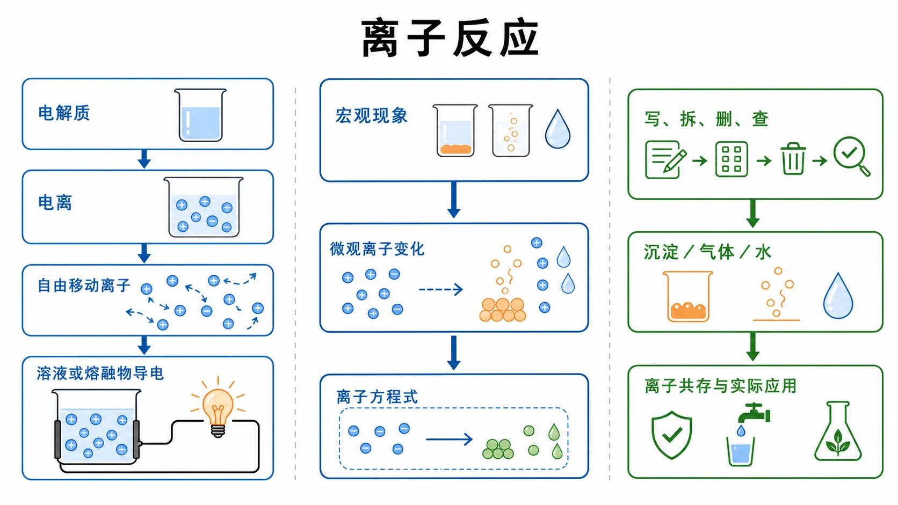
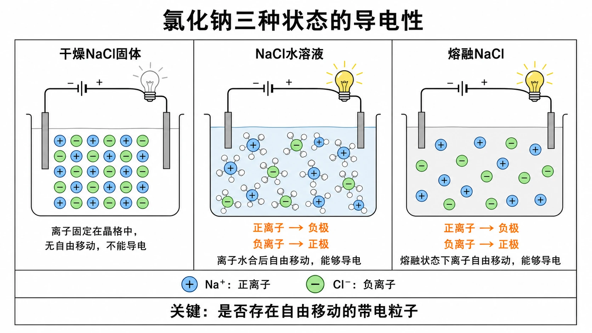
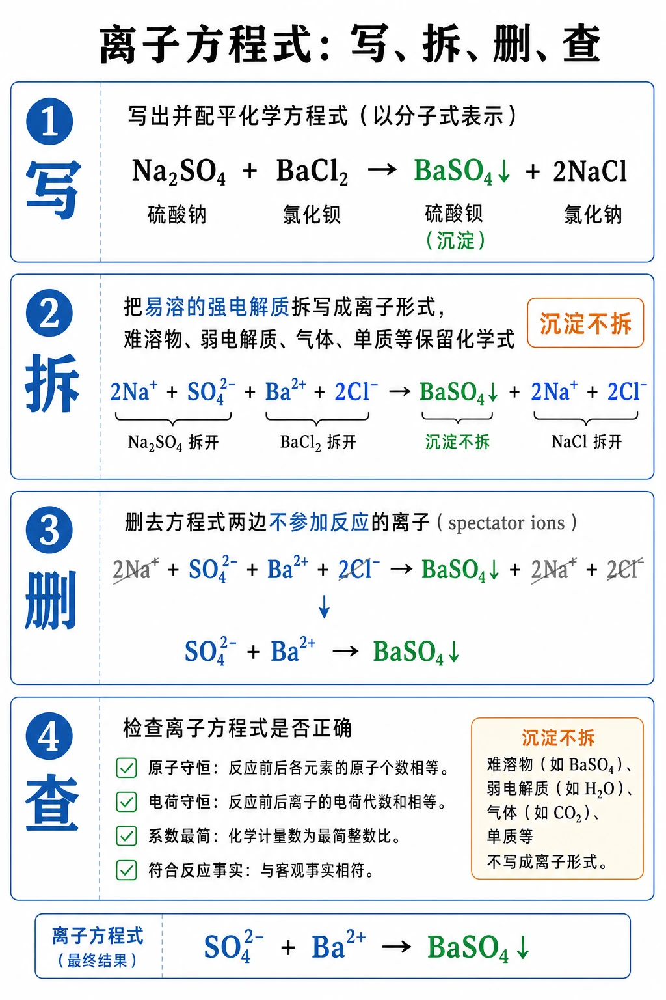
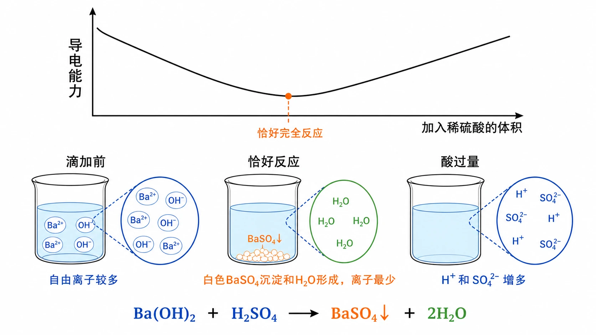

# 第二节 离子反应

## 知识关系导航

- 所属章节：[[章首 学习导图|第一章 物质及其变化]]。
- 前置类别视角：[[第一节 物质的分类及转化#三、关键规律、反应原理与方程式|酸、碱、盐的类别通性]]为电解质和离子反应提供物质分类基础。
- 后续电子视角：[[第三节 氧化还原反应#三、关键规律、反应原理与方程式|氧化还原反应]]进一步追踪离子反应中的化合价变化和电子转移。
- 综合复习：[[章末 整理与提升#三、关键规律、反应原理与方程式|离子反应的章末整合]]。

<!-- 图片描述：本节整体知识信息结构图。中心写“离子反应”，左侧主线为“电解质→电离→自由移动离子→溶液/熔融物导电”，中间主线为“宏观现象→微观离子变化→离子方程式”，右侧主线为“写、拆、删、查→沉淀/气体/水→离子共存与实际应用”。用蓝色表示溶液和水合离子，绿色表示反应后保留的生成物，橙色表示沉淀、气体、导电灯泡和关键条件；白色背景、黑灰线稿、LaTeX风格离子符号和反应箭头，形成实验记录本与微观粒子示意结合的学习导航图。 -->

## 本节学习目标

学完本节后，应能：

1. 从自由移动离子的角度解释干燥$NaCl$、熔融$NaCl$和$NaCl$溶液导电性不同的原因。
2. 判断电解质，说明电离的含义以及酸、碱的电离本质。
3. 正确书写常见酸、碱、盐的电离方程式。
4. 从宏观现象、微观粒子和符号表达三个层次分析离子反应。
5. 按“写、拆、删、查”书写离子方程式，并检查原子守恒、电荷守恒和反应事实。
6. 判断离子反应发生条件和离子能否大量共存，用离子方程式解决鉴别、制备、除杂等问题。

## 核心知识点讲解

### 一、知识对象与物质情境

许多化学反应发生在水溶液中。若只看化学方程式，容易把所有反应物都当成“整体”参加反应；从微粒角度看，真正发生变化的往往只是少数离子。本节沿着“为什么能导电→溶液中有哪些微粒→哪些微粒真正反应→怎样用离子方程式表示”的问题链，把物质类别推进到离子层面。

### 二、核心概念与物质分类

1. 电解质

在水溶液里或熔融状态下能够导电的化合物叫电解质。$HCl$、$H_{2}SO_{4}$、$NaOH$、$Ca(OH)_{2}$、$NaCl$、$KNO_{3}$等都是电解质。

判断要点：

- 必须是化合物，$Cu$、石墨虽然能导电，但不是电解质。
- 不要求固体本身导电，$NaCl$固体不导电，但$NaCl$是电解质。
- “水溶液里或熔融状态下”满足一个即可。

2. 电离

电解质溶于水或受热熔化时，形成自由移动离子的过程叫电离。电离不是“通电分解”，而是电解质进入水中或熔融后本身形成可自由移动的离子。

3. 酸、碱的电离本质

酸：电离时生成的阳离子全部是$H^{+}$的化合物。

碱：电离时生成的阴离子全部是$OH^{-}$的化合物。

例：

$$
H_{2}SO_{4} = 2H^{+} + SO_{4}^{2-}
$$

$$
Ba(OH)_{2} = Ba^{2+} + 2OH^{-}
$$

4. 离子反应与离子方程式

电解质在溶液中的反应实质上常是离子之间的反应，这类反应属于离子反应。用实际参加反应的离子符号表示反应的式子叫离子方程式。

### 三、关键规律、反应原理与方程式

1. 导电性的微观解释

干燥$NaCl$固体中$Na^{+}$和$Cl^{-}$按一定规则紧密排列，不能自由移动，所以不导电。$NaCl$溶于水时，$Na^{+}$和$Cl^{-}$在水分子作用下进入水中，形成可自由移动的水合离子；熔融$NaCl$中离子也能自由移动，因此二者都能导电。

<!-- 图片描述：氯化钠三种状态导电性的微观对比图。并排画“干燥$NaCl$固体、$NaCl$水溶液、熔融$NaCl$”三个容器：固体中$Na^{+}$和$Cl^{-}$规则排列并被晶格位置固定，灯泡不亮；水溶液中蓝色水分子包围分散的水合离子，通电后正负离子反向移动，灯泡亮；熔融物中离子脱离固定位置并定向移动，灯泡亮。用橙色箭头标出电场方向与离子移动方向，底部总结“是否存在自由移动的带电粒子”。白色背景、黑灰线稿、蓝色溶液环境、绿色可移动离子、橙色电流与灯泡，离子符号采用LaTeX风格。 -->

2. 常见电离方程式

$$
NaCl = Na^{+} + Cl^{-}
$$

$$
KNO_{3} = K^{+} + NO_{3}^{-}
$$

$$
HCl = H^{+} + Cl^{-}
$$

$$
H_{2}SO_{4} = 2H^{+} + SO_{4}^{2-}
$$

$$
NaOH = Na^{+} + OH^{-}
$$

$$
Ca(OH)_{2} = Ca^{2+} + 2OH^{-}
$$

$$
Fe_{2}(SO_{4})_{3} = 2Fe^{3+} + 3SO_{4}^{2-}
$$

$$
NH_{4}NO_{3} = NH_{4}^{+} + NO_{3}^{-}
$$

3. $Na_{2}SO_{4}$与$BaCl_{2}$反应

化学方程式：

$$
Na_{2}SO_{4} + BaCl_{2} = 2NaCl + BaSO_{4}\downarrow
$$

离子方程式：

$$
Ba^{2+} + SO_{4}^{2-} = BaSO_{4}\downarrow
$$

$Na^{+}$和$Cl^{-}$在反应前后仍在溶液中，属于旁观离子。

4. 离子方程式书写步骤

- 写：写出正确的化学方程式。
- 拆：把易溶于水且易电离的强酸、强碱和大部分可溶性盐写成离子形式；难溶物、气体、水、氧化物、单质等保留化学式。
- 删：删去方程式两边相同且不参加反应的离子。
- 查：检查原子个数和电荷总数是否守恒。

<!-- 图片描述：离子方程式“写、拆、删、查”流程图。以$Na_{2}SO_{4}+BaCl_{2}$反应为贯穿示例，四个纵向步骤依次展示：写出配平的化学方程式；把可溶强电解质拆成离子而保留$BaSO_{4}$；用灰色删除线删去$Na^{+}$和$Cl^{-}$旁观离子；最后用核对框检查元素、电荷、系数和反应事实。蓝色表示水溶液离子，绿色表示$BaSO_{4}$生成物，橙色标出“不拆”和检查警示；白色背景、黑灰线稿、LaTeX风格方程式和箭头。 -->

5. 强酸强碱中和反应本质

$HCl$与$NaOH$、$HCl$与$KOH$、$H_{2}SO_{4}$与$NaOH$、$H_{2}SO_{4}$与$KOH$虽然化学方程式不同，但本质相同：

$$
H^{+} + OH^{-} = H_{2}O
$$

6. 离子反应发生条件

复分解型离子反应实质是两种电解质在溶液中交换离子。只要生成沉淀、气体或水，反应通常就能发生。

示例：

$$
Ag^{+} + Cl^{-} = AgCl\downarrow
$$

$$
2H^{+} + CO_{3}^{2-} = H_{2}O + CO_{2}\uparrow
$$

$$
H^{+} + OH^{-} = H_{2}O
$$

离子反应还包括有离子参加的置换反应：

$$
Zn + 2H^{+} = Zn^{2+} + H_{2}\uparrow
$$

### 四、典型转化模型与分析方法

1. 电解质判断模型

先看是否为化合物；再看其水溶液或熔融状态能否导电；最后排除单质、混合物和非电解质情形。金属单质、石墨不是电解质；盐酸是混合物，不能称为电解质，但$HCl$是电解质。

2. 离子方程式拆写模型

常拆：强酸、强碱、可溶性盐。

不拆：难溶物、气体、水、氧化物、单质、弱电解质以及题目尚未要求拆写的复杂物质。

3. 离子共存模型

若离子之间能生成沉淀、气体、水或发生明显氧化还原反应，则不能大量共存。常见不能共存：

- $H^{+}$与$OH^{-}$、$CO_{3}^{2-}$；
- $Ca^{2+}$与$CO_{3}^{2-}$；
- $Ba^{2+}$与$SO_{4}^{2-}$；
- $Cu^{2+}$与$OH^{-}$；
- $Ag^{+}$与$Cl^{-}$。

4. 导电能力变化模型

溶液导电能力与自由移动离子的浓度和所带电荷有关。$Ba(OH)_{2}$溶液中滴加稀$H_{2}SO_{4}$时，$Ba^{2+}$与$SO_{4}^{2-}$生成沉淀，$H^{+}$与$OH^{-}$生成水，自由离子减少，导电能力减弱；恰好完全反应后继续加酸，自由离子增多，导电能力增强。

<!-- 图片描述：向$Ba(OH)_{2}$溶液滴加稀$H_{2}SO_{4}$时的导电能力变化图。上部画折线或平滑曲线：纵轴“导电能力”，横轴“加入稀硫酸的体积”，曲线先下降到最低点再上升，最低点标“恰好完全反应”；下部用三组微观烧杯表示滴加前、恰好反应、酸过量，分别标出自由离子较多、$BaSO_{4}$沉淀与$H_{2}O$形成导致离子最少、过量$H^{+}$和$SO_{4}^{2-}$使离子增多。蓝色表示溶液和离子，绿色表示水，橙色表示白色沉淀和曲线关键点，白色背景、黑灰线稿、LaTeX风格离子符号。 -->

### 五、实验现象、装置与证据

1. 物质导电性对比实验

- 实验对象：干燥$NaCl$固体、$KNO_{3}$固体、蒸馏水、$NaCl$溶液、$KNO_{3}$溶液。
- 现象：干燥固体和蒸馏水在装置中不导电；$NaCl$溶液、$KNO_{3}$溶液能导电。
- 证据链：导电需要自由移动的带电粒子；固体中离子不能自由移动；溶液或熔融状态中有自由移动的离子。
- 补充：严格说蒸馏水也极弱导电，只是实验装置通常不能测出。

2. $NaCl$溶解和熔融导电的微观证据

干燥$NaCl$中离子被固定在晶格位置；溶于水后，离子在水分子作用下成为可自由移动的水合离子；熔融后，离子也脱离固定位置。外加电场时，自由离子发生定向移动，形成电流。

3. $Na_{2}SO_{4}$与$BaCl_{2}$反应实验

- 操作：$Na_{2}SO_{4}$稀溶液中加入$BaCl_{2}$稀溶液。
- 现象：生成白色沉淀。
- 分析：$Na_{2}SO_{4}$电离出$Na^{+}$、$SO_{4}^{2-}$，$BaCl_{2}$电离出$Ba^{2+}$、$Cl^{-}$；真正结合的是$Ba^{2+}$和$SO_{4}^{2-}$。
- 结论：离子反应关注实际参加反应的离子。

4. 电离模型的科学价值

阿伦尼乌斯提出电离模型，说明电解质溶于水会自动解离成离子，而不是通电后才产生离子。模型能解释酸、碱、盐溶液性质，是从实验现象上升到理论认识的典型例子。

### 六、题型应用与迁移

- 判断电解质与非电解质，尤其区分“能导电物质”和“电解质”。
- 写电离方程式，注意离子个数和电荷。
- 写离子方程式，重点考查拆写、删旁观离子、配平和电荷守恒。
- 判断离子共存，寻找沉淀、气体、水或氧化还原冲突。
- 根据离子方程式反推化学方程式。
- 用离子反应解释物质制备、分离、提纯、鉴定和污染物去除。

## 重点梳理

| 重点 | 为什么重要 | 什么时候用 | 怎么用 |
| --- | --- | --- | --- |
| 电解质判断 | 它决定能否从离子角度分析物质 | 判断固体、溶液、熔融物及导电材料 | 先确认是化合物，再看其水溶液或熔融状态能否导电；单质和混合物不属于电解质 |
| 电离与导电 | 它连接宏观导电现象和微观粒子 | 解释固体、溶液、熔融物导电差异 | 关键句是“存在自由移动的带电粒子”，不能写成“通电后才产生离子” |
| 酸碱电离本质 | 它解释同类物质的相似性质 | 写电离方程式、判断酸碱 | 酸电离出的阳离子全部是$H^{+}$，碱电离出的阴离子全部是$OH^{-}$ |
| 离子方程式 | 它直接表示反应实质 | 沉淀、气体、中和、置换等水溶液反应 | 按“写、拆、删、查”处理，并检查事实、元素和电荷守恒 |
| 拆写规则 | 它是离子方程式最常见失分点 | 强酸、强碱、可溶性盐参与反应 | 易溶且易电离的物质拆；难溶物、弱电解质、水、气体、氧化物和单质不拆 |
| 反应与共存条件 | 它统一判断“能否反应”和“能否共存” | 离子共存、除杂、鉴别和推断 | 寻找是否生成沉淀、气体、水或发生明显氧化还原反应，并结合酸碱性、颜色等限制 |

## 难点突破

1. $NaCl$固体不导电，为什么$NaCl$仍是电解质？

电解质定义看的是“水溶液里或熔融状态下”能否导电，不要求固体直接导电。$NaCl$固体中离子不能自由移动，所以不导电；溶于水或熔融后有自由移动离子，所以$NaCl$是电解质。

2. $Cu$能导电，为什么不是电解质？

$Cu$是单质，不是化合物。电解质和非电解质都是对化合物的分类，单质不能归入电解质。

3. 离子方程式为什么不能把所有物质都拆开？

只有易溶于水且易电离的物质才拆成离子。$BaSO_{4}$难溶，$H_{2}O$难电离，$CO_{2}$是气体，$Cu$是单质，都要保留化学式。

4. 离子共存题怎么快速判断？

先找$H^{+}$、$OH^{-}$、$CO_{3}^{2-}$、$SO_{4}^{2-}$、$Ba^{2+}$、$Ag^{+}$、$Cl^{-}$、$Cu^{2+}$等高频离子，再看是否能生成沉淀、气体或水。若题目给酸性、碱性、无色等条件，还要额外筛除不符合条件的离子。

## 例题讲解

### 例题

写出稀盐酸与碳酸钠溶液反应的化学方程式和离子方程式，并说明该离子反应发生的原因。

### 分析

盐酸提供$H^{+}$和$Cl^{-}$，碳酸钠提供$Na^{+}$和$CO_{3}^{2-}$。$Na^{+}$和$Cl^{-}$不参加反应，$H^{+}$与$CO_{3}^{2-}$结合生成$H_{2}CO_{3}$，$H_{2}CO_{3}$不稳定，分解为$H_{2}O$和$CO_{2}$。生成气体是反应发生的重要条件。

### 答案

化学方程式：

$$
Na_{2}CO_{3} + 2HCl = 2NaCl + H_{2}O + CO_{2}\uparrow
$$

离子方程式：

$$
CO_{3}^{2-} + 2H^{+} = H_{2}O + CO_{2}\uparrow
$$

反应发生原因：生成了气体$CO_{2}$和水，使离子浓度降低，反应能够进行。

### 反思

离子方程式要能体现本质。若写成$Na_{2}CO_{3} + 2H^{+} = ...$ 就没有正确拆写可溶性盐；若写成$H_{2}CO_{3}$作为最终产物，则没有体现碳酸分解产生$CO_{2}$。

## 易错点整理

| 常见错误表现 | 错因分析 | 反例或警示 | 正确处理步骤 |
| --- | --- | --- | --- |
| 把能导电的物质都判为电解质 | 忽略“化合物”这一前提 | $Cu$和石墨能导电，但都是单质 | 先判物质类别，再判断水溶液或熔融状态的导电性 |
| 把盐酸判为电解质 | 混淆$HCl$和$HCl$水溶液 | 盐酸是混合物，$HCl$是化合物 | 判断对象要精确到物质本身，不把溶液名称等同于溶质 |
| 认为通电才会电离 | 混淆电离和电解 | $NaCl$进入水中已经形成水合离子 | 写成“溶于水或熔融时形成自由移动离子” |
| 电离方程式漏系数或拆散原子团 | 没检查组成和电荷 | $Ca(OH)_{2}$应生成$2OH^{-}$，$SO_{4}^{2-}$整体保留 | 对照化学式写系数，再核对原子数与总电荷 |
| 把$BaSO_{4}$、$H_{2}O$、$CO_{2}$等拆成离子 | 机械地“见化合物就拆” | 难溶物、水和气体必须保留化学式 | 先判断物质状态、溶解性和电离程度，再决定是否拆写 |
| 离子方程式只查原子不查电荷 | 忽视离子反应的电荷约束 | $Cu+Ag^{+}=Cu^{2+}+Ag$原子守恒但电荷不守恒 | 完成后同时核对元素、总电荷、系数最简和反应事实 |
| 共存题只查沉淀 | 没有建立完整反应条件清单 | $H^{+}$与$CO_{3}^{2-}$因生成气体和水不能共存 | 依次检查沉淀、气体、水、氧化还原，再检查酸碱性、颜色等题干限制 |

## 考点考证点整理

### 考点一：电解质、电离与导电原因

- 出题思路：给出固体、溶液、熔融物或生活情境，判断物质是否为电解质，并解释导电或不导电。
- 关键条件：电解质必须是化合物；水溶液或熔融状态能导电即可；导电本质是存在自由移动的带电粒子。
- 解答要点：写出“电离产生自由移动离子”这一核心句；区分$NaCl$固体不导电和$NaCl$是电解质。
- 易扣分点：把金属、石墨当电解质；把盐酸这种混合物称为电解质；认为电离必须通电。

### 考点二：电离方程式书写

- 出题思路：要求写酸、碱、盐的电离方程式，或从电离方程式概括酸碱本质。
- 关键条件：离子符号、角标、系数和电荷必须正确。
- 解答要点：强酸、强碱、可溶性盐按组成拆成离子，如$Fe_{2}(SO_{4})_{3} = 2Fe^{3+} + 3SO_{4}^{2-}$。
- 易扣分点：漏写系数；把原子团拆散；电荷写错。

### 考点三：离子方程式正误判断与书写

- 出题思路：给出离子方程式判断正误，或要求由化学方程式写离子方程式。
- 关键条件：是否该拆的拆、不该拆的不拆；原子守恒、电荷守恒；产物是否符合事实。
- 解答要点：按“写、拆、删、查”作答，沉淀、气体、水、氧化物、单质不拆。
- 易扣分点：把难溶物拆成离子；忘记电荷守恒；碳酸反应写成$H_{2}CO_{3}$而不写$CO_{2}$和$H_{2}O$。

### 考点四：离子共存与反应条件

- 出题思路：给出多组离子，判断能否大量共存。
- 关键条件：看离子间是否生成沉淀、气体、水，或发生其他明显反应。
- 解答要点：逐组找冲突组合，如$H^{+}$与$OH^{-}$、$H^{+}$与$CO_{3}^{2-}$、$Ba^{2+}$与$SO_{4}^{2-}$、$Cu^{2+}$与$OH^{-}$。
- 易扣分点：只看沉淀，忽略气体和水；忽略题干中“酸性、碱性、无色”等限制条件。

### 考点五：离子反应应用与实验评价

- 出题思路：结合导电能力曲线、物质制备、分离提纯、牙膏摩擦剂制备等情境设问。
- 关键条件：抓住实际参加反应的离子和是否生成沉淀、气体或水。
- 解答要点：用离子方程式说明本质，用步骤少、节能、原料易得、产物易分离等角度评价方案。
- 易扣分点：只写化学方程式不写离子方程式；评价方案没有具体理由。

## 练习题

### 基础训练

1. 补全并解释：在水溶液里或熔融状态下能够导电的________叫电解质；电解质溶液能导电，是因为电解质发生________，形成了________。
2. 判断下列说法，选出正确的一项并说明其余各项错误原因：A.$KNO_{3}$固体不导电，所以$KNO_{3}$不是电解质；B.铜丝和石墨能导电，所以都是电解质；C.熔融$MgCl_{2}$能导电，所以$MgCl_{2}$是电解质；D.$NaCl$溶于水后只有通电才会电离。
3. 判断下列离子方程式是否正确；错误的说明原因并改正：A.稀硫酸滴在铜片上：$Cu+2H^{+}=Cu^{2+}+H_{2}\uparrow$；B.$MgO$与稀盐酸反应：$MgO+2H^{+}=Mg^{2+}+H_{2}O$；C.铜片插入硝酸银溶液：$Cu+Ag^{+}=Cu^{2+}+Ag$；D.稀盐酸滴在石灰石上：$CaCO_{3}+2H^{+}=Ca^{2+}+H_{2}CO_{3}$。
4. 判断下列各组离子能否大量共存，并写出不能共存时的反应实质：A.$K^{+}$、$H^{+}$、$SO_{4}^{2-}$、$OH^{-}$；B.$Na^{+}$、$Ca^{2+}$、$CO_{3}^{2-}$、$NO_{3}^{-}$；C.$Na^{+}$、$H^{+}$、$Cl^{-}$、$CO_{3}^{2-}$；D.$Na^{+}$、$Cu^{2+}$、$Cl^{-}$、$SO_{4}^{2-}$。
5. 写出$HNO_{3}$、$KOH$、$Fe_{2}(SO_{4})_{3}$、$NH_{4}NO_{3}$的电离方程式。

### 巩固训练

6. 判断下列组合能否反应：$Na_{2}SO_{4}$溶液与$BaCl_{2}$溶液、铝片与$CuSO_{4}$溶液、稀盐酸与$Na_{2}CO_{3}$溶液、$NaNO_{3}$溶液与$KCl$溶液。能反应的写化学方程式和离子方程式，不能反应的说明原因。
7. 分别写出与下列离子方程式对应的一个化学方程式：$Cu^{2+}+2OH^{-}=Cu(OH)_{2}\downarrow$、$H^{+}+OH^{-}=H_{2}O$、$2H^{+}+CO_{3}^{2-}=H_{2}O+CO_{2}\uparrow$、$Cu^{2+}+Fe=Fe^{2+}+Cu$。
8. 从稀盐酸、$Ba(OH)_{2}$溶液、$Zn$和$CuSO_{4}$溶液中选择适当物质，分别写出实验室制$H_{2}$、金属置换、酸碱中和和生成沉淀反应的离子方程式。

### 提升训练

9. 向一定体积的$Ba(OH)_{2}$溶液中逐滴加入稀$H_{2}SO_{4}$并测量导电能力。解释导电能力先减弱后增强的原因，并指出曲线最低点所代表的反应状态。
10. 牙膏摩擦剂可使用$CaCO_{3}$或$SiO_{2}$。判断二者的物质类别，并说明摩擦剂为什么应难溶于水。现有石灰石，比较两条制备较纯$CaCO_{3}$的路线：甲路线为“高温煅烧石灰石→与水反应→加入$Na_{2}CO_{3}$溶液”；乙路线为“用稀盐酸溶解石灰石→过滤除杂→加入$Na_{2}CO_{3}$溶液”。写出主要方程式并从能耗、步骤和产物分离角度评价。

## 练习题答案

1. 填空答案：化合物；电离；自由移动的离子。完整表述为：在水溶液里或熔融状态下能够导电的化合物叫电解质。导电的微观原因不是“有水”或“通电”，而是体系中存在自由移动的带电粒子。

2. 正确选项为C。A错，固体不导电不影响其水溶液或熔融状态导电；B错，铜丝、石墨是单质，不是电解质；D错，$NaCl$溶于水时已经发生电离，不是通电后才电离。

3. B正确。A错，铜不能与稀硫酸反应；C错，电荷和原子不守恒，应为$Cu + 2Ag^{+} = Cu^{2+} + 2Ag$；D错，产物应写成$H_{2}O$和$CO_{2}$，即$CaCO_{3} + 2H^{+} = Ca^{2+} + H_{2}O + CO_{2}\uparrow$。

4. 答案为D。A中$H^{+}$与$OH^{-}$生成水；B中$Ca^{2+}$与$CO_{3}^{2-}$生成沉淀；C中$H^{+}$与$CO_{3}^{2-}$生成$CO_{2}$和$H_{2}O$；D中离子间不生成沉淀、气体或水。

5. 电离方程式：

$$
HNO_{3} = H^{+} + NO_{3}^{-}
$$

$$
KOH = K^{+} + OH^{-}
$$

$$
Fe_{2}(SO_{4})_{3} = 2Fe^{3+} + 3SO_{4}^{2-}
$$

$$
NH_{4}NO_{3} = NH_{4}^{+} + NO_{3}^{-}
$$

解题说明：原子团如$SO_{4}^{2-}$、$NO_{3}^{-}$、$NH_{4}^{+}$一般整体保留。

6. （1）能反应：

$$
Na_{2}SO_{4} + BaCl_{2} = BaSO_{4}\downarrow + 2NaCl
$$

$$
Ba^{2+} + SO_{4}^{2-} = BaSO_{4}\downarrow
$$

（2）能反应：

$$
2Al + 3CuSO_{4} = Al_{2}(SO_{4})_{3} + 3Cu
$$

$$
2Al + 3Cu^{2+} = 2Al^{3+} + 3Cu
$$

（3）能反应：

$$
Na_{2}CO_{3} + 2HCl = 2NaCl + H_{2}O + CO_{2}\uparrow
$$

$$
CO_{3}^{2-} + 2H^{+} = H_{2}O + CO_{2}\uparrow
$$

（4）$NaNO_{3}$溶液与$KCl$溶液混合后没有沉淀、气体或水生成，不能发生复分解反应。关键是用反应条件判断，而不是看到两种盐就写反应。

7. 示例：

$$
CuSO_{4} + 2NaOH = Cu(OH)_{2}\downarrow + Na_{2}SO_{4}
$$

$$
HCl + NaOH = NaCl + H_{2}O
$$

$$
Na_{2}CO_{3} + 2HCl = 2NaCl + H_{2}O + CO_{2}\uparrow
$$

$$
Fe + CuSO_{4} = FeSO_{4} + Cu
$$

解题说明：同一离子方程式可对应多个具体化学方程式，只要实际参加反应的离子相同即可。

8. 离子方程式：

$$
Zn + 2H^{+} = Zn^{2+} + H_{2}\uparrow
$$

$$
Zn + Cu^{2+} = Zn^{2+} + Cu
$$

$$
H^{+} + OH^{-} = H_{2}O
$$

$$
Ba^{2+} + 2OH^{-} + Cu^{2+} + SO_{4}^{2-} = BaSO_{4}\downarrow + Cu(OH)_{2}\downarrow
$$

9. 滴加稀硫酸时，$Ba^{2+}$与$SO_{4}^{2-}$生成$BaSO_{4}$沉淀，$H^{+}$与$OH^{-}$生成水，自由移动离子减少，所以导电能力减弱；恰好完全反应时自由移动离子最少，导电能力最低；继续滴加稀硫酸后，过量酸带来$H^{+}$和$SO_{4}^{2-}$，导电能力增强。因此，曲线最低点表示二者恰好完全反应。

10. $CaCO_{3}$属于盐，$SiO_{2}$属于氧化物。摩擦剂应难溶于水，否则刷牙时会大量溶解，难以保持固体颗粒的摩擦清洁作用；$CaCO_{3}$和$SiO_{2}$都难溶于水。

甲方案：

$$
CaCO_{3} \xrightarrow{高温} CaO + CO_{2}\uparrow
$$

$$
CaO + H_{2}O = Ca(OH)_{2}
$$

$$
Ca(OH)_{2} + Na_{2}CO_{3} = CaCO_{3}\downarrow + 2NaOH
$$

乙方案：

$$
CaCO_{3} + 2HCl = CaCl_{2} + H_{2}O + CO_{2}\uparrow
$$

$$
Ca^{2+} + CO_{3}^{2-} = CaCO_{3}\downarrow
$$

$$
CaCO_{3} + 2H^{+} = Ca^{2+} + H_{2}O + CO_{2}\uparrow
$$

甲路线需要高温煅烧，能耗较高，但反应关系清晰；乙路线条件温和，过滤后可由溶液直接沉淀$CaCO_{3}$，便于分离，但会消耗盐酸并放出$CO_{2}$。评价时要综合比较能耗、操作步骤、试剂消耗和产物分离，不能只看路线长短。
