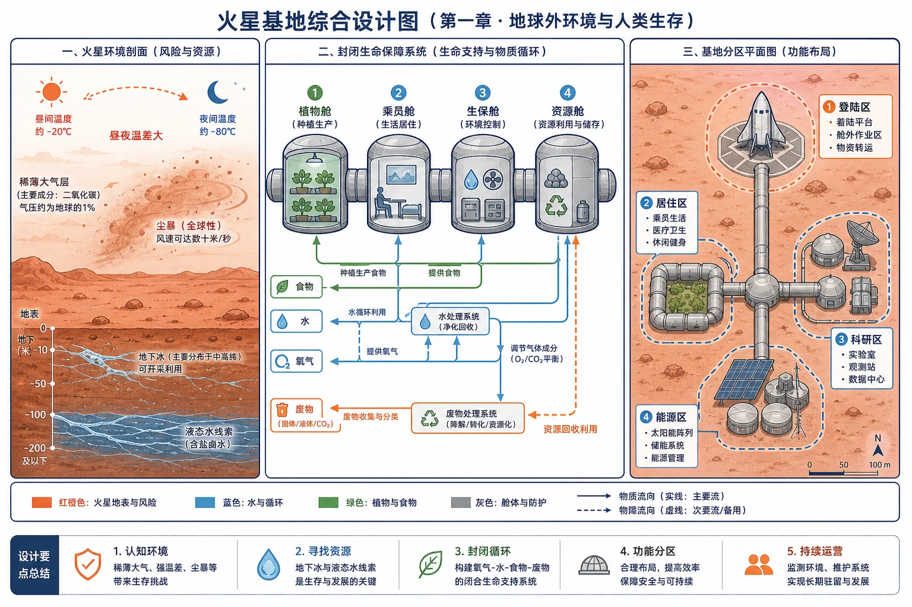
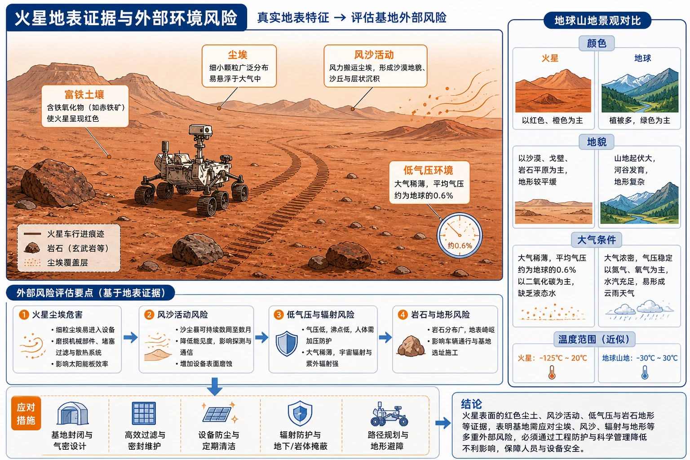
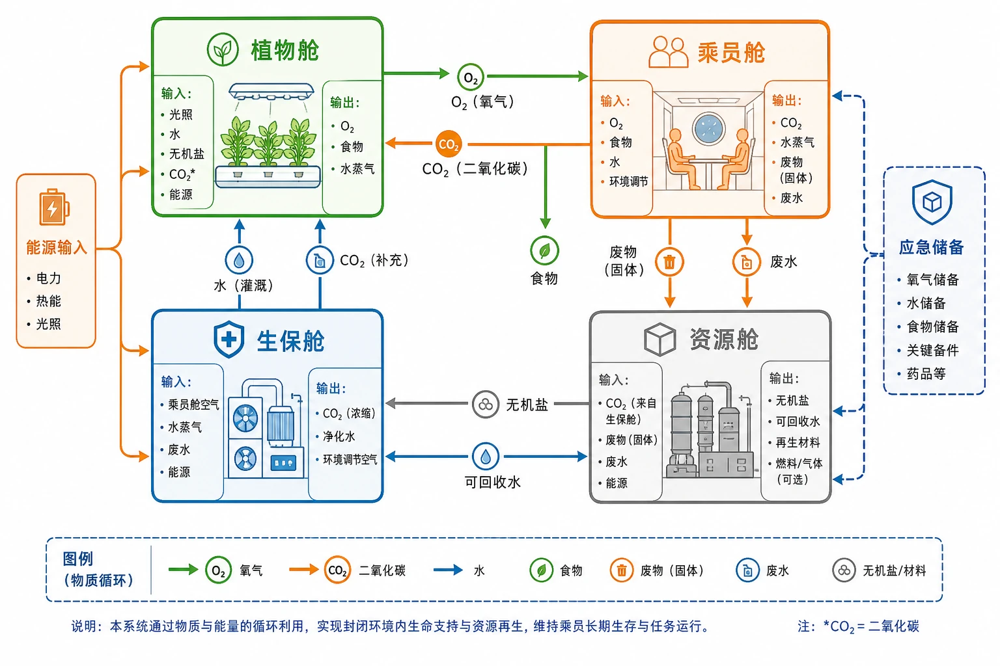

# 章末问题研究 火星基地应该是什么样子

<!-- 图片描述：绘制火星基地综合设计图：左侧为火星环境剖面，标出稀薄二氧化碳大气、昼夜温差、尘暴、地下冰和液态水线索；中央为封闭生命保障系统，依次连接植物舱、乘员舱、生保舱和资源舱；右侧为基地分区平面图，包含登陆区、居住区、科研区和能源区。使用红橙色表示火星地表和风险，蓝色表示水与循环，绿色表示植物和食物，灰色表示舱体与防护；用闭合箭头表现氧气、水、食物和废物的循环。该图用于综合调用第一章四节知识。 -->

## 知识关系导航

本探究主线：火星环境调查 → 人类生存条件评估 → 生命保障系统设计 → 基地分区和风险防护 → 地外居住的地理伦理与技术边界。

相关笔记：[[章首 学习导图|第一章总览]] · [[第一节 地球的宇宙环境#核心知识点讲解|地球的宇宙环境]] · [[第二节 太阳对地球的影响#核心知识点讲解|太阳辐射和空间天气]] · [[第四节 地球的圈层结构#核心知识点讲解|地球外部圈层]]

## 本节学习目标

- 能从大气、温度、水、土壤、辐射和沙尘暴等方面评价火星环境。
- 能区分“火星具有某些资源线索”和“火星适合人类直接生存”这两个判断。
- 能依据生态系统物质循环设计封闭或半封闭生命保障系统。
- 能综合考虑能源、居住、科研、登陆、资源和安全防护等基地功能。
- 能用地理要素、空间分区和因果链表达一个可解释的火星基地方案。

## 核心知识点讲解

### 1. 区域定位与地理情境：火星是与地球差异显著的行星

火星被称为“红色行星”，表层土壤富含铁元素。火星大气稀薄，二氧化碳含量很高；表面昼夜温差大，常年有大风和持续数周的沙尘暴。火星两极存在冰盖，中纬度地下和南极冰盖下有冰或液态水线索，说明火星过去可能有过更厚的大气和液态水。

这些条件说明火星存在可利用资源和地质环境证据，但不等于人类可以不经防护直接生存。评价宜采用“条件—限制—技术需求”的格式。

### 2. 核心概念与地理要素：人类长期生存需要什么

火星基地至少要满足：

- **大气条件**：提供可呼吸气体、适当气压，并隔绝外界有害环境。
- **温度条件**：保温、供热和控制昼夜温差。
- **水资源**：获取、净化、储存并循环利用水。
- **食物条件**：植物培养、营养补给和食品储存。
- **能源条件**：光伏、核能或其他稳定能源，保证供电和供热。
- **防护条件**：抵御辐射、尘暴、低气压和微陨石。
- **废物处理**：处理废水、废物和二氧化碳，维持物质循环。

### 3. 过程机制与成因链条：受控生态生保系统

“绿航星际”试验舱段由植物舱、乘员舱、生保舱和资源舱组成。其核心不是简单种植植物，而是通过多个功能单元协作，实现大气、水和部分食物的循环再生。

可概括为：

乘员呼吸和生活 → 产生二氧化碳、废水和废物 → 植物舱吸收二氧化碳并释放氧气、生物生产食物 → 生保舱处理废水废物并调节大气 → 资源舱储存和分配物质 → 返回乘员舱。

这是一个受控生态系统，不能理解为完全不需要外部输入。能源、维修材料、部分食物和应急物资仍需要储备或补给，因此方案要同时考虑循环效率与系统冗余。

### 4. 空间分布、图表判读与证据

设计基地分区时，先根据功能划分，再根据环境风险和联系安排空间：

| 基地分区 | 主要功能 | 位置和防护思路 |
|---|---|---|
| 登陆区 | 航天器降落、人员和物资转运 | 与居住区保持安全距离，设置缓冲区和导航标识 |
| 居住区 | 住宿、医疗、日常生活 | 置于防辐射、防尘和保温结构内部，靠近生保系统 |
| 科研区 | 地质、生命、气象和资源研究 | 与居住区相连但可独立隔离，便于样本处理 |
| 能源区 | 光伏、储能或其他能源系统 | 选择受尘暴影响较小且便于维护的位置，设置备用能源 |
| 资源区 | 水、冰、土壤和建筑材料利用 | 靠近资源点但要避免污染居住区和生保系统 |

### 5. 人地关系、影响与对策：地外居住的系统思维

火星基地不是把地球城市简单搬到另一颗行星，而是要依据当地环境重建适合人类生存的微型自然环境。方案应同时回答“人从环境获取什么”“人改变什么”“如何减少风险和废物”“系统失效时怎么办”。

设计对策包括：密闭或半密闭建筑、局部地下化或覆盖防护层、能源多元化、供水循环、植物舱和食物储备、尘暴预警、设备冗余、分区隔离和应急撤离。评价方案时还要考虑资源消耗、生态风险和长期维护成本。

### 6. 本探究原文图像注释与判读

- 图1.37：“祝融号”火星车拍摄的火星地貌。

<!-- 图片描述：展示火星红色尘土、岩石地表、远处地形和火星车行进痕迹，叠加标注“富铁土壤”“尘埃”“风沙活动”“低气压环境”；在画面边缘设置与地球山地景观的对比框，突出颜色、地貌和大气条件差异。该图帮助从真实地表证据评估火星基地的外部风险。 -->

- 图1.38：“绿航星际”试验舱段配置示意。

<!-- 图片描述：绘制植物舱、乘员舱、生保舱和资源舱的模块化结构，使用闭合箭头表示氧气、二氧化碳、水、食物和废物的循环，标出各舱输入输出；植物舱用绿色，生保舱用蓝色，乘员舱用橙色，资源舱用灰色，并设置“能源输入”和“应急储备”两个外部接口。该图帮助理解封闭环境内多功能单元协作。 -->

## 重点梳理

火星基地设计可以用五问检查：

1. 人在哪里住，如何保温、供氧和防辐射？
2. 水从哪里来，如何净化、储存和循环？
3. 食物如何获得，植物舱如何与乘员舱连接？
4. 能源从哪里来，尘暴或设备故障时有什么备用方案？
5. 登陆、科研、资源和居住区如何分区，如何避免相互干扰？

## 难点突破

### 难点一：区分“存在资源”与“适合生存”

火星地下有冰或曾经有液态水的证据，只能说明水资源线索和古环境信息；人类能否生存，还要看气压、温度、氧气、辐射、尘暴和水的可利用性。

### 难点二：理解生态循环不是零输入

封闭生态系统可以循环再生部分物质，但植物生长需要能源、营养盐和设备维护，系统也存在损耗。因此应写“减少补给需求、提高循环效率”，而不是“完全不需要外部物资”。

### 难点三：基地规划要同时考虑联系和隔离

生活区、生保区和资源区需要管线相连以提高循环效率，但登陆区、能源区和危险实验区又需要保持安全距离。空间设计的关键是“功能联系＋风险隔离”。

## 例题讲解

### 例题1：火星是否具备人类直接生存条件

**题目**：根据火星概况，判断火星是否具备人类直接生存条件，并说明理由。

**答案**：不具备。火星大气稀薄且以二氧化碳为主，缺少适宜人类呼吸的氧气和适当气压；表面温差大、低温和尘暴明显，存在辐射和资源获取困难等问题。火星存在冰和水的线索，但仍需通过工程技术完成水资源获取、净化和循环。

### 例题2：生命保障系统

**题目**：说明植物舱、生保舱和资源舱在火星基地中的作用及相互关系。

**答案**：植物舱通过光合作用吸收二氧化碳、释放氧气并提供部分食物；生保舱处理废水废物、调节大气并维持循环；资源舱储存和分配水、食物、能源及材料。三者与乘员舱通过气体、水和物质循环连接，形成受控生态系统。

### 例题3：基地分区

**题目**：为什么登陆区不宜紧邻居住区，能源区需要设置备用系统？

**答案**：登陆和起飞会产生冲击、尘埃和设备运行风险，需与居住区保持安全距离并设置缓冲区；火星尘暴和设备故障可能使光伏发电下降或中断，能源区设置储能和备用能源可提高基地连续运行和应急生存能力。

## 易错点整理

- 看到火星有水冰，就直接判定火星适合人类居住。
- 把火星大气中二氧化碳多，误写成“氧气充足”。
- 只设计居住舱，不设计水、食物、能源、废物和应急系统。
- 把封闭生态系统理解成完全不需要能源、维护和外部补给。
- 只画功能分区，不说明分区之间的物质循环和安全距离。
- 忽略尘暴、低气压、低温和辐射等环境风险。

## 考点考证点整理

1. 火星自然环境特征及其对人类生存的限制。
2. 地外基地基本生命保障条件。
3. 受控生态生保系统的组成、物质循环和外部输入。
4. 基地分区的功能、空间联系和风险隔离。
5. 运用“条件—问题—措施—保障”结构完成综合探究题。

## 练习题

1. 从大气、温度、水资源和风沙四个方面分析火星环境。
2. 设计一个火星基地的基本功能分区，并说明各区之间的联系。
3. 用箭头表示乘员舱、植物舱、生保舱和资源舱之间的氧气、二氧化碳、水和废物循环。
4. 如果火星尘暴持续数周，基地应采取哪些能源和生活保障措施？
5. 评价“把火星基地全部建在火星地表，用透明穹顶覆盖”的方案，至少指出两个风险并提出改进。

## 练习题答案

1. 火星大气稀薄且二氧化碳含量高，不适合呼吸且气压低；昼夜温差大、夜间低温明显；存在冰和液态水线索，但水资源需要探测、开采和净化；常年大风和沙尘暴会影响设备、能见度、光伏发电和舱体安全。
2. 可分为登陆区、居住区、科研区、能源区和资源区。登陆区与居住区保持距离，居住区靠近生保系统，科研区与居住区相连但可隔离，能源区便于采集和维护并配储能，资源区靠近水冰或土壤资源点并设置污染防护。
3. 乘员舱产生二氧化碳、废水和废物；植物舱吸收二氧化碳、释放氧气并提供部分食物；生保舱净化废水、处理废物并调节大气；资源舱储存和分配水、食物、能源与材料，再返回各舱使用。
4. 提前储存能源和生活物资，配置储能与备用能源，清洁和维护光伏板，减少非必要能耗，强化舱体密封和空气过滤，增加水和食物循环利用，并设置尘暴预报和应急停机方案。
5. 风险包括透明穹顶难以抵御辐射、低气压和温差，尘暴会遮挡太阳能并磨损结构，地表设备失效可能导致整体系统暴露。改进可采用部分地下化或覆盖防护层、分区模块化、设置备用能源和多层气密结构，并保留应急避难舱。
