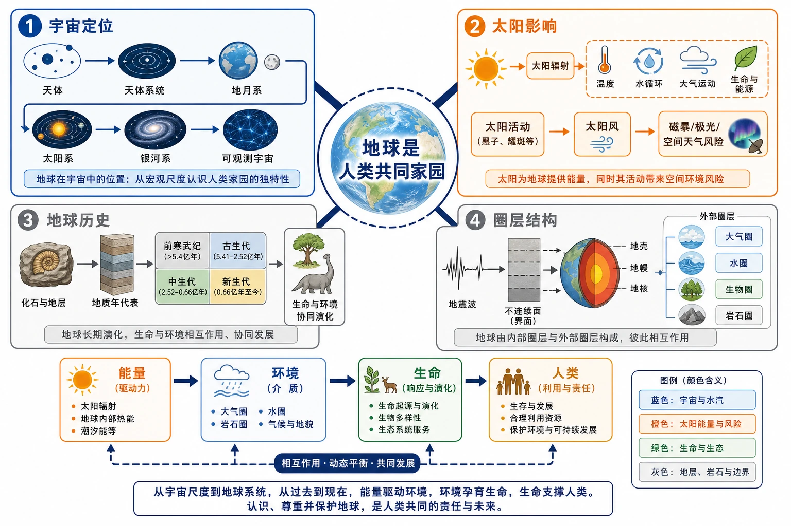

# 第一章 宇宙中的地球｜章首学习导图

<!-- 图片描述：绘制一张地理信息结构图：中心为“地球是人类共同家园”，向外分出四条带编号的主枝；①宇宙定位：天体→天体系统→地月系→太阳系→银河系→可观测宇宙；②太阳影响：太阳辐射→温度、水循环、大气运动、生命与能源，太阳活动→太阳风→磁暴/极光/空间天气风险；③地球历史：化石与地层→地质年代表→前寒武纪、古生代、中生代、新生代→生命与环境协同演化；④圈层结构：地震波→不连续面→地壳、地幔、地核，外部圈层→大气圈、水圈、生物圈、岩石圈。使用蓝色表示宇宙与水汽，橙色表示太阳能量与风险，绿色表示生命和生态，灰色表示地层、岩石与边界；用箭头标出“能量—环境—生命—人类”的联系。该图用于建立本章总框架，避免把四节当作互不相关的知识点。 -->

## 知识关系导航

本章主线是“定位地球—解释能量—追溯演化—认识结构”，四个问题共同回答：地球为什么适合生命存在，以及人类如何认识、保护这个家园。

- [[第一节 地球的宇宙环境|第一节：地球处在什么样的宇宙环境中]]
- [[第二节 太阳对地球的影响|第二节：太阳怎样影响地球的自然环境和人类活动]]
- [[第三节 地球的历史|第三节：地球和生命经历了怎样的演化]]
- [[第四节 地球的圈层结构|第四节：地球由哪些内外圈层组成]]
- [[章末问题研究 火星基地|章末探究：火星基地需要怎样的生命保障系统]]

## 本章学习主线

| 学习层次 | 关键问题 | 主要证据或工具 | 应形成的结论 |
|---|---|---|---|
| 宇宙定位 | 地球在宇宙中处于什么位置 | 天体、天体系统、行星特征 | 地球既普通又特殊 |
| 能量来源 | 地球的光热和许多自然过程从哪里来 | 太阳辐射、太阳活动图表 | 太阳是主要能量源，也会带来空间天气风险 |
| 时间演化 | 如何认识46亿年的地球历史 | 地层、化石、测年技术 | 环境与生命相互影响、共同演化 |
| 圈层结构 | 如何认识不能直接到达的地球内部 | 地震波、不连续面、圈层模型 | 内外圈层相互联系，构成自然环境 |

## 复习路线

1. 先熟记四级天体系统和八颗行星顺序，再解释地球的普通性与特殊性。
2. 再用“太阳辐射—地表温度—水和大气运动—生命活动”建立能量链，用“太阳活动—太阳风—地磁与大气扰动—人类活动”建立风险链。
3. 用“地层顺序＋化石组合＋岩石年龄”读地质年代，用“环境变化—生物演化—资源形成或灭绝”说明地球历史。
4. 用“地震波速度变化—不连续面—内部圈层”解释地球内部结构，用“圈层相互作用”分析自然景观。

## 本章关键结论

- 地球所处的天体系统按由低到高依次为地月系、太阳系、银河系和可观测宇宙。
- 地球是太阳系中一颗普通行星，但目前是已知唯一存在高级智慧生命的星球。
- 太阳辐射是地球光和热的主要源泉；太阳活动增强会扰动地球磁场和大气层。
- 化石和地层是研究地球历史的重要证据，地球历史可划分为前寒武纪、古生代、中生代和新生代。
- 地球内部包括地壳、地幔、地核，外部圈层包括大气圈、水圈和生物圈，并与岩石圈共同构成自然环境。
