# 第一节 地球的宇宙环境

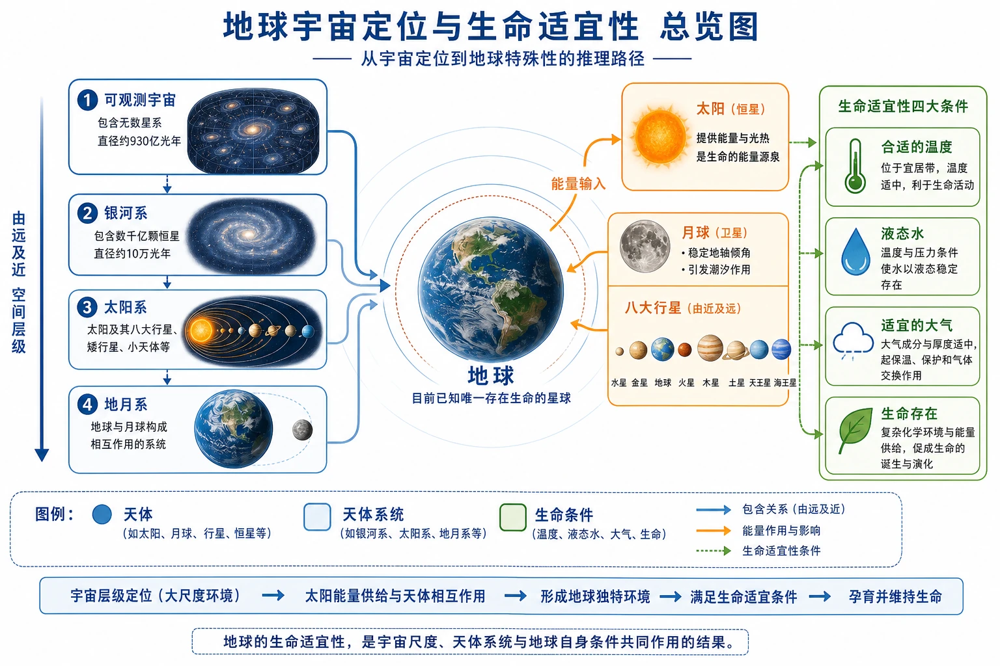
<!-- 图片描述：制作一张“地球宇宙定位与生命适宜性”总览图：左侧由远及近排列可观测宇宙、银河系、太阳系、地月系，中央突出地球；右侧连接太阳、月球、八颗行星和“温度—液态水—大气—生命”四个条件。用蓝色表示空间层级，橙色表示太阳能量，绿色表示生命适宜性；用同心框和箭头表现包含关系，并在图例中注明“天体”“天体系统”“生命条件”。该图用于统摄本节从宇宙定位到地球特殊性的推理路径。 -->

## 知识关系导航

本节推理链：宇宙中的物质存在形式 → 天体系统的引力联系 → 地球在天体系统中的位置 → 地球的普通性与特殊性 → 观测宇宙并保护宇宙环境。

相关笔记：[[章首 学习导图|第一章总览]] · [[第二节 太阳对地球的影响#核心知识点讲解|太阳辐射与太阳活动]] · [[第四节 地球的圈层结构#核心知识点讲解|地球圈层结构]]

## 本节学习目标

- 能区分天体与天体系统，并按层级准确写出地球所在的四级天体系统。
- 能按距日远近写出八颗行星，理解行星公转的同向性、共面性和近圆性。
- 能从距日远近、体积质量、公转特征和宇宙环境等角度说明地球的普通性与特殊性。
- 能用“观测对象—方位—高度角—时间—形状”的顺序完成简单月相观测。
- 能认识望远镜对人类宇宙观扩展的作用，并形成保护地球宇宙环境的意识。

## 核心知识点讲解

### 1. 区域定位与地理情境：地球位于怎样的宇宙层级

宇宙中的物质存在形式包括恒星、行星、卫星、星云、流星体、彗星以及星际空间物质等，能在宇宙空间中独立存在并被观测到的物质，统称为天体。判断一个对象是不是天体，关键看它是否是宇宙空间中的独立物质实体，而不是看它是否会发光。

运动中的天体相互吸引、相互绕转，形成具有层级关系的天体系统。地球所在的天体系统由低到高为：

| 层级 | 系统 | 组成和定位 |
|---|---|---|
| 低 | 地月系 | 地球是中心天体，月球是地球唯一的天然卫星，月地距离约38.4万千米 |
| ↓ | 太阳系 | 太阳是中心天体，八颗行星及其卫星、小行星、彗星、行星际物质等围绕太阳运行 |
| ↓ | 银河系 | 由太阳和1000亿颗以上的恒星组成，太阳距银河系中心约2.6万光年 |
| 高 | 可观测宇宙 | 银河系与目前观测到的许多河外星系共同构成 |

解题时要注意：地月系、太阳系、银河系和可观测宇宙是“系统名称”，地球、月球、太阳、银河系等在不同语境中可能分别充当天体或天体系统，不能混为一谈。

### 2. 核心概念与地理要素：行星地球的普通性与特殊性

太阳系八颗行星按距日由近及远为：水星、金星、地球、火星、木星、土星、天王星、海王星。

- 水星、金星、地球、火星靠近太阳，具有固体表面、体积较小，属于类地行星。
- 木星、土星体积巨大，主要由气体构成，属于巨行星。
- 天王星、海王星距太阳很远，属于远日行星。
- 八颗行星公转方向基本相同，公转轨道面接近共面，轨道形状接近正圆，这体现地球的普通性。

地球的特殊性体现在：目前人类掌握的宇宙信息表明，地球是八颗行星中唯一存在高级智慧生命的星球。其适宜生命存在的条件包括适宜的温度、液态水、适合生物呼吸和调节温度的大气，以及相对安全的宇宙环境。这些条件与地球在太阳系中的位置、自身体积和质量、地球的宇宙环境共同相关。

### 3. 过程机制与成因链条：为什么从太空看地球是明亮的

地球本身不是恒星，不会像太阳那样通过自身发光。太空中看到地球明亮，主要是因为地球反射太阳光；云层、冰雪和地表会增强或改变反射效果。因此，“明亮”不能作为地球是恒星的依据。

可以把地球生命适宜性概括为：

适中的日地距离 → 接收适量太阳辐射 → 适宜的地表温度 → 液态水和稳定大气 → 生物生存与繁衍

这是一条综合因果链，答题时不能只写“距离太阳适中”，还要说明它如何影响温度、水和大气，最后连接到生命。

### 4. 空间分布、图表判读与证据

读天体系统图时先看“包含关系”，再看“中心天体”和“运动关系”；读太阳系图时先按距日远近排序，再判断类地行星、巨行星和远日行星；读行星数据表时，轨道倾角、偏心率越小，通常越能说明公转轨道接近共面、接近正圆。

月相观测不是凭印象记录，而是一个有时间和空间参照的地理观测活动：

1. 用指南针确定东南西北，并选取固定地面标志作为水平方位参照。
2. 用拳头估算月亮高度角，一只拳头约对应10°。
3. 连续两周在同一时刻记录日期、方位、高度角和月亮形状。
4. 将观测结果制成表格或示意图，比较月亮位置与形状的逐日变化。

### 5. 人地关系、影响与对策：从宇宙探索到环境保护

天文望远镜使人类的观测范围从肉眼可见的天空扩展到太阳系外。哥白尼的日心说、伽利略对月球陨石坑和木星卫星的观测、赫歇耳对银河系的研究、哈勃对河外星系的发现，以及大型射电望远镜获取的宇宙信息，都说明工具进步会推动宇宙观更新。

航天活动增加了人类获取宇宙信息的能力，也带来了空间碎片增加等问题。地球是目前人类唯一的家园，保护近地空间环境、减少空间垃圾、提高航天活动的安全性，是人类共同责任。

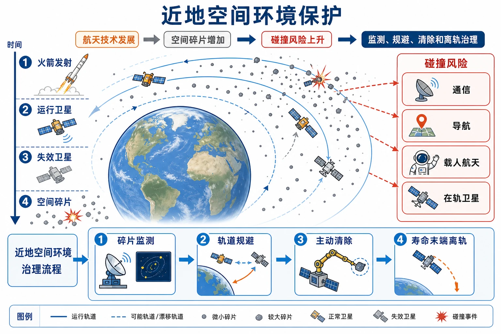
<!-- 图片描述：绘制近地空间环境保护示意图：以地球和近地轨道为中心，左侧用时间箭头表示火箭发射、卫星运行、失效卫星和碰撞产生空间碎片的累积过程，右侧标出碎片对通信、导航、载人航天和在轨卫星的风险；下方设置“碎片监测—轨道规避—主动清除—寿命末端离轨”的治理流程。用蓝色表示地球和轨道，灰色表示空间碎片，橙色表示航天器，红色表示碰撞风险，并标注“近地空间环境保护”。该图补充说明航天技术发展与空间垃圾增加之间的人地关系和治理对策。 -->

### 6. 本节原文图像注释与判读

- 图1.1：原图为风云四号卫星拍摄的地球。重点表现球形地球、蓝色海洋、白色云系和黑色宇宙背景，突出“地球反射太阳光而明亮”和“地球是人类家园”两个信息。
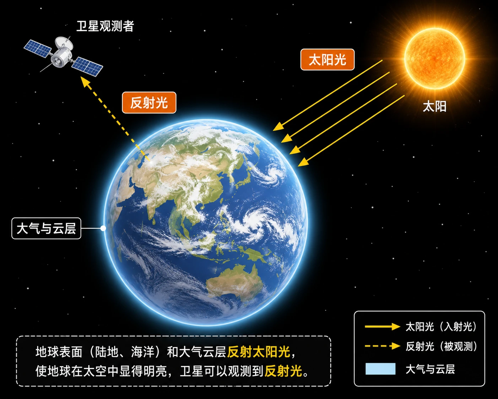
<!-- 图片描述：画面以太空黑色背景衬托蓝色地球，地球边缘有浅蓝色大气薄层，白色云带覆盖部分海陆；用细箭头从太阳方向指向地球，再用反射光箭头指向卫星观察者，标注“太阳光”“反射光”“大气与云层”。该图帮助解释地球明亮的原因，并建立地球—太阳—观测者的空间关系。 -->

- 图1.2：用四个并列图像呈现星云、恒星、行星和卫星，重点看它们的外观、发光方式和运动关系。
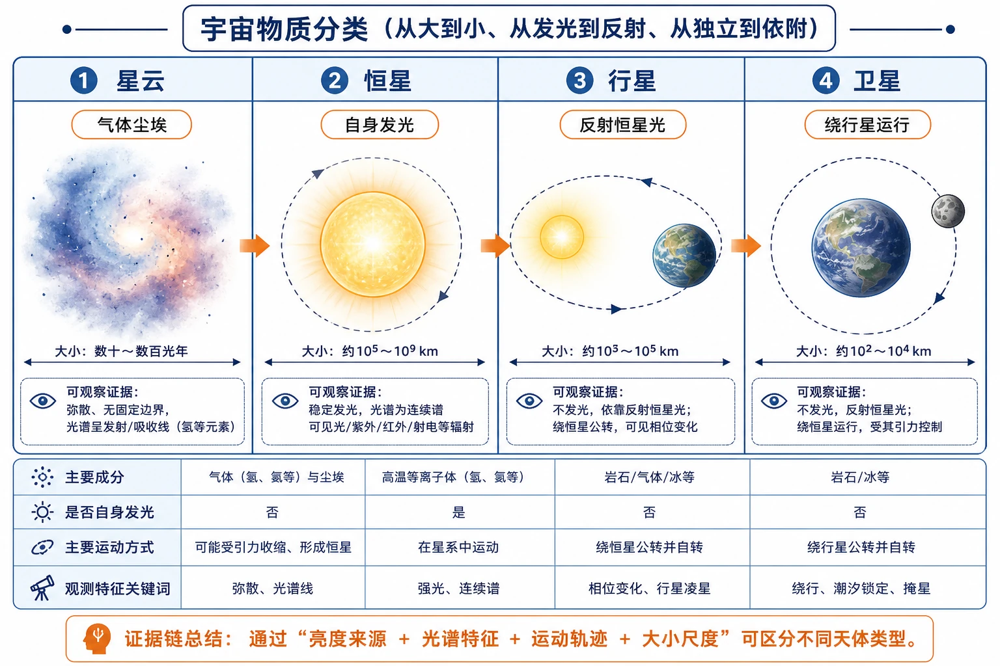
<!-- 图片描述：设计四格宇宙物质分类图，依次放置星云、恒星、行星、卫星；每格标出“气体尘埃”“自身发光”“反射恒星光”“绕行星运行”等关键词，并用大小、亮度和轨道小箭头区分对象。该图帮助学生建立天体分类的可观察证据。 -->
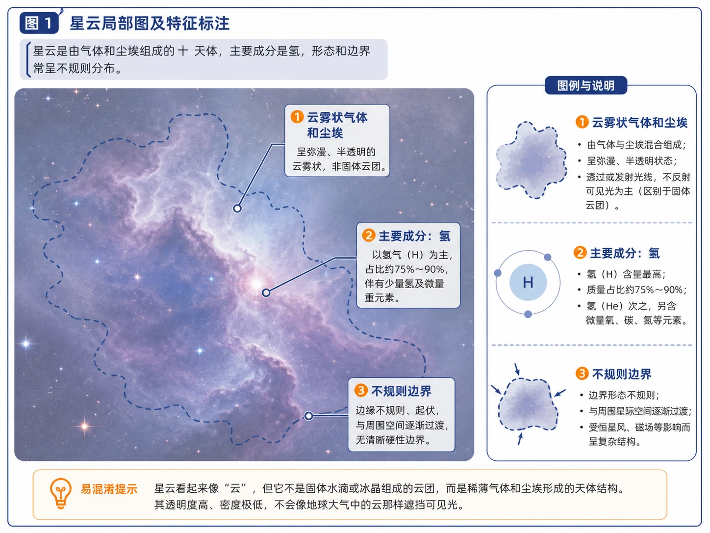
<!-- 图片描述：为星云局部图增加半透明标注层，指出云雾状气体和尘埃、主要成分氢以及不规则边界；采用蓝紫色低饱和背景，避免把星云误解为固体云团。 -->
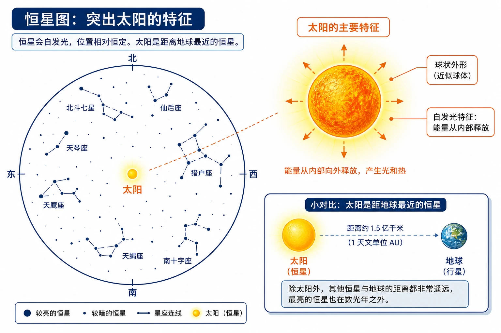
<!-- 图片描述：为恒星图突出太阳的球状外形和自发光特征，用黄色光晕和“能量从内部释放”箭头标注；旁边用小对比框说明太阳是距地球最近的恒星。 -->
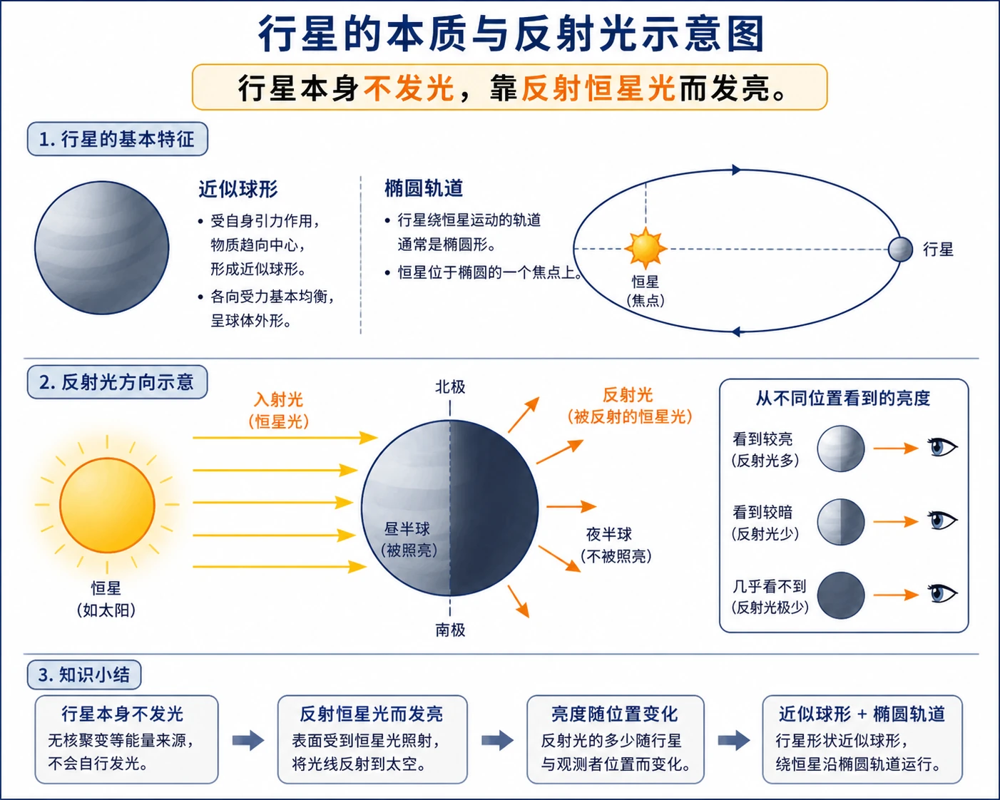
<!-- 图片描述：为行星图标出近似球形、椭圆轨道和反射光方向，使用灰蓝色本体与黄色入射光箭头；明确“本身不发光，靠反射恒星光而发亮”。 -->
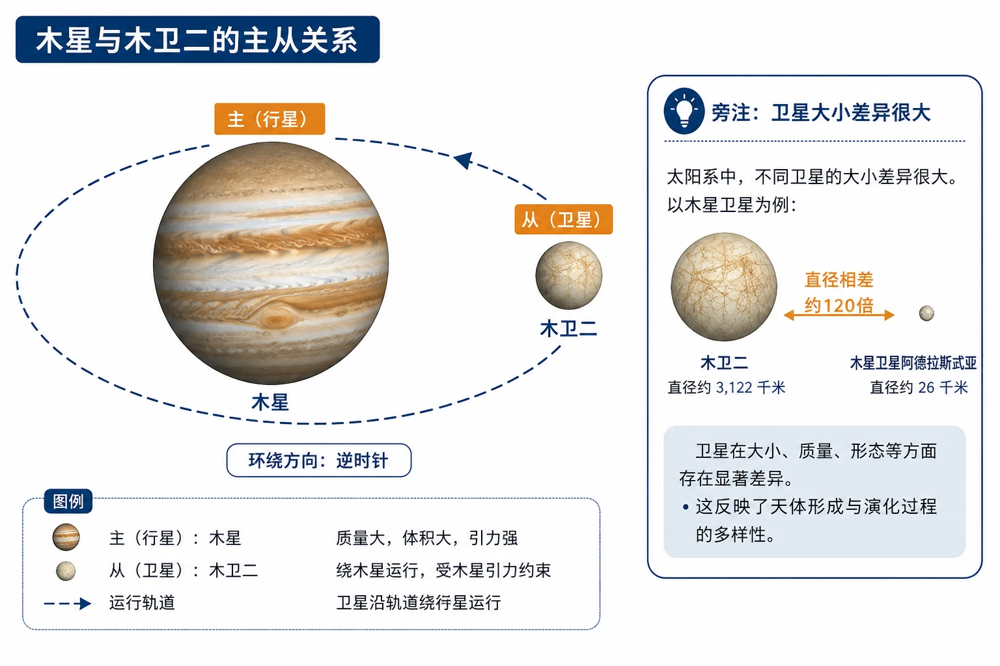
<!-- 图片描述：为卫星图标出木星和木卫二的主从关系，用环绕箭头表示卫星绕行星运行，并在旁注中说明卫星大小差异很大。 -->

- 图1.3：天体系统图按由低到高表现地月系、太阳系、银河系和可观测宇宙的包含关系。
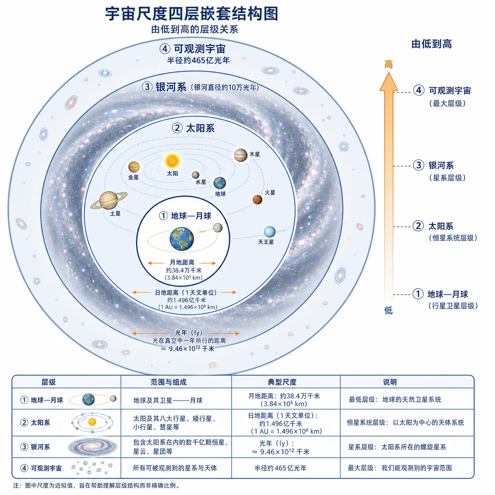
<!-- 图片描述：绘制四层嵌套的宇宙尺度图，中心为地球—月球，第二层为太阳系，第三层为银河系，最外层为可观测宇宙；每层用不同蓝灰色边界，配方向箭头和“由低到高”标尺，并标注月地距离、日地距离和光年单位。该图帮助理解层级而非简单的远近排列。 -->

- 图1.4：太阳系结构示意图表现太阳、八颗行星及轨道的相对顺序。
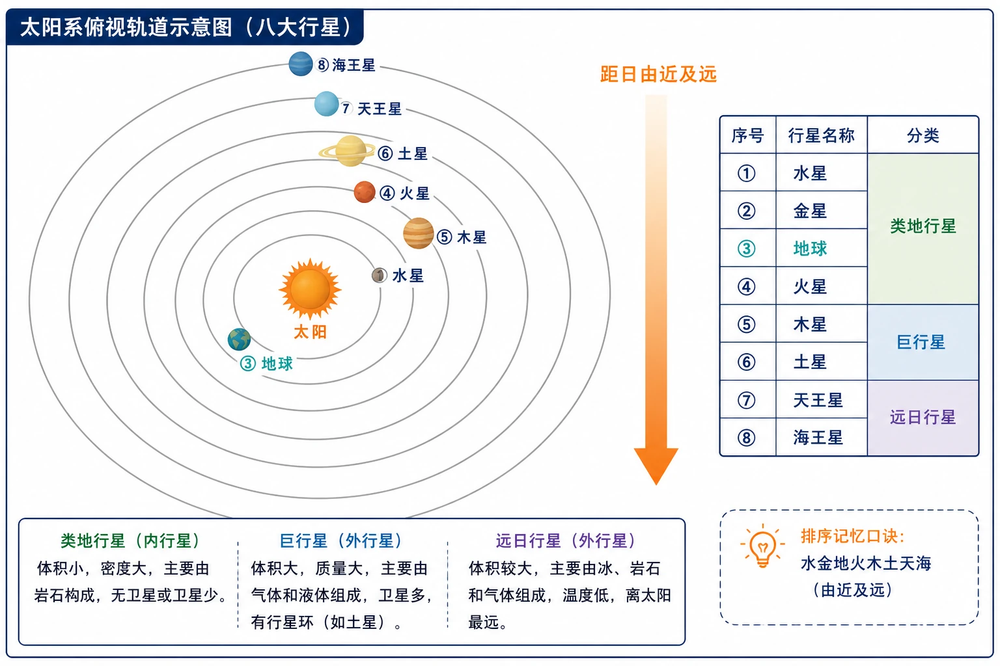
<!-- 图片描述：制作俯视太阳系轨道示意图，中央为太阳，八条近圆轨道由内向外排列并标注八颗行星；使用橙色标出太阳、蓝绿色标出地球、灰色表示轨道，配“距日由近及远”箭头。该图用于排序和类地行星、巨行星、远日行星分类。 -->

- 图1.5和图1.6：前者是从地球看到的银河，后者表现太阳系在银河系中的位置。
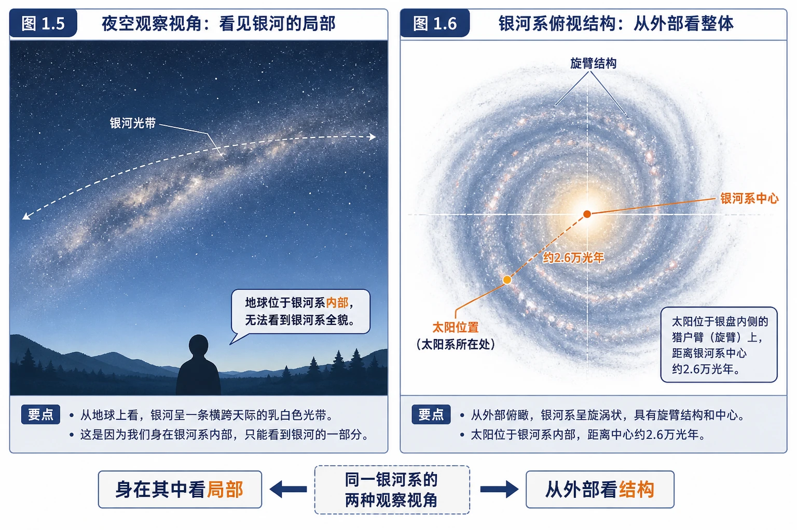
<!-- 图片描述：将图1.5处理为夜空观察视角，突出横跨天际的乳白色银河光带，并标出“地球位于银河系内部，无法看到银河系全貌”；将图1.6处理为银河系俯视结构，标出银河系中心、太阳位置和约2.6万光年的距离。两图配合帮助理解“身在其中看局部”与“从外部看结构”的差别。 -->

- 图1.7：用拳头叠放和水平基准线说明月亮高度角的估算方法。
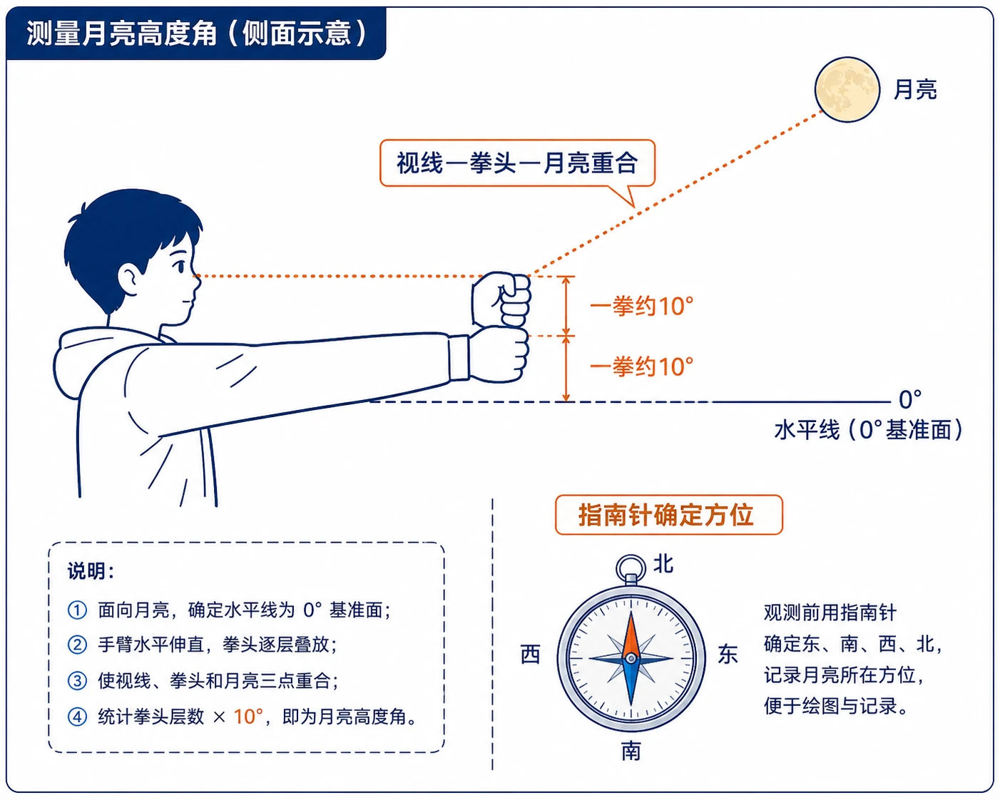
<!-- 图片描述：绘制观测者侧面示意，水平线为0°基准面，手臂水平伸直，两个拳头逐层叠放至月亮方向；标注“一拳约10°”“视线—拳头—月亮重合”和“指南针确定方位”。该图帮助把抽象高度角转化为可操作的观测步骤。 -->

- 图1.8：月相观测描绘示例表现同一时刻连续观测时月亮形状和位置的变化。
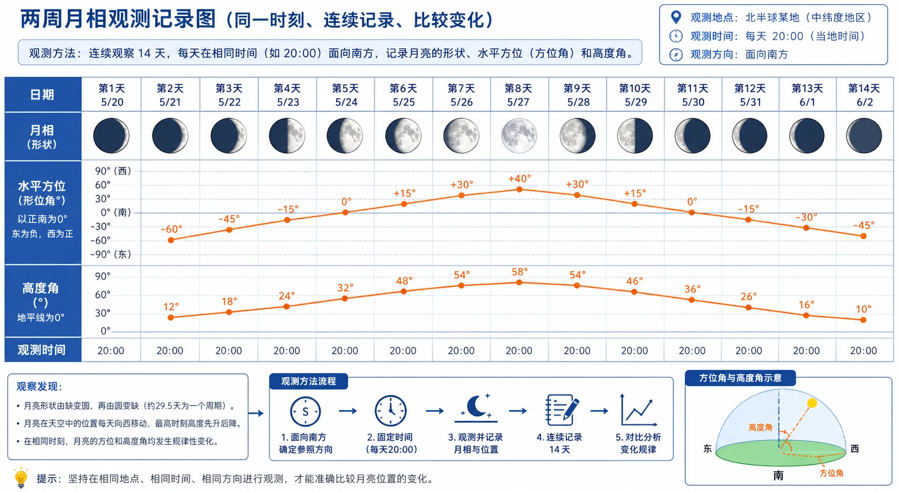
<!-- 图片描述：制作两周月相观测记录图，横向排列日期，纵向记录水平方位和高度角，每个日期配月亮形状小图；用折线连接位置变化，用渐变阴影表示月面明暗变化，并保留观测时间。该图用于训练“同一时刻、连续记录、比较变化”的地理观测方法。 -->

- 图1.9：原图用于比较八颗行星的类别、大小或基本特征。
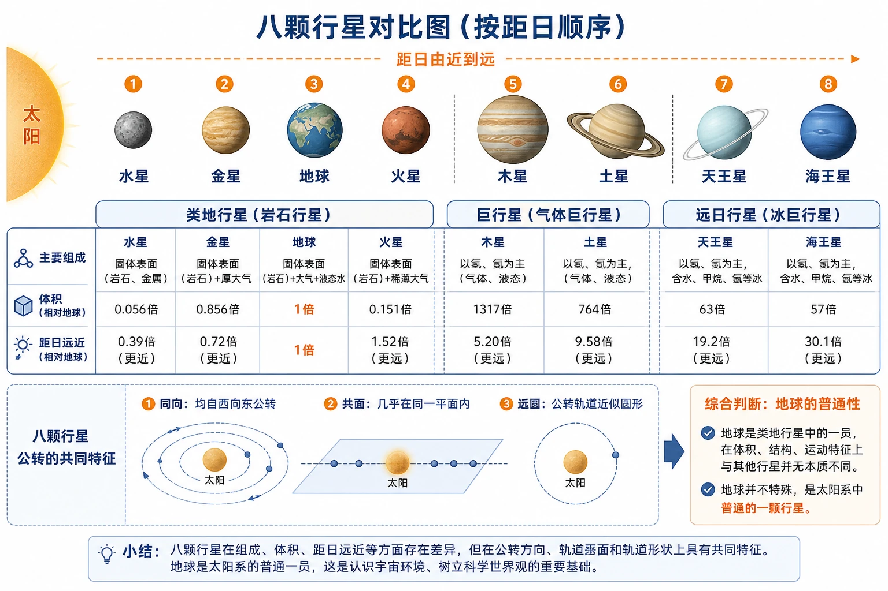
<!-- 图片描述：制作八颗行星对比信息图，按距日顺序排列，分成类地行星、巨行星和远日行星三组；每组标出固体表面或气体组成、体积大小、距日远近，底部加“同向、共面、近圆”的公转特征。该图帮助综合判断地球的普通性。 -->

- 图1.10：哈勃空间望远镜图像用于说明观测工具的发展。
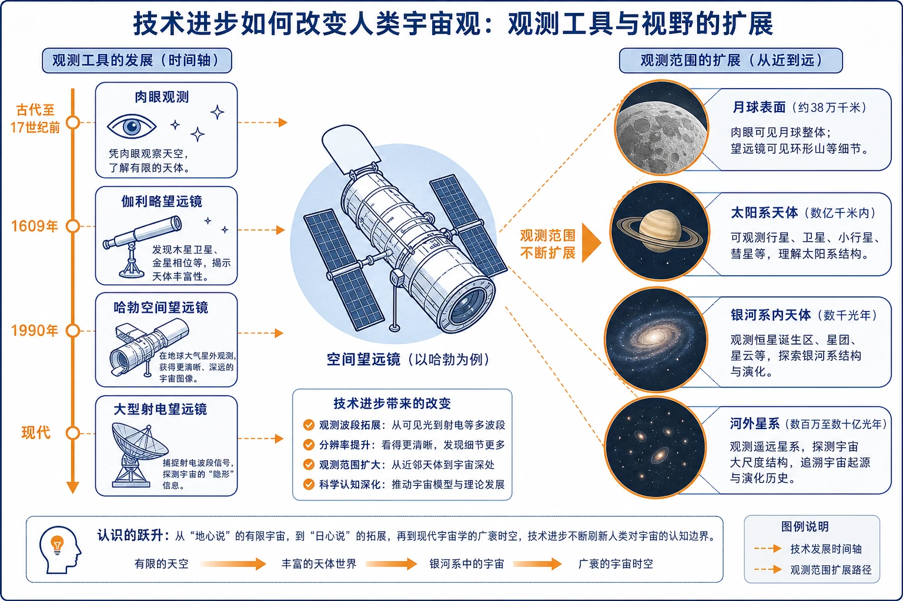
<!-- 图片描述：以空间望远镜为主体，左侧设置时间轴连接肉眼观测、伽利略望远镜、哈勃空间望远镜和大型射电望远镜，右侧用放大圈展示从月球表面到河外星系的观测范围扩展。该图帮助理解技术进步如何改变人类宇宙观。 -->

## 重点梳理

### 必背结论

1. 天体是宇宙中的物质实体；天体系统是运动中的天体相互吸引、相互绕转形成的系统。
2. 地球所在天体系统：地月系→太阳系→银河系→可观测宇宙。
3. 八颗行星：水、金、地、火、木、土、天、海；公转具有同向性、共面性和近圆性。
4. 地球普通在于它是太阳系八颗行星中的一颗，特殊在于目前已知只有地球存在高级智慧生命。

### 一句话判读

看到“发光”，先问是自身发光还是反射光；看到“层级图”，先找包含关系；看到“行星表”，先排序再分类；看到“地球适宜生命”，要写出温度、水、大气和安全宇宙环境的因果联系。

## 难点突破

### 难点一：天体和天体系统的区分

“月球”是天体，“地月系”是天体系统；“太阳”是天体，“太阳系”是天体系统；“银河系”本身是天体系统，不是单个恒星。判断时抓住“独立物质实体”与“相互吸引、绕转形成的整体”两个标准。

### 难点二：地球的普通性与特殊性不矛盾

普通性回答“在太阳系行星中是否独特”：地球与其他行星一样绕太阳公转，且具有共同的公转特征；特殊性回答“是否适合高级智慧生命”：目前掌握的证据表明地球在温度、水、大气和宇宙环境方面具有综合优势。

### 难点三：由图表证据推出结论

答题顺序建议为“读对象—找位置—看数量或方向—联系概念—形成结论”。例如，读八颗行星图时先确定距日顺序，再判断哪些是类地行星，最后说明地球属于普通行星而不是太阳系中心。

## 例题讲解

### 例题1：地球的宇宙位置

**题目**：按从低到高的层级写出地球所在的天体系统，并说明太阳在其中的作用。

**思路**：先写四级系统，再在太阳系层面说明中心天体和引力约束。

**答案**：地月系、太阳系、银河系、可观测宇宙。太阳是太阳系的中心天体，质量占太阳系总质量的绝大部分，以强大引力约束行星、卫星等天体按一定轨道运行。

### 例题2：地球适宜生命存在的条件

**题目**：从宇宙环境角度说明地球适宜高级智慧生命生存的主要条件。

**答案**：地球距太阳适中，接收太阳辐射适量，具有适宜的温度；地球有适量水，且存在液态水；地球具有适合生命生存的大气；地球所处宇宙环境相对安全，受到的灾害性影响较小。

### 例题3：读图判断行星类别

**题目**：某行星距太阳较近、体积较小、有固体表面，判断其类别，并说明地球与它的共同特征。

**答案**：该行星属于类地行星。地球与其共同特征是距太阳较近、体积相对较小、有固体表面，并且都绕太阳公转。

## 易错点整理

- 把“地球会发光”当成“地球是恒星”。地球明亮主要是反射太阳光。
- 把银河系写成天体，把太阳系写成恒星。前者是天体系统，后者是由太阳和其他天体构成的系统。
- 把“距太阳近”直接等同于“温度一定高”。地表温度还受大气、反照率等因素影响，本节强调的是适中的日地距离提供重要基础。
- 忘记八颗行星顺序中的“天王星、海王星”，或把类地行星与巨行星混淆。
- 观测月相时改变观测时刻或参照物，导致位置变化不可比。
- 只写地球“有水”，没有写“液态水”和温度、大气之间的联系。

## 考点考证点整理

1. **天体系统层级**：地月系、太阳系、银河系、可观测宇宙的顺序和组成。
2. **八颗行星排序与分类**：水金地火为类地行星，木土为巨行星，天王星和海王星为远日行星。
3. **地球的普通性**：从距日远近、体积、公转方向、公转轨道面和轨道形状说明。
4. **地球的特殊性**：从温度、液态水、大气和安全宇宙环境说明生命适宜性。
5. **天文观测方法**：方位、月亮高度角、连续同一时刻观测和记录。
6. **宇宙观演进**：观测工具进步扩大观测范围，航天发展同时带来空间环境保护问题。

## 练习题

1. 判断下列对象属于天体还是天体系统：月球、太阳系、银河系、太阳、地球。
2. 按距太阳由近及远写出八颗行星，并指出其中的类地行星。
3. 解释“地球是太阳系中一颗普通而特殊的行星”。
4. 某同学连续两周每天19时观测月亮，但每天选择不同地点且没有固定参照物。指出这种观测设计存在的问题，并提出改进方案。
5. 读“太阳系—银河系—可观测宇宙”层级图时，若把银河系和可观测宇宙的位置颠倒，说明其概念理解错在哪里？

## 练习题答案

1. 月球、太阳、地球属于天体；太阳系、银河系属于天体系统。判断依据是前者是独立物质实体，后者是天体相互吸引、绕转形成的整体。
2. 水星、金星、地球、火星、木星、土星、天王星、海王星；类地行星为水星、金星、地球和火星。
3. 普通性：地球与其他行星一样绕太阳公转，具有行星共同的公转特征，且属于类地行星。特殊性：目前已知地球是唯一存在高级智慧生命的星球，具有适宜温度、液态水、适合生命的大气和相对安全的宇宙环境。
4. 问题是地点和参照物不固定，水平方位难以比较。应选择视野开阔且相对固定的地点，使用指南针确定方向，选定固定建筑物或地物作参照，并每天在同一时刻记录方位、高度角和形状。
5. 银河系是由众多恒星组成的天体系统；可观测宇宙包括银河系和许多河外星系，范围更大，二者是被包含关系，不能颠倒。
