# 第三节 地球的历史

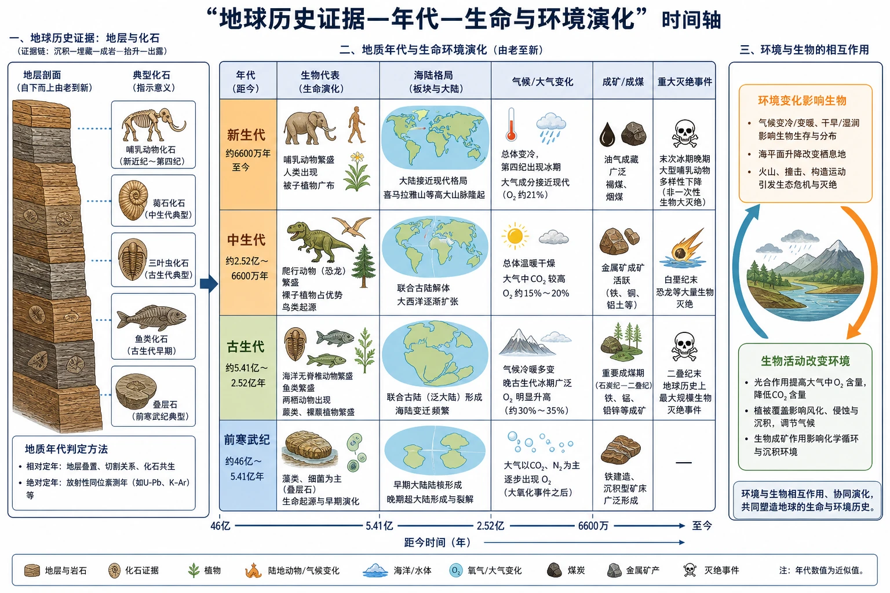
<!-- 图片描述：绘制“地球历史证据—年代—生命与环境演化”时间轴：左侧为地层剖面和化石，连接地质年代判定；中部按时间顺序排列前寒武纪、古生代、中生代、新生代；每一段同时标出生物代表、海陆格局、气候或大气变化、成矿/成煤和灭绝事件；右侧用双向箭头表示环境变化影响生物、生物活动又改变大气和生态环境。使用棕灰色表示地层与岩石，绿色表示植物，蓝色表示海洋和氧气，橙色表示陆地动物与气候变化。该图用于把“证据、年代、演化、环境”整合成一条地理时间线。 -->

## 知识关系导航

本节推理链：地层顺序与化石组合 → 地质年代划分 → 前寒武纪至新生代的环境和生命演化 → 古生物证据解释古地理环境与未来环境变化。

相关笔记：[[章首 学习导图|第一章总览]] · [[第二节 太阳对地球的影响#核心知识点讲解|太阳能量与环境变化]] · [[第四节 地球的圈层结构#核心知识点讲解|地球圈层结构]]

## 本节学习目标

- 理解地层、化石、地质年代和地质年代表的基本概念。
- 能根据地层上下关系、化石组合和岩石年龄判断相对或绝对年代。
- 能按前寒武纪、古生代、中生代、新生代梳理地球环境与生命演化。
- 能解释氧气增加、海陆变迁、气候变化与生物演化之间的联系。
- 能利用古生物化石和沉积岩特征推断古地理环境，并完成时间轴、表格和综合题。

## 核心知识点讲解

### 1. 区域定位与地理情境：地层是地球历史的“空间记录”

地球约有46亿年历史，经历过火山喷发、板块碰撞、海陆变迁、气候变化和生物演化。人类无法直接回到过去，主要通过地层、化石和岩石年龄等证据重建历史。

地层是具有时间顺序的层状岩石。对未明显倒转的沉积岩地层而言，一般先沉积的在下，后沉积的在上。生物遗体或遗迹在沉积物中保存形成化石，同一时代的地层往往含有相同或相似的化石。

### 2. 核心概念与地理要素：化石、地层和地质年代表

- **化石**：保存在沉积物或沉积岩中的生物遗体、遗迹或活动痕迹，是研究古生物和古环境的重要证据。
- **地层**：按沉积先后形成的层状岩石，记录了地表环境和生命活动的变化。
- **地质年代表**：依据地层顺序、生物演化阶段和岩石年龄等，把漫长地球历史按宙、代、纪等时间单位进行系统编年。

用化石判断地层时代时，重点关注化石组合而不是单个化石。生物从低级向高级、从简单向复杂演化的趋势，可帮助判断地层的新老；但地层可能因地壳运动发生倾斜、褶皱、断裂或缺失，需要结合地质构造和多种证据。

寒武纪被作为显生宙开始的重要标志，是因为距今5.41亿年以后，动物化石数量和种类明显增加，大量有硬壳或骨骼的生物出现，生命形态和结构显著复杂化。

### 3. 过程机制与成因链条：环境与生命的协同演化

生命演化与环境变化相互作用：

地球形成并逐渐出现海洋和陆地 → 蓝细菌通过光合作用释放氧气 → 大气成分改变 → 真核生物和多细胞生物发展 → 生物活动反过来改变大气、水体和地表环境。

另一条常见链条是：

海陆格局和气候变化 → 生存条件改变 → 生物迁移、适应、演化或灭绝 → 化石组合变化 → 科学家据此重建古地理环境。

答题时应区分自然环境因素和生物因素：海陆变迁、气候冷暖、氧气含量和水体范围属于环境因素；光合作用、植物繁盛、动物演化和物种灭绝属于生物过程。

### 4. 空间分布、图表判读与证据

地层对比题的步骤是：

1. 判断地层是否正常叠置，先下后上。
2. 找出相同或相似的化石组合，将其作为同时代地层的证据。
3. 比较两地地层的岩性、厚度、缺失和变形情况。
4. 用海陆变迁、沉积环境变化、地壳抬升或下沉、侵蚀和断裂等解释差异。

地质年代表题的步骤是：

1. 先定位时间范围和年代边界。
2. 再按生物演化顺序填入蓝细菌、无脊椎动物、两栖动物、爬行动物、哺乳动物等代表。
3. 将联合古陆、氧气增加、蕨类繁盛等环境或生命事件与相应年代对应。
4. 最后检查事件的先后关系，避免把“出现”和“繁盛”混为一谈。

### 5. 人地关系、影响与对策：古生物学为认识未来提供证据

古生物学家通过骨骼化石、脚印化石、粪便化石和植物化石等，推断生物的体形、行走速度、外貌、饮食和生存环境，再结合沉积岩特征和测年技术，重建地质历史时期的生物多样性与环境关系。

这些研究并非只为复原恐龙。古环境变化和生物响应的长期记录，可以帮助人类认识气候变化、物种灭绝和生态系统演替的规律，为应对未来环境变化提供参照。

### 6. 地球演化历程

| 时期 | 时间范围 | 环境与海陆格局 | 生命演化和资源 |
|---|---|---|---|
| 前寒武纪 | 地球诞生—距今5.41亿年，约占地球历史90% | 大气、海洋和陆地逐渐形成；早期缺少氧气，后来氧气增加 | 蓝细菌、真核生物和多细胞生物出现；重要成矿期 |
| 古生代 | 距今5.41亿—2.52亿年 | 海陆格局多次变迁，后期大陆汇聚为联合古陆 | 海洋无脊椎动物、鱼类、两栖动物、爬行动物发展；蕨类繁盛，重要成煤期；末期大灭绝 |
| 中生代 | 距今2.52亿—6600万年 | 联合古陆在三叠纪晚期开始解体，大陆向现今位置漂移 | 爬行动物和恐龙繁盛，鸟类和小型哺乳动物出现；裸子植物兴盛；末期大灭绝 |
| 新生代 | 距今6600万年至今 | 现代海陆格局形成，现代高大山脉形成；第四纪冷暖交替 | 被子植物、草原和哺乳动物发展，第四纪出现人类；冰期时海平面下降，间冰期海平面上升 |

### 7. 本节原文图像注释与判读

- 图1.21及相邻化石图：梁龙化石骨架引出“生物灭绝与地球环境变化”的问题。
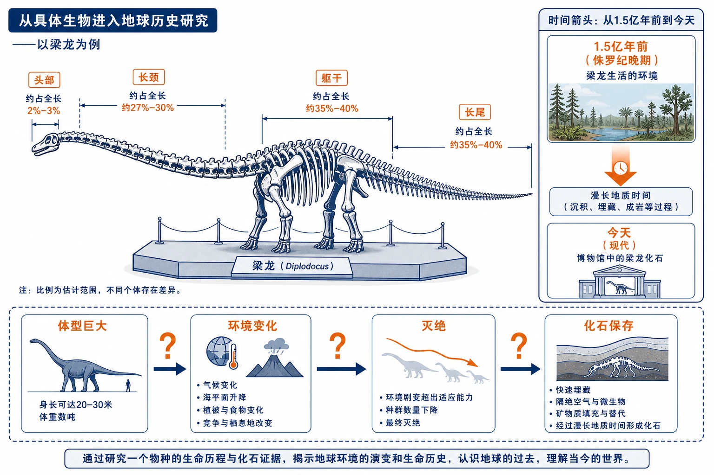
<!-- 图片描述：以博物馆中的梁龙骨架为主体，标注头部、长颈、躯干和长尾的比例，旁边设置1.5亿年前生活环境与今天博物馆化石的时间箭头；用问号连接“体型巨大—环境变化—灭绝—化石保存”。该图帮助从具体生物进入地球历史研究。 -->
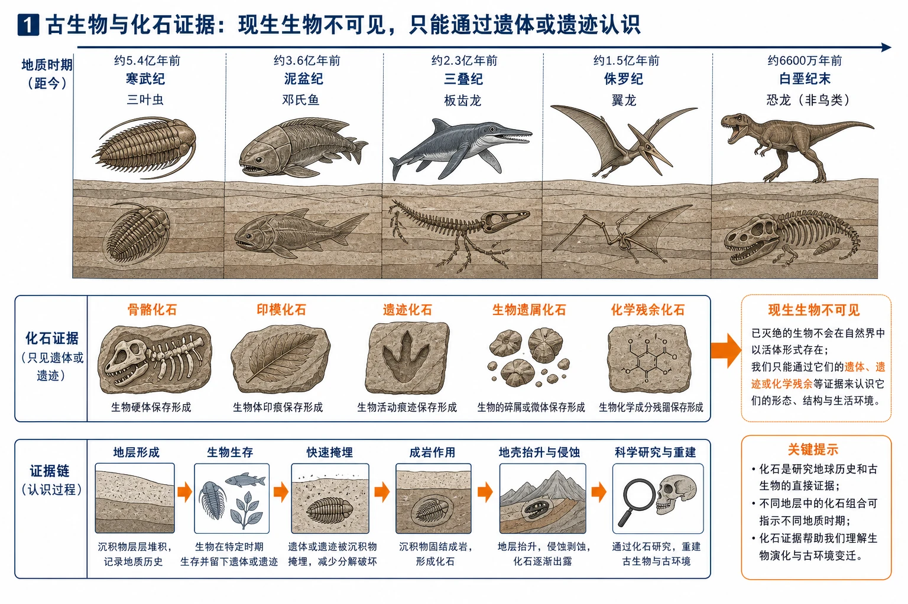
<!-- 图片描述：为相邻的古生物图像增加时间标签和化石证据标签，突出“现生生物不可见、只能通过遗体或遗迹认识”的信息；背景采用棕灰色地层纹理，避免把复原图误认为现代景观照片。 -->

- 图1.22：太行山王莽岭地层，重点看层状结构和上下时间顺序。
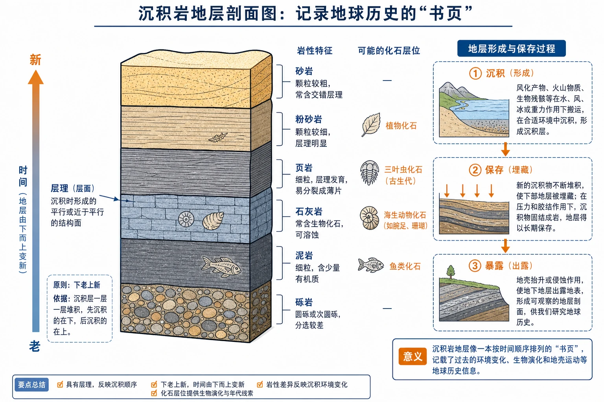
<!-- 图片描述：绘制地层剖面图，标出层理、下老上新、岩性差异和可能的化石层位；左侧用向上时间箭头，右侧设置“沉积—保存—暴露”的小流程。该图帮助理解沉积岩地层为何能记录地球历史。 -->

- 图1.23及思考图：A、B两地地层对比，重点看相同化石层和地层差异。
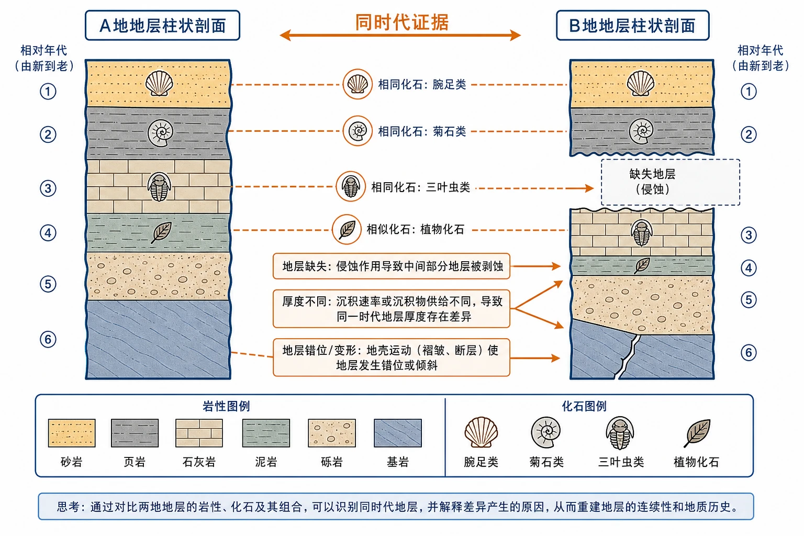
<!-- 图片描述：左右并列A地和B地地层柱状剖面，用虚线连接具有相同或相似化石的层位；在两地之间标注“同时代证据”，在缺失、厚薄不同或错位处设置“沉积环境变化、地壳运动、侵蚀”的解释框。该图用于训练地层对比和证据推理。 -->
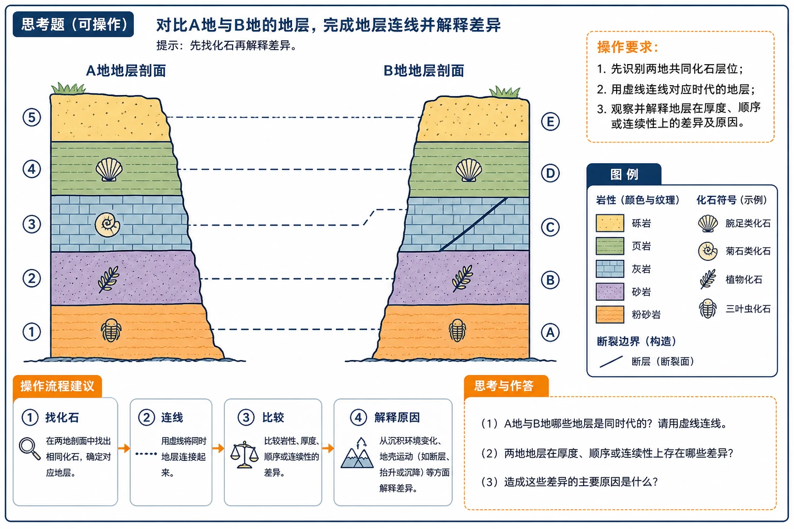
<!-- 图片描述：将思考题设计成可操作的地层连线图，保留不同颜色岩层、化石符号和虚线连接区域；在图例中区分岩性、化石和断裂边界，提示学生先找化石再解释差异。 -->

- 图1.24：地质年代表示意及其时间尺度图。
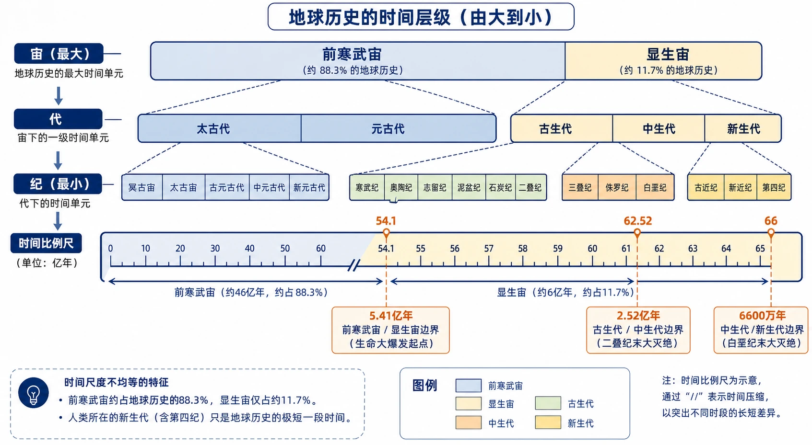
<!-- 图片描述：绘制由大到小的时间层级图，依次标出宙、代、纪和主要时间边界；用横向比例尺强调前寒武纪占地球历史大部分，显生宙相对较短，并在关键节点标注5.41亿年、2.52亿年和6600万年。该图用于建立“时间尺度不均等”的概念。 -->
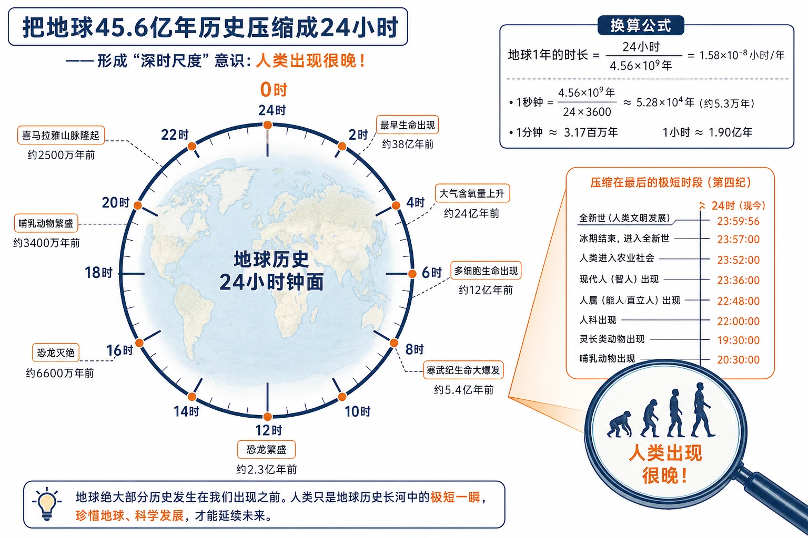
<!-- 图片描述：为地球历史压缩成24小时的思考图添加钟面和换算公式，地球诞生标为0时，现今接近24时，第四纪和人类出现压缩在最后极短时段；用放大镜突出“人类出现很晚”。该图帮助形成深时尺度意识。 -->

- 图1.25：蓝细菌形成叠层石的古今对比图。
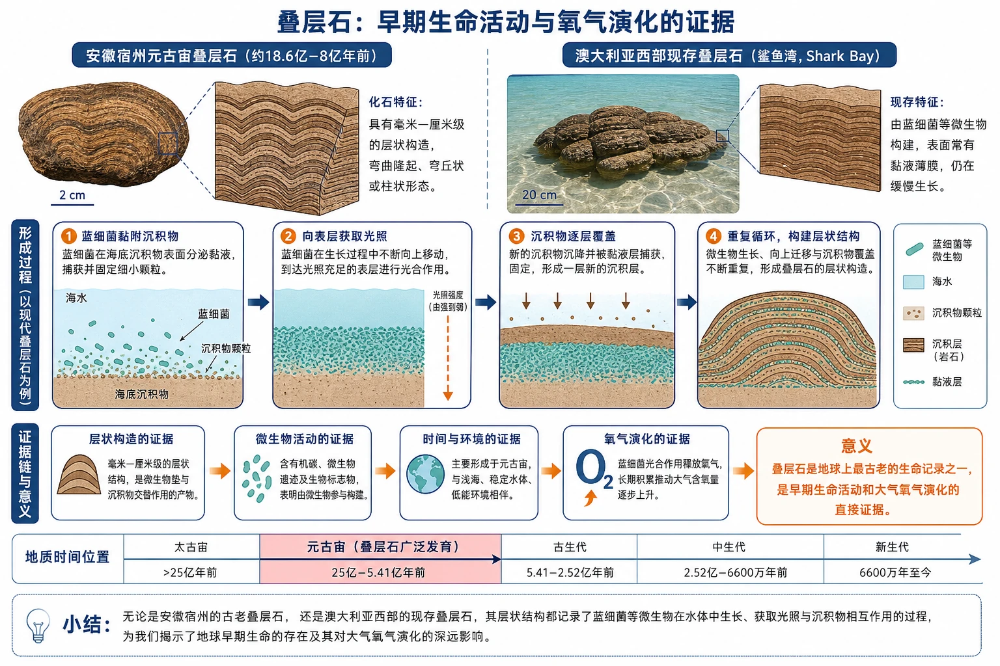
<!-- 图片描述：左右对比安徽宿州元古宙叠层石和澳大利亚西部现存叠层石，插入蓝细菌黏附沉积物、向表层获取光照、沉积物逐层堆积的过程箭头；用蓝绿色表示微生物和海水，用棕色表示层状岩石。该图帮助理解化石结构如何证明早期生命活动和氧气演化。 -->

- 图1.26：联合古陆示意图。
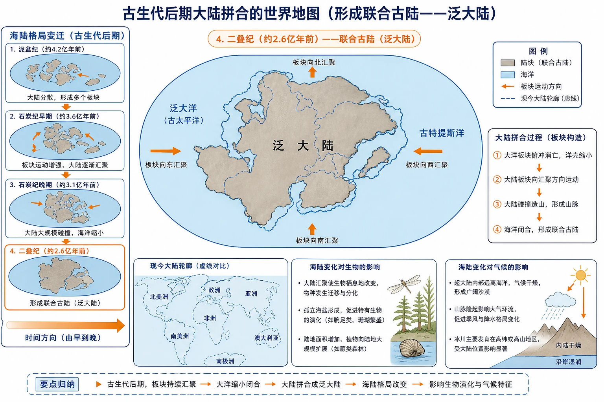
<!-- 图片描述：绘制古生代后期大陆拼合的世界地图，标出各大陆汇聚为联合古陆的轮廓，配板块运动箭头和“海陆格局变迁”的时间方向；用灰褐色表示陆块、蓝色表示海洋、虚线表示现今大陆轮廓。该图帮助分析海陆变化对生物和气候的影响。 -->

- 图1.27：寒武纪海洋景观复原图。
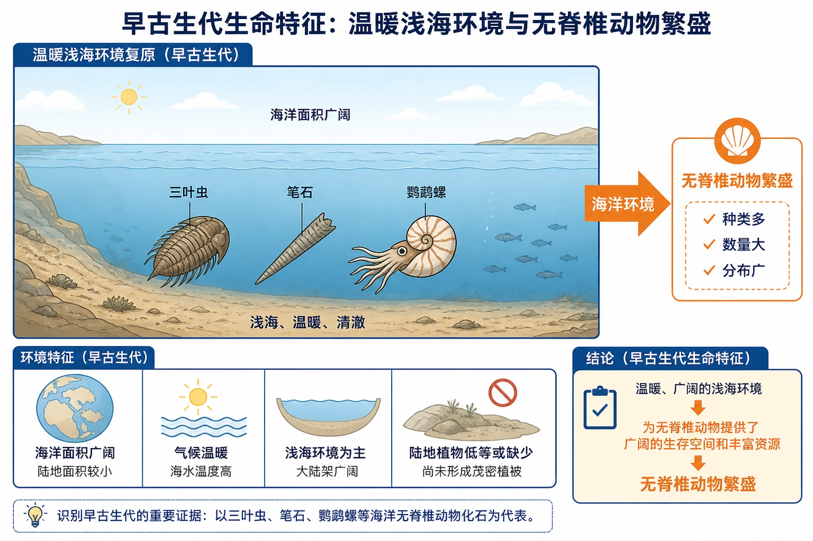
<!-- 图片描述：复原温暖浅海环境，标出三叶虫、笔石、鹦鹉螺等海洋无脊椎动物，背景表现海洋面积广、陆地植物低等或缺少；用箭头说明“海洋环境—无脊椎动物繁盛”。该图用于识别早古生代生命特征。 -->

- 古生代末期生物演化时间图：表现奥陶纪至二叠纪的年代和生物事件。
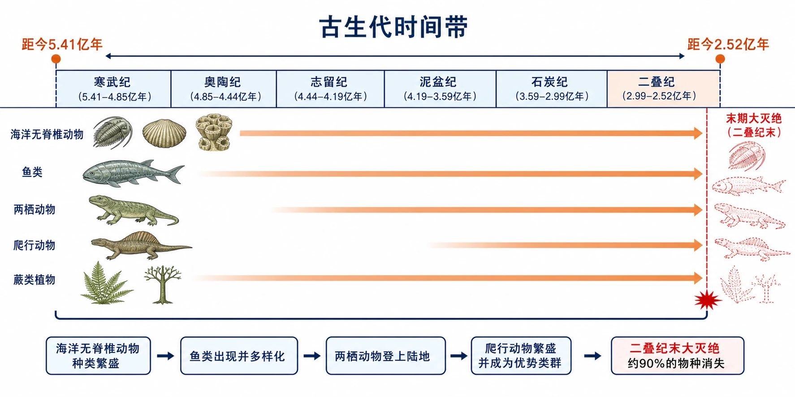
<!-- 图片描述：制作古生代时间带，左端标距今5.41亿年，右端标距今2.52亿年，在中间排列海洋无脊椎动物、鱼类、两栖动物、爬行动物、蕨类植物和末期大灭绝；用红色断点突出二叠纪末物种消失。该图帮助将生物演化与年代边界对应起来。 -->

- 图1.28和图1.29：侏罗纪景观复原与中华龙鸟复原。
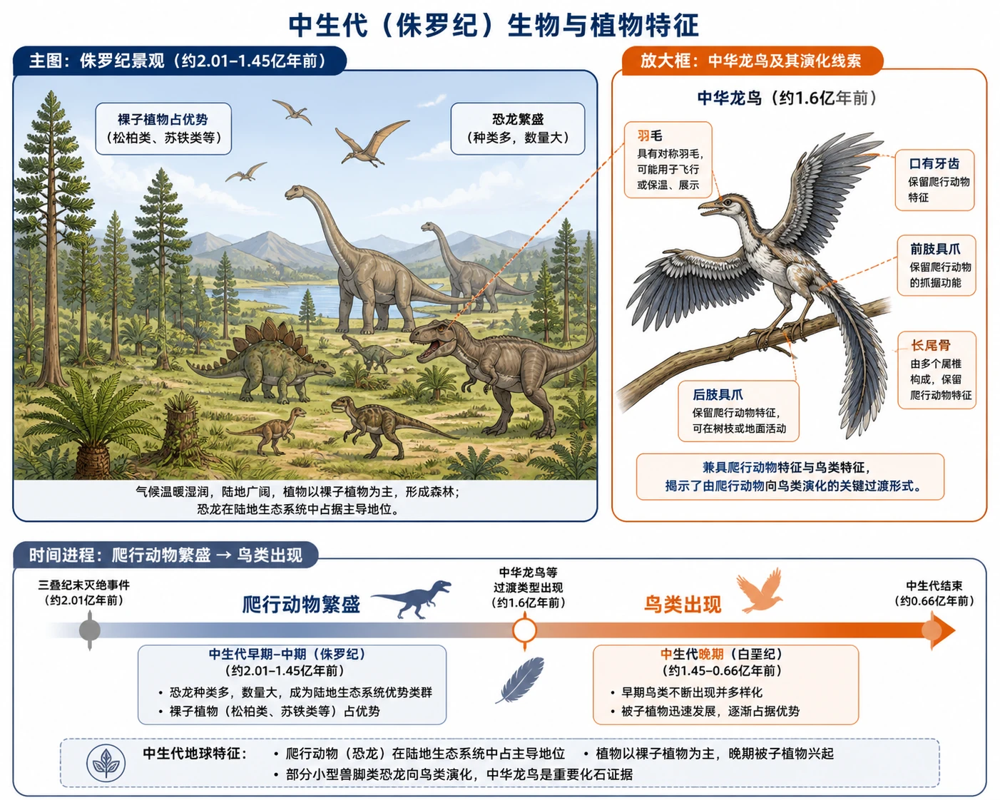
<!-- 图片描述：将侏罗纪景观和中华龙鸟分成主图与放大框，主图表现恐龙繁盛、裸子植物占优势，放大框表现具有羽毛的中华龙鸟及其由爬行动物向鸟类发展的线索；用时间箭头连接“爬行动物繁盛—鸟类出现”。该图帮助理解中生代生物和植物特征。 -->

- 新生代时间带及图1.30第四纪早期北美平原景观。
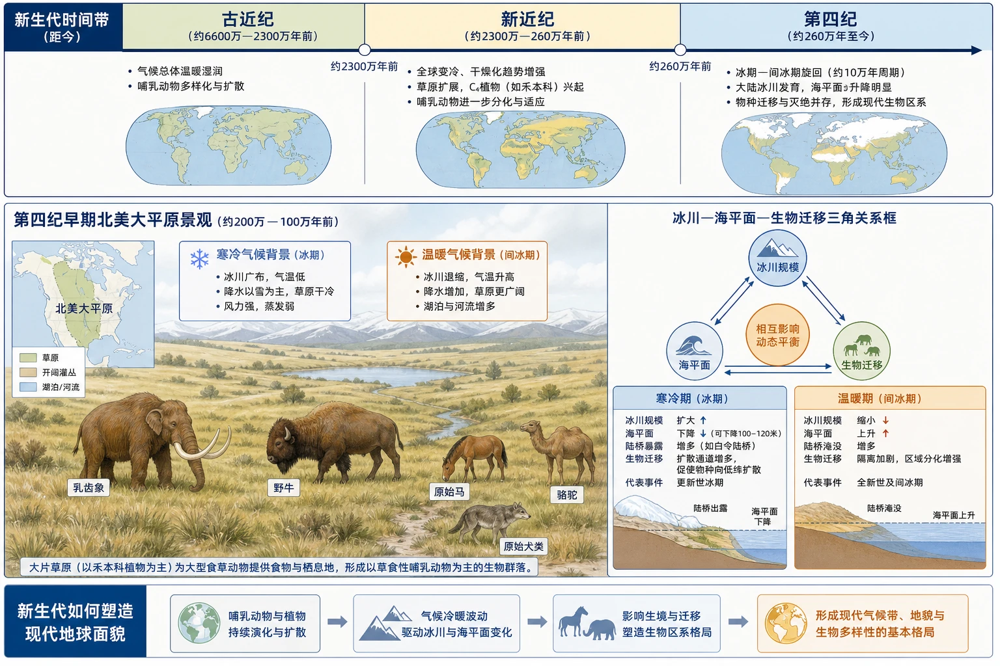
<!-- 图片描述：上方用时间带排列古近纪、新近纪和第四纪，下方用第四纪早期北美大平原景观展示草原、哺乳动物和冷暖气候背景；用冰川—海平面—生物迁移三角关系框说明寒冷期与温暖期的差异。该图帮助理解新生代现代面貌的形成。 -->

- 图1.31：主要地质年代特征示意，综合填入环境与生命事件。
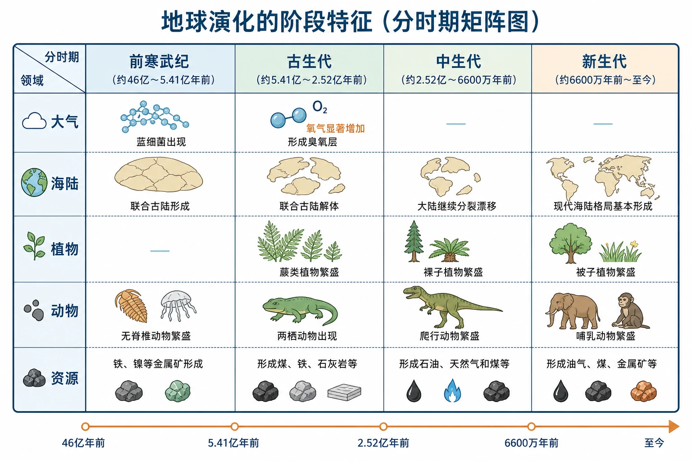
<!-- 图片描述：绘制分时期矩阵图，横向为前寒武纪、古生代、中生代、新生代，纵向为大气、海陆、植物、动物和资源；将蓝细菌、氧气、联合古陆、无脊椎动物、蕨类、两栖动物、爬行动物和哺乳动物放入对应格。该图用于练习跨时间维度的综合归纳。 -->
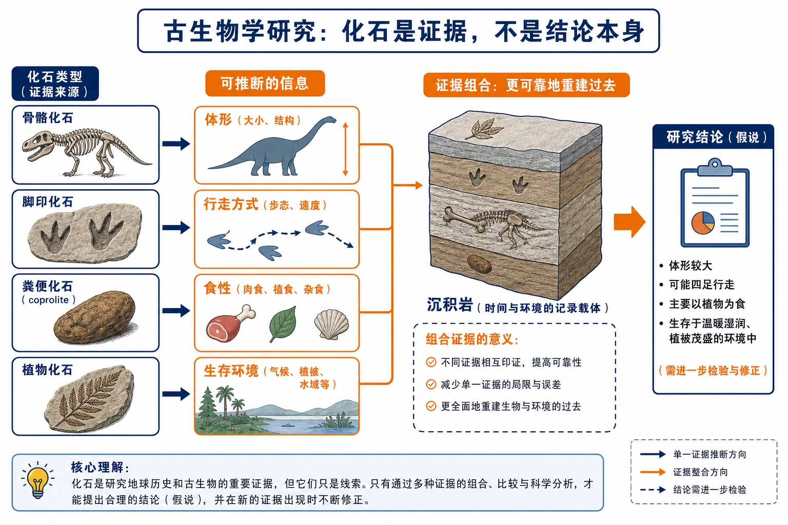
<!-- 图片描述：为古生物学研究前的辅助图添加化石类型—可推断信息的关系箭头，骨骼对应体形、脚印对应行走、粪便对应食性、植物化石对应环境；配沉积岩图标说明证据组合。该图帮助理解“化石是证据，不是结论本身”。 -->

- 图1.32：古生物学家对化石进行保护性发掘。
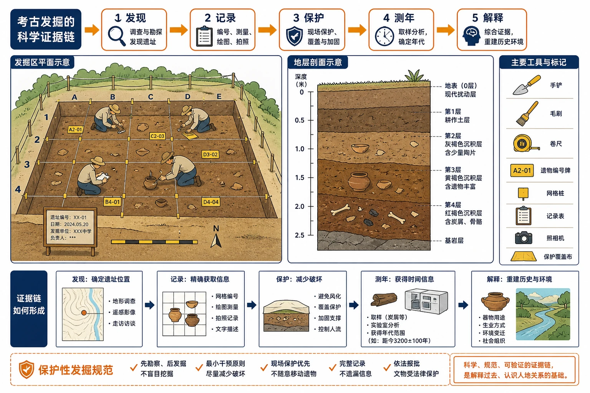
<!-- 图片描述：画面展示发掘区、地层剖面、工作人员、刷具和编号网格，箭头连接“发现—记录—保护—测年—解释”；用棕色表示地层、绿色表示植被、黄色表示工具和标记。该图强调科学研究的证据链和保护性发掘规范。 -->

## 重点梳理

### 四个时期的快速记忆

- 前寒武纪：地球环境形成、蓝细菌和氧气、早期生命、成矿。
- 古生代：海洋无脊椎动物到脊椎动物、蕨类森林、联合古陆、成煤、末期大灭绝。
- 中生代：联合古陆解体、恐龙和裸子植物繁盛、鸟类和小型哺乳动物出现、末期大灭绝。
- 新生代：现代海陆格局和山脉形成、被子植物和哺乳动物繁盛、第四纪出现人类并有冰期变化。

### 证据链

地层上下关系提供相对时间，化石组合提供生物时代和古环境线索，岩石年龄和测年技术提供更精确的年代，三者结合才能可靠重建地球历史。

## 难点突破

### 难点一：地层新老与地层形态

“下老上新”是正常沉积地层的基本规律，但地壳运动可能使地层倾斜、褶皱甚至倒转。遇到复杂图形，先找化石和岩性，再判断地层是否经过构造变动，不能只按图面高低作答。

### 难点二：地质年代与生物演化

年代边界不是由某一种动物“突然出现”简单决定，而是综合地层、化石、岩石年龄等证据划分。要区分“出现”“发展”“繁盛”和“灭绝”，例如中生代是恐龙繁盛时代，但恐龙在中生代末期灭绝。

### 难点三：环境变化与生物演化的双向关系

海洋面积、气候和氧气等环境条件会影响生物演化；蓝细菌光合作用、植物繁盛等生物活动也会改变大气和地表环境。综合题要至少写出一条环境影响生物的链条，并补充生物对环境的反馈。

## 例题讲解

### 例题1：地层对比

**题目**：A、B两地地层中都有同一种化石，但岩层厚度和岩性不同，说明什么？

**答案**：相同或相似化石可作为两地地层属于同一时代的证据。厚度和岩性不同，可能与两地沉积环境、沉积物来源、沉积速度不同有关，也可能受到地壳升降、侵蚀或地层缺失影响。

### 例题2：地质年代时间线

**题目**：将蓝细菌、联合古陆、恐龙、哺乳动物和人类按出现或主要发展时期排序。

**答案**：蓝细菌→联合古陆→恐龙→哺乳动物→人类。蓝细菌出现在太古宙，联合古陆形成于古生代后期，恐龙繁盛于中生代，哺乳动物在新生代快速发展，人类出现在第四纪。

### 例题3：冰期与间冰期

**题目**：说明第四纪寒冷期和温暖期对海平面及生物迁移的影响。

**答案**：寒冷期冰川扩大、海水结冰增多，海平面下降，许多生物向较低纬度迁移；温暖期冰川缩小、海平面上升，低洼地区可能被海水浸没，生物分布范围相应变化。

## 易错点整理

- 把所有岩石都当作地层证据；地层强调具有时间顺序的层状岩石，沉积岩层理最明显。
- 认为同一地层只能含有一种化石；实际常用的是化石组合。
- 忽略化石的古环境信息，只用来判断年代。
- 把前寒武纪当作某一个“代”，而它是包括冥古宙、太古宙和元古宙的漫长时期。
- 把古生代、中生代、新生代的代表生物混淆。
- 把第四纪寒冷期写成海平面上升，实际冰川扩大时海平面下降。
- 将恐龙“出现”与“繁盛”或“灭绝”混为一谈。

## 考点考证点整理

1. 地层、化石、地质年代表的概念及相互关系。
2. 正常沉积岩地层的下老上新规律和地层对比方法。
3. 寒武纪成为显生宙开始的依据。
4. 前寒武纪、古生代、中生代、新生代的时间、环境、生命和资源特征。
5. 海陆变迁、气候变化、氧气增加与生物演化的因果链。
6. 古生物化石研究的证据类型、推断内容和现实意义。

## 练习题

1. 解释地层和化石为什么能够帮助人类认识地球历史。
2. A、B两地某岩层含有相同化石，但A地该层较厚，B地该层缺失，列出两种可能原因。
3. 比较古生代和中生代在海陆格局、代表生物和植物方面的主要差异。
4. 说明蓝细菌繁盛对地球环境和生命演化的影响。
5. 将“冰川扩大、海平面下降、生物向低纬迁移”按因果顺序排列，并说明第四纪气候变化对地理环境的意义。

## 练习题答案

1. 地层按沉积先后保留时间顺序，化石保留生物遗体或遗迹；通过地层上下关系、化石组合和岩石年龄，可以推断地层年代、生物演化阶段及当时的古地理环境。
2. 可能是两地沉积环境不同导致沉积厚度不同；B地可能发生地壳抬升和侵蚀，或该时期未沉积形成地层缺失；也可能存在断裂等地质构造影响。
3. 古生代海陆格局多次变迁，后期形成联合古陆；海洋无脊椎动物、鱼类、两栖动物和爬行动物发展，蕨类繁盛。中生代联合古陆开始解体，大陆向现今位置漂移；恐龙等爬行动物繁盛，鸟类和小型哺乳动物出现，裸子植物占优势。
4. 蓝细菌通过光合作用制造氧气，使大气氧气增加，推动真核生物和多细胞生物进一步发展；其活动还可形成叠层石，为研究早期生命和环境提供证据。
5. 冰川扩大 → 海水以冰的形式储存增多、海平面下降 → 海陆分布和生物迁移范围改变，许多生物向低纬度迁移。第四纪冷暖交替塑造了海平面、岸线、生物分布和部分地貌的变化。
