# 第二节 太阳对地球的影响

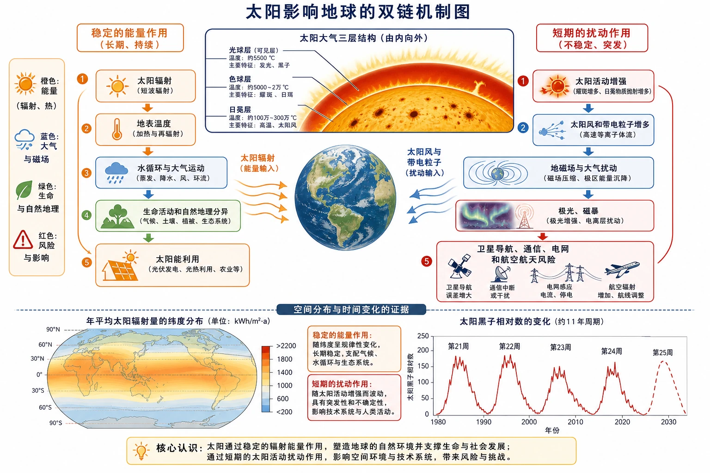
<!-- 图片描述：绘制“太阳影响地球”的双链机制图：左链为太阳辐射→地表温度→水循环与大气运动→生命活动和自然地理分异→太阳能利用；右链为太阳活动增强→太阳风和带电粒子增多→地磁场与大气扰动→极光、磁暴→卫星导航、通信、电网和航空航天风险。上方放太阳大气三层结构，下方放纬度分布图和太阳黑子周期曲线；橙色表示能量，蓝色表示大气和磁场，绿色表示生命，红色表示风险。该图用于区分“太阳辐射的稳定能量作用”和“太阳活动的短期扰动作用”。 -->

## 知识关系导航

本节推理链：太阳辐射提供光热 → 纬度受热差异 → 地表温度、水和大气运动、生命活动的差异；太阳活动增强 → 太阳风增强 → 地球磁场和大气层扰动 → 空间天气风险。

相关笔记：[[章首 学习导图|第一章总览]] · [[第一节 地球的宇宙环境#核心知识点讲解|地球的宇宙环境]] · [[第三节 地球的历史#核心知识点讲解|地球历史中的环境与生命演化]]

## 本节学习目标

- 理解太阳辐射的概念、能量来源和对地球自然环境的主要作用。
- 能根据太阳辐射纬度分布图说明自然地理现象的纬度差异。
- 能区分光球、色球和日冕，识别太阳黑子、耀斑、日珥和日冕物质抛射。
- 能构建“太阳活动—太阳风—地球磁场和大气—人类活动”的影响链。
- 能判读太阳黑子变化曲线，并提出空间天气风险的监测、防护思路。

## 核心知识点讲解

### 1. 区域定位与地理情境：太阳是地球系统的主要外部能量源

太阳是一颗主要由氢和氦组成的巨大、炽热气体星球，表面温度约6000 K。太阳内部通过核聚变释放能量，以电磁波形式向宇宙空间放射，这种现象称为太阳辐射。到达地球的太阳辐射只占太阳总辐射的一小部分，但它是地球及整个太阳系光和热的主要源泉。

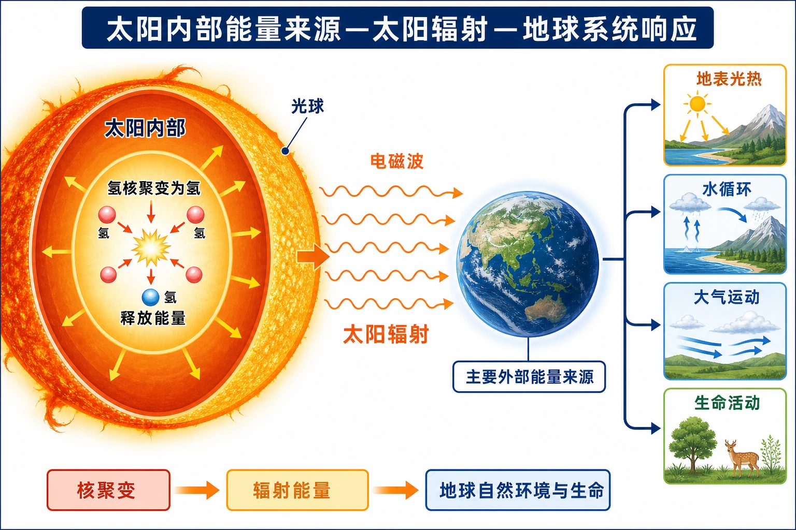
<!-- 图片描述：绘制“太阳内部能量来源—太阳辐射—地球系统响应”的剖面机制图：太阳中心区域标出氢核聚变为氦并释放能量，能量由中心向外传递到光球，再以电磁波形式向四周辐射；右侧用箭头连接地球，分支到地表光热、水循环、大气运动和生命活动。用橙黄色表示核聚变与辐射能量，蓝色表示地球水和大气，绿色表示生命，并标注“太阳辐射是地球主要外部能量来源”。该图补充说明太阳辐射的能量来源和从太阳内部到地球系统的传递链。 -->

青藏高原太阳能光伏电站的案例说明：太阳辐射不仅是自然环境的能量来源，也是偏远地区改善供电条件、服务生产生活的重要资源。

### 2. 核心概念与地理要素：太阳辐射的三类作用

太阳辐射对地球的影响可归纳为三层：

1. **直接作用**：为地表提供光和热，维持地表温度。
2. **动力作用**：驱动水循环、大气运动和部分地表过程，是生命活动的重要动力。
3. **能源作用**：太阳能可被直接利用、转换和储存；煤炭、石油等化石燃料则是地质历史时期生物固定并积累的太阳能。

太阳辐射在地球表面的分布具有纬度差异。一般来说，低纬度太阳高度较大、太阳辐射较集中，年平均获得的太阳辐射较多；高纬度太阳高度较小、斜射程度大，获得的太阳辐射较少。这种受热差异为热量带划分、自然地理环境纬度分异和生物量差异提供了能量基础。

### 3. 过程机制与成因链条：由受热差异到自然地理分异

太阳辐射纬度差异的成因链可以写为：

低纬度太阳高度较大、单位面积获得能量较多 → 地表温度较高 → 蒸发和对流活动较强 → 水热条件较好 → 热带雨林等生态系统生产力较高。

高纬度太阳高度较小、太阳辐射较弱 → 热量条件较差 → 生长季较短 → 植被类型和生物量发生变化。

注意：太阳辐射不是决定生物量的唯一因素，水分、土壤、植被类型和人类活动也会影响生物量。读图题中应表述为“太阳辐射提供能量基础，并通过热量条件影响生态环境”，不要把相关关系写成唯一因果关系。

### 4. 空间分布、图表判读与证据

判读太阳辐射分布图时按以下顺序：

1. 看图名和空间范围，确认是北半球大气上界还是地表。
2. 看图例或数值，确定辐射量高低。
3. 看纬度变化，判断是否总体由低纬向高纬递减，找出局部异常。
4. 联系太阳高度、昼长、云量和大气透明度等因素解释。
5. 将太阳辐射差异与温度、植被、生物量或能源利用联系起来。

判读太阳黑子曲线时先找波峰和波谷，再测量相邻波谷或波峰的时间间隔；若不同时间尺度下间隔大致相近，说明太阳活动具有相对稳定的周期性。

### 5. 人地关系、影响与对策：太阳活动与空间天气

太阳大气从里到外分为光球、色球和日冕。太阳风是太阳大气不断释放的高速带电粒子流，正常情况下地球磁场可以阻挡其大部分危害。

太阳大气的变化称为太阳活动，主要现象及特点如下：

| 现象 | 发生部位或表现 | 认识要点 |
|---|---|---|
| 太阳黑子 | 光球层上的深色斑点，局部温度较低 | 数量和大小可作为太阳活动强弱的标志，具有周期性 |
| 太阳耀斑 | 色球层突然出现的大而亮的斑块 | 短时间释放巨大能量，多与黑子活动相关 |
| 日珥 | 色球层上的弧状喷射结构 | 会喷射大量带电粒子 |
| 日冕物质抛射 | 日冕结构快速变化并向外抛射物质 | 规模大、程度剧烈，可显著扰动太阳风 |

影响链为：太阳活动增强 → 太阳风和高能带电粒子增多 → 地球磁场、大气层受到扰动 → 出现极光、磁暴等 → 卫星导航、空间通信、电网、航空航天等受到影响。对策包括持续观测、空间天气预报、卫星和电网防护、通信与航天系统应急预案。

### 6. 本节原文图像注释与判读

- 图1.11：西藏冈底斯藏医学院太阳能光伏电站，体现太阳辐射的能源利用和地域适应性。
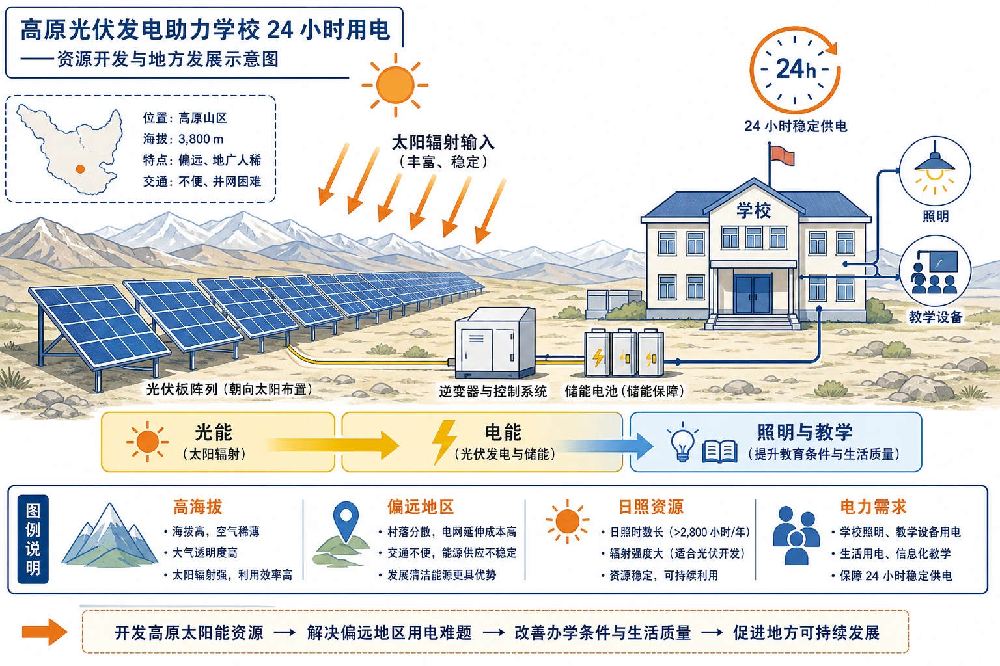
<!-- 图片描述：画面以高原地形为背景，前景为朝向太阳布置的光伏板阵列，旁边连接学校建筑和24小时供电图标；用橙色箭头表示太阳辐射输入，用黄色到蓝色的转换箭头表示“光能—电能—照明与教学”。图例标注高海拔、偏远、日照资源和电力需求，帮助理解资源开发与地方发展。 -->

- 图1.12：北半球大气上界太阳辐射分布图。
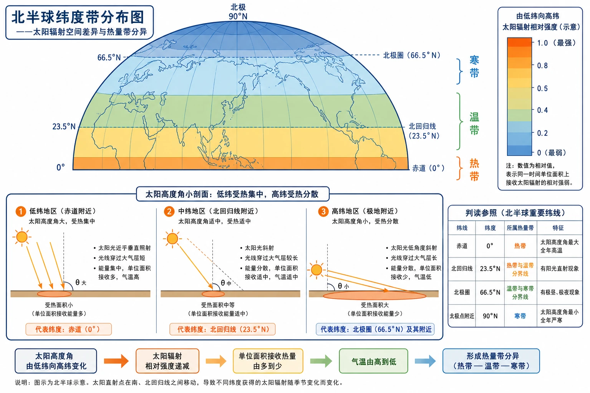
<!-- 图片描述：绘制北半球纬度带分布图，叠加由低纬向高纬变化的颜色梯度和数值图例；用太阳高度角小剖面解释低纬受热集中、高纬受热分散，并标出赤道、回归线和极地附近作为判读参照。该图帮助建立太阳辐射空间差异与热量带分异的联系。 -->

- 图1.13：热带雨林与亚寒带针叶林的生物量对比图，需分别标注雨林和针叶林两个图像单元。
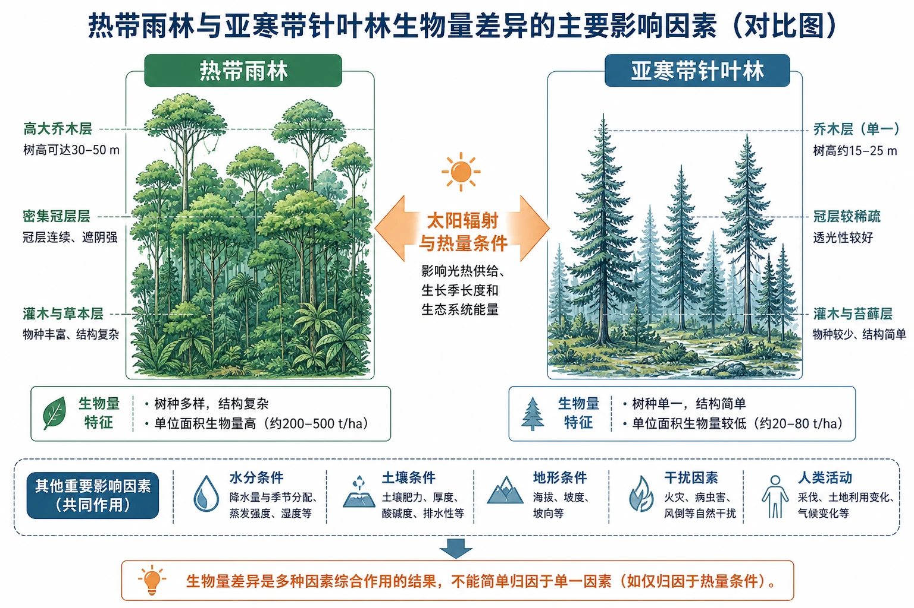
<!-- 图片描述：左右对比热带雨林和亚寒带针叶林，雨林侧用绿色分层表现高大乔木、密集冠层和较高生物量，针叶林侧用较冷的蓝绿色表现树种单一、冠层较稀和较低生物量；中间用“太阳辐射与热量条件”箭头连接，底部注明水分、土壤等也是影响因素。该图用于防止把生物量差异简单归结为单一因素。 -->
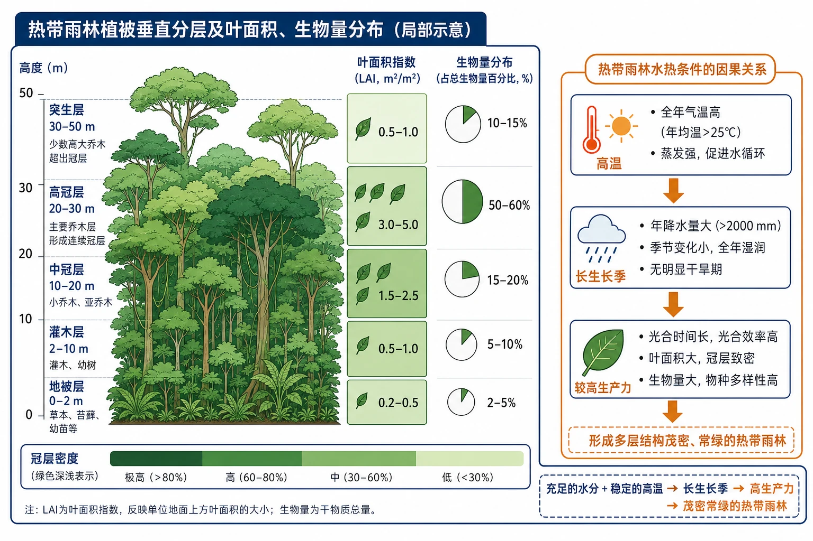
<!-- 图片描述：为热带雨林局部图添加植被垂直分层、叶面积和生物量标注，使用绿色深浅表达冠层密度，并在旁边设置“高温—长生长季—较高生产力”的因果框。该图帮助理解热带水热条件。 -->
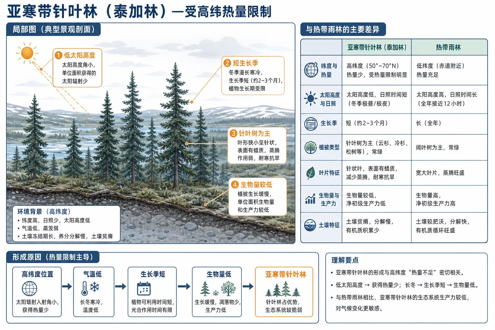
<!-- 图片描述：为亚寒带针叶林局部图添加低太阳高度、短生长季、针叶树和较低生物量标注，采用蓝绿色和灰色调，标出与热带雨林的差异。该图帮助理解高纬热量限制。 -->

- 图1.14：家庭太阳能供热系统的结构图和设备照片共同表现太阳能转换为热能。
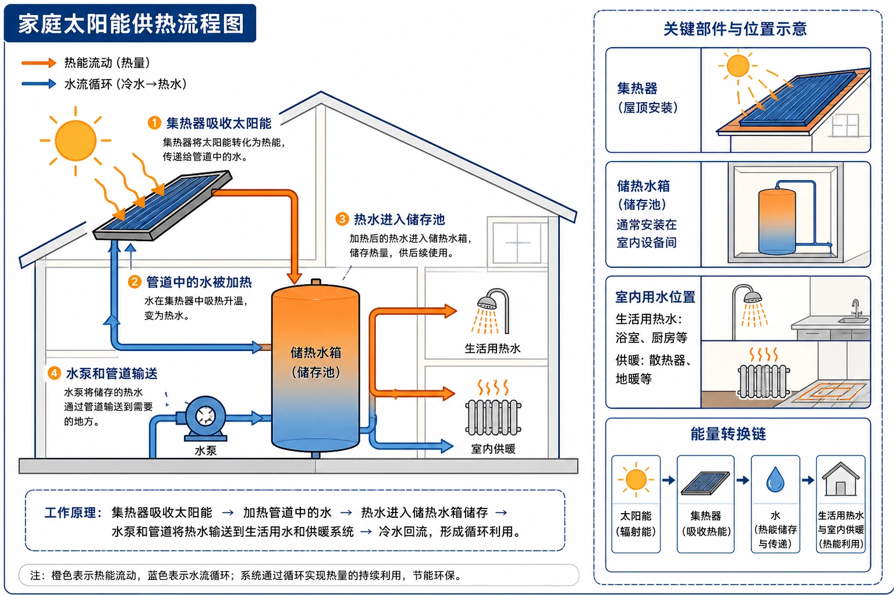
<!-- 图片描述：绘制家庭太阳能供热流程图：屋顶集热器吸收太阳能→管道中的水被加热→热水进入储存池→水泵和管道输送到房间供生活和供暖；用橙色表示热能、蓝色表示水流、箭头表示循环与输送。另设小窗展示集热器、储水箱和室内用水位置，帮助理解能量转换链。 -->

- 图1.15：柴达木盆地太阳能光伏电站，表现太阳能直接转换为电能及其规模化利用。
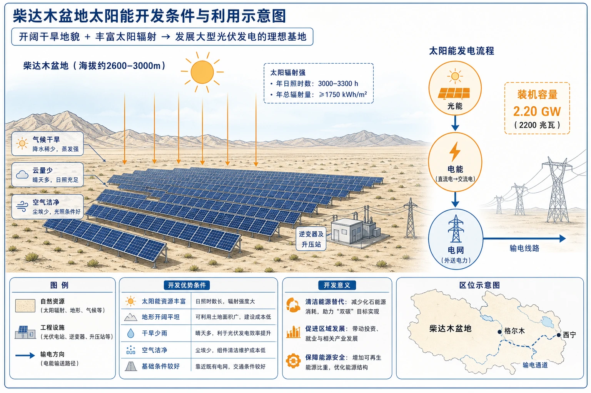
<!-- 图片描述：以柴达木盆地开阔、干旱地貌为背景，前景排列大规模光伏电池板方阵，太阳光线垂直落向板面，右侧接出“光能—电能—电网”的流程箭头，并标注装机容量。图例区分自然资源、工程设施和输电方向，帮助分析太阳能开发条件。 -->

- 图1.16：太阳大气三层结构示意图。
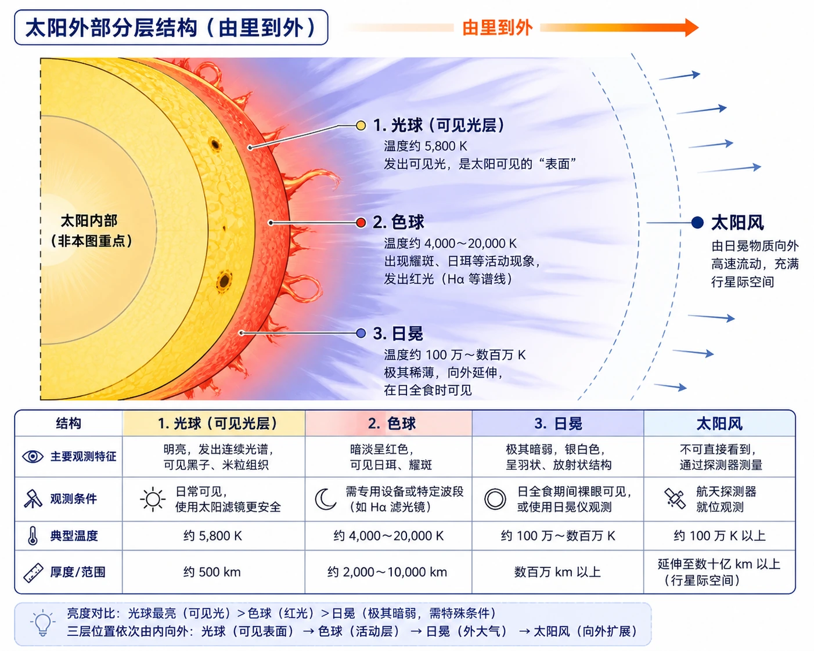
<!-- 图片描述：绘制太阳剖面同心层结构，从内到外标出光球、色球、日冕，外侧延伸到太阳风；用黄色表示光球可见光、红色表示色球活动、蓝紫色表示向外延伸的日冕，并标注“由里到外”方向和可观测条件。该图帮助区分三层位置与亮度差异。 -->

- 图1.17：太阳风吹向地球的机制图。
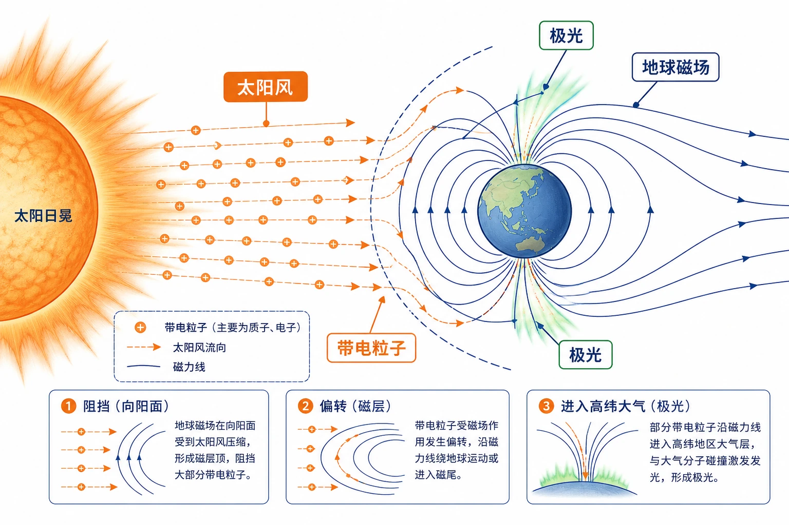
<!-- 图片描述：左侧为太阳日冕，向右发射密集带电粒子流；右侧为地球及其磁力线，磁力线在向阳面压缩、背阳面拉长，部分粒子沿磁力线进入高纬大气形成极光。标注“太阳风”“地球磁场”“带电粒子”“极光”，用箭头突出阻挡与偏转关系。 -->

- 图1.18：太阳黑子、太阳耀斑、日珥和日冕物质抛射四种太阳活动现象。
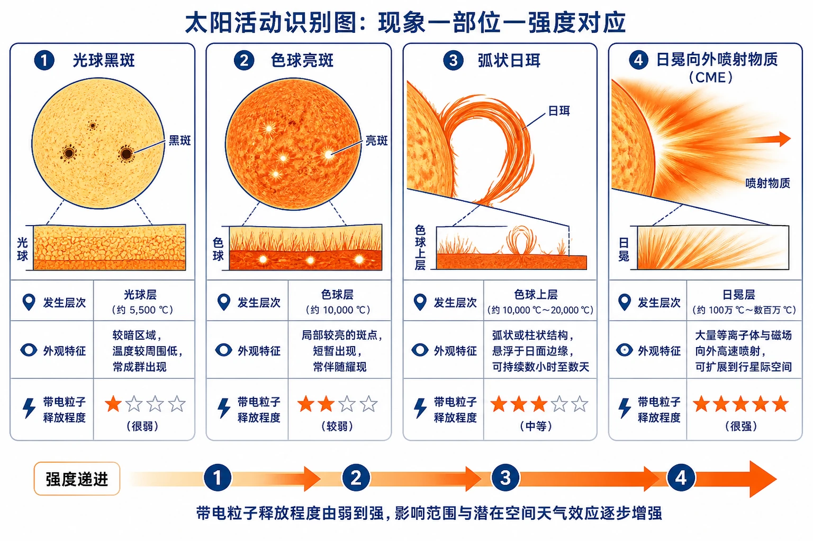
<!-- 图片描述：设计四格太阳活动识别图，分别标出光球黑斑、色球亮斑、弧状日珥和日冕向外喷射物质；每格注明发生层次、外观特征和带电粒子释放程度，底部用强度递进箭头连接。该图帮助建立现象—部位—强度的对应关系。 -->
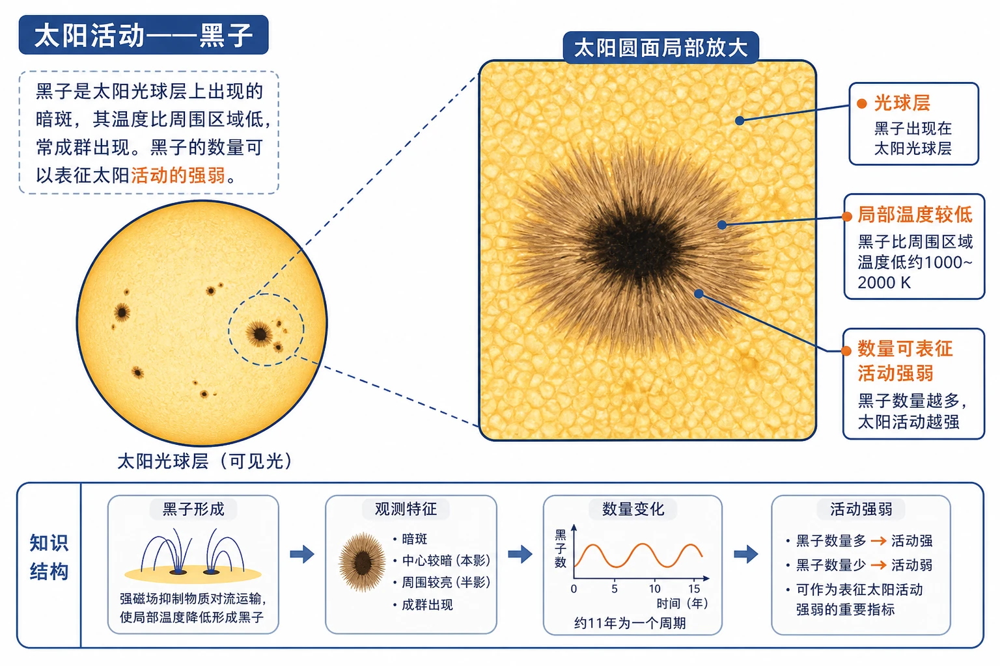
<!-- 图片描述：黑子图使用太阳圆面局部放大框，深色斑点外有半影结构，标注“光球层”“局部温度较低”“数量可表征活动强弱”。 -->
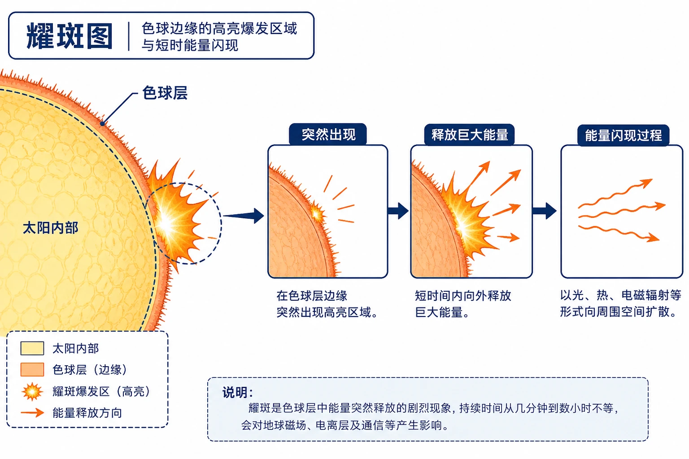
<!-- 图片描述：耀斑图用色球边缘的高亮爆发区域和短时能量闪现箭头，标注“色球层”“突然出现”“释放巨大能量”。 -->
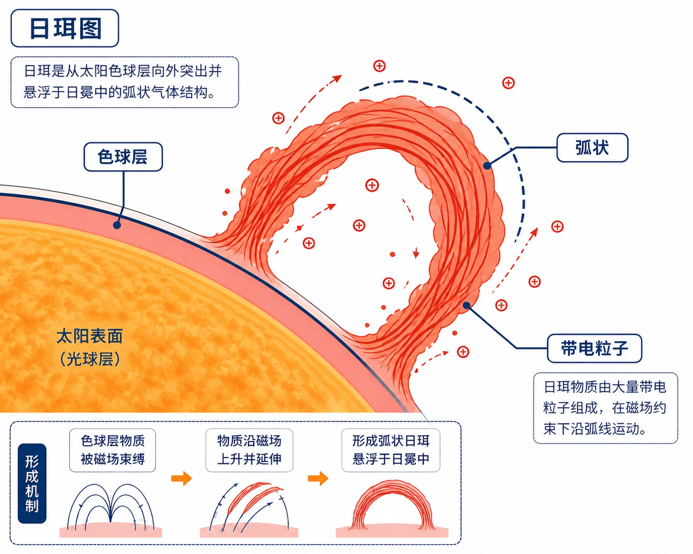
<!-- 图片描述：日珥图用沿太阳边缘弯曲喷出的红色气体弧线，标注“色球层”“弧状”“带电粒子”。 -->
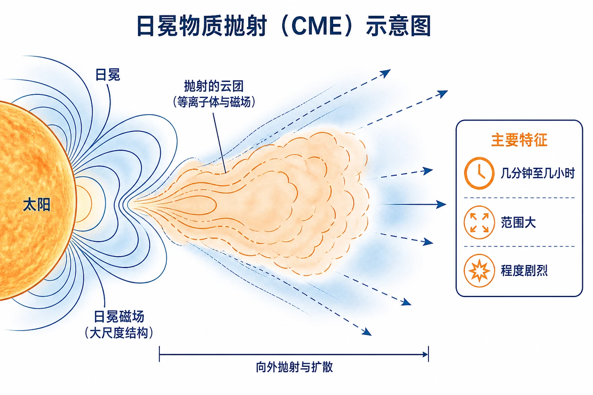
<!-- 图片描述：日冕物质抛射图用日冕大尺度结构向外抛射的云团和扩散箭头，标注“几分钟至几小时”“范围大”“程度剧烈”。 -->

- 图1.19：太阳活动强烈时对地球的影响，表现从空间天气到人类系统的传导。
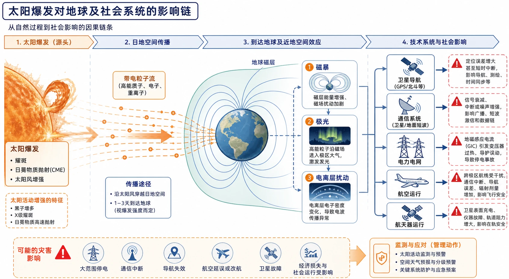
<!-- 图片描述：制作影响链图：太阳爆发位于左侧，带电粒子流穿过日地空间到达地球；地球周围依次标出磁暴、极光、电离层扰动，右侧分支连接卫星导航、通信、电网、航空航天等系统，并用红色警示符号标出可能的灾害影响。该图帮助完成从自然过程到社会影响的因果推理。 -->

- 案例图：1859年和1989年太阳活动影响材料配图，用于比较历史强度与现代技术系统脆弱性。
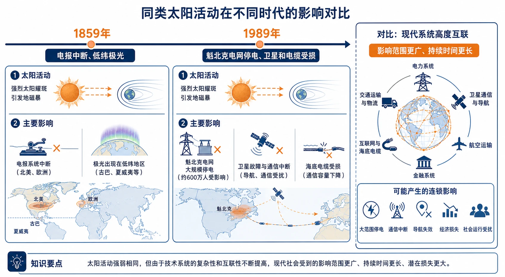
<!-- 图片描述：绘制时间轴对比1859年电报中断、低纬极光与1989年魁北克电网停电、卫星和电缆受损，右侧增加“现代系统高度互联、影响范围更广”的对比框。该图帮助理解同类太阳活动在不同技术时代产生的后果差异。 -->

- 图1.20：太阳黑子数变化的a、b两幅不同时间尺度曲线。
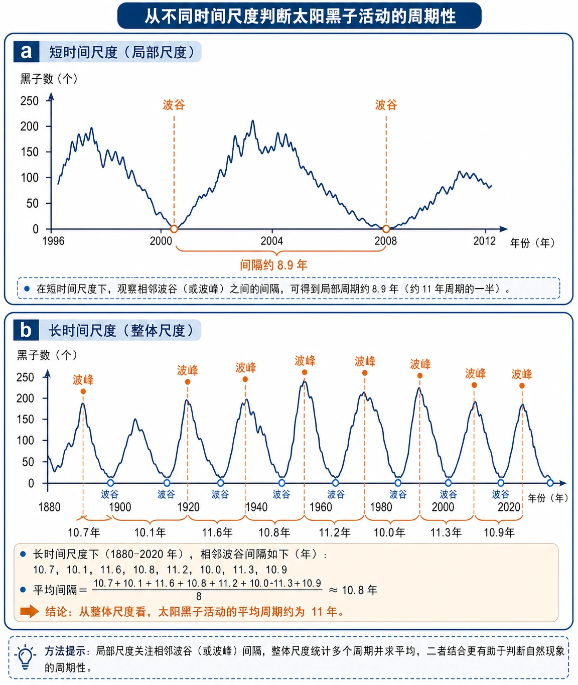
<!-- 图片描述：上下排列短时间尺度a图和长时间尺度b图，保留横轴年份、纵轴黑子数，使用竖线标出相邻波谷并用括号标注时间间隔；在长周期图中标出多个波峰波谷并计算平均间隔。该图训练从局部和整体两个尺度判断周期性。 -->

## 重点梳理

### 两条必须分清的影响链

- 太阳辐射链：太阳辐射 → 光热条件 → 水、大气运动和生命活动 → 自然地理环境与太阳能利用。
- 太阳活动链：太阳活动增强 → 太阳风增强 → 地磁和大气扰动 → 极光、磁暴及空间天气灾害。

### 太阳大气与活动现象

记忆顺序为“光—色—冕”：光球最底层、可见光最强；色球位于其外侧；日冕最外层并向星际空间延伸。黑子在光球，耀斑和日珥主要在色球，日冕物质抛射发生在日冕结构中。

## 难点突破

### 难点一：太阳辐射分布图不等于地表热量图

大气上界太阳辐射图主要反映天文因素造成的能量输入差异；地表实际获得的能量还会受大气透明度、云量、地形和地表反射等影响。综合题要先说明图示变量，再讨论影响因素。

### 难点二：太阳活动不等于太阳辐射

太阳辐射是太阳持续向外释放的电磁波能量，主要支撑地球日常的光热环境；太阳活动是太阳大气的变化，具有增强和减弱，其强烈爆发可能造成短期空间天气扰动。

### 难点三：太阳黑子周期的计算

不要只看一个波峰或波谷。应先确定同类极值，再计算相邻极值间隔；长时间序列应取总时间除以相邻周期数，最后用“约11年”概括规律。

## 例题讲解

### 例题1：太阳辐射的地理意义

**题目**：简述太阳辐射对地球自然环境的主要影响。

**答案**：太阳辐射为地球提供光和热，维持地表温度；是水循环、大气运动和生命活动的主要动力；太阳辐射的纬度差异造成热量差异，影响自然地理环境的纬度分异；太阳能还可被直接利用或转换为热能、电能，化石燃料也是地质历史时期积累的太阳能。

### 例题2：太阳活动影响链

**题目**：当太阳活动增强时，为什么卫星导航和电网可能受到影响？

**思路**：按“太阳活动—粒子—地球空间环境—技术系统”作答。

**答案**：太阳活动增强会使太阳风和高能带电粒子增多，扰动地球磁场和大气层，产生磁暴、电离层变化等空间天气现象，进而影响卫星运行、导航信号传播和电网设备的稳定运行。

### 例题3：图表判读

**题目**：某太阳黑子曲线相邻两个波谷分别出现在2008年和2019年，说明该图反映了什么规律？

**答案**：相邻波谷间隔约11年，说明太阳黑子数具有周期性变化，太阳活动也具有大致11年的周期。该结论应以多个周期的观测资料作进一步验证。

## 易错点整理

- 把太阳辐射的“纬度差异”写成由低纬向高纬处处严格递减，忽略局地大气和地表条件。
- 把太阳黑子说成温度最高的区域；黑子是光球层相对周围温度较低、看起来较暗的区域。
- 把耀斑、日珥和日冕物质抛射都写成发生在光球层。
- 认为地球磁场会把太阳风全部消除；更准确的说法是阻挡和偏转大部分带电粒子。
- 只写太阳活动产生极光，不写对通信、电网、导航和航天等人类活动的影响。
- 计算周期时混淆波峰数量、波谷数量与周期数量。

## 考点考证点整理

1. 太阳辐射的概念、能量来源及对地球的三类作用。
2. 太阳辐射纬度分布图的读图流程与热量差异解释。
3. 太阳大气三层结构：光球、色球、日冕。
4. 太阳活动现象及其发生部位、表现和强弱标志。
5. “太阳活动增强—太阳风—磁暴/极光—技术系统”的影响链。
6. 太阳黑子变化周期的曲线判读、间隔计算和规律概括。

## 练习题

1. 说明太阳辐射为什么是地球上水、大气运动和生命活动的主要动力。
2. 某地纬度较高，分析其年太阳辐射较低可能带来的自然地理影响。
3. 列出光球、色球、日冕三层结构，并分别写出一种相关现象或特征。
4. 用箭头写出太阳活动增强影响地球技术系统的完整过程。
5. 某太阳黑子曲线波谷年份为1996、2008、2019，计算相邻间隔并说明可得出的规律。

## 练习题答案

1. 太阳辐射为地球提供光和热，维持地表温度；地表受热不均引起水分蒸发和大气运动；光热条件又为植物光合作用和生命活动提供能量。
2. 太阳高度较小、太阳辐射较分散，热量收入较少，可能导致气温较低、生长季较短，植被类型和生物量与低纬地区不同；具体差异还受水分、土壤和人类活动影响。
3. 从里到外为光球、色球、日冕。光球可见光最强，黑子位于光球；色球上可出现耀斑和日珥；日冕向星际空间延伸并释放太阳风，日冕物质抛射与其有关。
4. 太阳活动增强 → 太阳风和高能带电粒子增多 → 地球磁场和大气层扰动 → 磁暴、电离层变化等 → 卫星导航、通信、电网和航空航天系统受影响。
5. 间隔分别为12年和11年，平均约11.5年；样本显示太阳黑子数具有约11年的周期性变化，实际判定应结合更长时间序列。
