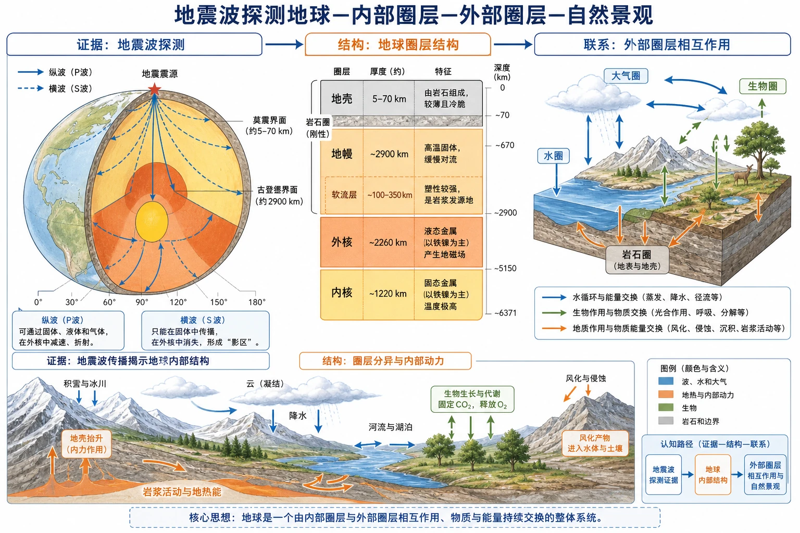
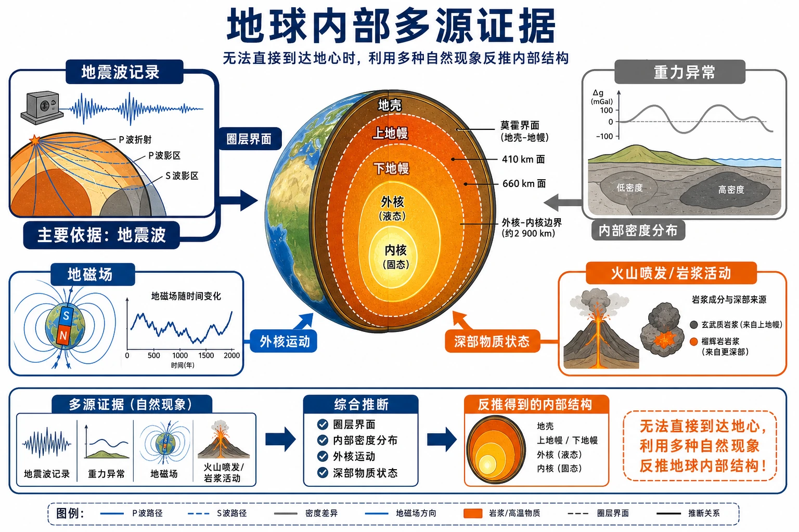
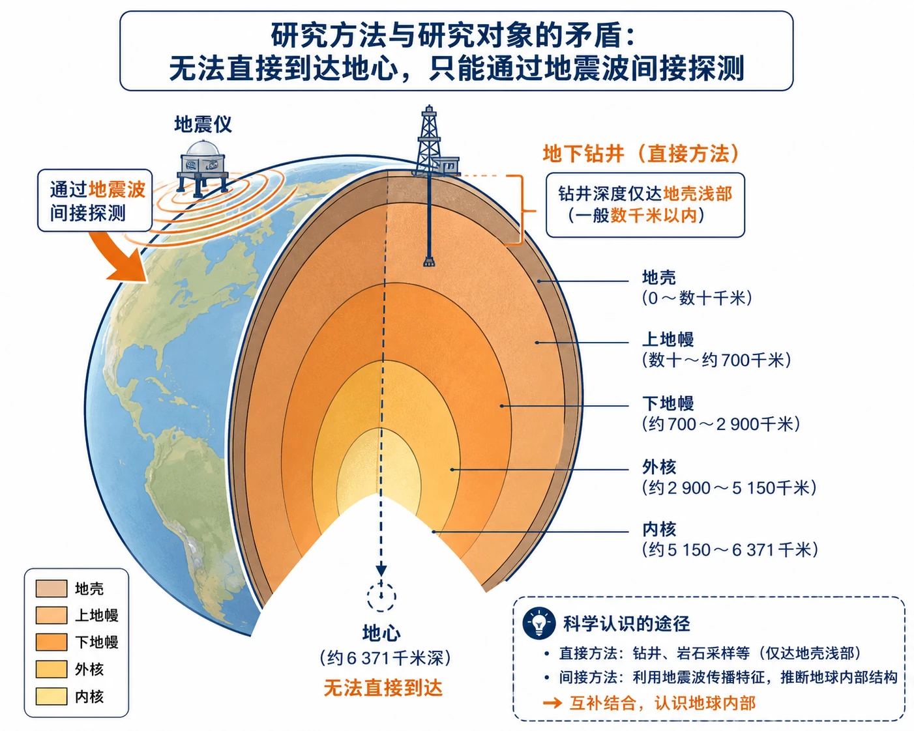
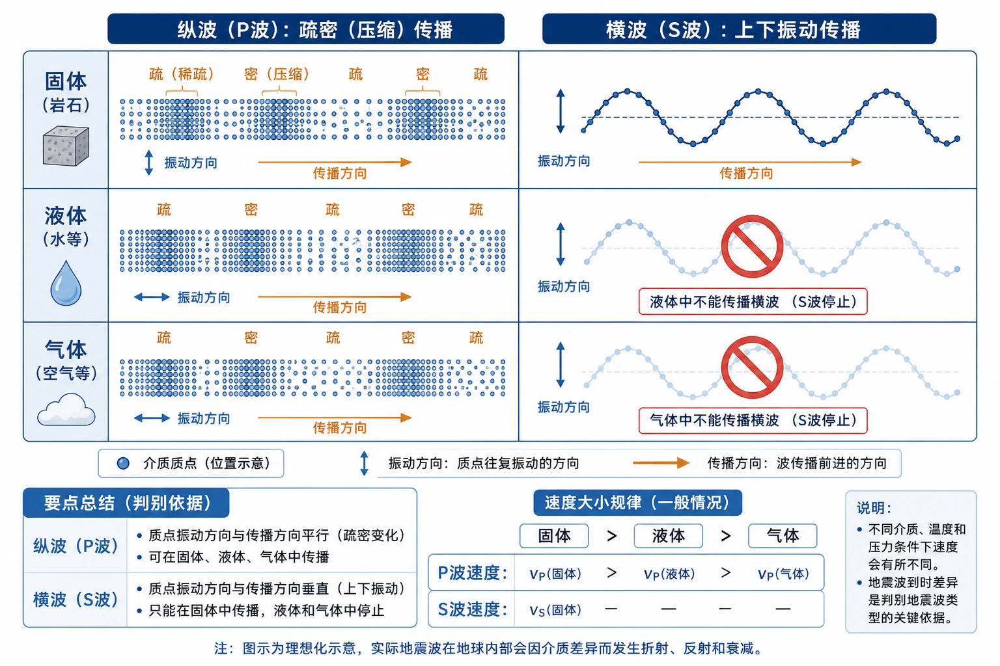
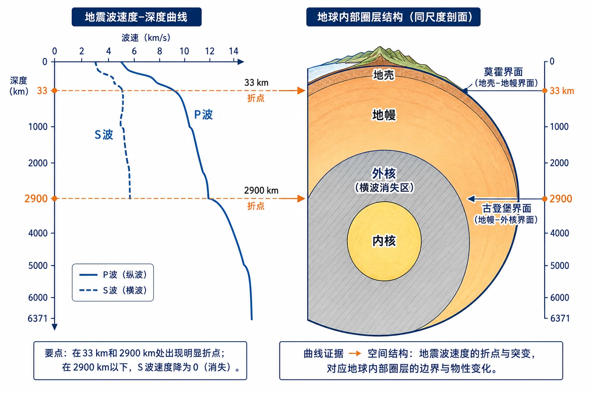
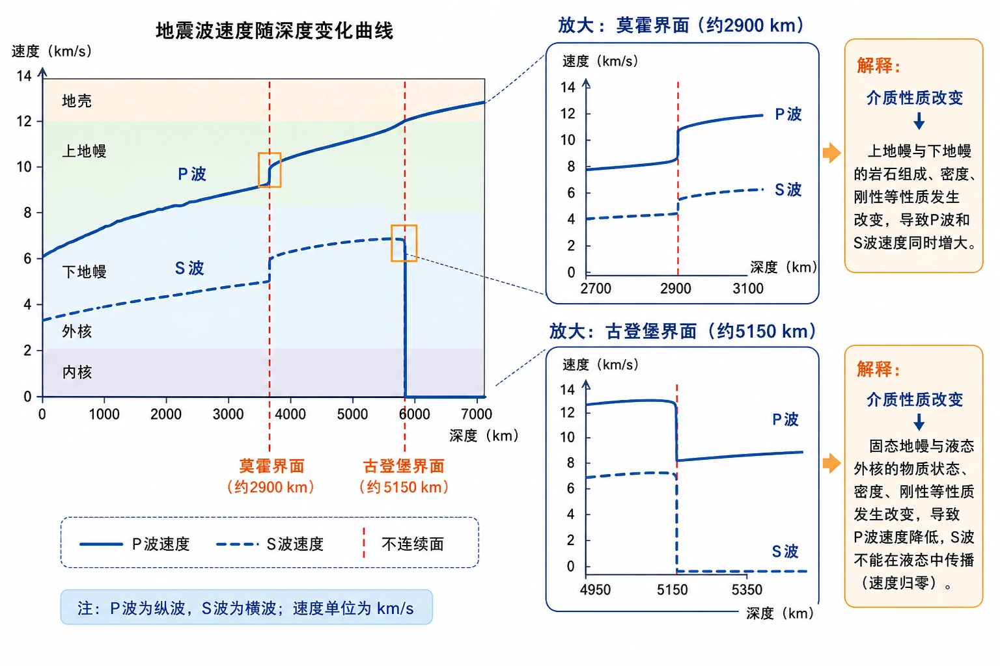
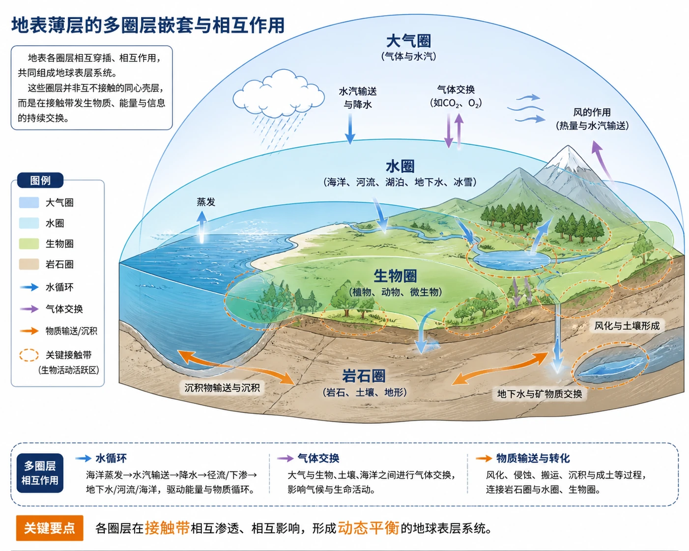
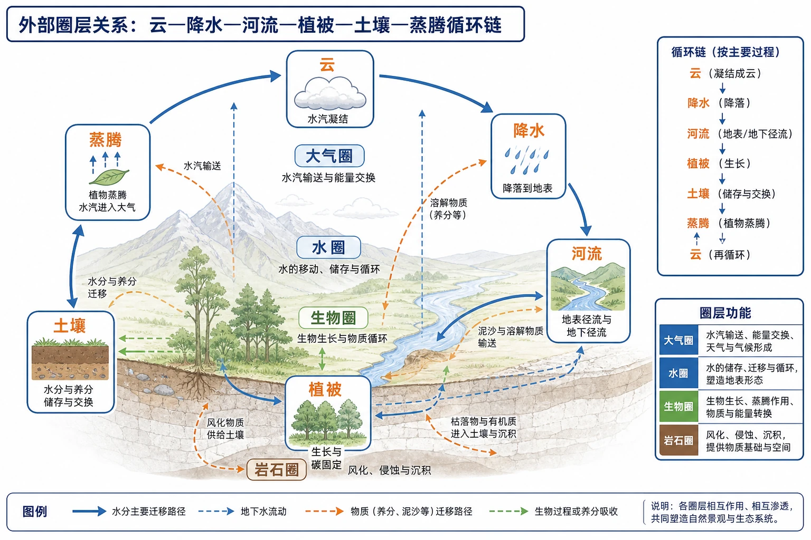
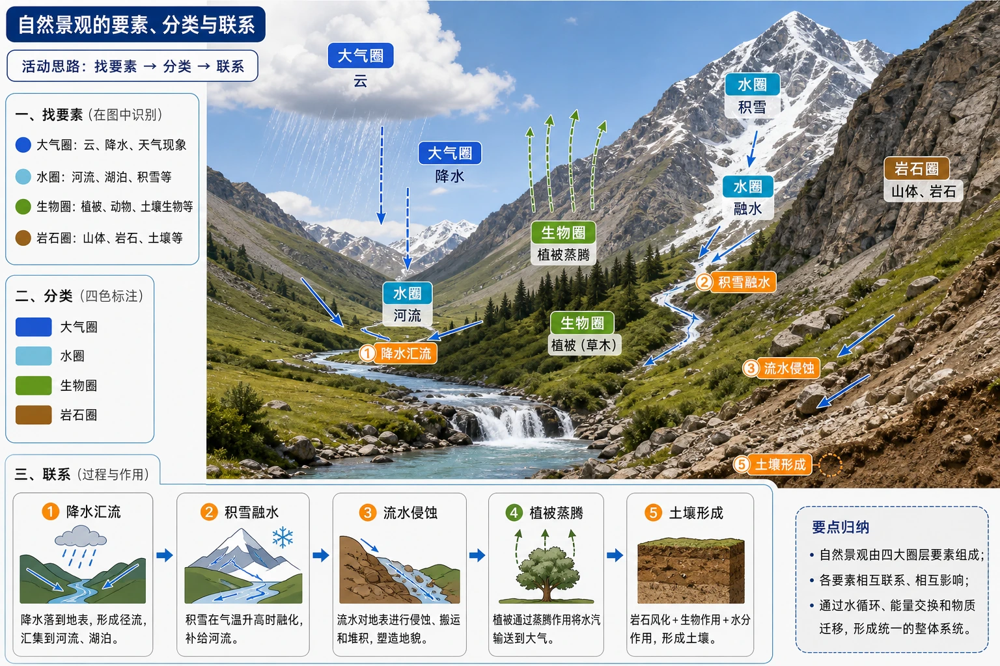

# 第四节 地球的圈层结构

<!-- 图片描述：绘制“地震波探测地球—内部圈层—外部圈层—自然景观”的综合结构图：左侧为纵波和横波穿过地球的路径，标出莫霍界面和古登堡界面；中央为地壳、地幔、外核、内核及岩石圈、软流层；右侧为大气圈、水圈、生物圈、岩石圈在地表相互接触、相互渗透；底部用山地、云、积雪、河流、草木组成自然景观，并用箭头表示物质和能量交换。用蓝色表示波、水和大气，橙色表示地热与内部动力，绿色表示生物，灰色表示岩石和边界。该图用于建立“证据—结构—联系”的完整认知路径。 -->

## 知识关系导航

本节推理链：地震波传播特征 → 不连续面 → 地壳、地幔、地核；大气圈、水圈、生物圈与岩石圈 → 相互联系、相互渗透 → 人类赖以生存的自然环境。

相关笔记：[[章首 学习导图|第一章总览]] · [[第一节 地球的宇宙环境#核心知识点讲解|地球在宇宙中的位置]] · [[章末问题研究 火星基地#核心知识点讲解|封闭环境中的生命保障]]

## 本节学习目标

- 理解纵波、横波的传播特征，掌握用地震波速度变化判断内部结构的方法。
- 能说出莫霍界面、古登堡界面及其两侧圈层变化。
- 能比较地壳、地幔、地核的范围、物质状态和主要特征。
- 能区分大气圈、水圈、生物圈和岩石圈，并说明它们的相互作用。
- 能从自然景观中识别圈层要素，构建“圈层—要素—联系”的综合分析。

## 核心知识点讲解

### 1. 区域定位与地理情境：地球内部不可直接观察

人类目前最深钻井约12千米，只触及地球“表皮”，无法直接到达地心。因此，认识地球内部主要依靠地震波、重力、地磁和火山活动等间接证据，其中地震波是划分内部圈层的重要依据。

<!-- 图片描述：绘制“地球内部多源间接证据”综合框图：中央为地球内部剖面，四周分别连接地震波记录、重力异常、地磁场和火山喷发/岩浆活动四类证据；每条箭头旁标注可推断的信息，如圈层界面、内部密度分布、外核运动和深部物质状态，并用加粗路径突出地震波是划分内部圈层的主要依据。用蓝色表示地震波和地磁场，橙色表示岩浆与地热，灰色表示重力和地球内部结构。该图帮助理解“无法直接到达地心时，如何利用多种自然现象反推内部结构”。 -->

地震波分为纵波（P波）和横波（S波）：

| 类型 | 质点振动方向 | 传播速度 | 可通过介质 | 判读意义 |
|---|---|---|---|---|
| 纵波 | 与传播方向平行 | 较快 | 固体、液体、气体 | 速度变化反映介质性质变化 |
| 横波 | 与传播方向垂直 | 较慢 | 只能通过固体 | 横波消失可说明进入液态或不能传波的介质 |

### 2. 核心概念与地理要素：内部圈层和关键界面

地震波速度在一定深度突然变化的面叫不连续面。地球内部有两个重要不连续面：

- **莫霍界面**：平均位于地下33千米处，界面以下纵波和横波速度都明显增加，以此为界分为地壳和地幔。
- **古登堡界面**：位于地下约2900千米处，界面处纵波速度突然下降，横波完全消失，以此为界分为地幔和地核。

内部圈层特征：

| 圈层 | 范围和特征 | 地理意义 |
|---|---|---|
| 地壳 | 莫霍界面以外的坚硬固体外壳；海洋地壳约5—10千米，大陆地壳较厚，山地处可达70千米 | 地表地形、岩石和人类活动直接依托的圈层 |
| 地幔 | 莫霍界面至古登堡界面，约占地球总体积80%；分上地幔和下地幔 | 上地幔上部软流层部分熔融、可缓慢流动，是岩浆主要发源地，与板块运动相关 |
| 地核 | 主要由铁、镍等金属组成，厚约3400千米；分外核和内核 | 外核为液态，运动形成地球磁场；内核为高密度固体金属球 |

岩石圈由地壳和上地幔顶部的坚硬岩石组成；软流层位于上地幔上部，岩石部分熔融，能缓慢流动。注意：岩石圈不是地壳的同义词。

### 3. 过程机制与成因链条：由波速变化判定物质状态

地震波判读可以写成一条证据链：

地震发生并产生P波、S波 → 波在不同物质中传播速度不同 → 记录不同深度的波速变化 → 突然变化处判定不连续面 → 根据纵波增速、降速和横波是否消失推断介质性质 → 划分地球内部圈层。

古登堡界面处横波完全消失，说明其下方外核为液态金属；外核物质运动又与地球磁场形成有关。莫霍界面以下两种波速都增加，说明物质性质或密度发生明显变化，但仍可传播横波，表明地幔总体为固态或具有固体介质特征。

### 4. 空间分布、图表判读与证据

读地震波曲线图时：

1. 先看横轴深度、纵轴波速，分清P波和S波。
2. 找波速突然变化的位置，确定不连续面深度。
3. 看波速变化方向：两波都增加，还是P波下降、S波消失。
4. 将深度与莫霍界面、古登堡界面对应。
5. 推断圈层范围和物质状态，再联系软流层、地磁场和板块运动。

读自然景观图时可按“找要素—归圈层—找联系”：

- 云、风、降水属于大气圈；
- 河流、湖泊、冰雪、地下水属于水圈；
- 草、树、动物和微生物属于生物圈；
- 山地、岩石、土壤和地貌属于岩石圈。

### 5. 人地关系、影响与对策：圈层共同构成自然环境

大气圈由气体和悬浮物质组成，主要成分是氮气和氧气，调节温度并提供生物所需氧气；水圈包括海洋、河流、湖泊、沼泽、冰川和地下水，是最活跃的自然环境要素之一；生物圈是地球表层生物及其生存环境的总称，生物从环境获取物质和能量，也会改变大气、水体组成和地表形态；岩石圈为地表提供岩石、土壤和地貌基础。

四个圈层不是彼此孤立的：水在大气圈和水圈之间循环，在岩石圈中下渗，又被生物利用；植被通过蒸腾影响大气，通过根系和枯落物影响土壤；流水侵蚀岩石并搬运沉积物。分析人地关系时，应从多个圈层和物质循环出发，提出节水、护土、保护植被、减轻污染和合理利用资源等措施。

### 6. 本节原文图像注释与判读

- 图1.33：地球内部探秘，设置“人类无法直接抵达地心”的问题情境。

<!-- 图片描述：用地球剖面和地下钻井作为主体，钻井深度只到地壳浅部，旁边用虚线标示地心和“无法直接到达”；在地球外侧放置地震仪和波纹图标，箭头指向“通过地震波间接探测”。该图帮助建立研究方法与研究对象之间的矛盾情境。 -->

- 地震波示意图：纵波和横波传播特征。

<!-- 图片描述：并列绘制纵波的疏密压缩传播和横波的上下振动传播，分别穿过固体、液体、气体；用图例标出振动方向、传播方向、速度大小规律，并在液体区域给横波加停止符号。该图帮助理解两类地震波的判别依据。 -->

- 图1.34：地震波传播速度与地球内部圈层结构示意，包含曲线和剖面两个图像单元。

<!-- 图片描述：左侧为深度—波速曲线，分别画出P波和S波，在33千米和2900千米处设置明显折点；右侧为同尺度地球剖面，标出地壳、地幔、外核、内核、莫霍界面和古登堡界面，并用阴影标出横波消失的外核。该图帮助把曲线证据转译为空间圈层。 -->

<!-- 图片描述：为地震波曲线局部增加放大框，突出莫霍界面处P波和S波同时增速、古登堡界面处P波降速且S波归零；用蓝色表示波速曲线，用红色竖线表示不连续面，并在旁边写出“介质性质改变”的解释。 -->

- 图1.35及其辅助图：地球外部圈层结构示意。

<!-- 图片描述：绘制地表薄层的多圈层嵌套图，大气圈位于地表上方，水圈覆盖海洋和陆地水体，生物圈分布在三者与岩石圈的接触带，岩石圈作为固体地表基础；用相互穿插的透明色块表现圈层重叠，用循环箭头表示水、气体和物质交换。该图帮助避免把圈层理解成互不接触的同心壳层。 -->

<!-- 图片描述：为外部圈层关系增加“云—降水—河流—植被—土壤—蒸腾”的循环链，分别标出大气圈、水圈、生物圈和岩石圈，配箭头说明物质在圈层之间迁移。该图用于连接概念与自然景观。 -->

- 图1.36：山地、云、积雪、河流、草和树木组成的自然景观照片。

<!-- 图片描述：在自然景观照片上叠加四色标注：云和天气现象标为大气圈，河流和积雪标为水圈，草木标为生物圈，山体和岩石标为岩石圈；用箭头表示降水汇流、积雪融水、植被蒸腾、流水侵蚀和土壤形成。该图帮助完成“找要素—分类—联系”的活动。 -->

## 重点梳理

### 内部圈层记忆

地壳薄、地幔厚、地核金属；莫霍界面分地壳和地幔，古登堡界面分地幔和地核；横波能过固体，不能过液体，外核液态是判断古登堡界面的关键。

### 外部圈层记忆

大气圈管气象和温度，水圈管水体和循环，生物圈管生命和生态，岩石圈管岩石、土壤和地貌；四者相互联系、相互渗透，共同构成人类自然环境。

## 难点突破

### 难点一：波速突变说明什么

波速突然变化说明地震波经过的物质性质或状态发生明显改变。莫霍界面处两种波都增速，古登堡界面处P波减速、S波消失，后者表明外核为液态。不要把“波速变化”直接等同于“深度变化”。

### 难点二：地壳、岩石圈和软流层的关系

地壳是最外部的固体岩石层；岩石圈包括地壳和上地幔顶部坚硬岩石；软流层位于上地幔上部，是部分熔融、可缓慢流动的层。三者范围不同，不能混用。

### 难点三：外部圈层综合题

不要只列名词。应先识别景观要素，再说明圈层关系，例如“山地岩石圈提供地形基础—降水进入水圈形成河流—河流侵蚀搬运岩石—植被在水和土壤支持下生长—植被蒸腾影响大气”。

## 例题讲解

### 例题1：地震波曲线

**题目**：在地下约2900千米处，纵波速度突然下降，横波完全消失，这说明什么？

**答案**：该深度为古登堡界面，说明界面以下物质性质发生突变；横波不能通过液体，完全消失表明外核主要为液态金属。由此可将地球内部划分为地幔和地核。

### 例题2：内部圈层与地理意义

**题目**：说明软流层与板块运动、火山活动的关系。

**答案**：软流层位于上地幔上部，温度高、岩石部分熔融并能缓慢流动，是岩浆的主要发源地；软流层的运动与地球板块运动有关，岩浆上涌可形成火山活动。

### 例题3：自然景观判读

**题目**：一幅山地景观中有云、山顶积雪、河流、草和裸露岩石，分别属于哪些圈层？说明其中两种联系。

**答案**：云属于大气圈，积雪和河流属于水圈，草属于生物圈，山体和裸露岩石属于岩石圈。云中水分形成降雪和河流，体现大气圈与水圈联系；河流侵蚀山体，体现水圈与岩石圈联系；草通过根系和枯落物影响土壤，体现生物圈与岩石圈联系。

## 易错点整理

- 认为纵波和横波都能通过液体；横波只能通过固体。
- 把莫霍界面写成2900千米，或把古登堡界面写成33千米。
- 把外核和内核都写成液态；外核液态，内核为高密度固体。
- 把地壳等同于岩石圈；岩石圈包括地壳和上地幔顶部。
- 把水圈只理解为海洋，忽略冰川、河流、湖泊、地下水等。
- 只给自然景观要素贴圈层标签，没有说明圈层之间的物质和能量联系。
- 把生物圈理解成一个有清晰边界的球壳；它主要分布在大气圈、水圈和岩石圈相互接触的表层区域。

## 考点考证点整理

1. 纵波、横波的传播速度和介质差异。
2. 莫霍界面和古登堡界面的深度及波速变化特征。
3. 地壳、地幔、地核的范围、状态和组成。
4. 软流层、岩石圈、外核与地磁场的关系。
5. 大气圈、水圈、生物圈、岩石圈的概念和功能。
6. 自然景观中圈层识别及圈层相互联系的综合表达。

## 练习题

1. 比较纵波和横波的传播特征，并说明横波消失的地理意义。
2. 以莫霍界面和古登堡界面为界，写出地球内部圈层的划分。
3. 说明海洋地壳和大陆地壳在厚度上的差异。
4. 从岩石圈、软流层和地核三个对象中任选两个，说明其与地球表层环境或人类活动的联系。
5. 观察一幅“山地—河流—植被—云”的景观图，按“要素—圈层—联系”写出分析过程。

## 练习题答案

1. 纵波传播速度较快，可通过固体、液体和气体；横波速度较慢，只能通过固体。横波在古登堡界面处消失，说明外核主要为液态，地震波可据此识别圈层边界。
2. 莫霍界面以上为地壳，以下至古登堡界面为地幔，古登堡界面以下为地核；地核还可分为外核和内核。
3. 海洋地壳较薄，一般5—10千米；大陆地壳较厚，高大山脉下更厚，最厚可达70千米。
4. 示例：岩石圈包括地壳和上地幔顶部坚硬岩石，是地形、土壤和人类工程活动的基础；软流层部分熔融、能够缓慢流动，与板块运动和岩浆活动相关。也可说明外核液态金属运动形成地球磁场，磁场能保护地球免受部分太阳风影响。
5. 先找出云，归入大气圈；河流和积雪归入水圈；植被归入生物圈；山体、岩石和土壤归入岩石圈。再说明降水形成径流，流水侵蚀岩石，植被吸收水分并通过蒸腾影响大气，形成圈层间的物质联系。
