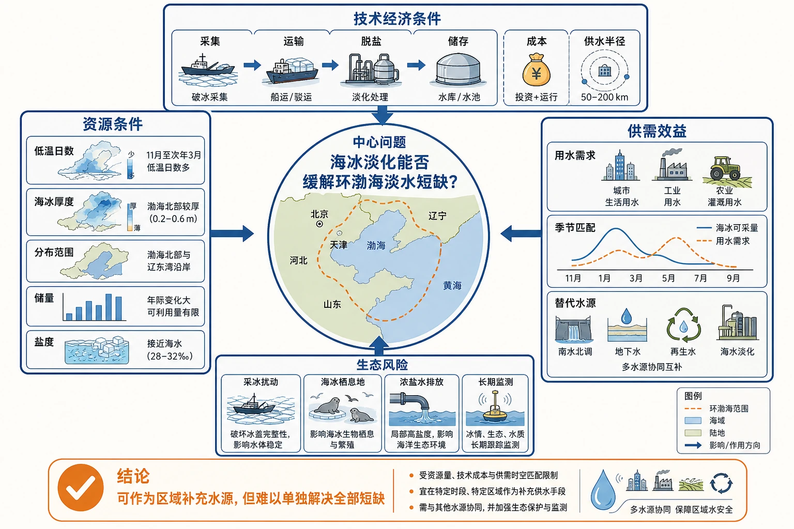
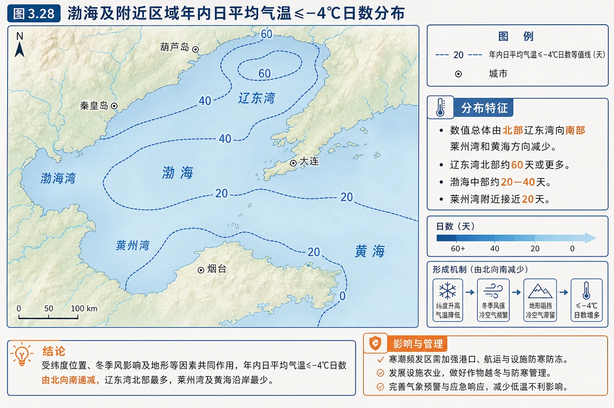
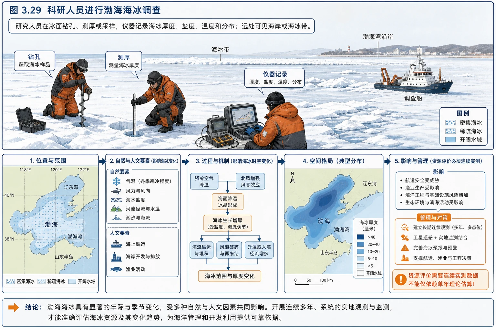

# 章末问题研究 能否淡化海冰缓解环渤海地区淡水短缺问题

<!-- 图片描述：问题研究决策框架图。中心问题为“海冰淡化能否缓解环渤海淡水短缺”，左侧为资源条件：低温日数、海冰厚度、分布、储量和盐度；上方为技术经济条件：采集、运输、脱盐、储存、成本和供水半径；右侧为供需效益：城市工业农业用水量、季节匹配和替代水源；下方为生态风险：采冰扰动、海冰栖息地、浓盐水排放和长期监测。最终以“可作为区域补充水源，但难以单独解决全部短缺”汇总结论。 图面结构：左右两侧分别承担原因—结果、自然—人类、灾前—灾后或两种情境对照；上下分层显示结构/条件与机制/数据/结论的递进。视频讲解顺序：按左到右或左右对照讲条件、过程、影响与措施。讲解重点：水循环图要区分蒸发/蒸腾、降水、径流、下渗等环节，并说明哪些箭头形成闭合循环；海水性质和运动图要把温度、盐度、密度、波浪、潮汐或洋流的成因与影响对应起来；案例要按“区域背景—关键证据—机制解释—影响/效益—限制或对策”讲完。学习落点：用“水体/海域—水分或海水性质/运动—空间分布—人类利用与限制”复述本图。 -->

## 知识关系导航

- 水源基础：[[第一节 水循环|水循环]]说明淡水可更新但时空分布不均。
- 原理基础：[[第二节 海水的性质|海水盐度和密度]]解释海水结冰析盐、海冰融水盐度较低。
- 环境基础：[[第三节 海水的运动|海水运动]]影响海冰漂移、采集安全和浓盐水扩散。
- 研究主线：资源量 → 可采性 → 技术经济性 → 供需匹配 → 生态影响 → 综合决策。

## 本节学习目标

1. 从等值线图判断渤海低温日数的空间分布和海冰开发潜力。
2. 解释海冰盐度低于原海水的原因，理解海冰淡化的基本原理。
3. 估算并比较海冰资源量与区域用水需求，区分理论储量、可采量和有效供水量。
4. 从资源、技术、经济、社会和生态角度评价海冰淡化方案。
5. 形成有条件、有证据、能权衡利弊的研究结论。

## 核心知识点讲解

### 一、区域定位与地理情境

环渤海地区包括辽东半岛、京津冀沿海和山东半岛北部等区域，人口和城市密集，工业、农业和生活用水需求大，但人均水资源量偏少。与此同时，渤海是我国纬度较高、较封闭的内海，冬季部分海域会结冰。若把低盐度海冰采集并进一步淡化，就可能形成一种季节性补充水源。

研究的核心不是简单判断“海冰里有水，所以能利用”，而是区分三个层次：

1. **资源存在性**：有没有足够海冰？
2. **工程可行性**：能不能经济、安全地采集和淡化？
3. **区域有效性**：淡化水能否以可接受成本送到缺水用户，并且生态代价可控？

### 二、核心概念与地理要素

#### 1. 海冰淡化原理

渤海海水盐度约28‰—31‰。海水结冰时，水分子优先形成较规则的冰晶结构，大部分盐分不能进入冰晶，会被排到周围未冻结海水或留在冰体孔隙中的卤水里。因此新形成的海冰盐度明显低于海水，海冰融水平均盐度约4‰—13‰。

海冰并不是直接达到饮用水标准的纯冰。还需要通过自然析卤、破碎离心、融化后再处理等方式进一步降低盐度和去除杂质。

#### 2. 理论资源量、技术可采量和有效供水量

- 理论资源量：自然界可能形成的海冰总量。
- 技术可采量：受冰厚、离岸距离、设备、天气和安全限制，实际能够采集的部分。
- 经济可采量：在成本不高于可接受替代水价时值得开发的部分。
- 有效供水量：扣除采集、运输、淡化、储存损耗后，真正送达用户的合格淡水量。

四者通常逐级减小，不能把“理论潜力”直接等同于“可供水量”。

#### 3. 资源开发评价指标

| 维度 | 关键问题 |
|---|---|
| 资源 | 海冰多少、在哪里、持续多久、年际稳定吗 |
| 技术 | 能否采集、脱盐、储存和连续供水 |
| 经济 | 单位水成本、运输距离、能源消耗是否可接受 |
| 市场与社会 | 用水需求在哪里，用户能否承受，是否具有应急价值 |
| 生态 | 对海洋环境、生物、岸线和浓盐水受纳区有何影响 |

### 三、过程机制与成因链条

#### 1. 渤海海冰形成

冬季太阳辐射弱 + 冷空气活动频繁 → 海水向大气放热 → 表层水温降到冻结点附近 → 海水结冰并析盐 → 形成低于原海水盐度的海冰。

教材估算在日平均气温低于或等于−4℃时，渤海海冰每天约生成1.86厘米厚。低温持续时间越长，海冰形成和可采次数通常越多。

#### 2. 为什么开采次数由北向南减少

纬度由北向南降低 → 冬季太阳高度和昼长条件改善、获得热量增多 → 日平均气温≤−4℃的日数减少 → 稳定结冰期缩短 → 辽东湾、渤海湾、莱州湾的年可采次数依次减少。

此外，辽东湾更深入陆地、受大陆冷空气影响较强；海湾封闭、浅水等条件也有利于降温结冰。

#### 3. 两种淡化技术

**自然析卤法**：把采集海冰堆放2—3个月并控制温度 → 冰体内部高盐卤水在重力作用下沿孔隙排出 → 剩余冰体盐度降低。

**破碎离心法**：在低温条件下破碎海冰 → 利用离心力分离附着和孔隙中的高盐卤水 → 冰体盐度降低。

两种方法可使海冰融水盐度降至约1‰，但还要根据用途进行水质处理。自然析卤能耗较低但周期长、占地大；离心法速度快、可控性强，但设备和能耗成本较高。

#### 4. 从海冰到用户的完整链条

海冰监测与预报 → 选择近岸高资源区 → 安全采集 → 岸上运输和暂存 → 析卤或离心脱盐 → 融化与净化 → 储水设施调蓄 → 管网输送 → 工业、生态或生活用水。

任何一个环节成本过高或损耗过大，都可能使方案失去竞争力。

### 四、空间分布、图表判读与证据

#### 1. −4℃日数等值线图

<!-- 图片描述：图3.28“渤海及附近区域年内日平均气温≤−4℃日数分布”。地图范围包括辽东湾、渤海湾、莱州湾及邻近陆地，等值线标出0、20、40、60天等。数值总体由北部辽东湾向南部莱州湾和黄海方向减少；辽东湾北部约60天或更多，渤海中部约20—40天，莱州湾附近接近20天。葫芦岛、秦皇岛、大连、烟台等地用于定位。 图面结构：地图/俯视区用于定位区域、流向、分布和空间邻接关系；图表和等值线区承载数值、梯度、峰谷、疏密和异常区域。视频讲解顺序：随后定位区域、方向、上下游/内外海或空间邻接关系；再读坐标、数值梯度、峰谷、疏密或等值线弯曲，并说明原因。讲解重点：水循环图要区分蒸发/蒸腾、降水、径流、下渗等环节，并说明哪些箭头形成闭合循环；海水性质和运动图要把温度、盐度、密度、波浪、潮汐或洋流的成因与影响对应起来；图表判读要从坐标和整体趋势入手，再解释峰谷、梯度或异常点的地理原因。学习落点：用“水体/海域—水分或海水性质/运动—空间分布—人类利用与限制”复述本图。 -->

判读步骤：

1. 看图名，确认统计指标是“年内日平均气温≤−4℃日数”。
2. 读等值线，概括总体由北向南减少。
3. 找海湾差异：辽东湾最多，渤海湾次之，莱州湾较少。
4. 转换含义：低温日数越多，结冰期越长，海冰资源通常越丰富、可采次数越多。

#### 2. 教材数据的数量证据

按海冰日生成厚度估算：辽东湾每年冬季可采7.4—13次，渤海湾3.7—7.4次，莱州湾1.9—3.7次。寒冷年份理论海冰资源量可达约1000亿立方米，常年约410亿立方米，且最大资源量主要分布在距岸10千米范围内。

这些数据支持“资源有开发潜力”：总量较大、近岸分布可降低采运难度、海冰初始盐度已低于海水。但数据仍不能直接证明经济可行，因为没有扣除不可采部分和各种损耗。

<!-- 图片描述：图3.29“科研人员进行渤海海冰调查”。研究人员在冰面钻孔、测厚或采样，仪器记录海冰厚度、盐度、温度和分布；远处可见海岸或海冰带。图中强调资源评价需要连续实测，而不能只依赖单年理论估算。 图面结构：由主体、空间位置、过程箭头和结论框组成学习型图解。视频讲解顺序：先看标题和主体；再读结构、方向和关键标注；最后概括地理规律或管理结论。讲解重点：水循环图要区分蒸发/蒸腾、降水、径流、下渗等环节，并说明哪些箭头形成闭合循环；海水性质和运动图要把温度、盐度、密度、波浪、潮汐或洋流的成因与影响对应起来。学习落点：用“水体/海域—水分或海水性质/运动—空间分布—人类利用与限制”复述本图。 -->

#### 3. 可补充计算

若某海域面积为A平方千米、平均可采冰厚为h米、采集率为r、淡化与输送综合得水率为e，则有效供水量可估算为：

> 有效供水量 = A × 1,000,000 × h × r × e。

这类计算最容易漏掉平方千米到平方米的单位换算，也容易把海冰体积等同于最终淡水体积。实际研究还需考虑冰的孔隙、密度和含盐卤水损失。

### 五、人地关系、影响与对策

#### 1. 可能的综合效益

- 增加沿海地区季节性补充水源，缓解冬春缺水或应急供水压力。
- 原料盐度低于海水，理论上脱盐能耗和成本可能低于直接海水淡化。
- 最大资源区接近海岸，有利于缩短海上采运距离。
- 可与港口、工业园区和沿海储水设施结合，优先提供工业、生态或非饮用水。

#### 2. 主要限制

- **季节性强**：只有冬季形成，必须建设储存设施才能全年使用。
- **年际波动大**：暖冬年份低温日数和海冰量减少，供水稳定性不足。
- **空间错位**：海冰在海上和北部海湾，缺水用户分布广，采运和管网成本高。
- **采集风险**：海冰漂移、破裂、风浪和严寒增加作业难度。
- **水质处理**：海冰融水仍含盐和杂质，不能不经处理直接饮用。

#### 3. 浓盐水和生态问题

析出的卤水若集中排回近岸，会使局地盐度升高、密度增大并沉积在底层，影响底栖生物和水体交换。采冰还可能改变海冰覆盖、局地热量交换和海冰生物栖息环境。

可采取：

- 评估受纳水体交换能力，分散、缓慢排放，避免敏感海湾和养殖区。
- 将浓盐水用于制盐或提取化学资源，提高资源化利用率。
- 设定生态红线、限采区和年度采集上限。
- 连续监测盐度、溶解氧、底栖生物和海冰变化，实行适应性管理。

#### 4. 综合结论

较稳妥的判断是：

> 海冰淡化在资源和技术上具有一定可行性，可作为环渤海部分沿海城市、工业园区或应急系统的补充水源；但受季节性、年际波动、采运储存成本和生态风险限制，难以单独解决整个环渤海地区淡水短缺。应先开展中小规模示范，并与节水、再生水利用、跨流域调水、海水淡化和水污染治理共同构成多元供水体系。

### 六、综合题型与迁移应用

#### 1. 判断一种自然资源“能否开发”

不能只论资源总量，应使用五步法：

1. 是否有资源以及空间分布。
2. 是否可稳定、持续地获取。
3. 技术是否成熟，成本是否合理。
4. 产出能否匹配需求和输送条件。
5. 环境影响是否可控制、可恢复。

#### 2. “缓解”与“解决”的尺度差异

一种水源年供水量即使很大，也未必能解决区域缺水，因为缺水还与人口产业布局、用水效率、水污染和季节调蓄有关。材料题中“缓解”通常意味着提供部分补充，“解决”则要求长期、稳定、全面满足需求，论证标准更高。

#### 3. 多方案比较

| 方案 | 优势 | 限制 |
|---|---|---|
| 海冰淡化 | 原料盐度较低，近岸冬季资源较多 | 季节性、采运和储存困难 |
| 海水淡化 | 原料全年可得、供水较稳定 | 能耗、成本和浓盐水问题 |
| 跨流域调水 | 调入水量较大 | 工程成本高、涉及流域协调 |
| 再生水利用 | 就地循环、减少污染排放 | 用途和公众接受度受限 |
| 节约用水 | 成本通常较低、效益持久 | 需要技术改造和行为改变 |

真实决策通常不是“五选一”，而是根据不同用水对象组合多种方案。

## 重点梳理

- 原理：海水结冰析盐，海冰盐度低于原海水。
- 资源：低温日数总体北多南少，海冰潜力辽东湾最大。
- 方法：自然析卤周期长、能耗低；破碎离心速度快、设备要求高。
- 关键区分：理论资源量 ＞ 技术可采量 ＞ 经济可采量 ＞ 有效供水量。
- 评价框架：资源、技术、经济、需求、生态五维评价。
- 基本结论：具有补充和示范价值，不宜把它视为解决区域缺水的唯一方案。

## 难点突破

### 1. 为什么海冰盐度低但不等于淡水

冰晶会排斥大部分盐分，但卤水仍可能滞留在冰体孔隙中，因此海冰融水盐度虽远低于海水，通常仍高于生活饮用水要求，需要进一步脱盐和净化。

### 2. 为什么资源量大不等于可行

理论资源包括薄冰、远岸冰、生态敏感区海冰和危险天气条件下无法采集的海冰。扣除采集率、淡化得水率、运输损耗和储存蒸发后，实际供水会显著减少。

### 3. 季节性水源怎样变成稳定供水

冬季集中采集与全年连续需求不匹配，必须建设大型低损耗储冰或储水设施，或将其用于冬春季高价值、应急性需求。储存成本本身也是经济评价的重要部分。

### 4. 浓盐水为什么可能下沉

浓盐水盐度较高，通常密度较大，排入海洋后可能沿海底扩散。如果海湾封闭、水交换弱，局地高盐和低氧风险更明显。

## 例题讲解

### 例1 教材问题：海冰资源为什么具有开采价值

**答案**：渤海冬季海冰理论资源量较大；海水结冰析盐，使海冰盐度明显低于原海水，进一步淡化所需脱盐强度和成本可能低于直接海水淡化；最大资源区多在距岸10千米范围内，有利于采集运输；环渤海地区又存在现实淡水需求，因此具有开发研究价值。

### 例2 教材问题：可采次数为什么北多南少

**答案**：由北向南纬度降低，冬季热量条件逐渐改善，日平均气温≤−4℃日数减少，结冰期缩短、海冰生长速度和重复形成机会减少。因此辽东湾最多，渤海湾次之，莱州湾最少。海湾封闭程度、水深和冷空气影响也会修正局地差异。

### 例3 教材问题：析出的卤水如何处理

**答案**：不能在封闭近岸集中直接排放。可将卤水输送到交换较强、生态敏感度较低的海域，经环境容量评估后分散排放；也可与盐化工结合，制盐或提取镁、溴等物质，实现资源化。全过程应监测盐度、密度、溶解氧和生物变化。

### 例4 教材问题：能否缓解供需矛盾

**答案**：从资源总量看有潜力，从技术上也存在可行路径，尤其适合作为近岸工业和应急补充水源；但理论储量不等于有效供水量，且海冰受季节和年际气温影响，采集、储存、运输与生态治理增加成本。因此它可以缓解部分时段、部分地区的供需矛盾，但不能替代综合节水和多水源配置。

### 例5 观点论证

**观点**：“应立即把渤海海冰作为环渤海城市主要饮用水源。”

**评价**：观点过于激进。海冰资源具有潜力，但供水季节不稳定、饮用水水质要求高、储运体系尚需验证，生态容量也有限。更合理的路径是先调查监测、建设示范工程，优先用于工业和应急等适配场景，经长期成本与生态评估后再决定规模。

## 易错点整理

1. 把28‰写成28%。两者相差十倍。
2. 认为海冰融水就是可直接饮用的淡水。仍需脱盐、消毒和水质检测。
3. 用寒冷年份1000亿立方米代表每年稳定供给。海冰资源年际波动明显。
4. 把理论海冰体积全部作为淡水产量。必须扣除不可采部分和处理损耗。
5. 只比较淡化成本，不考虑采集、运输、储存和排放成本。
6. 只写生态“有影响”，不说明影响路径。应明确采冰扰动、栖息地变化或浓盐水导致局地盐度和密度上升。
7. 结论非黑即白。研究题应给出适用范围和条件，而不是只有“能”或“不能”。

## 考点考证点整理

### 考点1 等值线空间分布

描述“总体趋势＋极值区＋局部弯曲”，并把温度日数转换为结冰期和资源潜力。

### 考点2 资源开发条件评价

自然条件写数量、质量、分布和稳定性；社会经济条件写技术、交通、市场、成本和基础设施；最后补生态约束。

### 考点3 供需匹配

比较有效供水量与实际需求量，还要分析时间、空间和水质用途是否匹配。

### 考点4 开放性观点题

规范结构：表明观点 → 提出至少两条支持证据 → 指出限制或风险 → 给出有条件结论和改进方案。

### 考证点

- 渤海海水盐度约28‰—31‰，海冰融水平均盐度约4‰—13‰。
- 海水结冰会析出大部分盐分。
- 教材估算日平均气温≤−4℃时海冰每天约生成1.86厘米。
- 低温日数和海冰开采次数总体由北向南减少。
- 海冰淡化产生的卤水仍需环境管理。

## 练习题

### 1. 原理解释

为什么海水结成的海冰盐度通常低于原海水？

### 2. 图表判读

根据渤海低温日数分布，指出海冰资源潜力最大的海湾并解释原因。

### 3. 概念辨析

说明“理论资源量”和“有效供水量”的区别。

### 4. 技术比较

比较自然析卤法和破碎离心法的优势与不足。

### 5. 环境评价

海冰淡化后的浓盐水若直接大量排入封闭海湾，可能产生哪些影响？提出两项对策。

### 6. 开放论证

你是否赞成在环渤海地区建设海冰淡化示范工程？请给出有条件的结论和证据。

## 练习题答案

### 1. 原理解释

海水结冰时，水分子优先排列形成冰晶，大部分盐离子难以进入冰晶结构，被排入周围海水或滞留在孔隙卤水中，因此形成的海冰盐度低于原海水。

### 2. 图表判读

辽东湾潜力最大。该区纬度较高、深入陆地，冬季受冷空气影响强，日平均气温≤−4℃日数最多，结冰期较长，海冰可以多次生长和采集。

### 3. 概念辨析

理论资源量是自然条件下可能形成的海冰总量；有效供水量是扣除不可采海冰、采运损失、淡化排卤、融化储存和输水损耗后，达到规定水质并实际送到用户的水量，通常远小于理论资源量。

### 4. 技术比较

自然析卤法利用重力排出卤水，能耗和设备要求较低，但需要2—3个月、占地和储存要求高，过程受气温影响；破碎离心法处理速度快、可控性强，适合连续工业化处理，但需要低温破碎和离心设备，能耗、维护和投资较高。

### 5. 环境评价

浓盐水会提高局地盐度和密度，可能沿海底积聚，影响底栖生物、鱼类和水体混合，封闭海湾交换弱时影响更持久。可在环境容量评估后选择交换较强海域分散排放；把卤水用于制盐或化学资源提取；同时避开养殖区和敏感生境并开展长期监测。

### 6. 开放论证

赞成建设规模适度的示范工程，但不赞成立即大规模替代常规水源。理由是渤海近岸海冰资源量较大、初始盐度低，且环渤海确有缺水需求，技术上具备试验基础；但资源季节性和年际波动明显，采集、储存、输送总成本及生态影响尚需实测。示范工程应优先布局在辽东湾等资源较稳定、距岸近且有工业用水需求的区域，设置生态监测、限采量和浓盐水资源化方案，再根据长期数据决定是否扩大。
