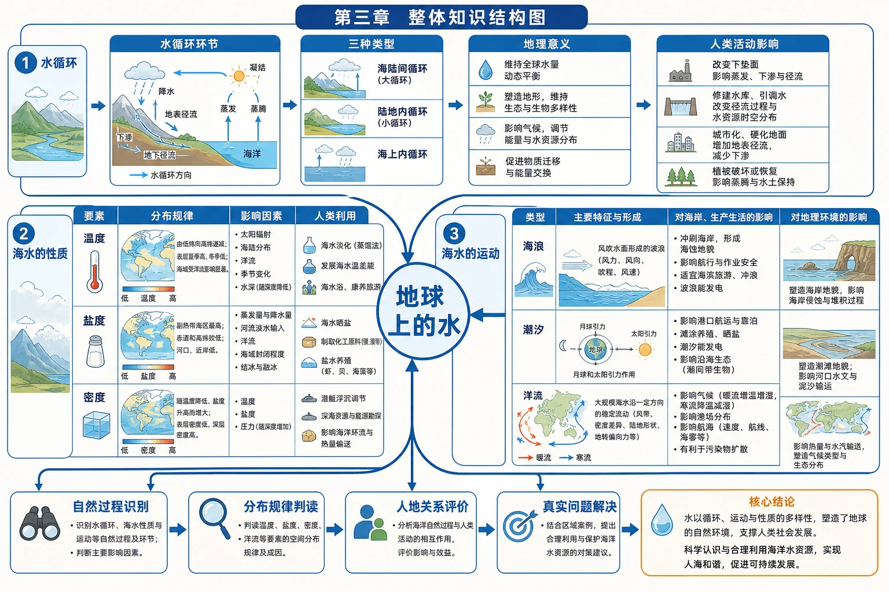

# 第三章 地球上的水·学习导图

<!-- 图片描述：第三章整体知识结构图。中心为“地球上的水”，向外分为三条主线：第一条“水循环”依次连接水循环环节、三种类型、地理意义和人类活动影响；第二条“海水的性质”依次连接温度、盐度、密度及各自的分布规律、影响因素和人类利用；第三条“海水的运动”依次连接海浪、潮汐、洋流及其对海岸、生产生活和地理环境的影响。三条主线最终汇入“自然过程识别—分布规律判读—人地关系评价—真实问题解决”。 图面结构：中心主题先给出本图要解决的核心问题，周围分支是条件、过程、影响或措施；环形/闭合箭头表示循环、反馈、包含关系或多环节协同。视频讲解顺序：再讲中心主题，说明这张图试图回答什么问题；沿箭头说明物质、能量、泥沙、养分、风险或管理措施的流向。讲解重点：水循环图要区分蒸发/蒸腾、降水、径流、下渗等环节，并说明哪些箭头形成闭合循环；海水性质和运动图要把温度、盐度、密度、波浪、潮汐或洋流的成因与影响对应起来；箭头方向必须说明起点、中间环节、终点及其因果关系。学习落点：用“水体/海域—水分或海水性质/运动—空间分布—人类利用与限制”复述本图。 -->

## 一、全章主线

本章研究的不是静止的“水”，而是水在地球各圈层中的**储存、转化与运动**。学习时始终抓住四个问题：

1. 水在哪里，以什么形态存在？
2. 水为什么会发生相态变化和空间移动？
3. 水的性质与运动呈现怎样的时空分布规律？
4. 人类怎样利用水，又应怎样避免破坏水环境？

可以把全章压缩为一条总逻辑：

> 太阳辐射和重力等动力 → 水体发生循环与运动 → 形成时空差异 → 影响自然环境和人类活动 → 人类进行利用、调控与保护。

## 二、章节知识网络

### 1. 水循环：水怎样在地球上不断更新

- 基本环节：蒸发（蒸腾）、水汽输送、降水、下渗、地表径流、地下径流。
- 三种类型：海陆间循环、陆地内循环、海上内循环。
- 核心意义：联系四大圈层、维持全球水量动态平衡、更新水资源、迁移物质和能量、塑造地表形态、影响气候与生态。
- 人类影响：修建水库、跨流域调水、城市硬化、植树造林、地下水开采等，会改变局地水循环环节，但不能创造新的水量。

→ [[第一节 水循环|进入第一节]]

### 2. 海水的性质：海水为什么有冷暖、咸淡和轻重

- 海水温度：取决于热量收支；表层总体由低纬向高纬降低，垂直方向随深度增加而降低并趋于稳定。
- 海水盐度：受蒸发量与降水量、河流注入、海域封闭程度、结冰与融冰等影响；副热带海区较高，赤道和高纬海区较低。
- 海水密度：由温度、盐度和压力共同决定；通常温度越低、盐度越高、压力越大，密度越大。
- 三者联系：温度和盐度共同影响密度，不能把三个要素割裂记忆。

→ [[第二节 海水的性质|进入第二节]]

### 3. 海水的运动：海洋中的水怎样动起来

- 海浪：最常见的是风浪，另有海啸和风暴潮；影响航海、渔业、滨海活动和海岸地貌。
- 潮汐：主要由月球和太阳引潮力造成；具有周期性，可用于养殖、赶海、航运和发电。
- 洋流：海水常年较稳定地沿一定方向大规模流动；影响海洋生物、航运和污染物扩散。
- 综合判断：同一海域往往同时存在海浪、潮汐和洋流，解题时要根据“成因、周期、尺度和表现”辨别。

→ [[第三节 海水的运动|进入第三节]]

### 4. 问题研究：能否淡化海冰缓解淡水短缺

问题研究把前三节知识放进一个真实决策情境：

- 水循环说明淡水资源具有更新性，但时空分布不均。
- 海水盐度说明海冰结冰时会析盐，融水盐度低于原海水。
- 海水运动和海洋环境知识提醒我们评估开采、运输、浓盐水排放和生态影响。
- 最终结论不能只有“能”或“不能”，应从资源量、技术、经济、生态和区域供需多维论证。

→ [[章末问题研究 能否淡化海冰缓解环渤海地区淡水短缺问题|进入问题研究]]

## 三、跨节核心联系

| 联系 | 解释 | 典型应用 |
|---|---|---|
| 水循环—海水盐度 | 蒸发只带走水分，降水和径流补给淡水，因此改变海水盐度 | 比较红海与波罗的海盐度 |
| 海水温度—密度 | 海水受热膨胀，温度升高通常使密度减小 | 判断海水垂直稳定性和“海中断崖” |
| 海水盐度—密度 | 盐度升高通常使海水密度增大 | 分析不同水团的分层与运动 |
| 水循环—洋流 | 洋流搬运热量，改变海面蒸发、气温和降水条件 | 解释海洋对沿岸气候的影响 |
| 海浪、潮汐—海岸 | 波浪塑造海岸，潮位决定滩涂淹没与出露 | 港口进出、赶海、防灾工程 |
| 自然过程—人类活动 | 人类能够利用、调节部分过程，也可能放大灾害和环境风险 | 水库、海水淡化、海冰利用、海岸防护 |

## 四、全章高频因果链

### 1. 海陆间水循环

海洋蒸发 → 水汽输送到陆地 → 陆地降水 → 地表径流和地下径流返回海洋。

### 2. 表层海水盐度纬度分布

蒸发量与降水量的对比 → 海水中水分增减 → 盐分浓度变化 → 副热带盐度较高，赤道和高纬盐度较低。

### 3. 洋流交汇形成渔场

不同性质海水交汇 → 海水扰动、营养盐上泛 → 浮游生物繁殖 → 饵料丰富 → 鱼类集聚。

### 4. 风暴潮灾害放大

强风推动海水堆积 → 风暴增水 → 若与天文高潮、大浪、低平海岸叠加 → 海水越堤或倒灌 → 灾情加重。

## 五、图表判读总方法

1. **先看图名和对象**：是温度、盐度、密度，还是潮位、等值线、过程示意图？
2. **再看坐标和单位**：注意深度坐标常向下增大，盐度常用‰，时间图要判断季节和南北半球。
3. **概括总体规律**：先说总体趋势，再说极值、转折和异常，不逐点报数。
4. **解释主导因素**：从纬度、季节、海陆位置、河流、海域轮廓、风、地形和人类活动中筛选。
5. **建立证据链**：每个结论至少对应一个图中证据，避免只背结论不读图。
6. **落到人地关系**：说明对资源利用、交通、渔业、灾害或生态环境的影响。

## 六、学习路径建议

1. 先用水循环图默写六个基本环节和三种循环类型。
2. 用“分布规律—影响因素—人类影响”三栏整理温度、盐度和密度。
3. 用“成因—表现—影响—利用或防御”比较海浪、潮汐和洋流。
4. 完成每节教材活动，训练材料提取和因果推理。
5. 最后完成海冰淡化问题研究，用多指标评价方案，而不是作单一判断。

## 七、全章易混辨析

- **水资源可再生 ≠ 可以无限利用**：更新需要时间，且水量时空分布不均，污染也会降低可利用量。
- **气温 ≠ 海水温度**：海水热容量大，升温和降温慢，季节变化通常滞后于陆地。
- **盐度高 ≠ 温度一定高**：盐度取决于水分收支及海域条件，赤道温度高但降水多，盐度并非最高。
- **寒流 ≠ 水温一定低于0℃**：寒流是相对流经海区而言水温较低的洋流。
- **潮汐 ≠ 海浪**：潮汐有稳定天文周期，普通海浪主要受风影响。
- **海啸 ≠ 风暴潮**：海啸多由海底突发地质事件引发；风暴潮由强烈天气系统造成海面异常升降。
