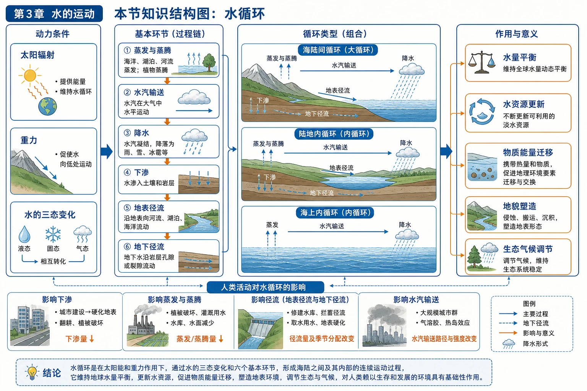
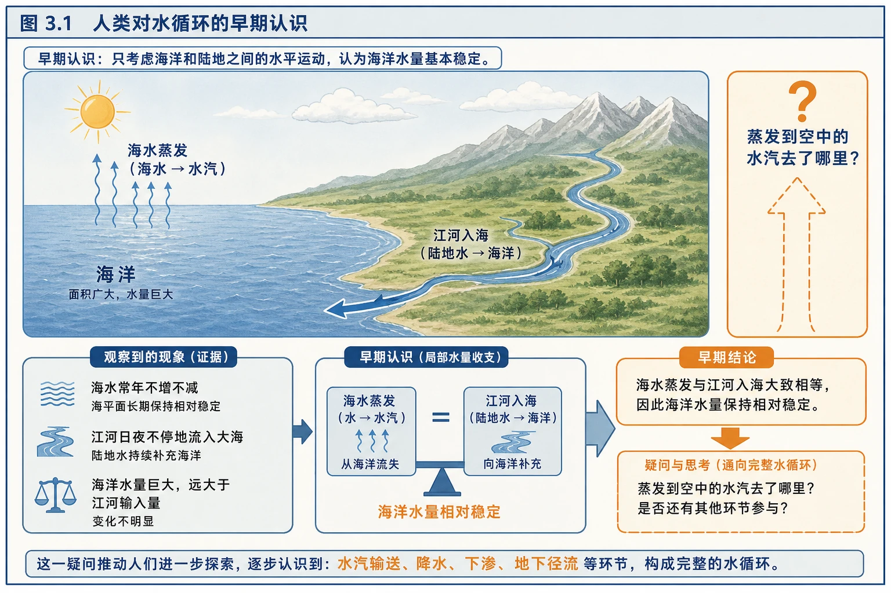
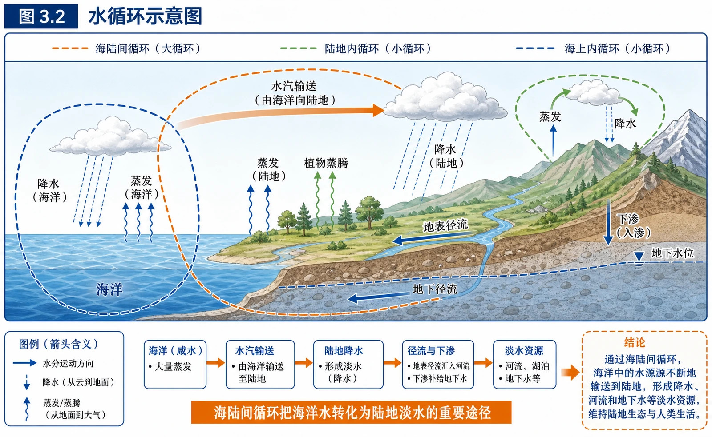
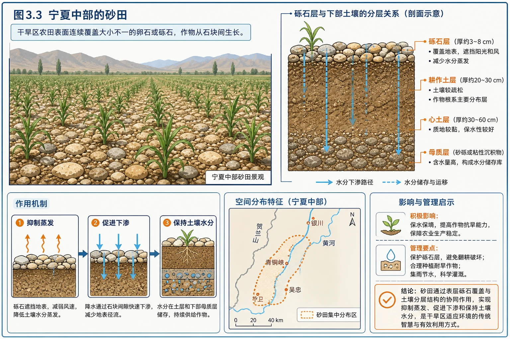
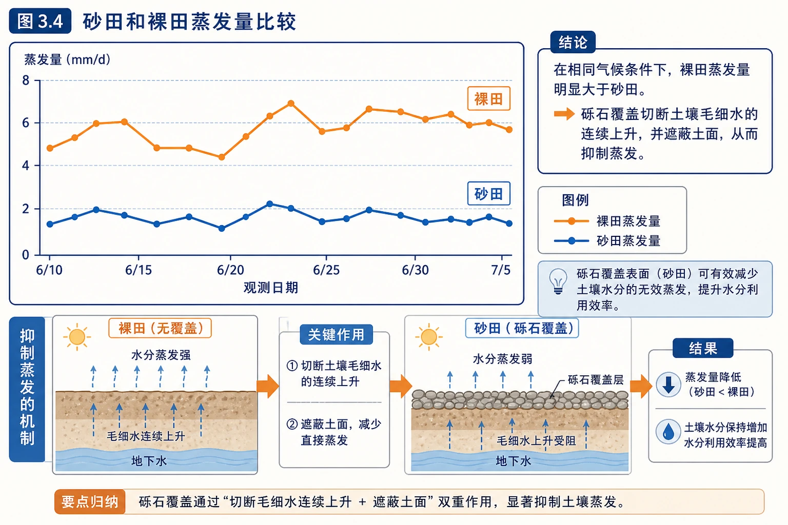
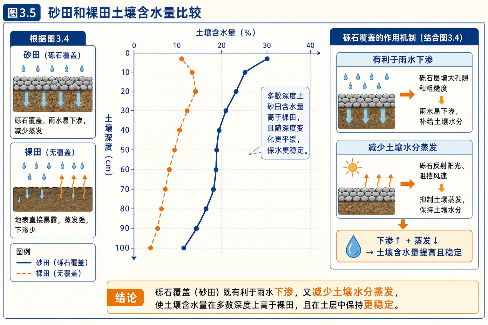
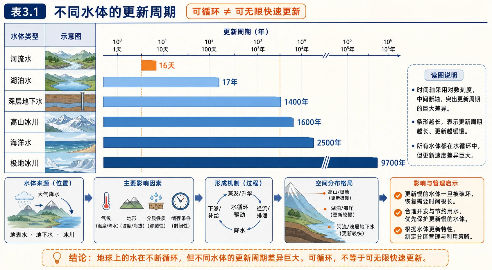
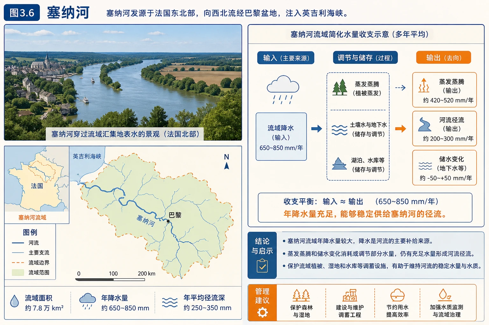

# 第一节 水循环

<!-- 图片描述：本节知识结构图。以“水循环”为中心，左侧列出太阳辐射、重力和水的三态变化等动力条件；中间依次排列蒸发与蒸腾、水汽输送、降水、下渗、地表径流和地下径流六个基本环节，并组合成海陆间循环、陆地内循环和海上内循环；右侧连接水量平衡、水资源更新、物质能量迁移、地貌塑造和生态气候调节；下方补充人类活动对下渗、蒸发、径流和水汽输送的影响。 图面结构：左右两侧分别承担原因—结果、自然—人类、灾前—灾后或两种情境对照；横向轴线表示时间、空间推进、演化阶段或由上游到下游的顺序；环形/闭合箭头表示循环、反馈、包含关系或多环节协同。视频讲解顺序：按左到右或左右对照讲条件、过程、影响与措施；沿横向轴由左向右读演化或空间推进；沿箭头说明物质、能量、泥沙、养分、风险或管理措施的流向。讲解重点：水循环图要区分蒸发/蒸腾、降水、径流、下渗等环节，并说明哪些箭头形成闭合循环；海水性质和运动图要把温度、盐度、密度、波浪、潮汐或洋流的成因与影响对应起来；箭头方向必须说明起点、中间环节、终点及其因果关系。学习落点：用“水体/海域—水分或海水性质/运动—空间分布—人类利用与限制”复述本图。 -->

## 知识关系导航

- 前置联系：太阳辐射为蒸发提供能量，大气运动完成水汽输送，可联系[[第二节 大气受热过程和大气运动|大气受热与大气运动]]。
- 本节主线：水循环环节 → 水循环类型 → 地理意义 → 人类活动影响。
- 后续联系：蒸发、降水、径流和结冰融冰会改变[[第二节 海水的性质|海水温度、盐度和密度]]。
- 综合应用：城市内涝、流域治理、水库建设、植被恢复、海绵城市和水资源合理利用。

## 本节学习目标

1. 绘制并说明水循环示意图，准确识别六个基本环节。
2. 根据发生空间判断海陆间循环、陆地内循环和海上内循环。
3. 从圈层联系、水量平衡、资源更新、地貌和生态等角度说明水循环的地理意义。
4. 根据材料分析植被、地表硬化、水库、跨流域调水等人类活动影响的水循环环节。
5. 运用水量平衡思想解释河流补给、城市内涝和水资源短缺等实际问题。

## 核心知识点讲解

### 一、区域定位与地理情境

地球上的水广泛分布于海洋、陆地和大气中。海洋水约占全球水体总量的97%，是最主要的水体；人类容易直接利用的淡水只占很小比例。水并非固定不动，而是在大气圈、水圈、岩石圈和生物圈之间不断转化和迁移。

教材引用古代关于海水“不会涨溢、不会枯竭”的解释，指出海水一方面不断蒸发，另一方面又由江河补给。这个认识抓住了局部水量收支，却不完整：蒸发到空中的水汽并不会消失，而会经过输送、凝结和降水，重新返回海洋或陆地。真正科学的解释必须把各个环节放入完整循环中。

<!-- 图片描述：图3.1“人类对水循环的早期认识”。画面或文字关系应表现海水蒸发、江河入海和海洋水量相对稳定，旁边以疑问箭头追踪“蒸发到空中的水汽去了哪里”，用于从局部水量收支过渡到完整水循环。 图面结构：环形/闭合箭头表示循环、反馈、包含关系或多环节协同。视频讲解顺序：沿箭头说明物质、能量、泥沙、养分、风险或管理措施的流向。讲解重点：水循环图要区分蒸发/蒸腾、降水、径流、下渗等环节，并说明哪些箭头形成闭合循环；海水性质和运动图要把温度、盐度、密度、波浪、潮汐或洋流的成因与影响对应起来；箭头方向必须说明起点、中间环节、终点及其因果关系。学习落点：用“水体/海域—水分或海水性质/运动—空间分布—人类利用与限制”复述本图。 -->

### 二、核心概念与地理要素

#### 1. 水循环的概念

水循环是指自然界的水在水圈、大气圈、岩石圈和生物圈中，通过蒸发（蒸腾）、水汽输送、降水、下渗、径流等环节连续运动的过程。

定义中有三个关键词：

- **跨圈层**：不是单一水体内部的运动，而是水在多个圈层间转换。
- **多环节**：任何一幅水循环图都要根据箭头判断具体过程。
- **连续性**：局部过程有快慢和季节变化，但全球尺度上循环持续进行。

#### 2. 六个基本环节

| 环节 | 含义 | 常见影响因素 |
|---|---|---|
| 蒸发 | 液态水变为水汽进入大气 | 太阳辐射、气温、风速、空气湿度、水面面积 |
| 蒸腾 | 植物体内水分以水汽形式释放 | 植被类型、叶面积、温度、土壤含水量 |
| 水汽输送 | 大气运动把水汽由一地带到另一地 | 风向、风速、大气环流、地形 |
| 降水 | 大气水汽凝结后降到地表 | 水汽条件、上升运动、凝结条件 |
| 下渗 | 地表水进入土壤和岩层 | 土壤孔隙、坡度、植被、降水强度、地表硬化 |
| 径流 | 水沿地表或地下汇流 | 降水、地形、土壤、植被、河网和人类工程 |

补充理解：积雪和冰川的融化、土壤水和地下水的储存虽然常不单列为六大环节，却是水循环中的重要相态变化和储水过程。

#### 3. 三种水循环类型

| 类型 | 主要空间 | 典型路径 | 特点 |
|---|---|---|---|
| 海陆间循环 | 海洋与陆地之间 | 海洋蒸发→水汽输送→陆地降水→径流入海 | 环节较完整，对陆地淡水更新意义最大 |
| 陆地内循环 | 陆地内部 | 陆地蒸发蒸腾→降水回到陆地 | 水量相对较小，干旱内流区也会发生 |
| 海上内循环 | 海洋内部 | 海洋蒸发→降水回到海洋 | 循环水量最大，但不能直接更新陆地淡水 |

判断方法不是看图上画了几支箭头，而是看水循环跨越的空间：同时连接海洋和陆地的是海陆间循环；只在陆地上的是陆地内循环；只在海洋上的是海上内循环。

<!-- 图片描述：图3.2“水循环示意图”。剖面图左侧为海洋，右侧为陆地、山地、河流和地下含水层；箭头标出海洋和陆地蒸发、植物蒸腾、水汽由海洋向陆地输送、海洋与陆地降水、地表径流、下渗及地下径流。用不同闭合路径分别圈出海陆间循环、陆地内循环和海上内循环，并突出海陆间循环把海洋水转化为陆地淡水。 图面结构：左右两侧分别承担原因—结果、自然—人类、灾前—灾后或两种情境对照；纵向或剖面区表现高度、深度、垂直分层和物质/能量变化；环形/闭合箭头表示循环、反馈、包含关系或多环节协同。视频讲解顺序：按左到右或左右对照讲条件、过程、影响与措施；沿剖面或垂直方向讲层次、深度、物质和能量变化；沿箭头说明物质、能量、泥沙、养分、风险或管理措施的流向。讲解重点：水循环图要区分蒸发/蒸腾、降水、径流、下渗等环节，并说明哪些箭头形成闭合循环；海水性质和运动图要把温度、盐度、密度、波浪、潮汐或洋流的成因与影响对应起来；箭头方向必须说明起点、中间环节、终点及其因果关系。学习落点：用“水体/海域—水分或海水性质/运动—空间分布—人类利用与限制”复述本图。 -->

### 三、过程机制与成因链条

#### 1. 水循环的动力

水循环的外部能量主要来自太阳辐射，内部还受到重力作用：

- 太阳辐射使海洋、河湖、土壤中的水蒸发，也驱动植物蒸腾。
- 太阳辐射造成地表热量差异，间接驱动大气运动和水汽输送。
- 重力使降水落到地面，使地表水由高处向低处流动，并促使水向地下渗透。

因此，“太阳辐射提供能量，重力维持向低处汇流”是理解整个过程的关键。

#### 2. 海陆间循环的完整链条

海洋受热蒸发 → 水汽随大气运动输送到陆地 → 水汽抬升冷却凝结形成降水 → 一部分形成地表径流，一部分下渗形成地下径流 → 最终汇入海洋。

这条链条不是每滴水都必须完整经历。例如，陆地降水可能先被植被截留，再蒸发返回大气；地下水可能储存多年后才排入河流。

#### 3. 流域水量平衡

分析一个流域时，可使用简化水量平衡：

> 降水量 = 蒸发蒸腾量 + 径流量 + 储水量变化。

在较长时期内，若流域储水量变化不大，就可近似认为“降水量≈蒸发蒸腾量＋径流量”。这也是教材中佩罗研究塞纳河的基本逻辑。

#### 4. 人类活动如何改变水循环

人类最容易影响的是陆地上的降水后环节：

- **植树造林**：增加截留和下渗，减缓地表径流，增加蒸腾，削弱洪峰。
- **城市硬化**：减少下渗和地下径流补给，增加并加快地表径流，容易形成内涝。
- **修建水库**：改变径流季节分配，增加水面蒸发，调节洪峰和枯水流量。
- **跨流域调水**：直接改变不同流域的地表径流空间分配。
- **开采地下水**：减少地下水储量，过量开采可能导致地下水位下降、地面沉降或海水入侵。
- **人工增雨**：只能在已有适宜云系和水汽条件下促进降水，不能凭空制造水汽。

### 四、空间分布、图表判读与证据

#### 1. 水循环图判读

先定海陆位置和箭头方向，再按“从哪里到哪里”命名：

- 地表向大气：蒸发或蒸腾。
- 大气水平移动：水汽输送。
- 大气向地表：降水。
- 地表向地下：下渗。
- 陆地表面向海洋：地表径流。
- 地下含水层向海洋或河流：地下径流。

若题目要求“最受人类直接影响的环节”，通常答地表径流；但必须结合材料，城市硬化首先明显改变下渗和地表径流，农业灌溉还会改变蒸发蒸腾。

#### 2. 砂田实验的证据链

宁夏中部干旱地区把卵石或砾石铺在土壤表层，形成砂田。分析时不能只说“保水”，而要指出保水是怎样发生的。

<!-- 图片描述：图3.3“宁夏中部的砂田”。干旱区农田表面连续覆盖大小不一的卵石或砾石，作物从石块间生长；图中应突出砾石层与下部土壤的分层关系，为分析抑制蒸发、促进下渗和保持土壤水分提供情境证据。 图面结构：由主体、空间位置、过程箭头和结论框组成学习型图解。视频讲解顺序：先看标题和主体；再读结构、方向和关键标注；最后概括地理规律或管理结论。讲解重点：水循环图要区分蒸发/蒸腾、降水、径流、下渗等环节，并说明哪些箭头形成闭合循环；海水性质和运动图要把温度、盐度、密度、波浪、潮汐或洋流的成因与影响对应起来。学习落点：用“水体/海域—水分或海水性质/运动—空间分布—人类利用与限制”复述本图。 -->

<!-- 图片描述：图3.4“砂田和裸田蒸发量比较”。横轴为观测日期或时间，纵轴为蒸发量，两条曲线分别代表砂田和裸田；整体上裸田蒸发量较大、砂田较小，说明砾石覆盖切断土壤毛细水连续上升并遮蔽土面，从而抑制蒸发。 图面结构：图表和等值线区承载数值、梯度、峰谷、疏密和异常区域。视频讲解顺序：再读坐标、数值梯度、峰谷、疏密或等值线弯曲，并说明原因。讲解重点：水循环图要区分蒸发/蒸腾、降水、径流、下渗等环节，并说明哪些箭头形成闭合循环；海水性质和运动图要把温度、盐度、密度、波浪、潮汐或洋流的成因与影响对应起来；图表判读要从坐标和整体趋势入手，再解释峰谷、梯度或异常点的地理原因。学习落点：用“水体/海域—水分或海水性质/运动—空间分布—人类利用与限制”复述本图。 -->

<!-- 图片描述：图3.5“砂田和裸田土壤含水量比较”。纵向表示土壤深度，横向或曲线表示含水量；多数深度上砂田含水量高于裸田，且土层中保水更稳定。应结合图3.4得出砾石覆盖既有利于雨水下渗，又减少土壤水分蒸发。 图面结构：纵向或剖面区表现高度、深度、垂直分层和物质/能量变化；图表和等值线区承载数值、梯度、峰谷、疏密和异常区域。视频讲解顺序：沿剖面或垂直方向讲层次、深度、物质和能量变化；再读坐标、数值梯度、峰谷、疏密或等值线弯曲，并说明原因。讲解重点：水循环图要区分蒸发/蒸腾、降水、径流、下渗等环节，并说明哪些箭头形成闭合循环；海水性质和运动图要把温度、盐度、密度、波浪、潮汐或洋流的成因与影响对应起来；图表判读要从坐标和整体趋势入手，再解释峰谷、梯度或异常点的地理原因。学习落点：用“水体/海域—水分或海水性质/运动—空间分布—人类利用与限制”复述本图。 -->

完整因果链为：砾石空隙使降水较快进入土壤 + 砾石覆盖减弱土表直接受热和空气交换、阻断毛细水上升 → 下渗增加、蒸发减少 → 土壤水分较高 → 改善作物水分条件。

#### 3. 水体更新周期表

教材数据表明，河流水平均更新周期约16天，湖泊约17年，深层地下水约1400年，高山冰川约1600年，极地冰川约9700年，海洋水约2500年。

判读结论：

- 水体都可参与循环，但更新速度差异极大。
- 河流水更新快，不代表河流水“取之不尽”；枯水期、污染或过度取水仍会造成短缺。
- 深层地下水和冰川更新极慢，在人类时间尺度上接近不可再生资源，应谨慎开发。

<!-- 图片描述：表3.1“不同水体的更新周期”。采用横向条形或时间轴比较河流水16天、湖泊水17年、深层地下水1400年、高山冰川1600年、海洋水2500年、极地冰川9700年；条形长度用对数或断轴呈现巨大差异，突出“可循环不等于可无限快速更新”。 图面结构：横向轴线表示时间、空间推进、演化阶段或由上游到下游的顺序；环形/闭合箭头表示循环、反馈、包含关系或多环节协同。视频讲解顺序：沿横向轴由左向右读演化或空间推进；沿箭头说明物质、能量、泥沙、养分、风险或管理措施的流向。讲解重点：水循环图要区分蒸发/蒸腾、降水、径流、下渗等环节，并说明哪些箭头形成闭合循环；海水性质和运动图要把温度、盐度、密度、波浪、潮汐或洋流的成因与影响对应起来；箭头方向必须说明起点、中间环节、终点及其因果关系。学习落点：用“水体/海域—水分或海水性质/运动—空间分布—人类利用与限制”复述本图。 -->

### 五、人地关系、影响与对策

#### 1. 水循环的地理意义

1. **联系四大圈层**：水把大气圈、水圈、岩石圈和生物圈联结为统一整体。
2. **维持水量动态平衡**：全球多年平均尺度上，各水体总体保持相对稳定，但局地、季节和年际变化明显。
3. **更新陆地淡水资源**：海陆间循环不断把海水转化为陆地降水，是陆地淡水的重要来源。
4. **迁移物质和能量**：径流搬运泥沙和溶解物质，蒸发与凝结伴随潜热吸收和释放。
5. **塑造地表形态**：流水侵蚀、搬运和堆积形成沟谷、冲积平原和三角洲等地貌。
6. **调节气候与生态**：水的相态变化调节热量，降水和土壤水分影响植被、生物和土壤发育。

#### 2. 水资源为何既可再生又会短缺

水循环使淡水具有更新能力，但可利用水量受四重约束：

- **总量约束**：淡水占全球水体比例很小。
- **时空约束**：降水和径流分布不均，丰水期与枯水期差异大。
- **更新速度约束**：不同水体更新周期差异很大。
- **质量约束**：污染会使“有水”变成“不可用水”。

对策应同时包括开源、节流、调蓄和保护，如节水灌溉、雨洪利用、水库调节、跨流域调水、再生水利用和水污染治理。

### 六、综合题型与迁移应用

#### 1. 城市化与内涝

自然地表变为道路和建筑 → 植被截留减少、下渗减少 → 地表径流量增大且汇流时间缩短 → 排水系统来不及排泄 → 内涝风险上升。

海绵城市通过透水铺装、下沉式绿地、雨水花园和蓄水设施，增加“渗、滞、蓄、净、用、排”，恢复更接近自然状态的水循环。

#### 2. 水库对河流过程的影响

水库蓄水会削弱下游洪峰、增加枯水期供水，但也可能拦截泥沙、改变下游河道冲淤和水生生物生境。评价水利工程要兼顾经济、社会和生态效益。

#### 3. 植被变化与河流径流

植被增加通常会增强截留、下渗和蒸腾，减小短时暴雨形成的地表径流和洪峰；但在长期水量平衡中，蒸腾增强也可能减少年径流量。因此答题时必须区分“洪峰变化”和“年径流总量变化”。

## 重点梳理

- 一个概念：水在四大圈层间连续运动和转化。
- 六个环节：蒸发（蒸腾）、水汽输送、降水、下渗、地表径流、地下径流。
- 三种类型：海陆间循环、陆地内循环、海上内循环。
- 两大动力：太阳辐射提供能量，重力推动降水和径流。
- 六类意义：圈层联系、动态平衡、资源更新、物质迁移、能量交换、地貌与生态作用。
- 一个分析框架：某活动 → 改变哪个环节 → 水量或速度怎样变化 → 产生什么影响。

## 难点突破

### 1. “水量平衡”不等于“每时每地水量不变”

动态平衡是多年平均、较大尺度上的收入与支出大体相等。一次暴雨、持续干旱或某个季节都可能出现明显盈亏。

### 2. 区分下渗、地下径流和地下水补给

- 下渗是水从地表向土壤和岩层进入的过程。
- 地下水补给是下渗水进入含水层，使地下水储量增加。
- 地下径流是地下水在重力作用下沿含水层流动。

### 3. 人类活动影响不能模板化

同一活动可能影响多个环节。例如植树造林既增加下渗，也增加蒸腾；水库既改变径流过程，也增加水面蒸发。答案要根据题目问的是洪峰、水量、地下水还是生态影响来筛选。

### 4. 河流径流的来源

河流水可能由雨水、季节性积雪融水、冰川融水、湖泊水和地下水补给。所有补给最终都嵌入水循环，但不同地区和季节的主导来源不同。

## 例题讲解

### 例1 教材活动：砂田影响了哪些水循环环节

**材料**：宁夏中部气候干旱，农民在土壤表层铺设卵石或砾石。图示砂田与裸田的蒸发量、不同深度土壤含水量。

**问题1：砂石覆盖对水的下渗有何影响？**

**分析**：砾石之间存在空隙，降水可沿空隙进入土壤；覆盖层还能减弱雨滴直接打击造成的土壤板结和地表结皮。

**答案**：总体上有利于降水下渗，减少地表快速流失，使更多水进入土壤。

**问题2：比较砂田与裸田蒸发量。**

**答案**：砂田蒸发量小于裸田。砾石遮蔽土面、降低近地面风速和土壤受热，并阻断土壤毛细水持续上升，因而抑制蒸发。

**问题3：比较土壤含水量并概括受影响的环节。**

**答案**：多数土层中砂田含水量高于裸田。砂石覆盖主要增加下渗、减少蒸发和地表径流，从而提高土壤储水量；作物生长后还会通过蒸腾参与陆地内循环。

### 例2 塞纳河水量研究

17世纪法国学者佩罗估算塞纳河流域年降水量约为河流年径流量的6倍，据此反驳“河水主要来自海水沿地下通道上涌”的观点。

<!-- 图片描述：图3.6“塞纳河”。照片展示河流穿过流域汇集地表水的景观；旁边配简化水量收支示意：流域降水为输入，蒸发蒸腾、河流径流和储水变化为输出或调节项，突出年降水量足以供给河流径流。 图面结构：由主体、空间位置、过程箭头和结论框组成学习型图解。视频讲解顺序：先看标题和主体；再读结构、方向和关键标注；最后概括地理规律或管理结论。讲解重点：水循环图要区分蒸发/蒸腾、降水、径流、下渗等环节，并说明哪些箭头形成闭合循环；海水性质和运动图要把温度、盐度、密度、波浪、潮汐或洋流的成因与影响对应起来。学习落点：用“水体/海域—水分或海水性质/运动—空间分布—人类利用与限制”复述本图。 -->

**推理过程**：若降到流域内的水量远大于河流流出的水量，扣除蒸发蒸腾、下渗和储存后，仍足以形成河流径流。因此降水是河流的重要来源，不必假设海水倒灌到河源。

**方法总结**：这是用“流域边界＋水量平衡＋定量证据”研究自然过程的典型方法。

### 例3 城市暴雨内涝

**设问**：与郊区相比，城市中心在相同暴雨下为什么洪峰更高、出现更早？

**答案**：城市地表硬化和植被减少使雨水下渗、植被截留减少，地表径流增加；道路和排水管网使水流汇集更快，因此汇流时间缩短、洪峰提前且增大。若排水能力不足，就容易发生内涝。

## 易错点整理

1. 错把水汽输送写成“水从海洋流向陆地”。水汽输送发生在大气中，方向取决于风。
2. 认为海上内循环意义不大。它循环水量最大，并深刻影响海洋热量和水量收支。
3. 认为可再生水资源可以无限使用。更新速度、时空分布和水质都会限制利用。
4. 认为植被增加一定使所有径流都增加。植被通常减少暴雨地表径流和洪峰，并可能因蒸腾增强而减少年径流。
5. 把地下水开采写成直接影响降水。它首先改变地下水储量、地下径流和地表水地下水交换。
6. 分析人类活动只写结果，不写环节。规范答案必须指出“哪个水循环环节怎样变化”。

## 考点考证点整理

### 考点1 水循环示意图

- 判箭头方向并命名环节。
- 根据空间范围判断循环类型。
- 说明某环节的能量来源和影响因素。

### 考点2 人类活动对水循环的影响

答题模板：

> 活动改变下垫面或调配水量 → 下渗、蒸发、径流或储水发生变化 → 洪涝、地下水、水资源或生态环境受到影响。

### 考点3 水量平衡计算与判断

明确研究边界和时间尺度，识别输入、输出与储量变化。若题目给出降水、蒸发和径流，可据此求储水变化。

### 考点4 水循环的地理意义

不要只写“使水资源不断更新”。高分答案应从圈层联系、水量平衡、资源更新、物质能量迁移、地貌和生态气候多个角度作答。

### 考证点

- 海陆间循环对陆地淡水更新最重要。
- 海上内循环参与的水量通常最大。
- 全球水量总体动态平衡，区域水量可以明显变化。
- 深层地下水更新缓慢，过度开采后难以在短期恢复。

## 练习题

### 1. 基础选择

下列环节中，主要依靠大气运动完成的是（　）

A. 蒸发　B. 水汽输送　C. 下渗　D. 地下径流

### 2. 类型判断

塔里木河流域的地表水蒸发后，在流域内形成降水，主要属于哪类水循环？说明判断依据。

### 3. 过程分析

某城市将大片林地改建为住宅区。说明暴雨时下渗量、地表径流量、洪峰出现时间和地下水补给可能发生的变化。

### 4. 材料分析

某山区实施退耕还林后，河流含沙量明显降低，暴雨后洪峰减小。用水循环和地表过程解释原因。

### 5. 综合评价

有人说：“修建水库只是把水拦住，不会影响水循环。”请评价这一观点。

### 6. 开放探究

为缓解校园雨后积水，可采取哪些措施？每项措施分别影响哪些水循环环节？

## 练习题答案

### 1. 基础选择

B。水汽输送依靠风和大气环流；蒸发主要依靠太阳辐射，下渗和地下径流主要受重力、地质和地形条件影响。

### 2. 类型判断

属于陆地内循环。水从陆地水体蒸发进入大气，形成的降水又落到陆地，没有跨越海陆空间。

### 3. 过程分析

林地改为住宅区后，地表硬化、植被截留减少，下渗量减少；更多雨水迅速转化为地表径流，地表径流量增加；汇流速度加快，洪峰出现时间提前且峰值增大；进入地下含水层的水减少，地下水补给减弱。

### 4. 材料分析

植被冠层和枯枝落叶增加降水截留，根系改善土壤结构并增加下渗，坡面地表径流速度和总量减小；植被还固定土壤，削弱雨滴溅蚀和流水侵蚀。因此进入河流的泥沙减少，洪水汇集变慢，洪峰降低。

### 5. 综合评价

该观点错误。水库会暂时增加地表水储量，改变河流径流的季节分配和洪峰过程，扩大水面并增加蒸发，还可能改变地下水补给、下游泥沙输送和生态环境。因此水库不是脱离水循环的“静态拦水”，而是对局地水循环的调节。

### 6. 开放探究

可采用透水铺装，增加下渗、减少地表径流；建设下沉式绿地和雨水花园，增加截留、下渗和暂时储水；设置蓄水池，削减洪峰并储存雨水；保护和增加植被，提高截留与蒸腾；疏通并合理扩容排水设施，加快超过调蓄能力的径流安全排出。答案需体现“措施—环节—结果”的对应关系。
