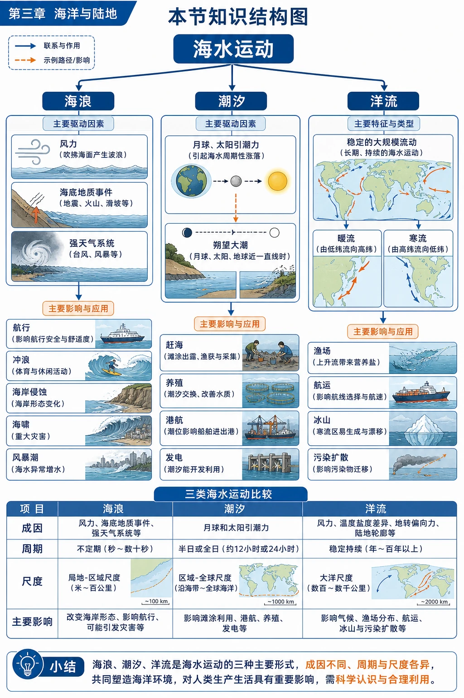
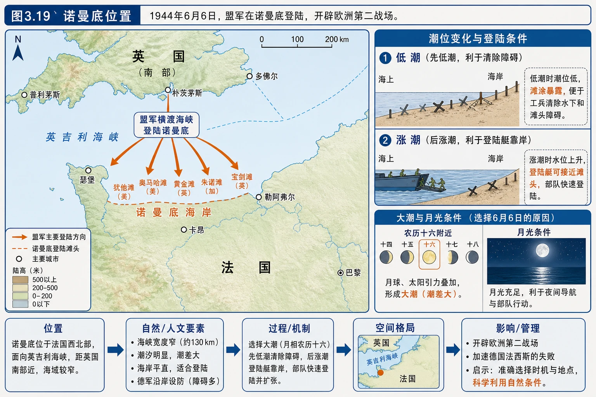
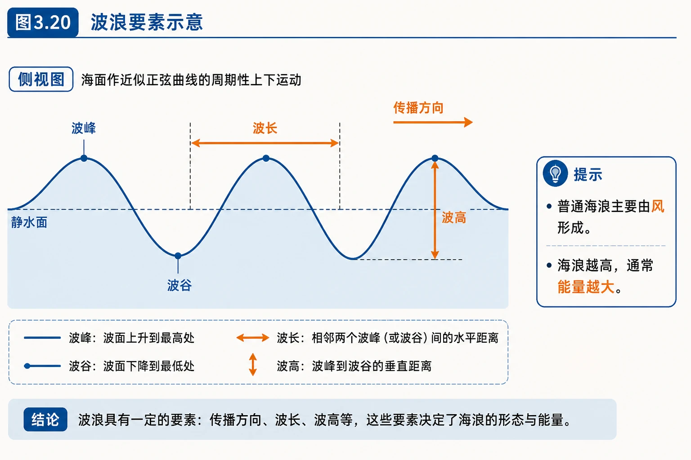
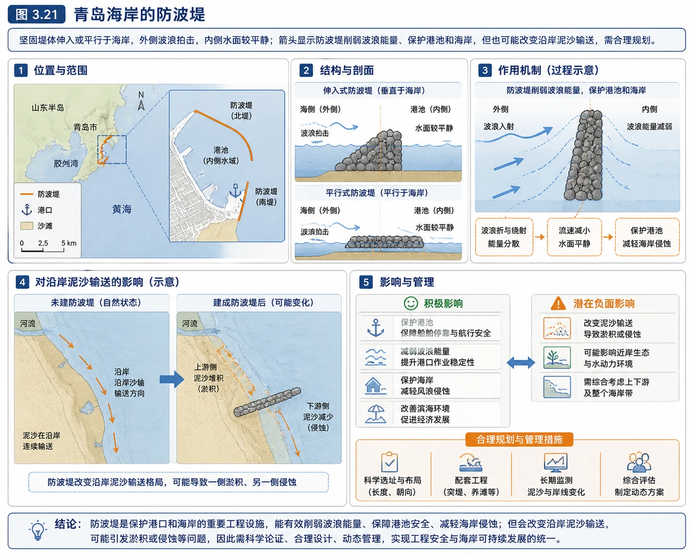
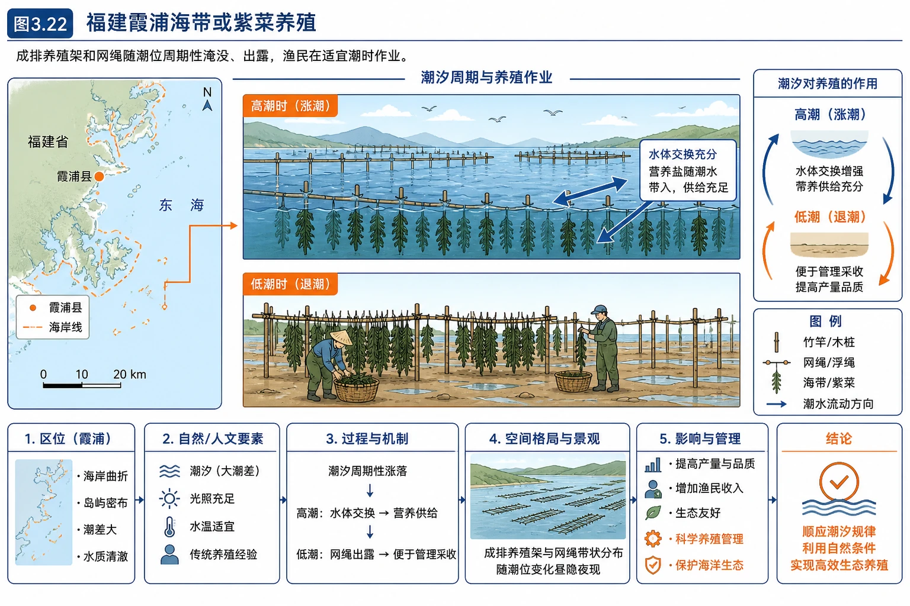
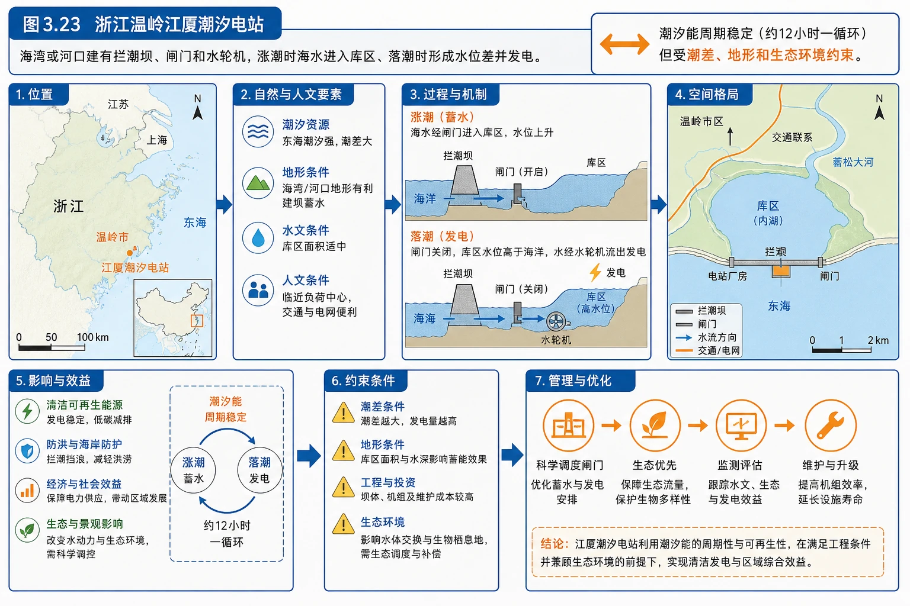
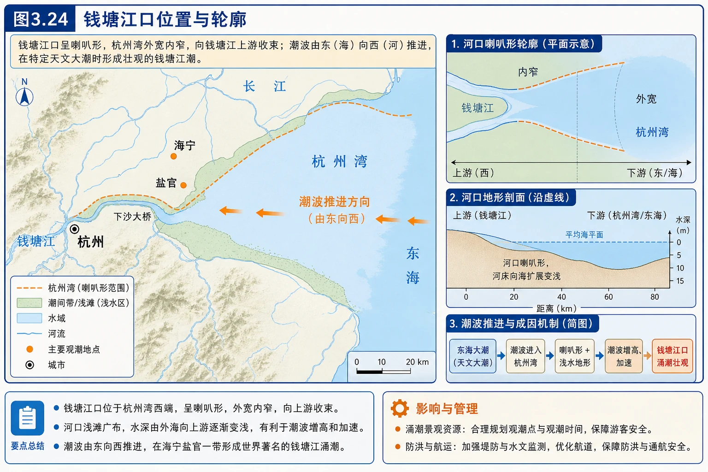
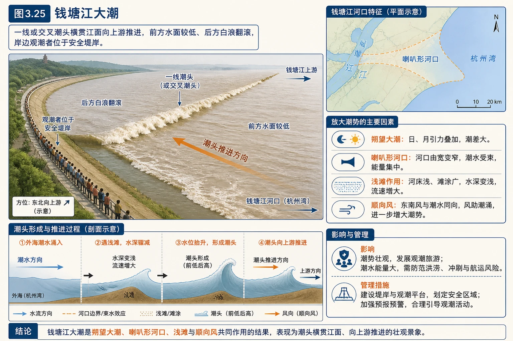
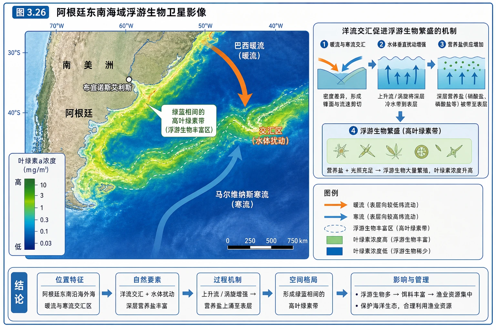
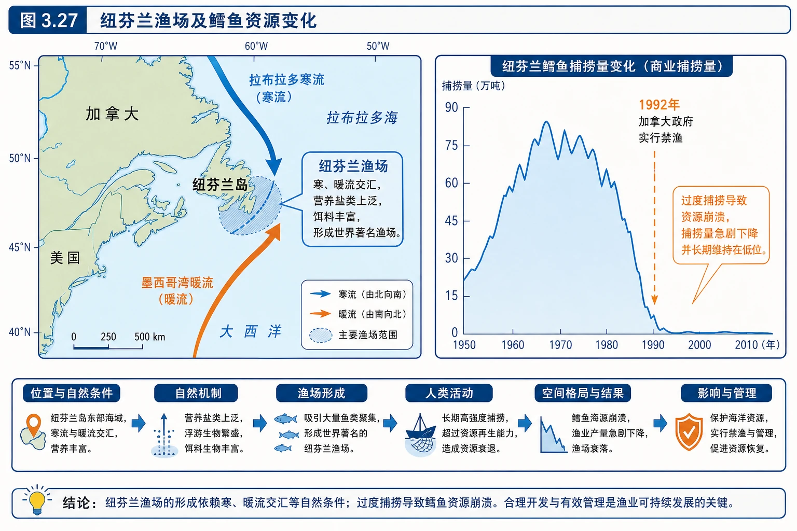

# 第三节 海水的运动

<!-- 图片描述：本节知识结构图。中心为“海水运动”，分为海浪、潮汐、洋流三支。海浪连接风力、海底地质事件和强天气系统，并通向航行、冲浪、海岸侵蚀、海啸和风暴潮；潮汐连接月球太阳引潮力、朔望大潮，并通向赶海、养殖、港航和发电；洋流连接稳定的大规模流动、暖流和寒流，并通向渔场、航运、冰山和污染扩散。底部用“成因—周期—尺度—影响”四项比较三类运动。 -->

## 知识关系导航

- 前置联系：海水温度和盐度形成密度差异，可联系[[第二节 海水的性质|海水的性质]]。
- 本节主线：运动类型识别 → 成因与规律 → 影响与利用 → 灾害防御。
- 跨章联系：盛行风是风浪和部分表层洋流的重要动力，可联系[[第二节 大气受热过程和大气运动|大气运动]]。
- 综合应用：诺曼底登陆、钱塘江观潮、港口调度、渔场形成、海洋污染应急和海岸防护。

## 本节学习目标

1. 区分海浪、潮汐和洋流，说明三者的主要成因与表现。
2. 识别波峰、波谷、波高和波长，理解波浪能量与风力的关系。
3. 解释潮汐周期和朔望大潮，运用潮汐规律分析生产生活安排。
4. 区分暖流与寒流，分析洋流对渔业、航运和污染物扩散的影响。
5. 综合自然与社会因素评价海啸、风暴潮等灾害风险及防御措施。

## 核心知识点讲解

### 一、区域定位与地理情境

1944年诺曼底登陆需要同时满足多个海洋条件：低潮时水下障碍物暴露，便于工兵清除；随后涨潮，登陆艇能靠近海岸；夜间还需要月光。因此盟军选择接近农历十六的日期，利用朔望大潮和月相条件完成作战安排。这个案例说明，海水运动具有可认识、可预测的规律。

<!-- 图片描述：图3.19“诺曼底位置”。欧洲西部地图标出英吉利海峡、英国南部和法国诺曼底海岸，箭头表示盟军从英国横渡海峡登陆；旁边配潮位变化小图，显示先低潮暴露障碍、后涨潮利于登陆艇靠岸，并标注农历十六附近大潮和月光条件。 -->

### 二、核心概念与地理要素

#### 1. 海浪

海浪是海水的波动现象。最常见的海浪由风力形成，风速越大、持续时间越长、海面受风作用的距离越长，通常海浪越高、能量越大。

波浪基本要素：

- 波峰：波浪最高处。
- 波谷：波浪最低处。
- 波高：相邻波峰与波谷的垂直距离。
- 波长：相邻两个波峰或波谷之间的水平距离。

<!-- 图片描述：图3.20“波浪要素示意”。侧视正弦状海面波动，标出传播方向、波峰、波谷；相邻波峰间用水平双箭头标“波长”，波峰到波谷用垂直双箭头标“波高”。图旁提示普通海浪主要由风形成，海浪越高通常能量越大。 -->

#### 2. 海啸与风暴潮

二者都可能形成巨大海浪并造成海岸灾害，但成因不同：

| 灾害 | 主要成因 | 典型特征 |
|---|---|---|
| 海啸 | 海底地震、火山喷发、海底滑坡或沿岸山体崩塌使水体突然大规模扰动 | 传播速度快，深海波高不一定大，进入浅海后波高显著增大 |
| 风暴潮 | 台风、温带气旋等强天气系统造成强风推水和气压降低 | 海面异常升高，若叠加天文高潮和大浪，灾害更重 |

风暴潮不是普通意义上的“潮汐”，只是其灾害水位会与天文潮位叠加。

#### 3. 潮汐

潮汐是海水在月球和太阳引潮力作用下发生的周期性涨落。白天的海水涨落常称潮，夜间的涨落常称汐，合称潮汐。

多数海岸一天出现两次涨潮和两次落潮，但具体潮时和潮差受海岸轮廓、海湾形态、水深和地形影响。

农历初一（朔）和十五、十六（望）前后，太阳、月球和地球大致在一条直线上，引潮力叠加，潮差较大，形成大潮；上弦、下弦月前后，日月引潮力部分抵消，潮差较小，形成小潮。

#### 4. 洋流

洋流是海洋中的海水常年较稳定地沿一定方向作大规模流动。按照流经海区相对温度，可分为：

- 暖流：从水温较高海区流向水温较低海区，通常由低纬流向高纬。
- 寒流：从水温较低海区流向水温较高海区，通常由高纬流向低纬。

“寒流、暖流”是相对概念，不以是否低于0℃判断，也不能只凭流向机械判断；最可靠的是比较洋流源地与流经海区水温。

### 三、过程机制与成因链条

#### 1. 风浪形成与增强

风吹过海面 → 摩擦把能量传给海水 → 海面出现波动 → 风速更大、持续更久、风区更长 → 波高和波长增大 → 海浪能量增强。

海浪传播的主要是能量，水质点多在原位置附近作近似圆周运动，并非整片海水随波峰远距离前进。

#### 2. 海啸近岸增高

海底突发事件排开大量海水 → 长波向四周高速传播 → 进入浅海后受海底摩擦，传播速度下降、波长缩短 → 后续水体继续涌来，能量集中、波高增大 → 沿岸出现巨大水墙和淹没。

#### 3. 风暴潮灾害链

强风向岸吹 + 低气压使海面抬升 → 海水在近岸堆积形成风暴增水 → 若与天文高潮同现，再叠加大浪 → 实际水位超过海堤设计标准 → 海水倒灌、堤坝破坏和沿岸淹没。

#### 4. 朔望大潮

朔或望时日、地、月接近一线 → 月球与太阳引潮力方向协同 → 高潮更高、低潮更低 → 潮差增大。潮汐时刻每天会向后推迟，原因是月球绕地球公转，地球上的地点需要多自转一段才再次对准月球。

#### 5. 洋流交汇形成渔场

寒暖流交汇 → 不同性质海水搅动，营养盐可能被带到表层 → 浮游生物繁殖 → 饵料增多 → 鱼类集聚。冷水性和暖水性鱼类也容易在水团交界附近集中。

### 四、空间分布、图表判读与证据

#### 1. 海浪与海岸

海浪接近海岸时不断拍击、侵蚀岩岸，也搬运和堆积泥沙，长期塑造海蚀崖、海蚀平台、沙滩和沙坝等地貌。海岸工程必须顺应波浪传播和沿岸泥沙运动规律，否则可能保护一段海岸却加剧邻近海岸侵蚀。

<!-- 图片描述：图3.21“青岛海岸的防波堤”。坚固堤体伸入或平行于海岸，外侧波浪拍击，内侧水面较平静；箭头显示防波堤削弱波浪能量、保护港池和海岸，但也可能改变沿岸泥沙输送，需合理规划。 -->

#### 2. 潮汐表与生产安排

读潮汐资料时先找高潮、低潮时刻和潮差，再结合活动需要：

- 赶海、采集滩涂生物：一般选择退潮后至低潮前后，并预留涨潮撤离时间。
- 游泳：不能只看潮位，还要结合流速、风浪、水温、天气和安全警示。
- 观潮：选择大潮期和适合地形区，但必须在安全区域。
- 大型船舶进出浅水港：常利用高潮增加水深，同时考虑航道、风浪和能见度。

<!-- 图片描述：图3.22“福建霞浦海带或紫菜养殖”。成排养殖架和网绳随潮位周期性淹没、出露，渔民在适宜潮时作业；图中标出高潮时水体交换供给营养、低潮时便于管理和采收。 -->

<!-- 图片描述：图3.23“浙江温岭江厦潮汐电站”。海湾或河口建有拦潮坝、闸门和水轮机，涨潮时海水进入库区、落潮时形成水位差并发电；双向箭头强调潮汐能周期稳定但受潮差、地形和生态环境约束。 -->

#### 3. 钱塘江大潮

钱塘江口外宽内窄，呈喇叭形。潮波进入河口后河道迅速收窄，水体受挤压，波高增加；河口浅、河床抬升又使潮波速度降低、后浪赶前浪。农历八月前后处于大潮期，河流水量较丰富，若盛行东南风与潮水方向一致，会进一步抬高潮头。

<!-- 图片描述：图3.24“钱塘江口位置与轮廓”。区域地图显示杭州湾外宽内窄、向钱塘江上游收束，标出杭州、海宁等观潮地点和潮波由东向西推进方向；河口喇叭形和浅水地形被突出显示。 -->

<!-- 图片描述：图3.25“钱塘江大潮”。一线或交叉潮头横贯江面向上游推进，前方水面较低、后方白浪翻滚，岸边观潮者位于安全堤岸；标注朔望大潮、喇叭形河口、浅滩和顺向风共同放大潮势。 -->

#### 4. 洋流及其证据

卫星影像中海水颜色差异常反映叶绿素和浮游生物丰度。洋流交汇或上升流区营养盐丰富，表层浮游生物大量繁殖，可成为渔场形成的重要证据。

<!-- 图片描述：图3.26“阿根廷东南海域浮游生物卫星影像”。南美洲东南沿海外海出现绿蓝相间的高叶绿素带，暖流与寒流在此交汇并造成水体扰动；色标或箭头说明浮游生物丰富区与洋流交汇、营养盐供应之间的联系。 -->

#### 5. 纽芬兰渔场变化

纽芬兰附近寒暖流交汇，海水扰动带来丰富营养盐，曾形成世界著名渔场。但自然条件好不意味着渔业资源无限。长期高强度捕捞使鳕鱼繁殖种群急剧减少，加上生态系统变化，资源难以在短期恢复。

<!-- 图片描述：图3.27“纽芬兰渔场及鳕鱼资源变化”。地图标出北美东北部纽芬兰岛、由北向南的寒流和由南向北的暖流交汇；旁边时间曲线表现鳕鱼捕捞量或资源量先高后急剧下降，并标记1992年加拿大实行禁渔，突出自然渔场形成与人类过度捕捞的双重作用。 -->

### 五、人地关系、影响与对策

#### 1. 海浪的利用与防御

- 利用：冲浪、海滨旅游、波浪能开发。
- 影响：大浪不利于捕捞、海上施工和航行；长期作用塑造海岸。
- 防御：海堤、防波堤、防护林、生态海岸修复；海啸区还需监测预警、疏散路线和高地避难。

#### 2. 1953年荷兰风暴潮案例

荷兰地势低平，部分地区低于海平面。1953年强烈温带气旋引发风暴增水，恰逢较高天文潮位并伴随大浪；灾害发生在夜间，预警和通信条件有限，海堤多处溃决，造成严重伤亡。

灾后荷兰建设多层次防洪体系，包括加高加固海堤、缩短海岸防线、修建可启闭风暴潮屏障、改进监测预警和国土空间管理。启示是：灾害大小由**致灾因子、承灾体暴露度和防灾能力**共同决定。

#### 3. 潮汐的利用

- 滩涂养殖和赶海依靠潮滩周期性出露。
- 港口调度利用高潮增加航道水深。
- 潮汐能规律稳定、可预测，但工程需有较大潮差和适宜湾口地形，并评估泥沙、鱼类洄游和湿地生态影响。

#### 4. 洋流的影响

- **生物与渔业**：寒暖流交汇或上升流区常形成渔场。
- **航运**：顺流可提高航速、节省燃料，逆流则相反；寒流可能把高纬冰山带向较低纬，威胁航线。
- **污染**：洋流能加快污染物扩散和稀释，降低局地浓度，却扩大污染范围，不能理解为“自动消除污染”。
- **热量输送**：洋流在全球输送热量，影响沿岸海温和气候，这是与[[第二节 海水的性质|海水温度]]的直接联系。

### 六、综合题型与迁移应用

#### 1. 三类运动辨别

| 比较项 | 海浪 | 潮汐 | 洋流 |
|---|---|---|---|
| 主要表现 | 海面波动 | 海面周期性涨落 | 海水稳定定向大规模流动 |
| 主要动力 | 风；特殊海浪由地质事件或强天气造成 | 月球和太阳引潮力 | 盛行风、密度差、地转偏向力和海陆轮廓等 |
| 时间特征 | 普通风浪随风变化 | 周期性强、可预测 | 常年较稳定 |
| 典型应用 | 冲浪、防波堤、海啸防灾 | 赶海、港航、养殖、发电 | 渔场、航线、污染追踪 |

#### 2. 沿海灾害风险评价

答题不应只写“风大浪高”，而应分层：

1. 致灾因子：强风、低气压、大浪、高潮位。
2. 环境条件：海湾形状、浅水地形、低平海岸、河流洪水。
3. 暴露度：人口、城市、港口、农田和设施密集程度。
4. 防灾能力：海堤标准、预警、疏散和应急组织。

#### 3. 港口潮汐决策

船舶进港不能只选高潮。还要综合船舶吃水、航道水深和淤积、潮流方向与流速、风浪、能见度、泊位条件和港口调度。

#### 4. 洋流污染题

泄漏点上游、下游的判断要结合洋流方向。近期影响往往沿洋流下游扩展；对污染源附近，洋流有稀释作用；对更大范围，洋流加速污染扩散。因此评价必须同时写“两面性”。

## 重点梳理

- 海浪：最常见由风形成；波高越大通常能量越大；海啸与风暴潮成因不同。
- 潮汐：月球和太阳引潮力造成周期涨落；朔望前后大潮，弦月前后小潮。
- 洋流：常年稳定、定向、大规模；暖流和寒流按相对水温划分。
- 三类影响：海岸地貌与灾害、生产生活与能源、渔业航运与污染。
- 灾害公式：致灾强度 × 暴露度 × 脆弱性，并受防灾能力调节。

## 难点突破

### 1. 海浪传播的是能量，不是整团海水

观察漂浮物会发现它主要上下起伏。水质点多作近似圆周运动，而波形和能量向前传播；只有破浪、潮流等情况下才会出现显著净位移。

### 2. 海啸在深海为什么不一定显眼

深海中海啸波长很长、传播快，能量分散在很长波段，波高可能不大；进入浅海后速度下降、波长缩短，能量集中，波高迅速增加。

### 3. 大潮不等于灾害

大潮是正常天文现象。只有与强风、低压、大浪、低平海岸或防护薄弱等条件叠加时，才可能形成严重灾害。

### 4. 暖流寒流是相对概念

由较低纬流向较高纬的洋流通常比流经海区暖，称暖流；寒流相反。判断依据是水温相对差异，不是名称中的“冷暖”绝对值。

### 5. 渔场形成不等于资源永续

洋流交汇创造了高生产力自然条件，但鱼类种群仍有繁殖周期和承载上限。捕捞强度长期超过补充速度，资源就会衰退。

## 例题讲解

### 例1 诺曼底登陆为什么选择农历十六附近

农历十五、十六前后为望月，太阳、地球和月球接近一线，潮差较大。低潮时水下障碍物充分暴露，便于清除；随后涨潮使登陆艇更靠近岸边，缩短士兵涉水距离；满月附近夜间月光较强，也有利于夜间行动。因此选择日期是对潮汐和月相规律的综合利用。

### 例2 教材活动：怎样利用潮汐规律

**赶海**：查明低潮时刻，在退潮后进入潮滩、低潮前后作业，并在涨潮前撤离。

**游泳**：潮位只是条件之一，还要查潮流、波高、水温、天气、离岸流和安全开放信息。

**观潮**：选择朔望大潮和适宜河口地形，同时遵守预警、远离危险堤脚。

**船舶进出港**：浅水航道可利用高潮增大水深；还需潮流流速、航道水深、船舶吃水、风浪、能见度和港口调度信息。

### 例3 为什么钱塘江大潮壮观

大潮期天文潮差大；杭州湾外宽内窄，潮波向内传播时受挤压；河口水浅、河床抬升使潮波减速，后浪追赶前浪；秋季若河流水量和顺向风适宜，潮势进一步增强。答案应是多因素叠加，不能只写“月球引力大”。

### 例4 洋流与海上污染

**设问**：某海域发生石油泄漏，为什么说洋流既能降低局地污染浓度，也可能加重区域环境风险？

**答案**：洋流使油污随海水运动并与更多海水混合，可使泄漏点附近浓度下降；但它会把油污带到下游海域和沿岸，扩大污染范围，威胁更广区域的渔业、湿地和海岸。因此应依据洋流方向预测扩散路径并布设拦油、回收和保护设施。

## 易错点整理

1. 把海啸说成“海底地震产生的风浪”。海啸不是风形成的，且还可由火山、滑坡等触发。
2. 把风暴潮等同于大潮。风暴潮由强天气系统造成，大潮是天文潮汐现象，二者可叠加。
3. 认为满月时只有一次涨潮。多数海区一天仍有两次涨落，月相主要影响潮差大小。
4. 认为洋流能消除污染。洋流只是扩散和稀释污染物，污染物并未凭空消失。
5. 认为寒暖流交汇一定形成世界级渔场。还需营养盐、水深、生境和捕捞管理等条件。
6. 只按南北流向判断寒暖流。应比较源地和流经海区的相对水温。
7. 认为修海堤就能消除风险。工程防护还需预警、疏散、生态缓冲和合理用地配合。

## 考点考证点整理

### 考点1 海洋运动类型判别

抓材料关键词：波峰波谷、风浪对应海浪；涨潮落潮、潮差对应潮汐；常年稳定流向、寒暖水体对应洋流。

### 考点2 海洋灾害成因与防御

先分清海啸和风暴潮，再写致灾因子、地形放大、高潮叠加、暴露度和防灾能力。

### 考点3 潮汐生产应用

用“潮时＋潮差＋活动需求＋其他安全信息”组织答案，不孤立回答高潮或低潮。

### 考点4 洋流影响

- 渔场：扰动或上升带来营养盐。
- 航运：顺逆流改变速度与能耗，寒流可能携带冰山。
- 污染：局地稀释、扩大扩散范围。

### 考证点

- 普通海浪最常见动力是风。
- 潮汐主要由月球和太阳引潮力引起。
- 朔望前后潮差大，弦月前后潮差小。
- 暖流寒流按相对水温划分。
- 纽芬兰渔场的衰退说明自然资源利用必须控制在人口补充能力以内。

## 练习题

### 1. 基础选择

农历初一和十五前后潮差较大的主要原因是（　）

A. 海水温度最高　B. 日月引潮力叠加　C. 风力最强　D. 洋流速度最快

### 2. 概念辨析

分别说明海啸与风暴潮的主要成因，并指出二者共同的沿海风险。

### 3. 过程分析

为什么海啸在深海可能不易被船舶察觉，而到达浅海岸边时波高会明显增大？

### 4. 生产决策

一艘吃水较深的货轮准备进入受潮汐影响明显的港口。除高潮时刻外，还应收集哪些信息？

### 5. 洋流应用

某渔场位于寒暖流交汇处。解释鱼类资源丰富的自然原因，并指出维持渔业可持续发展的措施。

### 6. 灾害评价

某低平海湾城市在台风登陆时恰逢天文大潮。分析风暴潮风险较高的原因，并提出防灾建议。

## 练习题答案

### 1. 基础选择

B。朔望前后太阳、月球和地球大致在一条直线上，太阳和月球引潮力相互叠加，潮差增大。

### 2. 概念辨析

海啸主要由海底地震、火山喷发、滑坡或沿岸崩塌造成水体突然扰动；风暴潮由台风、温带气旋等强天气系统的强风和低气压造成海面异常升高。二者都可能使巨大水体涌上海岸，导致淹没、冲击建筑、人员伤亡和生态破坏。

### 3. 过程分析

海啸在深海波长极长、传播速度快，波高可能较小，船舶不易察觉。进入浅海后，海底摩擦使传播速度降低、波长缩短，后续水体继续涌入，能量集中使波高迅速增大，最终冲击海岸。

### 4. 生产决策

还应收集航道实时水深和淤积情况、船舶吃水、潮流方向与流速、风速和波高、能见度、航标与引航信息、泊位和拖轮条件等。高潮增加水深，但强横流、大浪或低能见度仍可能使进港不安全。

### 5. 洋流应用

寒暖流交汇使海水扰动，深层营养盐容易上泛，浮游生物繁殖，为鱼类提供丰富饵料；不同水团交界也使鱼类集聚。可持续措施包括设定捕捞配额和禁渔期、保护产卵场、限制网具和幼鱼捕捞、加强资源监测、打击非法捕捞并开展国际协作。

### 6. 灾害评价

台风强风把海水推向岸边，低气压使海面抬升；天文大潮本已处于高水位，二者叠加并伴随大浪。海湾若外宽内窄会使海水堆积，海岸低平则淹没范围大，城市人口和资产密集又提高暴露度。应加强风暴潮预报和分区预警，加固或合理建设海堤与防潮闸，保护滨海湿地和防护林，限制高风险区开发，预先规划疏散路线和避难场所，并在高潮前转移人员和重要物资。
