# 第二节 海水的性质

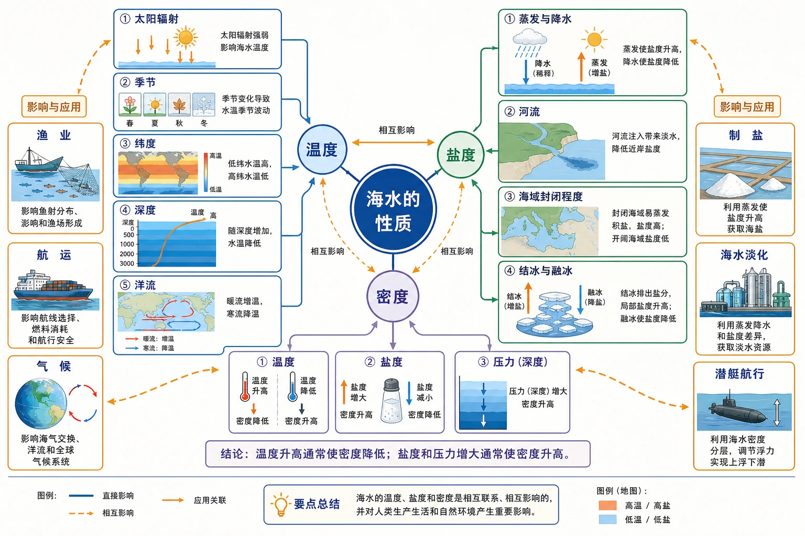
<!-- 图片描述：本节知识结构图。中心为“海水的性质”，分出温度、盐度、密度三支：温度连接太阳辐射、季节、纬度、深度和洋流；盐度连接蒸发降水、河流、海域封闭程度、结冰融冰；密度连接温度、盐度和压力。三支相互连接，其中温度升高通常使密度降低，盐度和压力增大通常使密度升高；外围连接渔业、航运、气候、制盐、海水淡化和潜艇航行。 -->

## 知识关系导航

- 前置联系：[[第一节 水循环|水循环]]中的蒸发、降水、径流和结冰融冰改变海水热量与盐分收支。
- 本节主线：影响因素 → 水平与垂直分布 → 图表证据 → 对自然环境和人类活动的影响。
- 内部联系：海水温度和盐度共同影响密度，三者必须综合判断。
- 后续联系：性质不同的海水相遇或受风、引潮力作用，会参与[[第三节 海水的运动|海水运动]]。

## 本节学习目标

1. 说明海水温度、盐度和密度的含义及主要影响因素。
2. 读图归纳三种性质的水平和垂直分布规律。
3. 用热量收支和水盐收支解释海水性质的时空差异。
4. 分析海水性质对生物、渔业、航运、气候和资源利用的影响。
5. 综合气候、河流和海域轮廓解释红海、波罗的海等特殊海域的盐度差异。

## 核心知识点讲解

### 一、区域定位与地理情境

海洋内部并非均一水体。不同纬度、季节、深度和海域的海水具有不同温度、盐度和密度，这些差异会影响海洋生物分布、船舶吃水、海冰形成、海水淡化，甚至潜艇航行安全。

教材以美国“长尾鲨号”核潜艇事故引入“海中断崖”：潜艇从约300米水深突然沉到约2300米深处。事故原因复杂，但海水密度随深度异常减小会导致潜艇所受浮力突然减小，是理解这一现象的关键地理知识。

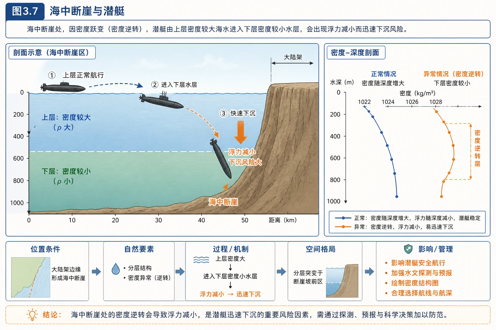
<!-- 图片描述：图3.7“海中断崖与潜艇”。剖面图表现潜艇先航行在上层密度较大海水中，进入下层密度较小水层后迅速下沉；同时画出正常密度随深度增大与异常密度逆转两条剖面曲线，用“浮力减小”箭头说明风险。 -->

### 二、核心概念与地理要素

#### 1. 海水温度

海水温度表示海水的冷热程度，取决于海水热量收支。

- 主要热量收入：太阳辐射。
- 主要热量支出：海水蒸发消耗热量。
- 其他影响：长波辐射、海气热交换、洋流输送和上下层海水混合。

同一区域某时段若热量收入大于支出，海温上升；若支出大于收入，海温下降。

#### 2. 海水盐度

海水盐度表示单位质量海水中所含盐类物质的多少，通常以‰表示。世界大洋平均盐度约35‰，即每千克海水中溶解盐类物质约35克。

盐度本质上受**水分增减**和**盐分交换**共同控制：

- 蒸发带走水分、盐分留下，盐度升高。
- 降水和河流输入淡水，盐度降低。
- 结冰时大部分盐分析出到周围海水，未结冰海水盐度升高；海冰融化则稀释表层海水。
- 海域与外海交换弱时，局地水盐收支造成的差异更容易累积。

#### 3. 海水密度

海水密度是单位体积海水的质量，主要受温度、盐度和压力影响：

- 温度升高，海水膨胀，密度通常减小。
- 盐度升高，单位体积中盐类物质增多，密度通常增大。
- 深度增加，压力增大，海水被轻微压缩，密度增大。

表层海水压力差异小，密度变化主要取决于温度和盐度，其中温度通常起主导作用；深层海水还要考虑压力。

### 三、过程机制与成因链条

#### 1. 表层海温为什么由低纬向高纬降低

纬度升高 → 正午太阳高度总体减小、单位面积获得太阳辐射减少 → 海水热量收入减少 → 表层海温降低。

这是全球总体规律，局地会受到暖流、寒流、海陆分布和季节影响而偏离。

#### 2. 海温为什么随深度增加而降低

太阳辐射主要被海洋表层吸收 → 表层直接受热且受风浪搅拌 → 上层温度较高；太阳辐射难以到达深处 → 随深度增加海温迅速降低；约1000米以下缺少直接太阳加热且水体交换慢 → 温度低且变化小。

低纬和中纬常形成明显的温跃层；高纬表层本就较冷，上下温差小，垂直变化较缓。

#### 3. 表层盐度为什么副热带最高

赤道附近：气温高、蒸发强，但降水更丰富，降水量往往大于蒸发量 → 盐度不最高。

副热带：受副热带高压控制，晴天多、降水少、蒸发强，蒸发量大于降水量 → 盐度最高。

高纬：温度低、蒸发弱，并有融冰稀释 → 盐度较低。

因此海水表层盐度不是简单随纬度单调变化，而是从副热带向赤道和两极降低。

#### 4. 海水性质如何共同决定密度

全球表层由低纬向高纬，海水温度明显降低，虽然盐度并非单调增加，但降温造成的增密效应通常更强 → 表层海水密度总体随纬度升高而增大。

在局地判断中要比较不同因素的方向和强弱。例如河口海水盐度低会减小密度；寒冷高盐海水则密度较大，容易下沉。

### 四、空间分布、图表判读与证据

#### 1. 海水温度的垂直分布

总体规律：表层最高，随深度增加而降低；约1000米以内变化较明显，1000米以下温度低且变化小。

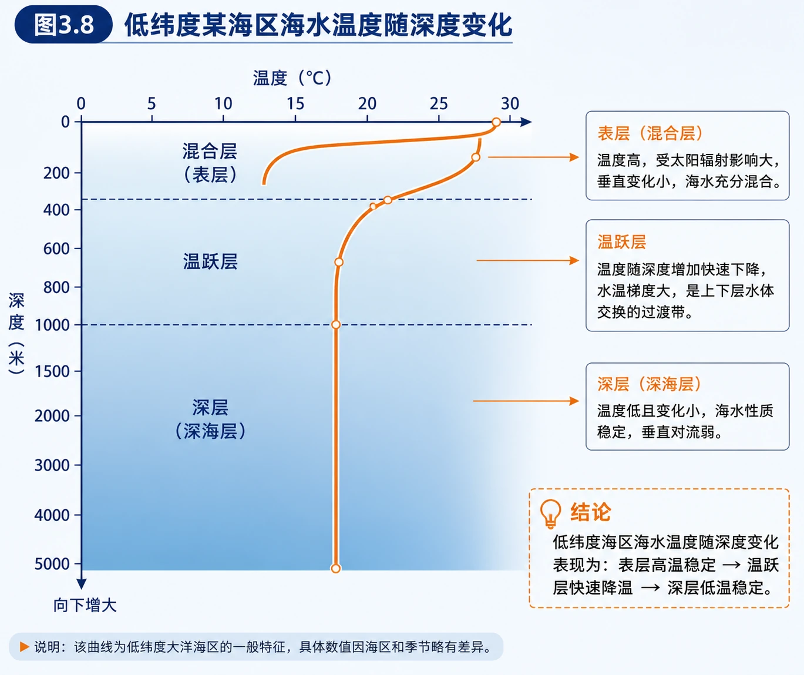
<!-- 图片描述：图3.8“低纬度某海区海水温度随深度变化”。横轴为温度，纵轴为深度且向下增大；曲线在表层温度高，上部混合层变化较小，中间温跃层向低温方向快速弯曲，约1000米以下曲线近乎竖直，表示深层海温低而稳定。 -->

读垂直剖面图要注意：纵轴的深度常向下增大，曲线向左表示温度下降；描述时应指出“总体趋势＋变化最显著的深度范围＋深层特征”。

#### 2. 海水温度的水平和季节分布

- 同一季节，表层海温总体由低纬向高纬降低。
- 同一海区，夏季海温一般高于冬季。
- 同纬度海区，暖流流经处偏高，寒流流经处偏低。
- 海水热容量大，海温季节变化通常比陆地缓慢并有一定滞后。

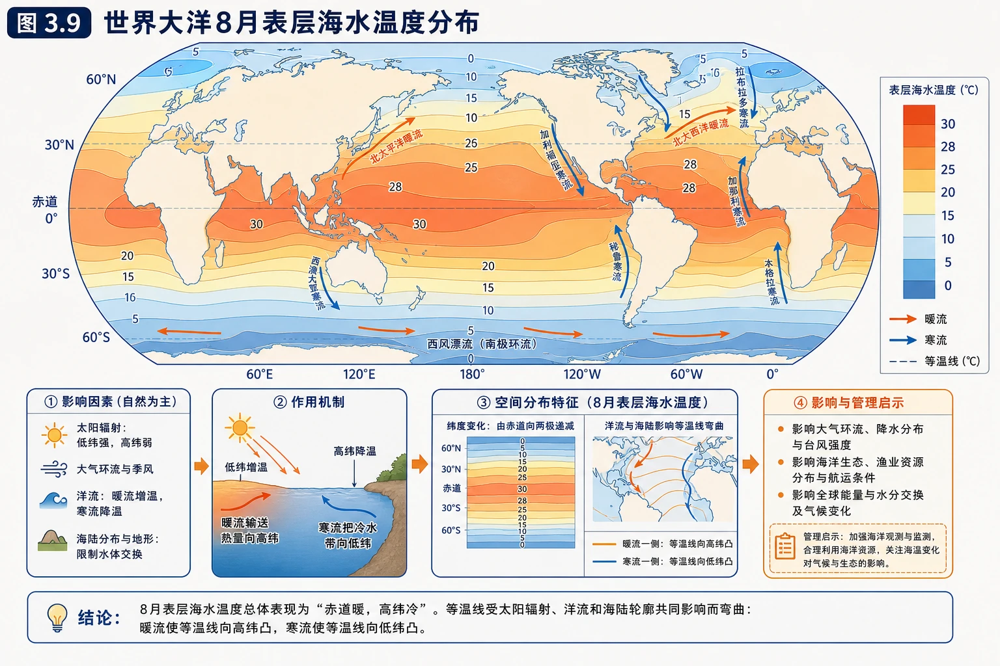
<!-- 图片描述：图3.9“世界大洋8月表层海水温度分布”。世界地图用等温线或色阶表示海温，赤道和低纬海区颜色较暖，向南北高纬逐渐变冷；等温线受洋流和海陆轮廓影响发生弯曲，北半球中高纬可观察暖流一侧等温线向高纬凸、寒流一侧向低纬凸。 -->

#### 3. 三地海温曲线判读

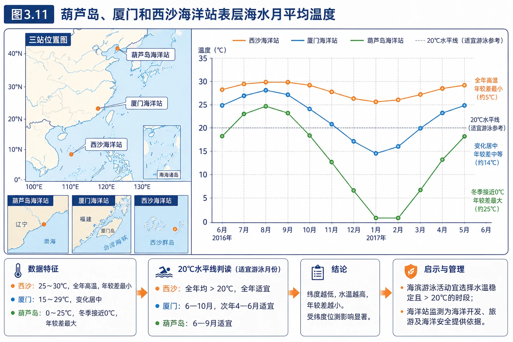
<!-- 图片描述：图3.11“葫芦岛、厦门和西沙海洋站表层海水月平均温度”。横轴为2016年6月至2017年6月，纵轴0—35℃。西沙约25—30℃、全年高温且年较差最小；厦门约15—29℃、变化居中；葫芦岛约0—25℃、冬季接近0℃且年较差最大。20℃水平线用于判断适宜游泳月份。 -->

图中证据：纬度越低，年平均海温越高、年较差越小；纬度越高，冬季降温越明显。按月平均表层海温高于20℃判断，西沙全年适宜；厦门约4—11月适宜，6月也高于20℃；葫芦岛主要在夏季至初秋，约6—9月适宜，部分临界月份还要结合实时天气、水温和安全条件。

#### 4. 表层盐度的空间分布

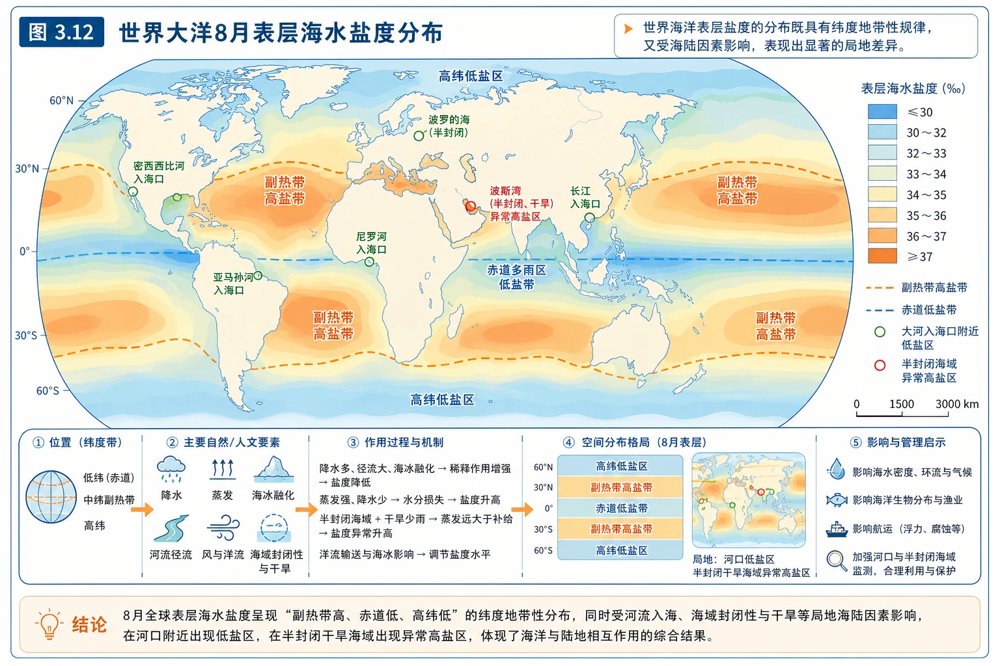
<!-- 图片描述：图3.12“世界大洋8月表层海水盐度分布”。世界地图上副热带海区形成高盐带，赤道多雨区和高纬海区盐度较低；大河入海口附近出现局地低盐区，半封闭干旱海域可出现异常高盐，强调纬度地带性与局地海陆因素共同作用。 -->

盐度图判读顺序：先看全球纬度带规律，再看河口、封闭海域、结冰融冰和洋流造成的异常。

#### 5. 红海与波罗的海比较

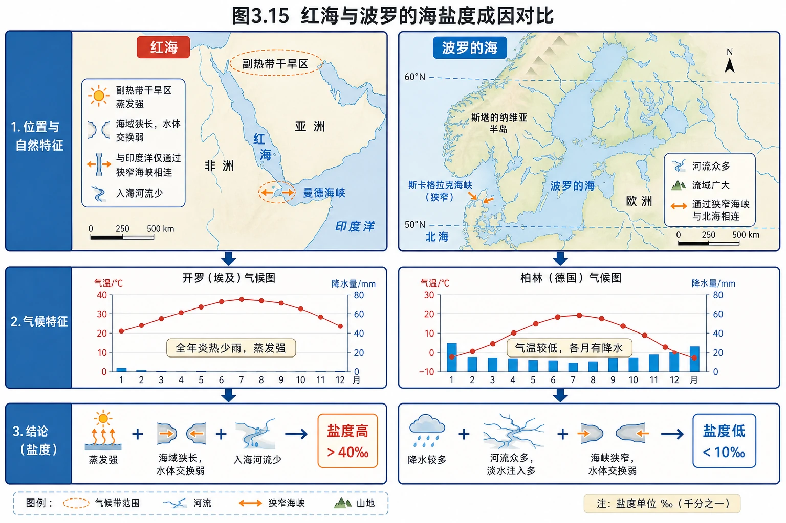
<!-- 图片描述：图3.15“红海与波罗的海盐度成因对比”。左上红海位置图显示其位于副热带干旱区、海域狭长、与印度洋仅通过狭窄海峡相连、入海河流少；右上波罗的海图显示纬度较高、周围河流众多、通过狭窄海峡与北海相连。下方开罗气候图表现全年炎热少雨，柏林气候图表现气温较低且各月有降水。结论箭头分别指向红海盐度超过40‰、波罗的海盐度低于10‰。 -->

完整比较：

| 因素 | 红海 | 波罗的海 |
|---|---|---|
| 气候 | 炎热干旱，蒸发远大于降水 | 温凉湿润，蒸发较弱、降水较多 |
| 河流 | 入海河流少，淡水补给少 | 周围河流多，淡水补给多 |
| 海域轮廓 | 较封闭，与外海交换弱 | 较封闭，与外海交换弱 |
| 结果 | 高盐效应累积，盐度极高 | 稀释效应累积，盐度极低 |

注意：两地都较封闭，但结果相反，说明“封闭”不是决定盐度高低的独立原因，它只是让当地水盐收支的结果更容易保留。

#### 6. 温度、盐度、密度的纬度关系

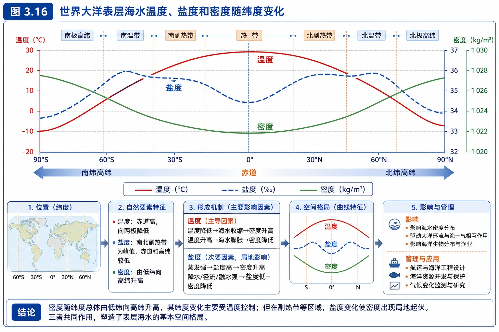
<!-- 图片描述：图3.16“世界大洋表层海水温度、盐度和密度随纬度变化”。横轴从南纬高纬经赤道到北纬高纬；温度曲线在赤道附近最高、向两极降低；盐度曲线在南北副热带形成峰值，在赤道和高纬较低；密度曲线总体由低纬向高纬升高。三条曲线叠置以显示密度纬度变化主要受温度控制，但局地也受盐度影响。 -->

图表语言应分别描述：温度由低纬向高纬降低；盐度由副热带向赤道和高纬降低；密度总体由低纬向高纬增加。切勿用一个单调规律套用三条曲线。

#### 7. 海水密度的垂直分布

中低纬海区：表层一定深度内密度较均匀，随后随深度迅速增大，约1000米以下变化较小。高纬海区因表层海水已经很冷，上下层温差较小，密度随深度变化较小。

若某处出现密度随深度增加反而减小的“密度倒置”，潜艇从较密水层进入较轻水层时，排开相同体积海水所受浮力减小，可能突然下沉。

### 五、人地关系、影响与对策

#### 1. 海温的影响

- **海洋生物**：不同生物有适宜温度范围，海温变化会影响栖息、繁殖和洄游，进而影响渔业生产。
- **海洋运输**：高纬海区海水结冰会阻碍航行，需要破冰船开辟航道。
- **沿海气候**：海水热容量大，增温降温慢，使沿海地区气温日较差和年较差较小；海洋还通过蒸发提供水汽。
- **极端事件**：异常高海温可能引起珊瑚白化，也会为热带气旋提供能量，但具体影响需结合大气条件。

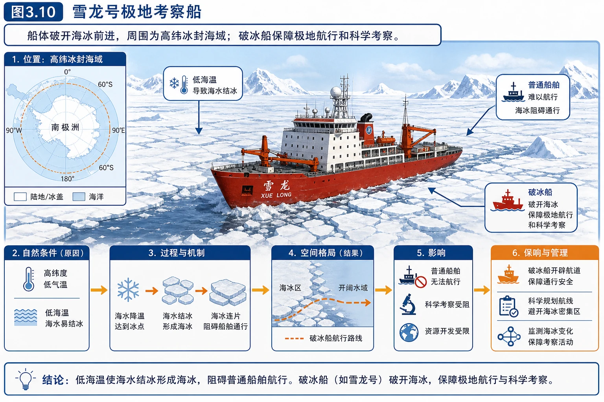
<!-- 图片描述：图3.10“雪龙号极地考察船”。船体破开海冰前进，周围为高纬冰封海域；图中标注低海温导致海水结冰、海冰阻碍普通船舶、破冰船保障极地航行和科学考察。 -->

#### 2. 盐度与海洋资源利用

- 从海水中晒盐和提取镁、溴等化学物质。
- 盐场选址通常要求海水盐度较高、海滩平坦宽广、晴天多、降水少、蒸发强。
- 不同海洋生物对盐度适应范围不同，养殖需监测盐度变化。
- 海水淡化可增加水源，淡化后的水可用于生产生活；沿海工业也可利用海水冷却，部分地区用海水冲厕。

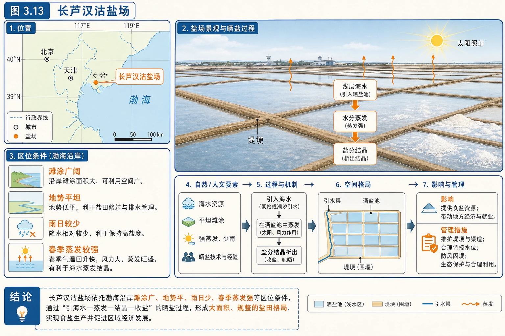
<!-- 图片描述：图3.13“长芦汉沽盐场”。平坦开阔的晒盐池被堤埂分隔，太阳照射使浅层海水蒸发并结晶；旁边标出渤海沿岸滩涂广、地势平、雨日较少和春季蒸发较强等区位条件。 -->

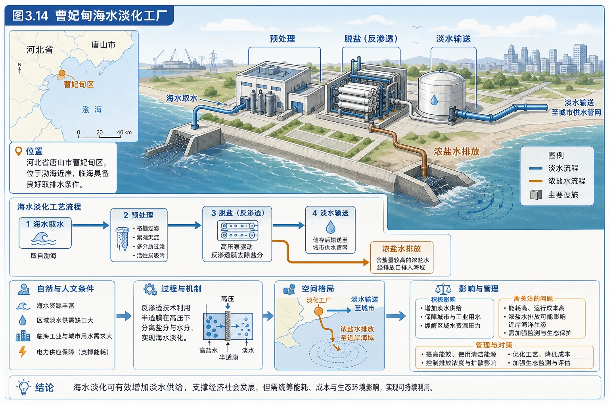
<!-- 图片描述：图3.14“曹妃甸海水淡化工厂”。厂房、管道和处理设施构成海水取水—预处理—脱盐—淡水输送流程，另有浓盐水排放端；图中同时提示淡化可以增加供水，但需关注能耗、成本和浓盐水对近岸生态的影响。 -->

#### 3. 密度的影响

- 海水密度影响浮力，同一船舶在密度较大的海水中吃水较浅，在密度较小的海水中吃水较深。
- 不同密度水体的分层会影响上下层混合、营养盐和氧气交换。
- 密度差可驱动海水垂直和水平运动，是深层海洋环流的重要动力之一。
- 潜艇航行必须掌握海水密度垂直变化，避免进入异常密度层。

#### 4. 新加坡滨海堤坝案例

新加坡降水丰富，但国土狭小、地势起伏小、河流短，天然储水空间不足，仍会面临淡水资源压力。滨海堤坝把海湾与外海分隔，利用降水和地表径流逐渐冲淡原有咸水，形成城市蓄水库。

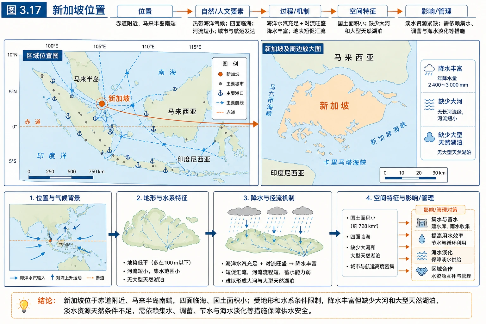
<!-- 图片描述：图3.17“新加坡位置”。地图显示新加坡位于赤道附近、马来半岛南端，四面临海、国土面积小；周边海峡与城市密集，突出其降水丰富却缺少大河和大型天然湖泊的区域背景。 -->

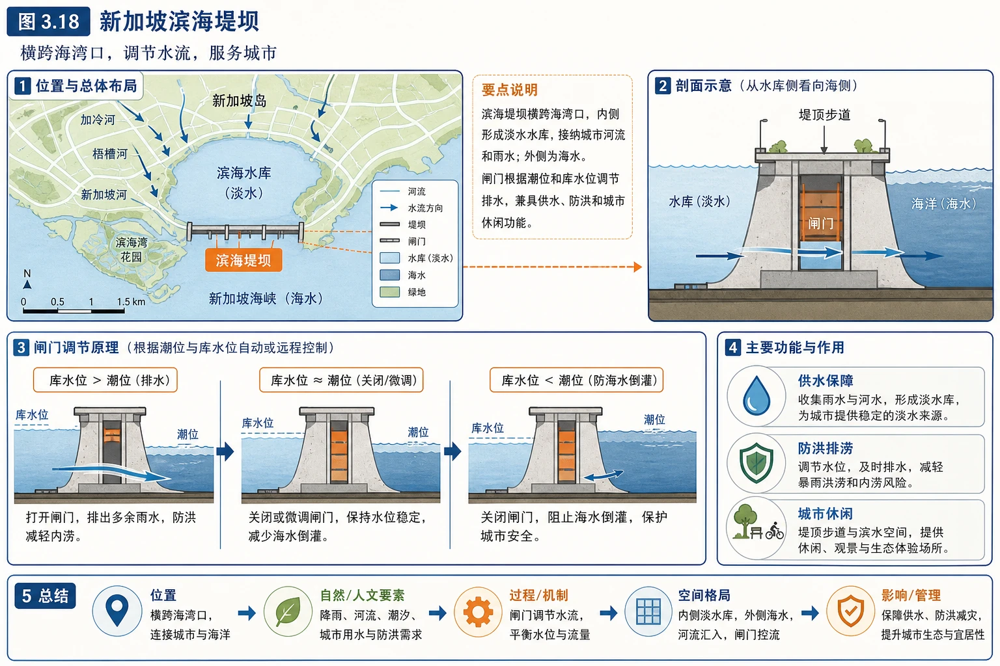
<!-- 图片描述：图3.18“新加坡滨海堤坝”。堤坝横跨海湾口，内侧形成淡水水库并接纳城市河流和雨水，外侧为海水；闸门根据潮位和库水位调节排水，示意其兼具供水、防洪和城市休闲功能。 -->

该工程的本质是利用水循环中的降水和径流，借助工程改变水体储存空间与海陆水交换。它不能增加当地降水，却能提高雨水留存和利用率。

### 六、综合题型与迁移应用

#### 1. 海滨浴场适游期

读月平均海温曲线时：先找20℃基准线，再看各站曲线连续高于该线的月份，最后用纬度、太阳辐射季节变化和海水热容量解释差异。真实决策还需考虑逐日水温、风浪、天气、污染和救生条件。

#### 2. 盐度异常区

答题框架：

> 气候决定蒸发与降水 → 河流决定淡水注入 → 海域轮廓决定与外海交换 → 结冰融冰和洋流进一步修正 → 得出盐度高低。

#### 3. 海水性质剖面图

先看纵轴深度方向，再找表层混合层、变化剧烈层和深层稳定层。若温度降低、盐度升高，二者都会使密度增大；若作用方向相反，则需根据曲线或题目数据判断主导因素。

#### 4. 海水淡化评价

优势包括水源量大、可缓解沿海缺水、受降水年际变化影响较小；限制包括能耗与成本、设备技术要求、浓盐水排放和生态风险。规范评价应兼顾资源、技术、经济和环境。

## 重点梳理

| 性质 | 全球水平规律 | 垂直规律 | 主要影响因素 |
|---|---|---|---|
| 温度 | 表层由低纬向高纬降低 | 随深度增加而降低，1000米以下低且稳定 | 纬度、季节、深度、洋流、海陆分布 |
| 盐度 | 副热带最高，向赤道和高纬降低 | 地区差异大，受水团和过程影响 | 蒸发降水、河流、封闭程度、结冰融冰 |
| 密度 | 表层总体由低纬向高纬增大 | 中低纬先较均匀、后快速增大、深层稳定 | 温度、盐度、压力 |

记忆主线：

> 热量收支决定温度，水盐收支决定盐度，温度＋盐度＋压力共同决定密度。

## 难点突破

### 1. 为什么赤道盐度不是最高

赤道海温高、蒸发强，但赤道低压带上升气流旺盛，降水更加丰富。决定盐度的是蒸发量与降水量的对比，不是只看温度。

### 2. 为什么副热带盐度高

副热带高压控制下盛行下沉气流，晴朗少雨，蒸发量大于降水量，水分净损失使盐分浓缩。

### 3. “封闭海域盐度高”为什么不成立

封闭只表示水交换弱。当地若蒸发强、淡水补给少，会累积高盐；若降水和河流补给多，则会累积低盐。红海和波罗的海正好说明这一点。

### 4. 密度变化不能只看温度

大尺度表层密度常受温度主导，但河口、结冰区、蒸发强烈海域等地点，盐度效应可能非常显著；深层还需考虑压力。

### 5. 海温曲线的季节滞后

北半球太阳辐射最强在夏至前后，但海洋因热容量大，最高海温常出现在其后一段时间；最低海温也可能滞后于冬至。不能把海温极值月份机械等同于太阳辐射极值月份。

## 例题讲解

### 例1 教材活动：比较三地海滨浴场适游时间

**读图结论**：

- 西沙海温全年约25℃以上，全年都满足20℃以上条件。
- 厦门冬季约15℃，夏季接近29℃，大致4—11月满足条件。
- 葫芦岛冬季接近0℃，夏季约25℃，主要约6—9月满足条件。

**原因**：西沙纬度最低，全年太阳辐射较强，海温高且年较差小；厦门纬度居中；葫芦岛纬度最高，太阳辐射季节差异大，冬季降温明显，因此适游期最短。

### 例2 教材活动：红海和波罗的海盐度差异

**问题1：两地气候特征有何差异？**

红海周边全年炎热干旱，蒸发强、降水少；波罗的海周边气温较低，蒸发弱且降水较多。

**问题2：河流有什么影响？**

红海周边几乎无大河注入，淡水补给少；波罗的海周围河流众多，淡水注入多，稀释海水。

**问题3：与外海连接有什么共同特点？**

两者都较封闭，仅通过狭窄水道与外海相连，海水交换较弱，因此各自水盐收支造成的差异得以累积。

**问题4：综合结论。**

红海“蒸发强＋降水少＋径流少＋交换弱”，盐度超过40‰；波罗的海“蒸发弱＋降水多＋径流多＋交换弱”，盐度低于10‰。

### 例3 “海中断崖”

**设问**：潜艇由上层进入下层后，若海水密度突然减小，为什么可能快速下沉？

**答案**：浮力等于潜艇排开海水所受重力。潜艇体积基本不变，进入密度较小的海水后，排开海水质量减少，浮力减小；若浮力小于潜艇重力，潜艇会加速下沉。应及时调整水舱和航行状态。

### 例4 盐场区位

**设问**：分析长芦盐场适合晒盐的自然条件。

**答案**：渤海沿岸滩涂广阔、地势平坦，便于修建盐池；春季晴天较多、降水较少，风力较大、蒸发旺盛；海水可稳定供给晒盐池。若从全年看，还应考虑雨季会降低晒盐效率。

## 易错点整理

1. 把35‰写成35%。35‰相当于3.5%，单位不能混淆。
2. 认为海温只受纬度影响。季节、洋流、海陆分布和深度也会造成明显差异。
3. 认为纬度越低盐度越高。表层盐度最高值通常在副热带，不在赤道。
4. 认为河流入海会提高盐度。河水一般为淡水，通常降低河口附近盐度。
5. 认为结冰会使周围海水变淡。海水结冰时盐分析出，周围未冻结海水盐度反而升高；融冰才会稀释。
6. 认为密度随深度增加只因温度降低。压力和盐度也会影响密度。
7. 只用月平均海温判断游泳安全。真实活动还要考虑天气、风浪、水质和安全管理。

## 考点考证点整理

### 考点1 等温线和海温曲线

描述“低纬高、高纬低”的总体规律，结合等温线弯曲判断洋流影响；垂直图要指出温跃层和深层稳定层。

### 考点2 盐度成因综合题

优先调用四因素：蒸发与降水、河流径流、海域封闭程度、结冰融冰；有材料时再考虑洋流。

### 考点3 三要素关联图

必须分别描述三条曲线，不把温度、盐度和密度混成一条规律；解释密度时说明温度通常为表层大尺度主导因素。

### 考点4 海洋资源利用评价

从自然条件、市场和技术、经济成本、生态环境四类因素组织答案。

### 考证点

- 世界大洋平均盐度约35‰。
- 表层海温总体由低纬向高纬降低。
- 表层盐度最高值多出现在副热带海区。
- 表层密度总体由低纬向高纬增大。
- 约1000米以下海温通常低且变化较小。

## 练习题

### 1. 基础选择

世界大洋表层盐度最高值主要出现在副热带海区，其主要原因是（　）

A. 河流注入多　B. 蒸发量大于降水量　C. 海冰融化多　D. 海水交换强

### 2. 曲线判断

某海区海水温度从表层到1000米迅速降低，1000米以下变化很小。说明这种垂直结构形成的原因。

### 3. 区域比较

甲海域位于湿润高纬地区，周围河流众多且较封闭；乙海域位于干旱副热带，几乎无河流注入且较封闭。比较两海域盐度并说明理由。

### 4. 过程判断

高纬海区冬季大量结冰。说明结冰过程对周围未冻结海水盐度和密度的可能影响。

### 5. 生产应用

同一艘满载货轮从高盐度海域驶入河口低盐度海域，吃水深度可能怎样变化？为什么？

### 6. 综合评价

某沿海缺水城市计划大规模建设海水淡化厂。请从有利条件和潜在问题两方面评价。

## 练习题答案

### 1. 基础选择

B。副热带海区多受副热带高压控制，降水少、蒸发强，水分净损失使盐度升高。

### 2. 曲线判断

太阳辐射主要被海洋表层吸收，表层受热且受风浪混合；太阳辐射难以到达深处，因此上千米内海温随深度迅速下降。深层缺少直接太阳加热，水体交换慢，长期保持低温，故1000米以下变化较小。

### 3. 区域比较

甲海域盐度低，乙海域盐度高。甲地气温较低、蒸发弱，降水和河流淡水补给多，封闭条件使稀释效应累积；乙地炎热干旱、蒸发强，降水和河流补给少，封闭条件使盐分浓缩效应累积。

### 4. 过程判断

海水结冰时大部分盐分被排入周围未冻结海水，使其盐度升高；高盐且低温通常使海水密度增大，密度较大的海水可能下沉并促进垂直交换。

### 5. 生产应用

吃水深度增大。河口海水受淡水稀释，盐度和密度较低；货轮质量不变，为获得相同浮力必须排开更大体积的水，因此船体下沉更深。

### 6. 综合评价

有利条件：临海、水源总量大，供水受降水年际变化影响较小，可缓解工业和生活缺水；若当地能源、技术和管网条件好，建设更有可行性。潜在问题：建设与运行能耗高、成本较大；取水可能影响海洋生物；浓盐水和处理药剂若排放不当会提高近岸盐度并破坏生态；还需考虑淡化水输送和水质调配。应将淡化与节水、再生水利用和水源保护结合。
