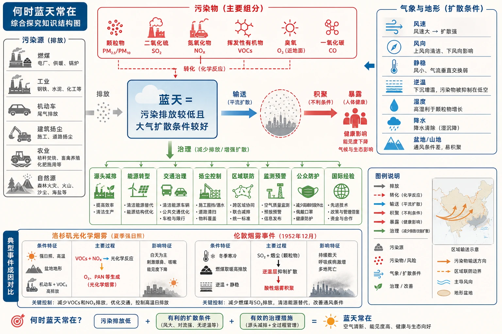
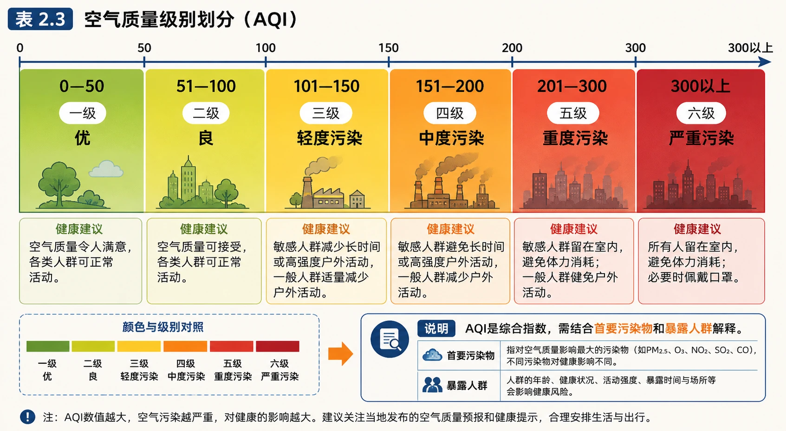
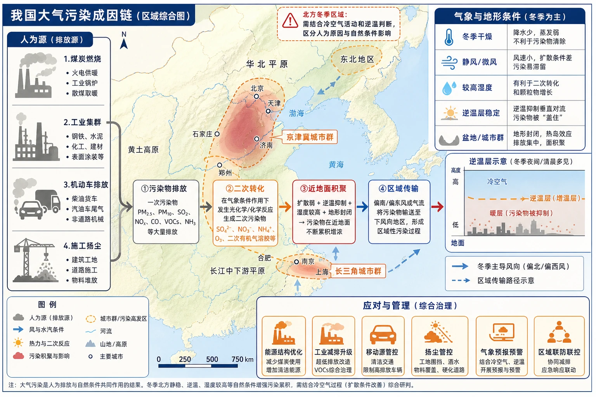
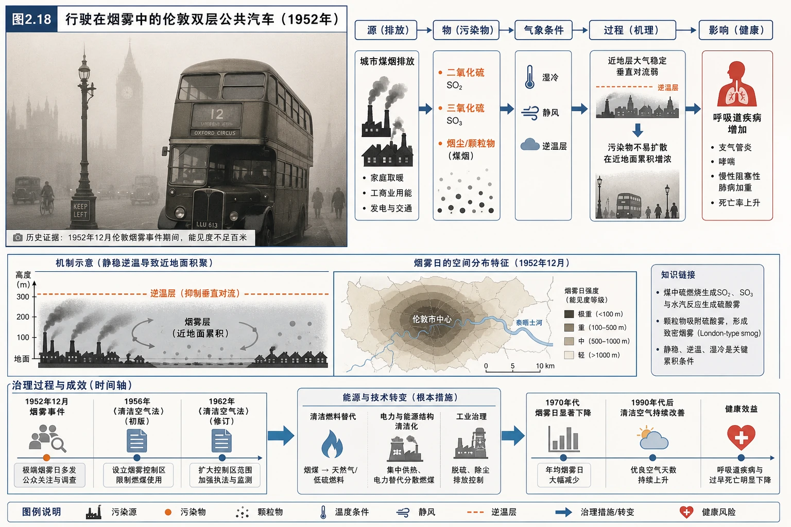

# 章末问题研究 何时“蓝天”常在

<!-- 图片描述：制作“何时蓝天常在”综合探究知识结构图。中心为“蓝天=污染排放较低且大气扩散条件较好”，左侧是污染源分支：燃煤、工业、机动车、建筑扬尘、农业和自然源；上方是污染物分支：颗粒物、二氧化硫、氮氧化物、挥发性有机物、臭氧、一氧化碳；右侧是气象与地形分支：风速、风向、静稳、逆温、湿度、降水、盆地/山地；下方是治理分支：源头减排、能源转型、交通治理、扬尘控制、区域联防、监测预警、公众防护和国际经验。用红色表示污染物和风险，蓝色表示风和大气扩散，灰色表示排放源，绿色表示治理与生态改善，箭头分别表示“排放—转化—输送—积聚—暴露—治理”。图中突出洛杉矶光化学烟雾与伦敦烟雾事件的成因对比，帮助形成综合分析框架。 -->

## 知识关系导航

本探究把本章知识集中到一个真实问题：大气成分变化是污染的基础，气象条件决定污染物扩散和积聚，治理则需要从污染源、传播过程和受体保护三端同时发力。

- 所属章节：[[章首 学习导图|第二章地球上的大气总览]]
- 组成基础：[[第一节 大气的组成和垂直分层#3. 大气污染的概念边界|大气污染的概念与污染物]]
- 机制基础：[[第二节 大气受热过程和大气运动#2. 大气运动是热量和水汽的输送通道|大气运动与污染物输送]]
- 环流应用：[[第二节 大气受热过程和大气运动#3. 城市热岛环流：下垫面和人为热共同作用|城市热岛环流]]

## 本节学习目标

- 能给大气污染下出包含污染物、浓度和危害的完整定义。
- 能利用空气质量指数表判断空气质量级别，并提出污染天气个人防护建议。
- 能从污染源、污染物、气象条件、地形、人口和治理尺度分析我国大气污染。
- 能比较洛杉矶光化学烟雾与伦敦烟雾事件的人为原因、污染物、形成条件和治理路径。
- 能用“源头减排—过程控制—末端治理—监测评价—公众参与”设计蓝天保卫方案。
- 能评价一项治理措施是否真正对应污染成因，避免只写口号式对策。

## 核心知识点讲解

### 一、区域定位与地理情境

#### 1. “蓝天”不是只看天空颜色

蓝天常在需要满足至少两个条件：

1. 污染物排放和二次生成量较低，污染源控制有效。
2. 大气扩散、稀释、沉降和清除条件较好，污染物不在近地面持续积聚。

因此，某地偶尔刮大风后天空变蓝，不等于污染源已经消失；也不能把雾霾完全归因于“天气不好”。稳定的蓝天需要排放源头控制、能源和交通转型、扬尘治理、区域协同及长期监测共同支持。

#### 2. 污染问题具有区域性和时间性

污染物可以随风跨越城市和行政边界，污染过程常由多个城市共同排放和共同积聚形成；而污染浓度又会随季节、昼夜、风向、风速、湿度、逆温和降水变化。因此分析污染材料时要先定位：

- 发生在哪个区域：盆地、平原、沿海、城市群还是工业走廊？
- 发生在什么时候：冬季采暖、夏季晴热、早晚交通高峰还是静稳天气？
- 污染物是什么：颗粒物、二氧化硫、氮氧化物、臭氧或复合污染？
- 空气运动怎样：风从哪里来、污染源在上风向还是下风向？

### 二、核心概念与地理要素

#### 1. 大气污染的定义、特点和危害

大气污染是自然或人为原因使大气中某些成分超过正常含量，或有毒有害物质进入大气，对人体健康、生态系统等造成危害的现象。

污染具有以下特点：

- **来源多样**：既有燃煤、工业、机动车、建筑扬尘等人为源，也有沙尘、火山、森林火灾等自然源。
- **成分复杂**：既包括直接排出的污染物，也包括在大气中发生化学反应后形成的二次污染物。
- **扩散与积聚并存**：污染物会随风输送、稀释和沉降，也可能在弱风、静稳、逆温和高湿条件下积聚。
- **影响具有区域性和持续性**：污染物可跨区域传输，长期暴露的危害可能比一次短时污染更值得关注。
- **危害具有多系统性**：影响呼吸和心血管健康，降低能见度，危害植被、土壤和水体，并可能影响气候和城市生活。

#### 2. 主要污染物与形成机制

| 污染物 | 主要来源或形成 | 典型影响 | 分析提醒 |
|---|---|---|---|
| 细颗粒物、可吸入颗粒物 | 燃煤、工业、机动车、扬尘和二次转化 | 进入呼吸系统、降低能见度 | 既看排放量，也看静稳、湿度和区域输送 |
| 二氧化硫 | 含硫燃料燃烧、冶炼 | 呼吸道刺激、酸沉降、雾霾 | 煤炭质量和脱硫设施是治理切入点 |
| 氮氧化物 | 机动车、燃煤和高温燃烧 | 呼吸危害、酸沉降、臭氧和二次颗粒物前体物 | 常与挥发性有机物共同参与光化学反应 |
| 一氧化碳 | 不完全燃烧、机动车 | 降低血液携氧能力 | 关注燃烧效率和密闭空间暴露 |
| 挥发性有机物 | 燃料挥发、工业溶剂、机动车和生活源 | 参与光化学烟雾 | 要结合晴热、强太阳辐射和氮氧化物分析 |
| 近地面臭氧 | 氮氧化物和挥发性有机物光化学反应 | 刺激呼吸道、损害植被 | 不是平流层臭氧，常在晴热少风天气升高 |

#### 3. 空气质量指数（AQI）

教材表2.3将空气质量指数分为六级：

| AQI | 级别 | 状况 | 学习与防护提示 |
|---:|---|---|---|
| 0—50 | 一级 | 优 | 正常活动，适宜户外活动 |
| 51—100 | 二级 | 良 | 一般人群可正常活动，敏感人群关注变化 |
| 101—150 | 三级 | 轻度污染 | 敏感人群减少长时间、高强度户外活动 |
| 151—200 | 四级 | 中度污染 | 敏感人群减少户外活动，一般人群适当减少 |
| 201—300 | 五级 | 重度污染 | 尽量减少户外活动，加强个人防护 |
| 300以上 | 六级 | 严重污染 | 避免户外活动，做好重点人群和公共健康防护 |

AQI是综合评价指标，通常由多种污染物分指数中的最大值决定，不能把AQI简单理解成“空气中某一种污染物的浓度”。如果题目给出首要污染物，应结合首要污染物分析；如果只给AQI，则至少判断级别、污染程度和防护等级。

<!-- 图片描述：对应源文表2.3“空气质量级别划分”。制作从绿色到深红色的横向分级信息图，六个区间依次标出AQI 0—50、51—100、101—150、151—200、201—300、300以上，并分别对应一级优、二级良、三级轻度污染、四级中度污染、五级重度污染、六级严重污染；每级下方附简短健康建议。图旁增加说明“AQI是综合指数，需结合首要污染物和暴露人群解释”，避免只背颜色不理解指标含义。使用绿色—黄色—橙色—红色渐变，黑灰文字和清晰刻度。 -->

### 三、过程机制与成因链条

#### 1. 污染形成的五环节模型

分析一场污染过程，可以用：

> **排放** → **转化** → **输送** → **积聚/清除** → **暴露与影响**

- 排放：能源、工业、交通、施工、农业和自然源把污染物送入大气。
- 转化：污染物在阳光、水汽和氧化剂作用下发生化学反应，形成臭氧或二次颗粒物。
- 输送：风把污染物水平搬运，垂直对流和湍流使污染物扩散到不同高度。
- 积聚/清除：弱风、静稳、逆温和高湿有利于积聚；强风、对流、降水和沉降有利于清除或稀释。
- 暴露与影响：污染物在近地面聚集，人体吸入或生态系统承受压力，能见度下降。

#### 2. 气象条件如何影响污染

**风速和风向**：风速较大、湍流较强时，污染物通常更容易扩散，但也可能被输送到下风向地区；风向决定污染源与受体之间是否存在输送关系。

**静风和弱风**：水平方向扩散能力弱，污染物在源区附近积聚。城市高楼和盆地地形还可能进一步削弱近地面通风。

**稳定层结和逆温**：正常情况下对流层下部较暖、上部较冷，空气容易有一定对流；逆温时上部空气更暖、下部更冷，空气垂直运动受抑制，污染物被“压”在近地面。逆温可以由夜间地面辐射降温、下沉气流或锋面等形成。

**湿度和降水**：高湿度可使颗粒物吸湿增长，并促进部分二次反应；降水通过雨滴冲刷和沉降清除污染物，但降雨前后污染变化还要结合风和排放判断。

#### 3. 我国近些年大气污染较严重的原因分类

教材资料可分成“人为源”和“自然/气象条件”两类：

**人为原因**：能源消费以煤炭为主；废气排放量大的工业企业数量多、规模大、分布广；机动车拥有量增长导致尾气排放增加；城镇化快速发展带来施工扬尘。

**自然和气象条件**：北方冬季干燥，地表容易起尘；秋至春冷空气活动减弱，静风或微风增多；空气湿度较高，污染物易积聚和发生二次转化；地形封闭或通风条件弱也会放大污染过程。

分析“全球变暖导致污染加重”时要谨慎：教材把冷空气活动变化与污染气象条件联系起来，但具体污染过程仍需气象观测、排放数据和大气化学模型验证，不能把一次污染事件完全归因于全球变暖。

<!-- 图片描述：制作“我国大气污染成因链”区域综合图。底图为中国东部和北方示意，左侧标出煤炭燃烧、工业集群、机动车和施工扬尘等人为源，右侧叠加冬季干燥、静风/微风、较高湿度、盆地或城市群等气象地形条件；中心用箭头连接“污染物排放→二次转化→近地面积聚→区域传输→健康与生态影响”。图例用灰色表示源，蓝色表示风和水汽，橙色表示热力与二次反应，红色表示污染积聚；在北方冬季区域设置“需结合冷空气活动和逆温判断”的提示，帮助区分人为原因与自然条件。 -->

#### 4. 洛杉矶与伦敦案例的成因对比

**洛杉矶光化学烟雾**：汽车尾气排放大量碳氢化合物等前体物，在强太阳紫外线照射下发生光化学反应，形成浅蓝色烟雾，造成眼睛红肿、头疼和呼吸道损伤。其关键条件是机动车排放、强日照、较高温度和不利扩散条件。

**伦敦烟雾事件**：燃烧烟煤排放二氧化硫、三氧化硫和烟尘，叠加冬季静稳、湿冷和不利扩散条件，导致烟雾和呼吸道疾病增加。其关键特征是燃煤直接排放的烟尘和硫氧化物。

| 比较角度 | 洛杉矶光化学烟雾 | 伦敦烟雾事件 |
|---|---|---|
| 主要能源/排放源 | 机动车尾气，城市交通源突出 | 烟煤燃烧，家庭、工业和供暖源突出 |
| 主要污染物/前体物 | 碳氢化合物、氮氧化物及光化学生成物 | 二氧化硫、三氧化硫和烟尘 |
| 主要气象条件 | 强太阳辐射、晴热、污染物积聚 | 冬季湿冷、静稳、烟尘不易扩散 |
| 典型污染类型 | 二次污染、光化学烟雾 | 燃煤烟雾和硫氧化物污染 |
| 治理重点 | 机动车排放标准、燃料和工业技术、公共交通、光化学前体物协同控制 | 清洁能源替代、燃煤限制、烟气治理、供暖和工业结构调整 |

洛杉矶治理时间较长，一方面污染成分涉及大气化学和多种前体物，控制难度大；另一方面机动车数量、城市空间、生活方式和区域输送使排放源分散，治理需要长期技术、法规和交通结构调整。伦敦治理相对集中于煤炭燃烧和烟尘硫氧化物，源头替代更明确。以上是基于教材案例的合理推断，不表示两地治理只受单一人为因素决定。

### 四、空间分布、图表判读与证据

#### 1. 空气质量指数表

读AQI表先找数值所在区间，再确定空气质量级别和状况，最后结合人群给出防护。例如AQI为180，落在151—200，属于四级、中度污染；不能误判成五级重度污染。

#### 2. 污染分布图

按“源—风—地形—受体”判读：

1. 找工业区、交通干线、施工区、燃煤设施和城市群等污染源。
2. 看风向，判断污染物可能从上风向输送到下风向。
3. 看山地、盆地、海陆位置和通风廊道，判断扩散条件。
4. 看人口密度和生态敏感区，分析受影响对象。
5. 区分排放地、积聚地和受影响地，三者不一定相同。

#### 3. 污染时间序列

如果污染物在早晚出现双峰，可能与交通高峰、边界层日变化和静稳条件有关；如果近地面臭氧在午后升高，可能与日照和光化学反应有关；如果冬季颗粒物频繁升高，应结合采暖排放、干燥扬尘、逆温、湿度和冷空气活动综合分析。不能只凭“有规律”就确定唯一原因。

<!-- 图片描述：对应源文图2.18“行驶在烟雾中的伦敦双层公共汽车（1952年）”。画面为伦敦街道、双层公共汽车和低能见度烟雾，旁侧用标注框列出“烟煤燃烧→二氧化硫/三氧化硫/烟尘→静稳湿冷→近地面积聚→呼吸道疾病增加”；再以时间轴连接后续治理法令、清洁燃料和烟雾日下降。图中保留历史照片的证据感，采用灰褐色烟雾、黑色污染源、蓝色治理箭头和红色健康风险标识，帮助学生把案例材料转译成“源—物—气象—影响—治理”的地理因果链。 -->

### 五、人地关系、影响与对策

#### 1. 蓝天保卫的多层治理框架

| 治理层次 | 主要措施 | 对应问题 |
|---|---|---|
| 源头减排 | 能源结构优化、清洁能源、节能降耗、产业准入 | 煤炭燃烧、工业排放、能源效率低 |
| 过程控制 | 烟气脱硫脱硝除尘、挥发性有机物密闭收集、施工抑尘、车辆排放控制 | 生产和运输环节的直接排放 |
| 结构调整 | 清洁供暖、公共交通、车辆电动化或低排放化、工业布局优化 | 城市交通和产业结构造成的长期排放 |
| 区域协同 | 城市群联防联控、重污染天气应急减排、跨区域监测 | 污染物跨行政区输送 |
| 监测预警 | 空气质量监测、卫星遥感、源解析、预报预警 | 找到污染来源、识别污染过程 |
| 生态与空间 | 增加绿地、通风廊道、合理布局高污染企业、恢复碳汇 | 热岛、扬尘、局地扩散和生态缓冲 |
| 公众与健康 | 污染天气减少户外运动、敏感人群防护、公众监督和信息公开 | 减少暴露，推动治理落实 |

#### 2. 评价治理措施的四个标准

一项措施是否有效，可问四个问题：

1. 是否对应主要污染源？例如治理煤烟不能只增加绿地，还要控制燃煤排放。
2. 是否考虑污染物形成机制？治理光化学烟雾需要协同控制氮氧化物和挥发性有机物，不能只控制颗粒物。
3. 是否考虑扩散和区域输送？城市内减排还要与周边城市联控。
4. 是否具有持续性和可监测性？要有排放标准、监测数据、执法机制、公众参与和效果评估。

#### 3. “何时蓝天常在”的观点表达

蓝天常在不是单一时间点，而是治理系统持续有效的状态：清洁能源和低排放产业减少污染源，交通和施工治理降低城市排放，气象预报和区域联防减少重污染过程，公众防护降低健康风险，长期监测和国际经验促进政策迭代。面对复杂污染问题，应承认治理需要时间，但也要用可测量的空气质量、排放量、重污染天数、首要污染物和健康指标检验成效。

### 六、综合题型与迁移应用

大气污染综合题可以用“六要素法”：

> **污染源**：谁排放？在哪里排放？排放多少？
> **污染物**：排出了什么？是一次污染还是二次生成？
> **气象**：风向、风速、稳定度、逆温、湿度、降水如何？
> **地形**：山地、盆地、海陆位置和城市形态是否影响通风？
> **受体**：人口、交通、生态系统和健康受到什么影响？
> **措施**：源头、过程、区域、监测和公众防护如何对应？

写答案时按照“事实证据—机制解释—影响判断—措施评价”展开，比按教材资料顺序机械复述更有迁移性。

## 重点梳理

### 1. 大气污染成因链

污染源排放 → 污染物进入大气 → 化学转化和区域输送 → 静稳/逆温/高湿导致积聚 → 人体和生态系统暴露 → 健康、能见度和生态影响。

### 2. 读污染材料的顺序

1. 定位：区域、季节、时间和地形。
2. 找源：燃煤、工业、交通、扬尘、农业和自然源。
3. 辨物：颗粒物、二氧化硫、氮氧化物、挥发性有机物、臭氧、一氧化碳。
4. 看气象：风、静稳、逆温、湿度、降水和边界层。
5. 判影响：健康、能见度、生态、交通和生产。
6. 配措施：对应源头、过程、区域和受体提出方案。

### 3. 两类烟雾的记忆对比

- 洛杉矶：汽车尾气 + 强日照 + 光化学反应 + 臭氧等二次污染。
- 伦敦：烟煤燃烧 + 冬季湿冷静稳 + 二氧化硫和烟尘 + 烟雾事件。

## 难点突破

### 难点一：污染物排放多，不等于当天污染一定重

污染浓度由排放和扩散共同决定。排放量相同的两天，如果一天大风、对流强、降水多，污染物可能较快扩散或清除；另一天静风、逆温、湿度高，污染物可能在近地面积聚。因此综合题要同时写人为排放和气象条件。

### 难点二：污染源、污染中心和受影响区可能不同

风会输送污染物，地形会改变风场，污染物还可能在途中二次转化。因此不要看到城市空气污染就直接断定“污染源就在城市中心”；应结合上风向产业、交通、区域排放和监测数据判断。

### 难点三：洛杉矶光化学烟雾不是“烟尘多”

光化学烟雾的关键是机动车排放的碳氢化合物、氮氧化物等前体物在强日照下发生反应，生成臭氧等二次污染物。它与伦敦烟雾的燃煤烟尘和硫氧化物污染在污染物和形成机制上不同。

### 难点四：植树造林不能替代污染源治理

绿地可滞尘、蒸散降温和改善局地环境，但对大规模工业、交通和燃煤排放，根本措施仍是源头减排、清洁能源和技术改造。治理建议要与污染源相匹配。

### 难点五：AQI不是“空气好坏的唯一原因解释”

AQI可以评价污染程度，但不能单独说明污染物来源、形成机制或治理方案。看到AQI后还要寻找首要污染物、气象、排放和人口暴露信息。

## 例题讲解

### 例题1：根据AQI判断防护等级

**题目**：某城市AQI为180。判断空气质量级别和状况，并提出两条健康防护建议。

**答案**：180位于151—200，属于四级、中度污染。敏感人群应减少户外活动，一般人群也应适当减少长时间、高强度户外运动；关注污染物变化和预警信息，必要时做好个人防护，室内通风应选择污染较轻时段。

### 例题2：分析北方冬季重污染

**题目**：某北方城市冬季多次出现重污染天气。材料显示当地燃煤供暖和工业排放较多，污染期间常为微风、湿度较高、冷空气活动弱。分析重污染形成原因。

**答案**：人为方面，燃煤供暖和工业生产排放颗粒物、二氧化硫、氮氧化物等污染物，排放量较大；自然气象方面，冷空气活动弱、微风或静风使污染物水平扩散能力弱，较高湿度有利于颗粒物吸湿增长和二次转化，近地面污染物容易积聚，最终形成重污染过程。若当地存在盆地或城市群，还可能加剧通风不畅和区域传输。

### 例题3：比较洛杉矶和伦敦的治理重点

**题目**：为什么洛杉矶和伦敦需要不同的治理重点？

**答案**：洛杉矶污染主要与机动车尾气中的碳氢化合物、氮氧化物在强日照下发生光化学反应有关，因此治理重点是控制机动车尾气和工业挥发性有机物、提高燃料和排放标准、发展公共交通并协同控制光化学前体物。伦敦烟雾主要由烟煤燃烧产生的二氧化硫、三氧化硫和烟尘造成，因此治理重点是限制燃煤、替代清洁能源、治理烟气和调整供暖、工业结构。两者都需要立法、技术创新、监测和公众参与，但污染源和形成机制不同，措施不能照搬。

### 例题4：评价“把工厂搬到郊区”

**题目**：某城市计划把高污染工厂全部搬到郊区，以改善市区空气质量。请评价这一措施。

**答案**：搬迁可能减少市区近距离排放和人口暴露，但不一定减少区域总排放；若郊区位于城市热岛环流近地面气流的上风向或扩散条件差的盆地，污染物仍可能被输送到城市或在郊区积聚。合理方案应同时进行产业升级、清洁能源替代、末端治理、排放监测和区域规划，并结合主导风向、地形、人口和生态敏感区选择位置。

## 易错点整理

- 只把雾霾归因于“空气湿度大”，不写排放源和扩散条件。
- 把污染物排放地直接等同于污染最重地，忽略风向和区域输送。
- 把近地面臭氧和臭氧层混为一谈，忽略形成高度和环境作用。
- 把洛杉矶光化学烟雾写成燃煤烟尘污染，把伦敦事件写成汽车尾气污染。
- 看到AQI 180误判为重度污染；应按表格区间判断为四级、中度污染。
- 治理措施只写“植树造林、加强宣传”，没有对应污染源和污染物。
- 把“有风”一律当成污染减轻；风可能把污染物输送到下风向区域。
- 把某一次污染天气直接归因于全球变暖，缺少排放和气象证据。
- 只写政府措施，漏掉企业减排、技术改造、监测和公众防护。

## 考点考证点整理

### 考点一：大气污染的特点和危害

- 出题思路：提供污染照片、AQI表、健康材料或城市污染过程，要求概括特点和影响。
- 关键条件：污染物是否超过正常含量、是否有毒有害、浓度和持续时间、影响范围和受体。
- 解答要点：从来源多样、成分复杂、受气象和地形影响、区域传输、健康与生态危害等方面分点作答。
- 易扣分点：只写“空气质量差”；没有说明污染物、传播条件和具体危害。

### 考点二：空气质量指数判读

- 出题思路：给出AQI数值或表格，要求判断级别、状况和防护。
- 关键条件：六个区间及对应优、良、轻度污染、中度污染、重度污染、严重污染。
- 解答要点：先定位数值区间，再写级别和状况，最后按敏感人群与一般人群提出适度防护。
- 易扣分点：区间边界判断错误；把AQI当作单一污染物浓度；防护建议与污染等级不匹配。

### 考点三：我国大气污染的因素分析

- 出题思路：结合煤炭、工业、机动车、扬尘、冬季气象和地形材料，要求分类并综合解释。
- 关键条件：人为排放、自然条件、气象扩散、区域传输和城市群背景。
- 解答要点：人为方面写能源、产业、交通、施工；自然/气象方面写干燥、静风、逆温、高湿、地形；最后说明污染物积聚和区域联防必要性。
- 易扣分点：把所有原因写成人为或全部写成自然；措施与原因不对应。

### 考点四：光化学烟雾与伦敦烟雾对比

- 出题思路：给出两个案例，要求比较污染源、污染物、气象条件、危害和治理。
- 关键条件：洛杉矶为机动车尾气和强日照光化学反应；伦敦为烟煤燃烧、硫氧化物和烟尘、冬季湿冷静稳。
- 解答要点：用表格或平行分点比较，不仅写“一个汽车、一个煤炭”，还要写污染物和形成机制；治理分别对应前体物控制与燃煤替代。
- 易扣分点：遗漏二次污染；混淆臭氧层臭氧和近地面臭氧；只写治理结果不写治理路径。

### 考点五：大气污染治理措施评价

- 出题思路：给出搬迁工厂、限行、植树、清洁能源或区域联防等方案，要求评价可行性。
- 关键条件：污染源类型、污染物、风向、地形、人口分布、治理尺度和监测机制。
- 解答要点：先肯定措施针对的具体问题，再指出局限或潜在转移，最后补充源头减排、过程控制、区域协同和效果评价。
- 易扣分点：措施空泛；只写单一工程，不写长期制度和监测；忽略污染跨区域转移。

## 练习题

### 一、教材问题研究题

1. **对应资料1分析第1题**：概括大气污染的特点和危害。
2. **对应资料1分析第2题**：讨论影响我国大气污染的主要因素。
3. **对应资料2分析第1题**：将教材列出的原因划分为人为原因和自然原因。
4. **对应资料2分析第2题**：除教材所列原因外，再提出可能导致我国大气污染较严重的因素。
5. **对应资料3分析第1题**：比较洛杉矶光化学烟雾和伦敦烟雾事件的人为原因。
6. **对应资料3分析第2题**：仅考虑人为原因，合理解释洛杉矶烟雾治理时间比伦敦更长的原因。
7. **对应“形成观点并讨论”**：收集并整理我国大气污染治理措施，结合我国污染原因和发达国家治理案例，对“何时蓝天常在”提出观点。

### 二、迁移训练

8. 某城市位于盆地，冬季燃煤供暖排放增加，污染日常伴随逆温、静风和高湿。按“源—物—气象—地形—影响—措施”写出完整分析。
9. 某沿海城市夏季午后臭氧升高，但颗粒物并不高。推测可能的污染物来源和气象条件，并说明为什么不能直接据此判断臭氧层被破坏。
10. 某工业园区位于城市主导风向上风侧。请从污染输送和城市规划角度评价其区位，并提出至少四项改进措施。
11. 某地AQI从40升至220，首要污染物由颗粒物变为臭氧。请说明两种情形的空气质量等级，并分析首要污染物变化可能反映的季节或天气差异。
12. 以“蓝天常在需要自然条件，更需要人为治理”为观点，写一段不少于150字的综合论证。

## 练习题答案

1. 大气污染来源多样，既有自然源也有人为源；污染物成分复杂，可有一次排放和二次生成；污染范围和强度受排放、气象、地形影响，污染物可区域输送并积聚。危害包括呼吸和心血管健康受损、能见度降低、植被和水土生态受影响、酸沉降和生产生活受干扰。
2. 人为因素包括以煤炭为主的能源结构、工业企业排放、机动车尾气、建筑扬尘和农业排放；自然/气象因素包括北方冬季干燥、降尘多、冷空气活动弱、微风静风、湿度较高和不利地形；污染物还可能在城市群之间传输，因此需要区域联防联控。
3. 人为原因：煤炭燃烧、工业企业多且排放大、机动车增加、建筑工地和扬尘。自然或气象原因：北方冬季干燥、降尘多；冷空气活动弱、微风静风、湿度较高。季风和全球变暖背景属于影响气象条件的自然过程或长期环境背景，具体因果需结合观测资料分析。
4. 还可能有农业氨排放和秸秆焚烧、挥发性有机物排放、港口船舶和机场排放、森林火灾和沙尘、城市建筑密度大导致通风不畅、区域产业转移和污染物跨区输送等。
5. 洛杉矶主要是机动车尾气排放碳氢化合物、氮氧化物等前体物，在强紫外线下发生光化学反应，形成光化学烟雾；伦敦主要是家庭和工业燃烧烟煤，排放二氧化硫、三氧化硫和烟尘，在冬季湿冷静稳条件下积聚。两者都有人为排放，但能源/排放源、污染物和二次反应机制不同。
6. 洛杉矶污染涉及机动车和工业等分散源，污染物包括光化学反应前体物和二次生成物，受交通结构、燃料标准、日照和区域输送影响，治理需要长期技术升级、法规和交通转型；伦敦烟雾主要集中在煤炭燃烧和烟尘硫氧化物，清洁能源替代和燃煤限制的治理路径相对集中，因此治理时间可能不同。该结论还需结合治理标准、执行力度、城市规模和经济条件评价。
7. 可从能源、产业、交通、扬尘、区域协同、监测预警、清洁技术和公众参与等方面整理。观点示例：蓝天常在需要持续减少污染源排放，并改善污染物扩散和清除条件；政府要完善排放标准和监测，企业进行清洁生产和技术改造，城市优化交通和供暖结构，城市群开展联防联控，公众减少污染天气暴露并参与监督。治理成效应以AQI、首要污染物、重污染天数、排放量和健康指标长期评价。
8. 源：燃煤供暖和工业排放；物：颗粒物、二氧化硫、氮氧化物等；气象：逆温、静风、湿度高使垂直和水平扩散弱、二次转化增强；地形：盆地通风不畅，污染物易在近地面积聚；影响：能见度下降、呼吸健康和生态系统受损。措施：清洁供暖和能源转型、工业脱硫脱硝除尘、减少扬尘、区域联防、污染预警和个人防护。
9. 可能来自机动车、燃油燃烧、工业和溶剂排放的氮氧化物与挥发性有机物；晴热、强日照和少风有利于光化学反应和污染物积聚。近地面臭氧是污染物，平流层臭氧位于高空并吸收紫外线，形成高度、来源、过程和作用不同，所以不能由地面臭氧升高推断臭氧层被破坏。
10. 位于主导风向上风侧，污染物可能随风输送到城市，增加人口暴露风险；还要考虑排放量、污染物类型、地形和区域扩散。改进措施包括调整园区位置或与城市保持足够缓冲距离、进行环评和风场模拟、提高排放标准与末端治理、建设在线监测和应急减排机制、优化交通运输和开展区域联防。
11. AQI 40属于一级、优；AQI 220属于五级、重度污染。首要污染物由颗粒物变为臭氧，可能反映由冬季燃煤和静稳湿冷的颗粒物污染，转为夏季晴热强日照、氮氧化物与挥发性有机物发生光化学反应的臭氧污染；还需结合温度、风速、湿度、日照和排放数据确认。
12. 蓝天常在需要自然条件，更需要人为治理。风和降水可以暂时稀释、输送或清除污染物，但不能消除持续排放；静风、逆温、高湿和不利地形又会使污染物积聚。因此，稳定改善空气质量必须从源头控制煤炭、工业、机动车和扬尘排放，推进清洁能源、清洁生产和公共交通，同时加强区域联防联控、监测预警和公众防护。洛杉矶和伦敦的经验说明，污染物和形成机制不同，治理方案也必须不同；只有把排放、气象、地形、健康和治理效果放在同一框架中，蓝天才可能从偶然天气转变为长期环境质量。
