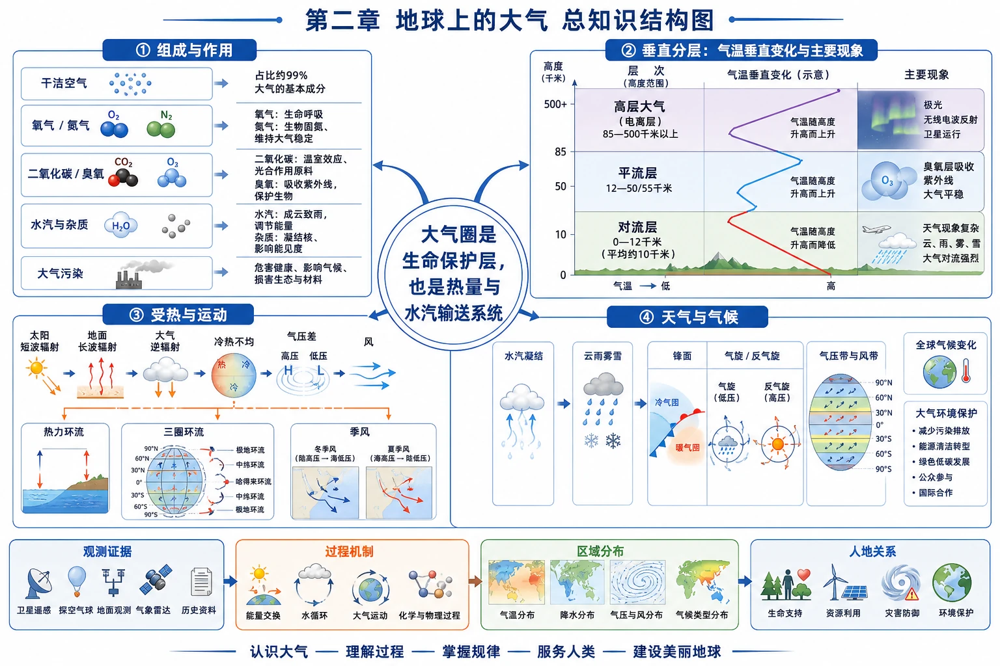

# 第二章 地球上的大气｜章首学习导图

<!-- 图片描述：绘制第二章“地球上的大气”总知识结构图。中心节点为“大气圈是生命保护层，也是热量与水汽输送系统”，向外分出四条主链：①组成与作用：干洁空气→氧气/氮气→二氧化碳/臭氧→水汽与杂质→大气污染；②垂直分层：对流层→平流层→高层大气，分别连接天气、水汽、臭氧层、航空、电离层和无线电通信；③受热过程：太阳短波辐射→地面吸收增温→地面长波辐射→大气吸收→大气逆辐射→保温；④运动与应用：地面冷热不均→气压差→热力环流/风→海陆风、城市热岛与污染扩散。底部增加“人地关系”分支，连接化石燃料、臭氧层保护、蓝天保卫和国际合作。用蓝色表示水汽与大气运动，橙色表示热量，绿色表示生命与生态，红色表示污染风险，黑灰表示分层边界、等压线和图表坐标；加入方向、箭头和图例，帮助理解自然过程与人类活动的耦合。该图为章首导图，不能替代各小节的详细讲解。 -->

## 知识关系导航

本章的核心不是背诵若干大气名词，而是追踪一条连续的地理因果链：

> 大气成分决定其辐射、生命和天气功能 → 太阳辐射与地面冷热差异提供能量差 → 气压差驱动大气环流和风 → 热量、水汽与污染物被输送、扩散或积聚 → 天气、气候和人类健康受到影响。

- [[第一节 大气的组成和垂直分层|第一节：大气由什么组成、垂直上怎样分层]]
- [[第二节 大气受热过程和大气运动|第二节：大气怎样受热、形成环流与风]]
- [[章末问题研究 何时“蓝天”常在|章末探究：怎样让蓝天常在]]
- 前置联系：[[第二节 太阳对地球的影响#核心知识点讲解|第一章太阳辐射与大气运动的能量来源]]

## 本章学习主线

### 1. 从“有什么”走向“有什么用”

低层大气由干洁空气、水汽和杂质组成。氮气、氧气的体积分数最大，但二氧化碳、臭氧、水汽和杂质虽然含量少，却分别参与光合作用、保温、紫外线防护、成云致雨和天气变化。地理学习中要避免“含量越多，作用越大”的误区。

### 2. 从“垂直分层”走向“人类利用”

按照温度、运动状况和密度，自下而上可分为对流层、平流层和高层大气。不同层的热力状况和运动状态不同：对流层天气最活跃，平流层适合航空，高层大气中的电离层与无线电通信有关。分层不是简单的高度记忆，而是“温度结构—运动方式—地理现象—人类活动”的对应关系。

### 3. 从“受热”走向“运动”

太阳短波辐射较容易穿过大气并加热地面；地面长波辐射被水汽、二氧化碳等吸收，近地面大气主要由地面获得热量，大气逆辐射又对地面起保温作用。地面受热不均使空气上升、下沉，造成气压差，进而产生热力环流和风。

### 4. 从“自然机制”走向“人地协调”

大气污染的形成既涉及污染源和污染物，也涉及风、稳定度、湿度、地形等自然条件；臭氧层保护、温室气体控制和蓝天保卫都说明大气环境问题具有跨区域、跨国界特征，需要监测、治理、技术创新、公众参与和国际合作共同推进。

## 本章重点关系表

| 关系 | 方向性理解 | 常见应用 |
|---|---|---|
| [[第一节 大气的组成和垂直分层#1. 大气的基本组成|成分—功能]] | 氧气支持生命，二氧化碳参与光合作用并增强保温，臭氧吸收紫外线，水汽和杂质参与天气过程 | 解释生命环境、大气污染、温室效应、臭氧层保护 |
| [[第一节 大气的组成和垂直分层#3. 大气垂直分层的判据|高度—气温—运动]] | 对流层下热上冷、空气对流；平流层下冷上热、以平流为主；高层大气稀薄且电离 | 解释天气分布、航空飞行、无线电通信、流星燃烧 |
| [[第二节 大气受热过程和大气运动#1. 三类辐射与两个热源概念|太阳辐射—地面—大气]] | 太阳短波主要加热地面，地面长波主要加热近地面大气，大气逆辐射补偿地面散热 | 解释昼夜温差、温室效应、云层保温 |
| [[第二节 大气受热过程和大气运动#3. 热力环流|冷热差异—气压—风]] | 热空气膨胀上升形成近地面低压，冷空气下沉形成近地面高压；风从高压流向低压并受偏向、摩擦影响 | 解释海陆风、城市热岛环流、等压线判风 |
| [[章末问题研究 何时“蓝天”常在#1. 污染形成的五环节模型|污染源—气象—地形]] | 排放决定污染物来源，风和湍流影响扩散，静稳和逆温有利于积聚，地形可能阻碍扩散 | 分析雾霾、光化学烟雾、治理措施 |

## 复习路径

1. 先读 [[第一节 大气的组成和垂直分层|第一节]]，建立“大气成分—层次—作用”的底图。
2. 再读 [[第二节 大气受热过程和大气运动|第二节]]，掌握“辐射—气温—气压—风”的过程机制。
3. 最后完成 [[章末问题研究 何时“蓝天”常在|章末问题研究]]，把自然机制迁移到污染成因、图表判读和治理评价。
