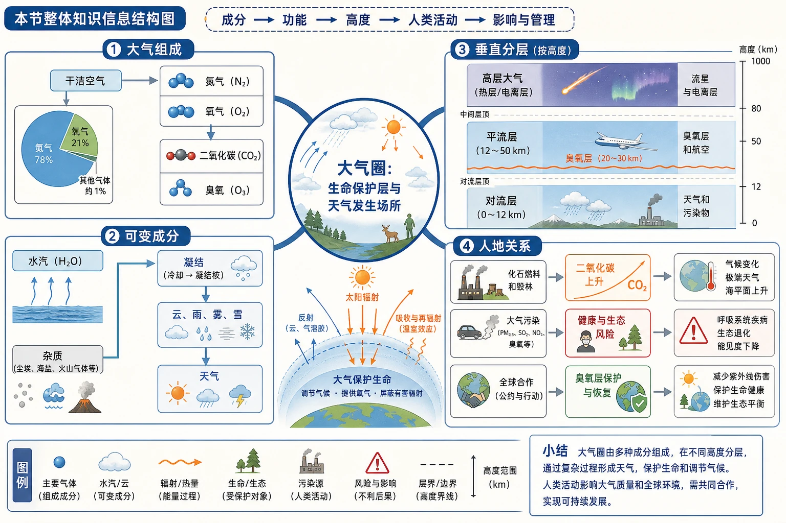
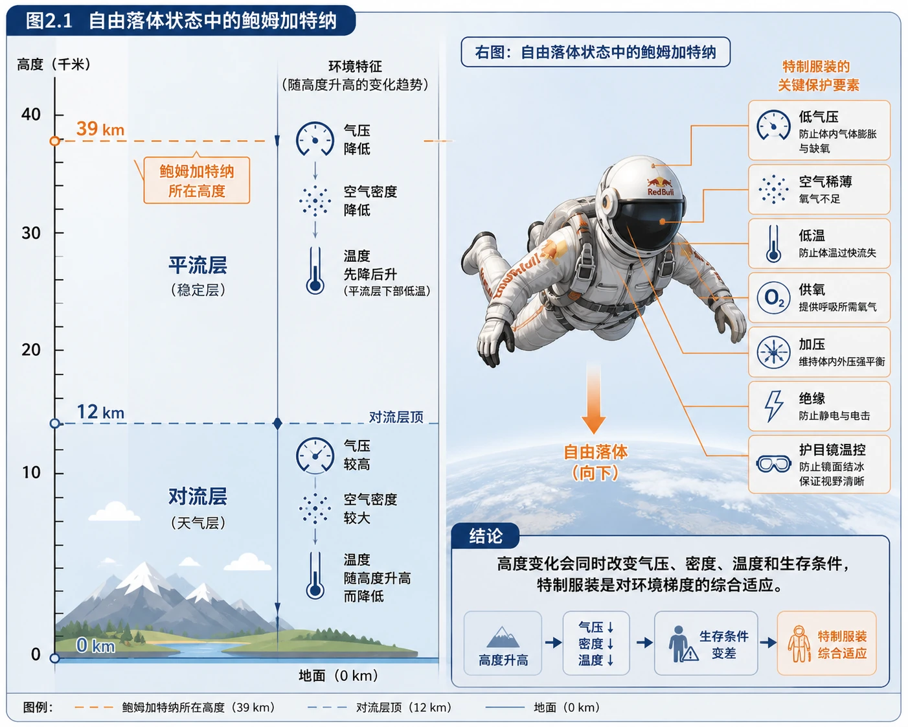
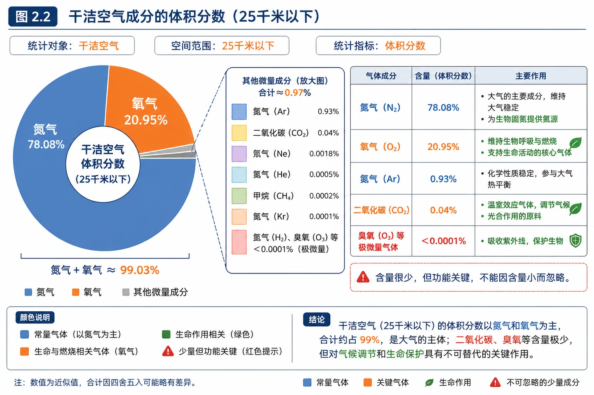
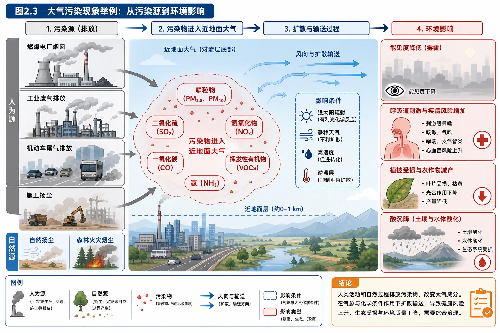
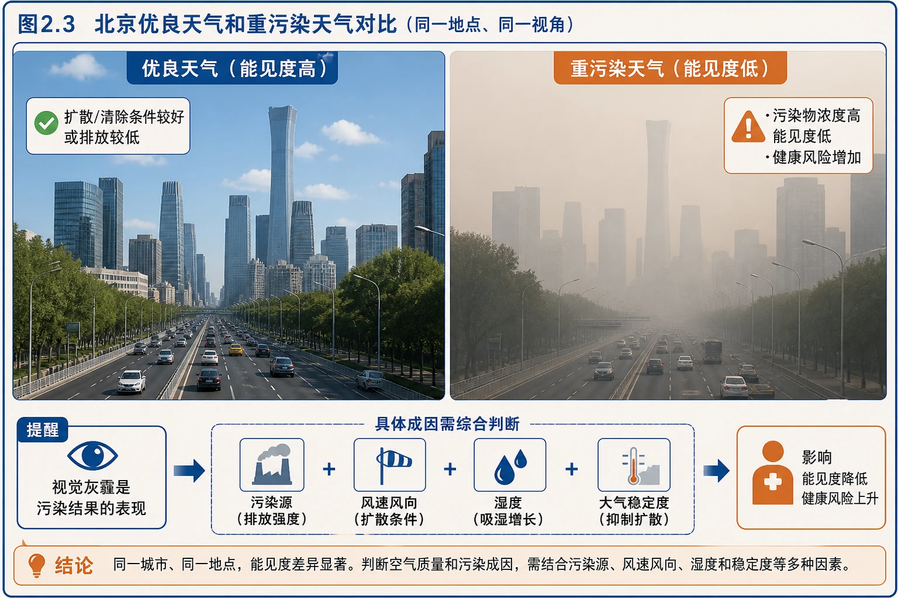
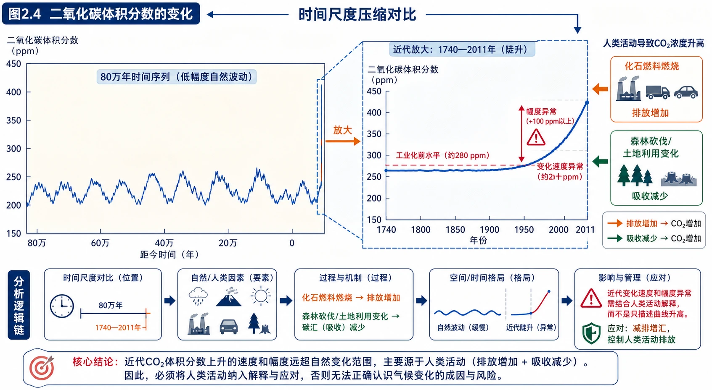
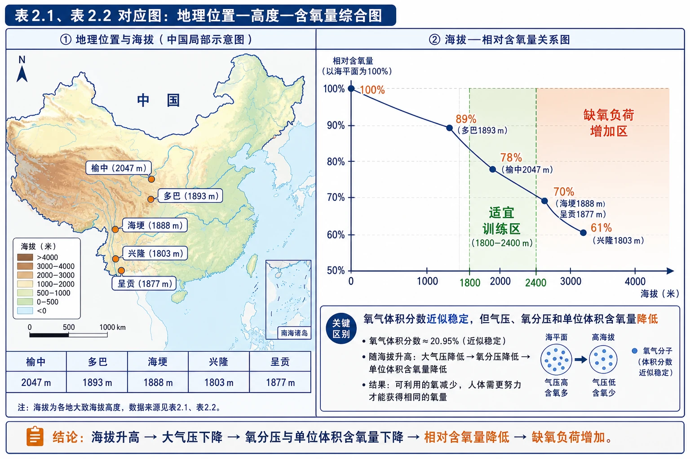
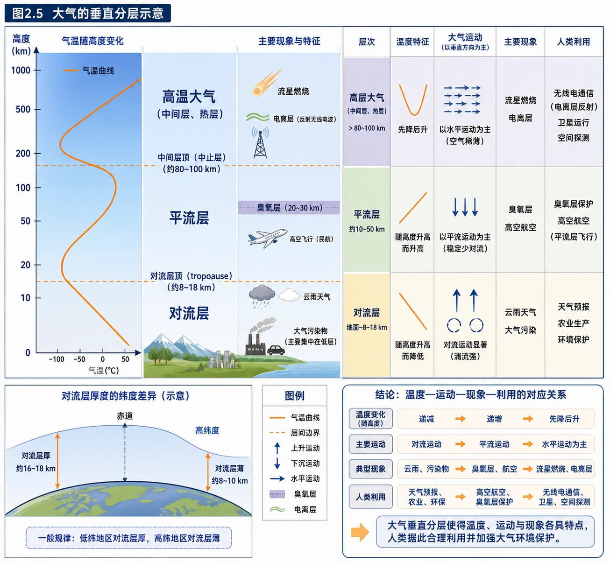
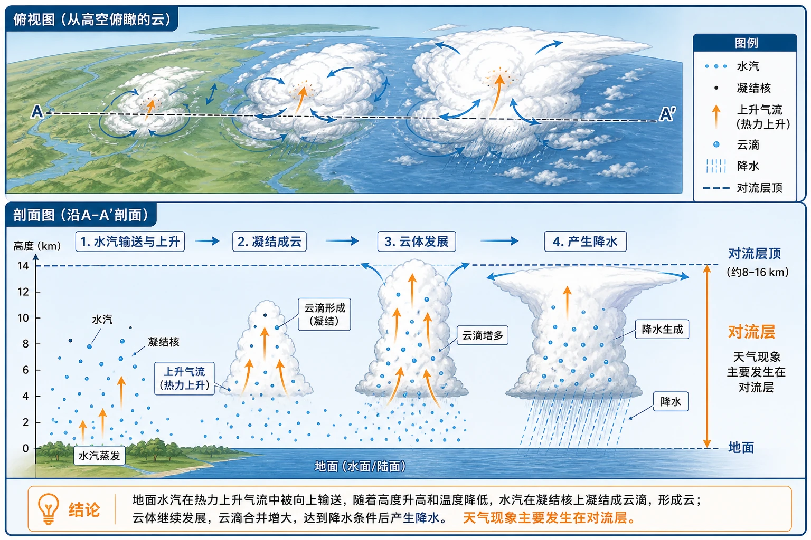
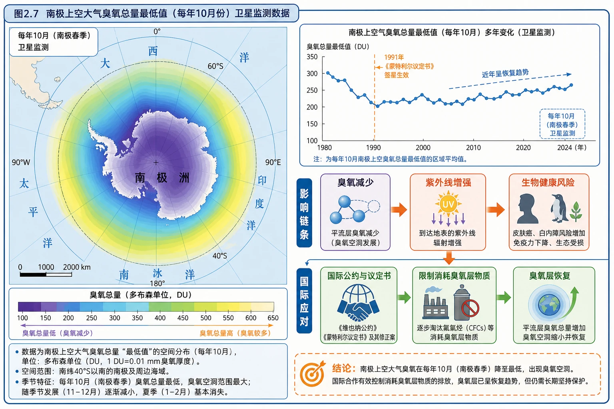

# 第一节 大气的组成和垂直分层

<!-- 图片描述：制作“本节整体知识信息结构图”，中心为“大气圈：生命保护层与天气发生场所”，向左上分出“大气组成”分支：干洁空气→氮气、氧气→二氧化碳、臭氧；向左下分出“可变成分”分支：水汽、杂质→凝结、云雨雾雪→天气；向右上分出“垂直分层”分支：对流层→天气和污染物，平流层→臭氧层和航空，高层大气→流星与电离层；向右下分出“人地关系”分支：化石燃料和毁林→二氧化碳上升，大气污染→健康与生态风险，全球合作→臭氧层保护。使用蓝色表示大气与水汽，橙色表示辐射和热量，绿色表示生命，红色表示污染与风险，黑灰表示高度、边界和图表；添加箭头、分层高度范围和简洁图例，帮助学生建立“成分—功能—高度—人类活动”的主线。 -->

## 知识关系导航

本节把大气看成一个“有成分、有层次、有功能、会被人类改变”的地理系统。

- 所属章节：[[章首 学习导图|第二章地球上的大气总览]]
- 前置知识点：[[第二节 太阳对地球的影响#核心知识点讲解|太阳辐射是地球大气的主要外部能量来源]]
- 后续知识点：[[第二节 大气受热过程和大气运动#核心知识点讲解|大气受热、环流与风]]
- 应用专题：[[章末问题研究 何时“蓝天”常在|大气污染的成因与治理]]

## 本节学习目标

- 说清低层大气的基本组成，区分干洁空气、水汽、杂质和污染物，并解释少量成分的关键作用。
- 能用“排放增加—吸收减少”的双重路径解释工业化和毁林导致二氧化碳增加。
- 能把海拔、气压、空气密度、氧分压和人体反应联系起来，解释高原训练的高度选择。
- 能按温度变化、运动状态、成分和地理现象比较对流层、平流层和高层大气。
- 能解释臭氧层的保护作用、臭氧空洞的环境意义以及全球合作治理的必要性。
- 能判读大气组成图、时间变化曲线、垂直分层图和污染现象图，并按“读图—证据—结论”作答。

## 核心知识点讲解

### 一、区域定位与地理情境

#### 1. 39千米高空为什么需要特制宇航服

教材用鲍姆加特纳从约39千米高空跳下的情境引出本节。39千米已位于平流层，不是“地面大气的稀释版”，而是具有显著不同的环境：

- 空气密度和气压远低于地面，单位体积内氧分子数量少，人体吸入的氧分压降低，不能靠正常呼吸满足生命需要。
- 温度很低，人体散热和暴露风险增大。
- 缺少足够的气体压力，体液和组织不能在正常状态下工作。
- 自由落体、超音速和摩擦加热还会带来机械冲击、温度变化和姿态控制问题。

因此，宇航服必须同时提供**密封、加压、供氧、保温、通信和运动保护**。这说明研究大气不能只记“有哪些气体”，还要把成分、密度、温度和高度联系起来。

<!-- 图片描述：对应源文图2.1“自由落体状态中的鲍姆加特纳”。画面左侧给出39千米高度在地球大气分层中的位置，右侧为身穿密封宇航服的跳伞者；用标注框说明“低气压、空气稀薄、低温、供氧、加压、绝缘、护目镜温控”，用向下箭头表示自由落体，用高度刻度把地面、对流层顶和平流层位置标出。图的结论是：高度变化会同时改变气压、密度、温度和生存条件，特制服装是对环境梯度的综合适应。采用浅蓝色大气背景、橙色人体保护要素、黑灰高度线的地理过程信息图风格。 -->

### 二、核心概念与地理要素

#### 1. 大气的基本组成

低层大气中，除去水汽和杂质以后，由多种气体组成的混合气体称为**干洁空气**。25千米以下的干洁空气中，氮气和氧气合计约占总体积的99%，但“体积分数大”与“地理作用重要”不是一回事。

| 成分或类别 | 含量特点 | 主要作用 | 学习提醒 |
|---|---|---|---|
| 氮气 | 体积分数最大 | 是生物体合成蛋白质等含氮物质的基本元素来源之一 | 大气中的氮气不能直接被多数生物利用，需要固氮过程转化 |
| 氧气 | 体积分数第二 | 支持呼吸和燃烧，是生物维持生命活动的重要物质 | 海拔升高时氧气体积分数变化不大，但氧分压和单位体积含氧量降低 |
| 二氧化碳 | 含量少但作用大 | 是绿色植物光合作用原料；吸收地面长波辐射，参与大气保温 | 既是生命所需成分，也是人类活动影响气候的重要温室气体 |
| 臭氧 | 含量极少，主要集中在平流层 | 吸收紫外线，使平流层增温并保护生物 | 要区分平流层臭氧的保护作用与近地面臭氧污染的危害 |
| 水汽 | 含量随时间、地点变化 | 参与蒸发、凝结、降水等水循环过程；吸收长波辐射 | 是天气过程和大气保温的重要参与者 |
| 杂质 | 含量很少且空间差异明显 | 作为凝结核，促使水汽凝结，参与成云致雨 | 自然尘埃与人为污染物都可能成为杂质，但污染物具有健康和生态风险 |

<!-- 图片描述：对应源文图2.2“干洁空气成分的体积分数（25千米以下）”。绘制环形或饼图，突出氮气、氧气约占99%的整体比例，并把氩气、二氧化碳等少量组分用放大框展示；图旁设置“含量—作用”对照注释：氮气与氧气占比最大，二氧化碳和臭氧含量极少但功能关键。使用蓝灰色表示常量气体，橙色突出氧气，绿色突出生命作用，红色小标记提示少量成分不能因含量小而忽略。图中保留“25千米以下”“干洁空气”“体积分数”三个标签，训练读图时区分统计对象。 -->

#### 2. “含量少但作用大”是本节的核心思想

地理综合题经常给出某种气体含量很少，要求说明其重要性。作答时要按“成分—过程—结果”写完整：

- **二氧化碳**：绿色植物吸收二氧化碳进行光合作用，固定太阳能并合成有机物；同时二氧化碳能够吸收地面长波辐射，增强大气保温。浓度过低会限制植物生长，浓度持续快速升高又会加剧全球变暖风险。
- **臭氧**：臭氧吸收太阳紫外线，使平流层增温；减少到达地面的紫外线，降低生物受到紫外伤害的风险。因此，臭氧层被称为“地球生命的保护伞”。
- **水汽**：水从液态、固态、气态之间转化时伴随热量吸收或释放，直接影响气温；水汽凝结形成云、雾、雨、雪等天气现象。水汽在低层大气中的差异，是区域天气和湿润程度差异的重要原因。
- **杂质**：尘埃、盐粒等微粒可充当凝结核，使水汽更容易达到饱和并凝结。没有凝结核时，空气中的水汽不容易形成通常尺度的云滴和雨滴；但杂质过多也会构成污染。

#### 3. 大气污染的概念边界

大气污染是指自然或人为原因使大气中某些成分超过正常含量，或有毒有害物质进入大气，对人体健康、生态系统等造成危害的现象。判断一个现象是不是“大气污染”，不能只看天空是否灰：还要看污染物种类、浓度、持续时间、影响范围和危害。

污染形成通常包含四个环节：

1. **污染源排放**：工业废气、燃煤烟气、机动车尾气、建筑扬尘、农业氨排放和自然火山、沙尘等。
2. **污染物进入大气**：颗粒物、二氧化硫、氮氧化物、一氧化碳、挥发性有机物和臭氧等进入空气。
3. **气象条件调节**：风速大、湍流强有利于扩散；静风、弱风、逆温和高湿度有利于积聚或二次转化。
4. **暴露和危害**：污染物被人体吸入、沉降到土壤和水体，或参与化学反应，影响呼吸系统、生态系统和能见度。

要特别区分：平流层臭氧是保护层；近地面臭氧是在阳光照射下由氮氧化物和挥发性有机物等发生光化学反应形成的污染物，二者位置、形成机制和环境影响不同。

<!-- 图片描述：对应源文图2.3“大气污染现象举例”。绘制由污染源到环境影响的多场景信息图：左侧为燃煤电厂烟囱、工业废气、机动车尾气和施工扬尘，中心标出颗粒物、二氧化硫、氮氧化物等污染物进入近地面大气，右侧表现能见度降低、呼吸道刺激、植被受损和酸沉降等影响；用风向箭头表示输送，用红色表示污染物和风险，用灰色表示排放源，用蓝色表示大气空间。图例注明人为源与自然源，帮助理解“大气成分改变—污染物扩散—人类健康与生态影响”的完整链条。 -->

<!-- 图片描述：对应源文图2.3后的“北京优良天气和重污染天气对比”照片。左右对比同一城市道路和高层建筑在优良天气、重污染天气下的能见度差异，保留道路、车辆、建筑轮廓和天空颜色；在重污染面板标注“污染物浓度高、能见度低、健康风险增加”，在优良天气面板标注“扩散/清除条件较好或排放较低”。该图用于提醒学生：视觉灰霾是污染结果的表现，具体成因还需结合污染源、风速风向、湿度和稳定度判断。 -->

### 三、过程机制与成因链条

#### 1. 二氧化碳含量变化：排放增加与吸收减少的双重机制

教材图2.4反映出：过去80万年的大部分时期，二氧化碳体积分数变化相对平缓；1740—2011年不足300年间，体积分数增加了40%以上。这里需要从两个方向解释：

$$
\text{大气二氧化碳增加} = \text{人为排放增加} - \text{自然吸收能力变化}
$$

- 化石燃料燃烧把长期储存在煤炭、石油和天然气中的碳快速释放为二氧化碳。
- 水泥生产、土地利用变化等也会改变碳循环。
- 森林砍伐一方面释放原有有机碳，另一方面减少植被光合作用对二氧化碳的吸收。

进一步的影响链可写为：化石燃料燃烧/毁林 → 二氧化碳排放增加、吸收减少 → 大气温室效应增强 → 全球平均气温上升及气候系统变化。答题时不能把“二氧化碳增加”简单写成“氧气减少”，二者受影响的过程和证据不同。

<!-- 图片描述：对应源文图2.4“二氧化碳体积分数的变化”。绘制横轴覆盖80万年并在右端放大1740—2011年，纵轴为二氧化碳体积分数；长时间序列用低幅度波动表示，近代放大框用陡升曲线表示。曲线旁加入两条来源箭头：化石燃料燃烧→排放增加，森林砍伐/土地利用变化→吸收减少；顶部标注“时间尺度压缩对比”。图的核心结论是近代变化速度和幅度异常，应结合人类活动解释，而不是只描述曲线升高。使用蓝色曲线、橙色排放箭头、绿色森林吸收箭头和红色风险标记。 -->

#### 2. 海拔、气压、氧分压与高原训练

教材活动用埃塞俄比亚、肯尼亚运动员和我国高原训练基地说明：高原环境并不是“氧气比例变了”，而是随着海拔升高，空气柱变短、空气密度减小，氧气的**分压**和单位体积内的氧分子数量降低。

在相同温度下，空气压力近似随高度升高而降低；虽然干洁空气中氧气体积分数仍接近21%，但吸入肺部的氧分压降低，人体需要通过增加呼吸深度、心率和红细胞携氧能力等方式适应。适度缺氧训练可能刺激机体提高携氧和利用氧的能力；海拔过高则会造成训练强度下降、恢复困难，甚至危害健康。

表2.1给出的训练基地海拔为：榆中1996米、多巴2366米、海埂1888米、兴隆2118米、呈贡1906米，均落在教材所述平原运动员高原训练最佳高度1800—2400米附近。表2.2显示海拔0米、1000米、2000米、3000米、4000米的含氧量比分别约为100%、89%、78%、70%、61%，说明海拔升高并非越高越有利，而是存在“刺激有效—负荷可承受”的适宜区间。

<!-- 图片描述：对应源文表2.1和表2.2的地理位置—高度—含氧量综合图。左侧为中国示意地图，定位榆中、多巴、海埂、兴隆、呈贡并标出海拔；右侧为海拔0—4000米的折线图，纵轴为相对含氧量，标出100%、89%、78%、70%、61%，在1800—2400米处用绿色阴影标注适宜训练区，在更高海拔处用橙红色提示缺氧负荷增加。图中补充“氧气体积分数近似稳定，但气压、氧分压和单位体积含氧量降低”的注释，帮助学生区分体积分数与可利用氧量。 -->

#### 3. 大气垂直分层的判据

教材按**温度、运动状况和密度**把大气自下而上分为对流层、平流层和高层大气。三层之间不是硬壳式的绝对边界，而是根据主要特征划分的不同高度范围；对流层顶、平流层顶的高度还会因纬度和季节而变化。

**对流层：下热上冷，垂直对流活跃。**

- 是大气圈最底层，集中了大气质量约3/4、几乎全部水汽和杂质，污染物也多集中在这里。
- 气温一般随高度升高而降低，顶部可降至约$-60\ ^\circ\mathrm{C}$。
- 低纬度受热多、对流旺盛，对流层较厚，约17—18千米；高纬度受热少，对流较弱，约8—9千米。
- 水汽和杂质随上升气流输送，空气上升膨胀冷却，水汽凝结，云、雨、雾、雪等天气现象主要发生在这里。

**平流层：下冷上热，水平平流为主。**

- 从对流层顶延伸到约50—55千米。
- 下层气温变化小，约30千米以上因臭氧吸收紫外线而随高度迅速升高。
- 上部热、下部冷，垂直方向不易形成强对流，空气运动较平稳，适合航空飞行。
- 水汽和杂质很少，云雨少、能见度好；臭氧最大值约在22—27千米范围，形成臭氧层。

**高层大气：稀薄、电离和温度变化显著。**

- 平流层以上统称高层大气，空气密度很小。
- 平流层顶部以上先因臭氧影响减弱而降温，随后因吸收更短波长的太阳紫外线而升温，约300千米高空温度可达1000℃以上；这里的“温度高”不等于人体感受到的“很热”，因为空气极其稀薄，能够传递给人体的热量很少。
- 约80—120千米，多数流星体与大气摩擦、烧蚀发光，形成流星现象。
- 约80—500千米有电离层，气体受太阳紫外线和宇宙射线作用而高度电离，能反射或改变无线电波传播，对远距离无线电通信有重要作用。
- 约2000—3000千米处大气密度接近星际空间，部分高速气体质点散逸到宇宙空间，可视为大气上界附近。

<!-- 图片描述：对应源文图2.5“大气的垂直分层示意”。绘制带高度坐标的地球大气剖面图，从地面向上分为对流层、平流层、高层大气；左侧曲线表示气温随高度的升降：对流层递减、平流层递增、高层大气先降后升；右侧用图标标出云雨和污染物、臭氧层与航空、电离层与无线电、流星燃烧；底部用不同宽度示意低纬对流层厚、高纬对流层薄。必须有高度刻度、层间边界、图例和结论箭头，帮助把“温度—运动—现象—利用”对应起来。 -->

<!-- 图片描述：对应源文图2.6“从高空俯瞰的云”。绘制对流层云系的俯视与剖面结合图：地面水汽在上升气流中向上输送，随高度升高和温度降低而凝结，形成云，继续发展可产生降水；标注水汽、凝结核、上升气流、云滴、降水和对流层顶。用蓝色表示水汽与云，白色表示云体，橙色箭头表示热力上升，突出天气现象主要发生在对流层。 -->

#### 4. 臭氧空洞与全球合作

臭氧层破坏的地理逻辑可分为“发现—危害—治理—成效”四步：

1. 20世纪80年代初，观测发现南极上空每年春季臭氧含量大幅下降，形成“臭氧空洞”。它不是地面出现了一个洞，而是特定区域、特定季节臭氧总量显著偏低。
2. 臭氧减少后，到达地面的紫外线增强，皮肤癌、白内障和生态系统受损风险上升。
3. 国际社会通过1985年《保护臭氧层维也纳公约》和1987年《蒙特利尔议定书》，限制氯氟碳化物等消耗臭氧层物质的生产和使用。
4. 多国执行、技术替代、产业转型和持续监测使臭氧空洞出现缩小趋势，说明跨国大气环境问题可以通过全球合作改善。

臭氧层保护与全球变暖不能混为一谈：两者都涉及大气成分和长时间尺度环境变化，但主要物质、化学过程和治理措施并不完全相同；答题时应根据材料指出具体问题。

<!-- 图片描述：对应源文图2.7“南极上空大气臭氧总量最低值（每年10月份）卫星监测数据”。绘制南极极区地图，使用颜色梯度表示臭氧总量，中心南极上空用蓝紫色低值区表示臭氧空洞，外缘用绿色—黄色表示较高值；旁侧增加多年监测小曲线或时间轴，标注每年10月、南极春季、卫星监测；用箭头连接“臭氧减少→紫外线增强→生物健康风险”，再连接“国际公约与议定书→限制消耗臭氧层物质→臭氧层恢复”。图例必须说明颜色所代表的臭氧总量，突出空间范围与季节性，而不是把臭氧空洞理解为固定洞穴。 -->

### 四、空间分布、图表判读与证据

#### 1. 组成图：先看统计对象

判读图2.2时，先确认对象是“25千米以下的干洁空气”，不是包含水汽和杂质的全部低层大气；再看单位是体积分数，不是质量分数；最后用“主要成分—少量成分—作用差异”作结论。

#### 2. 曲线图：看时间尺度和变化速度

图2.4应同时描述长期和近代两个尺度：长期看波动相对平缓，近代看上升速度明显加快。地理图表题中“上升”只是现象描述，得分关键在于进一步结合能源消费、化石燃料燃烧、毁林和碳汇变化解释原因。

#### 3. 垂直剖面图：按“高度—温度—运动—现象”四步读

1. 看高度范围和分层边界。
2. 看每层气温随高度的变化方向。
3. 根据上冷下热或上热下冷，判断对流和平流的相对强弱。
4. 把云雨、臭氧、航空、电离、流星等现象放到对应层次。

#### 4. 表格题：先做范围判断，再解释机制

高原训练题要先核对每个基地海拔是否落在1800—2400米，再结合含氧量表判断更高海拔训练效果下降的原因。不能只写“海拔越高氧气越少”，还应写出空气密度降低、氧分压下降、人体缺氧和训练能力下降。

### 五、人地关系、影响与对策

- 保护大气成分：控制化石燃料燃烧和工业排放，发展清洁能源，提高能源利用效率，保护和恢复森林等碳汇。
- 保护臭氧层：减少和替代消耗臭氧层物质，开展卫星和地面监测，落实国际协议。
- 减少污染暴露：污染天气减少户外剧烈运动，关注空气质量指数，必要时采取口罩、通风时段选择等个人防护。
- 认识治理尺度：污染可以在城市或区域内治理，但大气成分变化、臭氧层和气候问题常跨越行政边界，需要区域联防联控和国际合作。

### 六、综合题型与迁移应用

分析“某地高原训练、臭氧变化或大气污染”材料时，可使用统一框架：

> **定位**：明确地点、纬度、高度、季节和大气层次；
> **识别**：找出成分、温度、气压、污染物或图表变化；
> **机制**：写出成分作用、气体运动或辐射过程；
> **影响**：说明对人体、生态、交通、通信或生产的影响；
> **措施**：根据污染源、传播条件和治理尺度提出针对性对策。

## 重点梳理

### 1. 大气组成的“少量关键成分”

- 氮气：含量最大，是生物体含氮物质的重要来源。
- 氧气：支持生命活动和燃烧。
- 二氧化碳：光合作用原料，同时吸收地面长波辐射。
- 臭氧：平流层吸收紫外线，保护生物。
- 水汽：相变影响热量，参与云雨雾雪。
- 杂质：充当凝结核；过多或有害时造成污染。

### 2. 三层大气的快速比较

| 层次 | 主要温度特征 | 主要运动或成分 | 典型现象与利用 |
|---|---|---|---|
| 对流层 | 随高度升高而降低 | 对流活跃，水汽、杂质和污染物多 | 云雨雾雪、天气变化，人类生活所在 |
| 平流层 | 随高度升高而升高，尤其30千米以上 | 平流为主，臭氧层明显，水汽杂质少 | 紫外线吸收、航空飞行、鲍姆加特纳跳伞 |
| 高层大气 | 先降后升，温度可很高但密度很小 | 高度电离、空气稀薄 | 流星燃烧、电离层反射无线电、气体散逸 |

### 3. 图表判读提示

- 看到“体积分数”先确认空气样本范围。
- 看到“二氧化碳曲线”要同时写变化趋势、变化速度和人类活动来源。
- 看到“海拔—含氧量”要区分氧气比例、氧分压和单位体积含氧量。
- 看到“分层示意图”按温度变化判运动状态，再联系天气、臭氧、航空和通信。
- 看到“臭氧空洞”要写南极、春季、总量最低、紫外线危害和国际合作。

## 难点突破

### 难点一：氧气体积分数不变，为什么高原仍会缺氧

空气成分的比例与空气总量是两个概念。海拔升高时，空气总密度和气压降低，虽然氧气仍约占空气体积的21%，但同样体积空气中氧分子数量减少，进入肺泡的氧分压下降，所以人体实际获得的氧减少。

### 难点二：平流层气温升高，为什么不容易产生对流

对流需要下部热、上部冷，温暖空气能上升、冷空气能下沉。平流层因臭氧吸收紫外线使上部较暖、下部较冷，垂直方向相对稳定，故不易形成强对流，空气以水平方向的平流运动为主。

### 难点三：高层大气温度1000℃以上，为什么流星和卫星环境不能简单写成“很热”

温度反映气体分子平均运动状况，热量传递还与粒子数量有关。高层大气空气密度极小，单个粒子能量可能很高，但与人体或航天器碰撞的粒子很少，宏观传热能力与地面空气不同。因此作答要同时写“温度高”和“密度小”。

### 难点四：臭氧层保护与近地面臭氧污染的区分

平流层臭氧吸收紫外线，是保护生命的“伞”；近地面臭氧通常由氮氧化物和挥发性有机物在太阳辐射下发生光化学反应形成，会刺激呼吸道。因此同一个“臭氧”名词，必须先定位高度和形成过程，再判断环境意义。

## 例题讲解

### 例题1：根据大气分层解释鲍姆加特纳需要特制宇航服

**题目**：鲍姆加特纳从约39千米高空跳下。请说明39千米高空与地面相比的主要大气环境差异，并解释宇航服的作用。

**分析**：39千米位于平流层。按“层次定位—环境差异—人体风险—设备作用”作答。

**答案**：39千米处空气密度和气压远低于地面，氧分压低、氧气稀薄，且气温低；平流层水汽和杂质少，空气环境与地面差异很大。宇航服通过密封、加压和供氧维持人体正常呼吸与体压，通过保温和绝缘减轻低温、摩擦及高速运动风险，并用温控和通信设备提高生存与操控能力。

**反思**：不能只写“高空氧气少”，要把气压、密度、温度和设备功能对应起来。

### 例题2：高原训练基地的高度选择

**题目**：表2.1中榆中1996米、多巴2366米、海埂1888米、兴隆2118米、呈贡1906米。判断它们是否接近平原运动员高原训练的最佳高度，并说明海拔过高为什么不利于训练。

**分析**：先比较数值范围，再根据表2.2写因果链。

**答案**：五个基地均在1800—2400米范围内，接近教材所述最佳高度。海拔过高时，空气密度和气压进一步降低，氧分压和单位体积空气含氧量下降，人体吸氧和供氧负担增大，容易出现缺氧、疲劳、恢复时间延长和训练强度下降，因而可能达不到理想训练效果。

### 例题3：二氧化碳曲线的材料分析

**题目**：图2.4显示近代二氧化碳体积分数快速上升。请分析其主要人为原因及可能影响。

**答案**：化石燃料燃烧释放大量二氧化碳；毁林和土地利用变化减少森林对二氧化碳的吸收，形成排放增加与吸收减少的双重作用。二氧化碳增加会增强大气对地面长波辐射的吸收，可能导致全球变暖，并影响冰冻圈、水循环、海平面、生态系统和人类生产生活。

### 例题4：垂直分层图判读

**题目**：某层大气随高度升高气温升高，水汽和杂质很少，空气以水平运动为主，适合航空飞行。判断该层并说明原因。

**答案**：该层是平流层。平流层中臭氧吸收太阳紫外线，使上部增温，形成上热下冷的稳定结构，垂直对流弱、水平平流为主；同时水汽和杂质少、云雨少、能见度好，适合航空飞行。

## 易错点整理

- 把干洁空气误写成“全部大气”，忽略水汽和杂质。
- 认为含量越大的成分作用越重要，漏掉二氧化碳、臭氧、水汽的关键作用。
- 把“氧气体积分数约21%”写成“各海拔氧气含量相同”，忽略气压、密度和氧分压变化。
- 认为对流层越靠近地面越厚；实际上低纬度受热多、对流旺盛，对流层厚度更大。
- 把所有天气现象写到平流层；云雨雾雪主要发生在对流层。
- 把平流层气温随高度升高与对流层相混淆，或者只写现象不写臭氧吸收紫外线的原因。
- 把高层大气的高温等同于高热量，漏写空气密度很小。
- 把臭氧空洞写成“臭氧完全消失”，正确表述应为特定区域、特定季节臭氧总量显著降低。
- 把平流层臭氧和近地面臭氧污染混为一谈，忽略高度和形成机制。

## 考点考证点整理

### 考点一：大气组成及各成分作用

- 出题思路：给出组成图、污染照片或某种气体变化材料，要求说明气体作用。
- 关键条件：明确题目讨论的是干洁空气还是全部低层大气；注意“含量少但作用大”。
- 解答要点：写出氮气、氧气、二氧化碳、臭氧、水汽和杂质的功能；涉及天气时写水汽相变、杂质凝结核；涉及气候时写二氧化碳吸收地面长波辐射。
- 易扣分点：只写成分名称，不写过程和结果；把水汽、杂质当成固定不变成分；漏写污染危害。

### 考点二：二氧化碳变化与人类活动

- 出题思路：提供长时间曲线、能源消费或土地利用材料，要求解释近代升高和环境影响。
- 关键条件：看曲线变化速度和时间尺度，抓住化石燃料、毁林、碳汇等关键词。
- 解答要点：化石燃料燃烧使排放增加；毁林使吸收减少；二氧化碳增强长波辐射吸收，可能加剧全球变暖；措施包括节能减排、能源转型和保护森林。
- 易扣分点：只写“人类活动增多”；把二氧化碳增加直接等同于氧气下降；措施与原因不对应。

### 考点三：海拔与人体缺氧

- 出题思路：给出高原训练基地、海拔表和含氧量表，要求判断范围并解释高海拔不利影响。
- 关键条件：最佳高度1800—2400米；区分体积分数、空气密度、气压、氧分压和单位体积含氧量。
- 解答要点：先比较海拔是否在适宜范围，再写海拔升高→气压和密度降低→氧分压下降→人体吸氧负担增大→训练能力下降或健康风险增加。
- 易扣分点：只说“高原氧气比例降低”；漏写“适度缺氧有训练刺激、过度缺氧有健康风险”的适宜性判断。

### 考点四：大气垂直分层

- 出题思路：给出气温曲线、层次高度、天气或航空通信材料，要求判断所在层并说明特征。
- 关键条件：对流层下热上冷且天气多；平流层上热下冷且臭氧、航空；高层大气电离、流星、稀薄。
- 解答要点：按“温度变化—运动状况—成分—现象/利用”四步写，不要只写层名。
- 易扣分点：对流层和平流层温度变化方向写反；把电离层当作独立的四层；漏掉高层大气密度小。

### 考点五：臭氧层破坏与全球合作

- 出题思路：给出南极臭氧监测图、国际公约或环境治理案例，要求分析危害和措施。
- 关键条件：南极、春季、臭氧总量最低、紫外线增强、国际协议、替代消耗臭氧层物质。
- 解答要点：写臭氧减少→紫外线到达地面增多→人体和生态风险上升；治理须跨国合作、控制源头、技术替代和长期监测。
- 易扣分点：把臭氧层破坏和全球变暖完全等同；只写“加强宣传”，不写生产使用限制和国际合作。

## 练习题

### 一、教材情境与活动

1. **对应教材图2.1思考**：39千米高空的大气与地面大气有哪些不同？鲍姆加特纳为什么需要配备特制宇航服？
2. **对应教材活动第1题**：埃塞俄比亚、肯尼亚的中长跑运动员往往成绩优异。概括两国共同的地形特点，并推测其与运动员成绩的关系。
3. **对应教材活动第2题**：在中国地图上定位榆中、多巴、海埂、兴隆、呈贡五个高原训练基地，并判断它们所在区域的纬度和地形背景。
4. **对应教材活动第3题**：五个基地的海拔是否位于1800—2400米？结合表2.2说明更高海拔训练反而可能达不到理想成绩的原因。
5. **对应教材“思考”**：为什么平流层适合飞机飞行？无线电通信利用了哪层大气的特性？

### 二、基础与巩固

6. 用“成分—过程—结果”分别说明二氧化碳、臭氧、水汽和杂质的作用。
7. 某地海拔由1000米升至3000米。说明空气密度、气压、氧分压和人体吸氧负担的变化方向。
8. 比较对流层与平流层在气温变化、运动状态、水汽杂质、典型现象和人类利用方面的差异。
9. 某地近地面臭氧浓度在晴热、少风天气升高。解释其形成条件，并说明它与平流层臭氧的差异。

### 三、提升与综合

10. 图表材料显示某城市二氧化碳排放增加、森林面积减少，同时出现高温和极端降水事件。请从“排放—吸收—大气—环境”链条分析可能的联系，并指出不能由材料直接证明的部分。
11. 设计一个判断“大气污染严重程度”的分析框架，至少包括污染源、污染物、气象条件、地形条件、监测指标和健康影响。
12. 以“保护臭氧层为什么需要全球合作”为题，写出一段包含问题空间性、影响跨界性、治理措施和合作成效的地理解释。

## 练习题答案

1. 39千米处位于平流层，空气稀薄、气压低、氧分压低、气温低，环境条件明显不同于地面；宇航服需提供密封、加压、供氧、保温、绝缘和通信等保护。
2. 埃塞俄比亚和肯尼亚有大面积高原或高地，部分地区海拔较高。长期生活在适度低氧环境中，人体可能形成较强的携氧和耐力适应；但成绩还受训练体系、遗传、选材、营养和文化等因素影响，不能只归因于高原。
3. 榆中、 多巴、海埂、兴隆、呈贡分别位于甘肃、青海、云南、河北、云南，均为中国境内的高原或高地训练区域，具体定位需结合地图册确认。
4. 五个海拔值均在1800—2400米范围内。海拔越高，空气密度、气压和氧分压越低，人体缺氧负担越大，训练强度和恢复能力可能下降，因此存在适宜高度而非越高越好。
5. 平流层上热下冷、空气稳定，水汽和杂质少、云雨少、能见度好，适合航空飞行；无线电通信利用高层大气电离层对无线电波的反射或传播影响。
6. 二氧化碳—被植物吸收用于光合作用，同时吸收地面长波辐射—影响生物生产力和大气保温；臭氧—吸收紫外线并使平流层增温—保护生物；水汽—相变吸热放热并参与凝结降水—形成天气并调节温度；杂质—充当凝结核—促进云和降水形成，过多则可能造成污染。
7. 海拔升高后空气密度、气压、氧分压和单位体积含氧量均降低，人体吸氧负担增大；氧气体积分数不一定发生同幅度降低，不能把两者混为一谈。
8. 对流层下热上冷、对流活跃、水汽杂质和污染物多，天气现象集中；平流层上热下冷、平流为主、水汽杂质少、臭氧层明显，适合航空飞行。
9. 晴热天气太阳辐射强，少风使污染物不易扩散，氮氧化物与挥发性有机物在光照下发生光化学反应，可能形成近地面臭氧污染。平流层臭氧位于高空，主要作用是吸收紫外线、保护生命；近地面臭氧是污染物，危害呼吸系统。
10. 化石燃料等排放增加会使二氧化碳进入大气，森林减少又降低吸收能力，可能增强温室效应并影响气候系统；但仅凭材料不能直接证明某一次高温或降水事件完全由二氧化碳增加造成，还需要长期观测和多因素分析。
11. 先查污染源和排放量，再识别颗粒物、二氧化硫、氮氧化物、臭氧等污染物，结合风速风向、稳定度、逆温、湿度和地形判断扩散条件，使用空气质量指数和污染物浓度监测，最后评估能见度、人体健康和生态影响。
12. 臭氧层位于高空，臭氧消耗物质的生产、使用和传输跨越国界；臭氧减少会使紫外线增强并影响全球生物。治理需要限制消耗臭氧层物质、开展替代技术、持续监测和履行国际公约；《维也纳公约》和《蒙特利尔议定书》的广泛参与说明国际合作能够改善全球性大气环境问题。
