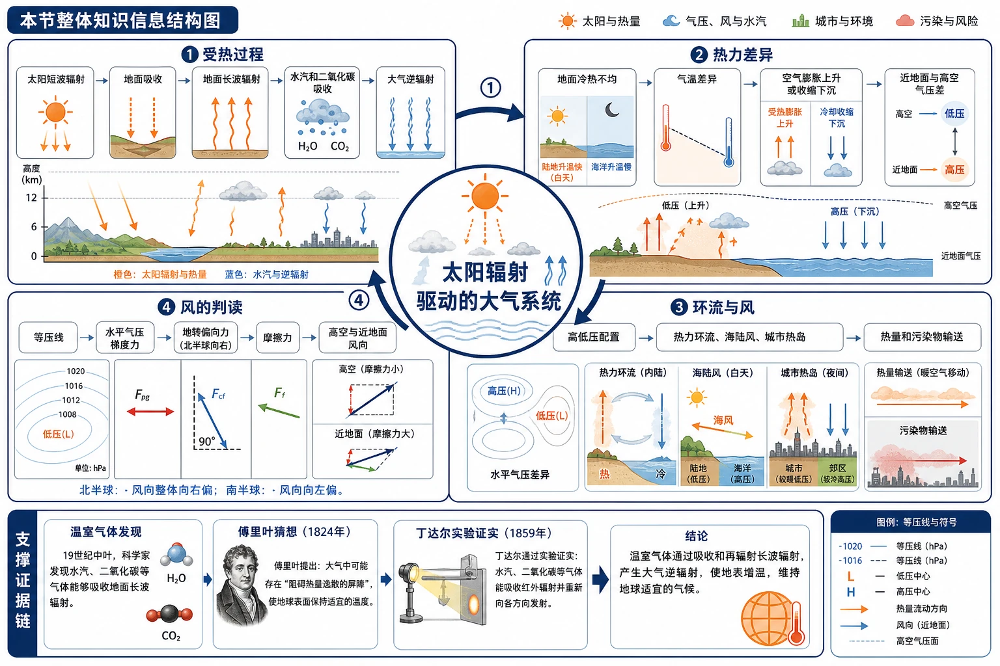
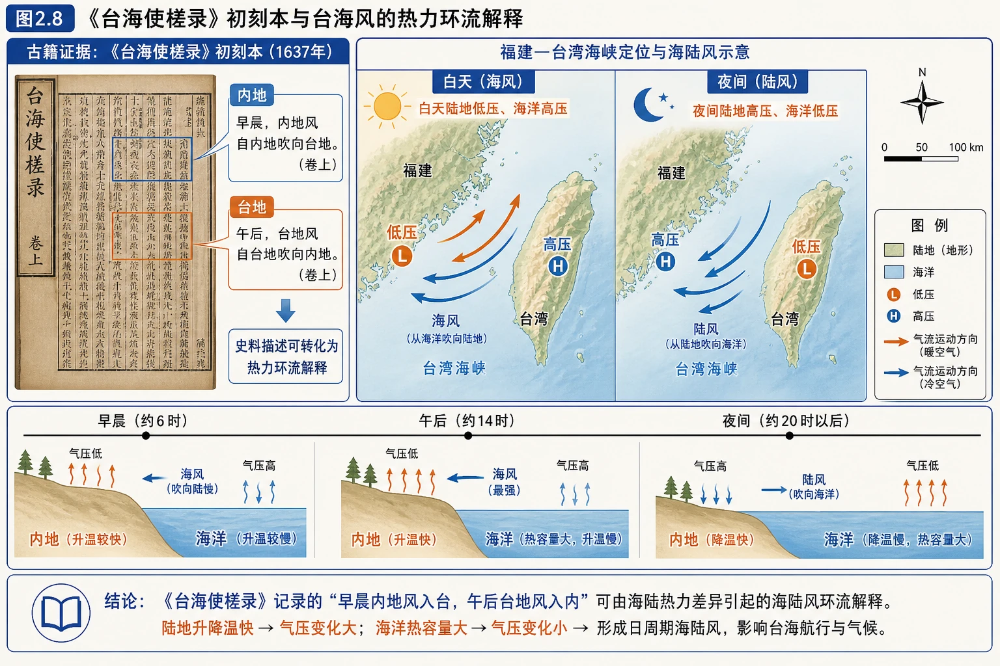
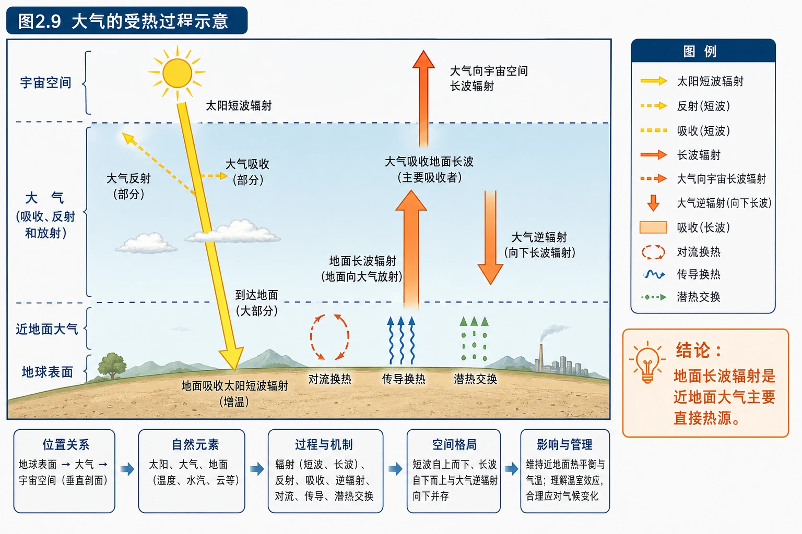
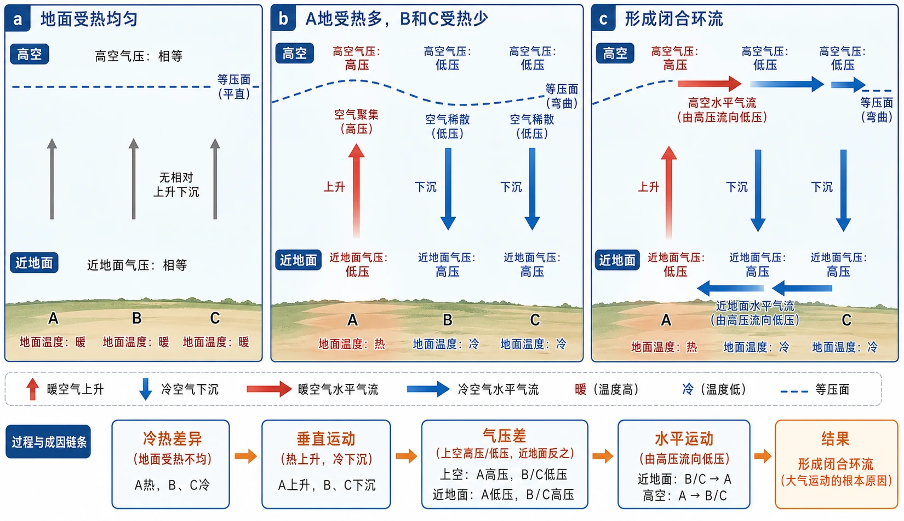
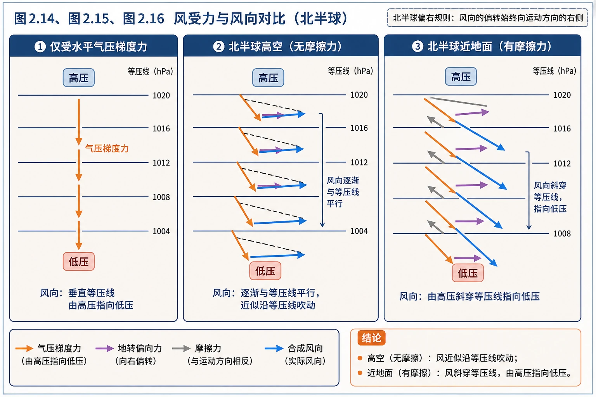
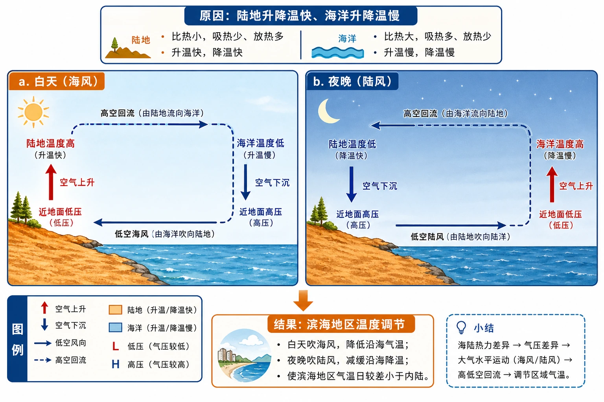
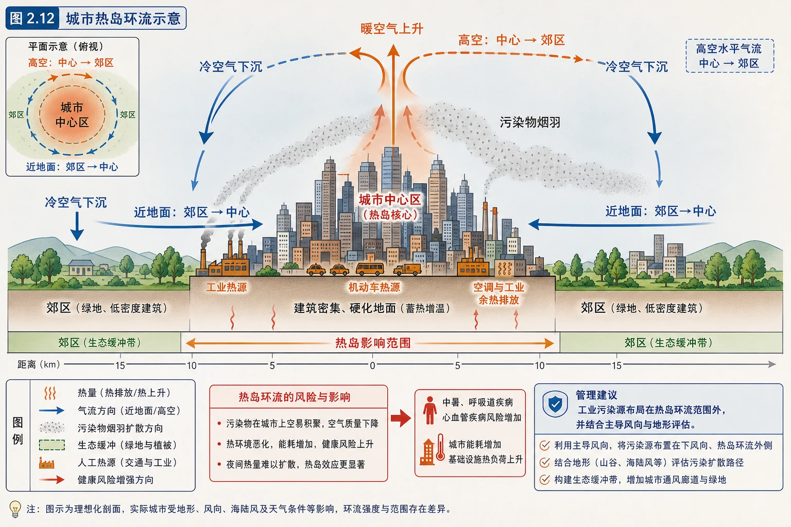
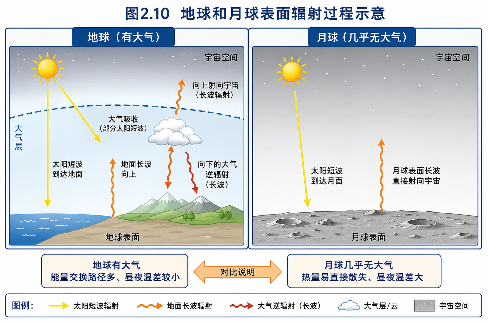
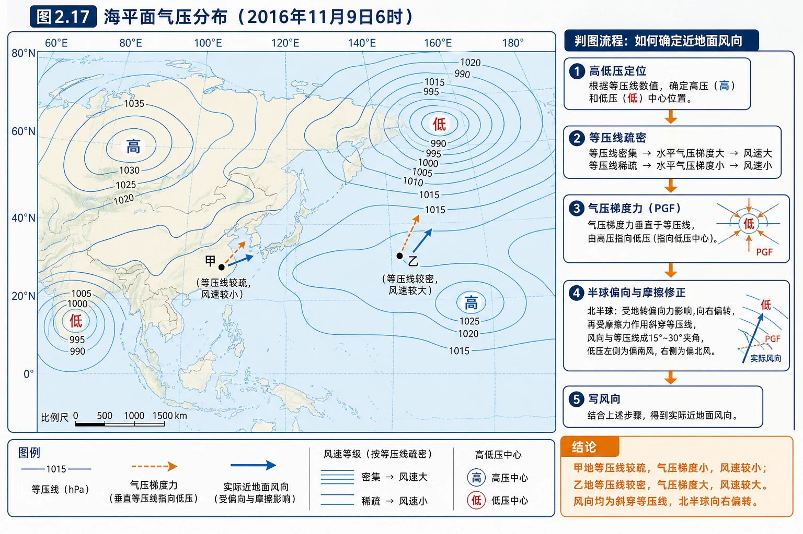

# 第二节 大气受热过程和大气运动

<!-- 图片描述：制作“本节整体知识信息结构图”，中心为“太阳辐射驱动的大气系统”，按顺时针连接四个模块：①受热过程：太阳短波辐射→地面吸收→地面长波辐射→水汽和二氧化碳吸收→大气逆辐射；②热力差异：地面冷热不均→气温差异→空气膨胀上升或收缩下沉→近地面与高空气压差；③环流与风：高低压配置→热力环流、海陆风、城市热岛→热量和污染物输送；④风的判读：等压线→水平气压梯度力→地转偏向力→摩擦力→高空与近地面风向。底部增加“温室气体发现—傅里叶猜想—丁达尔实验证实”的证据链。使用橙色表示太阳和热量，蓝色表示气压、风和水汽，绿色表示城市与环境，红色表示污染风险；加入剖面箭头、昼夜对比和等压线图例，帮助学生把辐射、气温、气压和风连成一条机制链。 图面结构：中心标题/核心对象是全图的总领节点，周围分支是从核心向外展开的知识层级；纵向或剖面部分表现高度、气压、温度、气流或大气层次变化；地图区先读图例、方向和范围，再由空间位置归纳分布规律；剖面区要从地表向上读层次、箭头和高度/气压变化；颜色、线型和符号构成图例编码，需先解释含义再读空间或过程。视频讲解顺序：先读图例、颜色、线型和单位；再讲中心核心对象及其与周围分支的关系；接着定位区域、方向和关键地理位置；再沿垂直方向或由内向外解释层次、气流与能量变化；沿箭头说明热量、水汽、气流或污染物的传递方向；用统一指标归纳不同天气系统/情境的差异及影响。讲解重点：判读线图时先看数值分布和疏密，再由气压梯度判断风向、风力或天气差异；箭头要明确起点、方向、中间环节和结果，避免把物质流与能量流混为一谈；颜色编码要与图例对应，区分温度、气压、云雨、风向或风险等级；案例讲解按“地点—天气/大气条件—过程机制—影响—治理”收束；对比必须建立在相同尺度和相同指标上，先找共同规律再找差异。学习落点：最终用“气象/气候现象—热力或动力机制—空间/时间分布—天气影响”复述本图，形成可迁移的读图答案。 -->

## 知识关系导航

本节承接第一节的大气成分和分层，回答“大气为什么运动、风如何判读、自然环流怎样影响人类生活”。

- 所属章节：[[章首 学习导图|第二章地球上的大气总览]]
- 前置知识点：[[第一节 大气的组成和垂直分层#3. 大气垂直分层的判据|大气层次与水汽、二氧化碳的作用]]
- 能量基础：[[第二节 太阳对地球的影响#核心知识点讲解|太阳辐射是地球系统的主要外部能量来源]]
- 后续应用：[[章末问题研究 何时“蓝天”常在#核心知识点讲解|气象条件对污染扩散和积聚的影响]]

## 本节学习目标

- 能区分太阳短波辐射、地面长波辐射和大气逆辐射，说明地面与近地面大气的热量来源。
- 能完整解释大气对地面的保温作用，并用地球与月球比较说明大气对昼夜温差的影响。
- 能按“冷热差异—垂直运动—气压差—水平运动”推导热力环流，解决海陆风和城市热岛问题。
- 能说明水平气压梯度力、地转偏向力和摩擦力对风向、风速的影响。
- 能在等压线图上判断气压梯度大小、风向和风速，并区分高空风与近地面风。
- 能把温室气体的辐射机制和环境治理、污染扩散、城市规划联系起来。

## 核心知识点讲解

### 一、区域定位与地理情境

#### 1. 台湾海峡两岸为何出现相反的昼夜风向

教材引用《台海使槎录》：“内地之风，早西晚东，惟台地早东风，午西风。”这里的“内地”指福建，“台地”指台湾。其本质是海陆风：

- 白天陆地升温快，陆地上空气温较高、上升，近地面形成低压；海洋升温慢，海面空气较冷、下沉，近地面形成高压，近地面风从海洋吹向陆地，称海风。
- 夜间陆地降温快，陆地上空气温较低、下沉，近地面形成高压；海洋降温慢，相对温暖，海面空气上升，近地面风从陆地吹向海洋，称陆风。

福建与台湾位于海峡两侧，海陆热力差异及海峡地形共同影响风向；材料中的“早、晚”还需要结合具体观测地点、季节和风向定义来解释，不能只机械写“白天海风、夜晚陆风”。

<!-- 图片描述：对应源文图2.8《台海使槎录》初刻本。画面左侧为古籍页面和“内地/台地”文字证据，右侧为福建—台湾海峡定位示意图，叠加白天海风、夜间陆风两组箭头；底部用时间轴标记早晨、午后、夜间，并用橙色表示陆地升降温快、蓝色表示海洋热容量大。图中标注“白天陆地低压、海洋高压”“夜间陆地高压、海洋低压”，强调史料描述可以转化为热力环流解释。采用浅地形色海峡地图、蓝色水体、橙色热力箭头、黑灰方向标和图例。 图面结构：左右分区承担起点—结果、原因—影响或两种情境对比；横向轴线表示时间演变、过程阶段或由近及远/由低到高的顺序；地图区先读图例、方向和范围，再由空间位置归纳分布规律；颜色、线型和符号构成图例编码，需先解释含义再读空间或过程。视频讲解顺序：先读图例、颜色、线型和单位；接着定位区域、方向和关键地理位置；按左到右或左右对照讲清原因、过程与结果；沿时间/阶段轴读天气系统或气候过程的演变；沿箭头说明热量、水汽、气流或污染物的传递方向。讲解重点：箭头要明确起点、方向、中间环节和结果，避免把物质流与能量流混为一谈；颜色编码要与图例对应，区分温度、气压、云雨、风向或风险等级。学习落点：最终用“气象/气候现象—热力或动力机制—空间/时间分布—天气影响”复述本图，形成可迁移的读图答案。 -->

#### 2. 大气运动是热量和水汽的输送通道

大气运动包括垂直运动和水平运动：

- 垂直运动表现为气流上升或下沉，决定云的形成、降水条件和热量的垂直交换。
- 水平运动就是风，把热量、水汽和污染物从一个区域输送到另一个区域。

天气变化和气候形成并非“大气自己变化”，而是能量差异通过大气运动不断调整的结果：太阳辐射造成地表受热差异，地面再通过长波辐射和感热、潜热交换影响近地面空气，空气密度和气压随之变化，最后形成环流和风。

### 二、核心概念与地理要素

#### 1. 三类辐射与两个热源概念

| 辐射类型 | 主要来源 | 波长和特点 | 在大气受热中的作用 |
|---|---|---|---|
| 太阳辐射 | 太阳 | 以短波辐射为主，能量集中，较易穿过大气 | 主要加热地面，是地球大气最重要的外部能量来源 |
| 地面辐射 | 地球表面 | 地面吸收太阳辐射后以长波辐射向外放热 | 是近地面大气主要的、直接的热源 |
| 大气辐射 | 被加热的大气 | 以长波辐射为主，向上和向下都有 | 向下的部分称大气逆辐射，对地面有保温作用 |

“太阳辐射是大气最重要的能量来源”与“地面是近地面大气主要、直接的热源”并不矛盾：太阳先把能量输入地面，地面再以长波辐射和湍流交换把能量传给大气。

此外，地面与大气之间还有：

- **感热交换**：地面与空气直接接触，通过传导和湍流传递热量。
- **潜热交换**：水分蒸发吸收热量，水汽凝结释放热量，是水循环与能量循环的桥梁。

这些过程有助于解释为什么同样获得太阳辐射的湿润海洋、干燥沙地和城市水泥地表，气温日变化不完全相同。

<!-- 图片描述：对应源文图2.9“大气的受热过程示意”。绘制地球表面—大气—宇宙空间的垂直剖面：黄色向下箭头表示太阳短波辐射，部分被大气反射和吸收、大部分到达地面；地面吸收后用橙色向上箭头表示地面长波辐射；大气吸收地面长波后分别向上射向宇宙、向下形成大气逆辐射；地面与近地面大气之间再标出对流、传导和潜热交换。图例要区分短波、长波、反射、吸收、逆辐射，旁边突出“地面长波辐射是近地面大气主要直接热源”的结论。 图面结构：纵向或剖面部分表现高度、气压、温度、气流或大气层次变化；剖面区要从地表向上读层次、箭头和高度/气压变化；颜色、线型和符号构成图例编码，需先解释含义再读空间或过程。视频讲解顺序：先读图例、颜色、线型和单位；再沿垂直方向或由内向外解释层次、气流与能量变化；沿箭头说明热量、水汽、气流或污染物的传递方向。讲解重点：箭头要明确起点、方向、中间环节和结果，避免把物质流与能量流混为一谈；颜色编码要与图例对应，区分温度、气压、云雨、风向或风险等级。学习落点：最终用“气象/气候现象—热力或动力机制—空间/时间分布—天气影响”复述本图，形成可迁移的读图答案。 -->

#### 2. 大气对地面的保温作用

对流层中的水汽、二氧化碳等温室气体对长波辐射吸收能力较强。地面长波辐射中约75%—95%被对流层吸收，大气吸收后增温，并向各方向发出长波辐射：

$$
\text{地面吸收太阳短波} \rightarrow \text{地面长波辐射} \rightarrow \text{大气吸收增温} \rightarrow \text{大气逆辐射} \rightarrow \text{地面获得补偿}
$$

大气逆辐射不是“把太阳光反射回来”，而是大气自身增温后向下发出的长波辐射。云层，特别是浓密低云，含水汽较多，通常会增强逆辐射。因此：

- 晴朗少云夜间，地面长波辐射容易散失，降温较快。
- 多云夜间，大气逆辐射较强，地面散热损失得到补偿，降温较慢。
- 温室效应本身是自然过程，使地球平均表面温度适宜生命；温室气体浓度快速增加可能增强这一作用，导致全球变暖风险。

#### 3. 热力环流

由于地面冷热不均而形成的空气环流，称为**大气热力环流**。它是最简单、最基础的大气运动形式。

完整推导顺序如下：

1. **地面冷热不均**：A地受热多，B、C地受热少。
2. **气温和密度变化**：A地空气受热膨胀，密度减小并上升；B、C地空气冷却收缩，密度增大并下沉。
3. **气压重新分配**：A地近地面空气上升后减少，形成低压；B、C地近地面空气下沉后增多，形成高压。高空则相反，A地上空气流聚集，形成高压；B、C地上空气流散开，形成低压。
4. **水平气流补偿**：高空空气由A地上空流向B、C地上空，近地面空气由B、C地流向A地，形成闭合环流。

可以用一句话记忆：**热地上升低压，冷地下沉高压；高空方向与近地面相反。**这里的高低压是同一水平面上的相对比较，不能把近地面和高空的气压直接跨高度比较。

<!-- 图片描述：对应源文图2.11及其a、b、c过程面板。绘制三联图：a为地面受热均匀，等压面平直、无相对上升下沉；b为A地受热多、B和C受热少，A地近地面暖空气上升、上空空气聚集形成高压，B/C冷空气下沉、上空形成低压；c为近地面B/C高压空气流向A地低压，高空A地高压流向B/C低压，形成闭合环流。每个面板要同时标出地面温度、垂直箭头、近地面/高空气压和水平箭头，使用红色表示暖空气、蓝色表示冷空气、粗箭头表示气流方向。图下总结“冷热差异→垂直运动→气压差→水平运动”，用于避免只背环流图而不理解成因。 图面结构：纵向或剖面部分表现高度、气压、温度、气流或大气层次变化；剖面区要从地表向上读层次、箭头和高度/气压变化；并列卡片/表格按统一指标对比，适合提取差异、共性和适用条件。视频讲解顺序：再沿垂直方向或由内向外解释层次、气流与能量变化；沿箭头说明热量、水汽、气流或污染物的传递方向；用统一指标归纳不同天气系统/情境的差异及影响。讲解重点：判读线图时先看数值分布和疏密，再由气压梯度判断风向、风力或天气差异；箭头要明确起点、方向、中间环节和结果，避免把物质流与能量流混为一谈；对比必须建立在相同尺度和相同指标上，先找共同规律再找差异。学习落点：最终用“气象/气候现象—热力或动力机制—空间/时间分布—天气影响”复述本图，形成可迁移的读图答案。 -->

#### 4. 气温、气压和气流的关系

- 一般情况下，空气受热膨胀、密度减小、上升，近地面气压降低；空气冷却收缩、密度增大、下沉，近地面气压升高。
- 空气上升区近地面常形成低压，容易出现辐合、上升、云雨；下沉区近地面常形成高压，容易出现辐散、下沉、晴朗。
- 但实际天气还受水汽、地形、辐射、锋面和地球自转等影响，不能把“低压必然下雨、高压必然无云”当成没有条件的绝对规律。

#### 5. 风与三个力

**水平气压梯度力**是风形成的直接原因。气压梯度是单位距离上的气压差，气压差越大，水平气压梯度力越大。它的方向垂直于等压线，由高压指向低压。

**地转偏向力**来自地球自转，只改变运动方向，不改变风速大小：北半球向右偏，南半球向左偏；赤道附近作用弱，向两极增强。若忽略摩擦，在高空风逐渐与等压线平行，水平气压梯度力与地转偏向力达到相对平衡。

**摩擦力**来自地面与空气、不同空气层之间的相互作用，阻碍空气运动，使风速减小，也使风向不能完全沿等压线，而是由高压斜穿等压线吹向低压。地面越粗糙，摩擦越强，近地面风速越小、斜交角度通常越大。

<!-- 图片描述：对应源文图2.14、图2.15、图2.16的“风受力与风向”对比图。左图只画水平气压梯度力，等压线平行排列，风从高压垂直指向低压；中图为北半球高空，水平气压梯度力指向低压、地转偏向力向右偏，合成风逐渐与等压线平行；右图为北半球近地面，加入与运动方向相反的摩擦力，合成风由高压斜穿等压线指向低压。三图统一标出高压、低压、等压线、三力方向和北半球偏右规则，使用橙色表示气压梯度力、紫色表示地转偏向力、灰色表示摩擦力、蓝色表示最终风向。 图面结构：纵向或剖面部分表现高度、气压、温度、气流或大气层次变化；地图区先读图例、方向和范围，再由空间位置归纳分布规律；剖面区要从地表向上读层次、箭头和高度/气压变化；并列卡片/表格按统一指标对比，适合提取差异、共性和适用条件。视频讲解顺序：接着定位区域、方向和关键地理位置；再沿垂直方向或由内向外解释层次、气流与能量变化；用统一指标归纳不同天气系统/情境的差异及影响。讲解重点：判读线图时先看数值分布和疏密，再由气压梯度判断风向、风力或天气差异；对比必须建立在相同尺度和相同指标上，先找共同规律再找差异。学习落点：最终用“气象/气候现象—热力或动力机制—空间/时间分布—天气影响”复述本图，形成可迁移的读图答案。 -->

#### 6. 等压线与风速

等压线是同一高度上气压相等的点的连线。判读等压线图时要牢记：

- 等压线越密，单位距离气压差越大，气压梯度越大，水平气压梯度力越大，风速通常越大。
- 等压线越疏，气压梯度越小，风速通常越小。
- 风向不能直接看成“指向低压”的箭头：地理学中的风向是风吹来的方向，如西北风是从西北吹来、吹向东南；作图时应先求空气运动方向，再按约定写风向。
- 高空判风可近似沿等压线；近地面判风应由高压指向低压并向低压一侧斜穿等压线，再根据半球判断偏向。

### 三、过程机制与成因链条

#### 1. 热力环流的本质：密度差引起的压力差

地面受热不均先改变空气温度和密度，再改变同一水平面上的气压分布，最后才出现水平气流。要避免把“气压差”当成最初原因；在热力环流模型中，最初的触发因素是地面冷热差异。

#### 2. 海陆风：海洋热容量造成的昼夜差异

陆地和海洋在相同太阳辐射下升降温速度不同：陆地比热容小、热量容易集中，白天增温快、夜间降温快；海水具有较大的热容量和混合层，升降温慢。

| 时段 | 温度比较 | 近地面气压 | 近地面风 | 对滨海地区的影响 |
|---|---|---|---|---|
| 白天 | 陆地高、海洋低 | 陆地低压、海洋高压 | 海洋吹向陆地，海风 | 海风带来较凉空气，减弱滨海地区白天升温 |
| 夜间 | 陆地低、海洋高 | 陆地高压、海洋低压 | 陆地吹向海洋，陆风 | 海洋热量缓慢释放，对陆地降温有一定调节 |

夏季滨海地区通常比同纬度内陆地区昼夜温差小，海陆风是原因之一，但还要结合海洋热容量、湿度、云量、季风和地形等因素。

<!-- 图片描述：对应源文图2.13“海陆间的大气热力环流”，左右并列白天a和夜晚b。白天面板标出陆地温度高、空气上升、近地面低压，海洋温度低、空气下沉、近地面高压，低空海风由海洋吹向陆地、高空回流；夜晚面板反转温度、垂直运动、气压和近地面风向，形成陆风。顶部加入“陆地升降温快、海洋升降温慢”的原因框，底部连接“滨海地区温度调节”。使用暖橙色陆地、蓝色海洋、红色上升箭头、深蓝色下沉和水平风箭头，标注高压/低压与图例。 图面结构：纵向或剖面部分表现高度、气压、温度、气流或大气层次变化；剖面区要从地表向上读层次、箭头和高度/气压变化；并列卡片/表格按统一指标对比，适合提取差异、共性和适用条件；颜色、线型和符号构成图例编码，需先解释含义再读空间或过程。视频讲解顺序：先读图例、颜色、线型和单位；再沿垂直方向或由内向外解释层次、气流与能量变化；沿箭头说明热量、水汽、气流或污染物的传递方向；用统一指标归纳不同天气系统/情境的差异及影响。讲解重点：判读线图时先看数值分布和疏密，再由气压梯度判断风向、风力或天气差异；箭头要明确起点、方向、中间环节和结果，避免把物质流与能量流混为一谈；颜色编码要与图例对应，区分温度、气压、云雨、风向或风险等级。学习落点：最终用“气象/气候现象—热力或动力机制—空间/时间分布—天气影响”复述本图，形成可迁移的读图答案。 -->

#### 3. 城市热岛环流：下垫面和人为热共同作用

城市中心区建筑密集、地面硬化比例高，混凝土和沥青吸收并储存较多太阳辐射；人口、产业和机动车集中，又释放较多废热。在静风或微风条件下，城市中心气温通常高于郊区，形成城市热岛。

热岛环流的机制是：城市中心温度高 → 空气受热上升 → 近地面形成低压；郊区相对较冷 → 空气下沉 → 近地面形成高压；近地面空气由郊区流向城市中心，高空由中心流向郊区，形成局地环流。

城市热岛与污染可以相互强化：环流近地面气流把污染物带向中心区；上升气流若受稳定层限制，污染物又可能在低层积聚。因此城市规划中应避免把高污染工业布局在热岛环流可能把污染物输送到中心区的位置，同时还需结合主导风向、地形、人口分布、排放强度和环境影响评价，不能只凭“远离中心”一个条件。

<!-- 图片描述：对应源文图2.12“城市热岛环流示意”。绘制城市中心与郊区剖面：中心区建筑密集、硬化地面、机动车和工业热源用橙色标出，郊区用绿色植被和较低建筑表示；中心上空画暖空气上升，郊区画冷空气下沉，高空由中心流向郊区、近地面由郊区流向中心，形成闭合环流；增加污染物烟羽和红色风险箭头，标注“工业污染源布局在热岛环流范围外，并结合主导风向与地形评估”。图例区分热量、气流、污染物和生态缓冲。 图面结构：纵向或剖面部分表现高度、气压、温度、气流或大气层次变化；剖面区要从地表向上读层次、箭头和高度/气压变化；颜色、线型和符号构成图例编码，需先解释含义再读空间或过程。视频讲解顺序：先读图例、颜色、线型和单位；再沿垂直方向或由内向外解释层次、气流与能量变化；沿箭头说明热量、水汽、气流或污染物的传递方向。讲解重点：箭头要明确起点、方向、中间环节和结果，避免把物质流与能量流混为一谈；颜色编码要与图例对应，区分温度、气压、云雨、风向或风险等级；案例讲解按“地点—天气/大气条件—过程机制—影响—治理”收束。学习落点：最终用“气象/气候现象—热力或动力机制—空间/时间分布—天气影响”复述本图，形成可迁移的读图答案。 -->

#### 4. 风的综合受力与地理表达

在真实大气中，风速和风向是多个力共同作用的结果：

$$
\text{水平气压梯度力} + \text{地转偏向力} + \text{摩擦力} \Rightarrow \text{实际风}
$$

风向判读并不是简单的力学合成题，而是有地理约定：先根据高低压关系确定空气由哪里流向哪里，再根据半球和地面/高空条件修正方向，最后用“东南风、西北风”等表示风吹来的方向。

### 四、空间分布、图表判读与证据

#### 1. 受热过程图的判读

按“太阳—大气—地面—大气—宇宙”的顺序找箭头：

1. 太阳短波辐射到达大气上界。
2. 少量被大气吸收或反射，大部分到达地面。
3. 地面吸收后增温，并发出长波辐射。
4. 水汽、二氧化碳等吸收大部分地面长波辐射，大气增温。
5. 大气向上、向下发出长波，向下的为大气逆辐射。

如果题目问“近地面大气的直接热源”，答地面长波辐射；如果问“地球大气最重要能量来源”，答太阳辐射。

#### 2. 地球与月球辐射图的判读

地球有大气，月球几乎没有大气。与月球相比，地球多出的关键辐射途径包括：地面长波辐射被大气吸收、大气向地面发出逆辐射，以及地面与大气之间的反复辐射交换。白天这些过程会减少部分热量直接散失，夜间逆辐射补偿地面散热，因此地球昼夜温差通常比月球小。

月球表面昼夜温度变化剧烈，还与月球自转周期长、没有浓厚大气和水汽、缺乏大气热量输送与保温有关。题目要求“从大气角度”时，重点写没有大气吸收长波和发出逆辐射，而不要展开成天文因素清单。

<!-- 图片描述：对应源文图2.10“地球和月球表面辐射过程示意”。左右或上下对比地球与月球：地球面板标出太阳短波到达地面、地面长波向上、大气吸收、向上射向宇宙和向下的大气逆辐射；月球面板只保留太阳辐射到达月面和月球表面长波直接射向宇宙。底部用双向箭头说明“地球有大气→能量交换路径多、昼夜温差较小；月球几乎无大气→热量易直接散失、昼夜温差大”。使用黄色短波、橙色长波、红色逆辐射、灰色宇宙背景和清晰图例。 图面结构：颜色、线型和符号构成图例编码，需先解释含义再读空间或过程。视频讲解顺序：先读图例、颜色、线型和单位；沿箭头说明热量、水汽、气流或污染物的传递方向；用统一指标归纳不同天气系统/情境的差异及影响。讲解重点：箭头要明确起点、方向、中间环节和结果，避免把物质流与能量流混为一谈；颜色编码要与图例对应，区分温度、气压、云雨、风向或风险等级；对比必须建立在相同尺度和相同指标上，先找共同规律再找差异。学习落点：最终用“气象/气候现象—热力或动力机制—空间/时间分布—天气影响”复述本图，形成可迁移的读图答案。 -->

#### 3. 热力环流图的判读

判图时不要先看水平箭头，应按以下顺序：

1. 判断地面冷热：受热多的一侧温度高，受热少的一侧温度低。
2. 判断垂直运动：热空气上升，冷空气下沉。
3. 判断近地面气压：上升处近地面低压，下沉处近地面高压。
4. 画近地面风：高压流向低压。
5. 画高空回流：高空气压与近地面相反，形成闭合环流。

#### 4. 等压线图的判读

1. 先看等压线数值，找出高压区和低压区。
2. 看等压线疏密，越密处气压梯度越大、风速通常越大。
3. 在高空，北半球风大致沿等压线吹，低压在风向左侧、高压在风向右侧；南半球相反。
4. 在近地面，风由高压斜穿等压线吹向低压，北半球向右偏、南半球向左偏。
5. 写风向时使用“来自哪里”的名称，如空气由西北向东南运动，风向写西北风。

<!-- 图片描述：对应源文图2.17“海平面气压分布（2016年11月9日6时）”。绘制带经纬网和海陆轮廓的海平面等压线图，保留甲、乙两地位置、等压线数值、低压中心和高压中心；在甲乙附近分别用短箭头标出气压梯度力和实际近地面风向，并用括号比较等压线疏密与风速大小。右侧设置判图流程：高低压定位→等压线疏密→气压梯度力垂直等压线指向低压→半球偏向与摩擦修正→写风向。图例区分等压线、风向、风速等级和高低压中心；若重绘时甲乙位置与原图不清，应回看源图确认，不能凭空改变位置。 图面结构：右侧通常是结果、应用、危害或治理措施；纵向或剖面部分表现高度、气压、温度、气流或大气层次变化；地图区先读图例、方向和范围，再由空间位置归纳分布规律；剖面区要从地表向上读层次、箭头和高度/气压变化；颜色、线型和符号构成图例编码，需先解释含义再读空间或过程。视频讲解顺序：先读图例、颜色、线型和单位；接着定位区域、方向和关键地理位置；再沿垂直方向或由内向外解释层次、气流与能量变化；沿箭头说明热量、水汽、气流或污染物的传递方向。讲解重点：判读线图时先看数值分布和疏密，再由气压梯度判断风向、风力或天气差异；箭头要明确起点、方向、中间环节和结果，避免把物质流与能量流混为一谈；颜色编码要与图例对应，区分温度、气压、云雨、风向或风险等级。学习落点：最终用“气象/气候现象—热力或动力机制—空间/时间分布—天气影响”复述本图，形成可迁移的读图答案。 -->

### 五、人地关系、影响与对策

#### 1. 温室气体：自然保温与人为增强

19世纪初，傅里叶根据地表热量收支猜想大气会拦截部分红外辐射；19世纪中期，丁达尔实验表明氧气、氮气较易让红外辐射通过，而二氧化碳、水汽等能吸收红外辐射。这个科学史材料说明地理结论需要观测、假设、实验和模型相互验证。

在治理上要区分：

- 保留自然温室效应，使地球保持适宜生命的温度。
- 控制人为温室气体快速增加，减少化石燃料排放，提升能源效率，发展可再生能源，保护森林和湿地碳汇。

#### 2. 热力环流与城市规划

热力环流能帮助解释海陆风、山谷风、城市热岛等地方性风。城市规划不仅要考虑热岛环流，还要综合考虑：主导风向、污染源位置、地形通风廊道、建筑密度、绿地水体、人口暴露和产业类型。绿地、水体能通过遮阴、蒸散和热容量调节局地热环境，但不能替代排放源头治理。

#### 3. 风与污染扩散

风速大、湍流强时，污染物通常更易扩散；静风、弱风和稳定层结时，污染物容易积聚。污染治理不能只寄希望于“大风吹走”，因为风会把污染物输送到下风向区域，区域协同减排、源头控制和及时预警更重要。

### 六、综合题型与迁移应用

遇到“昼夜风向”“城市污染”“等压线判风”综合题，可采用：

> **先定热冷**：哪个下垫面升温快、降温快，哪边热、哪边冷；
> **再判升降**：热空气上升、冷空气下沉；
> **再判气压**：近地面上升为低压、下沉为高压；
> **再定风向**：近地面从高压吹向低压，考虑半球偏向和摩擦；
> **最后写影响**：联系温度调节、降水、污染扩散、交通和城市规划。

## 重点梳理

### 1. 受热过程的四句话

1. 太阳辐射以短波为主，大部分能够穿过大气到达地面。
2. 地面吸收太阳辐射增温，并以长波辐射向外放热。
3. 水汽、二氧化碳等吸收大部分地面长波辐射，近地面大气主要由地面获得热量。
4. 大气逆辐射把一部分热量传回地面，对地面起保温作用。

### 2. 热力环流的四步推导

地面冷热不均 → 空气上升/下沉 → 近地面气压差 → 近地面高压流向低压并形成闭合环流。

### 3. 风的三力比较

| 力 | 方向或作用 | 是否改变风速 | 典型场景 |
|---|---|---|---|
| 水平气压梯度力 | 垂直等压线，由高压指向低压 | 形成并加速风 | 风的直接原因 |
| 地转偏向力 | 北半球右偏、南半球左偏 | 只改变方向 | 高空风近似沿等压线 |
| 摩擦力 | 阻碍运动，方向与风相反 | 减小风速，也改变风向 | 近地面风斜穿等压线 |

### 4. 常见地方性环流

- 海陆风：海陆热力差异的日变化。
- 山谷风：山坡和谷地升降温差异的日变化，教材未展开但可用同一热力环流模型解释。
- 城市热岛环流：城市与郊区热量、下垫面和人为热差异。

## 难点突破

### 难点一：为什么白天陆地低压、夜间陆地高压

关键不是陆地“永远比海洋热或冷”，而是比较同一时刻的升降温速度。白天陆地升温更快，近地面空气变热上升，陆地低压；夜间陆地降温更快，近地面空气变冷下沉，陆地高压。

### 难点二：气压高低必须说明高度

同一地点的气压通常随高度升高而降低，但热力环流图比较的是同一水平面上的相对气压。正确表述应为“受热地近地面低压、上空高压；冷地近地面高压、上空低压”，不能只写“热地是低压”而不说明高度。

### 难点三：大气逆辐射不是把太阳光反射回地面

太阳短波辐射主要从太阳到地面；大气逆辐射是大气吸收地面长波辐射后自身向下发出的长波辐射。判断辐射方向时，先找辐射来源，再看波长和吸收对象。

### 难点四：等压线密并不表示气压绝对值高

等压线密表示相邻等压线之间气压变化快，即气压梯度大、风速可能较大；它不等于该处一定是高压。判断高低压还要看等压线数值的递增、递减方向和闭合中心。

### 难点五：温室效应与天气热不能混为一谈

温室效应是大气成分影响地球长波辐射收支的长期过程；某一天高温还受太阳高度、云量、风、下垫面、海拔和天气系统影响。综合题要根据时间尺度和材料证据选择解释层次。

## 例题讲解

### 例题1：说明地球大气的保温作用

**题目**：与几乎没有大气的月球相比，地球昼夜温差较小。请从大气角度解释。

**分析**：找出地球比月球多的辐射途径，并写出其对昼夜散热的不同影响。

**答案**：地球有大气，地面长波辐射中的大部分被水汽、二氧化碳等吸收，大气增温后向地面发出大气逆辐射，补偿地面部分散热；大气还通过对流、传导和水汽相变输送热量。月球几乎没有大气，表面长波辐射更容易直接散失到宇宙，白天吸热后夜间缺少逆辐射补偿，因此昼夜温度变化更剧烈。

### 例题2：推导海陆风

**题目**：夏季白天，滨海地区常有海风。请从地面冷热差异开始说明海风形成过程及其对气温的影响。

**答案**：白天陆地升温快，陆地气温高，近地面空气受热膨胀上升，形成低压；海洋升温慢，海面空气相对较冷并下沉，近地面形成高压。近地面空气从海洋高压流向陆地低压，形成海风。海风带来相对凉湿的海洋空气，增强近地面空气交换和蒸发，对滨海地区白天气温有一定调节作用。

### 例题3：城市热岛与污染源布局

**题目**：某城市中心区高楼密集、硬化面多，周边郊区较开阔。说明城市热岛环流方向，并评价把高污染工业布局在城市热岛环流范围外的做法。

**答案**：中心区吸收并储存的热量多，且人为废热多，气温高，空气上升，近地面低压；郊区较冷，空气下沉，近地面高压。近地面空气由郊区流向中心，高空由中心流向郊区，形成热岛环流。把高污染工业布局在环流范围外可减少污染物随近地面气流向中心区输送，但还应结合主导风向、地形、人口密度、排放强度和区域联防治理进行综合评价，不能将“环流范围外”视为唯一条件。

### 例题4：等压线判风

**题目**：某区域等压线在甲地较密、乙地较疏。请比较两地气压梯度和风速，并写出近地面风向判读步骤。

**答案**：甲地等压线较密，单位距离气压差较大，气压梯度较大，水平气压梯度力较大，风速通常较大；乙地风速通常较小。判读风向时，先找甲乙附近高低压和等压线数值，再作垂直等压线、由高压指向低压的水平气压梯度力，最后按所在半球向右或向左偏，并考虑摩擦使近地面风斜穿等压线指向低压；风向名称按吹来的方向书写。

## 易错点整理

- 把“太阳辐射是大气能量来源”和“地面辐射是近地面大气直接热源”看成矛盾。
- 把大气逆辐射写成“太阳光反射”，忽略它是大气自身发出的长波辐射。
- 热力环流先判断水平风，漏掉“垂直运动—气压差”的中间环节。
- 把热空气上升处写成近地面高压，或把高空与近地面气压关系混写。
- 把海风、陆风方向写反，未先比较同一时刻海陆温度。
- 把城市热岛只归因于建筑，不写硬化地面、储热、废热和人口产业集中。
- 把地转偏向力写成改变风速；教材范围内应强调它主要改变风向。
- 把等压线密理解为气压值高，或把风向直接写成“指向低压”。
- 忘记地理学中的风向表示“风吹来的方向”。
- 认为有风就一定能解决污染；风也可能把污染物输送到下风向地区。

## 考点考证点整理

### 考点一：大气受热过程与保温作用

- 出题思路：给出辐射示意图、云量变化、地月对比或温室气体材料，要求说明热量传递。
- 关键条件：太阳短波、地面长波、大气吸收、大气逆辐射、云层和昼夜温差。
- 解答要点：太阳短波到达地面并使地面增温；地面长波被大气吸收；大气向下发出逆辐射，补偿地面散热；有大气时能量传递路径多、昼夜温差较小。
- 易扣分点：把地面长波和大气逆辐射混淆；只写“有大气保温”，不写具体辐射途径。

### 考点二：热力环流形成过程

- 出题思路：给出A/B两地冷热差异，或转化为海陆风、山谷风、城市热岛情境。
- 关键条件：下垫面受热差异、空气上升下沉、近地面和高空气压、高低压之间的水平风。
- 解答要点：按“冷热—升降—气压—风向—环流”顺序作答；明确近地面与高空气流方向相反。
- 易扣分点：气压判定不注明高度；只写环流方向，不解释热力原因。

### 考点三：海陆风与滨海气温调节

- 出题思路：以海峡、沿海城市、古代风向记录或昼夜风向图为材料。
- 关键条件：陆地升降温快、海洋升降温慢；白天和夜间温度、气压和风向反转。
- 解答要点：白天海风由海洋吹向陆地，夜间陆风由陆地吹向海洋；海陆风带来热量和水汽交换，减小滨海地区气温日变化。
- 易扣分点：把风向当成空气运动方向，或只写“海风凉”而不写高低压形成过程。

### 考点四：城市热岛环流和规划

- 出题思路：给出城市与郊区温度、土地利用、建筑或污染源布局图，要求分析环流和措施。
- 关键条件：硬化地面、建筑储热、人为废热、静风微风、中心上升、郊区下沉。
- 解答要点：中心区热、上升、近地面低压；郊区冷、下沉、近地面高压；近地面郊区吹向中心。工业布局要结合环流范围、主导风向、地形和人口暴露分析。
- 易扣分点：把热岛只写成“城市温度高”；措施只写“搬到郊区”，不评价下风向和二次污染风险。

### 考点五：等压线判风向和风速

- 出题思路：给出海平面气压图或局部等压线图，要求比较气压梯度、画风向、比较风速。
- 关键条件：等压线数值、疏密、半球、近地面或高空、风向表示方法。
- 解答要点：等压线密处气压梯度大、风速大；水平气压梯度力垂直等压线由高压指向低压；北半球右偏、南半球左偏；近地面考虑摩擦。
- 易扣分点：把风向写成空气去向；遗漏地转偏向力或摩擦；未看图例和等压线数值。

### 考点六：温室气体与人地关系

- 出题思路：通过傅里叶、丁达尔史料或二氧化碳变化材料考查温室效应的科学解释。
- 关键条件：红外辐射、二氧化碳和水汽吸收、自然保温、人为排放增加。
- 解答要点：说明自然温室效应对生命适宜温度的意义，再分析人类活动导致温室气体快速增加的风险和减排、增汇措施。
- 易扣分点：把温室效应等同于“有害现象”；把天气尺度的单次高温直接归因于全球变暖。

## 练习题

### 一、教材活动与思考

1. **对应教材“说明地球大气的保温作用”第1题**：观察图2.10，找出地球比月球多了哪些辐射途径。
2. **对应教材第2题**：说明这些辐射途径对地球昼夜温差的影响。
3. **对应教材第3题**：从大气角度说明月球表面昼夜温度变化比地球表面剧烈得多的原因。
4. **对应教材“思考”**：气温、气压、气流三者之间有什么关系？
5. **对应教材“绘制海陆间热力环流模式图”第1—2题**：根据白天和夜晚海陆温度，补画垂直运动、近地面和高空气压、水平气流方向。
6. **对应教材“绘制海陆间热力环流模式图”第3题**：分析夏季大气热力环流对滨海地区气温的调节作用。
7. **对应教材“根据等压线确定风向和风速”第1—3题**：在图2.17上比较甲、乙两地气压梯度，画出风向并比较风速。原文图中甲乙位置和数值应回看图2.17确认，不能仅凭文字还原具体箭头。

### 二、基础与巩固

8. 为什么白天晴朗少云的沙地通常升温快，而多云湿润地区升温相对慢？请从辐射和水分相变角度说明。
9. 某地近地面出现“上升气流—低压—云雨”，另一地出现“下沉气流—高压—晴朗”。解释两地可能存在的热力差异。
10. 画出北半球近地面低压系统附近的风向示意，并说明等压线疏密对风速的影响。
11. 比较海风和陆风的形成时间、热力原因、近地面气压和风向。

### 三、提升与综合

12. 某工业区位于城市东南侧，夏季白天盛行海风，城市中心在其西北侧。分析该工业区布局对城市空气质量的潜在影响，并提出还需收集的资料。
13. 某夜间气温下降速度明显小于晴朗无风夜，可能与云量和湿度有关。用大气逆辐射和水汽作用解释。
14. 设计一个“等压线判风”答题模板，要求同时覆盖高低压、气压梯度力、地转偏向力、摩擦力、风速和风向书写。

## 练习题答案

1. 地球比月球多了地面长波辐射被大气吸收、大气自身向上和向下的长波辐射，尤其是向下的大气逆辐射；还存在大气中的对流、传导和水汽相变等热量交换。
2. 大气吸收地面长波并发出逆辐射，夜间补偿地面散热；大气还输送热量，因此地球昼夜温差通常较小。
3. 月球几乎没有大气，缺少吸收长波辐射和发出大气逆辐射的途径，地面热量容易直接散失，且没有大气对流和水汽相变进行热量再分配，所以昼夜温差大。
4. 地面受热不均会使空气温度和密度不同；热空气膨胀上升，近地面气压降低，冷空气收缩下沉，近地面气压升高；气压差进一步驱动水平气流，即风。实际关系还受地球自转、摩擦、水汽和地形等影响。
5. 白天陆地热、空气上升、近地面低压，海洋冷、空气下沉、近地面高压，近地面海风由海洋吹向陆地；夜间陆地冷、下沉、高压，海洋相对暖、上升、低压，近地面陆风由陆地吹向海洋。高空风向与近地面相反，形成闭合环流。
6. 海风把海洋较凉空气带到陆地，促进热量交换并减弱白天升温；夜间海洋降温慢，陆风和海洋缓慢放热共同减弱陆地降温，因而滨海地区昼夜温差较小。具体作用还受季风、云量、湿度和地形影响。
7. 需要根据图2.17甲乙的具体等压线位置作图。通用答案是：等压线较密处气压梯度较大，风速较大；风向由高压指向低压，北半球向右偏、南半球向左偏，近地面还因摩擦斜穿等压线。原图甲乙方向需回看教材图确认。
8. 沙地含水量少，蒸发和潜热消耗少，太阳辐射更多转化为地表显热，且晴朗时长波散失较强，白天升温快；湿润多云地区部分能量用于蒸发，云层反射和吸收太阳辐射，水汽又能吸收长波，地表升温相对缓慢。
9. 可能是前者地面受热较多，空气温暖上升，近地面形成低压并辐合，水汽上升冷却凝结形成云雨；后者受热少或高空有下沉气流，近地面空气增多形成高压并辐散，下沉增温不利于云的形成，天气较晴朗。
10. 先根据等压线数值找低压中心；北半球近地面风绕低压逆时针并向中心斜穿，南半球相反。等压线越密，气压梯度越大，风速通常越大；等压线越疏，风速通常越小。
11. 海风发生在白天，陆地升温快、陆地低压，海洋相对冷、海洋高压，风由海洋吹向陆地；陆风发生在夜间，陆地降温快、陆地高压，海洋相对暖、海洋低压，风由陆地吹向海洋。
12. 若工业区位于城市东南侧，而夏季白天海风由海洋吹向城市西北侧，工业区排放物可能被风输送到城市中心，增加污染暴露风险。还需收集主导风向的季节和日变化、污染物排放量和类型、地形、风速、静稳天气频率、人口分布和污染监测数据，不能只根据一次海风判断全年影响。
13. 云层和水汽增强大气对地面长波辐射的吸收，并增强向下的大气逆辐射，补偿地面散热；湿空气还可能通过凝结放热减缓降温，所以夜间降温速度小于晴朗干燥夜晚。
14. 模板：①看等压线数值，定位高压和低压；②看等压线疏密，判断气压梯度和风速大小规律；③画水平气压梯度力，垂直等压线由高压指向低压；④根据北半球右偏、南半球左偏修正地转偏向；⑤近地面加入摩擦，使风斜穿等压线，风速减小；⑥按风吹来的方向写东风、西北风等。
