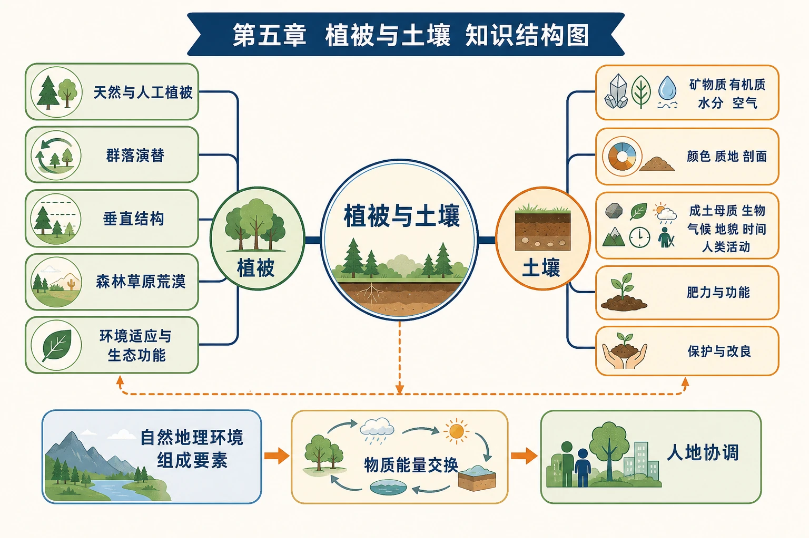

# 第五章 植被与土壤·学习导图

<!-- 图片描述：第五章整体知识结构图，中心为“植被与土壤”，左侧植被分支依次连接天然与人工植被、群落演替、垂直结构、森林草原荒漠、环境适应与生态功能；右侧土壤分支依次连接矿物质有机质水分空气、颜色质地剖面、成土母质生物气候地貌时间、蓄水保肥与养护；中央双向箭头表示土壤为植被提供水肥和扎根条件，植被通过有机质、生物循环、固土和改变水热反作用于土壤；底部连接校园绿化、盐碱地治理和海绵城市。 图面结构：中心主题先给出本图要解决的核心问题，周围分支是条件、过程、影响或措施；左右两侧分别承担原因—结果、自然—人类、灾前—灾后或两种情境对照；纵向或剖面区表现高度、深度、垂直分层和物质/能量变化；环形/闭合箭头表示循环、反馈、包含关系或多环节协同；颜色、符号、线型和箭头是阅读图面的编码系统。视频讲解顺序：先读图例、颜色、线型、箭头和单位；再讲中心主题，说明这张图试图回答什么问题；按左到右或左右对照讲条件、过程、影响与措施；沿剖面或垂直方向讲层次、深度、物质和能量变化；沿箭头说明物质、能量、泥沙、养分、风险或管理措施的流向。讲解重点：植被图要按热量—水分—群落结构—生态功能读，不能只背名称；土壤剖面图要自上而下说明土层、物质迁移、生物作用和农业利用；箭头方向必须说明起点、中间环节、终点及其因果关系；颜色和符号要落实到具体对象、强弱等级、类别或管理措施，不作为装饰性描述；案例要按“区域背景—关键证据—机制解释—影响/效益—限制或对策”讲完。学习落点：用“环境条件—结构特征—物质循环或形成过程—生态/生产功能—保护措施”复述本图。 -->

## 一、全章主线

植被和土壤既是自然环境的组成要素，也是气候、水文、地貌和生物长期共同作用的结果。因此它们具有两种重要价值：

1. **指示环境**：从植被类型、叶片、根系、土壤颜色和剖面，可推测水热、母质和人类活动。
2. **调节环境**：植被和土壤能保持水土、调节径流、参与物质循环并支撑生态系统与农业。

全章可用一条链串联：

> 气候、地貌、母质等环境条件 → 植被与土壤形成分异 → 植被土壤相互作用 → 影响水循环和人类生产生活 → 因地制宜利用与保护。

## 二、章节结构

### 1. 第一节 植被

- 植被的概念：天然植被、人工植被与群落演替。
- 植被结构：植物竞争光照形成垂直分层，水热越充足通常结构越复杂。
- 森林：热带雨林、常绿阔叶林、落叶阔叶林、亚寒带针叶林。
- 草原与荒漠：水分由较少到极少，植被由连续草本过渡到稀疏旱生植物。
- 环境适应：板根、针叶、落叶、红树林呼吸根和胎生等形态都有环境解释。

→ [[第一节 植被|进入第一节]]

### 2. 第二节 土壤

- 土壤组成：矿物质、有机质、水分和空气。
- 观察指标：颜色、质地、剖面构造。
- 形成因素：成土母质、生物、气候、地貌、时间和人类活动。
- 核心功能：支持生物、联系圈层、蓄水保水、支撑农业。
- 合理养护：盐碱地治理、休耕、轮作、绿肥、农家肥和因地制宜改良。

→ [[第二节 土壤|进入第二节]]

### 3. 章末问题研究

“城市看海”把土壤蓄水功能与水循环联系起来：城市硬化使下渗减少、地表径流增加、洪峰提前；雨水花园和海绵城市通过渗、滞、蓄、净、用、排恢复部分自然调节功能。

→ [[章末问题研究 如何让城市不再“看海”|进入问题研究]]

## 三、植被与土壤的双向关系

| 作用方向 | 主要过程 | 结果 |
|---|---|---|
| 土壤→植被 | 提供水分、矿物养分、空气和根系空间 | 决定植物生长条件及部分群落差异 |
| 植被→土壤 | 枯枝落叶增加有机质，根系和微生物加速风化、促进团聚 | 形成腐殖质、改善结构、富集养分 |
| 植被→水文 | 截留降水、增加下渗、减缓径流 | 保持水土、削减洪峰 |
| 土壤→水文 | 孔隙储水、渗透、过滤和缓释 | 调节径流，支持植物抗旱 |
| 人类→植被土壤 | 栽培、耕作、施肥、灌排、硬化或破坏 | 可改良系统，也可能导致退化与污染 |

## 四、空间分异主线

### 1. 从湿润到干旱

水分逐渐减少 → 森林难以维持 → 草原占优势 → 荒漠植被稀疏。水分是森林、草原和荒漠分异的重要限制因素。

### 2. 从低纬到高纬

热量总体减少 → 热带雨林或季雨林 → 亚热带常绿阔叶林 → 温带落叶阔叶林 → 亚寒带针叶林。实际分布还受海陆位置、地形和洋流影响。

### 3. 土壤分异

气候控制风化、淋溶和有机质分解，生物控制有机质和养分循环，地貌控制水热再分配与物质搬运，因此土壤具有明显的纬度、垂直和地方性差异。

## 五、识别与解释模板

### 1. 植被景观

> 区域定位和水热 → 植被高度与覆盖度 → 乔灌草组成和垂直结构 → 叶、根、茎等适应特征 → 判断类型 → 说明生态功能与利用。

### 2. 土壤剖面

> 颜色和厚度 → 颗粒与质地 → 层次组合 → 淋溶淀积和有机质证据 → 联系气候、生物、母质和人类活动。

### 3. 人地关系

> 环境问题 → 形成过程 → 被破坏的植被或土壤功能 → 针对性恢复措施 → 效益、成本和局限。

## 六、跨章联系

- 植被与土壤改变蒸发、下渗和径流，可联系[[第一节 水循环|水循环]]。
- 气温和降水控制植被与土壤，可联系[[第二节 大气受热过程和大气运动|大气受热与运动]]。
- 坡度、坡向和地貌部位影响成土与植被，可联系[[第二节 地貌的观察|地貌观察]]。
- 风沙地貌与荒漠植被相互影响，可联系[[第一节 常见地貌类型#3. 风沙地貌|风沙地貌]]。

## 七、全章高频易混点

- 植被不等于单株植物，而是一定区域成群生长的植物整体。
- 天然植被不等于无人影响，人工植被也可以具有较高生态功能。
- 热带雨林和常绿阔叶林都常绿，但前者种类更多、层次更复杂、藤本附生和茎花板根更常见。
- 草原与荒漠的主导差异是水分，不能只看温度。
- 土壤质地只反映不同粒级颗粒比例，不等于土壤肥力。
- 红壤颜色红不等于肥沃；黑土肥沃也不意味着可以无限消耗。
- 成土母质是土壤物质基础，生物是最基本、最活跃的成土因素。
- 城市内涝不是单纯“排水管不够”，还与地表硬化和土壤蓄水功能缺失有关。

## 八、复习路径

1. 先做四类森林与热带、温带草原和荒漠的对比表。
2. 用“特征—环境压力—适应功能”解释红树林和旱生植物。
3. 默画森林自然土壤剖面和耕作土壤剖面。
4. 用“母质—生物—气候—地貌—时间—人类”解释土壤现象。
5. 最后把土壤蓄水功能迁移到雨水花园与海绵城市设计。
