# 第一节 植被

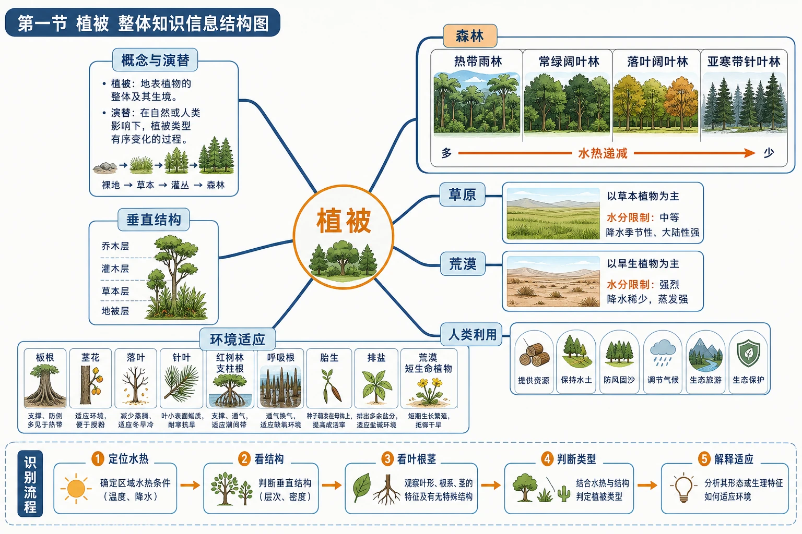
<!-- 图片描述：本节整体知识信息结构图，以“植被”为中心，第一层分出概念与演替、垂直结构、森林、草原、荒漠、环境适应和人类利用。森林分支按热带雨林—常绿阔叶林—落叶阔叶林—亚寒带针叶林排列并标水热递减；草原荒漠分支突出水分限制；适应分支连接板根、茎花、落叶、针叶、红树林支柱根呼吸根胎生排盐和荒漠短生命植物。底部给出识别流程“定位水热—看结构—看叶根茎—判断类型—解释适应”。 图面结构：纵向或剖面区表现高度、深度、垂直分层和物质/能量变化。视频讲解顺序：沿剖面或垂直方向讲层次、深度、物质和能量变化；沿箭头说明物质、能量、泥沙、养分、风险或管理措施的流向。讲解重点：植被图要按热量—水分—群落结构—生态功能读，不能只背名称；土壤剖面图要自上而下说明土层、物质迁移、生物作用和农业利用；箭头方向必须说明起点、中间环节、终点及其因果关系。学习落点：用“环境条件—结构特征—物质循环或形成过程—生态/生产功能—保护措施”复述本图。 -->

## 知识关系导航

- 所属章节：[[章首 学习导图|第五章 植被与土壤]]。
- 前置联系：水热条件来自气候系统，水分循环可联系[[第一节 水循环|水循环]]。
- 后续联系：植被通过有机质和生物循环促进[[第二节 土壤|土壤形成]]，土壤又为植被提供水肥。
- 方法迁移：植被调查中的“整体—类型—个体—环境”观察顺序可参考[[第二节 地貌的观察|地貌观察方法]]。

## 本节学习目标

1. 区分植被、植物、天然植被和人工植被，理解植被演替与环境改造。
2. 解释森林垂直分层以及水热条件与植被高度、物种数量的关系。
3. 比较四类森林、两类草原和荒漠植被的分布、景观与生态特征。
4. 根据叶片、根系、物候和群落结构判断植物适应的环境压力。
5. 分析红树林支柱根、呼吸根、胎生和排盐结构的适应性及生态意义。
6. 完成校园树木调查，提出因地制宜的绿化方案。

## 核心知识点讲解

### 一、区域定位与地理情境

智利北部沙漠平时极端干旱，地表植被稀疏；2017年出现罕见丰沛降雨后，休眠种子迅速萌发、开花和结籽，形成短暂花海。这说明景观看似“无植物”的荒漠，土壤中仍可能存在种子库；降水脉冲一旦满足条件，短生命植物可快速完成生活史。

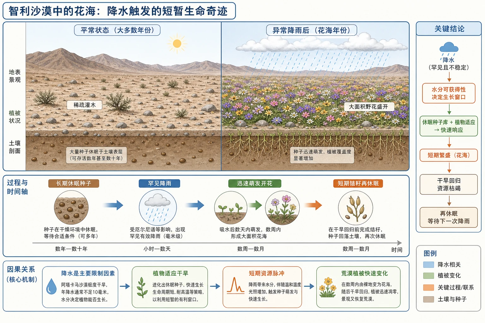
<!-- 图片描述：对应源文图5.1“智利沙漠中的花海”。同一区域左右对照：平常为裸露荒漠和稀疏灌木，异常降雨后地表形成大面积野花；时间轴标出“长期休眠种子—罕见降雨—迅速萌发开花—短期结籽再休眠”，蓝色表示降水，绿色和紫色表示植被响应。 图面结构：横向轴线表示时间、空间推进、演化阶段或由上游到下游的顺序。视频讲解顺序：沿横向轴由左向右读演化或空间推进。讲解重点：植被图要按热量—水分—群落结构—生态功能读，不能只背名称；土壤剖面图要自上而下说明土层、物质迁移、生物作用和农业利用。学习落点：用“环境条件—结构特征—物质循环或形成过程—生态/生产功能—保护措施”复述本图。 -->

类似现象也可能出现在其他具有种子库、降水高度不稳定的沙漠，但是否出现以及规模大小取决于降水量、持续时间、温度、土壤和种子条件。

### 二、核心概念与地理要素

#### 1. 植被与演替

植被是自然界在一定地方成群生长的各种植物的整体。天然植被由自然过程形成，如森林、草原和荒漠；人工植被由人类栽培经营，如经济林、人工草场和城市绿地。

新裸地最初只有少数先锋植物。它们生长后增加有机质、改善土壤结构和水分条件，为更多植物创造环境；植物之间又发生竞争和替代，经过很长时间形成相对稳定群落。这一过程可理解为植被演替。

演替并非一直朝“森林”发展。最终类型受当地气候、土壤、地形、干扰频率和种源限制；干旱地区的稳定植被可能就是草原或荒漠。

#### 2. 森林垂直结构

稳定森林中不同植物争夺光照，占据不同高度，形成乔木层、灌木层、草本层等。自林冠向地面光照减弱，耐阴能力不同的植物分层分布。

一般而言，气温越高、降水越多，植物生长季越长，植被高度、物种数量和垂直结构往往越丰富；但土壤、台风、火灾和人类干扰也会修正这种关系。

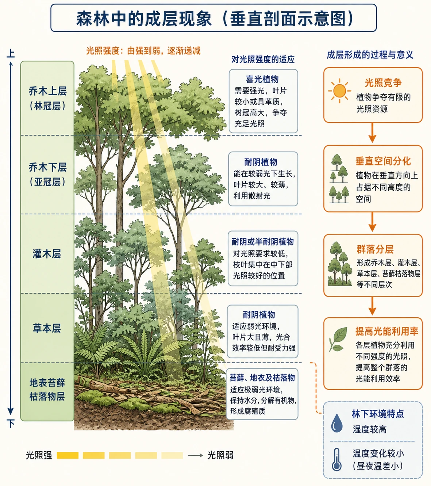
<!-- 图片描述：对应源文图5.2“森林中的成层现象”。森林剖面从上到下标出乔木上层、乔木下层、灌木层、草本层和地表苔藓枯落物；黄色光线由林冠向地面递减，植物旁标适应光照强度。右侧用箭头概括“光照竞争→垂直空间分化→群落成层”。 图面结构：右侧一般为输出结果、应用、风险或治理措施；纵向或剖面区表现高度、深度、垂直分层和物质/能量变化。视频讲解顺序：沿剖面或垂直方向讲层次、深度、物质和能量变化；沿箭头说明物质、能量、泥沙、养分、风险或管理措施的流向。讲解重点：植被图要按热量—水分—群落结构—生态功能读，不能只背名称；土壤剖面图要自上而下说明土层、物质迁移、生物作用和农业利用；箭头方向必须说明起点、中间环节、终点及其因果关系。学习落点：用“环境条件—结构特征—物质循环或形成过程—生态/生产功能—保护措施”复述本图。 -->

#### 3. 四类森林

| 类型 | 主要分布与气候 | 景观和适应特征 |
|---|---|---|
| 热带雨林 | 热带雨林、热带季风气候的高温多雨区 | 常绿深绿、种类丰富、层次复杂，藤本附生多，常见茎花和板根 |
| 常绿阔叶林 | 亚热带季风和亚热带湿润气候区 | 夏季炎热多雨、冬季温和，革质阔叶常绿，层次较雨林简单 |
| 落叶阔叶林 | 温带季风和温带海洋性气候区 | 宽阔叶片，春夏生长、秋冬落叶，以落叶减少寒季水分和能量消耗 |
| 亚寒带针叶林 | 亚欧和北美亚寒带 | 冬季漫长严寒，松杉为主，针叶面积小、蜡质层等有利抗寒抗旱 |

热带雨林中的板根可增强高大树木在浅层土壤中的支撑；茎花让花果生长在树干或粗枝上，便于林下动物传粉、传播，也与复杂冠层环境有关。

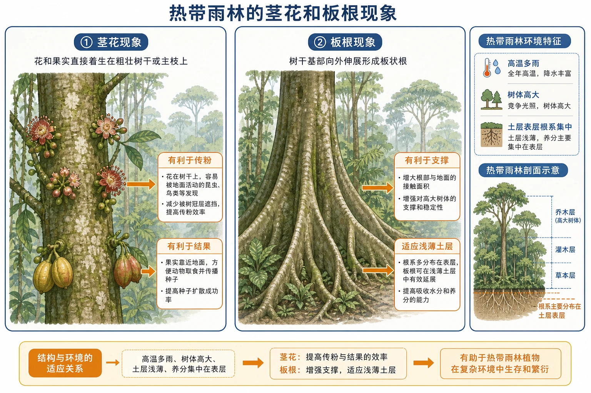
<!-- 图片描述：对应源文图5.3“热带雨林的茎花和板根现象”。双面板分别展示花果直接着生于粗壮树干的茎花、树干基部向外伸展的板状根；背景保留多层雨林，标注“高温多雨、树体高大、土层表层根系集中”，解释板根支撑和茎花的生态适应。 图面结构：由主体、空间位置、过程箭头和结论框组成学习型图解。视频讲解顺序：先看标题和主体；再读结构、方向和关键标注；最后概括地理规律或管理结论。讲解重点：植被图要按热量—水分—群落结构—生态功能读，不能只背名称；土壤剖面图要自上而下说明土层、物质迁移、生物作用和农业利用。学习落点：用“环境条件—结构特征—物质循环或形成过程—生态/生产功能—保护措施”复述本图。 -->

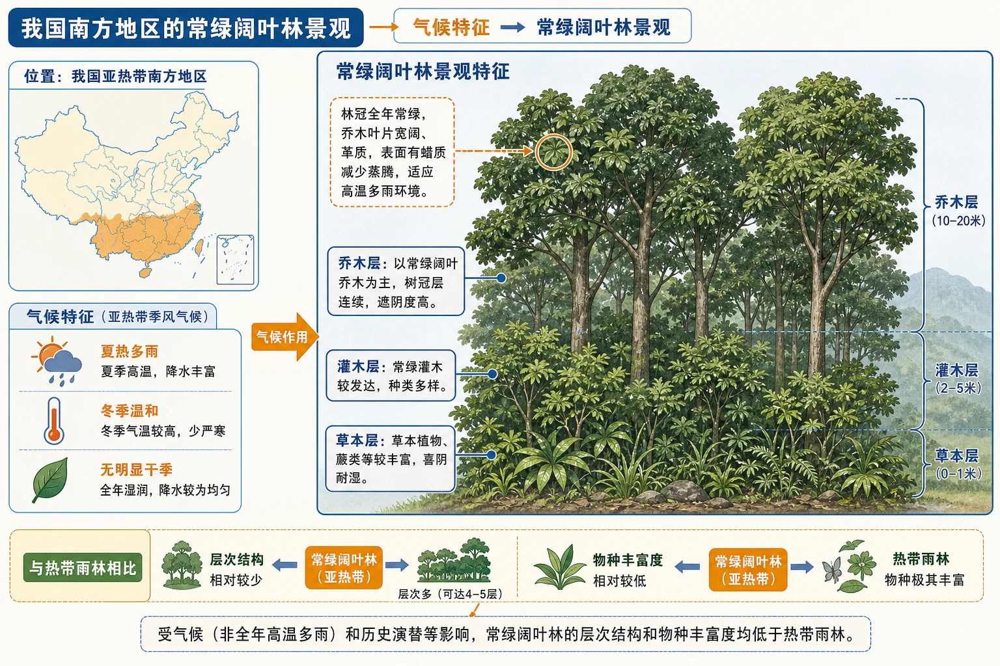
<!-- 图片描述：对应源文图5.4“我国南方地区的常绿阔叶林景观”。林冠全年绿色，乔木叶片宽阔且革质，林下灌草层较清楚；区域小地图定位我国亚热带南方，气候条标“夏热多雨、冬季温和、无明显干季”，用于与热带雨林比较。 图面结构：地图/俯视区用于定位区域、流向、分布和空间邻接关系。视频讲解顺序：随后定位区域、方向、上下游/内外海或空间邻接关系。讲解重点：植被图要按热量—水分—群落结构—生态功能读，不能只背名称；土壤剖面图要自上而下说明土层、物质迁移、生物作用和农业利用。学习落点：用“环境条件—结构特征—物质循环或形成过程—生态/生产功能—保护措施”复述本图。 -->

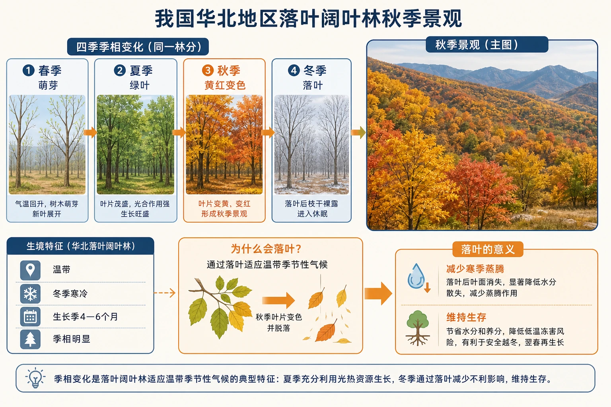
<!-- 图片描述：对应源文图5.5“我国华北地区落叶阔叶林秋季景观”。同一林分用春夏绿叶、秋季变色、冬季落叶四季小图呈现，主图为秋季黄红色阔叶林；标注“温带、冬季寒冷、生长季4—6个月、季相明显”。 图面结构：由主体、空间位置、过程箭头和结论框组成学习型图解。视频讲解顺序：先看标题和主体；再读结构、方向和关键标注；最后概括地理规律或管理结论。讲解重点：植被图要按热量—水分—群落结构—生态功能读，不能只背名称；土壤剖面图要自上而下说明土层、物质迁移、生物作用和农业利用。学习落点：用“环境条件—结构特征—物质循环或形成过程—生态/生产功能—保护措施”复述本图。 -->

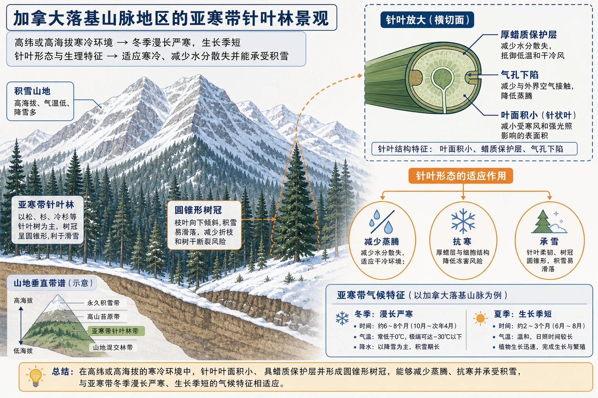
<!-- 图片描述：对应源文图5.6“加拿大落基山脉地区的亚寒带针叶林景观”。高纬或高海拔寒冷环境中松杉类树冠呈圆锥状、叶片针形，背景为积雪山地；放大针叶截面标出叶面积小和蜡质保护，连接到抗寒、减少蒸腾和承雪。 图面结构：由主体、空间位置、过程箭头和结论框组成学习型图解。视频讲解顺序：先看标题和主体；再读结构、方向和关键标注；最后概括地理规律或管理结论。讲解重点：植被图要按热量—水分—群落结构—生态功能读，不能只背名称；土壤剖面图要自上而下说明土层、物质迁移、生物作用和农业利用。学习落点：用“环境条件—结构特征—物质循环或形成过程—生态/生产功能—保护措施”复述本图。 -->

#### 4. 草原

当水分不能满足森林连续生长时，形成以草本为主的草原。

- 热带草原：全年高温，干湿季明显；湿季草木繁茂，干季草类枯黄，常散生乔木或灌木。
- 温带草原：夏季温暖、冬季寒冷，气候较干；植被夏绿冬枯，草本高度一般低于热带草原，灌木较矮小。

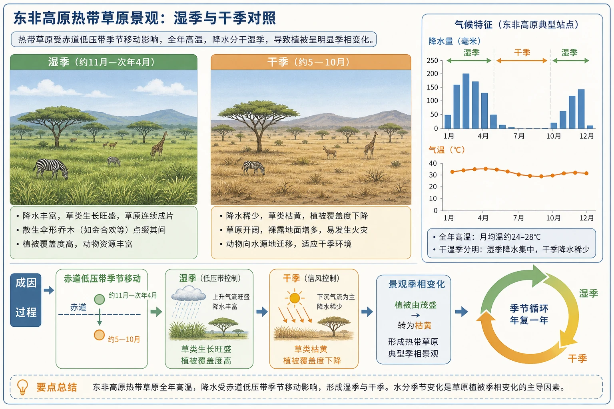
<!-- 图片描述：对应源文图5.8“东非高原热带草原景观”。湿季与干季对照面板中，连续高草、散生伞形乔木和大型动物位于开阔草原；降水柱状条显示全年高温但干湿季分明，绿色转黄展示明显季相。 图面结构：由主体、空间位置、过程箭头和结论框组成学习型图解。视频讲解顺序：先看标题和主体；再读结构、方向和关键标注；最后概括地理规律或管理结论。讲解重点：植被图要按热量—水分—群落结构—生态功能读，不能只背名称；土壤剖面图要自上而下说明土层、物质迁移、生物作用和农业利用。学习落点：用“环境条件—结构特征—物质循环或形成过程—生态/生产功能—保护措施”复述本图。 -->

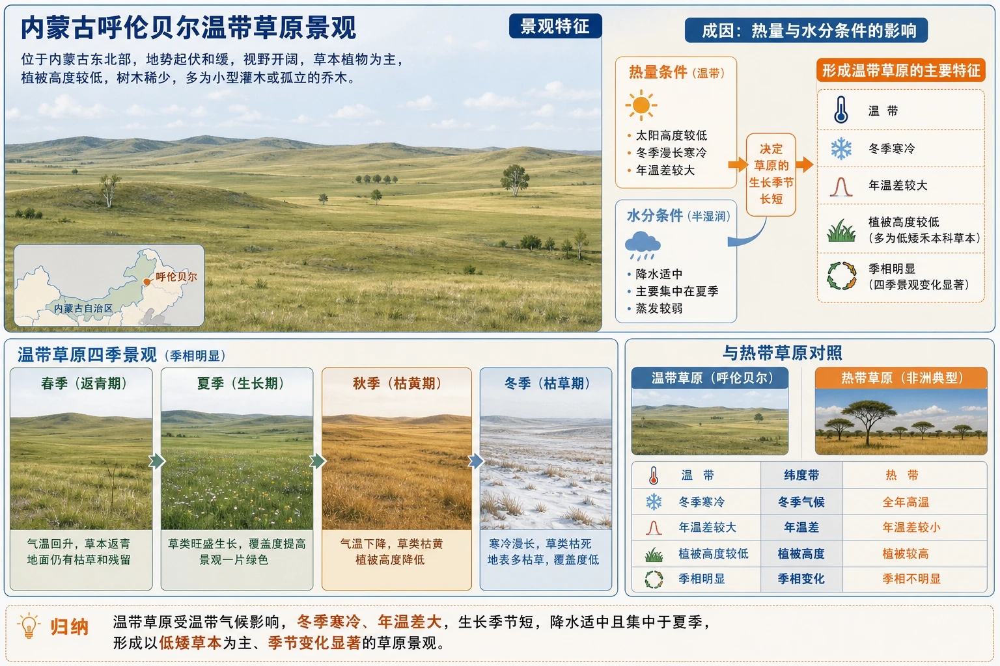
<!-- 图片描述：对应源文图5.9“内蒙古呼伦贝尔温带草原景观”。开阔连片的较低草本覆盖缓丘，树木稀少；四季条显示夏绿冬枯、冬季寒冷，和热带草原对照标出植被高度较低、年温差较大。 图面结构：由主体、空间位置、过程箭头和结论框组成学习型图解。视频讲解顺序：先看标题和主体；再读结构、方向和关键标注；最后概括地理规律或管理结论。讲解重点：植被图要按热量—水分—群落结构—生态功能读，不能只背名称；土壤剖面图要自上而下说明土层、物质迁移、生物作用和农业利用。学习落点：用“环境条件—结构特征—物质循环或形成过程—生态/生产功能—保护措施”复述本图。 -->

#### 5. 荒漠植被

荒漠分布在水分极少的热带和温带干旱区。植被稀疏，以旱生灌木为主，常通过小叶或退化叶、厚角质层、肉质茎叶、发达根系、休眠等减少失水和获取有限水分。

短生命植物并非典型长期耐旱结构，而是“避旱”：平时以种子休眠，降雨后迅速完成萌发生长、开花结实。

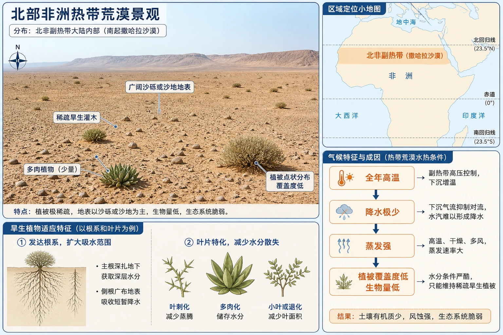
<!-- 图片描述：对应源文图5.10“北部非洲热带荒漠景观”。广阔沙砾地表植被极稀疏，少量旱生灌木或多肉植物点状分布；区域定位北非副热带，标出全年高温、降水极少、蒸发强和覆盖度低。 图面结构：由主体、空间位置、过程箭头和结论框组成学习型图解。视频讲解顺序：先看标题和主体；再读结构、方向和关键标注；最后概括地理规律或管理结论。讲解重点：植被图要按热量—水分—群落结构—生态功能读，不能只背名称；土壤剖面图要自上而下说明土层、物质迁移、生物作用和农业利用。学习落点：用“环境条件—结构特征—物质循环或形成过程—生态/生产功能—保护措施”复述本图。 -->

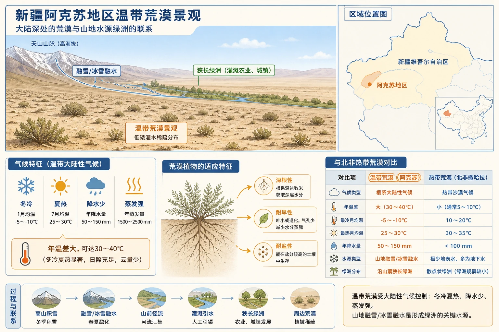
<!-- 图片描述：对应源文图5.11“新疆阿克苏地区温带荒漠景观”。荒漠背景下低矮灌木稀疏分布，远处可能见山地雪水补给形成的绿洲；标注温带大陆性气候、冬冷夏热、深根或耐盐旱特征，用于与热带荒漠比较。 图面结构：由主体、空间位置、过程箭头和结论框组成学习型图解。视频讲解顺序：先看标题和主体；再读结构、方向和关键标注；最后概括地理规律或管理结论。讲解重点：植被图要按热量—水分—群落结构—生态功能读，不能只背名称；土壤剖面图要自上而下说明土层、物质迁移、生物作用和农业利用。学习落点：用“环境条件—结构特征—物质循环或形成过程—生态/生产功能—保护措施”复述本图。 -->

#### 6. 红树林

红树林主要分布在热带、亚热带淤泥深厚的潮间带和河口、海湾。这里软泥缺氧、潮汐淹没、盐分较高、波浪水流扰动，植物形成特殊适应：

- 支柱根和板状根：在松软淤泥中增强支撑，并抵抗潮流和风浪。
- 呼吸根：凸出泥面，皮孔和通气组织帮助根系在缺氧土壤中获得、储存空气。
- 胎生：种子仍在母树果实中萌发形成胚轴，落下后能快速插入淤泥；也可漂浮传播。
- 排盐腺体等：调节体内盐分，适应高盐环境。

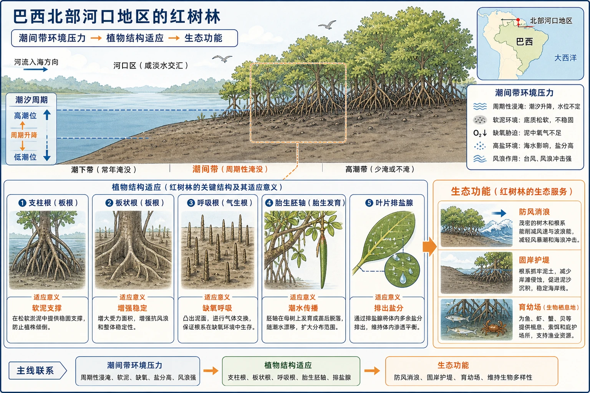
<!-- 图片描述：对应源文图5.7“巴西北部河口地区的红树林”。潮间带剖面显示红树林位于河口淤泥岸，潮位周期升降；局部放大支柱根、板状根、凸出泥面的呼吸根、母树上的胎生胚轴和叶片排盐腺。每种结构用箭头连接“软泥支撑、缺氧通气、潮水传播、高盐调节”等环境压力。 图面结构：纵向或剖面区表现高度、深度、垂直分层和物质/能量变化。视频讲解顺序：沿剖面或垂直方向讲层次、深度、物质和能量变化；沿箭头说明物质、能量、泥沙、养分、风险或管理措施的流向。讲解重点：植被图要按热量—水分—群落结构—生态功能读，不能只背名称；土壤剖面图要自上而下说明土层、物质迁移、生物作用和农业利用；箭头方向必须说明起点、中间环节、终点及其因果关系。学习落点：用“环境条件—结构特征—物质循环或形成过程—生态/生产功能—保护措施”复述本图。 -->

### 三、过程机制与成因链条

#### 1. 水热决定植被基本格局

热量决定生长期和代谢速度，水分决定植物能否维持蒸腾和生长。水热充足 → 森林高大、层次丰富；水分减少 → 乔木难以形成连续林冠、草本占优势；水分极少 → 植被稀疏、旱生和短生命策略占优势。

#### 2. 植被反作用于环境

植被截留降水、根系固土并增加下渗 → 减少地表径流与侵蚀；蒸腾和遮阴改变近地面温湿度；枯枝落叶和根系残体形成有机质 → 改善土壤；群落为动物和微生物提供栖息地。

因此植被既受环境控制，也改造环境。破坏植被可能触发土壤流失、水循环改变和生物多样性下降。

#### 3. 森林分层形成

光从林冠向下快速衰减 → 喜光树种占上层，耐阴树种和幼树居下层 → 灌木、草本和苔藓分别利用剩余光照与空间 → 形成多层结构。高温多雨使全年生长和物种共存机会增多，雨林层次最复杂。

#### 4. 本地树种与人工绿化

本地树种长期适应当地温度、降水、土壤和生物关系，通常成活率高、养护需求较低。引进树种不一定不好，但需评估气候适应、病虫害、需水量和入侵风险。高质量绿化还需要多树种、乔灌草结合和较少硬化地表。

### 四、空间分布、图表判读与证据

#### 1. 植被景观判读

1. 先定位纬度、海陆和气候。
2. 看植被覆盖度、高度与连续性。
3. 看乔木、灌木、草本组成和垂直层次。
4. 看叶、根、茎、季相等适应特征。
5. 由特征反推水热和土壤，再判断植被类型。

#### 2. 四类森林比较证据

雨林与常绿阔叶林都常绿，区分要看层次、种类、藤本附生、板根茎花；落叶阔叶林季相明显；针叶林针形叶和树冠形态突出。照片的拍摄季节会影响颜色，不能只凭“绿或黄”判断。

#### 3. 草原荒漠比较证据

草原有较连续草本覆盖，荒漠植被呈点状稀疏分布、裸地比例大。热带草原全年热但干湿季明显，温带草原冬冷；荒漠中的绿洲或雨后花海不能代表整个区域水分充足。

#### 4. 校园树木调查

教材要求按固定路线给树木编号，记录名称、生长状况和栽种地点；统计数量，查询各树种所需气温、湿度、光照和土壤条件；与当地环境比较，区分当地和引进树种，并解释引进树种长势。

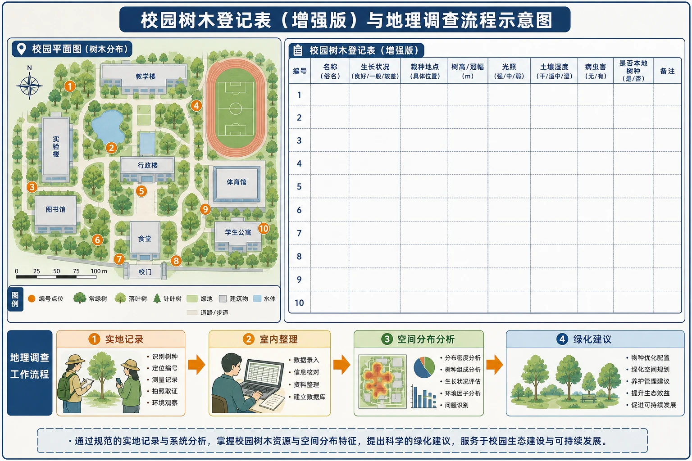
<!-- 图片描述：对应源文表5.1“校园树木登记表”的增强版信息图。表格保留编号、名称、生长状况、栽种地点，并补充树高冠幅、光照、土壤湿度、病虫害和是否本地树种；校园平面图上用编号点位对应表格，箭头表示“实地记录—室内统计—环境匹配—绿化建议”。 图面结构：表格或并列卡片按相同指标比较，适合讲共同点、差异和适用条件。视频讲解顺序：沿箭头说明物质、能量、泥沙、养分、风险或管理措施的流向；最后用统一指标归纳不同对象的共同点、差异和结论。讲解重点：植被图要按热量—水分—群落结构—生态功能读，不能只背名称；土壤剖面图要自上而下说明土层、物质迁移、生物作用和农业利用；箭头方向必须说明起点、中间环节、终点及其因果关系。学习落点：用“环境条件—结构特征—物质循环或形成过程—生态/生产功能—保护措施”复述本图。 -->

### 五、人地关系、影响与对策

#### 1. 红树林的生态意义

- 密集根系消浪缓流、固岸促淤，减轻风暴潮和海岸侵蚀。
- 为鱼虾、鸟类和底栖生物提供栖息、繁殖和育幼场所。
- 截留部分陆源泥沙和污染物，改善近岸环境，但不能无限承受污染。
- 固定并储存大量碳，具有气候调节价值。

#### 2. 城市绿化

皇城根遗址公园的经验：使用本地树种，多树种混栽，乔灌草结合形成垂直层次，保持较高绿化率和地表覆盖度。这有助于提高稳定性、减少病虫害单一传播、改善小气候并增加雨水下渗。

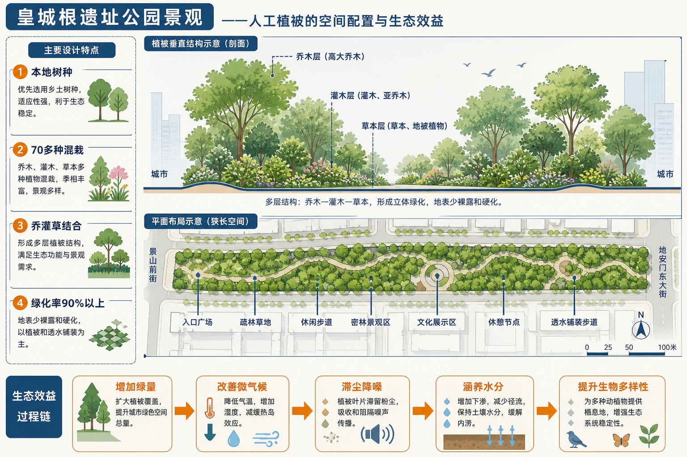
<!-- 图片描述：对应源文图5.12“皇城根遗址公园景观”。狭长城市公园中乔木、灌木和草本形成多层结构，地表少裸露和硬化；侧栏列出“本地树种、70多种混栽、乔灌草结合、绿化率90%以上”四项设计，并用生态效益箭头连接降温、滞尘、生物多样性和雨水下渗。 图面结构：由主体、空间位置、过程箭头和结论框组成学习型图解。视频讲解顺序：沿箭头说明物质、能量、泥沙、养分、风险或管理措施的流向。讲解重点：植被图要按热量—水分—群落结构—生态功能读，不能只背名称；土壤剖面图要自上而下说明土层、物质迁移、生物作用和农业利用；箭头方向必须说明起点、中间环节、终点及其因果关系；案例要按“区域背景—关键证据—机制解释—影响/效益—限制或对策”讲完。学习落点：用“环境条件—结构特征—物质循环或形成过程—生态/生产功能—保护措施”复述本图。 -->

#### 3. 天然植被保护

植被恢复应优先保护原生群落和本地物种，控制砍伐、过牧和不合理开垦。人工造林要“适地适树”，在干旱区盲目种植高耗水乔木可能降低地下水、造成新的生态问题。

### 六、综合题型与迁移应用

#### 1. 植物适应性题

答题必须建立对应：

> 环境压力 → 植物形态或生理特征 → 该特征的功能 → 提高生存繁殖机会。

例如红树林“呼吸根凸出泥面”不能只写“适应环境”，要写“潮间带淤泥缺氧—皮孔和通气组织获得并储存空气—保障地下根系呼吸”。

#### 2. 植被类型比较题

统一从分布气候、群落高度、垂直结构、叶片季相、代表适应和生态功能比较，避免一类写气候、另一类写物种。

#### 3. 植被异常现象

遇到沙漠花海、城市外来树种长势差等材料，先找触发条件或限制因子：降水脉冲、温度、种子库、土壤、水分、病虫害和养护管理，再构建因果链。

## 重点梳理

- 植被是一定区域成群生长的植物整体，分天然和人工。
- 演替中植物既适应又改造环境，形成稳定群落需要较长时间。
- 水热越充足，植被通常越高、物种越多、垂直结构越复杂。
- 森林由热到冷：雨林—常绿阔叶林—落叶阔叶林—亚寒带针叶林。
- 水分由多到少：森林—草原—荒漠。
- 识别植物适应要写“环境压力—结构功能”的对应关系。

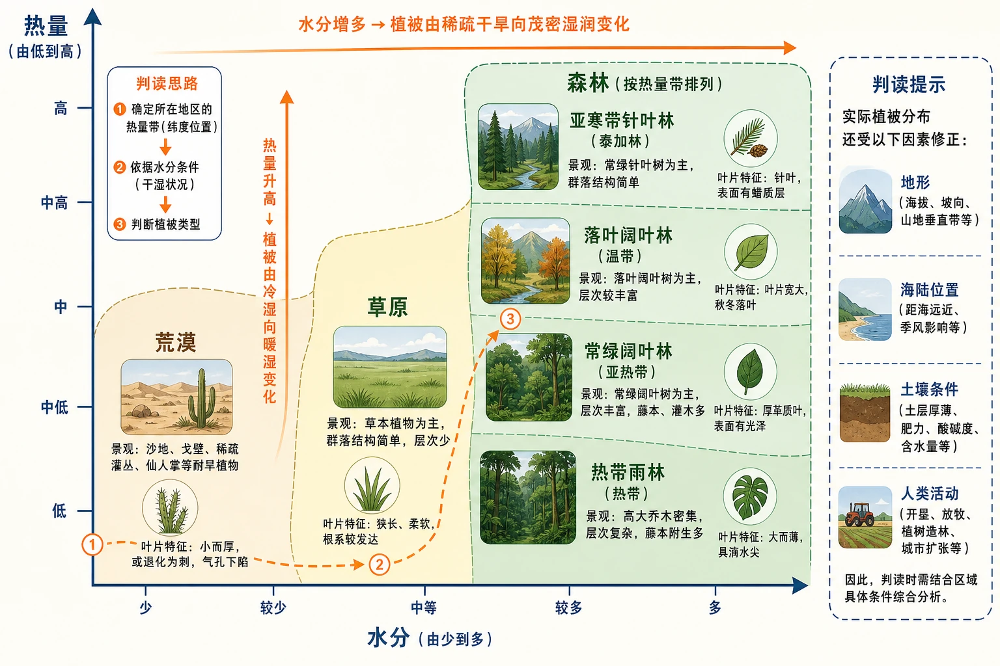
<!-- 图片描述：植被类型二维判读图，横轴为水分由少到多，纵轴为热量由低到高；森林、草原、荒漠占据不同区域，四类森林按热量带排列。每个区域附代表景观、叶片或群落结构小图，边缘用虚线提示实际分布还受地形和人类活动修正。 图面结构：由主体、空间位置、过程箭头和结论框组成学习型图解。视频讲解顺序：先看标题和主体；再读结构、方向和关键标注；最后概括地理规律或管理结论。讲解重点：植被图要按热量—水分—群落结构—生态功能读，不能只背名称；土壤剖面图要自上而下说明土层、物质迁移、生物作用和农业利用。学习落点：用“环境条件—结构特征—物质循环或形成过程—生态/生产功能—保护措施”复述本图。 -->

## 难点突破

### 1. 植被能否准确指示气候

天然植被可反映长期综合环境，但人工灌溉、城市养护、火灾和砍伐会造成偏离。判断时先确认植被是天然还是人工，并看是否受局地地形和水源影响。

### 2. 常绿不等于热带雨林

亚热带常绿阔叶林也全年常绿。雨林的关键是全年高温多雨、物种极丰富、层次复杂、藤本附生多和茎花板根明显。

### 3. 针叶为什么既抗寒又抗旱

寒冷环境中土壤水冻结，植物会面临“生理干旱”。针形叶面积小、角质层厚，可减少蒸腾；圆锥形树冠还有利于承受积雪。

### 4. 荒漠植物的两类策略

耐旱植物通过结构和生理承受长期缺水；短生命植物通过长期休眠、雨后迅速繁殖来避开干旱。二者不能混为一种策略。

### 5. 本地树种并非唯一标准

本地树种通常适应性好，但校园绿化仍要考虑功能、空间、过敏性、根系对建筑影响和病虫害。引进树种经过风险评估且不具入侵性，也可合理使用。

## 例题讲解

### 例1 智利沙漠为什么雨后出现花海

沙漠土壤中保存了大量处于休眠状态的种子；罕见丰沛降雨提供萌发所需水分，适宜温度使植物迅速生长、开花结实。短生命植物在短湿润期完成生命周期，干旱恢复后又以种子状态等待下一次降雨。其他有种子库且偶发有效降水的沙漠也可能出现。

### 例2 教材活动：红树林适应性

1. 支柱根、板状根：适应松软淤泥和潮水扰动，支撑树体、固着岸滩。
2. 呼吸根：适应淤泥长期淹水缺氧，通过皮孔和通气组织供根系呼吸。
3. 胎生和漂浮胚轴：适应潮间带落种窗口短、潮水搬运强，落地可迅速扎根，也能远距离传播。
4. 排盐腺体：调节盐分，适应海水和咸淡水环境。

红树林还能固岸消浪、促淤、提供生境、净化部分污染物和储碳。

### 例3 教材活动：校园树木调查

**步骤**：规划路线并编号 → 记录树种、地点和长势 → 查询树种水热土壤需求 → 收集当地环境资料 → 比较匹配程度 → 区分当地与引进树种 → 分析长势差异 → 提出本地树种优先、多样混栽、乔灌草结合和减少硬化的建议。

### 例4 四类森林比较

若材料描述“冬季寒冷持续3—4个月、乔木叶片宽阔、秋季落叶”，应判断为落叶阔叶林。逻辑是冬季低温使光合作用弱、土壤吸水受限，落叶可减少蒸腾和组织冻害；不能仅凭“阔叶”误判常绿阔叶林。

## 易错点整理

1. 把一棵树称为植被。植被是一定区域植物群落整体。
2. 认为植被演替必然最终成为森林。干旱、寒冷或频繁干扰区可能稳定为草原荒漠。
3. 认为层次越多完全由降水决定。热量、土壤、扰动和演替阶段也有影响。
4. 把热带草原干季理解为低温季。热带草原全年高温，季相主要随降水变化。
5. 认为荒漠无植物。仍有稀疏旱生植物、种子库和短生命植物。
6. 把红树林“胎生”理解为动物式胎生。是种子在未离开母树时萌发。
7. 只写植物特征，不对应环境压力和功能。
8. 城市绿化只追求树木数量，忽略物种多样、层次、土壤与养护成本。

## 考点考证点整理

### 考点一：植被类型与气候判读

- 出题思路：给景观、气候资料或植物特征，判断森林、草原或荒漠及具体类型。
- 关键条件：年内温度、降水总量与季节分配，植被覆盖、层次、叶片和季相。
- 解答要点：先定位水热，再用群落形态验证；写出气候—植被因果关系。
- 易扣分点：只凭一项特征；把人工植被当作天然气候指示。

### 考点二：森林垂直结构

- 出题思路：给森林剖面或物种高度，解释分层及不同气候森林差异。
- 关键条件：林冠光照递减、植物喜光耐阴差异、水热和生长期。
- 解答要点：光照竞争造成垂直空间分化；水热越充足通常种类和层次越丰富。
- 易扣分点：把分层解释为土壤分层；漏写植物竞争和光照梯度。

### 考点三：植物环境适应

- 出题思路：以红树林、雨林板根、针叶或旱生植物为材料解释结构功能。
- 关键条件：软泥、缺氧、高盐、寒冷、干旱或强风等具体压力。
- 解答要点：逐一写“环境—结构—功能”；多个结构不能合并成一句空泛表述。
- 易扣分点：只答“适应性强”；把支柱根与呼吸根功能混淆。

### 考点四：植被与环境相互作用

- 出题思路：分析退化、恢复或造林对水土、气候和生态系统的影响。
- 关键条件：截留、下渗、蒸腾、根系固土、枯落物和生物多样性。
- 解答要点：环境控制植被分布；植被通过水循环、土壤和生境反作用于环境。
- 易扣分点：只写单向影响；认为造林在所有地区都有利。

### 考点五：校园绿化调查与评价

- 出题思路：提供校园树种名录和长势，要求调查、解释或提出建议。
- 关键条件：本地气候土壤、树种需求、栽种位置、长势与养护投入。
- 解答要点：实地记录—统计—环境匹配—本地与引进分类—提出多样化、分层和适地建议。
- 易扣分点：没有数据支持；只推荐“名贵好看”树种；忽视入侵和病虫害风险。

## 练习题

### 1. 教材情境：沙漠花海

智利北部沙漠在罕见丰沛降雨后出现花海。解释原因，并判断其他沙漠是否可能出现类似现象。

### 2. 教材活动：校园树木调查

设计校园树木调查流程，并提出四条因地制宜绿化建议。

### 3. 教材活动：红树林

分别说明红树林支柱根、呼吸根、胎生胚轴和排盐腺体适应的环境条件，并说明红树林的海岸生态意义。

### 4. 类型比较

比较热带雨林和亚热带常绿阔叶林的气候、垂直结构和典型生态特征。

### 5. 图像判读

某植被区全年高温，湿季草木葱绿、干季草类枯黄，乔木散生。判断类型并解释季相变化。

### 6. 综合评价

某干旱城市计划大规模引进南方高大常绿乔木建设城市森林。评价该方案并提出替代思路。

## 练习题答案

### 1. 教材情境：沙漠花海

土壤中存在长期休眠的短生命植物种子，异常降水满足萌发和生长的水分条件，植物迅速完成开花结实。其他沙漠若有种子库、降水量与持续时间达到阈值且温度土壤适宜，也可能出现，但频率和规模因地区而异。

### 2. 教材活动：校园树木调查

按路线编号并记录树种、长势、地点和光照土壤；室内识别树种、统计数量；查询各树种环境需求并收集当地水热土壤资料；比较匹配度，分析引进树种长势；形成报告。建议优先本地适生树种，多树种混栽，乔灌草结合，减少裸地和不透水铺装；同时控制高耗水和入侵风险，按空间功能选择树种并开展长期养护监测。

### 3. 教材活动：红树林

支柱根和板状根适应松软淤泥与潮流扰动，支撑树体并固岸；呼吸根适应长期淹水、泥土缺氧，通过皮孔和通气组织供氧；胎生胚轴落入淤泥后快速扎根或随潮水漂浮传播；排盐结构适应盐度较高环境。红树林可消浪固岸、促淤护滩，为鱼虾鸟类提供生境，截留部分污染物并储碳。

### 4. 类型比较

热带雨林区终年高温多雨，植物全年旺盛生长，种类极丰富、垂直结构复杂，藤本和附生植物多，板根和茎花常见。常绿阔叶林位于亚热带湿润区，夏季炎热多雨、冬季温和，乔木多革质阔叶且常绿，但层次和物种丰富度低于雨林，藤本附生较少，板根茎花少见。

### 5. 图像判读

属于热带草原。全年高温但降水季节变化大，湿季水分充足、草木生长旺盛；干季持续4—6个月、降水稀少，草类枯黄，连续森林难以维持，故形成草本为主、乔木散生的景观。

### 6. 综合评价

方案可能不适宜。南方常绿乔木需水量和养护需求可能较高，与干旱城市水资源和冬季温度不匹配，易出现长势差、灌溉耗水大和病虫害风险。应选择本地耐旱、耐寒树种，以乡土灌草为主体、乔灌草结合，依据水源分区控制绿化密度；利用再生水和雨水，增加物种多样性并避免单一树种大面积种植。
