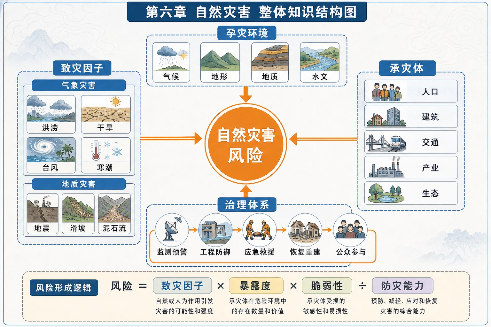

# 第六章 自然灾害·学习导图

<!-- 图片描述：第六章整体知识结构图。中心为“自然灾害风险”，左侧致灾因子分气象灾害洪涝干旱台风寒潮和地质灾害地震滑坡泥石流；上方孕灾环境连接气候、地形、地质、水文；右侧承灾体连接人口、建筑、交通、产业和生态；下方治理链依次为监测预警、防御准备、救援救助、灾后恢复，并用RS、GNSS、GIS三种技术贯穿灾前灾中灾后。外围以箭头表示灾害链和次生灾害。 图面结构：中心主题先给出本图要解决的核心问题，周围分支是条件、过程、影响或措施；左右两侧分别承担原因—结果、自然—人类、灾前—灾后或两种情境对照；上下分层显示结构/条件与机制/数据/结论的递进。视频讲解顺序：再讲中心主题，说明这张图试图回答什么问题；按左到右或左右对照讲条件、过程、影响与措施；沿箭头说明物质、能量、泥沙、养分、风险或管理措施的流向。讲解重点：灾害图要区分致灾因子、孕灾环境、承灾体、灾情和防灾能力；地图/时间线/流程图要讲清灾害链、风险差异和对应治理行动；箭头方向必须说明起点、中间环节、终点及其因果关系。学习落点：用“致灾因子/风险来源—空间或时间过程—承灾体与灾情—监测防御/救援恢复”复述本图。 -->

## 一、核心概念

自然环境的异常变化只有对人类生命、财产、资源或环境造成损害时，才构成自然灾害。灾害严重程度不只由自然现象强弱决定，还取决于人口资产暴露、承灾体脆弱性和防灾能力。

可用框架理解：

> 灾害风险 = 致灾因子的危险性 × 承灾体暴露度 × 脆弱性 ÷ 防灾减灾能力。

这是概念表达，不是教材要求的精确计算公式，作用是提醒答题必须兼顾自然与社会因素。

## 二、章节结构

### 1. 气象灾害

- 洪涝：强或持续降水叠加低洼地形、河网汇水和高暴露度。
- 干旱：长时间降水偏少，演变为影响生产生活的旱灾。
- 台风：热带海洋强烈气旋，狂风、暴雨和风暴潮共同致灾。
- 寒潮：强冷空气快速南下，造成剧烈降温、大风、雨雪和冻害。

→ [[第一节 气象灾害|进入第一节]]

### 2. 地质灾害

- 地震：岩层应力积累超过限度后断裂错动，能量以地震波释放。
- 滑坡：斜坡岩土体沿滑动面整体下滑。
- 泥石流：陡峻沟谷中大量水、松散物质混合形成特殊洪流。
- 关联性：一种灾害可直接或间接引发多种次生灾害，形成灾害链。

→ [[第二节 地质灾害|进入第二节]]

### 3. 防灾减灾

“以防为主，防抗救相结合”，覆盖监测、防御、救援救助和灾后恢复；个人层面包括灾前准备、灾中自救互救和灾后防护。

→ [[第三节 防灾减灾|进入第三节]]

### 4. 地理信息技术

- 遥感RS：大范围、快速、动态地获取灾情影像。
- 全球卫星导航系统GNSS：定位、导航、测速、授时和短报文通信。
- 地理信息系统GIS：管理、查询、叠加分析并输出空间决策结果。

→ [[第四节 地理信息技术在防灾减灾中的应用|进入第四节]]

### 5. 问题研究

救灾物资储备库选址把灾害分布、交通时效、人口覆盖、仓储安全和区域服务能力进行空间综合评价。

→ [[章末问题研究 救灾物资储备库应该建在哪里|进入问题研究]]

## 三、灾害类型对比

| 灾害 | 形成关键 | 我国高风险区/时段 | 主要危害 |
|---|---|---|---|
| 洪涝 | 强降水、汇流、低洼 | 东部季风区河流中下游，夏季；山区山洪 | 淹没、设施破坏、疫情和次生地质灾害 |
| 干旱 | 长期降水少、需水大 | 华北最频繁严重，华南、西南、江淮也多发 | 减产、缺水、草场退化、火灾沙尘 |
| 台风 | 暖洋面强烈气旋 | 东南沿海，夏秋 | 狂风、暴雨、风暴潮和灾害链 |
| 寒潮 | 强冷空气快速南下 | 冬半年，大部地区 | 冻害、大风雨雪、交通电力受损 |
| 地震 | 断裂错动释放能量 | 台湾、西藏、新疆、青海、川滇等 | 建筑倒塌及滑坡、火灾、海啸等 |
| 滑坡泥石流 | 斜坡失稳；水土石混合流 | 山区，西南尤其多发 | 掩埋、冲毁、堵江和人员伤亡 |

## 四、防灾减灾时间链

1. 灾前：风险调查、监测预警、工程设防、规划避让、教育演练、物资储备。
2. 灾中：发布警报、应急响应、疏散避险、定位搜救、医疗和生活保障。
3. 灾后：卫生防疫、次生灾害监测、恢复基础设施、心理援助和韧性重建。

## 五、地理信息技术分工

| 问题 | 首要技术 | 说明 |
|---|---|---|
| 灾害在哪里、范围多大 | RS | 通过灾前灾后影像识别变化 |
| 人员或物资在哪里、怎么到达 | GNSS | 实时定位与导航 |
| 哪些村庄、道路处于危险区 | GIS | 叠加灾害范围、人口、道路等图层 |
| 综合预警如何形成 | RS＋GNSS＋GIS | 多源数据获取、定位和空间分析协同 |

## 六、综合题答题路径

> 定位区域和时间 → 判断灾害类型 → 提取致灾因子 → 分析地形地质水文等孕灾环境 → 识别人口资产暴露 → 说明直接、次生和长期影响 → 提出灾前灾中灾后措施 → 选择合适地理信息技术。

## 七、高频易混点

- 自然现象强不一定灾情重；无人区强震的人员损失可能小于城市中等强震。
- 干旱是自然现象，持续并影响生产生活才称旱灾。
- 一次地震只有一个震级，却可有多个烈度。
- 台风眼较平静不代表台风减弱，最强风雨常在眼墙附近。
- 滑坡是岩土体整体下滑，泥石流是含大量泥沙石块的流体。
- 地震预警不是地震预报，而是震后利用波速差抢在强震动到达前报警。
- RS负责“看”，GNSS负责“定位导航”，GIS负责“管理分析”。

## 八、复习建议

1. 为六类灾害分别制作“成因—分布—危害—措施”卡片。
2. 画出至少两条灾害链，如地震—滑坡—堰塞湖—洪水。
3. 熟记滑坡、泥石流、洪水和地震的正确避险方向。
4. 用同一灾害情境练习RS、GNSS、GIS的任务分工。
5. 最后以24小时初步救助为约束，完成救灾物资储备库选址评价。
