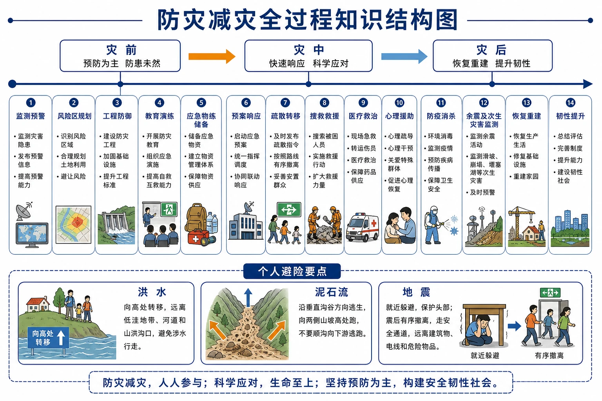
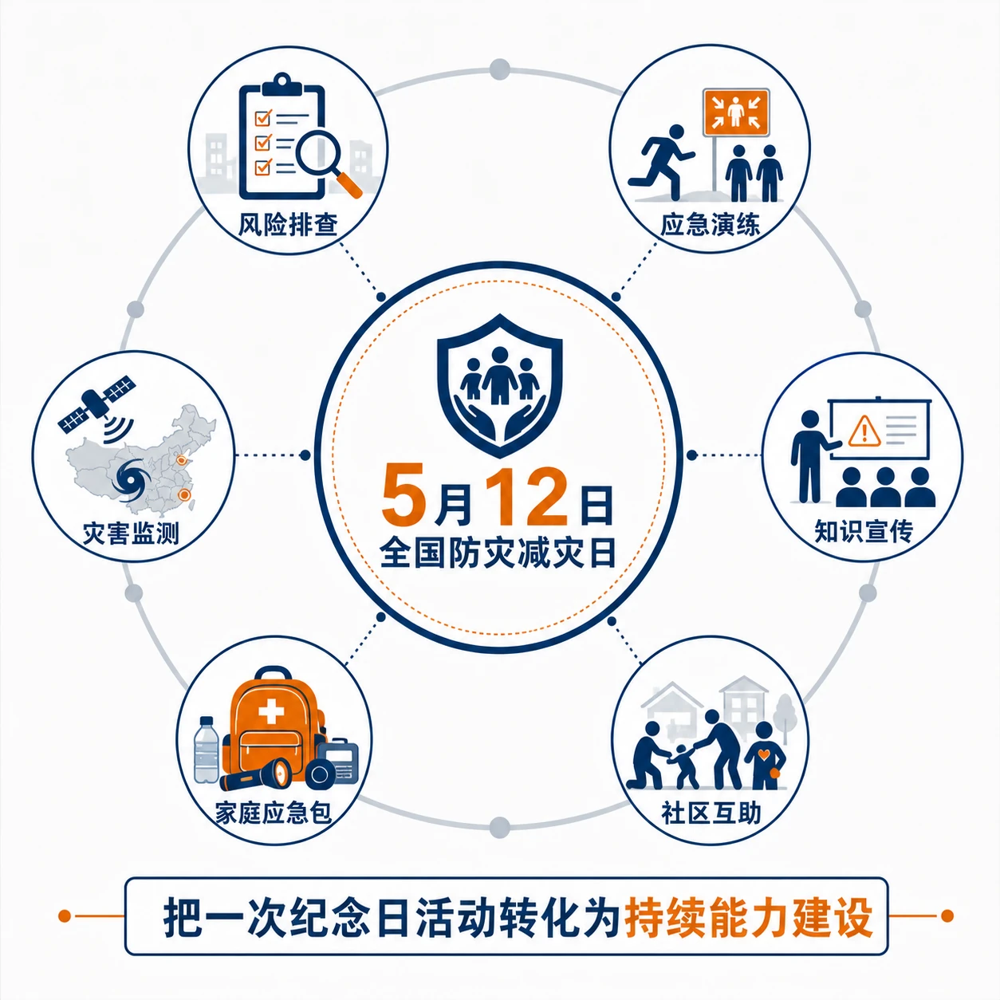
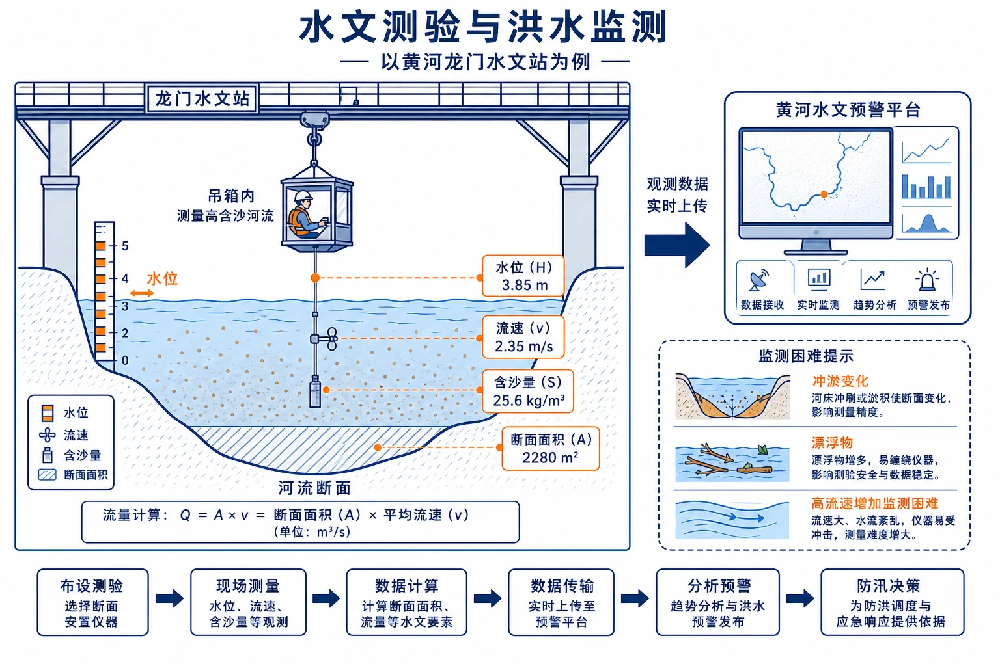
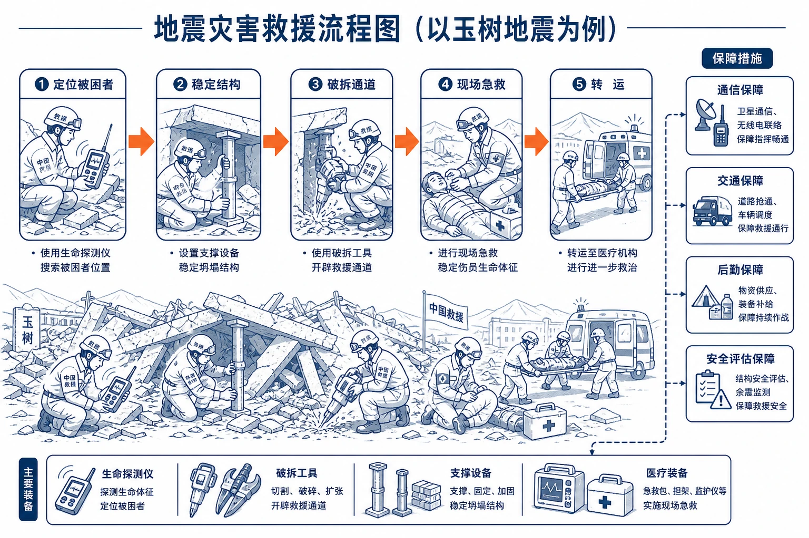
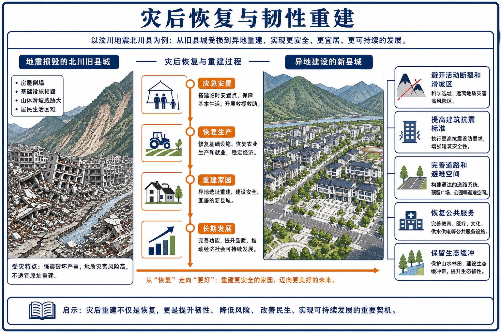
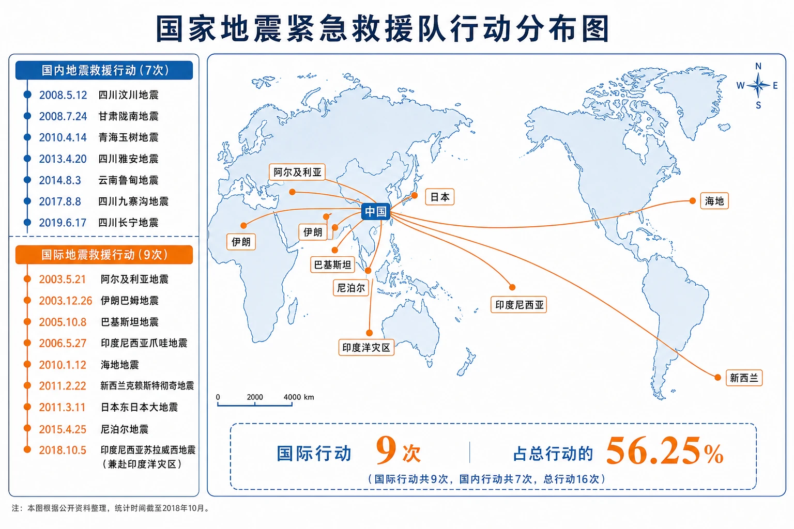
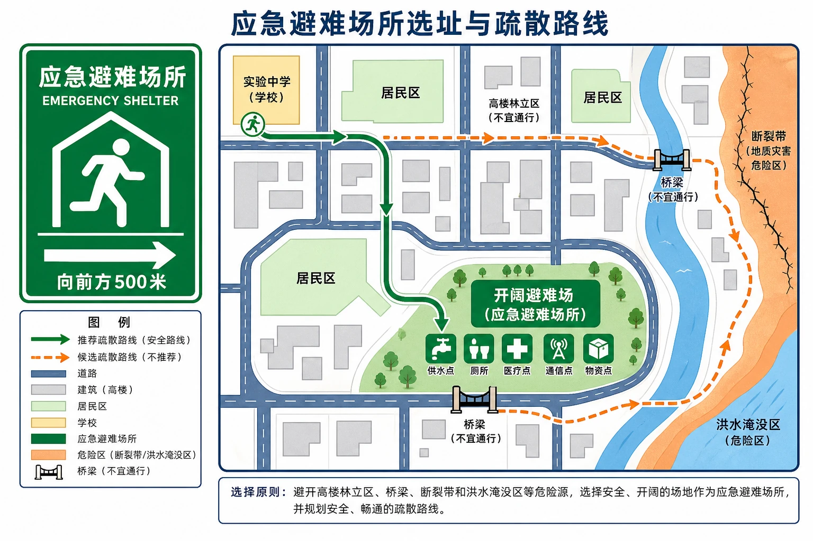
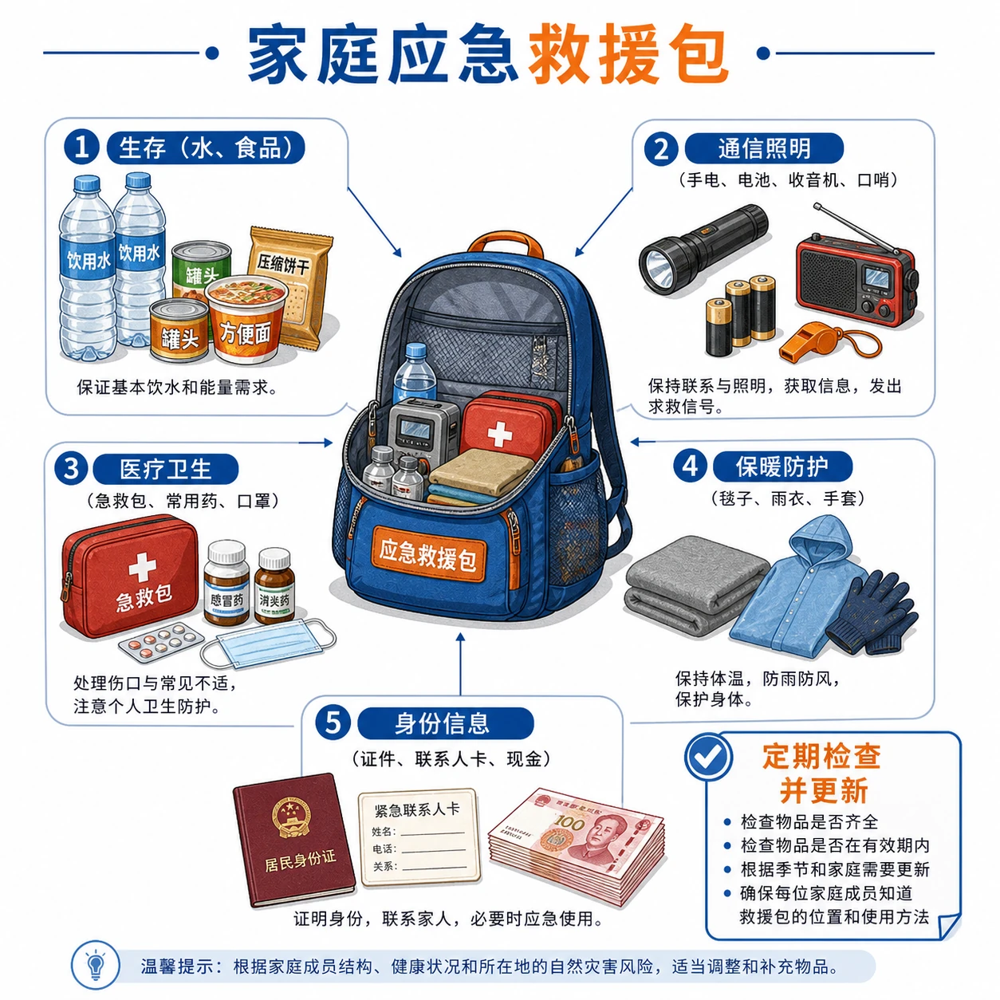
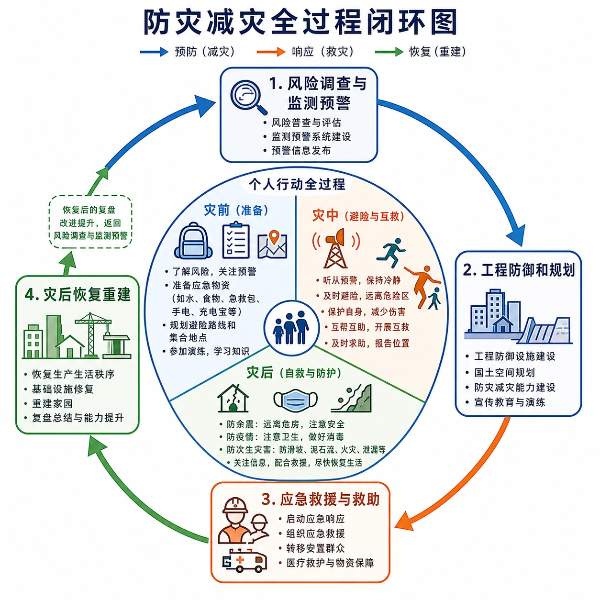

# 第三节 防灾减灾

<!-- 图片描述：本节整体知识信息结构图，以“防灾减灾”为中心，时间轴分灾前、灾中、灾后；灾前连接监测预警、风险规划、工程防御、教育演练和物资包，灾中连接预案响应、疏散、搜救、医疗和心理援助，灾后连接防疫、余震次生灾害监测、恢复和韧性重建；个人层面在下方列洪水向高处、泥石流垂直沟谷、地震就近避险后有序撤离。 图面结构：横向轴线表示时间、空间推进、演化阶段或由上游到下游的顺序；纵向或剖面区表现高度、深度、垂直分层和物质/能量变化。视频讲解顺序：沿剖面或垂直方向讲层次、深度、物质和能量变化；沿横向轴由左向右读演化或空间推进。讲解重点：灾害图要区分致灾因子、孕灾环境、承灾体、灾情和防灾能力；地图/时间线/流程图要讲清灾害链、风险差异和对应治理行动；案例要按“区域背景—关键证据—机制解释—影响/效益—限制或对策”讲完。学习落点：用“致灾因子/风险来源—空间或时间过程—承灾体与灾情—监测防御/救援恢复”复述本图。 -->

## 知识关系导航

- 所属章节：[[章首 学习导图|第六章 自然灾害]]。
- 风险对象：[[第一节 气象灾害|气象灾害]]与[[第二节 地质灾害|地质灾害]]决定不同预警和避险方式。
- 技术支撑：监测、定位和灾情分析依赖[[第四节 地理信息技术在防灾减灾中的应用|地理信息技术]]。
- 区位应用：救援时效和物资覆盖用于[[章末问题研究 救灾物资储备库应该建在哪里|储备库选址]]。

## 本节学习目标

1. 说明“以防为主，防抗救相结合”的含义。
2. 区分灾害监测、防御、救援救助和灾后恢复的任务。
3. 解释地震预警利用纵横波速度差和电磁波通信的原理。
4. 分析专业地震救援队的人员、装备与国际合作价值。
5. 按灾前、灾中、灾后掌握自救互救和次生风险防护。
6. 评价应急避难场所的区位、路线和基础设施条件。

## 核心知识点讲解

### 一、区域定位与地理情境

汶川地震后，我国将每年5月12日设为防灾减灾日，强调灾害教育、演练和全社会风险意识。防灾减灾并非灾后救人这一环，而是贯穿灾害孕育、发生、发展和恢复的全过程。

<!-- 图片描述：对应源文图6.14“防灾减灾日图标”。以5月12日和防灾减灾主题标志为中心，四周环列风险排查、应急演练、知识宣传、社区互助图标，强调纪念日不是单次活动而是持续能力建设。 图面结构：由主体、空间位置、过程箭头和结论框组成学习型图解。视频讲解顺序：先看标题和主体；再读结构、方向和关键标注；最后概括地理规律或管理结论。讲解重点：灾害图要区分致灾因子、孕灾环境、承灾体、灾情和防灾能力；地图/时间线/流程图要讲清灾害链、风险差异和对应治理行动。学习落点：用“致灾因子/风险来源—空间或时间过程—承灾体与灾情—监测防御/救援恢复”复述本图。 -->

### 二、核心概念与地理要素

#### 1. 灾害监测

通过卫星、气象站、水文站、地震台和地质环境监测站，对灾害孕育、发生、发展和致灾全过程动态观测。监测提供数据，预报预警则在分析数据后判断未来或即将发生的风险。

<!-- 图片描述：对应源文图6.15“水文测验”。黄河龙门水文站工作人员在吊箱内测量高含沙河流流量，标出水位、流速、含沙量和断面；背景连接水文站数据上传预警平台，说明冲淤变化和漂浮物多时监测的困难。 图面结构：由主体、空间位置、过程箭头和结论框组成学习型图解。视频讲解顺序：先看标题和主体；再读结构、方向和关键标注；最后概括地理规律或管理结论。讲解重点：灾害图要区分致灾因子、孕灾环境、承灾体、灾情和防灾能力；地图/时间线/流程图要讲清灾害链、风险差异和对应治理行动。学习落点：用“致灾因子/风险来源—空间或时间过程—承灾体与灾情—监测防御/救援恢复”复述本图。 -->

#### 2. 灾害防御

工程措施如水库、堤坝、防护林、抗震建筑、拦砂坝；非工程措施如法律法规、风险区规划、设防标准、保险、教育和演练。工程降低危险或脆弱性，规划避让降低暴露度。

#### 3. 救援与救助

达到应急响应条件后，依据预案调动人员物资，搜救、医疗、安置、供水供食、恢复通信交通并开展心理援助。救援强调专业生命搜救，救助还包括基本生活保障和社会秩序。

<!-- 图片描述：对应源文图6.16“灾害救援”。玉树地震废墟中专业队员使用生命探测、破拆、支撑和医疗装备搜救；流程箭头从定位被困者、稳定结构、破拆通道到医疗转运，旁列后勤和通信保障。 图面结构：由主体、空间位置、过程箭头和结论框组成学习型图解。视频讲解顺序：沿箭头说明物质、能量、泥沙、养分、风险或管理措施的流向。讲解重点：灾害图要区分致灾因子、孕灾环境、承灾体、灾情和防灾能力；地图/时间线/流程图要讲清灾害链、风险差异和对应治理行动；箭头方向必须说明起点、中间环节、终点及其因果关系。学习落点：用“致灾因子/风险来源—空间或时间过程—承灾体与灾情—监测防御/救援恢复”复述本图。 -->

#### 4. 灾后恢复

恢复生产生活、基础设施和公共服务，并在重建中提高设防标准、优化用地和增强韧性，即“恢复得更安全”。还需长期心理援助和生态修复。

<!-- 图片描述：对应源文图6.17“灾后恢复”。北川旧县城灾损与异地新县城对比，右侧新城标出避开断裂滑坡、提高建筑抗震、完善道路避难空间和公共服务；时间轴表现应急安置—恢复—重建—长期发展。 图面结构：右侧一般为输出结果、应用、风险或治理措施；横向轴线表示时间、空间推进、演化阶段或由上游到下游的顺序。视频讲解顺序：沿横向轴由左向右读演化或空间推进；最后用统一指标归纳不同对象的共同点、差异和结论。讲解重点：灾害图要区分致灾因子、孕灾环境、承灾体、灾情和防灾能力；地图/时间线/流程图要讲清灾害链、风险差异和对应治理行动。学习落点：用“致灾因子/风险来源—空间或时间过程—承灾体与灾情—监测防御/救援恢复”复述本图。 -->

### 三、过程机制与成因链条

#### 1. 地震预警原理

地震发生后，速度较快、破坏相对较弱的纵波先到，速度较慢、横向摇动强的横波后到。台站探测纵波 → 计算地震位置、震级和可能烈度 → 用传播极快的电磁波向尚未到达强震动的地区报警 → 人员和自动系统获得数秒至数十秒行动时间。

预警时间与震中距离有关：太近的地区可能来不及，距离较远地区时间更长但震动也可能较弱。台网密度、通信和算法影响准确性。

#### 2. 预警与预报

- 地震预报：在地震发生前预测时间、地点和强度，目前仍是科学难题。
- 地震预警：地震已经发生后，利用波速差抢在强震动到达前报警。

预警不是提前知道地震发生，也不保证每次精确；收到预警应立刻采取就近安全行动，而非等待确认。

#### 3. 全过程治理链

风险调查和监测 → 预报预警 → 工程与规划防御 → 应急响应和疏散搜救 → 临时安置和卫生防疫 → 恢复重建 → 根据灾害复盘提高下一轮防灾能力。

#### 4. 自救互救时间链

灾前准备：关注风险、准备应急包、熟悉路线和避难场所、参与演练。灾中：按灾种选择正确方向，有序撤离，不盲目施救。灾后：防余震、疫情、漏电、污染和建筑二次倒塌。

### 四、空间分布、图表判读与证据

#### 1. 专业救援队表格

表6.2列2001—2017年16次行动，其中国际救援9次、国内7次，国际占比：

$$\frac{9}{16}\times100\%=56.25\%$$

<!-- 图片描述：对应源文表6.2“中国国家地震灾害紧急救援队地震救援行动”。时间轴用两色区分国内7次和国际9次行动，并在世界地图连接阿尔及利亚、伊朗、巴基斯坦、印度尼西亚、海地、新西兰、日本、尼泊尔及印度洋灾区；角标给出国际占56.25%。 图面结构：横向轴线表示时间、空间推进、演化阶段或由上游到下游的顺序；地图/俯视区用于定位区域、流向、分布和空间邻接关系。视频讲解顺序：随后定位区域、方向、上下游/内外海或空间邻接关系；沿横向轴由左向右读演化或空间推进。讲解重点：灾害图要区分致灾因子、孕灾环境、承灾体、灾情和防灾能力；地图/时间线/流程图要讲清灾害链、风险差异和对应治理行动。学习落点：用“致灾因子/风险来源—空间或时间过程—承灾体与灾情—监测防御/救援恢复”复述本图。 -->

这说明强震救援具有国际合作需求。国际队伍可补充搜救、医疗、设备和经验，但需服从灾区统一协调并解决语言、标准、交通和黄金救援时间问题。

#### 2. 应急避难场所选址

应位于相对开阔、安全、地势适宜、交通可达处，避开活动断裂、滑坡泥石流、洪水淹没、危化品和高压线风险；具备供水、卫生、照明、通信、医疗、物资和无障碍设施。最佳路线不是最短直线，而是灾后仍可通行、避开桥隧和高楼坠物的安全路线。

<!-- 图片描述：对应源文图6.19“应急避难场所指示牌”。标准指示牌与社区地图并置，地图标学校、居所、两条候选路线、开阔避难场和断裂洪水危险区；绿色路线避开高楼、桥梁和危险源，场地内标供水、厕所、医疗、通信和物资点。 图面结构：地图/俯视区用于定位区域、流向、分布和空间邻接关系。视频讲解顺序：随后定位区域、方向、上下游/内外海或空间邻接关系。讲解重点：灾害图要区分致灾因子、孕灾环境、承灾体、灾情和防灾能力；地图/时间线/流程图要讲清灾害链、风险差异和对应治理行动。学习落点：用“致灾因子/风险来源—空间或时间过程—承灾体与灾情—监测防御/救援恢复”复述本图。 -->

### 五、人地关系、影响与对策

#### 1. 应急包

应包含饮水、便携食品、急救用品、手电和电池、收音机、口哨、保温用品、口罩手套、常用药、证件复印件和充电设备。应根据家庭成员、当地灾种和季节调整并定期检查有效期。

<!-- 图片描述：对应源文图6.18“应急救援包中的主要物品”。打开的背包周围按生存、通信照明、医疗卫生、保暖防护和身份信息五组摆放饮水食品、手电电池、收音机口哨、急救药品、毯子口罩和证件，旁标定期更新日期。 图面结构：由主体、空间位置、过程箭头和结论框组成学习型图解。视频讲解顺序：先看标题和主体；再读结构、方向和关键标注；最后概括地理规律或管理结论。讲解重点：灾害图要区分致灾因子、孕灾环境、承灾体、灾情和防灾能力；地图/时间线/流程图要讲清灾害链、风险差异和对应治理行动。学习落点：用“致灾因子/风险来源—空间或时间过程—承灾体与灾情—监测防御/救援恢复”复述本图。 -->

#### 2. 灾中避险

- 洪涝：向地势高且坚固处转移，避开地下空间、积水电线和湍急水流，不驾车强行涉水。
- 地震：室内先就近伏地、遮挡、抓牢，远离玻璃和坠物；震动减弱后有序撤离，不乘电梯。
- 泥石流：向与沟谷流向垂直的两侧高处跑，不能顺沟向上或向下。
- 台风：远离窗户、广告牌、临时建筑和海岸，按指令停航转移。

#### 3. 灾后保护

洪水后不食被浸泡食物，饮水煮沸或使用安全水源，房屋消毒并确认电器干燥和线路安全；地震后防余震，远离危墙、电线杆和泄漏点，未经鉴定不返回受损建筑。

### 六、综合题型与迁移应用

#### 1. 措施分类题

题目给“修堤、卫星监测、转移群众、恢复供电”，应分别归入灾害防御、监测、救援救助和灾后恢复。注意同一措施可能跨阶段，按材料目的判断。

#### 2. 预警原理题

必须写纵波快、横波慢、电磁波更快、台站和通信四个关键词；只写“科技提前通知”不够。

#### 3. 避难方案题

定位危险源 → 比较路线距离和可通行性 → 判断场地安全与容量 → 检查生活设施 → 设计备用路线和家庭联络方案。

## 重点梳理

- 国家体系：监测—防御—救援救助—灾后恢复。
- 方针：以防为主，防抗救相结合。
- 地震预警：震后利用纵横波速度差与电磁波抢时间，不是预报。
- 个人行动：灾前准备、灾中正确避险、灾后防次生风险。
- 避难场所：安全、开阔、可达、有容量和基本生活保障。

<!-- 图片描述：防灾减灾全过程闭环图，四象限为监测、防御、救援、恢复，恢复后的复盘箭头返回风险调查；内圈为个人灾前灾中灾后行动，外圈为政府社会专业队职责，颜色区分预防、响应和恢复。 图面结构：颜色、符号、线型和箭头是阅读图面的编码系统。视频讲解顺序：先读图例、颜色、线型、箭头和单位；沿箭头说明物质、能量、泥沙、养分、风险或管理措施的流向。讲解重点：灾害图要区分致灾因子、孕灾环境、承灾体、灾情和防灾能力；地图/时间线/流程图要讲清灾害链、风险差异和对应治理行动；箭头方向必须说明起点、中间环节、终点及其因果关系；颜色和符号要落实到具体对象、强弱等级、类别或管理措施，不作为装饰性描述。学习落点：用“致灾因子/风险来源—空间或时间过程—承灾体与灾情—监测防御/救援恢复”复述本图。 -->

## 难点突破

### 1. 防灾不等于阻止自然过程

地震、台风等难以阻止，但可通过降低暴露、提高建筑和社会韧性来减轻损失。防灾目标是风险可接受，不是“零灾害”。

### 2. 预警时间为何不同

震中附近纵横波到时差小，系统处理通信后可能无有效时间；远处到时差较大，可提前更多秒。误差和漏报不可完全避免。

### 3. 专业救援与公众互救

公众互救在专业队到达前非常重要，但倒塌建筑、危化品和深层废墟需专业人员。盲目进入可能造成二次伤亡，应先评估自身安全。

### 4. 灾后重建不是原样复制

若在同一高风险地段按原标准重建，会复制脆弱性。应调查风险、避让危险区、提升设防并恢复生态和公共服务。

## 例题讲解

### 例1 地震预警如何“与地震波赛跑”

地震发生后台站先接收速度较快的纵波，快速计算震源和强度；电磁信号传播远快于地震波，在破坏性较强的横波到达远处前发出报警。工厂可停机、列车减速、人员就近避险。系统是震后预警，不是震前预报。

### 例2 教材活动：地震救援队

人员应包括搜救、地震与结构评估、工程破拆、医疗急救、通信定位、后勤、心理援助、翻译和协调人员。表6.2共16次，其中国际9次，占56.25%。国际救援可集中多国专业力量和装备，提高复杂灾情处置能力，也体现人道合作，但需统一指挥和快速通关运输。

### 例3 教材活动：避难场所

网络地图查到最近场所后，还应实地核验路线。候选地宜为空旷公园、广场或操场，避开高楼玻璃、危化企业、洪水低洼地、滑坡沟口和高压线；需有多条道路、供水厕所和医疗通信，并确认开放条件和容量。

### 例4 泥石流避险方向

泥石流沿沟谷前进，顺沟向下会被追上，逆沟向上也处在流路中。应快速向沟谷两侧、与流向垂直的较高稳定山坡转移，远离沟口和凹岸。

## 易错点整理

1. 把防灾减灾等同灾后救援，遗漏监测、防御和恢复。
2. 把地震预警说成提前几天预测地震。
3. 认为收到预警后应立即乘电梯下楼。应根据剩余时间就近避险。
4. 洪水中驾车涉水，低估水深、流速和熄火风险。
5. 泥石流时顺沟谷逃跑，方向错误。
6. 地震一停就返回受损建筑，忽略余震和二次坍塌。
7. 避难场所只选最近，不检查路径与场地风险。
8. 应急包准备后多年不更新，水食药品失效。

## 考点考证点整理

### 考点一：防灾减灾体系

- 出题思路：给措施清单分类，或按灾前灾中灾后排序。
- 关键条件：措施目的和实施时间。
- 解答要点：监测、防御、救援救助、灾后恢复；说明工程与非工程措施协同。
- 易扣分点：把预警归入救援；漏答心理援助和韧性重建。

### 考点二：地震预警

- 出题思路：以纵横波到时曲线或预警案例解释原理和局限。
- 关键条件：纵波快、横波慢、电磁波更快、台网和震中距离。
- 解答要点：震后探测计算通信；区别预报；解释近震中预警时间短。
- 易扣分点：写成预测地震；认为纵波无破坏或预警绝对准确。

### 考点三：专业救援与数据计算

- 出题思路：表格统计国际救援比例，分析队伍组成和合作意义。
- 关键条件：总次数、国际事件判定、专业需求和时间窗口。
- 解答要点：$9÷16=56.25\%$；列搜救医疗工程通信后勤等；说明国际协作。
- 易扣分点：漏算印度洋等国际行动；只有人员名称没有功能。

### 考点四：自救互救

- 出题思路：给灾害现场选择正确行动或纠正错误方案。
- 关键条件：灾害类型、流向、建筑环境、预警和次生危险。
- 解答要点：洪水向高处、泥石流垂直沟谷、地震先遮挡后撤离；救人先保自身安全。
- 易扣分点：套用同一逃生方式；忽略灾后防疫余震。

### 考点五：避难场所区位

- 出题思路：在城市地图上选择场所和路线。
- 关键条件：空旷、安全、交通、容量、危险源和基本设施。
- 解答要点：避开断裂滑坡洪水和危化源；多路径可达；有供水卫生医疗通信。
- 易扣分点：只按直线距离；忽略灾后桥梁道路可能中断。

## 练习题

### 1. 体系分类

将卫星监测、修建堤坝、紧急安置、恢复供电分别归入防灾减灾阶段，并说明理由。

### 2. 地震预警

解释地震预警原理，并说明它与地震预报的区别及局限。

### 3. 教材活动：专业救援队

列出救援队专业人员，计算表6.2国际救援占比，并说明国际救援重要性。

### 4. 灾中行动

分别写出洪水、室内地震和泥石流发生时的主要避险行动。

### 5. 教材活动：避难场所

为学校选择应急避难场所，列出至少五项区位与设施评价指标。

### 6. 灾后保护

说明洪灾和地震过后各需重点防范哪些次生风险。

## 练习题答案

### 1. 体系分类

卫星监测属于灾害监测，获取灾害孕育发展信息；堤坝属于灾害防御，降低洪水威胁；紧急安置属于救援救助，保障受灾群众基本生活；恢复供电属于灾后恢复，也可能在救援早期承担应急保障，分类应结合材料实施目的。

### 2. 地震预警

台站先探测速度快的纵波，计算地震位置和强度，再用传播更快的电磁信号，在破坏性较强横波到达前报警。预警发生在地震之后，预报则试图在地震之前预测。局限包括近震中时间过短、台网密度、算法通信误差和漏报误报，不能保证每次准确。

### 3. 教材活动：专业救援队

可包括生命搜救、结构工程、破拆支撑、地震地质、医疗急救、通信定位、后勤保障、心理援助、翻译和协调人员。国际救援9次、总计16次，占$9/16×100\%=56.25\%$。国际合作能快速汇集专业人员装备、补充灾区能力并交流经验，但需统一协调、快速通关和保障安全。

### 4. 灾中行动

洪水向地势高且坚固处转移，不进入地下空间、不强行涉水；室内地震时伏地、遮挡、抓牢，远离玻璃坠物，震动减弱后走楼梯有序撤离；泥石流时向沟谷两侧、垂直于流向的高处转移，不顺沟跑。

### 5. 教材活动：避难场所

指标包括与学校距离和路线可达性，场地开阔度与容量，是否避开断裂滑坡洪水危化品高压线，是否有多条备用路线，供水厕所照明通信医疗和物资设施，无障碍条件，场地地基和建筑安全，以及灾时开放管理机制。

### 6. 灾后保护

洪灾后防水和食物污染、传染病、漏电、建筑受泡失稳，需安全饮水、消毒和电气检查；地震后防余震、危墙坠物、火灾燃气泄漏、滑坡堰塞湖和受损建筑二次倒塌，未经鉴定不得返回。
