# 第四节 地理信息技术在防灾减灾中的应用

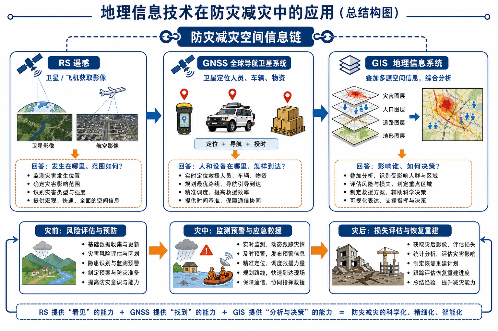
<!-- 图片描述：本节整体知识信息结构图，中心为“防灾减灾空间信息链”，左侧RS卫星飞机获取影像并回答“发生在哪里、范围如何”，中部GNSS卫星定位用户与救援物资并回答“人和设备在哪里、怎样到达”，右侧GIS把灾害、人口、道路、地形图层叠加并回答“影响谁、如何决策”；底部按灾前风险评估、灾中监测救援、灾后损失评估恢复重建串联。 图面结构：中心主题先给出本图要解决的核心问题，周围分支是条件、过程、影响或措施；左右两侧分别承担原因—结果、自然—人类、灾前—灾后或两种情境对照。视频讲解顺序：再讲中心主题，说明这张图试图回答什么问题；按左到右或左右对照讲条件、过程、影响与措施。讲解重点：灾害图要区分致灾因子、孕灾环境、承灾体、灾情和防灾能力；地图/时间线/流程图要讲清灾害链、风险差异和对应治理行动。学习落点：用“致灾因子/风险来源—空间或时间过程—承灾体与灾情—监测防御/救援恢复”复述本图。 -->

## 知识关系导航

- 所属章节：[[章首 学习导图|第六章 自然灾害]]。
- 数据对象：[[第一节 气象灾害|洪涝台风]]和[[第二节 地质灾害|地震泥石流]]需要不同监测指标。
- 工作衔接：技术结果服务[[第三节 防灾减灾|监测、救援和恢复]]。
- 综合应用：GIS区位评价可用于[[章末问题研究 救灾物资储备库应该建在哪里|救灾储备库选址]]。

## 本节学习目标

1. 说明遥感、GNSS和GIS的基本原理、组成和主要功能。
2. 区分三类技术在灾害监测、定位导航和空间分析中的任务。
3. 判读台风时序遥感图和地震、泥石流灾前灾后影像。
4. 使用图层思想说明受灾范围、人口、道路和房屋的叠加分析。
5. 分析温州灾害监测预警系统的多源数据协同。
6. 设计利用地理信息技术估算舟曲泥石流冲毁住宅的步骤。

## 核心知识点讲解

### 一、区域定位与地理情境

汶川地震破坏交通通信，使灾区成为“信息孤岛”。首批救援人员利用北斗用户机定位并通过短报文传递灾情，说明灾害现场不仅需要影像和地图，还需要在地面网络中断时可靠的定位通信。

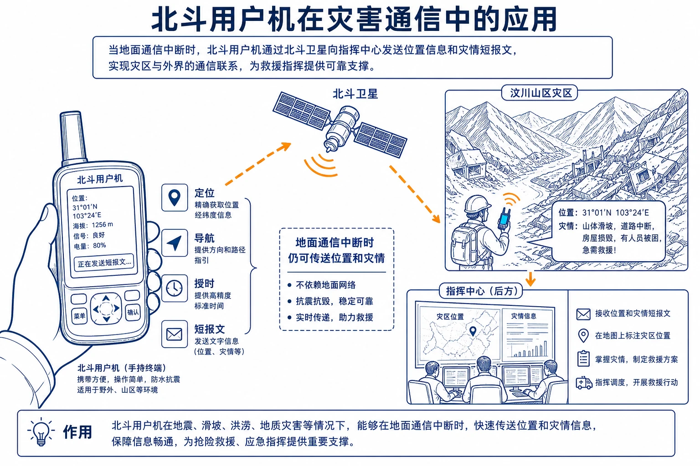
<!-- 图片描述：对应源文图6.20“北斗用户机”。手持北斗设备与汶川山区灾区背景并置，信号箭头从用户机到北斗卫星再到指挥中心，标注定位、短报文、授时和地面通信中断仍可传送灾情。 图面结构：由主体、空间位置、过程箭头和结论框组成学习型图解。视频讲解顺序：沿箭头说明物质、能量、泥沙、养分、风险或管理措施的流向。讲解重点：灾害图要区分致灾因子、孕灾环境、承灾体、灾情和防灾能力；地图/时间线/流程图要讲清灾害链、风险差异和对应治理行动；箭头方向必须说明起点、中间环节、终点及其因果关系。学习落点：用“致灾因子/风险来源—空间或时间过程—承灾体与灾情—监测防御/救援恢复”复述本图。 -->

### 二、核心概念与地理要素

#### 1. 遥感技术RS

遥感利用飞机、气球或卫星平台上的光学电子传感器，远距离感知地表物体反射或发射的电磁信息。基本链：目标物电磁特征 → 传感器记录 → 数据传输处理 → 影像判读与信息提取。

优势：范围大、速度快、周期短、信息量大、受地面通行限制少，可重复观测和动态监测。限制包括云雨遮挡光学影像、空间时间分辨率、同物异谱或异物同谱和地面验证需求。

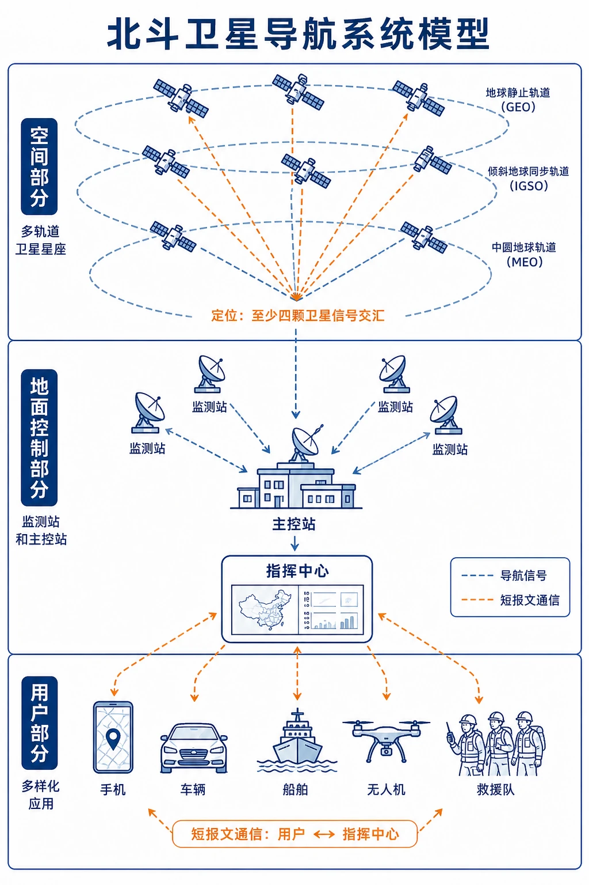
<!-- 图片描述：对应源文图6.21“卫星遥感技术原理示意”。太阳辐射到地表后反射至卫星传感器，卫星将数据传到地面接收站，经处理形成影像；另用热红外箭头表示地物自身辐射。流程标注能源—目标—传感器—传输—处理—应用。 图面结构：由主体、空间位置、过程箭头和结论框组成学习型图解。视频讲解顺序：沿箭头说明物质、能量、泥沙、养分、风险或管理措施的流向。讲解重点：灾害图要区分致灾因子、孕灾环境、承灾体、灾情和防灾能力；地图/时间线/流程图要讲清灾害链、风险差异和对应治理行动；箭头方向必须说明起点、中间环节、终点及其因果关系。学习落点：用“致灾因子/风险来源—空间或时间过程—承灾体与灾情—监测防御/救援恢复”复述本图。 -->

#### 2. 全球卫星导航系统GNSS

GNSS利用卫星提供全球实时定位、导航、速度和时间。由卫星星座、地面监控系统和用户接收系统组成，具有全球、全天候、连续和实时特点。

防灾应用：人员车辆定位、求救位置、救援路线导航、滑坡位移监测、物资跟踪和精准授时。北斗还具有短报文通信，在地面通信受损时价值突出。

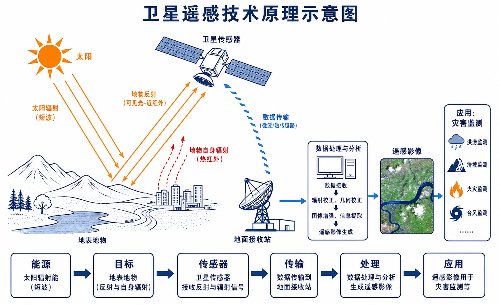
<!-- 图片描述：对应源文图6.24“北斗卫星导航系统模型”。空间部分为多轨道卫星星座，地面部分为监测站主控站，用户部分为手机车辆船舶和救援队；至少四颗卫星信号交汇定位用户，另以短报文箭头连接指挥中心。 图面结构：由主体、空间位置、过程箭头和结论框组成学习型图解。视频讲解顺序：沿箭头说明物质、能量、泥沙、养分、风险或管理措施的流向。讲解重点：灾害图要区分致灾因子、孕灾环境、承灾体、灾情和防灾能力；地图/时间线/流程图要讲清灾害链、风险差异和对应治理行动；箭头方向必须说明起点、中间环节、终点及其因果关系。学习落点：用“致灾因子/风险来源—空间或时间过程—承灾体与灾情—监测防御/救援恢复”复述本图。 -->

#### 3. 地理信息系统GIS

GIS是对地理数据进行输入、处理、存储、管理、查询、分析和输出的计算机系统。其核心是每条数据带空间位置，可按位置将不同主题图层联系起来。

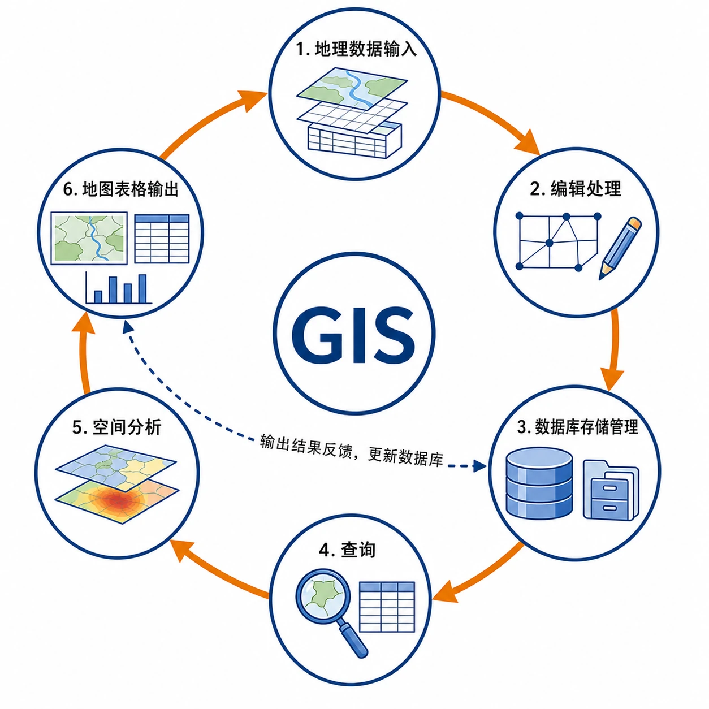
<!-- 图片描述：对应源文图6.25“地理信息系统的基本功能”。环形流程依次为地理数据输入、编辑处理、数据库存储管理、查询、空间分析、地图表格输出，中心为GIS；箭头表示结果可反馈更新数据库。 图面结构：中心主题先给出本图要解决的核心问题，周围分支是条件、过程、影响或措施；地图/俯视区用于定位区域、流向、分布和空间邻接关系；表格或并列卡片按相同指标比较，适合讲共同点、差异和适用条件；环形/闭合箭头表示循环、反馈、包含关系或多环节协同。视频讲解顺序：再讲中心主题，说明这张图试图回答什么问题；随后定位区域、方向、上下游/内外海或空间邻接关系；沿箭头说明物质、能量、泥沙、养分、风险或管理措施的流向；最后用统一指标归纳不同对象的共同点、差异和结论。讲解重点：灾害图要区分致灾因子、孕灾环境、承灾体、灾情和防灾能力；地图/时间线/流程图要讲清灾害链、风险差异和对应治理行动；箭头方向必须说明起点、中间环节、终点及其因果关系。学习落点：用“致灾因子/风险来源—空间或时间过程—承灾体与灾情—监测防御/救援恢复”复述本图。 -->

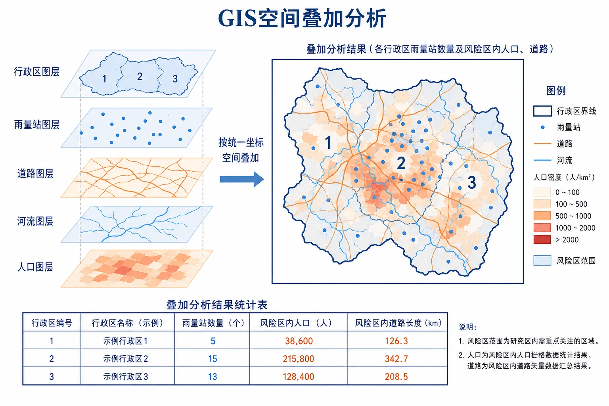
<!-- 图片描述：对应源文图6.26“地理信息系统的空间叠加分析”。透明图层依次为行政区、雨量站、道路、河流和人口，按坐标叠加后输出每个行政区雨量站数量和风险区内人口道路；保留教材示例行政区1、2、3对应雨量站5、15、13个。 图面结构：图表和等值线区承载数值、梯度、峰谷、疏密和异常区域。视频讲解顺序：再读坐标、数值梯度、峰谷、疏密或等值线弯曲，并说明原因。讲解重点：灾害图要区分致灾因子、孕灾环境、承灾体、灾情和防灾能力；地图/时间线/流程图要讲清灾害链、风险差异和对应治理行动；图表判读要从坐标和整体趋势入手，再解释峰谷、梯度或异常点的地理原因。学习落点：用“致灾因子/风险来源—空间或时间过程—承灾体与灾情—监测防御/救援恢复”复述本图。 -->

#### 4. 三种技术比较

| 技术 | 核心功能 | 典型灾害任务 | 常见误区 |
|---|---|---|---|
| RS | 远距离获取地表信息 | 看台风云系、洪水范围、滑坡泥石流变化 | 不等于自动完成全部决策 |
| GNSS | 定位导航测速授时 | 救援人员定位、路线导航、位移监测 | 不主要负责大范围成像 |
| GIS | 管理查询空间分析 | 叠加灾害、人口道路，评估损失选路线 | 不直接像卫星一样采集影像 |

### 三、过程机制与成因链条

#### 1. 台风动态监测

气象卫星周期成像 → 比较台风眼和云系位置 → 计算移动方向速度与强度变化 → 结合海温、大气场和模式预报 → 发布路径、风雨和风暴潮预警。

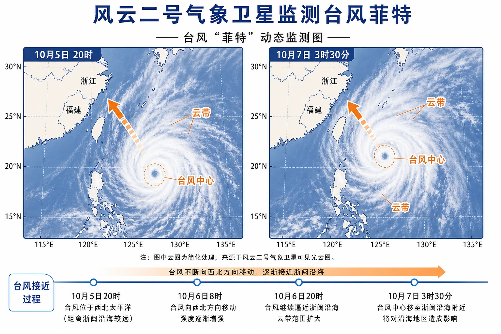
<!-- 图片描述：对应源文图6.22“风云二号气象卫星对台风菲特进行监测”。左右两幅卫星图分别为10月5日20时和10月7日3时30分，统一比例尺标出台风中心位置和移动箭头，从逼近东部沿海到影响浙闽；云带和时间标记用于动态判读。 图面结构：地图/俯视区用于定位区域、流向、分布和空间邻接关系。视频讲解顺序：随后定位区域、方向、上下游/内外海或空间邻接关系；沿箭头说明物质、能量、泥沙、养分、风险或管理措施的流向。讲解重点：灾害图要区分致灾因子、孕灾环境、承灾体、灾情和防灾能力；地图/时间线/流程图要讲清灾害链、风险差异和对应治理行动；箭头方向必须说明起点、中间环节、终点及其因果关系。学习落点：用“致灾因子/风险来源—空间或时间过程—承灾体与灾情—监测防御/救援恢复”复述本图。 -->

#### 2. 地震灾情快速识别

获取灾前基准影像 + 灾后遥感影像 → 配准对比 → 提取倒塌、滑坡、堵江和道路中断区域 → GIS叠加人口建筑交通 → 确定重灾区和救援通道 → GNSS引导队伍抵达。

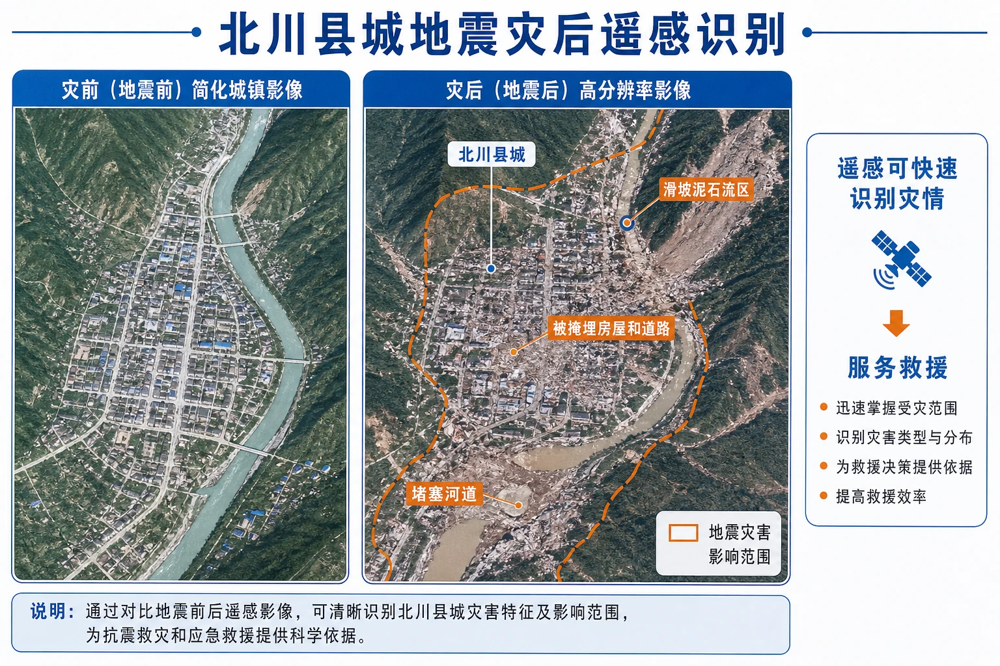
<!-- 图片描述：对应源文图6.23“2008年5月14日四川北川县城遥感影像”。灾后高分辨率影像标出北川县城、滑坡泥石流区、被掩埋房屋道路和堵塞河道；用不同色斑划分影响范围，并配灾前轮廓作对比，说明遥感为救援提供信息。 图面结构：由主体、空间位置、过程箭头和结论框组成学习型图解。视频讲解顺序：最后用统一指标归纳不同对象的共同点、差异和结论。讲解重点：灾害图要区分致灾因子、孕灾环境、承灾体、灾情和防灾能力；地图/时间线/流程图要讲清灾害链、风险差异和对应治理行动。学习落点：用“致灾因子/风险来源—空间或时间过程—承灾体与灾情—监测防御/救援恢复”复述本图。 -->

#### 3. 多技术协同

RS和地面站获取数据 → GNSS为观测点和救援目标提供坐标 → GIS汇集处理、叠加并形成风险图 → 预警平台输出 → 救援行动产生新定位和灾情数据 → 返回数据库动态更新。

#### 4. 舟曲泥石流房屋损失估算

灾前影像提取住宅位置和轮廓 → 灾后影像圈定泥石流范围 → GIS叠加住宅图层与灾害范围 → 空间查询相交住宅 → 结合现场或高分影像确认毁损等级 → 统计数量。

### 四、空间分布、图表判读与证据

#### 1. 时序遥感图

必须保证同一区域、相近比例尺和准确配准，再比较时间、位置、面积和形态。台风图看中心移动，泥石流图看新出现的灰色冲淤带和建筑道路消失，不能只凭颜色主观判断。

#### 2. 温州监测系统

系统汇集雨量站、水位站、气象云图，并与地形、交通和遥感影像叠加。图6.27中雨量站颜色表示时段降水量，水位站超过警戒值触发预警。

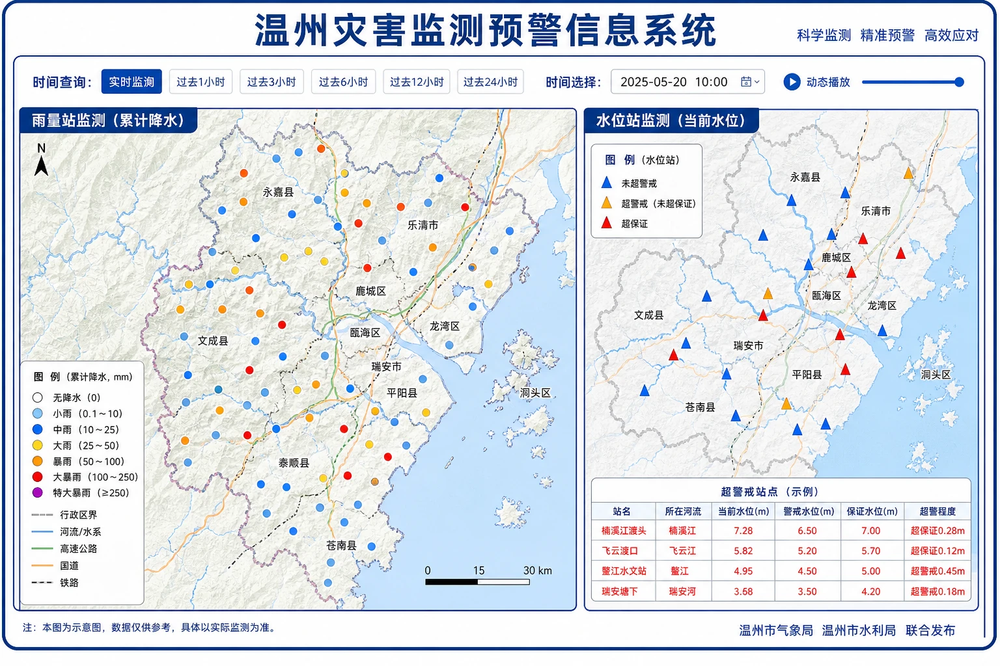
<!-- 图片描述：对应源文图6.27“温州灾害监测预警信息系统展示”。左面板地图以不同颜色点表示雨量站和累计降水等级，右面板三角形表示水位站并将超警戒站标红；底图叠加行政区、河流、地形和交通，顶部时间控件强调动态查询。 图面结构：地图/俯视区用于定位区域、流向、分布和空间邻接关系；颜色、符号、线型和箭头是阅读图面的编码系统。视频讲解顺序：先读图例、颜色、线型、箭头和单位；随后定位区域、方向、上下游/内外海或空间邻接关系。讲解重点：灾害图要区分致灾因子、孕灾环境、承灾体、灾情和防灾能力；地图/时间线/流程图要讲清灾害链、风险差异和对应治理行动；颜色和符号要落实到具体对象、强弱等级、类别或管理措施，不作为装饰性描述。学习落点：用“致灾因子/风险来源—空间或时间过程—承灾体与灾情—监测防御/救援恢复”复述本图。 -->

#### 3. 舟曲前后影像

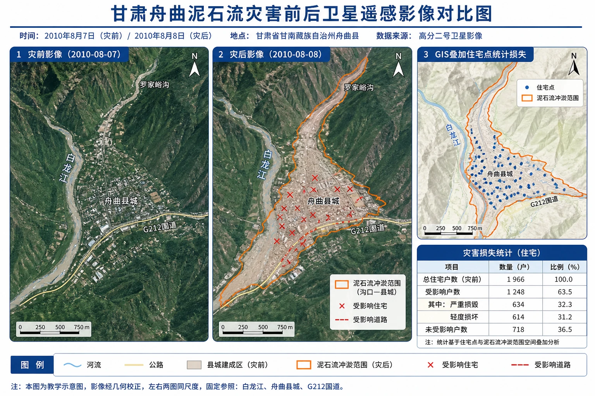
<!-- 图片描述：对应源文图6.28“甘肃舟曲泥石流灾害前后卫星遥感影像”。左右同尺度影像为灾前和灾后，固定参照包括河流、县城和道路；灾后用橙色边界勾勒泥石流从沟口至县城的冲淤范围，受影响住宅和道路以符号标记，第三小图展示GIS叠加住宅点后统计。 图面结构：由主体、空间位置、过程箭头和结论框组成学习型图解。视频讲解顺序：先看标题和主体；再读结构、方向和关键标注；最后概括地理规律或管理结论。讲解重点：灾害图要区分致灾因子、孕灾环境、承灾体、灾情和防灾能力；地图/时间线/流程图要讲清灾害链、风险差异和对应治理行动。学习落点：用“致灾因子/风险来源—空间或时间过程—承灾体与灾情—监测防御/救援恢复”复述本图。 -->

估算住宅数还需要灾前住宅分布或建筑物矢量、泥石流准确边界、高分辨率影像、坐标和分类精度。GIS使用数据输入编辑、空间叠加、查询统计和结果输出等功能。

### 五、人地关系、影响与对策

#### 1. 技术价值

减少人员进入危险区，快速覆盖交通中断区域；提高预警和救援的空间精度；支持资源调度、损失评估和重建规划；积累长期数据用于风险区划。

#### 2. 技术边界

影像可能受云雾、分辨率和更新时间限制；GNSS在峡谷室内或信号干扰下精度下降；GIS结论依赖数据质量和模型。技术不能替代地面核查、组织协调和公众行动。

#### 3. 数据伦理与韧性

灾害数据涉及个人位置和财产，应保护隐私、控制访问；关键系统需备份、电力保障和离线能力，避免灾时通信中断使“先进系统”不可用。

### 六、综合题型与迁移应用

#### 1. 技术选择题

问“监测面积变化”优先RS；问“确定救援人员经纬度”优先GNSS；问“叠加人口道路计算受灾数量”优先GIS。复杂任务通常组合使用。

#### 2. 图层叠加题

明确目标 → 选择图层 → 统一坐标与尺度 → 叠加分析 → 查询统计 → 检查数据精度 → 输出地图和表格。选址还需设置排除条件和权重。

#### 3. 遥感变化检测题

先确定时间和固定参照，描述变化范围与方向，再用灾害过程解释，最后说明怎样用GIS量化和GNSS核验。

## 重点梳理

- RS：远距离、范围大、速度快、动态看灾情。
- GNSS：卫星星座＋地面控制＋用户接收，负责定位导航授时，北斗可短报文。
- GIS：输入、存储、查询、分析、输出，核心方法是空间图层叠加。
- 协同链：RS获取—GNSS定位—GIS分析—指挥决策—现场反馈。
- 所有技术结论都受数据分辨率、时效、精度和地面验证限制。

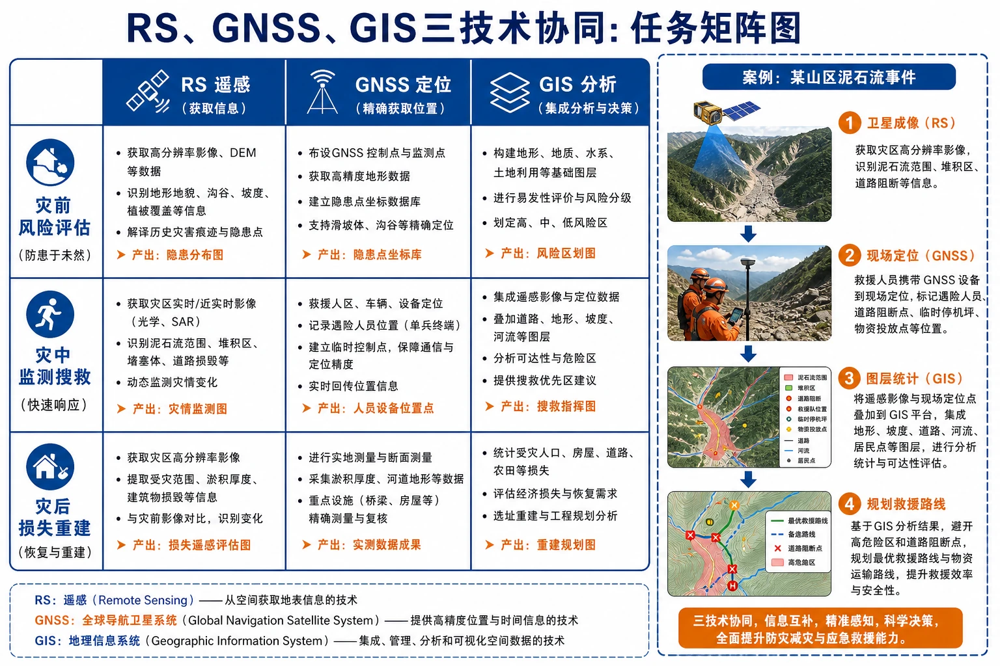
<!-- 图片描述：RS、GNSS、GIS“三技协同”任务矩阵图。行是灾前风险评估、灾中监测搜救、灾后损失重建，列是三种技术；每格放具体任务，右侧用一场泥石流案例串出卫星成像—现场定位—图层统计—救援路线。 图面结构：右侧一般为输出结果、应用、风险或治理措施；表格或并列卡片按相同指标比较，适合讲共同点、差异和适用条件。视频讲解顺序：最后用统一指标归纳不同对象的共同点、差异和结论。讲解重点：灾害图要区分致灾因子、孕灾环境、承灾体、灾情和防灾能力；地图/时间线/流程图要讲清灾害链、风险差异和对应治理行动；案例要按“区域背景—关键证据—机制解释—影响/效益—限制或对策”讲完。学习落点：用“致灾因子/风险来源—空间或时间过程—承灾体与灾情—监测防御/救援恢复”复述本图。 -->

## 难点突破

### 1. 遥感不是“遥控”

遥感是传感器接收电磁信息并识别地物，不是远程操控设备。能否穿云取决于传感器波段，雷达通常比可见光更适合云雨条件。

### 2. GNSS与GIS的区别

GNSS提供“我在哪里、何时、速度多少”；GIS把大量带位置的数据组织分析，回答“哪些对象在危险区、路线如何选择”。

### 3. 叠加并不自动产生正确答案

图层坐标、时间、比例尺和分类必须一致；老旧人口数据叠加新灾害范围可能造成严重误判，结果要做精度评价。

### 4. 灾前灾后影像怎样可比

需几何配准、相近分辨率，并排除季节、太阳高度、云影和水位差造成的假变化。重大判断还需现场核验。

## 例题讲解

### 例1 北斗用户机如何传递灾情

用户机接收北斗卫星信号确定自身位置，并利用北斗短报文把文字和坐标通过卫星链路传到指挥中心。地面通信设施损坏时仍可使用，缩短搜寻和信息传递时间。

### 例2 台风动态监测用什么技术

RS周期获取云图，识别台风中心、云系和移动；GNSS定位地面站、船舶和救援力量；GIS叠加预报路径、人口、海拔和道路，划定风险区、规划转移。答案若只写遥感，适合“看台风”；若问综合预警，应三技协同。

### 例3 教材活动：舟曲房屋损失

先将灾前灾后遥感图配准，在灾后图圈定泥石流范围；还需灾前住宅位置、轮廓或高分影像，以及坐标和毁损判定标准；在GIS中输入数据，叠加泥石流与住宅图层，空间查询相交建筑并统计，最后用灾后影像或现场调查校核。

### 例4 雨量站空间叠加

将雨量站点图层与行政区面图层统一坐标后叠加，按行政区进行空间查询和计数，即可得到各区雨量站数量；再关联降水属性可计算平均雨量或超阈值站数。

## 易错点整理

1. 认为卫星图都属于GIS。卫星影像主要由遥感获取，GIS负责管理分析。
2. 认为GNSS能直接拍摄灾区。它主要定位导航，不负责大范围成像。
3. 认为GIS只是电子地图。核心是空间数据库和分析。
4. 只写RS优点，不写云雾、分辨率和地面验证限制。
5. 灾前灾后影像未配准就比较面积。
6. 图层时间不一致仍直接叠加。
7. 估算受灾房屋只看泥石流图，不需要住宅图层。
8. 认为技术系统能替代预案、人员和现场救援。

## 考点考证点整理

### 考点一：三类技术辨析

- 出题思路：给防灾任务选择RS、GNSS或GIS。
- 关键条件：获取影像、定位导航、空间分析三类关键词。
- 解答要点：RS看，GNSS定位，GIS管理分析；综合任务说明协同。
- 易扣分点：把所有卫星应用都答遥感；GIS只写制图。

### 考点二：遥感灾害监测

- 出题思路：给台风时序图或灾前灾后影像，描述变化和优势。
- 关键条件：拍摄时间、比例尺、固定参照、范围方向和分辨率。
- 解答要点：动态、大范围、快速；先配准再提取变化并地面验证。
- 易扣分点：逐图描述无趋势；颜色差都当灾害变化。

### 考点三：GNSS防灾应用

- 出题思路：灾区通信中断、救援定位或位移监测情境。
- 关键条件：空间、地面、用户三部分，定位导航授时短报文。
- 解答要点：提供坐标和路线、缩短搜寻，北斗可传报文。
- 易扣分点：写成灾害影像监测；忽略接收终端。

### 考点四：GIS空间叠加

- 出题思路：计算受灾人口房屋、选择避难路线或风险区划。
- 关键条件：灾害范围、承灾体、道路地形等图层和统一坐标时间。
- 解答要点：数据输入—叠加—查询统计—输出—精度校核。
- 易扣分点：只列图层不写分析；遗漏受灾对象数据。

### 考点五：多技术综合应用

- 出题思路：设计从监测到救援重建的完整技术方案。
- 关键条件：灾前、灾中、灾后任务差异和数据反馈。
- 解答要点：RS获取、GNSS定位、GIS分析决策，现场结果更新数据库。
- 易扣分点：三种技术平铺无任务对应；忽略技术局限。

## 练习题

### 1. 基础辨析

分别用一句话说明RS、GNSS和GIS在防灾减灾中的核心功能。

### 2. 台风监测

设计一套监测台风移动、划定风险区和组织人员转移的三技术协同方案。

### 3. 北斗应用

说明地震造成地面通信中断时北斗用户机的作用及实现路径。

### 4. 空间叠加

若要统计洪水淹没区内人口和学校数量，需要哪些图层和GIS功能？

### 5. 教材活动：舟曲泥石流

说明如何利用灾前灾后影像勾勒泥石流范围，并估算冲毁住宅数。

### 6. 方法评价

为什么只凭两幅颜色不同的卫星图不能立即认定地表发生灾害变化？

## 练习题答案

### 1. 基础辨析

RS利用传感器远距离、大范围、快速获取地表信息；GNSS提供实时定位、导航、速度和时间，北斗还可短报文；GIS管理带位置的数据并进行查询、叠加、统计和输出，为决策服务。

### 2. 台风监测

RS连续获取卫星云图，识别中心、强度和路径；GNSS定位海上船舶、地面监测站、转移车辆和避难场所；GIS叠加台风预报路径、风雨潮范围、人口、地形、道路和建筑，划分风险等级、选择转移对象和路线。现场定位与新遥感信息应持续更新GIS。

### 3. 北斗应用

用户机接收多颗卫星信号确定救援人员经纬度和时间，再通过北斗短报文链路把坐标与灾情发往指挥中心；指挥中心据此调度队伍和物资。它不依赖灾区已损坏的地面移动通信基站，但仍需设备供电和可接收卫星信号。

### 4. 空间叠加

需要洪水范围面图层、人口网格或居民点图层、学校点或建筑轮廓图层，可补充道路和行政区。GIS先统一坐标和时间，进行空间叠加和相交查询，汇总范围内人口与学校数量，输出地图和表格并检查数据时效精度。

### 5. 教材活动：舟曲泥石流

把灾前灾后影像几何配准，以河流道路等固定参照识别新出现的冲刷和堆积区，在灾后图勾勒范围。准备灾前住宅位置或建筑轮廓、高分辨率影像和坐标；在GIS中叠加泥石流范围与住宅图层，查询相交建筑并统计，再结合灾后影像和现场调查确认毁损程度。

### 6. 方法评价

颜色差可能来自季节植被、水位、太阳高度、云影、传感器波段和处理方式，而不一定是灾害；两图还可能比例尺、分辨率和位置未配准。应统一坐标尺度，结合时间、固定参照和多波段信息提取变化，并用地面资料核验。
