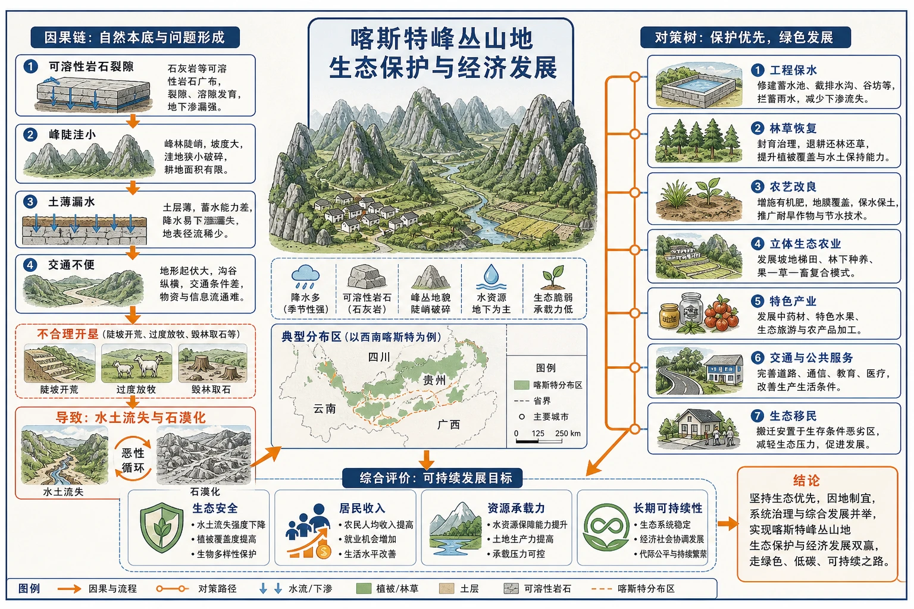
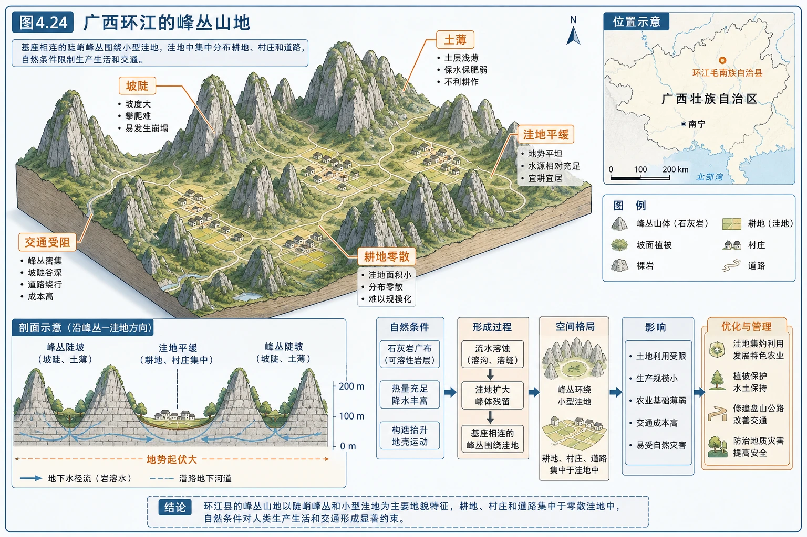
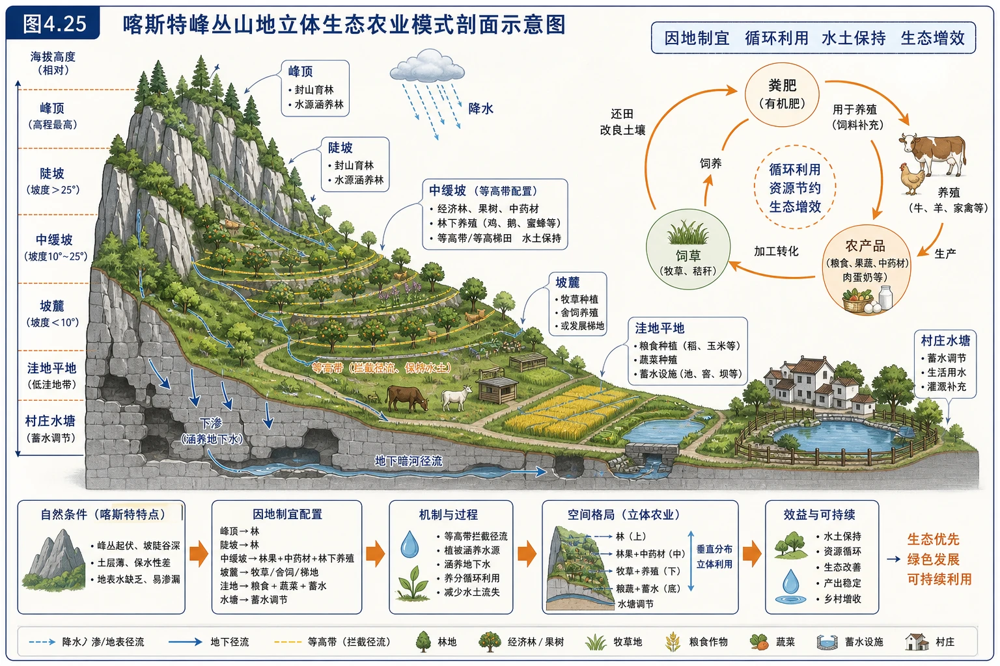
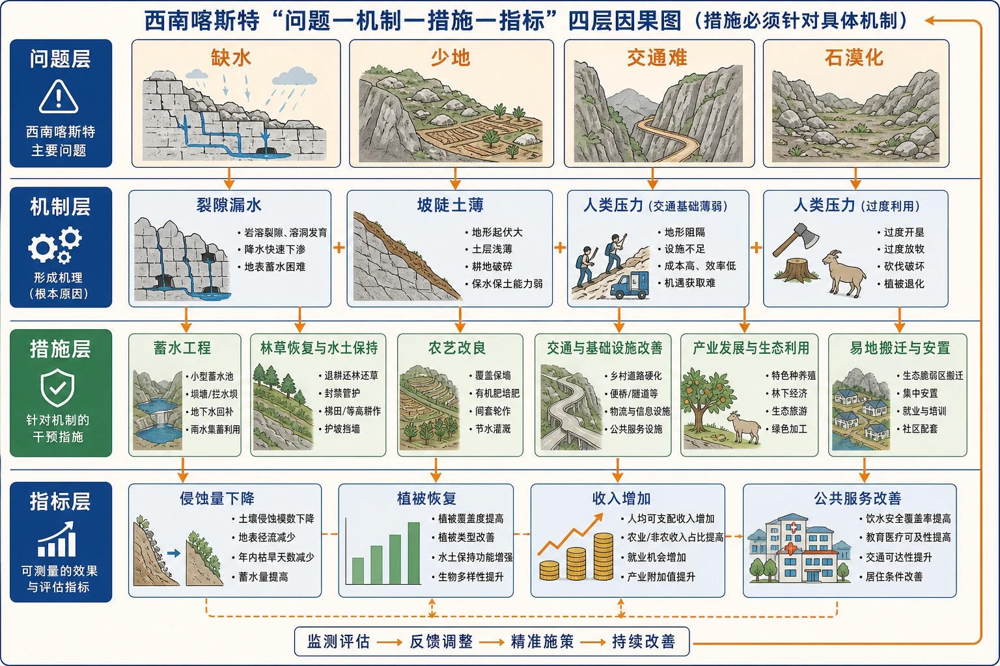

# 章末问题研究 如何提升我国西南喀斯特峰丛山地的经济发展水平

<!-- 图片描述：本问题研究整体知识信息结构图，中心为“喀斯特峰丛山地生态保护与经济发展”，左侧因果链为可溶性岩石裂隙、峰陡洼小、土薄漏水、交通不便，在不合理开垦后导致水土流失和石漠化；右侧对策树为工程保水、林草恢复、农艺改良、立体生态农业、特色产业、交通与公共服务、生态移民；底部以生态安全、居民收入、资源承载力和长期可持续性四项指标评价。 图面结构：中心主题先给出本图要解决的核心问题，周围分支是条件、过程、影响或措施；左右两侧分别承担原因—结果、自然—人类、灾前—灾后或两种情境对照。视频讲解顺序：再讲中心主题，说明这张图试图回答什么问题；按左到右或左右对照讲条件、过程、影响与措施。讲解重点：先根据形态判断侵蚀、搬运还是堆积，再用物质来源、动力强弱和地形位置解释；剖面/演化图要讲清起点形态、外力作用、阶段变化和最终地貌；案例要按“区域背景—关键证据—机制解释—影响/效益—限制或对策”讲完。学习落点：用“形态证据—外力过程—空间位置—演化结果/人地关系”复述本图。 -->

## 知识关系导航

- 所属章节：[[章首 学习导图|第四章 地貌]]。
- 自然基础：[[第一节 常见地貌类型#1. 喀斯特地貌|喀斯特地貌的形态与形成]]决定水土资源和工程条件。
- 方法基础：[[第二节 地貌的观察|地貌观察]]提供坡度、相对高度、破碎程度和土地利用证据。
- 研究主线：自然脆弱性 → 人类压力 → 石漠化 → 发展受限 → 生态重建与产业协同。

## 本节学习目标

1. 描述西南喀斯特峰丛山地的地貌、土壤、水文和聚落特征。
2. 建立石漠化形成和“雨时涝、晴时旱”的机制链。
3. 分析生态环境脆弱如何制约农业、交通、聚落和产业发展。
4. 说明立体生态农业各层次与坡度、土层和水分条件的匹配关系。
5. 评价生态移民的必要性、条件和潜在社会问题。
6. 提出兼顾生态修复、民生改善和产业发展的区域方案。

## 核心知识点讲解

### 一、区域定位与地理情境

我国西南喀斯特峰丛山地主要分布在广西、贵州、云南等碳酸盐岩广布地区。这里气候总体温暖湿润，流水溶蚀强烈，山峰基座相连、洼地镶嵌其间。峰坡陡、土层薄，耕地和聚落集中在有限的洼地坝子，人口与土地、水资源矛盾突出。

问题研究的目标不是追求短期产值最大化，而是在生态承载力约束下提高居民稳定收入和公共服务水平。评价任何方案都要回答：是否保护土壤和水源？是否适合当地地貌？农民能否受益？长期能否维持？

### 二、核心概念与地理要素

#### 1. 峰丛山地

峰丛是基座相连的成片山峰，山峰环绕洼地。坡地陡峭，洼地相对平坦但面积小且分散；交通线路需频繁绕行、架桥或穿隧道，聚落之间联系困难。

<!-- 图片描述：对应源文图4.24“广西环江的峰丛山地”。斜视地貌图显示成片基座相连的陡峭峰丛围绕小型洼地，洼地中集中分布耕地、村庄和道路，坡面植被与局部裸岩形成对比；标注坡陡、土薄、洼地平缓、耕地零散和交通受阻，帮助识别自然约束。 图面结构：由主体、空间位置、过程箭头和结论框组成学习型图解。视频讲解顺序：最后用统一指标归纳不同对象的共同点、差异和结论。讲解重点：先根据形态判断侵蚀、搬运还是堆积，再用物质来源、动力强弱和地形位置解释；剖面/演化图要讲清起点形态、外力作用、阶段变化和最终地貌。学习落点：用“形态证据—外力过程—空间位置—演化结果/人地关系”复述本图。 -->

#### 2. 生态环境脆弱性

生态脆弱不是“自然环境一定恶劣”，而是系统受扰动后容易退化、恢复缓慢。喀斯特区土壤形成慢、连续性差，岩石裂隙使水分下渗快；一旦植被破坏，薄土很容易被暴雨冲走，裸岩扩大，恢复需要很长时间。

#### 3. 石漠化

石漠化是喀斯特地区在自然脆弱性基础上，受不合理人类活动影响，植被破坏、土壤严重流失、基岩大面积裸露，土地生产力下降的过程。它不是“沙漠里石头变多”，也不是普通干旱沙漠化。

#### 4. 立体生态农业

立体生态农业根据峰丛—坡麓—洼地的垂直和微地形差异配置林、草、果、药、粮、养殖等生产，兼顾保持水土、涵养水源、提高土地利用效率和增加收入。

#### 5. 生态移民

生态移民是把居住分散、生态承载力低或生存条件恶劣地区的居民，自愿、有组织地迁往基础设施和就业条件较好地区，同时对迁出地进行生态修复。它既是生态措施，也是涉及就业、教育、文化适应和社会保障的综合政策。

### 三、过程机制与成因链条

#### 1. 石漠化形成链

可溶性岩石广布、成土速度慢 + 峰坡陡、土层薄 + 暴雨集中 → 土壤天然易流失；人口压力和陡坡开垦、过度樵采放牧 → 植被覆盖下降、根系固土减弱 → 地表径流和侵蚀增强 → 土层变薄直至基岩裸露 → 土地生产力下降 → 为维持生计继续扩大利用 → 生态退化加剧。

这构成“环境退化—贫困—过度利用—进一步退化”的恶性循环。

#### 2. 为什么既旱又涝

**涝**：洼地四周坡面汇水快，暴雨时径流短时间集中；若地下排水通道不足、堵塞或超过能力，洼地积水。

**旱**：可溶性岩石裂隙、落水洞和地下河发育，降水结束后地表水迅速下渗流失；土层薄、蓄水能力弱，缺少稳定地表水体。

因此“旱涝并存”不是矛盾，而是降水集中、汇流快、地表储水差和地下排水变化共同造成的时间错配。

#### 3. 生态脆弱如何限制经济

峰陡地碎 → 可耕地少且分散、机械化困难；土薄漏水 → 单产低、旱涝风险大；地表破碎 → 道路和公共设施成本高；生态脆弱 → 工业和资源开发受到约束；居民分散 → 教育、医疗、市场服务成本高 → 产业机会少、收入增长缓慢。

#### 4. 生态重建如何促进发展

工程、林草和农艺措施保持水土、蓄水 → 土壤和水分条件改善 → 农业产量和稳定性提高；按地貌配置产业 → 林果、药材、养殖与生态旅游增加收入来源 → 农户减少陡坡开垦依赖 → 植被恢复、生态服务增强 → 形成生态与经济正反馈。

### 四、空间分布、图表判读与证据

#### 1. 峰丛—洼地空间组合

读图4.24应从整体到局部：峰丛成片且坡陡 → 洼地面积小、分散 → 耕地聚落集中洼地 → 道路需绕峰穿谷 → 生产空间和交通通达度受限。图中的裸岩、坡耕地和植被差异是判断生态状况的重要证据。

#### 2. 立体生态农业空间配置

<!-- 图片描述：对应源文图4.25“喀斯特峰丛山地立体生态农业模式”。绘制峰顶、陡坡、缓坡坡麓、洼地和村庄水塘的剖面。峰顶与陡坡配置封山育林和水源涵养林；中缓坡配置经济林、果树、中药材和林下养殖并配等高带；坡麓发展牧草、舍饲养殖或梯地；洼地平地发展粮食、蔬菜和蓄水设施；粪肥、饲草和农产品用循环箭头连接，突出因地制宜与水土保持。 图面结构：纵向或剖面区表现高度、深度、垂直分层和物质/能量变化；环形/闭合箭头表示循环、反馈、包含关系或多环节协同。视频讲解顺序：沿剖面或垂直方向讲层次、深度、物质和能量变化；沿箭头说明物质、能量、泥沙、养分、风险或管理措施的流向。讲解重点：先根据形态判断侵蚀、搬运还是堆积，再用物质来源、动力强弱和地形位置解释；剖面/演化图要讲清起点形态、外力作用、阶段变化和最终地貌；箭头方向必须说明起点、中间环节、终点及其因果关系。学习落点：用“形态证据—外力过程—空间位置—演化结果/人地关系”复述本图。 -->

合理配置原则：

- 陡坡和薄土区：以生态林、封育和水源涵养为主，避免开垦。
- 缓坡：采取等高种植、梯地、果林或中药材，配置水土保持设施。
- 洼地：耕地条件相对较好，可发展粮食、蔬菜和高效农业，但需排涝与蓄水。
- 聚落附近：发展圈养、农产品加工、服务业和分布式储水，形成产业链。

#### 3. 证据评价

判断生态重建是否有效，应比较治理前后的植被覆盖率、土壤厚度和侵蚀量、地表和地下水变化、农产品产量、家庭收入、贫困发生率、道路与公共服务，以及生物多样性。仅凭“看起来变绿”不能证明经济和生态都持续改善。

### 五、人地关系、影响与对策

#### 1. 生态修复

- 封山育林、退耕还林还草，保护陡坡和石山植被。
- 采用小型蓄水池、水窖、排涝通道和坡面水保工程，调节旱涝。
- 等高耕作、覆盖种植、少耕免耕和有机培肥，减少裸地和土壤流失。
- 对石漠化程度不同区域分区治理，避免“一律植树”造成树种不适或水分竞争。

#### 2. 产业发展

- 发展适应薄土、坡地条件的特色林果、中药材、生态养殖。
- 在环境容量内发展峰林、溶洞、民族文化等生态旅游，避免景区建设破坏地下水和洞穴。
- 完善农产品加工、冷链、品牌和电商，提升附加值，而非只出售初级产品。
- 利用清洁能源和数字基础设施改善生活条件，但大型工程需做地质与生态评估。

#### 3. 基础设施与公共服务

道路建设优先连接中心村镇和市场，但要避开落水洞、塌陷和滑坡高风险区；建设分散与集中结合的供水系统；提升教育、医疗、通信和灾害预警，降低地形分割带来的社会成本。

#### 4. 生态移民

必要性：部分地区人地矛盾过强，继续居住和开垦会超过承载力，且公共服务成本极高。

实施条件：尊重居民意愿，保障住房、就业、教育、医疗和土地权益；迁出地限制重新开垦并持续修复；保护社区文化和社会网络。若只有搬迁没有就业，可能产生新的贫困。

#### 5. 因地制宜的综合方案

核心不是“把所有人迁走”或“全部发展旅游”，而是分区：生态保育区严格保护；生态农业区发展立体农业；聚落和产业节点集中公共服务；极脆弱区自愿实施生态移民。不同区域之间通过交通、市场和生态补偿连接。

### 六、综合题型与迁移应用

#### 1. 区域发展问题分析框架

> 区域定位 → 地貌与气候 → 水土和生态脆弱性 → 人口产业压力 → 发展限制 → 分区对策 → 效益与风险评价。

#### 2. 生态农业模式判读

先找坡度和微地形，再看各产业的水土需求，判断配置是否做到陡坡保育、缓坡利用、洼地高效生产；最后分析物质循环和收入来源是否多元。

#### 3. 措施评价

每项措施都用“针对问题—作用过程—预期效果—可能限制”评价。例如水窖针对降水季节不均，通过储存雨水缓解旱季缺水，但容量有限且需保证水质。

#### 4. 可持续发展判断

经济收入提高只是一个指标。还要看土壤是否保住、水源是否稳定、居民是否真正受益、产业是否经得住市场波动，以及治理是否依赖不可持续补贴。

## 重点梳理

- 自然底板：峰陡洼小、土层薄、岩石裂隙和地下河发育。
- 核心问题：可耕地少、水土易流失、旱涝并存、交通与公共服务困难。
- 退化链：不合理利用 → 植被破坏 → 水土流失 → 基岩裸露 → 石漠化 → 贫困加剧。
- 重建路径：保土蓄水＋植被恢复＋立体农业＋特色产业＋公共服务＋适度生态移民。
- 评价原则：生态、经济、社会三类效益并重，分区分类、长期监测。

<!-- 图片描述：西南喀斯特“问题—机制—措施—指标”四层因果图。问题层为缺水、少地、交通难、石漠化；机制层对应裂隙漏水、坡陡土薄和人类压力；措施层一一连接蓄水、林草、农艺、产业和移民；指标层为侵蚀量下降、植被恢复、收入增加、公共服务改善，强调措施必须针对具体机制。 图面结构：由主体、空间位置、过程箭头和结论框组成学习型图解。视频讲解顺序：先看标题和主体；再读结构、方向和关键标注；最后概括地理规律或管理结论。讲解重点：先根据形态判断侵蚀、搬运还是堆积，再用物质来源、动力强弱和地形位置解释；剖面/演化图要讲清起点形态、外力作用、阶段变化和最终地貌。学习落点：用“形态证据—外力过程—空间位置—演化结果/人地关系”复述本图。 -->

## 难点突破

### 1. 湿润地区为什么缺水

降水丰富不等于水资源易利用。喀斯特裂隙、落水洞和地下河使地表水迅速漏失，地表储水困难；降水又集中在某些季节，形成“总量不一定少、可利用性差”的缺水。

### 2. 石漠化中的自然与人为因素

自然因素决定脆弱底板：岩性、坡度、薄土、暴雨；人为因素常触发和加速退化：陡坡开垦、过度樵采放牧。回答时要写两类因素及其叠加，不能把责任全部归于自然。

### 3. 立体农业不是简单“山上种树、山下种田”

还要依据坡度、土层、水分、交通和市场选择树种、作物与养殖，并建立水土保持和物质循环。若经济林品种耗水大或市场单一，也可能造成生态和收入风险。

### 4. 生态移民的双重性

迁出可降低环境压力、提高公共服务效率；但也可能造成就业不足、文化适应困难和社会网络断裂。高分答案必须同时写必要条件和配套保障。

### 5. 生态保护与经济发展并非零和

通过生态农业、生态产品价值、旅游容量管理和生态补偿，可以把保护转化为长期收益。但收益应惠及当地居民，并以不超过环境承载力为前提。

## 例题讲解

### 例1 教材资料分析：为什么出现石漠化

**定位与材料**：西南喀斯特峰丛山地，峰坡陡、土层薄、暴雨较多，耕地有限。

**因果链**：成土慢、土层薄且坡陡 → 土壤天然易被冲走；人口压力下陡坡开垦、樵采放牧 → 植被破坏 → 暴雨径流侵蚀增强 → 土壤流失、基岩裸露 → 石漠化。

### 例2 教材资料分析：为什么既旱又涝

暴雨时，峰坡汇水迅速集中到洼地，地下通道一时排水不及，形成涝；晴天或旱季，裂隙和地下河使水快速下渗外排，土层又薄、蓄水少，形成旱。根本是水在时间上集中、地表储存调节能力弱。

### 例3 教材资料分析：立体生态农业与地貌

陡峭峰坡以封育和生态林为主，保护薄土和涵养水源；中缓坡布置经济林、牧草、中药材并采取等高措施；洼地坡缓、土层相对较厚，发展粮食蔬菜和蓄排水设施；聚落附近配置养殖和加工。各层利用与坡度、土层和水分条件匹配，兼顾生态与收益。

### 例4 教材资料分析：为什么部分地区实行生态移民

部分居民点分散、土地和水资源承载力低，交通、供水、教育医疗建设成本高，继续生产可能加剧石漠化。迁往条件较好地区可减轻生态压力并提高公共服务效率。但必须自愿实施，落实就业、社会保障和迁出地修复，否则不能达到长期目标。

### 例5 提升经济发展水平的综合建议

**答题结构**：

1. 生态：分区治理石漠化，封育陡坡，恢复乡土植被。
2. 水土：建设小微蓄水和排涝设施，推广等高耕作与覆盖保土。
3. 产业：发展适地特色农业、农产品加工和容量可控的生态旅游。
4. 基础设施：改善交通、数字网络、教育和医疗，降低市场隔离。
5. 社会：对极脆弱区开展自愿生态移民，保障就业和权益。
6. 管理：生态补偿、社区参与、长期监测和动态调整。

## 易错点整理

1. 认为西南湿润所以不会缺水。问题在于裂隙漏水、储水困难和季节分配不均。
2. 把石漠化等同于沙漠化。石漠化表现为土壤流失、基岩裸露，主要见于喀斯特区。
3. 只写自然原因，忽略不合理开垦等人为加速作用。
4. 认为所有坡地都应发展经济林。陡坡薄土区首先应生态保育。
5. 把旅游当成无污染产业。超容量开发会消耗水、产生垃圾并破坏洞穴与景观。
6. 把生态移民理解为强制搬迁。需要意愿、就业、权益和公共服务保障。
7. 对策与问题不对应。例如只写修路不能直接解决石漠化，必须说明措施作用对象。
8. 只用短期收入评价成功，忽略水土、生物和收入稳定性。

## 考点考证点整理

### 考点一：喀斯特生态脆弱性

- 出题思路：提供峰丛景观、岩性和降水材料，解释土壤薄、地表缺水和生态脆弱。
- 关键条件：可溶性岩石、裂隙、坡陡、土薄、暴雨集中和成土慢。
- 解答要点：自然底板与人类扰动分开写，再以水土流失连接到石漠化。
- 易扣分点：只写“降水少”；把地表缺水误判为年降水总量少。

### 考点二：旱涝并存机制

- 出题思路：材料同时出现暴雨内涝和旱季缺水，要求解释矛盾现象。
- 关键条件：洼地汇水、降水集中、地下通道能力、裂隙下渗、地表储水少。
- 解答要点：分别解释涝和旱，再总结为水量时间分配和调蓄能力问题。
- 易扣分点：只答一种灾害；不提喀斯特地下水系统。

### 考点三：立体生态农业判读

- 出题思路：给山地农业剖面，判断不同坡位产业并说明合理性。
- 关键条件：坡度、土层厚度、水分、侵蚀风险、交通和产业联系。
- 解答要点：陡坡保育、缓坡适度经营、洼地高效农业；说明水土保持和循环利用。
- 易扣分点：只复述产业名称，没有说明与地貌的对应关系。

### 考点四：区域发展对策

- 出题思路：要求针对生态脆弱、贫困、交通不便提出综合措施。
- 关键条件：资源承载力、人口分布、产业基础、市场和生态红线。
- 解答要点：生态、水土、产业、基础设施、社会保障和管理分点作答，每项对应材料问题。
- 易扣分点：措施泛化；照搬沿海工业化模式；忽视当地居民受益。

### 考点五：生态移民评价

- 出题思路：以偏远聚落搬迁为材料，评价必要性、效益和风险。
- 关键条件：生存条件、公共服务成本、居民意愿、就业、迁出地管理。
- 解答要点：降低环境压力和提升服务效率，同时写就业权益、文化适应及生态修复条件。
- 易扣分点：只写优点或把搬迁等同于问题自动解决。

## 练习题

### 1. 教材资料分析：石漠化

说明喀斯特峰丛山地石漠化形成的自然基础和人为原因。

### 2. 教材资料分析：旱涝并存

解释喀斯特洼地为什么可能“雨时涝、晴时旱”。

### 3. 教材资料分析：立体农业

结合峰顶、陡坡、缓坡和洼地的差异，为四个地貌部位分别提出适宜的农业或生态利用方式并说明理由。

### 4. 教材资料分析：生态移民

为什么部分生存条件恶劣的喀斯特山区需要实施生态移民？实施时应注意哪些问题？

### 5. 对策和建议

以“如何提升西南喀斯特峰丛山地经济发展水平”为题，提出一套不少于四个方面的综合方案。

### 6. 方案评价

某县计划把陡坡全部种植单一高耗水经济树种，并大规模开发溶洞旅游。评价该方案。

## 练习题答案

### 1. 教材资料分析：石漠化

自然基础包括可溶性岩石广布、成土速度慢，峰坡陡、土层薄，暴雨集中，土壤容易流失。人为原因包括人口压力下陡坡开垦、过度樵采和放牧等，造成植被破坏、地表径流和侵蚀增强，最终土壤大量流失、基岩裸露，形成石漠化。

### 2. 教材资料分析：旱涝并存

暴雨时四周陡坡汇流快，大量水短时间集中到洼地，地下排水通道可能来不及排出，导致积水；降水停止后，可溶岩裂隙、落水洞和地下河使水迅速下渗外排，薄土蓄水能力又弱，晴天和旱季容易缺水。因此本质是汇水快、储水弱和降水时间集中。

### 3. 教材资料分析：立体农业

峰顶和陡坡侵蚀风险最高，应封山育林、恢复乡土植被和涵养水源；缓坡可在水保措施下发展经济林、中药材、牧草或林下经济；坡麓可配置圈养、农产品加工与水土保持设施；洼地坡缓、土层相对较厚，可发展粮食蔬菜等高效农业，并配套蓄水和排涝。配置体现坡度越大越重保护、地势越平越适度集约利用。

### 4. 教材资料分析：生态移民

部分地区土地和水资源承载力低、居民点分散，交通供水和教育医疗成本高，继续生产会加剧石漠化。移民可减少生态压力并让居民获得更好的公共服务。实施必须尊重居民意愿，解决住房、就业、教育医疗和社会保障，保护文化与权益；迁出地要封育修复并防止重新开垦。

### 5. 对策和建议

实施石漠化分区治理，陡坡封育、退耕还林还草；建设水窖、小水库、排涝和坡面水保工程，提高雨水调蓄；发展与地貌匹配的立体生态农业、特色林果药材和生态养殖；延伸加工、品牌、电商和容量可控的生态旅游产业链；改善交通、通信、教育和医疗；对极脆弱区开展有保障的自愿生态移民；建立生态补偿、社区参与和长期监测制度。各项措施应协同而非单独实施。

### 6. 方案评价

方案风险较高。陡坡土薄、缺水且侵蚀强，单一高耗水树种可能加剧水分竞争和水土流失，市场单一也会增加经济风险；溶洞生态系统脆弱，大规模旅游可能污染地下水、破坏洞穴沉积和超过环境容量。应在陡坡优先恢复乡土林草，在适宜缓坡多样化发展经济作物；旅游开发前开展水文地质和容量评估，限制客流、污水达标处理，并确保社区参与和收益共享。
