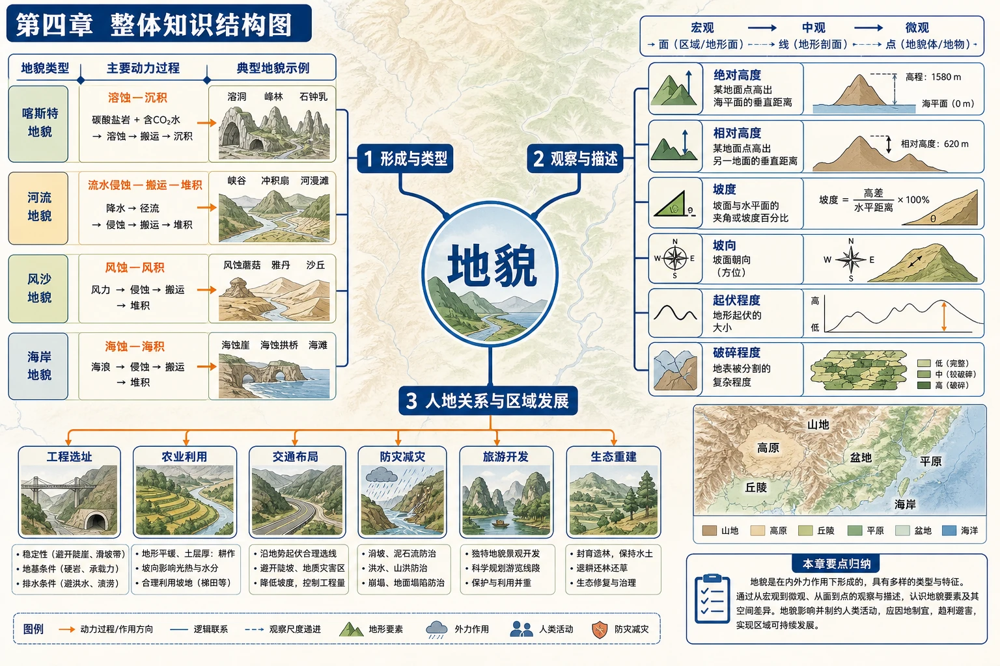

# 第四章 地貌·学习导图

<!-- 图片描述：第四章整体知识结构图，采用浅地形色背景。中心为“地貌”，第一层分出“形成与类型”“观察与描述”“人地关系与区域发展”；类型分支继续连接喀斯特、河流、风沙、海岸四类地貌，并分别标出溶蚀沉积、流水侵蚀搬运堆积、风蚀风积、海蚀海积等动力过程；观察分支按宏观到微观、面到点连接绝对高度、相对高度、坡度、坡向、起伏和破碎程度；应用分支连接工程选址、农业、交通、防灾、旅游和生态重建。 图面结构：中心主题先给出本图要解决的核心问题，周围分支是条件、过程、影响或措施。视频讲解顺序：再讲中心主题，说明这张图试图回答什么问题；沿箭头说明物质、能量、泥沙、养分、风险或管理措施的流向。讲解重点：先根据形态判断侵蚀、搬运还是堆积，再用物质来源、动力强弱和地形位置解释；剖面/演化图要讲清起点形态、外力作用、阶段变化和最终地貌；案例要按“区域背景—关键证据—机制解释—影响/效益—限制或对策”讲完。学习落点：用“形态证据—外力过程—空间位置—演化结果/人地关系”复述本图。 -->

## 一、全章核心问题

地貌是出露地表的岩石圈在大气圈、水圈和生物圈综合作用下形成的地表形态。它既是长期自然演化的结果，也仍在外力、人类活动等作用下不断变化。

本章围绕三组问题展开：

1. 常见地貌有哪些，分别由什么作用形成？
2. 怎样按规范顺序观察和描述地貌？
3. 地貌怎样影响生产生活，人类又应如何利用和保护地貌环境？

## 二、章节结构与学习顺序

### 1. 第一节 常见地貌类型

先学习四种常见地貌的“形态—过程—分布—影响”：

- 喀斯特地貌：可溶性岩石在流水溶蚀、淀积作用下形成，兼有地表和地下系统。
- 河流地貌：河流侵蚀、搬运和堆积形成V形谷、冲积平原、河曲、牛轭湖和三角洲。
- 风沙地貌：干旱或沙源丰富地区由风蚀、搬运和堆积形成雅丹、风蚀蘑菇和沙丘。
- 海岸地貌：海浪等侵蚀或堆积形成海蚀崖、海蚀平台、海蚀拱桥和海滩。

→ [[第一节 常见地貌类型|进入第一节]]

### 2. 第二节 地貌的观察

在认识典型地貌后，学习一套可迁移的观察方法：

- 顺序：从宏观到微观、从面到点。
- 工具：实地观察、等高线地形图、遥感影像、仪器和地形剖面图。
- 内容：绝对高度、相对高度、坡度、坡向、形状、面积、分布、起伏和破碎程度。
- 输出：用证据描述地貌，并联系土地利用、交通建设和安全风险。

→ [[第二节 地貌的观察|进入第二节]]

### 3. 章末问题研究

西南喀斯特峰丛山地把前两节知识转化为区域发展决策：地貌识别 → 脆弱性成因 → 发展制约 → 生态重建 → 产业与民生协同。

→ [[章末问题研究 如何提升我国西南喀斯特峰丛山地的经济发展水平|进入问题研究]]

## 三、四类地貌对比

| 地貌类型 | 主要外力 | 典型形态 | 主要分布条件 | 重要人地关系 |
|---|---|---|---|---|
| 喀斯特 | 流水溶蚀、淀积 | 溶沟、洼地、峰林、溶洞、石钟乳 | 可溶性岩石、裂隙、流水 | 地表崎岖、漏水，适宜旅游与特殊工程选址 |
| 河流 | 流水侵蚀、搬运、堆积 | V形谷、冲积平原、河曲、牛轭湖、三角洲 | 河流上中下游及河口 | 平原利农耕聚落，洪水与河岸变迁带来风险 |
| 风沙 | 风力侵蚀、搬运、堆积 | 风蚀蘑菇、雅丹、新月形沙丘 | 干旱、多风、沙源丰富、植被稀少 | 沙丘危害交通农牧业，也记录环境变化 |
| 海岸 | 海浪侵蚀与堆积 | 海蚀崖、海蚀平台、海蚀拱桥、海滩 | 岩石海岸或沉积物丰富海岸 | 港口、旅游、防护工程与岸线生态保护 |

## 四、全章机制链

### 1. 地貌形成的一般链条

物质基础（岩性、沉积物）＋动力条件（流水、风、海浪）＋地形与气候＋作用时间 → 侵蚀、搬运或堆积 → 特定地貌形态。

### 2. 地貌演化的动态性

地貌不是固定标签。例如喀斯特峰丛可逐渐演变为峰林、孤峰和残丘；河曲可能被洪水裁弯取直形成牛轭湖；海蚀崖会后退并扩大海蚀平台；沙丘会随盛行风移动。

### 3. 地貌与人类活动

地貌形态 → 决定建设难度、土地与水资源条件 → 影响农业、聚落、交通和产业布局；不合理活动又会加剧水土流失、石漠化、沙漠化和海岸侵蚀。

## 五、地貌识别与描述模板

### 1. 识别

> 区域位置与环境 → 图像形态特征 → 主要物质组成 → 主导外力作用 → 确定地貌类型。

### 2. 描述

> 海拔和相对高度 → 坡度与坡向 → 形状和规模 → 空间分布 → 起伏与破碎程度。

### 3. 解释成因

> 岩性或沙源等物质条件 + 流水、风或海浪等动力 + 气候、地形和植被条件 + 长期作用过程。

### 4. 评价影响

> 有利条件 + 不利条件 + 人类利用方式 + 生态风险 + 因地制宜对策。

## 六、图表判读总方法

1. 地貌景观图先看轮廓、坡面、谷地、沉积物和植被，再判断作用过程。
2. 地图先完成经纬度、海陆与地形定位，再分析地貌分布。
3. 等高线图看数值、疏密、弯曲和闭合，计算相对高度并判断坡陡缓。
4. 地形剖面图看海拔起伏、坡面组合和水平距离，补充平面图无法直观看出的信息。
5. 时序遥感图比较岸线、河道、植被等位置变化，建立“变化证据—过程解释”。
6. 所有结论都应回扣图中证据，避免只凭记忆套用地貌名称。

## 七、全章高频易混点

- 地形与地貌：地形强调高低起伏和基本形态，地貌更强调具体形态及形成过程。
- 峰丛与峰林：峰丛基座相连、山峰密集；峰林山峰较分散，常由峰丛进一步演化。
- 河流侵蚀与堆积：山区流速快、侵蚀强；平原及河口流速降低，堆积增强，但两种作用可同时存在。
- 风蚀与风积：雅丹、风蚀蘑菇主要是侵蚀地貌；沙丘主要是堆积地貌。
- 海蚀平台与海滩：前者是岩岸侵蚀后留下的平台，后者是碎屑物堆积形成。
- 绝对高度与相对高度：绝对高度以海平面为基准，相对高度是两点海拔之差。
- 坡度角与坡度百分比：二者都表坡陡缓，但数值不能直接等同。

## 八、复习路线

1. 用四列表比较四类地貌的动力、形态、分布和影响。
2. 默画四条演化链：喀斯特演化、河曲成牛轭湖、风蚀蘑菇、新月形沙丘。
3. 训练等高线上的高度、坡度和坡向判读。
4. 按“定位—读图—找因素—建链—分点”的顺序完成教材活动。
5. 最后用“生态保护与经济发展协同”评价喀斯特峰丛山地发展方案。
