# 第一节 常见地貌类型

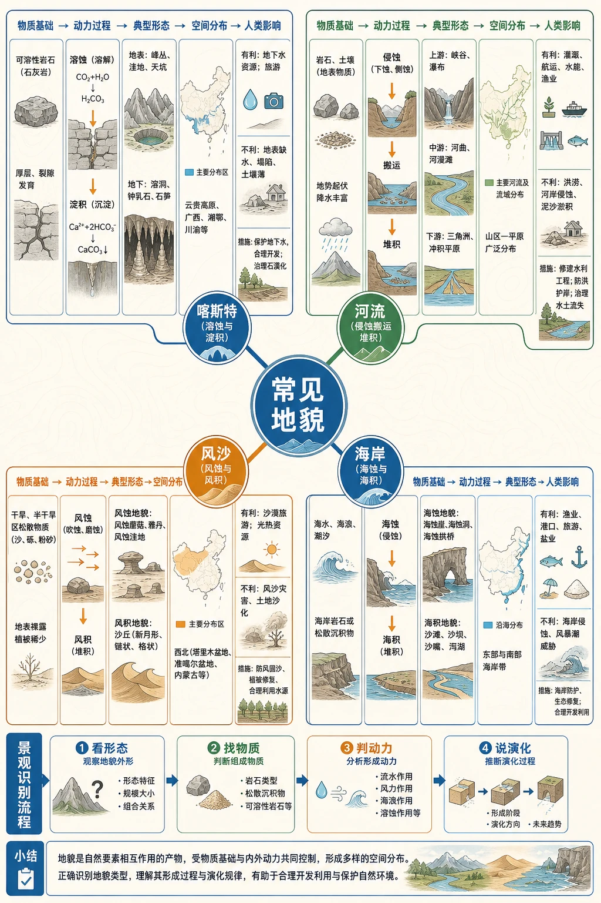
<!-- 图片描述：本节整体知识信息结构图，采用浅地形色背景和蓝、绿、橙分区。中心为“常见地貌”，向外分成喀斯特、河流、风沙、海岸四支；每支按“物质基础—动力过程—典型形态—空间分布—人类影响”排列。喀斯特突出溶蚀与淀积，河流突出侵蚀搬运堆积，风沙突出风蚀与风积，海岸突出海蚀与海积；底部设置景观识别流程“看形态—找物质—判动力—说演化”。 -->

## 知识关系导航

- 所属章节：[[章首 学习导图|第四章 地貌]]。
- 前置知识：流水过程可联系[[第一节 水循环|水循环中的地表径流]]，海岸作用可联系[[第三节 海水的运动|海浪及其地貌作用]]。
- 后续方法：识别典型形态后，需在[[第二节 地貌的观察|地貌的观察]]中用高度、坡度和空间组合进行规范描述。
- 综合应用：喀斯特环境脆弱性将用于[[章末问题研究 如何提升我国西南喀斯特峰丛山地的经济发展水平|西南喀斯特区域发展评价]]。

## 本节学习目标

1. 说明喀斯特、河流、风沙和海岸地貌的主要形态及分布条件。
2. 建立“物质基础—外力过程—地貌形态”的形成机制链。
3. 根据景观图、剖面图、地图和时序影像识别地貌并提取证据。
4. 解释峰林演化、牛轭湖形成、沙丘移动和海蚀崖后退等动态过程。
5. 评价典型地貌对农业、聚落、交通、工程、旅游和生态环境的影响。
6. 完成射电望远镜选址、丹娘沙丘和红柳沙包等教材活动。

## 核心知识点讲解

### 一、区域定位与地理情境

教材从桂林漓江两岸的峰林景观切入。徐霞客所说的“峭峰离立，分行竞颖”，描述的是我国西南喀斯特地貌。广西、贵州、云南等地可溶性碳酸盐岩分布广、气候较湿润，流水长期作用形成了峰丛、峰林、洼地和溶洞等复杂景观。

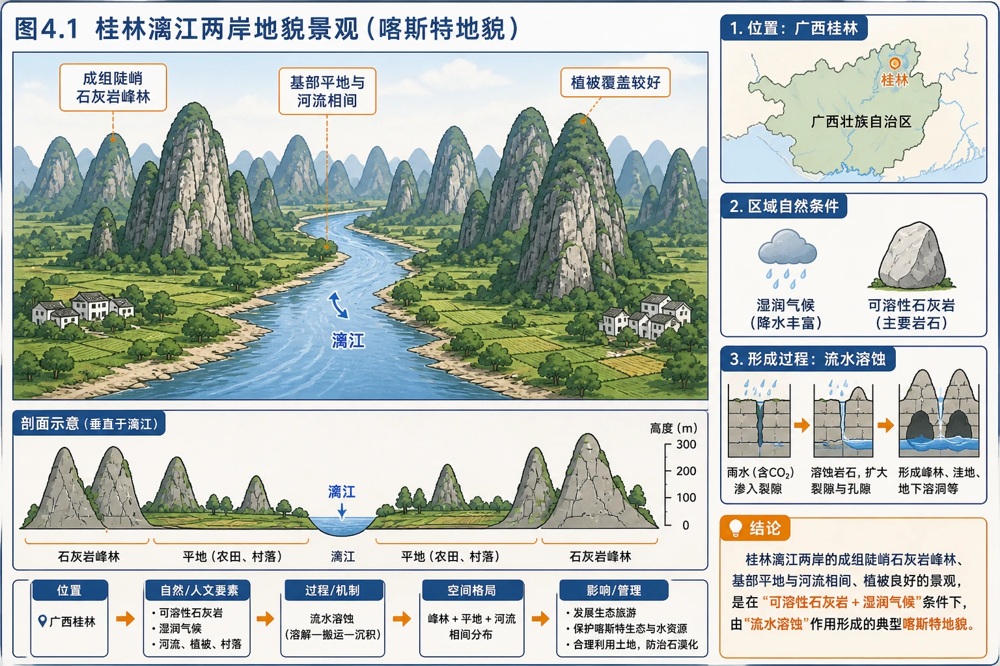
<!-- 图片描述：对应源文图4.1“桂林漓江两岸地貌景观”。画面以漓江为蓝色轴线，两岸为成组陡峭石灰岩峰林，山峰相对独立、基部平地和河流相间，植被覆盖较好；标注“广西桂林”“可溶性石灰岩”“湿润气候”“流水溶蚀”，帮助学生由景观形态识别喀斯特地貌及其区域条件。 -->

从空间上看，本节四类地貌各有典型环境，但不能机械对应：

- 喀斯特常见于可溶性岩石分布区，我国西南最典型。
- 河流地貌沿河流从山地到平原、河口连续分布。
- 风沙地貌集中于干旱、多风、沙源丰富区，也可出现在河谷、湖岸和海岸。
- 海岸地貌位于陆海交界，受海浪、潮汐、沿岸流和物质供应共同影响。

### 二、核心概念与地理要素

#### 1. 喀斯特地貌

喀斯特地貌是可溶性岩石在适当条件下被水溶蚀、物质被带走或重新淀积而形成的地表和地下地貌总称。石灰岩最常见，但“有石灰岩”并不足够，还需要岩石裂隙发育、水量较充足、水具有一定溶蚀能力并经历较长时间。

**地表形态**：

- 溶沟：地表水沿裂隙溶蚀形成长条形或网格状沟槽，地面崎岖。
- 洼地：溶沟扩大、连通后形成较大封闭或半封闭低地；底部较平坦的“坝子”常是重要耕作和聚落空间。
- 峰丛：山峰密集且基座相连。
- 峰林：山峰较分散、相对独立，基部常有较平坦地面。
- 孤峰与残丘：峰林进一步遭受溶蚀、侵蚀后留下的孤立山峰和低矮残余丘体。

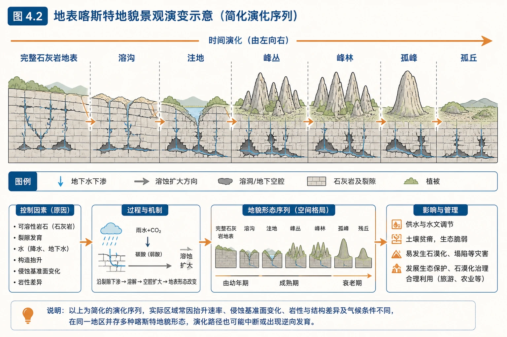
<!-- 图片描述：对应源文图4.2“地表喀斯特地貌景观演变示意”。横向连续剖面从完整石灰岩地表开始，依次标出溶沟、洼地、峰丛、峰林、孤峰、残丘；蓝色水流沿裂隙下渗，灰色箭头表示溶蚀扩大，时间箭头由左向右。图中强调这是一种简化演化序列，实际区域会因抬升、侵蚀基准面和岩性差异而并存多种形态。 -->

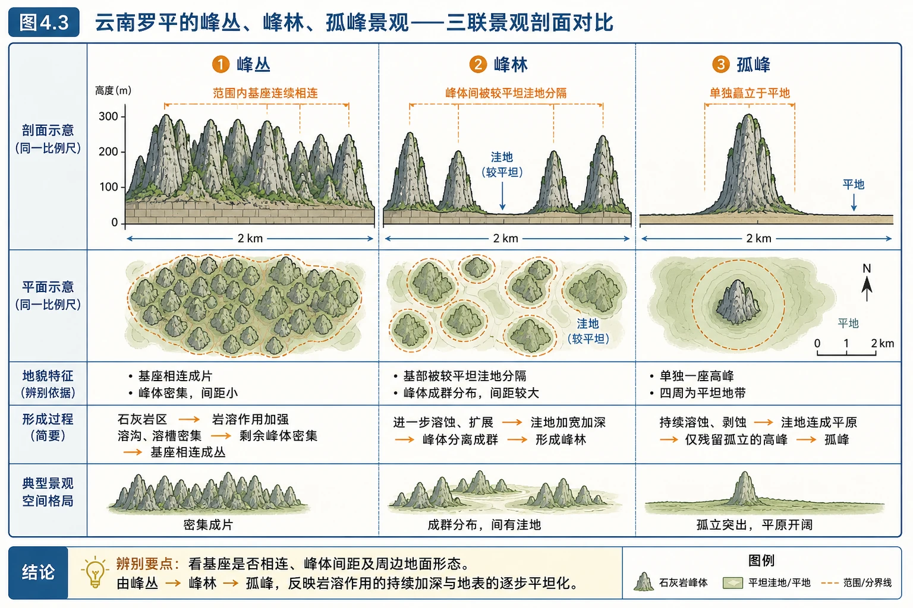
<!-- 图片描述：对应源文图4.3“云南罗平的峰丛、峰林、孤峰景观”。使用三联景观剖面对比：峰丛基座相连且峰体密集，峰林基部被较平坦洼地分隔，孤峰单独矗立于平地；用相同尺度线和轮廓标注突出三者辨别依据，而不是仅展示风景。 -->

**地下形态**：以溶洞为主。地表水沿裂隙下渗并溶蚀岩石，使裂隙扩大成为地下通道和洞穴。含碳酸氢钙的滴水进入洞穴后，因二氧化碳逸出等原因使碳酸钙淀积：洞顶向下形成石钟乳、石幔或石帘；洞底向上形成石笋；二者连接成为石柱。

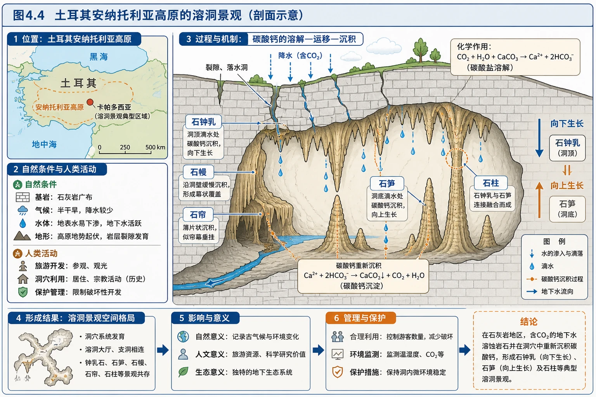
<!-- 图片描述：对应源文图4.4“土耳其安纳托利亚高原的溶洞景观”。溶洞剖面中标出洞顶石钟乳、石幔、石帘，洞底石笋以及相连的石柱；蓝色滴水箭头和化学沉淀符号显示碳酸钙重新淀积，旁边用“向下生长／向上生长”对比石钟乳与石笋。 -->

#### 2. 河流地貌

河流通过侵蚀、搬运和堆积塑造地表。主导作用随坡度、流速、流量、泥沙和河床物质变化。

- V形河谷：山区坡陡、河流下切侵蚀强，谷深、岸陡、谷底窄，河床常见巨石和卵石。
- 冲积平原：河流流出山地或进入平缓地区，流速下降，泥沙大量堆积形成地势平坦的平原。
- 河曲：平缓地区河流侧蚀明显，河道呈S形弯曲。
- 牛轭湖：洪水切穿河曲颈部，原弯曲河段与主河道分离形成弯月形湖泊。
- 三角洲：河流入海或入湖时坡度、流速下降，若泥沙沉积速度大于海浪、潮流等搬走速度，河口向外堆积形成。

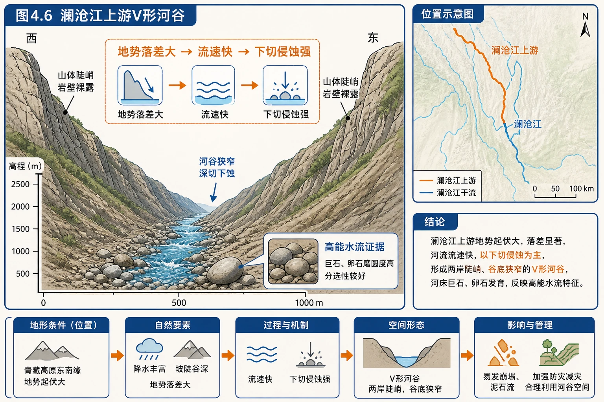
<!-- 图片描述：对应源文图4.6“澜沧江上游V形河谷”。山地河谷横剖面呈明显V形，两侧岸壁陡、谷底狭窄，蓝色河流深切其间；标出“地势落差大—流速快—下切侵蚀强”，河床绘出巨石和卵石作为高能水流证据。 -->

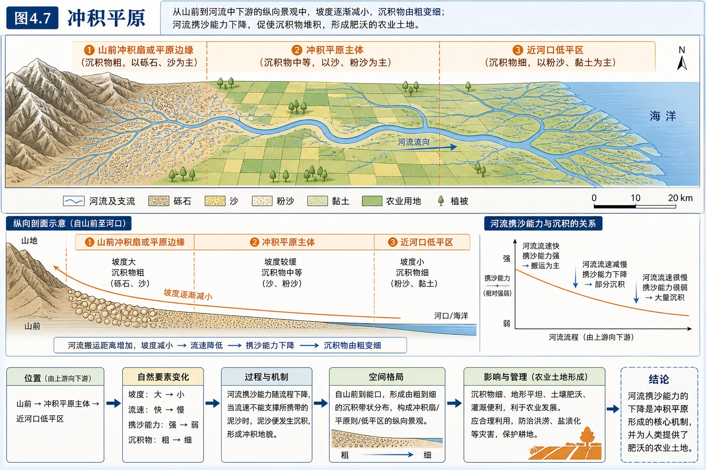
<!-- 图片描述：对应源文图4.7“冲积平原”。从山前到河流中下游的纵向景观中，坡度逐渐减小，沉积物由粗变细；分区标注山前冲积扇或平原边缘、冲积平原主体和近河口低平区，展示河流携沙能力下降与农业土地形成的关系。 -->

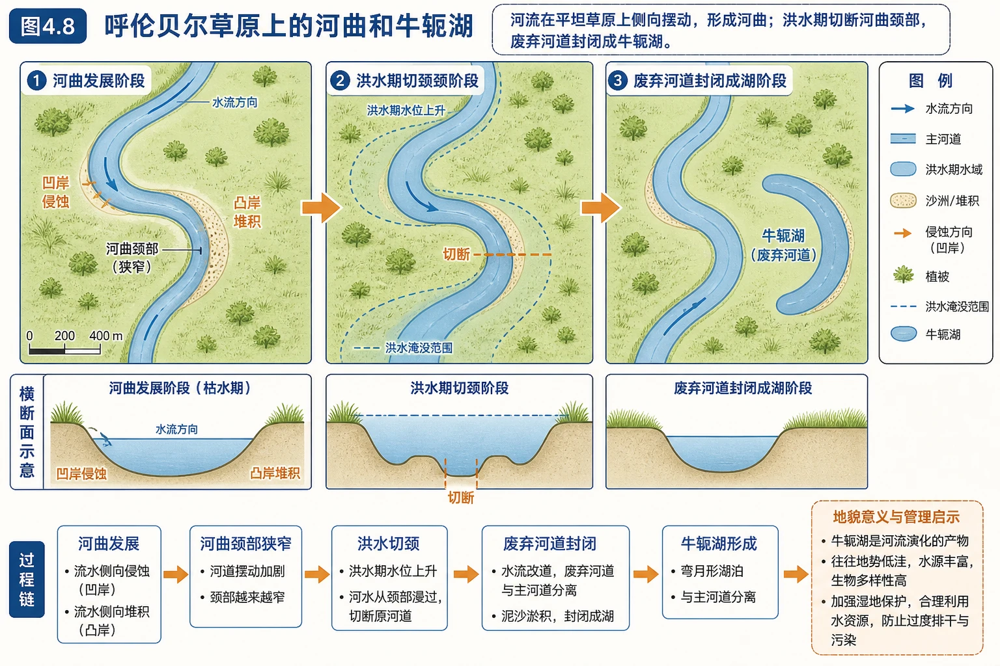
<!-- 图片描述：对应源文图4.8“呼伦贝尔草原上的河曲和牛轭湖”。俯视图显示S形河道、凹岸侵蚀、凸岸堆积、狭窄河曲颈部及旁侧弯月形牛轭湖；用三阶段小图和箭头表现河曲发展—洪水切颈—废弃河道封闭成湖。 -->

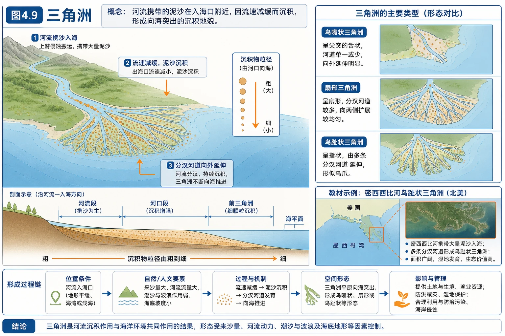
<!-- 图片描述：对应源文图4.9“三角洲”。左侧为河流携带泥沙进入海洋，分汊河道向外延伸；粒径图例表示由河口向海沉积物变细；右侧用小轮廓对比鸟嘴状、扇形、鸟趾状三角洲，并以密西西比河鸟趾状三角洲为教材示例。 -->

#### 3. 风沙地貌

风沙地貌是以风力作用为主形成的地貌。形成条件通常包括较强且频繁的风、丰富松散沙源、干燥地表和稀疏植被。

**风蚀地貌**：

- 风蚀蘑菇：近地面含沙气流多、沙粒大，对孤立岩石下部磨蚀更强，形成上宽下窄的蘑菇状形态。
- 雅丹：干燥湖积层或松散沉积物受定向风长期侵蚀，形成沟槽和垄脊相间的地貌；垄脊走向通常与主风向大致一致。

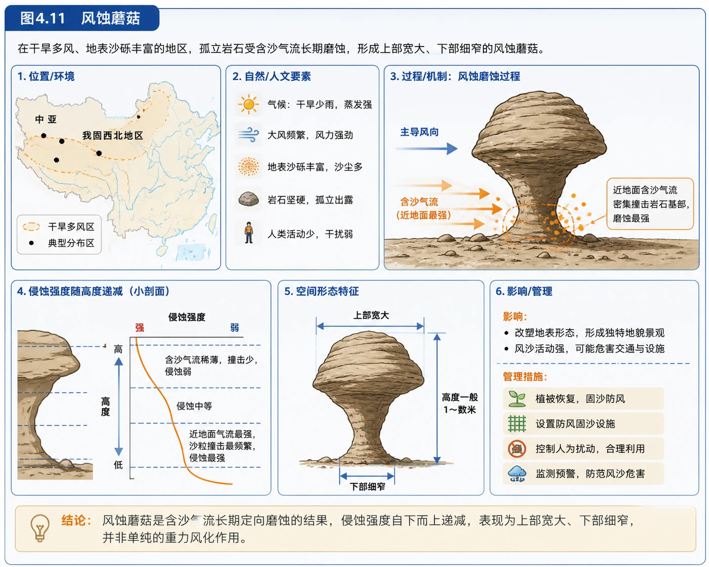
<!-- 图片描述：对应源文图4.11“风蚀蘑菇”。孤立岩石上部宽、下部细，近地面橙色含沙气流密集撞击岩石基部；用侵蚀强度随高度递减的小剖面说明下部磨蚀更强，避免误解为单纯重力风化。 -->

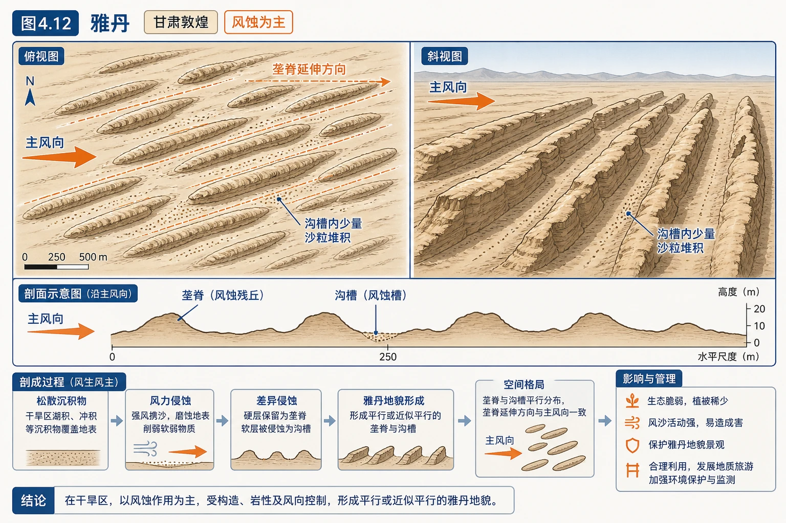
<!-- 图片描述：对应源文图4.12“雅丹”。俯视与斜视结合显示平行或近似平行的垄脊和沟槽，主风向箭头与垄脊延伸方向一致，沟槽内有少量沙粒堆积；标注甘肃敦煌和“风蚀为主”。 -->

**风积地貌**：沙丘是风搬运的沙粒因风速下降或受阻而堆积形成。新月形沙丘迎风坡缓、背风坡陡，两翼顺风向前伸；沙丘链延伸方向大致与盛行风向垂直。无植被固定的沙丘可不断移动。

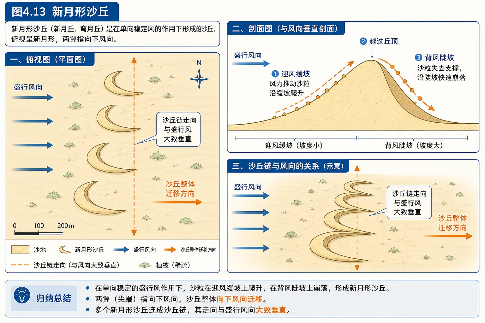
<!-- 图片描述：对应源文图4.13“新月形沙丘”。同时给出俯视和剖面：俯视呈新月形，两翼指向下风向；剖面标出迎风缓坡、沙粒沿坡爬升、越过丘顶后在背风陡坡崩落。用箭头标示风向、沙粒运动和沙丘整体迁移方向，并说明沙丘链与盛行风大致垂直。 -->

#### 4. 海岸地貌

海岸地貌是海岸在海浪等作用下形成的地貌，可分为侵蚀地貌和堆积地貌。

**海岸侵蚀地貌**：海浪集中冲击岩岸底部形成海蚀穴；穴体扩大使上部岩体失稳崩塌，形成海蚀崖；海蚀崖不断后退，前方留下微向海倾斜的海蚀平台。海岬两侧海蚀穴贯通可形成海蚀拱桥，拱顶坍塌后可残留海蚀柱。

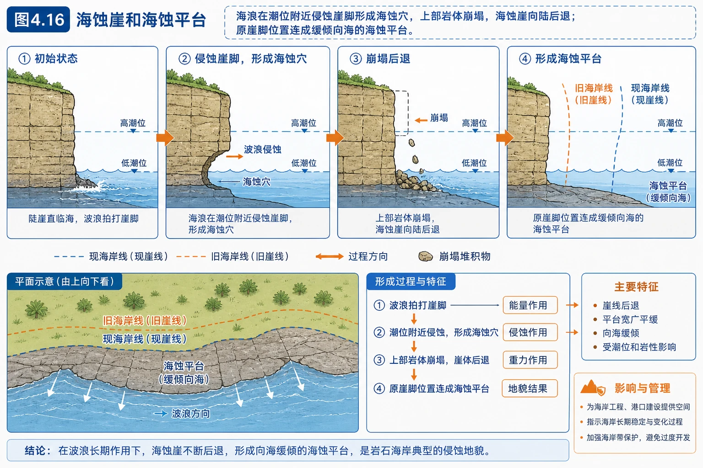
<!-- 图片描述：对应源文图4.16“海蚀崖和海蚀平台”。岩石海岸剖面显示海浪在潮位附近侵蚀崖脚形成海蚀穴，上部岩体崩塌，海蚀崖向陆后退；原崖脚位置连成缓倾向海的海蚀平台。用虚线标出旧海岸线与现海岸线，突出动态演化。 -->

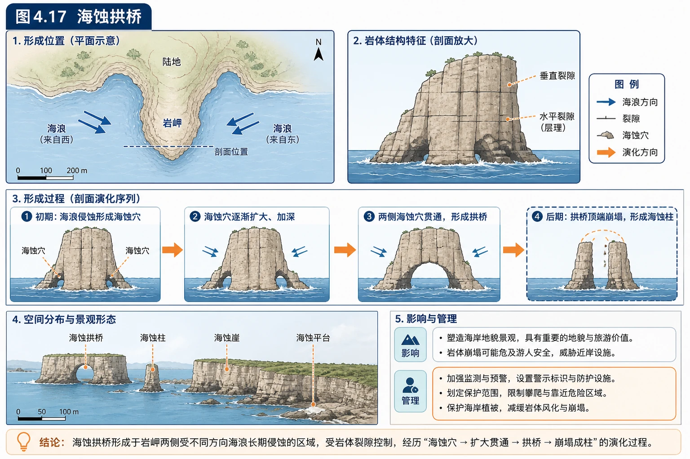
<!-- 图片描述：对应源文图4.17“海蚀拱桥”。向海突出的岩岬两侧受到不同方向海浪侵蚀，海蚀穴逐渐扩大并贯通形成拱桥；双向蓝色浪箭头和岩体裂隙说明形成位置与过程，并提示后续可能坍塌为海蚀柱。 -->

**海岸堆积地貌**：海浪和沿岸流搬运的砾石、沙和泥在能量减弱处堆积，形成砾滩、沙滩、泥滩和沙坝等。颗粒较粗的物质需要较强水动力才能搬运，细泥更容易在平静浅水区沉积。

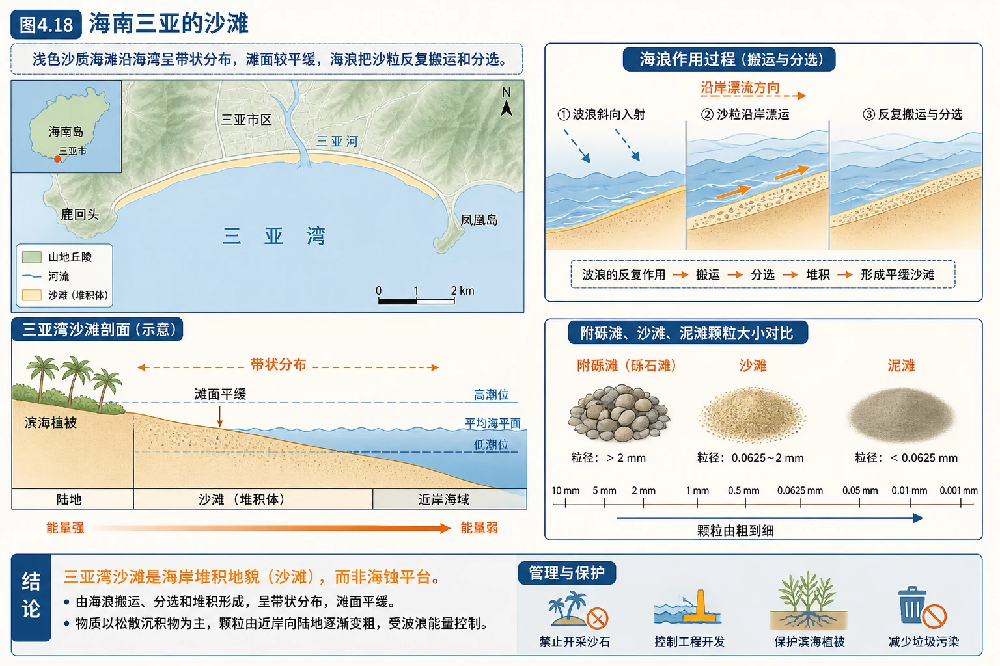
<!-- 图片描述：对应源文图4.18“海南三亚的沙滩”。浅色沙质海滩沿海湾呈带状分布，滩面较平缓，海浪把沙粒反复搬运和分选；附砾滩、沙滩、泥滩颗粒大小对比条，突出三亚为海岸堆积地貌而非海蚀平台。 -->

### 三、过程机制与成因链条

#### 1. 喀斯特发育链

可溶性岩石广布 + 裂隙发育 + 含二氧化碳的水渗入 → 岩石溶解、裂隙扩大 → 地表形成溶沟洼地峰丛峰林，地下形成溶洞暗河 → 洞穴滴水中物质重新淀积形成钟乳石类。

喀斯特地貌既有“物质被带走”的溶蚀，也有“物质重新沉积”的淀积，不能只记侵蚀。

#### 2. 河流作用的空间变化

山区坡陡、流速快 → 下切侵蚀和搬运强 → V形谷；进入平原后坡度降低、流速减慢 → 侧蚀和堆积增强 → 宽浅河谷、冲积平原与河曲；入海或入湖时能量进一步下降 → 大量泥沙堆积 → 三角洲。

这是一条总体规律。局部河段受洪水、地壳抬升、河岸材料和人工工程影响，也可能出现例外。

#### 3. 黄河三角洲海岸推进

黄土高原水土流失 → 黄河含沙量大 → 河流把泥沙搬到入海口 → 河口流速下降、泥沙沉积 → 新陆地形成、海岸线向海推进。

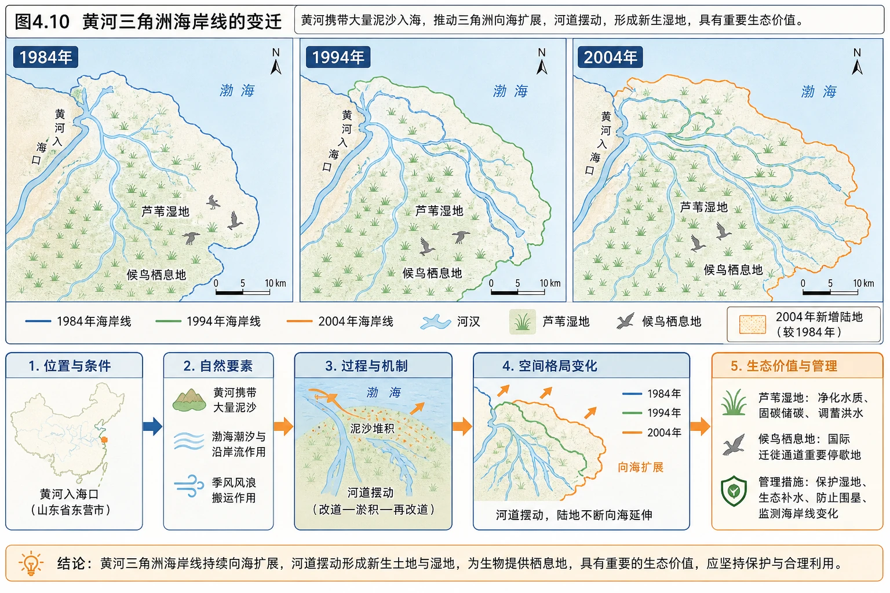
<!-- 图片描述：对应源文图4.10“黄河三角洲海岸线的变迁”。三幅同尺度遥感或轮廓图分别标1984、1994、2004年，使用不同颜色叠加海岸线，显示黄河入海口附近新生陆地向海扩展且河道摆动；同时标出芦苇湿地、河汊和候鸟栖息地，提示新生土地具有生态价值。 -->

所谓“年轻”既指土地形成时间短，也意味着土壤、植被、河网和人类利用仍处在快速变化中。若上游水沙条件或入海口位置改变，三角洲的增长速度和方向也会改变。

#### 4. 丹娘沙丘形成链

夏季降水集中、河流水位高 → 河流携带并沉积大量沙粒；冬春水位下降 → 河漫滩和沙洲出露，提供松散沙源；冬春盛行较强风 → 沙粒被吹向北岸 → 北岸山麓地形阻挡使风速下降 → 沙粒堆积成大型沙丘。

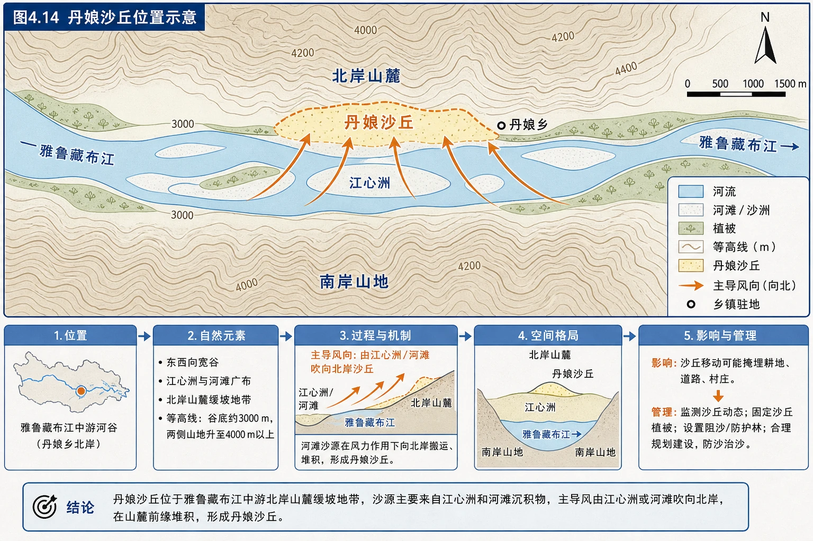
<!-- 图片描述：对应源文图4.14“丹娘沙丘位置示意”。地图标出雅鲁藏布江东西向河谷、江心洲、丹娘乡、北岸山麓和丹娘沙丘，等高线由谷底约3000米向两侧山地升至4000米以上；风向箭头由江心洲或河滩指向北岸沙丘，比例尺和指北针完整，用于判断沙源与主导风向。 -->

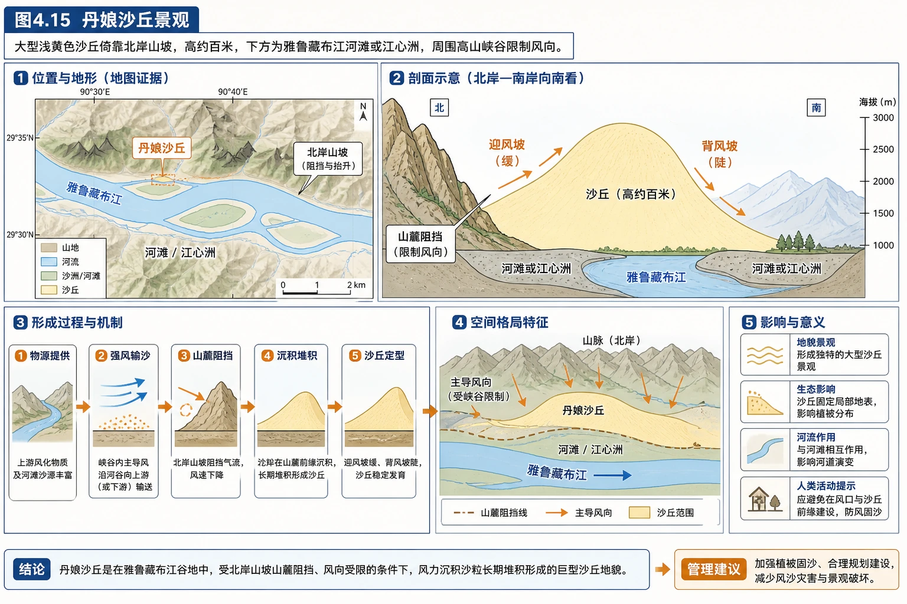
<!-- 图片描述：对应源文图4.15“丹娘沙丘景观”。大型浅黄色沙丘倚靠北岸山坡，高约百米，下方为雅鲁藏布江河滩或江心洲，周围高山峡谷限制风向；标注沙丘迎风坡、背风坡和山麓阻挡位置，连接地图证据与形成过程。 -->

#### 5. 海蚀海积的能量差异

海浪能量强、岩岸突出或岩体裂隙发育 → 侵蚀占优势；海湾较平静、沿岸物源丰富、海浪能量降低 → 堆积占优势。同一海岸不同地段可同时发生侵蚀、搬运和堆积。

### 四、空间分布、图表判读与证据

#### 1. 景观图识别证据

| 景观线索 | 可能地貌 | 关键证据 |
|---|---|---|
| 峰体陡立、成群，洼地或洞穴发育 | 喀斯特 | 可溶性岩石、峰丛峰林、地下洞穴 |
| 谷深岸陡、横剖面V形 | 河流侵蚀地貌 | 山区、下切侵蚀、谷底狭窄 |
| 沟槽垄脊平行排列 | 雅丹 | 干旱、多风、垄脊顺主风向 |
| 新月形沙丘、缓迎风坡陡背风坡 | 风积地貌 | 沙源、风向、沙丘移动 |
| 陡崖前有岩石平台 | 海蚀地貌 | 海浪侵蚀、崖体后退 |
| 平缓岸滩由沙泥砾组成 | 海积地貌 | 碎屑物堆积和分选 |

#### 2. 时序图判读

黄河三角洲图不能只回答“面积变大”。应依次写：比较年份 → 找固定参照物 → 描述岸线推进方向和河道变化 → 计算或判断新增陆地 → 用泥沙堆积解释 → 评价湿地、土地与洪水风险。

#### 3. 风向判读

- 新月形沙丘：缓坡为迎风坡，陡坡和两翼伸展方向指向下风向。
- 雅丹：垄脊延伸方向通常与主风向一致，但仅凭一幅景观图可能无法判断风从哪一端吹来，需结合侵蚀形态或区域风资料。
- 沙丘链：长轴或链的延伸方向大致与主风向垂直。

#### 4. 红柳沙包：沉积层中的环境档案

红柳根系发达，可阻挡风沙。秋季形成枯枝落叶层，春夏大风携沙在灌丛中沉积形成风沙层；两类沉积逐年交替，构成类似年轮的纹层。

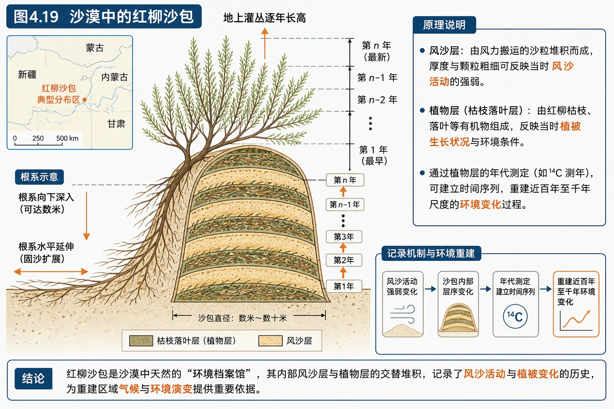
<!-- 图片描述：对应源文图4.19“沙漠中的红柳沙包”。剖面展示红柳根系向下和水平延伸，地上灌丛逐年长高；沙包内部以绿色褐色“枯枝落叶层”和浅黄色“风沙层”交替排列，并用年度箭头连接。旁边说明风沙层厚度和颗粒可反映风沙活动，植物层及年代测定可重建近百年至千年环境变化。 -->

科学家可通过纹层厚度、粒度、有机质、花粉和年代信息推测不同年份或时期的风沙强度、植被状况和气候变化。但纹层与年份是否一一对应需要测年验证，不能简单把每两层都当作一年。

### 五、人地关系、影响与对策

#### 1. 喀斯特地貌

有利：景观独特，旅游和科研价值高；洼地坝子地势较平，是有限的农耕与聚落空间；天然洼地适合某些大型工程选址。

不利：地表崎岖、交通建设难；土层薄且易流失；裂隙和地下河发育导致地表水易漏失；工程建设需防塌陷和地下空洞。

#### 2. 河流地貌

冲积平原和三角洲地势低平、土壤较肥沃、水源便利，利于农业、聚落和交通；但洪水、河道摆动、岸线冲淤和地基沉降风险也较高。牛轭湖和河漫滩还是重要湿地，不宜全部围垦。

#### 3. 风沙地貌

流动沙丘可能掩埋道路、农田和牧场。治理应减少地表扰动，采用草方格沙障、灌草植被、防护林和工程阻沙，并根据风向布设。固定沙丘不能简单等同“没有风”，而是植被等使沙粒难以再次起动。

#### 4. 海岸地貌

沙滩具有旅游价值，海湾和堆积岸可服务港口或养殖，但岸线开发会改变波浪和泥沙输送。防护应兼顾海堤、防波堤等工程与湿地、沙滩、红树林等生态缓冲，避免只保护局部导致邻岸侵蚀。

### 六、综合题型与迁移应用

#### 1. FAST选址贵州平塘

贵州湿润、多喀斯特洼地；大窝凼天然呈“巨碗”，半径超过300米，底部裂隙与地下河相连。其形态接近望远镜所需半球形坑，可减少土石方；地下排水通畅，有利于暴雨后排水；群山深处人口较少、无线电干扰较弱，但后者需结合工程资料判断。

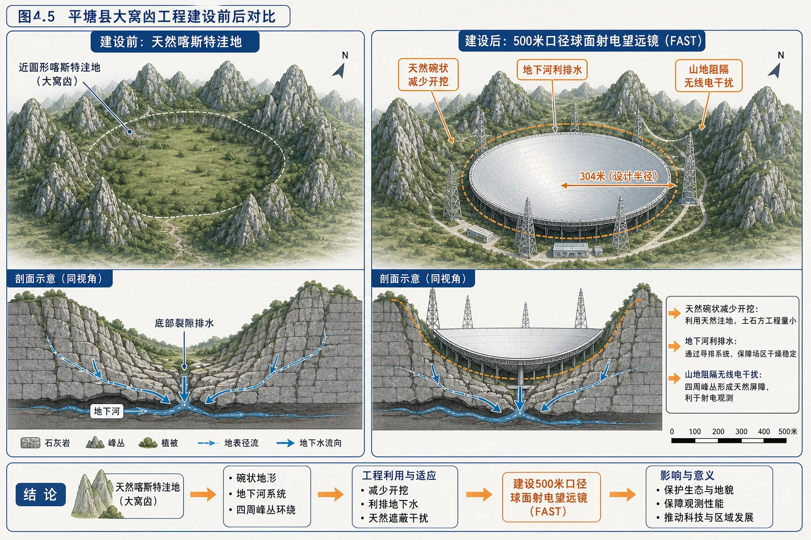
<!-- 图片描述：对应源文图4.5“平塘县大窝凼工程建设前后对比”。左右同视角对照：建设前为近圆形喀斯特洼地、四周峰丛环绕、底部裂隙排水；建设后为500米口径球面射电望远镜。叠加半径304米设计轮廓，箭头标出“天然碗状减少开挖”“地下河利排水”“山地阻隔无线电干扰”。 -->

#### 2. 地貌成因综合题答题路径

> 定位气候与地形 → 找岩性或沙泥物源 → 判断流水、风、海浪动力 → 描述侵蚀搬运堆积过程 → 对应题图形态 → 补充时间尺度和人类影响。

#### 3. 多地貌叠加

雅鲁藏布江河谷中的丹娘沙丘说明，风沙地貌不只存在于沙漠。河流先提供沙源，季节性水位变化使沙洲出露，河谷风再搬运并在山麓堆积。综合题常考“前一外力提供物质，后一外力重新塑造”的复合过程。

## 重点梳理

### 1. 四种地貌的识别核心

- 喀斯特：可溶性岩石＋水；地表溶沟峰林，地下溶洞钟乳石。
- 河流：上游侵蚀、平原侧蚀堆积、河口堆积；V形谷到三角洲呈空间变化。
- 风沙：风蚀形成蘑菇和雅丹，风积形成沙丘；先判沙源和风向。
- 海岸：岩岸常见海蚀系列，碎屑物供应和低能环境形成海滩等海积地貌。

### 2. 必会演化链

- 溶沟—洼地—峰丛—峰林—孤峰—残丘。
- 河曲扩大—洪水切颈—旧河道封闭—牛轭湖。
- 海蚀穴扩大—崩塌—海蚀崖后退—海蚀平台扩大。
- 沙粒迎风坡爬升—背风坡崩落—沙丘向下风向移动。

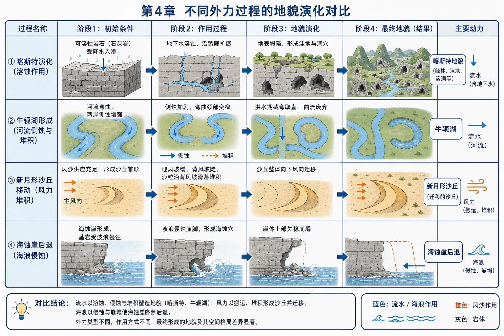
<!-- 图片描述：本节重点过程对比图，四行并列绘制喀斯特演化、牛轭湖形成、新月形沙丘移动和海蚀崖后退；每行只保留3—5个关键阶段、动力箭头和最终地貌名称，蓝色用于流水海浪、橙色用于风沙、灰色用于岩体，供复习时比较不同外力过程。 -->

### 3. 人地关系

地貌既提供土地、景观、水源和工程空间，也带来漏水、崎岖、洪水、流沙和岸线侵蚀等限制。利用原则是识别过程、顺应规律、控制强度、保护生态。

## 难点突破

### 1. 外力作用不是互相排斥

同一地貌过程常包含侵蚀、搬运和堆积。黄河三角洲的泥沙先在上中游被侵蚀，再被河流搬运，最后在河口堆积；只写“流水堆积”会丢失物源链条。

### 2. 形态相似不代表成因相同

喀斯特洼地、火山口、风蚀洼地都可能外观低陷；必须结合岩性、区域气候、伴生地貌和水系特征判断。

### 3. 峰丛峰林演化不是绝对单线

教材序列用于理解长期溶蚀趋势，但真实地貌受地壳抬升、侵蚀基准面、岩层厚度和裂隙控制，同一区域可并存多种阶段，不能根据一个山峰机械推断“年龄”。

### 4. 河流弯道凹凸岸

弯道水流受惯性等影响，主流线偏向凹岸，凹岸流速较快、侵蚀较强；凸岸流速较慢、泥沙堆积。河曲会不断侧向迁移并可能最终裁弯取直。

### 5. 沙丘风向判断

迎风坡缓、背风坡陡；新月形两翼指向下风向。若图中只有沙丘链长轴，只能判断主风向大致与其垂直，通常还不能确定风从两个相反方向中的哪一侧吹来。

### 6. 海岸侵蚀与堆积的动态平衡

沙滩是否稳定取决于泥沙输入与输出。上游水库拦沙、港口突堤改变沿岸流或采砂，都可能让原本堆积的海岸转为侵蚀。

## 例题讲解

### 例1 教材活动：FAST为何选址大窝凼

**定位**：贵州平塘，低纬湿润的喀斯特山区。

**读图与材料**：洼地形似巨碗、半径超过300米；底部裂隙与地下河相连；设计需半径304米的半球状大坑且排水通畅。

**答案**：

1. 气候湿润、降水较多；喀斯特地貌广布，峰丛环绕，天然洼地近圆形且规模大。
2. 洼地形态和尺度接近工程要求，可利用天然地形，减少开挖土石方和建设成本。
3. 可溶性岩石裂隙和地下河发育，地表水易下渗排走，洼地不易长期积水。工程仍需防范地下空洞、塌陷和暴雨排水风险。

### 例2 教材案例：黄河三角洲为什么“年轻”

**分析链**：黄土高原水土流失提供大量泥沙 → 黄河搬运 → 入海口流速降低 → 泥沙沉积 → 海岸线向海推进、新生陆地增加。

**答案**：土地形成时间较短且仍在快速增加，河汊、水塘和芦苇湿地发育，人类活动相对较少，因此称“年轻”。其价值不仅是后备土地，还包括候鸟迁徙和湿地生态功能。

### 例3 教材活动：丹娘沙丘

**问题1：描述沙丘所在河谷。**

河谷海拔约3000米，南北两侧山地多在3500—4500米，谷地狭长、相对高度大；雅鲁藏布江曲流和江心洲发育，丹娘沙丘位于北岸山麓。

**问题2：推测沙源。**

沙源主要来自雅鲁藏布江河滩和江心洲。夏季河流搬运并沉积泥沙，冬春枯水期沙洲出露；此时植被少、物质松散，容易被风搬运。

**问题3：推测主导风向。**

根据沙源在河道、沙丘位于北岸山麓，可推测搬沙风总体由河道吹向北岸，即偏南风；峡谷地形会使局地风向沿谷或受山坡导引，最终结论应以图中沙丘迎背风坡及当地风资料验证。

### 例4 教材思考：新月形沙丘判风向

迎风坡受风推动，沙粒缓慢爬升，坡度较缓；越过丘顶后沙粒在背风侧崩落，形成较陡坡。故由缓坡指向陡坡为下风方向，两翼也伸向下风向。我国西北许多沙丘链长轴与盛行风大致垂直。

### 例5 红柳沙包如何记录环境变化

红柳每年形成枯枝落叶，风季又沉积沙层，两类沉积交替保存。风沙层厚、粒径粗可能表示风沙活动较强；有机层、花粉和植物残体可反映植被与水分条件。结合碳十四或其他年代方法，可重建较长时期环境变化，但必须排除层位缺失和扰动。

## 易错点整理

1. 把喀斯特地貌等同于溶洞。喀斯特包括地表和地下完整系统。
2. 认为石钟乳是从洞底向上长。石钟乳向下，石笋向上，连接为石柱。
3. 认为河流上游只有侵蚀、下游只有堆积。说的是主导作用，侵蚀搬运堆积可同时发生。
4. 把牛轭湖当作河流源头湖泊。它来自河曲裁弯取直后废弃河道。
5. 认为雅丹垄脊与主风向垂直。雅丹垄脊通常顺主风向延伸；沙丘链才大致与主风向垂直。
6. 认为新月形沙丘陡坡迎风。迎风坡缓、背风坡陡。
7. 把海蚀平台当成沙滩。海蚀平台由岩岸侵蚀后退形成，沙滩由沉积物堆积形成。
8. 评价地貌只写不利影响。应同时分析资源、土地、景观价值和灾害生态风险。

## 考点考证点整理

### 考点一：喀斯特地貌识别与工程评价

- 出题思路：提供峰林、洼地、溶洞景观或西南地区材料，要求识别、解释成因或评价工程条件。
- 关键条件：可溶性岩石、裂隙发育、湿润气候、地表水下渗、地下河。
- 解答要点：写出岩性和水两个基础条件，说明溶蚀或淀积过程；工程评价兼顾天然地形、排水与塌陷漏水风险。
- 易扣分点：只答“流水侵蚀”，遗漏可溶性岩石；只写优势，不写地下空洞等限制。

### 考点二：河流地貌的空间演化

- 出题思路：给河流纵剖面、景观或上中下游位置，判断V形谷、冲积平原、河曲、三角洲。
- 关键条件：坡度、流速、河谷宽窄、泥沙粒径、河口海洋动力。
- 解答要点：从流速和携沙能力变化说明侵蚀搬运堆积；河口三角洲还要比较泥沙输入和海水搬运。
- 易扣分点：不说明流速下降；把冲积平原写成海浪堆积；忽略黄河泥沙来源。

### 考点三：风向与沙丘成因

- 出题思路：提供新月形沙丘照片、等高线或河谷沙丘材料，判断风向、沙源和形成季节。
- 关键条件：缓迎风坡、陡背风坡、两翼方向、河流水位季节变化、植被与山地阻挡。
- 解答要点：先找沙源，再写风搬运和地形阻挡堆积；风向由缓坡吹向陡坡，或由沙源指向堆积区。
- 易扣分点：只凭沙丘链确定风的具体来向；遗漏河流先沉积泥沙这一前期过程。

### 考点四：海岸地貌过程判读

- 出题思路：给岩岸剖面、海湾照片或岸线变化图，辨别海蚀与海积地貌并解释演化。
- 关键条件：岩石海岸、裂隙、海浪能量、泥沙来源、岸线进退。
- 解答要点：海蚀穴—崩塌—海蚀崖后退—平台扩大；海滩则说明海浪搬运、分选和能量减弱后的堆积。
- 易扣分点：把所有海岸变化都归因于海浪；不区分侵蚀和堆积证据。

### 考点五：地貌对人类活动的影响

- 出题思路：以农业、交通、聚落、旅游或生态保护为情境，要求评价某地貌的利弊和措施。
- 关键条件：坡度、土层、水源、灾害、景观价值、交通通达度和生态脆弱性。
- 解答要点：按“有利—不利—因地制宜利用—保护治理”分点，并对应具体地貌特征。
- 易扣分点：措施空泛，如只写“保护环境”；自然条件与措施不对应。

## 练习题

### 1. 教材活动：大窝凼选址

大窝凼位于贵州喀斯特山区，形如巨碗、半径超过300米，底部裂隙连通地下河。简述其气候和地貌特点，分析它在大型球面射电望远镜基建与排水方面的优势。

### 2. 教材思考：沙丘风向

某新月形沙丘西坡缓、东坡陡。判断主导风向；若多个沙丘连接成南北向沙丘链，说明沙丘链与主风向的关系。

### 3. 教材活动：丹娘沙丘

雅鲁藏布江中游夏季水位高、冬春水位低且多大风。丹娘沙丘位于河流北岸山麓。描述河谷特征，推测沙源地和形成过程。

### 4. 基础辨析

分别指出峰丛与峰林、海蚀平台与沙滩的主要区别。

### 5. 过程解释

用四个阶段说明牛轭湖的形成过程。

### 6. 图表判读

某三角洲30年间海岸线总体向海推进，但近十年局部后退。分别说明推进和后退可能反映的水沙条件。

### 7. 综合应用

某沿海城市计划在天然沙滩后方建设大型建筑群并修建突堤。分析可能产生的地貌与生态影响，提出两项建议。

## 练习题答案

### 1. 教材活动：大窝凼选址

气候温暖湿润、降水较多；可溶性岩石广布，峰丛洼地和地下河发育。天然巨碗形洼地的形状和尺度接近工程要求，可减少开挖量、降低建设难度；底部裂隙与地下河相连，有利于降水下渗和排走。工程勘察还需评估地下空洞、塌陷和暴雨期排水能力。

### 2. 教材思考：沙丘风向

西坡缓为迎风坡，东坡陡为背风坡，因此主导风从西向东。沙丘链南北延伸，说明其延伸方向与东西向主风大致垂直；判断具体东西来向仍要结合缓坡和陡坡。

### 3. 教材活动：丹娘沙丘

河谷狭长，两侧高山、相对高度大，谷底有曲流、河滩和江心洲。沙源主要是雅鲁藏布江沉积的河滩和江心洲沙粒：夏季高水位时河流携沙并沉积，冬春枯水期沙洲出露；大风把松散沙粒搬向北岸，遇山麓阻挡后风速降低，沙粒堆积形成沙丘。

### 4. 基础辨析

峰丛山峰密集且基座相连，峰林山峰相对分散、基部常被平地分隔。海蚀平台是海蚀崖后退留下的岩石侵蚀面，通常微向海倾斜；沙滩是沙粒在海岸堆积、分选形成的沉积地貌。

### 5. 过程解释

河流在平缓地区形成弯曲河道；凹岸侵蚀、凸岸堆积使河曲不断扩大，颈部变窄；洪水期河流切穿颈部，形成较直的新河道；原弯曲河段两端被泥沙封堵，与主河道分离，形成牛轭湖。

### 6. 图表判读

岸线向海推进说明河流输入并沉积的泥沙总体多于海浪、潮流带走的泥沙，三角洲继续增长。局部后退可能说明来沙量因水库拦沙、水土保持或径流减少而下降，或者海浪、风暴潮、地面沉降和海平面上升等侵蚀作用增强。应结合材料确定主因。

### 7. 综合应用

建筑群可能占用沙丘、湿地等海岸缓冲空间，增加风暴潮暴露度；突堤会改变沿岸流和泥沙输送，导致一侧淤积、另一侧侵蚀，沙滩可能变窄并损害滨海生境。建议预留海岸退让带、保护沙滩及植被；施工前进行岸线泥沙模拟和生态评估，采用透水或生态型工程并持续监测邻岸变化。
