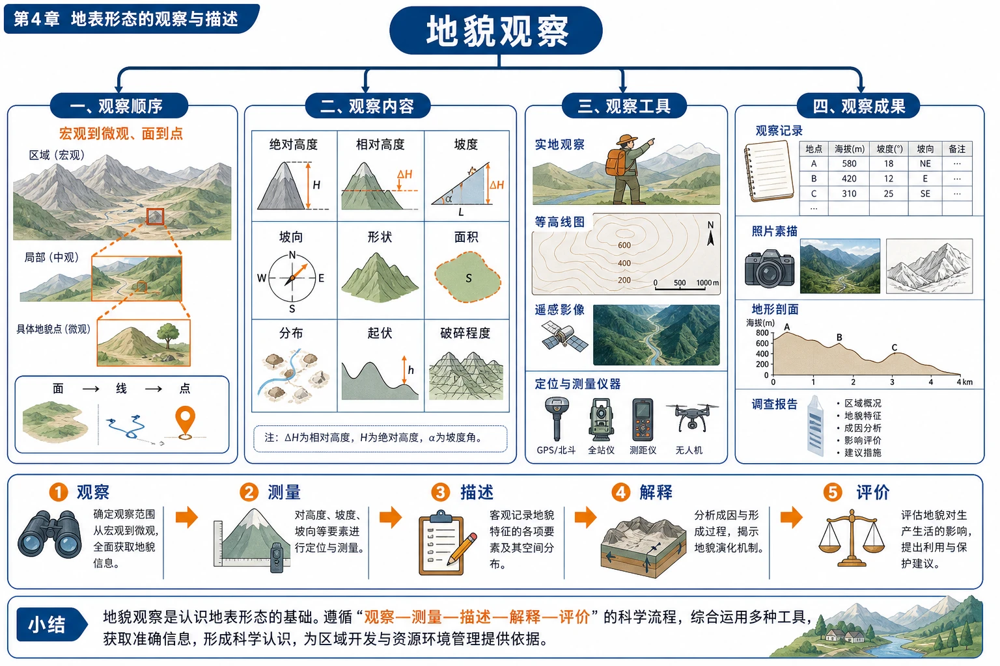
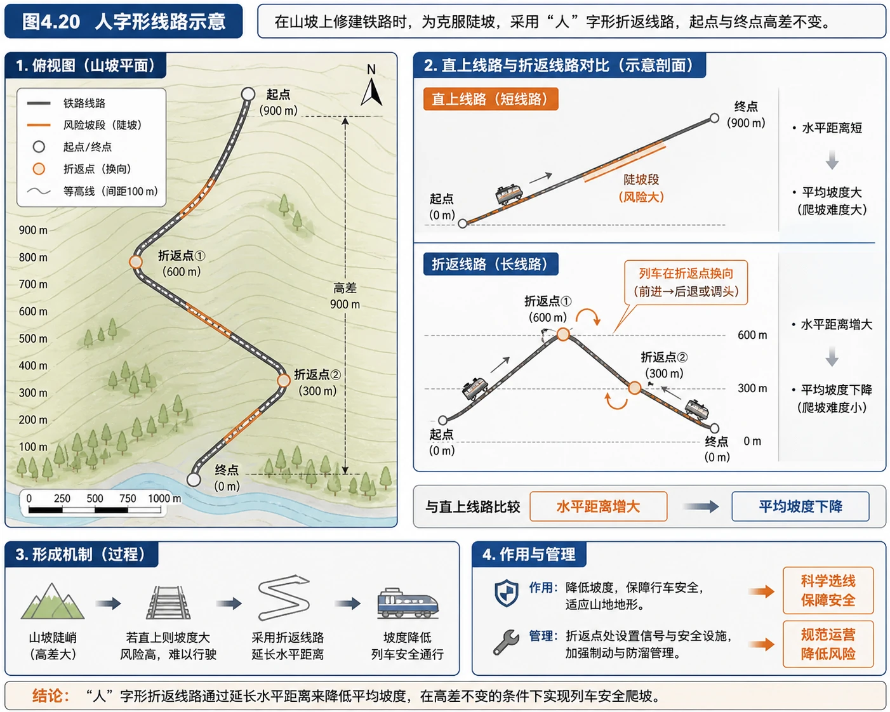
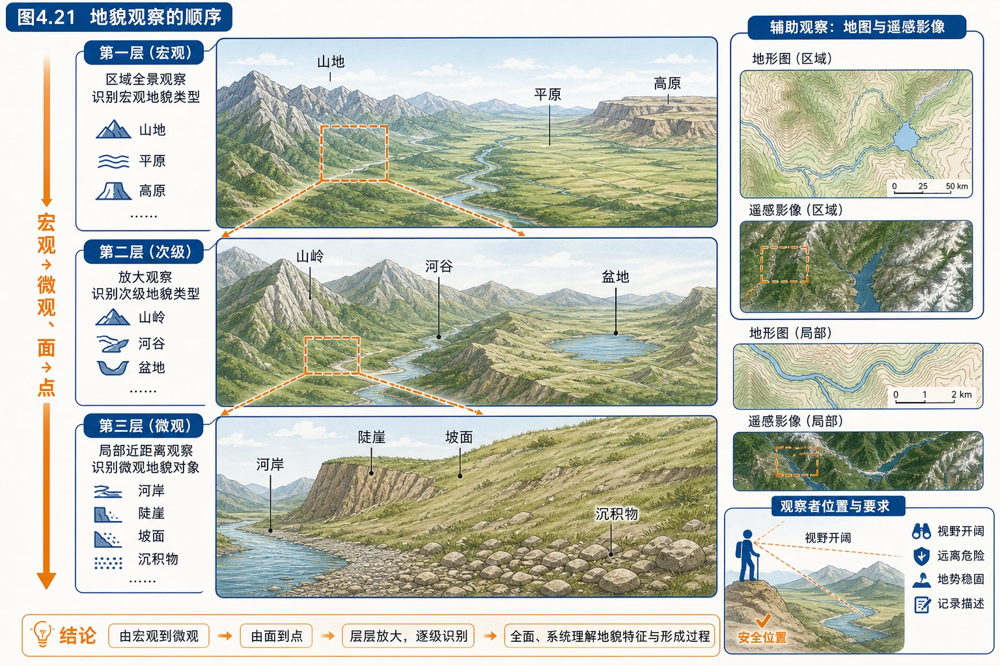
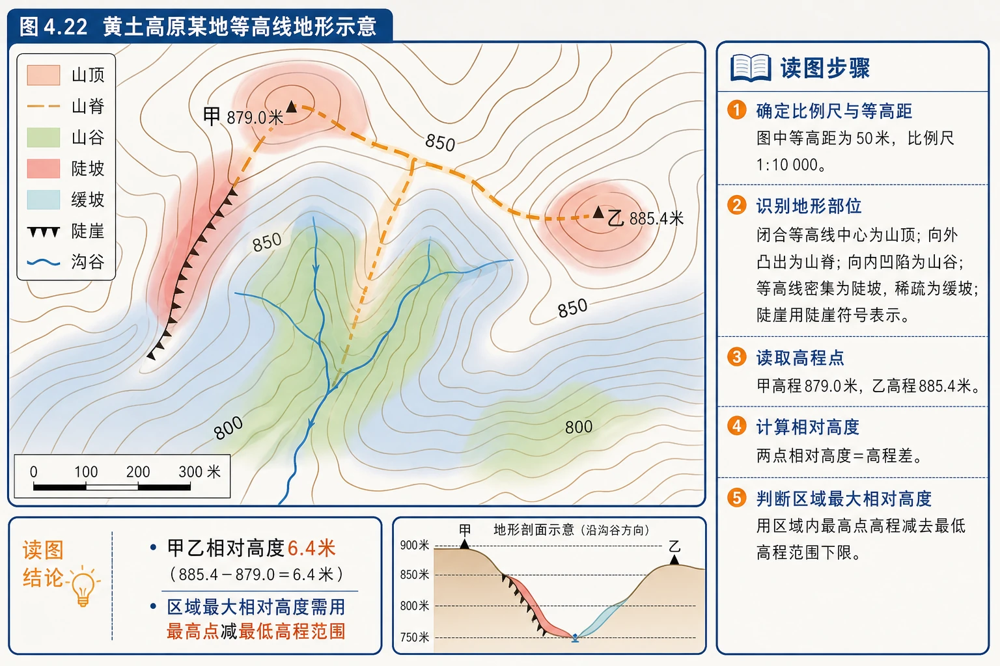
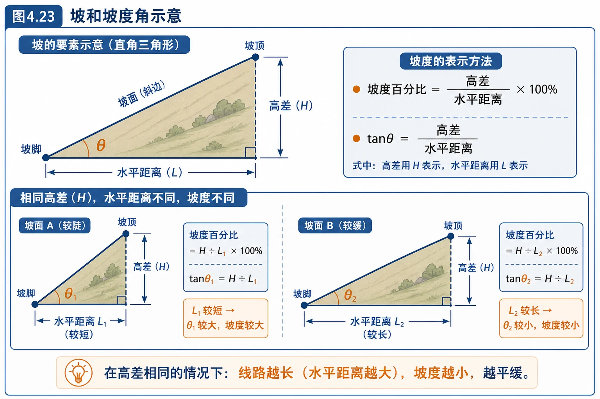
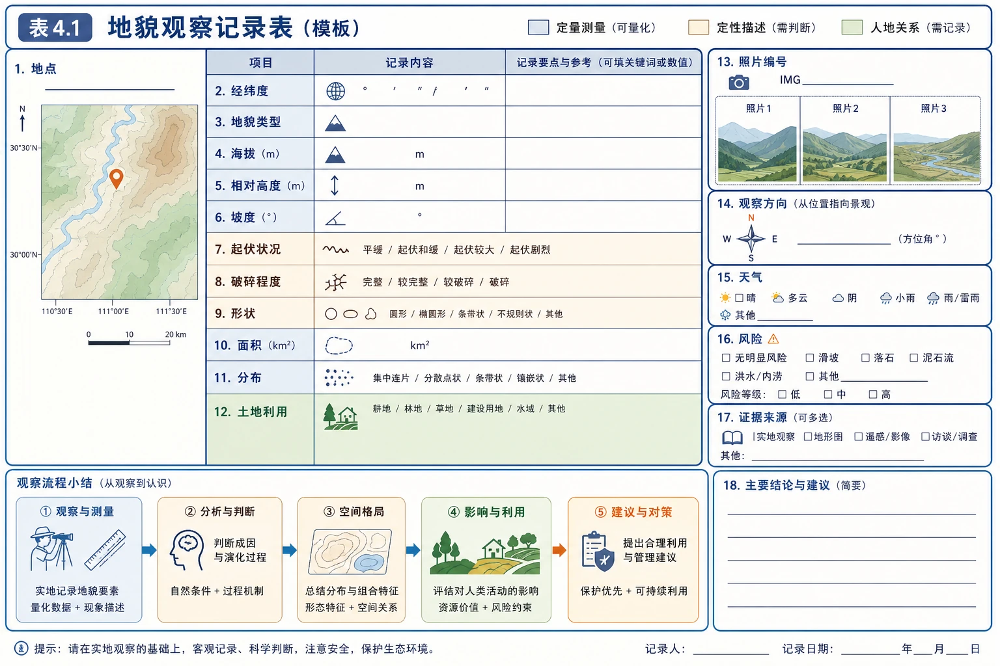
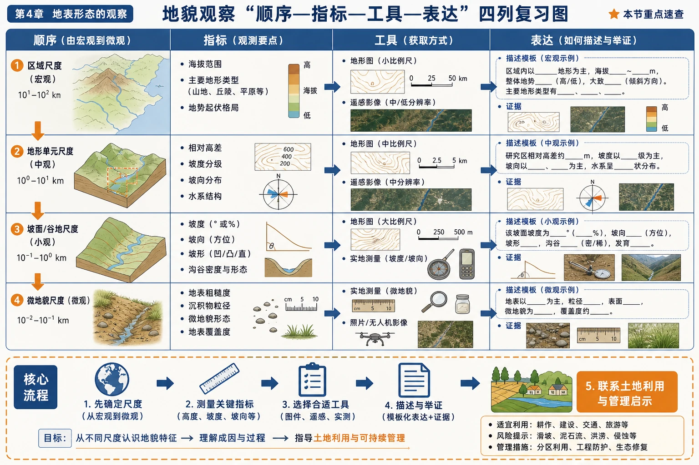

# 第二节 地貌的观察

<!-- 图片描述：本节整体知识信息结构图。中心为“地貌观察”，第一层分成观察顺序、观察内容、观察工具、观察成果四部分；顺序为宏观到微观、面到点，内容包括绝对高度、相对高度、坡度、坡向、形状、面积、分布、起伏和破碎程度，工具包括实地观察、等高线图、遥感影像、定位与测量仪器，成果包括观察记录、照片素描、地形剖面和调查报告；底部以“观察—测量—描述—解释—评价”流程贯通。 -->

## 知识关系导航

- 所属章节：[[章首 学习导图|第四章 地貌]]。
- 前置对象：[[第一节 常见地貌类型|常见地貌类型]]提供需要识别和描述的喀斯特、河流、风沙与海岸地貌。
- 方法进阶：从“看见景观”转向“按尺度观察、用数据描述、以图表验证”。
- 综合应用：观察所得坡度、土层、水系和聚落证据，可用于[[章末问题研究 如何提升我国西南喀斯特峰丛山地的经济发展水平|评价喀斯特峰丛山地发展条件]]。

## 本节学习目标

1. 按从宏观到微观、从面到点的顺序设计地貌观察方案。
2. 区分绝对高度和相对高度，能依据等高线或高程点进行计算。
3. 理解坡度角和坡度百分比，解释延长线路为什么能降低坡度。
4. 判断阳坡阴坡、迎风坡背风坡并分析其水热和植被差异。
5. 从形状、面积、分布、起伏和破碎程度完整描述区域地貌。
6. 使用地图、遥感影像和实地记录完成家乡地貌调查与安全评价。

## 核心知识点讲解

### 一、区域定位与地理情境

京张铁路八达岭段山高坡陡，早期机车牵引能力有限。詹天佑设计“人”字形线路，让列车在山坡上折返并延长行驶距离，在相同高差下减小平均坡度。这说明工程建设必须先观察地貌，再根据高度、坡度和谷坡组合选择路线。

<!-- 图片描述：对应源文图4.20“人字形线路示意”。俯视山坡上铁路呈人字形折返，起点和终点高差不变；旁边以直上短线路和折返长线路对比，标出水平距离增大、平均坡度下降，列车在折返点换向。黑灰为线路和等高线，橙色标风险坡段。 -->

地貌观察并非“看风景”。它需要先确定空间尺度，再测量或判断形态要素，最后联系形成过程和人类利用。观察对象既可以是一座山峰、一段河岸，也可以是整个高原或山区。

### 二、核心概念与地理要素

#### 1. 观察顺序

规模较大的地貌常由次一级地貌组成。例如高原内部可能有山脉、丘陵和盆地，山脉又由山峰、山谷、坡面和陡崖组成。因此观察应遵循：

> 选择视野广阔的观察点 → 识别宏观地貌 → 观察次一级地貌组合 → 描述微观形态 → 选典型点测量和记录。

“从宏观到微观”强调尺度层级，“从面到点”强调先认识区域整体格局，再分析典型地点。

<!-- 图片描述：对应源文图4.21“地貌观察的顺序”。采用三层嵌套框：第一层区域全景识别山地、平原、高原等宏观地貌；第二层放大山岭、河谷、盆地等次级地貌；第三层放大河岸、陡崖、坡面和沉积物等微观对象。观察者位于视野开阔且安全的位置，箭头标“宏观→微观、面→点”，并列地图和遥感影像辅助观察。 -->

#### 2. 绝对高度与相对高度

- 绝对高度（海拔）：某点高出海平面的垂直距离。用于判断山地、高原和平原等基本地貌，也用于工程高程和气温垂直变化分析。
- 相对高度：某点高出另一点的垂直距离，即两点海拔之差。反映局部地面起伏。

计算式：

$$H_{相对}=|H_1-H_2|$$

高原海拔较高但内部相对高度可能小；丘陵绝对高度未必很低，但相对高度通常较小。只看海拔不能完整描述起伏。

#### 3. 坡度

坡度表示坡面的陡缓，可用坡度角或高差与水平距离的比值表示：

$$坡度=\frac{垂直高差}{水平距离}\times100\%$$

坡度角为$\theta$时：

$$\tan\theta=\frac{垂直高差}{水平距离}$$

坡度百分比与坡度角不是同一个数。例如10%的坡度表示每水平前进100米升高10米，对应坡度角约$5.7^\circ$，不是$10^\circ$。

#### 4. 坡向

坡向是坡面朝向。观察时重点关注：

- 阳坡与阴坡：北半球中纬度通常南坡为阳坡、北坡为阴坡；阳坡获得太阳辐射较多，温度和蒸发一般较高。
- 迎风坡与背风坡：迎着含湿气流的一侧，气流受地形抬升易形成降水；背风坡气流下沉增温，降水较少。

阳坡不一定是迎风坡，两组概念的判断依据完全不同：前者看太阳方位，后者看盛行风或水汽来向。

#### 5. 其他形态要素

- 形状：峰体、谷地、岸线或洼地的几何形态。
- 面积与规模：地貌所占空间范围。
- 空间分布：连续、成带、点状、集中或分散。
- 起伏状况：地面高低变化大小和频繁程度。
- 破碎程度：地表被河谷、沟壑、山脊等切割的程度。

高度和坡度组合可形成基本判断：相对高度大且坡度大，地貌陡峻；相对高度小且坡度小，地貌平缓。但地貌类型还需结合海拔、面积和整体形态。

### 三、过程机制与成因链条

#### 1. 延长线路降低坡度

相同垂直高差不变 → 折返线路增加水平距离和实际路程 → 高差与水平距离之比减小 → 线路平均坡度降低 → 机车爬坡更安全、所需牵引力减小。

“人”字形线路的代价是路程和运行时间增加，因此工程选线是在坡度、里程、造价、地质安全和运营效率间权衡。

#### 2. 坡度影响生产生活

坡度增大 → 重力沿坡分力增大、地表径流速度加快 → 土壤侵蚀和滑坡风险上升，机械化耕作与工程建设难度增大。教材指出，在坡度大于$15^\circ$的坡地种植，暴雨时土壤侵蚀可能很严重；铁路线受牵引能力限制，最大坡度一般不超过2.5%—3%。

这两个数的单位不同：农业材料给坡度角，铁路材料给坡度百分比，答题时不能直接比较大小。

#### 3. 坡向造成自然差异

北半球阳坡太阳辐射较多 → 温度较高、蒸发较强 → 土壤水分和植被可能不同于阴坡；迎风坡含湿气流抬升冷却 → 降水较多 → 植被、水系和土壤发育通常较好。真实差异还受纬度、海拔、风向、植被类型和人类利用影响。

#### 4. 观察尺度决定结论

在小尺度看，某处可能是平坦河漫滩；扩大到流域尺度，它位于深切山谷中；再扩大到区域尺度，可能属于高原上的河谷系统。结论必须注明观察尺度，否则“平坦”与“崎岖”可能看似矛盾。

### 四、空间分布、图表判读与证据

#### 1. 等高线判读

等高线把海拔相同的点连接起来，基本判读顺序：

1. 看等高距与数值变化方向。
2. 看疏密：同一幅图中，线密坡陡、线疏坡缓。
3. 看弯曲：等高线穿越山谷常向高处凸，穿越山脊常向低处凸。
4. 看闭合：中心高为山峰，中心低且有示坡线可为洼地。
5. 结合高程点计算相对高度。

<!-- 图片描述：对应源文图4.22“黄土高原某地等高线地形示意”。保留甲879.0米、乙885.4米高程点，850米和800米等高线、陡崖符号、比例尺和沟谷；用彩色半透明标注山顶、山脊、山谷、陡坡与缓坡。旁边列出“甲乙相对高度6.4米”和“区域最大相对高度需用最高点减最低高程范围”的读图步骤。 -->

教材图中甲、乙两点的相对高度为：

$$885.4-879.0=6.4\text{米}$$

区域最大相对高度不能只用两个高程点，应找全图最高点和最低可能海拔。由图中最高点885.4米和最低处低于770米估算，最大相对高度约120米；若依据纸质原图读取最低等高线有细微差异，应按“最高点减最低高程范围”规范计算。

#### 2. 坡和坡度图

<!-- 图片描述：对应源文图4.23“坡和坡度角示意”。直角三角形中水平边为水平距离，竖直边为高差，斜边为坡面，坡脚角标为坡度角θ；旁边并列公式“坡度百分比=高差÷水平距离×100%”与“tanθ=高差÷水平距离”，用两个相同高差、不同水平距离的坡面对比线路越长坡度越小。 -->

等高线图估算坡度时，先用等高线数值求高差，再按比例尺量水平距离。路线若穿过等高线少且间距宽，通常较缓；但还要避开陡崖、滑坡、河流和生态敏感区。

#### 3. 地形剖面图

地形剖面图沿指定剖面线展示海拔随水平距离变化，可直观看出山峰、谷地、坡折和起伏。绘制步骤：在剖面线上标出与等高线交点 → 转移到横坐标 → 按海拔描点 → 平滑连接 → 标注水平和垂直比例尺。

垂直比例尺大于水平比例尺时会发生垂直夸大，坡度看起来比实际更陡，判读时需注意。

#### 4. 遥感与实地观察互补

- 地形图提供高程、坡度和空间位置，适于定量分析。
- 遥感影像显示地表覆盖、河道和建设变化，适于区域与时序比较。
- 实地观察能识别岩性、沉积物、坡面过程和细节，但视野有限。
- 文献和访问资料可补充历史变化与土地利用信息。

可靠结论应尽量用多种证据互相验证。

### 五、人地关系、影响与对策

#### 1. 坡度与土地利用

缓坡和平地有利于聚落、道路和机械化农业；陡坡应减少开垦，采用植被恢复、梯田或水土保持工程。梯田能缩短坡长、降低径流速度，但建设不当也会破坏坡体稳定。

#### 2. 坡向与农业、植被

阳坡热量较好，可能适宜喜温作物，但蒸发强、土壤更干；阴坡较冷湿。迎风坡降水多但可能侵蚀强，背风坡干燥但光热条件可能适宜。农业布局应综合水热，而非只追求阳坡。

#### 3. 地貌与交通工程

交通选线应尽量减小坡度、避开地质灾害高风险区，并权衡隧道、桥梁和绕行成本。“人”字形线路是早期技术条件下的方案，现代工程还可通过隧道和大跨度桥梁改变线路，但成本与生态影响更大。

#### 4. 野外观察安全

考察前查看天气、地形和灾害信息，规划路线和撤离点；避免单独进入陡崖、滑坡体、洪水沟谷、潮间带和洞穴；携带定位、通信、饮水和急救物品；不破坏岩层、植被和文物，不在危险地点为拍照停留。

### 六、综合题型与迁移应用

#### 1. 地貌描述题

规范模板：

> 区域以××地貌为主；海拔总体××，地势由×向×降低；相对高度×，地面起伏×；坡度×，其中×部较陡；地表切割或破碎程度×；主要地貌呈×状分布。

描述只回答“是什么样”，解释才回答“为什么”，两类设问不能混写。

#### 2. 地貌比较题

先统一比较尺度和指标，再从海拔、相对高度、坡度、坡向、形状、面积、分布、起伏和破碎程度逐项比较。不能一地写海拔、另一地写植被，造成维度错位。

#### 3. 工程选线题

> 读等高线找缓坡和鞍部 → 计算高差与坡度 → 判断河谷、陡崖和灾害点 → 比较线路长度、桥隧需求和生态影响 → 选择综合成本与风险较低路线。

#### 4. 家乡地貌调查

教材活动要求把案头资料和实地考察结合：识别宏观与微观地貌 → 找最高最低点并算相对高度 → 绘制剖面图 → 分析安全风险 → 选观察点记录 → 整理并撰写报告。

<!-- 图片描述：对应源文表4.1“地貌观察记录表”的可视化模板。表头包含地点、经纬度、地貌类型、海拔、相对高度、坡度、起伏状况、破碎程度、形状、面积、分布和土地利用；右侧附照片编号、观察方向、天气、风险与证据来源栏，颜色区分定量测量、定性描述和人地关系。 -->

## 重点梳理

### 1. 顺序

从宏观到微观、从面到点；先区域整体，后次级组合，最后典型点位。

### 2. 内容

高度、坡度、坡向是核心；再补形状、面积、分布、起伏和破碎程度。

### 3. 两个高度

- 绝对高度：相对海平面的海拔。
- 相对高度：两地海拔之差，反映起伏。

### 4. 两种坡度表达

- 坡度百分比：高差÷水平距离×100%。
- 坡度角：坡面与水平面的夹角，满足$\tan\theta=高差÷水平距离$。

### 5. 两组坡向

- 阳坡阴坡看太阳辐射。
- 迎风坡背风坡看风和水汽来向。

<!-- 图片描述：地貌观察“顺序—指标—工具—表达”四列复习图。顺序列为宏观至微观，指标列为高度坡度坡向等，工具列为等高线图遥感实地测量，表达列给出描述模板和证据；用箭头强调先确定尺度，再测量指标，最后联系土地利用，作为本节重点速查。 -->

## 难点突破

### 1. 等高线上的最大相对高度

若最高、最低处只有等高线范围而无精确高程，答案也应给范围。例如最高点在900—910米，最低点在760—770米，则最大相对高度大于130米、小于150米，而非随意取一个精确数。

### 2. 等高线疏密与坡度

“线密坡陡”只适用于同一幅、等高距相同的等高线图。不同地图若比例尺或等高距不同，不能直接比较疏密。

### 3. 坡度百分比不等于坡度角

铁路最大坡度3%表示水平前进100米升高3米，对应角度约$1.7^\circ$。若误写成$3^\circ$，会高估坡度。

### 4. 阳坡与阴坡的地区差异

北半球中纬度通常南坡为阳坡，但低纬、极地或复杂坡向条件需结合太阳视运动；阳坡植被不一定更茂密，因为热量增加同时会增强蒸发。

### 5. 破碎程度怎样判断

看沟谷和山脊数量、切割密度、地表单元是否连续。沟壑密、山谷多、地面分割成许多小单元，破碎程度高；平原连片、起伏小，破碎程度低。

## 例题讲解

### 例1 “人”字形铁路为什么能降低坡度

**材料信息**：起终点高差不变，线路由直线改为折返形，距离增加。

**推理**：$坡度=高差÷水平距离×100\%$。高差不变而水平距离增加，坡度减小。

**答案**：人字形线路通过延长爬坡距离，把相同高差分配到更长路线中，减小平均坡度，使机车牵引更容易。代价是里程、时间和维护长度增加。

### 例2 教材思考：甲乙相对高度

图4.22中甲海拔879.0米、乙海拔885.4米：

$$H_{相对}=885.4-879.0=6.4\text{米}$$

区域最大相对高度需比较全图最高点和最低处，不能用甲乙两点替代。按图中最低处低于770米估算，约为120米。

### 例3 判断坡向差异

**题目**：北半球某东西走向山脉，湿润气流从南方吹来。比较南坡和北坡的水热条件。

**分析**：南坡既朝向太阳又迎着湿润气流，属于阳坡和迎风坡；北坡为阴坡、背风坡。

**答案**：南坡太阳辐射较多、热量较好，气流抬升降水较多；北坡光照和热量较弱，处于背风侧、降水较少。实际植被差异还要考虑海拔和土壤。

### 例4 家乡地貌观察方案

**步骤**：

1. 收集地形图、遥感影像和区域资料，明确调查范围。
2. 识别宏观地貌与河谷、山脊等次级地貌。
3. 找最高、最低点，计算相对高度并绘剖面。
4. 依据代表性、视野和安全选择观察点与路线。
5. 记录经纬度、海拔、坡度、坡向、形状、起伏、破碎程度和土地利用。
6. 照片、素描和测量数据编号，整理为“方法—结果—解释—问题—建议”的报告。

## 易错点整理

1. 把海拔高等同于起伏大。高原海拔高但内部可以平坦。
2. 相对高度计算不取绝对值。它表示垂直距离，结果应为非负值。
3. 只用等高线疏密跨图比较坡度。必须先检查比例尺和等高距。
4. 把3%的铁路坡度写成$3^\circ$。百分比和角度不是同一单位。
5. 认为阳坡一定湿润、植被一定好。阳坡蒸发也较强，水分可能成为限制。
6. 把阳坡阴坡和迎风背风混为一谈。一个由太阳方位决定，一个由气流来向决定。
7. 观察从局部细节开始，缺少区域尺度。应先宏观定位再选典型点。
8. 调查记录只有照片没有方向、位置和比例尺，无法作为可比较证据。

## 考点考证点整理

### 考点一：地貌观察顺序与内容

- 出题思路：给野外考察方案，让学生排序、补充观察项目或指出错误。
- 关键条件：观察尺度、视野、安全、宏观地貌和典型点位。
- 解答要点：从宏观到微观、从面到点；内容包括高度、坡度、坡向、形状、面积、分布、起伏、破碎程度和土地利用。
- 易扣分点：只写观察对象，不写顺序；忽略地图遥感辅助和安全评估。

### 考点二：绝对高度与相对高度

- 出题思路：提供等高线和高程点，计算两点相对高度或区域起伏。
- 关键条件：等高距、最高点和最低高程范围、是否有精确高程点。
- 解答要点：两点相对高度取海拔差的绝对值；区域最大相对高度使用最高与最低处，数据不精确时给合理范围。
- 易扣分点：把等高线条数直接当高差；漏乘等高距；用局部两点代替区域极值。

### 考点三：坡度与工程选线

- 出题思路：比较多条道路、铁路或引水线路的坡度、长度和施工风险。
- 关键条件：高差、水平距离、等高线疏密、陡崖、河流和地质灾害点。
- 解答要点：列出坡度公式；说明延长距离可降低坡度；综合比较桥隧、施工量、灾害和生态影响。
- 易扣分点：只选最短线路；混淆水平距离与坡面实际长度；单位不统一。

### 考点四：坡向与自然环境

- 出题思路：比较山地两坡气温、降水、雪线、林线或农业分布。
- 关键条件：半球、纬度、坡面朝向、盛行风和水汽来源。
- 解答要点：先分别判阳阴坡和迎背风坡，再从太阳辐射、抬升降水和蒸发构建因果链。
- 易扣分点：默认南坡永远是迎风坡；只写温度，不写水分。

### 考点五：地貌调查与报告

- 出题思路：以家乡地貌、研学旅行或灾害调查为背景，要求设计步骤和记录表。
- 关键条件：资料来源、路线点位、仪器、指标、风险和成果形式。
- 解答要点：案头准备—路线与安全—实地观察测量—记录照片—数据整理—解释评价；保证证据可定位、可比较。
- 易扣分点：缺少经纬度、方向和比例尺；没有安全预案；把推测写成实测事实。

## 练习题

### 1. 教材思考：相对高度

图4.22中甲海拔879.0米、乙海拔885.4米。计算两点相对高度；说明估算图示区域最大相对高度的方法。

### 2. 教材活动：观察家乡地貌

设计一次家乡地貌调查，写出资料准备、观察顺序、主要记录指标、成果形式和三项安全措施。

### 3. 基础计算

某道路两端高差120米，地图量得水平距离4千米。计算平均坡度百分比。若线路绕行后水平距离增至6千米，坡度变为多少？

### 4. 等高线判读

同一等高线图中，甲线路穿过的等高线稀疏，乙线路穿过的等高线密集。在两线路高差相近时，哪条坡度较小？还需考虑哪些选线条件？

### 5. 坡向分析

北半球中纬度某山地西侧有海洋，盛行西风。比较东、西坡降水条件；若山脉南北走向，阳坡阴坡应如何判断？

### 6. 综合描述

某区域海拔多在1500—2000米，最高点2300米，谷底约1200米，等高线密集、河谷深切、山脊众多。按地貌观察指标描述其特征，并评价交通建设条件。

## 练习题答案

### 1. 教材思考：相对高度

甲乙相对高度为$|885.4-879.0|=6.4$米。估算区域最大相对高度时，应找全图最高点与最低处：有高程点就直接使用；只有等高线时，根据等高距确定二者的海拔范围，再相减得到最大相对高度范围。图中可估算约120米，最终以清晰原图的最低等高线读数为准。

### 2. 教材活动：观察家乡地貌

先收集等高线地形图、数字地形图、遥感影像、考察报告和天气资料；按区域宏观地貌—次级山谷河谷—典型坡面与河岸的顺序观察。记录地点、经纬度、地貌类型、海拔、相对高度、坡度、坡向、起伏、破碎程度、形状、面积、分布和土地利用，配套照片、素描和剖面图，最后撰写调查报告。安全措施可包括避开恶劣天气和地质灾害点、结伴并保持通信、预设撤离路线、携带定位急救装备等。

### 3. 基础计算

原线路：

$$\frac{120}{4000}\times100\%=3\%$$

绕行后：

$$\frac{120}{6000}\times100\%=2\%$$

高差不变，水平距离增大，平均坡度由3%降至2%。

### 4. 等高线判读

甲线路等高线较稀疏，说明在相同水平距离内高差变化较慢，坡度较小。选线还需考虑总里程、陡崖和滑坡、河流与洪水、桥隧工程量、地质基础、聚落联系、生态敏感区和建设运营成本。

### 5. 坡向分析

湿润西风先到达西坡，受地形抬升形成较多降水，西坡为迎风坡；东坡为背风坡，降水较少。山脉南北走向时，北半球中纬度通常南坡朝向太阳，为阳坡；北坡为阴坡。迎风背风与阳坡阴坡是两套不同判断。

### 6. 综合描述

该区整体海拔较高，最高与谷底相对高度约1100米，地势起伏大；等高线密集表明坡度较陡，河谷深切、山脊众多说明地表切割强、破碎程度高，属于陡峻山地。交通线路坡度控制困难，桥隧比例和建设成本较高，滑坡崩塌风险大；选线宜利用河谷、缓坡和鞍部，同时避开洪水与地质灾害区，做好边坡防护。
