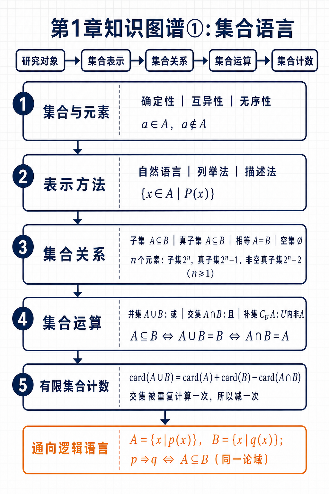
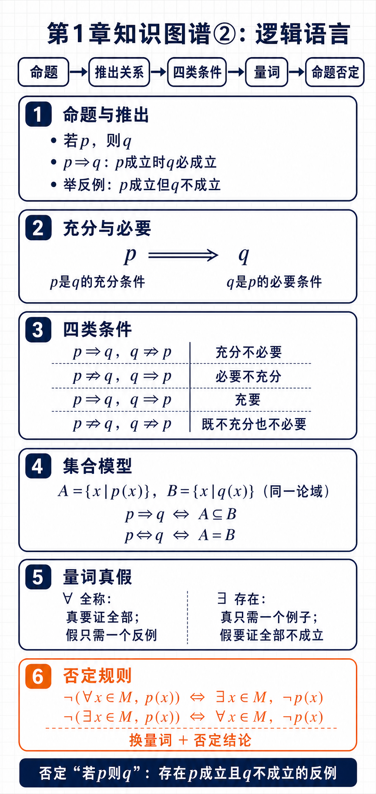

# 第1章 集合与常用逻辑用语：核心知识点大纲

## 知识关系导航

- 所属章节：[[章首 学习导图|集合与常用逻辑用语]]
- 集合的起点：[[1.1-集合的概念|集合的概念与表示]]
- 关系的核心：[[1.2-集合间的基本关系|子集、真子集与集合相等]]
- 运算的核心：[[1.3-集合的基本运算|并集、交集、补集与有限集合计数]]
- 逻辑关系：[[1.4-充分条件与必要条件|充分条件、必要条件与充要条件]]
- 量词与否定：[[1.5-全称量词与存在量词|全称量词、存在量词与命题的否定]]

## 一、全章学习主线

本章有两条互相贯通的主线：

1. **集合语言**：确定研究对象与范围，再研究集合的表示、关系、运算和计数。
2. **逻辑语言**：判断命题真假，辨析推出方向，使用量词并正确写出命题的否定。

```text
研究对象与论域
      ↓
集合表示 → 集合关系 → 集合运算 → 集合计数
      ↓          ↓          ↓
    条件集合 ──→ 推出关系 ──→ 量词与命题否定
```

最关键的跨小节联系是：设同一论域内

$$
A=\{x\mid p(x)\},\qquad B=\{x\mid q(x)\},
$$

则

$$
p\Rightarrow q\Longleftrightarrow A\subseteq B.
$$

也就是说，“条件的推出关系”可以转化为“解集的包含关系”。

## 二、章节知识图谱

为保证打印后的文字清晰，全章知识图谱拆为两张 A4 纵向信息结构图：





## 三、1.1 集合的概念

### 1. 集合与元素

- **元素**：研究对象统称为元素。
- **集合**：一些确定对象组成的总体。
- 集合通常用大写字母 $A,B,C$ 表示，元素通常用小写字母 $a,b,c$ 表示。

元素与集合之间只有两种基本关系：

$$
a\in A \quad\text{或}\quad a\notin A.
$$

### 2. 集合中元素的三个特征

| 特征 | 准确含义 | 判断提示 |
|---|---|---|
| 确定性 | 对给定对象，能明确判断它是否属于该集合 | “较小的数”标准不明确，不能组成集合 |
| 互异性 | 同一元素在集合中只算一次 | $\{1,1,2\}=\{1,2\}$ |
| 无序性 | 元素排列顺序不影响集合 | $\{1,2,3\}=\{3,2,1\}$ |

### 3. 常用数集

| 数集 | 记号 | 说明 |
|---|---|---|
| 自然数集 | $\mathbb N$ | $0,1,2,\ldots$，包含 $0$ |
| 正整数集 | $\mathbb N^*$ 或 $\mathbb N_+$ | $1,2,3,\ldots$ |
| 整数集 | $\mathbb Z$ | 正整数、$0$、负整数 |
| 有理数集 | $\mathbb Q$ | 可写成 $\dfrac pq$，其中 $p,q\in\mathbb Z$ 且 $q\ne0$ |
| 实数集 | $\mathbb R$ | 有理数与无理数的全体 |

数集包含链：

$$
\mathbb N^*\subseteq\mathbb N\subseteq\mathbb Z\subseteq\mathbb Q\subseteq\mathbb R.
$$

### 4. 集合相等

两个集合含有完全相同的元素，就称它们相等。判断时只看元素，不看排列顺序和重复书写。

$$
A=B\Longleftrightarrow (\forall x,\ x\in A\Leftrightarrow x\in B).
$$

### 5. 集合的三种表示方法

| 方法 | 写法 | 适用情况 | 核心要求 |
|---|---|---|---|
| 自然语言 | “小于 $10$ 的自然数集” | 文字能准确限定对象 | 表述必须明确 |
| 列举法 | $\{0,1,2,\ldots,9\}$ | 元素较少或有明显规律 | 不重不漏，必须有花括号 |
| 描述法 | $\{x\in A\mid P(x)\}$ | 元素较多或不能逐个列出 | 写清论域与共同特征 |

典型描述法：

$$
\{x\in\mathbb Z\mid x=2k+1,\ k\in\mathbb Z\}
$$

表示奇数集。若论域已在上下文中明确，可以省略 $x\in A$；否则不能随意省略。

### 6. 快速检查

- 先问“研究对象是谁、范围是什么”，再写集合。
- 列举法检查“不重、不漏、花括号”。
- 描述法检查“代表元素、论域、共同特征”。
- $a\in A$ 的左边是元素；$\{a\}\subseteq A$ 的左边是集合，不能混用。

## 四、1.2 集合间的基本关系

### 1. 子集

若集合 $A$ 的每一个元素都是集合 $B$ 的元素，则 $A$ 是 $B$ 的子集：

$$
A\subseteq B
\Longleftrightarrow
\forall x\,(x\in A\Rightarrow x\in B).
$$

也可写作 $B\supseteq A$。

### 2. 集合相等

证明两个集合相等，常用“互相包含”：

$$
A=B\Longleftrightarrow A\subseteq B\text{ 且 }B\subseteq A.
$$

### 3. 真子集

若 $A\subseteq B$，且 $B$ 中至少有一个元素不属于 $A$，则 $A$ 是 $B$ 的真子集：

$$
A\subsetneqq B.
$$

等价地，$A\subsetneqq B$ 表示 $A\subseteq B$ 且 $A\ne B$。

### 4. 空集

不含任何元素的集合叫作空集，记作 $\varnothing$。规定：

$$
\varnothing\subseteq A
$$

对任何集合 $A$ 都成立。注意：

$$
\varnothing\ne\{\varnothing\}.
$$

前者没有元素，后者有一个元素 $\varnothing$。

### 5. 子集关系的性质

$$
A\subseteq A,
$$

$$
A\subseteq B,\ B\subseteq C\Longrightarrow A\subseteq C.
$$

### 6. 有限集合的子集个数

若集合 $A$ 含有 $n$ 个元素，则：

| 类型 | 个数 | 条件说明 |
|---|---:|---|
| 子集 | $2^n$ | 每个元素都有“选”或“不选”两种状态 |
| 真子集 | $2^n-1$ | 排除集合 $A$ 本身 |
| 非空子集 | $2^n-1$ | 排除空集 |
| 非空真子集 | $2^n-2$ | 仅当 $n\ge1$；同时排除空集与 $A$ 本身 |

当 $n=0$ 时，$A=\varnothing$，它没有非空真子集，不能机械套用 $2^n-2$。

### 7. 判断关系的标准流程

```text
先化简集合
  ↓
逐个检查 A 中元素是否都在 B 中
  ↓
否：A 不是 B 的子集
是：继续判断 A 与 B 是否相等
  ↓
相等：A=B；不等：A⊊B
```

## 五、1.3 集合的基本运算

### 1. 并集：抓住“或”

$$
A\cup B=\{x\mid x\in A\text{ 或 }x\in B\}.
$$

“或”表示至少满足一个条件，允许同时属于 $A$ 和 $B$。

### 2. 交集：抓住“且”

$$
A\cap B=\{x\mid x\in A\text{ 且 }x\in B\}.
$$

交集只保留两个集合的公共元素。

### 3. 全集与补集

全集 $U$ 必须包含当前问题所研究的全部对象。若 $A\subseteq U$，则 $A$ 在 $U$ 中的补集为

$$
\complement_U A=\{x\in U\mid x\notin A\}.
$$

补集依赖全集；同一集合在不同全集中的补集可能不同。

### 4. 运算性质与包含关系

基础性质：

$$
A\cup A=A,\qquad A\cap A=A,
$$

$$
A\cup\varnothing=A,\qquad A\cap\varnothing=\varnothing,
$$

$$
A\cup B=B\cup A,\qquad A\cap B=B\cap A.
$$

包含关系的等价判定：

$$
A\subseteq B
\Longleftrightarrow A\cup B=B
\Longleftrightarrow A\cap B=A.
$$

补集性质：

$$
A\cup\complement_U A=U,\qquad
A\cap\complement_U A=\varnothing,
$$

$$
\complement_U U=\varnothing,\qquad
\complement_U\varnothing=U.
$$

常用派生规律（可由元素归属逐一验证）：

$$
\complement_U(A\cup B)=\complement_U A\cap\complement_U B,
$$

$$
\complement_U(A\cap B)=\complement_U A\cup\complement_U B.
$$

### 5. 有限集合计数

若 $A,B$ 为有限集合，则

$$
\operatorname{card}(A\cup B)
=\operatorname{card}(A)+\operatorname{card}(B)
-\operatorname{card}(A\cap B).
$$

计算逻辑：直接相加时，交集中的元素被计算了两次，所以必须减去一次。

三个有限集合的容斥公式：

$$
\begin{aligned}
\operatorname{card}(A\cup B\cup C)
={}&\operatorname{card}(A)+\operatorname{card}(B)+\operatorname{card}(C)\\
&-\operatorname{card}(A\cap B)-\operatorname{card}(A\cap C)-\operatorname{card}(B\cap C)\\
&+\operatorname{card}(A\cap B\cap C).
\end{aligned}
$$

最后加回三集合交集，是因为它先被加了三次，又在三个两两交集中被减了三次，净计数为 $0$，还需再加一次。

### 6. 运算题的快速方法

| 题型 | 首选工具 | 操作顺序 |
|---|---|---|
| 有限集合 | 列举元素 | 化简各集合，再按“或、且、非”筛选 |
| 区间集合 | 数轴 | 标端点开闭，再取覆盖部分或重合部分 |
| 补集 | 全集或数轴 | 先确定 $U$，再从 $U$ 中排除 $A$ |
| 实际计数 | Venn 图 | 先填公共部分，再填各自独有部分 |
| 混合运算 | 括号优先 | 先算括号内，再按题目顺序运算 |

## 六、1.4 充分条件与必要条件

### 1. 命题与推出

可以判断真假的陈述句叫作命题。“若 $p$，则 $q$”为真命题，记作

$$
p\Rightarrow q.
$$

它表示：每当 $p$ 成立时，$q$ 必须成立。要说明 $p\nRightarrow q$，只需找到一个“$p$ 成立但 $q$ 不成立”的反例。

### 2. 充分条件与必要条件

若 $p\Rightarrow q$，则：

- $p$ 是 $q$ 的**充分条件**：有 $p$ 就足以保证 $q$。
- $q$ 是 $p$ 的**必要条件**：没有 $q$ 就一定没有 $p$。

记忆关键不是背词，而是先画箭头：

```text
p ──推出──> q
充分条件      必要条件
```

### 3. 四类条件关系

| 推出情况 | $p$ 是 $q$ 的关系 |
|---|---|
| $p\Rightarrow q$，$q\nRightarrow p$ | 充分不必要条件 |
| $p\nRightarrow q$，$q\Rightarrow p$ | 必要不充分条件 |
| $p\Rightarrow q$，$q\Rightarrow p$ | 充要条件 |
| $p\nRightarrow q$，$q\nRightarrow p$ | 既不充分也不必要条件 |

其中

$$
p\Leftrightarrow q
$$

表示 $p$ 与 $q$ 互相推出，二者互为充要条件。

### 4. 原命题与逆命题

- 原命题：若 $p$，则 $q$。
- 逆命题：若 $q$，则 $p$。

判断充要条件必须分别检验两个方向，不能只证明 $p\Rightarrow q$。

### 5. 集合模型

在**同一论域**内，设

$$
A=\{x\mid p(x)\},\qquad B=\{x\mid q(x)\},
$$

则

$$
p\Rightarrow q\Longleftrightarrow A\subseteq B,
$$

$$
p\Leftrightarrow q\Longleftrightarrow A=B.
$$

集合越小，条件通常越强；集合越大，结论通常越弱。

### 6. 判定定理、性质定理与定义

| 数学语言 | 常见逻辑作用 |
|---|---|
| 判定定理 | 给出结论成立的充分条件 |
| 性质定理 | 给出对象必须满足的必要条件 |
| 定义或等价刻画 | 给出充要条件 |

“通常”不等于“永远”，最终仍要检查实际推出方向。

### 7. 证明充要条件

证明“$p$ 是 $q$ 的充要条件”必须写两个方向：

1. **充分性**：证明 $p\Rightarrow q$。
2. **必要性**：证明 $q\Rightarrow p$。

标准结构：

```text
充分性：假设 p 成立 → 推导 → q 成立。
必要性：假设 q 成立 → 推导 → p 成立。
结论：p 是 q 的充要条件。
```

## 七、1.5 全称量词与存在量词

### 1. 含变量语句与命题

含变量的语句若没有明确论域和量词，通常不能判断真假。明确“变量在哪个集合中取值”以及“是所有还是存在”后，才能形成完整命题。

### 2. 全称量词

全称量词“所有、任意、每一个”用 $\forall$ 表示：

$$
\forall x\in M,\ p(x).
$$

- 证明为真：说明 $M$ 中每个元素都满足 $p(x)$。
- 证明为假：只需找一个反例 $x_0\in M$，使 $p(x_0)$ 不成立。

### 3. 存在量词

存在量词“存在、至少一个、有些”用 $\exists$ 表示：

$$
\exists x\in M,\ p(x).
$$

- 证明为真：找出一个满足 $p(x)$ 的对象即可。
- 证明为假：证明 $M$ 中所有元素都不满足 $p(x)$。

例如，命题

$$
\exists x\in\mathbb R,\ x^2+2x+3=0
$$

为假，因为

$$
\Delta=2^2-4\times1\times3=-8<0,
$$

所以该方程没有实根。这里必须同时说明论域是 $\mathbb R$。

### 4. 全称命题的否定

$$
\neg\bigl(\forall x\in M,\ p(x)\bigr)
\Longleftrightarrow
\exists x\in M,\ \neg p(x).
$$

语言模板：

```text
“所有都满足” 的否定是 “至少有一个不满足”。
```

### 5. 存在命题的否定

$$
\neg\bigl(\exists x\in M,\ p(x)\bigr)
\Longleftrightarrow
\forall x\in M,\ \neg p(x).
$$

语言模板：

```text
“至少有一个满足” 的否定是 “所有都不满足”。
```

### 6. 常见关系的否定

| 原式 | 否定 |
|---|---|
| $a=b$ | $a\ne b$ |
| $a>b$ | $a\le b$ |
| $a\ge b$ | $a<b$ |
| $p\text{ 且 }q$ | $\neg p\text{ 或 }\neg q$ |
| $p\text{ 或 }q$ | $\neg p\text{ 且 }\neg q$ |

边界值必须包含在否定中。例如，$a>b$ 的否定是 $a\le b$，不是 $a<b$。

### 7. 否定省略全称量词的蕴含命题

数学中的“若 $p(x)$，则 $q(x)$”通常省略了全称量词：

$$
\forall x\in M,\ p(x)\Rightarrow q(x).
$$

它的否定是

$$
\exists x\in M,\ p(x)\text{ 成立且 }q(x)\text{ 不成立}.
$$

因此，否定“若 $p$，则 $q$”不是另写一个“若 $p$，则非 $q$”，而是指出确实存在反例。

### 8. 真假判断与否定的统一路径

```text
先确定论域 M
   ↓
识别量词 ∀ 或 ∃
   ↓
判断真假：∀ 真要证明全部，∀ 假找反例；∃ 真找例子，∃ 假证明全部不成立
   ↓
写否定：量词互换 + 结论取否定
```

## 八、全章核心符号速查

| 符号 | 含义 |
|---|---|
| $a\in A$，$a\notin A$ | 元素属于或不属于集合 |
| $A\subseteq B$ | $A$ 是 $B$ 的子集，允许 $A=B$ |
| $A\subsetneqq B$ | $A$ 是 $B$ 的真子集 |
| $\varnothing$ | 空集 |
| $A\cup B$ | 并集：至少属于一个集合 |
| $A\cap B$ | 交集：同时属于两个集合 |
| $\complement_U A$ | 在全集 $U$ 中不属于 $A$ 的元素组成的集合 |
| $\operatorname{card}(A)$ | 有限集合 $A$ 的元素个数 |
| $p\Rightarrow q$ | $p$ 推出 $q$ |
| $p\Leftrightarrow q$ | $p$ 与 $q$ 互相推出 |
| $\forall$ | 全称量词 |
| $\exists$ | 存在量词 |
| $\neg p$ | 命题 $p$ 的否定 |

## 九、全章高频易错点

1. 把 $a\in A$ 与 $\{a\}\subseteq A$ 混用。
2. 把 $\varnothing$ 与 $\{\varnothing\}$ 混为一谈。
3. 忘记 $\varnothing$ 是任何集合的子集。
4. 在 $n=0$ 时误用非空真子集个数 $2^n-2$。
5. 描述法遗漏论域，导致集合含义改变。
6. 把并集的“或”误解为只能二选一。
7. 求补集前没有确定全集。
8. 用 $\operatorname{card}(A)+\operatorname{card}(B)$ 直接计算并集，重复计算交集。
9. 判断充分必要条件时把箭头方向写反，或只判断一个方向。
10. 使用条件集合模型时忽略 $p(x),q(x)$ 必须处于同一论域。
11. 否定量词命题时只否定结论，没有同时交换 $\forall$ 与 $\exists$。
12. 把“若 $p$，则 $q$”的否定误写为“若 $p$，则非 $q$”。

## 十、考前一分钟自测

- 能否从“元素、论域、共同特征”三个角度检查集合表示？
- 能否区分 $\in$、$\subseteq$、$\subsetneqq$？
- 能否说明 $2^n$ 的计算来源，并检查 $n=0$ 的边界情况？
- 能否用“或、且、全集内排除”解释并、交、补？
- 能否说明两集合容斥公式为什么要减去交集？
- 能否先画 $p\to q$、$q\to p$ 两个箭头，再判断四类条件关系？
- 能否把条件关系转化为同一论域内的集合包含关系？
- 能否用“$\forall$ 真证全部、假找反例；$\exists$ 真找例子、假证全部不成立”判断真假？
- 能否按“换量词、否定结论”写出命题的否定？
