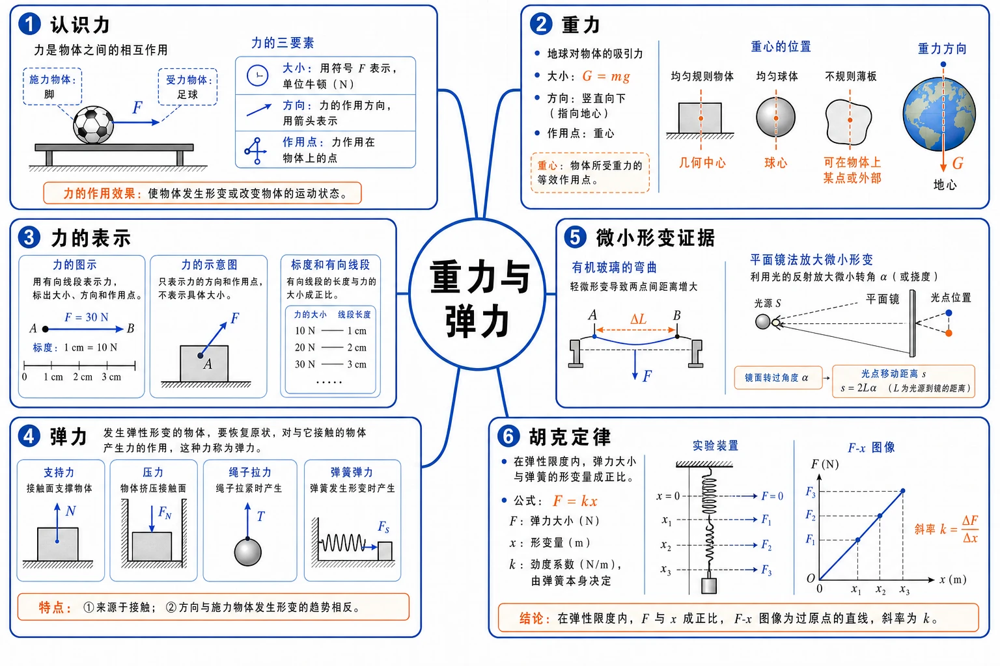
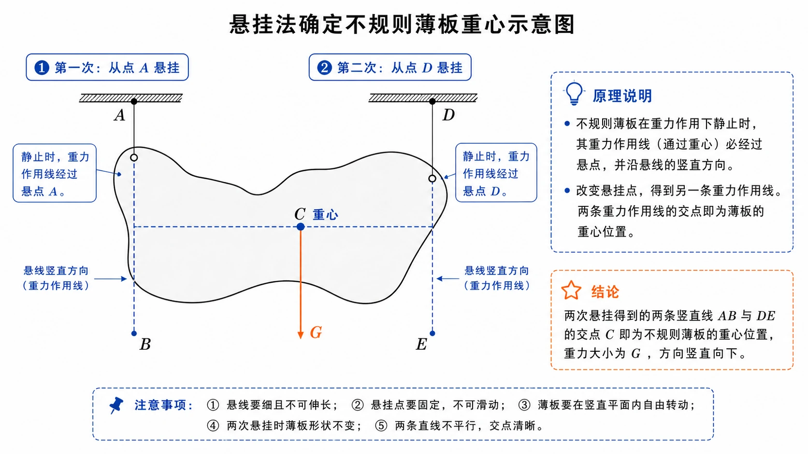
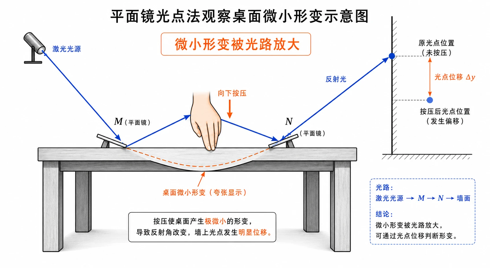
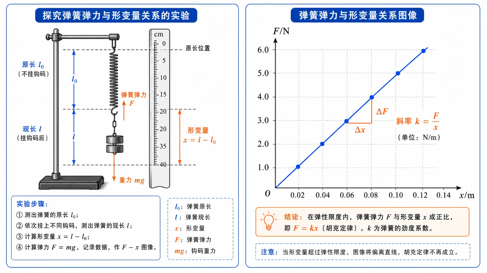

# 3.1 重力与弹力

<!-- 图片描述：本节整体知识信息结构图。中心主题为“重力与弹力”，向外分为六个分支：认识力（受力物体、施力物体、大小、方向、作用点）、重力（地球吸引、$G=mg$、竖直向下、重心）、力的表示（力的图示、力的示意图、标度和有向线段）、弹力（接触、弹性形变、支持力、压力、绳子拉力）、微小形变证据（有机玻璃、平面镜光点放大）、胡克定律（弹性限度内、$F=kx$、$F-x$ 图像斜率）。采用白色或浅网格背景，黑灰物体轮廓，蓝色表示力的方向和作用线，橙色表示形变、重心和关键公式。 -->

## 本节学习目标

学完本节，需要能做到：

- 知道力是物体对物体的作用，分析一个力时能说清受力物体和施力物体。
- 能从大小、方向、作用点三个方面描述力，并会区分力的图示和力的示意图。
- 理解重力的产生原因、施力物体、大小、方向和作用点。
- 会用 $G=mg$ 计算物体重力，并理解 $g$ 的单位 $\text{N/kg}$ 与 $\text{m/s}^2$ 的等价关系。
- 理解重心的含义，会判断规则均匀物体的重心位置，会说明悬挂法确定薄板重心的原理。
- 理解形变、弹性形变、弹性限度和弹力的概念。
- 能判断常见弹力的有无和方向，包括支持力、压力、绳子拉力和弹簧弹力。
- 掌握胡克定律 $F=kx$，会根据数据或 $F-x$ 图像求弹簧劲度系数。

## 核心知识点讲解

### 一、知识对象与物理情境

自然界中的物体不是孤立存在的。一个物体的运动状态改变、形状改变，通常都来自其他物体对它的作用。在力学中，我们把物体间的相互作用抽象为“力”。

认识一个力，不能只说“有力”，而要追问四件事：

1. 谁受到这个力？
2. 谁施加这个力？
3. 这个力有多大？
4. 这个力的方向和作用点在哪里？

例如“桌面对书的支持力”，受力物体是书，施力物体是桌面，方向垂直桌面向上，作用点可画在接触处或物体受力示意图的合适位置。以后做受力分析时，每一个力都要经得起这样的追问。

### 二、核心概念与物理意义

#### 1. 力的三要素与施力、受力物体

力是一个物体对另一个物体的作用。任何一个力都不能脱离物体单独存在。

描述一个力，通常要说清三要素：

| 要素 | 含义 | 常见表达 |
| --- | --- | --- |
| 大小 | 力的强弱 | $6\ \text{N}$、$250\ \text{N}$ |
| 方向 | 力指向哪里 | 竖直向下、水平向右、垂直接触面向上 |
| 作用点 | 力作用在物体上的位置 | 重心、接触点、绳端连接点 |

同时，还要说清受力物体和施力物体。例如“人推车的力”中，受力物体是车，施力物体是人；“车推人的力”则是另一个力，受力物体和施力物体正好交换。

#### 2. 重力

由于地球的吸引而使物体受到的力叫作重力，通常用 $G$ 表示，单位是牛顿，符号为 $\text{N}$。

重力的特点：

| 项目 | 内容 |
| --- | --- |
| 受力物体 | 地球附近的物体 |
| 施力物体 | 地球 |
| 大小 | $G=mg$ |
| 方向 | 竖直向下 |
| 作用点 | 重心 |

重力大小与质量的关系为：

$$
G=mg
$$

其中 $m$ 是物体质量，$g$ 是自由落体加速度。$g$ 的单位既可以写作 $\text{N/kg}$，也可以写作 $\text{m/s}^2$，并且：

$$
1\ \text{N/kg}=1\ \text{m/s}^2
$$

在计算重力时，$g$ 常取 $9.8\ \text{N/kg}$，粗略计算也可取 $10\ \text{N/kg}$。

#### 3. 重心

物体各部分都受到重力作用。从整体效果看，可以把物体所受重力看成集中作用在一点，这一点叫作物体的重心。重心可以看作重力的作用点。

重心位置由物体形状和质量分布共同决定：

| 物体 | 重心位置 |
| --- | --- |
| 质量均匀的细直棒 | 棒的中点 |
| 质量均匀的球 | 球心 |
| 质量均匀的圆柱体 | 轴线中点 |
| 质量均匀的规则薄板 | 几何对称中心或相关对称线交点 |
| 质量分布不均匀的物体 | 与质量分布有关，不能只看几何形状 |

重心不一定在物体材料内部。均匀圆环的重心在圆心，但圆心处没有材料；某些弯曲物体的重心也可能在物体外部。

#### 4. 力的图示与力的示意图

力可以用有向线段表示。

力的图示要求比较严格：

- 有标度，例如 $1\ \text{cm}$ 表示 $2\ \text{N}$。
- 线段长短按标度表示力的大小。
- 箭头表示力的方向。
- 箭尾或箭头所在位置表示力的作用点。

力的示意图不要求严格按标度画出大小，重点是画清作用点和方向。受力分析中常用的是力的示意图。

### 三、关键规律、公式与适用条件

#### 1. 重力计算公式

$$
G=mg
$$

使用时注意：

- $G$ 的单位是 $\text{N}$。
- $m$ 的单位是 $\text{kg}$。
- $g$ 的单位可用 $\text{N/kg}$。
- 重力方向竖直向下，计算大小后不能漏写方向。

#### 2. 弹力的产生条件

物体在力的作用下形状或体积发生改变，这种变化叫作形变。发生形变的物体由于要恢复原状，会对与它接触的物体产生力，这种力叫作弹力。

弹力产生需要两个条件：

1. 两个物体相互接触。
2. 接触处发生弹性形变。

只有接触不一定有弹力。如果两个物体只是接触但没有相互挤压、拉伸或支持作用，就不一定产生弹力。

#### 3. 常见弹力方向

| 弹力类型 | 方向判断 |
| --- | --- |
| 支持力 | 垂直接触面，指向被支持物体 |
| 压力 | 垂直接触面，指向被压物体 |
| 绳子拉力 | 沿绳子方向，指向绳子收缩方向 |
| 弹簧弹力 | 沿弹簧轴线，指向恢复原状方向 |

判断弹力方向的核心是：发生形变的物体要恢复原状，它对接触物体施加的力就沿恢复形变的趋势方向。

#### 4. 胡克定律

物体发生形变后，如果撤去外力能够恢复原状，这种形变叫弹性形变。若形变过大，撤去外力后不能完全恢复原状，就超过了弹性限度。

在弹性限度内，弹簧发生弹性形变时，弹力大小跟弹簧伸长或缩短的长度成正比：

$$
F=kx
$$

其中：

| 符号 | 物理意义 | 单位 |
| --- | --- | --- |
| $F$ | 弹簧弹力大小 | $\text{N}$ |
| $x$ | 弹簧伸长量或压缩量 | $\text{m}$ |
| $k$ | 弹簧劲度系数 | $\text{N/m}$ |

劲度系数 $k$ 表示弹簧“软硬”。$k$ 越大，弹簧越硬，相同形变量产生的弹力越大。

注意：$x$ 是形变量，不是弹簧总长度。若弹簧原长为 $l_0$，形变后长度为 $l$，则：

$$
x=|l-l_0|
$$

### 四、典型模型与过程分析

#### 1. 悬挂法确定薄板重心

不规则薄板的重心可用悬挂法确定：

1. 在薄板上一点 $A$ 悬挂薄板。
2. 薄板静止后，沿悬线方向画一条竖直线。
3. 换另一点 $D$ 悬挂，再画一条竖直线。
4. 两条竖直线的交点就是薄板重心。

原理：薄板静止时受到悬线拉力和重力两个力作用并平衡。重力的作用线必须与悬线在同一直线上，因此重心必在悬线所在竖直线上。两次悬挂得到两条重力作用线，它们的交点就是重心。

<!-- 图片描述：悬挂法确定不规则薄板重心示意图。画一块不规则薄板，第一次从点 A 悬挂，悬线竖直向下，沿悬线画蓝色竖直线 AB；第二次从点 D 悬挂，画另一条蓝色竖直线 DE；两线交点标注 C，旁边写“重心”。用橙色箭头标出重力 $G$ 竖直向下，并说明静止时重力作用线经过悬点。白色背景，黑灰薄板轮廓。 -->

#### 2. 微小形变模型

很多物体受力后的形变很小，肉眼难以直接观察，但形变仍然存在。可以用放大方法显示微小形变：

- 透明材料受压后，内部受力状态改变，可通过特殊光学方法显示花纹变化。
- 桌面被按压时形变极小，可用平面镜反射光点位置变化来放大观察。

这些实验说明：看似“刚硬”的桌面、玻璃等物体，在受力时也会发生微小形变；支持力、压力等弹力正是由这种形变产生的。

<!-- 图片描述：平面镜光点法观察桌面微小形变示意图。画一张大桌子，桌面上放两个小平面镜 M、N，一束蓝色光依次反射后射到墙上形成光点。手向下按压两镜之间的桌面，桌面微小弯曲用夸张橙色虚线表示，墙上光点位置发生偏移。图中标注“微小形变被光路放大”。白色背景，黑灰桌面和镜子，蓝色光路，橙色形变标记。 -->

#### 3. 探究弹簧弹力与形变量的关系

实验思路：测量多组弹簧弹力 $F$ 和形变量 $x$，看二者关系。

常用装置：把弹簧上端固定在铁架台横杆上，旁边放刻度尺。先记录弹簧自然下垂时下端位置，再在弹簧下端挂不同质量的钩码，记录弹簧长度。

数据处理：

- 钩码静止时，弹簧弹力大小等于钩码重力 $mg$。
- 形变量 $x$ 等于挂钩码后的长度减去原长。
- 以 $F$ 为纵轴、$x$ 为横轴描点作图。
- 若数据点接近一条过原点的直线，说明 $F$ 与 $x$ 成正比。
- $F-x$ 图像斜率就是劲度系数 $k$。

<!-- 图片描述：探究弹簧弹力与形变量关系的实验和图像。左侧为铁架台悬挂弹簧，旁边有刻度尺，弹簧下挂钩码，标注原长 $l_0$、现长 $l$、形变量 $x=l-l_0$，钩码重力 $mg$ 向下。右侧为 $F-x$ 坐标图，横轴 $x/\text{m}$，纵轴 $F/\text{N}$，数据点落在一条蓝色过原点直线附近，橙色标注“斜率 $k=F/x$”。 -->

### 五、图像、实验与数据理解

#### 1. $F-x$ 图像

在弹性限度内，弹簧的 $F-x$ 图像是一条过原点的直线。直线越陡，劲度系数越大，弹簧越硬。

若图像后段明显弯曲，说明弹簧可能接近或超过弹性限度，此时不能继续用 $F=kx$ 描述。

#### 2. 力的图示读图

读力的图示时要看：

- 标度是多少。
- 有向线段长度是多少。
- 箭头方向指向哪里。
- 作用点画在哪个物体上。

例如标度为 $1\ \text{cm}$ 表示 $2\ \text{N}$，一个 $6\ \text{N}$ 的力应画 $3\ \text{cm}$ 长的有向线段。

#### 3. 受力示意图的第一步

画受力示意图时，要先明确“研究对象”。只画研究对象受到的力，不画它对其他物体施加的力。

例如钢管一端支在光滑水平地面上，另一端被竖直绳悬挂。若研究对象是钢管，通常要画：

- 钢管受到的重力，方向竖直向下，作用于重心。
- 地面对钢管的支持力，方向竖直向上。
- 绳对钢管的拉力，方向沿绳竖直向上。

### 六、题型应用与迁移

本节常见题型如下：

| 题型 | 识别信号 | 方法 |
| --- | --- | --- |
| 重力计算 | 给质量，求重力 | 用 $G=mg$，写明方向 |
| 重心判断 | 规则物体、不规则薄板、装载变化 | 看形状和质量分布，或用悬挂法 |
| 力的图示 | 给力大小、方向、标度 | 按标度画有向线段 |
| 弹力方向 | 接触面、绳、弹簧 | 按形变恢复方向判断 |
| 胡克定律 | 弹簧、伸长量、劲度系数 | 用 $F=kx$，注意 $x$ 是形变量 |
| 图像求 $k$ | 给 $F-x$ 图像或数据 | 斜率 $k=\Delta F/\Delta x$ |

## 重点梳理

### 重点 1：分析力要先找受力物体和施力物体

为什么重要：受力分析最常见错误，就是把“某物体受到的力”和“某物体施加的力”混在一起。一个力一定有受力物体和施力物体。

怎么用：每写一个力，都用“甲受到乙的某种力”来表达。例如“木块受到斜面的支持力”，不要只写“有支持力”。

### 重点 2：重力的四个要点

- 产生原因：地球吸引。
- 施力物体：地球。
- 大小：$G=mg$。
- 方向：竖直向下。
- 作用点：重心。

触发条件：题目问“物体受几个力”“画重力图示”“计算重力”“重心在哪里”时，都要围绕这些要点回答。

### 重点 3：弹力产生条件和方向

弹力必须满足“接触”和“弹性形变”两个条件。方向取决于形变恢复趋势：支持力、压力垂直接触面；绳子拉力沿绳；弹簧弹力沿弹簧轴线。

为什么重要：弹力方向是后续受力分析、平衡问题、牛顿定律问题的基础。

### 重点 4：胡克定律的适用边界

$$
F=kx
$$

这个公式只在弹性限度内成立。$x$ 是伸长量或压缩量，不是弹簧总长度。$k$ 是弹簧本身的性质，不由某一次 $F$ 或 $x$ 单独决定。

## 难点突破

### 难点 1：重力方向是不是垂直接触面向下

不是。重力方向是竖直向下，由当地重垂线方向确定。它与物体是否接触、接触面怎样倾斜无关。

放在斜面上的物体，重力仍然竖直向下；支持力才垂直斜面。

### 难点 2：重心一定在物体内部吗

不一定。重心是重力作用效果的等效点，不一定是物体材料实际所在的位置。均匀圆环的重心在圆心，圆心并不在圆环材料上。

所以悬挂法得到的重心在薄板外部，也可能是合理的。

### 难点 3：有接触就一定有弹力吗

不一定。弹力还要求接触处发生弹性形变。

例如两个球靠在一起但没有相互挤压，就不一定有弹力；放在桌面上的书与桌面相互挤压，桌面发生微小形变，书才受到支持力。

### 难点 4：支持力和压力是一对什么关系

支持力和压力都属于弹力，但它们通常作用在不同物体上。例如书放在桌面上：

- 桌面对书的支持力，受力物体是书。
- 书对桌面的压力，受力物体是桌面。

二者不能画在同一个受力物体图上，除非研究对象不同。

### 难点 5：胡克定律中的 $x$ 为什么不是总长度

弹簧弹力来自形变，形变大小是相对原长的变化量。若弹簧原长 $8\ \text{cm}$，挂物后总长 $11\ \text{cm}$，形变量是：

$$
x=11\ \text{cm}-8\ \text{cm}=3\ \text{cm}=0.03\ \text{m}
$$

代入 $F=kx$ 时，应使用 $0.03\ \text{m}$，不是 $0.11\ \text{m}$。

## 例题讲解

### 例题 1：计算重力并画图示长度

**题目**：质量为 $2.0\times10^3\ \text{kg}$ 的火箭竖直向上飞行。取 $g=10\ \text{N/kg}$，求火箭受到的重力大小和方向。若用 $1\ \text{cm}$ 表示 $1.0\times10^4\ \text{N}$，力的图示线段应画多长？

**分析**：重力大小用 $G=mg$，方向竖直向下。图示长度由力的大小除以标度。

**步骤**：

$$
G=mg=2.0\times10^3\times10=2.0\times10^4\ \text{N}
$$

图示线段长度：

$$
L=\frac{2.0\times10^4\ \text{N}}{1.0\times10^4\ \text{N/cm}}=2.0\ \text{cm}
$$

**答案**：火箭受到的重力为 $2.0\times10^4\ \text{N}$，方向竖直向下；按给定标度应画 $2.0\ \text{cm}$ 长的有向线段，箭头竖直向下。

**反思**：物体向上运动时，重力方向仍然竖直向下，不随运动方向改变。

### 例题 2：判断斜面支持力方向

**题目**：物体静止在斜面上。斜面对物体的支持力方向如何？重力方向如何？

**分析**：支持力属于弹力，方向垂直接触面并指向被支持物体；重力由地球施加，方向竖直向下。

**答案**：斜面对物体的支持力方向垂直斜面向外；物体受到的重力方向竖直向下。

**反思**：支持力方向和重力方向一般不相同。不要把重力误画成垂直斜面向下。

### 例题 3：胡克定律计算弹力

**题目**：弹簧原长 $8.0\ \text{cm}$，挂上物体后长 $11.0\ \text{cm}$。弹簧劲度系数为 $100\ \text{N/m}$，求弹簧弹力大小。

**分析**：先求形变量，再代入 $F=kx$。

**步骤**：

$$
x=11.0\ \text{cm}-8.0\ \text{cm}=3.0\ \text{cm}=0.030\ \text{m}
$$

$$
F=kx=100\times0.030=3.0\ \text{N}
$$

**答案**：弹簧弹力大小为 $3.0\ \text{N}$。

**反思**：$x$ 是伸长量，不是挂物后的总长度。

### 例题 4：由悬挂钩码求弹簧劲度系数

**题目**：某弹簧下挂 $0.20\ \text{kg}$ 钩码时伸长 $4.0\ \text{cm}$。取 $g=10\ \text{N/kg}$，求弹簧劲度系数。

**分析**：钩码静止时，弹簧弹力大小等于钩码重力。

**步骤**：

$$
F=G=mg=0.20\times10=2.0\ \text{N}
$$

$$
x=4.0\ \text{cm}=0.040\ \text{m}
$$

$$
k=\frac{F}{x}=\frac{2.0}{0.040}=50\ \text{N/m}
$$

**答案**：弹簧劲度系数为 $50\ \text{N/m}$。

**反思**：用钩码实验求 $k$ 时，要先把质量换成重力，再用重力等于弹簧弹力。

### 例题 5：钢管受力示意图

**题目**：质量均匀的钢管，一端支在光滑水平地面上，另一端被竖直绳悬挂着。钢管受到几个力？各力的施力物体是什么？

**分析**：研究对象是钢管。按重力、接触弹力、绳子拉力逐一找。

**答案**：钢管受到三个力：

- 重力 $G$，施力物体是地球，方向竖直向下，作用点在钢管重心。
- 地面对钢管的支持力，施力物体是地面，方向竖直向上。
- 绳对钢管的拉力，施力物体是绳，方向沿绳竖直向上。

**反思**：钢管对地面的压力、钢管对绳的拉力是钢管施加给其他物体的力，不画在钢管受力示意图中。

## 易错点整理

### 易错点 1：把质量当成重力

**常见错误表现**：说“物体重力是 $5\ \text{kg}$”。

**错因分析**：质量和重力是不同物理量。质量单位是 $\text{kg}$，重力单位是 $\text{N}$。

**正确处理**：用 $G=mg$ 把质量换算为重力，结果单位写 $\text{N}$。

### 易错点 2：认为重力没有施力物体

**常见错误表现**：说“物体本身就有重力，所以重力没有施力物体”。

**错因分析**：力是物体对物体的作用，任何力都有施力物体。

**正确处理**：重力的施力物体是地球，受力物体是地球附近的物体。

### 易错点 3：把重力方向画成垂直接触面向下

**常见错误表现**：斜面上物体的重力被画成垂直斜面向下。

**错因分析**：混淆了重力和压力、支持力。

**正确处理**：重力始终竖直向下；压力、支持力才与接触面垂直。

### 易错点 4：有接触就判断有弹力

**常见错误表现**：两个物体只要接触，就认为一定有弹力。

**错因分析**：忽略了弹性形变条件。

**正确处理**：判断是否相互挤压、拉伸或支撑，是否存在恢复形变的趋势。

### 易错点 5：胡克定律中把总长度当形变量

**常见错误表现**：弹簧原长 $6\ \text{cm}$，现长 $9\ \text{cm}$，把 $x=9\ \text{cm}$ 代入。

**错因分析**：没有理解弹力来自形变。

**正确处理**：$x=9\ \text{cm}-6\ \text{cm}=3\ \text{cm}=0.03\ \text{m}$。

### 易错点 6：力的图示没有标度

**常见错误表现**：画一根箭头就称为力的图示。

**错因分析**：混淆了力的图示和力的示意图。

**正确处理**：力的图示要有标度，并按标度画长度；没有标度通常只能称为力的示意图。

## 考点考证点整理

### 考点一：力的基本认识

- 出题思路：要求指出某个力的受力物体、施力物体、大小、方向和作用点。
- 关键条件：题干中的“甲对乙的力”必须拆清甲和乙。
- 解答要点：用“乙受到甲施加的某力”表达，不把作用力和反作用力混为一个力。
- 易扣分点：漏写施力物体；把受力物体写反。

### 考点二：重力与重心

- 出题思路：计算重力、画重力示意图、判断重心位置、解释重心随质量分布改变。
- 关键条件：质量、$g$ 取值、物体是否均匀、形状是否规则。
- 解答要点：$G=mg$，方向竖直向下，作用点在重心；规则均匀物体按几何对称判断重心。
- 易扣分点：质量单位与重力单位混淆；把重力方向写成垂直接触面。

### 考点三：悬挂法确定重心

- 出题思路：给出不规则薄板或三角形薄板，要求说明怎样确定重心。
- 关键条件：薄板静止时受拉力和重力平衡，重心在悬线竖直线上。
- 解答要点：至少两次悬挂，画两条竖直线，交点为重心。
- 易扣分点：只说“找交点”而不说明为什么重心在悬线方向上。

### 考点四：弹力有无和方向

- 出题思路：判断接触面、绳、弹簧、斜面对物体是否有弹力及方向。
- 关键条件：是否接触；是否发生弹性形变；接触面或绳、弹簧的方向。
- 解答要点：支持力、压力垂直接触面；绳拉力沿绳且指向收缩方向；弹簧弹力沿弹簧轴线。
- 易扣分点：认为接触必有弹力；把绳子拉力画成推力方向。

### 考点五：胡克定律与 $F-x$ 图像

- 出题思路：由弹簧伸长量求弹力，由钩码数据求劲度系数，由 $F-x$ 图像斜率求 $k$。
- 关键条件：弹性限度内；$x$ 是形变量；单位换算为米。
- 解答要点：写 $F=kx$ 或 $k=F/x$；图像斜率表示劲度系数。
- 易扣分点：把总长度当 $x$；厘米未换成米；超过弹性限度仍用胡克定律。

## 练习题

### 基础训练

1. 力是一个物体对另一个物体的作用。分析一个力时，至少要说清哪两个物体？
2. 质量为 $5.0\ \text{kg}$ 的物体，取 $g=10\ \text{N/kg}$，重力大小是多少？方向如何？
3. 重力的施力物体是谁？重力的作用点通常看作哪里？
4. 弹力产生需要哪两个条件？
5. 胡克定律的表达式是什么？其中 $x$ 表示什么？

### 巩固训练

6. 弹簧原长 $8.0\ \text{cm}$，挂上物体后长 $11.0\ \text{cm}$，劲度系数 $100\ \text{N/m}$，求弹簧弹力。
7. 弹簧伸长 $0.060\ \text{m}$ 时弹力为 $3.0\ \text{N}$，求劲度系数。
8. 物体静止在斜面上，斜面对物体的支持力方向如何？物体受到的重力方向如何？
9. 为什么悬挂法能确定不规则薄板重心？
10. 判断并说明理由：两个物体只要相互接触，就一定存在弹力。

### 提升训练

11. 某弹簧下挂 $0.20\ \text{kg}$ 钩码时伸长 $4.0\ \text{cm}$，取 $g=10\ \text{N/kg}$。求弹簧劲度系数。
12. 要画一个大小为 $6\ \text{N}$、方向竖直向下的重力图示，若选 $1\ \text{cm}$ 表示 $2\ \text{N}$，线段应画多长？
13. 一个不规则薄板用悬挂法画出两条竖直线，交点在薄板外部。这可能是重心吗？说明理由。
14. 竖直悬挂弹簧的原长为 $6.0\ \text{cm}$。实验数据如下表，取 $g=10\ \text{N/kg}$。根据数据估算弹簧劲度系数。

| 钩码质量 $m/\text{g}$ | 0 | 30 | 60 | 90 | 120 | 150 |
| --- | --- | --- | --- | --- | --- | --- |
| 弹簧总长度 $l/\text{cm}$ | 6.0 | 7.2 | 8.3 | 9.5 | 10.6 | 11.8 |

15. 质量均匀的钢管，一端支在光滑水平地面上，另一端被竖直绳悬挂着。钢管受到几个力？各力的施力物体是什么？画受力示意图时应注意什么？

## 练习题答案

### 基础训练答案

1. 至少要说清受力物体和施力物体。力不能脱离物体单独存在。

2. 由 $G=mg$：

$$
G=5.0\times10=50\ \text{N}
$$

重力大小为 $50\ \text{N}$，方向竖直向下。

3. 重力的施力物体是地球；重力的作用点通常看作物体的重心。

4. 弹力产生需要两个条件：两个物体相互接触；接触处发生弹性形变。

5. 胡克定律为：

$$
F=kx
$$

其中 $x$ 表示弹簧的伸长量或压缩量，即相对原长的形变量。

### 巩固训练答案

6. 形变量：

$$
x=11.0\ \text{cm}-8.0\ \text{cm}=3.0\ \text{cm}=0.030\ \text{m}
$$

弹力：

$$
F=kx=100\times0.030=3.0\ \text{N}
$$

7. 由 $F=kx$ 得：

$$
k=\frac{F}{x}=\frac{3.0}{0.060}=50\ \text{N/m}
$$

8. 斜面对物体的支持力垂直斜面向外；物体受到的重力竖直向下。

9. 薄板静止悬挂时，悬线拉力和重力平衡，重力作用线必定与悬线在同一直线上，所以重心一定在悬线所在竖直线上。换另一个悬点再画一条竖直线，两条线的交点就是重心。

10. 不对。弹力不仅要求接触，还要求接触处发生弹性形变。若只是接触但没有相互挤压或拉伸，不一定有弹力。

### 提升训练答案

11. 钩码重力：

$$
G=mg=0.20\times10=2.0\ \text{N}
$$

钩码静止时弹簧弹力大小等于钩码重力，形变量 $x=4.0\ \text{cm}=0.040\ \text{m}$。

$$
k=\frac{F}{x}=\frac{2.0}{0.040}=50\ \text{N/m}
$$

12. 图示线段长度为：

$$
L=\frac{6\ \text{N}}{2\ \text{N/cm}}=3\ \text{cm}
$$

应画 $3\ \text{cm}$ 长、方向竖直向下的有向线段，并标明标度。

13. 可能。重心是重力作用效果的等效点，不一定在物体材料内部。若两条悬线方向的竖直线交在薄板外部，这个交点也可能是薄板的重心。

14. 原长为 $6.0\ \text{cm}$。取最后一组数据估算：

$$
x=11.8\ \text{cm}-6.0\ \text{cm}=5.8\ \text{cm}=0.058\ \text{m}
$$

钩码质量 $m=150\ \text{g}=0.150\ \text{kg}$，弹力大小等于钩码重力：

$$
F=mg=0.150\times10=1.50\ \text{N}
$$

$$
k=\frac{F}{x}=\frac{1.50}{0.058}\approx25.9\ \text{N/m}
$$

用其他数据点或作 $F-x$ 图像取斜率，结果约为 $25\ \text{N/m}$ 到 $26\ \text{N/m}$。实验数据有读数误差，通常以图像斜率为更可靠估计。

15. 钢管受到三个力：地球对钢管的重力、地面对钢管的支持力、绳对钢管的拉力。画受力示意图时，只画钢管受到的力，不画钢管对地面或绳施加的力；重力画在重心处竖直向下，支持力竖直向上，绳的拉力沿绳竖直向上。
