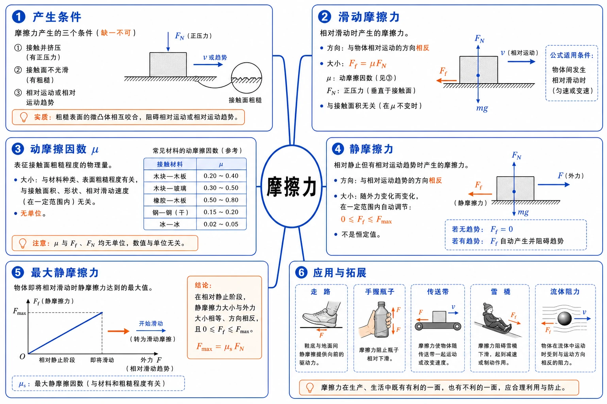
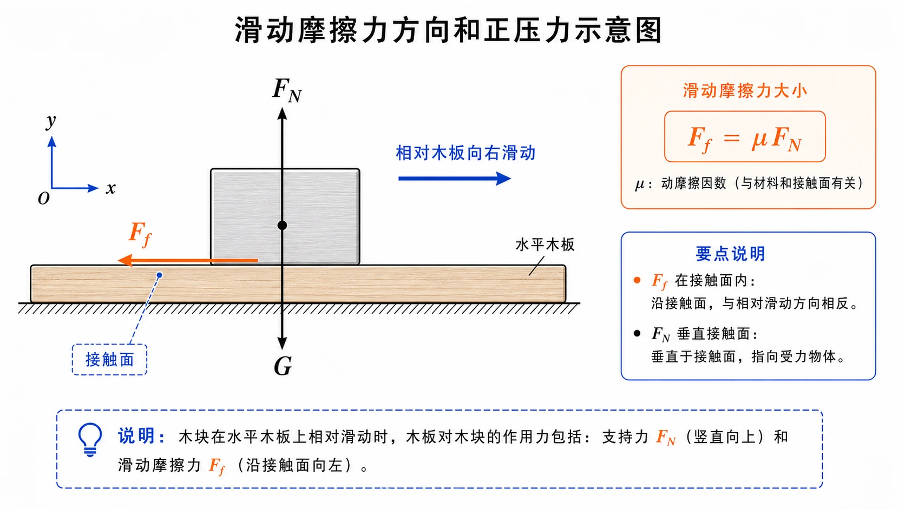
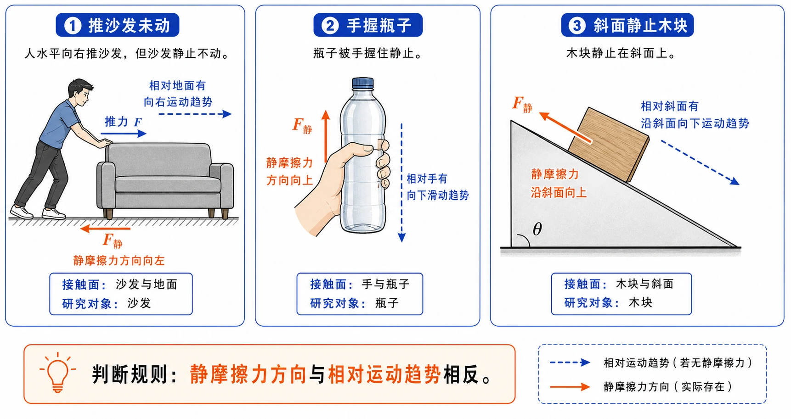
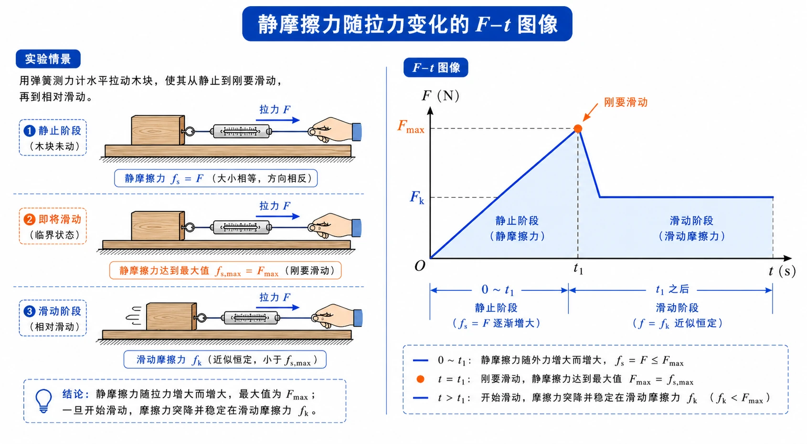

## 相关知识

[[3.1 重力与弹力]]
[[3.3 牛顿第三定律]]
[[3.4 力的合成和分解]]
[[3.5 共点力的平衡]]

# 3.2 摩擦力

<!-- 图片描述：本节整体知识信息结构图。中心主题为“摩擦力”，向外分为六个分支：产生条件（接触挤压、接触面不光滑、相对运动或趋势）、滑动摩擦力（相对滑动、方向反相对运动、$F_f=\mu F_N$）、动摩擦因数（材料、粗糙程度、无单位）、静摩擦力（相对静止但有趋势、大小随外力变）、最大静摩擦力（即将滑动、$0\le F_f\le F_{\max}$）、应用与拓展（走路、手握瓶、传送带、雪橇、流体阻力）。采用白色或浅网格背景，黑灰接触面和物体轮廓，蓝色表示运动或趋势方向，橙色表示摩擦力方向、压力和关键公式。 -->

## 本节学习目标

学完本节，需要能做到：

- 理解摩擦力产生的基本条件：接触挤压、接触面不光滑、有相对运动或相对运动趋势。
- 理解滑动摩擦力的概念，会判断滑动摩擦力方向。
- 掌握滑动摩擦力公式 $F_f=\mu F_N$，知道 $F_N$ 是接触面间的正压力。
- 知道动摩擦因数 $\mu$ 与接触面材料、粗糙程度等因素有关，且没有单位。
- 理解静摩擦力的概念，会判断静摩擦力方向和大小。
- 知道静摩擦力大小会随外力变化，并且有最大值。
- 会区分滑动摩擦力、静摩擦力和最大静摩擦力。
- 能分析瓶子、斜面、木箱、雪橇、传送带、流体阻力等常见情境中的摩擦力。

## 核心知识点讲解

### 一、知识对象与物理情境

手压着桌面向前移动，会感觉到桌面对手有阻碍作用；用弹簧测力计拖动水平木板上的木块，让木块匀速运动，测力计示数可以反映木块受到的摩擦力大小；用更大的力压住木块，拖动时需要的力也会变大。

这些现象共同指向本节的核心问题：摩擦力什么时候产生？方向怎样判断？大小和哪些因素有关？

摩擦力不是简单地“阻碍运动”的力。它阻碍的是两个接触面之间的相对运动或相对运动趋势。这个“相对”二字，是理解摩擦力方向和作用的关键。

### 二、核心概念与物理意义

#### 1. 摩擦力产生的条件

两个相互接触的物体之间，如果存在相对运动或相对运动趋势，在接触面上就可能产生摩擦力。

摩擦力产生通常需要三个条件：

| 条件 | 含义 |
| --- | --- |
| 接触并挤压 | 两物体接触面之间有正压力 |
| 接触面不完全光滑 | 表面粗糙或存在相互作用 |
| 有相对运动或相对运动趋势 | 已经相对滑动，或将要相对滑动但还没滑动 |

摩擦力的方向一定沿接触面，且与相对运动或相对运动趋势方向相反。

#### 2. 滑动摩擦力

两个相互接触的物体发生相对滑动时，在接触面上产生阻碍相对运动的力，叫作滑动摩擦力。

滑动摩擦力方向判断：

1. 选定研究对象。
2. 判断研究对象相对接触面沿哪个方向滑动。
3. 滑动摩擦力沿接触面，方向与相对滑动方向相反。

例如木块在水平木板上向右滑动，木块相对木板向右滑动，木板对木块的滑动摩擦力向左。

<!-- 图片描述：滑动摩擦力方向和正压力示意图。画水平木板上一个木块向右滑动，蓝色箭头标注“相对木板向右滑动”，橙色箭头 $F_f$ 沿接触面向左，黑灰竖直向上箭头 $F_N$ 表示支持力，竖直向下箭头 $G$ 表示重力。旁边写出 $F_f=\mu F_N$，并标注 $F_f$ 在接触面内、$F_N$ 垂直接触面。 -->

#### 3. 静摩擦力

相互接触的两个物体没有发生相对运动，但存在相对运动趋势时，接触面上产生的摩擦力叫作静摩擦力。

例如用水平力推沙发，沙发没有被推动。沙发相对地面有向前运动的趋势，地面对沙发产生向后的静摩擦力，使沙发仍保持静止。

静摩擦力方向判断：

- 先判断研究对象相对接触面“将要”往哪边动。
- 静摩擦力方向与这个相对运动趋势方向相反。

静摩擦力可以为 $0$。例如瓶子静止在粗糙水平桌面上，如果没有水平外力，也没有相对桌面运动趋势，瓶子不受桌面的摩擦力。

### 三、关键规律、公式与适用条件

#### 1. 滑动摩擦力公式

实验表明，对同一接触面，滑动摩擦力大小与接触面间压力大小成正比：

$$
F_f=\mu F_N
$$

其中：

| 符号 | 物理意义 | 单位或特点 |
| --- | --- | --- |
| $F_f$ | 滑动摩擦力大小 | $\text{N}$ |
| $\mu$ | 动摩擦因数 | 无单位，与接触面有关 |
| $F_N$ | 正压力大小 | $\text{N}$ |

在水平面上，如果物体竖直方向只受重力和支持力并保持平衡，则 $F_N=mg$，此时可写：

$$
F_f=\mu mg
$$

但这只是特殊情况。若物体在斜面上，或还有竖直方向的拉力、压力，$F_N$ 不一定等于 $mg$。

#### 2. 动摩擦因数

动摩擦因数 $\mu$ 描述接触面的摩擦性质，通常与材料、粗糙程度有关。例如钢与冰之间的 $\mu$ 很小，橡胶轮胎与干燥路面之间的 $\mu$ 较大。

由公式可得：

$$
\mu=\frac{F_f}{F_N}
$$

$\mu$ 没有单位。它不是由某一次的 $F_f$ 或 $F_N$ 单独决定，而是接触面性质的反映。

#### 3. 静摩擦力大小

静摩擦力大小通常不能用 $F_f=\mu F_N$ 直接计算，而要根据物体的受力情况决定。

若水平推木箱，木箱仍静止，则水平方向受力平衡：

$$
F_{\text{静}}=F_{\text{推}}
$$

只要木箱未动，推力增大，静摩擦力也随之增大。

静摩擦力有最大限度。物体即将开始相对滑动时，静摩擦力达到最大值，叫最大静摩擦力，记作 $F_{\max}$。

实际静摩擦力满足：

$$
0\le F_{\text{静}}\le F_{\max}
$$

### 四、典型模型与过程分析

#### 1. 滑动摩擦模型

滑动摩擦问题常按以下步骤处理：

1. 确定研究对象。
2. 判断是否相对滑动。
3. 判断相对滑动方向，确定摩擦力方向。
4. 求正压力 $F_N$。
5. 用 $F_f=\mu F_N$ 求大小。
6. 若物体匀速运动，还要结合平衡条件求拉力或推力。

雪橇在水平冰面上匀速前进就是典型模型：竖直方向 $F_N=mg$，水平方向拉力与滑动摩擦力平衡，所以 $F=F_f=\mu mg$。

#### 2. 静摩擦模型

静摩擦问题的关键不是套公式，而是先判断“是否需要摩擦力来维持当前状态”。

常见模型：

| 情境 | 相对运动趋势 | 静摩擦力方向 |
| --- | --- | --- |
| 推沙发未推动 | 沙发相对地面有沿推力方向运动趋势 | 与推力相反 |
| 瓶子静止在斜面上 | 瓶子有沿斜面下滑趋势 | 沿斜面向上 |
| 手握瓶子静止 | 瓶子有相对手向下滑趋势 | 竖直向上 |
| 货物随传送带上坡 | 货物有相对传送带向下滑趋势 | 沿传送带向上 |

<!-- 图片描述：静摩擦力方向判断对比图。分成三幅小图：左图为人水平向右推沙发但沙发静止，蓝色虚线箭头表示沙发相对地面有向右运动趋势，橙色 $F_{静}$ 向左；中图为瓶子被手握住静止，蓝色虚线向下表示下滑趋势，橙色静摩擦力向上；右图为斜面上静止木块，蓝色虚线沿斜面向下表示趋势，橙色静摩擦力沿斜面向上。每幅图都标出接触面和研究对象。 -->

#### 3. 最大静摩擦力实验模型

用弹簧测力计沿水平方向拉木块，在木块开始运动前，拉力逐渐增大，静摩擦力也逐渐增大，并始终与拉力平衡。木块刚要运动时，静摩擦力达到最大值。继续拉动后，木块开始滑动，测力计示数通常会突然变小，之后对应滑动摩擦力。

若用力传感器记录拉力随时间变化，常见图像为：先逐渐上升到峰值 $F_{\max}$，木块开始运动后下降到较稳定的滑动摩擦力水平。

<!-- 图片描述：静摩擦力随拉力变化的 $F-t$ 图像。横轴为时间 $t$，纵轴为拉力或摩擦力 $F$。曲线从 0 随外力增大逐渐上升，到橙色峰值点标注 $F_{\max}$ 和“刚要滑动”，随后下降到一段较低的蓝色近似水平线，标注“滑动摩擦力”。旁边配小图：弹簧测力计水平拉木块，木块在长木板上从静止到开始滑动。 -->

### 五、图像、实验与数据理解

#### 1. 拖动木块测滑动摩擦力

让木块在水平木板上做匀速直线运动，弹簧测力计的示数等于木块受到的滑动摩擦力大小。改变木块对木板的压力，重复实验，可发现对同一接触面，滑动摩擦力随正压力增大而增大，且二者近似成正比。

注意：必须尽量匀速拉动，才能用二力平衡把测力计示数等同于滑动摩擦力。

#### 2. 动摩擦因数表的使用

查动摩擦因数表时，要看清接触材料。例如钢与冰、木与冰的动摩擦因数很小，所以雪橇、冰面运动阻力小；橡胶轮胎与干燥路面的动摩擦因数较大，有利于汽车获得较大的地面作用力。

#### 3. 流体阻力

气体和液体具有流动性，统称流体。物体在流体中运动时会受到流体阻力，方向与物体相对于流体的运动方向相反。

流体阻力通常与以下因素有关：

- 相对流体的速度：速度越大，阻力越大。
- 横截面积：横截面积越大，阻力越大。
- 形状：流线型物体阻力较小。

雨滴下落时，速度增大，空气阻力也增大。当阻力增大到与重力平衡时，雨滴会匀速下落。降落伞通过增大横截面积获得较大空气阻力，帮助安全落地；轮船和车辆常采用流线型以减小阻力。

### 六、题型应用与迁移

本节常见题型如下：

| 题型 | 识别信号 | 方法 |
| --- | --- | --- |
| 判断摩擦力有无 | 静止、接触、是否有趋势 | 看是否有相对运动或趋势 |
| 判断方向 | 滑动、推、握、斜面、传送带 | 反相对运动或趋势方向 |
| 求滑动摩擦力 | 给 $\mu$、$F_N$ 或水平面质量 | 用 $F_f=\mu F_N$ |
| 求静摩擦力 | 物体静止或匀速，给外力 | 用平衡条件 |
| 最大静摩擦力 | “至少推动”“刚要运动” | 对应 $F_{\max}$ |
| 滑动后匀速 | “继续匀速运动” | 拉力等于滑动摩擦力 |

## 重点梳理

### 重点 1：摩擦力方向看“相对”

摩擦力方向不是简单地和物体运动方向相反，而是与相对运动或相对运动趋势方向相反。

为什么重要：走路、汽车驱动轮、传送带等问题中，摩擦力可能与物体对地运动方向相同，充当动力。

### 重点 2：滑动摩擦力公式

$$
F_f=\mu F_N
$$

使用时先确认是滑动摩擦力，再求正压力 $F_N$。在水平面上不一定总有 $F_N=mg$，只有竖直方向受力平衡且没有其他竖直分力时才成立。

### 重点 3：静摩擦力大小由状态决定

静摩擦力不是固定值。它会根据外力变化，在 $0$ 到 $F_{\max}$ 之间调整。

例如用 $20\ \text{N}$ 推力推静止木箱而木箱不动，静摩擦力就是 $20\ \text{N}$；若用 $30\ \text{N}$ 推仍不动，静摩擦力就是 $30\ \text{N}$。

### 重点 4：最大静摩擦力与滑动摩擦力不同

最大静摩擦力是物体即将开始相对滑动时的静摩擦力最大值；滑动摩擦力是物体已经相对滑动后的摩擦力。通常拉动物体瞬间需要的力比维持匀速滑动的力大。

## 难点突破

### 难点 1：静止物体是否一定受静摩擦力

不一定。静摩擦力产生需要相对运动趋势。

瓶子静止在粗糙水平桌面上，没有水平外力时，瓶子没有相对桌面运动趋势，不受摩擦力。瓶子静止在斜面上，有沿斜面下滑趋势，受到沿斜面向上的静摩擦力。

### 难点 2：摩擦力是否一定是阻力

不一定。摩擦力阻碍的是相对运动或相对运动趋势，不一定阻碍物体整体运动。

人走路时，脚相对地面有向后滑的趋势，地面对脚的静摩擦力向前，帮助人前进。汽车驱动轮也是靠地面对轮胎的静摩擦力前进。

### 难点 3：静摩擦力能不能用 $F_f=\mu F_N$

一般不能。$F_f=\mu F_N$ 是滑动摩擦力公式。静摩擦力通常由平衡条件求，只有最大静摩擦力与正压力之间在更深入学习中可近似建立关系，本节不直接套用。

### 难点 4：正压力不一定等于重力

正压力 $F_N$ 是接触面之间垂直于接触面的压力或支持力大小，不是重力的同义词。

水平面上物体只受重力和支持力且竖直方向平衡时，$F_N=mg$。若在斜面上，或物体还受向上拉力、向下压力，$F_N$ 都会改变。

### 难点 5：判断摩擦力方向的顺序

可靠步骤是：

1. 选研究对象。
2. 找接触面。
3. 判断研究对象相对接触面的运动或趋势方向。
4. 摩擦力沿接触面，方向取相反。

不要先凭直觉画箭头。

## 例题讲解

### 例题 1：水平面上滑动摩擦力计算

**题目**：质量为 $20\ \text{kg}$ 的木箱在水平地面上滑动，动摩擦因数 $\mu=0.30$，取 $g=10\ \text{N/kg}$。求木箱受到的滑动摩擦力大小。

**分析**：木箱在水平面上，竖直方向只受重力和支持力并平衡，所以 $F_N=mg$。

**步骤**：

$$
F_N=mg=20\times10=200\ \text{N}
$$

$$
F_f=\mu F_N=0.30\times200=60\ \text{N}
$$

**答案**：木箱受到的滑动摩擦力大小为 $60\ \text{N}$，方向与木箱相对地面的滑动方向相反。

**反思**：如果木箱不在水平面上，或还有竖直方向外力，不能直接写 $F_N=mg$。

### 例题 2：雪橇匀速前进所需拉力

**题目**：雪橇连同木料的总质量为 $4.9\times10^3\ \text{kg}$，在水平冰道上匀速前进。钢制滑板与冰面的动摩擦因数为 $0.02$，取 $g=10\ \text{N/kg}$。求水平拉力大小。

**分析**：研究对象是雪橇。竖直方向 $F_N=mg$，水平方向匀速，拉力与滑动摩擦力平衡。

**步骤**：

$$
F_N=mg=4.9\times10^3\times10=4.9\times10^4\ \text{N}
$$

$$
F_f=\mu F_N=0.02\times4.9\times10^4=980\ \text{N}
$$

匀速运动时：

$$
F=F_f=980\ \text{N}
$$

**答案**：水平拉力大小为 $980\ \text{N}$。

**检查**：冰面动摩擦因数小，所需拉力远小于雪橇重力，数量级合理。

### 例题 3：静摩擦力随推力变化

**题目**：重为 $100\ \text{N}$ 的木箱放在水平地板上，至少要用 $35\ \text{N}$ 水平推力才能使它从静止开始运动。若用 $20\ \text{N}$ 水平推力推这个静止木箱，木箱受到的摩擦力大小是多少？方向怎样？

**分析**：$35\ \text{N}$ 是最大静摩擦力。现在推力 $20\ \text{N}<35\ \text{N}$，木箱仍静止，水平方向受力平衡。

**步骤**：

$$
F_{\text{静}}=F_{\text{推}}=20\ \text{N}
$$

**答案**：木箱受到的静摩擦力大小为 $20\ \text{N}$，方向与推力方向相反。

**反思**：静摩擦力不是总等于最大静摩擦力。需要多大，它就在限度内“调节”到多大。

### 例题 4：最大静摩擦力、滑动摩擦力和动摩擦因数

**题目**：重为 $100\ \text{N}$ 的木箱放在水平地板上，至少用 $35\ \text{N}$ 水平推力才能使它从静止开始运动。木箱运动后，用 $30\ \text{N}$ 水平推力可使它继续做匀速直线运动。求最大静摩擦力、滑动摩擦力和动摩擦因数。

**分析**：“至少推动”对应最大静摩擦力；“匀速滑动”时推力等于滑动摩擦力；水平面上 $F_N=G$。

**步骤**：

$$
F_{\max}=35\ \text{N}
$$

$$
F_f=30\ \text{N}
$$

$$
\mu=\frac{F_f}{F_N}=\frac{30}{100}=0.30
$$

**答案**：最大静摩擦力为 $35\ \text{N}$，滑动摩擦力为 $30\ \text{N}$，动摩擦因数为 $0.30$。

**反思**：刚要运动与已经匀速滑动是两个不同状态，不能把 $35\ \text{N}$ 和 $30\ \text{N}$ 混用。

### 例题 5：瓶子在不同情境中的摩擦力

**题目**：判断瓶子是否受到摩擦力，并说明方向。

（1）瓶子静止在粗糙水平桌面上，没有水平外力。

（2）瓶子静止在倾斜桌面上，没有滑下。

（3）瓶子被手握住，瓶口朝上静止。

（4）瓶子压着纸条，扶住瓶子把纸条水平抽出。

**分析与答案**：

（1）没有摩擦力。瓶子相对桌面没有运动趋势。

（2）有静摩擦力，方向沿倾斜桌面向上，因为瓶子有沿桌面向下滑的趋势。

（3）有静摩擦力，手对瓶子的摩擦力竖直向上，因为瓶子有相对手向下滑的趋势。

（4）有滑动摩擦力。纸条相对瓶底被抽出，瓶子相对纸条有反向相对滑动，纸条对瓶子的滑动摩擦力沿纸条运动方向。

**反思**：判断摩擦力方向必须看研究对象相对接触面的运动或趋势，而不是只看物体是否静止。

## 易错点整理

### 易错点 1：认为静止物体一定没有摩擦力

**常见错误表现**：看到物体静止，就说摩擦力为 $0$。

**错因分析**：静摩擦力正是发生在相对静止但有相对运动趋势时。

**正确处理**：判断是否有相对运动趋势。没有趋势才没有静摩擦力。

### 易错点 2：认为摩擦力一定阻碍物体运动

**常见错误表现**：把摩擦力总是画成与运动方向相反。

**错因分析**：忽略了摩擦力阻碍的是相对运动或相对运动趋势。

**正确处理**：例如人走路、汽车驱动轮、传送带送货时，静摩擦力可能与物体运动方向相同。

### 易错点 3：静摩擦力乱套 $F_f=\mu F_N$

**常见错误表现**：物体静止时，直接用 $\mu F_N$ 算静摩擦力。

**错因分析**：$F_f=\mu F_N$ 是滑动摩擦力公式，不是普通静摩擦力公式。

**正确处理**：静摩擦力大小通常由平衡条件确定，并且不超过最大静摩擦力。

### 易错点 4：把正压力永远当成重力

**常见错误表现**：任何摩擦题都写 $F_N=mg$。

**错因分析**：没有分析垂直接触面方向的受力。

**正确处理**：先找接触面，再求垂直接触面的压力或支持力。只有特定水平平衡情境下 $F_N=mg$。

### 易错点 5：最大静摩擦力和滑动摩擦力混淆

**常见错误表现**：把“刚要动”的推力用于物体滑动后的摩擦力。

**错因分析**：没有区分静摩擦阶段和滑动摩擦阶段。

**正确处理**：“至少推动”“即将运动”对应最大静摩擦力；“匀速滑动”对应滑动摩擦力。

### 易错点 6：忽略流体阻力的方向和影响因素

**常见错误表现**：认为空气阻力总是固定不变，或只与质量有关。

**错因分析**：没有理解流体阻力与相对速度、横截面积和形状有关。

**正确处理**：流体阻力方向与相对流体运动方向相反，速度越大、横截面积越大，阻力通常越大；流线型有利于减小阻力。

## 考点考证点整理

### 考点一：摩擦力有无判断

- 出题思路：给出物体静止或运动情境，判断是否受到摩擦力。
- 关键条件：是否接触挤压；是否粗糙；是否有相对运动或相对运动趋势。
- 解答要点：不能只看是否静止，要判断接触面间是否有相对滑动或趋势。
- 易扣分点：瓶子静止在水平桌面就误判有摩擦力；斜面静止物体误判无摩擦力。

### 考点二：摩擦力方向判断

- 出题思路：在水平面、斜面、手握瓶、传送带、纸条抽出等情境中判断方向。
- 关键条件：研究对象是谁；相对接触面向哪边滑或有哪边趋势。
- 解答要点：摩擦力沿接触面，方向反相对运动或相对运动趋势。
- 易扣分点：把摩擦力方向机械画成与物体对地运动方向相反。

### 考点三：滑动摩擦力计算

- 出题思路：给出 $\mu$、质量、重力或正压力，求滑动摩擦力或拉力。
- 关键条件：必须是相对滑动；先求 $F_N$。
- 解答要点：用 $F_f=\mu F_N$，匀速时再结合平衡条件。
- 易扣分点：正压力求错；动摩擦因数当作有单位量；忘记方向。

### 考点四：静摩擦力与最大静摩擦力

- 出题思路：给推力和最大静摩擦力，判断物体是否运动；求静摩擦力大小。
- 关键条件：推力是否超过 $F_{\max}$；物体是否仍静止。
- 解答要点：若未动，静摩擦力由平衡条件决定；即将动时达到最大静摩擦力。
- 易扣分点：把实际静摩擦力直接写成 $F_{\max}$。

### 考点五：实际摩擦现象解释

- 出题思路：解释走路、握瓶、传送带、汽车驱动、雪橇、降落伞、流线型等现象。
- 关键条件：摩擦力或流体阻力是阻碍相对运动还是帮助整体运动。
- 解答要点：明确研究对象、相对运动趋势、摩擦力方向和作用效果。
- 易扣分点：只写“摩擦力阻碍运动”，没有说明相对运动。

## 练习题

### 基础训练

1. 滑动摩擦力产生的条件是什么？方向怎样判断？
2. 写出滑动摩擦力公式，并说明 $F_f$、$\mu$、$F_N$ 的含义。
3. 静摩擦力产生的条件是什么？方向怎样判断？
4. 静止在粗糙水平桌面上的瓶子，没有水平外力时是否受到摩擦力？为什么？
5. 摩擦力一定是阻力吗？举一个反例。

### 巩固训练

6. 质量为 $10\ \text{kg}$ 的物体在水平面上滑动，动摩擦因数 $\mu=0.20$，取 $g=10\ \text{N/kg}$，求滑动摩擦力大小。
7. 用 $15\ \text{N}$ 水平力推木箱，木箱静止不动，求木箱受到的静摩擦力大小和方向。
8. 某木箱最大静摩擦力为 $40\ \text{N}$，滑动摩擦力为 $32\ \text{N}$。用 $30\ \text{N}$ 水平推力推它，它是否运动？摩擦力多大？
9. 用 $50\ \text{N}$ 水平推力使某木箱在水平地面上匀速滑动，求木箱受到的滑动摩擦力大小。
10. 斜面上的木块有沿斜面下滑趋势但保持静止，静摩擦力方向如何？

### 提升训练

11. 重为 $100\ \text{N}$ 的木箱放在水平地板上，至少用 $35\ \text{N}$ 水平推力才能使它从静止开始运动。木箱运动后，用 $30\ \text{N}$ 水平推力可使它继续做匀速直线运动。求最大静摩擦力、滑动摩擦力、动摩擦因数；若用 $20\ \text{N}$ 水平推力推静止木箱，摩擦力多大？
12. 所受重力为 $500\ \text{N}$ 的空雪橇，在平坦雪地上用 $10\ \text{N}$ 水平拉力恰好可以做匀速直线运动。如果雪橇再载重 $500\ \text{N}$ 的货物，在同一雪地上匀速滑行时受到的摩擦力是多少？
13. 一只瓶子在下列情况下是否受到摩擦力？若受到，方向如何？
    - 静止在粗糙水平桌面上，没有水平外力。
    - 静止在倾斜桌面上，没有滑下。
    - 被手握住，瓶口朝上静止。
    - 压着纸条，扶住瓶子把纸条水平抽出。
14. 雨滴从高空下落，开始速度越来越大，后来接近匀速。用流体阻力解释这一现象。
15. 为什么降落伞要做得面积较大，而高速列车、轮船外形常做成流线型？

## 练习题答案

### 基础训练答案

1. 滑动摩擦力产生条件：两个物体接触并挤压、接触面不光滑、发生相对滑动。方向沿接触面，与相对滑动方向相反。

2. 滑动摩擦力公式：

$$
F_f=\mu F_N
$$

其中 $F_f$ 是滑动摩擦力大小，$\mu$ 是动摩擦因数，$F_N$ 是接触面间正压力大小。

3. 静摩擦力产生条件：两个物体接触并挤压、接触面不光滑、没有相对滑动但有相对运动趋势。方向沿接触面，与相对运动趋势方向相反。

4. 不受到摩擦力。因为瓶子虽然与桌面接触，但没有相对桌面运动的趋势。

5. 不一定。人走路时，脚相对地面有向后滑的趋势，地面对脚的静摩擦力向前，推动人前进。

### 巩固训练答案

6. 水平面上竖直方向平衡：

$$
F_N=mg=10\times10=100\ \text{N}
$$

$$
F_f=\mu F_N=0.20\times100=20\ \text{N}
$$

滑动摩擦力大小为 $20\ \text{N}$。

7. 木箱静止，水平方向受力平衡，所以静摩擦力大小等于推力：

$$
F_{\text{静}}=15\ \text{N}
$$

方向与推力方向相反。

8. 因为 $30\ \text{N}<40\ \text{N}$，推力没有超过最大静摩擦力，木箱不运动。静摩擦力大小为 $30\ \text{N}$，方向与推力相反。

9. 木箱匀速滑动，水平方向受力平衡，滑动摩擦力大小等于推力：

$$
F_f=50\ \text{N}
$$

10. 木块相对斜面有沿斜面向下滑的趋势，所以静摩擦力沿斜面向上。

### 提升训练答案

11. “至少用 $35\ \text{N}$ 才能动”说明最大静摩擦力：

$$
F_{\max}=35\ \text{N}
$$

“用 $30\ \text{N}$ 可使其匀速滑动”说明滑动摩擦力：

$$
F_f=30\ \text{N}
$$

水平面上 $F_N=G=100\ \text{N}$，所以：

$$
\mu=\frac{F_f}{F_N}=\frac{30}{100}=0.30
$$

若用 $20\ \text{N}$ 水平推力推静止木箱，由于 $20\ \text{N}<35\ \text{N}$，木箱不动，静摩擦力大小为 $20\ \text{N}$，方向与推力相反。

12. 空雪橇匀速时，滑动摩擦力等于拉力：

$$
F_f=10\ \text{N}
$$

空载正压力为 $500\ \text{N}$，所以：

$$
\mu=\frac{10}{500}=0.020
$$

载货后总重为：

$$
G=500+500=1000\ \text{N}
$$

同一雪地上动摩擦因数不变：

$$
F_f=\mu F_N=0.020\times1000=20\ \text{N}
$$

13. （1）不受摩擦力，因为没有相对桌面运动趋势。

（2）受静摩擦力，方向沿倾斜桌面向上。

（3）受静摩擦力，瓶子有相对手向下滑的趋势，手对瓶子的静摩擦力竖直向上。

（4）受滑动摩擦力。纸条相对瓶底水平滑动，纸条对瓶子的滑动摩擦力沿纸条运动方向。

14. 雨滴下落时，重力向下，空气阻力向上。开始速度较小，空气阻力小于重力，雨滴加速下落；随着速度增大，空气阻力增大。当空气阻力增大到与重力大小相等时，合力为 $0$，雨滴接近匀速下落。

15. 降落伞面积大，可以增大空气阻力，使下降速度减小，便于安全落地。高速列车和轮船采用流线型，可以减小流体阻力，提高运动效率并节约能源。
