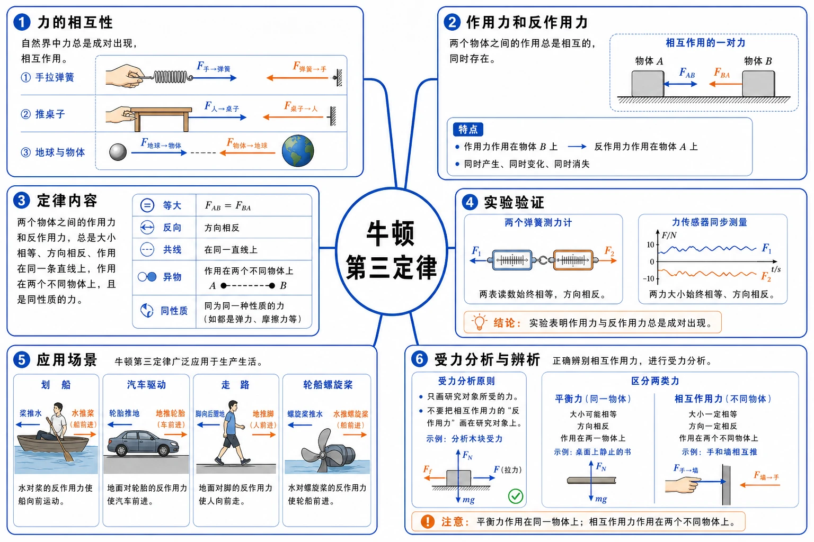
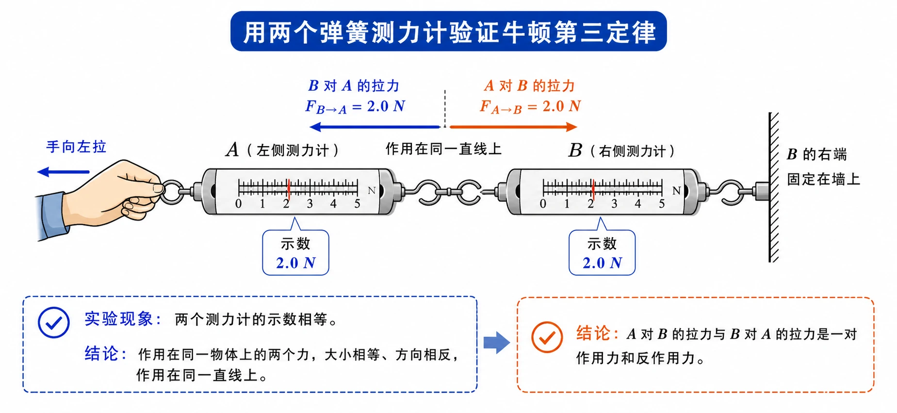
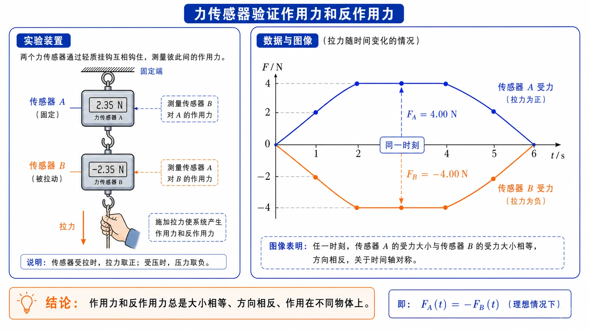
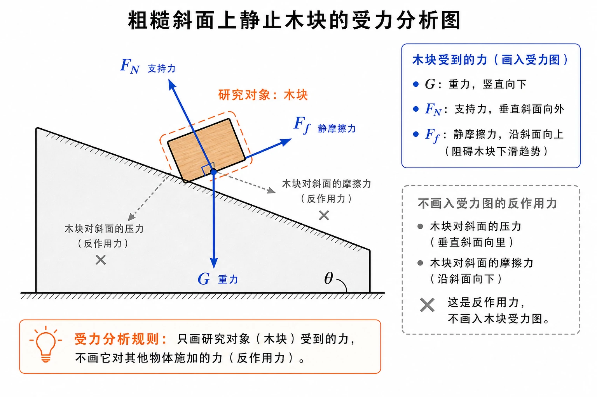

## 相关知识

[[3.1 重力与弹力]]
[[3.2 摩擦力]]
[[3.4 力的合成和分解]]
[[3.5 共点力的平衡]]

# 3.3 牛顿第三定律

<!-- 图片描述：本节整体知识信息结构图。中心主题为“牛顿第三定律”，向外分为六个分支：力的相互性（手拉弹簧、推桌子、地球与物体相互吸引）、作用力和反作用力（两个物体、互相作用、同时存在）、定律内容（等大、反向、共线、异物、同性质）、实验验证（两个弹簧测力计、力传感器同步图像）、应用场景（划船、汽车驱动、走路、轮船螺旋桨）、受力分析与辨析（只画研究对象受力、区分平衡力和相互作用力）。白色或浅网格背景，黑灰物体轮廓，蓝色表示作用力，橙色表示反作用力，成对箭头大小相等方向相反。 -->

## 本节学习目标

学完本节，需要能做到：

- 理解力的作用是相互的，一个力不能脱离两个物体单独存在。
- 知道什么是作用力和反作用力，会准确找出某个力的反作用力。
- 掌握牛顿第三定律的内容：作用力和反作用力总是大小相等、方向相反、作用在同一条直线上。
- 能说明作用力和反作用力具有“异物、同性质、同时存在”的特点。
- 会区分作用力和反作用力与一对平衡力。
- 能解释掰手腕、划船、汽车驱动、走路等生活现象中的相互作用。
- 会按重力、弹力、摩擦力的顺序进行初步受力分析。
- 知道受力分析时只画研究对象受到的力，不画研究对象对外施加的力。

## 核心知识点讲解

### 一、知识对象与物理情境

力是物体对物体的作用。既然有“一个物体对另一个物体”的作用，就自然会问：后一个物体会不会也对前一个物体产生作用？

生活中有很多现象说明力的作用是相互的：

- 手拉弹簧时，手感到弹簧也在拉手。
- 坐在椅子上推桌子，身体会向后仰，说明桌子也在推人。
- 地球吸引地面附近的物体，物体也吸引地球。
- 划船时，桨向后推水，水向前推桨，使船前进。

本节要研究的是：相互作用的这一对力，大小和方向有什么定量关系？它们和一对平衡力有什么区别？怎样用这个观点进行受力分析？

### 二、核心概念与物理意义

#### 1. 作用力和反作用力

当一个物体对另一个物体施加力时，后一个物体一定同时对前一个物体施加力。物体间相互作用的这一对力，叫作作用力和反作用力。

“作用力”和“反作用力”只是相对称呼，没有绝对先后。把其中一个叫作用力，另一个就叫反作用力。

例如手拉弹簧：

| 力 | 受力物体 | 施力物体 |
| --- | --- | --- |
| 手对弹簧的拉力 | 弹簧 | 手 |
| 弹簧对手的拉力 | 手 | 弹簧 |

这两个力是一对作用力和反作用力。

#### 2. 牛顿第三定律

两个物体之间的作用力和反作用力总是大小相等、方向相反，作用在同一条直线上。这就是牛顿第三定律。

可概括为六个关键词：

| 关键词 | 含义 |
| --- | --- |
| 等大 | 大小相等 |
| 反向 | 方向相反 |
| 共线 | 作用在同一条直线上 |
| 异物 | 分别作用在两个不同物体上 |
| 同性质 | 都是同一种性质的力，如都是弹力或都是摩擦力 |
| 同时 | 同时产生、同时变化、同时消失 |

其中“异物”最容易被忽略。作用力和反作用力虽然等大反向，但不作用在同一个物体上，不能互相抵消。

#### 3. 大人和小孩掰手腕时谁的力大

大人容易把小孩的手压下去，并不说明大人对小孩的力大于小孩对大人的力。根据牛顿第三定律，大人对小孩的力和小孩对大人的力大小相等、方向相反。

小孩手被压下去，是因为要分析小孩手这个物体自身受到的所有力及其效果，而不是只比较小孩对大人和大人对小孩这一对相互作用力。谁的运动状态改变，取决于这个物体所受合力和自身条件。

### 三、关键规律、公式与适用条件

#### 1. 牛顿第三定律的表达

若物体 $A$ 对物体 $B$ 施加力 $\vec F_{AB}$，物体 $B$ 对物体 $A$ 施加力 $\vec F_{BA}$，则二者满足：

$$
\vec F_{AB}=-\vec F_{BA}
$$

这个式子表示：两个力大小相等、方向相反，作用在同一直线上，且分别作用在两个物体上。

#### 2. 适用范围

牛顿第三定律适用于各种相互作用，包括：

- 接触作用，如弹力、摩擦力。
- 非接触作用，如地球与物体之间的引力。

作用力和反作用力不因为物体是否运动、是否静止、谁“主动”用力而改变等大反向关系。即使两个力随时间变化，在任一时刻它们也等大反向。

#### 3. 平衡力与相互作用力的区别

| 比较项目 | 作用力和反作用力 | 平衡力 |
| --- | --- | --- |
| 作用对象 | 两个不同物体 | 同一个物体 |
| 力的性质 | 一定同性质 | 不一定同性质 |
| 是否同时存在 | 一定同时产生、同时消失 | 不一定有这种依赖关系 |
| 能否相互抵消 | 不能，因为不作用在同一物体上 | 可以使同一物体合力为 $0$ |
| 例子 | 桌面对书的支持力与书对桌面的压力 | 书受到的重力与桌面对书的支持力 |

判断口诀：同物平衡，异物相互。

### 四、典型模型与过程分析

#### 1. 弹簧测力计实验模型

把两个弹簧测力计连接在一起，一个固定，另一个用手拉。两个测力计的示数总是相等，方向相反。一个测力计受到另一个测力计的拉力，同时另一个测力计也受到它的拉力。

这个实验说明：作用力和反作用力大小相等、方向相反，而且同时存在。

<!-- 图片描述：两个弹簧测力计验证牛顿第三定律的实验图。画两个弹簧测力计 A、B 首尾相连，B 的右端固定在墙上，手向左拉 A。蓝色箭头表示 B 对 A 的拉力，橙色箭头表示 A 对 B 的拉力，两箭头沿同一直线、方向相反、长度相等。旁边标注“两个示数相等”“一对作用力和反作用力”。白色背景，黑灰测力计轮廓。 -->

#### 2. 力传感器图像模型

用两个力传感器互相钩住，同时连接计算机。当一端被拉动时，屏幕上两条力随时间变化的图线大小始终相等、方向相反。即使拉力大小不断变化，在任一时刻仍满足牛顿第三定律。

<!-- 图片描述：力传感器验证作用力和反作用力的图像。左侧画两个互相钩住的力传感器，一个固定，一个被手拉；右侧为 $F-t$ 图像，上下两条曲线关于时间轴对称，上方蓝色曲线标注“传感器 A 受力”，下方橙色曲线标注“传感器 B 受力”，同一时刻竖直虚线显示大小相等、方向相反。 -->

#### 3. 受力分析模型

从相互作用角度分析物体受力时，先明确研究对象，再按常见力的特点逐一找力：

1. 重力：地球对物体的吸引，方向竖直向下。
2. 弹力：看物体与哪些物体接触，是否被挤压或拉伸。
3. 摩擦力：看接触面是否粗糙，是否有相对运动或相对运动趋势。

关键规则：只画研究对象受到的力，不画研究对象对其他物体施加的力。

例如木块静止在粗糙斜面上，研究对象是木块。木块受到重力、斜面对木块的支持力、斜面对木块的静摩擦力；木块对斜面的压力和摩擦力是反作用力，不画在木块受力图中。

<!-- 图片描述：粗糙斜面上静止木块的受力分析图。画一个木块静止在倾斜斜面上，重力 $G$ 竖直向下，支持力 $F_N$ 垂直斜面向外，静摩擦力 $F_f$ 沿斜面向上。旁边用灰色虚线小箭头标出木块对斜面的压力和摩擦力，并用叉号或淡色标注“这是反作用力，不画入木块受力图”。蓝色表示木块受到的力，橙色强调研究对象。 -->

### 五、图像、实验与数据理解

#### 1. 为什么定量实验必要

观察能说明力的作用是相互的，但“大小是否相等”需要测量。两个弹簧测力计或两个力传感器能同时测量一对相互作用力，从而验证二者在任一时刻都等大反向。

#### 2. 作用力和反作用力的同时性

传感器图像显示：当一个力增大、减小时，另一个力也同步增大、减小；当一个力消失时，另一个力也消失。这说明作用力和反作用力不是先后出现，而是互相依赖、同时存在。

#### 3. 实际应用中的相互作用

- 划船：桨向后推水，水向前推桨，推动船前进。
- 螺旋桨：螺旋桨向后推水，水给螺旋桨向前的反作用力。
- 汽车驱动：驱动轮向后推地面，地面给车轮向前的静摩擦力，使车前进。
- 走路：脚向后蹬地，地面给脚向前的静摩擦力。
- 车轮打滑：若地面与车轮之间摩擦太小，车轮难以获得足够的向前作用力。

### 六、题型应用与迁移

本节题型通常围绕三件事：找反作用力、辨析平衡力、画受力图。

| 题型 | 方法 |
| --- | --- |
| 找反作用力 | 原力的施力物体和受力物体互换，力的性质不变 |
| 判断是否一对相互作用力 | 看是否作用在两个不同物体上、是否同性质、是否等大反向共线 |
| 判断是否平衡力 | 看是否作用在同一物体上，并使该物体合力为 $0$ |
| 受力分析 | 先定研究对象，只画它受到的力 |
| 生活解释 | 找出“谁推谁”和“谁反推谁”，再分析研究对象受力 |

## 重点梳理

### 重点 1：牛顿第三定律的六个关键词

作用力和反作用力总是：等大、反向、共线、异物、同性质、同时。

其中最关键的是“异物”。如果两个力作用在同一个物体上，它们就不可能是一对作用力和反作用力。

### 重点 2：找反作用力的方法

步骤：

1. 说清原力：甲对乙的某种力。
2. 交换施力物体和受力物体：乙对甲的某种力。
3. 力的性质保持相同，方向相反，大小相等。

例如“桌面对书的支持力”的反作用力是“书对桌面的压力”，不是书受到的重力。

### 重点 3：平衡力与相互作用力辨析

- 平衡力：作用在同一个物体上，可以使这个物体合力为 $0$。
- 作用力和反作用力：作用在两个不同物体上，不能相互抵消。

猴子静止吊在树枝上：猴子受到的重力和树枝对猴子的拉力是一对平衡力；树枝对猴子的拉力和猴子对树枝的拉力是一对作用力和反作用力。

### 重点 4：受力分析只画研究对象受到的力

画受力图前先写“研究对象是……”。只画其他物体对研究对象的力，不画研究对象对外施加的力。

这条规则能避免把反作用力误画进受力图。

## 难点突破

### 难点 1：等大反向为什么不一定平衡

平衡力必须作用在同一个物体上。作用力和反作用力虽然等大反向，但分别作用在两个物体上，不能在同一个物体上合成，也不能互相抵消。

例如人推墙，人对墙的力作用在墙上，墙对人的力作用在人上。二者不是同一物体受的两个力，不能说相互平衡。

### 难点 2：马拉车，车也拉马，为什么车会动

马拉车的力和车拉马的力是一对作用力和反作用力，大小相等，作用在不同物体上。车能否前进，要看车这个研究对象受到的合力。

对马和车整体来说，关键外力来自地面：马向后蹬地，地面对马产生向前的静摩擦力。这个力通过马和车的连接推动系统前进。

### 难点 3：重力和支持力为什么不是一对作用力和反作用力

书静止在桌面上时，书受到重力和桌面对书的支持力。这两个力都作用在书上，是一对平衡力。

支持力的反作用力是书对桌面的压力；重力的反作用力是书对地球的引力。

### 难点 4：受力分析中哪些力不该画

如果研究对象是木块，木块对斜面的压力、木块对斜面的摩擦力、木块对地球的引力都不应画在木块受力图中。它们是木块施加给其他物体的力。

受力图只画“别人对研究对象”的力。

### 难点 5：相互作用力一定同性质

一对作用力和反作用力来自同一个相互作用过程，因此一定同性质。例如：

- 支持力和压力都是弹力。
- 两物体间的相互摩擦力都是摩擦力。
- 地球和物体之间的相互吸引都是引力。

平衡力则不一定同性质。例如静止书本受到的重力和支持力分别是引力和弹力。

## 例题讲解

### 例题 1：找反作用力

**题目**：书放在水平桌面上。指出“桌面对书的支持力”的反作用力，并说明为什么不是书受到的重力。

**分析**：原力是“桌面对书的支持力”，施力物体是桌面，受力物体是书。反作用力要交换这两个物体。

**答案**：反作用力是书对桌面的压力。它和桌面对书的支持力都是弹力，大小相等、方向相反、作用在同一直线上，分别作用在书和桌面上。

书受到的重力施力物体是地球，受力物体是书，和桌面对书的支持力作用在同一个物体上，是平衡力，不是反作用力。

**反思**：找反作用力时，先写清“谁对谁的力”，再交换“谁”和“谁”。

### 例题 2：台式弹簧秤上的物体

**题目**：一个物体静止地放在台式弹簧秤上。证明物体对弹簧秤的压力大小等于物体所受重力大小。

**分析**：物体静止，物体受到的重力和弹簧秤对物体的支持力平衡；弹簧秤对物体的支持力和物体对弹簧秤的压力是一对作用力和反作用力。

**步骤**：

对物体：

$$
F_N=G
$$

其中 $F_N$ 是弹簧秤对物体的支持力。

由牛顿第三定律，物体对弹簧秤的压力 $F_{压}$ 与弹簧秤对物体的支持力大小相等：

$$
F_{压}=F_N
$$

所以：

$$
F_{压}=G
$$

**答案**：物体对弹簧秤的压力大小等于物体所受重力大小。

**反思**：这个证明同时用到平衡力和作用力反作用力，不能把两者混为一谈。

### 例题 3：斜面上木块受力分析

**题目**：一个木块静止在粗糙斜面上。分析木块受到哪些力，并指出每个力的方向。

**分析**：研究对象是木块。按重力、弹力、摩擦力顺序分析。

**答案**：木块受到三个力：

- 重力 $G$：地球对木块的力，方向竖直向下。
- 支持力 $F_N$：斜面对木块的弹力，方向垂直斜面向外。
- 静摩擦力 $F_f$：斜面对木块的摩擦力。木块相对斜面有向下滑的趋势，所以静摩擦力沿斜面向上。

木块对斜面的压力、木块对斜面的摩擦力、木块对地球的引力，都是木块施加给其他物体的力，不画在木块受力图中。

### 例题 4：油桶、汽车、地球之间的相互作用

**题目**：油桶放在汽车上，汽车停在水平地面上。以油桶为研究对象，油桶受到哪些力？这些力的反作用力分别是什么？

**分析**：先只看油桶受到的力，再逐个找反作用力。

**答案**：油桶受到两个力：

- 地球对油桶的重力，方向竖直向下。反作用力是油桶对地球的引力。
- 汽车对油桶的支持力，方向竖直向上。反作用力是油桶对汽车的压力。

**反思**：油桶对汽车的压力不作用在油桶上，不能画进油桶受力图。

### 例题 5：叠放木块受力分析

**题目**：粗糙水平桌面上，木块 $A$ 叠放在木块 $B$ 上，$B$ 受到水平拉力但整个系统仍静止。分析 $B$ 受到的主要力。

**分析**：研究对象是 $B$。它与地球、桌面、$A$、外部拉力施加者都有相互作用。

**答案**：$B$ 受到的主要力包括：

- 重力：地球对 $B$，竖直向下。
- 桌面对 $B$ 的支持力：竖直向上。
- $A$ 对 $B$ 的压力：竖直向下。
- 外部水平拉力：按题设方向。
- 桌面对 $B$ 的静摩擦力：与 $B$ 相对桌面的运动趋势相反。

若题目没有说明 $A$ 与 $B$ 之间有相对运动趋势或水平相互作用，则不应随意添加 $A$ 对 $B$ 的水平摩擦力。

**反思**：复杂受力图要逐个接触对象排查，不凭感觉多画力。

## 易错点整理

### 易错点 1：认为作用力和反作用力能抵消

**常见错误表现**：说“人推墙和墙推人大小相等，所以抵消了”。

**错因分析**：这两个力作用在不同物体上，不能在同一受力图中合成。

**正确处理**：判断抵消或平衡时，只能看同一个物体受到的力。

### 易错点 2：把重力和支持力当成作用力和反作用力

**常见错误表现**：说“书受重力和支持力是一对作用力反作用力”。

**错因分析**：二者都作用在书上，是同一物体受到的两个力。

**正确处理**：它们是平衡力；支持力的反作用力是书对桌面的压力。

### 易错点 3：只看大小和方向，不看作用对象

**常见错误表现**：两个力只要等大反向就判断为一对作用力和反作用力。

**错因分析**：漏掉“分别作用在两个物体上”和“同性质”。

**正确处理**：判断力的关系时先看作用对象，再看性质、大小、方向和作用线。

### 易错点 4：受力分析时画入反作用力

**常见错误表现**：分析木块受力时，把木块对斜面的压力也画上。

**错因分析**：没有明确研究对象。

**正确处理**：只画研究对象受到的力。研究对象施加给别人的力不画。

### 易错点 5：认为作用力先产生，反作用力后产生

**常见错误表现**：把反作用力理解成“被动回应”的力。

**错因分析**：被名称误导。

**正确处理**：作用力和反作用力同时产生、同时变化、同时消失，没有先后。

## 考点考证点整理

### 考点一：牛顿第三定律表述

- 出题思路：填空、判断或选择，考查定律关键词。
- 关键条件：两个物体之间；大小相等；方向相反；同一直线；分别作用在两个物体上。
- 解答要点：不能漏掉“两个物体”和“同一直线”。
- 易扣分点：只写“大小相等、方向相反”，没写作用对象不同。

### 考点二：寻找反作用力

- 出题思路：给出一个具体力，要求写出它的反作用力。
- 关键条件：原力的施力物体、受力物体、力的性质。
- 解答要点：交换施力物体和受力物体，力的性质不变。
- 易扣分点：把同一物体上的平衡力当成反作用力。

### 考点三：平衡力与相互作用力辨析

- 出题思路：比较两力是否平衡、是否为作用力反作用力。
- 关键条件：是否作用在同一物体上；是否同性质；是否同时存在。
- 解答要点：同物平衡，异物相互。
- 易扣分点：只看大小方向，不看作用对象。

### 考点四：受力分析入门

- 出题思路：给出斜面木块、悬挂物、叠放物体、台秤等情境，要求画受力图或列出受力。
- 关键条件：研究对象是谁；与哪些物体发生相互作用。
- 解答要点：按重力、弹力、摩擦力顺序，只画研究对象受到的力。
- 易扣分点：多画反作用力；漏画接触力；摩擦力方向判断错误。

### 考点五：生活应用解释

- 出题思路：解释划船、汽车前进、走路、轮船螺旋桨、驱动轮打滑。
- 关键条件：找出相互作用的两个物体；判断作用力和反作用力方向。
- 解答要点：说明“甲向后推乙，乙向前推甲”，再分析研究对象为何运动。
- 易扣分点：认为主动施力的一方受到的反作用力更小。

## 练习题

### 基础训练

1. 牛顿第三定律的内容是什么？
2. 作用力和反作用力作用在同一个物体上吗？它们能相互抵消吗？
3. 桌面对书的支持力的反作用力是什么？
4. 静止书本受到的重力和支持力是什么关系？为什么？
5. 平衡力和作用力、反作用力最关键的区别是什么？

### 巩固训练

6. 人推墙时，人对墙的力和墙对人的力哪个大？为什么？
7. 地球吸引苹果，苹果是否也吸引地球？二者大小关系如何？
8. 猴子静止吊在树枝上，猴子受到哪几个力？树枝对猴子的拉力的反作用力是什么？
9. 一个物体静止放在台式弹簧秤上，为什么物体对弹簧秤的压力大小等于物体所受重力大小？
10. 木块静止在粗糙斜面上，木块受到哪几个力？这些力的反作用力分别是什么？

### 提升训练

11. 有人说：“作用力和反作用力大小相等、方向相反，所以一定平衡。”这个说法为什么错？
12. 油桶放在汽车上，汽车停在水平地面上。以油桶为研究对象，油桶受到哪些力？这些力的反作用力分别是什么？
13. 粗糙水平桌面上，木块 $A$ 叠放在木块 $B$ 上，$B$ 受到水平拉力但仍静止。分析 $B$ 受到的主要力。
14. 汽车驱动轮转动时，为什么车轮要“向后推地面”，汽车才能向前运动？若驱动轮架空，汽车为什么不能前进？
15. 用两个力传感器互相钩住并拉动时，两条力随时间变化的图线始终关于时间轴对称。这说明了什么？

## 练习题答案

### 基础训练答案

1. 两个物体之间的作用力和反作用力总是大小相等、方向相反，作用在同一条直线上，并分别作用在两个不同物体上。

2. 不作用在同一个物体上。它们分别作用在两个不同物体上，所以不能相互抵消。

3. 桌面对书的支持力的反作用力是书对桌面的压力。

4. 静止书本受到的重力和支持力是一对平衡力。因为它们都作用在书本上，大小相等、方向相反、作用在同一直线上，使书本保持静止。

5. 最关键区别是作用对象不同：平衡力作用在同一物体上；作用力和反作用力作用在两个不同物体上。

### 巩固训练答案

6. 一样大。人对墙的力和墙对人的力是一对作用力和反作用力，大小相等、方向相反。

7. 苹果也吸引地球。地球对苹果的引力和苹果对地球的引力是一对作用力和反作用力，大小相等、方向相反。

8. 猴子受到重力和树枝对它的拉力。树枝对猴子的拉力的反作用力是猴子对树枝的拉力。

9. 对物体而言，物体静止，受到的重力和弹簧秤对物体的支持力平衡，所以支持力大小等于重力大小。弹簧秤对物体的支持力与物体对弹簧秤的压力是一对作用力和反作用力，大小相等。因此物体对弹簧秤的压力大小等于物体所受重力大小。

10. 木块受到重力、斜面对木块的支持力、斜面对木块的静摩擦力。重力的反作用力是木块对地球的引力；支持力的反作用力是木块对斜面的压力；静摩擦力的反作用力是木块对斜面的静摩擦力，方向与斜面对木块的静摩擦力相反。

### 提升训练答案

11. 错在忽略作用对象。作用力和反作用力分别作用在两个不同物体上，不能在同一物体上合成，也不能互相平衡。平衡力必须作用在同一个物体上。

12. 油桶受到两个力：地球对油桶的重力、汽车对油桶的支持力。重力的反作用力是油桶对地球的引力；支持力的反作用力是油桶对汽车的压力。

13. $B$ 受到的主要力包括：地球对 $B$ 的重力、桌面对 $B$ 的支持力、$A$ 对 $B$ 的压力、外部水平拉力、桌面对 $B$ 的静摩擦力。若题目没有说明 $A$ 与 $B$ 之间有相对运动趋势，不应随意添加 $A$ 对 $B$ 的水平摩擦力。

14. 车轮向后推地面，地面就给车轮一个向前的静摩擦力，这个力推动汽车前进。若驱动轮架空，车轮不与地面接触，不能向后推地面，地面也不能给车轮向前的反作用力，所以汽车不能前进。

15. 说明两个传感器之间的作用力和反作用力在任一时刻都大小相等、方向相反；即使力随时间变化，牛顿第三定律仍然成立。
