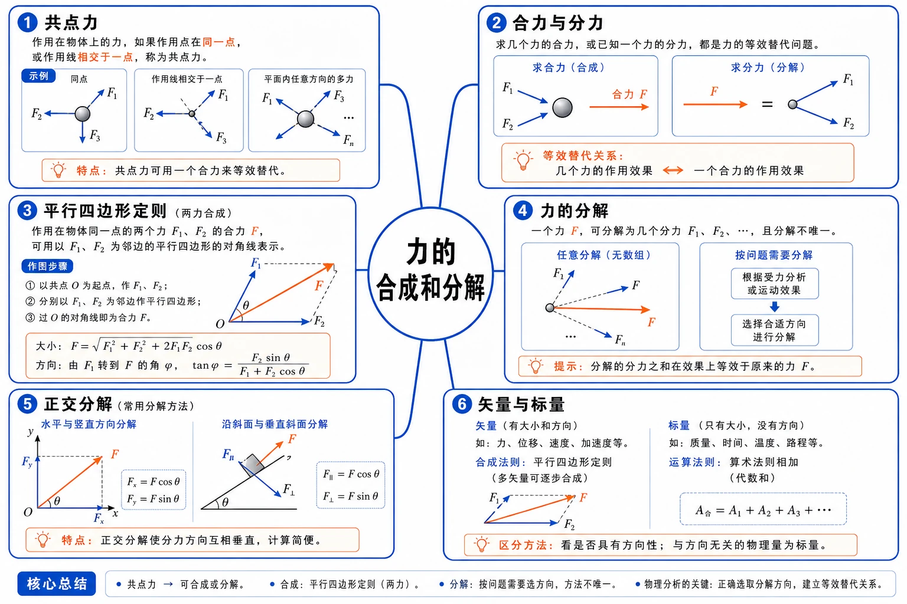
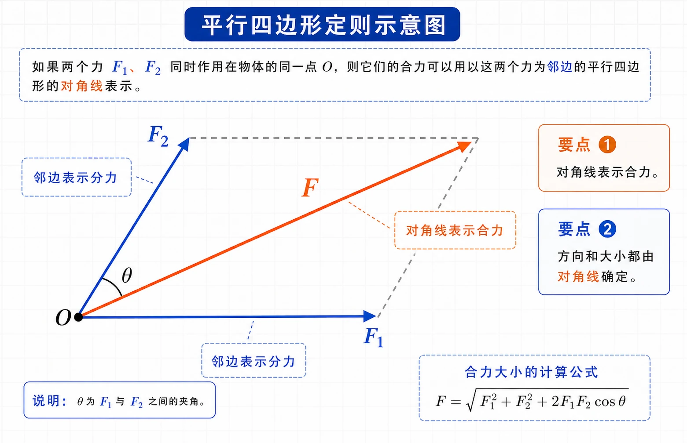
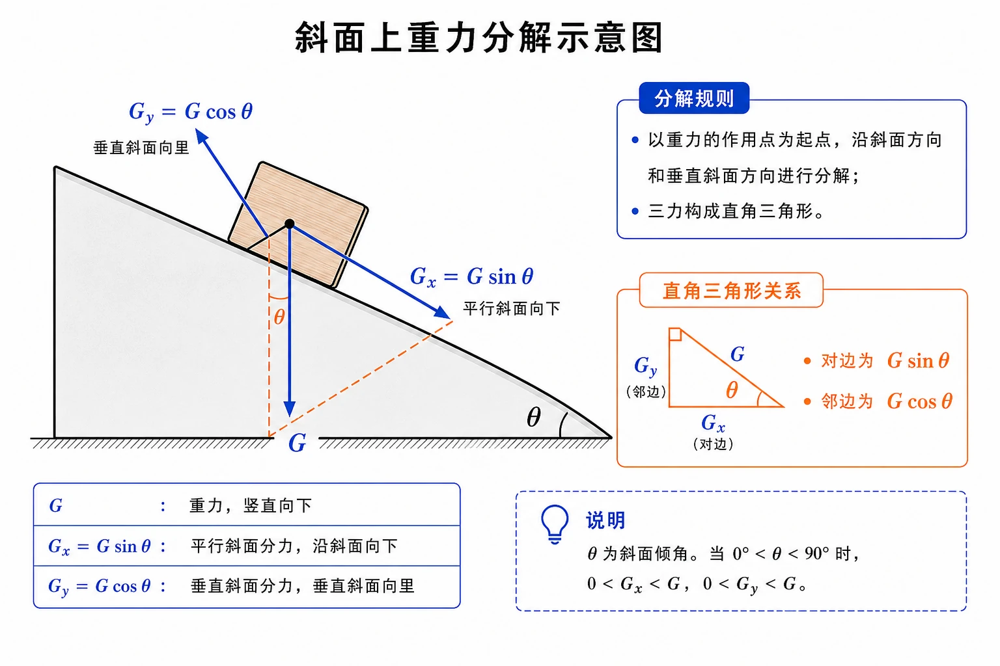
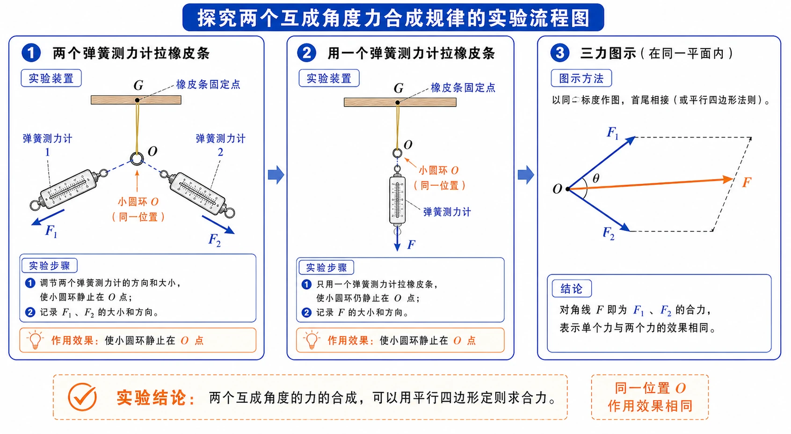
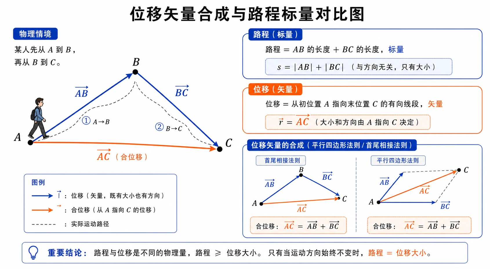

# 3.4 力的合成和分解

<!-- 图片描述：本节整体知识信息结构图。中心主题为“力的合成和分解”，向外分为六个分支：共点力（同点或作用线相交）、合力与分力（等效替代关系）、平行四边形定则（二力合成、作图法）、力的分解（同一力可有无数组分力、按问题需要分解）、正交分解（水平竖直方向、斜面方向）、矢量与标量（矢量按平行四边形定则合成，标量按算术法则相加）。白色或浅网格背景，黑灰坐标轴与物体轮廓，蓝色表示分力，橙色表示合力和关键对角线。 -->

## 本节学习目标

学完本节，需要能做到：

- 理解共点力的含义，知道本节主要研究共点力的合成与分解。
- 理解合力、分力、力的合成、力的分解的概念，知道它们体现的是等效替代关系。
- 掌握平行四边形定则，会用作图法求两个互成角度力的合力。
- 知道两个力的合力大小与两力夹角有关，会判断合力的最大值、最小值和可能范围。
- 理解力的分解遵从平行四边形定则，知道若没有限制，一个力可分解为无数组分力。
- 会根据实际问题把力沿指定方向分解，尤其是水平/竖直方向和斜面方向。
- 理解矢量和标量的区别，知道力、位移、速度、加速度是矢量。
- 避免在受力图中同时计入合力和分力造成重复计算。

## 核心知识点讲解

### 一、知识对象与物理情境

一个物体可能同时受到多个力。若直接分析多个力共同作用的效果，问题会变复杂。物理学常用“等效替代”的思想：用一个力代替几个力，或者用几个力代替一个力，只要作用效果相同，就可以简化问题。

例如两个小孩共同提一桶水，和一个大人单独提这桶水，如果水桶保持同样状态，那么一个大人的拉力就可以看作两个小孩拉力的合力。又如一盏吊灯用一根线悬挂和用两根线共同悬挂，两根线的拉力可以看作某个等效拉力的分力。

本节要解决的问题是：几个力怎样合成为一个力？一个力又怎样分解为几个力？为什么不能简单把互成角度的两个力大小直接相加？

### 二、核心概念与物理意义

#### 1. 共点力

几个力如果都作用在物体的同一点，或者它们的作用线相交于一点，这几个力叫作共点力。

高中阶段许多问题会把物体看作质点，此时作用在物体上的力通常可以看作共点力。本节主要研究共点力的合成和分解。

#### 2. 合力和分力

如果一个力单独作用的效果跟几个力共同作用的效果相同，这个力叫作那几个力的合力。

如果几个力共同作用的效果跟某一个力单独作用的效果相同，这几个力叫作那个力的分力。

关键提醒：合力和分力不是同时额外存在的一组新力，而是等效替代关系。在受力分析或计算中，如果已经用合力代替了几个分力，就不能再把这些分力重复计入。

#### 3. 力的合成和力的分解

求几个力的合力的过程叫力的合成；求一个力的分力的过程叫力的分解。

同一直线上的力可以按方向进行代数运算：

- 同向：大小相加，方向相同。
- 反向：大小相减，方向沿较大的力。

互成角度的力不能直接把大小相加，必须考虑方向关系。

### 三、关键规律、公式与适用条件

#### 1. 平行四边形定则

两个力合成时，以表示这两个力的有向线段为邻边作平行四边形，这两个邻边所夹的对角线就表示合力的大小和方向。这就是平行四边形定则。

<!-- 图片描述：平行四边形定则示意图。从同一点 O 画出两个蓝色分力箭头 $F_1$、$F_2$，以它们为邻边作浅灰平行四边形，从 O 指向对角点画橙色合力箭头 $F$。标注“邻边表示分力”“对角线表示合力”“方向和大小都由对角线确定”。白色网格背景，线条清晰。 -->

作图步骤：

1. 选定标度，例如 $1\ \text{cm}$ 表示 $10\ \text{N}$。
2. 从同一点按方向画出两个分力的有向线段。
3. 以这两个有向线段为邻边作平行四边形。
4. 从共同起点画出对角线。
5. 用标度读出合力大小，用量角器读出合力方向。

#### 2. 合力大小范围

两个力大小分别为 $F_1$、$F_2$，合力大小 $F$ 满足：

$$
|F_1-F_2|\le F\le F_1+F_2
$$

特殊情况：

| 两力夹角 | 合力大小 |
| --- | --- |
| $0^\circ$，同向 | $F=F_1+F_2$，最大 |
| $180^\circ$，反向 | $F=|F_1-F_2|$，最小 |
| $90^\circ$，垂直 | $F=\sqrt{F_1^2+F_2^2}$ |

当两个力大小不变时，夹角越小，合力越大；夹角越大，合力越小。

#### 3. 力的分解也遵从平行四边形定则

若把一个力作为平行四边形的对角线，那么平行四边形的两条邻边就可以表示它的一组分力。

如果没有限制，对于同一条对角线，可以作出无数个不同的平行四边形，所以同一个力可以分解为无数组大小、方向不同的分力。

实际分解要根据问题需要确定方向，例如：

- 沿运动方向和垂直运动方向分解。
- 沿接触面和垂直接触面分解。
- 沿水平和竖直方向分解。
- 沿题目指定的两个坐标轴方向分解。

#### 4. 正交分解公式

若一个力 $F$ 与 $x$ 轴正方向夹角为 $\theta$，把它分解到互相垂直的 $x$、$y$ 方向上，则：

$$
F_x=F\cos\theta
$$

$$
F_y=F\sin\theta
$$

如果题目给的是力与 $y$ 轴的夹角，正弦和余弦的位置会互换。判断方法是：靠近角的一边用余弦，对着角的一边用正弦。

#### 5. 斜面上重力分解

物体在倾角为 $\theta$ 的斜面上时，常把重力 $G$ 分解为：

$$
G_x=G\sin\theta
$$

$$
G_y=G\cos\theta
$$

其中 $G_x$ 沿斜面向下，$G_y$ 垂直斜面向下压斜面。

<!-- 图片描述：斜面上重力分解示意图。画倾角为 $\theta$ 的斜面和斜面上的木块，重力 $G$ 竖直向下。以木块为起点，沿斜面向下画蓝色分力 $G_x=G\sin\theta$，垂直斜面向内画蓝色分力 $G_y=G\cos\theta$，用橙色直角三角形标出重力与垂直斜面方向的夹角为 $\theta$，强调“对边为 $G\sin\theta$，邻边为 $G\cos\theta$”。 -->

### 四、典型模型与过程分析

#### 1. 探究二力合成规律的实验

实验核心是“等效作用效果”。让橡皮条一端固定，另一端连小圆环。先用两个弹簧测力计共同拉小圆环，使橡皮条伸长到某一位置；再用一个弹簧测力计单独拉小圆环，也使它到同一位置。

若两次橡皮条伸长相同，说明橡皮条对小圆环的作用效果相同。一个拉力 $F$ 与两个拉力 $F_1$、$F_2$ 对小圆环的作用效果相同，$F$ 就是 $F_1$、$F_2$ 的合力。

实验后按同一标度画出 $F_1$、$F_2$、$F$，可以发现 $F$ 与以 $F_1$、$F_2$ 为邻边作出的平行四边形对角线基本重合。

<!-- 图片描述：探究两个互成角度力合成规律的实验流程图。左侧画橡皮条固定点 G、小圆环 O，两只弹簧测力计分别沿不同方向拉小圆环，标出 $F_1$、$F_2$；中间画改用一个弹簧测力计拉小圆环仍到 O 点，标出 $F$；右侧画三力图示，$F_1$、$F_2$ 为蓝色邻边，$F$ 为橙色对角线。强调“同一位置 O 表示作用效果相同”。 -->

#### 2. 作图法求合力

作图法适合初学阶段，步骤是：选标度、画分力、作平行四边形、量对角线长度、换算合力大小、量角度确定方向。

例如水平向右 $32\ \text{N}$ 与竖直向上 $44\ \text{N}$ 合成，若用 $1.0\ \text{cm}$ 表示 $10\ \text{N}$，则两分力线段长分别为 $3.2\ \text{cm}$ 和 $4.4\ \text{cm}$。作平行四边形后，对角线约 $5.4\ \text{cm}$，合力约 $54\ \text{N}$，方向斜向右上。

#### 3. 正交分解模型

在复杂问题中，常把力沿两个互相垂直的坐标轴分解。这样做的好处是：不同方向上的作用可以分别分析，尤其适合后面学习平衡和牛顿第二定律。

常见坐标轴选择：

- 水平、竖直方向。
- 沿斜面、垂直斜面方向。
- 沿运动方向、垂直运动方向。

### 五、图像、实验与数据理解

#### 1. 合力随夹角变化的理解

两个力大小不变时，夹角越小，两个力“配合”越充分，合力越大；夹角越大，两个力相互抵消的成分越多，合力越小。

这可以用平行四边形对角线长度直观理解：邻边长度不变，夹角从 $0^\circ$ 增大到 $180^\circ$，对角线逐渐变短。

#### 2. 矢量和标量

既有大小又有方向，相加时遵从平行四边形定则的物理量叫矢量。只有大小、没有方向，相加时遵从算术法则的物理量叫标量。

| 矢量 | 标量 |
| --- | --- |
| 力 | 质量 |
| 位移 | 路程 |
| 速度 | 时间 |
| 加速度 | 功、温度 |

位移和路程的区别很典型：人从 $A$ 到 $B$，再从 $B$ 到 $C$，总路程是两段路径长度相加；合位移是从初位置 $A$ 指向末位置 $C$ 的有向线段，遵从矢量合成规则。

<!-- 图片描述：位移矢量合成与路程标量对比图。画点 A、B、C，一个人先从 A 到 B，再从 B 到 C。蓝色箭头 $\vec{AB}$ 和 $\vec{BC}$ 表示两段位移，橙色箭头 $\vec{AC}$ 表示合位移，并用平行四边形或首尾相接法说明矢量合成。旁边用文字框写“路程 = AB 长度 + BC 长度，标量；位移 = 从 A 指向 C 的有向线段，矢量”。 -->

### 六、题型应用与迁移

本节题型可按“合成、分解、辨析”三类处理：

| 题型 | 方法 |
| --- | --- |
| 判断合力可能值 | 用 $|F_1-F_2|\le F\le F_1+F_2$ |
| 垂直二力合成 | 用 $F=\sqrt{F_1^2+F_2^2}$ |
| 作图法求合力 | 选标度，作平行四边形，量对角线 |
| 沿坐标轴分解 | 看夹角，邻边用余弦，对边用正弦 |
| 斜面重力分解 | 沿斜面 $G\sin\theta$，垂直斜面 $G\cos\theta$ |
| 矢量标量辨析 | 看是否有方向、合成是否遵从平行四边形定则 |

## 重点梳理

### 重点 1：合力和分力是等效替代

合力不是在原有几个力之外额外多出来的力，分力也不是和原力同时重复存在的力。它们是在效果相同的前提下进行替代。

受力图中不能既画一个力，又画它的两个分力参与同一计算，否则会重复计算。

### 重点 2：平行四边形定则

互成角度的两个力合成时，必须按平行四边形定则求合力。对角线同时给出合力大小和方向。

它不仅适用于力，也适用于位移、速度、加速度等矢量的合成。

### 重点 3：合力范围

$$
|F_1-F_2|\le F\le F_1+F_2
$$

判断某个合力是否可能时，先求最大值和最小值。若给定值落在范围内，就可能；否则不可能。

### 重点 4：力的分解要服务问题

同一个力可分解为无数组分力，所以不能随意分解。常见分解方向是题目需要分析的方向：斜面方向、垂直斜面方向、水平竖直方向、运动方向等。

## 难点突破

### 难点 1：合力一定大于分力吗

不一定。合力大小取决于两个分力的夹角。

例如 $10\ \text{N}$ 和 $8\ \text{N}$ 同向时，合力为 $18\ \text{N}$；反向时，合力为 $2\ \text{N}$。所以合力可能大于分力，也可能小于某个分力。

### 难点 2：为什么一个力可以分解为无数组分力

把一个力看成平行四边形的对角线，只要不限制两条邻边方向，就可以作出无数个不同的平行四边形。因此一个力可分解为无数组不同的分力。

所以分解力时，必须问：为了研究哪个方向的效果？要沿哪些方向建立坐标轴？

### 难点 3：斜面分解中为什么是 $G\sin\theta$ 和 $G\cos\theta$

斜面倾角为 $\theta$ 时，重力与垂直斜面方向的夹角也是 $\theta$。在重力分解形成的直角三角形中，沿斜面方向分力是这个角的对边，所以为 $G\sin\theta$；垂直斜面方向分力是邻边，所以为 $G\cos\theta$。

### 难点 4：力的分解和实际受力有什么区别

分力是人为引入的等效量，用来分析某个力在不同方向上的作用效果。物体实际受到的是原来的力，不是又额外受到分力。

例如斜面上的物体实际受到重力 $G$，我们把它分解为 $G\sin\theta$ 和 $G\cos\theta$，只是为了分别研究沿斜面和垂直斜面的作用效果。

### 难点 5：矢量相加为什么不能只加大小

矢量有方向。两个同样大小的位移，方向不同，合位移不同；两个同样大小的力，夹角不同，合力不同。只有标量才按普通算术规则相加。

## 例题讲解

### 例题 1：作图法求合力

**题目**：某物体受到一个 $32\ \text{N}$ 的力，方向水平向右，还受到一个 $44\ \text{N}$ 的力，方向竖直向上。用作图法求合力大小和方向。

**分析**：两个力互相垂直，也可用计算法；题目要求作图法，就按标度作平行四边形。

**步骤**：选 $1.0\ \text{cm}$ 表示 $10\ \text{N}$。

- 水平向右力画 $3.2\ \text{cm}$。
- 竖直向上力画 $4.4\ \text{cm}$。
- 以两力为邻边作平行四边形。
- 对角线表示合力。

测得对角线约为 $5.4\ \text{cm}$，则：

$$
F\approx5.4\times10=54\ \text{N}
$$

方向斜向右上，与水平向右力约成 $54^\circ$。

**答案**：合力约为 $54\ \text{N}$，方向斜向右上，与水平向右力约成 $54^\circ$。

**反思**：作图法结果受作图精度影响，计算法可得到更精确数值。

### 例题 2：判断合力可能值

**题目**：两个力大小分别为 $10\ \text{N}$ 和 $2\ \text{N}$，它们的合力可能等于 $5\ \text{N}$、$10\ \text{N}$、$15\ \text{N}$ 吗？合力最大值和最小值是多少？

**分析**：先求合力范围。

**步骤**：

$$
F_{\max}=10+2=12\ \text{N}
$$

$$
F_{\min}=|10-2|=8\ \text{N}
$$

所以：

$$
8\ \text{N}\le F\le12\ \text{N}
$$

**答案**：$5\ \text{N}$ 不可能，$10\ \text{N}$ 可能，$15\ \text{N}$ 不可能。合力最大值为 $12\ \text{N}$，最小值为 $8\ \text{N}$。

### 例题 3：斜向拉力沿斜面分解

**题目**：倾角为 $15^\circ$ 的斜面上放着木箱，用 $100\ \text{N}$ 的拉力斜向上拉木箱，拉力与水平方向成 $45^\circ$。若沿平行斜面和垂直斜面方向建立坐标轴，求拉力在两个方向上的分力表达式。

**分析**：斜面与水平成 $15^\circ$，拉力与水平成 $45^\circ$，所以拉力与斜面方向夹角为：

$$
45^\circ-15^\circ=30^\circ
$$

**步骤**：沿斜面方向是邻边，垂直斜面方向是对边。

$$
F_x=100\cos30^\circ\approx86.6\ \text{N}
$$

$$
F_y=100\sin30^\circ=50\ \text{N}
$$

**答案**：沿斜面向上的分力约为 $86.6\ \text{N}$，垂直斜面向外的分力为 $50\ \text{N}$。

**反思**：先找拉力与所选坐标轴的夹角，再判断正弦余弦。

### 例题 4：斜面上重力分解

**题目**：物体重力为 $G$，放在倾角为 $\theta$ 的斜面上。把重力沿平行斜面和垂直斜面方向分解，求两个分力大小和方向。

**分析**：斜面问题通常选沿斜面和垂直斜面为坐标轴。

**答案**：

沿斜面方向：

$$
G_x=G\sin\theta
$$

方向沿斜面向下。

垂直斜面方向：

$$
G_y=G\cos\theta
$$

方向垂直斜面向内。

**反思**：$G\sin\theta$ 是使物体沿斜面下滑趋势的分力，$G\cos\theta$ 与支持力大小关系密切。

### 例题 5：一个力分解为水平分力和另一个分力

**题目**：一个竖直向下的 $180\ \text{N}$ 的力分解为两个分力，其中一个分力水平向右，大小为 $240\ \text{N}$。求另一个分力的大小和方向。

**分析**：两个分力的合力竖直向下。已知一个分力水平向右，那么另一个分力必须有水平向左的分量抵消 $240\ \text{N}$，并有竖直向下的分量形成 $180\ \text{N}$。

**步骤**：另一个分力的大小为：

$$
F=\sqrt{240^2+180^2}=300\ \text{N}
$$

方向：斜向左下，与水平方向夹角满足：

$$
\tan\alpha=\frac{180}{240}=\frac{3}{4}
$$

所以 $\alpha\approx36.9^\circ$，即该力斜向左下，与水平向左方向约成 $36.9^\circ$。

**答案**：另一个分力大小为 $300\ \text{N}$，方向斜向左下。

**反思**：不要只用勾股定理求大小，还要判断方向，否则两个分力不能合成为竖直向下的力。

## 易错点整理

### 易错点 1：把合力和分力同时计入

**常见错误表现**：受力图中既画重力 $G$，又画 $G\sin\theta$ 和 $G\cos\theta$，还一起参与计算。

**错因分析**：没有理解合力与分力是等效替代关系。

**正确处理**：要么用原力，要么用分力替代原力，不能重复计入。

### 易错点 2：认为合力一定比分力大

**常见错误表现**：看到“合力”就认为一定最大。

**错因分析**：忽略了力的方向。

**正确处理**：用 $|F_1-F_2|\le F\le F_1+F_2$ 判断。合力可能小于某个分力。

### 易错点 3：斜面分解正弦余弦写反

**常见错误表现**：把沿斜面方向写成 $G\cos\theta$。

**错因分析**：没有画出重力分解三角形，或把角找错。

**正确处理**：画图确认角 $\theta$，沿斜面分力是对边，写 $G\sin\theta$；垂直斜面分力是邻边，写 $G\cos\theta$。

### 易错点 4：力的分解方向随意

**常见错误表现**：没有根据题目需求，任意把力分成两部分。

**错因分析**：误以为只要分解就能解题。

**正确处理**：分解方向要服务分析目标，常沿坐标轴、运动方向、接触面方向或垂直接触面方向。

### 易错点 5：矢量和标量混淆

**常见错误表现**：把位移大小当路程相加，或把两个力大小直接相加。

**错因分析**：没有区分是否有方向。

**正确处理**：矢量合成考虑方向并遵从平行四边形定则；标量按算术法则相加。

## 考点考证点整理

### 考点一：合力与分力概念

- 出题思路：判断合力、分力是否为真实额外受力，或解释等效替代。
- 关键条件：作用效果相同。
- 解答要点：合力和分力是替代关系，不可重复计入。
- 易扣分点：受力图中同时画原力和分力。

### 考点二：平行四边形定则

- 出题思路：用作图法求两个互成角度力的合力大小和方向。
- 关键条件：标度、方向、共同起点、对角线。
- 解答要点：按标度画分力，以分力为邻边作平行四边形，对角线表示合力。
- 易扣分点：没有标度；把两力首尾相接却读错合力方向；角度测量不清。

### 考点三：合力范围与夹角关系

- 出题思路：判断某合力是否可能，求最大值和最小值，判断夹角变化时合力变化。
- 关键条件：两力大小是否固定，夹角如何变化。
- 解答要点：使用 $|F_1-F_2|\le F\le F_1+F_2$；夹角越小合力越大。
- 易扣分点：认为合力总大于分力；忽略最小值不是 $0$ 的情况。

### 考点四：力的正交分解

- 出题思路：把斜向力分解到水平/竖直或沿斜面/垂直斜面方向。
- 关键条件：力与坐标轴的夹角。
- 解答要点：画直角三角形，邻边用余弦，对边用正弦。
- 易扣分点：正弦余弦写反；没有判断分力方向。

### 考点五：矢量与标量

- 出题思路：判断物理量类型，比较位移和路程、力和质量等。
- 关键条件：是否有方向；相加遵从何种规则。
- 解答要点：矢量有大小和方向，按平行四边形定则合成；标量只有大小，按算术法则相加。
- 易扣分点：把速度、加速度当成标量；把路程当成位移。

## 练习题

### 基础训练

1. 什么是合力？什么是分力？
2. 什么是力的合成？什么是力的分解？
3. 两个力大小为 $6\ \text{N}$ 和 $8\ \text{N}$，合力最大值和最小值分别是多少？
4. 力、速度、质量、路程中哪些是矢量？哪些是标量？
5. 同一个力能否分解为多组不同分力？为什么实际解题中不能随意分解？

### 巩固训练

6. 两个互相垂直的力分别为 $5\ \text{N}$ 和 $12\ \text{N}$，求合力大小。
7. 两个大小均为 $10\ \text{N}$ 的力，夹角从 $0^\circ$ 增大到 $180^\circ$，合力怎样变化？最大值和最小值分别是多少？
8. 一个 $80\ \text{N}$ 的力与水平方向成 $30^\circ$，求它的水平分力和竖直分力。
9. 重 $100\ \text{N}$ 的物体放在倾角 $30^\circ$ 的斜面上，求重力沿斜面方向和垂直斜面方向的分力。
10. 两个力的合力为 $0$，这两个力应满足什么条件？

### 提升训练

11. 两个力大小分别为 $10\ \text{N}$ 和 $2\ \text{N}$，它们的合力有可能等于 $5\ \text{N}$、$10\ \text{N}$、$15\ \text{N}$ 吗？说明理由。
12. 两个力大小分别为 $90\ \text{N}$ 和 $120\ \text{N}$，互相垂直，求合力大小。
13. 一个竖直向下的 $180\ \text{N}$ 的力分解为两个分力，一个分力水平向右且大小为 $240\ \text{N}$，求另一个分力大小和方向。
14. 倾角为 $15^\circ$ 的斜面上放着木箱，用 $100\ \text{N}$ 的拉力斜向上拉木箱，拉力与水平方向成 $45^\circ$。分别以平行斜面和垂直斜面方向为坐标轴，求拉力两个分力大小。
15. 判断下列说法是否正确，并说明理由：
    - 合力总比每个分力大。
    - 两力大小不变时，夹角越小，合力越大。
    - 若夹角不变，$F_1$ 大小不变，$F_2$ 增大，则合力一定增大。

## 练习题答案

### 基础训练答案

1. 一个力单独作用的效果与几个力共同作用的效果相同，这个力叫那几个力的合力。几个力共同作用的效果与一个力单独作用的效果相同，这几个力叫那个力的分力。

2. 求几个力的合力的过程叫力的合成；求一个力的分力的过程叫力的分解。

3. 合力最大值：

$$
F_{\max}=6+8=14\ \text{N}
$$

合力最小值：

$$
F_{\min}=|8-6|=2\ \text{N}
$$

4. 力和速度是矢量；质量和路程是标量。

5. 能。因为以一个力为对角线可以作出无数个平行四边形，对应无数组分力。实际解题中分解方向必须服务问题需要，如沿坐标轴、斜面方向或垂直接触面方向。

### 巩固训练答案

6. 两力垂直：

$$
F=\sqrt{5^2+12^2}=13\ \text{N}
$$

7. 两力大小不变，夹角从 $0^\circ$ 增大到 $180^\circ$，合力逐渐减小。最大值为：

$$
F_{\max}=10+10=20\ \text{N}
$$

最小值为：

$$
F_{\min}=|10-10|=0
$$

8. 以水平向右和竖直向上为正方向：

$$
F_x=80\cos30^\circ\approx69.3\ \text{N}
$$

$$
F_y=80\sin30^\circ=40\ \text{N}
$$

9. 沿斜面方向：

$$
G_x=G\sin30^\circ=100\times0.5=50\ \text{N}
$$

方向沿斜面向下。

垂直斜面方向：

$$
G_y=G\cos30^\circ\approx100\times0.866=86.6\ \text{N}
$$

方向垂直斜面向内。

10. 两个力大小相等、方向相反、作用在同一直线上。

### 提升训练答案

11. 两力合力范围为：

$$
|10-2|\le F\le10+2
$$

即：

$$
8\ \text{N}\le F\le12\ \text{N}
$$

所以 $5\ \text{N}$ 不可能，$10\ \text{N}$ 可能，$15\ \text{N}$ 不可能。

12. 两力互相垂直：

$$
F=\sqrt{90^2+120^2}=150\ \text{N}
$$

13. 另一个分力必须有水平向左的 $240\ \text{N}$ 分量和竖直向下的 $180\ \text{N}$ 分量，所以大小为：

$$
F=\sqrt{240^2+180^2}=300\ \text{N}
$$

方向斜向左下，与水平向左方向的夹角满足：

$$
\tan\alpha=\frac{180}{240}=\frac{3}{4}
$$

所以 $\alpha\approx36.9^\circ$。

14. 拉力与斜面方向夹角为：

$$
45^\circ-15^\circ=30^\circ
$$

沿斜面方向分力：

$$
F_x=100\cos30^\circ\approx86.6\ \text{N}
$$

垂直斜面方向分力：

$$
F_y=100\sin30^\circ=50\ \text{N}
$$

15. （1）错误。合力不一定大于每个分力，例如两个力反向时合力可能很小。

（2）正确。两个力大小不变时，夹角越小，平行四边形对角线越长，合力越大。

（3）不一定正确。若 $F_2$ 的方向与合力方向关系特殊，增大 $F_2$ 不一定使合力增大；例如当两个力反向且 $F_2$ 原本较小，增大 $F_2$ 会先使合力减小到 $0$，再增大。
