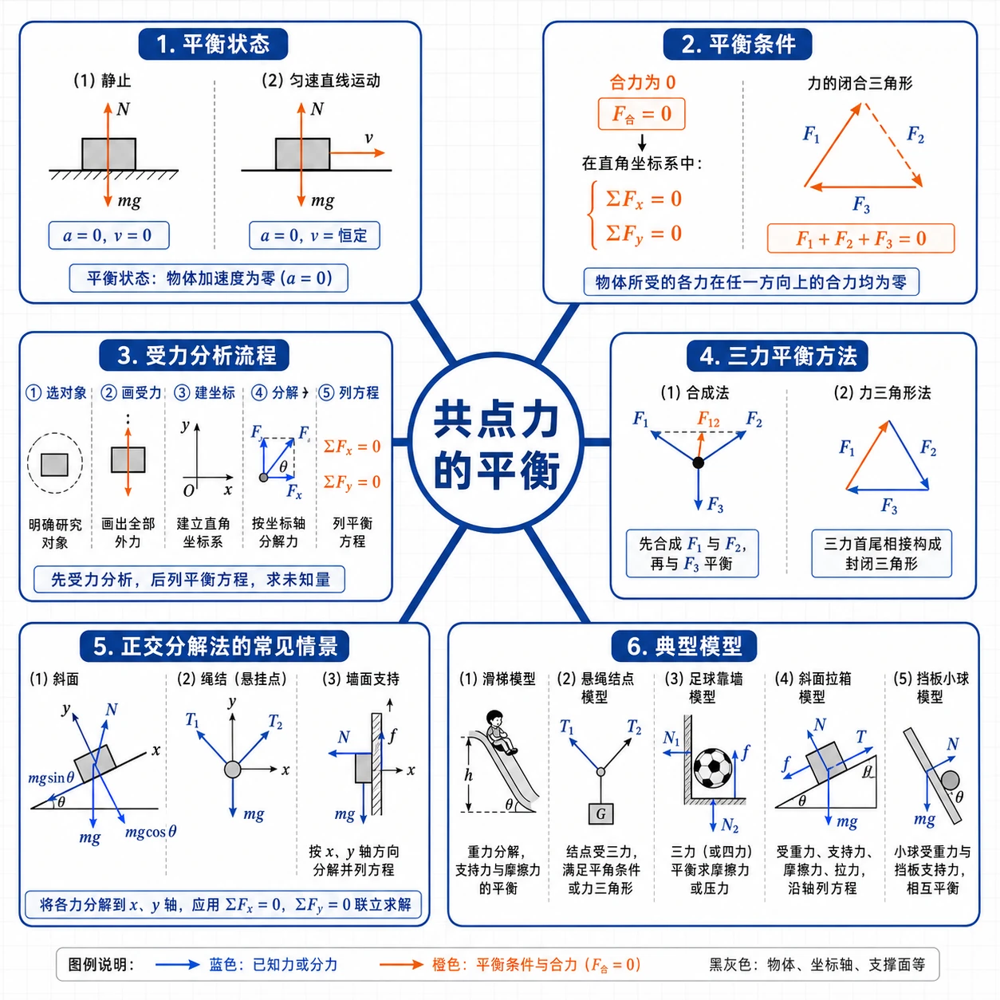
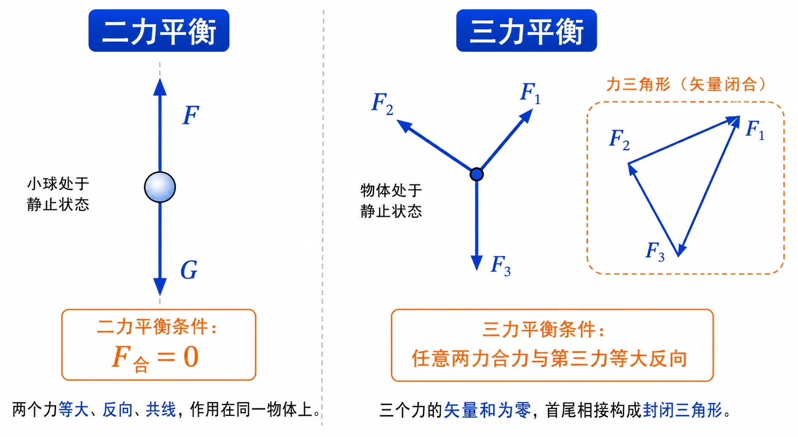
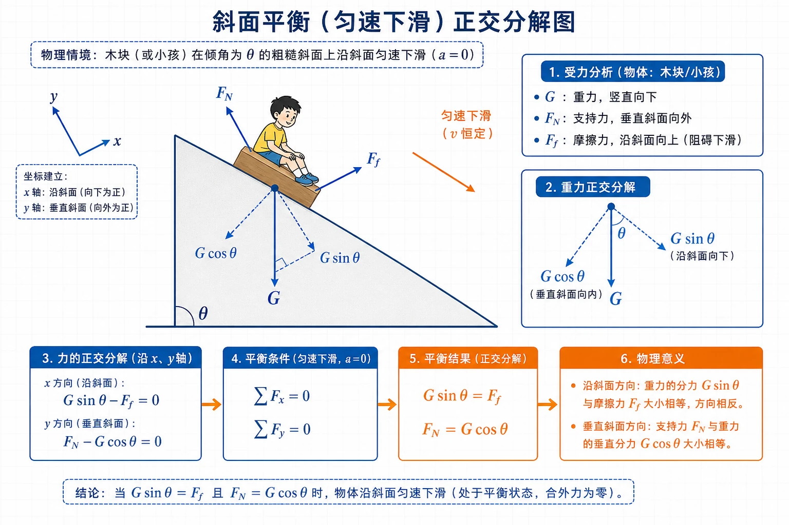
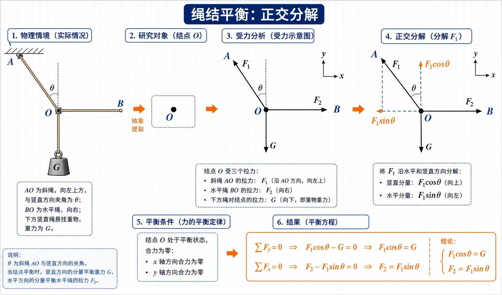

## 相关知识

[[3.1 重力与弹力]]
[[3.2 摩擦力]]
[[3.3 牛顿第三定律]]
[[3.4 力的合成和分解]]

# 3.5 共点力的平衡

<!-- 图片描述：本节整体知识信息结构图。中心主题为“共点力的平衡”，向外分为六个分支：平衡状态（静止、匀速直线运动）、平衡条件（合力为 0、$\sum F_x=0$、$\sum F_y=0$）、受力分析流程（选对象、画受力、建坐标、分解、列方程）、三力平衡方法（合成法、力三角形）、正交分解法（斜面、绳结、墙面支持）、典型模型（滑梯、悬绳结点、足球靠墙、斜面拉箱、挡板小球）。白色或浅网格背景，黑灰物体和坐标轴，蓝色表示已知力和分力，橙色表示平衡条件和合力为零的闭合三角形。 -->

## 本节学习目标

学完本节，需要能做到：

- 理解平衡状态的含义：物体保持静止或匀速直线运动。
- 掌握共点力平衡条件：合力为 $0$。
- 会把平衡条件写成正交形式 $\sum F_x=0$、$\sum F_y=0$。
- 能判断物体是否处于平衡状态，区分“瞬时速度为 $0$”和“保持静止”。
- 会用力的合成观点分析三力平衡问题。
- 会用正交分解法解决斜面、绳结、墙面支持、拉力与摩擦等平衡问题。
- 能正确选择研究对象，画出受力示意图，并建立合适坐标系。
- 形成“选对象 → 画受力 → 建坐标 → 分解力 → 列方程 → 检查结果”的解题流程。

## 核心知识点讲解

### 一、知识对象与物理情境

前面已经学习了重力、弹力、摩擦力以及力的合成与分解。本节要解决的问题是：当一个物体同时受到几个共点力作用时，怎样判断它能否保持静止或匀速直线运动？

生活中的桌上书、屋顶吊灯、匀速传送带上的货物、沿直线公路匀速行驶的汽车，都处于平衡状态。它们可能受到多个力，但这些力共同作用的效果相互抵消，合力为 $0$。

本节是第三章的综合应用：用受力分析找力，用力的分解处理方向，用平衡条件列方程。

### 二、核心概念与物理意义

#### 1. 平衡状态

物体保持静止或匀速直线运动状态，就说物体处于平衡状态。

平衡状态包括：

| 状态 | 特点 |
| --- | --- |
| 静止 | 位置不随时间改变 |
| 匀速直线运动 | 速度大小和方向都不变 |

注意：某一瞬间速度为 $0$，不一定是平衡状态。例如竖直上抛物体到最高点时速度瞬时为 $0$，但仍受重力作用，合力不为 $0$，不是平衡状态。

#### 2. 共点力平衡条件

物体受几个共点力作用而处于平衡状态时，这几个力的合力为 $0$。反过来，如果共点力的合力为 $0$，物体就能保持平衡状态。

共点力平衡条件：

$$
F_{\text{合}}=0
$$

若建立互相垂直的 $x$、$y$ 坐标轴，则等价于：

$$
\sum F_x=0
$$

$$
\sum F_y=0
$$

这表示任意两个互相垂直方向上的合力都为 $0$。

#### 3. 二力平衡与三力平衡

若物体只受两个力作用而平衡，这两个力必定大小相等、方向相反、作用在同一直线上，并且作用在同一物体上。

若物体受三个共点力作用而平衡，则任意两个力的合力一定与第三个力大小相等、方向相反、作用在同一直线上。也可以说，三个力的矢量首尾相接能组成一个闭合三角形。

<!-- 图片描述：二力平衡与三力平衡对比图。左侧为二力平衡：一个小球受到向上拉力 $F$ 和向下重力 $G$，两箭头等长反向共线，标注 $F_{合}=0$。右侧为三力平衡：三个力 $F_1$、$F_2$、$F_3$ 作用于同一点，旁边画力三角形，三个矢量首尾相接闭合，标注“任意两力合力与第三力等大反向”。白色背景，蓝色表示力，橙色表示闭合条件。 -->

### 三、关键规律、公式与适用条件

#### 1. 共点力平衡条件的正交形式

如果物体所受力都在同一平面内，选择两个互相垂直的方向作为坐标轴。把每个力分解到两个方向后，分别列方程：

$$
\sum F_x=0
$$

$$
\sum F_y=0
$$

这是解决平面共点力平衡问题最常用的方法。

#### 2. 受力分析步骤

解决平衡问题的标准流程：

1. 选研究对象：一个物体、一个结点、一个小球或一个整体。
2. 画受力图：只画研究对象受到的力。
3. 建坐标轴：让尽量多的力落在坐标轴上。
4. 分解力：把不在坐标轴方向上的力分解。
5. 列平衡方程：$\sum F_x=0$、$\sum F_y=0$。
6. 解方程并检查：单位、方向、大小是否合理。

#### 3. 常见坐标系选择

| 情境 | 推荐坐标轴 |
| --- | --- |
| 水平面问题 | 水平、竖直方向 |
| 斜面问题 | 沿斜面、垂直斜面方向 |
| 绳结问题 | 水平、竖直方向，或沿已知力方向 |
| 墙面支持问题 | 水平、竖直方向 |
| 圆球被斜面和挡板夹住 | 沿各接触面法线方向或水平竖直方向 |

原则：让未知力尽量少被分解，让方程尽量简单。

### 四、典型模型与过程分析

#### 1. 斜面平衡模型

物体在斜面上平衡时，常沿斜面和垂直斜面建立坐标轴。重力分解为：

$$
G_x=G\sin\theta
$$

$$
G_y=G\cos\theta
$$

如果物体沿斜面匀速下滑，则沿斜面方向有：

$$
G\sin\theta=F_f
$$

垂直斜面方向有：

$$
F_N=G\cos\theta
$$

若滑动摩擦力 $F_f=\mu F_N$，则：

$$
G\sin\theta=\mu G\cos\theta
$$

也就是：

$$
\tan\theta=\mu
$$

这个关系可用于滑梯、斜面匀速下滑等问题。

<!-- 图片描述：斜面平衡正交分解图。画倾角为 $\theta$ 的斜面和沿斜面匀速下滑的小孩或木块，重力 $G$ 竖直向下，支持力 $F_N$ 垂直斜面向外，摩擦力 $F_f$ 沿斜面向上。将重力分解为沿斜面向下的 $G\sin\theta$ 和垂直斜面向内的 $G\cos\theta$，旁边列出 $G\sin\theta=F_f$、$F_N=G\cos\theta$。 -->

#### 2. 绳结平衡模型

多根绳连接于一点时，常选绳结或轻环为研究对象。每根绳对结点的拉力都沿绳并指向远离结点的方向。

例如悬吊重物的斜绳 $AO$ 与竖直方向成 $\theta$，水平绳 $BO$ 拉住结点 $O$，下方悬绳对结点向下拉力大小为 $G$。结点静止，受三个力平衡：斜绳拉力 $F_1$、水平绳拉力 $F_2$、下方绳拉力 $G$。

取水平向右为 $x$ 轴正方向，竖直向上为 $y$ 轴正方向：

$$
F_1\cos\theta=G
$$

$$
F_2=F_1\sin\theta
$$

解得：

$$
F_1=\frac{G}{\cos\theta}
$$

$$
F_2=G\tan\theta
$$

<!-- 图片描述：绳结平衡正交分解图。画结点 O，斜绳 AO 向左上方，与竖直方向夹角 $\theta$，水平绳 BO 向右，下方竖直绳向下悬挂重物。结点 O 受斜绳拉力 $F_1$、水平绳拉力 $F_2$、向下拉力 $G$。将 $F_1$ 分解为竖直向上的 $F_1\cos\theta$ 和水平向左的 $F_1\sin\theta$，列出 $F_1\cos\theta=G$、$F_2=F_1\sin\theta$。 -->

#### 3. 墙面和挡板支持模型

足球靠在光滑墙壁上、铅球被斜面和竖直挡板夹住等问题，关键是找接触力方向：光滑接触面只提供垂直接触面的支持力，不提供摩擦力。

分析步骤：

- 选球为研究对象。
- 画重力。
- 每个光滑接触面画一个垂直接触面的支持力。
- 若有绳，画沿绳方向的拉力。
- 用平衡条件列方程。

### 五、图像、实验与数据理解

#### 1. 为什么多力平衡可以看作合力为零

多个共点力可以逐步合成：先合成两个力，再把合力与第三个力合成，直到得到总合力。如果总合力为 $0$，这些力的共同作用效果相当于没有力改变物体运动状态，物体保持平衡。

#### 2. 撤去一个力后的合力

若物体在五个共点力作用下保持平衡，则五个力的合力为 $0$。如果撤去其中一个力 $F_1$，其余四个力的合力一定与原来的 $F_1$ 大小相等、方向相反。

这个结论常用于快速画出“剩余几个力的合力”。

#### 3. 三力平衡的图形方法

三个共点力平衡时，可以把三个力的矢量首尾相接画成闭合三角形。已知三个力方向时，可用几何关系求大小；已知一个力和角度时，也可结合正弦、余弦、正切求未知力。

### 六、题型应用与迁移

本节题型可以按模型分类：

| 题型 | 研究对象 | 常用方法 |
| --- | --- | --- |
| 水平面静止/匀速 | 物体 | 水平、竖直方向平衡 |
| 斜面匀速上滑/下滑 | 物体 | 沿斜面、垂直斜面建轴 |
| 滑梯设计 | 人或物体 | 斜面平衡与摩擦公式 |
| 绳结问题 | 结点或轻环 | 三力平衡或正交分解 |
| 足球靠墙 | 足球 | 重力、墙支持、绳拉力平衡 |
| 挡板小球 | 小球 | 光滑接触面支持力方向判断 |

## 重点梳理

### 重点 1：平衡状态不等于速度为零

平衡状态是保持静止或匀速直线运动，强调运动状态不变。瞬时速度为 $0$ 但合力不为 $0$，不是平衡状态。

### 重点 2：共点力平衡条件

$$
F_{\text{合}}=0
$$

正交形式：

$$
\sum F_x=0,\qquad \sum F_y=0
$$

这是本节最核心的解题依据。

### 重点 3：受力分析是列方程前提

公式不会自动告诉你有哪些力。必须先选研究对象，再画受力图。受力图错，后面方程一定错。

### 重点 4：正交分解法流程

$$
\text{选对象}\rightarrow\text{画受力}\rightarrow\text{建坐标}\rightarrow\text{分解力}\rightarrow\text{列方程}\rightarrow\text{求解检查}
$$

这套流程是后续力学题的基本模板。

## 难点突破

### 难点 1：为什么竖直上抛最高点不是平衡

最高点速度瞬时为 $0$，但物体仍受重力，合力不为 $0$，接下来会向下加速运动。平衡要求运动状态保持不变，不是某一刻速度恰好为 $0$。

### 难点 2：三力平衡能不能直接套二力平衡

不能。物体受到三个力时，任意两个力一般不平衡。正确关系是：任意两个力的合力与第三个力平衡。

### 难点 3：坐标轴方向如何选择

选坐标轴不是固定规则，而是为了让计算简单。斜面问题常沿斜面和垂直斜面建轴，因为摩擦力、支持力都在这两个方向上；绳结问题常选水平、竖直方向，因为重力通常竖直，水平绳拉力通常水平。

### 难点 4：正交分解方程中符号如何处理

先规定正方向。沿正方向的分力取正，沿负方向的分力取负。也可以把同一方向两边的力分别列在等式两边，例如“向右的力 = 向左的力”。关键是方向不能混乱。

### 难点 5：绳结题为什么选结点为研究对象

绳结通常质量很小，可看作受多个拉力作用且处于平衡。选结点为研究对象，可以把多根绳的拉力集中到同一点，形成典型共点力平衡问题。若选整个重物系统，反而不容易直接求各绳拉力。

## 例题讲解

### 例题 1：滑梯高度设计

**题目**：某滑梯水平跨度为 $6\ \text{m}$。儿童与滑板间动摩擦因数取 $0.40$。若儿童能够沿滑板匀速下滑，求滑梯至少多高。

**读题**：把儿童看作斜面上的物体，沿斜面匀速下滑，是平衡状态。

**选对象与过程**：研究对象是儿童。受力：重力 $G$、支持力 $F_N$、滑动摩擦力 $F_f$。

**建模型**：沿斜面和垂直斜面建坐标。设斜面倾角为 $\theta$，高度为 $h$，水平跨度为 $b=6\ \text{m}$。

沿斜面方向平衡：

$$
G\sin\theta=F_f
$$

垂直斜面方向平衡：

$$
F_N=G\cos\theta
$$

滑动摩擦力：

$$
F_f=\mu F_N
$$

联立得：

$$
G\sin\theta=\mu G\cos\theta
$$

$$
\tan\theta=\mu
$$

又因为：

$$
\tan\theta=\frac{h}{b}
$$

所以：

$$
\frac{h}{6}=0.40
$$

$$
h=2.4\ \text{m}
$$

**答案**：滑梯至少高 $2.4\ \text{m}$。

**反思**：本题关键是把“匀速下滑”转化为沿斜面方向合力为 $0$。

### 例题 2：绳结平衡

**题目**：悬吊重物的细绳在结点 $O$ 处被一根水平绳牵引，使斜绳 $AO$ 与竖直方向成 $\theta$ 角。若悬吊物重力为 $G$，求斜绳 $AO$ 和水平绳 $BO$ 的拉力大小。

**读题**：结点 $O$ 处有三根绳，适合选结点为研究对象。

**受力分析**：结点受三个拉力：斜绳拉力 $F_1$、水平绳拉力 $F_2$、下方绳向下的拉力 $G$。

**正交分解**：将 $F_1$ 分解：竖直分量 $F_1\cos\theta$，水平分量 $F_1\sin\theta$。

竖直方向平衡：

$$
F_1\cos\theta=G
$$

水平方向平衡：

$$
F_2=F_1\sin\theta
$$

解得：

$$
F_1=\frac{G}{\cos\theta}
$$

$$
F_2=G\tan\theta
$$

**答案**：斜绳 $AO$ 的拉力大小为 $\dfrac{G}{\cos\theta}$，水平绳 $BO$ 的拉力大小为 $G\tan\theta$。

**反思**：$\theta$ 越大，$\cos\theta$ 越小，斜绳拉力越大；水平绳拉力也随 $\tan\theta$ 增大。

### 例题 3：斜面上匀速上滑的箱子

**题目**：质量为 $500\ \text{kg}$ 的箱子，在平行于斜面的拉力 $F$ 作用下，沿倾角为 $30^\circ$ 的斜面匀速上滑。已知箱子与斜面间动摩擦因数为 $0.30$，取 $g=10\ \text{N/kg}$，求拉力 $F$。

**受力分析**：箱子受重力 $G=mg$、支持力 $F_N$、沿斜面向上的拉力 $F$、沿斜面向下的滑动摩擦力 $F_f$。

重力大小：

$$
G=mg=500\times10=5000\ \text{N}
$$

垂直斜面方向平衡：

$$
F_N=G\cos30^\circ\approx5000\times0.866=4330\ \text{N}
$$

滑动摩擦力：

$$
F_f=\mu F_N=0.30\times4330\approx1299\ \text{N}
$$

沿斜面方向平衡：

$$
F=G\sin30^\circ+F_f
$$

$$
F=5000\times0.5+1299\approx3799\ \text{N}
$$

**答案**：拉力约为 $3.8\times10^3\ \text{N}$。

**反思**：匀速上滑时，拉力要同时平衡重力沿斜面向下的分力和滑动摩擦力。

### 例题 4：水平牵引悬绳

**题目**：重为 $40\ \text{N}$ 的物体用细绳悬挂，另一水平力缓慢牵引绳上的某点。当悬绳与竖直方向夹角为 $37^\circ$ 时，求水平牵引力大小。取 $\tan37^\circ=0.75$。

**分析**：结点平衡模型与例题 2 相同。水平拉力：

$$
F=G\tan\theta
$$

代入：

$$
F=40\times0.75=30\ \text{N}
$$

**答案**：水平牵引力大小为 $30\ \text{N}$。

### 例题 5：光滑挡板与斜面夹住小球

**题目**：质量为 $4\ \text{kg}$ 的铅球放在倾角 $45^\circ$ 的光滑斜面上，并用竖直挡板挡住，铅球静止。取 $g=10\ \text{N/kg}$，不计摩擦，求铅球对挡板的压力和对斜面的压力大小。

**分析**：研究对象取铅球。铅球受重力 $G=40\ \text{N}$、竖直挡板的水平支持力、斜面的垂直支持力。因接触面光滑，只有支持力。

用平衡条件可得：挡板支持力平衡斜面支持力的水平分量，重力平衡斜面支持力的竖直分量。斜面倾角为 $45^\circ$，斜面支持力与竖直方向夹角为 $45^\circ$。

竖直方向：

$$
F_N\cos45^\circ=G
$$

$$
F_N=\frac{40}{\cos45^\circ}=40\sqrt2\ \text{N}
$$

水平方向：

$$
F_{挡}=F_N\sin45^\circ=40\ \text{N}
$$

**答案**：铅球对挡板的压力大小为 $40\ \text{N}$；对斜面的压力大小为 $40\sqrt2\ \text{N}$，约 $56.6\ \text{N}$。

**反思**：题目问“铅球对挡板/斜面”的压力，计算时常先求挡板/斜面对铅球的支持力，再由牛顿第三定律得到压力大小相等。

## 易错点整理

### 易错点 1：把瞬时速度为 $0$ 当作平衡

**常见错误表现**：认为竖直上抛最高点处于平衡。

**错因分析**：只看速度，没有看合力和运动状态是否保持不变。

**正确处理**：平衡状态是静止或匀速直线运动，要求合力为 $0$。

### 易错点 2：研究对象不清

**常见错误表现**：绳结题中既画重物受力，又画结点受力，方程混乱。

**错因分析**：没有先确定研究对象。

**正确处理**：先写“研究对象是……”。绳结题常取结点，斜面题常取物体。

### 易错点 3：斜面支持力误写为 $mg$

**常见错误表现**：斜面上物体支持力直接写 $F_N=mg$。

**错因分析**：把水平面结论套到斜面。

**正确处理**：斜面无其他垂直分力时，通常 $F_N=G\cos\theta$。

### 易错点 4：漏画或错画摩擦力

**常见错误表现**：匀速上滑时把摩擦力画向上。

**错因分析**：没有判断相对滑动方向。

**正确处理**：滑动摩擦力方向与相对滑动方向相反。物体沿斜面上滑时，摩擦力沿斜面向下。

### 易错点 5：三力平衡中随意用二力平衡

**常见错误表现**：物体受三个力时，直接说某两个力大小相等。

**错因分析**：忽略第三个力的作用。

**正确处理**：三力平衡时，是任意两个力的合力与第三个力平衡。

### 易错点 6：方程只写大小不写方向

**常见错误表现**：列式时所有力都加在一起，不区分正负方向。

**错因分析**：坐标轴和正方向不明确。

**正确处理**：先规定正方向，再列 $\sum F_x=0$、$\sum F_y=0$。

## 考点考证点整理

### 考点一：平衡状态判断

- 出题思路：判断静止、匀速直线运动、瞬时速度为 $0$ 是否平衡。
- 关键条件：运动状态是否保持不变，合力是否为 $0$。
- 解答要点：静止和匀速直线运动是平衡状态；瞬时速度为 $0$ 不一定平衡。
- 易扣分点：把最高点、转折点误判为平衡。

### 考点二：共点力平衡条件

- 出题思路：根据受力情况判断是否平衡，或撤去一个力求剩余合力。
- 关键条件：共点力；物体平衡；总合力为 $0$。
- 解答要点：使用 $F_{\text{合}}=0$ 或 $\sum F_x=0$、$\sum F_y=0$。
- 易扣分点：忘记共点力条件；把非共点力简单按共点力处理。

### 考点三：斜面平衡

- 出题思路：求支持力、摩擦力、拉力、斜面角度或高度。
- 关键条件：是否静止或匀速；摩擦力方向；是否有外力沿斜面。
- 解答要点：沿斜面和垂直斜面建轴，分解重力，列平衡方程。
- 易扣分点：正弦余弦写反；摩擦力方向错；支持力误写为重力。

### 考点四：绳结与三力平衡

- 出题思路：多根绳连接一点，求某根绳拉力。
- 关键条件：结点静止；各绳拉力方向沿绳；下方拉力常等于重物重力。
- 解答要点：选结点为研究对象，用合成法或正交分解法。
- 易扣分点：选错研究对象；把绳对重物的力和绳对结点的力混淆。

### 考点五：光滑接触面支持力

- 出题思路：足球靠墙、小球夹在斜面和挡板之间，求支持力或压力。
- 关键条件：光滑表示无摩擦；支持力垂直接触面。
- 解答要点：先画支持力方向，再列平衡方程；若求压力，用牛顿第三定律转换。
- 易扣分点：在光滑面上画摩擦力；压力和支持力作用对象混淆。

## 练习题

### 基础训练

1. 什么叫平衡状态？
2. 共点力平衡条件是什么？写出正交形式。
3. 物体静止在水平桌面上，受到哪两个力？它们关系如何？
4. 竖直上抛物体到最高点时是否处于平衡状态？为什么？
5. 解决共点力平衡问题的一般流程是什么？

### 巩固训练

6. 物体受水平向右 $20\ \text{N}$ 拉力并保持静止，求静摩擦力大小和方向。
7. 重 $80\ \text{N}$ 的物体在 $30^\circ$ 斜面上静止且无其他沿斜面外力，求重力沿斜面向下的分力。
8. 质量 $5\ \text{kg}$ 的物体静止在水平地面上，取 $g=10\ \text{N/kg}$，求地面对物体的支持力。
9. 物体在水平面上受 $30\ \text{N}$ 拉力匀速运动，动摩擦因数 $0.20$，求地面对物体的支持力。
10. 三个共点力平衡，其中两个力的合力为 $15\ \text{N}$ 向东，第三个力应多大、方向如何？

### 提升训练

11. 重 $100\ \text{N}$ 的物体沿倾角 $37^\circ$ 的斜面匀速上滑，动摩擦因数 $0.25$。取 $\sin37^\circ=0.6$、$\cos37^\circ=0.8$，若拉力沿斜面向上，求拉力大小。
12. 一个重物重 $50\ \text{N}$，用一根与竖直方向成 $60^\circ$ 的斜绳和一根水平绳固定结点。求斜绳和水平绳拉力大小。
13. 重 $40\ \text{N}$ 的物体用细绳悬挂，另一水平力把绳结缓慢拉开。当悬绳与竖直方向夹角为 $37^\circ$ 时，求水平拉力大小。取 $\tan37^\circ=0.75$。
14. 足球质量为 $m$，用轻绳挂在光滑竖直墙上，足球与墙接触。悬绳与墙的夹角为 $\alpha$，求绳对足球的拉力和墙对足球的支持力。
15. 质量为 $4\ \text{kg}$ 的铅球放在倾角 $45^\circ$ 的光滑斜面上，并用竖直挡板挡住，铅球静止。取 $g=10\ \text{N/kg}$，求铅球对挡板和斜面的压力大小。

## 练习题答案

### 基础训练答案

1. 物体保持静止或匀速直线运动状态，叫处于平衡状态。

2. 共点力平衡条件是合力为 $0$：

$$
F_{\text{合}}=0
$$

正交形式为：

$$
\sum F_x=0,\qquad \sum F_y=0
$$

3. 物体受到重力和桌面对它的支持力。二者大小相等、方向相反、作用在同一直线上，是一对平衡力。

4. 不处于平衡状态。最高点速度瞬时为 $0$，但物体仍受重力，合力不为 $0$，运动状态会继续改变。

5. 一般流程：选研究对象 → 画受力示意图 → 建立坐标轴 → 分解力 → 列 $\sum F_x=0$、$\sum F_y=0$ → 解方程并检查结果。

### 巩固训练答案

6. 物体静止，水平方向合力为 $0$。静摩擦力大小为 $20\ \text{N}$，方向水平向左。

7. 沿斜面向下的重力分力：

$$
G_x=G\sin30^\circ=80\times0.5=40\ \text{N}
$$

8. 物体重力：

$$
G=mg=5\times10=50\ \text{N}
$$

静止在水平地面上，竖直方向平衡：

$$
F_N=G=50\ \text{N}
$$

9. 匀速运动时水平方向平衡，滑动摩擦力等于拉力：

$$
F_f=30\ \text{N}
$$

由 $F_f=\mu F_N$：

$$
F_N=\frac{F_f}{\mu}=\frac{30}{0.20}=150\ \text{N}
$$

10. 三个共点力平衡时，第三个力与前两个力的合力等大反向，所以第三个力大小为 $15\ \text{N}$，方向向西。

### 提升训练答案

11. 物体匀速上滑，沿斜面方向平衡。支持力：

$$
F_N=G\cos37^\circ=100\times0.8=80\ \text{N}
$$

滑动摩擦力：

$$
F_f=\mu F_N=0.25\times80=20\ \text{N}
$$

重力沿斜面向下分力：

$$
G_x=G\sin37^\circ=100\times0.6=60\ \text{N}
$$

拉力沿斜面向上，要平衡向下的重力分力和摩擦力：

$$
F=G_x+F_f=60+20=80\ \text{N}
$$

12. 结点平衡。设斜绳拉力为 $F_1$，水平绳拉力为 $F_2$。

竖直方向：

$$
F_1\cos60^\circ=50
$$

$$
F_1=100\ \text{N}
$$

水平方向：

$$
F_2=F_1\sin60^\circ\approx100\times0.866=86.6\ \text{N}
$$

13. 绳结平衡时，水平拉力：

$$
F=G\tan37^\circ=40\times0.75=30\ \text{N}
$$

14. 足球受重力 $mg$、墙的支持力 $F_N$、绳拉力 $T$。悬绳与竖直墙夹角为 $\alpha$，即绳与竖直方向夹角为 $\alpha$。

竖直方向平衡：

$$
T\cos\alpha=mg
$$

$$
T=\frac{mg}{\cos\alpha}
$$

水平方向平衡：

$$
F_N=T\sin\alpha=mg\tan\alpha
$$

15. 铅球重力：

$$
G=mg=4\times10=40\ \text{N}
$$

光滑接触面只提供支持力。设斜面对球支持力为 $F_N$，挡板对球支持力为 $F_D$。斜面倾角 $45^\circ$，斜面支持力与竖直方向夹角为 $45^\circ$。

竖直方向平衡：

$$
F_N\cos45^\circ=40
$$

$$
F_N=40\sqrt2\ \text{N}
$$

水平方向平衡：

$$
F_D=F_N\sin45^\circ=40\ \text{N}
$$

由牛顿第三定律，铅球对挡板的压力大小为 $40\ \text{N}$，对斜面的压力大小为 $40\sqrt2\ \text{N}$。
