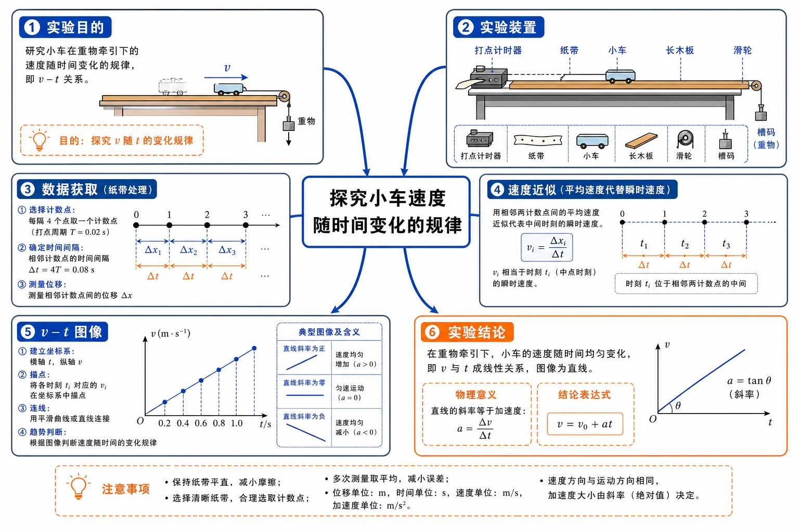
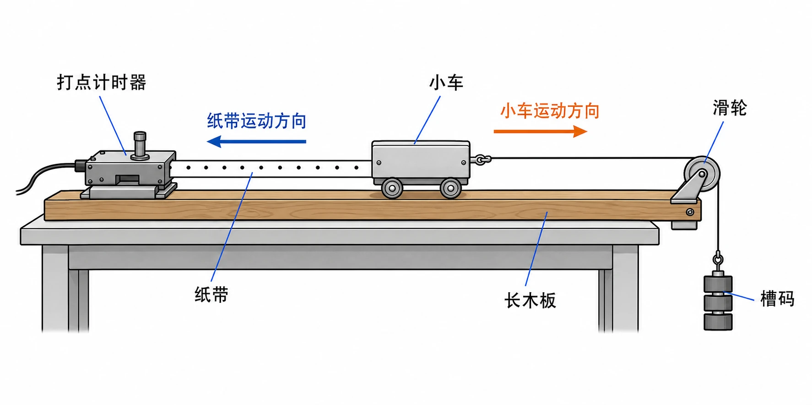
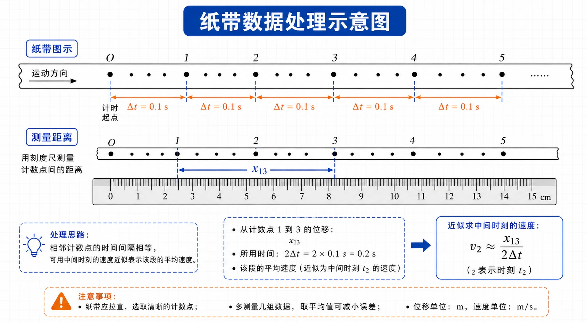
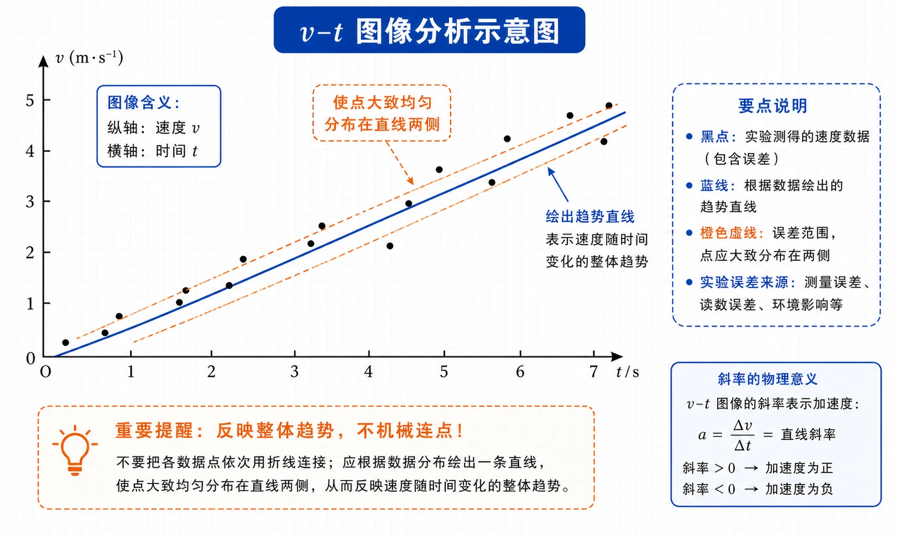
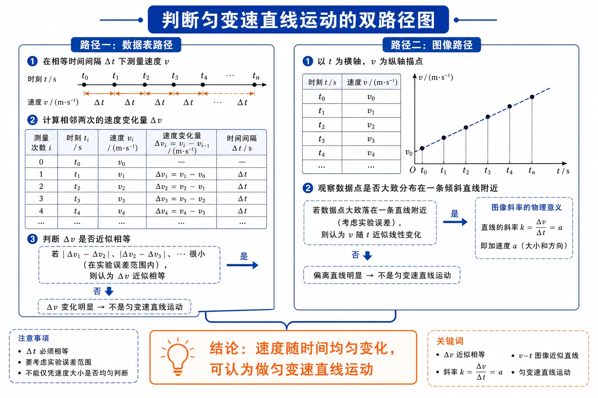

# 2.1 实验：探究小车速度随时间变化的规律

<!-- 图片描述：本节整体知识信息结构图。图中央为“探究小车速度随时间变化的规律”，四周辐射出六个主要分支：实验目的（研究小车在重物牵引下的v-t关系）、实验装置（打点计时器、纸带、小车、长木板、滑轮、槽码）、数据获取（计数点、时间间隔、位移测量）、速度近似（用相邻段平均速度代表瞬时速度）、v-t图像（描点、连线、趋势判断）、实验结论（速度随时间均匀变化）。每个分支用蓝色箭头与中心相连，关键器材用简洁图标表示，整体采用白色背景、黑灰轮廓、蓝色过程线、橙色关键结论的物理示意图风格。 -->

## 本节学习目标

学完本节，需要能做到：

- 理解本实验的物理目的：研究小车在重物牵引下速度随时间变化的规律。
- 能说出打点计时器在实验中的核心作用：同时记录等时间间隔的位移信息。
- 会根据打点频率计算相邻计数点之间的时间间隔。
- 会用一小段位移的平均速度近似表示计数点的瞬时速度。
- 会设计表格记录多组 $v$、$t$ 数据，并能根据数据描点作出 $v-t$ 图像。
- 能根据 $v-t$ 图像的整体趋势判断小车速度随时间变化的规律。
- 能说明实验方案中“测什么、用什么测、怎样处理数据、怎样得出结论”四个环节。
- 知道实验中误差的主要来源，并能在数据处理中合理取舍误差点。
- 了解用计算机软件（如 WPS 表格）快速绘制 $v-t$ 图像的方法。

## 核心知识点讲解

### 一、知识对象与物理情境

本节研究的问题是：

> 小车在重物牵引下沿木板运动时，速度是怎样随时间变化的？

具体来说，我们想弄清楚：

- 小车的速度是否随时间变化。
- 速度变化是否有规律，是均匀变化还是不均匀变化。
- 速度 $v$ 与时间 $t$ 之间是否存在简单的定量关系。

设计这个实验时，可以按四个问题展开：

| 设计问题 | 对应处理 |
| --- | --- |
| 测什么物理量 | 测不同时刻的小车速度 $v$ 和对应时间 $t$ |
| 用什么器材测 | 用打点计时器和纸带记录等时间间隔内的位置变化 |
| 怎样由纸带得到速度 | 先选计数点，再测位移，用短时间内平均速度近似瞬时速度 |
| 怎样判断规律 | 列 $v-t$ 数据表，描点作图，看点的整体分布趋势 |

这个问题链很重要：实验不是只“打出纸带”，而是把一个运动规律问题转化为可测量、可计算、可作图判断的数据问题。

生活中常见的汽车启动、列车加速、物体下落等，都涉及“速度随时间变化”的问题。先通过小车实验建立一个简单的模型，再把这个方法迁移到更复杂的运动中去，是物理学研究运动规律的常用思路。

### 二、核心概念与物理意义

#### 1. 打点计时器的作用

打点计时器是一种计时仪器，同时能在纸带上打出等时间间隔的点。它把“时间”转化为“点迹间隔”，把时间信息和位置信息同时记录在纸带上。

- 相邻两点之间的时间间隔由电源频率决定。
- 相邻两点之间的距离反映小车在相应时间内的位移。
- 点迹的疏密变化反映速度大小的变化：点越疏，相同时间内位移越大，速度越大。

#### 2. 计数点与计时起点

实验中通常不会用每一个打点作为测量点，而是每隔若干个点取一个“计数点”。例如每 $5$ 个打点间隔取一个计数点，这样相邻计数点之间的时间为 $0.1\ \text{s}$，便于测量和计算。

纸带开头往往有一些过于密集的点，实验中常舍去这些点，选择后面一个清晰、间距适当的点作为计时起点。原因是：

- 开头小车刚释放，运动可能不稳定，受释放动作影响。
- 点迹过密，位移很小，刻度尺测量相对误差较大。

#### 3. 瞬时速度的近似

纸带上某一点的瞬时速度，无法直接用“位移除以时间”得到，因为单个点没有位移。实验中常用的方法是：用该点附近一小段时间内的平均速度近似表示瞬时速度。

例如，要估算计数点 $B$ 的瞬时速度，可取它前后相邻的计数点 $A$、$C$，计算 $A$ 到 $C$ 的平均速度：

$$v_B \approx \frac{x_{AC}}{t_{AC}}$$

这种近似的合理性在于：当时间间隔足够短时，平均速度接近该段时间中点时刻的瞬时速度。

#### 4. $v-t$ 图像的意义

把测得的不同时刻的速度作为纵坐标，对应时间作为横坐标，描点作图，得到 $v-t$ 图像。

- 若点迹大致分布在一条倾斜直线附近，说明速度随时间均匀变化。
- 若图线向上倾斜，说明速度在增大。
- 若图线向下倾斜，说明速度在减小。
- 若图线接近水平，说明速度几乎不变。

### 三、关键规律、公式与适用条件

#### 1. 相邻打点时间间隔

打点计时器电源频率 $f = 50\ \text{Hz}$ 时，相邻两个点的时间间隔为：

$$T = \frac{1}{f} = \frac{1}{50}\ \text{s} = 0.02\ \text{s}$$

#### 2. 相邻计数点时间间隔

若每 $n$ 个打点间隔取一个计数点，则相邻计数点间的时间间隔为：

$$\Delta t = nT = \frac{n}{f}$$

常用取法：每 5 个间隔取一个计数点，$\Delta t = 5 \times 0.02\ \text{s} = 0.1\ \text{s}$。

#### 3. 平均速度近似瞬时速度

设某计数点 $B$ 前后相邻计数点分别为 $A$、$C$，$A$、$C$ 之间的时间间隔为 $t_{AC}$，位移为 $x_{AC}$，则：

$$v_B \approx \frac{x_{AC}}{t_{AC}}$$

适用条件：所取时间间隔不宜过长，否则平均速度不能很好代表瞬时速度；也不宜过短，否则位移测量误差较大。实验中通常取 $2$ 到 $3$ 个计数点间隔。

#### 4. $v-t$ 图像趋势判断

| 图像特征 | 物理意义 |
| --- | --- |
| 点迹接近倾斜直线 | 速度随时间均匀变化 |
| 直线向上倾斜 | 速度均匀增大 |
| 直线向下倾斜 | 速度均匀减小 |
| 直线越陡 | 速度变化越快，加速度越大 |

### 四、典型模型与过程分析

#### 实验装置模型

<!-- 图片描述：实验装置侧视简图。画面左侧为水平放置的长木板，木板左端固定打点计时器，纸带穿过计时器后连接在小车后端；小车置于木板上，前端通过细绳绕过木板右端的定滑轮，细绳下端悬挂槽码。图中用橙色箭头标出小车运动方向（向右），蓝色箭头标出纸带运动方向（向左），关键部件标注“打点计时器”“纸带”“小车”“滑轮”“槽码”“长木板”。白色背景，黑灰轮廓，蓝色过程线，橙色关键标注。 -->

实验装置的核心关系：

- 槽码下落 → 通过细绳牵引小车 → 小车带动纸带运动。
- 打点计时器在纸带上等时间间隔打点 → 记录小车在不同时刻的位置。

实验中常改变槽码质量（或在小车上加重物），获得多组 $v-t$ 数据，比较不同条件下的运动规律。

#### 实验操作流程

1. 安装器材：把长木板平放，打点计时器固定在一端，纸带穿过计时器并连在小车上，细绳绕过滑轮后挂槽码。
2. 启动计时器：先接通电源，待打点稳定后再释放小车。
3. 释放小车：让小车拖着纸带运动，打下一行点迹后立即关闭电源。
4. 重复实验：改变槽码质量或小车质量，更换纸带，再做实验。

重复实验的意义不是简单多做几次，而是检查同一研究方法在不同牵引条件下是否仍能得到清晰的 $v-t$ 关系。若改变槽码后图像仍接近直线，只是直线倾斜程度不同，就说明“速度随时间均匀变化”这一判断有更强的可信度。

### 五、图像、实验与数据理解

#### 1. 纸带数据处理

<!-- 图片描述：纸带数据处理示意图。画面展示一条水平纸带，上面有一系列等时间间隔的黑点，从左到右间距逐渐变大。标注“O”为计时起点，后续计数点依次标注“1”“2”“3”“4”“5”，相邻计数点间标注时间间隔 $\Delta t = 0.1\ \text{s}$。用刻度尺测量某段距离的示意，蓝色箭头表示从计数点1到计数点3的距离 $x_{13}$。图中说明：$v_2 \approx x_{13}/(2\Delta t)$。整体为物理实验示意图风格。 -->

处理纸带时的一般步骤：

- 选择清晰的计数点，标注 $0, 1, 2, 3, \ldots$。
- 用刻度尺读出各计数点到起点的距离，或相邻计数点间的距离。
- 计算相邻计数点间的时间间隔。
- 用“前后相邻计数点”的平均速度近似中间计数点的瞬时速度。
- 将结果填入 $v-t$ 表格。

示例表格：

| 位置编号 | 0 | 1 | 2 | 3 | 4 | 5 | 6 | … |
| --- | --- | --- | --- | --- | --- | --- | --- | --- |
| 时间 $t/\text{s}$ | 0 | 0.1 | 0.2 | 0.3 | 0.4 | 0.5 | 0.6 | … |
| 第一组速度 $v_1/(\text{m}\cdot\text{s}^{-1})$ |  |  |  |  |  |  |  | … |
| 第二组速度 $v_2/(\text{m}\cdot\text{s}^{-1})$ |  |  |  |  |  |  |  | … |
| 第三组速度 $v_3/(\text{m}\cdot\text{s}^{-1})$ |  |  |  |  |  |  |  | … |

表格中第 $0$ 个计数点常作为计时起点，通常难以用“前后相邻计数点”计算它附近的瞬时速度；若没有前一个计数点，也可以从第 $1$ 个计数点开始计算并作图。关键是保证每一组数据的时间基准和速度计算方法一致。

#### 2. $v-t$ 图像的绘制与分析

<!-- 图片描述：v-t图像分析示意图。画面包含直角坐标系，横轴为时间 $t$，纵轴为速度 $v$，坐标轴上标注单位。若干黑色圆点大致分布在一条向上倾斜的蓝色直线附近，直线用蓝色画出，部分点在直线上方，部分点在下方，说明实验误差。图中用橙色虚线标注“使点大致均匀分布在直线两侧”，并用文字说明“反映整体趋势，不机械连点”。整体为物理图像示意风格。 -->

作图步骤：

- 建立直角坐标系，横轴为 $t$，纵轴为 $v$。
- 根据表格数据描点。
- 观察点的整体分布趋势，画一条直线或平滑曲线，使点大致均匀分布在线的两侧。
- 若点迹明显偏离整体趋势，应分析是否属于错误数据，不可随意舍弃。

注意：实验数据点通常不会完全落在一条直线上。造成偏差的原因包括：测量误差、纸带与计时器之间的摩擦、小车运动受阻力、释放操作不稳定等。

如果有少数点偏离明显，不能凭感觉直接删去。正确做法是先检查纸带读数、单位换算、时间间隔和速度公式是否出错；若能确认是读数或记录错误，再舍去或重测。若不能确认，应保留并让图线反映多数点的整体趋势。

#### 3. 用计算机绘制 $v-t$ 图像

借助 WPS 表格等软件，可以快速、准确地绘制 $v-t$ 图像：

- 在一列输入时间 $t$，相邻列输入对应速度 $v$。
- 选中数据，插入“图表”，选择“散点图”或“平滑散点图”。
- 添加“趋势线”，选择“线性”类型。
- 软件可自动写出图像对应的公式。

这种方法能减少手动作图的误差，也便于发现数据规律。

### 六、题型应用与迁移

本实验体现的研究思路可以迁移到很多运动问题中：

- 用打点计时器研究自由落体运动。
- 用光电门、传感器测量滑块速度随时间变化。
- 用频闪照片分析小球运动。

核心方法都是：获取多个时刻的速度 → 列表 → 作 $v-t$ 图像 → 从图像中发现规律。

## 重点梳理

### 重点 1：实验目的与核心思路

- 目的：研究小车在重物牵引下速度随时间变化的规律。
- 核心思路：打点计时器记录等时间间隔的位置 → 求各计数点瞬时速度 → 列表 → 作 $v-t$ 图像 → 判断规律。

为什么重要：这是高中物理第一个系统研究“运动规律”的实验，后续学习匀变速直线运动、自由落体运动都要用到这个实验方法。

触发条件：题目问“怎样设计实验”“需要测量哪些物理量”“为什么要作图”时，都要围绕这条主线回答，不能只写器材名称。

### 重点 2：打点计时器的使用要点

- 使用交流电源，频率 $50\ \text{Hz}$，相邻打点时间 $T = 0.02\ \text{s}$。
- 先接通电源，待打点稳定后再释放小车。
- 实验结束后立即关闭电源，避免纸带拉得过远或损坏器材。
- 每 $5$ 个打点间隔取一个计数点，是常用的测量间隔，对应 $\Delta t = 0.1\ \text{s}$。

常见触发条件：题目中若说“每两点间还有 4 个点没有画出”，即相邻计数点间有 5 个打点间隔，时间间隔为 $0.1\ \text{s}$。

### 重点 3：瞬时速度的近似方法

- 用某计数点前后相邻计数点间的平均速度近似该点的瞬时速度。
- 公式：$v_i \approx \dfrac{x_{i+1} - x_{i-1}}{2\Delta t}$ 或 $v_i \approx \dfrac{x_{i+1,i} + x_{i,i-1}}{2\Delta t}$。
- 关键是数清楚时间间隔，统一单位。

### 重点 4：$v-t$ 图像的物理意义

- $v-t$ 图像反映速度随时间的变化关系。
- 点迹接近直线 → 速度均匀变化（匀变速直线运动）。
- 图线斜率表示加速度：斜率越大，加速度越大。
- 图线在时间轴上方 → 速度为正；下方 → 速度为负（本实验通常只取正向运动）。

### 重点 5：误差分析与数据取舍

- 常见误差：读数误差、摩擦阻力、点迹不清、释放不稳定、选点不合理。
- 作图时不能机械连点，要看整体趋势。
- 明显偏离整体趋势的点，需分析原因后再决定是否舍弃。

## 难点突破

### 难点 1：为什么用平均速度近似瞬时速度

某一点的瞬时速度，在纸带上没有直接对应的位移和时间。根据极限思想，当时间间隔足够短时，平均速度可以接近瞬时速度。实验中选取计数点前后相邻点计算平均速度，是因为这段时间既不太长（能较好代表该点瞬时速度），也不太短（位移测量不至于误差过大）。

### 难点 2：如何正确选择计数点

- 舍去开头过密的点：释放瞬间不稳定，测量误差大。
- 选择点迹清晰、间距适中的部分作为有效数据。
- 相邻计数点之间的时间间隔最好相同，便于后续作图和分析。

### 难点 3：$v-t$ 图像为什么不一定过所有点

实验数据存在误差，真实运动的规律被这些误差掩盖。作图的任务是“去噪取势”，找出反映运动整体规律的那条线。如果强制连接所有点，图线会弯弯曲曲，反而掩盖了真实规律。

### 难点 4：如何判断小车是否做匀变速直线运动

从实验角度看：

- 看 $v-t$ 图像上的点是否大致在一条直线上。
- 看相等时间间隔内速度变化量是否近似相等。

如果以上两点都满足，就可以在实验误差允许范围内认为小车做匀变速直线运动。

<!-- 图片描述：判断匀变速直线运动的双路径图。左侧为“数据表路径”：相等时间间隔 $\Delta t$ 下，比较 $\Delta v_1$、$\Delta v_2$、$\Delta v_3$ 是否近似相等；右侧为“图像路径”：把 $v$ 对 $t$ 描点，观察数据点是否大致分布在一条倾斜直线附近。两条路径最终汇合到橙色结论框“速度随时间均匀变化，可认为做匀变速直线运动”。采用白色背景、蓝色判断箭头、橙色结论框，标出 $t$、$v$、$\Delta v$、$\Delta t$ 等物理量。 -->

## 例题讲解

### 例题 1：确定计数点时间间隔

**题目**：打点计时器所用电源频率为 $50\ \text{Hz}$。实验中每隔 5 个打点间隔取一个计数点，相邻计数点之间的时间间隔是多少？

**分析**：先求相邻打点时间，再乘以间隔数。

**步骤**：

$$T = \frac{1}{f} = \frac{1}{50}\ \text{s} = 0.02\ \text{s}$$

$$\Delta t = 5T = 5 \times 0.02\ \text{s} = 0.1\ \text{s}$$

**答案**：相邻计数点间的时间间隔为 $0.1\ \text{s}$。

**反思**：若题目说“每两点间还有 4 个点没有画出”，同样表示相邻计数点之间有 5 个打点间隔。

### 例题 2：由纸带求瞬时速度

**题目**：某纸带上 $A$、$B$、$C$ 为连续计数点，相邻计数点时间间隔均为 $0.1\ \text{s}$。测得 $A$、$C$ 两点间距离为 $0.056\ \text{m}$。用 $A-C$ 段的平均速度近似表示 $B$ 点的瞬时速度，求 $B$ 点速度。

**分析**：$A-C$ 跨越两个计数点间隔，时间为 $0.2\ \text{s}$。

**步骤**：

$$t_{AC} = 2 \times 0.1\ \text{s} = 0.2\ \text{s}$$

$$v_B \approx \frac{x_{AC}}{t_{AC}} = \frac{0.056\ \text{m}}{0.2\ \text{s}} = 0.28\ \text{m/s}$$

**答案**：$B$ 点瞬时速度约为 $0.28\ \text{m/s}$。

**反思**：求某点瞬时速度，通常取该点前后相邻计数点之间的平均速度。

### 例题 3：根据数据判断运动规律

**题目**：某小车在 $0\ \text{s}$、$0.1\ \text{s}$、$0.2\ \text{s}$、$0.3\ \text{s}$ 时的速度分别为 $0.20\ \text{m/s}$、$0.30\ \text{m/s}$、$0.40\ \text{m/s}$、$0.50\ \text{m/s}$。小车速度随时间有什么特点？

**分析**：比较相等时间间隔内的速度变化量。

**步骤**：

$$\Delta v_1 = 0.30 - 0.20 = 0.10\ \text{m/s}$$

$$\Delta v_2 = 0.40 - 0.30 = 0.10\ \text{m/s}$$

$$\Delta v_3 = 0.50 - 0.40 = 0.10\ \text{m/s}$$

每经过 $0.1\ \text{s}$，速度增加 $0.10\ \text{m/s}$。

**答案**：小车速度随时间均匀增大，$v-t$ 图像应接近一条向上倾斜的直线。

**反思**：相等时间内速度变化量相等，是判断匀变速直线运动的重要依据。

### 例题 4：由纸带数据计算速度并列表

**题目**：某次实验中，相邻计数点时间间隔为 $0.1\ \text{s}$。连续计数点到起点的距离分别为 $0\ \text{cm}$、$2.0\ \text{cm}$、$5.0\ \text{cm}$、$9.0\ \text{cm}$、$14.0\ \text{cm}$、$20.0\ \text{cm}$。试计算第 1、2、3、4 号计数点附近的瞬时速度，并填入表格。

**分析**：第 $i$ 号计数点的瞬时速度，可用第 $i-1$ 号到第 $i+1$ 号计数点之间的平均速度近似。

**步骤**：

第 1 号计数点：

$$v_1 \approx \frac{x_2 - x_0}{2\Delta t} = \frac{(5.0 - 0) \times 10^{-2}\ \text{m}}{2 \times 0.1\ \text{s}} = 0.25\ \text{m/s}$$

第 2 号计数点：

$$v_2 \approx \frac{x_3 - x_1}{2\Delta t} = \frac{(9.0 - 2.0) \times 10^{-2}\ \text{m}}{2 \times 0.1\ \text{s}} = 0.35\ \text{m/s}$$

第 3 号计数点：

$$v_3 \approx \frac{x_4 - x_2}{2\Delta t} = \frac{(14.0 - 5.0) \times 10^{-2}\ \text{m}}{2 \times 0.1\ \text{s}} = 0.45\ \text{m/s}$$

第 4 号计数点：

$$v_4 \approx \frac{x_5 - x_3}{2\Delta t} = \frac{(20.0 - 9.0) \times 10^{-2}\ \text{m}}{2 \times 0.1\ \text{s}} = 0.55\ \text{m/s}$$

**答案**：

| 位置编号 | 1 | 2 | 3 | 4 |
| --- | --- | --- | --- | --- |
| 时间 $t/\text{s}$ | 0.1 | 0.2 | 0.3 | 0.4 |
| 速度 $v/(\text{m}\cdot\text{s}^{-1})$ | 0.25 | 0.35 | 0.45 | 0.55 |

**反思**：相邻速度之间相差 $0.10\ \text{m/s}$，说明速度随时间均匀增加。

## 易错点整理

### 易错点 1：把点距当成时间

**常见错误表现**：认为纸带上点与点的距离越大，时间间隔也越大。

**错因分析**：打点计时器是等时间间隔打点的，时间由电源频率决定，与点距无关。点距反映的是相同时间内的位移，位移大说明速度大。

**正确处理**：时间间隔用 $T = \dfrac{1}{f}$ 计算，点距用来计算位移和速度。

### 易错点 2：忘记计算跨越几个时间间隔

**常见错误表现**：计算 $A$ 到 $C$ 的时间时，误用 $0.1\ \text{s}$ 而不是 $0.2\ \text{s}$。

**错因分析**：$A$ 到 $C$ 跨越 $A-B$ 和 $B-C$ 两个计数点间隔，每个间隔是 $0.1\ \text{s}$，总时间为 $0.2\ \text{s}$。

**正确处理**：数清楚两点之间有多少个计数点间隔，再乘以 $\Delta t$。

### 易错点 3：把平均速度当成精确瞬时速度

**常见错误表现**：认为用平均速度近似得到的就是该点的精确瞬时速度。

**错因分析**：纸带法求瞬时速度是一种近似方法，选取的时间段越短、位移测量越准确，近似程度越好。

**正确处理**：在实验报告中说明“用 $A-C$ 段的平均速度近似表示 $B$ 点的瞬时速度”。

### 易错点 4：作图时机械连点

**常见错误表现**：把每个数据点依次用折线连接起来。

**错因分析**：实验数据有误差，机械连点会放大误差，掩盖真实规律。

**正确处理**：根据点的整体分布趋势画一条平滑线或直线，使点大致均匀分布在线的两侧。

### 易错点 5：忽略单位换算

**常见错误表现**：纸带上读出的距离单位是厘米，计算速度时直接代入，导致结果数量级错误。

**错因分析**：速度单位通常是 $\text{m/s}$，所以位移应统一换算成米。

**正确处理**：计算前把 $x$ 的单位换算成米，即 $x(\text{m}) = x(\text{cm}) \times 10^{-2}$。

## 考点考证点整理

### 考点一：实验原理与器材

- **出题思路**：常以填空、选择或简答题形式考查“为什么用打点计时器研究速度随时间变化”“实验中先通电还是先释放小车”“实验器材有哪些”等。
- **关键条件**：注意电源频率、计数点选取方式、是否需要平衡摩擦力等实验细节。
- **解答要点**：
  - 打点计时器能同时记录等时间间隔的位置信息。
  - 纸带记录了小车在不同时刻的位置，通过测量位移和时间可求速度。
  - 实验时应先接通电源，待打点稳定后再释放小车。
- **易扣分点**：把“先释放小车后通电”写成正确操作；混淆打点计时器和秒表的功能。

### 考点二：纸带数据处理与速度计算

- **出题思路**：给出纸带数据或计数点距离，要求计算某计数点的瞬时速度。
- **关键条件**：明确相邻计数点间的时间间隔，注意单位换算，区分“相邻计数点距离”和“到起点的距离”。
- **解答要点**：
  - 用 $v_i \approx \dfrac{x_{i+1} - x_{i-1}}{2\Delta t}$ 近似瞬时速度。
  - 若给出相邻计数点间距离，也可写 $v_i \approx \dfrac{x_{i,i-1} + x_{i+1,i}}{2\Delta t}$。
  - 计算前统一单位为米。
- **易扣分点**：时间间隔算错；单位未换算；把 $x_{i+1}$ 当成相邻计数点距离而不是到起点的距离。

### 考点三：$v-t$ 图像作图与判断

- **出题思路**：给出 $v-t$ 数据表，要求描点作图；或根据图像判断运动规律。
- **关键条件**：注意坐标轴分度、单位；数据点不完全在同一直线上时如何处理。
- **解答要点**：
  - 描点后根据整体趋势画直线或平滑曲线。
  - 点大致均匀分布在直线两侧。
  - 若图像为倾斜直线，说明速度随时间均匀变化。
- **易扣分点**：机械连点；图像不过原点就强行画成过原点；没有说明图像反映的物理意义。

### 考点四：实验误差分析

- **出题思路**：要求分析实验中误差的主要来源，或解释为什么数据点不完全在一条直线上。
- **关键条件**：区分系统误差和偶然误差，能联系具体实验操作。
- **解答要点**：
  - 读数误差（刻度尺估读不准确）。
  - 纸带与打点计时器限位孔之间的摩擦。
  - 小车运动过程中受到木板阻力、空气阻力。
  - 释放小车时初速度不为零或操作不稳定。
  - 点迹过密或不够清晰。
- **易扣分点**：只写“有误差”而不具体分析来源；把系统误差说成操作错误。

### 考点五：实验方法迁移

- **出题思路**：把本实验方法迁移到自由落体、滑块运动等情境中，要求说明研究思路。
- **关键条件**：抓住“获取多组 $v$、$t$ 数据 → 作图 → 找规律”的主线。
- **解答要点**：
  - 明确研究对象和运动过程。
  - 说明如何获取不同时刻的速度。
  - 说明如何列表、作图、判断规律。
- **易扣分点**：只写“用打点计时器”而不说明具体步骤；缺少“作图分析”这一关键环节。

## 练习题

### 基础训练

1. 打点计时器电源频率为 $50\ \text{Hz}$，相邻两个打点之间的时间间隔是多少？
2. 为什么研究小车速度随时间变化时，要先测量多个时刻的瞬时速度？
3. 纸带上相邻点之间的距离逐渐变大，说明小车速度怎样变化？
4. 实验中为什么要舍掉纸带开头一些过于密集的点？
5. 在 $v-t$ 图像中，横轴和纵轴分别表示什么物理量？

### 巩固训练

6. 相邻计数点间的时间间隔为 $0.1\ \text{s}$，某两相邻计数点间的距离为 $4.5\ \text{cm}$，求这段的平均速度。
7. 连续计数点 $A$、$B$、$C$ 中，$A-C$ 距离为 $7.2\ \text{cm}$，相邻计数点时间间隔为 $0.1\ \text{s}$。求 $B$ 点瞬时速度的近似值。
8. 某小车速度数据依次为 $0.18\ \text{m/s}$、$0.25\ \text{m/s}$、$0.32\ \text{m/s}$、$0.39\ \text{m/s}$，相邻数据时间间隔均为 $0.1\ \text{s}$。速度变化有什么特点？
9. 作 $v-t$ 图像时，发现某个数据点明显偏离其他点的趋势，应如何处理？
10. 用 WPS 表格绘制 $v-t$ 图像时，选择哪种趋势线类型比较合适？为什么？

### 提升训练

11. 某纸带相邻计数点时间间隔为 $0.1\ \text{s}$，连续计数点到起点的距离分别为 $0\ \text{cm}$、$2.0\ \text{cm}$、$5.0\ \text{cm}$、$9.0\ \text{cm}$、$14.0\ \text{cm}$。求第 1、2、3 号计数点附近的瞬时速度，并判断小车运动趋势。
12. 某同学研究小车沿斜面向下运动，纸带上相邻计数点之间的时间间隔均为 $0.1\ \text{s}$，并且相邻计数点间距逐渐增大。他把纸带每隔 $0.1\ \text{s}$ 剪断，得到若干短纸条。再把这些纸条并排贴在一张纸上，使纸条下端对齐，作为时间坐标轴，标出时间。最后将纸条上端中心连起来，得到 $v-t$ 图像。
    - 这种作图方法的物理依据是什么？
    - 纸条长度表示什么物理量？
    - 如果纸条上端中心连起来近似为一条直线，说明小车做什么运动？
13. 一列车沿长直坡路向下行驶，开始时速度表示为 $54\ \text{km/h}$，以后每隔 $5\ \text{s}$ 读取一次数据，见下表：

| 时间 $t/\text{s}$ | 0 | 5 | 10 | 15 | 20 | 25 | 30 |
| --- | --- | --- | --- | --- | --- | --- | --- |
| 速度 $v/(\text{km}\cdot\text{h}^{-1})$ | 54 | 59 | 65 | 70 | 76 | 81 | 86 |

（1）把表中速度换算为以 $\text{m/s}$ 为单位。
（2）在坐标系中作出列车速度与时间关系的 $v-t$ 图像。
（3）根据图像判断列车速度随时间变化的规律。

## 练习题答案

### 基础训练答案

1. 相邻打点时间：

$$T = \frac{1}{50}\ \text{s} = 0.02\ \text{s}$$

2. 因为要研究速度随时间变化的规律，必须知道多个时刻的速度，单个速度无法反映变化关系。

3. 相邻点之间时间间隔相同，点距变大说明相同时间内位移变大，由 $v \approx \dfrac{\Delta x}{\Delta t}$ 可知小车速度增大。

4. 开头点过密，位移小，测量误差相对较大；而且释放瞬间小车运动可能不稳定，受操作影响。

5. 横轴表示时间 $t$，纵轴表示速度 $v$。

### 巩固训练答案

6. 平均速度：

$$v = \frac{\Delta x}{\Delta t} = \frac{4.5 \times 10^{-2}\ \text{m}}{0.1\ \text{s}} = 0.45\ \text{m/s}$$

7. $A-C$ 段时间为 $0.2\ \text{s}$：

$$v_B \approx \frac{7.2 \times 10^{-2}\ \text{m}}{0.2\ \text{s}} = 0.36\ \text{m/s}$$

8. 相邻时间间隔内速度变化量均为：

$$0.25 - 0.18 = 0.32 - 0.25 = 0.39 - 0.32 = 0.07\ \text{m/s}$$

说明速度随时间均匀增大，$v-t$ 图像接近直线。

9. 不应机械连点。应结合所有数据的整体趋势画平滑线或直线，使点大致均匀分布在直线两侧；明显偏离的点需分析原因，判断是否属于错误数据。

10. 选择“线性”趋势线。因为本实验中小车速度随时间近似均匀变化，$v-t$ 图像接近直线。

### 提升训练答案

11. 第 1 号计数点附近速度：

$$v_1 \approx \frac{(5.0 - 0) \times 10^{-2}\ \text{m}}{2 \times 0.1\ \text{s}} = 0.25\ \text{m/s}$$

第 2 号计数点附近速度：

$$v_2 \approx \frac{(9.0 - 2.0) \times 10^{-2}\ \text{m}}{2 \times 0.1\ \text{s}} = 0.35\ \text{m/s}$$

第 3 号计数点附近速度：

$$v_3 \approx \frac{(14.0 - 5.0) \times 10^{-2}\ \text{m}}{2 \times 0.1\ \text{s}} = 0.45\ \text{m/s}$$

速度逐渐增大，且相邻计数点速度变化量均为 $0.10\ \text{m/s}$，说明小车速度随时间均匀增大。

12. 这种作图方法的物理依据：

- 每个纸条代表 $0.1\ \text{s}$ 内小车的位移，纸条长度越长，说明这段时间内平均速度越大。
- 由于时间间隔相同，纸条长度与平均速度成正比，因此纸条上端的位置可以反映该段时间中点附近的瞬时速度大小。
- 将纸条上端中心连起来，得到的就是速度随时间变化的图像。

纸条长度表示 $0.1\ \text{s}$ 内的位移大小，间接反映该段时间内的平均速度。

如果纸条上端中心连线近似为一条直线，说明小车的速度随时间均匀变化，小车做匀变速直线运动。

13. （1）速度换算：$1\ \text{km/h} = \dfrac{1}{3.6}\ \text{m/s} \approx 0.2778\ \text{m/s}$。

| 时间 $t/\text{s}$ | 0 | 5 | 10 | 15 | 20 | 25 | 30 |
| --- | --- | --- | --- | --- | --- | --- | --- |
| 速度 $v/(\text{m}\cdot\text{s}^{-1})$ | 15.0 | 16.4 | 18.1 | 19.4 | 21.1 | 22.5 | 23.9 |

（计算示例：$54\ \text{km/h} = 54 \times \dfrac{1}{3.6}\ \text{m/s} = 15.0\ \text{m/s}$）

（2）以 $t$ 为横轴、$v$ 为纵轴建立坐标系，根据表中数据描点，用直线连接各点大致趋势，使点均匀分布在直线两侧。

（3）图像接近一条向上倾斜的直线，说明列车速度随时间均匀增大，即列车做匀加速直线运动。
