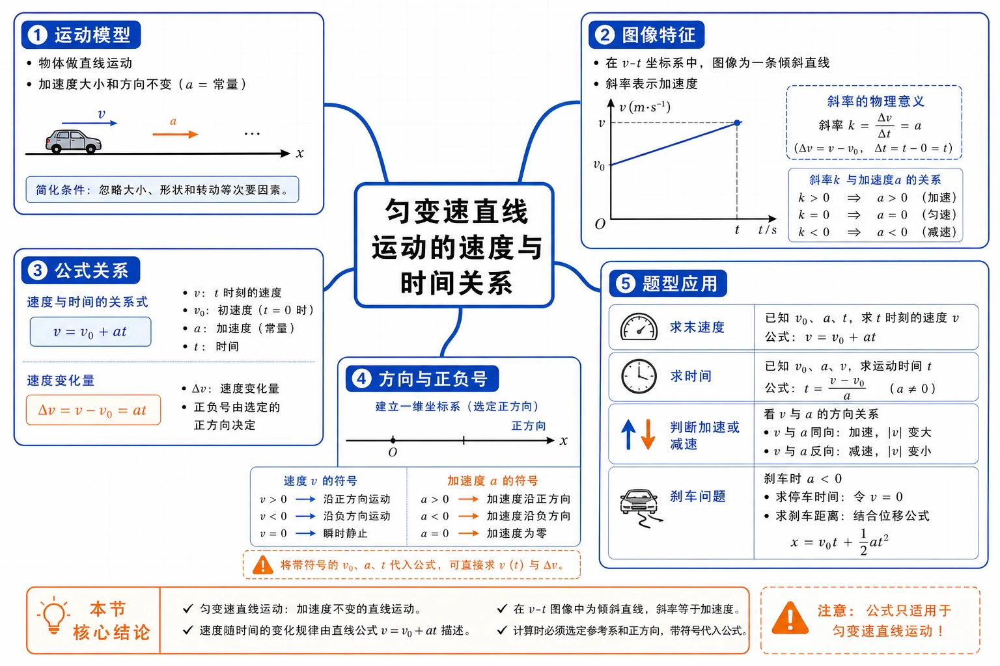
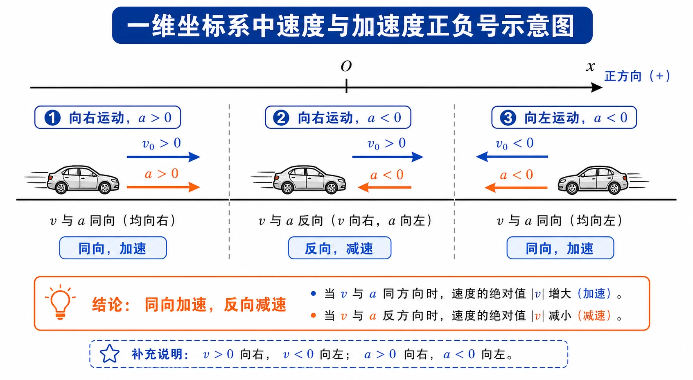
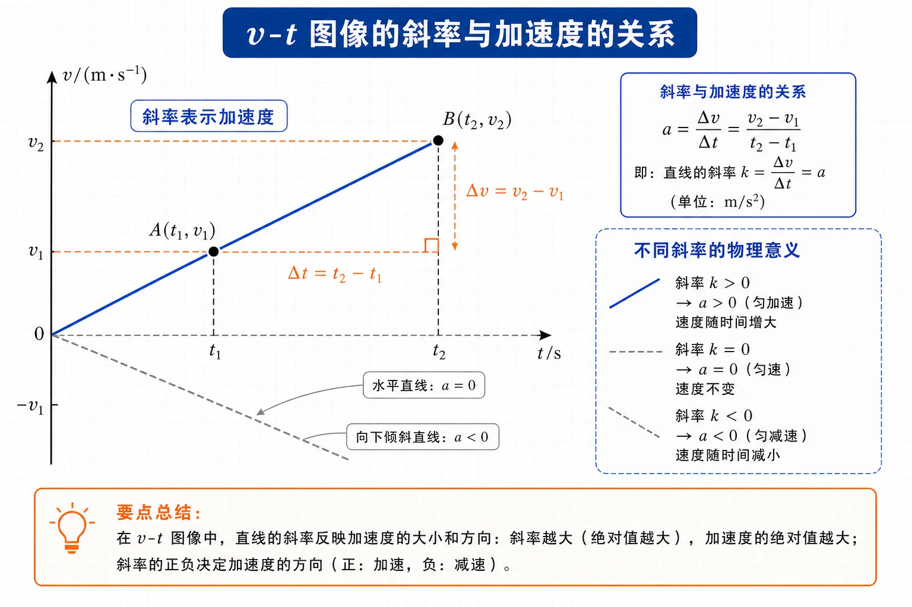

# 2.2 匀变速直线运动的速度与时间的关系

<!-- 图片描述：本节整体知识信息结构图。中心主题为“匀变速直线运动的速度与时间关系”，向外分为五个分支：运动模型（直线运动、加速度不变）、图像特征（$v-t$ 图像为倾斜直线、斜率表示加速度）、公式关系（$v=v_0+at$、$\Delta v=at$）、方向与正负号（建立一维坐标系、速度和加速度带符号代入）、题型应用（求末速度、求时间、判断加速减速、分析刹车问题）。整体采用白色或浅网格背景，黑灰坐标轴与物体轮廓，蓝色表示速度和图像线，橙色表示加速度、正负号和关键结论。 -->

## 本节学习目标

学完本节，需要能做到：

- 理解匀变速直线运动的定义：沿直线运动且加速度不变。
- 能从 $v-t$ 图像的直线特征判断物体是否做匀变速直线运动。
- 理解匀加速直线运动和匀减速直线运动的判断标准。
- 会推导并使用速度与时间关系式 $v=v_0+at$。
- 能说明公式中 $v$、$v_0$、$a$、$t$ 的物理意义、单位和方向属性。
- 会建立一维坐标系，带正负号代入速度、加速度等矢量量。
- 能处理列车加速、刹车减速、探测器下落等匀变速直线运动问题。
- 能根据 $v-t$ 图像比较速度大小、速度方向、加速度大小和加速度方向。

## 核心知识点讲解

### 一、知识对象与物理情境

上一节通过小车实验得到一个重要现象：小车在重物牵引下运动时，$v-t$ 图像近似是一条倾斜直线。这个现象说明，小车的速度不是随意变化的，而是有稳定规律的。

本节要解决的问题是：

- 什么样的直线运动可以叫“匀变速直线运动”？
- $v-t$ 图像为什么能反映加速度是否不变？
- 怎样不用每次都画图，而用公式直接计算某时刻的速度？
- 遇到减速、刹车、反向运动时，速度和加速度的正负号怎样处理？

如果 C919 飞机沿直线做匀速运动，它的 $v-t$ 图像是一条水平直线；如果小车的 $v-t$ 图像是一条倾斜直线，就说明速度在随时间均匀变化。由图像到模型，再由模型到公式，是本节的学习主线。

### 二、核心概念与物理意义

#### 1. 匀变速直线运动

沿着一条直线运动，并且加速度不变的运动，叫作匀变速直线运动。

这个定义有两个限制条件：

| 条件 | 含义 | 常见误解 |
| --- | --- | --- |
| 沿直线运动 | 运动轨迹是一条直线，可用一维坐标描述 | 只看速度大小变化，忽略运动方向 |
| 加速度不变 | 速度随时间均匀变化，$\dfrac{\Delta v}{\Delta t}$ 恒定 | 把“匀变速”误解成“速度不变” |

“匀变速”中的“匀”指速度变化得均匀，不是速度本身保持不变。匀速直线运动的加速度为 $0$；匀变速直线运动的加速度可以不为 $0$，但必须恒定。

#### 2. 匀加速直线运动和匀减速直线运动

在匀变速直线运动中，如果物体的速度随时间均匀增加，叫作匀加速直线运动；如果速度随时间均匀减小，叫作匀减速直线运动。

判断“加速”还是“减速”，真正依据是速度方向和加速度方向的关系：

| 速度与加速度方向 | 速度大小变化 | 运动类型 |
| --- | --- | --- |
| 同向 | 速度大小增大 | 加速运动 |
| 反向 | 速度大小减小 | 减速运动 |

注意：加速度为正不一定表示加速，加速度为负也不一定表示减速。正负号只表示相对于所选正方向的方向。

### 三、关键规律、公式与适用条件

#### 1. 从加速度定义推出速度公式

对匀变速直线运动，加速度保持不变。若把运动开始时刻取为 $0$，开始时速度为 $v_0$，经过时间 $t$ 后速度为 $v$，则速度变化量为：

$$
\Delta v=v-v_0
$$

时间变化量为：

$$
\Delta t=t
$$

由加速度定义：

$$
a=\frac{\Delta v}{\Delta t}=\frac{v-v_0}{t}
$$

整理得：

$$
v=v_0+at
$$

这就是匀变速直线运动的速度与时间关系式。

#### 2. 公式的物理意义

$$
v=v_0+at
$$

可以读成：

$$
\text{某时刻速度}=\text{初速度}+\text{这段时间内速度的变化量}
$$

其中 $at$ 表示 $t$ 时间内速度的变化量：

$$
\Delta v=at
$$

| 符号 | 物理意义 | 单位 | 方向属性 |
| --- | --- | --- | --- |
| $v_0$ | 初速度 | $\text{m/s}$ | 矢量，代入时带正负号 |
| $v$ | $t$ 时刻的速度 | $\text{m/s}$ | 矢量，结果正负表示方向 |
| $a$ | 加速度 | $\text{m/s}^2$ | 矢量，正负表示加速度方向 |
| $t$ | 运动时间 | $\text{s}$ | 标量，通常取正值 |

#### 3. 公式适用条件

$ v=v_0+at $ 只适用于匀变速直线运动，也就是：

- 运动轨迹为直线。
- 加速度 $a$ 在研究时间内保持不变。
- 所有速度和加速度都在同一条直线上，可以用一维正负号表示方向。

若加速度随时间变化，不能直接套用这个公式；若运动不是直线运动，也不能只靠一个正负号处理方向。

### 四、典型模型与过程分析

#### 1. 一维坐标模型

匀变速直线运动虽然可能向左、向右、向上或向下，但只要在一条直线上，就可以建立一维坐标系。

<!-- 图片描述：一维坐标系中速度与加速度正负号示意图。画一条水平 $x$ 轴，右侧为正方向。第一组小车向右运动，蓝色速度箭头 $v_0>0$ 向右，橙色加速度箭头 $a>0$ 向右，标注“同向，加速”；第二组小车向右运动，蓝色速度箭头向右，橙色加速度箭头向左，标注“反向，减速”；第三组小车向左运动，蓝色速度箭头 $v_0<0$ 向左，橙色加速度箭头 $a<0$ 向左，标注“同向，加速”。白色背景，黑灰车体和坐标轴，蓝色速度箭头，橙色加速度箭头。 -->

常用步骤：

1. 选研究对象和研究过程。
2. 沿运动直线建立坐标轴。
3. 规定正方向，常取初速度方向为正方向。
4. 判断 $v_0$、$v$、$a$ 的正负。
5. 代入 $v=v_0+at$ 计算。
6. 根据结果的正负解释速度方向。

#### 2. 刹车模型

刹车问题是匀减速直线运动的典型模型。若取初速度方向为正方向，刹车加速度通常为负。

停下时 $v=0$，由 $v=v_0+at$ 得：

$$
t_{\text{停}}=\frac{0-v_0}{a}
$$

因为 $a<0$，所以 $t_{\text{停}}$ 为正值。若题目给出的时间大于停止时间，物体已经停下，不能继续套公式算出“负速度”，除非题目明确说明物体反向运动。

### 五、图像、实验与数据理解

#### 1. $v-t$ 图像中的斜率

匀变速直线运动的 $v-t$ 图像是一条倾斜直线。任意一段时间内都有：

$$
a=\frac{\Delta v}{\Delta t}
$$

在 $v-t$ 图像中，这个比值就是图线的斜率。

<!-- 图片描述：$v-t$ 图像斜率与加速度关系图。直角坐标系横轴为 $t/\text{s}$，纵轴为 $v/(\text{m}\cdot\text{s}^{-1})$。画一条向上倾斜的蓝色直线，取两个状态点 $A(t_1,v_1)$、$B(t_2,v_2)$，用橙色虚线标出水平距离 $\Delta t$ 和竖直距离 $\Delta v$，旁边写出 $a=\Delta v/\Delta t$。图中再用浅灰虚线示意水平直线 $a=0$ 和向下倾斜直线 $a<0$，帮助比较不同斜率的物理意义。 -->

图像判断要点：

| 图像特征 | 物理意义 |
| --- | --- |
| 水平直线 | 速度不变，加速度为 $0$ |
| 向上倾斜直线 | 加速度为正，速度数值随时间增大 |
| 向下倾斜直线 | 加速度为负，速度数值随时间减小 |
| 图线越陡 | 加速度大小越大 |
| 图线过时间轴 | 速度变为 $0$，可能发生运动方向改变 |

#### 2. 非直线 $v-t$ 图像的判断

若 $v-t$ 图像是曲线，说明斜率在变化，加速度也在变化。即使速度一直增大，只要速度变化得不均匀，就不是匀变速直线运动。

判断一个运动是否匀变速，可以用两条路径：

- 数据路径：相等时间内的 $\Delta v$ 是否相等。
- 图像路径：$v-t$ 图像是否为直线。

### 六、题型应用与迁移

本节常见题型可以归纳为四类：

| 题型 | 已知条件 | 常用关系 | 关键提醒 |
| --- | --- | --- | --- |
| 求末速度 | $v_0$、$a$、$t$ | $v=v_0+at$ | 先统一单位 |
| 求时间 | $v_0$、$v$、$a$ | $t=\dfrac{v-v_0}{a}$ | 减速时注意 $a$ 的符号 |
| 判断运动性质 | $v-t$ 图像或数据 | $a=\dfrac{\Delta v}{\Delta t}$ | 直线表示加速度不变 |
| 刹车问题 | 初速度、减速度、时间 | 先求 $t_{\text{停}}$ | 停止后不能继续套原公式 |

## 重点梳理

### 重点 1：匀变速直线运动的定义

匀变速直线运动必须同时满足“直线运动”和“加速度不变”。

为什么重要：这是后续所有匀变速公式的适用前提。只要运动不满足这个模型，$v=v_0+at$、位移公式和速度位移公式都不能直接套用。

触发条件：题目给出“$v-t$ 图像为倾斜直线”“相等时间内速度变化量相等”“加速度恒定”等信息时，通常可以判断为匀变速直线运动。

### 重点 2：$v-t$ 图像斜率表示加速度

在 $v-t$ 图像中，斜率为：

$$
\frac{\Delta v}{\Delta t}
$$

这正是加速度 $a$。因此：

- 图像是直线，斜率恒定，加速度恒定。
- 图像是曲线，斜率变化，加速度变化。
- 斜率正负表示加速度方向，斜率绝对值表示加速度大小。

为什么重要：图像题不会总是直接给公式，很多时候要从斜率读出加速度，再判断速度变化。

### 重点 3：速度与时间关系式

$$
v=v_0+at
$$

这个公式的核心不是机械记忆，而是理解 $at$ 的意义：在加速度恒定时，$t$ 时间内速度变化量为 $at$。

常用变形：

$$
v_0=v-at
$$

$$
a=\frac{v-v_0}{t}
$$

$$
t=\frac{v-v_0}{a}
$$

使用时必须保证速度单位为 $\text{m/s}$、加速度单位为 $\text{m/s}^2$、时间单位为 $\text{s}$。

### 重点 4：正负号不是可有可无的装饰

速度和加速度都是矢量。在一维问题中，正负号承担“方向”的作用。

| 情况 | 若取初速度方向为正 | 运动表现 |
| --- | --- | --- |
| $v_0>0$，$a>0$ | 速度和加速度同向 | 加速 |
| $v_0>0$，$a<0$ | 速度和加速度反向 | 减速 |
| $v<0$ | 速度方向与正方向相反 | 已反向或本来向负方向运动 |

常见触发条件：题目出现“刹车”“上抛后返回”“向下为正”“沿相反方向”等信息时，必须先建立正方向再列式。

## 难点突破

### 难点 1：“速度随时间均匀变化”怎样理解

“均匀变化”指相等时间内速度变化量相等。例如每经过 $1\ \text{s}$，速度都增加 $2\ \text{m/s}$，则加速度为 $2\ \text{m/s}^2$，这是匀加速直线运动。

如果每 $1\ \text{s}$ 速度增加量分别为 $1\ \text{m/s}$、$2\ \text{m/s}$、$3\ \text{m/s}$，速度虽然一直在增大，但变化不均匀，不是匀变速直线运动。

### 难点 2：为什么图像倾斜直线表示加速度不变

直线的斜率处处相同。$v-t$ 图像的斜率是 $\dfrac{\Delta v}{\Delta t}$，也就是加速度。因此倾斜直线表示加速度是一个不为 $0$ 的常量。

水平直线也是直线，但斜率为 $0$，表示速度不变。它可以看作加速度为 $0$ 的特殊情况。

### 难点 3：加速度为负不等于一定减速

例如规定向右为正方向，某物体向左运动，速度 $v=-3\ \text{m/s}$，加速度 $a=-2\ \text{m/s}^2$。速度和加速度都向左，二者同向，速度大小会增大。

用公式验证：

$$
v=-3+(-2)t
$$

经过 $1\ \text{s}$，$v=-5\ \text{m/s}$，速度大小从 $3\ \text{m/s}$ 增大到 $5\ \text{m/s}$，所以是加速运动。

### 难点 4：刹车问题不能越过停止时刻乱算

汽车以 $16\ \text{m/s}$ 刹车，加速度为 $-6\ \text{m/s}^2$。停止时间为：

$$
t=\frac{0-16}{-6}\ \text{s}\approx2.67\ \text{s}
$$

若问 $5\ \text{s}$ 后速度，不能写：

$$
v=16-6\times5=-14\ \text{m/s}
$$

这个结果表示物体反向运动，但普通刹车情境下汽车停下后不会自动倒退。正确回答是：汽车约在 $2.67\ \text{s}$ 时已经停止，$5\ \text{s}$ 后速度仍为 $0$。

## 例题讲解

### 例题 1：加速后末速度

**题目**：一辆汽车以 $36\ \text{km/h}$ 的速度在平直公路上匀速行驶。从某时刻起，它以 $0.6\ \text{m/s}^2$ 的加速度加速，求 $10\ \text{s}$ 末的速度。

**读题**：研究对象是汽车，研究过程是加速的 $10\ \text{s}$。

**选对象与过程**：汽车做匀加速直线运动。

**建模型**：用速度与时间关系式 $v=v_0+at$。

**列方程与计算**：先统一单位：

$$
36\ \text{km/h}=10\ \text{m/s}
$$

取汽车运动方向为正方向，$v_0=10\ \text{m/s}$，$a=0.6\ \text{m/s}^2$，$t=10\ \text{s}$。

$$
v=v_0+at=10+0.6\times10=16\ \text{m/s}
$$

**答案**：汽车在 $10\ \text{s}$ 末的速度为 $16\ \text{m/s}$，方向沿原运动方向。

**检查**：加速度与速度同向，速度应增大；结果 $16\ \text{m/s}>10\ \text{m/s}$，合理。

### 例题 2：刹车到停止所需时间

**题目**：汽车以 $16\ \text{m/s}$ 的速度开始紧急刹车，刹车时做匀减速直线运动，加速度大小为 $6\ \text{m/s}^2$。求汽车从刹车到停下来所用时间。

**读题**：研究对象是汽车，研究过程是从开始刹车到速度变为 $0$。

**选对象与过程**：汽车做匀减速直线运动。

**建模型**：建立一维坐标系，取汽车原运动方向为正方向，则 $v_0=16\ \text{m/s}$，末速度 $v=0$，加速度 $a=-6\ \text{m/s}^2$。

**列方程与计算**：

$$
v=v_0+at
$$

$$
0=16-6t
$$

$$
t=\frac{16}{6}\ \text{s}\approx2.67\ \text{s}
$$

**答案**：汽车从刹车到停下来约用 $2.67\ \text{s}$。

**检查**：时间为正，加速度方向与速度方向相反，符合刹车情境。

### 例题 3：列车通过下坡路所用时间

**题目**：列车原来的速度是 $36\ \text{km/h}$，在一段下坡路上加速度为 $0.2\ \text{m/s}^2$。列车到达下坡路末端时速度增加到 $54\ \text{km/h}$，求列车通过这段下坡路所用时间。

**读题**：已知初速度、末速度和加速度，求时间。

**选对象与过程**：列车在下坡路上做匀加速直线运动。

**建模型**：用 $t=\dfrac{v-v_0}{a}$。

**列方程与计算**：

$$
36\ \text{km/h}=10\ \text{m/s},\qquad 54\ \text{km/h}=15\ \text{m/s}
$$

$$
t=\frac{v-v_0}{a}=\frac{15-10}{0.2}\ \text{s}=25\ \text{s}
$$

**答案**：列车通过这段下坡路所用时间为 $25\ \text{s}$。

**检查**：速度增加 $5\ \text{m/s}$，每秒增加 $0.2\ \text{m/s}$，所需时间 $25\ \text{s}$，数量级合理。

### 例题 4：由非线性图像判断运动性质

**题目**：某物体的 $v-t$ 图像不是直线，而是一条向上弯曲的曲线。它的速度随时间增大，但在相等时间间隔内，速度增加量越来越大。这个物体是否做匀变速直线运动？

**分析**：判断匀变速直线运动的关键不是“速度是否增大”，而是“加速度是否恒定”。

**步骤**：

- 相等时间间隔内速度增加量越来越大，说明 $\dfrac{\Delta v}{\Delta t}$ 在变大。
- $v-t$ 图像为曲线，说明图像斜率在变化。
- 斜率表示加速度，因此加速度不恒定。

**答案**：不做匀变速直线运动。它是变加速直线运动。

**反思**：速度增大只能说明物体在加速，不能说明一定是匀加速。

## 易错点整理

### 易错点 1：把“匀变速”理解成“速度不变”

**常见错误表现**：看到“匀”就认为速度恒定。

**错因分析**：“匀速”是速度不变，“匀变速”是速度变化得均匀，即加速度不变。

**正确处理**：看到匀变速，要立即想到 $a$ 恒定、$v-t$ 图像为直线、相等时间内 $\Delta v$ 相等。

### 易错点 2：减速时把加速度大小直接代入正值

**常见错误表现**：汽车以 $20\ \text{m/s}$ 刹车，加速度大小为 $2\ \text{m/s}^2$，经过 $3\ \text{s}$ 后误算为 $v=20+2\times3=26\ \text{m/s}$。

**错因分析**：题目给的是加速度大小，大小没有方向；刹车时加速度方向与速度方向相反。

**正确处理**：若取初速度方向为正方向，刹车时 $a=-2\ \text{m/s}^2$，应写 $v=20-2\times3=14\ \text{m/s}$。

### 易错点 3：认为图线向下倾斜就表示物体一定反向运动

**常见错误表现**：看到 $v-t$ 图像向下倾斜，就说物体向反方向运动。

**错因分析**：图线向下倾斜只说明加速度为负，速度数值在减小。只有图线越过时间轴、速度变为负值时，运动方向才变为负方向。

**正确处理**：判断运动方向看速度 $v$ 的正负；判断加速度方向看图线斜率正负。

### 易错点 4：刹车后继续套公式算出负速度

**常见错误表现**：汽车刹车已经停下，却继续代入更长时间，算出负速度并认为汽车倒退。

**错因分析**：公式描述的是“若加速度一直保持不变”的数学延伸，但普通刹车模型只研究停下前的过程。

**正确处理**：刹车问题先求 $t_{\text{停}}$。题目时间超过 $t_{\text{停}}$ 时，实际速度取 $0$。

### 易错点 5：单位混用

**常见错误表现**：把 $72\ \text{km/h}$ 直接和 $0.1\ \text{m/s}^2$、$120\ \text{s}$ 放进公式。

**错因分析**：$v=v_0+at$ 中三个量必须使用相互匹配的单位。

**正确处理**：常用换算为 $1\ \text{m/s}=3.6\ \text{km/h}$，所以 $72\ \text{km/h}=20\ \text{m/s}$，$36\ \text{km/h}=10\ \text{m/s}$。

## 考点考证点整理

### 考点一：匀变速直线运动的判断

- 出题思路：给出运动描述、速度数据或 $v-t$ 图像，要求判断是否为匀变速直线运动。
- 关键条件：直线运动；加速度不变；相等时间内速度变化量相等；$v-t$ 图像为直线。
- 解答要点：说明“沿直线运动且加速度不变”，必要时用 $a=\dfrac{\Delta v}{\Delta t}$ 或图像斜率进行判断。
- 易扣分点：只写“速度变化”而没有说明“加速度不变”；把曲线图像误判为匀变速。

### 考点二：速度与时间关系式的计算

- 出题思路：给出 $v_0$、$a$、$t$ 中的若干量，求 $v$、$v_0$、$a$ 或 $t$。
- 关键条件：运动必须是匀变速直线运动；速度单位要统一；加速度要带方向。
- 解答要点：先建立正方向，再列 $v=v_0+at$ 或其变形，最后检查结果方向和单位。
- 易扣分点：漏写单位；未把 $\text{km/h}$ 换成 $\text{m/s}$；减速运动把 $a$ 当正值代入。

### 考点三：正负号和方向判断

- 出题思路：常在刹车、竖直下落、反向运动、图像过时间轴等情境中考查。
- 关键条件：正方向如何规定；速度和加速度是否同向；速度是否变号。
- 解答要点：说明“取某方向为正方向”，判断 $v_0$、$v$、$a$ 的符号，再解释结果正负的物理意义。
- 易扣分点：只看加速度正负判断加速或减速；忽略速度为负表示方向与正方向相反。

### 考点四：$v-t$ 图像分析

- 出题思路：给出图像，要求判断速度大小、方向、加速度大小、加速度方向和运动性质。
- 关键条件：纵坐标表示速度，斜率表示加速度，图线是否为直线，图线是否过时间轴。
- 解答要点：从纵坐标读速度，从斜率读加速度，从图线形状判断是否匀变速。
- 易扣分点：把图线高低当成加速度大小；把图线向下误判为物体一定反向。

### 考点五：刹车停止时间

- 出题思路：给出初速度和减速度，问停下时间、某时刻速度或判断是否已经停止。
- 关键条件：末速度 $v=0$；加速度方向与速度方向相反；题目给出的时间是否超过停止时间。
- 解答要点：先求 $t_{\text{停}}=\dfrac{0-v_0}{a}$，再决定能否继续用 $v=v_0+at$。
- 易扣分点：没有先判断停止时间；把刹车后算出的负速度当成真实倒退。

## 练习题

### 基础训练

1. 什么是匀变速直线运动？“匀变速”中的“匀”指什么？
2. 匀变速直线运动的 $v-t$ 图像有什么特点？图像斜率表示什么物理量？
3. 写出匀变速直线运动的速度与时间关系式，并说明 $v$、$v_0$、$a$、$t$ 的含义和单位。
4. 某物体做匀加速直线运动，初速度为 $5\ \text{m/s}$，加速度为 $2\ \text{m/s}^2$，求 $4\ \text{s}$ 后的速度。
5. 为什么使用 $v=v_0+at$ 前要先规定正方向？

### 巩固训练

6. 列车原来的速度是 $36\ \text{km/h}$，在一段下坡路上加速度为 $0.2\ \text{m/s}^2$。列车行驶到下坡路末端时，速度增加到 $54\ \text{km/h}$。求列车通过这段下坡路所用的时间。
7. 以 $72\ \text{km/h}$ 的速度行驶的列车，在驶近一座桥时做匀减速直线运动，加速度大小是 $0.1\ \text{m/s}^2$。列车减速行驶 $2\ \text{min}$ 后的速度是多少？
8. 某物体初速度为 $-3\ \text{m/s}$，加速度为 $-2\ \text{m/s}^2$，经过 $4\ \text{s}$ 后速度是多少？速度大小如何变化？
9. 汽车以 $12\ \text{m/s}$ 的速度开始刹车，加速度为 $-3\ \text{m/s}^2$。汽车多久停下？刹车后 $6\ \text{s}$ 时速度是多少？
10. 某物体的 $v-t$ 图像是一条斜率为负、但始终在时间轴上方的直线。它的加速度方向怎样？运动方向是否改变？

### 提升训练

11. 一辆汽车以 $36\ \text{km/h}$ 的速度在平直公路上匀速行驶。从某时刻起，它以 $0.6\ \text{m/s}^2$ 的加速度加速，$10\ \text{s}$ 末因故紧急刹车，随后做加速度大小为 $6\ \text{m/s}^2$ 的匀减速运动直到停止。求：
    - 汽车在 $10\ \text{s}$ 末的速度。
    - 汽车从刹车到停下来所用的时间。
12. 某探测器靠近月面后先悬停，随后关闭发动机，从静止开始以 $1.6\ \text{m/s}^2$ 的加速度竖直下落，经过 $2.25\ \text{s}$ 到达月面。求到达月面时的速度大小，并说明方向。
13. 某物体沿直线运动，其 $v-t$ 图像可用文字描述如下：$0$ 到 $2\ \text{s}$ 内速度从 $0$ 均匀增大到 $2\ \text{m/s}$；$2$ 到 $6\ \text{s}$ 内速度保持 $2\ \text{m/s}$；$6$ 到 $8\ \text{s}$ 内速度从 $2\ \text{m/s}$ 均匀减小到 $1\ \text{m/s}$。
    - 比较 $1\ \text{s}$、$4\ \text{s}$、$7\ \text{s}$ 三个时刻速度的大小。
    - 三个时刻速度方向是否相同？
    - 三个时刻加速度的大小哪个最大？哪个最小？
    - $1\ \text{s}$ 和 $7\ \text{s}$ 的加速度方向是否相同？
14. 某物体的 $v-t$ 图像经过两点 $(0\ \text{s},2\ \text{m/s})$ 和 $(4\ \text{s},10\ \text{m/s})$，且图像为直线。求物体的加速度和速度随时间变化的表达式。

## 练习题答案

### 基础训练答案

1. 沿直线运动且加速度不变的运动叫匀变速直线运动。“匀”指速度变化得均匀，也就是相等时间内速度变化量相等，而不是速度不变。

2. 匀变速直线运动的 $v-t$ 图像是一条直线。图像斜率表示加速度，斜率的正负表示加速度方向，斜率绝对值表示加速度大小。

3. 速度与时间关系式为：

$$
v=v_0+at
$$

其中 $v$ 是 $t$ 时刻的速度，单位 $\text{m/s}$；$v_0$ 是初速度，单位 $\text{m/s}$；$a$ 是加速度，单位 $\text{m/s}^2$；$t$ 是运动时间，单位 $\text{s}$。$v$、$v_0$、$a$ 都要按正方向带符号代入。

4. 由 $v=v_0+at$：

$$
v=5+2\times4=13\ \text{m/s}
$$

所以 $4\ \text{s}$ 后速度为 $13\ \text{m/s}$。

5. 因为速度和加速度都是矢量，在一维公式中要用正负号表示方向。若不先规定正方向，就无法判断 $v_0$、$v$、$a$ 的正负，减速和反向运动容易算错。

### 巩固训练答案

6. 先换单位：

$$
36\ \text{km/h}=10\ \text{m/s},\qquad 54\ \text{km/h}=15\ \text{m/s}
$$

由 $t=\dfrac{v-v_0}{a}$：

$$
t=\frac{15-10}{0.2}\ \text{s}=25\ \text{s}
$$

列车通过这段下坡路所用时间为 $25\ \text{s}$。

7. 先换单位并统一时间：

$$
72\ \text{km/h}=20\ \text{m/s},\qquad 2\ \text{min}=120\ \text{s}
$$

取列车原运动方向为正方向，匀减速时 $a=-0.1\ \text{m/s}^2$。

$$
v=v_0+at=20-0.1\times120=8\ \text{m/s}
$$

列车减速 $2\ \text{min}$ 后速度为 $8\ \text{m/s}$，方向仍沿原运动方向。

8. 由 $v=v_0+at$：

$$
v=-3+(-2)\times4=-11\ \text{m/s}
$$

速度大小由 $3\ \text{m/s}$ 增大到 $11\ \text{m/s}$。因为速度和加速度都沿负方向，二者同向，所以物体做加速运动。

9. 停下时 $v=0$：

$$
0=12-3t
$$

$$
t=4\ \text{s}
$$

汽车 $4\ \text{s}$ 后已经停下。刹车后 $6\ \text{s}$ 时，不能继续套公式得到负速度，实际速度为 $0$。

10. 图像斜率为负，说明加速度方向为所选正方向的反方向。图线始终在时间轴上方，说明速度始终为正，运动方向没有改变，只是速度在减小。

### 提升训练答案

11. 先换单位：

$$
36\ \text{km/h}=10\ \text{m/s}
$$

加速过程：

$$
v=v_0+at=10+0.6\times10=16\ \text{m/s}
$$

所以汽车在 $10\ \text{s}$ 末的速度为 $16\ \text{m/s}$。

刹车过程取原运动方向为正方向，$v_0=16\ \text{m/s}$，$v=0$，$a=-6\ \text{m/s}^2$：

$$
0=16-6t
$$

$$
t=\frac{16}{6}\ \text{s}\approx2.67\ \text{s}
$$

汽车从刹车到停下来约用 $2.67\ \text{s}$。

12. 探测器从静止开始下落，取向下为正方向，$v_0=0$，$a=1.6\ \text{m/s}^2$，$t=2.25\ \text{s}$。

$$
v=v_0+at=0+1.6\times2.25=3.6\ \text{m/s}
$$

到达月面时速度大小为 $3.6\ \text{m/s}$，方向竖直向下。

13. 根据题意：

- $1\ \text{s}$ 时处在 $0$ 到 $2\ \text{s}$ 的匀加速阶段，速度为 $1\ \text{m/s}$。
- $4\ \text{s}$ 时处在 $2$ 到 $6\ \text{s}$ 的匀速阶段，速度为 $2\ \text{m/s}$。
- $7\ \text{s}$ 时处在 $6$ 到 $8\ \text{s}$ 的匀减速阶段，速度为 $1.5\ \text{m/s}$。

所以速度大小：$4\ \text{s}$ 最大，$7\ \text{s}$ 次之，$1\ \text{s}$ 最小。

三个时刻速度都为正，方向相同。

三个时刻的加速度：

$$
a_1=\frac{2-0}{2}=1\ \text{m/s}^2
$$

$$
a_4=0
$$

$$
a_7=\frac{1-2}{8-6}=-0.5\ \text{m/s}^2
$$

按加速度大小比较，$1\ \text{s}$ 时最大，$4\ \text{s}$ 时最小。$1\ \text{s}$ 加速度为正，$7\ \text{s}$ 加速度为负，方向不同。

14. 图像为直线，说明物体做匀变速直线运动。加速度为图像斜率：

$$
a=\frac{10-2}{4-0}=2\ \text{m/s}^2
$$

初速度为 $v_0=2\ \text{m/s}$，所以速度表达式为：

$$
v=2+2t
$$

其中 $v$ 的单位为 $\text{m/s}$，$t$ 的单位为 $\text{s}$。
