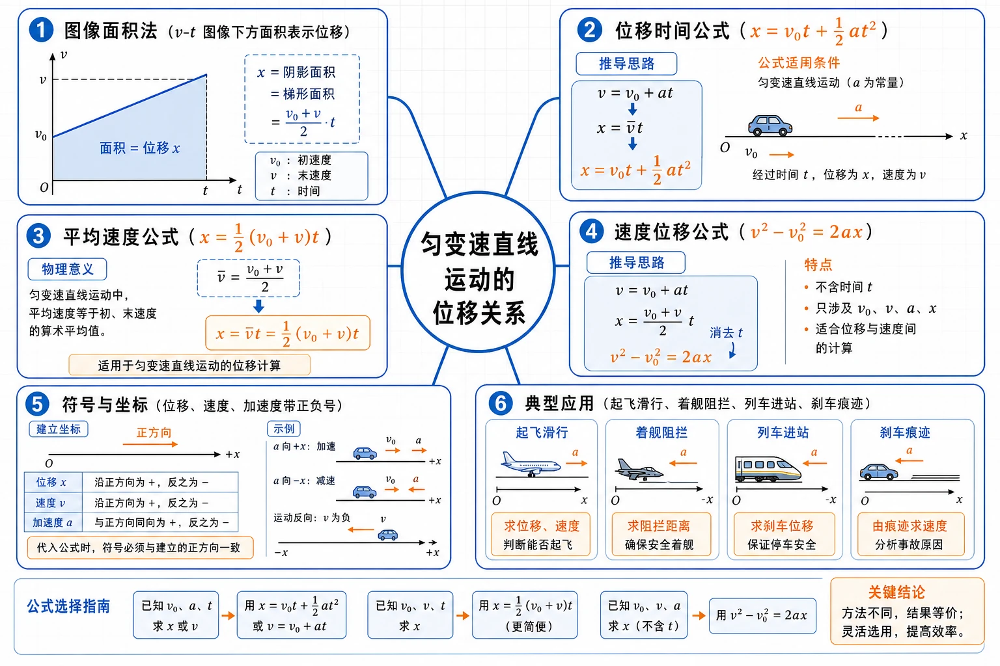
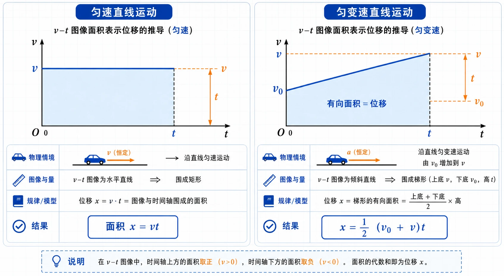
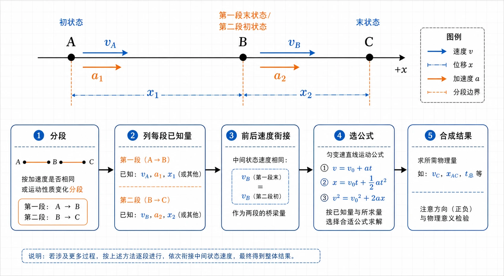
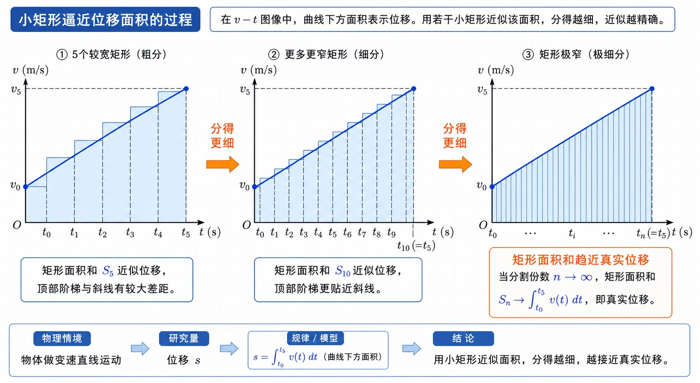

# 2.3 匀变速直线运动的位移与时间的关系

<!-- 图片描述：本节整体知识信息结构图。中心主题为“匀变速直线运动的位移关系”，向外分为六个分支：图像面积法（$v-t$ 图像下方面积表示位移）、位移时间公式（$x=v_0t+\frac{1}{2}at^2$）、平均速度公式（$x=\frac{1}{2}(v_0+v)t$）、速度位移公式（$v^2-v_0^2=2ax$）、符号与坐标（位移、速度、加速度带正负号）、典型应用（起飞滑行、着舰阻拦、列车进站、刹车痕迹）。白色或浅网格背景，黑灰坐标轴，蓝色表示速度图线和位移面积，橙色表示加速度、公式选择和关键结论。 -->

## 本节学习目标

学完本节，需要能做到：

- 理解 $v-t$ 图像与时间轴围成的有向面积表示位移。
- 会由梯形面积推出匀变速直线运动的位移与时间关系式 $x=v_0t+\dfrac{1}{2}at^2$。
- 知道初速度为 $0$ 时，位移公式可化为 $x=\dfrac{1}{2}at^2$。
- 掌握匀变速直线运动的平均速度关系 $x=\dfrac{1}{2}(v_0+v)t$。
- 会联立速度公式和位移公式，使用速度与位移关系式 $v^2-v_0^2=2ax$。
- 能根据题目是否涉及时间，选择合适的运动学公式。
- 能建立一维坐标系，正确处理位移、速度、加速度的正负号。
- 会分析起飞、降落、列车进站、刹车痕迹、返回舱减速等典型问题。

## 核心知识点讲解

### 一、知识对象与物理情境

上一节已经能用 $v=v_0+at$ 描述匀变速直线运动的速度怎样随时间变化。本节继续解决另一个核心问题：在一段时间内，物体发生了多大的位移？

匀速直线运动中，位移很容易计算：

$$
x=vt
$$

在 $v-t$ 图像中，这正好是一个矩形面积。匀变速直线运动的速度在变，不能简单用某一个瞬时速度乘以全过程时间，但仍然可以借助 $v-t$ 图像求位移。

本节的学习主线是：

1. 从匀速运动的矩形面积理解图像面积与位移的关系。
2. 把匀变速运动的 $v-t$ 图像看成梯形，推出位移公式。
3. 在不涉及时间的问题中，消去 $t$，得到速度与位移关系式。
4. 在实际题目中按已知量选公式，并始终处理好方向和正负号。

### 二、核心概念与物理意义

#### 1. $v-t$ 图像面积表示位移

在 $v-t$ 图像中，横轴是时间 $t$，纵轴是速度 $v$。若在很短时间 $\Delta t$ 内速度近似不变，则这一小段位移近似为：

$$
\Delta x\approx v\Delta t
$$

这正是图像中一个窄矩形的面积。把许多小矩形面积相加，就能得到全过程位移。时间分得越细，近似越精确。

对于匀变速直线运动，$v-t$ 图像是一条直线，图线与时间轴围成的图形通常是梯形，其有向面积就表示位移。

<!-- 图片描述：$v-t$ 图像面积表示位移的推导图。左侧为匀速直线运动，水平蓝色速度线与时间轴围成矩形，标注面积 $x=vt$。右侧为匀变速直线运动，蓝色斜直线从 $v_0$ 上升到 $v$，与时间轴围成梯形，梯形内部用浅蓝色填充并标注“有向面积 = 位移”。橙色虚线标出上底 $v$、下底 $v_0$、高 $t$，旁边写出 $x=\frac{1}{2}(v_0+v)t$。 -->

#### 2. 位移与位置的区别

若计时开始时物体在坐标原点，则 $t$ 时刻的位置坐标可以直接等于位移 $x$。如果计时开始时物体不在坐标原点，而在位置 $x_0$，则 $t$ 时刻的位置坐标与初位置的差才是位移：

$$
x-x_0=v_0t+\frac{1}{2}at^2
$$

在高中常见题中，如果没有特别说明，常把计时起点位置取为坐标原点，直接写位移为 $x$。

### 三、关键规律、公式与适用条件

#### 1. 平均速度形式的位移公式

匀变速直线运动的 $v-t$ 图像为直线，图像下方面积是梯形面积。若初速度为 $v_0$，末速度为 $v$，时间为 $t$，则位移为：

$$
x=\frac{1}{2}(v_0+v)t
$$

这也说明匀变速直线运动某段时间内的平均速度为：

$$
\bar v=\frac{x}{t}=\frac{v_0+v}{2}
$$

适用条件：这一平均速度公式只适用于匀变速直线运动，不能随便用于任意变速运动。

#### 2. 位移与时间关系式

由上一节速度公式：

$$
v=v_0+at
$$

代入 $x=\dfrac{1}{2}(v_0+v)t$：

$$
x=\frac{1}{2}(v_0+v_0+at)t
$$

整理得：

$$
x=v_0t+\frac{1}{2}at^2
$$

各量含义如下：

| 符号 | 物理意义 | 单位 | 方向属性 |
| --- | --- | --- | --- |
| $x$ | 位移 | $\text{m}$ | 矢量，一维中带正负号 |
| $v_0$ | 初速度 | $\text{m/s}$ | 矢量，带正负号 |
| $a$ | 加速度 | $\text{m/s}^2$ | 矢量，带正负号 |
| $t$ | 运动时间 | $\text{s}$ | 标量，通常为正 |

公式中 $v_0t$ 表示若物体一直以初速度匀速运动会产生的位移，$\dfrac{1}{2}at^2$ 表示加速度带来的位移修正。

若初速度为 $0$，则：

$$
x=\frac{1}{2}at^2
$$

此时位移与时间的平方成正比：时间变为原来的 $2$ 倍，位移变为原来的 $4$ 倍。

#### 3. 速度与位移关系式

有些问题没有时间信息，例如“已知速度变化和位移，求加速度”“已知刹车距离和加速度，求初速度”。这时可以消去时间。

由：

$$
v=v_0+at
$$

和：

$$
x=v_0t+\frac{1}{2}at^2
$$

联立消去 $t$，得到：

$$
v^2-v_0^2=2ax
$$

这个公式的特点是“不含时间”。当题目中已知量和未知量都不涉及 $t$ 时，它往往最简便。

### 四、典型模型与过程分析

#### 1. 公式选择模型

匀变速直线运动常用五个物理量：$v_0$、$v$、$a$、$t$、$x$。每个核心公式都少一个量：

| 公式 | 不含哪个量 | 适合情境 |
| --- | --- | --- |
| $v=v_0+at$ | 不含 $x$ | 求速度、时间、加速度，位移无关 |
| $x=v_0t+\dfrac{1}{2}at^2$ | 不含 $v$ | 已知初速度、加速度、时间求位移 |
| $x=\dfrac{1}{2}(v_0+v)t$ | 不含 $a$ | 已知初末速度和时间求位移 |
| $v^2-v_0^2=2ax$ | 不含 $t$ | 刹车距离、进站距离、速度与位移互求 |

选公式时先列已知量和未知量，再选择“不含无关量”的公式，不要凭题型硬套。

#### 2. 多过程模型

航母舰载机起飞、飞机着舰、动车进站、汽车刹车常常不是一个单一过程，而是分成几个匀变速过程。

分析多过程问题时：

1. 按运动状态变化分段。
2. 每段分别确定 $v_0$、$v$、$a$、$t$、$x$。
3. 注意前一段末速度通常是后一段初速度。
4. 每段都要建立统一正方向，带符号列式。

<!-- 图片描述：多过程匀变速运动分析流程图。上方是一条水平运动轨迹，标出 A、B、C 三个状态点：A 为初状态，B 为第一段末状态/第二段初状态，C 为末状态。第一段标注 $v_A$、$a_1$、$x_1$，第二段标注 $v_B$、$a_2$、$x_2$。下方用流程框写出“分段 -> 列每段已知量 -> 前后速度衔接 -> 选公式 -> 合成结果”。蓝色表示速度和位移，橙色表示加速度和分段边界。 -->

### 五、图像、实验与数据理解

#### 1. 梯形面积法

匀变速直线运动的 $v-t$ 图像为斜直线，图线与时间轴围成梯形。梯形的两条平行边分别对应 $v_0$ 和 $v$，高对应时间 $t$，所以：

$$
x=\frac{1}{2}(v_0+v)t
$$

如果图线在时间轴上方，面积表示正位移；如果图线在时间轴下方，面积表示负位移；如果图线穿过时间轴，要分段计算正负面积。

#### 2. 小矩形逼近法

把整个运动时间分成许多小段，每小段内速度近似不变，小段位移可用小矩形面积近似表示。小段越多、每段越窄，矩形面积之和越接近真实位移。对匀变速直线运动，极限结果就是梯形面积。

<!-- 图片描述：小矩形逼近位移面积的过程图。依次展示三幅 $v-t$ 图像：第一幅用 5 个较宽矩形近似斜线下方面积，矩形顶部呈明显阶梯；第二幅用更多更窄矩形，阶梯更贴近斜线；第三幅矩形极窄，整体趋近一个梯形，标注“矩形面积和趋近真实位移”。图中蓝色斜线表示速度随时间变化，浅蓝色矩形表示近似位移，橙色箭头表示“分得更细”。 -->

这种方法不只适用于匀变速直线运动。原则上，只要有 $v-t$ 图像，图线与时间轴围成的有向面积都能表示位移。只是匀变速直线运动的图形面积能用简单梯形公式直接计算。

### 六、题型应用与迁移

本节题型可以按“是否涉及时间”和“是否分段”来分类：

| 题型 | 识别信号 | 推荐方法 |
| --- | --- | --- |
| 已知时间求位移 | 给 $v_0$、$a$、$t$ | 用 $x=v_0t+\frac{1}{2}at^2$ |
| 已知初末速度和时间 | 给 $v_0$、$v$、$t$ | 用 $x=\frac{1}{2}(v_0+v)t$ |
| 不涉及时间 | 给速度、加速度、位移 | 用 $v^2-v_0^2=2ax$ |
| 刹车/停止 | 末速度为 $0$ | 先判断停止时间或用速度位移式 |
| 多过程运动 | 加速度、速度或运动阶段改变 | 分段列式，速度衔接 |

## 重点梳理

### 重点 1：$v-t$ 图像面积表示位移

为什么重要：这是位移公式的根源，也是处理复杂速度图像的通用方法。即使不能写出公式，也可以用图像面积求位移。

怎么用：

- 速度为正，面积为正位移。
- 速度为负，面积为负位移。
- 图像跨过时间轴，分成正负面积分别计算。
- 匀变速图像为直线，面积通常是矩形、三角形或梯形。

### 重点 2：位移与时间关系式

$$
x=v_0t+\frac{1}{2}at^2
$$

为什么重要：它直接回答“经过一段时间走了多远”这类问题。

使用条件：匀变速直线运动；同一正方向下带符号代入 $v_0$、$a$、$x$。

常见触发条件：题目给出初速度、加速度、运动时间，要求位移或位置变化。

### 重点 3：速度与位移关系式

$$
v^2-v_0^2=2ax
$$

为什么重要：它消去了时间，适合没有时间或不需要时间的问题。

常见触发条件：刹车痕迹长度、动车经过若干里程碑、已知位移和速度变化、求加速度或初速度。

易错提醒：虽然 $v$、$v_0$ 被平方，但 $a$ 和 $x$ 仍然要带正负号。

### 重点 4：公式选择比公式记忆更重要

把题目中的物理量先列出来：

- 有 $t$ 且求 $x$，优先考虑位移时间公式。
- 无 $t$，优先考虑速度位移公式。
- 有 $v_0$、$v$、$t$，优先用平均速度公式求位移。
- 多过程问题，先分段再选公式。

## 难点突破

### 难点 1：为什么变速运动也能用图像面积求位移

变速运动中，速度时时在变，但如果把时间分得足够短，每一小段内速度变化就很小，可以近似看作匀速。每一小段位移近似等于小矩形面积，所有小矩形面积之和就是总位移。

这是一种重要物理思想：把复杂变化过程分割成许多近似简单的小过程，再求和。分割越细，结果越接近真实值。

### 难点 2：位移公式里的 $\dfrac{1}{2}$ 从哪里来

匀变速直线运动中，速度从 $v_0$ 均匀变化到 $v$，平均速度为：

$$
\bar v=\frac{v_0+v}{2}
$$

所以：

$$
x=\bar vt=\frac{1}{2}(v_0+v)t
$$

再把 $v=v_0+at$ 代入，就得到：

$$
x=v_0t+\frac{1}{2}at^2
$$

因此 $\dfrac{1}{2}$ 本质上来自“匀变速过程中的平均速度”。

### 难点 3：速度位移公式中符号为什么容易错

公式 $v^2-v_0^2=2ax$ 中，速度平方会让速度方向信息部分丢失，但右边的 $a$ 和 $x$ 仍然必须反映方向。

例如刹车时取运动方向为正：

- $v_0>0$。
- $v=0$。
- $a<0$。
- 刹车位移沿运动方向，$x>0$。

此时左边 $0-v_0^2<0$，右边 $2ax<0$，符号一致。

### 难点 4：刹车问题为什么要先判断停止

刹车公式只描述汽车从开始刹车到停止前的运动。若汽车在 $5\ \text{s}$ 时已经停下，题目问 $8\ \text{s}$ 内的位移，实际运动时间只能取 $5\ \text{s}$。停下后的 $3\ \text{s}$ 不再增加位移。

可先用速度公式求停止时间，也可直接用 $v^2-v_0^2=2ax$ 求刹车距离。

### 难点 5：位移和路程不要混淆

匀变速直线运动公式中的 $x$ 是位移，不是路程。若物体一直沿同一方向运动，位移大小等于路程；若物体中途反向，路程要分段求各段位移大小再相加，不能直接用总位移代替。

## 例题讲解

### 例题 1：舰载机起飞滑行距离

**题目**：某舰载机起飞时，先由弹射装置获得 $10\ \text{m/s}$ 的速度，随后由发动机提供 $25\ \text{m/s}^2$ 的加速度，在航母跑道上匀加速前进 $2.4\ \text{s}$ 后离舰升空。求飞机匀加速滑行的距离。

**读题**：研究对象是飞机，研究过程是获得初速度后的匀加速滑行。

**选对象与过程**：飞机做匀加速直线运动，已知 $v_0$、$a$、$t$，求 $x$。

**建模型**：用位移与时间关系式：

$$
x=v_0t+\frac{1}{2}at^2
$$

**列方程与计算**：

$$
x=10\times2.4+\frac{1}{2}\times25\times(2.4)^2
$$

$$
x=24+72=96\ \text{m}
$$

**答案**：飞机匀加速滑行的距离为 $96\ \text{m}$。

**检查**：若忽略初速度只算 $\dfrac{1}{2}at^2$，会少算 $24\ \text{m}$，所以初速度不为 $0$ 时不能乱用简化式。

### 例题 2：飞机着舰阻拦过程

**题目**：飞机着舰时速度为 $80\ \text{m/s}$，钩住阻拦索后经过 $2.5\ \text{s}$ 停下来。把这段运动看成匀减速直线运动，求加速度大小和滑行距离。

**读题**：研究对象是飞机，研究过程是从着舰到停止。

**选对象与过程**：取飞机滑行方向为正方向，$v_0=80\ \text{m/s}$，$v=0$，$t=2.5\ \text{s}$。

**建模型**：先用 $v=v_0+at$ 求加速度，再用平均速度公式或位移时间公式求位移。

**列方程与计算**：

$$
a=\frac{v-v_0}{t}=\frac{0-80}{2.5}=-32\ \text{m/s}^2
$$

加速度大小为 $32\ \text{m/s}^2$，方向与滑行方向相反。

位移：

$$
x=\frac{1}{2}(v_0+v)t=\frac{1}{2}\times(80+0)\times2.5=100\ \text{m}
$$

**答案**：加速度大小为 $32\ \text{m/s}^2$，滑行距离为 $100\ \text{m}$。

**检查**：平均速度为 $40\ \text{m/s}$，运动 $2.5\ \text{s}$，位移 $100\ \text{m}$，合理。

### 例题 3：动车进站加速度与剩余距离

**题目**：动车经过某一里程碑时速度为 $126\ \text{km/h}$，又前进 $3\ \text{km}$ 后速度变为 $54\ \text{km/h}$。把动车进站过程看作匀减速直线运动，求动车进站的加速度；若之后继续以同一加速度减速，还要行驶多远才能停下来？

**读题**：题目不涉及时间，适合用速度与位移关系式。

**选对象与过程**：取动车运动方向为正方向。前一过程位移 $x_1=3000\ \text{m}$。

速度换算：

$$
126\ \text{km/h}=35\ \text{m/s},\qquad 54\ \text{km/h}=15\ \text{m/s}
$$

**建模型**：用 $v^2-v_0^2=2ax$。

**列方程与计算**：前一过程：

$$
a=\frac{v^2-v_0^2}{2x_1}=\frac{15^2-35^2}{2\times3000}
$$

$$
a=\frac{225-1225}{6000}=-0.167\ \text{m/s}^2
$$

后一过程从 $15\ \text{m/s}$ 减速到 $0$：

$$
0^2-15^2=2\times(-0.167)x_2
$$

$$
x_2\approx674\ \text{m}
$$

**答案**：动车进站的加速度大小约为 $0.167\ \text{m/s}^2$，方向与运动方向相反；还要行驶约 $674\ \text{m}$ 才能停下来。

**检查**：加速度为负说明减速；剩余距离为正，说明动车仍沿原方向前进。

### 例题 4：刹车痕迹反推初速度

**题目**：一辆汽车紧急刹车后停下，路面车轮滑动磨痕长度为 $22.5\ \text{m}$。已知车轮滑动时汽车做匀减速直线运动，加速度大小为 $5.0\ \text{m/s}^2$。求汽车刚开始刹车时的速度。

**读题**：已知刹车距离和加速度，求初速度，不涉及时间。

**选对象与过程**：取汽车原运动方向为正方向，$x=22.5\ \text{m}$，$a=-5.0\ \text{m/s}^2$，末速度 $v=0$。

**建模型**：用 $v^2-v_0^2=2ax$。

**列方程与计算**：

$$
0-v_0^2=2\times(-5.0)\times22.5
$$

$$
v_0^2=225
$$

$$
v_0=15\ \text{m/s}
$$

**答案**：汽车刚开始刹车时的速度为 $15\ \text{m/s}$，约为 $54\ \text{km/h}$。

**检查**：速度为正，方向沿原运动方向；数量级符合普通汽车行驶速度。

## 易错点整理

### 易错点 1：初速度不为 $0$ 时乱用 $x=\dfrac{1}{2}at^2$

**常见错误表现**：看到匀加速就直接写 $x=\dfrac{1}{2}at^2$。

**错因分析**：这个简化式只适用于 $v_0=0$ 的情况。若初速度不为 $0$，还要加上 $v_0t$。

**正确处理**：先判断初速度是否为 $0$。一般情况用 $x=v_0t+\dfrac{1}{2}at^2$。

### 易错点 2：把 $v-t$ 图像面积当成路程

**常见错误表现**：图线有一部分在时间轴下方时，把正负面积直接按正面积相加或全部当作路程。

**错因分析**：$v-t$ 图像的有向面积表示位移，时间轴下方的面积表示负位移。

**正确处理**：求位移时按正负面积代数相加；求路程时分段取面积绝对值再相加。

### 易错点 3：速度位移公式中忽略 $a$ 和 $x$ 的符号

**常见错误表现**：刹车题中把 $a$ 直接代入正值，导致算出负位移或无意义结果。

**错因分析**：加速度大小没有方向，公式中的 $a$ 是矢量在坐标轴上的分量。

**正确处理**：先规定正方向，刹车时若取运动方向为正，则 $a<0$，刹车位移 $x>0$。

### 易错点 4：刹车后继续按原公式运动

**常见错误表现**：汽车已经停止，还继续用匀减速公式算出反向位移。

**错因分析**：普通刹车模型只描述停止前的过程，停止后不再保持原加速度反向运动。

**正确处理**：先求停止时间或刹车距离；题目给出时间超过停止时间时，实际位移只算到停止时刻。

### 易错点 5：多过程问题不分段

**常见错误表现**：把两段加速度不同的运动合在一个公式中处理。

**错因分析**：匀变速公式要求加速度恒定。加速度改变时，已经不是同一个匀变速过程。

**正确处理**：按加速度、速度状态或运动条件改变的位置分段，每段单独列式，再用末速度和初速度衔接。

## 考点考证点整理

### 考点一：位移与时间关系式

- 出题思路：给出 $v_0$、$a$、$t$，求位移；或给出位移、时间、初速度，反求加速度。
- 关键条件：运动是匀变速直线运动，初速度是否为 $0$。
- 解答要点：写出 $x=v_0t+\dfrac{1}{2}at^2$，统一单位，带符号代入。
- 易扣分点：漏掉 $v_0t$；把加速度大小当作有方向的 $a$；单位不统一。

### 考点二：$v-t$ 图像面积求位移

- 出题思路：给出 $v-t$ 图像，要求求某段位移、比较位移大小或判断位移正负。
- 关键条件：图线位置在时间轴上方还是下方；图形是矩形、三角形、梯形还是组合图形。
- 解答要点：把图形面积转化为位移，必要时分段计算有向面积。
- 易扣分点：把面积误认为加速度；忽略时间轴下方对应负位移。

### 考点三：速度与位移关系式

- 出题思路：不提供时间，要求由速度变化和位移求加速度、由刹车距离求初速度、由加速度和位移求末速度。
- 关键条件：题目中没有时间或时间不是目标量。
- 解答要点：用 $v^2-v_0^2=2ax$，先规定正方向，再判断 $a$、$x$ 的符号。
- 易扣分点：速度单位未换算；忽略加速度方向；平方后丢失方向判断。

### 考点四：刹车与停止问题

- 出题思路：给出初速度和减速度，求停止时间、刹车距离、某段时间内位移，或由磨痕反推速度。
- 关键条件：末速度为 $0$；题目给出的时间是否超过停止时间。
- 解答要点：先求 $t_{\text{停}}$ 或直接用 $0-v_0^2=2ax$ 求刹车距离。
- 易扣分点：停止后继续套公式；把加速度大小代成正值。

### 考点五：分段匀变速运动

- 出题思路：航母起飞、列车进站、返回舱减速等情境中，运动分成多个阶段。
- 关键条件：每段加速度、位移、速度状态是否不同；前后过程速度是否衔接。
- 解答要点：画过程草图，分段列式，前一段末速度作为后一段初速度。
- 易扣分点：把不同加速度阶段合并；忘记换算 $\text{km/h}$ 与 $\text{m/s}$；漏掉方向说明。

## 练习题

### 基础训练

1. 写出匀变速直线运动的位移与时间关系式，并说明各物理量的单位。
2. 初速度为 $0$ 时，位移与时间关系式怎样简化？位移与时间有什么比例关系？
3. 写出速度与位移关系式，并说明它适合什么类型的问题。
4. 在 $v-t$ 图像中，图线与时间轴围成的面积表示什么？图线在时间轴下方时面积的符号怎样理解？
5. 匀变速直线运动中，为什么 $\bar v=\dfrac{v_0+v}{2}$？这个公式能否用于任意变速运动？

### 巩固训练

6. 以 $36\ \text{km/h}$ 的速度行驶的列车开始下坡，在坡路上的加速度为 $0.2\ \text{m/s}^2$，经过 $30\ \text{s}$ 到达坡底。求坡路长度和列车到达坡底时的速度。
7. 以 $18\ \text{m/s}$ 的速度行驶的汽车，制动后做匀减速直线运动，在 $3\ \text{s}$ 内前进 $36\ \text{m}$。求汽车的加速度，并求制动后 $5\ \text{s}$ 内发生的位移。
8. 两个物体在相同时间内从静止开始做匀加速直线运动，位移之比为 $x_1:x_2=3:5$。求它们的加速度之比。
9. 某物体初速度为 $6\ \text{m/s}$，末速度为 $14\ \text{m/s}$，运动时间为 $5\ \text{s}$。求这段位移。
10. 某物体速度由 $20\ \text{m/s}$ 减小到 $10\ \text{m/s}$，位移为 $150\ \text{m}$。求加速度。

### 提升训练

11. 某飞机滑跃式起飞过程可看作两段连续匀加速直线运动：前一段加速度为 $7.8\ \text{m/s}^2$，位移为 $180\ \text{m}$；后一段加速度为 $5.2\ \text{m/s}^2$，位移为 $15\ \text{m}$。若飞机从静止开始运动，求飞机离舰时的速度。
12. 返回舱距地面 $10\ \text{km}$ 时启动降落伞装置，速度减至 $10\ \text{m/s}$，随后以这个速度匀速下降。在距地面 $1.2\ \text{m}$ 时，缓冲发动机开始向下喷气，舱体再次减速。设最后 $1.2\ \text{m}$ 内返回舱做匀减速直线运动，到达地面时速度恰好为 $0$。求最后减速阶段的加速度。
13. 一辆汽车紧急刹车后停下，路面留下 $22.5\ \text{m}$ 的车轮滑动磨痕。已知车轮滑动时汽车的加速度大小为 $5.0\ \text{m/s}^2$，求汽车刚开始刹车时的速度。
14. 汽车以 $20\ \text{m/s}$ 行驶，刹车加速度为 $-4\ \text{m/s}^2$。分别求刹车后 $3\ \text{s}$ 内和 $8\ \text{s}$ 内的位移。
15. 某 $v-t$ 图像可描述为：$0$ 到 $6\ \text{s}$ 内，物体速度由 $2\ \text{m/s}$ 均匀增大到 $14\ \text{m/s}$。用图像面积法求这段时间内的位移。

## 练习题答案

### 基础训练答案

1. 位移与时间关系式为：

$$
x=v_0t+\frac{1}{2}at^2
$$

其中 $x$ 的单位为 $\text{m}$，$v_0$ 的单位为 $\text{m/s}$，$a$ 的单位为 $\text{m/s}^2$，$t$ 的单位为 $\text{s}$。$x$、$v_0$、$a$ 都要按规定正方向带符号代入。

2. 初速度为 $0$ 时，$v_0=0$，位移公式变为：

$$
x=\frac{1}{2}at^2
$$

若加速度恒定，位移与时间的平方成正比。

3. 速度与位移关系式为：

$$
v^2-v_0^2=2ax
$$

它适合不涉及时间的问题，如刹车距离、进站加速度、由位移和加速度求末速度等。

4. $v-t$ 图像与时间轴围成的有向面积表示位移。图线在时间轴上方时面积为正位移；图线在时间轴下方时面积为负位移。

5. 匀变速直线运动中，速度从 $v_0$ 均匀变化到 $v$，所以平均速度等于初末速度的平均值：

$$
\bar v=\frac{v_0+v}{2}
$$

这个公式只适用于匀变速直线运动，不能用于任意变速运动。

### 巩固训练答案

6. 先换单位：

$$
36\ \text{km/h}=10\ \text{m/s}
$$

坡路长度：

$$
x=v_0t+\frac{1}{2}at^2=10\times30+\frac{1}{2}\times0.2\times30^2
$$

$$
x=300+90=390\ \text{m}
$$

坡底速度：

$$
v=v_0+at=10+0.2\times30=16\ \text{m/s}
$$

列车通过坡路长度为 $390\ \text{m}$，到达坡底时速度为 $16\ \text{m/s}$。

7. 取汽车初速度方向为正方向，$v_0=18\ \text{m/s}$，$t=3\ \text{s}$，$x=36\ \text{m}$。

由：

$$
x=v_0t+\frac{1}{2}at^2
$$

得：

$$
36=18\times3+\frac{1}{2}a\times3^2
$$

$$
36=54+4.5a
$$

$$
a=-4\ \text{m/s}^2
$$

停止时间：

$$
0=18-4t
$$

$$
t=4.5\ \text{s}
$$

制动后 $5\ \text{s}$ 时汽车已经停止，所以位移只算到 $4.5\ \text{s}$：

$$
x=18\times4.5+\frac{1}{2}\times(-4)\times(4.5)^2
$$

$$
x=81-40.5=40.5\ \text{m}
$$

汽车加速度为 $-4\ \text{m/s}^2$，制动后 $5\ \text{s}$ 内位移为 $40.5\ \text{m}$。

8. 从静止开始匀加速，位移公式为：

$$
x=\frac{1}{2}at^2
$$

两个物体运动时间相同，所以位移与加速度成正比：

$$
\frac{x_1}{x_2}=\frac{a_1}{a_2}
$$

因此：

$$
a_1:a_2=3:5
$$

9. 已知初末速度和时间，用平均速度公式：

$$
x=\frac{1}{2}(v_0+v)t=\frac{1}{2}\times(6+14)\times5=50\ \text{m}
$$

10. 用速度与位移关系式：

$$
a=\frac{v^2-v_0^2}{2x}=\frac{10^2-20^2}{2\times150}
$$

$$
a=\frac{-300}{300}=-1\ \text{m/s}^2
$$

加速度为 $-1\ \text{m/s}^2$，方向与初速度方向相反。

### 提升训练答案

11. 第一段从静止开始：

$$
v_1^2-0=2a_1x_1=2\times7.8\times180=2808
$$

第二段：

$$
v_2^2-v_1^2=2a_2x_2=2\times5.2\times15=156
$$

所以：

$$
v_2^2=2808+156=2964
$$

$$
v_2\approx54.4\ \text{m/s}
$$

飞机离舰时的速度约为 $54.4\ \text{m/s}$。

12. 取向下为正方向，最后减速阶段初速度 $v_0=10\ \text{m/s}$，末速度 $v=0$，位移 $x=1.2\ \text{m}$。

由：

$$
v^2-v_0^2=2ax
$$

得：

$$
0-10^2=2a\times1.2
$$

$$
a=-\frac{100}{2.4}\ \text{m/s}^2\approx-41.7\ \text{m/s}^2
$$

加速度大小约为 $41.7\ \text{m/s}^2$，方向竖直向上。

13. 取汽车原运动方向为正方向，末速度 $v=0$，加速度 $a=-5.0\ \text{m/s}^2$，位移 $x=22.5\ \text{m}$。

$$
0-v_0^2=2\times(-5.0)\times22.5
$$

$$
v_0^2=225
$$

$$
v_0=15\ \text{m/s}
$$

汽车刚开始刹车时速度为 $15\ \text{m/s}$，约为 $54\ \text{km/h}$。

14. 先求停止时间：

$$
0=20-4t
$$

$$
t=5\ \text{s}
$$

刹车后 $3\ \text{s}$ 内，汽车还未停止：

$$
x=20\times3+\frac{1}{2}\times(-4)\times3^2=60-18=42\ \text{m}
$$

刹车后 $8\ \text{s}$ 内，汽车已在 $5\ \text{s}$ 时停止，实际位移为刹车距离：

$$
x=20\times5+\frac{1}{2}\times(-4)\times5^2=100-50=50\ \text{m}
$$

15. $v-t$ 图像下方面积是梯形面积：

$$
x=\frac{1}{2}(v_0+v)t=\frac{1}{2}\times(2+14)\times6=48\ \text{m}
$$

这段时间内位移为 $48\ \text{m}$。
