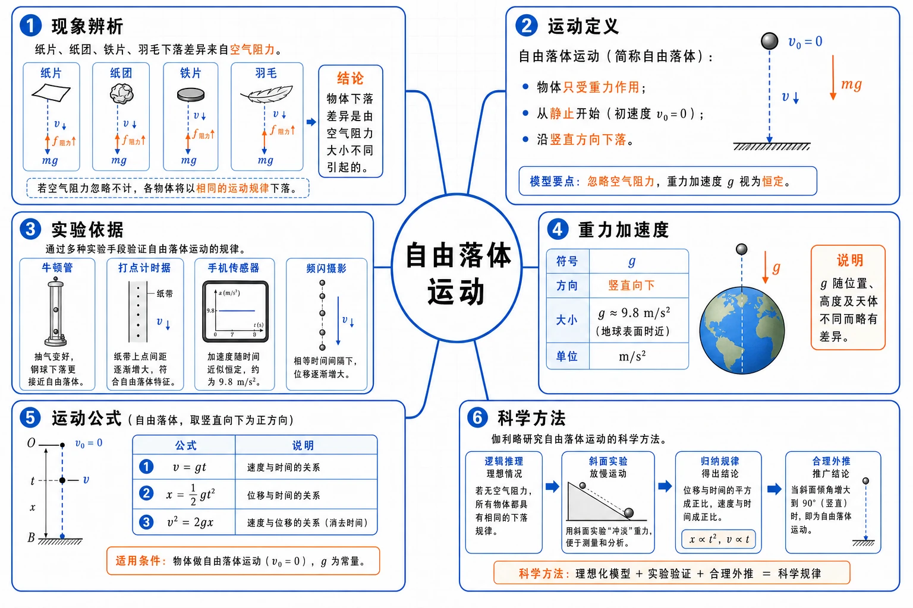
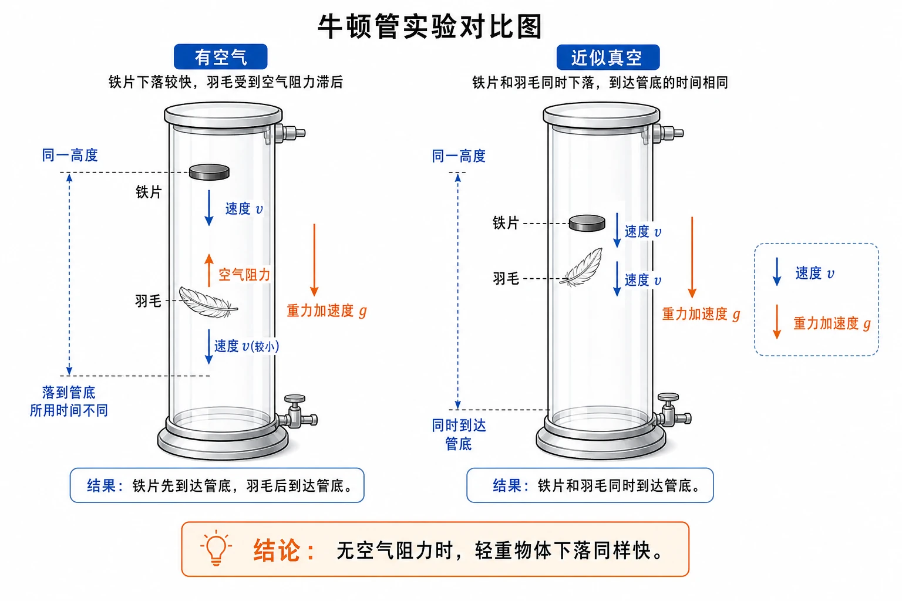
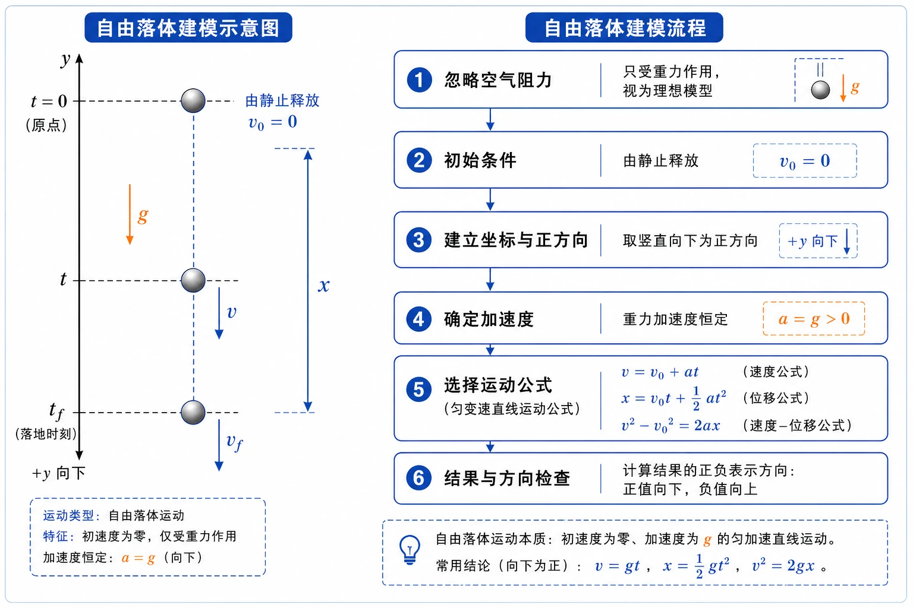
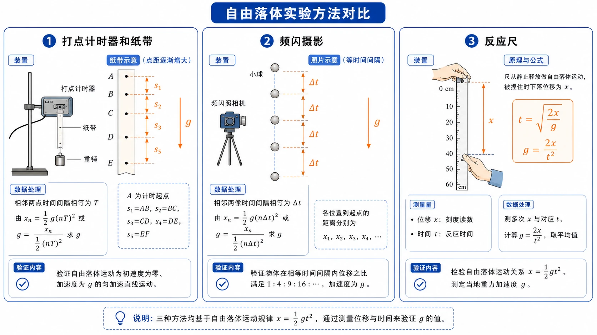

## 相关知识

[[2.1 实验：探究小车速度随时间变化的规律]]
[[2.2 匀变速直线运动的速度与时间的关系]]
[[2.3 匀变速直线运动的位移与时间的关系]]

# 2.4 自由落体运动

<!-- 图片描述：本节整体知识信息结构图。中心主题为“自由落体运动”，向外分为六个分支：现象辨析（纸片、纸团、铁片、羽毛下落差异来自空气阻力）、运动定义（只受重力、从静止开始、竖直下落）、实验依据（牛顿管、打点计时器、手机传感器、频闪摄影）、重力加速度（$g$、方向竖直向下、大小约 $9.8\ \text{m/s}^2$）、运动公式（$v=gt$、$x=\frac{1}{2}gt^2$、$v^2=2gx$）、科学方法（伽利略逻辑推理、斜面实验、合理外推）。白色或浅网格背景，黑灰实验装置轮廓，蓝色表示速度和下落轨迹，橙色表示重力加速度、空气阻力和关键结论。 -->

## 本节学习目标

学完本节，需要能做到：

- 理解自由落体运动的定义和理想化条件。
- 能解释纸片、纸团、羽毛、铁片下落快慢不同的原因。
- 知道忽略空气阻力时，同一地点轻重不同物体自由下落的加速度相同。
- 理解自由落体加速度也叫重力加速度，用 $g$ 表示，方向竖直向下。
- 掌握自由落体运动公式 $v=gt$、$x=\dfrac{1}{2}gt^2$、$v^2=2gx$。
- 会用自由落体公式求速度、时间、高度、反应时间和估算量。
- 能说明打点计时器、频闪摄影、手机传感器等方法怎样研究自由落体。
- 理解伽利略研究自由落体中“逻辑推理、数学演算、实验验证、合理外推”的科学方法。

## 核心知识点讲解

### 一、知识对象与物理情境

日常生活中，一块石头通常比一片纸下落得快。这个现象很容易让人得出“重的物体下落快，轻的物体下落慢”的结论。但如果把纸片揉成紧密纸团，再和橡皮同时释放，纸团下落明显变快。这说明下落快慢不只由轻重决定，空气阻力也在起作用。

本节要研究的问题是：如果排除空气阻力，只让物体在重力作用下从静止开始下落，它的运动规律是什么？

自由落体运动是一个理想化模型。它把复杂现实中的空气阻力先忽略掉，只保留重力这个主要因素，从而得到清晰的运动规律。理想化不是脱离现实，而是为了抓住主要矛盾。

### 二、核心概念与物理意义

#### 1. 自由落体运动的定义

物体只在重力作用下，从静止开始下落的运动，叫作自由落体运动。

定义中有三个关键词：

| 关键词 | 含义 | 判断提醒 |
| --- | --- | --- |
| 只受重力 | 不受空气阻力或空气阻力可忽略 | 羽毛、纸片、降落伞通常不能直接看作自由落体 |
| 从静止开始 | 初速度 $v_0=0$ | 向下抛出、向上抛出都不是本节定义下的自由落体 |
| 下落运动 | 加速度方向竖直向下 | 通常取竖直向下为正方向 |

严格的自由落体运动只有在真空中才能发生。在空气中，如果空气阻力相对重力很小，物体下落可以近似看作自由落体运动。

#### 2. 空气阻力与下落快慢

空气阻力对轻、薄、面积大的物体影响更明显。例如纸片下落慢，主要不是因为它“轻”，而是因为它展开面积大、空气阻力影响大。把纸片揉成纸团后，空气阻力变小，下落就会明显加快。

牛顿管实验可以更直接地说明这一点：有空气时，羽毛和铁片下落快慢不同；抽去空气后，羽毛和铁片几乎同时下落。结论是：如果没有空气阻力，轻重不同物体下落得同样快。

<!-- 图片描述：牛顿管实验对比图。左侧管内标注“有空气”，铁片下落较快、羽毛受空气阻力明显滞后，橙色向上箭头表示空气阻力；右侧管内标注“近似真空”，铁片和羽毛从同一高度同时下落并处在同一水平位置，蓝色向下箭头表示速度，橙色向下箭头表示重力加速度 $g$。整体采用清晰实验装置示意风格，白色背景，黑灰玻璃管轮廓。 -->

### 三、关键规律、公式与适用条件

#### 1. 自由落体加速度

在同一地点，一切物体自由下落的加速度都相同。这个加速度叫作自由落体加速度，也叫重力加速度，通常用 $g$ 表示。

重力加速度的方向竖直向下。大小一般取：

$$
g=9.8\ \text{m/s}^2
$$

粗略计算时常取：

$$
g=10\ \text{m/s}^2
$$

$g=9.8\ \text{m/s}^2$ 的物理意义是：自由下落物体的速度每经过 $1\ \text{s}$ 增加约 $9.8\ \text{m/s}$，方向竖直向下。

精确测量发现，不同地点的 $g$ 略有不同。一般从赤道到两极，$g$ 有逐渐增大的趋势；同一地点附近，普通高中计算通常把 $g$ 看成常量。

#### 2. 自由落体公式

自由落体运动是初速度为 $0$、加速度为 $g$ 的匀加速直线运动。把一般匀变速公式中的 $v_0=0$、$a=g$ 代入，就得到：

速度与时间关系：

$$
v=gt
$$

位移与时间关系：

$$
x=\frac{1}{2}gt^2
$$

速度与位移关系：

$$
v^2=2gx
$$

这些公式通常默认取竖直向下为正方向，此时 $g$、$v$、$x$ 为正。若取竖直向上为正方向，则 $a=-g$，要使用匀变速直线运动的一般公式并带符号计算。

#### 3. 位移与时间平方关系

由：

$$
x=\frac{1}{2}gt^2
$$

可知自由落体下落高度与时间平方成正比：

$$
x\propto t^2
$$

这意味着下落时间变为原来的 $2$ 倍，下落高度变为原来的 $4$ 倍；时间变为原来的 $3$ 倍，高度变为原来的 $9$ 倍。

### 四、典型模型与过程分析

#### 1. 自由落体建模步骤

处理自由落体问题时，可以按以下步骤：

1. 判断是否能忽略空气阻力。
2. 判断是否从静止开始。
3. 取竖直向下为正方向。
4. 写出 $v_0=0$、$a=g$。
5. 根据题目已知量选择 $v=gt$、$x=\dfrac{1}{2}gt^2$ 或 $v^2=2gx$。
6. 检查单位、方向和数量级。

<!-- 图片描述：自由落体建模流程图。左侧是一颗小球从高处由静止释放，竖直向下的蓝色轨迹上标出 $t=0$、$t$ 时刻和下落位移 $x$；橙色向下箭头标注 $g$，蓝色向下箭头标注速度 $v$。右侧流程框依次写“忽略空气阻力 -> $v_0=0$ -> 取向下为正 -> $a=g$ -> 选公式 -> 检查方向”。白色背景，黑灰坐标轴，蓝色运动量，橙色加速度。 -->

#### 2. 伽利略的研究路径

伽利略对自由落体的研究不是直接从公式开始的，而是经历了清晰的方法链：

- 逻辑反驳：指出“重物一定比轻物下落快”会导致自相矛盾。
- 提出猜想：排除空气阻力后，轻重不同物体应下落一样快。
- 建立概念：研究运动需要平均速度、瞬时速度、加速度等概念。
- 数学推论：若速度随时间均匀变化，则从静止开始的位移满足 $x\propto t^2$。
- 实验替代：直接研究落体太快，于是用斜面运动延长时间，相当于“冲淡”重力。
- 合理外推：斜面倾角逐渐增大，极限情形接近竖直下落，从而推断自由落体是匀加速运动。

这个过程体现了物理学的重要方法：批判经验结论、抓住主要因素、用可测实验检验数学猜想。

### 五、图像、实验与数据理解

#### 1. 打点计时器研究自由落体

固定打点计时器，让纸带一端系着重物，纸带穿过计时器。启动计时器后释放重物，纸带上会留下间距逐渐增大的点迹。

这些点迹说明：

- 相邻点时间间隔相等。
- 点距逐渐增大，说明速度逐渐增大。
- 可仿照小车实验计算不同计数点的速度，再求加速度。
- 改变重物质量重复实验，若加速度近似相同，说明自由落体加速度与质量无关。

#### 2. 手机传感器与加速度图像

智能手机的加速度传感器可以记录不同方向的加速度变化。让手机短暂自由下落时，竖直方向加速度图线会出现一段接近 $-10\ \text{m/s}^2$ 或 $10\ \text{m/s}^2$ 的数值，符号取决于软件坐标轴规定。

接住手机时，图线上还会出现一个方向相反的峰值，这是手机被手减速时的加速度。这个实验提醒我们：加速度的正负号首先取决于坐标轴方向。

#### 3. 频闪摄影与反应尺

频闪摄影每隔相等时间记录一次物体位置。自由落体照片中相邻位置间距逐渐增大，可用于求速度、加速度或验证 $x\propto t^2$。

反应时间测量尺利用的是自由落体公式：

$$
x=\frac{1}{2}gt^2
$$

尺子从静止开始下落，手捏住时读出的下落距离 $x$ 可换算为反应时间：

$$
t=\sqrt{\frac{2x}{g}}
$$

<!-- 图片描述：自由落体实验方法对比图。横向排列三种方法：左侧为打点计时器和纸带，纸带点距逐渐增大；中间为频闪照片，小球等时间间隔位置逐渐拉开，并标注 $\Delta t$；右侧为反应尺，手在某刻度处捏住下落直尺，旁边写 $t=\sqrt{2x/g}$。统一白色背景，蓝色表示轨迹和速度，橙色标出 $g$、$\Delta t$ 和关键公式。 -->

### 六、题型应用与迁移

自由落体题常见五类：

| 题型 | 识别信号 | 常用公式 | 关键提醒 |
| --- | --- | --- | --- |
| 已知时间求速度 | 给 $t$，求 $v$ | $v=gt$ | 方向向下 |
| 已知时间求高度 | 给 $t$，求 $x$ | $x=\frac{1}{2}gt^2$ | 时间要平方 |
| 已知高度求速度 | 给 $x$，求 $v$ | $v^2=2gx$ | 不必先求时间 |
| 反应尺/频闪 | 给距离或相邻时间 | $x=\frac{1}{2}gt^2$、$v\approx\frac{\Delta x}{\Delta t}$ | 单位要换成米和秒 |
| 估算类问题 | 井深、曝光时间、连拍时间 | 按自由落体近似 | 说明忽略条件和偏差方向 |

## 重点梳理

### 重点 1：自由落体是理想化模型

自由落体不是“所有下落运动”的同义词。只有满足“只受重力、从静止开始”的下落运动，才是严格自由落体。在空气中，只有阻力影响很小时，才能近似看作自由落体。

为什么重要：很多判断题会用纸片、羽毛、降落伞、被向下抛出的物体来混淆定义。

### 重点 2：重力加速度 $g$

$g$ 的方向竖直向下，单位是 $\text{m/s}^2$。一般计算取 $9.8\ \text{m/s}^2$，粗略计算可取 $10\ \text{m/s}^2$。

为什么重要：自由落体的所有公式都来自 $v_0=0$、$a=g$。如果正方向选错或 $g$ 的符号处理错，计算结果会错。

### 重点 3：自由落体公式来自匀变速公式

一般匀变速公式：

$$
v=v_0+at
$$

$$
x=v_0t+\frac{1}{2}at^2
$$

$$
v^2-v_0^2=2ax
$$

自由落体中 $v_0=0$、$a=g$，所以变为：

$$
v=gt,\qquad x=\frac{1}{2}gt^2,\qquad v^2=2gx
$$

常见触发条件：题目写“由静止释放”“不计空气阻力”“自由下落”，就可以考虑自由落体模型。

### 重点 4：伽利略方法的学习价值

伽利略不是简单“做实验得结论”，而是把逻辑推理、数学关系和实验检验结合起来。特别是斜面实验体现了物理研究中“把难以直接测量的问题转化为可测问题”的思想。

## 难点突破

### 难点 1：轻重不同的物体为什么能下落一样快

在没有空气阻力时，同一地点所有物体自由下落的加速度都是 $g$，与质量无关。重物受到的重力更大，但质量也更大；轻物受到的重力更小，质量也更小，最终加速度相同。

本阶段可先把这作为实验结论掌握：忽略空气阻力时，轻重不同物体从同一高度由静止释放，会同时落地。

### 难点 2：纸片、纸团、羽毛题怎样回答

答题时要把“重力”和“空气阻力”分开：

- 纸片展开时，空气阻力相对重力影响大，下落慢。
- 纸片揉成纸团后，受空气阻力影响减小，下落变快。
- 近似真空中，羽毛和铁片都只受重力作用，下落一样快。

不能只写“纸片轻所以慢”。这会把现象原因归错。

### 难点 3：自由落体公式中的方向怎样处理

若取竖直向下为正方向，$g$ 取正，$x$ 取正，$v$ 取正，公式最简洁。

若取竖直向上为正方向，则加速度为 $-g$。例如从静止释放：

$$
v=0+(-g)t=-gt
$$

负号表示速度方向向下。两种坐标取法都可以，但不能混用。

### 难点 4：井深估算为什么偏大

从井口释放石块后，听到落水声的总时间包括两部分：石块下落时间和声音从水面传回井口的时间。

如果把总时间全部当作石块下落时间，代入 $x=\dfrac{1}{2}gt^2$，就把下落时间估大了，因此井深估算偏大。

### 难点 5：频闪照片怎样测加速度

频闪照片中，每次闪光间隔相等。可用两类方法：

- 位移法：从释放点起，测不同时刻下落距离，验证 $x\propto t^2$，再由 $x=\dfrac{1}{2}gt^2$ 求 $g$。
- 速度法：用相邻位置间隔估算某时刻速度，再看速度是否随时间均匀增加，由 $a=\dfrac{\Delta v}{\Delta t}$ 求 $g$。

## 例题讲解

### 例题 1：由时间求速度和高度

**题目**：小球从静止开始自由下落，取 $g=10\ \text{m/s}^2$，求下落 $2\ \text{s}$ 后的速度和下落高度。

**读题**：研究对象是小球，研究过程是从静止释放后的 $2\ \text{s}$。

**选对象与过程**：忽略空气阻力，小球做自由落体运动。

**建模型**：取竖直向下为正方向，$v_0=0$、$a=g$。

**列方程与计算**：

$$
v=gt=10\times2=20\ \text{m/s}
$$

$$
x=\frac{1}{2}gt^2=\frac{1}{2}\times10\times2^2=20\ \text{m}
$$

**答案**：速度为 $20\ \text{m/s}$，方向竖直向下；下落高度为 $20\ \text{m}$。

**检查**：$2\ \text{s}$ 内速度每秒约增加 $10\ \text{m/s}$，结果合理。

### 例题 2：由高度求落地速度

**题目**：小球从 $20\ \text{m}$ 高处由静止自由下落，取 $g=10\ \text{m/s}^2$，不计空气阻力，求落地速度。

**分析**：题目不问时间，用 $v^2=2gx$ 更直接。

**步骤**：

$$
v^2=2gx=2\times10\times20=400
$$

$$
v=20\ \text{m/s}
$$

**答案**：落地速度为 $20\ \text{m/s}$，方向竖直向下。

**反思**：若题目不涉及时间，优先考虑速度位移关系。

### 例题 3：跳水连拍时间间隔

**题目**：跳水运动员从 $5\ \text{m}$ 跳台双脚朝下由静止下落。某同学用手机连拍，测得两张连续照片中运动员双脚离水面的高度分别为 $3.4\ \text{m}$ 和 $1.8\ \text{m}$。取 $g=10\ \text{m/s}^2$，估算手机连拍时间间隔。

**分析**：两张照片对应的下落距离分别为：

$$
x_1=5.0-3.4=1.6\ \text{m}
$$

$$
x_2=5.0-1.8=3.2\ \text{m}
$$

自由落体满足 $x=\dfrac{1}{2}gt^2$，可先求两个时刻，再求时间差。

**步骤**：

$$
t_1=\sqrt{\frac{2x_1}{g}}=\sqrt{\frac{2\times1.6}{10}}\approx0.57\ \text{s}
$$

$$
t_2=\sqrt{\frac{2x_2}{g}}=\sqrt{\frac{2\times3.2}{10}}=0.80\ \text{s}
$$

$$
\Delta t=t_2-t_1\approx0.23\ \text{s}
$$

**答案**：手机连拍时间间隔约为 $0.23\ \text{s}$。

**反思**：题中给的是“离水面高度”，要先转化为“已下落高度”。

### 例题 4：井深估算与误差方向

**题目**：从井口释放小石块，经过 $2.5\ \text{s}$ 后听到击水声。忽略声音传播时间，取 $g=10\ \text{m/s}^2$，估算井口到水面的距离，并判断结果偏大还是偏小。

**分析**：忽略声音传播时间时，把 $2.5\ \text{s}$ 全当作石块下落时间。

**步骤**：

$$
x=\frac{1}{2}gt^2=\frac{1}{2}\times10\times(2.5)^2=31.25\ \text{m}
$$

**答案**：估算距离约为 $31\ \text{m}$。真实下落时间小于 $2.5\ \text{s}$，所以估算结果偏大。

**反思**：估算题不只要算数值，还要说明忽略条件带来的误差方向。

### 例题 5：反应时间测量尺

**题目**：直尺从静止开始下落，某同学在直尺下落 $5.0\ \text{cm}$ 处捏住。取 $g=10\ \text{m/s}^2$，估算该同学反应时间。

**分析**：直尺近似自由落体，下落距离 $x=0.050\ \text{m}$。

**步骤**：

$$
x=\frac{1}{2}gt^2
$$

$$
0.050=\frac{1}{2}\times10\times t^2
$$

$$
t^2=0.010
$$

$$
t=0.10\ \text{s}
$$

**答案**：反应时间约为 $0.10\ \text{s}$。

**反思**：反应尺的时间刻度不是均匀分布的，因为 $x\propto t^2$。

## 易错点整理

### 易错点 1：认为重物一定比轻物下落快

**常见错误表现**：只根据石头比纸片下落快，就说“质量越大下落越快”。

**错因分析**：没有排除空气阻力影响。纸片下落慢主要是空气阻力相对较大。

**正确处理**：说明“在忽略空气阻力时，同一地点不同物体自由下落加速度相同”。

### 易错点 2：把所有下落运动都当作自由落体

**常见错误表现**：把降落伞下降、纸片飘落、向下抛出的球都直接用 $v=gt$。

**错因分析**：自由落体要求只受重力且从静止开始。

**正确处理**：先判断空气阻力是否可忽略、初速度是否为 $0$。不满足时，用一般匀变速模型或其他模型。

### 易错点 3：漏写 $g$ 的方向

**常见错误表现**：只写 $g=9.8\ \text{m/s}^2$，不说明方向。

**错因分析**：加速度是矢量，方向对正负号和运动判断很重要。

**正确处理**：写明 $g$ 方向竖直向下；若建立坐标轴，按正方向确定 $g$ 的正负。

### 易错点 4：$x=\dfrac{1}{2}gt^2$ 中忘记时间平方

**常见错误表现**：把下落高度误算成 $\dfrac{1}{2}gt$。

**错因分析**：把位移公式和速度公式混淆。

**正确处理**：速度随时间一次方变化，位移随时间平方变化：$v=gt$，$x=\dfrac{1}{2}gt^2$。

### 易错点 5：井深问题忽略声音时间后不判断偏差

**常见错误表现**：算出井深后不说明估算偏大还是偏小。

**错因分析**：没有意识到总时间不是纯下落时间。

**正确处理**：总时间包含声音传播时间。把总时间当下落时间会使下落时间偏大，井深估算偏大。

### 易错点 6：频闪和连拍题中弄错时间间隔个数

**常见错误表现**：第 $5$ 次闪光就乘以 $5\Delta t$。

**错因分析**：如果从释放瞬间算第 $1$ 次记录，到第 $5$ 次记录只经历 $4$ 个时间间隔。

**正确处理**：先数清“位置点个数”和“时间间隔个数”的关系，再计算总时间。

## 考点考证点整理

### 考点一：自由落体定义与条件

- 出题思路：给出多个下落情境，判断是否为自由落体或近似自由落体。
- 关键条件：只受重力、初速度为 $0$、空气阻力可忽略。
- 解答要点：先说明定义，再指出题目中是否满足条件。
- 易扣分点：把所有下落都当作自由落体；忽略“从静止开始”。

### 考点二：空气阻力现象解释

- 出题思路：比较纸片、纸团、羽毛、铁片、橡皮等下落快慢。
- 关键条件：空气阻力大小与形状、迎风面积、速度有关；真空中阻力可忽略。
- 解答要点：说明日常差异主要由空气阻力造成；近似真空时不同质量物体下落一样快。
- 易扣分点：只用“轻重”解释现象，不提空气阻力。

### 考点三：自由落体公式计算

- 出题思路：由时间求速度/高度，由高度求时间/落地速度，或求反应时间。
- 关键条件：$v_0=0$，$a=g$，通常取向下为正。
- 解答要点：按已知量选择 $v=gt$、$x=\dfrac{1}{2}gt^2$、$v^2=2gx$。
- 易扣分点：时间忘记平方；$g$ 取值不按题意；速度方向漏写。

### 考点四：实验与图像数据

- 出题思路：用纸带、频闪照片、手机传感器、反应尺等材料考查自由落体规律。
- 关键条件：等时间间隔、下落距离、速度近似、加速度图像方向。
- 解答要点：用 $x\propto t^2$、$v\approx\dfrac{\Delta x}{\Delta t}$ 或 $a=\dfrac{\Delta v}{\Delta t}$ 分析。
- 易扣分点：把相邻位置间隔当成相等位移；不换算厘米和米。

### 考点五：科学方法与伽利略研究

- 出题思路：要求说明伽利略如何反驳旧观点、为什么用斜面实验、怎样外推到自由落体。
- 关键条件：逻辑推理、实验验证、数学关系、理想化和外推。
- 解答要点：指出“实验和逻辑推理结合”，斜面实验用于延长运动时间，便于测量。
- 易扣分点：只写结论，不说明方法；把斜面实验误解为与落体运动无关。

## 练习题

### 基础训练

1. 什么是自由落体运动？它需要满足哪几个条件？
2. 自由落体加速度又叫什么？符号、方向和常用大小分别是什么？
3. 写出自由落体运动的三个基本公式，并说明通常选哪个方向为正方向。
4. 为什么纸片比纸团下落慢不能说明“轻物一定下落慢”？
5. 自由落体下落高度与时间有什么比例关系？

### 巩固训练

6. 小球从静止开始自由下落，取 $g=10\ \text{m/s}^2$，求下落 $2\ \text{s}$ 后的速度和下落高度。
7. 小球从 $45\ \text{m}$ 高处自由下落，取 $g=10\ \text{m/s}^2$，求落地时间。
8. 小球自由下落，落地速度为 $30\ \text{m/s}$，取 $g=10\ \text{m/s}^2$，求下落高度。
9. 直尺从静止开始下落，某同学在直尺下落 $5.0\ \text{cm}$ 处捏住，取 $g=10\ \text{m/s}^2$，求该同学反应时间。
10. 近似真空中，羽毛和铁片从同一高度同时由静止释放。它们谁先落地？为什么？

### 提升训练

11. 跳水运动员从 $5\ \text{m}$ 跳台双脚朝下由静止自由下落，取 $g=10\ \text{m/s}^2$，估算入水前速度。
12. 跳水运动员从 $5\ \text{m}$ 跳台由静止下落。某两张连续照片中，运动员双脚离水面的高度分别为 $3.4\ \text{m}$ 和 $1.8\ \text{m}$。取 $g=10\ \text{m/s}^2$，估算手机连拍时间间隔。
13. 从井口释放石块，$2.5\ \text{s}$ 后听到落水声。忽略声音传播时间，取 $g=10\ \text{m/s}^2$，估算井深，并说明结果偏大还是偏小。
14. 频闪仪每隔 $0.04\ \text{s}$ 闪光一次。若从释放瞬间算第 $1$ 次记录，到第 $5$ 次记录时，小球经历了多少时间？下落距离约是多少？取 $g=10\ \text{m/s}^2$。
15. 为估测照相机曝光时间，实验者拍摄石子自由下落时留下的模糊径迹。若曝光瞬间附近石子速度约为 $7.0\ \text{m/s}$，照片换算出的实际模糊径迹长度约为 $7.0\ \text{cm}$，估算曝光时间。
16. 伽利略为什么不直接测自由落体，而要研究小球沿斜面滚下？这种做法体现了什么科学方法？

## 练习题答案

### 基础训练答案

1. 物体只在重力作用下，从静止开始下落的运动叫自由落体运动。条件是：只受重力、初速度为 $0$、空气阻力不存在或可忽略。

2. 自由落体加速度也叫重力加速度，用 $g$ 表示，方向竖直向下。一般计算取 $9.8\ \text{m/s}^2$，粗略计算常取 $10\ \text{m/s}^2$。

3. 自由落体公式为：

$$
v=gt
$$

$$
x=\frac{1}{2}gt^2
$$

$$
v^2=2gx
$$

通常取竖直向下为正方向。

4. 纸片展开时受空气阻力影响大，下落慢；揉成纸团后空气阻力影响减小，下落变快。这个现象说明空气阻力对下落快慢有重要影响，不能只用轻重解释。

5. 自由落体从静止开始，有 $x=\dfrac{1}{2}gt^2$，所以下落高度与时间平方成正比，即 $x\propto t^2$。

### 巩固训练答案

6. 速度：

$$
v=gt=10\times2=20\ \text{m/s}
$$

高度：

$$
x=\frac{1}{2}gt^2=\frac{1}{2}\times10\times2^2=20\ \text{m}
$$

答案：速度为 $20\ \text{m/s}$，方向竖直向下；下落高度为 $20\ \text{m}$。

7. 由 $x=\dfrac{1}{2}gt^2$：

$$
45=\frac{1}{2}\times10\times t^2
$$

$$
45=5t^2
$$

$$
t=3\ \text{s}
$$

落地时间为 $3\ \text{s}$。

8. 由 $v^2=2gx$：

$$
x=\frac{v^2}{2g}=\frac{30^2}{2\times10}=45\ \text{m}
$$

下落高度为 $45\ \text{m}$。

9. 先换单位：$5.0\ \text{cm}=0.050\ \text{m}$。

$$
0.050=\frac{1}{2}\times10\times t^2
$$

$$
t^2=0.010
$$

$$
t=0.10\ \text{s}
$$

反应时间约为 $0.10\ \text{s}$。

10. 它们同时落地。近似真空中空气阻力可以忽略，羽毛和铁片都只受重力作用，在同一地点自由落体加速度相同。

### 提升训练答案

11. 由 $v^2=2gx$：

$$
v^2=2\times10\times5=100
$$

$$
v=10\ \text{m/s}
$$

入水前速度约为 $10\ \text{m/s}$，方向竖直向下。

12. 两张照片对应的下落高度分别为：

$$
x_1=5.0-3.4=1.6\ \text{m}
$$

$$
x_2=5.0-1.8=3.2\ \text{m}
$$

由 $x=\dfrac{1}{2}gt^2$ 得：

$$
t_1=\sqrt{\frac{2x_1}{g}}=\sqrt{\frac{3.2}{10}}\approx0.57\ \text{s}
$$

$$
t_2=\sqrt{\frac{2x_2}{g}}=\sqrt{\frac{6.4}{10}}=0.80\ \text{s}
$$

所以连拍时间间隔约为：

$$
\Delta t=t_2-t_1\approx0.23\ \text{s}
$$

13. 忽略声音传播时间时：

$$
x=\frac{1}{2}\times10\times(2.5)^2=31.25\ \text{m}
$$

估算井深约为 $31\ \text{m}$。由于总时间还包括声音向上传播的时间，真实下落时间小于 $2.5\ \text{s}$，所以估算结果偏大。

14. 从第 $1$ 次记录到第 $5$ 次记录经历 $4$ 个时间间隔：

$$
t=4\times0.04=0.16\ \text{s}
$$

下落距离：

$$
x=\frac{1}{2}\times10\times(0.16)^2=0.128\ \text{m}
$$

下落距离约为 $0.128\ \text{m}$，即 $12.8\ \text{cm}$。

15. 曝光时间内石子运动形成模糊径迹。若曝光时间很短，可近似认为这一小段内速度不变：

$$
\Delta t\approx\frac{\Delta x}{v}
$$

模糊径迹长度 $7.0\ \text{cm}=0.070\ \text{m}$，所以：

$$
\Delta t\approx\frac{0.070}{7.0}=0.010\ \text{s}
$$

曝光时间约为 $0.010\ \text{s}$。

16. 自由落体下落很快，伽利略时代的计时工具难以直接测量短时间内的运动。斜面运动能减小加速度，使运动时间变长，便于测量。这个做法体现了把难以直接研究的问题转化为可测实验的问题，再通过合理外推认识原问题的科学方法。
